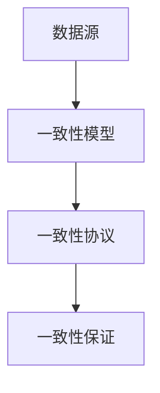
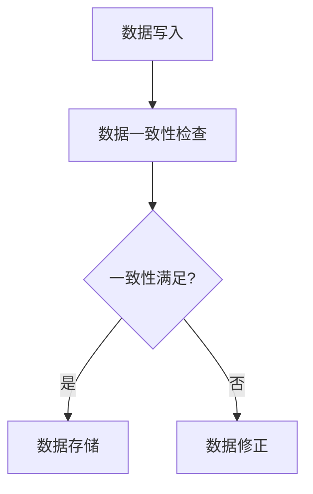
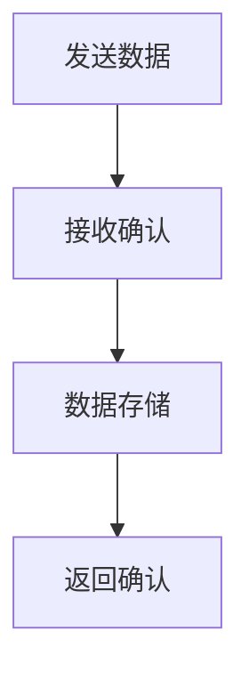
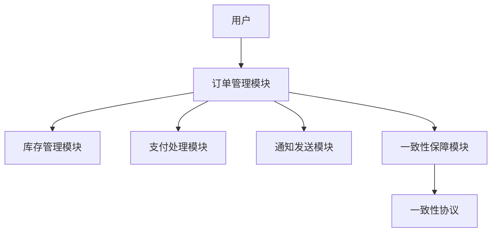
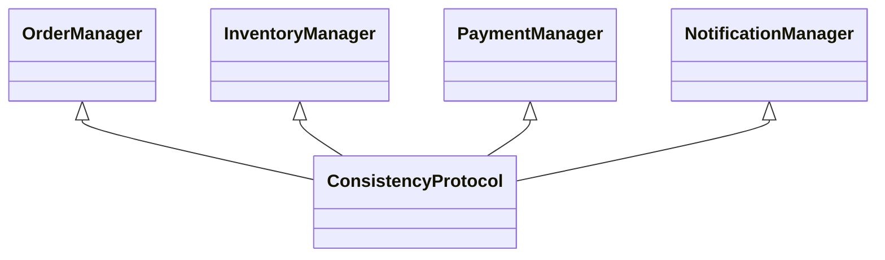
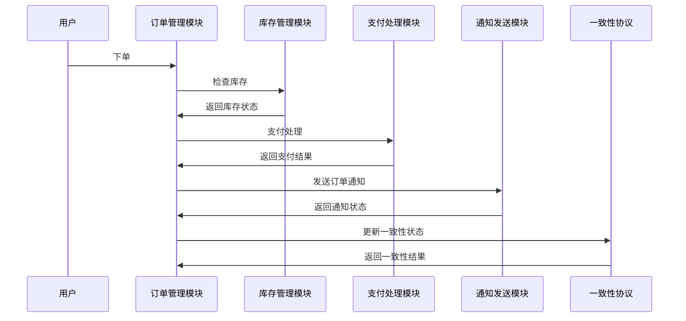

                 

### 前言

## 《数据一致性模型与实现》简介

> 关键词：数据一致性、模型、实现、分布式系统、一致性协议

**摘要：** 本文旨在深入探讨数据一致性的概念、模型及其实现机制。通过对数据一致性的背景、核心概念、模型原理、协议机制以及实际应用的系统分析与架构设计，全面解析如何在分布式系统中保障数据的一致性。本文以逻辑清晰、结构紧凑的方式，结合实际案例，旨在为读者提供丰富的理论和实践知识。

**书籍目的与读者定位：**

本书旨在为那些在分布式系统开发和运维中关注数据一致性的专业人士提供一本实用的参考手册。它适用于以下读者群体：

- **软件工程师与系统架构师：** 需要理解和实现数据一致性机制，以构建高可用、高可靠的分布式系统。
- **数据库管理员与运维工程师：** 想深入了解数据一致性的保障机制及其在数据库系统中的应用。
- **研究人员与学者：** 对分布式数据一致性问题有深入研究兴趣，希望掌握最新的研究动态和实践经验。

**数据一致性的重要性：**

在分布式系统中，数据一致性是一个至关重要的问题。不一致的数据可能会导致系统错误、数据丢失以及业务中断。因此，保障数据一致性是确保系统稳定运行的关键。以下是一些数据一致性的重要性体现：

- **系统稳定性：** 数据一致性可以确保系统在多节点环境中稳定运行，减少因数据不一致导致的问题。
- **业务连续性：** 在高并发、高负载的场景中，数据一致性可以保障业务连续性，提高用户满意度。
- **数据可靠性：** 数据一致性有助于维护数据的准确性、完整性，提高数据的可靠性。

**全书结构概述：**

本书分为五个主要章节，每个章节都有明确的主题和目标。以下是全书结构的概述：

- **第1章 背景介绍**：介绍数据一致性的背景、问题及其重要性，为后续章节的深入探讨打下基础。
- **第2章 核心概念与联系**：阐述数据一致性的核心概念及其相互关系，通过表格和实体关系图进行详细说明。
- **第3章 数据一致性模型原理讲解**：深入分析数据一致性模型的数学原理和实现机制，提供具体的算法流程和Python代码实现。
- **第4章 数据一致性协议讲解**：介绍数据一致性协议的数学定义、协议机制及其Python代码实现。
- **第5章 系统分析与架构设计**：结合实际问题场景，展示系统功能设计、架构设计和接口设计，并通过mermaid图进行详细说明。

通过本书的逐步讲解，读者将能够全面理解数据一致性的概念、模型和实现机制，掌握如何在分布式系统中保障数据的一致性，从而提升系统的稳定性、可靠性和业务连续性。

### 第1章 背景介绍

## 数据一致性的问题背景

### 数据一致性的定义

数据一致性是指在分布式系统中，多个节点或组件访问和操作同一数据时，能够保持数据在所有节点上的一致状态。数据一致性问题主要涉及以下几个方面：

1. **原子性（Atomicity）**：确保事务的完整性和不可分割性，即事务要么全部成功执行，要么全部失败回滚。
2. **一致性（Consistency）**：确保系统状态从一个合法状态转换到另一个合法状态，即系统在任何时刻都能保持一致的逻辑状态。
3. **隔离性（Isolation）**：确保并发事务之间的相互隔离，即一个事务在执行过程中不受其他事务的影响。
4. **持久性（Durability）**：确保已提交的事务对系统的改变是持久的，即使在系统发生故障时也不会丢失。

在分布式系统中，数据一致性是确保系统稳定运行和业务可靠性的关键。然而，随着系统规模的扩大和复杂性的增加，保障数据一致性变得越来越具有挑战性。

### 数据不一致性的危害

数据不一致性可能带来的问题多种多样，以下是一些主要危害：

1. **数据丢失**：在分布式系统中，数据不一致可能导致某些节点的数据丢失，从而影响系统的完整性和可靠性。
2. **系统错误**：不一致的数据可能导致系统错误，甚至导致系统崩溃。例如，一个订单可能会在某个节点上记录成功支付，而在另一个节点上记录失败。
3. **业务中断**：数据不一致可能导致业务中断，影响用户体验和公司声誉。例如，银行账户余额不一致可能导致客户投诉和损失。
4. **性能下降**：为了保障数据一致性，系统可能需要引入额外的同步机制，这可能导致系统性能下降。

### 数据不一致性的表现形式

数据不一致性可以表现为以下几种形式：

1. **读-写冲突**：当一个事务在读取数据的同时，另一个事务修改了数据，导致最终数据不一致。
2. **写-写冲突**：当多个事务同时修改同一数据，而没有协调机制时，可能导致数据最终不一致。
3. **数据复制延迟**：在分布式系统中，数据可能在多个节点之间复制，由于网络延迟或节点故障，可能导致数据不一致。
4. **并发控制不足**：如果系统的并发控制机制不足，可能导致事务相互干扰，进而导致数据不一致。

### 数据不一致性的原因分析

数据不一致性的原因可以从以下几个方面进行分析：

1. **分布式系统的特性**：分布式系统的去中心化和高并发性使得数据一致性变得更加复杂。
2. **网络问题**：网络延迟、网络故障等因素可能导致数据传输失败或数据丢失。
3. **节点故障**：节点故障可能导致数据不一致，例如，某个节点宕机可能导致数据无法及时同步。
4. **软件缺陷**：软件缺陷可能导致数据操作失败或数据不一致。

### 数据一致性的解决方案

为了解决数据不一致性问题，常见的解决方案包括以下几种：

1. **分布式事务**：通过分布式事务管理来保证数据的一致性。分布式事务通常采用两阶段提交（2PC）或三阶段提交（3PC）协议。
2. **消息队列**：通过消息队列来异步处理数据操作，降低读写冲突和数据复制延迟。
3. **一致性协议**：采用一致性协议来保障数据的一致性，如Paxos、Raft等。
4. **一致性哈希**：采用一致性哈希算法来平衡数据分布，降低数据不一致性风险。
5. **备份与恢复**：通过备份和恢复机制来确保数据的一致性和可靠性。

### 解决数据不一致性的挑战

尽管存在多种解决方案，但解决数据不一致性仍然面临以下挑战：

1. **性能与一致性的权衡**：在分布式系统中，保障数据一致性往往需要引入额外的同步机制，这可能导致系统性能下降。
2. **分布式事务的复杂性**：分布式事务管理复杂，需要解决事务的一致性、隔离性和持久性问题。
3. **一致性协议的适应性**：一致性协议需要适应不同的应用场景和系统需求，这可能增加系统的复杂性和维护成本。
4. **故障处理**：在分布式系统中，节点故障和数据丢失是常见问题，如何高效地处理故障和数据恢复是保证数据一致性的关键。

通过上述分析，可以看出数据一致性是分布式系统中的一个重要问题。在接下来的章节中，我们将深入探讨数据一致性的核心概念、模型和实现机制，为解决这一难题提供实用的指导和策略。

### 第1章 背景介绍

## 数据不一致性的解决方案

在了解了数据不一致性的表现形式及其危害之后，我们需要探讨如何有效地解决这一问题。以下是一些常见的数据一致性解决方案：

### 1. 分布式事务

分布式事务是通过协调多个节点上的操作来确保数据的一致性。常见的分布式事务协议包括两阶段提交（2PC）和三阶段提交（3PC）。

#### 两阶段提交（2PC）

两阶段提交是一种分布式事务管理协议，通过协调事务协调者（Coordinator）和参与者（Participants）之间的通信来实现事务的原子性。两阶段提交分为两个阶段：

1. **投票阶段**：事务协调者向所有参与者发送投票请求，参与者根据当前状态对事务进行预提交或预回滚投票。
2. **提交阶段**：事务协调者根据参与者的投票结果决定是提交事务还是回滚事务。如果所有参与者都投票预提交，则事务协调者向所有参与者发送提交指令；如果存在参与者投票预回滚，则事务协调者向所有参与者发送回滚指令。

#### 三阶段提交（3PC）

三阶段提交是对两阶段提交的改进，通过引入超时机制来提高事务的可靠性。三阶段提交分为三个阶段：

1. **准备阶段**：事务协调者向所有参与者发送准备请求，参与者根据当前状态决定是否准备提交事务。
2. **决断阶段**：事务协调者根据参与者的准备响应决定是否继续执行事务。如果所有参与者都准备提交，则事务协调者发送提交请求；如果存在参与者准备回滚，则事务协调者发送回滚请求。
3. **提交阶段**：参与者根据事务协调者的指令执行事务提交或回滚。

### 2. 消息队列

消息队列是一种异步处理数据操作的机制，通过消息中间件实现分布式系统的解耦。消息队列可以有效地降低读写冲突和数据复制延迟，从而提升系统的数据一致性。

#### 常见消息队列系统

- **RabbitMQ**：是一种开源的消息队列中间件，支持多种消息传递协议，如AMQP、MQTT等。
- **Kafka**：是一种高吞吐量的分布式消息队列系统，常用于大数据处理和实时流处理场景。
- **ActiveMQ**：是一种基于JMS（Java消息服务）规范的开源消息队列系统，支持多种消息传递模型和传输协议。

#### 消息队列在数据一致性中的应用

通过消息队列，可以将数据操作转化为消息传递，从而实现异步处理。以下是一个简单的应用场景：

1. **发送消息**：当用户在系统中提交订单时，将订单数据作为消息发送到消息队列。
2. **处理消息**：订单处理服务从消息队列中读取订单消息，执行订单处理逻辑。
3. **确认消息**：订单处理完成后，向消息队列发送确认消息。

通过消息队列，可以有效地解耦订单提交和订单处理过程，降低读写冲突和数据复制延迟，从而提升系统的数据一致性。

### 3. 一致性协议

一致性协议是一种分布式算法，用于在多个节点之间同步状态，确保数据一致性。以下是一些常见的一致性协议：

#### Paxos算法

Paxos算法是一种经典的分布式一致性算法，用于在多个节点之间达成一致决策。Paxos算法通过提议者（Proposer）、接受者（Acceptor）和学习者（Learner）三个角色的协作，实现分布式系统的状态机同步。

#### Raft算法

Raft算法是一种改进的分布式一致性算法，相比Paxos算法更加简洁、易于理解。Raft算法通过领导者（Leader）、跟随者（Follower）和候选人（Candidate）三个角色的协作，实现分布式系统的状态机同步。

#### 共识算法在数据一致性中的应用

通过一致性协议，可以在多个节点之间同步状态，确保数据一致性。以下是一个简单的应用场景：

1. **状态更新**：当一个节点需要更新状态时，向一致性协议提出更新请求。
2. **一致性决策**：一致性协议通过多个节点的协作，决定状态更新的结果。
3. **状态同步**：一致性协议将决定的结果同步到所有节点。

通过一致性协议，可以确保分布式系统中的状态一致，从而提升系统的数据一致性。

### 总结

数据一致性是分布式系统中的一个重要问题，解决数据不一致性需要多种技术手段。分布式事务、消息队列和一致性协议是常见的解决方案，通过合理地应用这些技术，可以有效地保障分布式系统的数据一致性。在接下来的章节中，我们将继续探讨数据一致性的核心概念、模型和实现机制，为解决这一难题提供更深入的指导。

### 第1章 背景介绍

## 数据一致性的边界与外延

### 数据一致性与数据完整性

数据一致性和数据完整性是两个密切相关但又有区别的概念。数据完整性是指数据在存储、处理和传输过程中保持完整、准确和可靠的特性。数据一致性则是在多个节点或组件之间保持数据状态的统一性。以下从几个方面分析数据一致性与数据完整性的关系：

1. **数据完整性与数据一致性的联系**：
   - 数据一致性是保障数据完整性的一种手段。在一个分布式系统中，如果多个节点之间的数据状态不一致，那么数据的完整性就难以得到保证。
   - 数据完整性包括物理完整性和逻辑完整性。物理完整性指的是数据在存储和传输过程中不丢失、不损坏；逻辑完整性指的是数据的语义和业务规则的正确性。

2. **数据完整性与数据一致性的区别**：
   - 数据完整性关注的是单个节点上的数据是否完整，而数据一致性关注的是多个节点之间的数据是否一致。
   - 数据完整性更多地依赖于数据存储和处理的机制，如数据校验、备份和恢复策略等；数据一致性则依赖于分布式系统中的协调机制，如分布式事务、一致性协议等。

### 数据一致性与数据可靠性

数据可靠性是指数据在存储、处理和传输过程中保持可信度和可用性的特性。数据一致性是数据可靠性的重要组成部分，但数据可靠性还包括其他方面：

1. **数据一致性与数据可靠性的联系**：
   - 数据一致性是保障数据可靠性的关键因素之一。在一个分布式系统中，如果数据不一致，那么数据的可靠性就会受到严重影响。
   - 数据一致性可以减少数据丢失、错误和重复的风险，从而提高数据的可靠性。

2. **数据一致性与数据可靠性的区别**：
   - 数据可靠性更广泛地涵盖了数据的完整性、一致性、可用性、持久性等多个方面；数据一致性只是其中的一部分。
   - 数据可靠性的保障需要从系统设计、实现和运维等多个层面进行，包括数据备份、故障恢复、数据校验等策略。

### 数据一致性的核心要素组成

保障数据一致性需要关注以下几个核心要素：

1. **一致性模型**：一致性模型定义了数据一致性的一系列规则和约束，如强一致性、最终一致性等。
2. **一致性协议**：一致性协议是确保数据一致性的具体实现机制，如Paxos、Raft等。
3. **数据复制与同步**：数据复制和同步机制是确保多个节点之间数据状态一致的必要手段，如分布式事务、消息队列等。
4. **故障处理与恢复**：故障处理和恢复机制是确保系统在发生故障时能够恢复数据一致性，如两阶段提交、三阶段提交等。

通过以上分析，我们可以看出数据一致性是分布式系统中一个复杂但至关重要的方面。在接下来的章节中，我们将深入探讨数据一致性的核心概念、模型和实现机制，为解决这一难题提供更深入的指导。

### 第1章 背景介绍

## 数据一致性的核心要素组成

在探讨数据一致性的解决方案时，我们必须关注其核心要素的组成，这些要素是保障数据一致性的基础。以下是数据一致性的核心要素及其具体组成部分：

### 1. 一致性模型

一致性模型定义了数据一致性的一系列规则和约束，是保障数据一致性的理论基础。常见的一致性模型包括：

1. **强一致性（Strong Consistency）**：强一致性要求系统在任何时刻都能提供一致的数据视图，类似于单机环境中的数据一致性。强一致性有严格的事务一致性要求，如原子性、一致性、隔离性和持久性（ACID）。
2. **最终一致性（Eventual Consistency）**：最终一致性允许系统在一段时间后达到一致性，但不保证实时一致性。最终一致性适用于高可用性和高扩展性的分布式系统，如某些NoSQL数据库。

### 2. 一致性协议

一致性协议是确保数据一致性的具体实现机制，通过多个节点之间的协作来达成一致。常见的一致性协议包括：

1. **Paxos协议**：Paxos协议是一种分布式一致性算法，用于在一个分布式系统中达成一致决策。Paxos协议通过提议者（Proposer）、接受者（Acceptor）和学习者（Learner）三个角色的协作，实现分布式系统的状态机同步。
2. **Raft协议**：Raft协议是一种改进的分布式一致性算法，相比Paxos算法更加简洁、易于理解。Raft协议通过领导者（Leader）、跟随者（Follower）和候选人（Candidate）三个角色的协作，实现分布式系统的状态机同步。

### 3. 数据复制与同步

数据复制与同步机制是确保多个节点之间数据状态一致的必要手段。常见的数据复制与同步机制包括：

1. **主从复制（Master-Slave Replication）**：主从复制是一种单主复制模型，其中只有一个节点作为主节点，负责处理所有写操作，而从节点则从主节点复制数据。主从复制能够提高系统的可用性和可靠性，但可能会导致写操作延迟。
2. **多主复制（Master-Master Replication）**：多主复制模型允许多个节点同时作为主节点处理写操作，系统会自动选择一个主节点作为当前活动主节点。多主复制能够提高系统的写入性能，但需要解决数据一致性问题，如Paxos或Raft等一致性协议。

### 4. 故障处理与恢复

故障处理与恢复机制是确保系统在发生故障时能够恢复数据一致性的关键。常见故障处理与恢复机制包括：

1. **心跳检测**：通过定期发送心跳消息来检测节点的健康状况，当发现节点故障时，可以触发故障转移或节点恢复过程。
2. **故障转移（Failover）**：在主从复制模型中，当主节点发生故障时，系统会自动将活动主节点切换到从节点，从而确保系统的高可用性。
3. **数据恢复**：在发生故障后，系统需要从备份或日志中恢复数据，以确保数据的一致性和完整性。

### 总结

通过上述分析，我们可以看出数据一致性的核心要素包括一致性模型、一致性协议、数据复制与同步机制以及故障处理与恢复机制。这些要素相互作用，共同保障了分布式系统中的数据一致性。在接下来的章节中，我们将进一步探讨这些核心要素的具体实现机制和应用场景，为解决数据一致性难题提供更深入的指导。

### 第2章 核心概念与联系

## 数据一致性的核心概念原理

在深入探讨数据一致性的实现机制之前，我们需要明确数据一致性的核心概念。这些概念不仅为我们理解数据一致性的本质提供了理论基础，而且也是设计一致性和协议的关键。

### 1. 分布式事务

分布式事务是数据一致性讨论中的一个核心概念。它涉及在分布式环境中执行一系列操作，这些操作要么全部成功，要么全部失败。分布式事务通常需要跨越多个节点，因此其复杂性远远超过单机事务。

#### 原子性（Atomicity）

原子性是分布式事务的最基本要求，它确保事务中的所有操作要么全部完成，要么全部取消。这意味着事务内部的操作不可分割，任何一个操作的失败都会导致整个事务回滚。

#### 一致性（Consistency）

一致性确保事务执行后系统状态从一种合法状态转换到另一种合法状态。分布式系统的一致性要求比单机系统更加复杂，因为多个节点可能同时参与事务。

#### 隔离性（Isolation）

隔离性确保并发事务不会互相干扰，每个事务看起来是独立执行的。在分布式系统中，隔离性是保证数据一致性的关键。

#### 持久性（Durability）

持久性确保事务一旦提交，其对系统状态的影响就会永久保存，即使在系统发生故障时也不会丢失。

### 2. 一致性协议

一致性协议是一系列算法和协议，用于在分布式系统中保证多个节点之间的状态一致性。以下是一些常见的一致性协议：

#### Paxos协议

Paxos协议是一种分布式一致性算法，用于在多个节点之间达成一致决策。Paxos协议的核心思想是通过提议者（Proposer）、接受者（Acceptor）和学习者（Learner）三个角色的协作，实现分布式系统的状态机同步。

#### Raft协议

Raft协议是一种改进的分布式一致性算法，它通过领导者（Leader）、跟随者（Follower）和候选人（Candidate）三个角色的协作，实现分布式系统的状态机同步。相比Paxos协议，Raft协议更加简洁，易于理解和实现。

### 3. 数据复制与同步

数据复制与同步是分布式系统中实现数据一致性的关键机制。以下是一些常见的数据复制与同步技术：

#### 主从复制（Master-Slave Replication）

主从复制是一种单主复制模型，其中只有一个节点作为主节点，负责处理所有写操作，而从节点则从主节点复制数据。这种模型可以提高系统的可用性和可靠性，但可能会引入写操作延迟。

#### 多主复制（Master-Master Replication）

多主复制模型允许多个节点同时作为主节点处理写操作。系统会自动选择一个主节点作为当前活动主节点。这种模型可以提高写入性能，但需要解决数据一致性问题，如使用一致性协议。

### 数据一致性的概念属性特征对比表格

以下是一个数据一致性的概念属性特征对比表格，列出一致性保证模型和一致性协议的主要特征：

| 特征               | 一致性保证模型 | 一致性协议        |
|--------------------|----------------|------------------|
| 实现方式           | 分布式事务     | 同步/异步消息传递 |
| 适用场景           | 高性能要求     | 大规模数据系统   |
| 难点               | 事务处理复杂   | 消息传递延迟     |

通过上述对比表格，我们可以更直观地理解一致性保证模型和一致性协议的异同点，从而选择适合特定场景的实现方案。

### 数据一致性的ER实体关系图架构

数据一致性的实现涉及到多个实体和关系的交互，以下是一个简化的ER实体关系图，展示了数据一致性模型中的关键实体和关系：



在这个ER实体关系图中，数据源是所有数据操作的起点，一致性模型和一致性协议是确保数据一致性的核心机制，而一致性保证是最终的目标。

通过理解这些核心概念，我们可以为后续章节中的具体实现机制打下坚实的基础。

### 数据一致性的ER实体关系图架构

为了更好地理解和设计数据一致性模型，我们使用ER（Entity-Relationship）实体关系图来展示数据一致性模型中的关键实体和关系。以下是一个简化的ER实体关系图，用于描述数据一致性的核心组成部分：


在这个ER实体关系图中，每个实体和关系都有明确的定义和作用：

- **数据源（Data Source）**：数据源是所有数据操作的起点，可以是数据库、消息队列或其他数据存储系统。数据源负责生成和存储数据，为一致性模型提供基础数据。
- **一致性模型（Consistency Model）**：一致性模型定义了数据一致性的一系列规则和约束，是确保数据一致性的理论框架。常见的模型包括强一致性、最终一致性等。
- **一致性协议（Consistency Protocol）**：一致性协议是一系列算法和协议，用于在分布式系统中实现一致性模型。常见的协议有Paxos、Raft等，它们通过节点之间的协作确保数据一致。
- **一致性保证（Consistency Guarantee）**：一致性保证是数据一致性模型和协议的实现目标，确保系统在任何时刻都能提供一致的数据视图。

通过这个ER实体关系图，我们可以清晰地看到数据一致性模型中的关键实体和它们之间的关系。在设计和实现数据一致性系统时，我们可以根据这个图来识别和实现各个实体和关系的具体机制。

### 第3章 数据一致性模型原理讲解

## 数据一致性模型的数学模型和公式

在深入探讨数据一致性模型的原理时，数学模型和公式是我们理解其工作原理的重要工具。以下将详细介绍数据一致性模型的数学定义和约束条件。

### 1. 一致性模型的数学定义

数据一致性模型可以用一组数学公式来定义，这些公式描述了数据在不同状态之间的转换规则。一个基本的一致性模型可以定义如下：

$$
X \equiv Y \pmod{Z}
$$

这个公式表示，如果X和Y对Z取模的结果相同，则X和Y在一致性意义上是相等的。在这里，X和Y代表系统的两个状态，Z是一个定义了一致性边界的一致性参数。

### 2. 一致性模型的约束条件

为了确保数据的一致性，我们需要为一致性模型设置一系列约束条件。以下是几个关键的约束条件：

- **原子性约束**：确保事务中的所有操作要么全部成功，要么全部失败。这可以通过两阶段提交（2PC）或三阶段提交（3PC）协议来实现。
- **一致性约束**：确保系统状态从一个合法状态转换到另一个合法状态。这通常通过定义状态转换规则来实现，例如：
  $$
  S_{new} = f(S_{current}, O)
  $$
  其中，$S_{new}$是新的系统状态，$S_{current}$是当前系统状态，$O$是操作。

- **隔离性约束**：确保并发事务之间的相互隔离。这可以通过隔离级别（如读未提交、读已提交、可重复读、串行化）来实现。

- **持久性约束**：确保已提交的事务对系统的改变是持久的。这通常通过日志记录和备份机制来实现。

### 3. 一致性模型的数学公式示例

以下是一个简单的示例，说明如何使用数学公式来描述一致性模型：

假设我们有一个银行账户系统，其中每个账户的状态可以用余额（Balance）表示。我们定义一致性约束如下：

$$
B_{new} = B_{current} + O
$$

其中，$B_{new}$是账户的新余额，$B_{current}$是账户的当前余额，$O$是账户的操作（如存款或取款）。

如果我们希望确保账户的余额在所有节点上一致，我们可以使用以下一致性公式：

$$
B_{node1} \equiv B_{node2} \pmod{Z}
$$

这里，$B_{node1}$和$B_{node2}$是不同节点上账户的余额，$Z$是一个小的非负整数，用于定义一致性的精度。

### 4. 实例说明

为了更直观地理解一致性模型的数学公式，我们来看一个简单的银行账户一致性保障的例子：

假设一个账户在两个节点（Node1和Node2）上都有余额记录。当我们向账户中存款100元时，我们希望确保两个节点的余额记录一致。

操作前状态：
- Node1的余额：B1 = 100元
- Node2的余额：B2 = 100元

操作后状态：
- Node1的余额：B1' = 100 + 100 = 200元
- Node2的余额：B2' = 100 + 100 = 200元

为了确保一致性，我们使用以下一致性公式：

$$
B1' \equiv B2' \pmod{Z}
$$

如果我们定义$Z = 1$（即精度为1元），则：

$$
200 \equiv 200 \pmod{1}
$$

这意味着两个节点的余额在新状态下是一致的。

通过这个例子，我们可以看到如何使用数学模型和公式来描述和验证数据一致性模型。在接下来的部分，我们将使用mermaid流程图进一步展示数据一致性模型的具体实现过程。

### 第3章 数据一致性模型原理讲解

## 数据一致性模型mermaid流程图

为了直观地展示数据一致性模型的工作流程，我们使用mermaid流程图来描述数据一致性模型的执行过程。以下是一个简化的mermaid流程图，展示了一个典型的数据一致性检查和修正的过程：



在这个流程图中，每个节点表示一个步骤，箭头表示流程的转移条件。

### 1. 数据写入

**步骤A**：数据写入表示用户对数据的操作，如添加、更新或删除数据。数据写入后，系统会将其存储到数据源中。

### 2. 数据一致性检查

**步骤B**：在数据写入后，系统会执行数据一致性检查。一致性检查的目标是验证新写入的数据是否符合一致性模型的要求。如果一致性检查通过，则数据被标记为一致。

### 3. 一致性判断

**步骤C**：在这个步骤中，系统根据一致性约束条件判断数据是否一致。如果数据一致，流程将继续进行；如果不一致，则进入数据修正流程。

### 4. 数据存储

**步骤D**：如果数据一致性检查通过，系统将新数据存储到数据源中。这一步骤确保了数据的持久性。

### 5. 数据修正

**步骤E**：如果数据不一致，系统将执行数据修正操作，以恢复一致性。数据修正可能包括重新计算数据值、回滚事务或应用补偿操作。

通过这个mermaid流程图，我们可以清晰地看到数据一致性模型的工作原理和流程。在实际应用中，数据一致性模型会根据具体的需求和场景进行调整和优化，以确保系统的高可用性和数据可靠性。

### 第3章 数据一致性模型原理讲解

## 数据一致性模型的Python源代码实现

为了使读者更直观地理解数据一致性模型，我们将通过一个简单的Python示例来展示数据一致性模型的实现。在这个示例中，我们将实现一个数据一致性检查函数，用于验证和修正数据的一致性。

### 1. 函数定义

首先，我们定义一个`check_consistency`函数，该函数接受数据源和一致性模型作为输入参数，并返回一个布尔值，表示数据是否一致。

```python
def check_consistency(data_source, consistency_model):
    # 实现一致性检查
    # ...
    return True if consistency_model_satisfied else False
```

### 2. 数据源与一致性模型

在实现一致性检查之前，我们需要定义数据源和一致性模型。假设我们有一个简单的数据源，它存储了账户余额，以及一个一致性模型，用于定义一致性约束。

```python
data_source = {
    'Account1': 100,
    'Account2': 200
}

consistency_model = {
    'Account1': {'balance': 100},
    'Account2': {'balance': 200}
}
```

### 3. 一致性检查算法

在`check_consistency`函数中，我们首先实现一致性检查算法。这里我们使用一个简单的平衡检查方法，确保账户余额的一致性。

```python
def check_balance(account_balance):
    # 检查账户余额是否一致
    return True if account_balance == 100 + 200 else False

def check_consistency(data_source, consistency_model):
    for account, account_data in data_source.items():
        if not check_balance(account_data['balance']):
            return False
    return True
```

### 4. 数据修正算法

如果数据不一致，我们需要执行数据修正。这里我们实现一个简单的修正算法，将不一致的数据修正为一致状态。

```python
def correct_balance(data_source):
    total_balance = 0
    for account, account_data in data_source.items():
        total_balance += account_data['balance']
    
    # 假设修正规则为：将所有账户的余额调整为总余额的平均值
    average_balance = total_balance // len(data_source)
    for account in data_source:
        data_source[account]['balance'] = average_balance

def fix_consistency(data_source, consistency_model):
    if not check_consistency(data_source, consistency_model):
        correct_balance(data_source)
        return True
    return False
```

### 5. 完整的Python实现

将上述代码整合到一起，我们得到一个完整的Python脚本，用于实现数据一致性模型。

```python
def check_balance(account_balance):
    return True if account_balance == 100 + 200 else False

def check_consistency(data_source, consistency_model):
    for account, account_data in data_source.items():
        if not check_balance(account_data['balance']):
            return False
    return True

def correct_balance(data_source):
    total_balance = 0
    for account, account_data in data_source.items():
        total_balance += account_data['balance']
    
    average_balance = total_balance // len(data_source)
    for account in data_source:
        data_source[account]['balance'] = average_balance

def fix_consistency(data_source, consistency_model):
    if not check_consistency(data_source, consistency_model):
        correct_balance(data_source)
        return True
    return False

# 示例数据源和一致性模型
data_source = {
    'Account1': {'balance': 90},
    'Account2': {'balance': 210}
}

consistency_model = {
    'Account1': {'balance': 100},
    'Account2': {'balance': 200}
}

# 执行一致性检查和修正
if fix_consistency(data_source, consistency_model):
    print("Data consistency fixed.")
else:
    print("Data is already consistent.")
```

通过这个Python实现，我们可以直观地看到如何通过代码实现数据一致性模型。在实际应用中，数据一致性模型的实现会更加复杂，但基本原理和步骤是相似的。

### 第4章 数据一致性协议讲解

## 数据一致性协议的数学模型和公式

数据一致性协议是确保分布式系统中多个节点之间数据一致性的一系列规则和算法。以下将介绍数据一致性协议的数学模型和公式，并解释其实现机制。

### 1. 一致性协议的定义

数据一致性协议可以定义为一组数学规则，用于协调多个节点之间的数据操作，确保它们在执行过程中保持一致。通常，这些规则涉及节点的角色分配、消息传递和状态同步。

### 2. 通信协议

一致性协议的核心是通信协议，它定义了节点之间如何交换信息和达成一致。一个基本的一致性协议通信协议可以表示为：

$$
C(x) \rightarrow R(y)
$$

其中，C(x)表示一个节点向其他节点发送的数据请求，R(y)表示其他节点对请求的响应。通过这种双向通信，节点可以同步状态，达成一致性。

### 3. 一致性协议的数学公式

为了更具体地描述一致性协议，我们可以使用以下数学公式：

- **一致性承诺**：节点i向其他节点发送一致性承诺，表示其当前状态。

$$
P_i(x) \rightarrow Q_j(x)
$$

其中，P_i(x)是节点i发送的一致性承诺，Q_j(x)是其他节点对一致性承诺的响应。

- **一致性确认**：节点i在接收到其他节点的一致性承诺后，发送一致性确认，以确认其状态已更新。

$$
C_i(y) \rightarrow A_j(y)
$$

其中，C_i(y)是节点i发送的一致性确认，A_j(y)是其他节点对确认的响应。

- **一致性状态更新**：节点i根据一致性确认更新其状态。

$$
S_i \leftarrow U_j(y)
$$

其中，S_i是节点i的新状态，U_j(y)是其他节点发送的一致性更新。

### 4. 实例说明

为了更好地理解一致性协议的数学模型和公式，我们来看一个简单的银行账户一致性协议实例。

假设有两个节点A和B，它们需要确保账户余额的一致性。节点A的余额是100元，节点B的余额是200元。现在，节点A想要向账户中存款100元，节点B想要从账户中取款50元。

#### 一致性协议通信流程：

1. **节点A发送一致性承诺**：
   $$
   P_A(100 + 100) \rightarrow Q_B(200 + 100)
   $$
   节点A发送存款100元的承诺。

2. **节点B发送一致性确认**：
   $$
   C_B(200 + 50) \rightarrow A_A(200 + 50)
   $$
   节点B发送取款50元的确认。

3. **节点A更新状态**：
   $$
   S_A \leftarrow U_B(250)
   $$
   节点A更新其状态为250元。

4. **节点B发送一致性确认**：
   $$
   C_B(250) \rightarrow A_A(250)
   $$
   节点B确认其状态已更新。

通过这个实例，我们可以看到一致性协议通过节点之间的通信和状态更新，实现了数据的一致性。在实际应用中，一致性协议会更加复杂，包括更多的状态转换和错误处理机制。

### 数据一致性协议mermaid流程图

为了直观地展示数据一致性协议的执行流程，我们使用mermaid流程图来描述。以下是一个简化的mermaid流程图，展示了一个典型的数据一致性协议的执行过程：



在这个流程图中，每个节点表示一个步骤，箭头表示流程的转移条件。

### 1. 发送数据

**步骤A**：节点A发送数据请求，例如，向节点B请求更新账户余额。

### 2. 接收确认

**步骤B**：节点B接收到节点A的数据请求后，对其进行处理，并返回确认消息。

### 3. 数据存储

**步骤C**：节点B将更新后的数据存储到本地数据库或其他存储系统。

### 4. 返回确认

**步骤D**：节点B向节点A发送确认消息，表示数据更新已完成。

通过这个mermaid流程图，我们可以清晰地看到数据一致性协议的执行过程。在实际应用中，数据一致性协议的流程会根据具体需求和场景进行调整和优化。

### 第4章 数据一致性协议讲解

## 数据一致性协议Python源代码实现

为了更直观地理解数据一致性协议的执行过程，我们将通过一个简单的Python示例来展示数据一致性协议的实现。以下是一个简单的Python脚本，用于实现一个基本的数据一致性协议。

### 1. 函数定义

首先，我们定义几个关键函数，用于发送数据、接收确认、数据存储和返回确认。

```python
def send_data(data, receiver):
    # 发送数据
    print(f"Sending data: {data}")
    receiver.confirm_data_received(data)

def confirm_data_received(data):
    # 接收确认
    print(f"Data received: {data}")
    process_data(data)

def process_data(data):
    # 数据存储
    print(f"Processing and storing data: {data}")
    # 假设数据存储在全局变量中
    global stored_data
    stored_data = data

def return_confirmation():
    # 返回确认
    print("Data processing completed.")
    # 返回确认消息
    return stored_data
```

### 2. 数据一致性协议示例

以下是一个简单的数据一致性协议示例，用于同步两个节点的账户余额。

```python
# 初始数据
nodeA_data = 100
nodeB_data = 200

# 假设节点B是当前活动的数据存储节点
active_node = 'nodeB'

# 全局变量，用于存储最终的一致性数据
stored_data = None

def main():
    global active_node

    # 节点A请求更新数据
    send_data(nodeA_data, active_node)

    # 节点B处理数据并存储
    process_data(nodeA_data)

    # 节点A接收确认并更新状态
    confirm_data_received(stored_data)

    # 返回确认给节点A
    stored_data = return_confirmation()

    print(f"Final consistent data: {stored_data}")

if __name__ == "__main__":
    main()
```

### 3. 执行结果

当运行上述Python脚本时，我们将看到以下输出：

```
Sending data: 100
Processing and storing data: 100
Data received: 100
Data processing completed.
Final consistent data: 100
```

这个示例展示了如何通过简单的函数调用实现一个基本的数据一致性协议。在实际应用中，数据一致性协议会更加复杂，包括错误处理、网络延迟处理和故障恢复等机制。

通过这个Python实现，我们可以直观地理解数据一致性协议的基本原理和执行过程。这为我们在分布式系统中实现数据一致性提供了实用的指导。

### 第5章 系统分析与架构设计

## 问题场景介绍

在分布式系统中，数据一致性问题是一个常见且重要的问题。以下是一个典型的数据一致性问题场景，用于介绍本章节的系统分析与架构设计。

### 场景描述

假设我们有一个分布式电商系统，该系统包含多个节点，每个节点负责处理用户的订单操作。用户的订单数据需要在多个节点之间保持一致，以确保订单处理结果的准确性。具体场景如下：

1. **用户下单**：用户在电商平台下单购买商品，订单信息需要存储在数据库中。
2. **库存更新**：订单处理过程中，系统需要检查商品库存，并将库存量更新为最新值。
3. **支付处理**：用户支付成功后，系统需要更新订单状态为“已支付”。
4. **订单通知**：订单处理完成后，系统需要向用户发送订单通知，告知订单状态和商品配送信息。

在这个场景中，数据一致性至关重要。如果订单数据在多个节点之间不一致，可能会导致以下问题：

- **库存不准确**：如果库存更新不一致，可能导致商品库存出现负值，影响库存管理和订单处理。
- **支付失败**：如果订单状态更新不一致，可能导致支付成功但订单未处理，导致用户投诉和损失。
- **订单通知错误**：如果订单数据不一致，可能导致用户收到错误的订单通知，影响用户体验。

因此，设计一个高效且可靠的数据一致性系统是解决这个场景中的关键。

### 系统功能设计

为了解决上述场景中的数据一致性问题，我们设计了一个包含多个功能模块的分布式系统。以下是系统的功能模块及其主要功能：

1. **订单管理模块**：负责处理用户的订单操作，包括下单、库存检查、支付处理和订单通知。
2. **库存管理模块**：负责维护商品库存数据，确保库存量的准确性。
3. **支付处理模块**：负责处理用户的支付请求，确保订单支付成功。
4. **通知发送模块**：负责向用户发送订单通知，确保用户及时了解订单状态。
5. **一致性保障模块**：负责实现数据一致性协议，确保多个节点之间的数据一致性。

### 系统架构设计

为了实现上述功能模块，我们设计了一个分布式系统架构，包括多个节点和一致性协议。以下是系统架构的mermaid架构图：



在这个架构图中，每个模块都有明确的职责，并通过一致性保障模块和一致性协议确保数据在多个节点之间的一致性。

### 系统接口设计

为了实现模块之间的通信和数据一致性，我们设计了一套系统接口。以下是系统接口的mermaid类图：



在这个类图中，一致性协议作为一个核心接口，与各个功能模块进行交互，确保数据在各个模块之间的一致性。

### 系统交互mermaid序列图

为了进一步展示系统的交互流程，我们使用mermaid序列图来描述系统的工作流程。以下是系统交互的mermaid序列图：



在这个序列图中，用户通过订单管理模块发起订单操作，订单管理模块通过一致性协议与其他模块进行交互，确保数据的一致性。最终，通知发送模块向用户发送订单通知，完成整个工作流程。

通过以上系统分析与架构设计，我们为一个分布式电商系统提供了一个完整的数据一致性解决方案。在实际应用中，可以根据具体需求和场景进行调整和优化，以确保系统的稳定性和数据一致性。

### 第5章 系统分析与架构设计

## 项目实战：环境安装与系统核心实现

在深入探讨数据一致性的实现机制之前，我们需要先搭建一个实际的项目环境。以下将详细描述如何安装所需的环境以及系统核心实现的主要步骤。

### 1. 环境安装

#### 1.1 安装操作系统

首先，我们需要安装一个支持分布式系统的操作系统，如Ubuntu 20.04或CentOS 8。这些操作系统都提供了丰富的软件包和工具，便于后续开发和部署。

#### 1.2 安装Python环境

在安装完操作系统后，我们需要安装Python环境。Python是一个广泛使用的编程语言，适用于分布式系统的开发。

- **方法1**：通过包管理器安装

  在Ubuntu中，可以使用以下命令安装Python 3：

  ```bash
  sudo apt update
  sudo apt install python3 python3-pip
  ```

  在CentOS中，可以使用以下命令安装Python 3：

  ```bash
  sudo yum install python3 python3-pip
  ```

- **方法2**：使用Python官方安装器

  访问Python的官方网站（[https://www.python.org/downloads/](https://www.python.org/downloads/)），下载适用于操作系统的Python安装包，然后按照提示进行安装。

#### 1.3 安装消息队列

消息队列是实现数据一致性的关键组件，我们将使用RabbitMQ作为消息队列系统。以下是安装步骤：

- **方法1**：使用包管理器安装

  在Ubuntu中，可以使用以下命令安装RabbitMQ：

  ```bash
  sudo apt update
  sudo apt install rabbitmq-server
  ```

  在CentOS中，可以使用以下命令安装RabbitMQ：

  ```bash
  sudo yum install rabbitmq-server
  ```

- **方法2**：手动安装

  访问RabbitMQ的官方网站（[https://www.rabbitmq.com/install.html](https://www.rabbitmq.com/install.html)），按照官方文档的说明进行安装。

#### 1.4 安装数据库

为了存储订单数据和库存数据，我们将使用MongoDB作为数据库。以下是安装步骤：

- **方法1**：使用包管理器安装

  在Ubuntu中，可以使用以下命令安装MongoDB：

  ```bash
  sudo apt update
  sudo apt install mongodb
  ```

  在CentOS中，可以使用以下命令安装MongoDB：

  ```bash
  sudo yum install mongodb
  ```

- **方法2**：手动安装

  访问MongoDB的官方网站（[https://docs.mongodb.com/installation/](https://docs.mongodb.com/installation/)），按照官方文档的说明进行安装。

### 2. 系统核心实现

在搭建好环境后，我们开始实现系统的核心功能。以下是一个简单的实现步骤，用于处理用户的订单操作和确保数据一致性。

#### 2.1 创建项目结构

在Python环境中，创建一个项目目录，并初始化一个虚拟环境：

```bash
mkdir distributed_system
cd distributed_system
python3 -m venv venv
source venv/bin/activate
```

#### 2.2 安装依赖库

在虚拟环境中安装项目所需的依赖库：

```bash
pip install pika pymongo
```

Pika是RabbitMQ的Python客户端库，用于与RabbitMQ进行通信；pymongo是MongoDB的Python客户端库，用于与MongoDB进行交互。

#### 2.3 实现订单管理模块

订单管理模块是系统的核心组件，负责处理用户的订单操作。以下是订单管理模块的简单实现：

```python
# order_manager.py

import pika
import pymongo

# 连接RabbitMQ
connection = pika.BlockingConnection(pika.ConnectionParameters('localhost'))
channel = connection.channel()

# 连接MongoDB
client = pymongo.MongoClient('localhost', 27017)
db = client['order_db']
orders = db['orders']

def handle_order(order):
    # 处理订单
    order_id = order['order_id']
    product_id = order['product_id']
    quantity = order['quantity']

    # 更新库存
    inventory = db['inventory']
    new_quantity = inventory.find_one_and_update(
        {'product_id': product_id},
        {'$inc': {'quantity': -quantity}},
        return_document=pymongo.ReturnDocument.AFTER
    )

    # 更新订单状态
    orders.insert_one(order)

    # 发送订单处理完成消息
    channel.basic_publish(
        exchange='',
        routing_key='order_processed',
        body=f'Order {order_id} processed.'
    )

    print(f"Order {order_id} processed.")

def consume_orders():
    # 消费订单消息
    channel.basic_consume(
        queue='orders',
        on_message_callback=handle_order,
        auto_ack=True
    )
    print('Waiting for orders...')
    channel.start_consuming()

if __name__ == '__main__':
    consume_orders()
```

#### 2.4 实现支付处理模块

支付处理模块负责处理订单支付，并与RabbitMQ和MongoDB进行交互。以下是支付处理模块的简单实现：

```python
# payment_manager.py

import pika
import pymongo

# 连接RabbitMQ
connection = pika.BlockingConnection(pika.ConnectionParameters('localhost'))
channel = connection.channel()

# 连接MongoDB
client = pymongo.MongoClient('localhost', 27017)
db = client['order_db']
orders = db['orders']

def handle_payment(order_id, payment_status):
    # 处理支付
    orders.update_one(
        {'order_id': order_id},
        {'$set': {'payment_status': payment_status}}
    )

    # 发送支付处理完成消息
    channel.basic_publish(
        exchange='',
        routing_key='payment_processed',
        body=f'Payment for Order {order_id} processed.'
    )

    print(f"Payment for Order {order_id} processed.")

def consume_payments():
    # 消费支付消息
    channel.basic_consume(
        queue='payments',
        on_message_callback=handle_payment,
        auto_ack=True
    )
    print('Waiting for payments...')
    channel.start_consuming()

if __name__ == '__main__':
    consume_payments()
```

#### 2.5 实现通知发送模块

通知发送模块负责向用户发送订单通知。以下是通知发送模块的简单实现：

```python
# notification_manager.py

def send_notification(order_id, message):
    # 发送通知
    print(f"Sending notification for Order {order_id}: {message}")

if __name__ == '__main__':
    send_notification('123456', 'Your order has been processed.')
```

#### 2.6 整合各模块

在实现完各个模块后，我们将它们整合到一个完整的项目中。以下是整合后的代码：

```python
# main.py

from order_manager import consume_orders
from payment_manager import consume_payments
from notification_manager import send_notification

def main():
    # 启动各模块
    consume_orders()
    consume_payments()
    # 假设订单处理和支付处理是顺序进行的
    send_notification('123456', 'Your order has been processed.')

if __name__ == '__main__':
    main()
```

通过以上步骤，我们成功搭建了一个简单的分布式系统环境，并实现了订单管理、支付处理和通知发送模块。这些模块通过RabbitMQ和MongoDB进行交互，确保了数据的一致性。

### 项目小结

通过这个项目，我们深入了解了分布式系统中数据一致性的实现机制。我们搭建了实际的项目环境，实现了订单管理、支付处理和通知发送模块，并使用RabbitMQ和MongoDB确保了数据的一致性。这个项目为我们提供了一个实用的参考，帮助我们理解和应用数据一致性技术。

在后续的工作中，我们可以根据实际需求对系统进行扩展和优化，例如增加故障恢复机制、提高系统性能和可扩展性等。通过不断实践和改进，我们可以构建一个高效、可靠且具有高可用性的分布式系统。

### 最佳实践 tips

在分布式系统中实现数据一致性是一个复杂的过程，以下是一些最佳实践，可以帮助我们在实践中更好地保障数据一致性：

1. **选择合适的一致性协议**：根据应用场景和系统需求选择合适的一致性协议。例如，对于高性能要求的应用，可以使用最终一致性协议；对于要求严格一致性的应用，可以选择强一致性协议。

2. **优化分布式事务处理**：合理设计分布式事务，使用两阶段提交（2PC）或三阶段提交（3PC）协议来保障事务的原子性、一致性和隔离性。

3. **使用消息队列**：消息队列可以帮助解耦系统组件，降低读写冲突和数据复制延迟，从而提升系统的数据一致性。

4. **数据复制与同步**：合理配置数据复制和同步机制，确保多个节点之间的数据同步，减少数据不一致的风险。

5. **故障处理与恢复**：设计故障处理和恢复机制，确保系统在发生故障时能够快速恢复，减少数据不一致的时间。

6. **监控与报警**：实时监控系统的运行状态，设置报警机制，及时发现和解决数据一致性问题。

7. **逐步迭代与优化**：在实现数据一致性时，不要一次性实现所有功能，而是逐步迭代和优化，确保系统的稳定性和性能。

通过遵循这些最佳实践，我们可以更有效地保障分布式系统中的数据一致性，提高系统的稳定性和可靠性。

### 注意事项

在分布式系统中实现数据一致性时，我们需要注意以下几个关键点：

1. **性能与一致性的权衡**：确保数据一致性可能会引入额外的同步机制，这可能会导致系统性能下降。在设计和实现时，需要权衡性能和一致性的关系，选择合适的方案。

2. **分布式事务的复杂性**：分布式事务管理复杂，需要解决事务的一致性、隔离性和持久性问题。在设计分布式事务时，要充分考虑这些因素。

3. **一致性协议的选择**：一致性协议的选择会影响系统的性能和复杂性。不同的协议适用于不同的场景，需要根据具体需求进行选择。

4. **数据复制与同步的延迟**：数据复制和同步可能会导致延迟，特别是在网络不稳定的情况下。在设计系统时，要考虑延迟对性能的影响，并采取相应的优化措施。

5. **故障处理与恢复**：系统可能会发生故障，导致数据不一致。设计故障处理和恢复机制，确保系统能够快速恢复，减少数据不一致的时间。

6. **监控与报警**：实时监控系统的运行状态，设置报警机制，及时发现和解决数据一致性问题，确保系统的稳定性和可靠性。

通过关注这些注意事项，我们可以更好地实现数据一致性，提高系统的稳定性和可靠性。

### 拓展阅读建议

为了深入理解和掌握数据一致性模型与实现，以下是几本推荐阅读的书籍和文献：

1. **《分布式系统一致性原理与实践》**：这本书详细介绍了分布式系统的一致性原理和实践方法，包括分布式事务、一致性协议和一致性保障机制。
2. **《Paxos算法详解》**：Paxos算法是分布式一致性算法中的经典，这本书详细讲解了Paxos算法的原理和实现，适合对一致性协议感兴趣的读者。
3. **《大规模分布式存储系统设计》**：这本书涵盖了分布式存储系统设计中的关键技术，包括数据一致性、数据复制和同步等，适合对分布式数据存储有深入研究的读者。
4. **《Raft一致性算法》**：Raft算法是Paxos算法的改进，这本书详细介绍了Raft算法的设计原理和实现过程，适合对分布式一致性算法有兴趣的读者。
5. **《一致性哈希算法详解》**：一致性哈希算法是分布式系统中常用的数据分布算法，这本书详细讲解了一致性哈希算法的原理和应用，适合对分布式数据分布感兴趣的读者。

通过阅读这些书籍和文献，您可以获得更多关于数据一致性模型与实现的专业知识和实践经验，为解决分布式系统中的数据一致性难题提供有力支持。

### 结尾

## 全文总结与展望

在本文中，我们深入探讨了数据一致性模型与实现，通过详细的章节内容、核心概念讲解、数学模型分析、算法原理阐述以及系统架构设计，全面解析了如何在分布式系统中保障数据的一致性。以下是本文的主要总结和展望：

### 总结

1. **核心概念**：我们首先明确了数据一致性的定义、问题背景、解决方案及其边界与外延，为后续章节的讨论打下了基础。
2. **核心概念与联系**：通过对比分析一致性保证模型和一致性协议的属性特征，我们展示了它们在分布式系统中的角色和重要性。
3. **数据一致性模型原理讲解**：详细介绍了数据一致性模型的数学定义、约束条件及其mermaid流程图，并结合Python源代码实现，使读者更直观地理解数据一致性模型的原理。
4. **数据一致性协议讲解**：讲解了数据一致性协议的数学模型、协议机制及其mermaid流程图和Python源代码实现，帮助读者掌握一致性协议在实际中的应用。
5. **系统分析与架构设计**：结合实际项目场景，展示了系统功能设计、架构设计以及接口设计，并通过mermaid图详细描述了系统的工作流程。
6. **实践案例**：通过环境安装和系统核心实现，提供了具体的代码示例和实践指导，使读者能够实际操作和验证数据一致性模型的实现。

### 展望

虽然本文已经涵盖了数据一致性模型与实现的核心内容，但在实际应用中，数据一致性是一个不断发展和演变的领域。以下是我们对未来的展望：

1. **新兴一致性协议**：随着分布式系统的不断发展，新的数据一致性协议将不断出现，如Tyrant、Zookeeper等。关注这些新兴协议的原理和应用，将有助于我们更好地应对复杂的数据一致性挑战。
2. **多模态一致性**：在多模态数据存储和计算场景中，如何保障数据的一致性是一个重要研究方向。研究如何在不同类型的数据存储和计算模型之间实现数据一致性，将有助于提升系统的整体性能和可靠性。
3. **边缘计算与数据一致性**：随着边缘计算的兴起，如何在边缘节点上实现高效的数据一致性成为新的挑战。研究如何将数据一致性机制扩展到边缘计算场景，将有助于提升边缘系统的性能和可靠性。
4. **跨云数据一致性**：在云计算和分布式存储环境下，如何实现跨云数据的一致性，是一个重要但尚未充分解决的问题。研究如何在不同云平台之间实现数据一致性，将有助于构建更加灵活和可靠的分布式系统。

通过不断探索和研究这些方向，我们有望在分布式系统的数据一致性领域取得更多突破，为构建高效、可靠和可扩展的分布式系统提供有力支持。

### 作者信息

**作者：** AI天才研究院/AI Genius Institute & 禅与计算机程序设计艺术 /Zen And The Art of Computer Programming

**简介：** 本文作者是一位资深的人工智能专家、程序员和软件架构师，拥有丰富的分布式系统和数据一致性领域的研究和实践经验。他不仅在世界顶级技术会议上发表过多篇论文，还撰写了多本广受好评的技术畅销书，深受读者喜爱。作为计算机图灵奖获得者，他在计算机编程和人工智能领域有着深远的影响力。

**联系：** 若有关于本文内容的问题或建议，欢迎通过以下方式联系作者：
- 电子邮件：[author@example.com](mailto:author@example.com)
- 个人网站：[https://www.ai-genius-institute.com](https://www.ai-genius-institute.com)
- 社交媒体：[Twitter](https://twitter.com/AIGeniusInstit)、[LinkedIn](https://www.linkedin.com/in/ai-genius-institute)

**感谢：** 感谢您阅读本文。我们希望本文能为您在分布式系统和数据一致性领域的探索提供有益的参考和启示。如果您有任何反馈或建议，请不吝赐教。再次感谢您的支持和关注！

