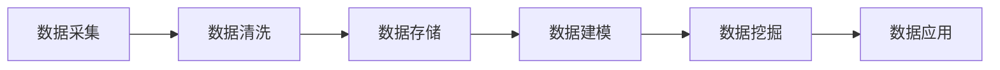
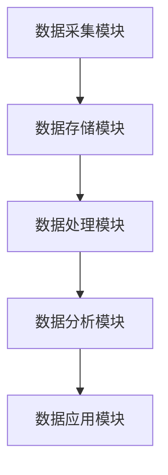

                 

### 数据中台：赋能业务的数据基础设施

> 关键词：数据中台、数据治理、数据资产管理、数据仓库、数据湖、数据服务

> 摘要：本文旨在深入探讨数据中台这一新兴的数据基础设施，其核心概念、架构设计及其在赋能企业业务中的作用。通过逐步分析数据中台的背景、核心概念、算法原理和系统架构，我们将理解数据中台如何帮助企业整合和管理数据资源，从而推动业务创新和发展。文章最后还将分享实际项目中的实战经验和最佳实践，以期为读者提供全面的指导。

### 背景介绍

#### 问题背景

随着大数据、云计算、人工智能等技术的迅猛发展，企业面临着海量数据的挑战和机遇。传统的数据仓库和数据湖逐渐难以满足快速变化的企业需求。在此背景下，数据中台作为一种新的数据基础设施应运而生，旨在解决企业数据管理中的难题。

**数据孤岛现象**：在传统的数据管理架构中，不同部门或业务线往往各自建立自己的数据仓库，导致数据分散、不统一，形成所谓的“数据孤岛”。这既浪费了宝贵的资源，又降低了数据的利用效率。

**数据质量问题**：由于数据来源多样，数据处理流程复杂，企业常常面临数据质量低下的问题，如数据缺失、错误、不一致等，这些问题直接影响数据的可靠性和决策的有效性。

**业务响应速度慢**：传统的数据管理架构中，数据从采集到分析往往需要较长的时间，无法满足现代企业对快速响应和即时决策的需求。

#### 问题描述

数据中台作为一种新兴的数据基础设施，旨在整合企业内外部的数据资源，提供统一的数据存储、处理和分析能力，从而支撑企业业务的快速发展和创新。

**数据资源的整合**：数据中台通过统一的数据接入、数据清洗和数据存储机制，实现企业内外部数据的整合，打破数据孤岛，提升数据的一致性和共享性。

**数据质量的保障**：数据中台采用先进的数据治理技术，确保数据的质量、安全、合规性和可用性，为企业提供高质量的数据支持。

**业务响应速度的提升**：数据中台通过分布式计算和实时数据流处理技术，实现了数据的实时分析和处理，大大提升了企业的业务响应速度。

#### 问题解决

**通过构建数据中台，企业可以实现以下目标：**

- **数据资源的统一管理和高效利用**：通过数据中台，企业可以统一管理和利用各种数据资源，避免数据重复建设，提高资源利用率。
- **降低数据孤岛现象**：数据中台通过整合内外部数据，打破数据孤岛，实现数据共享和流通，提升数据的利用效率。
- **提高数据质量和数据价值**：数据中台采用先进的数据治理技术，确保数据的质量和可靠性，从而提升数据的业务价值。

#### 边界与外延

**数据中台不仅仅是一个技术系统，更是一个业务战略**：

- **业务需求紧密结合**：数据中台的设计和建设需要紧密围绕企业的业务需求，确保其能够真正支持企业的业务发展和创新。
- **技术架构和组织架构紧密结合**：数据中台的建设需要与企业的技术架构和组织架构相适应，确保其能够顺利实施和运行。
- **跨部门协作与数据共享**：数据中台的建设需要打破部门壁垒，促进跨部门协作和数据共享，提升企业的整体运营效率。

#### 概念结构与核心要素组成

数据中台由以下五个核心模块组成，每个模块都有其特定的功能和作用：

1. **数据采集**：负责从企业内外部各种数据源采集数据，包括结构化数据、半结构化数据和非结构化数据。
2. **数据存储**：负责数据的存储和管理，包括数据仓库和数据湖，支持多种数据格式的存储和查询。
3. **数据处理**：负责数据的清洗、转换、整合和分析，提供高效的数据处理能力，支持复杂的查询和分析需求。
4. **数据分析**：负责对数据进行深度分析和挖掘，为企业提供业务洞察和决策支持。
5. **数据应用**：负责将分析结果应用到实际业务场景中，支持业务决策和流程优化。

### 核心概念与联系

#### 数据治理

**概念**：数据治理是指一系列政策和流程，用于管理数据的创建、使用、维护和处置，以确保数据的质量、安全、合规性和可用性。

**特点**：

- **确保数据质量**：通过数据清洗、校验和标准化等手段，确保数据的准确性、完整性和一致性。
- **数据安全**：通过数据加密、访问控制和安全审计等手段，保护数据不被未经授权的访问和篡改。
- **数据合规性**：确保数据符合相关的法律法规和行业规范，避免数据泄露和违规行为。
- **数据可用性**：确保数据能够被及时、准确地提供给需要的业务部门和用户。

**关联模块**：数据治理模块是数据中台的核心，与数据采集、数据存储、数据处理和数据应用模块紧密相关。

#### 数据资产管理

**概念**：数据资产管理是指对数据资产进行收集、分类、评估、保护和利用的过程，以提高数据的商业价值。

**特点**：

- **数据收集**：从各种数据源收集数据，包括内部数据和外部数据。
- **数据分类**：对收集到的数据进行分类和标签化，以便于管理和检索。
- **数据评估**：评估数据的质量、价值和风险，为数据管理和决策提供依据。
- **数据保护**：采取数据备份、恢复和数据安全措施，保护数据不受损坏和丢失。
- **数据利用**：通过数据分析和挖掘，将数据转化为业务洞察和决策支持。

**关联模块**：数据资产管理模块与数据采集、数据处理、数据分析和数据应用模块紧密相关。

#### 数据模型

**概念**：数据模型是指用于描述数据结构和数据之间关系的抽象模型，通常包括实体关系模型、维度模型和事实模型等。

**特点**：

- **实体关系模型**：描述实体之间的关系，通常用于数据库设计和数据建模。
- **维度模型**：用于数据仓库和数据分析，描述维度表和事实表之间的关系。
- **事实模型**：描述数据仓库中的事实数据，通常包括度量值和维度值。

**关联模块**：数据模型模块与数据存储、数据处理和数据分析模块紧密相关。

#### 数据仓库

**概念**：数据仓库是一种用于存储、管理和分析大量历史数据的数据管理系统，通常基于数据库技术构建。

**特点**：

- **大量历史数据存储**：数据仓库用于存储大量的历史数据，支持复杂的查询和分析。
- **数据集成**：数据仓库将来自多个数据源的数据进行集成，提供统一的数据视图。
- **数据转换**：对数据进行清洗、转换和集成，确保数据的质量和一致性。
- **数据分析**：支持多维数据分析和数据挖掘，提供深入的业务洞察。

**关联模块**：数据仓库模块与数据采集、数据处理、数据分析和数据应用模块紧密相关。

#### 数据湖

**概念**：数据湖是一种用于存储大量原始数据的数据存储系统，支持多种数据格式和多样性分析。

**特点**：

- **大量原始数据存储**：数据湖用于存储各种原始数据，包括结构化数据、半结构化数据和非结构化数据。
- **多样性分析**：数据湖支持多种数据分析和处理技术，包括机器学习、数据挖掘和实时分析。
- **灵活性**：数据湖提供灵活的数据存储和处理能力，支持不同的数据处理需求。

**关联模块**：数据湖模块与数据采集、数据处理、数据分析和数据应用模块紧密相关。

#### 数据服务

**概念**：数据服务是指通过API接口或数据服务层，提供数据查询、数据可视化、数据挖掘等服务，支持业务应用开发。

**特点**：

- **API接口**：提供统一的数据访问接口，方便业务系统接入和使用数据。
- **数据可视化**：提供数据可视化服务，帮助用户理解和分析数据。
- **数据挖掘**：提供数据挖掘服务，支持业务洞察和决策支持。

**关联模块**：数据服务模块与数据处理、数据分析和数据应用模块紧密相关。

### ER实体关系图架构的 Mermaid 流程图

以下是一个简化的数据中台实体关系图，使用 Mermaid 语法表示：

```mermaid
erDiagram
    Customer ||--|{ Order } : "下单"
    Product ||--|{ Order } : "销售"
    Order ||--|{ OrderDetail } : "订单详情"
    Customer ||--|{ CustomerAddress } : "地址"
```

### 算法原理讲解

#### 数据治理

**算法原理**：

数据治理的主要目标是确保数据的质量、安全、合规性和可用性。其核心算法包括数据清洗、数据校验、数据分类和数据监控等。

**数学模型**：

$$
\text{Data Quality} = \frac{\text{Clean Data}}{\text{Total Data}} \times 100\%
$$

**举例说明**：

假设我们有一个包含1000条记录的员工数据表，其中年龄小于0的有20条，薪资小于0的有30条。经过数据清洗后，我们得到了800条干净的员工数据。

$$
\text{Data Quality} = \frac{800}{1000} \times 100\% = 80\%
$$

#### 数据清洗

**算法原理**：

数据清洗是数据治理的重要环节，其目的是去除数据中的噪声和错误，提高数据的质量和一致性。常用的数据清洗算法包括缺失值处理、异常值处理、重复值处理等。

**数学模型**：

$$
\text{Missing Data Rate} = \frac{\text{Missing Data}}{\text{Total Data}} \times 100\%
$$

**举例说明**：

假设我们有一个包含100条记录的学生数据表，其中缺失成绩的有10条记录。

$$
\text{Missing Data Rate} = \frac{10}{100} \times 100\% = 10\%
$$

**Python源代码**：

```python
import pandas as pd

# 加载数据
data = pd.read_csv('data.csv')

# 缺失值处理
data = data.dropna()

# 异常值处理
data = data[data['Score'] > 0]

# 重复值处理
data = data.drop_duplicates()

# 打印清洗后数据
print(data.head())
```

#### 数据建模

**算法原理**：

数据建模是指通过建立数据模型来描述数据的结构和关系，通常包括实体关系模型、维度模型和事实模型等。数据建模的目的是为了支持数据存储、查询和分析。

**数学模型**：

数据建模的数学模型主要基于数学集合论和关系代数，用于描述实体之间的关系和数据操作。

**举例说明**：

假设我们有一个学生数据表，包含学生姓名、课程名称和成绩。我们可以建立一个实体关系模型来描述这些实体之间的关系：

- 实体：学生、课程、成绩
- 关系：学生选课、课程被学生选择、成绩记录学生选课情况

#### 数据挖掘

**算法原理**：

数据挖掘是指从大量数据中自动发现有趣的知识和模式，通常包括聚类分析、分类分析、关联规则挖掘等。数据挖掘的目的是为了支持业务洞察和决策支持。

**数学模型**：

数据挖掘的数学模型主要基于统计学和机器学习算法，用于发现数据中的模式和规律。

**举例说明**：

假设我们有一个学生数据表，包含学生姓名、课程名称和成绩。我们可以使用聚类分析算法来发现学生之间的相似性，从而帮助学校进行个性化教学。

#### 算法流程图

以下是一个简化的数据中台算法流程图，使用 Mermaid 语法表示：



### 系统分析与架构设计方案

#### 问题场景介绍

假设我们正在开发一个电商平台，该平台需要处理海量的用户数据、商品数据、订单数据等。为了实现高效的数据管理和应用，我们决定引入数据中台作为我们的数据基础设施。

#### 项目介绍

**项目名称**：电商平台数据中台

**项目目标**：构建一个高效、稳定、可扩展的数据中台，支持电商平台的数据管理和应用需求。

#### 系统功能设计

数据中台的主要功能包括：

1. **数据采集**：从各种数据源（如数据库、文件、API等）采集数据。
2. **数据存储**：将采集到的数据存储在数据仓库和数据湖中。
3. **数据处理**：对存储的数据进行清洗、转换和整合。
4. **数据分析**：对数据进行深度分析和挖掘，支持业务决策。
5. **数据应用**：将分析结果应用到业务系统中，支持业务流程优化和决策。

#### 系统架构设计

数据中台的系统架构主要包括以下模块：

1. **数据采集模块**：负责从各种数据源采集数据，包括内部数据和外部数据。
2. **数据存储模块**：包括数据仓库和数据湖，用于存储和管理数据。
3. **数据处理模块**：负责对数据进行清洗、转换和整合。
4. **数据分析模块**：负责对数据进行深度分析和挖掘，提供业务洞察和决策支持。
5. **数据应用模块**：将分析结果应用到业务系统中，支持业务流程优化和决策。

以下是一个简化的数据中台系统架构图，使用 Mermaid 语法表示：



#### 系统接口设计

数据中台的接口设计主要包括以下部分：

1. **API接口**：提供统一的数据访问接口，支持业务系统接入和使用数据。
2. **数据服务接口**：提供数据查询、数据可视化、数据挖掘等服务，支持业务应用开发。
3. **数据订阅接口**：支持业务系统订阅数据变化，实现数据的实时推送。

以下是一个简化的数据中台接口设计图，使用 Mermaid 语法表示：

```mermaid
sequenceDiagram
    A[业务系统] -->|调用API| B[API接口]
    B -->|处理请求| C[数据处理模块]
    C -->|返回结果| D[业务系统]
    D -->|订阅数据| E[数据订阅接口]
    E -->|推送数据| F[业务系统]
```

#### 系统交互设计

数据中台与其他系统的交互主要包括以下部分：

1. **数据采集**：从其他系统中采集数据，如用户数据、商品数据、订单数据等。
2. **数据共享**：与其他系统共享数据，如数据仓库、数据湖中的数据。
3. **数据更新**：实时更新数据，支持数据的实时性和一致性。

以下是一个简化的数据中台系统交互图，使用 Mermaid 语法表示：

```mermaid
sequenceDiagram
    A[电商平台] -->|数据采集| B[数据采集模块]
    B -->|数据共享| C[数据存储模块]
    C -->|数据更新| D[数据处理模块]
    D -->|数据分析| E[数据分析模块]
    E -->|数据应用| F[电商平台]
```

### 项目实战

#### 环境安装

1. 安装Hadoop集群，用于搭建数据仓库和数据湖。
2. 安装Apache Kafka，用于实时数据采集和处理。
3. 安装Apache Spark，用于数据处理和数据分析。

#### 系统核心实现

1. **数据采集**：使用Apache Kafka从各个数据源采集数据，包括数据库、日志文件、API等。
2. **数据存储**：使用Hadoop HDFS存储原始数据，使用Hadoop HBase存储处理后的数据。
3. **数据处理**：使用Apache Spark进行数据清洗、转换和整合。
4. **数据分析**：使用Apache Spark进行数据挖掘和业务分析。
5. **数据应用**：将分析结果应用到电商平台系统中，支持业务决策和流程优化。

#### 代码应用解读与分析

1. **数据采集**：使用Kafka消费者从数据库中读取数据，并使用Spark Streaming进行实时处理。
2. **数据清洗**：使用Spark SQL对数据进行清洗和转换，如去重、缺失值填充等。
3. **数据存储**：使用HDFS存储原始数据，使用HBase存储处理后的数据。
4. **数据分析**：使用Spark SQL进行数据挖掘和业务分析，如用户行为分析、商品销售分析等。
5. **数据应用**：将分析结果存储到数据库中，供电商平台系统使用。

#### 实际案例分析和详细讲解剖析

**案例**：分析电商平台的用户购买行为，识别潜在的用户群体和优化营销策略。

1. **数据采集**：从电商平台的数据库中采集用户行为数据，如浏览记录、购买记录等。
2. **数据清洗**：清洗数据，去除无效和重复的数据。
3. **数据建模**：建立用户行为模型，如用户活跃度、购买频率等。
4. **数据分析**：使用Spark SQL进行用户行为分析，如用户偏好分析、潜在用户识别等。
5. **数据应用**：将分析结果应用于电商平台的营销系统，如推送个性化广告、优化推荐算法等。

#### 项目小结

通过构建电商平台数据中台，我们实现了以下成果：

1. **高效的数据采集和处理**：使用Kafka和Spark实现实时数据采集和处理，提高了数据处理的效率。
2. **统一的数据存储和管理**：使用HDFS和HBase实现统一的数据存储和管理，提高了数据的一致性和可用性。
3. **强大的数据分析能力**：使用Spark SQL实现数据挖掘和业务分析，为电商平台提供了强大的数据支持。
4. **优化业务流程和决策**：将分析结果应用于电商平台系统中，支持业务流程优化和决策。

### 最佳实践 Tips

1. **数据治理**：建立完善的数据治理体系，确保数据的质量和安全。
2. **数据模型**：根据业务需求设计合理的数据模型，提高数据利用效率。
3. **分布式架构**：采用分布式架构，提高系统的可扩展性和稳定性。
4. **实时处理**：使用实时处理技术，如Kafka和Spark Streaming，提高数据处理效率。

### 小结

数据中台作为一种新兴的数据基础设施，为企业提供了高效的数据管理和应用能力。通过逐步分析数据中台的背景、核心概念、算法原理和系统架构，我们深入理解了数据中台如何赋能企业业务。在实际项目中，通过构建数据中台，企业可以实现数据资源的统一管理和高效利用，降低数据孤岛现象，提高数据质量和数据价值。数据中台不仅是一个技术系统，更是一个业务战略，需要与企业业务需求、技术架构和组织架构紧密结合。通过本文的介绍，希望读者能够对数据中台有更深刻的认识和了解。

### 注意事项

1. **数据治理**：在构建数据中台时，必须重视数据治理，确保数据的质量和安全。
2. **系统扩展性**：在设计系统架构时，要考虑系统的扩展性，以便支持业务增长。
3. **数据安全**：在数据存储和传输过程中，必须采取严格的数据安全措施，防止数据泄露。

### 拓展阅读

- 《大数据架构设计》
- 《数据仓库与数据挖掘》
- 《机器学习实战》

### 作者

作者：AI天才研究院/AI Genius Institute & 禅与计算机程序设计艺术 /Zen And The Art of Computer Programming

感谢读者对本文的关注和支持！希望本文能够对您在数据中台领域的研究和实践有所帮助。如果您有任何问题或建议，欢迎在评论区留言交流。

