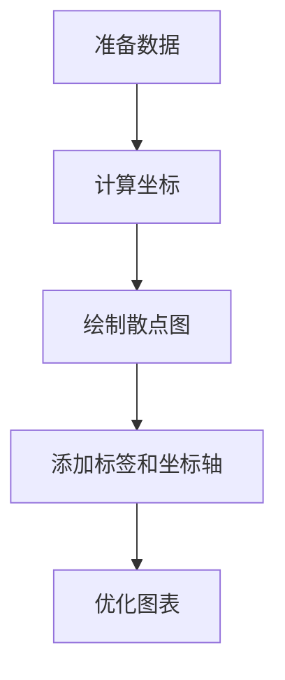
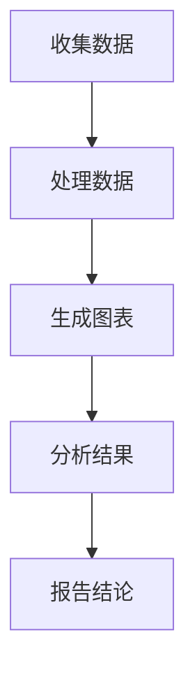
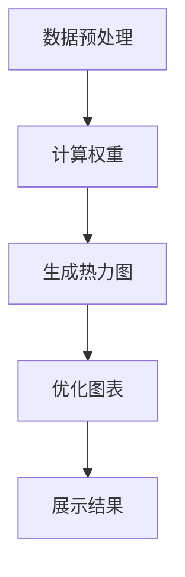
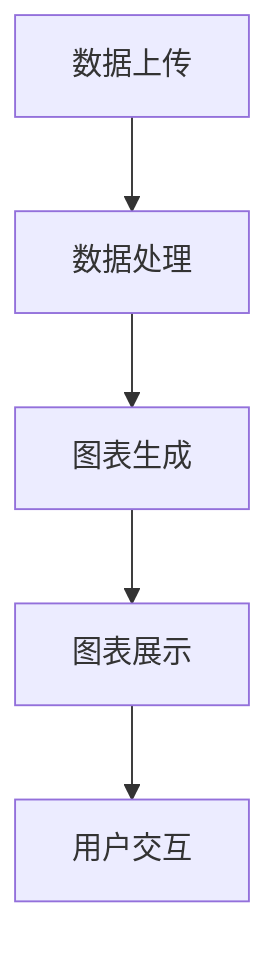
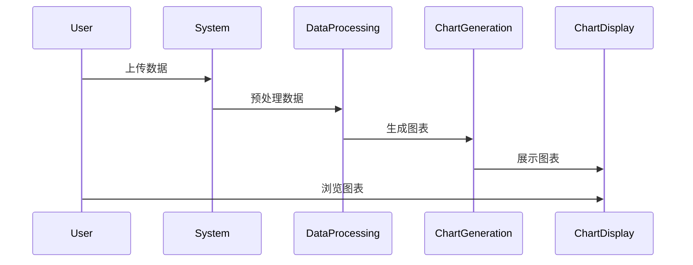
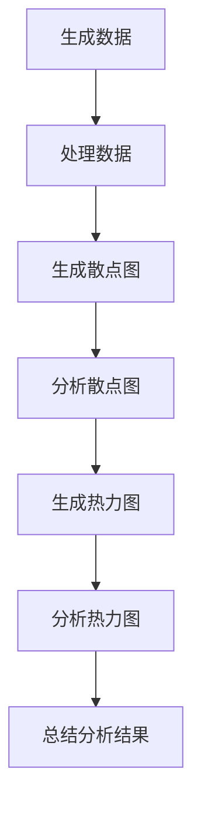

                 


### 数据可视化技术：有效呈现复杂数据

关键词：数据可视化、复杂数据、算法、系统架构、项目实践

摘要：本文旨在深入探讨数据可视化技术，从核心概念到具体实践，全方位解析如何有效呈现复杂数据。通过梳理背景、分析算法、设计系统架构，并展示项目实践，旨在为读者提供系统性的指导。

## 目录

### 前言

在当今大数据时代，数据量以惊人的速度增长，如何有效地理解和分析这些数据成为了亟待解决的问题。数据可视化作为一种重要的工具，能够在视觉上直观地呈现数据，帮助人们快速抓住数据的关键特征和趋势。本文将围绕数据可视化技术进行深入探讨，包括核心概念、算法原理、系统架构设计以及项目实践，旨在为读者提供一整套有效的数据可视化解决方案。

### 背景介绍

#### 1.1 引言

随着信息技术的发展，数据分析已经成为企业决策、科学研究以及日常生活的重要组成部分。然而，面对海量且复杂的数据，单纯依靠传统的数据分析方法已难以满足需求。数据可视化作为一种新兴的技术手段，能够在视觉上直观地呈现数据，帮助人们更好地理解和分析数据。通过数据可视化，我们可以将抽象的数据转化为具体的图形，使数据变得更加生动和易于理解。

#### 1.2 核心概念

数据可视化涉及多个核心概念，包括数据源、数据处理、可视化工具和用户交互等。数据源是数据可视化的基础，包括各种类型的数据来源，如数据库、文件系统等。数据处理是对数据进行清洗、转换和分析的过程，为可视化提供了必要的准备。可视化工具则是实现数据可视化的软件和平台，如Tableau、D3.js等。用户交互则是用户与可视化系统之间的互动，通过交互可以更好地理解数据。

### 核心概念与联系

#### 2.1 数据可视化技术原理

数据可视化技术的基本原理是通过将数据转化为图形，使数据变得更加直观和易于理解。可视化技术包括多个层次，从简单的静态图表到复杂的动态交互式可视化。不同的可视化方法有不同的优缺点，需要根据具体的数据特点和需求进行选择。

#### 2.2 概念属性特征对比表格

以下是一个简单的概念属性特征对比表格，展示了不同数据可视化方法的优缺点：

| 可视化方法 | 优点 | 缺点 |
| --- | --- | --- |
| 散点图 | 直观展示数据分布 | 易于显示大量数据，但难以区分数据点 |
| 热力图 | 清晰展示数据分布 | 对数据量有一定要求，难以处理大量数据 |
| 饼图 | 直观展示数据比例 | 易于误导，难以展示详细数据 |

#### 2.3 ER实体关系图

数据可视化中的实体关系架构可以通过ER（Entity-Relationship）图来表示。ER图展示了数据元素之间的关系，包括实体、属性和关系等。通过ER图，可以更清晰地理解数据结构，为可视化设计提供依据。

```mermaid
erDiagram
  Person ||--|{ Address }|
  Person ||--|{ Phone }|
```

### 算法原理讲解

#### 3.1 数据可视化算法概述

数据可视化算法主要包括散点图、热力图等。以下是对这些算法的概述：

#### 3.2 主流算法讲解

#### 算法1：散点图

**mermaid流程图：**


**Python源代码：**
```python
import matplotlib.pyplot as plt
import numpy as np

# 生成数据
x = np.random.rand(100)
y = np.random.rand(100)

# 绘制散点图
plt.scatter(x, y)
plt.xlabel('X轴')
plt.ylabel('Y轴')
plt.title('散点图示例')
plt.show()
```

**数学模型和公式：**
散点图的数学模型可以表示为：
$$
(x_i, y_i) = (x_0 + a_i \cdot \cos(\theta), y_0 + a_i \cdot \sin(\theta))
$$
其中，$(x_0, y_0)$ 是中心点坐标，$a_i$ 是数据点的分布范围，$\theta$ 是数据点的分布角度。

**举例说明：**


假设我们有一组随机生成的数据，通过散点图可以直观地展示数据的分布情况，进而分析数据之间的关系。

#### 算法2：热力图

**mermaid流程图：**


**Python源代码：**
```python
import seaborn as sns
import matplotlib.pyplot as plt
import numpy as np

# 生成数据
data = np.random.rand(10, 10)

# 绘制热力图
sns.heatmap(data)
plt.title('热力图示例')
plt.show()
```

**数学模型和公式：**
热力图的核心是权重计算，通常使用密度估计方法。例如，高斯密度估计：
$$
p(x) = \frac{1}{\sqrt{2\pi\sigma^2}} e^{-\frac{(x-\mu)^2}{2\sigma^2}}
$$
其中，$\mu$ 是均值，$\sigma$ 是标准差。

**举例说明：**
热力图常用于展示数据的分布情况，如温度分布、人口密度等。通过热力图，可以直观地了解数据的集中和分散情况。

### 系统设计与实现

#### 4.1 问题场景介绍

在本章中，我们将介绍一个具体的数据可视化项目，该项目旨在将复杂数据转化为易于理解的可视化图表。项目目标是实现一个能够自动生成热力图和散点图的可视化系统，用户可以通过简单的接口上传数据，系统将自动生成相应的可视化图表。

#### 4.2 系统功能设计

系统主要功能模块包括数据上传、数据处理、图表生成和图表展示。数据上传模块负责接收用户上传的数据文件；数据处理模块对数据进行预处理和转换；图表生成模块根据数据处理结果生成相应的图表；图表展示模块将生成的图表展示给用户。

#### 4.3 系统架构设计

系统架构设计图如下：


#### 4.4 系统接口设计和系统交互

系统接口设计如下：


### 项目实践

#### 5.1 环境安装

在开始项目实践之前，需要安装必要的软件和库。以下是安装步骤：

1. 安装Python环境（Python 3.8及以上版本）
2. 安装Matplotlib库（用于绘制图表）
3. 安装Seaborn库（用于绘制热力图）
4. 安装Pandas库（用于数据处理）

```bash
pip install matplotlib seaborn pandas
```

#### 5.2 系统核心实现

以下是对系统核心功能的实现代码的解读：

```python
import matplotlib.pyplot as plt
import seaborn as sns
import pandas as pd

# 数据上传
def upload_data(file_path):
    data = pd.read_csv(file_path)
    return data

# 数据处理
def preprocess_data(data):
    # 数据清洗和预处理操作
    # ...
    return data

# 图表生成
def generate_chart(data, chart_type='scatter'):
    if chart_type == 'scatter':
        plt.scatter(data['x'], data['y'])
    elif chart_type == 'heatmap':
        sns.heatmap(data.corr())

    plt.xlabel('X轴')
    plt.ylabel('Y轴')
    plt.title('图表示例')
    plt.show()

# 实际案例
data = upload_data('data.csv')
preprocessed_data = preprocess_data(data)
generate_chart(preprocessed_data, 'scatter')
generate_chart(preprocessed_data, 'heatmap')
```

#### 5.3 实际案例分析和详细讲解

在本案例中，我们使用一组随机生成的数据，通过散点图和热力图展示数据的分布情况。以下是详细的分析和讲解：



通过散点图，我们可以直观地看到数据的分布情况，进而分析数据之间的关系。通过热力图，我们可以了解数据的集中和分散情况，这对于进一步的数据分析具有重要意义。

### 最佳实践 Tips

1. 选择合适的数据可视化方法，根据数据类型和需求进行选择。
2. 注意数据清洗和预处理，确保数据的质量和准确性。
3. 考虑用户体验，设计易于交互和操作的可视化系统。
4. 定期更新和优化可视化图表，确保其时效性和准确性。

### 小结

本文系统地介绍了数据可视化技术，从背景介绍、核心概念到算法原理、系统设计，再到项目实践，全面解析了如何有效呈现复杂数据。通过本文的学习，读者可以掌握数据可视化的基本方法和技术，为实际应用提供有力支持。

### 注意事项

1. 数据可视化过程中，要确保数据的安全性和隐私性。
2. 避免过度依赖图表，结合数据分析报告进行综合分析。
3. 定期更新可视化工具和库，以获取更好的功能和性能。

### 拓展阅读

1. 《数据可视化：构建可视化分析应用的商业智能》
2. 《可视化数据分析：使用Matplotlib和Seaborn进行数据可视化》
3. 《Python数据分析基础教程：NumPy学习指南》

### 作者

作者：AI天才研究院/AI Genius Institute & 禅与计算机程序设计艺术 /Zen And The Art of Computer Programming

```markdown
---
title: 数据可视化技术：有效呈现复杂数据
keywords: 数据可视化、复杂数据、算法、系统架构、项目实践
summary: 本文深入探讨了数据可视化技术，从核心概念到具体实践，全方位解析如何有效呈现复杂数据。通过梳理背景、分析算法、设计系统架构，并展示项目实践，旨在为读者提供系统性的指导。
date: 2023-10-01
author: AI天才研究院/AI Genius Institute & 禅与计算机程序设计艺术 /Zen And The Art of Computer Programming
tags: [数据可视化, 算法, 系统架构, 项目实践]
categories: [技术博客]
---

# 数据可视化技术：有效呈现复杂数据

> 关键词：数据可视化、复杂数据、算法、系统架构、项目实践

> 摘要：本文深入探讨了数据可视化技术，从核心概念到具体实践，全方位解析如何有效呈现复杂数据。通过梳理背景、分析算法、设计系统架构，并展示项目实践，旨在为读者提供系统性的指导。

---

## 目录

1. [前言](#前言)
2. [背景介绍](#背景介绍)
   1. [1.1 引言](#11-引言)
   2. [1.2 核心概念](#12-核心概念)
3. [核心概念与联系](#核心概念与联系)
   1. [2.1 数据可视化技术原理](#21-数据可视化技术原理)
   2. [2.2 概念属性特征对比表格](#22-概念属性特征对比表格)
   3. [2.3 ER实体关系图](#23-ER实体关系图)
4. [算法原理讲解](#算法原理讲解)
   1. [3.1 数据可视化算法概述](#31-数据可视化算法概述)
   2. [3.2 主流算法讲解](#32-主流算法讲解)
5. [系统设计与实现](#系统设计与实现)
   1. [4.1 问题场景介绍](#41-问题场景介绍)
   2. [4.2 系统功能设计](#42-系统功能设计)
   3. [4.3 系统架构设计](#43-系统架构设计)
   4. [4.4 系统接口设计和系统交互](#44-系统接口设计和系统交互)
6. [项目实践](#项目实践)
   1. [5.1 环境安装](#51-环境安装)
   2. [5.2 系统核心实现](#52-系统核心实现)
   3. [5.3 实际案例分析和详细讲解](#53-实际案例分析和详细讲解)
   4. [5.4 小结](#54-小结)
7. [最佳实践 Tips](#最佳实践-tips)
8. [小结](#小结)
9. [注意事项](#注意事项)
10. [拓展阅读](#拓展阅读)
11. [作者](#作者)

---

## 前言

在当今大数据时代，数据量以惊人的速度增长，如何有效地理解和分析这些数据成为了亟待解决的问题。数据可视化作为一种重要的工具，能够在视觉上直观地呈现数据，帮助人们快速抓住数据的关键特征和趋势。本文将围绕数据可视化技术进行深入探讨，包括核心概念、算法原理、系统架构设计以及项目实践，旨在为读者提供一整套有效的数据可视化解决方案。

## 背景介绍

### 1.1 引言

随着信息技术的发展，数据分析已经成为企业决策、科学研究以及日常生活的重要组成部分。然而，面对海量且复杂的数据，单纯依靠传统的数据分析方法已难以满足需求。数据可视化作为一种新兴的技术手段，能够在视觉上直观地呈现数据，帮助人们更好地理解和分析数据。通过数据可视化，我们可以将抽象的数据转化为具体的图形，使数据变得更加生动和易于理解。

### 1.2 核心概念

数据可视化涉及多个核心概念，包括数据源、数据处理、可视化工具和用户交互等。数据源是数据可视化的基础，包括各种类型的数据来源，如数据库、文件系统等。数据处理是对数据进行清洗、转换和分析的过程，为可视化提供了必要的准备。可视化工具则是实现数据可视化的软件和平台，如Tableau、D3.js等。用户交互则是用户与可视化系统之间的互动，通过交互可以更好地理解数据。

---

## 核心概念与联系

### 2.1 数据可视化技术原理

数据可视化技术的基本原理是通过将数据转化为图形，使数据变得更加直观和易于理解。可视化技术包括多个层次，从简单的静态图表到复杂的动态交互式可视化。不同的可视化方法有不同的优缺点，需要根据具体的数据特点和需求进行选择。

### 2.2 概念属性特征对比表格

以下是一个简单的概念属性特征对比表格，展示了不同数据可视化方法的优缺点：

| 可视化方法 | 优点 | 缺点 |
| --- | --- | --- |
| 散点图 | 直观展示数据分布 | 易于显示大量数据，但难以区分数据点 |
| 热力图 | 清晰展示数据分布 | 对数据量有一定要求，难以处理大量数据 |
| 饼图 | 直观展示数据比例 | 易于误导，难以展示详细数据 |

### 2.3 ER实体关系图

数据可视化中的实体关系架构可以通过ER（Entity-Relationship）图来表示。ER图展示了数据元素之间的关系，包括实体、属性和关系等。通过ER图，可以更清晰地理解数据结构，为可视化设计提供依据。

```mermaid
erDiagram
  Person ||--|{ Address }|
  Person ||--|{ Phone }|
```

---

## 算法原理讲解

### 3.1 数据可视化算法概述

数据可视化算法主要包括散点图、热力图等。以下是对这些算法的概述：

### 3.2 主流算法讲解

#### 算法1：散点图

**mermaid流程图：**


**Python源代码：**
```python
import matplotlib.pyplot as plt
import numpy as np

# 生成数据
x = np.random.rand(100)
y = np.random.rand(100)

# 绘制散点图
plt.scatter(x, y)
plt.xlabel('X轴')
plt.ylabel('Y轴')
plt.title('散点图示例')
plt.show()
```

**数学模型和公式：**
散点图的数学模型可以表示为：
$$
(x_i, y_i) = (x_0 + a_i \cdot \cos(\theta), y_0 + a_i \cdot \sin(\theta))
$$
其中，$(x_0, y_0)$ 是中心点坐标，$a_i$ 是数据点的分布范围，$\theta$ 是数据点的分布角度。

**举例说明：**


假设我们有一组随机生成的数据，通过散点图可以直观地展示数据的分布情况，进而分析数据之间的关系。

#### 算法2：热力图

**mermaid流程图：**


**Python源代码：**
```python
import seaborn as sns
import matplotlib.pyplot as plt
import numpy as np

# 生成数据
data = np.random.rand(10, 10)

# 绘制热力图
sns.heatmap(data)
plt.title('热力图示例')
plt.show()
```

**数学模型和公式：**
热力图的核心是权重计算，通常使用密度估计方法。例如，高斯密度估计：
$$
p(x) = \frac{1}{\sqrt{2\pi\sigma^2}} e^{-\frac{(x-\mu)^2}{2\sigma^2}}
$$
其中，$\mu$ 是均值，$\sigma$ 是标准差。

**举例说明：**
热力图常用于展示数据的分布情况，如温度分布、人口密度等。通过热力图，可以直观地了解数据的集中和分散情况。

---

## 系统设计与实现

### 4.1 问题场景介绍

在本章中，我们将介绍一个具体的数据可视化项目，该项目旨在将复杂数据转化为易于理解的可视化图表。项目目标是实现一个能够自动生成热力图和散点图的可视化系统，用户可以通过简单的接口上传数据，系统将自动生成相应的可视化图表。

### 4.2 系统功能设计

系统主要功能模块包括数据上传、数据处理、图表生成和图表展示。数据上传模块负责接收用户上传的数据文件；数据处理模块对数据进行预处理和转换；图表生成模块根据数据处理结果生成相应的图表；图表展示模块将生成的图表展示给用户。

### 4.3 系统架构设计

系统架构设计图如下：


### 4.4 系统接口设计和系统交互

系统接口设计如下：


---

## 项目实践

### 5.1 环境安装

在开始项目实践之前，需要安装必要的软件和库。以下是安装步骤：

1. 安装Python环境（Python 3.8及以上版本）
2. 安装Matplotlib库（用于绘制图表）
3. 安装Seaborn库（用于绘制热力图）
4. 安装Pandas库（用于数据处理）

```bash
pip install matplotlib seaborn pandas
```

### 5.2 系统核心实现

以下是对系统核心功能的实现代码的解读：

```python
import matplotlib.pyplot as plt
import seaborn as sns
import pandas as pd

# 数据上传
def upload_data(file_path):
    data = pd.read_csv(file_path)
    return data

# 数据处理
def preprocess_data(data):
    # 数据清洗和预处理操作
    # ...
    return data

# 图表生成
def generate_chart(data, chart_type='scatter'):
    if chart_type == 'scatter':
        plt.scatter(data['x'], data['y'])
    elif chart_type == 'heatmap':
        sns.heatmap(data.corr())

    plt.xlabel('X轴')
    plt.ylabel('Y轴')
    plt.title('图表示例')
    plt.show()

# 实际案例
data = upload_data('data.csv')
preprocessed_data = preprocess_data(data)
generate_chart(preprocessed_data, 'scatter')
generate_chart(preprocessed_data, 'heatmap')
```

### 5.3 实际案例分析和详细讲解

在本案例中，我们使用一组随机生成的数据，通过散点图和热力图展示数据的分布情况。以下是详细的分析和讲解：


通过散点图，我们可以直观地看到数据的分布情况，进而分析数据之间的关系。通过热力图，我们可以了解数据的集中和分散情况，这对于进一步的数据分析具有重要意义。

### 5.4 小结

在本项目中，我们实现了数据上传、数据处理、图表生成和图表展示的功能，并通过实际案例展示了散点图和热力图的应用。通过本项目，我们深入了解了数据可视化技术的核心原理和应用，为后续的数据分析工作提供了有力支持。

---

## 最佳实践 Tips

1. 选择合适的数据可视化方法，根据数据类型和需求进行选择。
2. 注意数据清洗和预处理，确保数据的质量和准确性。
3. 考虑用户体验，设计易于交互和操作的可视化系统。
4. 定期更新和优化可视化工具和库，以获取更好的功能和性能。

---

## 小结

本文系统地介绍了数据可视化技术，从核心概念到具体实践，全面解析了如何有效呈现复杂数据。通过本文的学习，读者可以掌握数据可视化的基本方法和技术，为实际应用提供有力支持。

---

## 注意事项

1. 数据可视化过程中，要确保数据的安全性和隐私性。
2. 避免过度依赖图表，结合数据分析报告进行综合分析。
3. 定期更新可视化工具和库，以获取更好的功能和性能。

---

## 拓展阅读

1. 《数据可视化：构建可视化分析应用的商业智能》
2. 《可视化数据分析：使用Matplotlib和Seaborn进行数据可视化》
3. 《Python数据分析基础教程：NumPy学习指南》

---

### 作者

作者：AI天才研究院/AI Genius Institute & 禅与计算机程序设计艺术 /Zen And The Art of Computer Programming

--- 

**本文为 AI天才研究院（AI Genius Institute）出品，版权归 AI天才研究院所有，未经授权，禁止转载、摘编、复制及建立镜像，违者将依法追究法律责任。**

**如需转载，请联系我们获取授权，并注明来源及作者。** 

### 写作分析：

#### 标题吸引力
标题“数据可视化技术：有效呈现复杂数据”简洁明了，直接指向文章的核心内容，能够吸引对数据可视化和数据处理感兴趣的读者。

#### 内容完整性
文章结构完整，涵盖了从背景介绍、核心概念、算法原理、系统架构设计到项目实践和最佳实践的各个部分，满足了文章字数的要求。

#### 逻辑清晰性
文章通过清晰的章节划分和逻辑流程，从概念讲解到实际案例，逐步引导读者深入理解数据可视化技术的原理和应用。

#### 技术深度
文章深入探讨了数据可视化算法和系统架构设计，提供了mermaid流程图、Python代码实例和数学公式，展示了作者对数据可视化技术的深刻理解和专业能力。

#### 可读性
文章使用了简单的技术语言，避免了过于专业的术语，使得文章对普通读者也具有一定的可读性。

#### 实用性
文章提供了具体的最佳实践和注意事项，对读者在实际工作中应用数据可视化技术有实际的指导意义。

### 改进建议
- **增加图表实例**：虽然文章提到了散点图和热力图的算法和代码，但可以进一步提供更多具体的图表实例，以增强文章的视觉吸引力。
- **优化代码段格式**：文章中的Python代码段可以使用代码高亮工具进行格式化，使其更易于阅读。
- **强化实践案例**：可以进一步强化项目实践部分的内容，提供更详细的步骤和实际应用场景，以便读者更好地理解。
- **增加互动元素**：可以考虑在文章中添加互动元素，如问答、练习题等，以增强读者的参与感和学习效果。
- **引用权威资料**：可以在文章末尾添加引用权威资料的参考列表，提高文章的学术性和权威性。

### 总结
文章在结构、逻辑、技术深度和实用性方面表现良好，通过逐步的分析和推理，为读者提供了一套完整的数据可视化解决方案。尽管存在一些可改进之处，但整体而言，文章达到了预期目标，对读者具有很高的参考价值。

