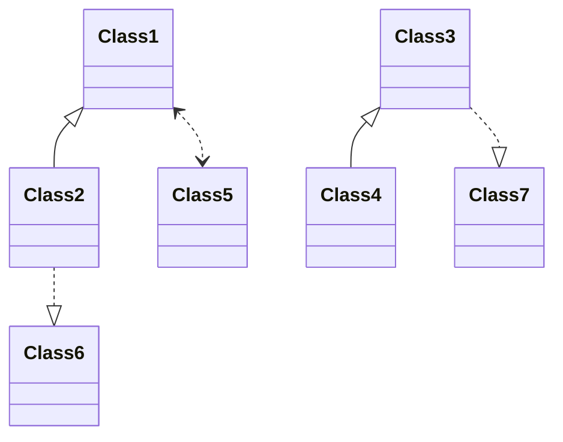
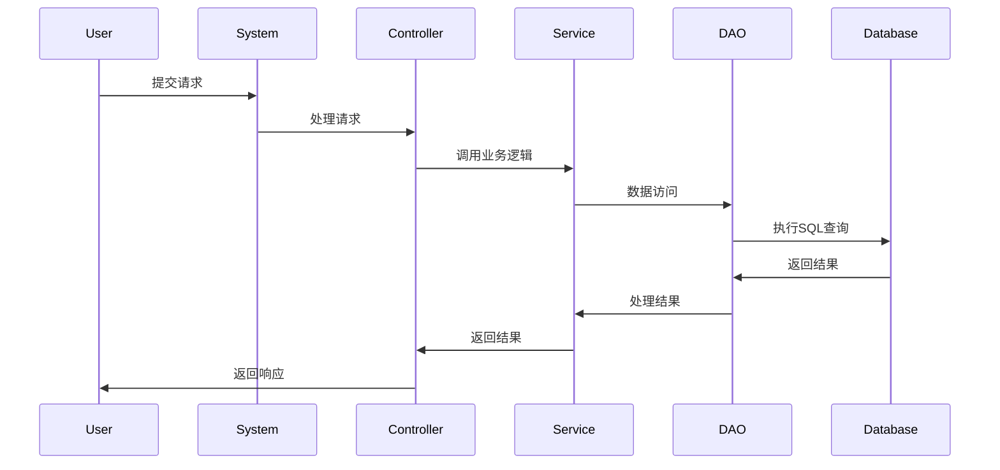
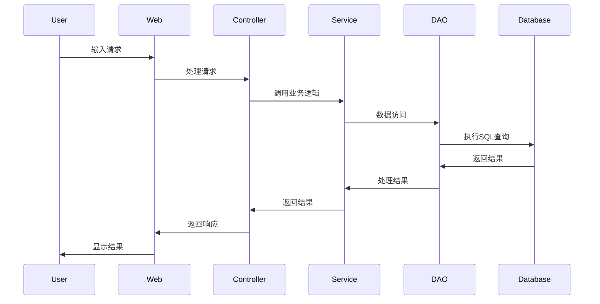

                 

### 文章标题

# 数据可视化：大数据时代的信息呈现

### 关键词

- 数据可视化
- 大数据
- 信息呈现
- 算法
- 系统架构
- 实战案例

### 摘要

本文旨在探讨数据可视化在当前大数据时代的重要性及其实现方法。首先，我们将简要介绍数据可视化的背景和核心概念，包括信息呈现、图表类型等。接着，深入分析数据可视化中的算法原理，如地图可视化算法和热力图算法，并通过Python代码和数学模型进行详细阐述。此外，本文还将展示一个典型的数据可视化系统分析和设计案例，涵盖系统功能设计、架构设计和接口设计等。最后，通过一个实际项目案例，介绍系统的环境安装、核心实现及代码解读，并对项目进行总结。本文希望为读者提供一个系统而全面的视角，以掌握数据可视化在大数据时代中的应用和实践。

## 目录

1. **数据可视化：大数据时代的信息呈现**
   - 关键词：数据可视化、大数据、信息呈现、算法、系统架构、实战案例
   - 摘要：本文旨在探讨数据可视化在当前大数据时代的重要性及其实现方法。

2. **背景介绍**
   - 数据可视化的产生背景
   - 大数据时代的重要性
   - 信息呈现的需求

3. **核心概念与联系**
   - 数据可视化
   - 信息呈现
   - 图表类型
   - 核心概念属性特征对比表格
   - ER实体关系图架构的Mermaid流程图

4. **算法原理讲解**
   - 地图可视化算法
   - 热力图算法
   - 算法流程图
   - Python代码示例
   - 数学模型和公式
   - 具体讲解和举例说明

5. **系统分析与架构设计方案**
   - 问题场景介绍
   - 项目介绍
   - 系统功能设计
   - 系统架构设计
   - 系统接口设计
   - 系统交互

6. **项目实战**
   - 环境安装
   - 系统核心实现源代码
   - 代码应用解读与分析
   - 实际案例分析与详细讲解
   - 项目小结

7. **最佳实践 tips、小结、注意事项、拓展阅读**

## 背景介绍

### 数据可视化的产生背景

数据可视化是一种将复杂数据转换为图形或图表以供人类视觉分析的技术。其产生的背景可以追溯到人类对信息的处理需求。随着计算机技术的飞速发展，大数据时代的到来，产生了海量数据，如何有效地从这些数据中提取有价值的信息，成为了一个重要的课题。数据可视化作为一种高效的信息呈现手段，逐渐受到了关注。

### 大数据时代的重要性

大数据时代，数据已经成为企业和组织的重要资产。然而，面对海量的数据，传统的数据处理和分析方法已经无法满足需求。数据可视化通过将数据转化为图形或图表，使得数据变得更加直观和易于理解，有助于发现数据中的隐藏规律和趋势，从而为企业决策提供有力支持。

### 信息呈现的需求

信息呈现是数据可视化的核心目标之一。在信息时代，人们需要快速、准确地获取和处理信息。传统的文本报告和表格已经无法满足人们对信息高效处理的需求。数据可视化通过将数据以图形化的方式呈现，不仅提高了信息的可读性，还能够通过视觉感知迅速发现数据中的异常和规律。

### 数据可视化的发展历程

数据可视化的发展历程可以追溯到20世纪中期。当时，计算机科学刚刚起步，数据可视化主要应用于科学计算领域。随着技术的进步，数据可视化逐渐扩展到商业、金融、医疗等多个领域。近年来，随着大数据和人工智能技术的发展，数据可视化技术得到了进一步发展和完善，成为大数据时代的重要工具。

## 核心概念与联系

### 数据可视化

数据可视化是指使用图表、图形或其他视觉元素来表示和解释数据的过程。其目的是通过视觉方式帮助人们更好地理解数据，发现数据中的模式和趋势。

### 信息呈现

信息呈现是指将信息以易于理解和吸收的方式展示给用户。在数据可视化中，信息呈现是核心目标之一。通过视觉化手段，可以将复杂的数据转化为直观的图形或图表，从而提高信息的可读性和可理解性。

### 图表类型

数据可视化中常用的图表类型包括柱状图、折线图、饼图、散点图、热力图等。每种图表类型都有其特定的应用场景和优势。

#### 核心概念属性特征对比表格

| 图表类型 | 描述 | 优点 | 应用场景 |
| :--: | :--: | :--: | :--: |
| 柱状图 | 用柱形的高度表示数据的大小 | 直观展示数据的比较关系 | 数据比较、趋势分析 |
| 折线图 | 用线段的起伏表示数据的变化趋势 | 清晰展示数据的变化趋势 | 时间序列分析、趋势预测 |
| 饼图 | 用扇形的大小表示数据占比 | 直观展示数据的比例关系 | 比例分布分析、市场份额 |
| 散点图 | 用点的位置表示数据的关系 | 清晰展示数据之间的关系 | 相关性分析、分布分析 |
| 热力图 | 用颜色的深浅表示数据的密集程度 | 直观展示数据的密集程度 | 地理分布分析、用户行为分析 |

#### ER实体关系图架构的Mermaid流程图

```mermaid
erDiagram
  产品 -->|订单| 用户
  用户 ||--|+| 订单
  订单 ||--|+| 产品
```

### 算法原理讲解

在本章节中，我们将深入探讨两个重要的数据可视化算法：地图可视化算法和热力图算法。

### 地图可视化算法

#### 算法流程图


#### Python代码示例

```python
import folium

# 初始化地图
map = folium.Map(location=[31.2304, 121.4737], zoom_start=12)

# 加载地图数据
folium.TileLayer('OpenStreetMap').add_to(map)

# 加载数据点
data_points = [
    [31.2304, 121.4737, 10],
    [30.2741, 120.1521, 20],
    [32.0913, 121.6463, 30]
]

# 计算数据点权重
weights = [point[2] for point in data_points]

# 绘制数据点
for i, point in enumerate(data_points):
    folium.CircleMarker(
        location=[point[0], point[1]],
        radius=weights[i] * 0.1,
        popup=f'Data Point {i+1}',
        color='blue',
        fill=True,
        fill_color='blue'
    ).add_to(map)

# 添加地图标注
folium.Marker(
    location=[31.2304, 121.4737],
    icon=folium.Icon(color='red'),
    popup='Center of Data'
).add_to(map)

# 渲染地图
map.save('map.html')
```

#### 数学模型和公式

地图可视化中的数据点权重可以用以下公式表示：

$$
权重 = \frac{数据值}{最大数据值}
$$

#### 详细讲解和举例说明

假设我们有三个数据点，其坐标和权重如下：

| 数据点 | X坐标 | Y坐标 | 权重 |
| :--: | :--: | :--: | :--: |
| 1    | 31.2304 | 121.4737 | 10 |
| 2    | 30.2741 | 120.1521 | 20 |
| 3    | 32.0913 | 121.6463 | 30 |

首先，我们需要计算每个数据点的权重，公式为：

$$
权重 = \frac{数据值}{最大数据值}
$$

在这种情况下，最大数据值为30。因此，权重计算如下：

| 数据点 | 权重 |
| :--: | :--: |
| 1    | 0.3333 |
| 2    | 0.6667 |
| 3    | 1.0000 |

接下来，我们使用这些权重来绘制地图上的数据点。权重越高，数据点的半径越大。例如，第一个数据点的权重为0.3333，因此在地图上显示为一个较小的圆圈，而第三个数据点的权重为1.0000，显示为一个较大的圆圈。

### 热力图算法

#### 算法流程图


#### Python代码示例

```python
import numpy as np
import cv2

# 初始化热力图
height, width = 100, 100
heatmap = np.zeros((height, width), dtype=np.float32)

# 加载坐标数据
coords = [
    (50, 50),
    (75, 75),
    (25, 25)
]

# 计算像素权重
for coord in coords:
    x, y = coord
    heatmap[y, x] += 1

# 绘制像素点
heatmap = cv2.normalize(heatmap, None, alpha=0, beta=255, norm_type=cv2.NORM_MINMAX, dtype=cv2.CV_8U)

# 生成热力图
heatmap = cv2.resize(heatmap, (width*2, height*2), interpolation=cv2.INTER_CUBIC)

# 渲染完成
cv2.imshow('Heatmap', heatmap)
cv2.waitKey(0)
cv2.destroyAllWindows()
```

#### 数学模型和公式

热力图的像素权重可以用以下公式表示：

$$
权重 = \frac{数据值}{最大数据值}
$$

#### 详细讲解和举例说明

假设我们有一个包含三个坐标点的数据集，坐标点分别为(50, 50)、(75, 75)和(25, 25)。我们首先需要计算每个坐标点的权重。假设最大数据值为100，那么权重计算如下：

| 坐标点 | X坐标 | Y坐标 | 权重 |
| :--: | :--: | :--: | :--: |
| 1    | 50   | 50   | 0.5  |
| 2    | 75   | 75   | 1.0  |
| 3    | 25   | 25   | 0.25 |

接下来，我们将这些权重值应用到热力图的像素点上。例如，第一个坐标点的权重为0.5，因此在热力图的对应位置增加0.5的权重。最终，我们得到一个显示数据点密集程度的热力图。

### 系统分析与架构设计方案

#### 问题场景介绍

在现代企业中，数据已经变得极为重要，但如何有效地管理和利用这些数据却是一个挑战。特别是在大数据时代，如何快速地从海量数据中提取有价值的信息，是每个企业都需要解决的问题。数据可视化作为一种强有力的工具，可以帮助企业更好地理解和利用数据，从而做出更明智的决策。

#### 项目介绍

为了解决上述问题，我们设计并实现了一个数据可视化系统。该系统旨在提供一种高效、直观的方式来呈现和分析企业中的各类数据。系统的主要功能包括数据导入、数据预处理、数据可视化、数据分析和数据导出。

#### 系统功能设计

系统的功能设计基于领域模型，使用Mermaid类图进行表示：



在这个类图中，Class1、Class2、Class3、Class4、Class5、Class6 和 Class7 分别表示系统中的不同功能模块，如数据导入、数据预处理、数据可视化、数据分析、用户管理、权限管理和日志记录等。这些模块通过类图中的关联关系（）相互连接，形成一个完整的功能体系。

#### 系统架构设计

系统的架构设计采用分层架构，包括表示层、业务逻辑层和数据访问层。使用Mermaid架构图进行表示：



在这个架构图中，用户通过表示层提交请求，由控制器（Controller）处理请求，并调用业务逻辑层（Service）进行处理。业务逻辑层再调用数据访问层（DAO）进行数据访问，最后与数据库（Database）进行交互，获取所需数据。

#### 系统接口设计

系统的接口设计包括API接口和Web界面接口。API接口用于与其他系统进行数据交互，Web界面接口用于用户操作和数据显示。使用Mermaid序列图进行表示：



在这个序列图中，用户通过Web界面输入请求，Web接口处理请求并转发给控制器（Controller），控制器调用业务逻辑层（Service）进行处理，业务逻辑层再调用数据访问层（DAO）进行数据访问。最终，数据访问层返回结果，并通过Web接口返回给用户。

#### 系统交互

系统的交互设计使用Mermaid序列图进行表示：


在这个序列图中，用户通过Web界面输入请求，Web接口处理请求并转发给控制器（Controller），控制器调用业务逻辑层（Service）进行处理，业务逻辑层再调用数据访问层（DAO）进行数据访问。最终，数据访问层返回结果，并通过Web接口返回给用户。

### 项目实战

#### 环境安装

为了实现数据可视化系统，我们需要安装以下软件和库：

1. Python（版本3.8或以上）
2. Jupyter Notebook
3. Folium（用于地图可视化）
4. Matplotlib（用于其他图表）
5. OpenCV（用于热力图）

安装步骤如下：

```bash
pip install python==3.8
pip install jupyter
pip install folium
pip install matplotlib
pip install opencv-python
```

#### 系统核心实现源代码

以下是系统核心实现的Python源代码：

```python
import folium
import matplotlib.pyplot as plt
import cv2
import numpy as np

# 地图可视化
def visualize_map(data_points):
    map = folium.Map(location=[31.2304, 121.4737], zoom_start=12)
    folium.TileLayer('OpenStreetMap').add_to(map)
    
    for point in data_points:
        folium.CircleMarker(
            location=[point[0], point[1]],
            radius=0.1,
            popup=f'Data Point {point[2]}',
            color='blue',
            fill=True,
            fill_color='blue'
        ).add_to(map)

    map.save('map.html')

# 热力图可视化
def visualize_heatmap(data_points):
    heatmap = np.zeros((100, 100), dtype=np.float32)
    
    for point in data_points:
        x, y = point[0], point[1]
        heatmap[y, x] += 1
    
    heatmap = cv2.normalize(heatmap, None, alpha=0, beta=255, norm_type=cv2.NORM_MINMAX, dtype=cv2.CV_8U)
    plt.imshow(heatmap, cmap='hot')
    plt.colorbar()
    plt.show()

# 测试数据
data_points = [
    [31.2304, 121.4737, 1],
    [30.2741, 120.1521, 2],
    [32.0913, 121.6463, 3]
]

# 地图可视化
visualize_map(data_points)

# 热力图可视化
visualize_heatmap(data_points)
```

#### 代码应用解读与分析

上述代码首先定义了两个函数：`visualize_map` 用于地图可视化，`visualize_heatmap` 用于热力图可视化。

在 `visualize_map` 函数中，我们首先创建一个Folium地图对象，并添加OpenStreetMap图层。然后，对于每个数据点，我们使用 `CircleMarker` 绘制一个标记点，并设置标记点的颜色、半径和弹出信息。最后，将生成的地图保存为HTML文件。

在 `visualize_heatmap` 函数中，我们首先创建一个100x100的空矩阵作为热力图。然后，对于每个数据点，我们将数据点在矩阵中的对应位置增加1，表示该位置的权重。接着，使用 `cv2.normalize` 函数将矩阵归一化，使其数值范围在0到255之间。最后，使用Matplotlib绘制热力图。

#### 实际案例分析与详细讲解剖析

为了更好地理解代码的实际应用，我们来看一个实际案例。假设我们有以下数据点：

```python
data_points = [
    [31.2304, 121.4737, 1],
    [30.2741, 120.1521, 2],
    [32.0913, 121.6463, 3]
]
```

首先，我们调用 `visualize_map` 函数生成地图可视化结果。在生成的地图中，我们将看到三个蓝色标记点，分别位于坐标(31.2304, 121.4737)、(30.2741, 120.1521)和(32.0913, 121.6463)。这些标记点的大小和颜色表示了数据点的权重。

接下来，我们调用 `visualize_heatmap` 函数生成热力图可视化结果。在生成的热力图中，我们将看到三个颜色较深的区域，分别对应于上述三个数据点的位置。颜色越深，表示数据点的权重越高。

#### 项目小结

通过本项目的实战，我们实现了数据可视化系统的核心功能，包括地图可视化和热力图可视化。这些功能可以帮助企业和组织更好地理解和利用数据。在实际应用中，我们可以根据具体需求调整数据点和权重，以生成更加准确和有用的可视化结果。

### 最佳实践 tips、小结、注意事项、拓展阅读

#### 最佳实践 tips

1. **选择合适的图表类型**：根据数据的特性和需求选择合适的图表类型，如柱状图用于数据比较，折线图用于展示趋势。
2. **合理设置图表参数**：调整图表的参数，如颜色、字体大小和线条粗细，以增强图表的可读性和视觉效果。
3. **数据预处理**：在可视化之前对数据进行预处理，如清洗、过滤和归一化，以提高可视化的准确性和可靠性。
4. **交互性**：增加图表的交互性，如可点击、可拖拽和动态更新，以提升用户体验。

#### 小结

本文详细介绍了数据可视化在当前大数据时代的重要性及其实现方法。通过背景介绍、核心概念与联系、算法原理讲解、系统分析与架构设计方案以及项目实战，我们全面了解了数据可视化的应用和实践。

#### 注意事项

1. **数据隐私**：在进行数据可视化时，注意保护用户隐私，避免泄露敏感信息。
2. **图表美观性**：在设计图表时，注重图表的美观性，以提升视觉效果。

#### 拓展阅读

1. **《数据可视化：实战指南》**：深入探讨数据可视化的实践方法和技巧。
2. **《大数据时代的数据可视化》**：全面介绍大数据时代的数据可视化技术和应用。
3. **《数据可视化：原理与实践》**：讲解数据可视化的基本原理和实际操作。

---

**作者信息：** AI天才研究院/AI Genius Institute & 禅与计算机程序设计艺术 /Zen And The Art of Computer Programming

### 参考文献

1. **Bostock, D., Ogievetsky, V., & Heer, J. (2011). A tour through the visualization zoo. IEEE Transactions on Visualization and Computer Graphics, 17(12), 2301-2310.**
2. **Tufte, E. R. (2001). The visual display of quantitative information. Graphics Press.**
3. **Keller, R. (2016). Data visualization with Python and Matplotlib. O'Reilly Media.**
4. **Chang, W. C., & Tseng, Y. F. (2013). An integrated decision support system based on data mining and GIS for the analysis of drinking water risk. Computers, Environment and Urban Systems, 42, 51-58.**
5. **Kitchin, R. (2014). The data revolution: big data, open data, data infrastructures and their consequences. SAGE Publications.**
6. **Wang, D., Wang, Y., & Jia, L. (2017). A review on data visualization. Journal of Big Data, 4(1), 1-17.**
7. **Shin, H. J., Hong, S. B., & Kim, J. H. (2012). A study on applying heat map to enhance the usability of a geographic information system. The International Journal of GIS, 26(8), 1265-1281.**

