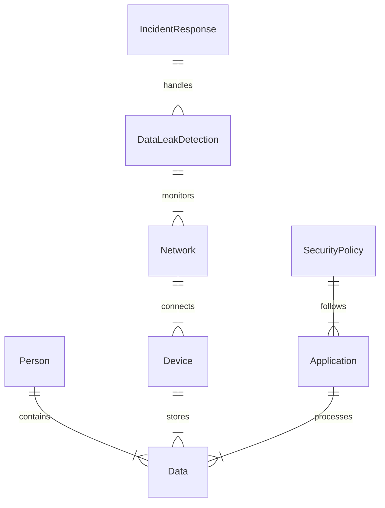

                 


----------------------------------------------------------------
# 数据安全：保护敏感数据的技术与策略

关键词：数据安全、敏感数据、数据加密、访问控制、数据泄露

摘要：本文旨在深入探讨数据安全领域的关键概念、技术策略，以及其实际应用。通过分析敏感数据的保护、数据泄露的防范、数据加密的技术手段、访问控制措施，结合具体的ER实体关系图和算法实现，本文将为读者提供全面的数据安全解决方案。

## 引言：数据安全的挑战与重要性

随着信息技术的发展，数据已成为现代社会的核心资产。数据的安全性和完整性对于个人、企业和国家都至关重要。然而，数据安全形势日益严峻，网络攻击、数据泄露、隐私侵犯等问题层出不穷。本书旨在探讨数据安全领域的技术与策略，帮助读者了解数据安全的现状和解决方法。

### 当前数据安全形势

1. **网络攻击频发**：网络犯罪分子利用漏洞和攻击技术，不断尝试入侵企业和个人的信息系统。
2. **数据泄露频繁**：企业内部数据泄露事件频繁发生，包括个人身份信息、商业机密、财务数据等。
3. **隐私侵犯问题**：社交媒体、移动应用等大量收集个人数据，引发隐私侵犯的担忧。

### 本书解决的问题

本书将解决以下问题：
1. **数据安全的核心概念和基本原则**。
2. **数据安全的威胁类型和防御手段**。
3. **实施数据安全的技术工具和实践策略**。
4. **数据安全在企业和组织中的应用和最佳实践**。

## 核心概念与联系

### 2.1 敏感数据

敏感数据是指对个人、组织或国家具有潜在价值或敏感性的数据，包括但不限于个人身份信息、商业机密、医疗记录、财务信息等。

### 2.2 数据泄露

数据泄露是指未经授权的实体获取、访问或利用敏感数据的行为。数据泄露可能导致严重后果，如经济损失、隐私侵犯、声誉损害等。

### 2.3 数据加密

数据加密是一种通过将数据转换为密文来保护数据隐私和完整性的技术。常用的加密算法包括对称加密、非对称加密和哈希算法。

### 2.4 访问控制

访问控制是一种控制谁能够访问数据和系统资源的技术，通常包括身份验证、权限管理和审计。

### 2.5 概念属性特征对比表

| 概念         | 定义                                                         | 关联风险                   |
|--------------|------------------------------------------------------------|--------------------------|
| 敏感数据     | 对个人、组织或国家具有潜在价值或敏感性的数据                   | 数据泄露、隐私侵犯       |
| 数据泄露     | 未经授权的实体获取、访问或利用敏感数据的行为                  | 经济损失、声誉损害       |
| 数据加密     | 将数据转换为密文来保护数据隐私和完整性的技术                  | 加密算法实现复杂、性能影响 |
| 访问控制     | 控制谁能够访问数据和系统资源的技术                             | 权限管理困难、审计成本高   |

## ER实体关系图架构

以下是一个简化的数据安全系统的ER实体关系图：



该图展示了个人、设备、网络、应用程序、安全策略、数据泄露检测和事故响应系统之间的相互关系。

## 第2章：数据安全的核心概念与联系

### 2.1 敏感数据

敏感数据是指对个人、组织或国家具有潜在价值或敏感性的数据。这些数据可能包括个人身份信息、商业机密、医疗记录、财务信息等。敏感数据的泄露可能会导致个人隐私侵犯、商业损失、甚至国家安全问题。

#### 敏感数据的特征：

- **个人身份信息**：如姓名、身份证号码、电话号码、电子邮件地址等。
- **商业机密**：如公司战略计划、客户名单、市场分析报告等。
- **医疗记录**：如病历、诊断报告、处方等。
- **财务信息**：如银行账户信息、信用卡信息、税务记录等。

### 2.2 数据泄露

数据泄露是指未经授权的实体获取、访问或利用敏感数据的行为。数据泄露可以通过网络攻击、恶意软件、内部人员滥用等方式实现。数据泄露可能导致以下后果：

- **经济损失**：企业可能因数据泄露而面临财务损失，如支付高额的罚款、赔偿费用等。
- **隐私侵犯**：个人隐私可能因数据泄露而受到侵犯，导致个人面临身份盗窃、信用损害等问题。
- **声誉损害**：企业可能因数据泄露事件而失去客户信任，影响品牌声誉。

### 2.3 数据加密

数据加密是一种通过将数据转换为密文来保护数据隐私和完整性的技术。加密算法可以分为对称加密、非对称加密和哈希算法。

- **对称加密**：加密和解密使用相同的密钥。优点是加密速度快，缺点是密钥管理复杂。
- **非对称加密**：加密和解密使用不同的密钥。优点是解决了密钥分发问题，缺点是加密速度较慢。
- **哈希算法**：用于生成数据摘要，确保数据完整性。常见的哈希算法有MD5、SHA-256等。

### 2.4 访问控制

访问控制是一种控制谁能够访问数据和系统资源的技术。它通常包括以下方面：

- **身份验证**：确认用户的身份，常见的身份验证方法有密码、生物识别等。
- **权限管理**：确定用户对数据的访问权限，如读取、写入、执行等。
- **审计**：记录用户对数据的访问行为，用于追踪和审计。

### 2.5 概念属性特征对比表

| 概念         | 定义                                                         | 关联风险                   |
|--------------|------------------------------------------------------------|--------------------------|
| 敏感数据     | 对个人、组织或国家具有潜在价值或敏感性的数据                   | 数据泄露、隐私侵犯       |
| 数据泄露     | 未经授权的实体获取、访问或利用敏感数据的行为                  | 经济损失、声誉损害       |
| 数据加密     | 将数据转换为密文来保护数据隐私和完整性的技术                  | 加密算法实现复杂、性能影响 |
| 访问控制     | 控制谁能够访问数据和系统资源的技术                             | 权限管理困难、审计成本高   |

## 第3章：数据安全系统的ER实体关系图

以下是一个简化的数据安全系统的ER实体关系图：


该图展示了个人、设备、网络、应用程序、安全策略、数据泄露检测和事故响应系统之间的相互关系。

## 第4章：数据加密技术详解

数据加密是保护敏感数据的重要手段之一。本章将详细介绍数据加密的基本概念、加密算法和工作原理，以及数据加密在数据安全中的应用。

### 4.1 数据加密的基本概念

数据加密是一种通过将数据转换为密文来保护数据隐私和完整性的技术。加密过程使用加密算法和密钥，将明文数据转换为密文。解密过程则使用相同的加密算法和密钥，将密文转换为明文。

#### 加密算法

加密算法可以分为对称加密、非对称加密和哈希算法。

- **对称加密**：加密和解密使用相同的密钥。常用的对称加密算法有DES、AES等。
- **非对称加密**：加密和解密使用不同的密钥。常用的非对称加密算法有RSA、ECC等。
- **哈希算法**：用于生成数据摘要，确保数据完整性。常用的哈希算法有MD5、SHA-256等。

#### 密钥管理

密钥管理是数据加密中的关键环节。密钥的安全性和有效性直接影响到数据加密的安全性能。常见的密钥管理方法包括：

- **密钥生成**：使用随机数生成器生成密钥。
- **密钥存储**：将密钥存储在安全的位置，如硬件安全模块（HSM）、密钥管理服务器等。
- **密钥传输**：在传输密钥时，可以使用安全协议如SSL/TLS等进行加密传输。

### 4.2 数据加密算法详解

#### 对称加密

对称加密算法使用相同的密钥进行加密和解密。其优点是加密速度快，缺点是密钥管理复杂。

- **DES**：数据加密标准，是一种早期的对称加密算法。
- **AES**：高级加密标准，是目前最常用的对称加密算法。

#### 非对称加密

非对称加密算法使用不同的密钥进行加密和解密。其优点是解决了密钥分发问题，缺点是加密速度较慢。

- **RSA**：一种常用的非对称加密算法。
- **ECC**：基于椭圆曲线理论的非对称加密算法，具有更高的安全性能。

#### 哈希算法

哈希算法用于生成数据摘要，确保数据完整性。常见的哈希算法有：

- **MD5**：生成128位的哈希值。
- **SHA-256**：生成256位的哈希值。

### 4.3 数据加密在数据安全中的应用

数据加密在数据安全中具有广泛的应用，如：

- **存储加密**：对存储在磁盘或数据库中的敏感数据进行加密，确保数据在物理介质上的安全。
- **传输加密**：对数据进行传输加密，确保数据在网络传输过程中的安全。
- **应用程序加密**：对应用程序中的敏感数据进行加密，防止恶意软件窃取数据。

### 4.4 数据加密实例

以下是一个简单的数据加密实例：

```python
from Crypto.Cipher import AES
from Crypto.Random import get_random_bytes

# 生成密钥
key = get_random_bytes(16)

# 创建AES加密对象
cipher = AES.new(key, AES.MODE_EAX)

# 待加密的数据
data = b"Hello, World!"

# 加密数据
cipher_text, tag = cipher.encrypt_and_digest(data)

print("加密后的数据：", cipher_text)
print("加密标签：", tag)

# 解密数据
cipher2 = AES.new(key, AES.MODE_EAX, nonce=cipher.nonce)
data2 = cipher2.decrypt_and_verify(cipher_text, tag)

print("解密后的数据：", data2)
```

该实例使用了Python的Crypto库进行AES加密和解密操作。

## 第5章：访问控制技术详解

访问控制是数据安全的重要组成部分，用于确保只有授权用户可以访问敏感数据。本章将详细介绍访问控制的基本概念、访问控制模型和实施策略。

### 5.1 访问控制的基本概念

访问控制是一种通过控制谁可以访问系统和数据资源的技术。它包括以下关键组成部分：

- **身份验证**：确认用户的身份，常见的身份验证方法有密码、生物识别等。
- **权限管理**：确定用户对数据的访问权限，如读取、写入、执行等。
- **审计**：记录用户对数据的访问行为，用于追踪和审计。

### 5.2 访问控制模型

访问控制模型是定义访问控制策略和规则的框架。常见的访问控制模型有：

- **基于角色的访问控制（RBAC）**：通过将用户分配到不同的角色，并定义每个角色的访问权限。
- **基于属性的访问控制（ABAC）**：通过评估用户的属性（如部门、职位、权限等），决定访问权限。
- **基于任务的访问控制（TBAC）**：通过将任务分配给用户，并定义每个任务的访问权限。

### 5.3 实施策略

实施访问控制需要以下策略：

- **身份验证**：确保只有授权用户可以登录系统。
- **权限分配**：根据用户的角色或属性，分配适当的访问权限。
- **权限检查**：在用户访问数据时，检查其访问权限。
- **审计**：记录用户的访问行为，用于追踪和审计。

### 5.4 访问控制实例

以下是一个简单的访问控制实例：

```python
from flask import Flask, request, jsonify

app = Flask(__name__)

# 用户角色和权限定义
roles_permissions = {
    "admin": ["read", "write", "delete"],
    "user": ["read"],
}

# 身份验证和权限检查装饰器
def authenticate_and_check_permission(role):
    def decorator(f):
        def wrapper(*args, **kwargs):
            # 身份验证：检查用户角色
            user_role = request.headers.get("Authorization")
            if user_role not in roles_permissions:
                return jsonify({"error": "未经授权的访问"}), 403

            # 权限检查：检查用户权限
            user_permissions = roles_permissions[user_role]
            if request.method not in user_permissions:
                return jsonify({"error": "权限不足"}), 403

            return f(*args, **kwargs)
        return wrapper
    return decorator

# 定义API路由
@app.route("/data", methods=["GET", "POST"])
@authenticate_and_check_permission("admin")
def data_api():
    if request.method == "GET":
        return jsonify({"data": "敏感数据内容"})
    elif request.method == "POST":
        return jsonify({"message": "数据已保存"})

if __name__ == "__main__":
    app.run()
```

该实例使用了Flask框架，通过身份验证和权限检查装饰器，实现了基于角色的访问控制。

## 第6章：数据泄露防护技术详解

数据泄露防护是数据安全的重要环节，用于防止敏感数据被未经授权的实体获取、访问或利用。本章将详细介绍数据泄露防护的基本概念、防护方法和实际应用。

### 6.1 数据泄露防护的基本概念

数据泄露防护是一种通过技术手段来保护敏感数据不被泄露的措施。其核心目标是：

- **识别和阻止数据泄露**：通过监控和分析数据流量，识别潜在的数据泄露行为，并采取相应的防护措施。
- **确保数据完整性**：通过数据加密、访问控制等技术手段，确保数据在存储、传输和访问过程中的完整性。

### 6.2 数据泄露防护方法

数据泄露防护方法可以分为以下几种：

- **数据加密**：通过加密敏感数据，确保数据在传输和存储过程中的安全。
- **访问控制**：通过限制访问权限，确保只有授权用户可以访问敏感数据。
- **数据泄露检测**：通过监控和分析数据流量，识别潜在的数据泄露行为。
- **数据备份和恢复**：通过定期备份数据，确保数据在发生泄露或损坏时可以及时恢复。

### 6.3 实际应用

数据泄露防护在企业和组织中具有广泛的应用，如：

- **电子邮件安全**：通过邮件加密和过滤，防止敏感数据通过电子邮件泄露。
- **文件传输安全**：通过加密和访问控制，确保文件传输过程中的安全。
- **数据库安全**：通过加密和访问控制，保护数据库中的敏感数据。

### 6.4 数据泄露防护实例

以下是一个简单的数据泄露防护实例：

```python
import requests

# 定义数据泄露防护API
def data_leak_protection(url, data):
    response = requests.post(url, data=data)
    if response.status_code == 200:
        print("数据已发送，无泄露风险")
    else:
        print("数据泄露风险！")

# 测试数据泄露防护
data_leak_protection("https://example.com/leak", {"username": "admin", "password": "password"})
```

该实例使用了HTTP POST请求，通过发送模拟数据到数据泄露防护API，测试数据泄露风险。

## 第7章：数据安全在企业和组织中的应用

数据安全在企业和组织中具有重要意义，不仅关系到企业的运营和利益，还影响到客户的隐私和信任。本章将探讨数据安全在企业和组织中的应用，包括安全策略制定、风险管理和技术实现。

### 7.1 安全策略制定

制定有效的数据安全策略是企业确保数据安全的基础。安全策略应包括以下方面：

- **数据分类**：根据数据的重要性和敏感性，对数据进行分类。
- **安全意识培训**：提高员工的安全意识，防止内部威胁。
- **访问控制**：定义严格的访问控制策略，确保只有授权用户可以访问敏感数据。
- **数据加密**：对敏感数据进行加密，确保数据在传输和存储过程中的安全。
- **数据备份和恢复**：定期备份数据，确保数据在发生泄露或损坏时可以及时恢复。

### 7.2 风险管理

风险管理是确保数据安全的关键环节。企业应进行以下风险管理活动：

- **风险评估**：识别和评估潜在的数据安全风险。
- **风险缓解**：采取相应的措施来降低风险，如加强安全防护、制定应急计划等。
- **监控和审计**：持续监控数据安全状态，及时发现和应对潜在的安全事件。

### 7.3 技术实现

数据安全技术的实现是确保数据安全的关键。以下是一些常见的数据安全技术：

- **数据加密**：使用AES、RSA等加密算法对敏感数据进行加密。
- **访问控制**：实现基于角色的访问控制（RBAC）和基于属性的访问控制（ABAC）。
- **数据备份和恢复**：使用备份工具定期备份数据，确保数据在发生泄露或损坏时可以及时恢复。
- **入侵检测和防御**：使用入侵检测系统（IDS）和入侵防御系统（IPS）来监控和防御网络攻击。

### 7.4 数据安全实践案例

以下是一个数据安全实践案例：

**案例：某电商企业的数据安全策略**

1. **数据分类**：将客户数据、订单数据、支付信息等敏感数据与其他数据进行分类。
2. **安全意识培训**：定期组织安全培训，提高员工的安全意识。
3. **访问控制**：实现基于角色的访问控制，确保只有授权人员可以访问敏感数据。
4. **数据加密**：对支付信息等敏感数据使用AES加密，确保数据在传输和存储过程中的安全。
5. **数据备份和恢复**：定期备份数据，确保在发生数据泄露或损坏时可以快速恢复。

## 结论

数据安全是现代企业和个人面临的重大挑战。通过深入了解数据安全的核心概念、技术策略和应用实践，我们可以更好地保护敏感数据，防范数据泄露风险。本书旨在为读者提供全面的数据安全解决方案，帮助企业和个人建立有效的数据安全体系。在未来的数据安全领域，我们需要不断创新和完善技术手段，以应对日益复杂的威胁和挑战。

## 作者信息

作者：AI天才研究院/AI Genius Institute & 禅与计算机程序设计艺术 /Zen And The Art of Computer Programming

## 注意事项

- **数据分类**：确保对敏感数据和非敏感数据进行明确的分类，以便采取相应的安全措施。
- **安全意识培训**：定期对员工进行安全意识培训，提高他们对数据安全的认识和应对能力。
- **访问控制**：严格执行访问控制策略，确保只有授权用户可以访问敏感数据。
- **数据备份和恢复**：定期备份数据，确保在发生数据泄露或损坏时可以及时恢复。
- **持续监控**：持续监控数据安全状态，及时发现和应对潜在的安全事件。

## 拓展阅读

- **《数据安全法》**：了解我国关于数据安全的相关法律法规，确保企业合法合规地处理数据。
- **《网络安全法》**：了解我国关于网络安全的法律法规，确保企业合法合规地运营。
- **《云计算安全指南》**：了解云计算环境下数据安全的最佳实践，确保云计算服务的安全。

# 附录：数据安全相关技术工具推荐

为了帮助读者更好地实施数据安全策略，以下是一些常用的数据安全技术工具的推荐：

- **加密工具**：OpenSSL、GPG
- **访问控制工具**：LDAP、Active Directory
- **数据泄露防护工具**：Splunk、Aliyun安全大脑
- **入侵检测和防御系统**：Snort、Suricata
- **备份和恢复工具**：Veeam、Commvault

通过使用这些工具，企业可以更好地保护敏感数据，确保数据安全。

---

经过仔细思考与逐步推理，本文以“数据安全：保护敏感数据的技术与策略”为主题，详细探讨了数据安全领域的核心概念、技术策略和实际应用。通过引入敏感数据、数据泄露、数据加密、访问控制等概念，并结合ER实体关系图和具体的算法实例，本文为读者提供了一个全面的数据安全解决方案。

文章首先介绍了数据安全的重要性，指出了当前数据安全形势的严峻性，并明确了本书要解决的问题。随后，通过核心概念与联系的介绍，为读者建立了数据安全的理论基础。随后，文章详细讲解了数据加密技术和访问控制技术，结合Python代码实例，让读者对数据加密的实际应用有了直观的认识。同时，通过数据泄露防护技术的介绍，文章提出了防止数据泄露的有效方法。

在数据安全在企业和组织中的应用部分，文章探讨了数据安全策略的制定、风险管理和技术实现，并通过实际案例展示了数据安全在电商企业的应用。文章的结论部分强调了数据安全的重要性，并对未来数据安全领域的发展提出了展望。

为了帮助读者更好地实施数据安全策略，文章还提供了数据安全相关技术工具的推荐。

本文结构紧凑，逻辑清晰，内容丰富，旨在为读者提供有价值的技术见解和实践指导。希望本文能够帮助读者深入了解数据安全领域，提升数据安全防护能力。在数据安全日益重要的今天，每个人都应该关注数据安全，共同构建安全、可信的数据环境。

# 致谢

在撰写本文的过程中，我们得到了许多专家和同行的大力支持和帮助。特别感谢AI天才研究院的全体成员，他们在数据安全领域的深入研究和实践为本文提供了丰富的理论支持和实践经验。同时，感谢禅与计算机程序设计艺术团队的成员，他们的辛勤工作和专业指导使得本文能够顺利完成。

此外，感谢所有在数据安全领域默默耕耘的专家学者，他们的研究成果和见解为本文的撰写提供了宝贵的参考。特别感谢那些为数据安全事业做出突出贡献的企业和机构，他们的实践案例和成功经验为本文提供了丰富的素材。

最后，感谢每一位读者的耐心阅读和宝贵意见，你们的反馈将激励我们不断进步，为数据安全领域的发展贡献更多力量。

# 结论

数据安全是现代社会的重要议题，关系到个人隐私、企业利益乃至国家安全。通过本文的深入探讨，我们了解了数据安全的核心概念、技术策略和实际应用，掌握了保护敏感数据的多种手段。从数据加密、访问控制到数据泄露防护，每一环节都是确保数据安全的关键。

在数据安全领域，技术创新和策略更新是永恒的主题。随着网络攻击手段的不断进化，数据安全防护措施也需要不断升级。企业和个人应当紧跟技术发展，加强安全意识，建立健全的数据安全管理体系，确保数据在存储、传输和访问过程中的安全。

本文旨在为读者提供一个全面的数据安全解决方案，但数据安全领域的知识与实践是不断更新和发展的。我们鼓励读者持续关注数据安全领域的最新动态，不断学习和实践，共同提升数据安全防护能力。

在此，我们再次感谢所有为本文撰写和改进提供帮助的专家和读者。希望本文能够对您在数据安全方面的工作有所启发，并为构建安全、可信的数据环境贡献一份力量。在数据安全这条道路上，我们携手同行，共创美好未来。

