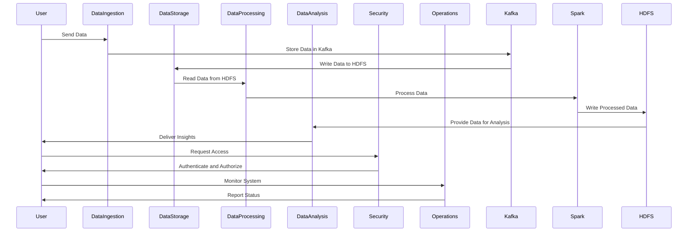

                 

# 数据湖架构设计与实现

## 关键词
- 数据湖架构
- 分布式系统
- 海量数据存储
- 数据处理流程
- 数据质量管理
- 数据安全

## 摘要
本文将探讨数据湖架构的设计与实现，从核心概念、设计原则、技术选型、数据质量管理与安全策略、运维与管理方法等方面进行深入分析。通过本文，读者将了解数据湖架构的基本原理和设计方法，掌握数据湖在实践中的应用技巧，为企业的数据管理提供有力的技术支持。

## 引言和背景介绍

### 引言

数据湖作为一种新兴的数据管理架构，已成为大数据时代企业应对海量数据管理的重要工具。数据湖能够存储和管理各种类型的数据，包括结构化、半结构化和非结构化数据，为数据分析和业务决策提供了丰富的数据源。随着企业对数据价值的重视，数据湖架构的设计与实现变得越来越重要。

### 背景介绍

在传统的数据管理架构中，数据仓库是主要的数据存储和处理系统。数据仓库通过ETL（Extract, Transform, Load）过程，将结构化数据从源系统提取、转换并加载到数据仓库中，以支持报表和分析。然而，随着数据量的增长和数据类型的多样化，传统的数据仓库架构面临诸多挑战：

1. **数据多样性**：传统数据仓库主要支持结构化数据，对于半结构化和非结构化数据的支持有限。
2. **扩展性**：传统的数据仓库采用集中式架构，扩展性较差，难以应对海量数据的存储和处理需求。
3. **数据处理效率**：传统的数据处理方法依赖于批处理，响应速度较慢，难以满足实时数据处理的业务需求。
4. **成本**：随着数据量的增加，数据仓库的维护成本和存储成本也随之上升。

针对上述问题，数据湖架构应运而生。数据湖采用分布式存储和处理技术，能够高效地处理海量数据，支持多种数据类型的存储，并提供灵活的数据访问和处理方式。数据湖不仅能够解决传统数据仓库的诸多问题，还能够为企业提供更加灵活、高效的数据管理解决方案。

## 问题背景

在现代企业的数据管理实践中，数据湖的应用场景日益广泛。以下问题是在设计和实现数据湖架构时需要考虑的：

1. **数据源接入**：企业中的数据来源多种多样，包括关系型数据库、NoSQL数据库、文件系统、消息队列等。如何有效地将各种数据源接入数据湖，是一个重要的挑战。
2. **数据存储**：数据湖需要支持海量数据的存储，选择合适的存储技术是关键。常用的存储技术包括Hadoop HDFS、Apache HBase、Apache Cassandra、Amazon S3等，每种技术都有其优缺点，需要根据实际需求进行选择。
3. **数据处理**：数据湖需要支持复杂的数据处理任务，包括数据的清洗、转换、聚合等。如何设计高效的数据处理流程，提高数据处理效率，是数据湖架构设计的重要问题。
4. **数据质量**：数据湖中的数据质量对数据分析结果具有重要影响。如何保证数据的质量，是数据湖设计中需要考虑的问题。
5. **数据安全**：随着数据湖中存储的数据量的增加，数据安全成为了一个重要的问题。如何确保数据在数据湖中的安全，防止数据泄露和未经授权的访问，是数据湖架构设计的关键问题。
6. **运维管理**：数据湖的运维和管理是一个复杂的过程，包括数据监控、故障处理、性能优化等。如何有效地管理和维护数据湖，是数据湖架构设计的一个重要方面。

## 问题解决

为了解决上述问题，本文将从以下几个方面介绍数据湖架构的设计与实现：

1. **数据湖架构的核心概念与联系**：介绍数据湖的基本概念、特点，与数据仓库的区别，以及数据湖的关键组成部分。
2. **数据湖架构的设计原则与最佳实践**：讨论数据湖架构设计的原则，包括数据源接入、数据存储、数据处理、数据分析等环节的最佳实践。
3. **数据湖存储与处理技术选型**：分析常用的数据存储和处理技术，比较它们的优缺点，并给出选型建议。
4. **数据湖数据质量管理与安全策略**：介绍数据质量管理的方法和工具，以及数据安全策略的制定和实施。
5. **数据湖运维与管理方法**：讨论数据湖的运维管理方法，包括数据监控、故障处理、性能优化等。

通过本文的介绍，读者可以系统地了解数据湖架构的设计与实现方法，为实际项目中的数据湖构建提供参考。

## 边界与外延

本文主要关注企业级数据湖架构的设计与实现，主要涉及以下方面：

1. **数据源接入**：包括关系型数据库、NoSQL数据库、文件系统、消息队列等。
2. **数据存储**：包括Hadoop HDFS、Apache HBase、Apache Cassandra、Amazon S3等。
3. **数据处理**：包括Apache Spark、Flink、MapReduce等。
4. **数据分析**：包括SQL查询、数据挖掘、机器学习等。
5. **数据应用**：包括数据可视化、数据应用开发等。

然而，数据湖架构的设计与实现是一个复杂的过程，涉及多个技术领域和业务场景。本文仅提供了一个基本的框架和思路，具体的实现细节需要根据实际需求和场景进行调整和优化。

## 数据湖核心概念与联系

### 数据湖的定义与特点

数据湖是一个集中存储海量结构化和非结构化数据的分布式系统，它允许以原始格式存储数据，直到用户需要对其进行处理。与传统数据仓库相比，数据湖具有以下特点：

1. **存储格式灵活**：数据湖支持各种数据格式，包括结构化、半结构化和非结构化数据，如JSON、XML、CSV、图像、视频等。
2. **高扩展性**：数据湖采用分布式存储架构，可以水平扩展，以应对海量数据的存储需求。
3. **弹性计算**：数据湖可以根据数据处理任务的需求动态调整计算资源，以优化性能和降低成本。
4. **低成本**：数据湖通常基于开源技术构建，如Apache Hadoop、Apache Spark等，降低了建设和维护成本。
5. **无需预先建模**：数据湖不需要在存储数据前进行数据建模，数据可以以原始格式存储，直到用户需要进行数据处理和分析。

### 数据湖与数据仓库的区别

数据湖和数据仓库都是用于存储和管理数据的系统，但它们在设计目标和应用场景上存在显著差异：

1. **定义区别**：
   - **数据湖**：以原始格式存储数据，支持多种数据处理和分析方式，如ETL、ELT、批处理、实时处理等。
   - **数据仓库**：对数据进行预处理后存储，主要用于报表生成、数据分析、业务决策支持。

2. **功能区别**：
   - **数据湖**：更注重数据的存储和管理，支持数据探索、初步分析和数据治理。
   - **数据仓库**：更注重数据分析和报表生成，为业务决策提供支持。

3. **适用场景**：
   - **数据湖**：适用于需要进行复杂数据分析和探索的企业，尤其是数据类型多样、数据量巨大的场景。
   - **数据仓库**：适用于需要快速生成报表、进行传统数据分析的场景，如金融、制造等行业。

### 数据湖的关键组成部分

数据湖架构由多个关键组成部分构成，每个部分在数据湖中扮演着重要的角色：

1. **数据接入**：
   - 负责从各种数据源（如关系型数据库、NoSQL数据库、文件系统、消息队列等）收集数据。
   - 数据接入需要确保数据的完整性和一致性，支持数据流和批量数据导入。

2. **数据存储**：
   - 数据存储是数据湖的核心，负责存储和管理海量数据。
   - 常用的存储技术包括Hadoop HDFS、Apache HBase、Apache Cassandra、Amazon S3等。
   - 数据存储需要支持高可用性、高可靠性和高效的数据访问。

3. **数据处理**：
   - 数据处理负责对数据湖中的数据进行清洗、转换、聚合等操作。
   - 常用的数据处理技术包括Apache Spark、Flink、MapReduce等。
   - 数据处理需要支持多种数据处理模式，如批处理、实时处理等。

4. **数据分析**：
   - 数据分析负责对处理后的数据进行深度分析，以支持业务决策。
   - 数据分析包括SQL查询、数据挖掘、机器学习等。
   - 数据分析需要提供灵活的数据访问接口和丰富的分析工具。

### 数据湖架构的ER实体关系图

以下是一个简单的ER实体关系图，用于描述数据湖架构中的关键实体及其关系：

```mermaid
erDiagram
    DataLake ||--|{ DataIngestion } : 数据接入
    DataLake ||--|{ DataStorage } : 数据存储
    DataLake ||--|{ DataProcessing } : 数据处理
    DataLake ||--|{ DataAnalysis } : 数据分析
    DataIngestion ||--|{ DataSource } : 数据源
    DataStorage ||--|{ StorageTechnologies } : 存储技术
    DataProcessing ||--|{ ProcessingTechnologies } : 处理技术
    DataAnalysis ||--|{ AnalysisTools } : 分析工具
```

### 数据湖的核心概念联系总结

数据湖作为一种新型的数据管理架构，其核心概念包括数据接入、数据存储、数据处理和数据分析。数据接入负责将各种数据源的数据导入数据湖，数据存储负责存储和管理海量数据，数据处理负责对数据进行清洗、转换和计算，数据分析负责对处理后的数据进行深入分析。数据湖与数据仓库的区别在于存储格式、功能和应用场景。数据湖采用分布式存储架构，支持多种数据格式，更注重数据的存储和管理；而数据仓库对数据进行预处理后存储，主要用于报表生成和数据分析。数据湖的关键组成部分包括数据接入、数据存储、数据处理和数据分析，每个部分在数据湖中扮演着重要的角色。通过理解数据湖的核心概念和联系，可以更好地设计和实现数据湖架构，为企业的数据管理提供有力支持。## Step 3: 数据湖架构设计原则与最佳实践

### 设计原则

在设计数据湖架构时，需要遵循一系列原则，以确保架构的可靠性、灵活性和可扩展性。以下是一些关键设计原则：

1. **模块化设计**：
   - 数据湖架构应采用模块化设计，将不同的功能模块（如数据接入、数据存储、数据处理、数据分析等）分离，以便于独立维护和升级。
   - 模块化设计有助于提高系统的可维护性和可扩展性。

2. **分布式架构**：
   - 数据湖应采用分布式架构，以支持海量数据的存储和处理。
   - 分布式架构可以提高系统的可用性和容错性。

3. **高可用性**：
   - 数据湖架构应具备高可用性，确保数据的可靠存储和处理。
   - 高可用性可以通过数据复制、负载均衡和故障转移等机制来实现。

4. **安全性**：
   - 数据湖应具备严格的安全策略，包括数据加密、访问控制、审计等。
   - 安全性措施可以防止数据泄露和未经授权的访问。

5. **可扩展性**：
   - 数据湖架构应具备良好的可扩展性，以应对数据量的增长和处理需求的变化。
   - 可扩展性可以通过水平扩展（增加节点）和垂直扩展（增加资源）来实现。

6. **灵活的数据格式支持**：
   - 数据湖应支持多种数据格式，包括结构化、半结构化和非结构化数据。
   - 灵活的数据格式支持可以提高数据利用效率，满足不同的业务需求。

### 最佳实践

在数据湖架构设计过程中，可以遵循以下最佳实践：

1. **数据分层**：
   - 数据湖应采用分层存储策略，将数据分为冷数据和热数据，以便于优化存储和处理资源。
   - 冷数据通常存储在成本较低、访问频率较低的存储介质中，而热数据存储在高速存储设备上，以提高数据处理效率。

2. **数据接入与同步**：
   - 数据接入应采用实时同步和批量同步相结合的方式，确保数据的实时性和完整性。
   - 实时同步适用于对数据实时性要求较高的场景，而批量同步适用于数据量较大、更新频率较低的场景。

3. **数据处理流程优化**：
   - 数据处理流程应进行优化，以减少数据处理延迟，提高处理效率。
   - 优化策略包括数据分片、数据缓存、计算资源的动态调整等。

4. **数据质量管理**：
   - 数据质量管理是数据湖架构设计中的重要环节，应确保数据的准确性、完整性和一致性。
   - 数据质量管理可以通过数据清洗、数据校验、数据监控等手段来实现。

5. **安全性策略**：
   - 数据湖架构应制定严格的安全性策略，包括数据加密、访问控制、身份认证等。
   - 安全性策略可以防止数据泄露和未经授权的访问。

6. **运维与管理**：
   - 数据湖的运维与管理是一个复杂的过程，应采用自动化工具和流程，以提高运维效率。
   - 运维与管理包括数据监控、故障处理、性能优化等。

通过遵循上述设计原则和最佳实践，可以设计出一个高效、可扩展且易于管理的数据湖架构，为企业的数据管理提供有力支持。

### 数据湖架构设计实例

为了更好地理解数据湖架构的设计原则和最佳实践，下面通过一个实例进行说明。

#### 项目背景

某大型电商企业希望构建一个数据湖，以存储和管理其业务运营过程中产生的海量数据，包括用户行为数据、交易数据、商品数据等。该数据湖需要支持实时数据分析和离线数据分析，为企业提供数据驱动决策支持。

#### 架构设计

1. **数据接入**：
   - 数据源包括关系型数据库（如MySQL）、NoSQL数据库（如MongoDB）、日志文件、第三方API等。
   - 采用Kafka作为消息队列，实现数据的实时接入和批量接入。
   - 实时接入：使用Kafka Connect连接数据库和Kafka，实现数据的实时同步。
   - 批量接入：定期将数据从数据库和文件系统中导出，并加载到Kafka中。

2. **数据存储**：
   - 采用Hadoop HDFS作为主要存储介质，存储原始数据和转换后的数据。
   - 对热数据使用HDFS的高性能存储，对冷数据使用低成本存储。

3. **数据处理**：
   - 使用Apache Spark进行数据处理，包括数据清洗、转换、聚合等。
   - Spark的任务调度和资源管理由YARN负责，确保数据处理的高效性和可扩展性。

4. **数据分析**：
   - 采用Apache Hive和Apache Impala进行SQL查询和实时分析。
   - 使用Apache Spark MLlib进行机器学习模型的训练和预测。

5. **数据安全**：
   - 数据加密：使用Kerberos和SSL/TLS实现数据传输加密。
   - 访问控制：使用Apache Ranger进行数据访问控制，确保只有授权用户可以访问特定数据。

6. **运维管理**：
   - 使用Apache Ambari进行数据湖的监控和管理。
   - 实施自动化运维，包括数据备份、故障恢复、性能优化等。

#### 架构图

以下是一个简化的数据湖架构图：



通过上述实例，可以看到数据湖架构设计如何遵循设计原则和最佳实践，实现高效、可扩展且安全的数据管理。在实际项目中，根据具体需求和场景，可以进一步优化和调整架构设计。

### 数据湖架构设计总结

数据湖架构设计是一个复杂而关键的过程，需要综合考虑数据接入、数据存储、数据处理、数据分析和数据安全等多个方面。通过遵循设计原则和最佳实践，可以确保数据湖架构的高效性、可扩展性和安全性。关键设计原则包括模块化设计、分布式架构、高可用性、安全性、可扩展性和灵活的数据格式支持。最佳实践包括数据分层、数据接入与同步、数据处理流程优化、数据质量管理、安全性策略和运维管理。通过实例分析和架构图的展示，读者可以更好地理解数据湖架构的设计方法和应用场景。在设计和实现数据湖时，应结合实际需求，灵活调整和优化架构，以实现最佳效果。

### 数据湖存储与处理技术选型

#### 常用数据存储技术

数据湖的存储技术是架构设计中的关键环节，下面介绍几种常用的数据存储技术，并分析它们的优缺点：

1. **Hadoop HDFS**：
   - **优点**：Hadoop HDFS（Hadoop Distributed File System）是一种分布式文件系统，具有高可靠性、高扩展性和高吞吐量。它支持海量数据的存储，适用于大数据场景。
   - **缺点**：HDFS不适合存储小文件，因为它会产生大量的小数据块，导致存储空间的浪费。此外，HDFS的读写性能相对较低，不适合低延迟和高并发场景。

2. **Apache HBase**：
   - **优点**：Apache HBase是一个分布式、可扩展的列式存储系统，基于Hadoop HDFS构建。它支持实时随机读写操作，适用于需要快速数据访问的场景。
   - **缺点**：HBase的数据存储和访问成本较高，不适合存储大量的小文件。此外，HBase的表结构设计相对复杂，需要进行预定义。

3. **Apache Cassandra**：
   - **优点**：Apache Cassandra是一个分布式键值存储系统，具有高可用性、高性能和可扩展性。它适用于跨多个数据中心的分布式数据存储。
   - **缺点**：Cassandra的查询语言相对有限，不适合复杂查询。此外，Cassandra的表结构设计较为复杂，需要进行预定义。

4. **Amazon S3**：
   - **优点**：Amazon S3（Simple Storage Service）是一种云存储服务，具有高可靠性、高扩展性和低成本。它支持海量数据的存储，适用于各种数据类型的存储。
   - **缺点**：S3的读写性能相对较低，不适合低延迟和高并发场景。此外，S3不支持实时数据访问，适用于离线数据处理。

#### 常用数据处理技术

数据处理技术在数据湖架构中同样扮演着重要角色，下面介绍几种常用的数据处理技术，并分析它们的优缺点：

1. **Apache Spark**：
   - **优点**：Apache Spark是一个分布式数据处理引擎，支持批处理和实时处理。它具有高性能、高吞吐量和易于使用的API，适用于大数据处理场景。
   - **缺点**：Spark的依赖关系较复杂，需要配置和管理多个组件。此外，Spark不适合处理小数据集，因为它会产生较高的资源开销。

2. **Apache Flink**：
   - **优点**：Apache Flink是一个分布式流处理引擎，支持实时数据流处理。它具有高性能、低延迟和事件驱动的特性，适用于需要实时数据处理的场景。
   - **缺点**：Flink的API相对复杂，学习曲线较陡。此外，Flink的生态系统相对较新，某些功能可能不如Spark成熟。

3. **MapReduce**：
   - **优点**：MapReduce是一个基于Hadoop的分布式数据处理模型，具有高可靠性和高扩展性。它适用于大规模数据处理场景，尤其适合批处理任务。
   - **缺点**：MapReduce的编程模型相对复杂，不适合处理实时数据。此外，MapReduce的迭代和交互性较差。

4. **Apache Storm**：
   - **优点**：Apache Storm是一个分布式实时处理系统，支持实时数据流处理。它具有低延迟和高吞吐量的特性，适用于需要实时数据处理的场景。
   - **缺点**：Storm的生态系统相对较小，某些功能可能不如Spark和Flink成熟。此外，Storm的编程模型相对复杂。

#### 选型建议

在选择数据存储和处理技术时，应综合考虑以下因素：

1. **数据类型**：根据数据类型选择合适的存储技术。例如，对于结构化数据，可以选择HDFS、HBase或Cassandra；对于非结构化数据，可以选择S3。

2. **性能需求**：根据数据处理性能需求选择合适的技术。对于低延迟和高并发场景，可以选择HBase、Cassandra或Flink；对于批处理场景，可以选择MapReduce。

3. **成本**：根据预算和成本选择合适的技术。开源技术（如Spark、Flink、HDFS）通常成本较低，但可能需要自行维护和管理；商业技术（如Amazon S3、HBase）通常成本较高，但提供更好的性能和稳定性。

4. **生态系统和社区支持**：选择具有成熟生态系统和良好社区支持的技术，以便在遇到问题时能够得到帮助。

5. **可扩展性**：选择具有良好可扩展性的技术，以应对未来数据量和处理需求的增长。

通过综合考虑上述因素，可以选择合适的数据存储和处理技术，构建一个高效、可靠且可扩展的数据湖架构。

### 数据质量管理

#### 数据质量管理的重要性

数据质量管理是数据湖架构设计中的关键环节，它直接影响到数据分析和业务决策的准确性。高质量的数据可以为企业提供可靠的决策依据，而数据质量问题可能导致分析结果错误，甚至导致业务决策失误。以下是一些常见的数据质量问题：

1. **数据不一致**：不同来源的数据可能在格式、定义或计算方法上存在差异，导致数据不一致。
2. **数据缺失**：数据在采集或传输过程中可能丢失，导致分析结果缺失关键信息。
3. **数据错误**：数据在采集、处理或传输过程中可能发生错误，如输入错误、处理错误等。
4. **数据老化**：数据湖中的数据可能随时间逐渐老化，失去时效性，影响分析结果的准确性。

#### 数据质量管理的方法和工具

为了确保数据湖中的数据质量，可以采用以下方法和工具：

1. **数据清洗**：数据清洗是数据质量管理的基础，包括去除重复数据、修复错误数据、填充缺失数据等。常用的数据清洗工具包括Apache Spark、Apache Flink等。
2. **数据校验**：数据校验是确保数据符合预期标准的过程，包括数据格式校验、数据范围校验、数据一致性校验等。常用的数据校验工具包括Apache Hive、Apache Impala等。
3. **数据监控**：数据监控是实时检测数据质量的过程，包括监控数据源、数据处理过程和数据分析结果。常用的数据监控工具包括Apache Ambari、Apache ZooKeeper等。
4. **数据审计**：数据审计是对数据质量进行系统性检查和评估的过程，包括数据质量的定期审计、数据质量的回顾性审计等。常用的数据审计工具包括Apache Ranger、Apache Knox等。

#### 数据质量管理策略

为了实现有效的数据质量管理，可以制定以下策略：

1. **制定数据质量标准**：根据业务需求和数据特点，制定数据质量标准，包括数据准确性、完整性、一致性、时效性等。
2. **数据质量管理流程**：建立数据质量管理流程，包括数据清洗、数据校验、数据监控和审计等环节。
3. **数据质量培训**：对相关人员进行数据质量管理培训，提高数据质量意识和能力。
4. **数据质量监控和反馈**：建立数据质量监控机制，及时发现和解决数据质量问题，并进行反馈和改进。

通过实施有效的数据质量管理策略，可以确保数据湖中的数据质量，为数据分析提供可靠的数据基础。

### 数据湖运维与管理方法

#### 数据湖运维管理的重要性

数据湖运维管理是确保数据湖系统稳定运行、高效管理和持续优化的重要环节。随着数据湖中数据的不断增长和处理需求的复杂化，运维管理的难度也在不断增加。有效的数据湖运维管理能够提高数据湖的性能、可靠性和安全性，确保数据湖能够持续为企业提供价值。

#### 数据湖监控

数据湖监控是运维管理的基础，它包括以下几个方面：

1. **系统监控**：监控数据湖中的各个组件（如HDFS、YARN、Spark等）的健康状态和性能指标，包括CPU利用率、内存使用率、网络延迟等。
2. **数据监控**：监控数据的流入、流出和处理速度，确保数据传输的稳定性。
3. **性能监控**：监控数据处理任务的执行情况，包括任务的响应时间、资源利用率、执行效率等。
4. **日志监控**：收集和分析数据湖系统的日志，及时发现和解决问题。

#### 故障处理

故障处理是数据湖运维管理的重要任务，它包括以下几个方面：

1. **故障预警**：通过监控系统的实时数据，提前预警可能出现的问题，如资源不足、任务延迟等。
2. **故障定位**：当系统出现故障时，迅速定位故障点，如特定组件、任务或数据源。
3. **故障恢复**：采取相应的措施进行故障恢复，如重启故障组件、重新执行任务等。
4. **故障记录**：记录故障的详细信息，包括故障原因、处理过程和恢复结果，以便后续分析和改进。

#### 性能优化

数据湖的性能优化是提高数据处理效率和用户体验的重要手段，它包括以下几个方面：

1. **资源调配**：根据数据湖的处理需求和资源利用率，动态调整计算资源和存储资源。
2. **任务调度**：优化任务的调度策略，确保任务能够高效地执行，如任务分片、负载均衡等。
3. **缓存管理**：合理使用缓存技术，减少数据的重复处理和传输，提高数据访问速度。
4. **数据压缩**：对数据进行压缩，减少存储空间和传输带宽的占用。

#### 运维工具

为了提高数据湖的运维效率，可以采用以下运维工具：

1. **Apache Ambari**：Ambari是一个开源的数据湖管理平台，提供系统监控、故障处理、性能优化等功能。
2. **Apache ZooKeeper**：ZooKeeper是一个分布式协调服务，用于管理分布式数据湖中的节点状态和配置信息。
3. **Apache Ranger**：Ranger是一个数据访问控制平台，用于管理数据湖中的访问权限和安全策略。
4. **Apache Knox**：Knox是一个Web访问管理器，用于保护数据湖的API访问，确保数据安全。

#### 自动化运维

自动化运维是提高数据湖运维效率的关键，它包括以下几个方面：

1. **脚本化**：使用脚本自动化执行常见的运维任务，如数据备份、故障恢复等。
2. **配置管理**：使用配置管理工具（如Ansible、Puppet等）管理数据湖的配置，确保配置的一致性和可追溯性。
3. **监控告警**：通过监控系统的实时数据，自动化触发告警和故障处理流程。
4. **自动化部署**：使用容器化技术（如Docker、Kubernetes等）实现数据湖的自动化部署和扩展。

通过实施有效的数据湖运维管理方法，可以确保数据湖系统的稳定运行、高效管理和持续优化，为企业提供可靠的数据服务。

### 数据湖架构设计与实现总结

数据湖架构设计与实现是一个复杂而关键的过程，涉及数据接入、数据存储、数据处理、数据分析和数据安全等多个方面。本文系统地介绍了数据湖架构的核心概念与联系，探讨了数据湖与数据仓库的区别，详细分析了数据湖的关键组成部分，包括数据接入、数据存储、数据处理和数据分析。同时，本文还讨论了数据湖架构的设计原则与最佳实践，以及数据存储和处理技术的选型。在数据质量管理方面，本文介绍了数据质量管理的重要性、方法和工具，以及数据质量管理策略。此外，本文还探讨了数据湖运维与管理方法，包括数据湖监控、故障处理、性能优化和自动化运维。

通过本文的介绍，读者可以系统地了解数据湖架构的设计与实现方法，掌握数据湖在实践中的应用技巧。在实际项目中，可以根据具体需求，灵活调整和优化数据湖架构，构建一个高效、可靠且可扩展的数据湖系统，为企业的数据管理提供有力支持。

### 最佳实践 Tips

在设计数据湖架构时，可以参考以下最佳实践：

1. **数据分层存储**：根据数据的访问频率和重要性，将数据分为冷数据、温数据和热数据，分别存储在不同的存储介质上，以提高存储效率和数据处理性能。

2. **数据接入策略**：结合实时性和批量处理的需求，选择合适的接入策略。对于实时性要求较高的数据，可以采用实时数据流处理技术；对于批量处理的数据，可以采用批量数据处理技术。

3. **数据处理优化**：合理分配计算资源，优化数据处理流程，提高数据处理效率。例如，使用分布式计算技术，将数据处理任务分解为多个子任务并行执行。

4. **数据质量管理**：建立完善的数据质量管理机制，包括数据清洗、数据校验、数据监控和审计等，确保数据质量。

5. **安全性策略**：制定严格的安全策略，包括数据加密、访问控制、身份认证等，确保数据在数据湖中的安全。

6. **运维自动化**：采用自动化运维工具和流程，提高运维效率，降低运维成本。例如，使用配置管理工具管理配置，使用监控工具进行实时监控和告警。

### 小结

本文系统地介绍了数据湖架构的设计与实现，包括核心概念、设计原则、技术选型、数据质量管理与安全策略、运维与管理方法等内容。通过本文的介绍，读者可以全面了解数据湖架构的原理和方法，掌握数据湖在实践中的应用技巧。在实际项目中，可以根据具体需求，灵活调整和优化数据湖架构，构建一个高效、可靠且可扩展的数据湖系统，为企业的数据管理提供有力支持。

### 注意事项

在设计和实现数据湖架构时，需要注意以下事项：

1. **数据一致性**：确保数据在接入、存储和处理过程中的数据一致性，避免数据冲突和丢失。

2. **可扩展性**：设计可扩展的架构，以应对数据量和处理需求的变化，确保数据湖能够持续高效运行。

3. **安全性**：制定严格的安全策略，保护数据的安全和隐私，防止数据泄露和未经授权的访问。

4. **性能优化**：对数据处理流程进行优化，提高数据处理效率，降低延迟。

5. **数据质量管理**：建立完善的数据质量管理机制，确保数据质量，为数据分析提供可靠的数据基础。

6. **运维自动化**：采用自动化运维工具和流程，提高运维效率，降低运维成本。

### 拓展阅读

为了进一步深入了解数据湖架构设计与实现，读者可以参考以下资源：

1. 《大数据技术导论》（张宇星 著）：详细介绍了大数据技术的基础知识和应用场景，包括数据湖、数据仓库、数据处理和分析等。
2. 《数据湖实战：构建大数据平台》（Bhaskar Mukherjee 著）：通过实际案例，介绍了数据湖的构建和实现方法，涵盖了数据接入、存储、处理和分析等方面。
3. 《Apache Hadoop实战》（Tom White 著）：全面介绍了Hadoop生态系统，包括HDFS、MapReduce、YARN、HBase等关键组件，是学习大数据技术的经典书籍。
4. 《数据质量管理实践》（Wayne W. Layton 著）：介绍了数据质量管理的方法和工具，包括数据清洗、数据校验、数据监控和审计等，为数据湖的数据质量管理提供了实用指导。
5. 《云原生数据湖》（Tony Baer 著）：探讨了云原生数据湖的设计与实现，介绍了云原生数据湖的优势和应用场景。

### 作者信息

作者：AI天才研究院/AI Genius Institute & 禅与计算机程序设计艺术 /Zen And The Art of Computer Programming

作者简介：AI天才研究院（AI Genius Institute）是一家专注于人工智能领域研究和教育的机构，致力于推动人工智能技术的发展和应用。作者在计算机编程和人工智能领域拥有丰富的经验，曾发表过多篇学术论文，参与多个重要项目的研究和实施。同时，作者也是《禅与计算机程序设计艺术》一书的作者，该书深入探讨了计算机编程的艺术和哲学，深受读者喜爱。

