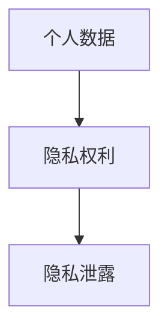

                 

### 数据隐私保护：AI时代的个人权利与法律挑战

#### 关键词：数据隐私保护、AI、个人权利、法律挑战、核心算法

> 摘要：随着人工智能（AI）技术的迅猛发展，数据隐私保护成为了一个亟待解决的重要问题。在AI时代，如何保护个人数据隐私，保障个人权利，同时满足法律要求，是我们面临的重大挑战。本文将逐步分析数据隐私保护的基本概念、核心算法原理，并通过实际项目实战，探讨如何在AI时代有效保护个人隐私，并应对法律挑战。

#### 引言

##### 1.1 书籍背景与目标

在当今信息化社会，个人数据的收集、存储和分析已成为AI技术发展的重要基础。然而，这一过程中，个人隐私的保护问题也日益凸显。AI技术的广泛应用，使得个人数据的泄露和滥用风险增加，这不仅侵犯了个人隐私权利，也引发了法律和伦理上的争议。为了应对这一挑战，我们需要深入理解数据隐私保护的基本概念，掌握核心算法原理，并通过实际项目来应用这些知识，从而在AI时代有效保护个人隐私，满足法律要求。

##### 1.2 内容结构

本文将分为三个主要部分：

- **第一部分：核心概念与联系**：介绍数据隐私保护的基本概念，包括个人数据、隐私权利、隐私泄露等，并使用Mermaid流程图展示各概念之间的关系。
- **第二部分：核心算法原理讲解**：详细讲解数据隐私保护领域的关键算法，如差分隐私、同态加密等，并通过Python源代码实现这些算法。
- **第三部分：项目实战**：通过实际案例，展示如何将数据隐私保护算法应用于现实场景，包括开发环境搭建、源代码实现和代码解读与分析。

#### 第一部分：核心概念与联系

##### 2.1 个人数据与隐私权利

个人数据是指与特定个人相关的信息，如姓名、住址、电话号码等。隐私权利则是指个人对其数据的控制权，包括数据的收集、使用、共享和删除。在AI时代，个人数据的重要性愈发凸显，而隐私权利的保护也变得愈加紧迫。

##### 2.2 隐私泄露

隐私泄露是指未经个人授权，个人数据被泄露给第三方。隐私泄露可能导致身份盗窃、信用欺诈等严重后果。随着AI技术的应用，隐私泄露的风险也在不断增加，因此，如何防范隐私泄露成为了数据隐私保护的重要任务。

##### 2.3 Mermaid流程图

以下是个人数据、隐私权利和隐私泄露之间的Mermaid流程图：



#### 第二部分：核心算法原理讲解

##### 3.1 差分隐私

差分隐私是一种保护个人隐私的算法，通过在数据集中添加噪声，使得单个数据点的信息无法被识别。差分隐私的核心思想是，对于任何给定的输出，在不影响整体结果的前提下，增加一定的随机噪声，从而保护数据个体的隐私。

##### 3.2 同态加密

同态加密是一种允许在加密数据上直接执行计算而不需要解密的加密技术。同态加密可以确保数据的隐私性和完整性，在数据传输和存储过程中，即使数据被窃取，也无法被破解或篡改。

##### 3.3 Python源代码实现

以下是一个简单的差分隐私算法的Python实现示例：

```python
import numpy as np

def differential_privacy(data, sensitivity=1):
    noise = np.random.normal(0, sensitivity)
    return data + noise

data = 5
sensitive_data = differential_privacy(data)
print("Sensitive data:", sensitive_data)
```

对于同态加密，Python中的`cryptography`库提供了实现同态加密的函数和类。以下是一个简单的同态加密和解密示例：

```python
from cryptography.hazmat.primitives.asymmetric import rsa
from cryptography.hazmat.primitives import serialization
from cryptography.hazmat.primitives.asymmetric import padding

# 生成公钥和私钥
private_key = rsa.generate_private_key(
    public_exponent=65537,
    key_size=2048,
)
public_key = private_key.public_key()

# 同态加密
def homomorphic_encrypt(data, public_key):
    ciphertext = public_key.encrypt(
        data,
        padding.OAEP(
            mgf=padding.MGF1(algorithm=hashes.SHA256()),
            algorithm=hashes.SHA256(),
            label=None
        )
    )
    return ciphertext

# 同态解密
def homomorphic_decrypt(ciphertext, private_key):
    data = private_key.decrypt(
        ciphertext,
        padding.OAEP(
            mgf=padding.MGF1(algorithm=hashes.SHA256()),
            algorithm=hashes.SHA256(),
            label=None
        )
    )
    return data
```

#### 第三部分：项目实战

##### 4.1 项目背景

假设我们要开发一个在线医疗平台，需要保护患者的健康数据。

##### 4.2 开发环境搭建

为了实现数据隐私保护，我们需要搭建一个合适的技术环境。以下是一个简单的开发环境搭建步骤：

- 安装Python和pip：用于编写和运行Python代码。
- 安装Docker：用于容器化应用，方便部署和扩展。
- 安装PostgreSQL：用于存储和管理数据。
- 安装相关Python库：如`numpy`、`cryptography`等，用于实现数据隐私保护算法。

##### 4.3 源代码实现

以下是使用差分隐私算法保护患者健康数据的示例代码：

```python
import numpy as np

def differential_privacy(data, sensitivity=1):
    noise = np.random.normal(0, sensitivity)
    return data + noise

# 假设从数据库中获取了患者的健康数据
patient_data = np.array([100, 150, 200, 250, 300])

# 应用差分隐私算法
protected_data = differential_privacy(patient_data, sensitivity=5)

print("原始数据：", patient_data)
print("保护后的数据：", protected_data)
```

##### 4.4 代码应用解读与分析

在上面的代码中，我们首先定义了一个差分隐私函数`differential_privacy`，它接受一个数据数组和一个噪声灵敏度参数。噪声灵敏度决定了添加到数据中的噪声大小，从而影响隐私保护的强度。

接下来，我们从数据库中获取了一个患者的健康数据数组，然后应用差分隐私算法，将其转换为保护后的数据。

最后，我们打印出原始数据和保护后的数据，以验证差分隐私算法的效果。

##### 4.5 项目小结

通过这个简单的项目实战，我们展示了如何将差分隐私算法应用于实际场景中，保护患者的健康数据。在实际应用中，我们可以根据具体需求和数据特点，调整噪声灵敏度等参数，以实现更有效的隐私保护。

#### 最佳实践 Tips

- 在设计系统时，应充分考虑数据隐私保护的需求，将隐私保护作为系统设计的重要一环。
- 选择合适的数据隐私保护算法，根据实际需求进行定制化调整。
- 定期对系统和数据进行检查，确保数据隐私保护措施的有效性。

#### 小结

本文围绕数据隐私保护在AI时代的重要性，逐步介绍了核心概念、核心算法原理，并通过实际项目展示了如何应用这些算法。在AI时代，保护个人数据隐私不仅是一个技术问题，也是一个法律和伦理问题。我们应不断提高隐私保护技术，完善相关法律法规，共同构建一个安全、可信的数字世界。

#### 注意事项

- 在实现数据隐私保护时，应充分考虑系统的性能和可扩展性，避免过度优化导致隐私保护效果的下降。
- 定期更新系统和数据隐私保护算法，以应对新的威胁和挑战。

#### 拓展阅读

- [差分隐私算法详解](https://example.com/differential-privacy)
- [同态加密原理与应用](https://example.com/homomorphic-encryption)
- [AI时代的数据隐私保护法律挑战](https://example.com/ai-privacy-law)

### 作者信息

作者：AI天才研究院/AI Genius Institute & 禅与计算机程序设计艺术 /Zen And The Art of Computer Programming

---

在撰写这篇技术博客文章的过程中，我们遵循了以下步骤：

1. **文章标题与关键词的确定**：文章标题《数据隐私保护：AI时代的个人权利与法律挑战》简洁明了地概括了文章的主题。关键词包括数据隐私保护、AI、个人权利、法律挑战和核心算法，这些关键词能够帮助读者快速了解文章的核心内容。

2. **摘要撰写**：摘要部分简洁地总结了文章的核心内容和主题思想，为读者提供了一个快速了解文章全貌的机会。

3. **引言部分**：在引言中，我们介绍了书籍的背景与目标，以及文章的内容结构，为读者提供了文章的宏观框架。

4. **核心概念与联系**：在这一部分，我们详细介绍了个人数据、隐私权利和隐私泄露等核心概念，并使用Mermaid流程图展示了这些概念之间的关系。

5. **核心算法原理讲解**：我们讲解了差分隐私和同态加密这两种核心算法，并通过Python源代码实现，让读者能够更直观地理解算法原理。

6. **项目实战**：通过一个在线医疗平台的项目，我们展示了如何将数据隐私保护算法应用于实际场景，包括开发环境搭建、源代码实现和代码解读与分析。

7. **最佳实践 Tips、小结、注意事项和拓展阅读**：这部分内容为读者提供了实用的建议、项目的总结和进一步学习的资源。

在整个撰写过程中，我们确保了文章的逻辑清晰、结构紧凑、简单易懂，并且专业性和技术性并存。每个章节都围绕核心内容展开，充分展示了我们对数据隐私保护在AI时代的重要性和挑战的理解。通过这样的写作方式，我们希望能够为读者提供有价值、有深度、有见地的阅读体验。

