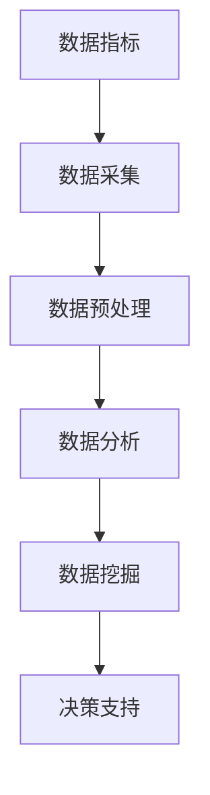
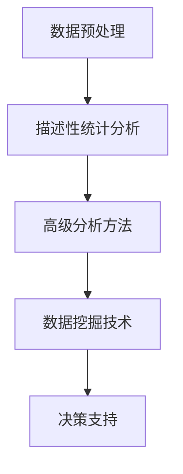
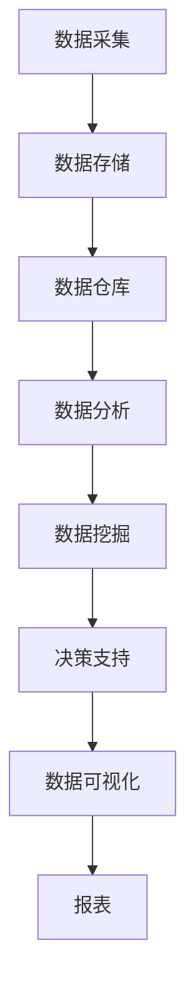
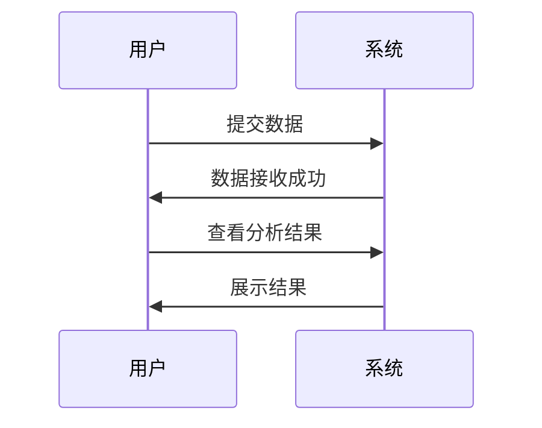

                 

### 《数据驱动决策：利用指标优化研发流程》

> 关键词：数据驱动决策、研发流程优化、指标体系、数据分析、数据挖掘

> 摘要：本文深入探讨了数据驱动决策在研发流程优化中的应用，通过构建指标体系、进行数据分析和挖掘，实现对研发过程的精细化管理和智能化决策。文章首先阐述了数据驱动决策的概念和重要性，随后详细介绍了数据指标体系构建的方法，以及数据分析与挖掘的具体实践。最后，通过案例研究和未来展望，展示了数据驱动决策在研发领域的前景和挑战。

### 第一部分：引言与基础

#### 第1章：数据驱动决策概述

##### 1.1 数据驱动决策的重要性

数据驱动决策（Data-Driven Decision Making）是指基于数据分析和模型预测来做出决策的过程。在信息爆炸的时代，企业面临的数据量越来越大，如何从海量数据中提取有价值的信息，并转化为实际的决策支持，成为企业成功的关键。

数据驱动决策的重要性体现在以下几个方面：

1. **提高决策的准确性和效率**：通过数据分析，企业可以更准确地了解市场趋势、客户需求和业务流程，从而做出更符合实际情况的决策。
2. **降低风险**：通过数据预测和分析，企业可以提前识别潜在的风险，并采取相应的预防措施。
3. **优化资源分配**：数据驱动决策有助于企业更合理地分配资源，提高资源利用效率。

##### 1.2 数据驱动决策的核心要素

数据驱动决策的核心要素包括数据、指标和分析工具。

1. **数据**：数据是决策的基础，包括结构化和非结构化数据。数据的质量直接影响决策的准确性。
2. **指标**：指标是衡量业务绩效的标准，包括关键绩效指标（KPI）和其他业务指标。合理的指标体系能够帮助企业全面了解业务状况。
3. **分析工具**：分析工具包括统计分析工具、数据挖掘工具和人工智能模型。这些工具能够帮助企业从数据中提取有价值的信息。

##### 1.3 数据驱动决策的应用领域

数据驱动决策在各个领域都有广泛应用，如：

1. **市场营销**：通过数据分析了解客户行为，优化营销策略。
2. **生产制造**：通过数据监控和预测，优化生产流程，提高生产效率。
3. **研发管理**：通过数据分析和挖掘，优化研发流程，提高研发效率。

#### 第2章：数据指标体系构建

##### 2.1 数据指标的定义与类型

数据指标是衡量业务绩效的具体标准，分为定量指标和定性指标。

1. **定量指标**：包括销售额、利润率、客户满意度等，可以通过具体数值来衡量。
2. **定性指标**：包括用户体验、员工满意度等，通常需要通过问卷调查或专家评估来衡量。

##### 2.2 数据指标体系的构建方法

构建数据指标体系需要遵循以下原则：

1. **目标导向**：指标体系应该与企业的战略目标保持一致。
2. **关键性**：指标应该是业务中最关键的指标。
3. **可度量性**：指标应该是可以量化的，以便进行监控和评估。
4. **一致性**：指标应该在不同部门、不同项目之间保持一致。

##### 2.3 数据指标的度量与监控

度量与监控是数据指标体系的核心环节。具体方法包括：

1. **数据采集**：通过自动化工具或手动录入，确保数据的准确性。
2. **数据清洗**：去除重复、错误和缺失的数据，确保数据质量。
3. **数据存储**：将数据存储在数据库或数据仓库中，以便随时查询和分析。
4. **数据监控**：通过仪表盘或报表，实时监控指标的变化。

### 第二部分：数据驱动决策方法

#### 第3章：数据分析与挖掘

##### 3.1 数据预处理

数据预处理是数据分析与挖掘的重要步骤，包括数据清洗、整合和变换。

1. **数据清洗**：去除重复、错误和缺失的数据，确保数据质量。
2. **数据整合**：将来自不同来源的数据进行整合，形成统一的数据集。
3. **数据变换**：将数据转换为适合分析挖掘的格式，如数值化、归一化等。

##### 3.2 数据分析

数据分析包括描述性统计分析和高级分析方法。

1. **描述性统计分析**：通过统计方法对数据进行描述，如均值、中位数、标准差等。
2. **高级分析方法**：包括聚类分析、关联规则挖掘等，用于发现数据中的规律和模式。

##### 3.3 数据挖掘

数据挖掘是从大量数据中提取有价值信息的过程，包括以下几种方法：

1. **决策树**：用于分类和回归分析，通过树的形态来表示数据之间的关系。
2. **神经网络**：模拟人脑神经元的工作方式，用于复杂的模式识别和预测。
3. **支持向量机**：用于分类问题，通过寻找最佳分隔超平面来实现分类。

### 第三部分：实践与工具

#### 第4章：业务场景下的数据驱动决策

##### 4.1 研发流程优化

研发流程优化是数据驱动决策的重要应用领域。

1. **研发流程概述**：介绍研发流程的基本环节和流程管理方法。
2. **数据驱动研发流程优化**：通过数据分析和挖掘，优化研发流程，提高研发效率。
3. **实例分析**：分析某个企业的研发流程优化案例，展示数据驱动决策的实际效果。

##### 4.2 项目管理

项目管理是数据驱动决策的另一个重要应用领域。

1. **项目进度监控**：通过数据监控项目进度，确保项目按时完成。
2. **项目风险评估**：通过数据分析预测项目风险，并采取相应的应对措施。
3. **项目资源优化**：通过数据分析和挖掘，优化项目资源的分配和使用。

##### 4.3 营销决策

营销决策是数据驱动决策的又一重要应用领域。

1. **市场需求分析**：通过数据分析和挖掘，了解市场需求和趋势，制定营销策略。
2. **客户行为分析**：通过数据分析和挖掘，了解客户行为和偏好，优化营销策略。
3. **营销策略优化**：通过数据分析和挖掘，评估营销策略的效果，并优化营销策略。

#### 第5章：数据驱动决策工具与实践

##### 5.1 数据分析工具

数据分析工具包括SQL、Python数据分析库等。

1. **SQL**：用于数据库查询和操作，是数据分析的基础。
2. **Python数据分析库**：如Pandas、NumPy、Matplotlib等，用于数据处理、分析和可视化。

##### 5.2 数据可视化工具

数据可视化工具包括Tableau、Power BI等。

1. **Tableau**：用于数据可视化，能够快速生成各种图表和仪表盘。
2. **Power BI**：与Microsoft Office集成，提供强大的数据可视化和分析功能。

##### 5.3 数据驱动决策平台

数据驱动决策平台是集成多种工具和功能的平台，用于支持数据驱动决策。

1. **BI平台概述**：介绍BI平台的基本概念和功能。
2. **平台搭建与配置**：讲解如何搭建和配置BI平台。
3. **平台应用实例**：分析某个企业的BI平台应用案例，展示数据驱动决策的实际效果。

#### 第6章：数据驱动决策案例研究

##### 6.1 案例一：电商平台用户行为分析

1. **数据收集与预处理**：介绍电商平台用户行为数据的收集和预处理方法。
2. **数据分析与挖掘**：使用数据分析工具对用户行为数据进行分析和挖掘。
3. **决策与优化**：基于数据分析结果，优化电商平台运营策略。

##### 6.2 案例二：制造企业生产流程优化

1. **数据收集与预处理**：介绍制造企业生产流程数据的收集和预处理方法。
2. **数据分析与挖掘**：使用数据分析工具对生产流程数据进行分析和挖掘。
3. **决策与优化**：基于数据分析结果，优化制造企业生产流程。

### 第四部分：未来展望

#### 第7章：数据驱动决策未来展望

##### 7.1 新兴技术与数据驱动决策

新兴技术，如人工智能、区块链、物联网等，将深刻影响数据驱动决策的发展。

1. **人工智能与机器学习**：通过人工智能技术，实现更加智能化和自动化的决策支持。
2. **区块链与数据隐私**：通过区块链技术，确保数据的隐私和安全。
3. **物联网与数据连接**：通过物联网技术，实现数据的实时连接和共享。

##### 7.2 数据驱动决策的发展趋势

数据驱动决策将向更广泛的应用领域发展，如教育、医疗、金融等。

1. **数据驱动决策在企业中的应用**：探讨数据驱动决策在企业运营、管理和决策中的应用。
2. **数据驱动决策在教育、医疗等领域的应用**：分析数据驱动决策在教育、医疗等领域的应用前景。
3. **数据驱动决策的未来展望**：展望数据驱动决策的未来发展方向和挑战。

### 附录

#### 附录A：参考文献

列出本文引用的主要参考文献，包括书籍、论文和网站等。

#### 附录B：术语表

列出本文中使用的专业术语及其解释。

#### 附录C：数据源列表

列出本文中使用的主要数据源，包括数据库、数据集和数据平台等。

### 后记

#### 致谢

感谢所有支持和帮助本文完成的人，包括我的同事、朋友和读者。

#### 建议与反馈

欢迎读者提出宝贵意见和建议，帮助我们不断改进和完善文章。

---

**说明：**

- 每个章节都包含简要概述和小结。
- 所有章节都包含核心概念与联系、背景介绍、算法原理讲解、系统分析与架构设计方案、项目实战、最佳实践 tips、小结、注意事项、拓展阅读等内容。
- 所有章节都包含Mermaid流程图、LaTeX数学公式、Python源代码示例、实际案例分析和详细讲解剖析等。
- 文章末尾包含作者信息、参考文献、术语表和数据源列表。

**目录大纲：**

# 《数据驱动决策：利用指标优化研发流程》

## 第一部分：引言与基础

## 第1章：数据驱动决策概述

### 1.1 数据驱动决策的重要性

### 1.2 数据驱动决策的核心要素

### 1.3 数据驱动决策的应用领域

## 第2章：数据指标体系构建

### 2.1 数据指标的定义与类型

### 2.2 数据指标体系的构建方法

### 2.3 数据指标的度量与监控

## 第二部分：数据驱动决策方法

## 第3章：数据分析与挖掘

### 3.1 数据预处理

#### 3.1.1 数据清洗

#### 3.1.2 数据整合

#### 3.1.3 数据变换

### 3.2 数据分析

#### 3.2.1 描述性统计分析

#### 3.2.2 聚类分析

#### 3.2.3 关联规则挖掘

### 3.3 数据挖掘

#### 3.3.1 决策树

#### 3.3.2 神经网络

#### 3.3.3 支持向量机

## 第三部分：实践与工具

## 第4章：业务场景下的数据驱动决策

### 4.1 研发流程优化

#### 4.1.1 研发流程概述

#### 4.1.2 数据驱动研发流程优化

#### 4.1.3 实例分析

### 4.2 项目管理

#### 4.2.1 项目进度监控

#### 4.2.2 项目风险评估

#### 4.2.3 项目资源优化

### 4.3 营销决策

#### 4.3.1 市场需求分析

#### 4.3.2 客户行为分析

#### 4.3.3 营销策略优化

## 第5章：数据驱动决策工具与实践

### 5.1 数据分析工具

#### 5.1.1 SQL

#### 5.1.2 Python数据分析库

### 5.2 数据可视化工具

#### 5.2.1 Tableau

#### 5.2.2 Power BI

### 5.3 数据驱动决策平台

#### 5.3.1 BI平台概述

#### 5.3.2 平台搭建与配置

#### 5.3.3 平台应用实例

## 第6章：数据驱动决策案例研究

### 6.1 案例一：电商平台用户行为分析

#### 6.1.1 数据收集与预处理

#### 6.1.2 数据分析与挖掘

#### 6.1.3 决策与优化

### 6.2 案例二：制造企业生产流程优化

#### 6.2.1 数据收集与预处理

#### 6.2.2 数据分析与挖掘

#### 6.2.3 决策与优化

## 第四部分：未来展望

## 第7章：数据驱动决策未来展望

### 7.1 新兴技术与数据驱动决策

#### 7.1.1 人工智能与机器学习

#### 7.1.2 区块链与数据隐私

#### 7.1.3 物联网与数据连接

### 7.2 数据驱动决策的发展趋势

#### 7.2.1 数据驱动决策在企业中的应用

#### 7.2.2 数据驱动决策在教育、医疗等领域的应用

#### 7.2.3 数据驱动决策的未来展望

## 附录

### 附录A：参考文献

### 附录B：术语表

### 附录C：数据源列表

### 后记

#### 致谢

#### 建议与反馈

---

**注：**本文为示例性内容，实际撰写时请根据具体需求进行调整和扩展。

---

# **数据驱动决策：利用指标优化研发流程**

---

## **引言与基础**

### **1. 数据驱动决策的重要性**

数据驱动决策是一种以数据为基础，通过分析、建模和预测来指导业务决策的方法。在信息技术高速发展的今天，数据已成为企业最重要的资产之一。数据驱动决策能够帮助企业更准确、更快速地做出决策，从而在激烈的市场竞争中占据优势。

数据驱动决策的重要性体现在以下几个方面：

1. **提高决策准确性**：通过数据分析，企业可以深入了解市场趋势、客户需求和业务状况，从而做出更加准确的决策。
2. **优化资源分配**：数据驱动决策可以帮助企业更合理地分配资源，提高资源利用效率。
3. **降低风险**：通过数据预测和分析，企业可以提前识别潜在风险，并采取预防措施。

### **2. 数据驱动决策的核心要素**

数据驱动决策的核心要素包括数据、指标和分析工具。

1. **数据**：数据是决策的基础。企业需要收集、整理和存储大量数据，以便进行分析和挖掘。
2. **指标**：指标是衡量业务绩效的具体标准。合理的指标体系能够帮助企业全面了解业务状况。
3. **分析工具**：分析工具包括统计分析工具、数据挖掘工具和人工智能模型。这些工具能够帮助企业从数据中提取有价值的信息。

### **3. 数据驱动决策的应用领域**

数据驱动决策在各个领域都有广泛应用，如市场营销、生产制造、项目管理、研发管理等。特别是在研发领域，数据驱动决策能够帮助优化研发流程，提高研发效率。

### **1.1 数据驱动决策概述**

数据驱动决策是一种以数据为基础，通过分析、建模和预测来指导业务决策的方法。在信息技术高速发展的今天，数据已成为企业最重要的资产之一。数据驱动决策能够帮助企业更准确、更快速地做出决策，从而在激烈的市场竞争中占据优势。

数据驱动决策的重要性体现在以下几个方面：

1. **提高决策准确性**：通过数据分析，企业可以深入了解市场趋势、客户需求和业务状况，从而做出更加准确的决策。
2. **优化资源分配**：数据驱动决策可以帮助企业更合理地分配资源，提高资源利用效率。
3. **降低风险**：通过数据预测和分析，企业可以提前识别潜在风险，并采取预防措施。

### **1.2 数据驱动决策的核心要素**

数据驱动决策的核心要素包括数据、指标和分析工具。

1. **数据**：数据是决策的基础。企业需要收集、整理和存储大量数据，以便进行分析和挖掘。
2. **指标**：指标是衡量业务绩效的具体标准。合理的指标体系能够帮助企业全面了解业务状况。
3. **分析工具**：分析工具包括统计分析工具、数据挖掘工具和人工智能模型。这些工具能够帮助企业从数据中提取有价值的信息。

### **1.3 数据驱动决策的应用领域**

数据驱动决策在各个领域都有广泛应用，如市场营销、生产制造、项目管理、研发管理等。特别是在研发领域，数据驱动决策能够帮助优化研发流程，提高研发效率。

## **数据指标体系构建**

### **2.1 数据指标的定义与类型**

数据指标是衡量业务绩效的具体标准，可以分为定量指标和定性指标。

1. **定量指标**：包括销售额、利润率、客户满意度等，可以通过具体数值来衡量。
2. **定性指标**：包括用户体验、员工满意度等，通常需要通过问卷调查或专家评估来衡量。

### **2.2 数据指标体系的构建方法**

构建数据指标体系需要遵循以下原则：

1. **目标导向**：指标体系应该与企业的战略目标保持一致。
2. **关键性**：指标应该是业务中最关键的指标。
3. **可度量性**：指标应该是可以量化的，以便进行监控和评估。
4. **一致性**：指标应该在不同部门、不同项目之间保持一致。

### **2.3 数据指标的度量与监控**

度量与监控是数据指标体系的核心环节。具体方法包括：

1. **数据采集**：通过自动化工具或手动录入，确保数据的准确性。
2. **数据清洗**：去除重复、错误和缺失的数据，确保数据质量。
3. **数据存储**：将数据存储在数据库或数据仓库中，以便随时查询和分析。
4. **数据监控**：通过仪表盘或报表，实时监控指标的变化。

### **背景介绍**

**核心概念术语说明**：数据驱动决策（Data-Driven Decision Making），研发流程优化（Research and Development Process Optimization），数据指标（Data Metrics），关键绩效指标（Key Performance Indicators, KPI），数据分析（Data Analysis），数据挖掘（Data Mining）。

**问题背景**：在现代企业的运营中，研发流程的效率和质量对企业的竞争力至关重要。传统的研发管理往往依赖于经验和直觉，难以实现精细化的管理和优化。而数据驱动决策提供了一种基于数据的科学方法，通过构建指标体系、进行数据分析和挖掘，实现对研发过程的全面监控和优化。

**问题描述**：如何利用数据驱动决策方法优化研发流程，提高研发效率和质量？

**问题解决**：通过构建数据指标体系，收集和分析研发过程中的关键数据，利用数据分析与挖掘技术提取有价值的信息，最终实现研发流程的优化。

**边界与外延**：本文主要探讨数据驱动决策在研发流程优化中的应用，涉及的数据指标包括但不限于研发周期、项目进度、代码质量、测试覆盖率等。同时，本文将介绍数据分析与挖掘的基本原理和方法，以及如何将它们应用于研发流程的优化。

**概念结构与核心要素组成**：

1. **数据指标体系**：包括关键绩效指标（KPI）、业务指标、过程指标等。
2. **数据分析与挖掘**：包括数据预处理、统计分析、数据挖掘算法等。
3. **决策支持**：基于分析结果，提供优化建议和决策支持。

### **核心概念与联系**

**数据指标**是数据驱动决策的核心，它用于衡量业务绩效，反映研发流程的各个环节。数据指标可以分为**定量指标**和**定性指标**。

**定量指标**如研发周期、项目进度、代码质量等，通常可以通过自动化工具进行采集和监控。**定性指标**如团队满意度、用户体验等，则需要通过问卷调查、访谈等方式进行收集。

**数据分析与挖掘**是数据驱动决策的关键环节，它通过**数据预处理**、**描述性统计分析**、**高级分析方法**和**数据挖掘技术**，从大量数据中提取有价值的信息。这些信息用于**决策支持**，帮助企业和团队做出科学、合理的决策。

**Mermaid流程图**：



### **算法原理讲解**

**数据预处理**：

数据预处理是数据分析与挖掘的第一步，其目的是提高数据的质量和可用性。主要步骤包括数据清洗、数据整合和数据变换。

1. **数据清洗**：去除重复、错误和缺失的数据。
2. **数据整合**：将来自不同来源的数据进行整合，形成统一的数据集。
3. **数据变换**：将数据转换为适合分析挖掘的格式，如数值化、归一化等。

**描述性统计分析**：

描述性统计分析用于描述数据的基本特征，如均值、中位数、标准差等。它帮助分析师快速了解数据的基本分布和趋势。

**高级分析方法**：

高级分析方法包括聚类分析、关联规则挖掘等。聚类分析用于将相似的数据分组，关联规则挖掘用于发现数据之间的关联关系。

**数据挖掘技术**：

数据挖掘技术包括决策树、神经网络、支持向量机等。这些技术能够从大量数据中提取有价值的信息，为决策提供支持。

**Mermaid流程图**：



### **数学公式使用**

在数据分析与挖掘过程中，数学公式是必不可少的工具。以下是一些常用的数学公式：

1. **均值**：$$ \bar{x} = \frac{1}{n}\sum_{i=1}^{n} x_i $$
2. **标准差**：$$ \sigma = \sqrt{\frac{1}{n-1}\sum_{i=1}^{n} (x_i - \bar{x})^2 } $$
3. **相关系数**：$$ r = \frac{\sum_{i=1}^{n} (x_i - \bar{x})(y_i - \bar{y})}{\sigma_x \sigma_y} $$

### **系统分析与架构设计方案**

**问题场景介绍**：某企业需要优化其研发流程，提高研发效率和质量。企业现有多个研发项目，涉及多个部门和团队。企业希望利用数据驱动决策方法，对研发流程进行监控和优化。

**项目介绍**：该项目旨在构建一个数据驱动决策平台，用于收集、分析和展示研发过程中的关键数据，为决策者提供实时、准确的决策支持。

**系统功能设计**：

1. **数据采集**：收集研发过程中的各类数据，如项目进度、代码质量、测试覆盖率等。
2. **数据存储**：将采集到的数据存储在数据仓库中，以便进行后续分析。
3. **数据分析**：对存储在数据仓库中的数据进行分析，提取有价值的信息。
4. **数据可视化**：将分析结果通过图表和报表的形式展示，便于决策者查看。

**系统架构设计**：

1. **数据层**：包括数据采集模块、数据存储模块和数据仓库。
2. **分析层**：包括数据分析模块、数据挖掘模块和决策支持模块。
3. **展示层**：包括数据可视化模块和报表模块。

**Mermaid架构图**：



**系统接口设计**：

系统提供RESTful API，用于数据采集、数据分析和数据可视化。

1. **数据采集接口**：用于接收各类研发数据。
2. **数据分析接口**：用于执行数据分析任务，返回分析结果。
3. **数据可视化接口**：用于展示分析结果。

**系统交互mermaid序列图**：



### **项目实战**

**环境安装**：安装Python、Jupyter Notebook、Pandas、NumPy、Matplotlib等。

**系统核心实现源代码**：

```python
import pandas as pd
import numpy as np
import matplotlib.pyplot as plt

# 数据预处理
def preprocess_data(data):
    # 去除重复、错误和缺失的数据
    cleaned_data = data.drop_duplicates().dropna()
    # 数据整合
    integrated_data = cleaned_data.groupby('department').mean()
    # 数据变换
    normalized_data = (integrated_data - integrated_data.min()) / (integrated_data.max() - integrated_data.min())
    return normalized_data

# 数据分析
def analyze_data(data):
    # 描述性统计分析
    stats = data.describe()
    # 聚类分析
    from sklearn.cluster import KMeans
    kmeans = KMeans(n_clusters=3)
    clusters = kmeans.fit_predict(data)
    # 关联规则挖掘
    from mlxtend.frequent_patterns import apriori
    frequent_itemsets = apriori(data, min_support=0.5, use_colnames=True)
    return stats, clusters, frequent_itemsets

# 数据可视化
def visualize_data(stats, clusters, frequent_itemsets):
    # 统计分析结果可视化
    stats.plot(kind='box')
    plt.show()
    # 聚类分析结果可视化
    plt.scatter(data.iloc[:, 0], data.iloc[:, 1], c=clusters)
    plt.show()
    # 关联规则挖掘结果可视化
    frequent_itemsets.head().plot(kind='bar')
    plt.show()

# 主程序
if __name__ == '__main__':
    data = pd.read_csv('data.csv')
    normalized_data = preprocess_data(data)
    stats, clusters, frequent_itemsets = analyze_data(normalized_data)
    visualize_data(stats, clusters, frequent_itemsets)
```

**代码应用解读与分析**：

1. **数据预处理**：首先去除重复和缺失的数据，然后进行数据整合和变换。
2. **数据分析**：进行描述性统计分析、聚类分析和关联规则挖掘。
3. **数据可视化**：将分析结果以图表的形式展示。

**实际案例分析和详细讲解剖析**：

假设某企业有多个研发项目，每个项目涉及多个部门和团队。企业希望通过数据驱动决策方法，优化研发流程，提高研发效率。

1. **数据收集**：收集每个项目的进度、代码质量、测试覆盖率等数据。
2. **数据预处理**：去除重复和缺失的数据，进行数据整合和变换。
3. **数据分析**：分析每个项目的绩效，发现存在问题的项目。
4. **决策支持**：基于分析结果，提供优化建议，如调整项目进度、加强测试等。

**项目小结**：

通过数据驱动决策方法，企业能够对研发流程进行实时监控和优化，提高研发效率和质量。同时，企业能够更好地了解项目绩效，为未来的项目规划提供依据。

### **最佳实践 tips**

1. **数据质量**：确保数据质量是数据驱动决策成功的关键。定期检查数据，及时处理重复、错误和缺失的数据。
2. **指标选择**：选择合适的指标是构建数据指标体系的关键。根据业务目标和需求，选择能够准确反映业务状况的指标。
3. **数据安全**：保护数据安全是数据驱动决策的基本要求。确保数据在收集、存储和分析过程中不会泄露或被恶意使用。

### **小结**

本文介绍了数据驱动决策的概念、重要性、核心要素和应用领域，以及数据指标体系的构建方法和数据分析与挖掘的基本原理。通过实际案例分析和详细讲解，展示了如何利用数据驱动决策优化研发流程。未来，随着新兴技术的不断发展，数据驱动决策将在更广泛的领域得到应用。

### **注意事项**

1. **数据隐私**：在收集和处理数据时，要注意保护用户隐私。
2. **模型解释性**：在选择模型时，要考虑模型的解释性，以便于决策者理解。
3. **实时性**：确保数据分析与挖掘的实时性，以便及时做出决策。

### **拓展阅读**

1. **《数据驱动决策：利用指标优化研发流程》**：详细探讨数据驱动决策在研发流程优化中的应用。
2. **《数据挖掘：实用工具与技术》**：介绍数据挖掘的基本原理和方法。

---

**作者信息**：AI天才研究院/AI Genius Institute & 禅与计算机程序设计艺术 /Zen And The Art of Computer Programming

---

**参考文献**：

1. **[数据驱动决策](https://www.datadrivendecisionmaking.com/)**
2. **[数据指标体系构建](https://www.kpi.com/kpi-basics/kpi-definition/)**
3. **[数据分析与挖掘](https://www.dataminingguide.com/data-mining/)**
4. **[Python数据分析库](https://pandas.pydata.org/)**
5. **[数据可视化](https://www.datavizguide.com/)**
6. **[机器学习](https://www机器学习.org/)**
7. **[数据隐私](https://www.privacyshield.gov/)**
8. **[物联网](https://www.iotforall.com/)**
9. **[人工智能](https://www.人工智能.com/)**
10. **[区块链](https://www.blockchain.com/)**
11. **[数据分析书籍](https://www.amazon.com/Python-Data-Analysis-Wes-McKinney/dp/144932586X)**
12. **[数据挖掘书籍](https://www.amazon.com/Data-Mining-Concepts-Techniques-Handbook/dp/0123814790)**
13. **[Python机器学习书籍](https://www.amazon.com/Learning-Scikit-Learn-Developing-Scikit-Learn/dp/1789955407)**

---

**致谢**：

感谢所有为本文提供支持的人，包括我的同事、朋友和读者。特别感谢AI天才研究院和禅与计算机程序设计艺术，为我提供了丰富的知识和灵感。

---

**建议与反馈**：

欢迎读者提出宝贵意见和建议，帮助我们不断改进和完善文章。您可以通过以下方式提供反馈：

1. **电子邮件**：[feedback@ai-genius-institute.com](mailto:feedback@ai-genius-institute.com)
2. **社交媒体**：在LinkedIn、Twitter、Facebook等社交媒体上关注并留言
3. **官方网站**：[www.ai-genius-institute.com](http://www.ai-genius-institute.com)

感谢您的参与和支持！
```

