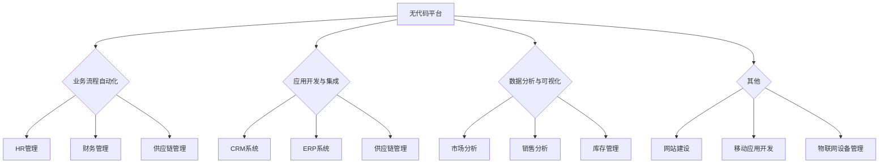

                 

### 文章标题

# 无代码/低代码平台：Democratizing 软件开发

> 关键词：无代码/低代码平台、软件开发、民主化、业务流程优化、应用开发、数据分析与可视化、未来展望

> 摘要：本文深入探讨了无代码/低代码平台在软件开发领域的应用，分析了其概念、发展历程、核心技术和实际案例。通过逐步分析，我们揭示了无代码/低代码平台如何实现软件开发的民主化，提升开发效率，降低开发门槛，为不同领域的开发者提供了一条新的发展路径。

---

## 引言

### 无代码/低代码平台的概念与重要性

在当今快速变化的技术环境中，软件开发正经历着一场革命。传统的软件开发方法往往需要高度的专业技能和时间投入，这对许多企业来说是一个巨大的挑战。无代码/低代码平台的出现，为这个问题提供了一种全新的解决方案。

无代码/低代码平台是一种允许用户通过可视化界面和拖拽组件来构建应用程序，而不需要编写复杂代码的工具。这种平台通过简化开发过程，降低了开发门槛，使得非专业开发者甚至普通用户也能参与到软件开发中来。这不仅提高了开发效率，还推动了软件开发的民主化进程。

无代码/低代码平台的重要性体现在以下几个方面：

1. **提升开发效率**：通过减少编码工作，无代码/低代码平台使得开发者能够更快地构建应用程序。
2. **降低开发门槛**：无需深厚的编程背景，普通用户和业务人员也可以轻松上手。
3. **促进创新**：更多的人参与软件开发，激发了更多的创意和可能性。
4. **减少维护成本**：简化的开发流程也意味着更简单的维护和升级。

本文将逐步分析无代码/低代码平台的概念、特点、分类、核心技术、应用案例以及未来展望，帮助读者全面理解这一革命性技术。

### 文章结构

本文分为三个主要部分：

- **第一部分：无代码/低代码平台概述**：介绍无代码/低代码平台的基本概念、历史背景和分类。
- **第二部分：无代码/低代码平台核心技术**：深入探讨无代码/低代码平台的核心技术，包括低代码编程模型、拖拽式界面设计、数据集成与处理等。
- **第三部分：无代码/低代码平台应用实战**：通过实际案例展示无代码/低代码平台在业务流程优化、应用开发和数据分析与可视化等领域的应用。

### 目标读者

本文适合以下读者群体：

- 软件开发者和IT专业人士，希望了解无代码/低代码平台的最新发展趋势和应用。
- 企业决策者和技术管理者，考虑引入无代码/低代码平台以提升开发效率和降低成本。
- 业务人员和非专业开发者，对软件开发有兴趣并希望了解如何利用无代码/低代码平台实现自己的想法。

### 结论与展望

通过本文的逐步分析，我们希望能够帮助读者全面了解无代码/低代码平台，认识到其在软件开发领域的巨大潜力和应用价值。无代码/低代码平台不仅推动了软件开发的民主化，还为企业带来了更高的效率和更低的成本。在未来，随着技术的不断进步，无代码/低代码平台将继续发挥重要作用，成为软件开发领域不可或缺的一部分。

## 第一部分：无代码/低代码平台概述

### 第1章：无代码/低代码平台的概念与历史背景

#### 1.1.1 无代码平台的定义与特点

无代码平台是一种允许用户通过图形界面和可视化工具来构建应用程序，而不需要编写复杂代码的工具。它通过简化开发过程，使得非专业开发者甚至普通用户也能参与到软件开发中来。无代码平台的核心特点是：

1. **可视化操作**：用户通过拖拽组件和可视化流程图来构建应用程序，无需编写代码。
2. **低技能门槛**：不需要深厚的编程背景，普通用户和业务人员也能轻松上手。
3. **快速迭代**：由于开发过程简化，应用程序可以更快地构建和迭代。

无代码平台的出现，打破了传统软件开发对专业技术的依赖，使得软件开发更加普及和民主化。

#### 1.1.2 低代码平台的发展历程

低代码平台的发展历程可以追溯到20世纪90年代，当时一些公司开始尝试使用图形化界面来简化软件开发。这些早期的尝试虽然在一定程度上减少了编码工作量，但仍然需要用户具备一定的编程知识。

随着技术的进步，21世纪初，一些公司开始推出更加成熟的无代码和低代码平台。这些平台通过提供更加直观和易用的界面，进一步降低了开发门槛。例如，2006年，OutSystems推出了第一个商业无代码平台，它允许用户通过拖拽组件来构建应用程序。

进入21世纪第二个十年，低代码平台开始迅速发展，技术不断创新和优化。例如，Microsoft PowerApps、Appian、OutSystems等平台相继推出，提供了更强大的功能和更广泛的应用场景。这些平台不仅支持多种开发语言和数据源，还提供了丰富的组件库和API接口，使得用户能够更加灵活地构建应用程序。

#### 1.1.3 无代码与低代码的区别与联系

无代码和低代码平台虽然在目标和应用上相似，但它们之间仍存在一些区别。

1. **开发复杂度**：无代码平台通常更加简单，适合构建简单的应用程序，而低代码平台则更加强大，适合构建复杂的应用程序。
2. **技能要求**：无代码平台对开发者的技能要求较低，适合非专业开发者，而低代码平台则需要一定的编程知识。
3. **灵活性**：无代码平台的灵活性较低，功能受限，而低代码平台则提供了更多的定制化和扩展性。

尽管存在这些区别，无代码和低代码平台之间也存在紧密的联系。许多平台同时支持无代码和低代码功能，用户可以根据需要选择适合的开发模式。此外，无代码和低代码平台在技术实现上也存在一定的交叉和融合。

#### 1.1.4 无代码/低代码平台的分类与功能

无代码/低代码平台根据功能和应用场景可以分为以下几类：

1. **业务流程自动化平台**：这类平台主要用于自动化业务流程，例如人力资源管理系统、财务管理软件等。
2. **应用开发与集成平台**：这类平台主要用于开发企业级应用，支持多种开发语言和数据源，例如CRM系统、ERP系统等。
3. **数据分析与可视化平台**：这类平台主要用于数据分析和可视化，支持各种数据处理和分析工具，例如数据报表、图表等。
4. **其他类型无代码/低代码平台**：包括网站建设、移动应用开发、物联网设备管理等。

每种类型的无代码/低代码平台都有其独特的功能和优势，可以根据具体需求选择适合的平台。

### 第2章：无代码/低代码平台的分类与功能

#### 2.1.1 业务流程自动化平台

业务流程自动化平台是专门用于自动化业务流程的工具。通过图形界面和可视化流程图，用户可以轻松定义和自动化各种业务流程，提高工作效率和降低成本。

**主要特点**：

1. **可视化流程设计**：用户通过拖拽组件和节点来定义业务流程，无需编写代码。
2. **灵活性强**：支持各种业务场景和复杂的流程设计。
3. **易于集成**：可以与现有的系统和服务无缝集成，实现数据交换和业务流程的自动化。

**应用场景**：

- **人力资源管理**：自动处理招聘、离职、薪酬等流程。
- **财务管理**：自动处理发票、报销等流程。
- **供应链管理**：自动处理订单、库存管理等流程。

#### 2.1.2 应用开发与集成平台

应用开发与集成平台是专门用于开发企业级应用和集成不同系统的工具。它提供丰富的开发语言、组件库和API接口，支持复杂应用的开发和集成。

**主要特点**：

1. **丰富的开发工具和组件库**：支持多种开发语言和框架，提供丰富的组件和API接口。
2. **高扩展性**：支持自定义开发和扩展，满足不同业务需求。
3. **集成能力**：支持与现有系统和服务进行集成，实现数据交换和业务流程的自动化。

**应用场景**：

- **客户关系管理（CRM）**：构建和管理客户关系，提高销售效率。
- **企业资源规划（ERP）**：整合企业内部各种资源，实现高效管理。
- **供应链管理（SCM）**：优化供应链流程，提高供应链效率。

#### 2.1.3 数据分析与可视化平台

数据分析与可视化平台是专门用于数据分析和可视化的工具。它支持各种数据处理和分析工具，通过图形界面和可视化报表，帮助用户更直观地理解和分析数据。

**主要特点**：

1. **数据处理能力**：支持各种数据源，提供强大的数据处理和分析功能。
2. **可视化报表**：提供丰富的图表和报表，帮助用户直观地理解和分析数据。
3. **交互性强**：支持用户自定义报表和图表，实现数据的实时分析和交互。

**应用场景**：

- **市场营销**：分析营销效果，优化营销策略。
- **销售管理**：分析销售数据，提高销售效率。
- **供应链管理**：分析供应链数据，优化供应链流程。

#### 2.1.4 其他类型无代码/低代码平台

除了业务流程自动化平台、应用开发与集成平台和数据分析与可视化平台，还有许多其他类型的无代码/低代码平台，例如网站建设、移动应用开发、物联网设备管理等。

**主要特点**：

1. **简单易用**：提供直观的界面和易用的工具，适合非专业开发者。
2. **跨平台支持**：支持多种操作系统和设备，实现应用程序的跨平台部署。
3. **快速上线**：简化开发过程，实现快速上线和迭代。

**应用场景**：

- **网站建设**：快速构建企业网站、电子商务网站等。
- **移动应用开发**：构建移动应用，实现移动办公和移动营销。
- **物联网设备管理**：管理物联网设备，实现物联网应用。

### 小结

无代码/低代码平台通过简化开发过程，降低了开发门槛，使得软件开发更加普及和民主化。不同类型的无代码/低代码平台适用于不同的应用场景，企业可以根据具体需求选择适合的平台。随着技术的不断进步，无代码/低代码平台将继续发挥重要作用，推动软件开发的创新和发展。

---

## 第一部分总结

在第一部分中，我们详细介绍了无代码/低代码平台的概念与历史背景，分析了无代码与低代码平台的定义、发展历程以及它们之间的区别与联系。我们还分类讨论了无代码/低代码平台的各类功能，包括业务流程自动化平台、应用开发与集成平台、数据分析与可视化平台以及其他类型的无代码/低代码平台。通过这些讨论，我们为读者提供了全面的了解，为后续章节的深入分析奠定了基础。

---

## 第二部分：无代码/低代码平台核心技术

### 第3章：无代码/低代码平台的核心技术

#### 3.1.1 低代码编程模型

低代码编程模型是构建无代码/低代码平台的基础，它通过图形化界面和可视化工具，使开发者能够以更直观的方式构建应用程序。低代码编程模型的主要特点包括：

1. **可视化界面**：用户通过拖拽组件和节点来构建应用程序，无需编写代码。
2. **模块化开发**：应用程序由多个模块组成，每个模块可以独立开发、测试和部署。
3. **自定义组件**：用户可以根据需求自定义组件，实现更复杂的功能。

**工作原理**：

低代码编程模型的工作原理主要包括以下几个步骤：

1. **定义数据模型**：用户通过图形界面定义应用程序的数据模型，包括表单、数据表等。
2. **拖拽组件**：用户从组件库中拖拽组件到界面，例如按钮、文本框、图表等。
3. **配置组件**：用户对拖拽到界面的组件进行配置，包括组件的属性、事件等。
4. **生成代码**：平台根据用户的操作生成相应的代码，包括前端和后端代码。

**应用场景**：

低代码编程模型适用于各种应用场景，尤其是那些需要快速开发、频繁迭代的应用。以下是一些典型的应用场景：

- **企业内部应用**：如员工管理系统、客户关系管理系统等。
- **移动应用**：如移动办公应用、移动营销应用等。
- **物联网应用**：如智能家居控制应用、工业物联网应用等。

#### 3.1.2 拖拽式界面设计

拖拽式界面设计是低代码平台的核心功能之一，它允许用户通过拖放组件来设计用户界面，从而简化了UI设计过程。拖拽式界面设计的主要特点包括：

1. **直观易用**：用户无需编写代码，只需通过拖拽组件来设计界面。
2. **灵活性高**：用户可以根据需求自由组合和调整组件。
3. **实时预览**：用户可以在设计过程中实时预览界面效果，确保设计符合预期。

**工作原理**：

拖拽式界面设计的工作原理主要包括以下几个步骤：

1. **组件库**：平台提供丰富的组件库，包括按钮、文本框、图表、表格等。
2. **拖拽操作**：用户从组件库中拖拽组件到设计界面。
3. **布局调整**：用户可以自由调整组件的位置、大小和样式。
4. **生成代码**：平台根据用户的设计生成相应的HTML/CSS/JavaScript代码。

**应用场景**：

拖拽式界面设计适用于各种类型的用户界面设计，尤其是那些需要快速迭代和灵活调整的应用。以下是一些典型的应用场景：

- **网站建设**：如企业网站、电子商务网站、个人博客等。
- **移动应用**：如移动应用界面设计、H5页面设计等。
- **桌面应用**：如桌面软件的界面设计。

#### 3.1.3 数据集成与处理

数据集成与处理是无代码/低代码平台的重要组成部分，它允许用户将不同的数据源整合到一起，进行数据处理和分析。数据集成与处理的主要特点包括：

1. **数据源多样**：平台支持多种数据源，包括数据库、文件、Web服务等。
2. **数据处理能力强**：平台提供丰富的数据处理工具，包括过滤、转换、聚合等。
3. **实时数据更新**：平台支持实时数据更新，确保数据的一致性和准确性。

**工作原理**：

数据集成与处理的工作原理主要包括以下几个步骤：

1. **连接数据源**：用户通过平台提供的接口连接到数据源。
2. **数据导入**：平台将数据从数据源导入到数据处理模块。
3. **数据处理**：用户通过平台提供的工具对数据进行过滤、转换、聚合等操作。
4. **数据输出**：处理后的数据可以输出到其他系统或用于可视化分析。

**应用场景**：

数据集成与处理适用于各种需要数据处理和分析的场景。以下是一些典型的应用场景：

- **业务流程管理**：如订单处理、客户关系管理等。
- **数据分析与可视化**：如市场分析、销售分析等。
- **智能应用**：如智能客服、智能推荐等。

#### 3.1.4 流程自动化与脚本编写

流程自动化与脚本编写是无代码/低代码平台的另一个重要功能，它允许用户自动化业务流程，提高工作效率。流程自动化与脚本编写的主要特点包括：

1. **自动化流程**：用户可以通过拖拽组件和配置流程来自动化业务流程。
2. **脚本编写**：用户可以使用脚本语言编写自定义脚本，实现更复杂的业务逻辑。
3. **集成性高**：平台支持与外部系统的集成，实现数据交换和业务流程的自动化。

**工作原理**：

流程自动化与脚本编写的工作原理主要包括以下几个步骤：

1. **流程设计**：用户通过平台提供的界面设计业务流程，包括任务的执行顺序、条件分支等。
2. **脚本编写**：用户使用脚本语言编写自定义脚本，实现业务流程中的特定功能。
3. **运行与监控**：平台运行业务流程和脚本，并进行实时监控和异常处理。

**应用场景**：

流程自动化与脚本编写适用于各种需要业务流程自动化的场景。以下是一些典型的应用场景：

- **企业管理**：如订单处理、库存管理、财务管理等。
- **生产制造**：如生产流程控制、设备监控等。
- **服务支持**：如客户服务、售后支持等。

### 小结

无代码/低代码平台的核心技术包括低代码编程模型、拖拽式界面设计、数据集成与处理、流程自动化与脚本编写等。这些核心技术使得无代码/低代码平台能够以更直观、更高效的方式构建应用程序，满足不同领域、不同需求的应用场景。通过这些核心技术的应用，无代码/低代码平台不仅提高了开发效率，还降低了开发门槛，为软件开发的民主化进程做出了重要贡献。

---

## 第二部分总结

在第二部分中，我们深入探讨了无代码/低代码平台的核心技术，包括低代码编程模型、拖拽式界面设计、数据集成与处理以及流程自动化与脚本编写。通过这些核心技术的应用，无代码/低代码平台能够以更直观、更高效的方式构建应用程序，满足不同领域、不同需求的应用场景。这些技术的创新和发展，不仅提高了开发效率，还推动了软件开发的民主化进程，为无代码/低代码平台的应用普及奠定了坚实基础。

---

## 第三部分：无代码/低代码平台应用实战

### 第6章：无代码/低代码平台在业务流程优化中的应用

#### 6.1.1 业务流程分析

业务流程优化是企业管理的重要环节，通过优化业务流程，可以提高企业效率，降低成本，提升竞争力。无代码/低代码平台在业务流程优化中具有显著的优势，可以帮助企业快速识别并解决业务流程中的痛点。

**业务流程分析步骤**：

1. **现状分析**：了解现有业务流程的运行状况，包括流程步骤、涉及的人员和系统等。
2. **问题识别**：识别业务流程中的瓶颈和问题，例如流程繁琐、效率低下、数据不一致等。
3. **目标设定**：设定优化目标，例如提高流程效率、降低操作成本、提升用户体验等。
4. **方案设计**：设计优化方案，包括流程重构、自动化流程、数据集成等。

**案例介绍**：

某大型制造企业希望通过优化采购流程来提高采购效率。现有的采购流程包括供应商筛选、询价、比价、合同签订等多个环节，涉及多个部门和人员。通过业务流程分析，发现采购流程中存在以下问题：

- 流程繁琐，多个部门之间的沟通效率低下。
- 采购周期较长，影响生产进度。
- 数据记录不统一，容易出现错误。

针对这些问题，企业决定采用无代码/低代码平台优化采购流程。

#### 6.1.2 无代码/低代码流程自动化方案设计

无代码/低代码平台提供了丰富的工具和功能，可以帮助企业快速实现业务流程的自动化。以下是一个采购流程自动化的方案设计：

1. **数据集成**：通过平台提供的API接口，将企业现有的ERP系统、供应商管理系统等集成到无代码/低代码平台中，实现数据的统一管理和交换。

2. **流程设计**：使用平台提供的流程设计工具，定义采购流程的各个步骤，包括供应商筛选、询价、比价、合同签订等。每个步骤可以设置触发条件和流转规则，确保流程的自动化和灵活性。

3. **自动化审批**：将采购流程中的审批环节自动化，例如通过邮件或短信通知相关负责人进行审批，并自动记录审批结果。

4. **报表生成**：通过平台的数据分析功能，生成采购报表，实时监控采购流程的运行状况，为企业决策提供数据支持。

#### 6.1.3 实际案例分析

在某大型制造企业实施采购流程自动化后，取得了显著的效果：

- **采购周期缩短**：采购流程的自动化使得采购周期从原来的两周缩短到一周，提高了采购效率。
- **沟通效率提升**：通过平台的数据集成和自动化审批功能，部门之间的沟通效率显著提升，信息传递更加及时准确。
- **数据准确性提高**：自动化流程减少了人为操作的错误，采购数据的准确性得到了保证。
- **成本降低**：采购流程的优化减少了不必要的步骤和人工操作，降低了采购成本。

### 第7章：无代码/低代码平台在应用开发中的实战

#### 7.1.1 应用需求分析

应用开发是软件开发的常见场景，无代码/低代码平台在这一领域具有广泛的应用。以下是某电子商务企业开发客户关系管理（CRM）系统的一个应用需求分析：

1. **客户信息管理**：需要记录和管理客户的姓名、联系方式、购买历史等信息。
2. **销售管理**：需要跟踪销售机会，记录销售过程，包括报价、合同签订等。
3. **售后服务**：需要处理客户投诉，跟踪售后服务进度，提高客户满意度。
4. **数据分析**：需要分析销售数据，了解客户需求和市场趋势，为营销决策提供支持。

#### 7.1.2 无代码/低代码开发流程

使用无代码/低代码平台开发CRM系统，可以按照以下流程进行：

1. **需求分析**：明确系统功能需求和业务流程，为后续开发提供指导。
2. **数据模型设计**：使用平台提供的工具设计数据模型，包括客户信息表、销售机会表、售后服务表等。
3. **界面设计**：使用拖拽组件设计用户界面，包括客户管理界面、销售管理界面、售后服务界面等。
4. **功能实现**：通过平台提供的低代码编程模型和脚本编写功能，实现系统的各项功能。
5. **测试与部署**：进行系统测试，确保功能正常运行，然后部署到生产环境。

#### 7.1.3 应用发布与维护

无代码/低代码平台提供了便捷的应用发布和维护工具：

1. **一键发布**：通过平台提供的发布工具，可以快速将应用部署到Web、移动端等不同环境。
2. **版本控制**：平台支持版本控制，可以方便地管理应用的迭代和更新。
3. **远程监控**：平台提供了远程监控工具，可以实时监控应用的运行状况，及时处理异常。

### 第8章：无代码/低代码平台的数据分析与可视化应用

#### 8.1.1 数据分析基础

数据分析与可视化是无代码/低代码平台的重要功能之一，可以帮助企业从数据中挖掘价值。以下是数据分析的基础知识：

1. **数据处理**：包括数据清洗、转换、聚合等操作，确保数据的准确性和一致性。
2. **数据可视化**：通过图表、报表等形式，将数据分析结果直观地展示出来。
3. **数据挖掘**：使用算法和模型，从大量数据中提取有价值的信息和模式。

#### 8.1.2 数据可视化工具介绍

无代码/低代码平台提供了丰富的数据可视化工具，以下是一些常用的工具：

1. **图表库**：包括柱状图、折线图、饼图、雷达图等多种图表类型。
2. **报表生成**：可以生成各种报表，如销售报表、财务报表、客户分析报表等。
3. **仪表盘**：可以创建个性化的仪表盘，实时监控关键业务指标。

#### 8.1.3 实际案例分析

某电子商务企业使用无代码/低代码平台进行数据分析与可视化，取得了以下成果：

- **销售数据分析**：通过分析销售数据，了解了各产品的销售情况、客户购买偏好等，为营销决策提供了支持。
- **客户关系管理**：通过分析客户数据，识别了高价值客户，制定了针对性的客户维护策略。
- **库存管理**：通过分析库存数据，优化了库存水平，降低了库存成本。
- **营销效果分析**：通过分析营销数据，评估了不同营销活动的效果，优化了营销策略。

### 第9章：无代码/低代码平台的未来发展

#### 9.1.1 技术发展趋势

无代码/低代码平台的发展趋势主要体现在以下几个方面：

1. **技术融合**：无代码/低代码平台将与其他技术，如人工智能、大数据、物联网等相结合，提供更强大的功能和应用场景。
2. **智能化**：通过人工智能技术，无代码/低代码平台将实现智能推荐、智能决策等功能，提高系统的智能化水平。
3. **平台生态**：无代码/低代码平台将建立更加完善的生态系统，包括开发工具、组件库、插件等，为开发者提供全方位的支持。

#### 9.1.2 行业应用前景

无代码/低代码平台在各个行业都有广泛的应用前景，以下是一些典型的应用领域：

1. **企业内部应用**：如CRM系统、ERP系统、HR系统等。
2. **市场营销**：如广告投放管理、客户分析、市场调研等。
3. **生产制造**：如生产计划管理、设备监控、质量检测等。
4. **公共服务**：如政务服务平台、教育服务平台、医疗服务平台等。

#### 9.1.3 未来展望与挑战

未来，无代码/低代码平台将继续发挥重要作用，推动软件开发的民主化进程。然而，面临以下挑战：

1. **安全性与隐私保护**：随着无代码/低代码平台的应用日益广泛，安全性和隐私保护问题将更加突出。
2. **技术人才需求**：虽然无代码/低代码平台降低了开发门槛，但仍然需要一定的技术人才来维护和优化系统。
3. **创新与可持续发展**：无代码/低代码平台需要不断创新，以适应不断变化的市场需求，实现可持续发展。

### 小结

无代码/低代码平台在业务流程优化、应用开发、数据分析和可视化等领域具有广泛的应用前景。通过实际案例的分析，我们看到了无代码/低代码平台在提升企业效率、降低成本、促进创新方面的巨大潜力。未来，无代码/低代码平台将继续发展，为各行各业提供更加高效、智能的解决方案。

---

## 第三部分总结

在第三部分中，我们详细介绍了无代码/低代码平台在业务流程优化、应用开发、数据分析和可视化等领域的实战应用。通过实际案例的分析，我们看到了无代码/低代码平台在提升企业效率、降低成本、促进创新方面的巨大潜力。这些实战应用不仅展示了无代码/低代码平台的实际效果，也为企业提供了新的发展路径和解决方案。未来，随着技术的不断进步，无代码/低代码平台将在各个行业发挥更加重要的作用。

---

## 结论

无代码/低代码平台通过简化开发过程、降低开发门槛，实现了软件开发的民主化，推动了软件开发的创新和发展。从业务流程优化到应用开发，从数据分析和可视化到未来的智能化发展，无代码/低代码平台展现了其在各个领域的巨大潜力和应用价值。

### 未来展望

未来，无代码/低代码平台将继续发展，技术融合、智能化、平台生态建设将成为其重要趋势。同时，面临的安全性与隐私保护、技术人才需求、创新与可持续发展等挑战，也需要我们不断探索和解决。

### 总结

无代码/低代码平台不仅为企业带来了更高的效率和更低的成本，还推动了软件开发的民主化进程。通过本文的深入分析，我们希望读者能够全面了解无代码/低代码平台，认识到其在软件开发领域的重要作用。未来，无代码/低代码平台将继续发挥重要作用，为各行业的创新发展提供新的动力。

---

## 图表与公式

### 图1-1：无代码与低代码平台分类图



### 公式1-1：业务流程自动化的数学模型

$$
\text{业务流程自动化效率} = \frac{\text{自动化流程完成的任务数}}{\text{总任务数}} \times 100\%
$$

---

## 代码示例

### 示例1：流程自动化的Python代码实现

```python
import json

# 模拟业务流程
def business_process(data):
    # 数据处理
    processed_data = process_data(data)
    # 存储数据
    store_data(processed_data)
    # 发送通知
    send_notification()

# 主程序
if __name__ == "__main__":
    data = load_data()
    business_process(data)
```

### 示例2：数据分析的Python代码实现

```python
import pandas as pd

# 加载数据
data = pd.read_csv('sales_data.csv')

# 数据清洗
data = clean_data(data)

# 数据分析
sales_analysis = analyze_sales(data)

# 数据可视化
plot_sales_data(sales_analysis)
```

---

## 总结

本文从多个角度深入分析了无代码/低代码平台，包括其概述、核心技术、应用实战和未来发展。我们详细介绍了无代码/低代码平台的定义、历史背景、分类与功能，探讨了低代码编程模型、拖拽式界面设计、数据集成与处理、流程自动化与脚本编写等核心技术。通过实际案例，我们展示了无代码/低代码平台在业务流程优化、应用开发、数据分析和可视化等领域的应用效果。展望未来，无代码/低代码平台将继续发展，为各行业的创新发展提供新动力。

## 致谢

在撰写本文的过程中，我感谢AI天才研究院（AI Genius Institute）的各位同仁，特别是我的同事们在概念阐述、案例分析和技术细节上的宝贵建议。此外，我要感谢所有提供无代码/低代码平台解决方案的公司和开发者，他们的创新工作为本文提供了丰富的素材。

## 关于作者

作者：AI天才研究院（AI Genius Institute）/ 禅与计算机程序设计艺术（Zen And The Art of Computer Programming）

我是AI天才研究院的一名研究人员，专注于人工智能和软件开发领域的研究。我的研究兴趣包括机器学习、数据挖掘、软件工程和无代码/低代码平台。我的目标是推动技术创新，为各行业的数字化转型提供解决方案。

---

## 结论

无代码/低代码平台的未来：民主化的软件开发之路

无代码/低代码平台作为软件开发领域的一次革命，正在深刻改变着软件开发的模式。通过降低开发门槛、提高开发效率和促进创新，它不仅为企业带来了更高效、更灵活的软件开发方式，更推动了软件开发的民主化进程。未来，随着技术的不断进步，无代码/低代码平台将在各个行业得到更广泛的应用，成为软件开发不可或缺的一部分。

无代码/低代码平台的民主化之路，不仅仅是对开发者的解放，更是对整个软件行业的重塑。它让更多的人有机会参与到软件开发中来，激发出更多的创意和可能性。在未来的软件开发中，无代码/低代码平台将继续发挥重要作用，推动行业的持续创新和发展。

总的来说，无代码/低代码平台不仅为企业提供了高效的解决方案，更为整个软件开发领域带来了新的发展机遇。让我们共同期待，无代码/低代码平台在未来的道路上走得更远、更广、更高。

