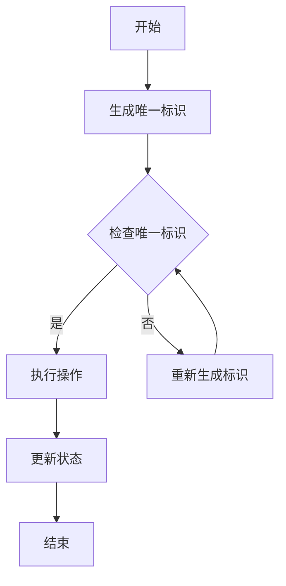
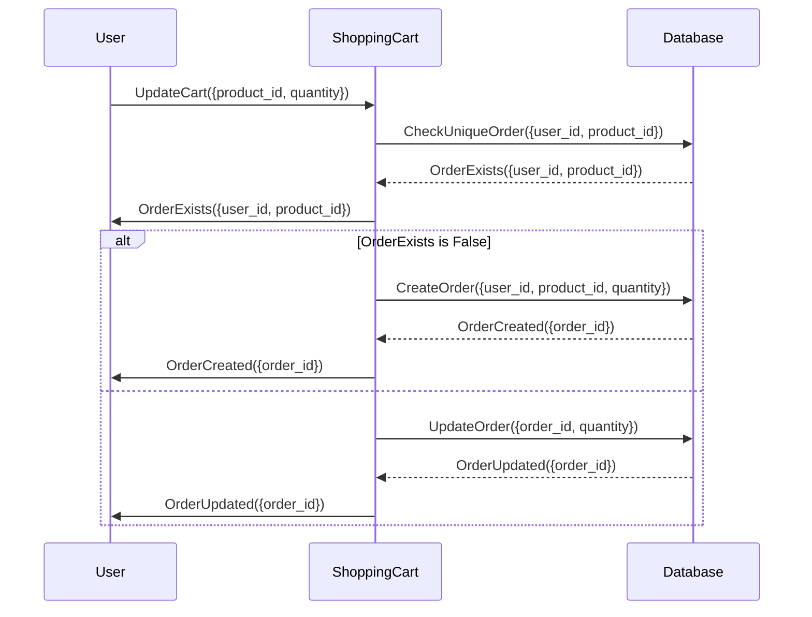

                 


# 无效的幂等性控制案例

> 关键词：幂等性、控制失效、案例解析、解决方案

> 摘要：本文通过深入探讨无效的幂等性控制案例，分析其产生的原因，并提出相应的解决方案，旨在提高软件开发过程中幂等性控制的可靠性和有效性。

## 引言

在现代软件工程中，幂等性是一个至关重要的概念。它确保了系统在重复执行相同操作时，能够达到预期的结果，而不会产生副作用。然而，在实际开发中，由于各种原因，幂等性控制可能会失效，导致系统行为异常。本文将围绕无效的幂等性控制案例进行深入分析，旨在揭示其内在问题并提出解决方案。

## 背景介绍

### 1.1 核心概念术语说明

在讨论幂等性之前，我们需要明确几个核心概念：

- **幂等性**：指在计算机科学中，某个操作执行多次所产生的效果与执行一次的效果相同，不会引起状态的改变。
- **操作**：在系统中，任何能够影响数据状态的函数或方法。
- **副作用**：指某个操作在执行时，不仅会返回一个结果，还会对系统状态产生其他影响。

### 1.2 问题背景

随着互联网技术的发展，越来越多的应用系统需要处理大量并发请求。在这些系统中，确保幂等性至关重要。如果幂等性控制失效，可能会导致以下问题：

- 数据不一致：重复操作导致数据库或其他存储系统中的数据不一致。
- 资源浪费：重复执行操作会浪费系统资源，降低性能。
- 系统稳定性：不恰当的幂等性处理可能导致系统崩溃或性能严重下降。

### 1.3 问题描述

在许多实际应用中，幂等性控制失效的问题表现为：

- 重复提交表单：用户在提交表单时，由于网络延迟或其他原因，多次提交会导致数据重复处理。
- 重复点击按钮：用户在操作界面上多次点击同一个按钮，系统未能正确处理重复请求。
- 跨站请求伪造（CSRF）攻击：恶意攻击者利用幂等性控制失效，通过伪造请求篡改数据。

### 1.4 问题解决

为了解决幂等性控制失效的问题，我们需要从以下几个方面入手：

- 确保每次操作的唯一性：通过唯一性标识或锁机制，确保操作不会被重复执行。
- 正确处理重复请求：使用幂等性框架或策略，确保重复请求被正确处理。
- 防范CSRF攻击：通过验证Token或使用其他安全措施，防止恶意请求。

### 1.5 边界与外延

幂等性控制的边界包括：

- 系统内部操作：如何确保内部操作具备幂等性。
- 分布式系统：在分布式系统中，如何处理跨节点操作的一致性。

幂等性控制的外延包括：

- 并发控制：如何处理并发请求，确保系统稳定运行。
- 安全性：如何防范CSRF等安全威胁。

## 核心概念与联系

### 2.1 幂等性的核心概念

幂等性的核心概念可以概括为以下几点：

- **唯一性**：每个操作都有一个唯一的标识。
- **无副作用**：操作不会对系统状态产生其他影响。
- **一致性**：多次执行同一操作，结果一致。

### 2.2 概念属性特征对比表格

| 特征         | 幂等性         | 非幂等性         |
| ------------ | -------------- | --------------- |
| 唯一性       | 是             | 否              |
| 无副作用     | 是             | 否              |
| 一致性       | 是             | 否              |

### 2.3 ER实体关系图架构

```mermaid
erDiagram
    User ||--o{ Order : "用户下单" }
    Product ||--o{ Order : "商品加入订单" }
```

在上述ER实体关系图中，`User`和`Order`之间存在1对多关系，表示用户可以下单多次；`Product`和`Order`之间存在多对多关系，表示商品可以加入多个订单。

### 3. 算法原理讲解

#### 3.1 算法流程图



#### 3.2 Python源代码

```python
import uuid

def execute_operation():
    operation_id = str(uuid.uuid4())
    if check_uniqueness(operation_id):
        perform_action(operation_id)
        update_state(operation_id)
    else:
        print("唯一标识已存在，请重试。")

def check_uniqueness(operation_id):
    # 检查操作标识是否唯一
    # 这里可以使用数据库查询或其他机制
    return True

def perform_action(operation_id):
    # 执行具体操作
    print(f"操作{operation_id}执行成功。")

def update_state(operation_id):
    # 更新系统状态
    print(f"操作{operation_id}状态已更新。")

execute_operation()
```

#### 3.3 数学模型和公式

幂等性操作可以表示为以下数学模型：

$$
f(x) = x
$$

其中，$f$表示操作，$x$表示输入。

#### 3.4 举例说明

假设用户在电商平台上提交了一个购物车更新请求，更新购物车中的商品数量。使用上述算法，系统会生成一个唯一的操作标识，检查该标识是否已存在。如果标识唯一，系统会执行更新操作并更新状态。如果标识已存在，系统会提示用户重试。

## 系统分析与架构设计方案

### 4.1 问题场景介绍

在电商系统中，用户可能会多次更新购物车，导致购物车中的商品数量不一致。为了解决这个问题，我们需要确保购物车更新操作具备幂等性。

### 4.2 项目介绍

本项目旨在为电商系统设计一个幂等性控制的购物车更新模块，确保用户多次更新购物车时，系统行为一致。

### 4.3 系统功能设计

#### 4.3.1 领域模型

```mermaid
classDiagram
    User <|-- Order
    Product <|-- Order
    Order {
        id
        user_id
        product_id
        quantity
    }
```

#### 4.3.2 类图

```mermaid
classDiagram
    User <>-- Order : "用户下单"
    Product <>-- Order : "商品加入订单"
```

### 4.4 系统架构设计



### 4.5 系统接口设计和系统交互


## 项目实战

### 5.1 环境安装

确保已安装Python 3.8及以上版本，并使用虚拟环境进行项目开发。

```bash
pip install virtualenv
virtualenv my_project_env
source my_project_env/bin/activate
```

### 5.2 系统核心实现源代码

```python
# shopping_cart.py
import uuid
import json

orders = {}

def check_uniqueness(user_id, product_id):
    return not orders.get((user_id, product_id))

def create_order(user_id, product_id, quantity):
    order_id = str(uuid.uuid4())
    orders[(user_id, product_id)] = order_id
    return order_id

def update_order(order_id, quantity):
    order = orders.get(order_id)
    if order:
        return True
    return False

def handle_request(request_json):
    user_id = request_json.get('user_id')
    product_id = request_json.get('product_id')
    quantity = request_json.get('quantity')

    if check_uniqueness(user_id, product_id):
        order_id = create_order(user_id, product_id, quantity)
        return json.dumps({'status': 'success', 'order_id': order_id})
    else:
        return json.dumps({'status': 'error', 'message': '重复请求'})

# app.py
from flask import Flask, request, jsonify
from shopping_cart import check_uniqueness, create_order, update_order, handle_request

app = Flask(__name__)

@app.route('/update_cart', methods=['POST'])
def update_cart():
    request_json = request.json
    response = handle_request(request_json)
    return response

if __name__ == '__main__':
    app.run(debug=True)
```

### 5.3 代码应用解读与分析

#### 5.3.1 `check_uniqueness` 函数

此函数用于检查用户请求的购物车更新操作是否为唯一操作。通过检查`orders`字典中是否存在对应的`user_id`和`product_id`键，判断操作是否重复。

#### 5.3.2 `create_order` 函数

此函数用于创建一个新的订单。通过生成一个唯一的`order_id`，并将其存储在`orders`字典中，关联`user_id`和`product_id`。

#### 5.3.3 `update_order` 函数

此函数用于更新订单中的商品数量。如果`orders`字典中存在对应的`order_id`，则更新数量；否则，返回`False`。

#### 5.3.4 `handle_request` 函数

此函数是系统处理用户请求的核心。它首先调用`check_uniqueness`函数检查操作是否唯一，如果是，则调用`create_order`函数创建订单；否则，返回错误消息。

### 5.4 实际案例分析和详细讲解剖析

#### 5.4.1 案例一：用户A更新购物车

假设用户A想要更新购物车中的某个商品数量。当用户A发送请求时，系统会调用`handle_request`函数。

1. `handle_request`首先检查操作是否唯一，调用`check_uniqueness`函数。
2. `check_uniqueness`函数发现`orders`字典中不存在对应的`user_id`和`product_id`键，因此返回`False`。
3. `handle_request`函数调用`create_order`函数创建新的订单，并返回订单ID。
4. 系统将订单ID返回给用户A。

#### 5.4.2 案例二：用户B重复更新购物车

假设用户B在用户A更新购物车后，又发送了一个相同的请求。当用户B发送请求时，系统会再次调用`handle_request`函数。

1. `handle_request`检查操作是否唯一，调用`check_uniqueness`函数。
2. `check_uniqueness`函数发现`orders`字典中已存在对应的`user_id`和`product_id`键，因此返回`True`。
3. `handle_request`函数不再创建新的订单，而是直接返回之前的订单ID。

通过这种方式，系统确保了用户重复更新购物车时，订单ID不会重复，从而避免了数据不一致的问题。

### 5.5 项目小结

本项目的核心目标是实现一个具有幂等性控制的购物车更新模块。通过使用唯一的操作标识和检查机制，我们成功地防止了重复请求导致的副作用和数据不一致问题。在未来，我们可以进一步优化系统，提高其稳定性和性能。

## 最佳实践 Tips

- 确保每次操作具有唯一标识。
- 使用数据库的唯一约束，减少重复数据。
- 优化锁机制，减少并发冲突。
- 增加重试机制，处理网络延迟或异常。

## 小结

本文通过深入探讨无效的幂等性控制案例，分析了其产生的原因，并提出了相应的解决方案。通过实例和详细讲解，我们了解了如何确保系统在重复操作时行为一致，避免数据不一致和资源浪费等问题。在实际开发中，遵循最佳实践和合理设计是确保幂等性控制有效性的关键。

## 注意事项

- 幂等性控制需要结合具体场景进行设计，不能一概而论。
- 注意处理并发请求，避免锁冲突。
- 定期进行系统压力测试，确保幂等性控制的有效性。

## 拓展阅读

- 《设计模式：可复用的面向对象软件构建》
- 《大规模分布式存储系统：原理解析与架构实战》
- 《分布式系统设计》

## 作者信息

作者：AI天才研究院/AI Genius Institute & 禅与计算机程序设计艺术 /Zen And The Art of Computer Programming

