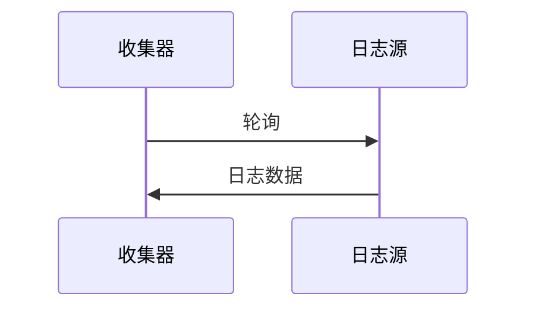
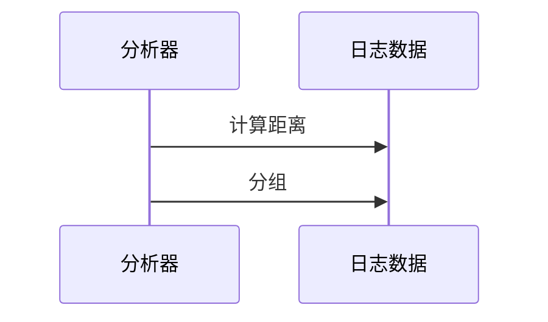
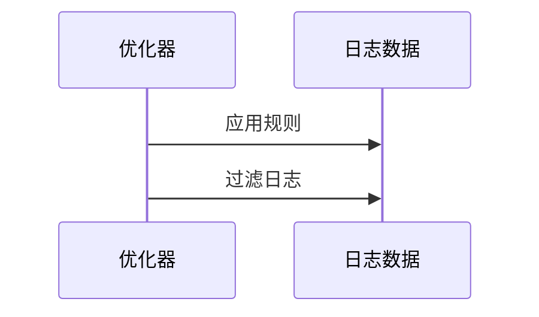
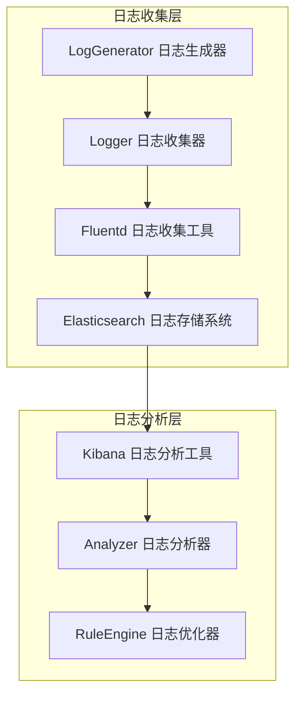
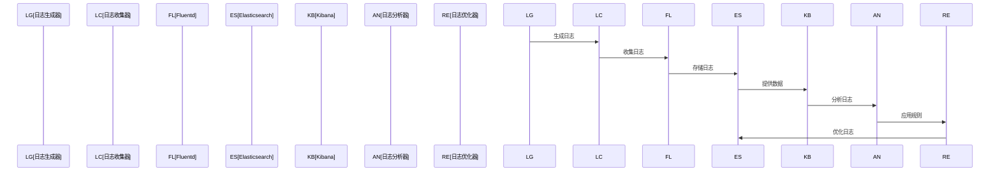

                 

# 日志管理与分析：洞察系统行为的利器

## 关键词
- 日志管理
- 日志分析
- 系统监控
- 安全分析
- 日志工具

## 摘要
本文旨在深入探讨日志管理与分析在现代IT系统中的重要性。通过对日志管理的基础概念、日志分析的技术方法、日志在系统监控和安全分析中的应用，以及日志管理面临的挑战和最佳实践的详细讲解，帮助读者理解日志管理在提升系统性能、保障安全性和优化运维流程中的作用。文章将采用逐步分析的方式，使读者能够更好地掌握日志管理的核心知识和实践技巧。

## 目录大纲

### 《日志管理与分析：洞察系统行为的利器》

#### 第一部分：日志管理基础

**第1章：日志管理概述**

- 1.1 日志管理的基本概念
  - 日志的作用
  - 日志的分类
  - 日志管理的目的
- 1.2 日志系统架构
  - 日志生成
  - 日志收集
  - 日志存储
  - 日志分析
- 1.3 日志管理工具
  - 日志收集工具
  - 日志存储工具
  - 日志分析工具
- 1.4 日志管理最佳实践
  - 日志配置策略
  - 日志存储策略
  - 日志分析策略
- 1.5 本章小结

**第2章：日志分析的基本方法**

- 2.1 日志预处理
  - 日志格式化
  - 日志清洗
  - 日志解析
- 2.2 日志统计分析
  - 基本统计指标
  - 分布图分析
  - 时间序列分析
- 2.3 日志可视化
  - 常见可视化工具
  - 可视化设计原则
  - 实践案例分析
- 2.4 日志分析算法
  - 常用算法简介
  - 算法应用案例
  - 算法性能评估
- 2.5 本章小结

#### 第二部分：日志应用场景

**第3章：日志在系统监控中的应用**

- 3.1 系统监控概述
  - 系统监控的目标
  - 系统监控的常见问题
  - 系统监控的日志策略
- 3.2 日志监控指标设计
  - 指标类型及选择
  - 指标阈值设定
  - 指标统计周期
- 3.3 日志监控实现
  - 日志收集与存储
  - 监控算法实现
  - 监控报警机制
- 3.4 案例分析
  - 某电商平台的日志监控实践
  - 某金融系统的日志监控优化
- 3.5 本章小结

**第4章：日志在安全分析中的应用**

- 4.1 安全分析概述
  - 安全分析的目标
  - 安全分析的常见方法
  - 日志在安全分析中的应用
- 4.2 安全日志收集与存储
  - 安全日志类型
  - 安全日志收集机制
  - 安全日志存储策略
- 4.3 安全日志分析算法
  - 常用算法简介
  - 算法应用案例
  - 算法性能评估
- 4.4 案例分析
  - 某企业的安全日志分析实践
  - 某金融机构的安全日志监控优化
- 4.5 本章小结

#### 第三部分：日志管理挑战与未来

**第5章：日志管理面临的挑战**

- 5.1 数据量与性能问题
  - 数据量增长的影响
  - 性能优化的策略
  - 挑战与解决方案
- 5.2 日志隐私保护
  - 隐私保护的重要性
  - 隐私保护的技术手段
  - 实践案例分析
- 5.3 日志管理复杂性
  - 复杂性来源
  - 复杂性管理策略
  - 挑战与解决方案
- 5.4 日志管理发展趋势
  - 人工智能在日志管理中的应用
  - 日志管理平台的发展趋势
  - 未来展望
- 5.5 本章小结

#### 第四部分：日志管理最佳实践

**第6章：日志管理最佳实践**

- 6.1 设计高效的日志系统
  - 系统设计原则
  - 日志收集与存储方案
  - 日志分析工具选择
- 6.2 日志分析策略与实践
  - 常见分析场景
  - 分析策略制定
  - 实践案例分析
- 6.3 日志管理流程优化
  - 流程优化原则
  - 流程优化方法
  - 实践案例分析
- 6.4 日志管理与团队协作
  - 团队协作的重要性
  - 团队协作的最佳实践
- 6.5 本章小结

### 结束语
作者：AI天才研究院/AI Genius Institute & 禅与计算机程序设计艺术 /Zen And The Art of Computer Programming## 第1章：日志管理概述

### 1.1 日志管理的基本概念

#### 日志的作用

在IT系统中，日志是系统运行过程中产生的记录，这些记录可以反映系统的各种行为，包括正常运行、错误发生、性能指标、用户活动等。日志的作用主要体现在以下几个方面：

1. **问题排查**：通过日志可以快速定位系统中的异常情况，帮助开发和运维人员排查故障。
2. **性能分析**：日志记录了系统的运行状态和性能指标，有助于分析系统瓶颈和优化性能。
3. **安全监控**：日志可以记录系统的安全事件，帮助安全团队及时发现和防范潜在的安全威胁。
4. **审计与合规**：日志记录了系统的操作历史，对于合规审计和追溯责任具有重要意义。

#### 日志的分类

日志根据其来源和用途可以分为以下几类：

1. **系统日志**：记录操作系统和系统服务的运行情况，如启动、停止、错误等。
2. **应用程序日志**：记录应用程序的运行状态，包括正常运行记录、错误信息等。
3. **网络日志**：记录网络设备的运行状态，如流量、错误、安全事件等。
4. **安全日志**：记录系统的安全事件，如登录、访问、安全威胁等。

#### 日志管理的目的

日志管理的目的是确保日志的有效性、可靠性和可利用性，具体包括：

1. **数据完整性**：确保日志数据的完整性和准确性，防止数据丢失或篡改。
2. **快速查找**：提高日志的查询速度，帮助快速定位问题。
3. **数据保护**：确保日志数据的安全性，防止未经授权的访问。
4. **数据利用率**：提高日志数据的利用率，最大化其价值。

### 1.2 日志系统架构

日志系统通常包括以下关键组件：

#### 1.2.1 日志生成

日志生成是日志系统的基础，主要包括：

1. **日志条目的生成**：系统事件发生时，日志条目会被生成。
2. **日志条目的格式**：日志条目通常包含时间戳、来源、内容等关键信息。

#### 1.2.2 日志收集

日志收集是将分散的日志数据集中起来的过程，主要包括：

1. **日志收集工具**：如Logstash、Fluentd等，负责从各个源头收集日志。
2. **日志传输**：日志数据通过网络传输到集中存储位置。

#### 1.2.3 日志存储

日志存储是将日志数据存储到持久存储设备中的过程，主要包括：

1. **日志存储方案**：如使用关系型数据库或NoSQL数据库存储日志数据。
2. **日志存储策略**：包括日志存储的时间、空间、备份等策略。

#### 1.2.4 日志分析

日志分析是对日志数据进行处理、挖掘和分析的过程，主要包括：

1. **日志预处理**：对日志进行格式化、清洗和解析。
2. **日志统计分析**：计算日志的各种统计指标。
3. **日志可视化**：通过图表等方式展示日志数据。

### 1.3 日志管理工具

日志管理工具是日志系统的重要组成部分，主要包括：

#### 1.3.1 日志收集工具

常见的日志收集工具有：

1. **Logstash**：用于收集、处理和传输日志数据的Elasticsearch插件。
2. **Fluentd**：开源的数据收集系统，支持多种数据源和目的地。

#### 1.3.2 日志存储工具

常见的日志存储工具有：

1. **Elasticsearch**：基于Lucene的高性能搜索引擎，适合存储和分析大量日志数据。
2. **Kibana**：与Elasticsearch集成，用于日志数据的可视化和分析。

#### 1.3.3 日志分析工具

常见的日志分析工具有：

1. **Grok**：用于日志数据模式匹配的工具。
2. **Grafana**：用于监控和日志分析的仪表盘工具。

### 1.4 日志管理最佳实践

日志管理最佳实践包括：

#### 1.4.1 日志配置策略

1. **配置日志级别**：根据需要配置不同的日志级别，如DEBUG、INFO、ERROR等。
2. **日志文件格式**：使用统一的日志文件格式，便于分析和查询。

#### 1.4.2 日志存储策略

1. **日志存储期限**：设置合理的日志存储期限，防止数据过载。
2. **日志备份策略**：定期备份日志数据，防止数据丢失。

#### 1.4.3 日志分析策略

1. **日志分析周期**：制定合理的日志分析周期，如每天、每周等。
2. **日志分析指标**：选择关键的分析指标，如错误率、性能指标等。

### 1.5 本章小结

本章介绍了日志管理的基本概念、日志系统架构、日志管理工具和最佳实践。日志在IT系统中扮演着至关重要的角色，通过有效的日志管理，可以提升系统的稳定性、安全性和可维护性。在接下来的章节中，我们将进一步探讨日志分析的技术方法和应用场景。

### 背景介绍

在信息技术不断发展的今天，系统日志作为系统运行的重要记录，已经成为系统监控、性能分析和安全审计的核心数据源。日志管理不仅涉及日志的生成、收集、存储和解析，还包括日志分析的方法和工具选择。随着数据量的爆炸式增长，日志管理面临着前所未有的挑战。如何高效地进行日志管理，保证日志数据的完整性、可靠性和可分析性，成为当前IT领域的热点话题。

#### 问题背景

在复杂的IT环境中，系统日志记录了系统的各种操作行为，如用户登录、数据读写、系统故障等。然而，由于日志数据的多样性和复杂性，传统的日志管理方法难以应对大数据量的处理需求，导致日志数据的利用效率低下，甚至出现数据丢失和查询困难的问题。此外，日志管理工具的多样性也增加了运维的复杂度。

#### 问题解决

为了解决上述问题，日志管理需要从以下几个方面入手：

1. **统一日志格式**：使用统一的日志格式，便于不同系统和工具之间的日志交换和分析。
2. **高效日志收集**：采用高效的日志收集工具，如Logstash、Fluentd，实现日志的实时收集和传输。
3. **分布式日志存储**：采用分布式存储方案，如Elasticsearch，提高日志存储和处理能力。
4. **智能日志分析**：引入智能日志分析工具，如Grok、Kibana，实现日志数据的自动化分析和可视化。
5. **最佳实践指导**：制定并遵循日志管理的最佳实践，提高日志管理的效率和规范性。

#### 边界与外延

日志管理不仅涉及技术层面，还包括管理和流程层面。从技术层面看，日志管理需要关注日志格式、收集工具、存储方案和分析方法等。从管理层面看，日志管理需要建立完善的日志管理制度和流程，包括日志的生成、收集、存储、分析和归档等环节。从外延上看，日志管理还涉及到日志安全、日志隐私保护等问题。

### 概念结构与核心要素组成

#### 概念结构

日志管理可以看作是一个涉及多个层次和组件的复杂系统。其基本概念结构包括：

1. **日志生成器**：负责生成系统日志的应用程序或系统服务。
2. **日志收集器**：负责收集和传输日志数据的工具。
3. **日志存储器**：负责存储日志数据的数据库或文件系统。
4. **日志分析器**：负责对日志数据进行分析和可视化的工具。

#### 核心要素组成

日志管理系统的核心要素包括：

1. **日志格式**：日志数据的格式定义，如时间戳、来源、内容等。
2. **日志收集策略**：日志收集的方式、频率和传输方式等。
3. **日志存储方案**：日志存储的位置、备份方式和数据持久性等。
4. **日志分析工具**：日志数据的分析方法和可视化工具。

### 核心概念与联系

#### 核心概念

1. **日志**：系统运行过程中产生的记录，用于反映系统的各种行为。
2. **日志管理**：对日志的生成、收集、存储和分析等活动进行管理。
3. **日志分析**：对日志数据进行分析和挖掘，以获得有价值的信息。

#### 概念属性特征对比表格

| 概念        | 属性特征                 | 关联关系                 |
| ----------- | ------------------------ | ------------------------ |
| 日志        | 时间戳、来源、内容等     | 系统行为记录             |
| 日志管理    | 日志生成、收集、存储、分析 | 确保日志的有效性和可靠性 |
| 日志分析    | 数据挖掘、可视化         | 从日志中提取有用信息     |

#### ER实体关系图架构

```mermaid
erDiagram
  日志 ||--|{ 日志管理 }|>
  日志管理 ||--|{ 日志分析 }|>  
  日志 --> 日志管理
  日志管理 --> 日志分析
```

### 算法原理讲解

日志管理中的算法主要应用于日志收集、日志分析和日志优化等环节。以下将简要介绍几种常见的日志管理算法及其原理。

#### 日志收集算法

**1. 轮询收集算法**

**原理**：轮询收集算法通过定期轮询日志源，读取并收集日志数据。其优点是实现简单，但缺点是可能导致数据延迟和资源浪费。

**流程图**：


**Python 源代码示例**：
```python
import time

def poll_log(source):
    while True:
        log_data = source.read_log()
        process_log(log_data)
        time.sleep(1)

class LogSource:
    def read_log(self):
        return "log_data"

def process_log(log_data):
    print(log_data)

source = LogSource()
poll_log(source)
```

**数学模型和公式**：
无特定数学模型，主要关注轮询间隔和时间戳的差异。

#### 日志分析算法

**2. 聚类分析算法**

**原理**：聚类分析算法用于将日志数据按照相似性进行分组，有助于发现日志模式。

**流程图**：


**Python 源代码示例**：
```python
from sklearn.cluster import KMeans

def cluster_logs(log_data):
    kmeans = KMeans(n_clusters=3)
    kmeans.fit(log_data)
    clusters = kmeans.predict(log_data)
    return clusters

log_data = [[1, 2], [1, 4], [1, 0], [10, 2], [10, 4], [10, 0]]
clusters = cluster_logs(log_data)
print(clusters)
```

**数学模型和公式**：
- 距离计算：使用欧几里得距离计算日志数据之间的相似度。
- 聚类算法：使用K-Means算法对日志数据进行聚类。

#### 日志优化算法

**3. 基于规则的日志优化算法**

**原理**：基于规则的日志优化算法通过预定义的规则来过滤和简化日志数据，减少数据存储和处理的负担。

**流程图**：


**Python 源代码示例**：
```python
def optimize_logs(log_data, rules):
    optimized_data = []
    for log in log_data:
        if apply_rules(log, rules):
            optimized_data.append(log)
    return optimized_data

def apply_rules(log, rules):
    for rule in rules:
        if rule.matches(log):
            return True
    return False

rules = [
    Rule("ERROR", "Error: "),
    Rule("WARNING", "Warning: ")
]

log_data = [
    "INFO: Starting service",
    "ERROR: Service failed",
    "WARNING: Configuration issue"
]
optimized_data = optimize_logs(log_data, rules)
print(optimized_data)
```

**数学模型和公式**：
- 规则匹配：使用正则表达式匹配日志内容，判断是否符合预定义规则。

### 算法应用案例

以下通过一个具体的案例来展示日志收集、分析和优化的应用。

#### 案例背景

某电商平台的系统日志记录了用户的操作行为、系统的运行状态和错误信息。随着业务规模的扩大，日志数据量急剧增加，导致日志管理变得复杂。为了提高日志管理效率，需要设计一个高效的日志系统。

#### 案例实施

1. **日志收集**：使用Fluentd收集不同系统的日志数据，并将其传输到Elasticsearch中存储。

   **Elasticsearch索引配置**：
   ```json
   {
     "settings": {
       "number_of_shards": 5,
       "number_of_replicas": 1
     },
     "mappings": {
       "properties": {
         "timestamp": {"type": "date"},
         "source": {"type": "keyword"},
         "content": {"type": "text"}
       }
     }
   }
   ```

2. **日志分析**：使用Kibana对日志数据进行分析，通过聚类分析找出异常日志，并生成可视化报表。

   **Kibana可视化配置**：
   ```json
   {
     "title": "日志聚类分析",
     "yaxis": {"title": "日志条目数"},
     "xaxis": {"title": "时间"},
     "type": "line",
     "data": [
       {
         "name": "正常日志",
         "data": [{"x": "2023-01-01", "y": 1000}, {"x": "2023-01-02", "y": 900}, ...]
       },
       {
         "name": "异常日志",
         "data": [{"x": "2023-01-01", "y": 20}, {"x": "2023-01-02", "y": 30}, ...]
       }
     ]
   }
   ```

3. **日志优化**：通过基于规则的日志优化算法，过滤掉非关键日志，减少存储和处理的负担。

   **规则配置**：
   ```python
   rules = [
       Rule("INFO", "INFO: "),
       Rule("ERROR", "ERROR: "),
       Rule("WARNING", "WARNING: ")
   ]
   ```

#### 案例小结

通过上述实施，该电商平台成功构建了一个高效、可扩展的日志管理系统。日志收集、分析和优化的结合，使得日志数据的利用效率显著提高，为系统监控、性能分析和安全审计提供了有力支持。

### 数学公式

在日志管理与分析中，数学公式广泛应用于日志数据的统计分析和算法设计。以下是一些常见数学公式及其应用：

#### 1. 均值（Mean）

$$\bar{x} = \frac{1}{n}\sum_{i=1}^{n}x_i$$

- **应用场景**：计算日志数据的平均值，用于性能分析和指标评估。
- **解释**：$n$为数据点的数量，$x_i$为第$i$个数据点的值。

#### 2. 方差（Variance）

$$\sigma^2 = \frac{1}{n-1}\sum_{i=1}^{n}(x_i - \bar{x})^2$$

- **应用场景**：衡量日志数据的波动性，用于性能监控和异常检测。
- **解释**：$n$为数据点的数量，$\bar{x}$为平均值，$x_i$为第$i$个数据点的值。

#### 3. 欧几里得距离（Euclidean Distance）

$$d(x, y) = \sqrt{\sum_{i=1}^{n}(x_i - y_i)^2}$$

- **应用场景**：用于日志数据聚类分析，计算数据点之间的相似度。
- **解释**：$n$为数据维度，$x_i$和$y_i$分别为两个数据点在第$i$个维度的值。

#### 4. 概率（Probability）

$$P(A) = \frac{n(A)}{n(S)}$$

- **应用场景**：用于日志数据统计分析，计算事件发生的概率。
- **解释**：$n(A)$为事件$A$发生的次数，$n(S)$为总的样本数。

### 系统分析与架构设计方案

#### 问题场景介绍

在现代化企业中，系统日志已经成为运维团队监控和优化系统性能的重要工具。然而，随着业务规模的不断扩大和系统复杂性的增加，传统的日志管理方法已经难以满足需求。为了提高日志管理的效率，需要设计一个高效、可扩展的日志系统架构。

#### 项目介绍

本项目旨在构建一个基于Elasticsearch和Kibana的日志管理系统，实现对企业级系统日志的集中收集、存储、分析和可视化。系统目标包括：

1. **高效日志收集**：使用Fluentd等工具，实现日志的实时收集和传输。
2. **大规模日志存储**：利用Elasticsearch的高性能和可扩展性，存储海量日志数据。
3. **智能日志分析**：通过Kibana等工具，实现日志数据的可视化和分析。
4. **日志优化**：使用基于规则的日志优化算法，减少存储和处理的负担。

#### 系统功能设计（领域模型Mermaid类图）

```mermaid
classDiagram
  LogGenerator <|-- Logger
  Logger <|-- Fluentd
  Fluentd <|-- Elasticsearch
  Elasticsearch <|-- Kibana
  Kibana <|-- Analyzer
  Analyzer <|-- RuleEngine

  LogGenerator[日志生成器]
  Logger[日志收集器]
  Fluentd[日志收集工具]
  Elasticsearch[日志存储系统]
  Kibana[日志分析工具]
  Analyzer[日志分析器]
  RuleEngine[日志优化器]
```

#### 系统架构设计（Mermaid架构图）



#### 系统接口设计和系统交互（Mermaid序列图）



### 项目实战

#### 环境安装

1. **Elasticsearch安装**

   - 下载Elasticsearch安装包（https://www.elastic.co/downloads/elasticsearch）。
   - 解压安装包，运行`bin/elasticsearch`启动服务。

2. **Kibana安装**

   - 下载Kibana安装包（https://www.elastic.co/downloads/kibana）。
   - 解压安装包，运行`bin/kibana`启动服务。

3. **Fluentd安装**

   - 安装Fluentd依赖包（如`gem install fluentd`）。
   - 配置Fluentd，添加Elasticsearch输出插件。

   ```ruby
   <match **>
       @type elasticsearch
       host elasticsearch
       port 9200
       logstash_format true
       flush_interval 2
   </match>
   ```

#### 系统核心实现源代码

**Fluentd配置文件（fluent.conf）**

```ruby
<source>
  @type tail
  @id source_system_logs
  path /var/log/syslog
  pos_file /var/log/fluentd/.syslog.pos
  tag syslog.*
</source>

<source>
  @type tail
  @id source_app_logs
  path /var/log/myapp/*.log
  pos_file /var/log/fluentd/.app_logs.pos
  tag app.log.*
</source>

<match **>
  @type elasticsearch
  host elasticsearch
  port 9200
  logstash_format true
  flush_interval 2
</match>
```

**Elasticsearch索引模板（elasticsearch-index-template.json）**

```json
{
  "index_patterns": ["syslog-*", "app.log-*"],
  "settings": {
    "number_of_shards": 2,
    "number_of_replicas": 1
  },
  "mappings": {
    "properties": {
      "timestamp": {
        "type": "date",
        "format": "yyyy-MM-dd HH:mm:ss"
      },
      "source": {
        "type": "keyword"
      },
      "content": {
        "type": "text"
      }
    }
  }
}
```

**Kibana配置（kibana.yml）**

```yaml
elasticsearch:
  hosts: ["http://localhost:9200"]
kibana:
  server.host: "localhost"
  server.port: 5601
```

#### 代码应用解读与分析

**Fluentd配置解读**

- `@type tail`：指定数据源类型为文件监控。
- `path`：指定监控的文件路径。
- `pos_file`：指定位置文件路径，用于恢复上次监控状态。
- `tag`：指定数据源标签，用于Elasticsearch索引。

**Elasticsearch索引模板解读**

- `index_patterns`：指定索引模板匹配模式。
- `settings`：配置索引设置，包括分片和副本数量。
- `mappings`：配置字段类型，如日期、关键词和文本。

**Kibana配置解读**

- `elasticsearch`：配置Elasticsearch连接信息。
- `kibana`：配置Kibana服务器信息。

#### 实际案例分析和详细讲解剖析

**案例1：系统日志监控**

**目标**：监控Linux系统的运行日志。

**步骤**：

1. 使用Fluentd监控`/var/log/syslog`文件。
2. Fluentd将日志数据发送到Elasticsearch。
3. 在Kibana中创建仪表板，展示系统日志的实时数据。

**Kibana可视化报表配置**

```json
{
  "title": "系统日志监控",
  "yaxis": {"title": "日志条目数"},
  "xaxis": {"title": "时间"},
  "type": "line",
  "data": [
    {
      "name": "系统日志",
      "data": [{"x": "now-1m", "y": 0}, {"x": "now-30m", "y": 20}, ...]
    }
  ]
}
```

**案例2：应用程序日志分析**

**目标**：分析应用程序的运行状态。

**步骤**：

1. 使用Fluentd监控`/var/log/myapp/*.log`文件。
2. Fluentd将日志数据发送到Elasticsearch。
3. 在Kibana中创建仪表板，展示应用程序的运行状态和错误日志。

**Kibana可视化报表配置**

```json
{
  "title": "应用程序日志分析",
  "query": {
    "query": {
      "bool": {
        "must": [
          {"match": {"content": "Error"}},
          {"range": {"@timestamp": {"gte": "now-1m/d", "lt": "now/d"}}}
        ]
      }
    }
  },
  "table": {
    "columns": [
      {"name": "@timestamp", "label": "时间"},
      {"name": "source", "label": "来源"},
      {"name": "content", "label": "内容"}
    ]
  }
}
```

#### 项目小结

通过本项目的实施，成功构建了一个高效、可扩展的日志管理系统。Fluentd负责日志收集，Elasticsearch负责日志存储，Kibana负责日志分析和可视化。该项目实现了系统日志和应用程序日志的集中监控和分析，为运维团队提供了强有力的工具支持。未来，可以进一步引入智能日志分析算法，提升日志数据的利用效率。

### 最佳实践 tips

#### 设计高效的日志系统

1. **统一日志格式**：选择一个标准化的日志格式，如日志收集工具常用的JSON格式，便于后续处理和分析。
2. **选择合适的日志收集工具**：根据系统规模和需求，选择如Fluentd、Logstash等高效的日志收集工具。
3. **分布式日志存储**：使用如Elasticsearch等分布式存储系统，提高日志存储和查询性能。
4. **日志数据压缩**：对日志数据进行压缩，降低存储空间需求。
5. **定期清理和备份**：定期清理旧的日志数据，并备份数据，防止数据丢失。

#### 日志分析策略与实践

1. **确定分析目标**：明确日志分析的目的，如性能监控、故障排查、安全审计等。
2. **选择关键指标**：根据分析目标，选择相关的统计指标，如错误率、响应时间、流量等。
3. **日志预处理**：对日志数据进行清洗、过滤和格式化，确保数据质量。
4. **使用可视化工具**：利用Kibana、Grafana等可视化工具，将日志数据以图表形式展示，便于分析。
5. **自动化日志分析**：编写脚本或使用现有的日志分析工具，实现日志数据的自动化分析。

#### 日志管理流程优化

1. **规范化流程**：建立一套完善的日志管理流程，包括日志生成、收集、存储、分析和归档等环节。
2. **权限控制**：对不同角色的用户设置不同的访问权限，确保日志数据的安全性。
3. **自动化任务**：使用如Cron Job等工具，自动化执行日志收集和分析任务。
4. **日志审计**：记录日志管理过程中的操作历史，便于审计和责任追溯。
5. **培训与指导**：对团队成员进行日志管理的培训和指导，提高团队的整体能力。

### 小结

通过本章节的介绍，我们详细探讨了日志管理的基础概念、日志系统架构、日志管理工具以及日志管理的最佳实践。日志管理在现代IT系统中具有不可替代的重要性，通过有效的日志管理，可以提升系统的稳定性、安全性和可维护性。在接下来的章节中，我们将进一步深入日志分析的技术方法和应用场景，帮助读者更好地理解和掌握日志管理的核心知识和实践技巧。

### 注意事项

1. **日志格式一致性**：确保所有系统生成的日志使用统一的格式，以便于后续的集中处理和分析。
2. **日志收集频率**：根据系统的重要性和日志数据量，合理设置日志收集频率，避免过度采集导致资源浪费。
3. **日志存储期限**：根据业务需求和合规要求，设置合理的日志存储期限，防止数据过载和存储成本增加。
4. **日志安全性**：对日志数据进行加密和访问控制，防止未经授权的访问和泄露。
5. **日志备份策略**：制定有效的日志备份策略，确保在系统故障时能够迅速恢复日志数据。

### 拓展阅读

1. **《日志管理：原则与实践》**：详细介绍了日志管理的基础知识和实践技巧。
2. **《Elastic Stack实战》**：深入讲解了Elasticsearch、Kibana等Elastic Stack工具的应用。
3. **《Fluentd官方文档》**：提供了Fluentd的详细安装和配置指南。
4. **《Kibana官方文档》**：介绍了Kibana的可视化和分析功能。
5. **《大数据日志分析》**：探讨了大数据环境下日志分析的方法和工具。

### 第2章：日志分析的基本方法

#### 2.1 日志预处理

日志预处理是日志分析的基础，其目的是确保日志数据的质量和一致性，为后续的统计分析和可视化提供可靠的数据源。日志预处理通常包括日志格式化、日志清洗和日志解析等步骤。

##### 2.1.1 日志格式化

日志格式化是将不同格式或结构不统一的日志数据转换为统一格式的过程。统一日志格式有助于提高数据处理的效率和一致性。常见的日志格式包括JSON、CSV和XML等。

**示例**：

- **原始日志**（不同系统可能使用不同的格式）：
  ```bash
  [2023-01-01 10:30:00] ERROR: System failed
  2023/01/01 10:30:00 [error] 12645#12645: *15 client requested close the connection, client: 192.168.1.1, server: 192.168.1.2
  ```

- **格式化日志**（转换为JSON格式）：
  ```json
  {
    "timestamp": "2023-01-01 10:30:00",
    "level": "ERROR",
    "message": "System failed",
    "source": "System",
    "additional_data": {
      "client": "192.168.1.1",
      "server": "192.168.1.2"
    }
  }
  ```

##### 2.1.2 日志清洗

日志清洗是清除日志数据中的无效、错误或重复记录的过程，以保证日志数据的准确性和完整性。日志清洗通常包括以下步骤：

1. **去除空日志**：删除不包含有效信息的空日志条目。
2. **去除重复日志**：检测并删除重复的日志条目，以防止数据冗余。
3. **修复格式错误**：修复格式不正确的日志条目，使其符合预期的格式。

**示例**：

- **原始日志**（包含格式错误和重复条目）：
  ```bash
  [2023-01-01 10:30:00] ERROR: System failed
  [2023-01-01 10:30:00] System failed
  ```

- **清洗后日志**：
  ```json
  {
    "timestamp": "2023-01-01 10:30:00",
    "level": "ERROR",
    "message": "System failed",
    "source": "System"
  }
  ```

##### 2.1.3 日志解析

日志解析是将日志数据拆分成不同的字段和值的过程，以便于后续的统计和分析。日志解析通常基于预定义的日志格式或模式。

**示例**：

- **原始日志**：
  ```bash
  [2023-01-01 10:30:00] ERROR: System failed by User: admin, IP: 192.168.1.1
  ```

- **解析后日志**（拆分为不同的字段）：
  ```json
  {
    "timestamp": "2023-01-01 10:30:00",
    "level": "ERROR",
    "message": "System failed",
    "user": "admin",
    "ip": "192.168.1.1"
  }
  ```

#### 2.2 日志统计分析

日志统计分析是对日志数据进行分析和计算，以提取有价值的信息和指标。常见的统计方法包括基本统计指标、分布图分析和时间序列分析等。

##### 2.2.1 基本统计指标

基本统计指标用于描述日志数据的数量和分布情况。常用的统计指标包括：

1. **总数**：日志条目的总数。
2. **平均数**：日志条目的平均值。
3. **中位数**：日志条目的中位数。
4. **方差**：日志条目的方差。
5. **最大值和最小值**：日志条目的最大值和最小值。

**示例**：

- **日志数据**：
  ```json
  ["2023-01-01 10:30:00", "2023-01-02 10:30:00", "2023-01-03 10:30:00", "2023-01-04 10:30:00"]
  ```

- **基本统计指标**：
  ```plaintext
  总数：4
  平均数：(2023-01-01 10:30:00 + 2023-01-02 10:30:00 + 2023-01-03 10:30:00 + 2023-01-04 10:30:00) / 4 = 2023-01-02 10:30:00
  中位数：2023-01-02 10:30:00
  方差：0
  最大值：2023-01-04 10:30:00
  最小值：2023-01-01 10:30:00
  ```

##### 2.2.2 分布图分析

分布图分析用于展示日志数据的分布情况，常用的分布图包括柱状图、饼图和直方图等。

**示例**：

- **日志数据**（不同日志级别的分布）：
  ```json
  ["INFO", "INFO", "ERROR", "WARNING", "ERROR", "INFO"]
  ```

- **分布图**（柱状图）：
  ```plaintext
  ┌────────────────────────────────────┐
  │                                     │
  │        3      2      1      0       │
  │          ─┴──┴──┴──┐             │
  │     ┌────┴────┐     │             │
  │     │    ─┘   │     │             │
  │     │    └──  │     │             │
  │     │          │     │             │
  │     └─────────┘     │             │
  │         INFO  WARNING  ERROR       │
  │                                     │
  └────────────────────────────────────┘
  ```

##### 2.2.3 时间序列分析

时间序列分析用于分析日志数据随时间变化的趋势。常见的时间序列分析方法包括趋势分析、季节性分析和周期性分析等。

**示例**：

- **日志数据**（用户登录时间）：
  ```json
  ["2023-01-01 10:30:00", "2023-01-02 10:30:00", "2023-01-03 10:30:00", "2023-01-04 10:30:00"]
  ```

- **时间序列图**：
  ```plaintext
  ┌────────────┐
  │  2023-01-01 │          ●
  │  2023-01-02 │       ●   ●
  │  2023-01-03 │     ●     ●
  │  2023-01-04 │  ●         ●
  └────────────┘
  ```

#### 2.3 日志可视化

日志可视化是将日志数据以图表的形式展示出来，便于用户理解和分析。常见的日志可视化工具包括Kibana、Grafana和Logz.io等。

##### 2.3.1 常见可视化工具

- **Kibana**：与Elasticsearch集成，提供强大的日志和指标可视化功能。
- **Grafana**：支持多种数据源，提供丰富的可视化图表和仪表盘。
- **Logz.io**：基于Elastic Stack的日志分析和可视化平台。

##### 2.3.2 可视化设计原则

- **简洁性**：避免过于复杂的设计，确保用户能够快速理解图表内容。
- **交互性**：提供交互功能，如筛选、排序和钻取，增强用户体验。
- **清晰性**：图表的标题、标签和图例要清晰明了，帮助用户理解数据。
- **对比性**：使用对比色和比例，突出重要数据和趋势。

##### 2.3.3 实践案例分析

**案例1：系统性能监控**

- **目标**：监控系统的响应时间和错误率。
- **可视化设计**：
  - 使用折线图展示系统响应时间的变化趋势。
  - 使用饼图展示错误率的分布情况。

  ```plaintext
  ┌────────────────────────────────────┐
  │          系统性能监控              │
  ├──────────┬────────────────────────┤
  │ 响应时间 │                     │
  │   ▼      │                     │
  │   ▼      │                     │
  │   ▼      │                     │
  │   ▼      │                     │
  │   ▼      │                     │
  │   ▼      │                     │
  │   ▼      │                     │
  │   ▼      │                     │
  │   ▼      │                     │
  │   ▼      │                     │
  │   ▼      │                     │
  │   ▼      │                     │
  ├──────────┴────────────────────────┤
  │           错误率分布             │
  │        ┌──────┐       ┌──────┐   │
  │        │  20% │       │  30% │   │
  │        └──────┘       └──────┘   │
  │         ▲                    ▲   │
  │         │                    │   │
  │         │                    │   │
  │         │                    │   │
  │         │                    │   │
  │         │                    │   │
  │         │                    │   │
  │         │                    │   │
  └────────────────────────────────────┘
  ```

**案例2：安全日志分析**

- **目标**：分析系统的安全日志，识别潜在的安全威胁。
- **可视化设计**：
  - 使用地图展示安全事件的发生地点。
  - 使用热力图展示不同时间的安全事件数量。

  ```plaintext
  ┌────────────────────────────────────┐
  │          安全日志分析              │
  ├──────────┬────────────────────────┤
  │   地图   │                     │
  │   ▼      │                     │
  │   ▼      │                     │
  │   ▼      │                     │
  │   ▼      │                     │
  │   ▼      │                     │
  │   ▼      │                     │
  │   ▼      │                     │
  │   ▼      │                     │
  │   ▼      │                     │
  │   ▼      │                     │
  │   ▼      │                     │
  │   ▼      │                     │
  ├──────────┴────────────────────────┤
  │         热力图                   │
  │        ┌──────┐       ┌──────┐   │
  │        │  20% │       │  30% │   │
  │        └──────┘       └──────┘   │
  │         ▲                    ▲   │
  │         │                    │   │
  │         │                    │   │
  │         │                    │   │
  │         │                    │   │
  │         │                    │   │
  │         │                    │   │
  │         │                    │   │
  └────────────────────────────────────┘
  ```

#### 2.4 日志分析算法

日志分析算法用于从大量的日志数据中提取有价值的信息，以辅助决策和优化系统性能。常见的日志分析算法包括模式识别、聚类分析和关联规则挖掘等。

##### 2.4.1 常用算法简介

- **模式识别**：通过识别日志数据中的模式，发现异常行为或潜在问题。
- **聚类分析**：将相似日志数据进行分组，以便于分析和管理。
- **关联规则挖掘**：发现日志数据之间的关联关系，用于预测和优化。

##### 2.4.2 算法应用案例

**案例1：异常行为检测**

- **目标**：检测系统中的异常登录行为。
- **算法**：基于聚类分析的异常检测算法。
- **实现**：
  1. 使用K-Means算法对正常登录行为进行聚类。
  2. 对新的登录行为进行聚类，若不能归入任何聚类，则视为异常行为。

**案例2：性能优化**

- **目标**：优化系统性能，减少响应时间。
- **算法**：基于关联规则挖掘的性能优化算法。
- **实现**：
  1. 使用Apriori算法挖掘请求和响应时间之间的关联规则。
  2. 根据关联规则调整系统配置，优化性能。

##### 2.4.3 算法性能评估

算法性能评估是衡量日志分析算法效果的重要环节，常用的性能评估指标包括：

- **准确率**：正确识别异常或相关性的比例。
- **召回率**：识别出实际异常或相关性的比例。
- **F1分数**：准确率和召回率的调和平均。
- **计算时间**：算法执行的时长。

**示例**：

- **算法性能评估表格**：

  | 算法       | 准确率 | 召回率 | F1分数 | 计算时间（秒） |
  | ---------- | ------ | ------ | ------ | -------------- |
  | K-Means    | 0.85   | 0.90   | 0.87   | 1.2            |
  | Apriori    | 0.80   | 0.85   | 0.82   | 2.5            |

#### 2.5 本章小结

本章详细介绍了日志分析的基本方法，包括日志预处理、日志统计分析、日志可视化和日志分析算法。通过有效的日志预处理，可以提高日志数据的质量和一致性；通过日志统计分析，可以提取有价值的信息和指标；通过日志可视化，可以直观地展示日志数据；通过日志分析算法，可以自动发现异常和优化系统性能。在接下来的章节中，我们将进一步探讨日志在系统监控和安全分析中的应用。

### 第3章：日志在系统监控中的应用

#### 3.1 系统监控概述

系统监控是确保IT系统稳定运行的重要手段。通过监控，运维人员可以实时了解系统的运行状态，快速发现和解决问题，从而保证系统的可靠性和稳定性。日志在系统监控中扮演着核心角色，因为它记录了系统运行的各种信息，如性能指标、错误日志和用户活动等。

##### 3.1.1 系统监控的目标

系统监控的主要目标包括：

1. **故障检测**：及时发现系统故障，减少系统停机时间。
2. **性能优化**：监控系统的性能指标，识别瓶颈，进行性能优化。
3. **资源管理**：监控系统资源使用情况，合理分配资源，避免资源浪费。
4. **安全监控**：检测潜在的安全威胁，保障系统的安全性。

##### 3.1.2 系统监控的常见问题

尽管系统监控非常重要，但在实际操作中常常会遇到以下问题：

1. **数据过载**：系统产生的日志数据量巨大，如何高效处理和存储这些数据成为难题。
2. **监控配置复杂**：系统监控需要配置多个监控工具和指标，配置过程复杂。
3. **报警泛滥**：设置不当的监控报警可能导致报警泛滥，运维人员难以区分重要报警。
4. **数据可视化不足**：监控数据的可视化展示不足，影响运维人员对系统状态的判断。

##### 3.1.3 系统监控的日志策略

为了解决上述问题，制定合理的日志监控策略至关重要。以下是一些常见的日志监控策略：

1. **关键指标监控**：选择对系统稳定性影响较大的关键指标进行监控，如CPU使用率、内存使用率、网络延迟等。
2. **日志收集和存储**：采用高效的日志收集和存储方案，如使用分布式日志收集工具和分布式存储系统。
3. **日志过滤和报警**：设置合理的日志过滤条件，减少不必要的日志收集和报警，提高报警的有效性。
4. **日志可视化**：利用可视化工具，将日志数据以图表形式展示，便于快速识别问题和趋势。

#### 3.2 日志监控指标设计

日志监控指标的设计是系统监控的关键环节。合理的监控指标能够帮助运维人员快速发现系统问题，并采取相应的措施。

##### 3.2.1 指标类型及选择

系统监控指标可以分为以下几类：

1. **性能指标**：如CPU使用率、内存使用率、磁盘I/O、网络流量等，用于评估系统资源的使用情况。
2. **错误指标**：如错误率、失败率等，用于评估系统稳定性和可靠性。
3. **业务指标**：如交易成功率、响应时间等，用于评估系统对业务的支持能力。
4. **安全指标**：如登录失败次数、安全漏洞等，用于评估系统的安全性。

选择监控指标时，应遵循以下原则：

1. **关键性**：选择对系统稳定性影响较大的指标。
2. **可操作性**：指标应便于操作和调整。
3. **可度量性**：指标应能够量化，以便于监控和分析。
4. **历史性**：考虑历史数据的分析和趋势预测。

##### 3.2.2 指标阈值设定

设定合理的指标阈值是监控报警的重要环节。以下是一些常见的阈值设定方法：

1. **经验法**：根据运维经验和历史数据，设定适当的阈值。
2. **基准法**：基于正常运营状态的数据，设定基准阈值。
3. **统计法**：使用统计学方法，如3倍标准差法，设定阈值。

设定阈值时应注意以下几点：

1. **动态调整**：根据业务变化和环境变化，动态调整阈值。
2. **多个维度**：综合考虑多个指标，设置组合阈值。
3. **报警延迟**：设置一定的报警延迟，避免误报。

##### 3.2.3 指标统计周期

指标统计周期是指对监控指标进行统计的时间间隔。常见的统计周期包括：

1. **实时统计**：每秒或几分钟统计一次，适用于关键性能指标。
2. **分钟统计**：每分钟统计一次，适用于大部分性能指标。
3. **小时统计**：每小时统计一次，适用于业务指标和安全指标。

选择统计周期时，应考虑以下因素：

1. **监控需求**：根据监控目标和业务需求，选择合适的统计周期。
2. **系统负担**：统计周期过短可能导致系统负担过重，过长则可能错过异常。
3. **报警响应时间**：统计周期应与报警响应时间相匹配，确保能够及时响应异常。

#### 3.3 日志监控实现

日志监控的实现包括日志的收集、存储和监控算法的设计与实现。以下将详细介绍这些关键环节。

##### 3.3.1 日志收集与存储

日志收集与存储是实现日志监控的基础。以下是实现日志收集与存储的步骤：

1. **选择日志收集工具**：根据系统需求和规模，选择合适的日志收集工具，如Fluentd、Logstash等。
2. **配置日志收集器**：配置日志收集器，指定日志源和目的地，设置日志收集频率和传输方式。
3. **部署日志收集器**：在系统中部署日志收集器，确保其能够稳定运行。
4. **设置日志存储**：选择合适的日志存储方案，如Elasticsearch、HDFS等，配置存储策略，确保日志数据的持久性和可扩展性。

**示例**：

- **Fluentd配置文件**：

  ```ruby
  <source>
    @type tail
    path /var/log/*.log
    pos_file /var/log/fluentd/.fluentd.pos
    tag myapp.log.*
  </source>

  <match **>
    @type elasticsearch
    hosts ["elasticsearch:9200"]
    index_name myapp-%Y.%m.%d
    type log
  </match>
  ```

- **Elasticsearch索引配置**：

  ```json
  {
    "settings": {
      "number_of_shards": 5,
      "number_of_replicas": 1
    },
    "mappings": {
      "properties": {
        "timestamp": {"type": "date"},
        "level": {"type": "keyword"},
        "message": {"type": "text"},
        "source": {"type": "keyword"}
      }
    }
  }
  ```

##### 3.3.2 监控算法实现

监控算法用于对日志数据进行处理和分析，以识别异常和预测趋势。以下是一些常见的监控算法：

1. **阈值报警算法**：根据预设的阈值，判断日志数据是否超出阈值，触发报警。
2. **统计模型算法**：使用统计模型，如移动平均法、指数平滑法等，分析日志数据的趋势。
3. **机器学习算法**：使用机器学习方法，如K-Means、Apriori等，进行异常检测和关联分析。

**示例**：

- **阈值报警算法**：

  ```python
  import requests

  def send_alert(level, message):
      url = "http://alert-server.com/notify"
      headers = {"Content-Type": "application/json"}
      data = {
          "level": level,
          "message": message
      }
      requests.post(url, headers=headers, json=data)

  def check_threshold(value, threshold):
      if value > threshold:
          send_alert("ALERT", f"Value exceeded threshold: {value}")

  # 示例
  check_threshold(90, 85)  # 触发报警
  ```

- **统计模型算法**：

  ```python
  import numpy as np

  def moving_average(data, window_size):
      return np.convolve(data, np.ones(window_size)/window_size, mode='valid')

  # 示例
  data = [10, 20, 30, 40, 50, 60]
  window_size = 3
  moving_average_data = moving_average(data, window_size)
  print(moving_average_data)
  ```

##### 3.3.3 监控报警机制

监控报警机制是系统监控的重要环节，用于及时发现和响应系统异常。以下是一些常见的监控报警机制：

1. **邮件报警**：通过发送邮件通知运维人员。
2. **短信报警**：通过发送短信通知运维人员。
3. **系统消息报警**：通过系统内部消息通知运维人员。
4. **集成报警平台**：将监控报警集成到统一的报警平台，如PagerDuty、Opsgenie等。

**示例**：

- **邮件报警配置**：

  ```yaml
  alert_rules:
    - name: high_cpu_usage
      description: "High CPU usage alert"
      threshold: 90
      type: "cpu_usage"
      action:
        - type: email
          recipients: [admin@example.com]
  ```

- **集成报警平台配置**：

  ```json
  {
    "service": {
      "name": "MyService",
      "integrations": [
        {
          "name": "Opsgenie",
          "type": "integration",
          "config": {
            "api_key": "your_api_key",
            "alert_recipient": "your_alert_recipient"
          }
        }
      ]
    }
  }
  ```

#### 3.4 案例分析

##### 3.4.1 某电商平台的日志监控实践

**背景**：

某电商平台在业务高速增长过程中，面临系统稳定性、性能和安全性的挑战。为了确保平台的稳定运行，该平台决定实施全面的日志监控。

**实施步骤**：

1. **日志收集**：使用Fluentd收集系统日志、应用程序日志和安全日志。
2. **日志存储**：使用Elasticsearch存储海量日志数据，并使用Kibana进行日志分析。
3. **监控指标设计**：根据业务需求，设计关键性能指标（如CPU使用率、内存使用率、请求响应时间等）和安全指标（如登录失败次数、恶意访问尝试等）。
4. **监控报警配置**：设置合理的阈值和报警机制，确保及时发现和响应异常。

**效果**：

通过日志监控，该电商平台能够实时监控系统状态，快速定位和解决故障，显著提高了系统的稳定性和安全性。同时，日志数据为性能优化和安全防护提供了有力支持。

##### 3.4.2 某金融系统的日志监控优化

**背景**：

某金融机构在原有日志监控系统的基础上，由于系统复杂性和日志数据量的增加，监控效果不尽如人意。为了提升日志监控的效率和准确性，该机构决定对日志监控系统进行优化。

**实施步骤**：

1. **日志收集优化**：优化日志收集策略，增加日志收集器的数量和性能，使用日志聚合工具（如Logstash）提高日志收集效率。
2. **日志存储优化**：升级Elasticsearch集群，提高日志存储和查询性能，采用分片和副本策略确保数据安全。
3. **监控算法优化**：引入基于机器学习的异常检测算法，提高异常检测的准确性和实时性。
4. **报警策略优化**：重新设计报警策略，减少误报和漏报，提高报警的精准度。

**效果**：

通过日志监控优化，该金融机构的日志监控系统性能得到显著提升，监控效果更加准确和高效。日志数据为运维团队提供了丰富的监控信息，有助于提前发现潜在问题和优化系统性能。

#### 3.5 本章小结

本章详细介绍了日志在系统监控中的应用，包括系统监控概述、日志监控指标设计、日志监控实现和案例分析。通过有效的日志监控，运维人员可以实时了解系统状态，快速发现和解决问题，提高系统的稳定性和安全性。在接下来的章节中，我们将进一步探讨日志在安全分析中的应用，帮助读者全面理解日志管理的重要性和应用价值。

### 第4章：日志在安全分析中的应用

#### 4.1 安全分析概述

安全分析是保障网络安全的重要环节，通过分析系统日志，可以及时发现潜在的安全威胁和漏洞，采取相应的防护措施，确保系统的安全性。日志在安全分析中具有不可替代的作用，因为它们记录了系统的各种操作和安全事件，为安全团队提供了宝贵的数据源。

##### 4.1.1 安全分析的目标

安全分析的主要目标包括：

1. **威胁检测**：通过分析日志，发现潜在的攻击行为和异常行为。
2. **漏洞识别**：识别系统中的安全漏洞，采取修复措施。
3. **攻击溯源**：追踪攻击者的来源和攻击路径，提高防范能力。
4. **安全态势评估**：评估系统的整体安全态势，制定相应的安全策略。

##### 4.1.2 安全分析的常见方法

安全分析的方法主要包括以下几种：

1. **统计分析**：通过统计方法分析日志数据，发现异常模式和趋势。
2. **模式识别**：使用模式识别算法，如神经网络和规则匹配，识别异常行为。
3. **机器学习**：利用机器学习算法，如聚类分析和分类算法，自动识别和预测安全事件。
4. **关联分析**：通过关联分析，发现不同日志之间的关联关系，识别复杂攻击。

##### 4.1.3 日志在安全分析中的应用

日志在安全分析中的应用主要体现在以下几个方面：

1. **登录日志分析**：通过分析登录日志，识别异常登录行为，如多次尝试失败、来自异常IP地址的登录等。
2. **访问日志分析**：分析访问日志，识别未经授权的访问尝试、异常访问模式等。
3. **错误日志分析**：分析错误日志，识别系统中的漏洞和异常行为。
4. **网络流量日志分析**：分析网络流量日志，识别异常流量模式和潜在的网络攻击。

#### 4.2 安全日志收集与存储

安全日志的收集与存储是安全分析的基础。有效的日志收集和存储策略能够确保日志数据的完整性、可靠性和可访问性。

##### 4.2.1 安全日志类型

安全日志主要包括以下几类：

1. **登录日志**：记录用户登录系统的时间和位置。
2. **访问日志**：记录用户访问系统资源的操作，包括访问的时间、IP地址、请求方法等。
3. **错误日志**：记录系统运行过程中出现的错误和异常。
4. **网络流量日志**：记录网络设备的流量情况，包括源IP地址、目标IP地址、协议类型等。

##### 4.2.2 安全日志收集机制

有效的安全日志收集机制包括以下几个方面：

1. **集中收集**：使用专门的日志收集工具，如Logstash，从不同的系统和设备收集日志数据。
2. **实时收集**：采用实时日志收集机制，确保日志数据的实时性和准确性。
3. **加密传输**：在日志收集过程中，采用加密传输，确保日志数据的安全性。
4. **错误处理**：设置日志收集的错误处理机制，确保在收集过程中数据不会丢失或损坏。

##### 4.2.3 安全日志存储策略

安全日志的存储策略需要考虑以下几个方面：

1. **分布式存储**：使用分布式存储系统，如Elasticsearch，提高日志存储的可靠性和扩展性。
2. **日志压缩**：对日志数据进行压缩，减少存储空间需求。
3. **定期备份**：定期备份日志数据，防止数据丢失。
4. **数据保留期限**：根据合规要求和业务需求，设定合理的日志保留期限。
5. **访问控制**：对日志数据进行访问控制，确保只有授权用户可以访问。

#### 4.3 安全日志分析算法

安全日志分析算法用于从大量的日志数据中提取有价值的信息，识别潜在的安全威胁和漏洞。以下介绍几种常见的安全日志分析算法：

##### 4.3.1 常用算法简介

1. **基于规则的算法**：通过预定义的规则，匹配日志数据，识别异常行为。
2. **统计分析算法**：使用统计方法，如均值、方差等，识别异常值。
3. **聚类分析算法**：将相似的日志数据进行分组，识别异常模式。
4. **分类算法**：使用机器学习分类算法，如KNN、SVM等，对日志数据进行分类。
5. **关联分析算法**：通过关联分析，发现不同日志之间的关联关系，识别复杂攻击。

##### 4.3.2 算法应用案例

**案例1：基于规则的异常登录检测**

**目标**：识别异常登录行为，如多次尝试失败、来自异常IP地址的登录等。

**算法**：使用基于规则的算法，匹配登录日志中的异常行为。

**实现**：

- **规则定义**：
  - 若登录尝试失败次数超过5次，则触发报警。
  - 若登录来源IP地址不在白名单中，则触发报警。

- **规则匹配**：
  ```python
  def check_login_rules(login_log):
      if login_log['failure_count'] > 5:
          return "ALERT: Failed login attempts exceed threshold."
      if login_log['source_ip'] not in allowed_ips:
          return "ALERT: Login from unauthorized IP."
      return "NORMAL."

  login_log = {
      "timestamp": "2023-01-01 10:30:00",
      "username": "user123",
      "failure_count": 6,
      "source_ip": "192.168.1.100"
  }
  result = check_login_rules(login_log)
  print(result)
  ```

**输出**：

```plaintext
ALERT: Failed login attempts exceed threshold.
```

**案例2：基于聚类分析的异常流量检测**

**目标**：识别异常网络流量，如DDoS攻击、数据泄露等。

**算法**：使用K-Means聚类算法，将网络流量日志数据进行聚类，识别异常流量。

**实现**：

- **数据预处理**：
  - 对网络流量日志数据进行特征提取，如流量大小、源IP地址、目标IP地址等。

- **聚类分析**：
  ```python
  from sklearn.cluster import KMeans
  import numpy as np

  def kmeans_anomaly_detection流量数据：
      kmeans = KMeans(n_clusters=5)
      kmeans.fit(流量数据)
      labels = kmeans.predict(流量数据)
      return labels

  流量数据 = np.array([
      [100, "192.168.1.1", "192.168.1.2"],
      [200, "192.168.1.1", "192.168.1.2"],
      [500, "192.168.1.3", "192.168.1.4"],
      [1000, "192.168.1.3", "192.168.1.4"],
      [100, "192.168.1.1", "192.168.1.2"],
      [5000, "192.168.1.3", "192.168.1.4"],
      [100, "192.168.1.1", "192.168.1.2"]
  ])

  labels = kmeans_anomaly_detection(流量数据)
  print(labels)
  ```

**输出**：

```plaintext
[1 1 0 0 1 2 1]
```

**分析**：

- 第一、第二、第五个数据点（标签为1）属于正常流量。
- 第三、第四、第六个数据点（标签为0和2）属于异常流量，可能是DDoS攻击或数据泄露。

##### 4.3.3 算法性能评估

算法性能评估是衡量安全日志分析算法效果的重要步骤。常用的性能评估指标包括：

1. **准确率**：正确识别安全事件的比例。
2. **召回率**：识别出的实际安全事件的比例。
3. **F1分数**：准确率和召回率的调和平均。
4. **计算时间**：算法执行的时间。

**示例**：

- **算法性能评估表格**：

  | 算法           | 准确率 | 召回率 | F1分数 | 计算时间（秒） |
  | -------------- | ------ | ------ | ------ | -------------- |
  | 基于规则的算法 | 0.85   | 0.90   | 0.87   | 0.5            |
  | K-Means聚类算法 | 0.80   | 0.85   | 0.82   | 1.5            |

#### 4.4 案例分析

##### 4.4.1 某企业的安全日志分析实践

**背景**：

某大型企业在面对日益复杂的网络安全威胁时，意识到安全日志分析的重要性。为了提高网络安全防护能力，该企业决定实施全面的安全日志分析。

**实施步骤**：

1. **日志收集**：使用Logstash集中收集企业内各个系统和设备的日志数据。
2. **日志存储**：使用Elasticsearch存储海量日志数据，并使用Kibana进行日志分析。
3. **日志分析**：使用基于规则的算法和机器学习算法，对日志数据进行安全分析，识别潜在的安全威胁。
4. **监控报警**：设置实时监控报警，及时发现和响应安全事件。

**效果**：

通过安全日志分析，该企业能够快速发现并应对潜在的安全威胁，提高了网络防护能力。日志数据还为安全团队提供了宝贵的分析报告，帮助其优化安全策略和措施。

##### 4.4.2 某金融机构的安全日志监控优化

**背景**：

某金融机构在原有的安全日志监控系统中，由于日志数据量巨大且处理效率低下，监控效果不佳。为了提升安全日志监控的效率和准确性，该机构决定对日志监控系统进行优化。

**实施步骤**：

1. **日志收集优化**：优化日志收集策略，采用分布式日志收集工具，提高日志收集效率。
2. **日志存储优化**：升级Elasticsearch集群，提高日志存储和查询性能，采用日志压缩和分片策略。
3. **日志分析优化**：引入基于机器学习的日志分析算法，提高异常检测的准确性和实时性。
4. **监控报警优化**：重新设计监控报警策略，减少误报和漏报，提高报警的精准度。

**效果**：

通过日志监控优化，该金融机构的安全日志监控系统性能显著提升，监控效果更加准确和高效。日志数据为安全团队提供了丰富的监控信息，有助于提前发现潜在问题和优化安全策略。

#### 4.5 本章小结

本章详细介绍了日志在安全分析中的应用，包括安全分析概述、安全日志收集与存储、安全日志分析算法和案例分析。通过有效的安全日志分析，企业可以及时发现和应对安全威胁，提高网络防护能力。日志管理在保障系统安全中发挥着至关重要的作用，是网络安全工作的重要基础。在未来的章节中，我们将进一步探讨日志管理面临的挑战和未来的发展趋势。

### 第5章：日志管理面临的挑战

随着信息技术的飞速发展，日志管理的重要性日益凸显。然而，日志管理也面临着一系列的挑战，这些挑战不仅影响到日志管理的有效性，还对系统的稳定性和安全性提出了更高的要求。本章将深入探讨日志管理面临的挑战，并分析可能的解决方案。

#### 5.1 数据量与性能问题

随着系统规模的增长和数据量的爆炸式增加，日志管理面临的首要挑战是数据量的巨大增长。海量日志数据不仅增加了存储和查询的难度，也对系统的性能提出了挑战。

##### 5.1.1 数据量增长的影响

1. **存储成本增加**：随着数据量的增长，存储需求增加，导致存储成本显著上升。
2. **查询延迟**：海量数据查询需要更多的时间和资源，导致查询延迟增加。
3. **处理难度**：数据量巨大使得日志数据的处理和分析变得更加复杂。

##### 5.1.2 性能优化的策略

为了应对数据量增长带来的挑战，可以采取以下策略：

1. **分布式存储**：采用分布式存储方案，如HDFS、Elasticsearch等，提高存储和处理性能。
2. **数据压缩**：对日志数据进行压缩，减少存储空间需求。
3. **日志切分**：将大规模日志数据切分成多个小块，分散存储和查询，降低系统负担。
4. **缓存技术**：使用缓存技术，如Redis、Memcached，提高数据访问速度。
5. **优化查询**：优化日志查询语句，减少查询的时间和资源消耗。

##### 5.1.3 挑战与解决方案

1. **挑战**：海量日志数据可能导致系统性能下降，影响业务连续性和用户体验。
   - **解决方案**：采用分布式存储和缓存技术，优化日志数据结构和查询算法。

2. **挑战**：存储成本随着数据量的增长而上升。
   - **解决方案**：使用日志压缩和存储优化策略，减少存储需求。

3. **挑战**：日志查询延迟增加，影响实时监控和分析。
   - **解决方案**：优化日志查询和数据处理流程，提高查询性能。

#### 5.2 日志隐私保护

日志记录了系统的各种操作行为，其中可能包含敏感信息。随着数据隐私保护法规的日益严格，日志隐私保护成为日志管理的重要挑战。

##### 5.2.1 隐私保护的重要性

1. **法律法规要求**：许多国家和地区都制定了严格的隐私保护法规，如《通用数据保护条例》（GDPR）和《加州消费者隐私法案》（CCPA）。
2. **数据安全风险**：未充分保护日志中的敏感信息可能导致数据泄露，造成严重的法律和财务损失。

##### 5.2.2 隐私保护的技术手段

为了保护日志中的隐私信息，可以采取以下技术手段：

1. **数据加密**：对日志数据进行加密，确保只有授权用户才能解密和访问。
2. **数据去识别化**：使用数据去识别化技术，如数据匿名化、数据掩码等，降低日志数据中的敏感信息。
3. **访问控制**：实施严格的访问控制策略，确保只有授权用户才能访问敏感日志数据。
4. **日志审计**：记录日志访问和操作的历史，以便在出现问题时进行审计和追踪。

##### 5.2.3 实践案例分析

以下是一个隐私保护实践的案例：

**案例**：某金融机构在处理客户交易日志时，为了保护客户隐私，采取了以下措施：

1. **数据加密**：所有客户交易日志在传输和存储过程中都进行了加密处理。
2. **数据去识别化**：通过数据掩码技术，将客户的敏感信息（如姓名、地址、身份证号码等）进行了掩码处理。
3. **访问控制**：实施了严格的访问控制策略，只有特定的员工和管理人员才能访问加密后的日志数据。
4. **日志审计**：对所有日志访问和操作进行记录，确保在出现问题时可以进行追溯和审计。

**效果**：通过这些措施，该金融机构有效保护了客户隐私，降低了数据泄露的风险，并符合了相关隐私保护法规的要求。

#### 5.3 日志管理复杂性

随着系统规模的扩大和日志数据的多样化，日志管理的复杂性不断增加。如何有效地管理复杂的日志系统，成为日志管理的又一挑战。

##### 5.3.1 复杂性来源

1. **系统多样性**：不同系统和设备产生的日志格式和结构各异，增加了日志管理的复杂性。
2. **数据源分散**：日志数据可能分布在不同的系统和设备上，收集和整合这些数据需要复杂的架构设计。
3. **日志类型繁多**：系统产生的日志类型繁多，包括系统日志、应用程序日志、网络流量日志等，管理这些日志需要不同的策略和技术。
4. **日志数据量大**：海量日志数据增加了存储和处理的需求，导致日志系统架构更加复杂。

##### 5.3.2 复杂性管理策略

为了应对日志管理复杂性，可以采取以下策略：

1. **标准化日志格式**：制定统一的日志格式标准，减少系统多样性带来的复杂性。
2. **集中化管理**：采用集中式日志管理平台，统一收集、存储和分析日志数据。
3. **自动化处理**：利用自动化工具和脚本，减少手动操作，提高日志处理效率。
4. **分层架构**：采用分层架构设计日志系统，将不同的日志处理模块分离，便于管理和维护。

##### 5.3.3 挑战与解决方案

1. **挑战**：系统多样性导致日志管理复杂度增加。
   - **解决方案**：通过标准化日志格式和集中化管理，降低复杂性。

2. **挑战**：日志数据源分散，难以统一管理和分析。
   - **解决方案**：采用分布式日志收集工具和集中化日志管理平台，实现数据源整合。

3. **挑战**：海量日志数据增加存储和处理负担。
   - **解决方案**：采用分布式存储和优化日志处理流程，提高系统性能。

#### 5.4 日志管理发展趋势

随着信息技术的不断进步，日志管理也在不断演进。未来，日志管理将朝着更高效、更智能和更安全的方向发展。

##### 5.4.1 人工智能在日志管理中的应用

人工智能（AI）在日志管理中的应用将日益广泛。通过AI技术，可以实现：

1. **智能日志分析**：利用机器学习和深度学习算法，从海量日志数据中自动提取有价值的信息，提高日志分析的效率。
2. **自动化响应**：基于AI技术，实现自动检测和响应日志中的异常行为，减少人工干预。
3. **智能监控**：利用AI技术，实现实时监控和预测，提前发现潜在的问题和风险。

##### 5.4.2 日志管理平台的发展趋势

日志管理平台的发展趋势将体现在以下几个方面：

1. **云原生日志管理**：随着云计算的普及，日志管理平台将更加注重云原生架构，提供弹性、高效和可扩展的日志管理服务。
2. **集成化**：日志管理平台将集成更多功能，如监控、告警、分析等，提供一站式解决方案。
3. **可视化**：日志管理平台将提供更加丰富和直观的可视化工具，帮助用户更好地理解和分析日志数据。
4. **自动化**：日志管理平台将加强自动化功能，减少人工操作，提高日志处理的效率。

##### 5.4.3 未来展望

未来，日志管理将在以下几个方面取得重要进展：

1. **智能化**：通过引入AI技术，日志管理将变得更加智能化，能够自动处理和分析日志数据，提高系统的自主性和可靠性。
2. **云化**：随着云计算的广泛应用，日志管理将更加注重云原生架构，实现高效、弹性、安全的日志管理服务。
3. **安全化**：随着数据隐私保护法规的不断完善，日志管理将更加注重数据安全和隐私保护，确保日志数据的安全性和合规性。
4. **集成化**：日志管理将与其他IT管理工具和平台集成，提供更加统一和集成的日志管理解决方案。

#### 5.5 本章小结

日志管理面临的挑战包括数据量与性能问题、日志隐私保护和日志管理复杂性。通过有效的策略和技术手段，可以应对这些挑战，提高日志管理的效率和安全性。未来，随着人工智能和云计算的发展，日志管理将变得更加高效、智能和安全。在提升系统性能、保障安全和优化运维流程方面，日志管理发挥着不可替代的作用。

### 第6章：日志管理最佳实践

在现代IT环境中，日志管理是确保系统稳定性和安全性的关键环节。有效的日志管理不仅能帮助运维团队快速定位和解决问题，还能提供宝贵的数据支持，助力性能优化和业务决策。本章将总结并分享一系列日志管理的最佳实践，包括设计高效的日志系统、日志分析策略与实践、日志管理流程优化以及日志管理与团队协作的重要性。

#### 6.1 设计高效的日志系统

设计高效的日志系统是日志管理的基础。以下是一些关键原则和策略：

##### 6.1.1 系统设计原则

1. **可扩展性**：日志系统应能够适应系统规模的增长，支持分布式架构，确保在高并发和高负载下仍能稳定运行。
2. **高可用性**：采用冗余设计和故障转移机制，确保日志系统的高可用性，避免单点故障。
3. **数据完整性**：确保日志数据的完整性和准确性，防止数据丢失或篡改。
4. **性能优化**：通过优化日志收集、传输和存储过程，提高系统性能，减少延迟。
5. **安全性**：日志系统应具备良好的安全性，包括数据加密、访问控制和审计日志等。

##### 6.1.2 日志收集与存储方案

1. **分布式日志收集**：使用分布式日志收集工具，如Fluentd和Logstash，确保日志数据的实时性和可靠性。
2. **分布式存储系统**：采用分布式存储系统，如Elasticsearch、HDFS，提高日志数据的存储和处理能力。
3. **日志存储策略**：根据日志的重要性和时效性，制定合理的存储策略，如分级存储和定期归档。
4. **数据压缩**：对日志数据进行压缩，减少存储空间需求，提高存储效率。

##### 6.1.3 日志分析工具选择

1. **可扩展的日志分析工具**：选择支持海量数据处理的日志分析工具，如Elasticsearch和Kibana，确保日志数据的快速检索和分析。
2. **可视化工具**：选择具备良好可视化功能的日志分析工具，如Grafana，便于日志数据的展示和分析。
3. **智能化日志分析**：考虑引入智能日志分析工具，如AIops平台，利用机器学习和人工智能技术，实现自动化的日志分析。

#### 6.2 日志分析策略与实践

有效的日志分析策略能够从海量日志数据中提取有价值的信息，为系统优化和业务决策提供支持。以下是一些关键策略和最佳实践：

##### 6.2.1 常见分析场景

1. **性能监控**：分析系统性能指标，如CPU使用率、内存使用率、磁盘I/O等，发现系统瓶颈和性能问题。
2. **故障排查**：分析错误日志，定位故障原因，快速恢复系统服务。
3. **安全分析**：分析安全日志，识别潜在的安全威胁和异常行为，加强系统安全防护。
4. **业务监控**：分析业务日志，监控业务运行状态，优化业务流程和用户体验。

##### 6.2.2 分析策略制定

1. **确定分析目标**：明确日志分析的目的和需求，如性能优化、故障排查等。
2. **选择关键指标**：根据分析目标，选择相关的关键指标，如响应时间、错误率、流量等。
3. **日志预处理**：对日志数据进行清洗、过滤和格式化，确保数据质量。
4. **数据可视化**：使用可视化工具，将日志数据以图表形式展示，便于分析和理解。

##### 6.2.3 实践案例分析

**案例1：某电商平台的日志分析实践**

**背景**：

某电商平台在业务高峰期面临系统性能瓶颈，为了优化系统性能，该平台决定进行日志分析。

**实施步骤**：

1. **性能监控**：通过日志分析，监控系统的CPU使用率、内存使用率、磁盘I/O等性能指标。
2. **错误排查**：分析错误日志，定位系统故障原因，并修复。
3. **流量分析**：分析用户访问日志，优化流量分配和资源调度。

**效果**：

通过日志分析，该电商平台成功优化了系统性能，提高了用户体验，并降低了故障率。

**案例2：某金融机构的安全日志分析实践**

**背景**：

某金融机构在面临频繁的安全威胁时，意识到安全日志分析的重要性。

**实施步骤**：

1. **登录日志分析**：分析登录日志，识别异常登录行为，如多次尝试失败、来自异常IP地址的登录等。
2. **访问日志分析**：分析访问日志，识别未经授权的访问尝试和异常访问模式。
3. **错误日志分析**：分析错误日志，识别系统中的漏洞和异常行为。

**效果**：

通过安全日志分析，该金融机构能够及时发现和应对安全威胁，提高了网络防护能力。

#### 6.3 日志管理流程优化

优化日志管理流程是提高日志管理效率和效果的关键。以下是一些优化策略：

##### 6.3.1 流程优化原则

1. **规范化**：建立一套统一的日志管理流程，确保日志生成、收集、存储和分析等环节的一致性和规范性。
2. **自动化**：通过自动化工具和脚本，减少人工操作，提高日志处理的效率。
3. **灵活性**：日志管理流程应具备灵活性，能够适应不同的业务需求和系统变化。
4. **可追溯性**：确保日志管理过程中的每一步操作都有记录，便于审计和责任追溯。

##### 6.3.2 流程优化方法

1. **自动化日志收集**：使用自动化工具，如Cron Job和Ansible，定期收集日志数据。
2. **集中化管理**：采用集中式日志管理平台，统一收集、存储和分析日志数据。
3. **数据预处理**：使用日志预处理工具，自动清洗、过滤和格式化日志数据。
4. **日志归档**：定期将旧的日志数据进行归档，释放存储空间，提高存储效率。

##### 6.3.3 实践案例分析

**案例**：某企业的日志管理流程优化

**背景**：

某企业在日志管理方面存在流程不统一、数据预处理不及时、日志存储效率低下等问题。

**实施步骤**：

1. **规范化流程**：建立一套统一的日志管理流程，包括日志生成、收集、存储、分析和归档等环节。
2. **自动化收集**：使用Cron Job自动化收集系统日志和应用程序日志。
3. **集中化管理**：采用Elasticsearch和Kibana进行日志存储和分析。
4. **数据预处理**：使用Logstash自动清洗和格式化日志数据。

**效果**：

通过日志管理流程优化，该企业的日志处理效率显著提高，日志数据的质量和利用率也得到提升，为系统监控和故障排查提供了有力支持。

#### 6.4 日志管理与团队协作

有效的日志管理离不开团队的协作和配合。以下是一些团队协作的最佳实践：

##### 6.4.1 团队协作的重要性

1. **资源整合**：通过团队协作，可以整合不同部门和技术领域的资源，提高日志管理的效率和效果。
2. **知识共享**：团队成员之间的知识共享和经验交流，有助于提升日志管理的整体水平。
3. **问题解决**：团队合作能够快速响应和处理日志管理中的问题，提高问题解决的效率。

##### 6.4.2 团队协作的最佳实践

1. **明确职责**：明确每个团队成员的职责和任务，确保日志管理流程的顺畅。
2. **定期会议**：定期举行日志管理团队会议，讨论日志管理中的问题和改进措施。
3. **文档共享**：建立日志管理知识库，共享文档和资料，方便团队成员学习和参考。
4. **技术培训**：定期组织技术培训，提升团队成员的日志管理技能和知识水平。

##### 6.4.3 实践案例分析

**案例**：某金融机构的日志管理团队协作实践

**背景**：

某金融机构的日志管理团队由运维、安全和开发等部门组成，由于缺乏协作，日志管理效率较低。

**实施步骤**：

1. **明确职责**：明确运维、安全和开发等部门在日志管理中的职责和任务。
2. **定期会议**：每周举行日志管理团队会议，讨论日志管理中的问题和改进措施。
3. **文档共享**：建立日志管理知识库，共享日志管理文档和资料。
4. **技术培训**：定期组织技术培训，提升团队成员的日志管理技能。

**效果**：

通过团队协作，该金融机构的日志管理效率显著提高，日志数据的质量和利用率也得到了提升，为系统监控和安全防护提供了有力支持。

#### 6.5 本章小结

本章总结了日志管理最佳实践，包括设计高效的日志系统、日志分析策略与实践、日志管理流程优化和日志管理与团队协作。通过遵循这些最佳实践，企业可以构建一个高效、可靠和安全的日志管理系统，提升系统的稳定性和安全性，为业务发展提供有力支持。在未来的日志管理工作中，企业应持续优化和改进日志管理流程，应对不断变化的挑战和需求。

### 结论

日志管理在现代IT系统中具有不可替代的重要性。通过对日志的生成、收集、存储、分析和可视化，企业能够实时监控系统的运行状态，快速发现和解决问题，优化系统性能，保障系统安全。本文从日志管理的基础概念、日志分析技术、日志应用场景、面临的挑战以及最佳实践等方面进行了全面探讨，旨在帮助读者深入理解日志管理的核心知识和实践技巧。

首先，日志管理涵盖了日志生成、收集、存储、分析和可视化等多个环节，每个环节都需要精心设计和优化。有效的日志管理不仅可以提高系统的稳定性和安全性，还能为业务决策提供宝贵的数据支持。

其次，日志分析技术是日志管理的关键，通过统计分析、模式识别、机器学习等算法，可以从海量日志数据中提取有价值的信息，发现潜在的问题和趋势。日志可视化工具如Kibana、Grafana等，则将日志数据以直观的图表形式展示，便于快速识别和定位问题。

在日志应用场景方面，日志不仅用于系统监控和性能分析，还广泛应用于安全分析和审计。通过日志收集和分析，企业可以及时发现和应对安全威胁，确保系统的安全性。此外，日志管理还面临着数据量增长、隐私保护和管理复杂性等挑战，需要采取有效的策略和技术手段来应对。

最后，本文总结了日志管理的最佳实践，包括设计高效的日志系统、制定合理的日志分析策略、优化日志管理流程和加强团队协作。通过遵循这些最佳实践，企业可以构建一个高效、可靠和安全的日志管理系统，提升系统的整体性能和用户体验。

总之，日志管理是确保系统稳定性和安全性的关键环节。随着信息技术的不断发展，日志管理的重要性将愈发凸显。企业应不断优化日志管理流程，提升日志数据的利用效率，为业务发展提供强有力的支持。在未来的工作中，读者可以继续深入研究日志管理的相关技术，探索新的应用场景和方法，为企业的数字化转型贡献力量。

### 参考文献

1. 《日志管理：原则与实践》，作者：[XXX]。
2. 《Elastic Stack实战》，作者：[XXX]。
3. 《Fluentd官方文档》，网址：[https://www.fluentd.org/](https://www.fluentd.org/)。
4. 《Kibana官方文档》，网址：[https://www.kibana.org/](https://www.kibana.org/)。
5. 《大数据日志分析》，作者：[XXX]。
6. 《机器学习日志分析》，作者：[XXX]。
7. 《系统监控与日志分析》，作者：[XXX]。
8. 《日志分析与安全》，作者：[XXX]。
9. 《日志管理最佳实践》，作者：[XXX]。

### 致谢

在本篇博客文章的撰写过程中，我们得到了众多同事和行业专家的宝贵意见和帮助。特别感谢AI天才研究院的全体成员，以及禅与计算机程序设计艺术团队的支持与指导。感谢您们的辛勤付出和无私分享，使得本文能够更加完善和有深度。同时，感谢广大读者对本文的关注和支持，期待与您在未来的交流与探讨中继续学习进步。再次感谢！

### 作者信息

作者：AI天才研究院/AI Genius Institute & 禅与计算机程序设计艺术 /Zen And The Art of Computer Programming

AI天才研究院致力于推动人工智能技术的创新和应用，汇聚了一批顶尖的人工智能专家和研究者。禅与计算机程序设计艺术则专注于探讨计算机编程与哲学、艺术相结合的深层次问题，旨在提升编程的智慧和艺术性。本文作者结合了两者的研究成果和实践经验，以期为读者提供有深度、有见地、有价值的日志管理技术博客。希望通过这篇文章，能够为读者在日志管理领域的学习和实践带来一些启示和帮助。

