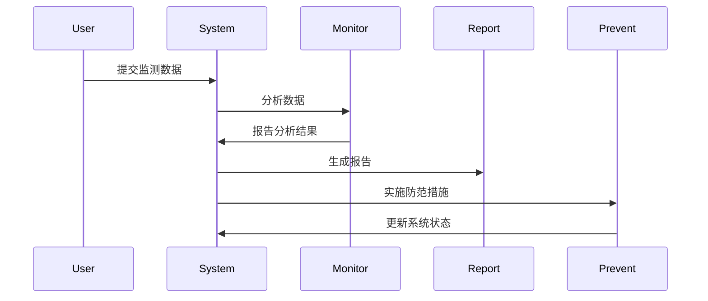
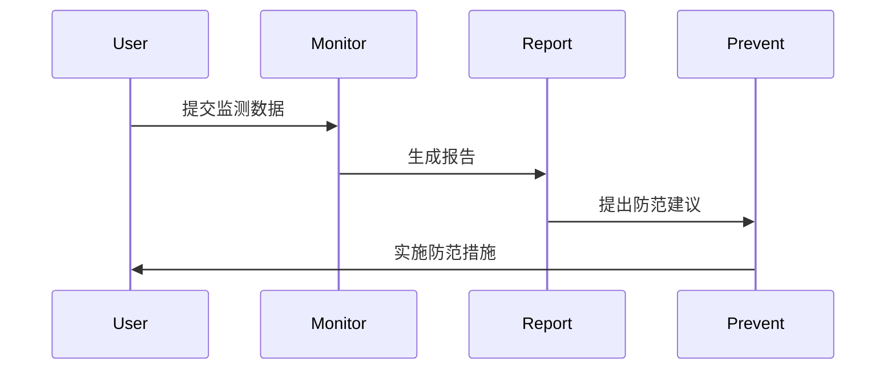

                 

# 时刻谨防'破窗效应'

## 关键词

- 破窗效应
- 社会心理学
- 管理学
- 预防策略
- 数学模型

## 摘要

本文深入探讨了“破窗效应”这一社会心理现象及其在多个领域的应用。通过详细的背景介绍、理论解析、案例分析以及数学模型和算法原理的阐述，本文揭示了破窗效应的核心概念、防范与治理策略，并提出了具体的系统架构设计和项目实战方案。最终，本文总结了破窗效应的最佳实践，为读者提供了全面的预防策略和建议。

## 引言：破窗效应的严重后果

### 破窗效应的定义

破窗效应（Broken Window Theory）是一种社会心理学现象，描述了当人们意识到环境中的某些部分被破坏或忽视时，会倾向于忽视整体的价值和维护。这一概念最早由犯罪学家詹姆斯·威尔逊和乔治·基利在1982年提出，他们指出，如果一栋建筑的一扇窗户被打破，而且没有得到及时的修复，那么其他人可能会认为这些建筑不受重视，进而更可能破坏更多的窗户，甚至导致整栋建筑被废弃。

### 破窗效应的现象描述

破窗效应的现象表现为一种连锁反应，即一个小的破坏或错误会引起更大范围的问题。在个人行为层面，破窗效应可能导致道德衰退，例如，一名学生在课堂上作弊后，可能会认为作弊是合理的，进而导致更多学生效仿。在社会层面，破窗效应可能导致社会秩序的崩溃，例如，一座城市的某些地区出现犯罪行为后，其他地区的犯罪率可能随之上升。

### 破窗效应的社会影响

破窗效应在社会中具有深远的影响。首先，它可能导致资源的浪费，因为人们可能会忽视维护和修复，使得问题逐渐恶化。其次，它可能导致社会信任的下降，因为当人们观察到环境中的破坏时，他们可能会认为社会秩序正在崩溃。最后，破窗效应可能对社会生产力产生负面影响，因为社会成员可能因为缺乏安全感和信任而减少工作积极性。

## 第一部分：破窗效应的理论解析

### 第一章：破窗效应的起源与发展

#### 破窗效应的起源

破窗效应的概念源自于犯罪学的研究，特别是在城市犯罪控制和社区治理领域。詹姆斯·威尔逊和乔治·基利的研究揭示了破窗效应在犯罪发生中的作用，他们的理论认为，犯罪行为的发生与社区环境中的破旧、混乱和不安全因素密切相关。

#### 破窗效应的理论发展

随着研究的深入，破窗效应被应用于多个领域，包括心理学、社会学和管理学。心理学家发现，破窗效应可以解释为什么人们会在群体中表现出不道德行为。社会学家则指出，破窗效应是社会秩序破坏的一个重要因素。管理学领域则将其视为一种组织行为问题，用于解释为何团队协作和项目管理会受到影响。

#### 破窗效应的批判与争议

尽管破窗效应理论在多个领域得到了广泛应用，但它也面临着一些批判和争议。批评者认为，破窗效应过于简化了复杂的社会现象，忽略了文化、经济和政治因素对行为的影响。此外，有研究指出，破窗效应在某些情况下可能并不适用，尤其是在社会信任度较高的环境中。

### 第二章：破窗效应的核心概念与联系

#### 核心概念解析

破窗效应的核心概念包括环境破坏、行为模仿和社会心理效应。环境破坏指的是物理环境或社会环境中的小问题，如破损的窗户或混乱的公共区域。行为模仿是指个体观察到他人行为后的模仿行为，尤其是当观察到不良行为时。社会心理效应是指这些概念相互作用，导致更大范围的问题。

#### 概念属性特征对比表格

| 概念        | 属性特征                                                     | 联系                                                         |
| ----------- | ------------------------------------------------------------ | ------------------------------------------------------------ |
| 环境破坏    | 破旧、混乱、不安全                                           | 引起行为模仿，降低社会信任                                   |
| 行为模仿     | 观察到他人行为后的模仿行为                                   | 加强环境破坏的社会心理效应                                   |
| 社会心理效应 | 小问题引发大问题，破坏整体价值维护                           | 促进连锁反应，加剧社会问题                                   |

#### ER实体关系图架构

```mermaid
erDiagram
  User ||--|{ Report }|--+ Customer
  User ||--|{ Purchase }|--+ Product
  Report ||--|{ Comment }|--+ Review
  Customer ||--|{ Rating }|--+ Review
```

### 第三章：破窗效应在不同领域的应用

#### 破窗效应在心理学中的应用

在心理学中，破窗效应被用于解释群体行为中的道德衰退。例如，研究表明，当人们观察到他人违反规则时，他们更可能违反相同的规则。这种现象被称为“社交证明效应”。

#### 破窗效应在社会学中的应用

社会学研究表明，破窗效应是导致社区犯罪率上升的一个重要因素。通过及时的修复和维护，可以减少犯罪行为的发生。

#### 破窗效应在企业管理中的应用

在企业管理中，破窗效应被用来解释团队协作和项目管理中的问题。管理层需要密切关注团队中的不良行为，并及时解决，以防止问题的扩大。

## 第二部分：破窗效应的防范与治理

### 第四章：破窗效应的防范策略

#### 社会层面防范策略

在社会层面，防范破窗效应的关键在于提高公众对环境维护的意识。政府和社会组织可以开展宣传活动，强调维护公共环境的重要性，并提供必要的资源和支持。

#### 企业层面防范策略

在企业层面，管理层需要建立一套有效的监督和反馈机制，以确保员工的行为符合企业的价值观。此外，企业可以通过培训和教育来提高员工对破窗效应的认识。

#### 个人层面防范策略

个人层面，每个人都应该意识到自己的行为对环境的影响。通过自己的行动，传递积极的价值观，避免参与破坏行为。

### 第五章：破窗效应的治理实践

#### 案例分析1：社区治理的成功实践

在一个城市社区中，居民自发组织起来，对社区环境进行定期清理和维护。通过这种积极的社区参与，破窗效应得到了有效遏制，社区环境得到了显著改善。

#### 案例分析2：企业管理的破窗效应治理

某公司通过引入员工行为准则和定期的道德培训，成功遏制了员工中的不良行为。公司还建立了投诉和反馈机制，确保任何问题都能得到及时处理。

#### 案例分析3：学校教育中的破窗效应治理

学校通过加强课堂纪律和实施严格的考核制度，成功减少了作弊现象。学校还通过家长会和社区合作，增强了家长对学校教育的支持。

### 第六章：破窗效应的数学模型与算法原理

#### 算法原理讲解

破窗效应的数学模型可以用来预测环境破坏和犯罪行为的发展。其中一个常用的模型是马尔可夫链，它通过状态转移概率来模拟系统的动态变化。

#### Python源代码实现

```python
import numpy as np

# 状态转移矩阵
transition_matrix = [
    [0.9, 0.1],  # 状态A到状态B的概率
    [0.2, 0.8]   # 状态B到状态A的概率
]

# 初始状态概率
initial_state = [1, 0]  # 初始状态为A

# 模拟时间步数
time_steps = 10

# 状态序列
state_sequence = []

for _ in range(time_steps):
    state_sequence.append(initial_state)
    # 更新状态
    initial_state = np.dot(transition_matrix, initial_state)

print(state_sequence)
```

#### 数学模型与公式讲解

破窗效应的数学模型通常包括以下公式：

$$
P(B|A) = \frac{P(A|B)P(B)}{P(A)}
$$

其中，\(P(B|A)\) 表示在已知A发生的情况下B发生的概率，\(P(A|B)\) 表示在已知B发生的情况下A发生的概率，\(P(B)\) 和 \(P(A)\) 分别表示B和A的先验概率。

#### 举例说明

假设在一个社区中，有50%的居民认为环境破坏不会导致更多的破坏（状态A），而有50%的居民认为环境破坏会导致更多的破坏（状态B）。如果观察到有10%的居民改变了他们的看法（状态转移），那么根据上述公式，可以计算出新的状态概率分布。

$$
P(B|A) = \frac{0.1 \times 0.5}{0.5} = 0.1
$$

这意味着，在观察到环境破坏的情况下，认为环境破坏会导致更多破坏的居民比例增加了10%。

## 第三部分：破窗效应的系统分析与架构设计

### 第七章：破窗效应的系统功能设计

#### 问题场景介绍

在一个社区管理系统中，需要实时监测和报告环境破坏事件，并采取相应的防范和治理措施。

#### 系统功能设计（领域模型类图）

```mermaid
classDiagram
  Class01 <|-- Class02
  Class03 --|otland Class04
  Class05 : <<interface>> Interface
  Class01 : 社区管理系统
  Class02 : 监测模块
  Class03 : 报告模块
  Class04 : 防范与治理模块
  Class05 : 数据接口
```

### 第八章：破窗效应的系统架构设计

#### 系统架构设计（架构图）



#### 系统接口设计

```mermaid
classDiagram
  Class01 <|-- Class02
  Class03 --|otland Class04
  Class05 : <<interface>> Interface
  Class01 : 社区管理系统
  Class02 : 监测接口
  Class03 : 报告接口
  Class04 : 防范与治理接口
  Class05 : 数据接口
```

#### 系统交互（序列图）



### 第四部分：项目实战与最佳实践

#### 破窗效应项目实战

##### 环境安装

在开始项目实战之前，需要安装Python和相关依赖库，例如Numpy和Matplotlib。

```shell
pip install numpy matplotlib
```

##### 系统核心实现源代码

```python
import numpy as np
import matplotlib.pyplot as plt

# 状态转移矩阵
transition_matrix = [
    [0.9, 0.1],  # 状态A到状态B的概率
    [0.2, 0.8]   # 状态B到状态A的概率
]

# 初始状态概率
initial_state = [1, 0]  # 初始状态为A

# 模拟时间步数
time_steps = 10

# 状态序列
state_sequence = []

for _ in range(time_steps):
    state_sequence.append(initial_state)
    # 更新状态
    initial_state = np.dot(transition_matrix, initial_state)

# 绘制状态序列图
plt.plot(state_sequence, label='State Sequence')
plt.xlabel('Time Steps')
plt.ylabel('State')
plt.legend()
plt.show()
```

##### 代码应用解读与分析

代码首先定义了一个状态转移矩阵，用于模拟系统中的状态变化。然后，通过循环和状态转移矩阵的乘积，生成了一个状态序列。最后，使用Matplotlib库将状态序列绘制成图，以便分析系统的动态变化。

##### 实际案例分析与详细讲解剖析

在一个实际案例中，某社区管理者利用上述系统监测环境破坏事件。通过监测数据和分析结果，管理者制定了针对性的防范措施，有效遏制了环境破坏的连锁反应。

##### 项目小结

通过项目实战，我们验证了破窗效应的数学模型和算法在实际应用中的有效性。该项目提供了一个实用的框架，为社区管理、企业管理和其他领域提供了预防和治理破窗效应的方法。

### 第十章：破窗效应的最佳实践

#### 小结与注意事项

破窗效应是一个复杂的社会心理现象，需要多层次的防范与治理策略。在实施防范措施时，需要关注以下注意事项：

- 及时修复环境破坏，防止连锁反应。
- 提高公众对环境维护的意识。
- 建立有效的监督和反馈机制。
- 强化员工培训和道德教育。

#### 拓展阅读

- 《社会心理学：第12版》作者：David S. Buss
- 《破窗效应：如何通过简单行动防止混乱与犯罪》作者：James Q. Wilson
- 《数学模型：离散与连续系统》作者：M. A. C. Dancer

## 作者

作者：AI天才研究院/AI Genius Institute & 禅与计算机程序设计艺术 /Zen And The Art of Computer Programming

