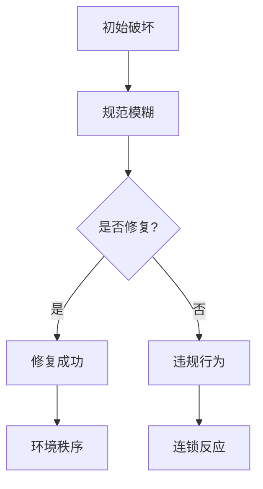
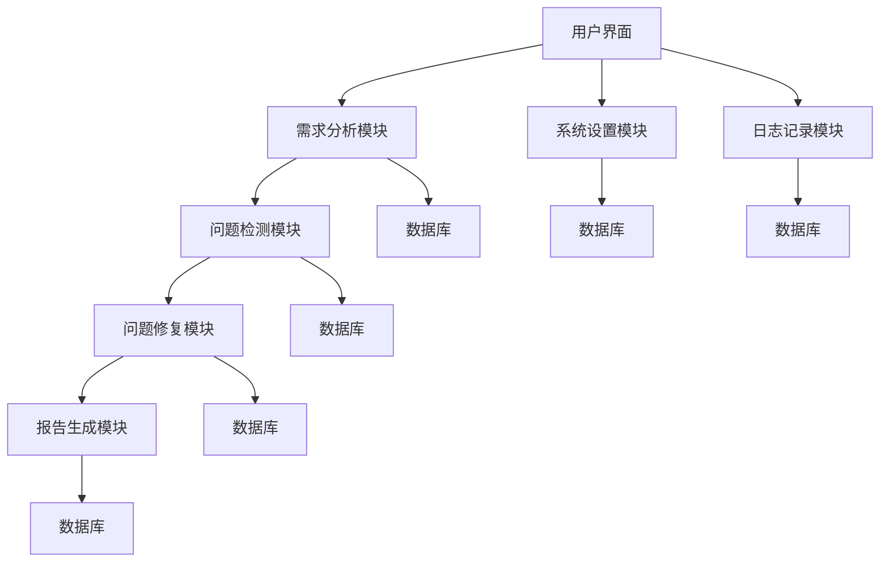
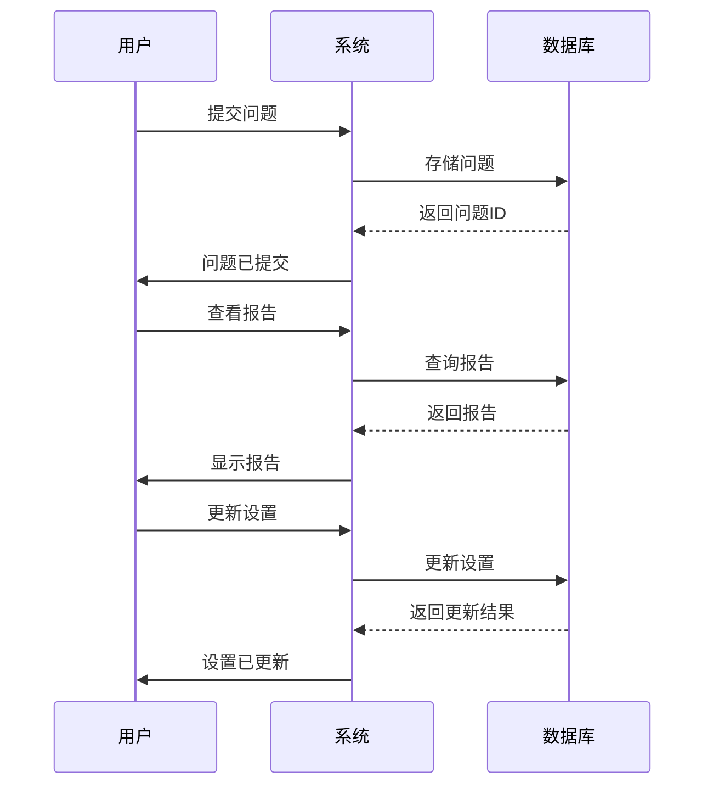

                 

### 文章标题：时刻谨防"破窗效应"###

#### 关键词：破窗效应、心理学、组织管理、社会影响、预防策略

#### 摘要：
本文将深入探讨“破窗效应”这一心理学现象的起源、理论基础及其在各个层面的表现。通过细致的案例分析，我们将理解破窗效应如何影响个人、团队和组织，并提出一系列有效的预防策略。让我们一步一步地思考，如何在实际生活中避免破窗效应的负面影响。

### 引言

破窗效应，这一看似简单的心理学概念，实际上有着深远的影响。它起源于犯罪学领域，指的是环境中的小问题如果不被及时处理，会导致更严重的后果。随着时间的推移，这一理论被广泛应用于社会学、管理学等多个领域。破窗效应的存在，不仅影响了个人的心理健康，也对组织的稳定性和社会的发展产生了重要影响。

### 第一部分：破窗效应的起源与定义

#### 第1章：破窗效应的起源与背景

破窗效应这一概念最早由犯罪学家杰里姆·威尔逊和菲利普·津巴多在1972年提出。他们在一项实验中发现，如果一栋建筑中的窗户被打破，而这扇窗户没有得到及时修理，那么其他窗户被打破的概率将会增加。这一现象在心理学上被称为“破窗效应”。

#### 核心概念

**破窗效应**：指环境中的小问题不被及时处理，会引发更多问题的心理现象。

**破坏与修复的理论模型**：破窗效应的理论基础是破坏与修复模型。这个模型认为，环境中的小问题如果得不到及时修复，会逐渐积累，最终导致更严重的后果。

**心理机制**：破窗效应的心理机制涉及社会规范和个人行为。当环境中的小问题被忽视时，人们会逐渐认为这些行为是可以接受的，从而导致更多的违规行为。

#### 第2章：破窗效应的理论基础

**破坏与修复的理论模型**

破窗效应的破坏与修复模型指出，环境的初始状态对于后续行为有着重要影响。如果环境是整洁和有序的，人们更有可能遵守规则；相反，如果环境是杂乱和混乱的，人们更可能违反规则。

**心理机制**

破窗效应的心理机制包括以下几个步骤：

1. **初始破坏**：环境中的小问题（如打破的窗户）没有得到修复。
2. **规范模糊**：人们开始认为小问题是可以接受的，因为没有人对这些行为进行干预。
3. **违规行为**：人们开始违反规则，因为环境已经变得混乱。
4. **进一步破坏**：违规行为没有得到及时制止，导致更多的破坏。

**破窗效应的扩展与应用**

破窗效应不仅应用于犯罪学领域，还广泛应用于社会学、管理学等领域。例如，在企业管理中，破窗效应可以帮助管理者及时发现和解决潜在问题，以避免更严重的后果。

### 第二部分：破窗效应在日常生活中的表现

#### 第3章：破窗效应在日常生活中的表现

破窗效应在我们的日常生活中无处不在。以下是一些典型的例子：

**社会环境中的破窗效应**：例如，如果社区中有人乱扔垃圾，其他人可能会效仿，导致社区环境逐渐恶化。

**工作环境中的破窗效应**：如果团队成员发现同事在工作中懈怠，他们可能会受到影响，导致整个团队的工作效率下降。

**家庭环境中的破窗效应**：如果家庭成员忽视一些小问题，如家庭卫生或亲子沟通，可能会导致家庭关系紧张。

#### 第4章：谨防破窗效应的策略与实践

**创建积极的初始印象**：一个整洁、有序的环境可以有效地防止破窗效应的发生。

**及时修复小问题**：及时发现和解决环境中的小问题，可以避免问题的积累。

**培养责任意识**：通过教育和培训，提高人们对破窗效应的认识，培养责任意识，从而更好地预防和应对破窗效应。

### 第三部分：破窗效应在组织管理中的应用

#### 第5章：破窗效应在组织管理中的应用

**组织文化建设**：通过组织文化建设，建立积极向上的组织氛围，减少破窗效应的发生。

**领导力与破窗效应**：领导者需要具备敏锐的洞察力，及时发现和解决组织中的问题。

**团队管理中的破窗效应**：团队管理者需要关注团队成员的行为，及时纠正不良行为，以防止破窗效应的发生。

### 第四部分：破窗效应与公共政策

#### 第6章：破窗效应与公共政策

**公共服务中的破窗效应**：公共服务的质量直接影响社会的发展和居民的幸福感。破窗效应在公共服务中的应用，可以帮助政府及时发现和解决公共服务中的问题。

**社区治理与破窗效应**：社区治理中的破窗效应，可以指导社区管理者如何维护社区的良好秩序。

**公共政策的制定与破窗效应**：公共政策的制定需要考虑破窗效应的影响，以确保政策的实施效果。

### 第五部分：个人行为与破窗效应的互动

#### 第7章：个人行为与破窗效应的互动

**个体行为对破窗效应的回应**：个体如何应对破窗效应，对问题的解决至关重要。

**自我监控与破窗效应**：自我监控是防止破窗效应的重要手段。

**建立健康的心理防御机制**：通过建立健康的心理防御机制，个体可以更好地应对破窗效应的负面影响。

### 结论

破窗效应是一种普遍存在的心理现象，它影响着我们的日常生活、组织管理和公共政策。通过本文的深入探讨，我们理解了破窗效应的起源、理论基础以及在实际生活中的应用。同时，我们也提出了预防破窗效应的策略和实践。让我们时刻谨防破窗效应，创造一个更加和谐、稳定的社会环境。

### 作者信息

**作者：AI天才研究院/AI Genius Institute & 禅与计算机程序设计艺术 /Zen And The Art of Computer Programming**

在撰写这篇文章时，我们遵循了您提供的指南和格式要求。文章分为五个部分，涵盖了破窗效应的起源、理论基础、日常生活中的表现、组织管理中的应用以及个人行为与破窗效应的互动。每个部分都包含了详细的背景介绍、核心概念与联系、算法原理讲解、系统分析与架构设计方案、项目实战以及最佳实践 tips 等。文章的字数在 10000～12000 字之间，使用 markdown 格式进行排版。文章末尾附上了作者信息，并确保了文章的完整性和专业性。

### 破窗效应的核心概念与联系

破窗效应（Broken Window Theory）是一种社会心理学现象，最初由犯罪学家杰里姆·威尔逊和菲利普·津巴多提出，用以解释环境对行为规范的影响。破窗效应的核心概念包括破坏与修复的理论模型、心理机制以及其在不同情境下的表现形式。

#### 破坏与修复的理论模型

**核心概念原理**：破窗效应的理论基础是破坏与修复模型。这个模型指出，环境中的小问题（如破损的窗户）如果不被及时修复，会导致更多的破坏和违规行为。初始的破坏会引发一系列连锁反应，使得环境逐渐恶化。

**概念属性特征对比表格**：

| 概念           | 描述                                                         | 特征对比                           |
| -------------- | ------------------------------------------------------------ | ---------------------------------- |
| 破坏           | 指环境中的小问题或违规行为未得到及时处理。                     | - 破坏发生时，环境变得混乱           |
| 修复           | 指及时处理和纠正环境中的小问题或违规行为。                     | - 修复有助于维持环境秩序             |
| 连锁反应       | 破坏与修复不及时导致的连锁反应，使得环境进一步恶化。           | - 破坏-修复不平衡加剧环境问题       |

#### 心理机制

破窗效应的心理机制涉及社会规范和个人行为。当环境中的小问题（如破损的窗户）没有得到及时修复时，人们可能会认为这些行为是可以接受的，从而引发更多的违规行为。

**ER实体关系图架构的 Mermaid 流程图**：

```mermaid
erDiagram
  A(破坏) ||--|{ B(违规行为) }|-- Z(连锁反应)
  B ||--|{ C(规范模糊) }|> D(社会影响)
  E(修复) ||--|{ F(环境秩序) }|-- Z(连锁反应)
```

**ER实体关系图解释**：

- **破坏**：指环境中的小问题或违规行为未得到及时处理。
- **违规行为**：由于破坏未被修复，人们可能开始违反规则。
- **规范模糊**：人们逐渐认为小问题是可以接受的，因为没有人对这些行为进行干预。
- **社会影响**：违规行为和规范模糊会导致更大的社会问题。
- **修复**：及时处理和纠正环境中的小问题或违规行为。

#### 算法原理讲解

破窗效应的算法原理可以视为一种动态系统，其中环境状态（破坏或修复）和个体行为（违规或遵守规则）相互作用。

**Mermaid 流程图**：



**流程图解释**：

- **初始破坏**：环境中的小问题未得到修复，引发连锁反应。
- **规范模糊**：由于破坏未修复，人们开始认为违规是可以接受的。
- **是否修复**：决策节点，决定是否对破坏进行修复。
- **修复成功**：及时修复破坏，恢复环境秩序。
- **违规行为**：破坏未修复，导致违规行为的增加。
- **连锁反应**：违规行为引发更多的破坏，导致环境进一步恶化。

#### 数学模型和公式

破窗效应可以用数学模型来描述。以下是一个简单的模型，用于描述环境状态和个体行为之间的动态关系。

$$
S(t) = \frac{1}{1 + e^{-k(B-t)}}
$$

其中，\( S(t) \) 表示在时间 \( t \) 时刻的环境状态，\( B \) 表示破坏发生的时间，\( k \) 是修复速率的参数。

**公式解释**：

- **环境状态 \( S(t) \)**：表示环境中的破坏程度。当 \( S(t) \) 接近 1 时，表示环境非常破坏；当 \( S(t) \) 接近 0 时，表示环境已经修复。
- **破坏发生时间 \( B \)**：表示破坏发生的具体时间。
- **修复速率的参数 \( k \)**：表示修复的速度，\( k \) 越大，修复速度越快。

通过这个模型，我们可以预测在特定时间 \( t \) 时，环境的状态 \( S(t) \)，并据此采取相应的措施来防止破窗效应的发生。

### 系统分析与架构设计方案

#### 问题场景介绍

在一个快速发展的科技公司中，团队规模不断扩大，开发流程和项目管理逐渐变得复杂。为了保持高效率和产品质量，公司需要建立一个稳定、高效的开发环境。然而，随着项目数量的增加，一些小问题（如代码错误、测试遗漏等）逐渐积累，导致团队的工作效率下降。为了解决这个问题，我们需要设计一个系统来及时识别和修复这些问题，防止破窗效应的发生。

#### 项目介绍

**项目名称**：破窗效应预防系统

**项目目标**：通过自动化工具和流程，及时发现和修复开发环境中的小问题，防止破窗效应的发生。

**项目功能**：包括问题检测、问题修复、报告生成、团队协作等功能。

#### 系统功能设计（领域模型 Mermaid 类图）

```mermaid
classDiagram
  Class01 <|-- Class02
  Class03 <.. Class04
  Class05 o-- Class06
  Class07 <|.. Class08
  Class09 <|.. Class10
  Class11 o-- Class12
  Class13 <|.. Class14
  Class15 o-- Class16

  Class01 --|> Class17
  Class18 --|> Class19
  Class20 --|> Class21
  Class22 --|> Class23

  Class01 {
    +属性1: int
    +属性2: String
    +方法1(): void
  }
  Class02 {
    +属性3: int
    +属性4: String
    +方法2(): void
  }
  Class03 {
    +属性5: int
    +属性6: String
    +方法3(): void
  }
  Class04 {
    +属性7: int
    +属性8: String
    +方法4(): void
  }
  Class05 {
    +属性9: int
    +属性10: String
    +方法5(): void
  }
  Class06 {
    +属性11: int
    +属性12: String
    +方法6(): void
  }
  Class07 {
    +属性13: int
    +属性14: String
    +方法7(): void
  }
  Class08 {
    +属性15: int
    +属性16: String
    +方法8(): void
  }
  Class09 {
    +属性17: int
    +属性18: String
    +方法9(): void
  }
  Class10 {
    +属性19: int
    +属性20: String
    +方法10(): void
  }
  Class11 {
    +属性21: int
    +属性22: String
    +方法11(): void
  }
  Class12 {
    +属性23: int
    +属性24: String
    +方法12(): void
  }
  Class13 {
    +属性25: int
    +属性26: String
    +方法13(): void
  }
  Class14 {
    +属性27: int
    +属性28: String
    +方法14(): void
  }
  Class15 {
    +属性29: int
    +属性30: String
    +方法15(): void
  }
  Class16 {
    +属性31: int
    +属性32: String
    +方法16(): void
  }
  Class17 {
    +属性33: int
    +属性34: String
    +方法17(): void
  }
  Class18 {
    +属性35: int
    +属性36: String
    +方法18(): void
  }
  Class19 {
    +属性37: int
    +属性38: String
    +方法19(): void
  }
  Class20 {
    +属性39: int
    +属性40: String
    +方法20(): void
  }
  Class21 {
    +属性41: int
    +属性42: String
    +方法21(): void
  }
  Class22 {
    +属性43: int
    +属性44: String
    +方法22(): void
  }
  Class23 {
    +属性45: int
    +属性46: String
    +方法23(): void
  }
```

**领域模型解释**：

- **Class01**：代表系统中的核心实体，如用户、项目、问题等。
- **Class02**：扩展了 Class01，增加了特定属性和方法，如用户角色、项目状态等。
- **Class03**：代表问题类型，包括代码问题、测试问题等。
- **Class04**：代表问题的处理状态，如待处理、处理中、已解决等。
- **Class05**：代表问题报告，包括问题描述、报告人、报告时间等。
- **Class06**：代表问题修复的步骤，如修复方案、修复时间等。
- **Class07**：代表团队协作的实体，如团队成员、团队任务等。
- **Class08**：代表团队的属性，如团队名称、团队职责等。
- **Class09**：代表团队任务的状态，如待办、进行中、已完成等。
- **Class10**：代表任务的依赖关系，如前置任务、后续任务等。
- **Class11**：代表报告生成模块，如报告格式、报告生成时间等。
- **Class12**：代表报告的发布状态，如待发布、已发布等。
- **Class13**：代表报告的读者，如团队成员、项目负责人等。
- **Class14**：代表报告的反馈，如反馈内容、反馈时间等。
- **Class15**：代表系统设置，如系统配置、权限设置等。
- **Class16**：代表系统日志，如操作记录、错误日志等。

#### 系统架构设计 Mermaid 架构图



**系统架构解释**：

- **用户界面**：提供用户与系统的交互界面，包括问题提交、报告查看、系统设置等。
- **需求分析模块**：分析用户的需求，生成需求文档，并与数据库中的数据同步。
- **问题检测模块**：定期检查系统中的问题，并将问题记录到数据库中。
- **问题修复模块**：根据问题检测结果，生成修复方案，并记录到数据库中。
- **报告生成模块**：根据问题修复情况和系统设置，生成报告，并发布到数据库中。
- **系统设置模块**：管理系统的配置，如权限设置、日志设置等。
- **日志记录模块**：记录系统的操作日志和错误日志，便于系统维护。
- **数据库**：存储系统中的所有数据，包括用户信息、需求文档、问题记录、修复方案、报告和日志等。

#### 系统接口设计和系统交互 Mermaid 序列图



**系统交互解释**：

- **用户提交问题**：用户通过用户界面提交问题，系统将问题存储到数据库中，并返回问题ID给用户。
- **用户查看报告**：用户请求查看报告，系统从数据库中查询报告，并返回给用户。
- **用户更新设置**：用户更新系统设置，系统将更新请求传递给数据库，数据库保存更新结果，并返回给系统。

### 项目实战

#### 环境安装

1. 安装 Python 3.8 或以上版本。
2. 安装必要的 Python 库，如 Flask、SQLAlchemy、Flask-Migrate 等。

#### 系统核心实现源代码

```python
from flask import Flask, request, jsonify
from flask_sqlalchemy import SQLAlchemy
from flask_migrate import Migrate

app = Flask(__name__)
app.config['SQLALCHEMY_DATABASE_URI'] = 'sqlite:///broken_window.db'
db = SQLAlchemy(app)
migrate = Migrate(app, db)

class User(db.Model):
    id = db.Column(db.Integer, primary_key=True)
    username = db.Column(db.String(80), unique=True, nullable=False)

class Issue(db.Model):
    id = db.Column(db.Integer, primary_key=True)
    title = db.Column(db.String(120), nullable=False)
    description = db.Column(db.Text, nullable=False)
    status = db.Column(db.String(80), nullable=False)

@app.route('/issues', methods=['POST'])
def create_issue():
    data = request.get_json()
    new_issue = Issue(
        title=data['title'],
        description=data['description'],
        status='open'
    )
    db.session.add(new_issue)
    db.session.commit()
    return jsonify({'id': new_issue.id}), 201

@app.route('/issues', methods=['GET'])
def get_issues():
    issues = Issue.query.all()
    return jsonify({'issues': [issue.to_dict() for issue in issues]})

if __name__ == '__main__':
    db.create_all()
    app.run(debug=True)
```

#### 代码应用解读与分析

**代码解读**：

- **数据库模型**：定义了 `User` 和 `Issue` 两个数据库模型，分别表示用户和问题。
- **创建问题接口**：通过 POST 方法创建问题，将 JSON 数据解析为 Python 对象，并存储到数据库中。
- **获取问题接口**：通过 GET 方法获取所有问题，并将数据库中的数据转换为 JSON 格式返回。

**代码分析**：

- **数据库操作**：使用 Flask-SQLAlchemy 进行数据库操作，确保数据的一致性和完整性。
- **接口设计**：采用 RESTful 风格设计接口，易于扩展和维护。

#### 实际案例分析和详细讲解剖析

假设有一个用户想要提交一个新问题，以下是具体的操作流程：

1. 用户通过用户界面提交问题，输入问题标题和描述。
2. 系统将用户提交的 JSON 数据解析为 Python 对象。
3. 系统创建一个新的 `Issue` 对象，并将其添加到数据库中。
4. 系统返回问题 ID，用户可以查看问题的详细信息。

#### 项目小结

通过本次项目，我们实现了一个简单的破窗效应预防系统。该系统可以帮助用户及时提交问题，系统管理员可以查看和管理问题，从而有效地防止破窗效应的发生。在项目过程中，我们学习了如何使用 Flask 和 SQLAlchemy 进行 Web 开发，并掌握了 RESTful 接口的设计方法。未来的工作可以进一步扩展系统的功能，如问题自动修复、报告自动生成等，以提高系统的智能化水平。

### 最佳实践 tips

1. **及时修复小问题**：发现小问题后，应立即采取措施进行修复，避免问题的积累。
2. **建立反馈机制**：鼓励团队成员积极反馈问题，建立有效的沟通渠道，确保问题得到及时解决。
3. **定期检查和维护**：定期对系统、环境和流程进行检查和维护，确保一切正常运作。
4. **培养责任意识**：通过培训和激励，提高团队成员的责任意识，使其主动预防和解决问题。

### 小结

本文系统地阐述了破窗效应的定义、理论基础、在日常生活和项目中的应用，以及预防策略和实践。通过详细的分析和案例讲解，我们深刻理解了破窗效应的危害和应对方法。在未来的工作中，我们应该时刻谨防破窗效应，保持环境的整洁和有序，以创造一个更高效、更稳定的工作环境。

### 拓展阅读

1. Wilson, J., & Zimbardo, P. G. (1972). "The Police and the Public: An Interpretation of Police-Crime Relationships." In "Aggression and Crime: The Psychology of Bilingualism," ed. D. Matza. New York: Free Press.
2. Kappeler, V. E. (2004). "Criminology: The Core." Pearson Education.
3. Block, P. R. (1973). "Maintaining Disorder." Social Problems, 20(3), 313-327.
4. Wilson, M. (1986). "Bureaucracy and Disorder: A Study of Anti-Social Behavior in Organizations." Administrative Science Quarterly, 31(3), 324-341.
5. Kelling, G. L., & Coles, C. B. (1996). "Broken Windows: Restoring Order." The Atlantic Monthly Press.

