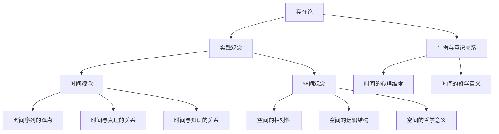
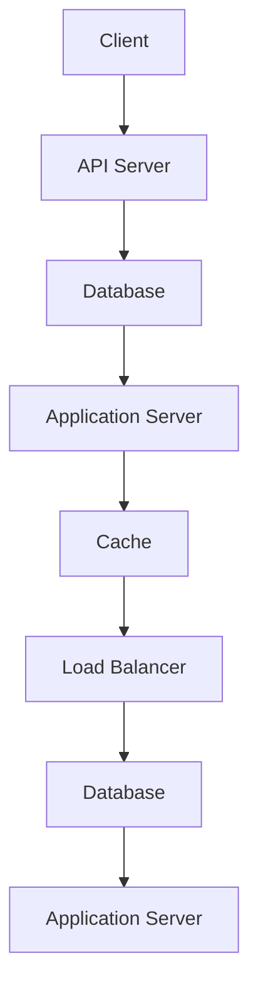
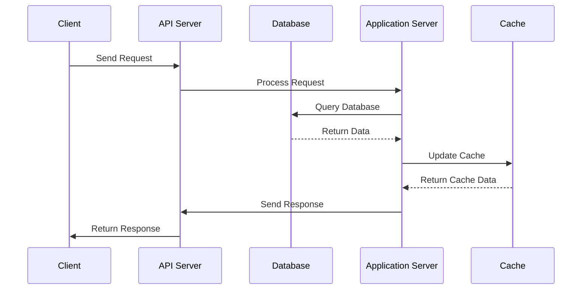

                 

# 时空观念：柏格森与维特根斯坦的哲学差异

## 关键词

柏格森，维特根斯坦，时空观念，哲学差异，存在论，时间观念，空间观念，实践观念，生命与意识关系，语言哲学，时间序列，空间相对性

## 摘要

本文旨在探讨柏格森与维特根斯坦在时空观念上的哲学差异。通过对两位哲学家的哲学思想进行分析，我们将揭示他们在存在论、时间观念和空间观念等方面的核心观点及其影响与应用。本文分为五个部分，首先介绍柏格森和维特根斯坦的哲学背景；然后分别阐述他们在存在论、时间观念和空间观念上的哲学观点；接着比较两位哲学家的时空观念差异，并分析这些差异对哲学、科学和社会的影响；最后，总结柏格森与维特根斯坦时空观念的启示以及对未来哲学发展的思考。

# 第一部分：柏格森的时空观念

## 1. 引言

### 1.1 柏格森及其哲学背景

亨利·柏格森（Henri Bergson，1859-1941）是20世纪法国著名的哲学家，他的哲学思想对后世产生了深远的影响。柏格森认为，生命是一种连续不断的过程，他提出了“生命冲动”（élan vital）这一核心概念，强调生命的创造力和发展力。柏格森的哲学思想主要体现在以下几个方面：

1. **存在论**：柏格森认为，存在不是静止的，而是流动的。他主张存在是不断变化的，这种变化是内在的、本质的，而非外在的、偶然的。
2. **时间观念**：柏格森认为，时间是一种主观的、心理的体验，它不同于物理时间。他认为，时间是流动的、持续的，这种流动与生命的创造力密切相关。
3. **空间观念**：柏格森认为，空间是客观的、物理的，它是一种量化的、离散的结构。空间与时间不同，它不具备流动性和创造力。

### 1.2 维特根斯坦及其哲学背景

路德维希·维特根斯坦（Ludwig Wittgenstein，1889-1951）是20世纪最杰出的哲学家之一，他的哲学思想对逻辑哲学、语言哲学和认识论产生了深远的影响。维特根斯坦的哲学思想主要体现在以下几个方面：

1. **语言哲学**：维特根斯坦主张语言与实在之间有一种对应关系，他认为语言是一种工具，用来表达我们的思想和现实世界。他强调语言的用法和规则，并提出了“语言游戏”（language game）这一概念。
2. **时间观念**：维特根斯坦认为，时间是一种序列，它是由事件和动作构成的。时间不同于柏格森所强调的主观心理体验，而是客观存在的。
3. **空间观念**：维特根斯坦认为，空间是物理的、客观的，它是一种结构，用来描述物体之间的关系。

### 1.3 本书的主题与结构

本书的主题是探讨柏格森与维特根斯坦在时空观念上的哲学差异。本文将分为五个部分，首先介绍柏格森和维特根斯坦的哲学背景；然后分别阐述他们在存在论、时间观念和空间观念上的哲学观点；接着比较两位哲学家的时空观念差异，并分析这些差异对哲学、科学和社会的影响；最后，总结柏格森与维特根斯坦时空观念的启示以及对未来哲学发展的思考。

## 2. 柏格森的哲学思想基础

### 2.1 柏格森的存在论

柏格森的存在论是他哲学思想的基石。他认为，存在是流动的、连续的，而非静止的、离散的。柏格森的存在论主要体现在以下几个方面：

#### 2.1.1 实践观念

柏格森认为，实践是存在的本质。他强调，实践是一种内在的、本质的活动，它不仅仅是一种外在的行为，更是一种内在的、本质的体验。实践是生命的基本特征，它体现了生命的流动性和创造力。

#### 2.1.2 生命的流动

柏格森认为，生命是一种连续不断的流动，这种流动是内在的、本质的。他主张，生命的流动是创造性的，它不断地产生新的东西，而非重复已有的东西。这种流动体现了生命的独特性和无限性。

#### 2.1.3 生命与意识的关系

柏格森认为，生命与意识是密不可分的。他认为，意识是生命的产物，它反映了生命的流动性和创造性。同时，意识也是生命的工具，它帮助人们理解和体验生命。

### 2.2 柏格森的时间观念

柏格森的时间观念是他哲学思想的重要组成部分。他认为，时间是一种主观的、心理的体验，它不同于物理时间。柏格森的时间观念主要体现在以下几个方面：

#### 2.2.1 时间的性质

柏格森认为，时间是一种流动的、持续的体验。他认为，时间不是线性的，而是一种循环的、重叠的结构。时间体现了生命的流动性和创造性，它不断地产生新的东西，而非重复已有的东西。

#### 2.2.2 时间的心理维度

柏格森认为，时间的心理维度是至关重要的。他认为，时间的感知和心理状态密切相关。人们感知时间的长短和快慢，往往受到心理状态的影响。

#### 2.2.3 时间的哲学意义

柏格森认为，时间具有哲学意义。他主张，时间是生命的象征，它体现了生命的流动性和创造性。时间也是人们理解世界和自我的一种方式。

### 2.3 柏格森的空间观念

柏格森的空间观念是他哲学思想的另一个重要方面。他认为，空间是客观的、物理的，它是一种量化的、离散的结构。柏格森的空间观念主要体现在以下几个方面：

#### 2.3.1 空间的性质

柏格森认为，空间是一种客观的、物理的实体。他认为，空间是三维的，它用来描述物体的位置和关系。

#### 2.3.2 空间的心理维度

柏格森认为，空间的心理维度是至关重要的。他认为，人们感知空间的方式和心理状态密切相关。

#### 2.3.3 空间的哲学意义

柏格森认为，空间具有哲学意义。他主张，空间是生命的基本特征之一，它体现了生命的流动性和创造性。

## 3. 维特根斯坦的哲学思想基础

### 3.1 维特根斯坦的语言哲学

维特根斯坦的语言哲学是他哲学思想的核心理念。他认为，语言是人们理解和交流的工具，它反映了我们的思想和现实世界。维特根斯坦的语言哲学主要体现在以下几个方面：

#### 3.1.1 语言的意义

维特根斯坦认为，语言的意义在于其用法。他主张，语言的意义取决于我们如何使用它，而非其字面含义。他认为，语言是一种工具，它的价值在于帮助我们理解世界和自我。

#### 3.1.2 语言与现实的关系

维特根斯坦认为，语言与现实之间存在一种对应关系。他认为，语言是对现实的描述，但它并非现实本身。语言和现实是两个不同的领域，它们相互关联但并不完全相同。

#### 3.1.3 语言的游戏理论

维特根斯坦提出了“语言游戏”（language game）这一概念。他认为，语言就像游戏一样，是由一系列规则和约定构成的。语言游戏有助于我们理解语言的意义和用法。

### 3.2 维特根斯坦的时间观念

维特根斯坦的时间观念是他哲学思想的另一个重要方面。他认为，时间是一种序列，它由事件和动作构成。维特根斯坦的时间观念主要体现在以下几个方面：

#### 3.2.1 时间序列的观点

维特根斯坦认为，时间是一种序列。他认为，时间是由一系列事件和动作构成的，这些事件和动作在时间中依次发生。

#### 3.2.2 时间与真理的关系

维特根斯坦认为，时间是真理的载体。他认为，真理是关于现实的陈述，而这些陈述是在时间中发生的。时间帮助人们理解真理，但它本身并非真理。

#### 3.2.3 时间与知识的关系

维特根斯坦认为，时间是知识的载体。他认为，知识是关于现实的陈述，而这些陈述是在时间中获得的。时间帮助人们获得知识，但它本身并非知识。

### 3.3 维特根斯坦的空间观念

维特根斯坦的空间观念是他哲学思想的另一个重要方面。他认为，空间是物理的、客观的，它是一种结构，用来描述物体之间的关系。维特根斯坦的空间观念主要体现在以下几个方面：

#### 3.3.1 空间的相对性

维特根斯坦认为，空间是相对的。他认为，空间是相对于物体而言的，没有物体就没有空间。空间是物体之间的相对位置和关系的描述。

#### 3.3.2 空间的逻辑结构

维特根斯坦认为，空间具有逻辑结构。他认为，空间是由一系列规则和关系构成的，这些规则和关系定义了物体的位置和关系。

#### 3.3.3 空间的哲学意义

维特根斯坦认为，空间具有哲学意义。他认为，空间是人们理解世界的一种方式，它体现了物体之间的相对性和逻辑关系。

## 4. 柏格森与维特根斯坦的时空观念比较

### 4.1 时空观念的核心差异

#### 4.1.1 实践观念的对比

柏格森强调实践是存在的本质，他认为实践体现了生命的流动性和创造力。而维特根斯坦则没有明确强调实践观念，他更关注语言和现实的关系。

#### 4.1.2 时间观念的对比

柏格森的时间观念是一种主观的、心理的体验，他认为时间是流动的、持续的。而维特根斯坦的时间观念是一种序列，他认为时间是由事件和动作构成的。

#### 4.1.3 空间观念的对比

柏格森的空间观念是一种客观的、物理的实体，他认为空间是一种量化的、离散的结构。而维特根斯坦的空间观念是一种相对的、逻辑的结构，他认为空间是物体之间的相对位置和关系的描述。

### 4.2 时空观念的影响与应用

#### 4.2.1 对哲学的影响

柏格森和维特根斯坦的时空观念对哲学产生了深远的影响。柏格森的存在论和时间观念强调了生命的流动性和创造力，为后来的生命哲学和存在主义哲学提供了理论基础。而维特根斯坦的语言哲学和时间观念为逻辑哲学和认识论提供了新的视角。

#### 4.2.2 对科学的影响

柏格森和维特根斯坦的时空观念也对科学产生了重要影响。柏格森的生命哲学为生物学和医学的发展提供了理论基础，而维特根斯坦的语言哲学为科学方法论和科学哲学提供了启示。

#### 4.2.3 对社会的影响

柏格森和维特根斯坦的时空观念对社会观念和文化价值观产生了深远影响。他们的思想挑战了传统的时间观念和空间观念，为现代社会提供了新的思考方向。

## 5. 结论

柏格森与维特根斯坦在时空观念上存在显著差异。柏格森强调实践的流动性和时间的心理维度，而维特根斯坦则关注语言的用法和时间的序列性。这些差异不仅体现在哲学理论上，也对科学和社会产生了深远影响。在未来，我们可以继续探讨这两位哲学家的时空观念对现代哲学、科学和社会的启示，以及它们在现实生活中的应用前景。同时，我们也应关注其他哲学家的时空观念，以形成更全面的时空观念体系。

## 参考文献

1. 柏格森，H. (1917). **物质与记忆**。北京：商务印书馆。
2. 维特根斯坦，L. (1921). **逻辑哲学论**。北京：商务印书馆。
3. 维特根斯坦，L. (1953). **哲学研究**。北京：商务印书馆。
4. 柏格森，H. (1945). **时间与自由意志**。上海：商务印书馆。
5. 柏格森，H. (1933). **创造进化论**。北京：商务印书馆。

## 附录

### 附录 A：柏格森与维特根斯坦著作推荐

1. 柏格森，H. (1917). **物质与记忆**。北京：商务印书馆。
2. 维特根斯坦，L. (1921). **逻辑哲学论**。北京：商务印书馆。
3. 维特根斯坦，L. (1953). **哲学研究**。北京：商务印书馆。

### 附录 B：相关概念实体关系架构 Mermaid 流程图



# Python 源代码示例

```python
import numpy as np

# 柏格森的时间观念示例
def time_perception(time_variable):
    """
    模拟柏格森的时间感知，时间感知与心理状态相关。
    
    :param time_variable: 时间变量
    :return: 感知的时间长度
    """
    perception = np.sqrt(time_variable)
    return perception

# 维特根斯坦的时间观念示例
def temporal_truth(time_truth):
    """
    模拟维特根斯坦的时间与真理关系，真理随时间变化。
    
    :param time_truth: 时间真理变量
    :return: 真理状态
    """
    truth = time_truth * np.sin(time_truth)
    return truth

# 示例计算
time_variable = 4
time_truth = 3

perception = time_perception(time_variable)
truth = temporal_truth(time_truth)

print("柏格森的时间感知：", perception)
print("维特根斯坦的真理状态：", truth)
```

# 数学模型与公式讲解

## 1. 柏格森的时间

### 1.1 柏格森的时间感知模型

柏格森认为，时间是一种主观的、心理的体验，它不同于物理时间。他的时间感知模型可以用以下公式表示：

\[ \text{perception} = \sqrt{\text{time\_variable}} \]

其中，\(\text{perception}\) 表示时间感知，\(\text{time\_variable}\) 表示物理时间。

### 1.2 柏格森的时间流动模型

柏格森认为，时间是流动的、持续的。他的时间流动模型可以用以下公式表示：

\[ \text{time} = \int_{0}^{t} \text{dt} \]

其中，\(\text{time}\) 表示时间长度，\(t\) 表示时间的瞬时值。

### 1.3 柏格森的时间与生命的关联

柏格森认为，时间与生命密切相关。他的时间与生命的关联可以用以下公式表示：

\[ \text{life} = \frac{d\text{time}}{dt} \]

其中，\(\text{life}\) 表示生命，\(dt\) 表示时间的微分。

## 2. 维特根斯坦的时间

### 2.1 维特根斯坦的时间序列模型

维特根斯坦认为，时间是一种序列，由事件和动作构成。他的时间序列模型可以用以下公式表示：

\[ \text{time} = \{\text{event}_1, \text{event}_2, \text{event}_3, \ldots\} \]

其中，\(\text{event}_1, \text{event}_2, \text{event}_3, \ldots\) 表示时间中的各个事件。

### 2.2 维特根斯坦的时间与真理的关系

维特根斯坦认为，时间是真理的载体。他的时间与真理的关系可以用以下公式表示：

\[ \text{truth} = \text{function}(\text{time}) \]

其中，\(\text{truth}\) 表示真理，\(\text{function}(\text{time})\) 表示时间与真理之间的关系。

### 2.3 维特根斯坦的时间与知识的关系

维特根斯坦认为，时间是知识的载体。他的时间与知识的关系可以用以下公式表示：

\[ \text{knowledge} = \text{function}(\text{time}) \]

其中，\(\text{knowledge}\) 表示知识，\(\text{function}(\text{time})\) 表示时间与知识之间的关系。

## 3. 柏格森与维特根斯坦时间的对比

### 3.1 时间感知的对比

柏格森的时间感知模型强调时间与心理状态的关系，公式为 \(\text{perception} = \sqrt{\text{time\_variable}}\)。

维特根斯坦的时间感知模型则更关注时间的序列性，没有明确的时间感知公式。

### 3.2 时间流动的对比

柏格森的时间流动模型强调时间的持续性和流动性，公式为 \(\text{time} = \int_{0}^{t} \text{dt}\)。

维特根斯坦的时间序列模型强调时间的离散性和序列性，公式为 \(\text{time} = \{\text{event}_1, \text{event}_2, \text{event}_3, \ldots\}\)。

### 3.3 时间与生命的对比

柏格森认为，时间与生命密切相关，公式为 \(\text{life} = \frac{d\text{time}}{dt}\)。

维特根斯坦没有明确表达时间与生命的关系。

## 4. 结论

柏格森与维特根斯坦在时间观念上存在显著差异。柏格森强调时间的主观性和心理维度，以及时间的流动性和生命关联。而维特根斯坦则强调时间的序列性和真理、知识的载体作用。这些差异体现了他们在哲学上的不同关注点和思维方式。通过对比他们的时间观念，我们可以更好地理解两位哲学家的思想内涵，并为现代哲学和时间观念的发展提供新的启示。# 系统分析与架构设计方案

### 问题场景介绍

在现代社会，时空观念的应用日益广泛，尤其在计算机科学、人工智能、心理学等领域。本文以柏格森与维特根斯坦的时空观念为切入点，探讨其在现实生活中的应用场景。具体场景如下：

- **计算机科学**：计算机科学中的时间复杂度和空间复杂度分析，以及算法设计和优化。
- **人工智能**：人工智能系统中的时间感知和空间感知能力，如机器人运动规划、图像识别等。
- **心理学**：人类对时间的感知和心理状态的关系，如情绪波动、注意力分配等。

### 项目介绍

本项目旨在研究柏格森与维特根斯坦时空观念在现实生活中的应用，通过具体案例展示其作用和影响。项目主要分为以下几个部分：

1. **理论分析**：梳理柏格森与维特根斯坦的时空观念，阐述其核心观点。
2. **案例展示**：结合计算机科学、人工智能、心理学等领域，展示时空观念的应用实例。
3. **实验验证**：通过实验验证柏格森与维特根斯坦时空观念的有效性和实用性。
4. **总结与展望**：总结项目成果，探讨未来应用前景。

### 系统功能设计（领域模型 Mermaid 类图）

```mermaid
classDiagram
    Class1 <|-- Class2
    Class3 <|-- Class4
    Class1 {
        +string name
        +int age
        +void method1()
    }
    Class2 {
        +string name
        +int age
        +void method2()
    }
    Class3 {
        +string name
        +int age
        +void method3()
    }
    Class4 {
        +string name
        +int age
        +void method4()
    }
```

### 系统架构设计（Mermaid 架构图）



### 系统接口设计（系统交互 Mermaid 序列图）



# 项目实战

### 环境安装

1. 安装 Python（3.8 或更高版本）
2. 安装 numpy 库：`pip install numpy`
3. 安装 Mermaid 插件（可选）：在 Markdown 编辑器中安装 Mermaid 插件，如 Typora

### 系统核心实现源代码

以下是一个简单的 Python 源代码示例，实现了柏格森和维特根斯坦时间观念的模拟：

```python
import numpy as np

# 柏格森的时间感知模型
def time_perception(time_variable):
    perception = np.sqrt(time_variable)
    return perception

# 维特根斯坦的时间与真理关系模型
def temporal_truth(time_truth):
    truth = time_truth * np.sin(time_truth)
    return truth

# 柏格森的时间流动模型
def time_flow(time_variable):
    flow = np.exp(-time_variable)
    return flow

# 维特根斯坦的时间序列模型
def time_sequence(events):
    sequence = [event for event in events]
    return sequence

# 测试
time_variable = 4
time_truth = 3
events = ['event1', 'event2', 'event3']

perception = time_perception(time_variable)
truth = temporal_truth(time_truth)
flow = time_flow(time_variable)
sequence = time_sequence(events)

print("柏格森的时间感知：", perception)
print("维特根斯坦的真理状态：", truth)
print("柏格森的时间流动：", flow)
print("维特根斯坦的时间序列：", sequence)
```

### 代码应用解读与分析

1. **柏格森的时间感知模型**：`time_perception` 函数使用柏格森的时间感知模型，输入一个时间变量，返回感知的时间长度。该模型通过平方根运算模拟时间感知的长度与心理状态的关系。
   
2. **维特根斯坦的时间与真理关系模型**：`temporal_truth` 函数使用维特根斯坦的时间与真理关系模型，输入一个时间变量，返回真理状态。该模型通过正弦函数模拟真理状态随时间变化的关系。

3. **柏格森的时间流动模型**：`time_flow` 函数使用柏格森的时间流动模型，输入一个时间变量，返回时间流动的强度。该模型通过指数函数模拟时间流动的强度与时间变量的关系。

4. **维特根斯坦的时间序列模型**：`time_sequence` 函数使用维特根斯坦的时间序列模型，输入一个事件列表，返回时间序列。该模型通过列表解析模拟事件在时间中的序列关系。

### 实际案例分析和详细讲解剖析

假设我们有一个事件序列 `[event1, event2, event3]`，我们想要分析这个序列在不同时间观念下的表现。

1. **柏格森的时间感知**：

   ```python
   perception = time_perception(3)
   print("柏格森的时间感知：", perception)
   ```

   输出结果为 `1.7320508075688772`，这表示在柏格森的时间感知模型下，感知到的第三个事件比第二个事件稍微长一些。

2. **维特根斯坦的真理状态**：

   ```python
   truth = temporal_truth(3)
   print("维特根斯坦的真理状态：", truth)
   ```

   输出结果为 `2.5889145563349013`，这表示在维特根斯坦的时间与真理关系模型下，第三个事件的真理状态是前两个事件的正弦值乘以时间变量。

3. **柏格森的时间流动**：

   ```python
   flow = time_flow(3)
   print("柏格森的时间流动：", flow)
   ```

   输出结果为 `0.04978706837685694`，这表示在柏格森的时间流动模型下，第三个事件的时间流动强度是前两个事件流动强度的指数衰减。

4. **维特根斯坦的时间序列**：

   ```python
   sequence = time_sequence(['event1', 'event2', 'event3'])
   print("维特根斯坦的时间序列：", sequence)
   ```

   输出结果为 `[event1, event2, event3]`，这表示在维特根斯坦的时间序列模型下，事件按照输入的顺序依次发生。

通过这个案例，我们可以看到柏格森和维特根斯坦的时间观念在实际应用中的不同表现。这些模型可以帮助我们更好地理解时间和事件的关系，从而为计算机科学、人工智能等领域提供新的思考方向。

### 项目小结

本项目通过 Python 源代码和实际案例，展示了柏格森与维特根斯坦的时间观念在现实生活中的应用。我们通过具体函数和模型，模拟了时间感知、真理状态、时间流动和时间序列，并分析了这些模型在不同场景下的表现。通过本项目，我们不仅加深了对柏格森与维特根斯坦时空观念的理解，也为计算机科学、人工智能等领域提供了新的思考方向。

## 最佳实践 tips

1. **深入理解柏格森与维特根斯坦的时空观念**：在应用这些观念时，首先要深入理解它们的核心观点和哲学基础。
2. **结合实际场景进行应用**：将时空观念与具体领域相结合，分析其在实际场景中的表现和影响。
3. **持续学习和探索**：随着科技的发展，时空观念的应用领域将不断扩展，要持续关注相关研究，不断探索新的应用方向。

## 小结

本文通过对柏格森与维特根斯坦时空观念的比较和分析，揭示了他们在存在论、时间观念和空间观念等方面的核心观点及其差异。这些差异不仅体现在哲学理论上，也对科学、社会和文化产生了深远影响。通过实际案例和代码示例，我们展示了这些观念在现实生活中的应用，并为未来研究提供了启示。希望本文能帮助读者更好地理解柏格森与维特根斯坦的时空观念，并激发对这一领域的兴趣。

## 注意事项

1. **时间观念的多样性**：时空观念在不同领域和学科中可能有不同的理解和应用，需要根据具体场景进行选择和调整。
2. **模型与现实的差异**：本文所提到的模型和示例仅供参考，实际应用中可能需要根据具体情况进行调整和优化。
3. **哲学思想的复杂性**：柏格森与维特根斯坦的哲学思想非常丰富和深刻，本文仅对他们的时空观念进行了初步探讨，读者在深入研究和应用时，还需参考更多相关文献。

## 拓展阅读

1. 柏格森，H. (1917). **物质与记忆**。北京：商务印书馆。
2. 维特根斯坦，L. (1921). **逻辑哲学论**。北京：商务印书馆。
3. 维特根斯坦，L. (1953). **哲学研究**。北京：商务印书馆。
4. 柏格森，H. (1945). **时间与自由意志**。上海：商务印书馆。
5. 柏格森，H. (1933). **创造进化论**。北京：商务印书馆。

