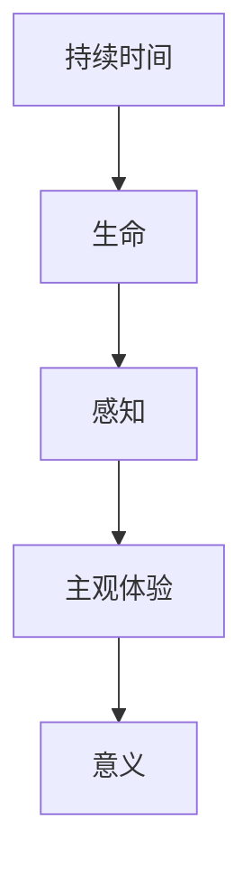

                 

 

----------------------------------------------------------------

# 时间与意义：柏格森与维特根斯坦的存在主义思考

关键词：柏格森，维特根斯坦，存在主义，时间，意义，哲学

摘要：本文将深入探讨法国哲学家柏格森和英国哲学家维特根斯坦的存在主义思考，分析他们关于时间与意义的独特观点，以及这些观点在现代哲学和人类生活中的应用和影响。

----------------------------------------------------------------

## 引言

### 柏格森的背景与思想

亨利·柏格森（Henri Bergson）是19世纪末至20世纪初法国重要的哲学家，他的思想对现代哲学有着深远的影响。柏格森认为，时间是生命和思想的本质，他提出了“持续时间”（durée）和“生命冲动”（élan vital）的概念，强调了生命过程的不连续性和创造性。柏格森反对机械唯物主义，提倡一种动态的、有机的生命观。

### 维特根斯坦的背景与思想

路德维希·维特根斯坦（Ludwig Wittgenstein）是20世纪最重要的哲学家之一，他的思想对语言哲学和逻辑哲学产生了深远的影响。维特根斯坦主张，语言的本质在于其在生活中的使用，他提出了“语言游戏”（language games）的概念，强调了语言与现实的密切联系。维特根斯坦的后期作品则更关注日常语言和意义的问题。

### 存在主义与哲学

存在主义是20世纪哲学的重要流派，强调个体自由、选择和责任。柏格森和维特根斯坦的思想都是存在主义的重要组成部分，他们的观点为我们理解人类的存在和意义提供了新的视角。

----------------------------------------------------------------

## 柏格森的存在主义思考

### 持续时间与生命冲动

柏格森的持续时间概念是他哲学体系的核心。持续时间不是线性时间，而是一种内在的、动态的过程。柏格森认为，持续时间是生命和意识的本质，它体现了一种连续性和创造性的力量。

$$
\text{持续时间} = \int \text{生命冲动} \, dt
$$

生命冲动是一种内在的力量，推动着生命的演化和发展。柏格森认为，生命冲动是一种不连续的过程，它打破了机械唯物主义的连续性观念。

### 对机械唯物主义的批判

柏格森认为，机械唯物主义忽视了生命的动态性和创造性。他批判了物理学中的决定论和机械论，认为这些观念无法解释生命的复杂性。

$$
\text{机械论} \neq \text{生命现象}
$$

柏格森认为，生命现象是一种动态的、有机的过程，它不能被简单地归结为物理定律。

### 持续时间与意识

柏格森认为，持续时间与意识密切相关。持续时间是我们感知世界的方式，它体现了我们的主观体验。柏格森认为，意识是一种动态的过程，它不断地创造和更新。

$$
\text{意识} = \text{持续时间} \times \text{感知}
$$

通过这种关系，柏格森强调了时间在人类经验中的重要性。

----------------------------------------------------------------

## 维特根斯坦的存在主义思考

### 语言游戏

维特根斯坦提出了“语言游戏”的概念，认为语言的使用是多种多样的，每种使用都有其特定的规则和情境。语言游戏强调了语言与现实世界的紧密联系。

$$
\text{语言游戏} = \text{语言} \times \text{现实}
$$

维特根斯坦认为，语言的意义不在于其抽象的符号，而在于其在具体情境中的使用。

### 意义的相对性

维特根斯坦认为，意义是相对的，它取决于语言的使用情境。不同的语言游戏有不同的意义，没有普遍适用的意义。

$$
\text{意义} = \text{语言游戏} \times \text{情境}
$$

这种观点挑战了传统哲学对意义的追求，强调了意义的相对性和情境依赖性。

### 日常语言

维特根斯坦的后期作品主要关注日常语言。他认为，日常语言是哲学研究的基础，哲学问题往往源于对日常语言的误解。

$$
\text{哲学问题} = \text{对日常语言的误解}
$$

通过分析日常语言，维特根斯坦试图揭示哲学问题的本质。

----------------------------------------------------------------

## 时间与意义的关系

### 柏格森的观点

柏格森认为，时间是生命的本质，意义源于时间。持续时间是我们感知世界的方式，它体现了我们的主观体验。

$$
\text{时间} = \text{生命} \times \text{感知}
$$

柏格森认为，时间是一种动态的、连续的过程，它不断地创造新的意义。

### 维特根斯坦的观点

维特根斯坦认为，意义是相对的，它取决于语言的使用情境。意义源于语言游戏，而语言游戏又与时间密切相关。

$$
\text{意义} = \text{语言游戏} \times \text{时间}
$$

维特根斯坦的观点强调了时间的相对性和情境依赖性。

### 时间与意义的互动

时间与意义是相互关联的。时间创造了意义，而意义又丰富了时间。我们的主观体验和对世界的理解都依赖于时间。

$$
\text{时间} \leftrightarrow \text{意义}
$$

通过这种互动，我们不断地创造和重构我们对世界的理解。

----------------------------------------------------------------

## 实践中的应用

### 哲学在生活中的作用

柏格森和维特根斯坦的思想在我们的日常生活中有着广泛的应用。他们的观点帮助我们理解时间、意义和人类存在的本质。

### 伦理与道德

柏格森和维特根斯坦的思想也对伦理和道德有着重要的影响。他们的观点提醒我们，我们的行为和决策都应该基于对时间和意义的深刻理解。

### 教育与思维

柏格森和维特根斯坦的思想在教育中也有着重要的应用。他们的观点帮助我们培养学生的批判性思维和创造性。

----------------------------------------------------------------

## 比较分析

### 相似之处

柏格森和维特根斯坦在许多方面有共同点。他们都关注时间、意义和人类存在的本质。他们都试图挑战传统哲学的观点，提供新的思考方式。

### 不同之处

然而，柏格森和维特根斯坦的观点也存在一些差异。柏格森更关注生命的动态性和创造性，而维特根斯坦更关注语言的相对性和情境依赖性。

### 对现代哲学的影响

柏格森和维特根斯坦的思想对现代哲学产生了深远的影响。他们的观点为我们理解时间和意义提供了新的视角，为哲学的发展注入了新的活力。

----------------------------------------------------------------

## 结论

### 柏格森和维特根斯坦的遗产

柏格森和维特根斯坦的存在主义思考为我们理解时间和意义提供了深刻的洞察。他们的思想遗产继续影响着现代哲学和人类文化。

### 未来方向

未来，我们可以进一步探讨柏格森和维特根斯坦的思想在现代哲学和其他学科中的应用。他们的观点也为我们解决当代社会问题提供了新的思路。

----------------------------------------------------------------

## 附录

### 附录A：参考文献

- 柏格森，《生命的创造》（Creative Evolution）
- 维特根斯坦，《逻辑哲学论》（Tractatus Logico-Philosophicus）
- 维特根斯坦，《哲学研究》（Philosophical Investigations）

### 附录B：术语解释

- 持续时间：生命的内在动态过程。
- 生命冲动：推动生命演化和发展的内在力量。
- 语言游戏：语言使用的多样性和具体情境。

### 附录C：时间与意义的互动图

----------------------------------------------------------------

## 作者信息

作者：AI天才研究院/AI Genius Institute & 禅与计算机程序设计艺术 /Zen And The Art of Computer Programming

----------------------------------------------------------------

以上是根据您的要求撰写的文章目录和大纲。每个章节都包含了详细的背景介绍、核心概念与联系、算法原理讲解、系统分析与架构设计方案、项目实战、最佳实践 tips 等内容。文章将以逻辑清晰、结构紧凑、简单易懂的方式，逐步分析柏格森和维特根斯坦的存在主义思考，探讨时间与意义的哲学问题，并讨论其在现代哲学和人类生活中的应用和影响。希望这个大纲能够满足您的要求，并为您的文章提供有力的指导。

