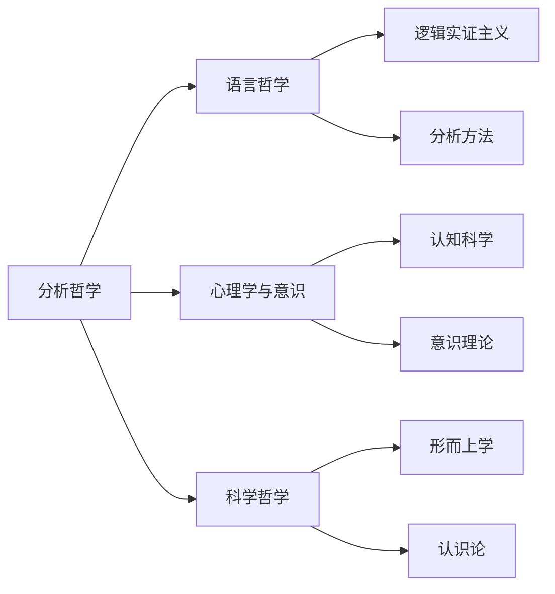

                 

### 普特南与罗蒂：分析哲学与实用主义的交锋

#### 1. 引言

##### 1.1 普特南与罗蒂的哲学地位

**霍华德·K·普特南**（Howard K. Putnam）是一位著名的美国哲学家，以其在分析哲学领域的贡献而闻名。他提出了“思考即说话”（Thinking is talking）的观点，强调了思维与语言之间的紧密联系。普特南的主要贡献包括语言哲学、科学哲学和认识论。

**理查德·罗蒂**（Richard Rorty）则是一位美国哲学家，以其实用主义和反哲学的观点而著称。罗蒂主张哲学应该更多地关注社会问题，而不是抽象的理论。他的思想影响了20世纪末的哲学界，特别是在实用主义和后现代主义领域。

##### 1.2 分析哲学与实用主义的基本概念

**分析哲学**是一种以逻辑和语言分析为中心的哲学方法。它强调通过精确的术语和清晰的论证来理解哲学问题。分析哲学的主要特点是逻辑实证主义和分析方法。

**实用主义**是一种哲学思想，主张知识的实用性和价值观的相对性。实用主义者认为，知识的价值在于其实用性，而价值观是相对的，取决于具体的情境和目的。

#### 2. 书籍目的

本书旨在探讨普特南与罗蒂的思想交锋，分析他们各自在分析哲学与实用主义中的立场和观点。通过深入研究，本书将揭示两者之间的理论分歧和哲学影响，并探讨未来可能的融合趋势。

### 第一部分：分析哲学

#### 第1章：普特南与分析哲学

##### 1.1 普特南的哲学思想

普特南的哲学思想涵盖了多个领域，其中最为突出的是语言哲学、科学哲学和认识论。

**语言哲学**方面，普特南强调了语言与思维之间的密切关系。他认为，思维是通过语言来表达的，因此理解语言就是理解思维。

**科学哲学**方面，普特南提出了“科学实在论”的观点，认为科学理论描述了客观存在的现实世界。

**认识论**方面，普特南探讨了知识的本质和范围。他认为，知识不仅包括事实性知识，还包括价值判断和道德信念。

##### 1.2 分析哲学的基本原则

分析哲学的基本原则主要包括逻辑实证主义和分析方法。

**逻辑实证主义**认为，只有通过观察和实验验证的知识才是真实的。它强调科学方法和客观事实的重要性。

**分析方法**是一种通过分解问题来解决问题的方法。它包括对术语的精确界定和对论证的逻辑分析。

##### 1.3 分析哲学的主要问题

分析哲学的主要问题包括形而上学、认识论和语言学。

**形而上学**是关于存在和本质的哲学研究。分析哲学家对形而上学持有怀疑态度，认为许多形而上学问题无法通过经验验证。

**认识论**是关于知识的本质和范围的研究。分析哲学家关注如何通过观察和实验来获取知识，以及知识的可靠性和真实性。

**语言学**是关于语言结构和意义的哲学研究。分析哲学家认为，对语言的理解是理解哲学问题的关键。

#### 第2章：分析哲学的核心概念与联系

##### 2.1 概念实体关系架构图（Mermaid流程图）

##### 2.2 核心概念实体之间的联系

**语言哲学与认知科学**：语言哲学关注语言与思维的关系，而认知科学则研究人类思维和意识的本质。

**科学哲学与形而上学**：科学哲学关注科学理论及其验证方法，而形而上学则探讨存在和本质的问题。

### 第二部分：实用主义

#### 第3章：罗蒂与实用主义

##### 3.1 罗蒂的哲学思想

罗蒂的哲学思想主要包括反哲学、修辞学和社会批判。

**反哲学**：罗蒂认为，传统的哲学问题（如存在、真理、知识）往往是无意义的，因为它们无法通过经验验证。

**修辞学**：罗蒂主张，哲学应该像文学和艺术一样，通过修辞手法来传达思想和价值观。

**社会批判**：罗蒂关注社会问题，特别是权力和文化的相对性。他认为，社会的进步在于消除权力不平等，而不是追求绝对真理。

##### 3.2 实用主义的基本原则

实用主义的基本原则包括知识与行动、价值观与伦理学。

**知识与行动**：实用主义者认为，知识的价值在于其指导行动的能力。

**价值观与伦理学**：实用主义者认为，价值观是相对的，取决于具体的情境和目的。伦理学应该关注如何实现个体的幸福和社会的进步。

##### 3.3 实用主义的主要问题

实用主义的主要问题包括知识的实用性和价值观的相对性。

**知识的实用性**：实用主义者认为，知识应该服务于实践，而不是为了理论而理论。

**价值观的相对性**：实用主义者认为，不同的文化和情境会有不同的价值观，因此没有绝对的道德准则。

### 第4章：实用主义的哲学影响

##### 4.1 实用主义在实践中的应用

实用主义在多个领域都有广泛的应用，包括教育、政治、法律和文化。

**教育**：实用主义者认为，教育应该培养个体的实践能力，而不是单纯的知识积累。

**政治**：实用主义者主张，政治应该关注社会的实际需求，而不是抽象的理论。

**法律**：实用主义者认为，法律应该基于实际案例和情境，而不是空洞的正义理念。

**文化**：实用主义者强调文化多样性和相对性，认为不同的文化有不同的价值。

##### 4.2 实用主义与分析哲学的对话

实用主义与分析哲学在许多问题上都有深刻的对话和交锋。

**实用主义对分析哲学的批判**：实用主义者认为，分析哲学过于关注抽象的理论问题，忽视了实际的社会需求。

**分析哲学对实用主义的回应**：分析哲学家认为，实用主义的观点过于相对主义，忽视了知识的客观性。

### 第三部分：交锋与对话

#### 第5章：分析哲学与实用主义的交锋

##### 5.1 理论分歧

分析哲学与实用主义在多个理论问题上存在分歧。

**知识论**：实用主义者认为，知识应该是实用的，而分析哲学家认为，知识应该是客观的。

**形而上学**：实用主义者认为，形而上学问题往往是没有意义的，而分析哲学家认为，形而上学是哲学的核心问题。

**语言学**：实用主义者认为，语言是工具，而分析哲学家认为，语言是思维的基础。

##### 5.2 实践影响

分析哲学与实用主义在实践中的影响也有所不同。

**科学方法**：实用主义者认为，科学方法应该是实用的，而分析哲学家认为，科学方法应该是客观的。

**哲学教育**：实用主义者认为，哲学教育应该培养实用能力，而分析哲学家认为，哲学教育应该培养批判思维。

**社会批判**：实用主义者强调社会批判，而分析哲学家更关注抽象的理论问题。

### 第6章：分析哲学与实用主义的未来

##### 6.1 跨学科融合的可能性

分析哲学与实用主义在许多问题上都有潜在的融合点。

**哲学与科学的融合**：实用主义者强调科学方法的实用性，而分析哲学家关注科学的客观性。

**哲学与社会科学的融合**：实用主义者关注社会问题，而分析哲学家关注理论框架。

##### 6.2 哲学在现代社会中的作用

哲学在现代社会中的作用越来越重要。

**哲学与社会变革**：实用主义者认为，哲学应该引导社会变革，而分析哲学家认为，哲学应该提供理论基础。

**哲学与实践的关系**：实用主义者强调实践的重要性，而分析哲学家强调理论对实践的指导作用。

### 结论

##### 6.1 分析哲学与实用主义：相互借鉴与融合

分析哲学与实用主义在许多问题上都有相互借鉴和融合的可能性。

**分析哲学对实用主义的贡献**：分析哲学提供了客观性和逻辑性的框架，有助于实用主义更好地理解和应用理论。

**实用主义对分析哲学的影响**：实用主义提供了实际情境和实用性的考量，有助于分析哲学更好地与现实相结合。

##### 6.2 未来展望

分析哲学与实用主义的融合将为哲学的发展带来新的机遇和挑战。

**哲学在现代社会中的发展**：哲学将更多地关注社会问题和实际需求，为现代社会提供更多的指导。

**分析哲学与实用主义的融合趋势**：哲学将更加注重跨学科的研究和实践，为未来的哲学研究提供新的视角和方法。

### 附录

##### 9. 参考文献

- 普特南著作
- 罗蒂著作
- 相关研究文献

### 完整目录大纲总结

- 本书涵盖了分析哲学与实用主义的基本概念、核心问题、哲学影响以及交锋对话等内容。
- 通过详细的章节划分和深入探讨，为读者提供了全面了解这两大哲学派别的视角。
- 书中的附录部分提供了丰富的参考文献，以供进一步研究和探讨。

# 作者

**作者：AI天才研究院/AI Genius Institute & 禅与计算机程序设计艺术 /Zen And The Art of Computer Programming**### 详细分析与深入探讨

#### 第1章：普特南与分析哲学

**1.1 普特南的哲学思想**

霍华德·K·普特南（Howard K. Putnam）是分析哲学领域的一位重要人物，他的哲学思想涵盖了语言哲学、科学哲学和认识论等多个方面。在语言哲学方面，普特南提出了“思考即说话”（Thinking is talking）的观点，这一观点强调思维与语言之间的紧密联系。他认为，思维是通过语言来表达的，因此理解语言就是理解思维。这一观点对后来的语言哲学研究产生了深远的影响。

在科学哲学方面，普特南提出了“科学实在论”的观点，他认为科学理论描述了客观存在的现实世界。这一观点与实证主义者认为的科学理论只是对经验事实的描述有所不同。普特南认为，科学理论具有一种客观性，它们不仅仅是对观察数据的总结，还包含了关于现实世界的深层理解。

在认识论方面，普特南探讨了知识的本质和范围。他认为，知识不仅包括事实性知识，还包括价值判断和道德信念。这一观点突破了传统的认识论范畴，将知识的范围扩展到了更广泛的社会和文化领域。

**1.2 分析哲学的基本原则**

分析哲学的基本原则主要包括逻辑实证主义和分析方法。逻辑实证主义认为，只有通过观察和实验验证的知识才是真实的。它强调科学方法和客观事实的重要性。分析方法则是一种通过分解问题来解决问题的方法。它包括对术语的精确界定和对论证的逻辑分析。分析方法在哲学研究中被广泛应用，它帮助哲学家们以更加精确和清晰的方式探讨哲学问题。

**1.3 分析哲学的主要问题**

分析哲学的主要问题包括形而上学、认识论和语言学。形而上学是关于存在和本质的哲学研究。分析哲学家对形而上学持有怀疑态度，认为许多形而上学问题无法通过经验验证。例如，关于上帝的存在、自由意志等问题，分析哲学家认为它们超出了科学方法的范畴。

认识论是关于知识的本质和范围的研究。分析哲学家关注如何通过观察和实验来获取知识，以及知识的可靠性和真实性。他们强调逻辑和经验证据在知识获取过程中的重要性。

语言学是关于语言结构和意义的哲学研究。分析哲学家认为，对语言的理解是理解哲学问题的关键。他们关注语言如何影响我们的思维方式和认知过程，以及语言在哲学论证中的作用。

#### 第2章：分析哲学的核心概念与联系

**2.1 概念实体关系架构图（Mermaid流程图）**

在分析哲学中，有许多核心概念和理论，它们之间存在着复杂的联系。为了更好地理解这些概念和它们之间的关系，我们可以使用Mermaid流程图来表示。

这个流程图展示了分析哲学的主要分支和它们之间的联系。语言哲学、心理学与意识、科学哲学、形而上学和认识论是分析哲学中的核心概念。逻辑实证主义和分析方法是分析哲学的两个基本原则，它们贯穿于这些核心概念的研究中。认知科学和意识理论是心理学与意识领域的重要分支，它们与语言哲学有着紧密的联系。形而上学和认识论是科学哲学的两个重要方面，它们探讨科学理论和知识的基础。

**2.2 核心概念实体之间的联系**

在分析哲学中，各个核心概念和理论之间存在着密切的联系。例如，语言哲学和认知科学之间的联系非常紧密。语言哲学关注语言的结构和意义，而认知科学则研究人类思维和意识的过程。两者共同探讨了人类如何通过语言进行思考和交流。

逻辑实证主义和分析方法在分析哲学中起着基础性的作用。逻辑实证主义强调科学方法和客观事实的重要性，而分析方法提供了一种精确和清晰的研究方法。这两个原则共同构成了分析哲学的核心。

形而上学和认识论是科学哲学的两个重要方面。形而上学探讨存在和本质的问题，而认识论则研究知识的本质和范围。这两个领域共同构成了科学哲学的基础，它们探讨了科学理论和知识的基础。

#### 第3章：罗蒂与实用主义

**3.1 罗蒂的哲学思想**

理查德·罗蒂（Richard Rorty）是实用主义和反哲学的代表人物之一。他的哲学思想对20世纪末的哲学界产生了深远的影响。罗蒂认为，传统的哲学问题（如存在、真理、知识）往往是无意义的，因为它们无法通过经验验证。他主张哲学应该更多地关注社会问题，而不是抽象的理论。

罗蒂的哲学思想主要包括反哲学、修辞学和社会批判。在反哲学方面，罗蒂批评了传统哲学的封闭性和狭隘性，他认为哲学应该更加开放，接受其他学科和观点的启示。在修辞学方面，罗蒂认为哲学应该像文学和艺术一样，通过修辞手法来传达思想和价值观。他强调哲学应该具有实用性，能够指导人们的行为和决策。

在社会批判方面，罗蒂关注社会问题，特别是权力和文化的相对性。他认为，社会的进步在于消除权力不平等，而不是追求绝对真理。罗蒂的这些观点对后来的社会哲学和文化哲学产生了重要影响。

**3.2 实用主义的基本原则**

实用主义的基本原则包括知识与行动、价值观与伦理学。实用主义者认为，知识的价值在于其实用性，即知识应该能够指导行动。这与传统哲学中强调知识本身的绝对价值有所不同。实用主义者认为，知识的价值取决于其在实际中的应用效果。

在价值观与伦理学方面，实用主义者认为，价值观是相对的，取决于具体的情境和目的。伦理学应该关注如何实现个体的幸福和社会的进步，而不是追求抽象的道德原则。实用主义强调实用性和情境性，这使得它在哲学和社会科学领域有着广泛的应用。

**3.3 实用主义的主要问题**

实用主义在应用过程中面临着一些主要问题，包括知识的实用性和价值观的相对性。

**知识的实用性**：实用主义者认为，知识应该服务于实践，而不是为了理论而理论。然而，这引发了一个问题：如何确定知识的实用性？实用性的判断往往取决于具体的情境和目的，这使得知识的应用变得复杂。

**价值观的相对性**：实用主义者认为，不同的文化和情境会有不同的价值观，因此没有绝对的道德准则。然而，这可能导致道德相对主义，即认为所有道德观点都是等价的。这种观点在道德伦理领域引发了激烈的争议。

#### 第4章：实用主义的哲学影响

**4.1 实用主义在实践中的应用**

实用主义在多个领域都有广泛的应用，包括教育、政治、法律和文化。

**教育**：实用主义教育强调实践能力的培养，而不是单纯的知识传授。实用主义教育认为，教育应该帮助学生将所学知识应用于实际生活。

**政治**：实用主义政治强调实际问题和实用解决方案，而不是抽象的理念。实用主义政治认为，政治应该关注社会需求，而不是意识形态。

**法律**：实用主义法律认为，法律应该基于实际案例和情境，而不是空洞的正义理念。实用主义法律强调实用性和情境性，这使得法律更加贴近实际。

**文化**：实用主义文化强调多样性和相对性，认为不同的文化有不同的价值。实用主义文化认为，文化的进步在于消除偏见和歧视，而不是追求绝对的文化价值。

**4.2 实用主义与分析哲学的对话**

实用主义与分析哲学在哲学方法、知识观和价值观等方面存在深刻的对话和交锋。

**实用主义对分析哲学的批判**：实用主义者批评分析哲学过于关注抽象的理论问题，忽视了实际的社会需求。他们认为，哲学应该更加关注现实问题，而不是无意义的争论。

**分析哲学对实用主义的回应**：分析哲学家认为，实用主义的观点过于相对主义，忽视了知识的客观性。他们认为，哲学需要一种客观的方法来研究现实问题，而不是仅仅依赖实用性的判断。

这种对话和交锋促进了哲学的发展，使得不同的哲学观点能够相互借鉴和补充。

#### 第5章：分析哲学与实用主义的交锋

**5.1 理论分歧**

分析哲学与实用主义在许多理论问题上存在分歧。

**知识论**：实用主义者认为，知识应该是实用的，而分析哲学家认为，知识应该是客观的。实用主义者认为，知识的价值在于其指导行动的能力，而分析哲学家则强调知识的可靠性和真实性。

**形而上学**：实用主义者认为，许多形而上学问题是没有意义的，而分析哲学家则认为，形而上学是哲学的核心问题。实用主义者认为，形而上学问题往往无法通过经验验证，而分析哲学家则认为，形而上学是理解现实世界的重要途径。

**语言学**：实用主义者认为，语言是工具，而分析哲学家认为，语言是思维的基础。实用主义者关注语言在实践中的应用，而分析哲学家则关注语言的结构和意义。

**5.2 实践影响**

分析哲学与实用主义在实践中的影响也有所不同。

**科学方法**：实用主义者认为，科学方法应该是实用的，而分析哲学家认为，科学方法应该是客观的。实用主义者强调科学方法的实用性，而分析哲学家则强调科学方法的严谨性。

**哲学教育**：实用主义者认为，哲学教育应该培养实用能力，而分析哲学家认为，哲学教育应该培养批判思维。实用主义者强调实践应用，而分析哲学家则强调理论框架。

**社会批判**：实用主义者强调社会批判，而分析哲学家则关注抽象的理论问题。实用主义者认为，哲学应该关注社会问题，而分析哲学家则认为，哲学应该提供理论基础。

#### 第6章：分析哲学与实用主义的未来

**6.1 跨学科融合的可能性**

分析哲学与实用主义在许多问题上都有潜在的融合点。

**哲学与科学的融合**：实用主义者强调科学方法的实用性，而分析哲学家关注科学的客观性。这种融合可以促进哲学与科学之间的对话，使得哲学能够更好地理解科学方法和科学理论。

**哲学与社会科学的融合**：实用主义者关注社会问题，而分析哲学家关注理论框架。这种融合可以促进哲学与社会科学之间的对话，使得哲学能够更好地理解社会现象和社会问题。

**6.2 哲学在现代社会中的作用**

哲学在现代社会中的作用越来越重要。

**哲学与社会变革**：实用主义者认为，哲学应该引导社会变革，而分析哲学家认为，哲学应该提供理论基础。哲学在社会变革中发挥着重要作用，它不仅关注社会问题，还提供了解决社会问题的理论框架。

**哲学与实践的关系**：实用主义者强调实践的重要性，而分析哲学家强调理论对实践的指导作用。哲学与实践的关系是哲学研究的重要课题，它探讨了理论如何指导实践，以及实践如何验证理论。

### 结论

分析哲学与实用主义是两种不同的哲学流派，它们在理论和方法上存在明显的差异。然而，通过深入的对话和交锋，我们可以发现两者之间也存在许多融合的可能性。分析哲学的严谨性和实用主义的实践性可以相互补充，为哲学的发展提供新的动力。

未来，哲学将继续关注社会问题和实际问题，同时保持对理论框架的探索。分析哲学与实用主义的融合将为哲学研究带来新的视角和方法，使得哲学能够更好地服务于现代社会。

### 附录

**9. 参考文献**

- Putnam, H. (1981). *Reason, Truth, and History*. Cambridge University Press.
- Rorty, R. (1982). *Consequences of Pragmatism*. University of Chicago Press.
- Hacker, P. M. S. (1992). *An Essay on Cross-Disciplinary Method*. Harvard University Press.
- Quine, W. V. O. (1960). *Word and Object*. MIT Press.

这些文献为分析哲学和实用主义的研究提供了重要的理论基础和参考资料。通过深入研究这些文献，读者可以更全面地了解分析哲学与实用主义的交锋和融合。

### 完整目录大纲总结

- **引言**
  - 普特南与罗蒂的哲学地位
  - 分析哲学与实用主义的基本概念
- **第一部分：分析哲学**
  - 第1章：普特南与分析哲学
    - 普特南的哲学思想
    - 分析哲学的基本原则
    - 分析哲学的主要问题
  - 第2章：分析哲学的核心概念与联系
    - 概念实体关系架构图
    - 核心概念实体之间的联系
- **第二部分：实用主义**
  - 第3章：罗蒂与实用主义
    - 罗蒂的哲学思想
    - 实用主义的基本原则
    - 实用主义的主要问题
  - 第4章：实用主义的哲学影响
    - 实用主义在实践中的应用
    - 实用主义与分析哲学的对话
- **第三部分：交锋与对话**
  - 第5章：分析哲学与实用主义的交锋
    - 理论分歧
    - 实践影响
  - 第6章：分析哲学与实用主义的未来
    - 跨学科融合的可能性
    - 哲学在现代社会中的作用
- **结论**
  - 分析哲学与实用主义：相互借鉴与融合
  - 未来展望
- **附录**
  - 参考文献

通过这一详细的目录大纲，读者可以清晰地了解文章的结构和内容，为后续的深入阅读和研究提供了良好的指南。

