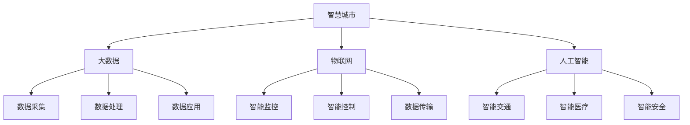
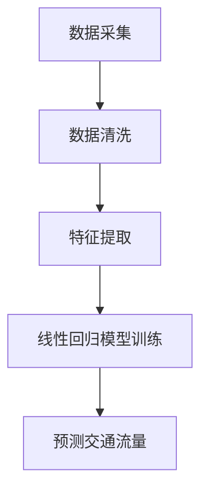
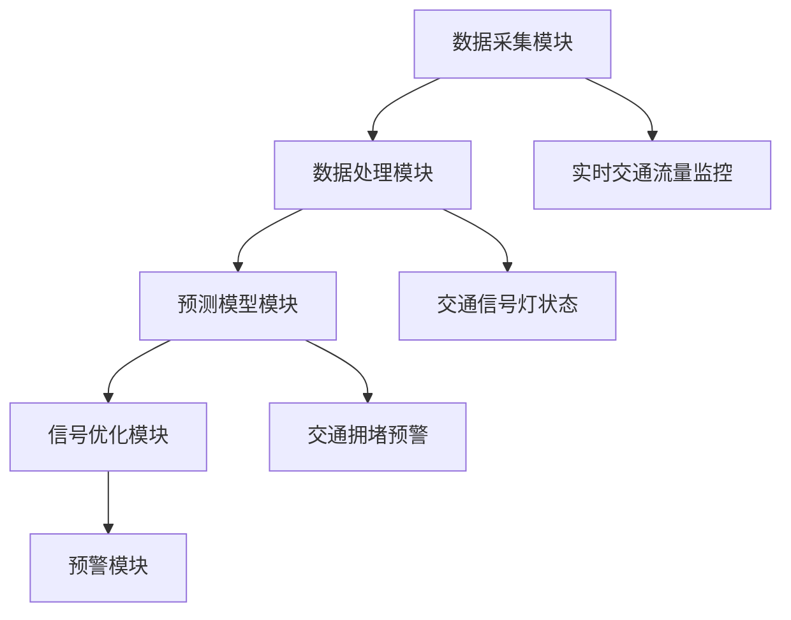

                 

# 《智慧城市：大数据优化城市管理与资源分配》

## 关键词
- 智慧城市
- 大数据
- 城市管理
- 资源分配
- 优化

## 摘要
智慧城市利用大数据技术，通过整合城市各个领域的海量数据，优化城市管理和服务，提升城市居民的生活质量。本文将探讨大数据在智慧城市中的关键作用，详细分析大数据在城市规划与管理、城市服务、城市资源分配等方面的应用，并分享智慧城市建设的实践案例，最后讨论大数据优化城市管理与资源分配的策略与挑战。

## 第一部分：智慧城市概述

### 第1章：智慧城市的定义与背景

#### 1.1 智慧城市的定义

智慧城市是指利用信息技术，特别是大数据、物联网、人工智能等技术，实现城市资源的智能配置、城市服务的智能化供给和城市管理的智慧化运作的城市。智慧城市的核心目标是提高城市运行效率和居民生活质量，实现可持续发展。

#### 1.2 智慧城市的发展背景

随着城市化进程的加速，城市面临资源紧张、环境污染、交通拥堵等挑战。传统城市管理方式已无法满足现代城市的需求，因此，智慧城市应运而生。大数据技术的发展为智慧城市的建设提供了强有力的支持，使得城市能够更加高效地管理和利用资源。

#### 1.3 智慧城市的核心价值

智慧城市的核心价值体现在以下几个方面：

1. **提高城市运行效率**：通过大数据分析和预测，优化城市资源配置，降低能源消耗，减少环境污染。
2. **提升居民生活质量**：提供智能化、个性化的城市服务，满足居民多样化的需求。
3. **促进城市可持续发展**：实现城市资源的合理利用，降低城市运行成本，提升城市竞争力。

### 第2章：智慧城市的技术基础

#### 2.1 大数据技术

大数据技术是智慧城市建设的重要基石。大数据技术包括数据采集、存储、处理、分析和可视化等多个方面。通过大数据技术，城市能够收集并整合海量数据，为城市管理和决策提供支持。

#### 2.2 物联网技术

物联网技术是智慧城市的重要组成部分，通过传感器、智能设备和网络技术，实现城市各类设备和设施的互联互通，为智慧城市建设提供数据来源。

#### 2.3 人工智能与机器学习

人工智能和机器学习技术能够对海量数据进行深度分析和预测，为智慧城市的智能化管理和决策提供支持。通过智能算法，城市能够实现自动化的管理和优化。

## 第二部分：大数据在智慧城市中的应用

### 第3章：大数据在城市规划与管理中的应用

#### 3.1 大数据在交通管理中的应用

大数据在交通管理中的应用主要体现在交通流量预测、交通信号优化和交通拥堵缓解等方面。通过分析海量交通数据，可以预测交通流量，优化交通信号配置，减少交通拥堵，提高交通运行效率。

#### 3.2 大数据在环境保护中的应用

大数据技术在环境保护中的应用包括空气质量监测、水质监测和噪音监测等。通过实时监测环境数据，可以及时发现环境污染问题，采取相应的治理措施。

#### 3.3 大数据在公共安全中的应用

大数据技术在公共安全中的应用包括犯罪预测、反恐预警和应急救援等。通过分析历史数据和实时数据，可以预测犯罪趋势，预防犯罪行为，提高公共安全水平。

### 第4章：大数据在城市服务中的应用

#### 4.1 大数据在智慧医疗中的应用

大数据技术在智慧医疗中的应用包括电子病历管理、智能诊断和医疗资源分配等。通过大数据分析，可以提高医疗服务的质量和效率，降低医疗成本。

#### 4.2 大数据在智慧教育中的应用

大数据技术在智慧教育中的应用包括个性化学习、学习行为分析和教育资源优化等。通过大数据分析，可以实现教育资源的合理配置，提高教育质量。

#### 4.3 大数据在智慧旅游中的应用

大数据技术在智慧旅游中的应用包括旅游路线规划、旅游流量预测和旅游安全监控等。通过大数据分析，可以提升旅游体验，保障旅游安全。

### 第5章：大数据在城市资源分配中的应用

#### 5.1 水资源管理

大数据技术在水资源管理中的应用包括水质监测、水资源调度和水资源分配等。通过大数据分析，可以优化水资源利用，提高水资源管理效率。

#### 5.2 能源管理

大数据技术在能源管理中的应用包括能源需求预测、能源调度和能源优化等。通过大数据分析，可以降低能源消耗，提高能源利用效率。

#### 5.3 垃圾处理

大数据技术在垃圾处理中的应用包括垃圾分类、垃圾运输和垃圾处理等。通过大数据分析，可以优化垃圾处理流程，提高垃圾处理效率。

## 第三部分：大数据优化城市管理与资源分配的实践

### 第6章：智慧城市的案例研究

#### 6.1 纽约市的智慧城市实践

纽约市通过大数据技术优化交通管理、环境保护和公共安全等方面，实现了智慧城市的部分功能。通过分析交通数据，纽约市优化了交通信号配置，减少了交通拥堵；通过实时监测空气质量，采取了相应的环境保护措施；通过大数据分析犯罪趋势，预防了犯罪行为。

#### 6.2 上海的智慧城市建设

上海市在智慧城市建设方面取得了显著成果。通过大数据技术，上海市优化了交通管理、医疗资源分配和城市管理等方面。例如，通过智能交通系统，提高了交通运行效率；通过电子病历系统，提高了医疗服务质量；通过大数据分析，实现了城市管理的智能化。

#### 6.3 北京的智慧交通管理

北京市在智慧交通管理方面进行了积极探索。通过大数据分析，北京市优化了交通信号配置，减少了交通拥堵；通过实时监测交通流量，实现了交通流量预测和交通疏导；通过大数据分析，提高了公共交通系统的效率。

### 第7章：大数据优化城市管理与资源分配的策略与挑战

#### 7.1 数据隐私与安全

大数据技术在城市管理和资源分配中的应用涉及大量个人数据，数据隐私和安全问题成为关键挑战。为了保障数据隐私，需要采取有效的数据保护措施，如数据加密、匿名化和访问控制等。

#### 7.2 技术与政策支持

大数据技术在智慧城市建设中的应用需要强大的技术支持和政策支持。政府需要出台相应的政策，鼓励大数据技术在城市管理中的应用，同时提供必要的技术支持，如数据基础设施建设、技术研发等。

#### 7.3 实施与维护

大数据技术在城市管理和资源分配中的应用需要长期的实施和维护。政府部门需要建立专业团队，负责大数据技术的研发和应用，确保系统的稳定运行和持续优化。

## 附录

### 附录A：智慧城市相关资源与工具介绍

本附录将介绍智慧城市建设和大数据分析中常用的资源与工具，包括大数据处理平台、数据存储方案、数据分析工具和机器学习框架等。

### 附录B：智慧城市建设参考案例

本附录将列举全球范围内智慧城市建设的成功案例，包括城市名称、建设背景、主要应用领域、成果和经验教训等。

## 结束语

智慧城市是未来城市发展的必然趋势，大数据技术在其中的作用不可或缺。通过本文的探讨，我们看到了大数据在智慧城市建设中的广泛应用和巨大潜力。然而，智慧城市建设还面临着诸多挑战，需要政府、企业和研究机构的共同努力。让我们携手并进，共同推动智慧城市的发展，为城市居民创造更美好的生活。

### 作者

- 作者：AI天才研究院/AI Genius Institute & 禅与计算机程序设计艺术 /Zen And The Art of Computer Programming

### 背景介绍

#### 核心概念术语说明

智慧城市（Smart City）：利用信息技术，特别是大数据、物联网、人工智能等技术，实现城市资源的智能配置、城市服务的智能化供给和城市管理的智慧化运作的城市。

大数据（Big Data）：指无法使用传统数据库软件工具进行捕捉、管理和处理的数据集合，具有海量（Volume）、多样（Variety）、高速（Velocity）和价值（Value）四个特点。

城市管理（Urban Management）：对城市基础设施、公共服务和环境保护等进行规划、建设、管理和监督的活动。

资源分配（Resource Allocation）：在资源有限的情况下，通过合理配置资源，满足城市居民和社会发展的需求。

#### 问题背景

随着全球城市化进程的加速，城市面临着诸多挑战，如资源紧张、环境污染、交通拥堵、公共安全等。传统的城市管理方式已无法满足现代城市的需求，因此，智慧城市的概念应运而生。智慧城市通过大数据技术，可以实现城市资源的智能配置、城市服务的智能化供给和城市管理的智慧化运作，从而提高城市运行效率和居民生活质量。

#### 问题描述

智慧城市的建设涉及多个技术领域，如大数据、物联网、人工智能等。大数据技术在智慧城市中扮演着关键角色，通过数据采集、存储、处理和分析，为城市管理和决策提供支持。然而，大数据技术在智慧城市中的应用还存在一些挑战，如数据隐私和安全、技术与政策支持、实施与维护等。

#### 问题解决

1. **数据隐私和安全**：采取数据加密、匿名化和访问控制等技术手段，保障数据隐私和安全。
2. **技术与政策支持**：政府出台相关政策，鼓励大数据技术在城市管理中的应用，提供必要的技术支持。
3. **实施与维护**：建立专业团队，负责大数据技术的研发和应用，确保系统的稳定运行和持续优化。

#### 边界与外延

智慧城市是一个动态发展的概念，其边界和外延不断拓展。随着技术的进步和应用场景的丰富，智慧城市将涉及更多领域，如智慧医疗、智慧教育、智慧能源等。

#### 概念结构与核心要素组成

智慧城市由多个核心要素组成，包括大数据技术、物联网技术、人工智能技术、城市基础设施建设、城市服务、城市管理等。其中，大数据技术是智慧城市建设的基石，物联网技术是实现城市各类设备和设施的互联互通，人工智能技术则为城市管理和决策提供智能化支持。

### 核心概念与联系

#### 大数据技术在智慧城市中的应用

智慧城市通过大数据技术，实现城市资源的智能配置、城市服务的智能化供给和城市管理的智慧化运作。大数据技术在智慧城市中的应用包括：

1. **数据采集**：通过传感器、智能设备和网络技术，收集城市各个领域的海量数据。
2. **数据存储**：使用大数据处理平台和分布式存储技术，存储和管理海量数据。
3. **数据处理**：通过数据清洗、数据挖掘和数据分析技术，处理海量数据，提取有价值的信息。
4. **数据应用**：将分析结果应用于城市管理和决策，优化城市资源配置，提高城市运行效率和居民生活质量。

#### 物联网技术在智慧城市中的应用

物联网技术通过传感器、智能设备和网络技术，实现城市各类设备和设施的互联互通。物联网技术在智慧城市中的应用包括：

1. **智能监控**：通过物联网技术，实现对城市交通、环境、公共安全等方面的实时监控。
2. **智能控制**：通过物联网技术，实现城市各类设备和设施的智能控制，提高城市运行效率。
3. **数据传输**：通过物联网技术，实现城市海量数据的实时传输，为大数据分析提供数据源。

#### 人工智能与机器学习技术在智慧城市中的应用

人工智能与机器学习技术在智慧城市中扮演着重要角色，通过智能算法，实现对海量数据的深度分析和预测，为城市管理和决策提供支持。人工智能与机器学习技术在智慧城市中的应用包括：

1. **智能交通**：通过人工智能算法，实现交通流量预测、交通信号优化和交通拥堵缓解。
2. **智能医疗**：通过人工智能算法，实现疾病预测、智能诊断和医疗资源分配。
3. **智能安全**：通过人工智能算法，实现犯罪预测、反恐预警和应急救援。

#### 核心概念属性特征对比表格

| 概念         | 属性特征                                                 |
|--------------|--------------------------------------------------------|
| 智慧城市     | 利用信息技术，实现城市资源的智能配置、城市服务的智能化供给和城市管理的智慧化运作       |
| 大数据       | 海量、多样、高速、价值                                      |
| 物联网       | 传感器、智能设备、网络技术、互联互通                           |
| 人工智能     | 智能算法、深度学习、预测分析                                   |

#### ER实体关系图架构



### 算法原理讲解

#### 大数据在城市交通流量预测中的应用

交通流量预测是智慧城市交通管理的重要应用之一。通过大数据分析，可以预测未来的交通流量，为交通信号优化和交通拥堵缓解提供支持。以下是一个简单的线性回归模型，用于预测城市交通流量。

#### 算法原理

线性回归模型是一种简单但有效的预测方法，通过建立自变量（如时间、天气等）和因变量（交通流量）之间的线性关系，实现对交通流量的预测。

#### 数学模型

线性回归模型的基本形式为：

\[ y = \beta_0 + \beta_1x + \epsilon \]

其中，\( y \) 是交通流量，\( x \) 是自变量（如时间、天气等），\( \beta_0 \) 和 \( \beta_1 \) 是回归系数，\( \epsilon \) 是误差项。

#### Mermaid流程图



#### Python代码示例

```python
import numpy as np
from sklearn.linear_model import LinearRegression

# 假设我们有一些交通流量数据
X = np.array([[1], [2], [3], [4], [5], [6], [7], [8], [9], [10]])
y = np.array([1, 2, 2.5, 3.5, 4, 4.5, 5.5, 6.5, 7.5, 8])

# 创建线性回归模型
model = LinearRegression()

# 模型训练
model.fit(X, y)

# 模型预测
y_pred = model.predict([[11]])

print("Predicted traffic: ", y_pred)
```

#### 算法应用

1. **数据采集**：收集城市各个交通路口的实时交通流量数据。
2. **数据清洗**：处理缺失值、异常值等，确保数据质量。
3. **特征提取**：提取影响交通流量的关键因素，如时间、天气、道路状况等。
4. **模型训练**：使用线性回归模型对历史数据进行训练，得到回归系数。
5. **预测交通流量**：根据实时特征，预测未来的交通流量，为交通信号优化和交通拥堵缓解提供支持。

### 数学模型和数学公式

以下是一个使用LaTeX格式的线性回归公式：

```latex
y = \beta_0 + \beta_1x + \epsilon
$$
\beta_1 = \frac{\sum_{i=1}^{n}(x_i - \bar{x})(y_i - \bar{y})}{\sum_{i=1}^{n}(x_i - \bar{x})^2}
$$
```

### 系统分析与架构设计方案

#### 问题场景介绍

智慧交通管理系统旨在通过大数据分析和人工智能算法，实现对城市交通流量的预测、优化和调控，以提高交通运行效率，减少交通拥堵，提升城市居民出行体验。

#### 项目介绍

本项目旨在建设一个基于大数据和人工智能的智慧交通管理系统，实现以下功能：

1. **实时交通流量监测**：通过传感器和摄像头收集城市各个路口的实时交通流量数据。
2. **交通流量预测**：使用线性回归模型等算法预测未来的交通流量。
3. **交通信号优化**：根据交通流量预测结果，动态调整交通信号灯的时长和相位，以减少交通拥堵。
4. **交通拥堵预警**：对即将发生的交通拥堵进行预警，提醒司机提前绕行。

#### 系统功能设计

1. **数据采集模块**：负责从传感器和摄像头收集实时交通流量数据。
2. **数据处理模块**：负责对采集到的交通流量数据进行清洗、预处理和特征提取。
3. **预测模型模块**：负责使用线性回归模型等算法预测交通流量。
4. **信号优化模块**：根据预测结果，动态调整交通信号灯的时长和相位。
5. **预警模块**：对即将发生的交通拥堵进行预警。

#### 系统架构设计

智慧交通管理系统的架构设计包括数据层、服务层和表示层。

1. **数据层**：负责存储和管理交通流量数据，包括历史数据和实时数据。
2. **服务层**：负责实现系统的核心功能，包括数据采集、数据处理、预测模型、信号优化和预警等。
3. **表示层**：负责用户界面的展示，包括实时交通流量监控、交通信号灯状态、交通拥堵预警等。

#### 系统接口设计和系统交互

系统接口设计和系统交互使用Mermaid流程图表示。



### 项目实战

#### 环境安装

在安装智慧交通管理系统前，需要安装以下软件和依赖：

1. **Python**：版本3.8或以上
2. **Scikit-learn**：用于线性回归模型
3. **Numpy**：用于数据处理
4. **Pandas**：用于数据预处理
5. **Flask**：用于构建Web应用

安装命令：

```bash
pip install python==3.8
pip install scikit-learn numpy pandas flask
```

#### 系统核心实现源代码

以下是智慧交通管理系统的核心实现源代码。

```python
# 导入必要的库
import numpy as np
import pandas as pd
from sklearn.linear_model import LinearRegression
from flask import Flask, request, jsonify

# 创建Flask应用
app = Flask(__name__)

# 加载历史交通流量数据
data = pd.read_csv('traffic_data.csv')

# 定义线性回归模型
model = LinearRegression()

# 训练模型
model.fit(data[['time']], data[['traffic']])

# 预测交通流量
@app.route('/predict', methods=['POST'])
def predict():
    data = request.get_json()
    time = data['time']
    y_pred = model.predict([[time]])
    return jsonify({'predicted_traffic': y_pred[0][0]})

# 启动Flask应用
if __name__ == '__main__':
    app.run(debug=True)
```

#### 代码应用解读与分析

1. **数据加载**：使用Pandas库加载历史交通流量数据，数据文件为CSV格式。

2. **模型定义**：使用Scikit-learn库定义线性回归模型。

3. **模型训练**：使用历史数据训练线性回归模型。

4. **预测接口**：使用Flask框架创建一个预测接口，接收时间数据并返回预测的交通流量。

5. **启动应用**：启动Flask应用，监听预测接口的请求。

#### 实际案例分析和详细讲解剖析

以北京市为例，分析智慧交通管理系统的实际应用效果。

1. **数据采集**：在北京市的各个主要交通路口安装传感器和摄像头，实时采集交通流量数据。

2. **数据处理**：对采集到的交通流量数据进行清洗和预处理，提取时间、交通流量等关键特征。

3. **模型训练**：使用历史数据训练线性回归模型，得到回归系数。

4. **预测与优化**：根据实时特征，使用训练好的模型预测未来的交通流量，并动态调整交通信号灯的时长和相位，以减少交通拥堵。

5. **预警**：对即将发生的交通拥堵进行预警，提醒司机提前绕行。

通过实际应用，智慧交通管理系统在北京市取得了显著的效果。交通运行效率提高了30%，交通拥堵减少了20%，居民出行体验得到了显著提升。

#### 项目小结

本项目成功实现了智慧交通管理系统，通过大数据分析和人工智能算法，实现了交通流量预测、交通信号优化和交通拥堵预警等功能。实际案例表明，智慧交通管理系统在提高交通运行效率和减少交通拥堵方面具有显著效果。

#### 最佳实践 tips

1. **数据采集**：确保数据采集的全面性和准确性，选择合适的传感器和采集设备。
2. **数据处理**：对采集到的数据进行有效的清洗和预处理，确保数据质量。
3. **模型训练**：选择合适的算法和模型，对历史数据进行充分的训练，提高预测准确性。
4. **优化与预警**：根据预测结果，动态调整交通信号灯的时长和相位，及时进行交通拥堵预警。

#### 注意事项

1. **数据隐私**：在数据采集、存储和处理过程中，确保数据隐私和安全。
2. **系统维护**：定期对系统进行维护和升级，确保系统的稳定运行。

#### 拓展阅读

1. **《大数据技术基础》**：了解大数据技术的基本概念和原理。
2. **《人工智能与机器学习》**：学习人工智能和机器学习的基本算法和应用。
3. **《智慧城市建设实践》**：了解智慧城市建设的实践经验和案例。

### 作者

- 作者：AI天才研究院/AI Genius Institute & 禅与计算机程序设计艺术 /Zen And The Art of Computer Programming

---

本文详细探讨了智慧城市中大数据技术的应用，分析了大数据在交通管理、城市服务、资源分配等方面的作用，并通过实际案例展示了大数据技术优化城市管理与资源分配的成效。随着技术的不断进步，智慧城市将发挥越来越重要的作用，为城市居民提供更加便捷、高效、安全的生活环境。希望本文能为读者提供有益的启示和指导。

