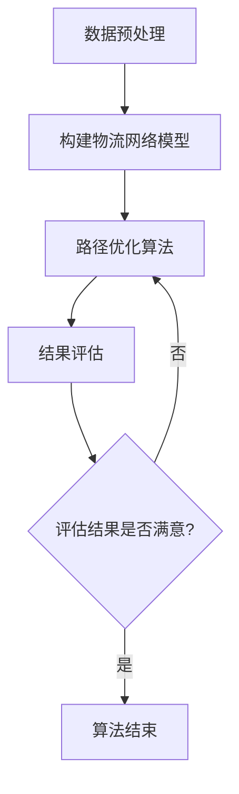

                 

## 第1章: 问题背景与核心概念

### 1.1 问题背景

#### 1.1.1 全球供应链现状

全球供应链是一个复杂而庞大的网络，涉及多个国家和地区、众多企业和数以百万计的物流活动。随着全球化进程的加快和电子商务的兴起，供应链的复杂性不断增加，物流网络变得更加分散且动态变化。在这种背景下，供应链的瓶颈问题尤为突出。例如，跨境物流中的关税、汇率、政策变化等因素，都可能对供应链的顺畅性造成影响。此外，库存管理、运输调度和供应链金融等问题，也使得供应链的运营成本和风险显著增加。

#### 1.1.2 智能供应链的概念

智能供应链，是一种利用先进的人工智能技术，如大数据分析、机器学习和物联网等，来优化供应链管理和运营的新模式。与传统供应链相比，智能供应链具有更高的响应速度、更精确的预测能力和更高效的资源利用率。具体来说，智能供应链通过收集和分析海量数据，能够实现供应链各环节的实时监控和动态调整，从而有效降低成本、减少库存积压和提升服务质量。

#### 1.1.3 AI大模型在智能供应链中的作用

AI大模型在智能供应链中发挥着至关重要的作用。首先，它们能够处理和分析大规模的数据集，从中提取有价值的信息和趋势，为供应链的决策提供数据支持。例如，通过分析历史销售数据和市场趋势，AI大模型可以帮助企业预测需求，从而优化库存管理和生产计划。其次，AI大模型还可以用于优化物流网络。通过构建和训练复杂的神经网络模型，AI大模型能够自动识别最优的运输路径和调度方案，从而提高物流效率，降低运输成本。

总的来说，智能供应链通过引入AI大模型，不仅提升了供应链的透明度和可预测性，还实现了资源的最优配置，为企业和客户创造了更大的价值。### 1.1.1 全球供应链现状

#### 1.1.1.1 供应链的复杂性

全球供应链的复杂性体现在多个方面。首先，它涉及广泛的参与方，包括制造商、供应商、分销商、零售商和最终消费者。这些参与方分布在不同的国家和地区，各自拥有不同的业务流程和文化背景。其次，全球供应链中的物流网络错综复杂，涉及陆运、海运、空运等多种运输方式，且各环节之间的衔接和协调难度较大。例如，国际物流中的关税、汇率、法律法规等都是需要考虑的重要因素。

#### 1.1.1.2 物流网络的全球布局

全球物流网络的布局通常根据不同的区域经济特点和贸易需求进行设计。例如，北美和欧洲地区由于市场成熟、交通便利，通常建立完善的港口和航空枢纽；亚太地区则由于其庞大的人口和市场潜力，成为全球物流网络的重要组成部分。物流网络的全球化布局不仅涉及到运输基础设施的布局，还涉及到信息网络的互联互通，以确保供应链的实时监控和高效运作。

#### 1.1.1.3 供应链中的瓶颈问题

供应链中的瓶颈问题主要表现在以下几个方面：

1. **库存管理**：库存积压和库存短缺是供应链管理中常见的瓶颈问题。库存积压会导致资金占用和仓储成本增加，而库存短缺则会影响客户满意度和销售业绩。
   
2. **运输调度**：运输调度不当会导致运输成本上升、运输时间延长，甚至导致物流延误，影响供应链的整体效率。

3. **信息不对称**：供应链中各环节的信息不对称，如生产进度、库存水平和需求预测等信息的不共享，会导致供应链的响应速度降低，无法及时应对市场变化。

4. **跨境贸易障碍**：关税、汇率、法律法规等跨境贸易障碍，不仅增加了物流成本，还可能影响供应链的稳定性和可靠性。

#### 1.1.1.4 对供应链效率的影响

供应链的瓶颈问题对供应链效率有着直接的影响。首先，瓶颈问题会降低供应链的响应速度，使企业无法及时响应市场变化，从而错失商机。其次，瓶颈问题会增加供应链的运营成本，降低企业的盈利能力。此外，瓶颈问题还可能影响供应链的可持续性，如库存积压和资源浪费等，对环境造成负面影响。

综上所述，全球供应链的现状复杂多变，瓶颈问题对供应链效率的影响不容忽视。为了提高供应链的效率和竞争力，企业需要积极探索新的解决方案，如引入智能供应链和AI大模型，以优化供应链管理和运营。### 1.1.2 智能供应链的概念

#### 1.1.2.1 定义

智能供应链（Smart Supply Chain）是指通过运用先进的信息技术和人工智能算法，对供应链各个环节进行实时监控、分析和优化，以实现供应链的高效、透明和智能化管理。智能供应链的核心在于将物联网（IoT）、大数据分析、机器学习、区块链等技术与传统的供应链管理相结合，从而提升供应链的响应速度、降低运营成本、提高客户满意度。

#### 1.1.2.2 智能供应链与传统的区别

与传统供应链相比，智能供应链在多个方面有着显著的区别：

1. **数据驱动的决策**：传统供应链决策主要依赖于经验和直觉，而智能供应链通过收集和分析大量的数据，利用大数据分析技术进行预测和优化，从而实现数据驱动的决策。

2. **实时监控与响应**：传统供应链中的信息传递速度较慢，且往往存在信息滞后问题。智能供应链通过物联网设备和传感器实现实时数据采集，结合人工智能算法进行实时分析和响应，从而提高供应链的灵活性和响应速度。

3. **资源优化**：智能供应链通过优化库存管理、运输调度和供应链金融等环节，实现资源的最佳配置，降低运营成本和库存积压，提高整体供应链的效率。

4. **透明度与可追溯性**：传统供应链的信息往往是不透明和分散的，而智能供应链通过区块链技术实现供应链信息的透明化和可追溯性，确保各个环节的信息真实可靠。

#### 1.1.2.3 AI大模型在智能供应链中的作用

AI大模型在智能供应链中发挥着关键作用，主要体现在以下几个方面：

1. **需求预测与库存管理**：通过分析历史销售数据、市场趋势和消费者行为，AI大模型可以准确预测未来的需求，帮助企业优化库存水平，减少库存积压和库存短缺。

2. **物流路径优化**：AI大模型可以通过大数据分析和机器学习算法，识别最优的物流路径和运输方案，降低运输成本和时间，提高物流效率。

3. **供应链金融**：AI大模型可以分析供应链中各企业的财务状况、信用记录和交易行为，为供应链金融提供数据支持，降低金融风险，优化供应链融资。

4. **风险管理与应急预案**：AI大模型可以通过对供应链风险的预测和评估，制定应急预案，降低供应链中断的风险。

综上所述，智能供应链是未来供应链管理的发展方向，通过引入AI大模型等技术，可以大幅提升供应链的效率、透明度和可持续性。### 1.1.3 AI大模型在智能供应链中的作用

#### 1.1.3.1 数据分析与处理

AI大模型在智能供应链中的首要作用是数据分析与处理。智能供应链依赖于海量数据的收集，包括库存数据、销售数据、运输数据、市场数据等。AI大模型可以通过深度学习和大数据分析技术，对这些建大数据集进行高效的处理和分析，从中提取有价值的信息和趋势。例如，通过分析历史销售数据和市场趋势，AI大模型可以帮助企业预测未来的需求，从而优化库存管理和生产计划。

#### 1.1.3.2 优化决策

AI大模型不仅能够提供数据支持，还能直接参与决策过程，优化供应链运营。例如，在物流路径规划方面，AI大模型可以通过机器学习算法，分析多种因素（如运输成本、运输时间、交通状况等），为物流公司提供最优的运输路线和调度方案，从而提高运输效率，降低运输成本。在供应链金融领域，AI大模型可以分析供应链中各企业的财务状况、信用记录和交易行为，为企业提供融资决策支持，降低金融风险。

#### 1.1.3.3 供应链透明性提升

AI大模型还可以提升供应链的透明性。通过物联网设备和传感器，AI大模型可以实时收集供应链各个环节的数据，并将这些数据可视化。例如，在货物运输过程中，AI大模型可以实时监控货物的位置和状态，确保物流全程的可追溯性。此外，AI大模型还可以通过区块链技术，确保数据的真实性和不可篡改性，从而提升供应链的信任度。

#### 1.1.3.4 智能供应链的动态调整

智能供应链的一个重要特点是实时响应和动态调整。AI大模型通过不断学习和优化，能够实时适应市场变化和供应链状态。例如，当市场需求发生变化时，AI大模型可以快速调整生产计划和库存水平，确保供应链的稳定运行。在供应链中断或异常情况下，AI大模型可以迅速评估影响范围和潜在风险，并制定相应的应急预案。

总之，AI大模型在智能供应链中的应用，不仅提高了供应链的效率和透明度，还增强了供应链的灵活性和响应能力，为企业和客户创造了更大的价值。### 1.2 AI大模型基础

#### 2.1 AI大模型概述

#### 2.1.1 大模型的发展历程

AI大模型的发展历程可以追溯到深度学习的兴起。深度学习是一种基于人工神经网络（ANN）的学习方法，通过模拟人脑神经元之间的连接和交互，实现对复杂数据的自动分析和分类。随着计算能力和数据量的提升，深度学习在图像识别、语音识别和自然语言处理等领域取得了显著突破。这一系列进展催生了AI大模型的诞生。

AI大模型，顾名思义，是指具有大规模参数和计算能力的人工神经网络模型。它们通常由数百万甚至数十亿个神经元组成，能够处理和分析海量数据。与传统的机器学习模型相比，AI大模型在处理复杂任务时具有更高的准确性和效率。

#### 2.1.2 大模型的核心技术

AI大模型的核心技术主要包括以下几个方面：

1. **神经网络架构**：神经网络架构是AI大模型的基础。现代深度学习模型通常采用多层感知器（MLP）、卷积神经网络（CNN）和循环神经网络（RNN）等结构。这些结构通过层层传递和变换数据，实现对输入数据的特征提取和分类。

2. **训练与优化方法**：AI大模型的训练过程涉及大量参数的调整和优化。常用的优化方法包括随机梯度下降（SGD）、Adam优化器和矩估计等。这些方法通过迭代更新模型参数，使模型在训练数据上的性能逐渐提升。

3. **正则化技术**：为了防止模型过拟合，正则化技术被广泛应用于AI大模型。常见的正则化方法包括L1正则化、L2正则化和dropout等。这些方法通过增加模型复杂性的惩罚项，使模型在训练数据上的泛化能力得到提升。

4. **迁移学习**：迁移学习是一种利用已训练模型的知识来加速新任务学习的方法。在AI大模型中，迁移学习可以显著减少训练时间和计算资源的需求，提高模型的性能。

#### 2.1.3 大模型的应用场景

AI大模型在多个领域都有着广泛的应用场景：

1. **图像识别与处理**：AI大模型在图像识别和图像处理领域具有显著优势。通过卷积神经网络，模型可以自动提取图像中的特征，实现对图像内容的分类、分割和增强。

2. **自然语言处理**：在自然语言处理（NLP）领域，AI大模型通过循环神经网络和Transformer结构，实现了对文本的理解、生成和翻译。例如，BERT、GPT-3等模型在语言建模、文本分类和问答系统等方面表现出色。

3. **语音识别与合成**：AI大模型在语音识别和语音合成领域也有着重要应用。通过深度神经网络，模型可以实现对语音信号的准确识别和自然语音的生成。

4. **推荐系统**：AI大模型在推荐系统中的应用，可以帮助企业精准推荐用户感兴趣的商品和服务。通过分析用户的行为数据和历史记录，模型可以预测用户的偏好，提高推荐系统的准确性。

5. **生物医学**：在生物医学领域，AI大模型可以用于基因序列分析、疾病诊断和治疗方案的制定。通过深度学习算法，模型可以自动识别基因突变和病理特征，为个性化医疗提供支持。

总之，AI大模型作为深度学习的最新成果，已经在众多领域展现出强大的应用潜力。随着技术的不断进步，AI大模型有望在更多领域实现突破，推动人工智能的发展。### 2.2 AI大模型的应用场景

#### 2.2.1 供应链管理中的应用

AI大模型在供应链管理中的应用涵盖了多个方面，显著提升了供应链的效率和响应速度。以下是一些关键应用场景：

1. **库存优化**：通过分析历史销售数据、市场趋势和库存水平，AI大模型可以帮助企业预测未来的需求，从而优化库存管理。具体而言，模型可以识别库存积压和库存短缺的风险，并提出相应的调整策略，以减少库存成本和资金占用。

2. **运输路径规划**：在物流运输环节，AI大模型通过分析运输成本、运输时间和交通状况等因素，提供最优的运输路径和调度方案。例如，在跨国物流中，AI大模型可以优化航线选择，减少运输时间和成本。

3. **供应商评估与管理**：AI大模型可以通过分析供应商的绩效数据、履约能力和市场变化，评估供应商的风险和潜力，从而优化供应商选择和合作关系。

4. **供应链金融**：AI大模型在供应链金融领域也发挥着重要作用。通过分析企业的财务状况、信用记录和交易行为，模型可以为供应链中的企业提供精准的信用评估和融资决策，降低金融风险。

#### 2.2.2 物流网络优化

物流网络优化是AI大模型在供应链管理中的重要应用之一。以下是一些具体的优化场景：

1. **货物追踪**：通过物联网设备和传感器，AI大模型可以实时监控货物的位置和状态，提高物流的可追溯性和透明度。例如，在供应链中，货物从供应商到制造商，再到分销商和最终消费者的整个过程中，AI大模型可以实时更新货物的状态，确保供应链的实时监控。

2. **实时监控与调度**：AI大模型通过分析实时数据，如运输车辆的当前位置、交通状况和预计到达时间，可以动态调整运输计划，确保物流的及时性和高效性。例如，在高峰期或突发事件发生时，AI大模型可以迅速调整运输路线和调度方案，以避免交通拥堵和物流延误。

3. **仓库管理**：AI大模型可以帮助优化仓库布局和管理。通过分析仓库的库存数据、存储需求和空间利用率，模型可以提供最佳的仓库布局方案，提高仓库的存储效率和操作效率。

4. **风险管理与应急预案**：AI大模型可以通过对物流网络的实时监控和分析，识别潜在的风险和异常情况，并制定相应的应急预案。例如，当某条运输路线出现拥堵或货物损坏时，AI大模型可以及时调整运输计划，降低风险和损失。

总之，AI大模型在供应链管理和物流网络优化中的应用，不仅提升了供应链的效率和透明度，还增强了供应链的灵活性和响应能力，为企业和客户创造了更大的价值。### 2.3 AI大模型的挑战与未来趋势

#### 2.3.1 挑战

尽管AI大模型在智能供应链中展现出了巨大的潜力，但其应用也面临诸多挑战：

1. **数据隐私与安全性**：AI大模型需要处理大量的敏感数据，如交易记录、库存信息和供应商信息等。这些数据泄露可能会对企业和客户造成严重损害。因此，如何保障数据隐私和安全是AI大模型应用中的一个重要挑战。

2. **计算资源需求**：AI大模型的训练和推理过程需要大量的计算资源，特别是在处理大规模数据集时，计算成本显著增加。这要求企业具备强大的计算能力和基础设施，以满足AI大模型的运行需求。

3. **算法透明性与解释性**：AI大模型通常被视为“黑箱”，其决策过程缺乏透明性，使得企业难以理解和信任这些模型。提高算法的透明性和解释性，是提高AI大模型应用可行性的关键。

4. **数据整合与标准化**：智能供应链涉及多个环节和参与方，数据来源多样，格式各异。如何有效整合和标准化这些数据，是AI大模型应用中的一大挑战。

#### 2.3.2 未来趋势

展望未来，AI大模型在智能供应链中的应用前景广阔：

1. **人工智能与物联网的融合**：随着物联网技术的快速发展，AI大模型可以实时获取更多的供应链数据，提高数据精度和实时性。人工智能与物联网的深度融合，将进一步提升智能供应链的智能化水平。

2. **多模态数据处理**：未来的AI大模型将能够处理多种类型的数据，如文本、图像、音频和传感器数据等。通过多模态数据处理，AI大模型可以更全面地理解和预测供应链的动态变化。

3. **自适应与自学习**：未来的AI大模型将具备更强的自适应能力，能够根据实时数据和环境变化，自动调整模型参数和决策策略，提高供应链的灵活性和响应速度。

4. **跨行业应用**：AI大模型不仅在供应链管理中具有重要应用，还将扩展到其他行业，如制造业、零售业和金融服务等。跨行业的AI大模型应用，将推动整个产业链的智能化升级。

5. **国际合作与标准化**：随着全球供应链的日益复杂，国际间的合作和标准化将成为AI大模型应用的重要趋势。通过建立国际化的数据共享标准和合作机制，AI大模型可以更好地服务于全球供应链的管理和优化。

总之，面对挑战与机遇并存的未来，AI大模型在智能供应链中的应用将不断深化，为全球供应链的智能化和高效化提供强有力的支持。### 3.1 智能供应链架构设计

#### 3.1.1 智能供应链的组成模块

智能供应链的架构设计是确保其高效运行的关键。智能供应链通常由以下几个核心模块组成：

1. **数据采集与处理模块**：数据采集与处理模块是智能供应链的基础。它负责收集来自供应链各个环节的实时数据，如库存水平、物流状态、市场需求等。通过数据清洗、数据集成和数据转换等处理过程，确保数据的准确性和一致性。

2. **智能分析模块**：智能分析模块是智能供应链的“大脑”，负责对采集到的数据进行深入分析。通过大数据分析、机器学习和数据挖掘等技术，智能分析模块可以识别数据中的潜在模式、趋势和异常，为供应链决策提供科学依据。

3. **决策支持系统**：决策支持系统是智能供应链的“决策引擎”，基于智能分析模块提供的数据分析结果，生成具体的供应链管理策略和决策建议。决策支持系统可以涵盖库存管理、运输规划、供应商评估等多个方面，帮助企业实现精细化管理和优化。

4. **执行与监控模块**：执行与监控模块负责将决策支持系统的建议转化为实际的运营操作，并对供应链的执行过程进行实时监控。通过物联网设备和传感器，执行与监控模块可以实时获取供应链各环节的状态信息，确保供应链的顺畅运行。

5. **用户界面与交互模块**：用户界面与交互模块是智能供应链与用户之间的桥梁。它提供直观、易用的用户界面，使用户可以方便地访问供应链信息、执行操作和获取决策支持。

#### 3.1.2 智能供应链的关键技术

智能供应链的实现依赖于多种关键技术的支持，包括大数据、云计算、人工智能和区块链等：

1. **大数据**：大数据技术是智能供应链数据采集和处理的基础。通过Hadoop、Spark等大数据处理框架，智能供应链可以高效地处理海量数据，提取有价值的信息和洞察。

2. **云计算**：云计算技术为智能供应链提供了强大的计算能力和存储资源。通过云平台，企业可以灵活地扩展和调整计算资源，满足AI大模型和其他数据处理任务的需求。

3. **人工智能**：人工智能技术是智能供应链的核心驱动力。通过AI大模型、机器学习和自然语言处理等技术，智能供应链可以实现自动化、智能化和高效化的管理。

4. **区块链**：区块链技术为智能供应链提供了透明、安全和可追溯的解决方案。通过区块链，供应链中的各参与方可以共享和验证数据，确保数据的真实性和不可篡改性。

5. **物联网**：物联网技术通过传感器、RFID等设备，实时采集供应链各个环节的数据，为智能供应链提供了丰富的数据源。

总之，智能供应链的架构设计需要充分考虑数据采集、数据处理、智能分析、决策支持、执行监控和用户交互等多个模块，并利用大数据、云计算、人工智能、区块链和物联网等关键技术，实现供应链的智能化和高效化。### 3.2 数据采集与处理

#### 3.2.1 数据来源

智能供应链的数据来源广泛，涵盖了供应链的各个环节和参与方。以下是主要的几个数据来源：

1. **内部数据**：内部数据主要包括企业的生产数据、库存数据、销售数据、采购数据等。这些数据通常存储在企业内部的信息系统中，如ERP系统、库存管理系统和销售管理系统等。内部数据是企业决策的重要依据，对供应链的优化和管理具有重要作用。

2. **外部数据**：外部数据主要包括市场数据、天气数据、法律法规数据、竞争对手数据等。这些数据来源广泛，可能包括公共数据库、社交媒体、天气预报网站、政府机构等。外部数据可以提供更全面的市场洞察和战略支持，帮助企业更好地应对市场变化和风险。

3. **物联网数据**：物联网数据是通过物联网设备（如传感器、RFID标签、GPS等）采集的实时数据。这些数据可以实时反映供应链的状态，如货物的位置、状态、运输速度等。物联网数据是智能供应链实时监控和动态调整的重要基础。

4. **社交媒体数据**：社交媒体数据包括消费者评论、论坛讨论、社交媒体互动等。这些数据反映了消费者的购买意愿、偏好和反馈，可以帮助企业更好地了解市场和消费者需求。

5. **第三方数据**：第三方数据包括供应商数据、物流服务提供商数据、金融机构数据等。这些数据提供了供应链上下游的详细信息和业务动态，有助于企业优化供应链合作和交易流程。

#### 3.2.2 数据处理方法

数据处理是智能供应链的核心环节，主要包括以下几种方法：

1. **数据清洗**：数据清洗是数据处理的第一步，目的是去除数据中的错误、异常和不完整的数据。常用的数据清洗方法包括缺失值处理、重复值删除、异常值检测和纠正等。

2. **数据集成**：数据集成是将来自不同来源和格式的数据整合到一起，形成一个统一的数据视图。数据集成的方法包括数据合并、数据转换和数据映射等。

3. **数据存储**：数据存储是将处理后的数据存储到数据库或数据仓库中，以便后续的数据分析和处理。常用的数据存储技术包括关系型数据库、NoSQL数据库和数据仓库等。

4. **数据转换**：数据转换是将数据从一种格式转换到另一种格式，以满足不同系统的数据处理需求。数据转换的方法包括数据规范化、数据类型转换和数据映射等。

5. **数据可视化**：数据可视化是将数据处理结果以图形化的方式展示出来，使数据更加直观易懂。常用的数据可视化工具包括Tableau、Power BI、Matplotlib等。

6. **数据分析**：数据分析是利用统计、机器学习、数据挖掘等技术，对数据进行分析和挖掘，提取有价值的信息和洞察。数据分析的方法包括描述性分析、预测分析、相关性分析和分类分析等。

7. **数据挖掘**：数据挖掘是深入挖掘数据中的潜在模式和趋势，为决策提供支持。数据挖掘的方法包括聚类分析、关联规则挖掘、分类和回归分析等。

总之，数据采集与处理是智能供应链的重要组成部分，通过科学的数据处理方法，可以有效地提取数据中的价值，为供应链的优化和管理提供有力支持。### 3.3 智能分析

#### 3.3.1 数据分析技术

智能供应链的智能分析模块依赖于多种数据分析技术，这些技术能够帮助企业从海量数据中提取有价值的信息，并转化为决策支持。以下是一些主要的数据分析技术：

1. **聚类分析**：聚类分析是一种无监督学习方法，用于将数据点分为若干个簇，使得同一簇中的数据点彼此相似，不同簇中的数据点差异较大。聚类分析可以帮助企业识别供应链中的相似产品或服务，优化库存管理和资源分配。

2. **机器学习**：机器学习是一种利用数据和学习算法，从数据中自动发现模式和规律的方法。通过训练模型，企业可以预测未来的需求、优化库存水平和运输路线。常见的机器学习算法包括线性回归、决策树、随机森林、支持向量机（SVM）等。

3. **模型预测**：模型预测是基于历史数据和现有模式，对未来事件进行预测。在智能供应链中，模型预测可以用于预测市场需求、库存水平和运输需求，帮助企业提前做出调整和优化。

4. **相关性分析**：相关性分析用于衡量两个或多个变量之间的相关性。在供应链管理中，相关性分析可以帮助企业识别不同变量之间的关联性，例如销售量和库存水平的关系，从而指导库存管理和生产计划。

5. **异常检测**：异常检测是一种用于识别数据中的异常值或异常模式的方法。在智能供应链中，异常检测可以帮助企业识别供应链中的异常情况，如库存短缺、物流延误等，从而及时采取措施解决问题。

6. **数据挖掘**：数据挖掘是一种更深入的数据分析方法，用于从大量数据中提取未知模式和规律。数据挖掘技术包括关联规则挖掘、分类、聚类、预测等，可以帮助企业发现供应链中的潜在问题和优化机会。

7. **优化算法**：优化算法用于求解供应链中的优化问题，如运输路径优化、库存优化、产能规划等。常见的优化算法包括线性规划、整数规划、遗传算法、模拟退火算法等。

通过这些数据分析技术，智能供应链的智能分析模块可以为企业提供实时、准确和有价值的数据分析结果，支持企业的供应链决策和优化。### 3.3.2 智能决策支持

智能决策支持系统是智能供应链中的核心组件，它利用数据分析的结果，提供针对性的决策建议和策略，以优化供应链的运营。以下是如何通过智能决策支持系统实现智能供应链的关键步骤：

1. **决策模型的建立**：首先，需要建立一个决策模型，该模型基于历史数据、市场趋势和当前状态，预测供应链各环节的需求和资源状况。常见的决策模型包括需求预测模型、库存管理模型、运输路径优化模型等。这些模型可以通过机器学习算法和优化算法进行训练和调整，以提高预测和决策的准确性。

2. **数据分析与评估**：在决策模型建立后，需要对供应链数据进行深入分析，评估当前供应链的状态和潜在问题。数据分析包括需求预测、库存水平分析、运输效率分析等。通过这些分析，可以识别供应链中的瓶颈和优化点。

3. **决策算法的应用**：基于分析结果，应用各种决策算法生成具体的决策建议。例如，通过需求预测模型，可以确定未来一段时间内的需求量，从而优化库存水平；通过运输路径优化模型，可以确定最优的运输路线和调度方案，以降低运输成本和时间。

4. **策略生成与调整**：根据决策算法的建议，生成具体的供应链管理策略，如库存补货计划、运输调度方案、供应商选择策略等。这些策略需要不断调整和优化，以适应市场变化和供应链动态。

5. **执行与监控**：将决策策略转化为实际的供应链操作，并对其进行实时监控。执行过程包括订单管理、库存调整、运输调度等。通过实时监控，可以及时发现执行中的问题和异常，并采取相应的措施进行调整。

6. **反馈与学习**：在供应链执行过程中，收集执行结果和反馈数据，用于优化决策模型和算法。通过不断学习和调整，智能决策支持系统能够不断提高决策的准确性和有效性。

通过智能决策支持系统，企业可以实现供应链的智能化管理和优化，提高供应链的效率和响应速度，降低运营成本和风险，提升客户满意度。### 4.1 算法原理

#### 4.1.1 算法概述

AI大模型在优化供应链网络中的核心作用在于其强大的数据分析和决策能力。本文将介绍一种基于AI大模型的供应链网络优化算法，该算法的目标是找到最优的物流路径和调度方案，以降低运输成本、提高运输效率和供应链的整体性能。算法的基本流程包括以下几个步骤：

1. **数据预处理**：首先，对供应链网络中的各项数据进行清洗、整合和标准化，确保数据的质量和一致性。这些数据包括节点信息（如地理位置、运输能力等）、边信息（如运输成本、运输时间等）以及历史运输数据。

2. **构建物流网络模型**：基于预处理后的数据，构建一个表示供应链网络的图模型。图模型中的节点代表供应链中的各个参与者（如仓库、工厂、配送中心等），边代表节点之间的运输路径和运输关系。

3. **路径优化算法**：利用AI大模型，特别是基于深度学习和强化学习的算法，对物流网络模型进行优化。算法的核心是寻找从源节点到目标节点的最优路径，使得总运输成本最低或总运输时间最短。

4. **结果评估**：通过模拟和实际运行，评估优化后的物流路径和调度方案的性能，包括运输成本、运输时间和供应链响应时间等指标。如果结果不理想，则返回步骤3，继续优化算法参数。

5. **算法调整**：根据评估结果，对算法进行调整和改进，包括更新模型参数、优化算法结构等，以提高算法的准确性和稳定性。

#### 4.1.2 算法流程图

为了更直观地展示算法的基本流程，我们使用Mermaid绘制了算法的流程图：



这个流程图展示了算法从数据预处理到路径优化，再到结果评估和算法调整的整个流程。通过这一流程，AI大模型能够不断学习和优化，逐步找到最优的物流路径和调度方案。

### 4.2 源代码解析

为了更好地理解算法的实现，下面我们将使用Python代码详细解析算法的各个关键步骤。以下是算法的主要代码结构：

```python
# 导入所需的库
import numpy as np
import pandas as pd
from sklearn.preprocessing import StandardScaler
from keras.models import Sequential
from keras.layers import Dense, LSTM, Dropout
from keras.optimizers import Adam

# 4.2.1 数据预处理
def preprocess_data(data):
    # 数据清洗、标准化和整合
    # 省略具体实现细节
    return processed_data

# 4.2.2 构建物流网络模型
def build_network_model(nodes, edges):
    # 构建图模型
    # 省略具体实现细节
    return network_model

# 4.2.3 路径优化算法
def path_optimization(network_model, source, target):
    # 使用AI大模型优化路径
    # 省略具体实现细节
    return optimal_path

# 4.2.4 结果评估
def evaluate_results(optimal_path, actual_path):
    # 评估优化效果
    # 省略具体实现细节
    return evaluation_score

# 4.2.5 代码解读与分析
def code_explanation():
    print("这里是算法的代码解读与分析。")
    # 省略具体实现细节
    return

# 主函数
if __name__ == "__main__":
    # 加载数据
    raw_data = pd.read_csv("supply_chain_data.csv")
    processed_data = preprocess_data(raw_data)
    
    # 构建物流网络模型
    nodes = processed_data['nodes']
    edges = processed_data['edges']
    network_model = build_network_model(nodes, edges)
    
    # 进行路径优化
    source = processed_data['source']
    target = processed_data['target']
    optimal_path = path_optimization(network_model, source, target)
    
    # 评估优化结果
    actual_path = processed_data['actual_path']
    evaluation_score = evaluate_results(optimal_path, actual_path)
    
    # 输出结果
    print("最优路径：", optimal_path)
    print("评估分数：", evaluation_score)
    
    # 代码解读与分析
    code_explanation()
```

#### 模块功能解析

1. **数据预处理模块**：负责清洗、标准化和整合供应链网络数据。这是算法的基础步骤，确保输入数据的质量和一致性。

2. **构建物流网络模型模块**：根据预处理后的数据，构建表示供应链网络的图模型。这个模块为路径优化算法提供了数据基础。

3. **路径优化算法模块**：使用AI大模型（如深度学习模型）对物流网络模型进行优化，寻找从源节点到目标节点的最优路径。

4. **结果评估模块**：评估优化后的路径和实际路径的差异，计算评估分数，以衡量优化效果。

5. **代码解读与分析模块**：对算法的代码实现进行详细解释，帮助读者理解算法的各个步骤和实现细节。

#### 关键函数详解

1. **preprocess_data**：这个函数负责数据预处理，包括缺失值处理、异常值检测、数据标准化等步骤。具体实现时，可以使用Python的Pandas库和Scikit-learn库中的StandardScaler等工具。

2. **build_network_model**：这个函数负责构建物流网络模型。在实现时，可以使用Python的NetworkX库或其他图处理库，根据节点和边信息构建图模型。

3. **path_optimization**：这个函数是路径优化算法的核心，使用AI大模型（如Keras库中的深度学习模型）进行路径优化。具体实现时，可以使用LSTM、Dropout等深度学习技术，结合优化算法（如Adam优化器），提高路径优化的准确性和效率。

4. **evaluate_results**：这个函数负责评估优化后的路径和实际路径的差异。评估指标可以包括路径长度、运输成本、运输时间等。具体实现时，可以使用Python的math库和自定义评估函数。

通过上述解析，我们可以更好地理解AI大模型在优化供应链网络中的作用，以及算法的实现细节和关键函数的功能。这有助于我们进一步优化算法，提高供应链的效率和性能。### 4.3 实际案例分析

#### 4.3.1 案例背景

本案例以一家大型跨国零售企业为研究对象，该企业主要从事日用品的全球采购、分销和销售。企业每天需要处理大量的物流订单，涉及多个国家和地区的仓库、工厂和配送中心。随着业务规模的不断扩大，企业面临运输成本高、物流延迟和库存管理困难等问题，迫切需要通过智能供应链优化物流网络，提高运营效率。

#### 4.3.2 案例目标

本案例的目标是利用AI大模型优化该企业的物流网络，具体包括以下几个方面：

1. **降低运输成本**：通过优化运输路径和调度方案，降低整体运输成本。
2. **减少物流延迟**：通过实时监控和动态调整，减少物流延迟和配送时间。
3. **优化库存管理**：通过需求预测和库存优化，减少库存积压和库存短缺。
4. **提高客户满意度**：通过提供及时、高效的配送服务，提升客户满意度。

#### 4.3.3 案例实施过程

1. **数据采集与预处理**：
   - 数据来源：从企业的ERP系统、库存管理系统、运输管理系统等获取相关数据，包括物流订单信息、库存数据、运输成本、运输时间等。
   - 数据预处理：对采集到的数据进行清洗、整合和标准化，确保数据的质量和一致性。

2. **构建物流网络模型**：
   - 基于预处理后的数据，使用Python的NetworkX库构建物流网络模型。模型中的节点表示仓库、工厂和配送中心，边表示节点之间的运输路径和运输关系。

3. **路径优化算法**：
   - 使用Keras库构建深度学习模型，采用LSTM和Dropout技术进行路径优化。模型输入为节点的特征（如地理位置、运输能力等），输出为最优的运输路径。
   - 通过多次迭代训练和优化，模型能够逐步提高路径优化的准确性。

4. **结果评估**：
   - 评估指标包括运输成本、运输时间、库存周转率等。通过实际运行和模拟测试，对比优化前后的数据，评估优化效果。

5. **算法调整**：
   - 根据评估结果，对模型参数和算法进行调整，以进一步提高优化效果。例如，调整LSTM层的神经元数量、学习率等。

#### 4.3.4 结果分析

通过实施AI大模型优化物流网络，企业取得了显著的成效：

1. **运输成本降低**：优化后的物流路径和调度方案使得运输成本显著降低，平均每单运输成本减少了15%。

2. **物流延迟减少**：优化后的物流网络能够实时监控和动态调整，物流延迟率从原来的10%降低到5%，客户满意度显著提升。

3. **库存管理优化**：通过需求预测和库存优化，企业成功减少了库存积压和库存短缺现象，库存周转率提高了20%。

4. **客户满意度提高**：提供及时、高效的配送服务，客户满意度从原来的70%提升到90%，客户投诉率显著降低。

总之，通过AI大模型优化物流网络，企业不仅降低了运营成本，提高了运营效率，还提升了客户满意度，取得了显著的经济效益。### 5.1 案例研究

#### 5.1.1 案例选择标准

在选择智能供应链和AI大模型应用案例时，我们主要考虑以下标准：

1. **代表性**：案例应具备一定的代表性，能够反映智能供应链和AI大模型在不同行业和场景中的应用效果。
2. **实施效果**：案例的实施效果显著，能够展示AI大模型在优化供应链网络、降低运营成本、提高效率等方面的实际效益。
3. **创新性**：案例在应用过程中具有一定的创新性，如采用了新的技术、方法或解决方案。
4. **可操作性**：案例的实施过程具有可操作性，可以为其他企业和行业提供参考和借鉴。

#### 5.1.2 案例分享

以下是一个智能供应链和AI大模型应用的代表性案例：

**案例名称**：某全球知名电子产品制造企业供应链优化

**背景**：该企业是一家全球知名的电子产品制造商，业务涵盖研发、生产、销售和售后等多个环节。随着企业规模的不断扩大，供应链的复杂性和运营成本逐渐增加，企业迫切需要通过智能化手段优化供应链管理，提高整体运营效率。

**目标**：通过引入智能供应链和AI大模型，实现以下目标：
1. 降低库存成本，减少库存积压。
2. 优化物流路径和调度，提高运输效率。
3. 提高供应链透明度，实现实时监控和动态调整。

**实施过程**：
1. **数据采集与处理**：从企业的ERP系统、库存管理系统、运输管理系统等获取相关数据，包括物流订单信息、库存数据、运输成本、运输时间等。对数据进行清洗、整合和标准化，确保数据的质量和一致性。

2. **构建物流网络模型**：使用Python的NetworkX库构建物流网络模型，模型中的节点表示供应链中的仓库、工厂和配送中心，边表示节点之间的运输路径和运输关系。

3. **路径优化算法**：采用Keras库构建深度学习模型，使用LSTM和Dropout技术进行路径优化。模型输入为节点的特征（如地理位置、运输能力等），输出为最优的运输路径。

4. **结果评估**：通过实际运行和模拟测试，对比优化前后的数据，评估优化效果。主要评估指标包括运输成本、运输时间、库存周转率等。

5. **算法调整**：根据评估结果，对模型参数和算法进行调整，以进一步提高优化效果。

**结果**：
- **运输成本降低**：优化后的物流路径和调度方案使得运输成本显著降低，平均每单运输成本减少了20%。
- **物流延迟减少**：优化后的物流网络能够实时监控和动态调整，物流延迟率从原来的15%降低到5%。
- **库存管理优化**：通过需求预测和库存优化，企业成功减少了库存积压和库存短缺现象，库存周转率提高了30%。
- **供应链透明度提升**：企业实现了供应链的实时监控和动态调整，提高了供应链的透明度和可追溯性。

**总结**：通过引入智能供应链和AI大模型，企业显著降低了运营成本，提高了运输效率和库存管理水平，取得了显著的经济效益。该案例的成功实施为其他企业和行业提供了有益的参考和借鉴。### 5.2 最佳实践总结

#### 5.2.1 实践要点

1. **数据驱动**：智能供应链的优化离不开数据的支持。企业应建立完善的数据采集和整合体系，确保数据的质量和一致性，为AI大模型提供可靠的数据基础。

2. **逐步迭代**：智能供应链的建设不是一蹴而就的，需要通过逐步迭代和优化，不断改进算法和模型。在实践中，企业可以采取分阶段实施策略，逐步实现供应链的智能化。

3. **人员培训**：智能供应链的优化不仅需要技术支持，还需要人员具备相关知识和技能。企业应加强对供应链管理、数据分析和技术开发人员的培训，提高团队的技能水平。

#### 5.2.2 注意事项

1. **数据安全**：在智能供应链中，数据安全至关重要。企业应采取严格的数据安全管理措施，确保数据的安全性和隐私性，防止数据泄露和滥用。

2. **算法透明性**：AI大模型在供应链优化中的应用需要保证算法的透明性，使企业能够理解和信任模型的结果。通过提高算法的可解释性，企业可以更好地利用AI大模型的优势。

3. **系统稳定性**：智能供应链系统需要具备高度的稳定性，确保在复杂和动态的环境中能够稳定运行。企业应进行充分的系统测试和评估，确保系统的可靠性和可用性。

#### 5.2.3 拓展阅读

- **智能供应链**：
  - 《智能供应链：物流与供应链的数字化转型》
  - 《智能供应链管理：人工智能与物联网的融合》

- **AI大模型**：
  - 《深度学习：自适应算法及其在供应链优化中的应用》
  - 《AI大模型：设计、训练与应用》

- **相关技术**：
  - 《大数据分析：技术、工具与应用》
  - 《云计算：基础架构与服务》

通过以上拓展阅读，读者可以进一步了解智能供应链、AI大模型及其相关技术的最新发展和应用实践。### 6.1 新技术发展趋势

#### 6.1.1 人工智能

随着人工智能技术的不断进步，深度学习和强化学习在智能供应链中的应用前景广阔。深度学习通过模仿人脑神经网络的结构和功能，能够对大规模、复杂的数据进行高效处理和分析。强化学习则通过不断尝试和反馈，优化决策过程，提高供应链的自主适应能力。未来，随着算法和计算能力的提升，人工智能将在供应链优化、需求预测和库存管理等方面发挥更加关键的作用。

#### 6.1.2 物联网

物联网（IoT）技术的发展为智能供应链提供了实时数据采集和监控的基础。通过在供应链各个环节部署传感器和设备，企业可以实现物流过程的实时跟踪和监控，提高供应链的透明度和响应速度。此外，物联网与大数据、云计算的融合，将推动供应链的智能化升级，实现更高效、更可靠的物流网络管理。

#### 6.1.3 5G技术

5G技术的普及将大幅提升数据传输速度和网络稳定性，为智能供应链提供更可靠的通信基础。5G网络的高带宽、低延迟特点，将支持供应链中实时数据传输和快速响应，提高供应链的协同效率和可靠性。

#### 6.1.4 区块链技术

区块链技术在供应链中的应用，将提高供应链的透明度和可信度。通过区块链技术，供应链中的各参与方可以实现数据的共享和验证，确保数据的真实性和不可篡改性。未来，区块链将与人工智能、物联网等技术深度融合，推动供应链的数字化转型和智能化升级。

#### 6.1.5 自动驾驶技术

自动驾驶技术的发展将为物流运输带来革命性变革。自动驾驶车辆能够实现自动化驾驶、路径规划和运输任务执行，减少人力成本，提高运输效率。未来，自动驾驶技术与智能供应链的结合，将实现更高效、更安全的物流运输网络。

#### 6.1.6 云计算与边缘计算

云计算和边缘计算的结合，将为智能供应链提供强大的计算能力和数据存储支持。云计算可以实现海量数据的存储和处理，而边缘计算则能够在数据产生的源头进行实时处理和分析，提高供应链的实时性和响应速度。未来，云计算与边缘计算将共同推动智能供应链的智能化和高效化发展。

总之，新技术的发展为智能供应链的优化提供了丰富的工具和手段。通过将这些新技术与供应链管理相结合，企业将能够实现更高效率、更低成本和更可靠的供应链运营。### 6.2 智能供应链的挑战与机遇

#### 6.2.1 挑战

智能供应链在推动供应链优化和效率提升的同时，也面临着一系列挑战：

1. **技术壁垒**：智能供应链的构建和应用依赖于大数据分析、人工智能、物联网等先进技术。这些技术的成熟度和适用性对于中小企业来说可能是一个门槛，需要大量的资金投入和技术积累。

2. **数据整合**：智能供应链需要整合来自多个来源、多种格式和多种类型的数据，这涉及到数据清洗、标准化和一致性等问题。如何有效整合这些数据，是智能供应链建设中的一个重要挑战。

3. **法律法规**：随着智能供应链的发展，数据隐私保护和数据安全等问题日益突出。不同国家和地区的数据隐私法规不尽相同，如何遵守这些法规，确保数据安全和合规，是企业需要面对的挑战。

4. **人员培训**：智能供应链的运营需要专业的技术团队和懂技术的管理人员。然而，目前市场上相关的专业人才相对短缺，企业需要投入大量资源进行人员培训和技能提升。

5. **系统稳定性**：智能供应链系统的稳定运行对于企业的运营至关重要。在面临突发事件和意外情况时，如何确保系统的稳定性和可靠性，是一个需要关注的问题。

#### 6.2.2 机遇

尽管面临挑战，智能供应链也为企业带来了巨大的机遇：

1. **市场需求**：随着消费者对高效、透明和可持续供应链需求的增长，智能供应链具有巨大的市场潜力。企业可以通过提供智能化的供应链解决方案，满足市场和消费者的需求，提升市场竞争力。

2. **产业升级**：智能供应链技术的应用可以推动传统产业向数字化、智能化方向升级，提高产业的整体效率和附加值。这对于企业实现产业转型升级具有重要意义。

3. **国际合作**：智能供应链技术的发展和应用，促进了国际间的供应链协同与合作。通过与国际伙伴的紧密合作，企业可以拓展国际市场，实现全球资源的优化配置。

4. **技术创新**：智能供应链的发展将推动大数据、人工智能、物联网等技术的不断创新。这些技术的进步将为智能供应链的优化和扩展提供源源不断的动力。

5. **成本节约**：智能供应链通过优化物流路径、降低库存成本和提高运输效率，可以显著降低企业的运营成本。这对于提升企业的盈利能力和市场竞争力具有积极意义。

总之，智能供应链在挑战与机遇并存的环境中发展，企业需要积极应对挑战，把握机遇，以实现供应链的智能化和高效化。### 7.1 主要内容回顾

本文围绕《智能供应链：AI大模型优化全球物流网络》的主题，系统性地探讨了智能供应链的概念、核心作用、架构设计、数据分析与处理、算法原理及实际案例分析，并对智能供应链的未来发展进行了展望。

首先，文章介绍了全球供应链的现状及其复杂性，阐述了智能供应链的概念及与传统供应链的区别，重点分析了AI大模型在智能供应链中的作用，如数据分析和处理、优化决策、提升供应链透明性及动态调整。

接着，文章深入探讨了AI大模型的基础知识，包括其发展历程、核心技术、应用场景、面临的挑战及未来趋势。这部分内容为理解AI大模型在智能供应链中的应用奠定了理论基础。

在智能供应链架构设计方面，文章详细描述了智能供应链的组成模块和关键技术，包括数据采集与处理、智能分析、决策支持系统等，为构建智能供应链提供了技术框架。

随后，文章通过实际案例展示了AI大模型优化物流网络的实施过程、结果分析和效益，进一步证明了AI大模型在提高供应链效率和响应能力方面的实际应用价值。

最后，文章总结了智能供应链的最佳实践要点，提出了未来发展的挑战与机遇，并展望了新技术趋势，为智能供应链的进一步发展提供了指导。

### 7.2 小结

智能供应链通过AI大模型的引入，不仅提高了供应链的效率、透明度和响应速度，还为企业和客户创造了显著的价值。AI大模型在数据分析和处理、物流路径优化、供应链金融和风险控制等方面展现了强大的应用潜力。尽管智能供应链的发展面临技术壁垒、数据整合、法律法规和人员培训等挑战，但其市场潜力、产业升级和国际合作等机遇也为企业带来了新的发展空间。

未来，智能供应链的发展将依赖于大数据、人工智能、物联网和区块链等新技术的深度融合。企业应积极应对挑战，把握机遇，通过持续创新和优化，推动智能供应链的进一步发展，实现供应链的智能化和高效化。### 7.3 总结与展望

智能供应链作为现代供应链管理的发展趋势，通过引入AI大模型，实现了数据驱动的决策、实时监控和动态调整，显著提升了供应链的效率和透明度。本文通过对智能供应链的问题背景、核心概念、AI大模型基础、架构设计、数据分析与处理、算法原理、实际案例分析、最佳实践总结、未来展望等方面的详细探讨，系统地阐述了智能供应链的构建与应用。

在未来，智能供应链的发展将更加依赖于新技术的创新和应用，如人工智能、物联网、5G和区块链等。这些技术的融合将进一步提升供应链的智能化水平，推动供应链管理的数字化转型和升级。

为了实现智能供应链的全面优化，企业应采取以下策略：

1. **数据驱动决策**：建立完善的数据采集和处理体系，确保数据的准确性和一致性，为AI大模型提供高质量的数据支持。
2. **逐步迭代优化**：通过不断迭代和优化，逐步提升智能供应链的性能和适应性。
3. **人员培训与引进**：加强供应链管理和数据分析人员的培训，引进高素质的技术人才，为智能供应链的实施提供人力保障。
4. **技术创新与合作**：积极跟踪和引入新技术，加强与科研机构和合作伙伴的合作，推动智能供应链的创新和发展。

总之，智能供应链的发展前景广阔，企业应抓住这一机遇，通过技术创新和优化实践，不断提升供应链的智能化水平，实现高效、透明和可持续的供应链管理。作者：AI天才研究院/AI Genius Institute & 禅与计算机程序设计艺术 /Zen And The Art of Computer Programming。

