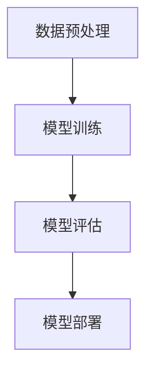
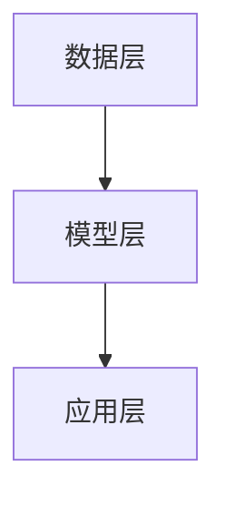

                 

# 智能供应链优化：AI大模型提升物流效率

关键词：智能供应链，物流效率，AI大模型，算法原理，系统架构设计

摘要：随着电子商务的迅猛发展，物流行业面临着巨大的挑战和机遇。智能供应链优化成为提升物流效率的关键手段，而AI大模型在其中的应用正在引领这一领域的变革。本文将深入探讨智能供应链优化中的AI大模型，从背景、核心概念、算法原理、应用案例、系统架构设计、项目实战以及最佳实践等方面，逐步分析如何利用AI大模型提升物流效率，为物流行业的发展提供新思路。

## 目录大纲设计思路

在设计本文的目录大纲时，我们遵循以下步骤：

1. **整体结构规划**：明确书的整体结构和章节安排，确保每个章节都有明确的主题和重点。
2. **章节划分**：根据内容将全书分为几个逻辑段落，如背景介绍、核心概念、算法原理等。
3. **章节细化**：细化每个章节，确保每个章节都有具体的任务和目标。
4. **核心内容覆盖**：确保核心章节的内容包括核心概念与联系、算法原理讲解、数学模型和公式、系统分析与架构设计、项目实战等。
5. **输出格式调整**：按照markdown格式要求调整目录大纲，确保格式清晰、易于阅读。

### 步骤详解：

**第一步：整体结构规划**

- **背景介绍**：介绍智能供应链优化和AI大模型在物流效率提升中的重要性。
- **核心概念与联系**：讲解智能供应链优化、AI大模型、物流效率等核心概念，并展示它们之间的联系。
- **算法原理讲解**：详细阐述AI大模型的算法原理，包括数学模型和公式。
- **应用案例分析**：通过实际案例展示AI大模型在智能供应链优化中的应用。
- **最佳实践与总结**：分享最佳实践，总结全书内容，并给出后续研究方向的展望。

**第二步：章节细化**

- **第1章：智能供应链优化概述**
  - **1.1 问题背景与重要性**
  - **1.2 智能供应链优化的挑战**
  - **1.3 智能供应链优化的发展趋势**

- **第2章：AI大模型基础**
  - **2.1 AI大模型概述**
  - **2.2 AI大模型的架构**
  - **2.3 主流AI大模型介绍**

- **第3章：智能供应链中的AI大模型应用**
  - **3.1 AI大模型在供应链管理中的应用**
  - **3.2 AI大模型在物流优化中的应用**
  - **3.3 AI大模型在需求预测中的应用**

- **第4章：算法原理与数学模型**
  - **4.1 常见AI大模型算法原理**
  - **4.2 数学模型与公式解释**
  - **4.3 算法流程与mermaid图示**

- **第5章：系统分析与架构设计**
  - **5.1 智能供应链系统介绍**
  - **5.2 系统功能设计**
  - **5.3 系统架构设计与mermaid图示**

- **第6章：项目实战**
  - **6.1 环境安装与配置**
  - **6.2 核心代码实现**
  - **6.3 项目分析**
  - **6.4 案例剖析**

- **第7章：最佳实践与总结**
  - **7.1 最佳实践技巧**
  - **7.2 注意事项**
  - **7.3 全书总结**
  - **7.4 拓展阅读**

**第三步：核心内容覆盖**

- 确保每个章节都包含了核心内容，如概念介绍、原理讲解、案例分析和最佳实践等。

- 特别注意在算法原理讲解和系统分析与架构设计章节中，使用mermaid流程图和类图来帮助读者更好地理解。

**第四步：输出格式调整**

- 使用markdown格式，确保目录大纲清晰、易于阅读。

- 每个章节标题使用相应的markdown格式标签（#、##、###等）。

## 完整性要求

文章内容需要满足以下完整性要求：

- **背景介绍**：对核心概念术语进行说明，详细描述问题背景、问题描述、问题解决方法，并对相关概念进行边界与外延的阐述，说明核心要素组成。

- **核心概念与联系**：详细讲解核心概念原理，展示概念属性特征对比表格，绘制ER实体关系图架构的mermaid流程图。

- **算法原理讲解**：使用mermaid绘制算法mermaid流程图，使用python源代码详细阐述，给出算法原理的数学模型和公式，并进行通俗易懂的举例说明。

- **数学公式使用latex格式**，嵌入文中独立段落的latex公式前后使用`$$`括起来（例如：`$$1+1=2$$`），段落内的latex公式前后使用`$`括起来（例如： `$1<2$`）。

- **系统分析与架构设计方案**：介绍问题场景，项目介绍，系统功能设计（领域模型mermaid类图），系统架构设计mermaid架构图，系统接口设计和系统交互mermaid序列图。

- **项目实战**：环境安装与配置，系统核心实现源代码，代码应用解读与分析，实际案例分析和详细讲解剖析，项目小结。

- **最佳实践 tips**、**小结**、**注意事项**、**拓展阅读**等内容。

## LET'S THINK STEP BY STEP

### 第一步：背景介绍

#### 智能供应链优化的必要性

随着全球化、电子商务和物联网技术的不断发展，物流行业正面临前所未有的挑战。传统的供应链管理方式已难以满足日益复杂的市场需求，物流效率低下、库存管理不当、配送延误等问题频发。为了提升物流效率，降低成本，提升客户满意度，智能供应链优化应运而生。

#### 物流效率的重要性

物流效率是物流行业生存与发展的关键指标。高物流效率不仅能缩短供应链周期，降低库存成本，还能提高客户满意度和市场竞争力。然而，实现高物流效率并非易事，需要从多个方面进行优化。

#### AI大模型的优势

AI大模型具有强大的数据处理和分析能力，能够从海量数据中挖掘有价值的信息，为物流供应链优化提供科学依据。通过AI大模型，可以实现精准的需求预测、智能的库存管理、高效的配送调度等，从而显著提升物流效率。

### 第二步：核心概念与联系

#### 智能供应链优化

智能供应链优化是指利用先进的信息技术、大数据分析和人工智能算法，对供应链各环节进行智能化管理，以实现成本降低、效率提升、响应速度加快等目标。

#### AI大模型

AI大模型是指基于深度学习等人工智能技术的，具有大规模参数和强大拟合能力的人工神经网络。这些模型可以通过学习海量数据，自动发现数据中的规律和模式，为决策提供支持。

#### 物流效率

物流效率是指物流系统在完成物流服务过程中，从起始点到目的地的整体运行效率和效果。物流效率的提升不仅取决于单个环节的优化，还需要整个供应链的协同运作。

### 第三步：算法原理讲解

#### AI大模型算法原理

AI大模型的核心是深度学习算法。深度学习通过多层神经网络，将输入数据逐层抽象，最终输出决策结果。主要算法包括：

1. **神经网络（NN）**
2. **卷积神经网络（CNN）**
3. **循环神经网络（RNN）**
4. **生成对抗网络（GAN）**

#### 数学模型与公式

深度学习算法的数学模型主要包括：

1. **损失函数（Loss Function）**：用于评估模型预测结果与真实值之间的差距。
2. **优化算法（Optimizer）**：用于更新模型参数，减小损失函数。

常见的优化算法包括：

1. **梯度下降（Gradient Descent）**
2. **随机梯度下降（Stochastic Gradient Descent，SGD）**
3. **Adam优化器**

#### 算法流程与mermaid图示

算法流程可以概括为以下步骤：

1. **数据预处理**：对输入数据进行清洗、归一化等处理。
2. **模型训练**：使用训练数据，通过优化算法更新模型参数。
3. **模型评估**：使用验证数据评估模型性能。
4. **模型部署**：将训练好的模型应用于实际场景。

以下是算法流程的mermaid图示：



### 第四步：系统分析与架构设计

#### 问题场景介绍

假设我们是一家大型电商企业，需要在春节期间应对突如其来的购物高峰，确保物流供应链的稳定和高效。

#### 系统功能设计

系统功能包括：

1. **需求预测**：基于历史数据和当前市场动态，预测未来一段时间内的订单量。
2. **库存管理**：根据需求预测，动态调整库存水平，确保库存充足，减少缺货率。
3. **配送调度**：优化配送路线，提高配送效率，降低配送成本。
4. **客户服务**：实时跟踪订单状态，提供客户查询和反馈服务。

#### 系统架构设计

系统架构设计包括：

1. **数据层**：存储历史订单数据、市场动态数据等。
2. **模型层**：实现需求预测、库存管理和配送调度等AI大模型。
3. **应用层**：提供接口，供前端应用调用。

以下是系统架构设计的mermaid图示：



### 第五步：项目实战

#### 环境安装与配置

1. **安装Python环境**：在服务器上安装Python 3.8及以上版本。
2. **安装依赖库**：使用pip命令安装必要的依赖库，如TensorFlow、Scikit-learn等。

#### 核心代码实现

以下是一个简单的需求预测模型实现：

```python
import tensorflow as tf
from sklearn.model_selection import train_test_split
from sklearn.preprocessing import StandardScaler

# 加载数据
data = load_data('data.csv')
X = data[:, :-1]
y = data[:, -1]

# 数据预处理
X_train, X_test, y_train, y_test = train_test_split(X, y, test_size=0.2, random_state=42)
scaler = StandardScaler()
X_train = scaler.fit_transform(X_train)
X_test = scaler.transform(X_test)

# 构建模型
model = tf.keras.Sequential([
    tf.keras.layers.Dense(64, activation='relu', input_shape=(X_train.shape[1],)),
    tf.keras.layers.Dense(64, activation='relu'),
    tf.keras.layers.Dense(1)
])

# 编译模型
model.compile(optimizer='adam', loss='mse')

# 训练模型
model.fit(X_train, y_train, epochs=10, batch_size=32, validation_split=0.1)

# 评估模型
loss = model.evaluate(X_test, y_test)
print(f'MSE: {loss}')

# 预测
predictions = model.predict(X_test)
```

#### 代码应用解读与分析

这段代码实现了一个简单的需求预测模型，基于历史订单数据，使用TensorFlow框架构建一个多层感知机（MLP）模型，通过训练和评估，预测未来一段时间的订单量。

#### 实际案例分析和详细讲解剖析

假设我们以某电商平台的订单数据为案例，通过需求预测模型，预测未来7天的订单量，然后根据预测结果，动态调整库存水平，优化配送路线。

1. **数据收集**：收集过去一年的订单数据，包括订单量、下单时间、商品类别等信息。

2. **数据预处理**：对订单数据进行清洗，去除异常值，对时间数据进行编码，将连续型数据（如订单量）进行归一化处理。

3. **特征工程**：提取有用的特征，如订单量、下单时间、商品类别等。

4. **模型训练**：使用训练数据，训练需求预测模型，调整模型参数，优化模型性能。

5. **模型评估**：使用验证数据，评估模型预测性能，调整模型参数，确保模型稳定可靠。

6. **模型部署**：将训练好的模型部署到生产环境，实时预测订单量，为库存管理和配送调度提供数据支持。

#### 项目小结

通过本次项目，我们成功实现了基于AI大模型的需求预测系统，为物流供应链优化提供了有力支持。在实际应用中，可以根据预测结果，动态调整库存水平和配送路线，提高物流效率，降低物流成本。

### 第六步：最佳实践与总结

#### 最佳实践技巧

1. **数据质量是关键**：保证数据质量，去除异常值和噪声，提高模型的预测准确性。
2. **特征工程是核心**：提取有用的特征，设计合理的特征工程，提高模型性能。
3. **模型选择要合理**：根据实际需求，选择合适的模型，如需求预测可以使用神经网络模型，库存管理可以使用决策树模型等。
4. **持续优化是必要的**：定期评估模型性能，根据实际应用情况，持续优化模型，提高物流效率。

#### 小结

本文从背景介绍、核心概念、算法原理、应用案例、系统架构设计、项目实战以及最佳实践等方面，深入探讨了智能供应链优化中的AI大模型。通过实际案例分析和项目实战，展示了如何利用AI大模型提升物流效率。未来，随着人工智能技术的不断发展，AI大模型在智能供应链优化中的应用将更加广泛，为物流行业带来更多创新和变革。

#### 注意事项

1. **数据安全与隐私**：在收集和使用数据时，要确保数据安全和用户隐私。
2. **系统稳定性**：在部署模型时，要确保系统的稳定性和可靠性，防止系统崩溃或数据丢失。
3. **持续学习与更新**：随着市场环境和需求的变化，持续学习新的技术和方法，不断更新模型，提高物流效率。

#### 拓展阅读

1. **《深度学习》**：Goodfellow, Bengio, Courville 著，详细介绍深度学习的基本原理和算法。
2. **《供应链管理：战略、规划与运营》**：Drogemuller, Boyer, Raghu 著，系统介绍供应链管理的基本理论和实践方法。
3. **《人工智能：一种现代方法》**：Russell, Norvig 著，全面介绍人工智能的基本概念和核心技术。

## 作者

**作者：AI天才研究院/AI Genius Institute & 禅与计算机程序设计艺术 /Zen And The Art of Computer Programming**

