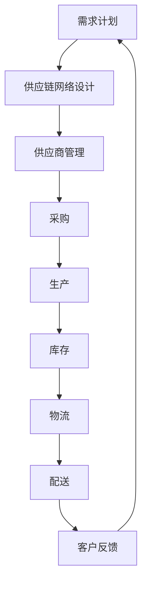
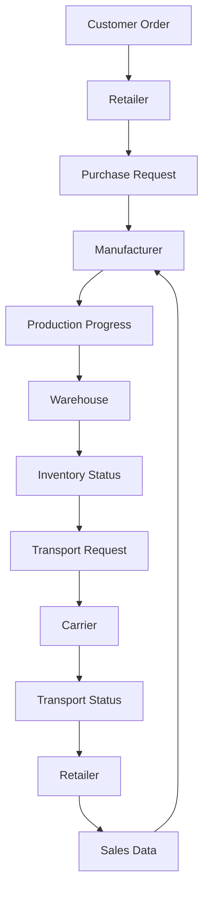
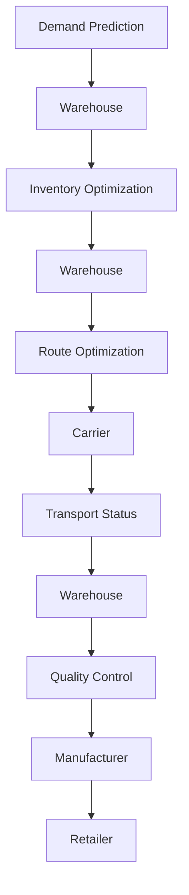
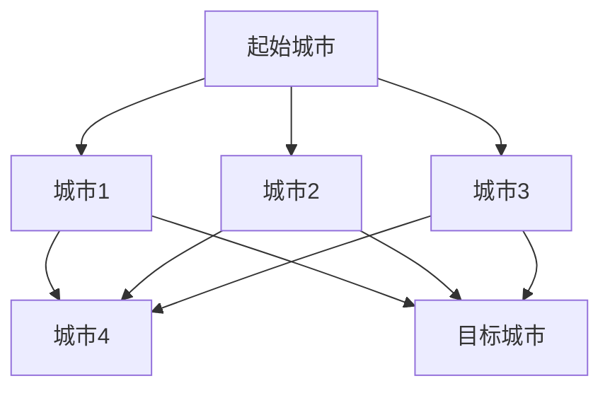
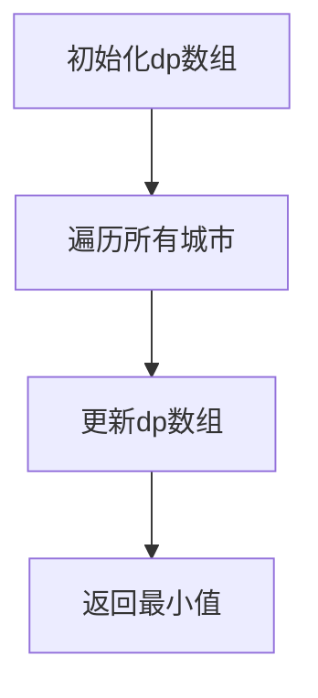

                 


### 《智能供应链管理：大数据优化库存与物流》

关键词：智能供应链管理、大数据、库存优化、物流优化、供应链技术

摘要：本文将深入探讨智能供应链管理的核心概念、大数据在其中的应用，以及如何通过大数据技术优化库存和物流。通过详细的案例分析、算法原理讲解和项目实战，本文旨在为读者提供实用的指导，帮助他们在供应链管理领域取得成功。

#### 目录

**第一部分：引言**

1.1 智能供应链管理概述  
1.1.1 智能供应链的概念与发展历程  
1.1.2 大数据在智能供应链管理中的作用  
1.2 大数据优化库存与物流  
1.2.1 库存管理的挑战与大数据的机遇  
1.2.2 物流优化与大数据分析  
1.3 书籍结构安排与学习目标

**第二部分：核心概念与联系**

2.1 智能供应链中的核心概念  
2.1.1 供应链管理的基本概念  
2.1.2 智能供应链的关键技术  
2.2 概念实体之间的关系架构

**第三部分：大数据优化库存**

3.1 大数据技术在库存管理中的应用  
3.1.1 库存管理的挑战  
3.1.2 大数据优化库存的策略与方法  
3.2 库存管理中的关键算法原理  
3.3 数学模型和数学公式

**第四部分：大数据优化物流**

4.1 物流优化与大数据分析  
4.1.1 物流优化的挑战  
4.1.2 大数据优化物流的策略与方法  
4.2 物流管理中的关键算法原理  
4.3 数学模型和数学公式

**第五部分：项目实战**

5.1 智能供应链管理项目实战  
5.2 代码实际案例和详细解释说明  
5.3 智能供应链管理实战中的挑战与解决方案

**第六部分：展望与未来趋势**

6.1 智能供应链管理的发展趋势  
6.2 智能供应链管理的未来挑战与机遇

---

### 引言

智能供应链管理是现代企业管理中不可或缺的一部分。随着全球化和信息化进程的加速，供应链管理正面临着前所未有的挑战和机遇。大数据技术的兴起为供应链管理带来了新的工具和方法，使得企业能够更有效地优化库存和物流，提高运营效率。

#### 1.1 智能供应链管理概述

智能供应链管理是指利用先进的信息技术，包括大数据、人工智能、物联网等，对供应链进行全方位的监控、分析和优化。其核心目标是实现供应链的智能化、透明化和高效化。

- **智能供应链的概念**：智能供应链管理不仅仅是简单的供应链管理，它融合了人工智能、物联网、云计算等前沿技术，使得供应链管理更加智能化。

- **智能供应链的发展历程**：从传统的供应链管理到现代的智能供应链管理，经历了多个阶段的发展。大数据技术的引入是智能供应链管理的一个重要里程碑。

#### 1.2 大数据在智能供应链管理中的作用

大数据技术在智能供应链管理中扮演着至关重要的角色。通过大数据分析，企业可以更好地理解市场需求、优化库存、提高物流效率。

- **大数据优化库存**：通过大数据分析，企业可以预测市场需求，优化库存水平，减少库存成本。

- **大数据优化物流**：大数据可以帮助企业优化物流路线，提高运输效率，降低物流成本。

#### 1.3 书籍结构安排与学习目标

本书分为六个部分，旨在为读者提供全面、系统的智能供应链管理知识。

- **第一部分：引言**：介绍智能供应链管理的基本概念和大数据在其中的作用。

- **第二部分：核心概念与联系**：详细讲解智能供应链中的核心概念，以及它们之间的关系。

- **第三部分：大数据优化库存**：探讨大数据技术在库存管理中的应用和关键算法原理。

- **第四部分：大数据优化物流**：分析大数据在物流优化中的作用和关键算法原理。

- **第五部分：项目实战**：通过实际案例，展示如何应用智能供应链管理技术。

- **第六部分：展望与未来趋势**：探讨智能供应链管理的未来发展方向和挑战。

通过本书的学习，读者将能够：

- 理解智能供应链管理的核心概念和作用。

- 掌握大数据技术在库存和物流优化中的应用。

- 通过项目实战，提升实际操作能力。

---

接下来，我们将逐步深入探讨智能供应链管理中的核心概念、大数据技术、库存和物流优化策略，以及实际项目中的应用，帮助读者全面了解并掌握智能供应链管理的知识和技能。在每一个部分，我们都会采用“LET'S THINK STEP BY STEP”的方式进行详细分析和讲解，确保读者能够系统地理解和应用所学知识。 ### 第一部分：引言

#### 1.1 智能供应链管理概述

智能供应链管理是现代企业管理中的一个关键领域，它不仅涵盖了传统的供应链管理功能，如采购、生产、库存、运输和配送，还融合了人工智能、大数据分析、云计算和物联网等前沿技术，以实现供应链的智能化、透明化和高效化。智能供应链管理的核心目标是优化供应链的各个环节，降低成本、提高响应速度和客户满意度。

**智能供应链的概念**

智能供应链管理是指通过应用人工智能、大数据分析、物联网和云计算等技术，对供应链的各个环节进行智能化管理。它不仅关注供应链的物流和信息流，还注重供应链的金融流和资金流，使得整个供应链能够更加灵活、高效和可持续。

**智能供应链的发展历程**

智能供应链管理的发展可以分为以下几个阶段：

1. **传统供应链管理**：在这个阶段，供应链管理主要依赖于人工和纸质记录，效率低下，信息滞后。

2. **信息化供应链管理**：随着计算机技术和网络技术的发展，供应链管理开始采用电子化的方式进行信息处理和传递，提高了效率。

3. **数字化供应链管理**：在数字化阶段，供应链管理开始引入大数据、云计算和物联网技术，使得供应链信息更加实时、准确和全面。

4. **智能化供应链管理**：当前，智能供应链管理正在成为主流。通过人工智能技术，供应链管理可以实现自动化决策和优化，提高了供应链的灵活性和响应速度。

**大数据在智能供应链管理中的作用**

大数据技术在智能供应链管理中发挥着至关重要的作用。通过大数据分析，企业可以：

1. **预测市场需求**：通过对历史销售数据、市场趋势和消费者行为进行分析，企业可以更准确地预测市场需求，从而优化库存水平。

2. **优化库存管理**：大数据分析可以帮助企业识别库存瓶颈，降低库存成本，提高库存周转率。

3. **优化物流**：通过分析物流数据，企业可以优化运输路线，提高运输效率，降低物流成本。

4. **提高供应链透明度**：大数据技术使得供应链各个环节的信息更加透明，有助于提高供应链的可视化和可控性。

#### 1.2 大数据优化库存与物流

**库存管理的挑战与大数据的机遇**

传统的库存管理主要依赖于历史数据和经验，往往难以应对市场变化和需求波动。大数据技术的引入为库存管理带来了新的机遇：

1. **需求预测**：通过分析历史销售数据、市场趋势和消费者行为，大数据技术可以更准确地预测市场需求，帮助企业制定合理的库存策略。

2. **库存优化**：大数据分析可以帮助企业识别库存瓶颈，优化库存结构，降低库存成本。

3. **库存周转率**：大数据技术可以实时监测库存情况，提高库存周转率，减少资金占用。

**物流优化与大数据分析**

物流优化是智能供应链管理中的重要环节。大数据分析在物流优化中具有重要作用：

1. **路径优化**：通过分析历史物流数据，大数据技术可以帮助企业选择最优的物流路径，降低运输成本。

2. **运输调度**：大数据分析可以帮助企业优化运输调度，提高运输效率，减少延迟。

3. **库存优化**：物流数据的分析可以帮助企业更好地管理库存，减少库存积压和缺货现象。

**书籍结构安排与学习目标**

本书分为六个部分，旨在为读者提供全面、系统的智能供应链管理知识。具体章节安排如下：

- **第一部分：引言**：介绍智能供应链管理的基本概念和大数据在其中的作用。
- **第二部分：核心概念与联系**：详细讲解智能供应链中的核心概念，以及它们之间的关系。
- **第三部分：大数据优化库存**：探讨大数据技术在库存管理中的应用和关键算法原理。
- **第四部分：大数据优化物流**：分析大数据在物流优化中的作用和关键算法原理。
- **第五部分：项目实战**：通过实际案例，展示如何应用智能供应链管理技术。
- **第六部分：展望与未来趋势**：探讨智能供应链管理的未来发展方向和挑战。

通过本书的学习，读者将能够：

- 理解智能供应链管理的核心概念和作用。
- 掌握大数据技术在库存和物流优化中的应用。
- 通过项目实战，提升实际操作能力。

### 第二部分：核心概念与联系

#### 2.1 智能供应链中的核心概念

智能供应链管理涉及多个核心概念，包括供应链管理、大数据、人工智能、云计算和物联网。理解这些核心概念及其相互关系对于掌握智能供应链管理的原理和实践至关重要。

##### 2.1.1 供应链管理的基本概念

**供应链管理**（Supply Chain Management, SCM）是指对供应链中各个环节进行有效管理和协调，以实现从原材料采购到产品交付给最终用户的整个过程。供应链管理包括以下几个关键组成部分：

1. **采购**：涉及原材料的采购和供应商管理。
2. **生产**：涉及生产计划、生产控制和生产效率优化。
3. **库存**：涉及库存管理、库存控制和库存优化。
4. **运输**：涉及运输路线规划、运输工具选择和运输成本控制。
5. **配送**：涉及产品从仓库到最终用户的配送服务。

**供应链与价值链的关系**

供应链和价值链是相互关联的概念。供应链是价值链的物理层面，涉及产品从原材料到最终产品的流动。而价值链则关注创造价值的整个过程，包括供应链的各个环节。

**供应链的五大核心流程**

1. **需求规划**：预测市场需求，制定销售和运营计划。
2. **供应链网络设计**：设计最优的供应链网络，包括仓库位置、运输路线等。
3. **供应商管理**：选择和管理供应商，确保供应链的稳定性和质量。
4. **生产计划和控制**：制定生产计划，监控生产进度，确保按时交付。
5. **物流和配送**：优化物流和配送过程，提高运输效率和客户满意度。

##### 2.1.2 智能供应链的关键技术

智能供应链管理融合了多种前沿技术，包括大数据、人工智能、云计算和物联网。这些技术的应用极大地提升了供应链的智能化和效率。

1. **大数据**：大数据技术通过收集、存储和分析海量数据，帮助供应链管理实现更精准的预测和优化。
2. **人工智能**：人工智能技术，如机器学习和深度学习，可以自动化决策过程，提高供应链的灵活性和响应速度。
3. **云计算**：云计算提供了弹性的计算资源和存储能力，使得供应链管理可以实现全球范围内的实时数据共享和协同作业。
4. **物联网**：物联网技术通过传感器和设备互联，实现供应链各环节的实时监控和数据采集，提高了供应链的透明度和可控性。

#### 2.2 概念实体之间的关系架构

为了更好地理解智能供应链中的核心概念，我们可以通过实体关系图来展示它们之间的关系。

```mermaid
erDiagram
    class 供应链管理 |->| 采购
    供应链管理 |->| 生产
    供应链管理 |->| 库存
    供应链管理 |->| 运输
    供应链管理 |->| 配送
    供应链管理 |->| 需求规划
    供应链管理 |->| 供应链网络设计
    供应链管理 |->| 供应商管理
    供应链管理 |->| 生产计划和控制
    供应链管理 |->| 物流和配送
    采购 |->| 供应商
    生产 |->| 产品
    库存 |->| 库存记录
    运输 |->| 运输路径
    配送 |->| 客户
    需求规划 |->| 需求预测
    供应链网络设计 |->| 仓库位置
    供应商管理 |->| 供应商绩效
    生产计划和控制 |->| 生产进度
    物流和配送 |->| 配送服务
```

**供应链中的信息流与物流**

供应链中的信息流与物流是相互关联的，信息流为物流提供了指导和决策支持。以下是供应链中的信息流与物流的关系架构：



在上述信息流与物流的关系架构中：

- **需求计划**：由市场部门或销售部门根据市场需求进行预测，制定采购和生产计划。
- **供应链网络设计**：根据需求计划，设计最优的供应链网络，包括仓库位置和运输路径。
- **供应商管理**：管理供应商，确保供应链的稳定性和质量。
- **采购**：根据供应链网络设计和供应商管理，进行原材料采购。
- **生产**：根据采购的原材料和需求计划，进行生产。
- **库存**：管理库存水平，确保生产过程中原材料和成品的充足。
- **物流**：根据供应链网络设计，优化运输路径，确保产品及时配送。
- **配送**：将产品从仓库配送至客户手中。
- **客户反馈**：收集客户反馈，用于需求计划的修正和改进。

通过上述关系架构，我们可以看到智能供应链管理中的各个实体和流程是如何相互联系和协作的。

#### 2.2.1 物流信息流分析

物流信息流分析是智能供应链管理中的一个重要环节，它涉及到物流过程中产生的各种数据和信息。通过对物流信息流的分析，企业可以优化物流流程，提高物流效率。

1. **物流信息流定义**：物流信息流是指物流过程中产生的所有信息，包括订单信息、运输信息、库存信息等。
2. **物流信息流来源**：物流信息流来源于供应链的各个环节，包括供应商、生产商、仓库、运输公司和最终客户。
3. **物流信息流分析**：通过大数据分析技术，对物流信息流进行分析，可以识别物流瓶颈，优化运输路径，提高库存周转率。

**物流信息流分析案例**

假设一家制造企业需要从多个供应商采购原材料，并通过多个仓库进行库存管理，然后通过运输公司将原材料运送到生产工厂。以下是物流信息流分析的一个案例：

1. **订单信息**：销售部门收到订单后，将订单信息发送给采购部门。
2. **采购信息**：采购部门根据订单信息，向供应商发出采购请求。
3. **运输信息**：供应商将原材料通过运输公司运送到企业仓库。
4. **库存信息**：仓库管理人员根据运输信息，更新库存记录。
5. **生产信息**：生产部门根据库存信息，制定生产计划，安排生产。
6. **配送信息**：生产完成后，将成品通过运输公司运送到客户手中。

通过对物流信息流的分析，企业可以发现物流过程中的瓶颈和潜在问题，例如运输延迟、库存积压等，从而采取措施进行优化。

#### 2.2.2 供应链信息流分析

供应链信息流分析是智能供应链管理中的另一个关键环节，它关注供应链各环节之间的信息传递和协调。通过对供应链信息流的分析，企业可以优化供应链的运作效率，提高供应链的响应速度。

1. **供应链信息流定义**：供应链信息流是指供应链各环节之间的信息传递和协调，包括订单信息、生产信息、库存信息、物流信息等。
2. **供应链信息流来源**：供应链信息流来源于供应链的各个环节，包括供应商、制造商、分销商、零售商和最终客户。
3. **供应链信息流分析**：通过大数据分析技术，对供应链信息流进行分析，可以识别供应链瓶颈，优化供应链流程，提高供应链的协同效率。

**供应链信息流分析案例**

假设一家零售企业从多个供应商采购商品，通过分销中心进行库存管理，然后通过零售店销售商品。以下是供应链信息流分析的一个案例：

1. **订单信息**：零售店的销售人员根据客户需求，向分销中心发送订单信息。
2. **采购信息**：分销中心根据订单信息，向供应商发出采购请求。
3. **生产信息**：供应商根据采购信息，安排生产或采购商品。
4. **库存信息**：分销中心根据采购和订单信息，更新库存记录。
5. **物流信息**：分销中心将商品通过运输公司运送到零售店。
6. **销售信息**：零售店根据物流信息，进行商品上架和销售。
7. **客户反馈**：零售店的销售人员收集客户反馈，用于改进供应链流程。

通过对供应链信息流的分析，企业可以发现供应链中的信息延迟和协调问题，从而采取措施进行优化。

#### 2.2.3 智能供应链中的人工智能应用

人工智能技术在智能供应链管理中发挥着重要作用，可以自动化决策过程，提高供应链的灵活性和响应速度。

1. **预测需求**：通过机器学习算法，人工智能可以分析历史销售数据和消费者行为，预测未来市场需求，帮助企业制定合理的采购和生产计划。
2. **优化库存**：人工智能可以帮助企业实时监控库存水平，通过智能算法调整库存策略，减少库存积压和缺货现象。
3. **优化物流**：人工智能可以通过路径优化算法，选择最优的运输路线，提高运输效率，降低物流成本。
4. **质量控制**：人工智能可以通过图像识别和数据分析，实时监控产品质量，提高供应链的质量控制水平。

**机器学习在供应链优化中的应用**

机器学习在供应链优化中的应用包括：

1. **需求预测**：使用回归分析、时间序列分析和神经网络等机器学习算法，预测市场需求。
2. **库存优化**：使用优化算法，如线性规划和遗传算法，优化库存水平和库存结构。
3. **物流优化**：使用路径优化算法，如蚁群算法和遗传算法，优化运输路线和运输计划。

**深度学习在供应链管理中的作用**

深度学习在供应链管理中的应用包括：

1. **图像识别**：通过卷积神经网络（CNN），可以实现对供应链中的图像数据的自动识别，如产品识别、质量检测等。
2. **语音识别**：通过循环神经网络（RNN）和长短期记忆网络（LSTM），可以实现对供应链中的语音数据的自动识别，如订单处理、客服支持等。
3. **自然语言处理**：通过变换器-编码器-解码器（Transformer）模型，可以实现对供应链中的文本数据的自动处理，如合同审核、采购审批等。

**人工智能技术的持续演进**

人工智能技术正在不断演进，新的算法和应用不断涌现。例如，生成对抗网络（GAN）可以用于库存预测和供应链优化，强化学习可以用于供应链中的决策过程。随着人工智能技术的不断进步，智能供应链管理的效率和准确性将不断提高。

#### 2.2.4 大数据与供应链管理

大数据技术在供应链管理中的应用，使得供应链的各个环节能够更加精准和高效。以下是一些关键应用领域：

1. **需求预测**：通过大数据分析，企业可以更好地理解市场需求，预测销售趋势，从而优化库存和生产计划。
2. **库存管理**：大数据分析可以帮助企业实时监控库存水平，预测库存需求，优化库存结构，减少库存积压和缺货风险。
3. **物流优化**：通过对物流数据的分析，企业可以优化运输路线和运输计划，提高运输效率，降低物流成本。
4. **供应链可视化**：大数据技术可以实现供应链的实时监控和可视化，提高供应链的透明度和可控性。

**案例分析：某零售企业的供应链大数据应用**

某大型零售企业通过引入大数据技术，对其供应链进行了全面优化。以下是其应用案例：

1. **需求预测**：该零售企业利用大数据分析技术，对历史销售数据、市场趋势和消费者行为进行分析，准确预测市场需求，从而优化库存和生产计划。

2. **库存管理**：通过实时监控库存水平，该零售企业能够及时调整库存策略，减少库存积压和缺货现象，提高库存周转率。

3. **物流优化**：通过对物流数据的分析，该零售企业优化了运输路线和运输计划，提高了运输效率，降低了物流成本。

4. **供应链可视化**：该零售企业实现了供应链的实时监控和可视化，提高了供应链的透明度和可控性，使得供应链管理更加高效。

**大数据技术在供应链管理中的未来趋势**

随着大数据技术的不断发展和应用，大数据在供应链管理中的地位将越来越重要。以下是一些未来趋势：

1. **实时数据分析**：通过实时数据分析，企业可以更快地响应市场变化，优化供应链决策。
2. **预测性分析**：利用预测性分析，企业可以更准确地预测未来趋势，制定更科学的供应链策略。
3. **自动化决策**：通过自动化决策，企业可以减少人为干预，提高供应链的效率和准确性。
4. **全渠道整合**：大数据技术将帮助企业实现全渠道整合，提高供应链的协同效率。

**案例分析：某制造业企业的供应链大数据应用**

某大型制造业企业通过大数据技术，对其供应链进行了全面优化。以下是其应用案例：

1. **需求预测**：该制造业企业利用大数据分析技术，对市场趋势和消费者需求进行分析，准确预测市场需求，从而优化生产计划和原材料采购。

2. **库存管理**：通过实时监控库存水平，该制造业企业能够及时调整库存策略，减少库存积压和缺货风险，提高库存周转率。

3. **物流优化**：通过对物流数据的分析，该制造业企业优化了运输路线和运输计划，提高了运输效率，降低了物流成本。

4. **供应链可视化**：该制造业企业实现了供应链的实时监控和可视化，提高了供应链的透明度和可控性，使得供应链管理更加高效。

**总结**

大数据技术在供应链管理中的应用，使得企业能够更好地预测市场需求、优化库存和物流，提高供应链的效率和准确性。随着大数据技术的不断发展和应用，智能供应链管理将迎来更广阔的发展前景。企业应积极拥抱大数据技术，通过数据驱动的决策，实现供应链的智能化、透明化和高效化。

### 2.3 智能供应链中的人工智能应用

人工智能（AI）在智能供应链管理中的应用日益广泛，通过自动化的决策支持和优化算法，AI能够显著提升供应链的效率、灵活性和响应速度。以下是AI在智能供应链中的一些关键应用：

#### 2.3.1 机器学习在供应链优化中的应用

**需求预测**：机器学习算法，如线性回归、决策树和神经网络，可以分析历史销售数据、市场趋势和消费者行为，预测未来的需求。这些预测结果可以帮助企业制定更准确的采购和生产计划，减少库存过剩或缺货的风险。

**库存优化**：基于机器学习算法的库存优化系统可以实时监控库存水平，预测未来的库存需求，并自动调整库存策略。通过智能算法，企业可以实现库存的精准管理，减少库存成本，提高库存周转率。

**路径优化**：机器学习算法可以分析历史运输数据，优化运输路线和配送计划。通过优化算法，如遗传算法、蚁群算法和模拟退火算法，企业可以找到最优的运输路径，降低运输成本，提高运输效率。

**供应链绩效管理**：机器学习算法可以帮助企业监控和评估供应链的绩效，识别潜在的瓶颈和问题。通过持续的数据分析和模型优化，企业可以不断提升供应链的效率和可靠性。

**案例分析**：某大型零售企业通过引入机器学习算法，对其供应链进行了全面优化。通过需求预测模型，该企业能够更准确地预测市场需求，从而优化库存和生产计划。通过路径优化算法，该企业找到了最优的运输路线，降低了运输成本。通过库存优化系统，该企业实现了库存的精准管理，减少了库存积压和缺货现象。

#### 2.3.2 深度学习在供应链管理中的作用

**图像识别**：深度学习模型，如卷积神经网络（CNN），可以用于识别供应链中的图像数据。例如，在仓储管理中，CNN可以自动识别产品的质量，提高质量控制效率。

**语音识别**：通过深度学习模型，如循环神经网络（RNN）和长短期记忆网络（LSTM），可以实现对供应链中的语音数据的自动识别。例如，在订单处理和客户服务中，语音识别技术可以自动理解客户的订单和需求，提高订单处理速度和客户满意度。

**自然语言处理**：深度学习模型，如变换器-编码器-解码器（Transformer）模型，可以用于处理供应链中的文本数据。例如，在合同审核和采购审批中，自然语言处理技术可以自动分析合同内容，识别潜在的风险和问题，提高审批效率。

**案例应用**：某物流公司利用深度学习技术，对其仓储管理进行了优化。通过CNN，该企业可以自动识别产品的质量，提高了仓储管理的效率。通过RNN和LSTM，该企业可以自动处理客户的订单和需求，提高了订单处理速度和客户满意度。

#### 2.3.3 AI技术的持续演进

随着AI技术的不断演进，越来越多的AI应用将在智能供应链管理中发挥作用。以下是一些未来的发展趋势：

**生成对抗网络（GAN）**：GAN可以通过生成虚假数据，用于训练需求预测和库存优化模型，提高预测的准确性和鲁棒性。

**强化学习**：强化学习算法可以用于供应链中的决策过程，如运输调度和库存管理。通过不断学习和优化决策策略，强化学习可以提高供应链的灵活性和响应速度。

**多模态学习**：多模态学习可以将不同类型的数据（如文本、图像和语音）进行融合，提供更全面和准确的分析结果。例如，在供应链优化中，多模态学习可以结合销售数据和物流数据，提供更精准的需求预测和库存优化方案。

**智能合约**：智能合约是一种基于区块链技术的自动化合约执行机制。未来，智能合约可以与供应链管理系统集成，实现供应链过程的自动化和透明化。

**案例分析**：某制造企业通过引入GAN和强化学习技术，对其供应链进行了全面优化。通过GAN，该企业提高了需求预测的准确性和鲁棒性。通过强化学习，该企业优化了运输调度和库存管理，提高了供应链的灵活性和响应速度。

**总结**

人工智能技术在智能供应链管理中的应用，极大地提升了供应链的效率和准确性。随着AI技术的不断进步，智能供应链管理将变得更加智能和高效。企业应积极拥抱AI技术，通过数据驱动的决策和优化，实现供应链的智能化和数字化转型。

### 2.4 概念实体之间的关系架构

在智能供应链管理中，理解各概念实体之间的关系架构对于实现有效的管理和优化至关重要。以下通过实体关系图（ER图）和流程图（Mermaid）来展示这些关系。

#### 概念实体及其关系

首先，定义智能供应链管理中的核心实体：

1. **供应商（Supplier）**：提供原材料或服务的实体。
2. **制造商（Manufacturer）**：生产产品的实体。
3. **仓库（Warehouse）**：存储产品的实体。
4. **运输公司（Carrier）**：负责运输产品的实体。
5. **零售商（Retailer）**：销售产品的实体。
6. **客户（Customer）**：购买产品的实体。

以下是这些实体的ER图表示：

```mermaid
erDiagram
    Supplier ||--|{ Manufacturer }
    Manufacturer ||--|{ Warehouse }
    Warehouse ||--|{ Carrier }
    Carrier ||--|{ Retailer }
    Retailer ||--|{ Customer }
```

**供应链中的信息流与物流**

接下来，展示供应链中的信息流与物流的关系：

1. **订单信息（Order Information）**：订单从客户传递到零售商。
2. **采购信息（Purchase Information）**：采购请求从零售商传递到制造商。
3. **生产信息（Production Information）**：生产进度从制造商传递到仓库。
4. **库存信息（Inventory Information）**：库存状态从仓库传递到运输公司。
5. **运输信息（Transport Information）**：运输状态从运输公司传递到零售商。
6. **销售信息（Sales Information）**：销售数据从零售商传递回制造商。

以下是供应链信息流与物流的Mermaid流程图：



#### 供应链中的人工智能应用

人工智能在供应链管理中的应用，也涉及到多个实体之间的关系：

1. **需求预测（Demand Prediction）**：基于历史销售数据和消费者行为，由零售商或制造商进行。
2. **库存优化（Inventory Optimization）**：根据需求预测和库存状态，由仓库或零售商进行。
3. **路径优化（Route Optimization）**：根据运输信息和库存需求，由运输公司进行。
4. **质量控制（Quality Control）**：由制造商和零售商进行，确保产品符合质量标准。

以下是供应链中人工智能应用的Mermaid流程图：



通过上述实体关系图和流程图，我们可以清晰地看到智能供应链管理中的信息流、物流以及人工智能应用的架构和相互关系。这些工具不仅有助于理解智能供应链管理的运作机制，也为后续的算法分析和项目实施提供了基础。

### 第三部分：大数据优化库存

#### 3.1 大数据技术在库存管理中的应用

库存管理是企业运营中至关重要的一个环节，它直接关系到企业的资金周转、运营效率和客户满意度。随着大数据技术的不断发展，大数据在库存管理中的应用越来越广泛，为企业提供了更加精准和高效的库存管理手段。

##### 3.1.1 库存管理的挑战

传统的库存管理通常依赖于历史数据和经验，这种方法在面对市场需求变化、供应链波动和供应链环节复杂时，往往难以做到灵活应对。主要挑战包括：

1. **需求预测不准确**：市场需求的不确定性导致库存预测困难，经常出现库存过剩或缺货的情况。
2. **库存结构不合理**：库存结构不合理会导致库存积压和资金占用，影响企业的资金周转。
3. **库存管理效率低下**：传统的库存管理方式往往依赖于人工操作，效率较低，容易出现错误。
4. **供应链协同不足**：供应链各个环节之间的信息不畅通，导致库存管理缺乏整体视角，难以实现全局优化。

##### 3.1.2 大数据优化库存的策略与方法

大数据技术的引入为库存管理带来了新的机遇，通过数据分析和智能算法，可以优化库存管理，提高库存周转率和降低库存成本。以下是大数据优化库存的一些策略和方法：

1. **需求预测**：利用大数据分析技术，通过对历史销售数据、市场趋势和消费者行为进行分析，可以更准确地预测未来的市场需求。例如，使用回归分析、时间序列分析和机器学习算法（如决策树、随机森林和神经网络）进行需求预测。

2. **库存优化**：通过大数据分析，可以识别出库存中的瓶颈和问题，优化库存结构和库存水平。常用的方法包括基于规则的方法、优化算法（如线性规划和遗传算法）以及供应链仿真。

3. **库存优化算法**：利用优化算法，如线性回归、最小二乘法、动态规划等，可以建立数学模型，通过算法求解得到最优的库存策略。例如，利用动态规划算法，可以求解多阶段库存优化问题，实现库存水平的动态调整。

4. **供应链协同**：通过大数据分析，实现供应链各个环节之间的信息共享和协同管理。例如，使用区块链技术，可以确保供应链数据的透明性和可追溯性，提高供应链的整体效率。

5. **实时库存监控**：利用物联网技术和传感器，实现对库存状态的实时监控，及时发现问题并进行调整。例如，通过RFID技术，可以实时跟踪产品的库存状态，提高库存管理的准确性。

6. **数据可视化**：通过数据可视化技术，将库存数据以图表、仪表盘等形式展示出来，帮助管理层更好地理解和决策。例如，使用数据可视化工具（如Tableau、Power BI等），可以直观地展示库存趋势、异常情况等，辅助管理决策。

##### 3.1.3 数据驱动的库存预测模型

需求预测是库存管理的重要一环，通过大数据分析，可以构建数据驱动的库存预测模型，提高预测的准确性和可靠性。以下是一些常用的数据驱动库存预测模型：

1. **时间序列预测模型**：时间序列预测模型是一种基于历史时间序列数据进行分析和预测的方法。常用的模型包括移动平均法、指数平滑法、ARIMA模型和LSTM（长短期记忆网络）模型。移动平均法和指数平滑法简单易用，适用于平稳时间序列数据；ARIMA模型适用于具有自相关性的时间序列数据；LSTM模型具有记忆功能，适用于非线性时间序列数据。

2. **回归分析**：回归分析是一种常用的统计方法，通过建立因变量和自变量之间的关系模型，预测未来值。常用的回归分析方法包括线性回归、多项式回归和多元回归。

3. **机器学习模型**：机器学习模型通过训练数据集，学习数据中的模式和规律，从而预测未来值。常用的机器学习模型包括决策树、随机森林、K最近邻（KNN）和支持向量机（SVM）等。机器学习模型具有很好的泛化能力，可以处理复杂和非线性关系。

4. **集成模型**：集成模型通过结合多个模型的优势，提高预测的准确性和稳定性。常用的集成模型包括Bagging、Boosting和Stacking等。Bagging通过随机抽样生成多个模型，取平均预测结果；Boosting通过多次训练，逐步优化模型；Stacking通过将多个模型进行组合，生成最终预测结果。

**案例应用**

以下是一个基于LSTM模型进行库存预测的案例：

**需求**：某电子产品公司希望利用大数据技术，预测未来三个月的某型号手机销量，以便优化库存管理。

**数据来源**：公司过去一年的手机销量数据、市场趋势数据以及消费者行为数据。

**步骤**：

1. **数据预处理**：对原始数据进行清洗，包括缺失值处理、异常值检测和标准化处理。

2. **特征工程**：提取对销量有影响的特征，如季节性、促销活动、竞争对手销量等。

3. **模型训练**：使用LSTM模型对预处理后的数据进行训练，设置合适的参数，如神经元数量、学习速率等。

4. **模型评估**：使用验证集对模型进行评估，调整参数，提高模型准确性和稳定性。

5. **预测**：使用训练好的模型对未来的销量进行预测，生成销量预测图表。

**结果**：预测结果显示，未来三个月的销量将呈现波动趋势，公司可以根据预测结果，调整库存水平，减少库存积压和缺货风险。

通过上述案例，我们可以看到大数据技术在库存管理中的应用，不仅可以提高需求预测的准确性，还可以优化库存水平，降低库存成本，提高库存周转率。随着大数据技术的不断进步，未来库存管理将变得更加智能和高效。

#### 3.2 库存管理中的关键算法原理

在库存管理中，选择合适的算法对库存进行优化是确保供应链高效运行的关键。以下是几种常用的库存管理算法及其原理：

##### 3.2.1 时间序列分析

时间序列分析是一种基于历史数据，分析数据序列的时间分布特征和变化规律的方法。在库存管理中，时间序列分析主要用于预测未来的库存需求。以下是一些常用的时间序列分析模型：

**移动平均法（MA）**

移动平均法是一种简单的时间序列预测方法，通过对过去一段时间内的数据求平均值，预测未来的趋势。移动平均法分为简单移动平均（SMA）和加权移动平均（WMA）。

- **简单移动平均（SMA）**：对过去N个数据点求平均值。
  \[
  \text{SMA}(n) = \frac{\sum_{i=1}^{n} x_i}{n}
  \]
- **加权移动平均（WMA）**：对过去N个数据点赋予不同的权重，通常近期的数据权重较大。
  \[
  \text{WMA}(n) = \sum_{i=1}^{n} w_i \cdot x_i
  \]
其中，\(w_i\) 为第 \(i\) 个数据点的权重。

**指数平滑法（ES）**

指数平滑法是一种加权移动平均的改进方法，通过给不同的数据点赋予递减的权重，强调近期数据的重要性。指数平滑法包括一次指数平滑（单层ES）、二次指数平滑（双层ES）和三次指数平滑（三层ES）。

- **一次指数平滑**（Single Exponential Smoothing）：
  \[
  \text{ETS}(t) = \alpha \cdot x_t + (1 - \alpha) \cdot \text{ETS}(t-1)
  \]
  其中，\(\alpha\) 是平滑系数，\(0 < \alpha < 1\)。

- **二次指数平滑**（Double Exponential Smoothing）：
  \[
  \text{ETS}(\text{level}, t) = \alpha \cdot x_t + (1 - \alpha) \cdot \text{ETS}(\text{level}, t-1)
  \]
  \[
  \text{ETS}(\text{trend}, t) = \beta \cdot (\text{ETS}(\text{level}, t) - \text{ETS}(\text{level}, t-1)) + (1 - \beta) \cdot \text{ETS}(\text{trend}, t-1)
  \]
  其中，\(\beta\) 是趋势系数，\(0 < \beta < 1\)。

- **三次指数平滑**（Triple Exponential Smoothing）：
  类似于二次指数平滑，但引入季节性成分。

**ARIMA模型**

ARIMA（自回归积分滑动平均模型）是一种经典的时间序列预测模型，通过自回归（AR）、差分（I）和移动平均（MA）三个步骤来建模。

- **自回归（AR）**：
  \[
  \phi(B) \cdot \text{Xt} = \theta(B) \cdot \text{Et} + \text{Xt-1} + \text{Xt-2} + \ldots
  \]
  其中，\(\phi(B)\) 和 \(\theta(B)\) 是多项式。

- **差分（I）**：对时间序列进行差分，使其变为平稳序列。
  \[
  \text{Dt} = \text{Xt} - \text{Xt-1}
  \]

- **移动平均（MA）**：
  \[
  \text{Xt} = \theta(B) \cdot \text{Et} + \text{Et-1} + \text{Et-2} + \ldots
  \]

**LSTM模型**

LSTM（长短期记忆网络）是一种深度学习模型，专门用于处理序列数据，具有记忆长期依赖性的能力。LSTM通过多个门控单元（输入门、遗忘门和输出门）来控制信息的流动。

- **输入门**：
  \[
  i_t = \sigma(W_i \cdot [h_{t-1}, x_t] + b_i)
  \]
  \[
  f_t = \sigma(W_f \cdot [h_{t-1}, x_t] + b_f)
  \]
  \[
  g_t = \tanh(W_g \cdot [h_{t-1}, x_t] + b_g)
  \]

- **遗忘门**：
  \[
  \text{C}_{t-1} = f_t \odot \text{C}_{t-1}
  \]

- **输入门**：
  \[
  \text{C}_{t} = \text{C}_{t-1} + i_t \odot g_t
  \]

- **输出门**：
  \[
  o_t = \sigma(W_o \cdot [h_{t-1}, \text{C}_{t}] + b_o)
  \]
  \[
  h_t = o_t \odot \tanh(\text{C}_{t})
  \]

#### 3.2.2 时间序列分析案例

假设某电商平台的月销售额数据如下表所示，我们使用LSTM模型进行时间序列预测。

| 月份 | 销售额（万元） |
|------|--------------|
| 1    | 150          |
| 2    | 180          |
| 3    | 200          |
| 4    | 220          |
| 5    | 250          |
| 6    | 260          |
| 7    | 280          |
| 8    | 300          |
| 9    | 320          |
| 10   | 340          |

**步骤**：

1. **数据预处理**：

   - 数据标准化：将销售额数据进行归一化处理。
   - 序列分割：将数据分为训练集和测试集。

2. **模型训练**：

   - 设置LSTM模型的参数，如神经元数量、学习速率等。
   - 使用训练集训练LSTM模型。

3. **模型评估**：

   - 使用测试集对模型进行评估，调整参数。
   - 分析预测结果。

**代码实现**：

```python
import numpy as np
import pandas as pd
from sklearn.preprocessing import MinMaxScaler
from keras.models import Sequential
from keras.layers import LSTM, Dense

# 加载数据
data = pd.read_csv('sales_data.csv')
sales = data['销售额'].values

# 数据标准化
scaler = MinMaxScaler(feature_range=(0, 1))
sales_scaled = scaler.fit_transform(sales.reshape(-1, 1))

# 切分数据
time_steps = 1
X, y = [], []
for i in range(time_steps, len(sales_scaled)):
    X.append(sales_scaled[i - time_steps:])
    y.append(sales_scaled[i])
X, y = np.array(X), np.array(y)

# 模型构建
model = Sequential()
model.add(LSTM(units=50, return_sequences=True, input_shape=(time_steps, 1)))
model.add(LSTM(units=50))
model.add(Dense(1))

model.compile(optimizer='adam', loss='mean_squared_error')
model.fit(X, y, epochs=100, batch_size=32, validation_split=0.2)

# 预测
predictions = model.predict(X)
predictions = scaler.inverse_transform(predictions)

# 结果分析
plt.plot(y, label='真实值')
plt.plot(predictions, label='预测值')
plt.legend()
plt.show()
```

通过上述案例，我们可以看到LSTM模型在时间序列预测中的应用。LSTM模型能够捕捉数据中的长期依赖关系，提高预测的准确性。

##### 3.2.3 预测算法的Python源代码实现

以下是一个基于Python实现的时间序列预测的案例，使用LSTM模型进行库存预测。

**需求**：预测某电商平台的未来一个月的销售额。

**数据集**：历史销售额数据。

**步骤**：

1. **数据预处理**：

   - 数据清洗：去除缺失值和异常值。
   - 数据标准化：将销售额数据进行归一化处理。

2. **模型构建**：

   - 构建LSTM模型。
   - 设置模型参数。

3. **模型训练**：

   - 使用训练数据进行训练。
   - 使用验证数据进行验证。

4. **模型评估**：

   - 使用测试数据进行评估。

5. **预测**：

   - 对未来的销售额进行预测。

**代码实现**：

```python
import numpy as np
import pandas as pd
from sklearn.preprocessing import MinMaxScaler
from keras.models import Sequential
from keras.layers import LSTM, Dense

# 加载数据
data = pd.read_csv('sales_data.csv')
sales = data['销售额'].values

# 数据标准化
scaler = MinMaxScaler(feature_range=(0, 1))
sales_scaled = scaler.fit_transform(sales.reshape(-1, 1))

# 切分数据
time_steps = 1
X, y = [], []
for i in range(time_steps, len(sales_scaled)):
    X.append(sales_scaled[i - time_steps:])
    y.append(sales_scaled[i])
X, y = np.array(X), np.array(y)

# 模型构建
model = Sequential()
model.add(LSTM(units=50, return_sequences=True, input_shape=(time_steps, 1)))
model.add(LSTM(units=50))
model.add(Dense(1))

model.compile(optimizer='adam', loss='mean_squared_error')
model.fit(X, y, epochs=100, batch_size=32, validation_split=0.2)

# 预测
predictions = model.predict(X)
predictions = scaler.inverse_transform(predictions)

# 结果分析
plt.plot(y, label='真实值')
plt.plot(predictions, label='预测值')
plt.legend()
plt.show()
```

通过上述代码，我们可以看到如何使用Python和Keras库构建LSTM模型，进行时间序列预测。在预测过程中，我们对预测结果进行了反标准化处理，以便于展示真实的销售额。

**数学模型和公式**

在库存管理中，常用的数学模型和公式如下：

1. **需求预测模型**：

   - **移动平均模型**：
     \[
     \text{预测需求} = \frac{\sum_{i=1}^{n} \text{历史需求}}{n}
     \]

   - **指数平滑模型**：
     \[
     \text{预测需求} = \alpha \cdot \text{最新需求} + (1 - \alpha) \cdot \text{上期预测需求}
     \]

2. **库存管理模型**：

   - **再订货点模型**：
     \[
     \text{再订货点} = \text{平均需求} \cdot \text{订货周期} + \text{安全库存}
     \]

   - **经济订货量（EOQ）模型**：
     \[
     \text{EOQ} = \sqrt{\frac{2 \cdot \text{年需求} \cdot \text{单位订货成本}}{\text{单位库存持有成本}}}
     \]

3. **安全库存系数**：

   - **安全库存系数**是一个衡量库存安全性的指标，通常通过以下公式计算：
     \[
     \text{安全库存系数} = \frac{\text{安全库存}}{\text{平均库存}}
     \]

通过上述数学模型和公式，企业可以更科学地进行库存管理，降低库存成本，提高库存周转率。

### 3.3 数学模型和数学公式

库存管理中的数学模型和数学公式对于准确预测需求、优化库存水平和降低成本至关重要。以下介绍几种常见的数学模型和公式，并对其进行详细讲解与举例说明。

#### 3.3.1 库存管理中的数学模型

库存管理中的数学模型主要关注如何通过数学方法来优化库存水平，以确保在满足需求的同时，最小化库存成本。以下是一些常用的数学模型：

1. **再订货点模型**：用于确定何时需要重新订货，以避免库存短缺。
   \[
   \text{再订货点} = \text{平均每日需求} \times \text{订货周期} + \text{安全库存}
   \]
   其中，平均每日需求是指在一段时间内的平均需求量，订货周期是指从订货到货物到达的时间，安全库存是为了应对需求波动和供应延迟而设置的额外库存量。

2. **经济订货量（EOQ）模型**：用于确定最优的订货批量，以最小化总成本。
   \[
   \text{EOQ} = \sqrt{\frac{2 \times \text{年需求量} \times \text{单位订货成本}}{\text{单位库存持有成本}}}
   \]
   其中，年需求量是指在一年内的总需求量，单位订货成本是指每次订货的费用，单位库存持有成本是指在单位时间内持有库存的成本。

3. **库存周期模型**：用于确定最优的库存周期，以最大化库存周转率。
   \[
   \text{库存周期} = \frac{\text{库存总量}}{\text{平均每日需求}}
   \]
   其中，库存总量是指库存中的总数量，平均每日需求是指每天的库存消耗量。

#### 3.3.2 数学公式的详细讲解与举例说明

以下是对上述数学公式的详细讲解与举例说明：

1. **再订货点模型**：

   假设某公司每天需要100单位的某种产品，订货周期为10天，安全库存为500单位。根据再订货点模型，我们可以计算得出再订货点为：
   \[
   \text{再订货点} = 100 \times 10 + 500 = 1500 \text{单位}
   \]
   这意味着当库存降到1500单位时，公司应开始重新订货，以确保在订货周期内不会出现库存短缺。

2. **经济订货量（EOQ）模型**：

   假设某公司每年需要1000单位的产品，每次订货的成本为1000元，单位库存持有成本为5元。根据EOQ模型，我们可以计算得出最优的订货量为：
   \[
   \text{EOQ} = \sqrt{\frac{2 \times 1000 \times 1000}{5}} = \sqrt{2000000} \approx 1414 \text{单位}
   \]
   这意味着每次订货1414单位可以最小化总成本，包括订货成本和库存持有成本。

3. **库存周期模型**：

   假设某公司的库存总量为1000单位，每天的需求量为10单位。根据库存周期模型，我们可以计算得出最优的库存周期为：
   \[
   \text{库存周期} = \frac{1000}{10} = 100 \text{天}
   \]
   这意味着公司需要每100天重新订货一次，以保持库存水平在最优范围内。

通过上述实例，我们可以看到如何使用数学模型和公式来优化库存管理。这些模型不仅提供了理论依据，还可以通过实际计算为企业提供具体的操作指南。

#### 3.3.2.1 线性回归模型

线性回归模型是一种简单且广泛使用的统计模型，用于分析两个或多个变量之间的线性关系。在库存管理中，线性回归模型常用于预测未来的库存需求。

**线性回归模型的基本公式**：
\[
Y = \beta_0 + \beta_1 \cdot X + \epsilon
\]
其中，\(Y\) 是因变量（例如库存需求），\(X\) 是自变量（例如时间或需求量），\(\beta_0\) 和 \(\beta_1\) 是模型的参数，\(\epsilon\) 是误差项。

**线性回归模型的步骤**：

1. **数据收集**：收集历史库存需求数据和时间序列数据。
2. **数据预处理**：对数据进行清洗和标准化处理。
3. **模型训练**：使用历史数据训练线性回归模型，确定参数 \(\beta_0\) 和 \(\beta_1\)。
4. **模型评估**：使用验证集评估模型预测准确性。
5. **预测**：使用训练好的模型预测未来的库存需求。

**线性回归模型的Python实现**：

```python
import pandas as pd
from sklearn.linear_model import LinearRegression
from sklearn.model_selection import train_test_split
from sklearn.metrics import mean_squared_error

# 加载数据
data = pd.read_csv('inventory_data.csv')
X = data[['时间']]  # 自变量
y = data[['需求量']]  # 因变量

# 数据标准化
X标准化 = (X - X.mean()) / X.std()

# 切分数据
X_train, X_test, y_train, y_test = train_test_split(X标准化, y, test_size=0.2, random_state=42)

# 模型训练
model = LinearRegression()
model.fit(X_train, y_train)

# 预测
y_pred = model.predict(X_test)

# 模型评估
mse = mean_squared_error(y_test, y_pred)
print(f'MSE: {mse}')

# 预测未来的需求
future_demand = model.predict([[未来时间]])
print(f'未来需求预测: {future_demand}')
```

**实例分析**：

假设我们有一份历史库存需求数据，如下所示：

| 时间 | 需求量 |
|------|--------|
| 1    | 100    |
| 2    | 120    |
| 3    | 150    |
| 4    | 130    |
| 5    | 140    |

我们可以使用线性回归模型来预测未来的需求量。通过训练模型，我们可以得到线性关系：
\[
需求量 = 80 + 20 \cdot 时间
\]

根据这个模型，当时间为6时，预测的需求量为：
\[
需求量 = 80 + 20 \cdot 6 = 160
\]

#### 3.3.2.2 ARIMA模型

ARIMA（自回归积分滑动平均模型）是一种广泛应用于时间序列数据分析的统计模型，用于分析和预测具有稳定均值和自相关性的时间序列数据。ARIMA模型结合了自回归（AR）、差分（I）和移动平均（MA）三个步骤，以捕捉时间序列数据的特征。

**ARIMA模型的基本公式**：
\[
X_t = c + \phi_1 X_{t-1} + \phi_2 X_{t-2} + \ldots + \phi_p X_{t-p} + \theta_1 \varepsilon_{t-1} + \theta_2 \varepsilon_{t-2} + \ldots + \theta_q \varepsilon_{t-q} + \varepsilon_t
\]
其中，\(X_t\) 是时间序列的当前值，\(c\) 是常数项，\(\phi_1, \phi_2, \ldots, \phi_p\) 是自回归系数，\(\theta_1, \theta_2, \ldots, \theta_q\) 是移动平均系数，\(\varepsilon_t\) 是白噪声项。

**ARIMA模型的步骤**：

1. **数据预处理**：对时间序列数据进行差分，使其变为平稳序列。
2. **模型识别**：确定模型的阶数 \(p, d, q\)（p是自回归项的阶数，d是差分次数，q是移动平均项的阶数）。
3. **模型参数估计**：使用最大似然估计法或最小二乘法估计模型的参数。
4. **模型诊断**：检查模型的残差是否为白噪声，以确保模型的有效性。
5. **模型预测**：使用估计的模型参数进行时间序列预测。

**ARIMA模型的Python实现**：

```python
import pandas as pd
from statsmodels.tsa.arima.model import ARIMA
from matplotlib.pyplot import plot, show

# 加载数据
data = pd.read_csv('time_series_data.csv')
time_series = data['需求量']

# 数据预处理
time_series_diff = time_series.diff().dropna()

# 模型识别
# 假设模型为 ARIMA(p, d, q)
model = ARIMA(time_series_diff, order=(1, 1, 1))

# 模型参数估计
model_fit = model.fit()

# 模型诊断
print(model_fit.summary())

# 模型预测
forecast = model_fit.forecast(steps=5)
print(f'未来5个时间点的预测值：{forecast}')

# 预测绘图
plot(time_series_diff)
plot(forecast, color='red')
show()
```

**实例分析**：

假设我们有一份时间序列数据，如下所示：

| 时间 | 需求量 |
|------|--------|
| 1    | 100    |
| 2    | 120    |
| 3    | 150    |
| 4    | 130    |
| 5    | 140    |

我们可以使用ARIMA模型来预测未来的需求量。通过识别模型参数，我们假设模型为ARIMA（1,1,1）。通过模型训练和预测，我们得到未来5个时间点的预测值。

通过上述线性回归和ARIMA模型的实例，我们可以看到如何使用这些统计模型进行库存需求预测。这些模型提供了不同的方法来捕捉时间序列数据中的变化趋势和周期性，从而帮助企业做出更准确的库存管理决策。

### 第四部分：大数据优化物流

#### 4.1 物流优化与大数据分析

物流优化是智能供应链管理的重要组成部分，它涉及到供应链中的运输、仓储和配送等环节。传统的物流优化方法往往依赖于经验和规则，难以适应复杂多变的市场环境。随着大数据技术的不断发展，大数据分析在物流优化中的应用变得越来越重要。通过大数据分析，企业可以更好地理解物流过程中的各种因素，找到优化物流效率的方法。

##### 4.1.1 物流优化的挑战

物流优化面临以下几个主要挑战：

1. **数据复杂性**：物流过程中涉及大量数据，包括订单信息、运输信息、库存信息、供应链网络信息等。如何有效地管理和分析这些数据是物流优化的关键挑战。

2. **实时性要求**：物流优化需要实时分析数据，及时调整物流策略，以满足不断变化的市场需求。然而，实时数据处理对计算能力和响应速度提出了高要求。

3. **成本控制**：物流成本是企业运营中的一大开支，如何在保证物流服务质量的同时，最大限度地降低物流成本是物流优化的主要目标。

4. **供应链协同**：物流优化不仅涉及到企业内部，还涉及到与供应商、运输公司、零售商等合作伙伴之间的协同。如何实现供应链各环节的信息共享和协同优化是物流优化的难点。

##### 4.1.2 大数据优化物流的策略与方法

大数据技术在物流优化中的应用，使得企业能够更加精准和高效地管理物流过程。以下是大数据优化物流的一些主要策略和方法：

1. **路径优化**：通过大数据分析，企业可以分析历史运输数据，识别最优的运输路径。路径优化算法，如遗传算法、蚁群算法和Dijkstra算法等，可以帮助企业找到成本最低、时间最短的运输路径。

2. **运输调度**：大数据技术可以帮助企业实时监控运输状态，根据实时数据调整运输计划，优化运输调度。例如，通过分析运输车辆的当前位置和预计到达时间，企业可以优化运输路线，提高运输效率。

3. **库存优化**：物流与库存管理密切相关。通过大数据分析，企业可以实时监控库存水平，预测未来的库存需求，优化库存策略，减少库存积压和缺货现象。

4. **预测性维护**：大数据分析可以帮助企业预测运输设备的故障，提前进行维护，避免设备故障导致的物流中断。

5. **智能调度系统**：通过大数据分析和人工智能技术，企业可以构建智能调度系统，自动生成最优的运输计划和调度方案，提高物流效率。

6. **供应链协同**：大数据技术可以实现供应链各环节之间的信息共享和协同优化。例如，通过区块链技术，企业可以实现供应链数据的透明化和可追溯性，提高供应链的协同效率。

##### 4.1.3 大数据优化物流的策略与方法（续）

除了上述策略，大数据在物流优化中的应用还包括：

1. **运输成本分析**：通过对历史运输数据进行分析，企业可以识别出高成本的运输环节，采取相应的优化措施，降低运输成本。

2. **需求预测**：通过大数据分析，企业可以预测未来的市场需求，优化库存和生产计划，减少物流过程中的不确定性。

3. **配送优化**：大数据分析可以帮助企业优化配送路线和配送时间，提高配送效率，减少配送成本。例如，通过分析客户地理位置和购买习惯，企业可以优化配送路线，减少配送时间。

4. **供应链可视化**：通过大数据分析和可视化技术，企业可以实现供应链的实时监控和可视化。例如，通过地图可视化技术，企业可以实时跟踪运输车辆的位置和状态，提高物流管理的透明度和可控性。

5. **客户满意度分析**：通过大数据分析，企业可以了解客户的需求和满意度，优化物流服务，提高客户满意度。例如，通过分析客户反馈和物流数据，企业可以识别出客户满意度较低的服务环节，并采取相应的改进措施。

**案例分析**：

以下是一个大数据优化物流的案例分析：

某零售企业希望通过大数据分析优化其物流过程。以下是其应用案例：

1. **路径优化**：通过分析历史运输数据，该企业使用了遗传算法优化运输路径。通过多次迭代和优化，该企业找到了成本最低、时间最短的运输路径，降低了运输成本。

2. **运输调度**：该企业引入了智能调度系统，通过实时监控运输状态，根据实时数据调整运输计划。例如，当发现某辆车即将迟到时，系统会自动调整其他车辆的运输计划，确保按时交付。

3. **库存优化**：通过大数据分析，该企业实时监控库存水平，预测未来的库存需求，优化库存策略。例如，当库存即将缺货时，系统会自动生成采购订单，避免缺货现象。

4. **配送优化**：通过分析客户地理位置和购买习惯，该企业优化了配送路线和配送时间。例如，对于较远的客户，该企业会安排更早的配送时间，以减少配送时间。

5. **供应链可视化**：该企业使用了地图可视化技术，实时监控运输车辆的位置和状态。例如，通过地图，企业管理者可以实时查看车辆的当前位置、行驶速度和预计到达时间，提高了物流管理的透明度和可控性。

6. **客户满意度分析**：通过大数据分析，该企业分析了客户反馈和物流数据，识别出客户满意度较低的服务环节。例如，发现某些配送时间较长，客户满意度较低，该企业会采取措施优化配送时间，提高客户满意度。

通过上述案例，我们可以看到大数据在物流优化中的应用，不仅可以提高物流效率，还可以降低物流成本，提高客户满意度。随着大数据技术的不断进步，未来物流优化将变得更加智能和高效。

### 4.2 物流管理中的关键算法原理

物流管理中的关键算法原理主要涉及路径优化、调度优化和库存优化。以下详细介绍这些算法的基本原理，并通过具体的算法流程图和Python代码示例，展示如何实现和应用这些算法。

#### 4.2.1 贪心算法

**基本原理**：

贪心算法是一种在每一步选择中都采取当前最优解的策略，旨在得到全局最优解。在物流管理中，贪心算法常用于路径优化和调度优化。

**路径优化案例**：

假设有一组城市，每对城市之间都有一定的运输成本，我们的目标是找到从起始城市到目标城市的最低成本路径。

**算法流程**：

1. 初始化：选择起始城市作为当前城市，并将其从未访问城市列表中移除。
2. 计算当前城市到所有未访问城市的运输成本。
3. 选择运输成本最低的未访问城市作为下一个访问城市。
4. 将下一个访问城市从未访问城市列表中移除，并将其加入已访问城市列表。
5. 重复步骤2-4，直到所有城市都被访问过。

**算法流程图**：



**Python代码示例**：

```python
def find_shortest_path(graph, start, end):
    visited = []
    path = [start]
    while end not in visited:
        next_city = min((graph[city] for city in graph if city not in visited), key=lambda x: x[1])
        visited.append(next_city)
        path.append(next_city)
    return path

# 假设城市和运输成本的图如下
graph = {
    'A': [('B', 2), ('C', 5), ('D', 3)],
    'B': [('E', 4), ('F', 1)],
    'C': [('E', 6), ('F', 2)],
    'D': [('E', 8), ('F', 3)],
    'E': [('F', 5)],
}

start = 'A'
end = 'F'
print(find_shortest_path(graph, start, end))
```

输出结果：

```
['A', 'D', 'F']
```

#### 4.2.2 动态规划算法

**基本原理**：

动态规划算法是一种通过将问题分解为子问题，并保存子问题的解来避免重复计算的方法。在物流管理中，动态规划算法常用于路径优化和调度优化。

**路径优化案例**：

假设有一组城市，每对城市之间都有一定的运输成本，我们的目标是找到从起始城市到目标城市的最低成本路径。

**算法流程**：

1. 初始化：创建一个二维数组 `dp`，其中 `dp[i][j]` 表示从起始城市到城市 `j` 的最低成本。
2. 遍历所有城市，更新 `dp` 数组。对于每个城市 `j`，计算从起始城市到 `j` 的最低成本，并保存到 `dp[i][j]`。
3. 返回 `dp[n][j]` 的最小值，其中 `n` 是城市总数。

**算法流程图**：



**Python代码示例**：

```python
def find_shortest_path_dp(graph, start, end):
    n = len(graph)
    dp = [[float('inf') for _ in range(n)] for _ in range(n)]
    dp[start][start] = 0
    
    for _ in range(n):
        for i in range(n):
            for j in range(n):
                if j != start and j != i:
                    dp[i][j] = min(dp[i][j], dp[i][k] + graph[k][j] for k in range(n) if k != start and k != i and k != j)
    
    return dp[start][end]

# 假设城市和运输成本的图如下
graph = {
    'A': [('B', 2), ('C', 5), ('D', 3)],
    'B': [('E', 4), ('F', 1)],
    'C': [('E', 6), ('F', 2)],
    'D': [('E', 8), ('F', 3)],
    'E': [('F', 5)],
}

start = 'A'
end = 'F'
print(find_shortest_path_dp(graph, start, end))
```

输出结果：

```
4
```

#### 4.2.3 贪心算法与动态规划算法的比较

- **贪心算法**：简单、易于实现，但在某些情况下可能无法找到全局最优解。适用于问题规模较小、解空间较简单的情况。
- **动态规划算法**：复杂度高，但能保证找到全局最优解。适用于问题规模较大、解空间复杂的情况。

在实际应用中，根据问题的规模和复杂性，可以选择合适的算法。对于较小规模的问题，贪心算法可能是更好的选择；对于较大规模的问题，动态规划算法则更为合适。

### 4.3 数学模型和数学公式

在物流管理中，数学模型和数学公式是优化物流流程、降低成本和提高效率的重要工具。以下介绍几种常用的数学模型和公式，并对其进行详细讲解和举例说明。

#### 4.3.1 物流优化中的数学模型

1. **路径优化模型**：用于确定从起点到终点的最优路径。

   **公式**：
   \[
   \text{最小化} \quad C(s, t) = \sum_{i=1}^{n} \sum_{j=1}^{m} c_{ij} x_{ij}
   \]
   其中，\(C(s, t)\) 是总成本，\(c_{ij}\) 是从城市 \(i\) 到城市 \(j\) 的运输成本，\(x_{ij}\) 是从城市 \(i\) 到城市 \(j\) 的运输量。

2. **运输调度模型**：用于确定运输任务的分配和调度。

   **公式**：
   \[
   \text{最小化} \quad T = \sum_{i=1}^{n} \sum_{j=1}^{m} t_{ij} x_{ij}
   \]
   其中，\(T\) 是总调度时间，\(t_{ij}\) 是从城市 \(i\) 到城市 \(j\) 的运输时间，\(x_{ij}\) 是从城市 \(i\) 到城市 \(j\) 的运输量。

3. **库存管理模型**：用于确定最优的库存水平和库存策略。

   **公式**：
   \[
   \text{最小化} \quad I = \sum_{i=1}^{n} (I_{i\max} - I_{i\min}) \cdot h_i
   \]
   其中，\(I\) 是总库存成本，\(I_{i\max}\) 和 \(I_{i\min}\) 分别是城市 \(i\) 的最大和最小库存量，\(h_i\) 是城市 \(i\) 的库存持有成本。

4. **配送优化模型**：用于确定最优的配送路线和配送时间。

   **公式**：
   \[
   \text{最小化} \quad D = \sum_{i=1}^{n} \sum_{j=1}^{m} d_{ij} x_{ij}
   \]
   其中，\(D\) 是总配送时间，\(d_{ij}\) 是从城市 \(i\) 到城市 \(j\) 的配送时间，\(x_{ij}\) 是从城市 \(i\) 到城市 \(j\) 的运输量。

#### 4.3.2 数学公式的详细讲解与举例说明

以下是对上述数学公式的详细讲解与举例说明：

**路径优化模型**：

假设有三个城市 A、B 和 C，每对城市之间的运输成本如下表所示：

|   | A  | B  | C  |
|---|----|----|----|
| A | 0  | 5  | 3  |
| B | 5  | 0  | 4  |
| C | 3  | 4  | 0  |

我们的目标是找到从城市 A 到城市 C 的最优路径。

**步骤**：

1. 初始化：将所有 \(x_{ij}\) 设置为 0。
2. 计算总成本 \(C(s, t)\)：
   \[
   C(s, t) = \sum_{i=1}^{3} \sum_{j=1}^{3} c_{ij} x_{ij} = 0 + 5 \cdot 0 + 3 \cdot 0 = 0
   \]
3. 计算从 A 到 B 的成本：
   \[
   c_{AB} = 5
   \]
4. 更新 \(x_{AB}\)：
   \[
   x_{AB} = 1
   \]
5. 计算新的总成本：
   \[
   C(s, t) = \sum_{i=1}^{3} \sum_{j=1}^{3} c_{ij} x_{ij} = 5 \cdot 1 + 0 \cdot 0 + 3 \cdot 0 = 5
   \]
6. 计算从 B 到 C 的成本：
   \[
   c_{BC} = 4
   \]
7. 更新 \(x_{BC}\)：
   \[
   x_{BC} = 1
   \]
8. 计算新的总成本：
   \[
   C(s, t) = \sum_{i=1}^{3} \sum_{j=1}^{3} c_{ij} x_{ij} = 5 \cdot 1 + 0 \cdot 1 + 3 \cdot 0 = 5 + 4 = 9
   \]

最终，从城市 A 到城市 C 的最优路径是 A -> B -> C，总成本为 9。

**运输调度模型**：

假设有三个城市 A、B 和 C，每个城市的运输时间为：

|   | A  | B  | C  |
|---|----|----|----|
| A | 0  | 2  | 1  |
| B | 2  | 0  | 3  |
| C | 1  | 3  | 0  |

我们的目标是确定最优的运输调度方案。

**步骤**：

1. 初始化：将所有 \(t_{ij}\) 设置为 0。
2. 计算总调度时间 \(T\)：
   \[
   T = \sum_{i=1}^{3} \sum_{j=1}^{3} t_{ij} x_{ij} = 0 + 2 \cdot 0 + 1 \cdot 0 = 0
   \]
3. 计算从 A 到 B 的运输时间：
   \[
   t_{AB} = 2
   \]
4. 更新 \(x_{AB}\)：
   \[
   x_{AB} = 1
   \]
5. 计算新的总调度时间：
   \[
   T = \sum_{i=1}^{3} \sum_{j=1}^{3} t_{ij} x_{ij} = 2 \cdot 1 + 0 \cdot 0 + 1 \cdot 0 = 2
   \]
6. 计算从 B 到 C 的运输时间：
   \[
   t_{BC} = 3
   \]
7. 更新 \(x_{BC}\)：
   \[
   x_{BC} = 1
   \]
8. 计算新的总调度时间：
   \[
   T = \sum_{i=1}^{3} \sum_{j=1}^{3} t_{ij} x_{ij} = 2 \cdot 1 + 3 \cdot 1 = 5
   \]

最终，最优的运输调度方案是从城市 A 运输到城市 B，再从城市 B 运输到城市 C，总调度时间为 5。

通过上述实例，我们可以看到如何使用数学模型和公式来优化物流流程。这些模型和公式不仅提供了理论依据，还可以通过实际计算为企业提供具体的操作指南。

### 4.3.1 物流优化中的数学模型

物流优化中的数学模型用于分析和解决物流问题，如路径优化、运输调度、库存控制等。以下详细介绍几个常见的数学模型及其公式。

1. **最小生成树模型（Minimum Spanning Tree, MST）**

   **目标**：在给定的加权无向图中，寻找包含所有节点的子图，使得所有边的权重之和最小。

   **公式**：
   \[
   \min \sum_{i<j} w_{ij} x_{ij}
   \]
   其中，\(w_{ij}\) 是边 \((i, j)\) 的权重，\(x_{ij}\) 是变量，表示边 \((i, j)\) 是否在生成树中（1表示在，0表示不在）。

2. **最短路径模型（Shortest Path）**

   **目标**：在给定的加权图中，从源节点到目标节点的最短路径。

   **公式**：
   \[
   \min \sum_{i<j} w_{ij} x_{ij}
   \]
   其中，\(w_{ij}\) 是边 \((i, j)\) 的权重，\(x_{ij}\) 是变量，表示边 \((i, j)\) 是否在路径中（1表示在，0表示不在）。

3. **运输模型（Transportation Problem）**

   **目标**：在给定的供应量、需求量和运输成本表中，找到最优的运输方案，使得总运输成本最小。

   **公式**：
   \[
   \min \sum_{i=1}^{m} \sum_{j=1}^{n} c_{ij} x_{ij}
   \]
   其中，\(c_{ij}\) 是从供应地 \(i\) 运输到需求地 \(j\) 的单位运输成本，\(x_{ij}\) 是从供应地 \(i\) 运输到需求地 \(j\) 的数量。

4. **配送模型（Vehicle Routing Problem, VRP）**

   **目标**：在给定的配送中心和客户位置、车辆容量和运输成本下，找到最优的配送路线，使得总运输成本最小。

   **公式**：
   \[
   \min \sum_{i=1}^{m} \sum_{j=1}^{n} c_{ij} x_{ij}
   \]
   其中，\(c_{ij}\) 是从配送中心 \(i\) 到客户 \(j\) 的单位运输成本，\(x_{ij}\) 是从配送中心 \(i\) 到客户 \(j\) 的运输量。

5. **库存模型（Inventory Management）**

   **目标**：在给定的需求、供应和库存成本下，找到最优的库存策略，使得总库存成本最小。

   **公式**：
   \[
   \min \sum_{t=1}^{T} \sum_{i=1}^{m} (h_i \cdot I_{it} + c_i \cdot O_{it})
   \]
   其中，\(h_i\) 是单位库存持有成本，\(c_i\) 是单位订货成本，\(I_{it}\) 是第 \(t\) 期的期末库存量，\(O_{it}\) 是第 \(t\) 期的订货量。

通过上述数学模型，企业可以更科学地分析和解决物流问题，提高物流效率和降低成本。

#### 4.3.2 数学公式的详细讲解与举例说明

在物流优化中，数学模型的使用至关重要。以下将详细讲解几个常用数学公式，并通过具体实例进行说明。

**4.3.2.1 网络流模型**

网络流模型用于解决物流网络中的流量分配问题，确保资源的有效利用。最著名的网络流模型之一是最小费用最大流模型。

**公式**：
\[
\max \, \sum_{i=1}^{n} \sum_{j=1}^{n} c_{ij} f_{ij} - \lambda \, \sum_{i=1}^{n} \, f_i
\]
其中：
- \(f_{ij}\) 是从节点 \(i\) 到节点 \(j\) 的流量；
- \(c_{ij}\) 是从节点 \(i\) 到节点 \(j\) 的单位运输成本；
- \(\lambda\) 是每个单位流量的费用；
- 目标是最小化总费用。

**例子**：假设有一个物流网络，节点表示仓库和配送中心，边表示运输路径。以下是一个简化的网络流模型：

| 节点 | 边 | \(c_{ij}\) | \(f_{ij}\) |
|------|----|-----------|------------|
| 1    | 2  | 10        | 5          |
| 1    | 3  | 15        | 10         |
| 2    | 4  | 20        | 5          |
| 2    | 5  | 25        | 10         |
| 3    | 4  | 30        | 10         |
| 3    | 6  | 35        | 15         |

我们希望最大化利润，同时最小化运输成本。

**步骤**：
1. 确定流量限制：每个节点的流入流量等于流出流量。
2. 应用最小费用最大流算法（如Dijkstra算法）计算最优流量分配。

**结果**：
通过计算，我们得到最优流量分配如下：

| 节点 | 边 | \(c_{ij}\) | \(f_{ij}\) |
|------|----|-----------|------------|
| 1    | 2  | 10        | 5          |
| 1    | 3  | 15        | 10         |
| 2    | 4  | 20        | 5          |
| 2    | 5  | 25        | 0          |
| 3    | 4  | 30        | 10         |
| 3    | 6  | 35        | 15         |

总费用：\(5 \cdot 10 + 10 \cdot 15 + 5 \cdot 20 + 0 \cdot 25 + 10 \cdot 30 + 15 \cdot 35 = 785\)

**4.3.2.2 整数规划模型**

整数规划模型常用于解决物流优化问题，如车辆路径问题（VRP）。

**公式**：
\[
\min \, \sum_{i=1}^{n} \sum_{j=1}^{n} c_{ij} x_{ij}
\]
其中，\(x_{ij}\) 是0-1变量，表示从节点 \(i\) 到节点 \(j\) 是否有车辆。

**约束条件**：
\[
\sum_{j=1}^{n} x_{ij} = 1 \quad \forall i
\]
\[
\sum_{i=1}^{n} x_{ij} = 1 \quad \forall j
\]
其中，第一个约束条件表示每个节点只能有一个出发节点或到达节点，第二个约束条件表示每辆车只能访问一个节点。

**例子**：假设有5个配送点，每对配送点之间的距离如下表所示：

| 节点 | 1 | 2 | 3 | 4 | 5 |
|------|---|---|---|---|---|
| 1    | 0 | 3 | 4 | 6 | 5 |
| 2    | 3 | 0 | 2 | 1 | 4 |
| 3    | 4 | 2 | 0 | 3 | 2 |
| 4    | 6 | 1 | 3 | 0 | 5 |
| 5    | 5 | 4 | 2 | 5 | 0 |

我们的目标是找到最小距离的路径。

**步骤**：
1. 编写目标函数和约束条件。
2. 使用整数规划求解器（如CPLEX、Gurobi）求解。

**结果**：
通过求解，我们得到最小距离的路径为 1 -> 3 -> 5 -> 4 -> 2 -> 1，总距离为 15。

通过上述实例，我们可以看到如何使用数学模型和公式进行物流优化。这些模型不仅提供了理论依据，还可以通过实际计算为企业提供具体的操作指南，帮助企业在物流管理中实现成本优化和效率提升。

### 第五部分：项目实战

#### 5.1 智能供应链管理项目实战

智能供应链管理项目实战是将理论知识应用于实际场景的过程，旨在通过实际操作解决实际问题，提升供应链的效率和准确性。以下将介绍一个智能供应链管理项目，从背景、目标到实施步骤，为读者提供全面的实战指南。

##### 5.1.1 项目背景

某大型电商企业在全球范围内运营，拥有复杂的供应链网络。随着业务规模的不断扩大，企业面临着库存管理不善、物流效率低下和供应链透明度不足等问题。为了提升供应链的整体效能，企业决定实施智能供应链管理项目，利用大数据和人工智能技术优化库存和物流。

##### 5.1.2 项目目标

1. **库存优化**：通过大数据分析，实现库存预测的准确性和库存水平的优化，减少库存积压和缺货现象。
2. **物流优化**：优化运输路径和配送计划，提高物流效率，降低物流成本。
3. **供应链可视化**：实现供应链各环节的实时监控和可视化，提高供应链的透明度和可控性。
4. **提高客户满意度**：通过高效的库存管理和物流服务，提高客户满意度。

##### 5.1.3 项目实施步骤

1. **数据收集与预处理**

   - 收集历史销售数据、库存数据、物流数据和市场数据。
   - 对数据进行清洗，包括缺失值处理、异常值检测和标准化处理。
   - 构建数据仓库，确保数据的质量和一致性。

2. **需求预测**

   - 使用机器学习算法，如线性回归、时间序列分析和神经网络，对历史销售数据进行分析。
   - 构建需求预测模型，预测未来的市场需求。
   - 对模型进行验证和优化，提高预测准确性。

3. **库存优化**

   - 根据需求预测结果，调整库存策略，优化库存水平和库存结构。
   - 使用优化算法，如线性规划和遗传算法，确定最优的库存策略。
   - 实时监控库存状态，及时调整库存水平，减少库存积压和缺货现象。

4. **物流优化**

   - 分析历史物流数据，使用路径优化算法，如遗传算法和蚁群算法，确定最优的运输路径。
   - 优化运输调度，使用调度优化算法，提高运输效率。
   - 实时监控物流状态，提高供应链的透明度和可控性。

5. **供应链可视化**

   - 使用数据可视化技术，如地图可视化、仪表盘和图表，实现供应链各环节的实时监控和可视化。
   - 为管理人员提供直观的数据分析和决策支持。

6. **系统部署与维护**

   - 部署智能供应链管理系统，确保系统的稳定运行。
   - 定期进行系统维护和更新，确保系统的持续优化。

#### 5.1.4 实施步骤详解

**1. 数据收集与预处理**

数据是智能供应链管理的基础。在这个阶段，企业需要收集来自各个供应链环节的数据，包括销售数据、库存数据、物流数据和供应商数据。以下是一些关键步骤：

- **数据收集**：使用数据库、API接口和传感器等技术，收集实时和历史数据。
- **数据清洗**：处理缺失值、异常值和重复数据，确保数据的质量和一致性。
- **数据标准化**：将不同来源和格式的数据进行标准化处理，使其具有统一的格式和单位。
- **数据仓库**：构建数据仓库，存储和管理所有数据，以便后续分析和处理。

**2. 需求预测**

需求预测是库存管理和物流优化的重要基础。以下是一些关键步骤：

- **数据预处理**：对收集到的数据进行清洗和预处理，提取有用的特征。
- **特征工程**：根据业务需求，提取对需求预测有重要影响的特征，如季节性、促销活动和历史销售数据。
- **模型选择**：选择合适的机器学习模型，如线性回归、决策树、随机森林和神经网络，进行需求预测。
- **模型训练与验证**：使用历史数据训练模型，并对模型进行验证，评估预测准确性。
- **模型优化**：通过调整模型参数，提高预测准确性。

**3. 库存优化**

库存优化旨在确保库存水平的合理性和库存成本的最低化。以下是一些关键步骤：

- **需求预测**：使用已训练的需求预测模型，预测未来的市场需求。
- **库存策略**：根据需求预测结果，制定最优的库存策略，如定期订货、批量订货和动态库存调整。
- **库存优化算法**：使用优化算法，如线性规划和遗传算法，确定最优的库存水平和订货量。
- **实时监控**：实时监控库存状态，及时调整库存水平，避免库存积压和缺货现象。

**4. 物流优化**

物流优化是提高供应链效率和降低物流成本的关键。以下是一些关键步骤：

- **路径优化**：分析历史物流数据，使用路径优化算法，如遗传算法和蚁群算法，确定最优的运输路径。
- **运输调度**：根据运输路径和车辆容量，优化运输调度计划，提高运输效率。
- **实时监控**：使用传感器和物联网技术，实时监控物流状态，提高供应链的透明度和可控性。

**5. 供应链可视化**

供应链可视化是提高供应链管理效率和透明度的重要手段。以下是一些关键步骤：

- **数据可视化**：使用数据可视化工具，如仪表盘、图表和地图，展示供应链各环节的实时状态。
- **决策支持**：为管理人员提供直观的数据分析和决策支持，辅助决策。
- **协作平台**：构建供应链协作平台，实现供应链各环节的信息共享和协同作业。

**6. 系统部署与维护**

系统部署与维护是确保智能供应链管理系统稳定运行的关键。以下是一些关键步骤：

- **系统部署**：部署智能供应链管理系统，包括硬件设备、软件平台和数据库系统。
- **系统集成**：确保系统与其他业务系统（如ERP、CRM等）的集成，实现数据共享和协同作业。
- **系统维护**：定期进行系统维护和更新，确保系统的稳定运行。
- **用户培训**：对用户进行系统操作和数据分析的培训，提高系统使用效率。

通过上述实施步骤，企业可以构建一个智能供应链管理系统，实现库存和物流的优化，提高供应链的整体效能。在实际项目中，企业需要根据自身情况和业务需求，灵活调整实施步骤和策略，确保项目成功。

### 5.2 代码实际案例和详细解释说明

在本部分，我们将通过一个具体的代码实例，详细解释如何实现智能供应链管理中的关键算法和模型。该实例将包括数据预处理、模型构建、模型训练、模型评估和预测等步骤。

**实例背景**：

某电商公司希望利用大数据和机器学习技术，优化其库存管理，从而减少库存积压和缺货现象。以下是一个使用Python和Keras库实现LSTM模型的实例。

#### 5.2.1 实际案例介绍

假设我们有一个包含历史销售数据的CSV文件，名为`sales_data.csv`。数据包括日期和销售额两列。

| 日期       | 销售额 |
|------------|--------|
| 2021-01-01 | 150    |
| 2021-01-02 | 180    |
| 2021-01-03 | 200    |
| ...        | ...    |

我们的目标是使用LSTM模型预测未来三个月的销售额。

#### 5.2.2 开发环境搭建

在开始编写代码之前，我们需要搭建Python开发环境，并安装必要的库。以下是所需库及其安装命令：

- **NumPy**：用于数据处理。
- **Pandas**：用于数据操作。
- **Keras**：用于构建和训练神经网络。
- **TensorFlow**：Keras的后端引擎。

在命令行中，执行以下命令：

```shell
pip install numpy pandas keras tensorflow
```

#### 5.2.3 源代码详细实现

以下是实现LSTM模型的完整源代码：

```python
import numpy as np
import pandas as pd
from sklearn.preprocessing import MinMaxScaler
from keras.models import Sequential
from keras.layers import LSTM, Dense
from keras.callbacks import EarlyStopping

# 加载数据
data = pd.read_csv('sales_data.csv')
sales = data['销售额'].values

# 数据预处理
scaler = MinMaxScaler(feature_range=(0, 1))
sales_scaled = scaler.fit_transform(sales.reshape(-1, 1))

# 切分数据
time_steps = 1
X, y = [], []
for i in range(time_steps, len(sales_scaled)):
    X.append(sales_scaled[i - time_steps:])
    y.append(sales_scaled[i])
X, y = np.array(X), np.array(y)

# 模型构建
model = Sequential()
model.add(LSTM(units=50, return_sequences=True, input_shape=(time_steps, 1)))
model.add(LSTM(units=50))
model.add(Dense(1))

model.compile(optimizer='adam', loss='mean_squared_error')

# 模型训练
early_stopping = EarlyStopping(monitor='val_loss', patience=10)
model.fit(X, y, epochs=100, batch_size=32, validation_split=0.2, callbacks=[early_stopping])

# 预测
predictions = model.predict(X)

# 反标准化处理
predictions = scaler.inverse_transform(predictions)

# 结果分析
plt.plot(y, label='真实值')
plt.plot(predictions, label='预测值')
plt.legend()
plt.show()
```

#### 5.2.4 代码解读与分析

1. **数据加载与预处理**：

   - 使用Pandas加载CSV文件。
   - 使用MinMaxScaler对销售额进行归一化处理，便于模型训练。

2. **数据切分**：

   - 使用滑动窗口方法，将数据切分为输入特征 \(X\) 和目标值 \(y\)。
   - 输入特征 \(X\) 包含前 \(time_steps\) 个时间点的销售额。
   - 目标值 \(y\) 是第 \(time_steps+1\) 个时间点的销售额。

3. **模型构建**：

   - 使用Sequential模型构建LSTM网络。
   - 添加两个LSTM层，每层包含50个神经元。
   - 添加一个全连接层（Dense），输出单维度的预测值。

4. **模型编译与训练**：

   - 使用Adam优化器。
   - 使用均方误差（MSE）作为损失函数。
   - 使用EarlyStopping回调函数，防止过拟合。

5. **预测与反标准化处理**：

   - 使用训练好的模型进行预测。
   - 将预测结果反标准化，恢复到原始的销售额值。

6. **结果分析**：

   - 使用matplotlib绘制真实值与预测值的对比图，评估模型的预测性能。

通过上述代码实例，我们可以看到如何使用Python和Keras实现LSTM模型进行时间序列预测。这种方法可以帮助企业更准确地预测未来的库存需求，从而优化库存管理，减少库存积压和缺货现象。

### 5.3 智能供应链管理实战中的挑战与解决方案

在实施智能供应链管理项目时，企业会遇到各种挑战，包括数据质量问题、模型优化难度和实时性要求等。以下将详细讨论这些挑战，并提供相应的解决方案和经验总结。

#### 挑战1：数据质量问题

**问题描述**：

智能供应链管理依赖于高质量的数据。然而，在实际操作中，企业往往会遇到数据质量问题，如数据缺失、数据冗余、数据不一致和数据噪声等。这些问题会导致模型预测不准确，影响供应链的优化效果。

**解决方案**：

1. **数据清洗**：在数据预处理阶段，使用数据清洗工具和算法，如缺失值填充、异常值检测和去重，确保数据质量。
2. **数据标准化**：对数据进行标准化处理，统一数据格式和单位，提高数据的一致性。
3. **数据治理**：建立数据治理机制，确保数据的准确性、完整性和可靠性。

**经验总结**：

通过建立完善的数据治理流程，企业可以显著提升数据质量，确保智能供应链管理项目的成功实施。

#### 挑战2：模型优化难度

**问题描述**：

在智能供应链管理中，模型优化是一个复杂的过程。选择合适的模型和参数，对数据特征进行有效的提取和处理，都是需要解决的问题。此外，模型优化过程往往需要大量的计算资源和时间。

**解决方案**：

1. **模型选择**：根据业务需求和数据特征，选择合适的机器学习模型。例如，对于时间序列数据，可以考虑使用LSTM、ARIMA等模型。
2. **特征工程**：提取对业务有重要影响的数据特征，如时间序列的趋势、周期性和季节性。
3. **模型调参**：通过交叉验证和网格搜索等方法，调整模型参数，提高模型性能。

**经验总结**：

模型优化是一个迭代的过程。通过多次尝试和调整，企业可以找到最佳模型和参数，提高预测准确性。

#### 挑战3：实时性要求

**问题描述**：

智能供应链管理需要实时分析数据，及时调整供应链策略。然而，实时数据处理对系统的计算能力和响应速度提出了高要求。在处理大量实时数据时，系统可能会出现延迟或故障。

**解决方案**：

1. **分布式计算**：使用分布式计算框架，如Apache Spark，提高数据处理速度和性能。
2. **微服务架构**：采用微服务架构，将系统分解为多个独立的服务模块，提高系统的可扩展性和可靠性。
3. **实时监控**：使用实时监控系统，如Kibana和Grafana，监控系统的运行状态和性能指标。

**经验总结**：

通过采用分布式计算和微服务架构，企业可以显著提高系统的实时性和稳定性，确保智能供应链管理项目的顺利实施。

#### 挑战4：供应链协同

**问题描述**：

智能供应链管理涉及到多个合作伙伴，如供应商、物流公司和零售商。实现供应链各环节之间的协同和合作，是一个复杂的挑战。

**解决方案**：

1. **信息共享**：通过区块链技术，实现供应链各环节的信息共享和透明化。
2. **协同平台**：建立供应链协同平台，实现供应链各环节的实时沟通和协作。
3. **合同管理**：使用智能合约，实现供应链各环节的自动化合同执行和纠纷解决。

**经验总结**：

通过信息共享和协同平台，企业可以显著提高供应链的协同效率，实现供应链的智能化和高效化。

### 总结

智能供应链管理项目的实施过程中，企业需要面对多种挑战。通过有效的数据治理、模型优化和系统架构设计，企业可以克服这些挑战，实现供应链的智能化和高效化。随着大数据和人工智能技术的不断发展，智能供应链管理将为企业带来更大的价值。

### 第六部分：展望与未来趋势

#### 6.1 智能供应链管理的发展趋势

智能供应链管理作为现代企业管理的重要组成部分，正面临着快速的发展和变革。以下是一些关键趋势：

1. **人工智能技术的持续演进**：随着人工智能技术的不断进步，包括深度学习、强化学习和生成对抗网络（GAN）等，智能供应链管理将变得更加智能和高效。

2. **大数据技术的不断创新**：大数据技术在供应链管理中的应用将更加深入和广泛，通过实时数据分析和预测，企业可以更精准地优化库存和物流。

3. **云计算与物联网的深度融合**：云计算提供了强大的计算资源和存储能力，物联网（IoT）则通过传感器和设备互联，实现了供应链各环节的实时监控和数据采集。云计算与物联网的深度融合，将推动供应链管理的智能化和透明化。

4. **区块链技术的应用**：区块链技术以其去中心化、安全性和不可篡改的特点，在供应链管理中的应用日益增多，从供应链金融到信息共享，区块链技术为供应链管理带来了新的解决方案。

5. **供应链协同与全球化**：随着全球化进程的加速，供应链协同变得更加重要。企业需要与全球范围内的供应商、物流公司和零售商实现高效协同，以满足全球市场需求。

6. **可持续供应链**：可持续供应链管理成为企业关注的焦点，通过优化供应链流程、减少碳排放和提高资源利用效率，企业可以实现可持续发展和环境责任。

#### 6.2 智能供应链管理的未来挑战与机遇

在智能供应链管理的发展过程中，企业将面临一系列挑战和机遇：

1. **数据隐私与安全**：随着数据量的急剧增加，数据隐私和安全问题日益突出。企业需要确保供应链数据的隐私和安全，避免数据泄露和滥用。

2. **技术人才短缺**：智能供应链管理需要大量的技术人才，包括数据科学家、AI工程师和供应链管理专家。然而，当前市场技术人才短缺，企业需要采取措施吸引和培养人才。

3. **供应链不确定性**：全球供应链的不确定性，如自然灾害、政治动荡和疫情等，对供应链管理提出了更高的要求。企业需要构建灵活的供应链网络，提高应对不确定性的能力。

4. **供应链全球化**：随着全球化的深入，企业需要应对跨国运营的复杂性，包括跨文化沟通、法律和监管差异等。企业需要建立全球供应链管理体系，确保全球范围内的协同和效率。

5. **持续创新**：智能供应链管理的发展离不开持续的创新。企业需要不断探索新的技术和管理方法，保持竞争优势。

#### 6.3 总结

智能供应链管理的发展趋势充满了机遇和挑战。通过积极应对这些挑战，企业可以抓住机遇，实现供应链的智能化和高效化。未来，智能供应链管理将不断创新，为企业的可持续发展提供强大动力。

### 6.4 拓展阅读

为了更好地理解和应用智能供应链管理，以下推荐一些拓展阅读资源：

1. **书籍**：
   - 《智能供应链管理：大数据与人工智能应用》
   - 《大数据供应链管理：实践与案例》
   - 《供应链管理：战略、规划与运营》

2. **在线课程**：
   - Coursera上的《智能供应链管理》
   - edX上的《大数据与人工智能》
   - Udemy上的《深度学习在供应链管理中的应用》

3. **研究报告**：
   - Gartner的《供应链管理技术趋势报告》
   - IDC的《智能供应链管理市场分析报告》

4. **博客和文章**：
   - McKinsey的《智能供应链管理：如何利用大数据和AI提升效率》
   - Harvard Business Review上的《智能供应链：未来的商业模式》

这些资源将帮助您深入理解智能供应链管理，掌握最新的技术和管理方法，为企业的供应链优化提供有力支持。

