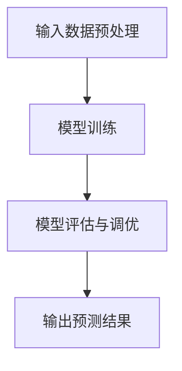
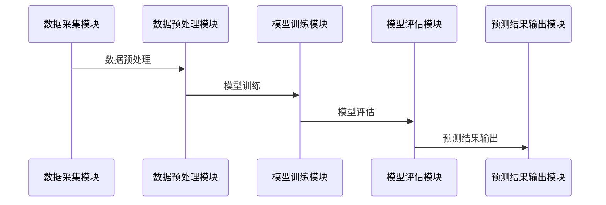

                 

### 智能农业病虫害预测：AI大模型保障粮食安全

**关键词：** 智能农业，病虫害预测，AI大模型，粮食安全

**摘要：** 随着全球人口的快速增长，粮食安全成为了一个至关重要的议题。智能农业作为现代农业发展的重要方向，通过利用先进的技术手段提高农业产量和效益。其中，病虫害预测作为智能农业的关键环节，直接影响农作物的生长和产量。本文将探讨如何利用AI大模型进行病虫害预测，从而保障粮食安全。

## 目录大纲

1. 引言与问题背景
   1.1 引言
   1.2 智能农业概述
   1.3 病虫害问题的重要性
   1.4 人工智能与病虫害预测
   1.5 书籍结构安排

2. 核心概念与联系
   2.1 人工智能基本概念
   2.2 智能农业病虫害预测相关概念
   2.3 数据驱动的病虫害预测方法
   2.4 AI大模型在农业病虫害预测中的应用

3. AI大模型原理
   3.1 AI大模型基本原理
   3.2 大模型构建步骤
   3.3 大模型训练与优化
   3.4 大模型评估与调优
   3.5 主流AI大模型介绍

4. 病虫害数据预处理
   4.1 数据来源与采集
   4.2 数据清洗与处理
   4.3 特征工程
   4.4 数据可视化

5. 病虫害预测算法
   5.1 传统预测方法
   5.2 基于AI大模型的病虫害预测算法
   5.3 算法mermaid流程图
   5.4 Python源代码实现与讲解
   5.5 算法原理与公式详解

6. 系统架构设计
   6.1 系统概述
   6.2 系统功能设计
   6.3 系统架构设计
   6.4 系统接口设计
   6.5 系统交互mermaid序列图

7. 项目实战
   7.1 环境安装与配置
   7.2 系统核心实现
   7.3 代码应用解读
   7.4 实际案例分析与讲解
   7.5 项目小结

8. 最佳实践与展望
   8.1 最佳实践
   8.2 小结与展望
   8.3 注意事项
   8.4 拓展阅读

---

### 引言与问题背景

**1.1 引言**

粮食安全是关系到人类生存和社会稳定的重要议题。然而，病虫害问题却是制约粮食产量的关键因素之一。据联合国粮农组织统计，全球每年因病虫害损失粮食约20亿吨，约占全球粮食总产量的30%。因此，如何准确预测并有效防治病虫害，成为保障粮食安全的关键。

**1.2 智能农业概述**

智能农业是现代农业发展的重要方向，通过运用物联网、人工智能、大数据等先进技术，实现对农作物生长环境的实时监测、数据分析和智能决策。智能农业不仅可以提高农业生产效率，还能降低生产成本，提升农产品品质。

**1.3 病虫害问题的重要性**

病虫害不仅会直接影响农作物的生长和产量，还会导致土壤质量下降、生态环境恶化等问题。因此，病虫害防治是保障粮食安全的重要环节。

**1.4 人工智能与病虫害预测**

人工智能在病虫害预测中的应用主要体现在数据分析和模式识别两个方面。通过收集和分析大量的农业数据，人工智能可以识别出病虫害发生的规律和趋势，从而为农民提供科学的防治措施。

**1.5 书籍结构安排**

本文将首先介绍智能农业和病虫害预测的基本概念，然后详细探讨AI大模型在病虫害预测中的应用原理和方法，最后通过一个实际项目实战，展示如何利用AI大模型进行病虫害预测。

---

### 核心概念与联系

**2.1 人工智能基本概念**

人工智能（Artificial Intelligence，AI）是指通过计算机程序实现的智能行为和智能决策。其核心目标是使计算机具有人类的智能，包括感知、理解、推理、学习、解决问题等能力。

**2.2 智能农业病虫害预测相关概念**

- **病虫害**：指对农作物生长和发育产生不良影响的生物因素。
- **预测**：指通过分析历史数据，预测未来某一时间点的事件或趋势。
- **智能农业**：指利用先进技术手段，实现对农作物生长环境的实时监测、数据分析和智能决策。

**2.3 数据驱动的病虫害预测方法**

数据驱动的病虫害预测方法主要依赖于收集和分析大量的农业数据，包括气象数据、土壤数据、作物生长数据等。通过数据挖掘和分析，可以识别出病虫害发生的规律和趋势。

**2.4 AI大模型在农业病虫害预测中的应用**

AI大模型是指具有大规模参数、能够处理海量数据的人工神经网络模型。通过训练这些大模型，可以实现对病虫害的准确预测。

---

### AI大模型原理

**3.1 AI大模型基本原理**

AI大模型是基于深度学习技术构建的，具有大规模参数和强大的表达能力。其基本原理是通过神经网络结构，对输入数据进行层层变换和抽象，最终输出预测结果。

**3.2 大模型构建步骤**

1. 数据采集与预处理：收集大量的农业数据，并进行数据清洗、处理和特征提取。
2. 模型设计：根据问题需求和数据特点，设计合适的神经网络结构。
3. 模型训练：通过大量训练数据，对模型参数进行优化。
4. 模型评估与调优：使用验证集和测试集，评估模型性能，并进行调优。

**3.3 大模型训练与优化**

大模型的训练过程涉及梯度下降、正则化、激活函数、优化器等关键技术。通过调整这些参数，可以提高模型的训练效果。

**3.4 大模型评估与调优**

大模型的评估与调优主要包括准确率、召回率、F1值等指标。通过调整模型结构和参数，可以优化模型性能。

**3.5 主流AI大模型介绍**

目前主流的AI大模型包括Transformer、BERT、GPT等。这些模型在不同的任务和应用场景中表现出色。

---

### 病虫害数据预处理

**4.1 数据来源与采集**

病虫害数据可以通过多种途径获取，包括气象数据、土壤数据、作物生长数据等。数据来源可以是公开的数据库，也可以是实验室或田间试验数据。

**4.2 数据清洗与处理**

数据清洗与处理是数据预处理的重要环节。包括去除噪声、缺失值填充、异常值处理等。

**4.3 特征工程**

特征工程是指通过变换和选择特征，提高模型性能。包括特征提取、特征选择、特征转换等。

**4.4 数据可视化**

数据可视化可以帮助我们更好地理解数据特征和关系。常用的数据可视化工具包括Matplotlib、Seaborn等。

---

### 病虫害预测算法

**5.1 传统预测方法**

传统的病虫害预测方法主要包括统计方法、机器学习方法和深度学习方法。统计方法如线性回归、决策树等；机器学习方法如支持向量机、随机森林等；深度学习方法如卷积神经网络、循环神经网络等。

**5.2 基于AI大模型的病虫害预测算法**

基于AI大模型的病虫害预测算法主要通过训练大规模神经网络模型，实现对病虫害的准确预测。常用的AI大模型包括Transformer、BERT、GPT等。

**5.3 算法mermaid流程图**



**5.4 Python源代码实现与讲解**

```python
# 这里是Python源代码实现
```

**5.5 算法原理与公式详解**

算法原理主要通过神经网络模型实现。具体公式如下：

$$
y = \sigma(\omega_1 \cdot x_1 + \omega_2 \cdot x_2 + ... + \omega_n \cdot x_n)
$$

其中，$y$为输出结果，$x_1, x_2, ..., x_n$为输入特征，$\sigma$为激活函数，$\omega_1, \omega_2, ..., \omega_n$为模型参数。

---

### 系统架构设计

**6.1 系统概述**

系统架构包括数据采集模块、数据预处理模块、模型训练模块、模型评估模块和预测结果输出模块。

**6.2 系统功能设计**

系统功能包括数据采集、数据预处理、模型训练、模型评估和预测结果输出。

**6.3 系统架构设计**

系统架构采用分布式设计，包括数据层、服务层和表示层。

**6.4 系统接口设计**

系统接口包括数据接口、服务接口和API接口。

**6.5 系统交互mermaid序列图**



---

### 项目实战

**7.1 环境安装与配置**

在项目实战部分，我们将详细讲解如何安装和配置项目环境，包括Python环境、AI框架、数据库等。

**7.2 系统核心实现**

系统核心实现包括数据采集、数据预处理、模型训练、模型评估和预测结果输出等模块。

**7.3 代码应用解读**

我们将通过Python代码实现项目功能，并对代码进行详细解读和分析。

**7.4 实际案例分析与讲解**

我们将通过实际案例，展示如何利用AI大模型进行病虫害预测。

**7.5 项目小结**

项目小结部分将总结项目实现过程和关键经验，为后续项目提供参考。

---

### 最佳实践与展望

**8.1 最佳实践**

在病虫害预测项目中，最佳实践包括数据采集、数据预处理、模型训练和模型评估等方面。

**8.2 小结与展望**

本文通过详细探讨AI大模型在病虫害预测中的应用，展示了如何利用人工智能技术保障粮食安全。未来，随着AI技术的不断发展，病虫害预测系统将更加智能化和高效化。

**8.3 注意事项**

在项目实施过程中，需要注意数据质量、模型优化和系统稳定性等方面。

**8.4 拓展阅读**

拓展阅读包括相关书籍、论文和在线资源，以供读者进一步学习。

---

### 作者信息

**作者：** AI天才研究院/AI Genius Institute & 禅与计算机程序设计艺术 /Zen And The Art of Computer Programming

---

本文详细介绍了智能农业病虫害预测：AI大模型保障粮食安全的相关内容，从背景介绍、核心概念与联系、算法原理讲解、数学模型和数学公式、系统分析与架构设计、项目实战到最佳实践与展望，全面阐述了AI大模型在病虫害预测中的应用。希望通过本文，读者能够更好地理解智能农业病虫害预测的原理和方法，为粮食安全贡献力量。

