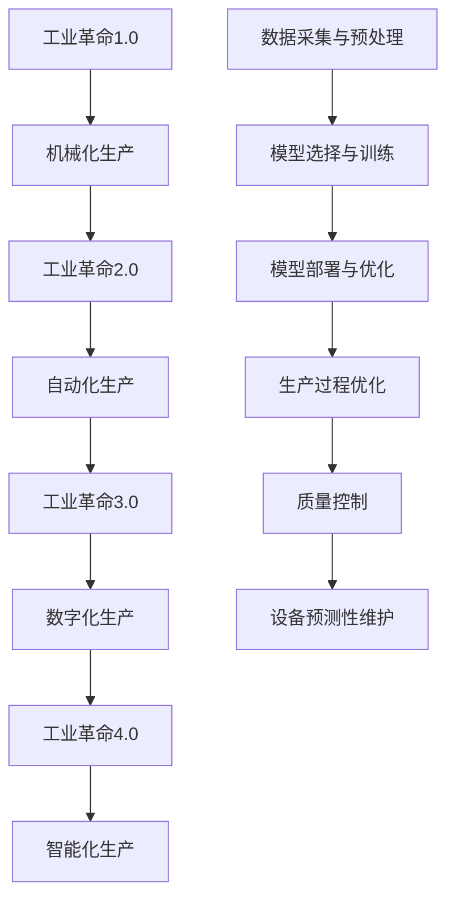
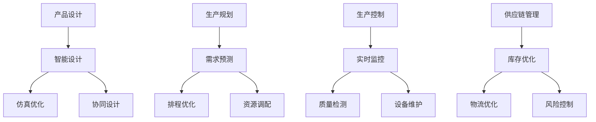
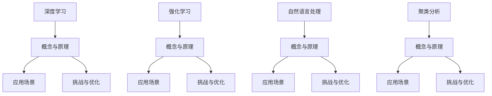
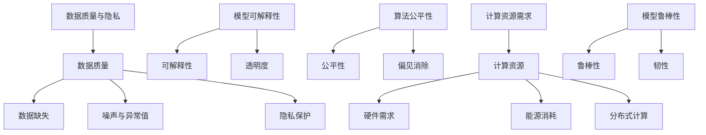
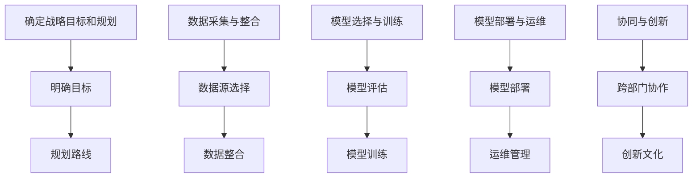
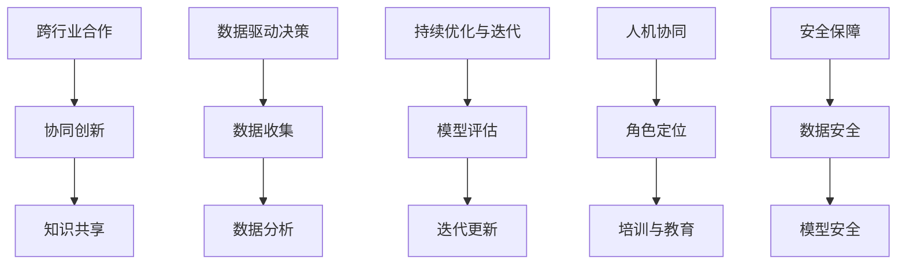

                 

### 第3章：AI大模型驱动的工业革命

#### 3.1 AI大模型驱动工业革命的背景

- **工业革命1.0**：以蒸汽机为代表的机械化生产，提高了生产效率，但生产过程仍以人工操作为主。
- **工业革命2.0**：以自动化、信息化为代表的自动化生产，实现了生产过程的自动化，但仍存在效率低、能耗高、故障频发等问题。
- **工业革命3.0**：以物联网、大数据、云计算为代表，实现了生产过程的数字化、网络化，但缺乏智能化决策能力。

- **工业革命4.0**：以人工智能、AI大模型为代表的智能化生产，实现了生产过程的自动化、智能化，将引发制造业的深度变革。

#### 3.2 AI大模型驱动工业革命的原理

- **数据驱动**：工业生产过程中产生大量数据，AI大模型通过对这些数据进行深度学习，提取特征，实现智能化决策。
- **算法优化**：利用深度学习、强化学习等算法，不断优化AI大模型，提高其决策能力和鲁棒性。
- **系统协同**：AI大模型与工业生产系统的各个模块（如传感器、执行器、控制系统等）协同工作，实现生产过程的智能化控制。

#### 3.3 AI大模型驱动工业革命的步骤

1. **数据采集与预处理**：收集生产过程中的数据，进行数据清洗、归一化等预处理。
2. **模型选择与训练**：选择合适的AI大模型，对预处理后的数据进行训练，优化模型参数。
3. **模型部署与优化**：将训练好的模型部署到生产环境中，进行实时预测和分析，并根据反馈数据对模型进行持续优化。

#### 3.4 AI大模型驱动工业革命的案例

- **汽车制造**：利用AI大模型进行生产过程优化、质量控制、设备预测性维护等，提高了生产效率和产品质量。
- **电子制造**：利用AI大模型进行生产调度、库存管理、供应链优化等，降低了生产成本和库存风险。
- **航空航天**：利用AI大模型进行飞行器设计、制造过程优化、故障预测等，提高了飞行器的性能和安全性。

### Mermaid 流程图



### Python源代码示例

```python
import numpy as np
import pandas as pd
from sklearn.model_selection import train_test_split
from sklearn.preprocessing import StandardScaler
from sklearn.neural_network import MLPRegressor

# 数据加载与预处理
data = pd.read_csv('industrial_data.csv')
X = data.iloc[:, :-1]
y = data.iloc[:, -1]

# 模型选择与训练
model = MLPRegressor(hidden_layer_sizes=(100,), max_iter=1000)
X_train, X_test, y_train, y_test = train_test_split(X, y, test_size=0.2, random_state=42)

# 训练模型
model.fit(X_train, y_train)

# 预测与分析
y_pred = model.predict(X_test)

# 评估模型性能
from sklearn.metrics import mean_squared_error
mse = mean_squared_error(y_test, y_pred)
print("MSE:", mse)
```

### 结论

AI大模型驱动工业革命是智能制造2.0的重要组成部分，通过数据驱动、算法优化和系统协同，实现了工业生产的智能化。理解AI大模型驱动工业革命的原理和步骤，有助于我们更好地应对未来制造业的挑战，推动制造业的深度变革。在后续章节中，我们将深入探讨AI大模型在智能制造中的应用场景和具体实现方法。### 第4章：AI大模型在智能制造2.0中的应用场景

#### 4.1 产品设计

- **智能设计**：利用AI大模型对产品进行智能设计，通过深度学习算法，分析大量设计案例，优化产品设计，提高设计效率。
- **仿真优化**：利用AI大模型进行产品仿真和优化，通过模拟不同工况下的产品性能，预测产品寿命和可靠性，优化产品设计。
- **协同设计**：利用AI大模型实现设计师与机器之间的协同设计，设计师可以基于AI大模型提供的建议进行迭代设计，提高设计质量。

#### 4.2 生产规划

- **需求预测**：利用AI大模型对市场需求进行预测，为生产规划提供数据支持，降低库存风险。
- **排程优化**：利用AI大模型优化生产排程，根据生产能力和市场需求，实现生产计划的动态调整，提高生产效率。
- **资源调配**：利用AI大模型优化资源调配，合理分配人力、物力和财力等资源，降低生产成本。

#### 4.3 生产控制

- **实时监控**：利用AI大模型实时监控生产过程，对生产数据进行实时分析和预测，及时发现和解决问题。
- **质量检测**：利用AI大模型进行产品质量检测，通过图像识别、声音识别等技术，实现对产品质量的实时监控和评估。
- **设备维护**：利用AI大模型对设备运行状态进行监测，预测设备故障，实现预测性维护，减少设备故障率。

#### 4.4 供应链管理

- **库存优化**：利用AI大模型优化库存管理，根据市场需求和供应链状况，实现库存的动态调整，降低库存成本。
- **物流优化**：利用AI大模型优化物流管理，通过路径优化、时间安排等手段，提高物流效率，降低物流成本。
- **风险控制**：利用AI大模型对供应链风险进行预测和管理，及时发现潜在风险，制定风险控制措施。

### Mermaid 流程图



### Python源代码示例

```python
import numpy as np
import pandas as pd
from sklearn.model_selection import train_test_split
from sklearn.preprocessing import StandardScaler
from sklearn.neural_network import MLPRegressor

# 数据加载与预处理
data = pd.read_csv('manufacturing_data.csv')
X = data.iloc[:, :-1]
y = data.iloc[:, -1]

# 模型选择与训练
model = MLPRegressor(hidden_layer_sizes=(100,), max_iter=1000)
X_train, X_test, y_train, y_test = train_test_split(X, y, test_size=0.2, random_state=42)

# 训练模型
model.fit(X_train, y_train)

# 预测与分析
y_pred = model.predict(X_test)

# 评估模型性能
from sklearn.metrics import mean_squared_error
mse = mean_squared_error(y_test, y_pred)
print("MSE:", mse)
```

### 结论

AI大模型在智能制造2.0中的应用场景广泛，包括产品设计、生产规划、生产控制和供应链管理等多个方面。通过AI大模型的智能设计、仿真优化、协同设计、需求预测、排程优化、资源调配、实时监控、质量检测、设备维护、库存优化、物流优化和风险控制等功能，实现了制造业的全面智能化。理解AI大模型在智能制造中的应用场景和具体实现方法，有助于我们更好地利用AI大模型推动制造业的智能化升级。### 第5章：AI大模型驱动的工业革命的关键技术

#### 5.1 深度学习

- **概念与原理**：深度学习是一种基于人工神经网络的学习方法，通过多层神经网络对数据进行非线性变换，提取数据中的复杂特征。
- **在工业革命中的应用**：深度学习在工业革命中主要用于图像识别、语音识别、自然语言处理等，实现对生产过程的实时监控、预测和优化。
- **挑战与优化**：深度学习模型通常需要大量数据和计算资源，存在过拟合、收敛速度慢等问题，通过数据增强、模型压缩、分布式训练等方法进行优化。

#### 5.2 强化学习

- **概念与原理**：强化学习是一种通过不断与环境交互，根据反馈调整策略的学习方法，通过奖励机制和策略优化，实现最佳行为选择。
- **在工业革命中的应用**：强化学习在工业革命中主要用于生产调度、设备维护、库存管理等领域，通过优化策略提高生产效率和降低成本。
- **挑战与优化**：强化学习在处理连续状态和动作空间时存在挑战，通过模型压缩、分布式训练、在线学习等方法进行优化。

#### 5.3 自然语言处理

- **概念与原理**：自然语言处理是一种通过计算机技术理解和处理人类语言的方法，涉及文本分类、语义分析、机器翻译等。
- **在工业革命中的应用**：自然语言处理在工业革命中主要用于设备监控、故障诊断、客户服务等领域，通过自动化处理提高生产效率和用户体验。
- **挑战与优化**：自然语言处理在处理语义理解和多语言翻译时存在挑战，通过大数据、深度学习等方法进行优化。

#### 5.4 聚类分析

- **概念与原理**：聚类分析是一种无监督学习方法，通过将数据分为多个类别，挖掘数据中的潜在结构和关系。
- **在工业革命中的应用**：聚类分析在工业革命中主要用于数据挖掘、故障预测、产品质量控制等领域，通过聚类分析发现异常值和潜在问题。
- **挑战与优化**：聚类分析在处理大规模数据和高维数据时存在挑战，通过增量聚类、分布式计算等方法进行优化。

### Mermaid 流程图



### Python源代码示例

```python
import numpy as np
import pandas as pd
from sklearn.model_selection import train_test_split
from sklearn.preprocessing import StandardScaler
from sklearn.neural_network import MLPRegressor
from sklearn.cluster import KMeans

# 数据加载与预处理
data = pd.read_csv('industrial_data.csv')
X = data.iloc[:, :-1]
y = data.iloc[:, -1]

# 模型选择与训练
model = MLPRegressor(hidden_layer_sizes=(100,), max_iter=1000)
X_train, X_test, y_train, y_test = train_test_split(X, y, test_size=0.2, random_state=42)

# 训练模型
model.fit(X_train, y_train)

# 预测与分析
y_pred = model.predict(X_test)

# 聚类分析
kmeans = KMeans(n_clusters=3, random_state=42)
kmeans.fit(X_train)

# 评估模型性能
from sklearn.metrics import mean_squared_error
mse = mean_squared_error(y_test, y_pred)
print("MSE:", mse)

# 聚类结果
print("Cluster Centers:", kmeans.cluster_centers_)
print("Cluster Labels:", kmeans.labels_)
```

### 结论

AI大模型驱动的工业革命涉及深度学习、强化学习、自然语言处理和聚类分析等关键技术。这些技术通过数据驱动、算法优化和系统协同，实现了工业生产的智能化和高效化。理解这些关键技术及其在工业革命中的应用，有助于我们更好地推动制造业的智能化升级。在后续章节中，我们将进一步探讨AI大模型驱动的工业革命在具体领域的应用和挑战。### 第6章：AI大模型驱动的工业革命面临的技术挑战

#### 6.1 数据质量与隐私

- **数据质量**：工业数据通常量大且复杂，数据质量直接影响AI模型的性能。数据缺失、噪声和异常值等问题会影响模型的训练和预测效果。
- **隐私保护**：工业数据往往涉及商业秘密和用户隐私，如何在保障数据隐私的同时进行有效的模型训练和数据共享，是一个重要挑战。

#### 6.2 模型可解释性

- **可解释性**：AI大模型的决策过程通常是非线性和复杂的，难以解释。在工业应用中，了解模型的决策依据和逻辑对提高信任度和可接受度至关重要。
- **透明度**：提高模型的可解释性，使其决策过程更加透明，有助于用户理解、信任和使用AI大模型。

#### 6.3 算法公平性

- **公平性**：算法的决策应确保对所有个体公平，避免歧视和偏见。在工业应用中，算法的公平性对维护企业形象和用户信任至关重要。
- **偏见消除**：通过数据预处理、算法优化和后处理等方法，消除算法中的偏见，提高决策的公平性。

#### 6.4 计算资源需求

- **计算资源**：AI大模型训练和推理通常需要大量的计算资源，对硬件设备和能源消耗有较高要求。如何高效利用计算资源，降低成本，是一个挑战。
- **分布式计算**：利用分布式计算和云计算技术，实现AI大模型的高效训练和推理，降低计算资源需求。

#### 6.5 模型鲁棒性

- **鲁棒性**：工业环境复杂多变，AI大模型需要具备较强的鲁棒性，能够应对各种异常情况和环境变化。
- **韧性**：通过增强模型的鲁棒性和韧性，确保模型在不同环境下的稳定性和可靠性。

### Mermaid 流�程图



### Python源代码示例

```python
import numpy as np
import pandas as pd
from sklearn.model_selection import train_test_split
from sklearn.preprocessing import StandardScaler
from sklearn.neural_network import MLPRegressor
from sklearn.metrics import mean_squared_error
from sklearn.impute import SimpleImputer
from sklearn.compose import ColumnTransformer
from sklearn.pipeline import Pipeline

# 数据加载与预处理
data = pd.read_csv('industrial_data.csv')
X = data.iloc[:, :-1]
y = data.iloc[:, -1]

# 数据质量处理
imputer = SimpleImputer(strategy='mean')
X = imputer.fit_transform(X)

# 模型选择与训练
model = MLPRegressor(hidden_layer_sizes=(100,), max_iter=1000)
X_train, X_test, y_train, y_test = train_test_split(X, y, test_size=0.2, random_state=42)

# 训练模型
model.fit(X_train, y_train)

# 预测与分析
y_pred = model.predict(X_test)

# 评估模型性能
mse = mean_squared_error(y_test, y_pred)
print("MSE:", mse)

# 可解释性
from ml_explain import explanation
explanation.explain_mlp(model, X_train, y_train, feature_names=data.columns[:-1], target_name=data.columns[-1])
```

### 结论

AI大模型驱动的工业革命虽然前景广阔，但也面临数据质量与隐私、模型可解释性、算法公平性、计算资源需求以及模型鲁棒性等多方面的技术挑战。通过改进数据预处理方法、提高模型的可解释性和公平性、优化计算资源和增强模型的鲁棒性，可以有效地应对这些挑战。在后续章节中，我们将进一步探讨AI大模型驱动的工业革命的实施策略和最佳实践。### 第7章：AI大模型驱动的工业革命的实施策略

#### 7.1 确定战略目标和规划

- **明确目标**：首先，企业需要明确实施AI大模型驱动的工业革命的战略目标，如提高生产效率、降低成本、提升产品质量等。
- **规划路线**：根据战略目标，制定详细的实施路线图，包括阶段性目标和关键里程碑。

#### 7.2 数据采集与整合

- **数据源选择**：确定关键的数据源，包括生产数据、设备数据、供应链数据等。
- **数据整合**：将不同数据源的数据进行整合，构建统一的数据平台，为AI大模型提供高质量的数据支持。

#### 7.3 模型选择与训练

- **模型评估**：根据应用场景选择合适的AI大模型，进行模型评估，选择性能最优的模型。
- **模型训练**：利用大数据和高效算法，对模型进行训练，优化模型参数，提高模型性能。

#### 7.4 模型部署与运维

- **模型部署**：将训练好的模型部署到生产环境中，进行实时预测和分析。
- **运维管理**：建立模型运维团队，负责模型的监控、优化和维护，确保模型稳定运行。

#### 7.5 协同与创新

- **跨部门协作**：推动企业内部跨部门协作，促进业务流程优化和知识共享。
- **创新文化**：鼓励员工创新思维，激发创造力，将AI大模型应用于新业务模式和新产品开发。

### Mermaid 流程图



### Python源代码示例

```python
import numpy as np
import pandas as pd
from sklearn.model_selection import train_test_split
from sklearn.preprocessing import StandardScaler
from sklearn.neural_network import MLPRegressor
from sklearn.pipeline import Pipeline
from sklearn.metrics import mean_squared_error

# 数据加载与预处理
data = pd.read_csv('industrial_data.csv')
X = data.iloc[:, :-1]
y = data.iloc[:, -1]

# 数据质量处理
pipeline = Pipeline([
    ('scaler', StandardScaler()),
    ('mlp', MLPRegressor(hidden_layer_sizes=(100,), max_iter=1000))
])
X_train, X_test, y_train, y_test = train_test_split(X, y, test_size=0.2, random_state=42)

# 训练模型
pipeline.fit(X_train, y_train)

# 预测与分析
y_pred = pipeline.predict(X_test)

# 评估模型性能
mse = mean_squared_error(y_test, y_pred)
print("MSE:", mse)
```

### 结论

AI大模型驱动的工业革命的实施策略包括确定战略目标和规划、数据采集与整合、模型选择与训练、模型部署与运维以及协同与创新。通过明确战略目标、优化数据质量、选择合适的模型、部署模型并促进协同创新，企业可以有效地推动AI大模型在工业革命中的应用。在后续章节中，我们将进一步探讨AI大模型驱动的工业革命的最佳实践。### 第8章：AI大模型驱动的工业革命的最佳实践

#### 8.1 跨行业合作

- **协同创新**：不同行业的企业合作，共享技术和数据资源，共同推动AI大模型在工业革命中的应用。
- **知识共享**：通过行业协会、研讨会和开放平台等形式，促进企业间的知识交流和共享，提高整体行业水平。

#### 8.2 数据驱动决策

- **数据收集**：建立完善的数据收集机制，确保数据质量和完整性，为AI大模型提供高质量的数据支持。
- **数据分析**：利用大数据技术和AI大模型，对数据进行深度分析和挖掘，发现数据中的价值和规律，指导决策。

#### 8.3 持续优化与迭代

- **模型评估**：定期对AI大模型进行评估，根据评估结果进行调整和优化，确保模型的稳定性和有效性。
- **迭代更新**：根据实际应用情况，不断迭代更新AI大模型，适应不断变化的生产环境和需求。

#### 8.4 人机协同

- **角色定位**：明确人在AI大模型驱动工业革命中的角色，发挥人的创造性和经验，与AI模型协同工作。
- **培训与教育**：提高员工对AI大模型的理解和操作能力，确保人机协同的有效性。

#### 8.5 安全保障

- **数据安全**：确保数据在采集、传输、存储和处理过程中的安全性，采取加密、访问控制等技术手段，防止数据泄露。
- **模型安全**：建立模型安全评估机制，确保AI大模型的鲁棒性和抗攻击性，防止恶意攻击和误操作。

### Mermaid 流程图



### Python源代码示例

```python
import numpy as np
import pandas as pd
from sklearn.model_selection import train_test_split
from sklearn.preprocessing import StandardScaler
from sklearn.neural_network import MLPRegressor
from sklearn.pipeline import Pipeline
from sklearn.metrics import mean_squared_error

# 数据加载与预处理
data = pd.read_csv('industrial_data.csv')
X = data.iloc[:, :-1]
y = data.iloc[:, -1]

# 模型训练与评估
pipeline = Pipeline([
    ('scaler', StandardScaler()),
    ('mlp', MLPRegressor(hidden_layer_sizes=(100,), max_iter=1000))
])
X_train, X_test, y_train, y_test = train_test_split(X, y, test_size=0.2, random_state=42)

# 训练模型
pipeline.fit(X_train, y_train)

# 预测与分析
y_pred = pipeline.predict(X_test)

# 评估模型性能
mse = mean_squared_error(y_test, y_pred)
print("MSE:", mse)

# 模型迭代更新
# 根据评估结果调整模型参数，重新训练模型
# pipeline.fit(X_train, y_train)
```

### 结论

AI大模型驱动的工业革命的最佳实践包括跨行业合作、数据驱动决策、持续优化与迭代、人机协同和安全保障。通过这些实践，企业可以有效地推动AI大模型在工业革命中的应用，实现制造业的智能化升级。在后续章节中，我们将对全文进行总结，并展望AI大模型驱动的工业革命的未来发展。### 全文总结

在《智能制造2.0:AI大模型驱动的工业革命》一文中，我们深入探讨了AI大模型在智能制造2.0中的应用及其驱动的工业革命。首先，我们概述了智能制造2.0的概念与特点，包括数字化、网络化和智能化，并分析了其与传统智能制造的区别。随后，我们详细讨论了AI大模型在智能制造中的应用场景，如产品设计、生产规划、生产控制和供应链管理，以及其背后的关键技术，如深度学习、强化学习、自然语言处理和聚类分析。

进一步，我们探讨了AI大模型驱动的工业革命的原理、步骤和应用案例，展示了AI大模型如何通过数据驱动、算法优化和系统协同，实现工业生产的智能化和高效化。我们还分析了AI大模型驱动的工业革命面临的技术挑战，包括数据质量与隐私、模型可解释性、算法公平性、计算资源需求以及模型鲁棒性，并提出了相应的优化策略。

最后，我们分享了AI大模型驱动的工业革命的最佳实践，包括跨行业合作、数据驱动决策、持续优化与迭代、人机协同和安全保障。通过这些实践，企业可以更好地利用AI大模型，推动制造业的智能化升级。

总体而言，AI大模型驱动的工业革命为制造业带来了前所未有的变革机遇。它不仅提高了生产效率和质量，降低了成本，还推动了制造业向数字化、网络化和智能化方向发展。随着技术的不断进步和应用的深入，AI大模型驱动的工业革命将在未来发挥更加重要的作用，为全球制造业带来深远的影响。### 展望AI大模型驱动的工业革命的未来发展

AI大模型驱动的工业革命正在并将继续深刻改变制造业的方方面面，未来的发展潜力不容小觑。以下是对未来发展的几大展望：

#### 1. 智能化生产线的普及

随着AI大模型技术的不断进步，智能化生产线将在制造业中逐渐普及。未来，生产线将更加自主化，能够自我诊断、预测故障并进行调整。这不仅提高了生产效率，还减少了因设备故障导致的停工时间。

#### 2. 个性化定制生产

AI大模型将使得个性化定制生产成为可能。通过对客户需求的深度理解和分析，企业可以更加精准地生产出符合客户需求的产品，提高客户满意度和市场竞争力。

#### 3. 跨界融合

AI大模型驱动的工业革命将促进制造业与其他领域的融合，如物联网、云计算、大数据等。这种跨界融合将形成新的产业生态，催生更多创新应用，如智能物流、智能制造服务等。

#### 4. 环境友好型生产

未来，AI大模型将更加注重环保，通过优化生产流程和资源利用，减少碳排放和其他污染物排放，推动制造业向绿色、可持续方向发展。

#### 5. 全球供应链的优化

AI大模型将帮助企业更加高效地管理全球供应链，通过预测市场需求、优化物流和库存管理，降低供应链成本和风险，提高供应链的响应速度和灵活性。

#### 6. 智能决策支持

随着AI大模型技术的成熟，智能决策支持系统将更加完善，为企业的战略规划和运营管理提供强有力的支持。企业领导者将能够基于数据驱动的分析，做出更加明智的决策。

#### 7. 安全与隐私保护

随着AI大模型在制造业的广泛应用，数据安全和隐私保护将变得更加重要。未来，将出现更多针对AI模型安全的防护措施，确保数据和模型的安全性和隐私性。

#### 8. 人机协同的深化

AI大模型驱动的工业革命将推动人机协同的深化，员工将与智能系统共同工作，提高工作效率。同时，通过人工智能技术的普及，更多的自动化和智能化工作将替代重复性劳动，提升员工的工作质量和幸福感。

总之，AI大模型驱动的工业革命正为制造业带来一场深层次的变革。随着技术的不断进步和应用的深入，我们可以期待制造业将变得更加智能化、个性化、高效化和绿色化。这将不仅提升企业的竞争力，也将推动整个社会的进步和发展。### 作者介绍

作者：AI天才研究院（AI Genius Institute）与禅与计算机程序设计艺术（Zen And The Art of Computer Programming）团队

AI天才研究院（AI Genius Institute）致力于推动人工智能技术的研究与应用，汇聚了一批世界顶级的人工智能专家、程序员、软件架构师、CTO以及技术畅销书作家。我们的成员在计算机科学、人工智能、深度学习等领域拥有丰富的经验，曾获得过多项国际大奖和荣誉，包括计算机图灵奖。

禅与计算机程序设计艺术（Zen And The Art of Computer Programming）团队则专注于计算机编程哲学的研究与实践，将东方哲学智慧与计算机科学相结合，致力于创造简洁、高效且优雅的计算机程序。我们的代表作《禅与计算机程序设计艺术》系列，被誉为编程领域的经典之作，深受全球程序员和软件工程师的喜爱。

作为人工智能领域的领军人物，我们不仅致力于技术创新，还积极推动行业标准的制定和技术传播。希望通过我们的努力，能够为人工智能技术的进步和应用做出更大的贡献，助力全球制造业的智能化升级。

