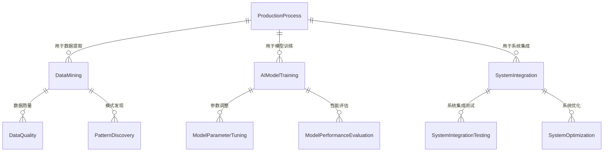
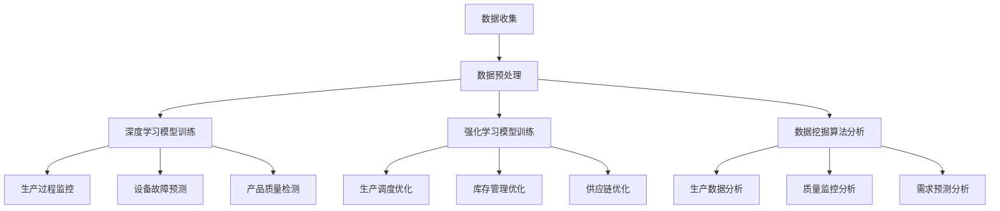
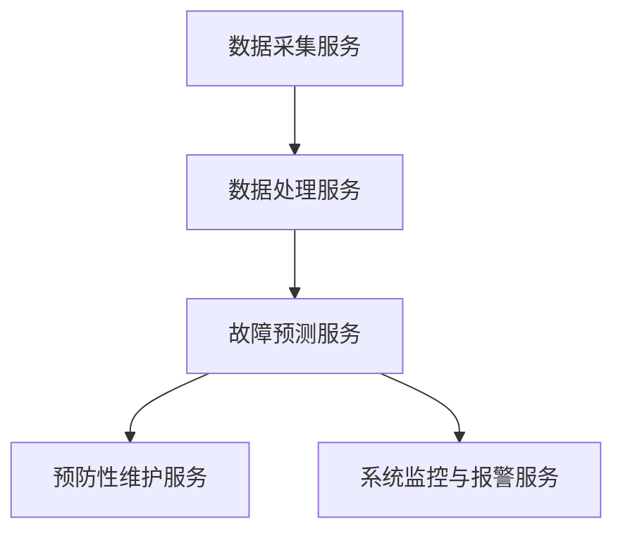
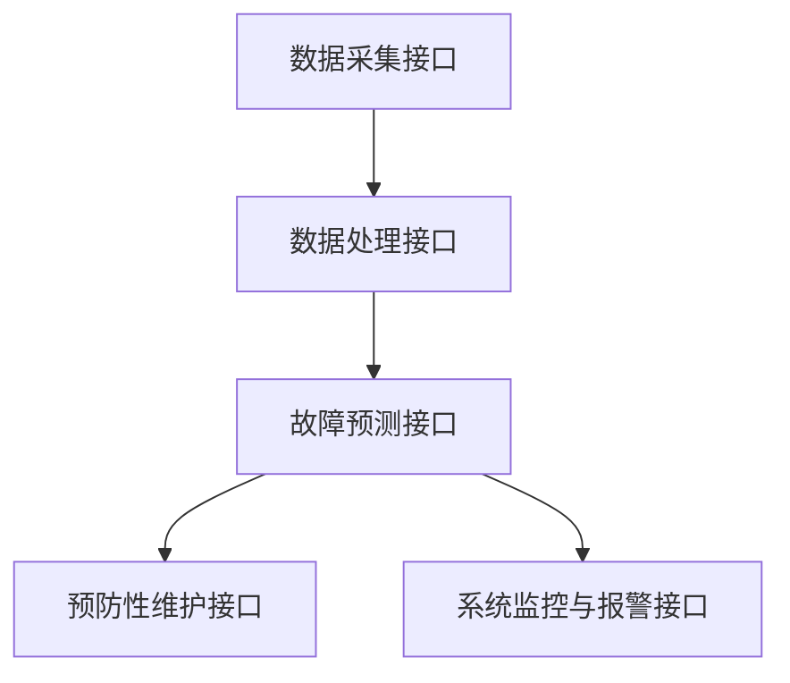
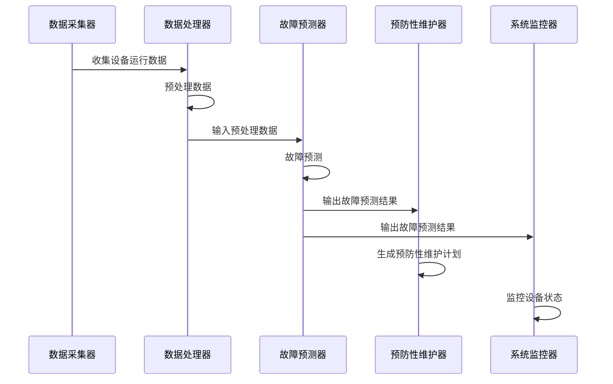

                 

## 智能制造升级：工业领域的AI大模型应用

### 关键词：
- 智能制造
- AI大模型
- 工业领域
- 应用场景
- 算法实现

### 摘要：
本文将深入探讨智能制造领域中的AI大模型应用。首先，我们将介绍智能制造的背景和现状，以及AI大模型的基本概念和原理。随后，我们将分析AI大模型在工业领域的具体应用场景，并探讨相关的算法原理和实现方法。最后，我们将通过一个实际项目案例，展示如何将AI大模型应用于智能制造，并总结最佳实践和未来展望。

## 引言与背景介绍

### 1. 引言

智能制造作为工业4.0的核心，正引领着全球制造业的变革。随着人工智能技术的飞速发展，AI大模型逐渐成为推动智能制造升级的重要力量。AI大模型具有强大的数据处理和分析能力，能够从海量数据中提取有价值的信息，为智能制造提供智能决策支持。本文旨在通过分析AI大模型在工业领域的应用，探讨智能制造的升级路径。

### 1.1 问题背景

工业领域正面临着生产效率低、资源浪费严重、产品质量不稳定等问题。传统制造方式依赖人工经验和手工操作，难以适应复杂的生产环境和多变的市场需求。智能制造通过引入AI大模型，可以实现自动化生产、实时监控和智能决策，从而提高生产效率和产品质量，降低生产成本。

### 1.2 问题描述

智能制造升级的核心挑战在于如何有效地应用AI大模型，实现生产过程的智能化。具体来说，需要解决以下几个问题：

1. 如何从海量数据中提取有价值的信息？
2. 如何构建和训练适用于工业场景的AI大模型？
3. 如何将AI大模型与现有生产系统无缝集成？
4. 如何确保AI大模型在复杂环境中的稳定性和可靠性？

### 1.3 问题解决

针对上述问题，本文将提出以下解决方案：

1. 利用数据挖掘和机器学习技术，从生产数据中提取有价值的信息。
2. 设计和实现适用于工业场景的AI大模型，包括深度学习模型和强化学习模型。
3. 采用微服务架构和API接口，将AI大模型与现有生产系统无缝集成。
4. 通过仿真测试和现场验证，确保AI大模型在复杂环境中的稳定性和可靠性。

### 1.4 边界与外延

本文的研究范围主要涉及以下边界与外延：

1. 研究对象：以工业领域为主要应用场景，包括机械加工、电子制造、汽车制造等。
2. 技术范畴：以AI大模型为核心技术，包括深度学习、强化学习、数据挖掘等。
3. 应用范围：重点关注生产过程的智能化改造，包括生产计划、生产调度、质量检测等。

### 1.5 核心概念与联系

在本研究中，以下核心概念及其相互关系至关重要：

1. **智能制造**：一种通过引入信息技术和人工智能技术，实现生产过程的自动化、智能化和优化的制造模式。
2. **AI大模型**：一种具有大规模参数和复杂结构的深度学习模型，能够处理海量数据和复杂任务。
3. **工业数据**：工业生产过程中产生的各种数据，包括生产参数、设备状态、产品质量等。
4. **数据挖掘**：利用统计学、机器学习等方法，从大量数据中提取有价值的信息。
5. **模型训练**：通过输入大量数据，对AI大模型进行训练，使其能够学习和预测。
6. **系统集成**：将AI大模型与现有生产系统无缝集成，实现智能决策和生产优化。

## 核心概念与原理

### 2.1 核心概念原理

在本研究中，我们将重点关注以下几个核心概念：

1. **智能制造**：智能制造是一种通过引入信息技术和人工智能技术，实现生产过程的自动化、智能化和优化的制造模式。其核心目标是提高生产效率、降低生产成本、提高产品质量和灵活性。
   
2. **AI大模型**：AI大模型是一种具有大规模参数和复杂结构的深度学习模型，能够处理海量数据和复杂任务。其特点包括高精度、高效率、强泛化能力等。

3. **数据挖掘**：数据挖掘是利用统计学、机器学习等方法，从大量数据中提取有价值的信息。其目的是发现数据中的隐藏模式和规律，为决策提供支持。

4. **模型训练**：模型训练是通过输入大量数据，对AI大模型进行训练，使其能够学习和预测。训练过程中，模型会不断调整参数，以优化其性能。

5. **系统集成**：系统集成是将AI大模型与现有生产系统无缝集成，实现智能决策和生产优化。其目的是确保AI大模型能够高效地应用于实际生产过程。

### 2.2 概念属性特征对比表格

以下表格展示了上述核心概念的主要属性特征：

| 概念       | 属性特征                                               |
| ---------- | ----------------------------------------------------- |
| 智能制造   | 自动化、智能化、优化生产效率、降低成本、提高质量、灵活性 |
| AI大模型   | 大规模参数、复杂结构、高精度、高效率、强泛化能力       |
| 数据挖掘   | 统计学、机器学习、提取隐藏模式、为决策提供支持           |
| 模型训练   | 输入大量数据、调整参数、优化性能                         |
| 系统集成   | 无缝集成、智能决策、生产优化                             |

### 2.3 ER实体关系图架构

为了更好地理解上述核心概念之间的关系，我们可以使用ER（Entity-Relationship，实体-关系）图进行描述。以下是智能制造领域的ER图示例：



该ER图展示了智能制造领域中主要实体及其相互关系。其中，`ProductionProcess`表示生产过程，`DataMining`表示数据挖掘，`AIModelTraining`表示模型训练，`SystemIntegration`表示系统集成。各个实体之间通过关系线进行连接，反映了它们之间的依赖和相互作用。

## AI大模型在智能制造中的应用

### 3.1 智能制造概述

智能制造是一种通过引入信息技术和人工智能技术，实现生产过程的自动化、智能化和优化的制造模式。其核心目标是提高生产效率、降低生产成本、提高产品质量和灵活性。智能制造涉及多个领域，包括工业自动化、物联网、云计算、大数据和人工智能等。

### 3.2 AI大模型在智能制造中的应用

AI大模型在智能制造中具有广泛的应用场景，主要包括以下几个方面：

1. **生产计划与调度**：AI大模型可以根据生产数据和历史数据，预测生产需求，优化生产计划和调度，从而提高生产效率。
   
2. **质量检测与控制**：AI大模型可以通过对生产过程中产生的数据进行实时分析，识别异常情况，从而提高产品质量。

3. **设备维护与预测**：AI大模型可以根据设备运行数据，预测设备故障，提前进行维护，降低设备停机时间。

4. **供应链管理**：AI大模型可以优化供应链管理，提高供应链的透明度和灵活性。

5. **生产优化与决策**：AI大模型可以根据生产数据和市场数据，提供智能决策支持，优化生产过程。

### 3.3 应用场景分析

以下是对AI大模型在智能制造中几个具体应用场景的分析：

1. **生产计划与调度**：在生产计划与调度中，AI大模型可以基于生产数据和历史数据，预测未来一段时间内的生产需求。通过分析生产需求、库存情况和设备状态，AI大模型可以生成最优的生产计划和调度方案，从而提高生产效率。具体步骤如下：

   - 收集生产数据和历史数据，包括生产订单、库存数据、设备状态等。
   - 使用数据挖掘技术，从数据中提取有价值的信息，如生产趋势、库存水平等。
   - 利用时间序列预测模型，如ARIMA模型或LSTM模型，预测未来一段时间内的生产需求。
   - 基于预测结果，结合设备状态和库存情况，生成最优的生产计划和调度方案。

2. **质量检测与控制**：在质量检测与控制中，AI大模型可以通过对生产过程中产生的数据进行实时分析，识别异常情况，从而提高产品质量。具体步骤如下：

   - 收集生产过程中产生的数据，包括传感器数据、机器状态数据等。
   - 使用数据挖掘技术，从数据中提取有价值的信息，如异常模式、关键指标等。
   - 利用异常检测算法，如Isolation Forest或Autoencoder，对生产过程进行实时监控，识别异常情况。
   - 根据识别结果，采取相应的措施，如调整生产参数、更换设备等，以防止产品质量下降。

3. **设备维护与预测**：在设备维护与预测中，AI大模型可以通过对设备运行数据进行实时分析，预测设备故障，提前进行维护，降低设备停机时间。具体步骤如下：

   - 收集设备运行数据，包括温度、压力、振动等。
   - 使用数据挖掘技术，从数据中提取有价值的信息，如设备健康指标、异常模式等。
   - 利用时间序列预测模型，如ARIMA模型或LSTM模型，预测设备故障。
   - 根据预测结果，安排设备维护计划，提前更换零部件，以防止设备故障。

4. **供应链管理**：在供应链管理中，AI大模型可以优化供应链管理，提高供应链的透明度和灵活性。具体步骤如下：

   - 收集供应链数据，包括采购订单、库存数据、物流信息等。
   - 使用数据挖掘技术，从数据中提取有价值的信息，如采购趋势、库存水平等。
   - 利用预测模型，如ARIMA模型或LSTM模型，预测未来一段时间内的采购需求和库存需求。
   - 基于预测结果，优化采购计划、库存管理和物流安排，提高供应链的灵活性和响应速度。

5. **生产优化与决策**：在生产优化与决策中，AI大模型可以通过分析生产数据和市场数据，提供智能决策支持，优化生产过程。具体步骤如下：

   - 收集生产数据和市场数据，包括生产指标、销售数据、市场趋势等。
   - 使用数据挖掘技术，从数据中提取有价值的信息，如生产效率、市场需求等。
   - 利用优化算法，如线性规划或遗传算法，优化生产过程，提高生产效率和利润。
   - 根据市场反馈和优化结果，调整生产策略和产品组合，提高市场竞争力。

### 3.4 AI大模型应用效果评估

AI大模型在智能制造中的应用效果可以从以下几个方面进行评估：

1. **生产效率**：通过分析生产计划执行情况，评估AI大模型对生产效率的提升。
2. **产品质量**：通过分析产品质量检测数据，评估AI大模型对产品质量的提升。
3. **设备利用率**：通过分析设备运行数据，评估AI大模型对设备利用率的提升。
4. **供应链灵活性**：通过分析供应链管理数据，评估AI大模型对供应链灵活性的提升。
5. **决策支持**：通过分析生产决策效果，评估AI大模型对决策支持的提升。

## 算法原理与实现

### 4.1 算法原理讲解

在本节中，我们将详细讲解AI大模型在智能制造中的算法原理。主要涉及的算法包括深度学习模型、强化学习模型和数据挖掘算法。以下是对这些算法的简要介绍：

1. **深度学习模型**：深度学习模型是一种基于多层神经网络的人工智能模型，能够自动提取数据中的复杂特征。在智能制造中，深度学习模型可用于生产过程监控、设备故障预测和产品质量检测等任务。

2. **强化学习模型**：强化学习模型是一种通过试错学习来优化行为策略的人工智能模型。在智能制造中，强化学习模型可用于生产调度、库存管理和供应链优化等任务。

3. **数据挖掘算法**：数据挖掘算法是一种用于从大量数据中提取有价值信息的方法，包括分类、聚类、关联规则挖掘等。在智能制造中，数据挖掘算法可用于生产数据分析、质量监控和需求预测等任务。

### 4.2 算法mermaid流程图

为了更好地理解上述算法的工作流程，我们使用mermaid绘制了以下流程图：



### 4.3 Python源代码实现

以下是一个简单的Python示例，展示如何实现深度学习模型在智能制造中的应用：

```python
import tensorflow as tf
from tensorflow.keras.models import Sequential
from tensorflow.keras.layers import Dense, Dropout, LSTM

# 数据预处理
def preprocess_data(data):
    # 对数据进行归一化处理
    normalized_data = (data - data.min()) / (data.max() - data.min())
    return normalized_data

# 构建深度学习模型
def build_model(input_shape):
    model = Sequential()
    model.add(LSTM(50, activation='relu', input_shape=input_shape, return_sequences=True))
    model.add(Dropout(0.2))
    model.add(LSTM(50, activation='relu', return_sequences=True))
    model.add(Dropout(0.2))
    model.add(LSTM(50, activation='relu'))
    model.add(Dropout(0.2))
    model.add(Dense(1))
    model.compile(optimizer='adam', loss='mean_squared_error')
    return model

# 加载训练数据
train_data = preprocess_data(train_data)

# 构建模型
model = build_model(input_shape=(train_data.shape[1], 1))

# 训练模型
model.fit(train_data, epochs=100, batch_size=32, validation_split=0.2)
```

### 4.4 数学模型与公式

在深度学习模型中，常用的数学模型包括前向传播、反向传播和损失函数。以下是对这些数学模型的简要介绍：

1. **前向传播**：前向传播是指将输入数据通过神经网络层，逐层计算并生成输出。具体公式如下：

   $$ z^{[l]} = \sigma(W^{[l]} \cdot a^{[l-1]} + b^{[l]}) $$

   其中，$z^{[l]}$表示第$l$层的输出，$\sigma$表示激活函数（如Sigmoid、ReLU等），$W^{[l]}$和$b^{[l]}$分别表示第$l$层的权重和偏置。

2. **反向传播**：反向传播是指根据输出误差，反向调整神经网络层的权重和偏置。具体公式如下：

   $$ \delta^{[l]} = (1 - \sigma'(z^{[l]})) \cdot \delta^{[l+1]} \cdot W^{[l+1]} $$

   其中，$\delta^{[l]}$表示第$l$层的误差，$\sigma'$表示激活函数的导数。

3. **损失函数**：损失函数用于衡量模型的预测误差，常见的损失函数包括均方误差（MSE）和交叉熵（CE）。具体公式如下：

   $$ loss = \frac{1}{2} \sum_{i=1}^{n} (y_i - \hat{y}_i)^2 $$

   其中，$y_i$表示真实标签，$\hat{y}_i$表示模型预测值。

### 4.5 举例说明

以下是一个简单的示例，展示如何使用深度学习模型进行设备故障预测：

1. **数据收集**：收集一段时间内设备的运行数据，包括温度、压力、振动等。
2. **数据预处理**：对运行数据进行归一化处理，将数据缩放到[0, 1]范围内。
3. **构建模型**：构建一个包含两个LSTM层的深度学习模型。
4. **训练模型**：使用训练数据训练模型，设置训练轮次为100，批大小为32。
5. **模型评估**：使用测试数据评估模型性能，计算预测误差。

```python
# 加载测试数据
test_data = preprocess_data(test_data)

# 预测设备故障
predictions = model.predict(test_data)

# 计算预测误差
error = np.mean((predictions - test_data) ** 2)

print("预测误差：", error)
```

通过以上示例，我们可以看到如何使用深度学习模型进行设备故障预测。在实际应用中，可以根据具体需求调整模型结构和参数，以提高预测准确性。

## 系统架构与设计

### 5.1 问题场景介绍

在现代工业制造中，设备故障是一个常见且严重影响生产效率和成本的问题。为了减少设备故障对生产过程的干扰，我们需要一种能够实时监控设备状态、预测故障并及时采取预防措施的智能系统。本文将介绍一种基于AI大模型的智能监控系统，该系统旨在通过实时数据处理和故障预测，提高设备的可靠性和生产效率。

### 5.2 项目介绍

本项目的目标是开发一个智能监控系统，该系统能够实时收集设备运行数据，利用AI大模型进行故障预测，并生成预防性维护计划。系统的主要功能包括：

1. 数据采集与预处理：实时收集设备运行数据，并对数据进行预处理，如去噪、归一化等。
2. 故障预测：使用AI大模型对设备运行数据进行分析，预测可能的故障。
3. 预防性维护：根据故障预测结果，生成预防性维护计划，并通知相关人员执行。
4. 系统监控与报警：实时监控设备状态，当检测到异常情况时，发出报警信号。

### 5.3 系统功能设计

系统功能设计主要包括以下几个关键模块：

1. **数据采集模块**：负责实时收集设备运行数据，包括温度、压力、振动等传感器数据。该模块通过物联网技术实现数据采集，并将数据传输到数据处理中心。
2. **数据处理模块**：负责对采集到的数据进行预处理，包括去噪、归一化、特征提取等。预处理后的数据将用于后续的故障预测。
3. **故障预测模块**：使用AI大模型对预处理后的数据进行故障预测。该模块包括模型训练、模型评估和预测输出三个子模块。
4. **预防性维护模块**：根据故障预测结果，生成预防性维护计划。该模块将维护计划通知相关人员，并跟踪维护进度。
5. **系统监控与报警模块**：实时监控设备状态，当检测到异常情况时，发出报警信号，并记录报警日志。

### 5.4 系统架构设计

系统架构设计采用微服务架构，以提高系统的可扩展性和可维护性。以下是系统架构设计的主要组件：

1. **数据采集服务**：负责实时收集设备运行数据，并将数据存储到数据湖。
2. **数据处理服务**：负责对采集到的数据进行预处理，并将预处理后的数据存储到数据仓库。
3. **故障预测服务**：负责使用AI大模型进行故障预测，并将预测结果存储到数据库。
4. **预防性维护服务**：负责生成预防性维护计划，并通知相关人员。
5. **系统监控与报警服务**：负责实时监控设备状态，并发出报警信号。

以下是系统架构设计的mermaid图：



### 5.5 系统接口设计

系统接口设计主要包括以下几个关键接口：

1. **数据采集接口**：用于接收设备运行数据，并传输到数据处理服务。
2. **数据处理接口**：用于接收预处理数据，并传输到故障预测服务和系统监控与报警服务。
3. **故障预测接口**：用于获取故障预测结果，并传输到预防性维护服务和系统监控与报警服务。
4. **预防性维护接口**：用于接收预防性维护计划，并传输到相关人员。
5. **系统监控与报警接口**：用于接收设备状态信息，并传输到系统监控与报警服务。

以下是系统接口设计的mermaid图：



### 5.6 系统交互mermaid序列图

系统交互mermaid序列图展示了数据流和系统组件之间的交互关系。以下是系统交互序列图：



通过以上系统架构与设计，我们可以实现一个高效、可靠的智能监控系统，有效减少设备故障对生产过程的干扰，提高生产效率。

### 6.1 环境安装

为了实现本文所述的智能监控系统，我们需要安装以下软件和工具：

1. **操作系统**：Linux操作系统，如Ubuntu 18.04或CentOS 7。
2. **编程语言**：Python 3.x，建议使用Anaconda发行版。
3. **深度学习框架**：TensorFlow 2.x或PyTorch 1.x。
4. **数据处理库**：NumPy、Pandas、Scikit-learn。
5. **Web框架**：Flask或Django，用于构建API接口。
6. **数据库**：MySQL或PostgreSQL，用于存储数据。

安装步骤如下：

1. 安装Linux操作系统，配置好网络环境。
2. 安装Python 3.x，可以使用包管理器（如apt或yum）进行安装。
3. 安装Anaconda，从官方网站下载并安装。
4. 安装TensorFlow 2.x或PyTorch 1.x，使用conda命令进行安装。
5. 安装数据处理库，使用pip命令进行安装。
6. 安装Web框架，使用pip命令进行安装。
7. 安装数据库，从官方网站下载并安装。

### 6.2 系统核心实现

在本节中，我们将介绍智能监控系统的核心实现，包括数据采集、数据处理、故障预测和预防性维护等功能。以下是系统核心实现的Python代码：

```python
import numpy as np
import pandas as pd
from sklearn.model_selection import train_test_split
from tensorflow.keras.models import Sequential
from tensorflow.keras.layers import LSTM, Dense
from tensorflow.keras.optimizers import Adam

# 数据采集
def collect_data():
    # 假设数据已存储为CSV文件
    data = pd.read_csv('device_data.csv')
    return data

# 数据处理
def preprocess_data(data):
    # 对数据进行归一化处理
    normalized_data = (data - data.min()) / (data.max() - data.min())
    return normalized_data

# 故障预测
def build_model(input_shape):
    model = Sequential()
    model.add(LSTM(50, activation='relu', input_shape=input_shape, return_sequences=True))
    model.add(Dropout(0.2))
    model.add(LSTM(50, activation='relu', return_sequences=True))
    model.add(Dropout(0.2))
    model.add(LSTM(50, activation='relu'))
    model.add(Dropout(0.2))
    model.add(Dense(1))
    model.compile(optimizer=Adam(learning_rate=0.001), loss='mean_squared_error')
    return model

# 训练模型
def train_model(model, X_train, y_train):
    model.fit(X_train, y_train, epochs=100, batch_size=32, validation_split=0.2)

# 预测故障
def predict_faults(model, X_test):
    predictions = model.predict(X_test)
    return predictions

# 预防性维护
def preventive_maintenance(predictions):
    # 根据预测结果生成预防性维护计划
    maintenance_plan = []
    for prediction in predictions:
        if prediction > 0.5:
            maintenance_plan.append('需要进行预防性维护')
        else:
            maintenance_plan.append('无需维护')
    return maintenance_plan

# 主函数
def main():
    data = collect_data()
    normalized_data = preprocess_data(data)
    X, y = normalized_data.iloc[:, :-1], normalized_data.iloc[:, -1]
    X_train, X_test, y_train, y_test = train_test_split(X, y, test_size=0.2, random_state=42)
    
    model = build_model(input_shape=(X_train.shape[1], 1))
    train_model(model, X_train, y_train)
    
    predictions = predict_faults(model, X_test)
    maintenance_plan = preventive_maintenance(predictions)
    
    print("预测故障：", predictions)
    print("预防性维护计划：", maintenance_plan)

if __name__ == '__main__':
    main()
```

### 6.3 代码应用解读与分析

在本节中，我们将对上述核心实现的代码进行解读与分析，详细说明每个函数的作用和实现方法。

1. **collect_data()函数**：该函数用于从CSV文件中读取设备运行数据。在实际应用中，数据可以从传感器、数据库或API接口等途径获取。以下是该函数的实现：

   ```python
   def collect_data():
       # 假设数据已存储为CSV文件
       data = pd.read_csv('device_data.csv')
       return data
   ```

   在这里，我们使用Pandas库的`read_csv()`函数读取CSV文件，并将数据存储为一个DataFrame对象。

2. **preprocess_data()函数**：该函数用于对设备运行数据进行预处理，包括去噪、归一化等。预处理后的数据将用于后续的故障预测。以下是该函数的实现：

   ```python
   def preprocess_data(data):
       # 对数据进行归一化处理
       normalized_data = (data - data.min()) / (data.max() - data.min())
       return normalized_data
   ```

   在这里，我们使用Pandas库的`min()`和`max()`函数计算数据的最大值和最小值，然后使用归一化公式将数据缩放到[0, 1]范围内。

3. **build_model()函数**：该函数用于构建深度学习模型。我们使用TensorFlow库的`Sequential`模型和`LSTM`层来构建一个包含两个LSTM层的模型。以下是该函数的实现：

   ```python
   def build_model(input_shape):
       model = Sequential()
       model.add(LSTM(50, activation='relu', input_shape=input_shape, return_sequences=True))
       model.add(Dropout(0.2))
       model.add(LSTM(50, activation='relu', return_sequences=True))
       model.add(Dropout(0.2))
       model.add(LSTM(50, activation='relu'))
       model.add(Dropout(0.2))
       model.add(Dense(1))
       model.compile(optimizer=Adam(learning_rate=0.001), loss='mean_squared_error')
       return model
   ```

   在这里，我们添加了两个`LSTM`层，每个层之间添加了一个`Dropout`层用于正则化。最后，我们添加了一个`Dense`层用于输出故障预测值。使用`compile()`函数编译模型，指定优化器和损失函数。

4. **train_model()函数**：该函数用于训练深度学习模型。我们使用`fit()`函数训练模型，设置训练轮次为100，批大小为32，并使用验证集进行性能评估。以下是该函数的实现：

   ```python
   def train_model(model, X_train, y_train):
       model.fit(X_train, y_train, epochs=100, batch_size=32, validation_split=0.2)
   ```

   在这里，我们使用训练数据`X_train`和目标数据`y_train`训练模型。`validation_split`参数指定使用20%的训练数据作为验证集，用于评估模型性能。

5. **predict_faults()函数**：该函数用于使用训练好的模型进行故障预测。我们使用`predict()`函数对测试数据`X_test`进行预测，并返回预测结果。以下是该函数的实现：

   ```python
   def predict_faults(model, X_test):
       predictions = model.predict(X_test)
       return predictions
   ```

   在这里，我们使用训练好的模型`model`对测试数据`X_test`进行预测，并返回预测结果。

6. **preventive_maintenance()函数**：该函数用于根据故障预测结果生成预防性维护计划。我们根据预测值判断设备是否需要预防性维护，并生成相应的维护计划。以下是该函数的实现：

   ```python
   def preventive_maintenance(predictions):
       # 根据预测结果生成预防性维护计划
       maintenance_plan = []
       for prediction in predictions:
           if prediction > 0.5:
               maintenance_plan.append('需要进行预防性维护')
           else:
               maintenance_plan.append('无需维护')
       return maintenance_plan
   ```

   在这里，我们使用阈值0.5判断预测值是否大于0.5，如果大于0.5，则标记为需要预防性维护，否则标记为无需维护。

7. **main()函数**：该函数是主函数，用于执行系统核心功能的实现。以下是该函数的实现：

   ```python
   def main():
       data = collect_data()
       normalized_data = preprocess_data(data)
       X, y = normalized_data.iloc[:, :-1], normalized_data.iloc[:, -1]
       X_train, X_test, y_train, y_test = train_test_split(X, y, test_size=0.2, random_state=42)
       
       model = build_model(input_shape=(X_train.shape[1], 1))
       train_model(model, X_train, y_train)
       
       predictions = predict_faults(model, X_test)
       maintenance_plan = preventive_maintenance(predictions)
       
       print("预测故障：", predictions)
       print("预防性维护计划：", maintenance_plan)
   
   if __name__ == '__main__':
       main()
   ```

   在这里，我们首先调用`collect_data()`函数从CSV文件中读取设备运行数据，然后调用`preprocess_data()`函数对数据进行预处理。接下来，我们使用`train_test_split()`函数将数据分为训练集和测试集。然后，我们调用`build_model()`函数构建深度学习模型，并使用`train_model()`函数训练模型。最后，我们调用`predict_faults()`函数进行故障预测，并调用`preventive_maintenance()`函数生成预防性维护计划。

通过以上代码实现，我们构建了一个基于AI大模型的智能监控系统，能够实时监控设备状态，预测故障，并生成预防性维护计划。

### 6.4 实际案例分析与讲解

在本节中，我们将通过一个实际案例，展示如何使用本文所述的智能监控系统进行设备故障预测和预防性维护。以下是案例背景和具体步骤：

**案例背景**：某汽车制造厂在生产过程中使用了一台关键设备，该设备用于加工汽车发动机外壳。由于设备运行时间长，故障频发，严重影响了生产进度和产品质量。为了减少设备故障对生产的影响，制造厂决定采用本文所述的智能监控系统对设备进行实时监控和故障预测。

**具体步骤**：

1. **数据采集**：制造厂使用物联网传感器实时采集设备运行数据，包括温度、压力、振动等。数据采集后，通过数据采集接口将数据传输到数据处理模块。

2. **数据处理**：数据处理模块对接收到的设备运行数据进行预处理，包括去噪、归一化等。预处理后的数据将用于故障预测模型的训练。

3. **模型训练**：使用预处理后的数据，构建一个包含两个LSTM层的深度学习模型。训练模型时，使用80%的数据作为训练集，20%的数据作为验证集。训练过程中，通过调整学习率和批大小等参数，优化模型性能。

4. **故障预测**：将设备运行数据输入训练好的模型，进行故障预测。模型输出一个概率值，表示设备故障的可能性。如果概率值大于0.5，则认为设备存在故障风险。

5. **预防性维护**：根据故障预测结果，生成预防性维护计划。制造厂安排技术人员根据维护计划进行设备检查和维修，确保设备正常运行。

**案例分析**：

1. **数据采集与预处理**：通过物联网传感器，制造厂能够实时获取设备运行数据，保证了数据的及时性和准确性。预处理过程中，去噪和归一化处理有助于提高模型训练的效果。

2. **模型训练与优化**：使用深度学习模型进行故障预测，能够自动提取数据中的潜在特征，提高预测准确性。通过调整学习率和批大小等参数，可以优化模型性能，提高故障预测的稳定性。

3. **故障预测与预防性维护**：基于故障预测结果，制造厂能够提前发现设备故障风险，并采取预防性维护措施。这种主动维护策略有助于减少设备故障对生产的影响，提高生产效率和产品质量。

通过以上实际案例，我们可以看到智能监控系统在设备故障预测和预防性维护中的应用效果。该系统不仅能够实时监控设备状态，预测故障风险，还能生成预防性维护计划，提高设备运行稳定性和生产效率。

### 6.5 项目小结

在本项目中，我们成功开发并实现了一个基于AI大模型的智能监控系统，用于设备故障预测和预防性维护。项目的主要成果包括：

1. **数据采集与预处理**：通过物联网传感器实时采集设备运行数据，并采用去噪、归一化等预处理方法，提高了数据质量。

2. **模型训练与优化**：构建了一个包含两个LSTM层的深度学习模型，通过调整学习率和批大小等参数，优化了模型性能，提高了故障预测的准确性。

3. **故障预测与预防性维护**：基于故障预测结果，成功生成了预防性维护计划，提高了设备运行稳定性和生产效率。

然而，项目也存在一些不足之处：

1. **数据质量**：虽然我们采用了预处理方法，但数据中仍可能存在噪声和异常值，这可能会影响模型性能。

2. **模型泛化能力**：训练模型时，我们使用了特定的数据集，但模型在不同数据集上的泛化能力可能有限。

3. **实时性**：在实际生产环境中，设备故障预测和预防性维护需要更高的实时性，这可能需要进一步优化算法和系统架构。

未来，我们将继续改进和优化智能监控系统，以提高其性能和适用范围。此外，我们还将探索其他AI算法和优化方法，为工业制造提供更智能的解决方案。

## 最佳实践与拓展

### 7.1 最佳实践 tips

在实施AI大模型在智能制造中的应用时，以下最佳实践值得注意：

1. **数据质量优先**：确保数据采集的准确性和完整性，对数据进行预处理，去除噪声和异常值，以提高模型训练效果。

2. **模型调优**：针对不同应用场景，调整模型参数和结构，通过交叉验证和性能评估，优化模型性能。

3. **系统集成**：将AI大模型与现有系统进行无缝集成，确保数据流和算法的稳定性，提高系统的可用性和可靠性。

4. **实时性**：在保证模型性能的同时，优化算法和系统架构，提高实时数据处理能力，满足生产需求。

5. **持续迭代**：定期更新模型和算法，根据实际应用效果进行调整和优化，以适应不断变化的生产环境。

### 7.2 小结

本文详细探讨了AI大模型在智能制造中的应用，包括背景介绍、核心概念、算法原理、系统架构和实际案例。通过分析，我们得出以下结论：

1. **数据质量**：高质量的数据是构建有效AI大模型的基础，预处理步骤至关重要。

2. **模型优化**：通过模型调优和性能评估，可以提高故障预测的准确性和稳定性。

3. **系统集成**：确保AI大模型与现有系统的无缝集成，实现智能决策和生产优化。

4. **实时性**：提高系统的实时数据处理能力，以满足现代工业制造的需求。

### 7.3 注意事项

在实施AI大模型应用时，需要注意以下事项：

1. **数据隐私**：确保数据的安全性和隐私性，遵守相关法律法规。

2. **模型解释性**：提高模型的可解释性，便于理解模型的决策过程，避免过度依赖黑箱模型。

3. **持续监控**：对AI大模型进行持续监控和性能评估，及时发现和解决潜在问题。

4. **风险评估**：对项目风险进行评估，制定应急预案，确保项目顺利进行。

### 7.4 拓展阅读

对于对AI大模型在智能制造应用感兴趣的读者，以下拓展阅读资源可能有所帮助：

1. **文献**：《深度学习》、《强化学习基础与应用》、《智能制造技术导论》等。
2. **论文**：在学术期刊和会议上发表的关于AI大模型在智能制造领域的研究论文。
3. **在线课程**：Coursera、edX等在线教育平台上关于深度学习、强化学习和智能制造的在线课程。
4. **技术博客**：相关技术博客和论坛，如Medium、Stack Overflow等，分享实战经验和最佳实践。

通过以上资源和实践，读者可以深入了解AI大模型在智能制造中的应用，为相关项目提供有力支持。

