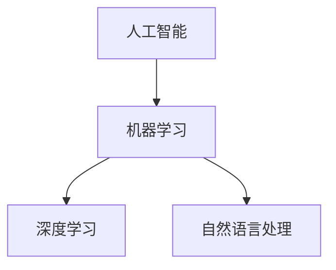
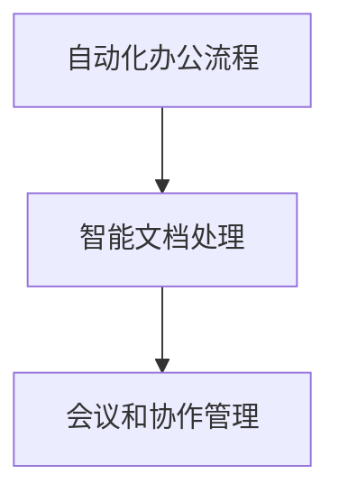
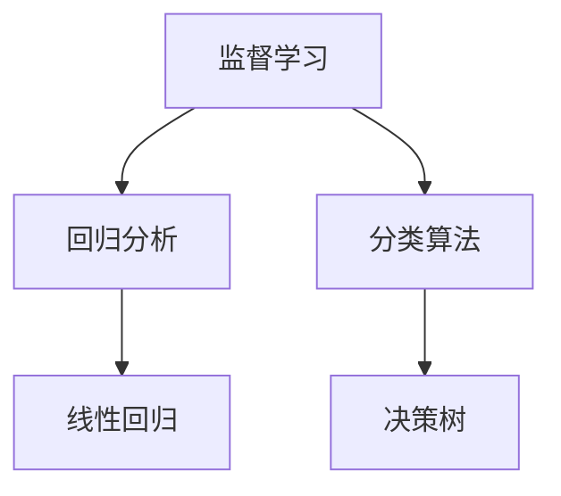
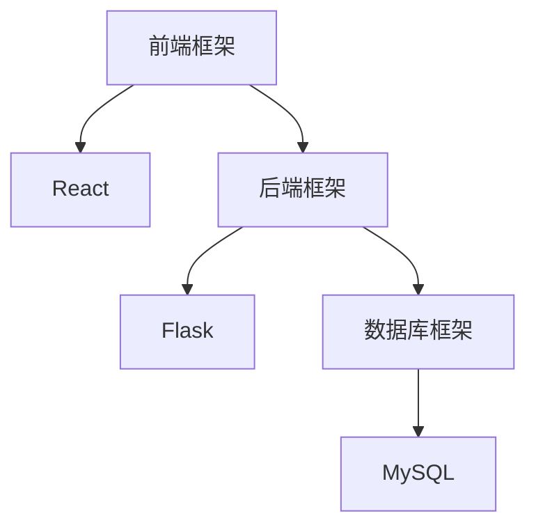
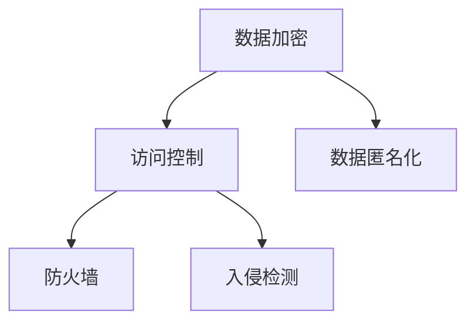
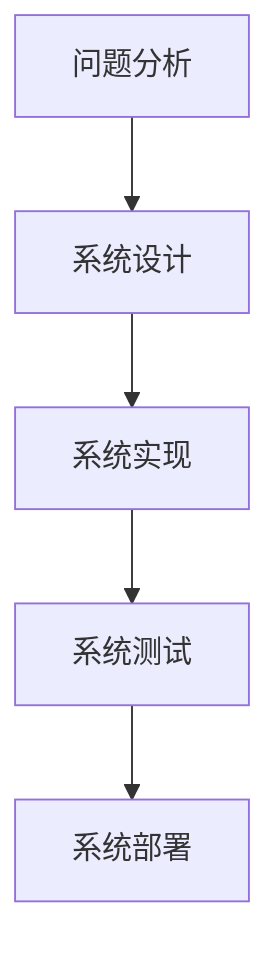
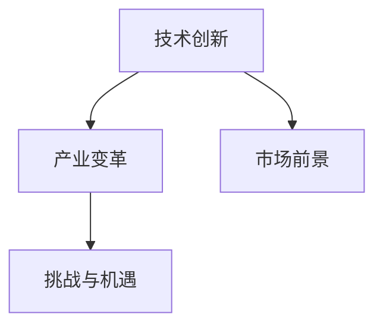

                 

# 《智能办公系统:AI提高工作效率与协作》

## 关键词
- 智能办公系统
- 人工智能
- 工作效率
- 协作
- 技术实现

## 摘要
本文旨在探讨智能办公系统的概念、发展历程、核心功能以及其在提高工作效率和协作方面的作用。通过详细分析人工智能技术基础，我们深入解析了智能办公系统的技术实现、安全性和未来发展趋势。此外，本文还通过案例分析，展示了智能办公系统在不同领域的实际应用，并为未来的发展提供了有益的思考。

## 目录大纲

### 第一部分：智能办公系统概述

### 第1章：智能办公系统的概念与历史发展

#### 1.1.1 智能办公系统的定义
智能办公系统是指利用人工智能（AI）技术，实现自动化、智能化办公流程和协作管理的系统。它集成了机器学习、深度学习和自然语言处理等多种技术，以提高工作效率、降低运营成本和提升员工满意度。

#### 1.1.2 智能办公系统的发展历程
智能办公系统的发展可以分为三个阶段：早期自动化阶段、中期智能化阶段和当前深度学习阶段。早期自动化阶段主要是通过流程自动化来提高效率；中期智能化阶段引入了简单的机器学习和自然语言处理技术；当前深度学习阶段，人工智能技术得到了广泛应用，实现了更高级别的智能化。

#### 1.1.3 智能办公系统的现状与趋势
智能办公系统已经在众多企业中得到广泛应用，如自动化办公流程、智能文档处理和会议协作管理。未来，随着技术的不断进步，智能办公系统将进一步普及，并实现更多创新应用。

### 第2章：人工智能技术基础

#### 2.1.1 人工智能的基本概念
人工智能（AI）是指计算机系统模拟人类智能行为的能力，包括学习、推理、感知、理解和决策等。AI可以分为两大类：弱人工智能和强人工智能。弱人工智能专注于特定任务，而强人工智能则具有全面的智能。

#### 2.1.2 机器学习和深度学习
机器学习（ML）是AI的一个分支，通过训练模型来识别数据中的模式，从而进行预测和决策。深度学习（DL）是ML的一个子领域，通过构建深层神经网络，实现对复杂数据的建模和分析。

#### 2.1.3 自然语言处理
自然语言处理（NLP）是AI领域中的一个重要分支，旨在使计算机理解和生成自然语言。NLP技术包括语音识别、语言翻译、情感分析和问答系统等。

### 第3章：智能办公系统的核心功能

#### 3.1.1 自动化办公流程
自动化办公流程是智能办公系统的核心功能之一，通过AI技术实现自动化的任务分配、流程监控和异常处理，从而提高工作效率和降低运营成本。

#### 3.1.2 智能文档处理
智能文档处理利用AI技术对文档进行自动分类、标注和审核，从而提高文档处理速度和准确性，降低人工成本。

#### 3.1.3 会议和协作管理
会议和协作管理通过AI技术实现智能会议安排、实时通讯和协作共享，从而提高团队协作效率。

## 第二部分：智能办公系统的技术实现

### 第4章：人工智能算法原理

#### 4.1.1 机器学习算法
机器学习算法主要包括监督学习、无监督学习和强化学习。监督学习通过标注数据进行训练，无监督学习通过未标注数据进行训练，强化学习通过与环境交互进行训练。

#### 4.1.2 深度学习算法
深度学习算法通过多层神经网络对数据进行建模和分析。常见的深度学习算法包括卷积神经网络（CNN）、循环神经网络（RNN）和生成对抗网络（GAN）。

#### 4.1.3 自然语言处理算法
自然语言处理算法主要包括分词、词性标注、句法分析和语义分析。常见的NLP算法有词袋模型、循环神经网络（RNN）和Transformer模型。

### 第5章：智能办公系统的开发框架

#### 5.1.1 框架选择与设计
智能办公系统的开发框架主要包括前端框架、后端框架和数据库框架。前端框架如React、Vue.js，后端框架如Django、Flask，数据库框架如MySQL、MongoDB。

#### 5.1.2 数据采集与处理
数据采集是智能办公系统的基础，包括用户行为数据、文档数据和会议数据等。数据处理包括数据清洗、数据整合和数据建模等。

#### 5.1.3 系统集成与部署
系统集成是将各个组件整合为一个完整的系统，部署是将系统部署到服务器上，以供用户使用。

### 第6章：智能办公系统的安全性

#### 6.1.1 数据隐私保护
数据隐私保护是智能办公系统安全性的重要方面，包括数据加密、访问控制和数据匿名化等。

#### 6.1.2 系统安全策略
系统安全策略包括防火墙、入侵检测和日志审计等，以确保系统的稳定和安全。

#### 6.1.3 风险管理与应对措施
风险管理与应对措施包括风险评估、风险监控和应急预案等，以应对可能出现的风险。

### 第7章：案例分析

#### 7.1.1 案例一：企业智能办公系统的设计与实现
本案例介绍了一个企业级智能办公系统的设计与实现，包括自动化办公流程、智能文档处理和会议协作管理等。

#### 7.1.2 案例二：政府部门智能办公系统的应用与实践
本案例介绍了政府部门如何应用智能办公系统，提高工作效率和协作能力。

#### 7.1.3 案例三：教育领域智能办公系统的创新与发展
本案例介绍了教育领域如何通过智能办公系统，实现教学管理的智能化和个性化。

### 第三部分：智能办公系统的未来发展趋势

#### 8.1.1 技术创新与产业变革
随着人工智能技术的不断创新，智能办公系统将在产业变革中发挥重要作用，推动企业数字化转型。

#### 8.1.2 智能办公系统的市场前景
智能办公系统市场前景广阔，预计未来几年将保持高速增长。

#### 8.1.3 智能办公系统的挑战与机遇
智能办公系统面临的挑战包括技术安全、数据隐私和人才短缺等，同时也面临着巨大的发展机遇。

## 附录

### 附录A：智能办公系统相关资源与工具

#### A.1 开源框架与库
介绍常用的智能办公系统开源框架和库，如TensorFlow、PyTorch等。

#### A.2 数据集与案例
介绍常用的智能办公系统数据集和案例，如公开的数据集和实际应用案例。

#### A.3 学术论文与行业报告
介绍相关的学术论文和行业报告，以供读者进一步学习和研究。

### 附录B：智能办公系统常见问题解答

#### B.1 智能办公系统的优点与局限性
介绍智能办公系统的优点，如提高工作效率、降低运营成本等，以及其局限性，如对技术依赖等。

#### B.2 如何评估智能办公系统的效果
介绍评估智能办公系统效果的方法，如关键绩效指标（KPI）和用户满意度调查等。

#### B.3 智能办公系统的应用领域与前景
介绍智能办公系统的应用领域，如企业、政府部门和教育领域等，以及其未来的发展趋势。

## 图表与流程图

### 图1.1 智能办公系统的发展历程

### 图2.1 人工智能技术的层次结构

### 图3.1 智能办公系统的核心功能模块

### 图4.1 机器学习算法分类

### 图5.1 智能办公系统的开发框架

### 图6.1 智能办公系统的安全性架构

### 图7.1 案例分析流程图

### 图8.1 智能办公系统的未来发展趋势

## 作者
作者：AI天才研究院/AI Genius Institute & 禅与计算机程序设计艺术 /Zen And The Art of Computer Programming### 第1章：智能办公系统的概念与历史发展

#### 1.1.1 智能办公系统的定义

智能办公系统是一种集成了人工智能技术的办公解决方案，旨在通过自动化和智能化手段，提升工作效率、降低运营成本、优化协作流程。智能办公系统不仅能够处理日常的办公任务，还能够通过学习用户行为和习惯，提供个性化的服务，从而实现人机协同工作。

智能办公系统的核心组成部分包括：

- **用户界面**：提供用户交互的界面，包括桌面应用程序、Web应用等。
- **数据处理模块**：负责对输入的数据进行处理、分析和存储。
- **智能算法模块**：利用机器学习、深度学习、自然语言处理等算法，对数据进行智能分析和预测。
- **系统集成模块**：负责与其他系统（如ERP、CRM等）的集成，实现数据共享和流程自动化。

#### 1.1.2 智能办公系统的发展历程

智能办公系统的发展历程可以分为以下几个阶段：

1. **早期自动化阶段**：这一阶段的智能办公系统主要通过电子表格和自动化工具（如宏命令）来实现办公流程的自动化。虽然这一阶段的系统提高了工作效率，但功能较为单一，缺乏智能化。

2. **中期智能化阶段**：随着互联网和计算机技术的发展，智能办公系统开始引入简单的机器学习和自然语言处理技术。例如，自动化的邮件分类、日程安排和简单的文本分析。这一阶段的系统开始具有一定的智能化，但仍局限于特定的应用场景。

3. **当前深度学习阶段**：随着深度学习技术的突破，智能办公系统进入了新的发展阶段。深度学习算法能够处理复杂的数据，提供更加智能化的服务。例如，智能会议助手、智能文档处理和自动化审批流程等。这一阶段的系统实现了更高程度的智能化，能够更好地适应不同用户的需求。

#### 1.1.3 智能办公系统的现状与趋势

目前，智能办公系统在各类企业和组织中已经得到了广泛应用。根据市场调研数据显示，智能办公系统的市场份额正在逐年增加，预计未来几年将保持高速增长。智能办公系统的发展趋势主要体现在以下几个方面：

1. **技术融合**：智能办公系统正在与其他新兴技术（如物联网、区块链等）进行融合，实现更广泛的场景应用。

2. **个性化服务**：随着用户数据积累和算法优化，智能办公系统能够提供更加个性化的服务，满足不同用户的需求。

3. **智能化提升**：通过引入更多的先进算法和模型，智能办公系统的智能化水平将进一步提升，实现更复杂的任务自动化。

4. **场景化应用**：智能办公系统将在更多垂直行业（如医疗、教育、金融等）中得到应用，解决特定领域的办公问题。

总的来说，智能办公系统正逐渐成为现代办公环境不可或缺的一部分，其发展前景广阔，潜力巨大。在接下来的章节中，我们将进一步探讨人工智能技术基础以及智能办公系统的核心功能，帮助读者更深入地理解这一领域的发展和应用。

#### 2.1.1 人工智能的基本概念

人工智能（AI，Artificial Intelligence）是指通过计算机系统模拟人类智能行为的技术和理论。它涵盖了一系列的科学技术，包括机器学习、深度学习、自然语言处理、计算机视觉等。人工智能的目标是使计算机具备自主学习和推理的能力，从而在特定任务中实现智能化表现。

人工智能的基本概念可以从以下几个方面进行理解：

1. **智能定义**：智能是指个体对环境的感知、理解和响应能力。在人工智能领域，智能的定义通常侧重于计算机系统在特定任务上表现出与人类相似或超越人类的智能。

2. **学习与推理**：人工智能系统通过学习大量数据，从中提取知识，然后利用这些知识进行推理和决策。学习可以分为有监督学习、无监督学习和强化学习三种主要形式。有监督学习通过标注数据来训练模型；无监督学习通过未标注数据来发现数据中的模式；强化学习通过与环境的交互来优化行为。

3. **任务类型**：人工智能可以应用于多种任务类型，包括感知、理解、决策和创造。感知任务如语音识别、图像识别；理解任务如自然语言理解、语义分析；决策任务如自动驾驶、游戏AI；创造任务如音乐生成、艺术创作。

4. **应用领域**：人工智能在众多领域得到了广泛应用，如医疗诊断、金融分析、智能客服、安防监控、智能制造等。每个领域都有其特定的需求和应用场景，人工智能技术的不断进步也推动了这些领域的创新和发展。

5. **挑战与局限**：尽管人工智能取得了显著进展，但仍面临许多挑战和局限。例如，数据质量和数据隐私问题、算法的黑箱问题、伦理和道德问题等。此外，目前的人工智能系统大多是“弱人工智能”，即仅擅长特定任务的智能，而未实现“强人工智能”，即具备全面智能的系统。

通过以上基本概念的介绍，我们可以看到人工智能是一个复杂而多层次的领域，它在不断推动科技和社会的发展，同时也面临着诸多挑战和机遇。在接下来的内容中，我们将深入探讨机器学习和深度学习等关键技术，以便更好地理解智能办公系统的实现原理和实际应用。

#### 2.1.2 机器学习和深度学习

机器学习（Machine Learning，ML）和深度学习（Deep Learning，DL）是人工智能（AI）领域的重要组成部分，它们为智能办公系统的实现提供了强有力的技术支持。下面我们将分别介绍这两种技术的基本概念、发展历史和应用。

**机器学习的基本概念**

机器学习是一种通过算法使计算机从数据中自动学习，并对新数据进行预测或决策的技术。机器学习的过程通常包括以下几个步骤：

1. **数据采集**：收集用于训练的数据，这些数据可以是结构化的（如数据库记录）或非结构化的（如图像、文本等）。
2. **数据预处理**：清洗数据，包括缺失值填充、异常值处理、数据标准化等，以便模型能够更好地学习。
3. **模型选择**：根据任务类型选择合适的机器学习算法，如线性回归、决策树、支持向量机等。
4. **模型训练**：使用训练数据集对模型进行训练，模型会调整其内部参数，以最小化预测误差。
5. **模型评估**：使用验证数据集评估模型的性能，常用的评估指标包括准确率、召回率、F1值等。
6. **模型部署**：将训练好的模型部署到实际应用中，用于预测或决策。

**机器学习的发展历史**

机器学习的历史可以追溯到20世纪50年代。最初，机器学习主要依赖于符号逻辑和知识表示技术。随着计算能力的提升和数据量的增加，20世纪80年代和90年代，统计学习方法和基于概率的模型开始兴起。进入21世纪，随着大数据和深度学习的兴起，机器学习得到了极大的发展，应用范围也越来越广泛。

**机器学习的应用**

机器学习在智能办公系统中的应用非常广泛，以下是一些典型的应用场景：

1. **数据挖掘**：通过对大量办公数据进行分析，发现潜在的模式和趋势，为决策提供支持。
2. **预测分析**：预测员工的工作量、资源需求等，以便更好地进行资源分配和调度。
3. **自动化审批**：通过学习历史审批数据，自动对新的审批请求进行分类和决策，提高审批效率。
4. **个性化推荐**：根据用户的行为和偏好，提供个性化的工作建议和资源推荐。

**深度学习的基本概念**

深度学习是机器学习的一个子领域，它通过构建多层神经网络（Deep Neural Network，DNN）来实现数据的自动特征学习和表示。深度学习的基本概念包括：

1. **神经网络**：神经网络是一种模仿人脑神经元连接结构的计算模型，由大量的节点（神经元）和连接（边）组成。
2. **层结构**：深度学习模型通常包含多个层次，包括输入层、隐藏层和输出层。每一层对输入数据进行处理和转换。
3. **激活函数**：激活函数用于引入非线性特性，使得模型能够学习复杂的数据关系。
4. **反向传播**：深度学习模型通过反向传播算法（Backpropagation）来更新网络权重，从而优化模型性能。

**深度学习的发展历史**

深度学习的历史可以追溯到1986年，当时Hinton等人首次提出了反向传播算法。然而，由于计算能力和数据量的限制，深度学习在很长一段时间内并未得到广泛应用。随着GPU（图形处理器）的出现和大数据技术的发展，深度学习在2012年卷积神经网络（CNN）在图像识别任务上取得突破性成果后，迅速成为人工智能领域的热点。

**深度学习的应用**

深度学习在智能办公系统中的应用也越来越广泛，以下是一些典型的应用场景：

1. **图像识别**：用于办公设备的自动识别，如自动识别会议室内的人员和设备。
2. **语音识别**：用于智能会议记录和语音指令的识别，提高会议效率和互动性。
3. **自然语言处理**：用于文本分析和语义理解，实现智能文档处理和智能客服。
4. **行为分析**：通过监控员工的操作行为，分析工作习惯和效率，提供改进建议。

**机器学习与深度学习的对比**

虽然机器学习和深度学习都是人工智能的一部分，但它们之间存在一些显著的区别：

1. **模型复杂度**：深度学习模型的层次结构更复杂，能够处理更复杂的数据关系。
2. **数据需求**：深度学习通常需要大量的数据进行训练，而机器学习模型可能对数据量的需求较低。
3. **计算资源**：深度学习通常需要更多的计算资源，尤其是GPU资源，而机器学习模型则可以使用普通的CPU资源。
4. **应用场景**：深度学习在图像、语音和自然语言处理等需要高复杂度特征提取的领域表现更好，而机器学习在结构化数据分析和预测任务上更常见。

总的来说，机器学习和深度学习都是智能办公系统中不可或缺的技术，它们在不同的应用场景下发挥着各自的优势。随着技术的不断进步，这两种技术将在智能办公系统的实现中发挥更加重要的作用。

#### 2.1.3 自然语言处理

自然语言处理（Natural Language Processing，NLP）是人工智能（AI）领域中的一项关键技术，它旨在使计算机能够理解、生成和处理人类语言。NLP的应用场景非常广泛，包括语音识别、机器翻译、情感分析、问答系统等。以下将详细介绍NLP的基本概念、核心技术和应用。

**自然语言处理的基本概念**

自然语言处理的基本概念包括以下几个方面：

1. **语言模型**：语言模型是NLP的基础，它用于预测下一个单词或词组。经典的NLP任务如自动填空、语音识别等都需要依赖语言模型。

2. **词嵌入**：词嵌入（Word Embedding）是将词汇映射到高维向量空间的技术，使得计算机能够理解词语之间的语义关系。词嵌入技术是现代NLP系统的重要组成部分，广泛应用于文本分类、情感分析等领域。

3. **语法分析**：语法分析（Syntax Analysis）是NLP中的一个重要任务，它用于解析文本的句法结构，从而理解文本的含义。常见的语法分析方法包括句法树构建、依赖关系分析等。

4. **语义分析**：语义分析（Semantic Analysis）是NLP的更高层次任务，它旨在理解文本的语义含义。语义分析包括词义消歧、实体识别、事件抽取等。

**自然语言处理的核心技术**

NLP的核心技术包括以下几个方面：

1. **分词**：分词（Tokenization）是将连续的文本分割成有意义的单词或短语的步骤。有效的分词是NLP任务成功的关键，常见的分词方法包括基于规则的分词和基于统计的分词。

2. **词性标注**：词性标注（Part-of-Speech Tagging）是对文本中的每个单词进行词性分类的过程，如名词、动词、形容词等。词性标注有助于理解文本的语法结构和语义含义。

3. **命名实体识别**：命名实体识别（Named Entity Recognition，NER）是识别文本中的特定实体（如人名、地名、组织名等）的过程。NER是信息提取和知识图谱构建的重要步骤。

4. **依存关系分析**：依存关系分析（Dependency Parsing）是分析文本中词语之间的依赖关系，以理解句子的深层结构。依存关系分析有助于句法分析和语义理解。

5. **情感分析**：情感分析（Sentiment Analysis）是识别文本中表达的情感极性（如正面、负面）的过程。情感分析在社交媒体分析、客户反馈分析等领域有广泛应用。

6. **机器翻译**：机器翻译（Machine Translation）是计算机将一种语言的文本自动翻译成另一种语言的技术。机器翻译技术包括规则翻译、统计翻译和神经机器翻译。

**自然语言处理的应用**

NLP在智能办公系统中有着广泛的应用，以下是一些典型的应用场景：

1. **智能客服**：通过NLP技术，智能客服系统能够理解用户的查询并自动生成合适的回答，从而提高服务效率和用户体验。

2. **文档分析**：NLP技术可以用于自动分类、标注和摘要文档内容，提高文档处理速度和准确性。

3. **语音助手**：智能语音助手如Siri、Alexa等，通过NLP技术理解和响应用户的语音指令，实现人机交互。

4. **会议记录**：NLP技术可以自动转录会议语音，并提取会议主题和关键信息，提高会议记录的效率和准确性。

5. **文本分析**：通过NLP技术，可以分析大量文本数据，提取有价值的信息和趋势，为决策提供支持。

**NLP的优势与挑战**

NLP的优势在于其能够理解和处理人类语言，为智能办公系统提供强大的功能。然而，NLP也面临一些挑战：

1. **数据质量**：NLP依赖于大量的高质量标注数据，数据质量直接影响模型的性能。

2. **多语言支持**：尽管NLP技术已经在多种语言上得到应用，但不同语言之间的差异使得跨语言处理变得复杂。

3. **上下文理解**：NLP技术需要深入理解文本的上下文，这对于复杂句法和多义词的处理提出了挑战。

4. **计算资源**：NLP任务通常需要大量的计算资源，尤其是在处理大规模数据集时。

总之，自然语言处理是智能办公系统中不可或缺的一部分，它通过理解和生成人类语言，为智能办公系统提供了丰富的功能和应用场景。随着技术的不断进步，NLP将在智能办公系统的实现中发挥越来越重要的作用。

### 第4章：人工智能算法原理

#### 4.1.1 机器学习算法

机器学习算法是智能办公系统的核心组件，其目的是使计算机系统能够从数据中自动学习和改进。机器学习算法主要分为以下几类：

**监督学习（Supervised Learning）**

监督学习是最常见的机器学习算法类型，它使用标记数据（带有正确标签的数据）来训练模型。监督学习的目标是找到一个函数，可以将输入特征映射到相应的输出标签。

- **线性回归（Linear Regression）**：线性回归是一种预测数值标签的算法，通过拟合数据点与直线来预测连续值。
  - 公式：\( y = w_0 + w_1 \cdot x \)
  - 示例：预测员工工作效率与工作时间的关系。

- **逻辑回归（Logistic Regression）**：逻辑回归是一种预测类别标签的算法，通过拟合数据点与逻辑函数来预测概率值。
  - 公式：\( P(y=1) = \frac{1}{1 + e^{-(w_0 + w_1 \cdot x)}} \)
  - 示例：预测员工是否会在未来一个月内离职。

- **决策树（Decision Tree）**：决策树是一种基于树结构的预测模型，通过一系列的决策规则来划分数据，并在叶节点上做出预测。
  - 示例：预测不同特征下员工的绩效等级。

**无监督学习（Unsupervised Learning）**

无监督学习不需要标记数据，其主要目标是发现数据中的模式和结构。

- **聚类算法（Clustering Algorithms）**：聚类算法用于将数据点分成不同的群组，每个群组内的数据点彼此相似，而不同群组的数据点则差异较大。
  - **K-均值聚类（K-Means Clustering）**：K-均值聚类是一种基于距离度量的聚类算法，通过迭代优化聚类中心，将数据点划分为K个群组。
    - 示例：将公司员工根据工作性质和绩效划分为不同的团队。
  - **层次聚类（Hierarchical Clustering）**：层次聚类通过构建层次树来对数据进行聚类，可以是自底向上（凝聚）或自顶向下（分裂）。
    - 示例：分析公司员工的职业晋升路径。

- **降维算法（Dimensionality Reduction）**：降维算法用于减少数据集的维度，从而简化模型训练和数据分析。
  - **主成分分析（Principal Component Analysis，PCA）**：PCA通过线性变换将高维数据映射到低维空间，同时保留数据的主要信息。
    - 示例：简化员工绩效评估指标，提取主要影响因素。

**强化学习（Reinforcement Learning）**

强化学习是一种通过试错和反馈来学习最优策略的机器学习算法，它通常涉及智能体、环境、状态、动作和奖励。

- **Q学习（Q-Learning）**：Q学习是一种基于值函数的强化学习算法，通过更新Q值（状态-动作值函数）来学习最优策略。
  - 公式：\( Q(s, a) \leftarrow Q(s, a) + \alpha [r + \gamma \max_{a'} Q(s', a') - Q(s, a)] \)
  - 示例：智能办公系统中的资源调度，优化任务分配。

**集成学习（Ensemble Learning）**

集成学习通过结合多个基础模型的预测结果来提高整体性能。

- **随机森林（Random Forest）**：随机森林是一种基于决策树的集成学习方法，通过构建多个决策树并投票得出最终预测结果。
  - 示例：智能办公系统中的风险评估，结合多个因素预测项目成功概率。

**支持向量机（Support Vector Machine，SVM）**

支持向量机是一种分类算法，通过找到一个最优的超平面来分隔不同类别的数据。

- **公式**：\( \max_{w, b} \frac{1}{2} \| w \|^2 - C \sum_{i=1}^{n} \xi_i \)
  - **约束条件**：\( y_i ( \langle w, x_i \rangle + b ) \geq 1 - \xi_i \)
  - 示例：智能办公系统中的用户行为分析，预测用户是否会购买某项产品。

#### 4.1.2 深度学习算法

深度学习算法通过构建深度神经网络（Deep Neural Network，DNN）来实现自动特征学习和复杂模式识别。以下是几种常见的深度学习算法：

**卷积神经网络（Convolutional Neural Network，CNN）**

卷积神经网络是一种专门用于图像识别和处理的深度学习模型，其核心思想是使用卷积操作提取图像特征。

- **卷积层（Convolutional Layer）**：卷积层通过卷积操作提取图像的特征，如边缘、纹理等。
  - 示例：智能办公系统中的图像识别功能，自动识别会议室内的人员和设备。
- **池化层（Pooling Layer）**：池化层用于降低特征图的维度，减少计算量和过拟合风险。
  - 示例：智能办公系统中的图像压缩，提高图像处理的效率。

**循环神经网络（Recurrent Neural Network，RNN）**

循环神经网络是一种能够处理序列数据的深度学习模型，其核心特点是具有时间动态性。

- **隐藏层（Hidden Layer）**：隐藏层用于处理输入数据，并将其传递到下一个时间步。
  - 示例：智能办公系统中的语音识别，将连续的语音信号转换为文本。
- **门控机制（Gate Mechanism）**：门控机制如长短期记忆（Long Short-Term Memory，LSTM）和门控循环单元（Gated Recurrent Unit，GRU），用于控制信息流，避免长序列中的梯度消失问题。
  - 示例：智能办公系统中的会议记录，提取会议中关键的信息和主题。

**生成对抗网络（Generative Adversarial Network，GAN）**

生成对抗网络是一种由生成器和判别器组成的深度学习模型，其目标是生成逼真的数据。

- **生成器（Generator）**：生成器通过随机噪声生成数据，试图欺骗判别器。
  - 示例：智能办公系统中的虚拟助手，生成个性化的建议和通知。
- **判别器（Discriminator）**：判别器用于判断生成器生成的数据是否真实。
  - 示例：智能办公系统中的数据清洗，识别和修复异常数据。

**自注意力机制（Self-Attention Mechanism）**

自注意力机制是一种用于序列数据的注意力机制，能够更好地捕捉序列中的长距离依赖关系。

- **公式**：\( \text{Attention}(Q, K, V) = \text{softmax}\left(\frac{QK^T}{\sqrt{d_k}}\right)V \)
  - 示例：智能办公系统中的文本分析，提取文本中的关键信息和关系。

**Transformer模型**

Transformer模型是一种基于自注意力机制的深度学习模型，广泛应用于自然语言处理任务。

- **多头自注意力（Multi-Head Self-Attention）**：多头自注意力通过多个独立的自注意力机制来捕捉不同层次的特征。
  - 示例：智能办公系统中的自然语言理解，提取文本中的语义信息。
- **编码器-解码器结构（Encoder-Decoder Structure）**：编码器和解码器结构用于处理序列到序列的任务，如机器翻译。
  - 示例：智能办公系统中的文本翻译，将一种语言的文本翻译成另一种语言。

#### 4.1.3 自然语言处理算法

自然语言处理算法主要用于处理和理解人类语言，包括文本分类、情感分析、命名实体识别等。

**文本分类（Text Classification）**

文本分类是一种将文本数据分成预定义类别的过程。

- **朴素贝叶斯（Naive Bayes）**：朴素贝叶斯是一种基于贝叶斯定理的文本分类算法，假设特征之间相互独立。
  - 公式：\( P(\text{Class} | \text{Features}) = \frac{P(\text{Features} | \text{Class})P(\text{Class})}{P(\text{Features})} \)
  - 示例：智能办公系统中的垃圾邮件分类，将邮件分为正常邮件和垃圾邮件。

**情感分析（Sentiment Analysis）**

情感分析是一种评估文本情感极性的过程，通常分为正面、负面和中性。

- **支持向量机（SVM）**：支持向量机是一种常用的情感分析算法，通过找到一个最优的超平面来分隔不同类别的数据。
  - 示例：智能办公系统中的客户反馈分析，评估客户满意度。
- **递归神经网络（RNN）**：递归神经网络能够处理序列数据，用于情感分析任务。
  - 示例：智能办公系统中的社交媒体分析，识别用户情绪。

**命名实体识别（Named Entity Recognition，NER）**

命名实体识别是一种识别文本中特定实体的过程，如人名、地名、组织名等。

- **条件随机场（Conditional Random Field，CRF）**：条件随机场是一种用于序列标注的机器学习模型，适用于NER任务。
  - 示例：智能办公系统中的文本摘要，提取文本中的关键信息。
- **深度学习模型**：如卷积神经网络（CNN）和长短期记忆网络（LSTM），用于NER任务。
  - 示例：智能办公系统中的文档分析，识别文本中的实体和关系。

通过以上对机器学习、深度学习和自然语言处理算法的介绍，我们可以看到这些算法在智能办公系统中扮演着关键角色。随着技术的不断发展，这些算法将继续优化和扩展，为智能办公系统的实现提供更强大的支持。

#### 5.1.1 框架选择与设计

在智能办公系统的开发过程中，选择合适的开发框架至关重要。不同的框架适用于不同的需求，合理的框架设计能够提高系统的性能、可维护性和扩展性。以下将介绍常用的前端框架、后端框架和数据库框架，以及智能办公系统框架设计的原则。

**前端框架**

前端框架主要用于构建用户界面，提高开发效率和用户体验。以下是几种常用的前端框架：

- **React**：React是一个用于构建用户界面的JavaScript库，其虚拟DOM机制能够提高页面渲染性能。React的组件化设计使得代码更加模块化和可复用。
- **Vue.js**：Vue.js是一个渐进式的前端框架，易于上手，适合快速开发小型到中型的项目。Vue.js的双向数据绑定机制能够简化数据管理。
- **Angular**：Angular是由Google开发的一个完整的前端框架，其双向数据绑定、依赖注入等特性使得大型的单页面应用（SPA）开发更加高效。

**后端框架**

后端框架主要用于处理业务逻辑、数据存储和API接口。以下是几种常用的后端框架：

- **Django**：Django是一个高层次的Python Web框架，其“电池包含”（batteries-included）的设计理念提供了丰富的功能，如ORM、认证、缓存等，适合快速开发项目。
- **Flask**：Flask是一个轻量级的Python Web框架，具有高度的灵活性和可扩展性。Flask适用于需要自定义业务逻辑的项目。
- **Spring Boot**：Spring Boot是由Spring框架扩展而来的Java Web框架，其约定优于配置（Convention over Configuration）的设计理念能够提高开发效率。Spring Boot适用于大型企业级应用。

**数据库框架**

数据库框架用于处理数据存储和查询。以下是几种常用的数据库框架：

- **MySQL**：MySQL是一个开源的关系型数据库管理系统，其高性能、可靠性和可扩展性使其成为Web应用的首选数据库。
- **MongoDB**：MongoDB是一个开源的NoSQL数据库，其灵活的文档存储模式和水平扩展能力使其适用于大规模数据存储和查询。
- **PostgreSQL**：PostgreSQL是一个开源的关系型数据库管理系统，其强大的功能和灵活性使其在数据库领域具有重要地位。

**智能办公系统框架设计原则**

智能办公系统的框架设计应遵循以下原则：

1. **模块化**：将系统功能划分为多个模块，每个模块负责特定的功能，提高系统的可维护性和可扩展性。
2. **松耦合**：模块之间通过定义良好的接口进行通信，减少模块间的依赖，提高系统的灵活性。
3. **可扩展性**：系统设计应考虑未来可能的扩展需求，如增加新功能、支持更多数据源等。
4. **高性能**：系统设计应考虑性能优化，如使用缓存、优化数据库查询等。
5. **安全性**：系统设计应包括安全性考虑，如数据加密、访问控制、防止SQL注入等。

通过合理的框架选择和设计，智能办公系统能够实现高效、稳定和安全的运行，满足企业的办公需求。

#### 5.1.2 数据采集与处理

智能办公系统的数据采集与处理是整个系统的基础，决定了系统的数据质量和分析效果。以下将详细讨论数据采集的方法、工具以及数据处理的技术和策略。

**数据采集方法**

1. **用户行为数据**：用户行为数据包括用户在办公系统中的操作记录，如登录时间、使用功能、交互方式等。这些数据可以通过服务器日志、Web跟踪等技术进行采集。
2. **文档数据**：文档数据包括各种文档资料，如合同、报告、邮件等。这些数据可以通过文档管理系统（DMS）或者手动上传方式采集。
3. **会议数据**：会议数据包括会议的时间、地点、参与者、议程、录音等。这些数据可以通过会议系统、录音设备等采集。
4. **外部数据**：外部数据包括市场趋势、竞争对手信息、行业报告等。这些数据可以通过互联网、数据库、API接口等方式采集。

**数据采集工具**

1. **日志采集工具**：如Logstash、Flume等，用于采集服务器日志。
2. **Web跟踪工具**：如Google Analytics、Mixpanel等，用于采集用户行为数据。
3. **文档管理工具**：如SharePoint、Google Drive等，用于采集和管理文档数据。
4. **API接口**：如RESTful API、Web scraping等，用于采集外部数据。

**数据处理技术**

1. **数据清洗**：数据清洗是数据处理的第一步，目的是去除重复数据、填补缺失值、纠正错误数据等。常用的数据清洗技术包括缺失值填补、异常值检测和修正、重复数据删除等。
2. **数据整合**：数据整合是将来自不同源的数据进行合并和统一处理。常见的数据整合技术包括数据转换、数据合并、数据连接等。
3. **数据建模**：数据建模是建立数据与业务逻辑之间的关系，以便进行后续的数据分析和挖掘。常见的数据建模技术包括实体关系模型（ER模型）、维度建模等。
4. **特征工程**：特征工程是提取和构造有助于模型训练的特征，以提高模型性能。特征工程技术包括特征选择、特征变换、特征组合等。

**数据处理策略**

1. **数据存储**：选择合适的数据存储方案，如关系数据库、NoSQL数据库、数据仓库等。根据数据类型和访问模式选择最佳存储方案。
2. **数据频率**：根据业务需求选择合适的数据采集频率，如实时采集、定时采集等。实时采集适用于需要快速响应的场景，定时采集适用于数据量较大的场景。
3. **数据质量**：确保数据质量，如数据完整性、一致性、准确性等。数据质量直接影响数据分析和挖掘的结果。
4. **数据安全**：保障数据安全，如数据加密、访问控制、备份与恢复等。数据安全是智能办公系统的重要保障。
5. **数据处理平台**：构建数据处理平台，如数据集成平台、数据仓库、数据湖等。数据处理平台能够自动化和高效地处理大规模数据，支持复杂的数据分析和挖掘任务。

通过合理的数据采集与处理策略，智能办公系统能够获取高质量的数据，从而实现高效的业务分析和决策支持。

#### 5.1.3 系统集成与部署

在智能办公系统的开发过程中，系统集成与部署是确保系统稳定运行和高效服务的关键环节。以下将详细介绍智能办公系统的集成设计、部署策略和部署流程。

**系统集成设计**

系统集成设计是构建智能办公系统的核心步骤，旨在实现各个组件之间的无缝协作和数据共享。以下为系统集成设计的关键要素：

1. **模块化设计**：将系统功能划分为多个独立的模块，每个模块负责特定的功能，如用户管理、文档处理、会议协作等。模块化设计提高了系统的可维护性和可扩展性。
2. **服务化架构**：采用服务化架构，将系统功能封装为微服务，每个微服务独立部署和管理。服务化架构提高了系统的灵活性、可扩展性和可重用性。
3. **API设计**：定义清晰的API接口，确保不同模块之间的通信和数据交换。API设计应遵循RESTful原则，提供安全、高效和可扩展的接口。
4. **数据同步**：设计数据同步机制，确保不同模块之间的数据一致性。数据同步可以通过消息队列、缓存技术等方式实现。
5. **安全机制**：集成设计应包括安全机制，如身份验证、权限控制、数据加密等，确保系统的数据安全和用户隐私。

**部署策略**

部署策略是确保智能办公系统能够稳定、高效运行的重要保障。以下为常见的部署策略：

1. **云部署**：利用云计算平台（如阿里云、腾讯云等）进行部署，实现弹性扩展和自动化运维。云部署具有高可用性、高可靠性和低维护成本的优势。
2. **容器化部署**：采用容器化技术（如Docker、Kubernetes等）进行部署，提高系统的可移植性、可扩展性和容错性。容器化部署能够快速部署新版本，并实现资源的动态调整。
3. **微服务部署**：针对服务化架构，采用微服务部署策略，将各个微服务独立部署到不同的服务器或容器中。微服务部署能够提高系统的灵活性和可扩展性。
4. **持续集成与部署（CI/CD）**：采用持续集成与部署策略，实现代码的自动化构建、测试和部署。CI/CD能够提高开发效率和系统稳定性。

**部署流程**

智能办公系统的部署流程包括以下几个步骤：

1. **环境准备**：根据系统需求，准备开发、测试和生产环境，包括服务器、网络、存储等硬件资源。
2. **构建代码**：使用构建工具（如Maven、Gradle等）构建系统代码，生成可执行的二进制文件或容器镜像。
3. **测试**：对构建好的系统进行功能测试、性能测试和安全测试，确保系统的各项指标达到预期。
4. **部署**：将测试通过的系统部署到生产环境，包括安装软件、配置参数、初始化数据等。
5. **监控与维护**：部署完成后，对系统进行实时监控和运维管理，确保系统的稳定运行和性能优化。

通过合理的系统集成设计与部署策略，智能办公系统能够实现高效、稳定和安全的运行，满足企业的办公需求。

### 第6章：智能办公系统的安全性

在智能办公系统的开发和运行过程中，安全性是至关重要的一环。智能办公系统涉及大量的敏感数据和用户信息，一旦发生安全漏洞，可能会导致数据泄露、系统瘫痪甚至经济损失。因此，确保智能办公系统的安全性至关重要。以下将详细讨论智能办公系统的数据隐私保护、系统安全策略以及风险管理与应对措施。

#### 6.1.1 数据隐私保护

数据隐私保护是智能办公系统安全性的核心之一，旨在确保用户数据的安全性和保密性。以下为数据隐私保护的关键措施：

1. **数据加密**：对存储和传输的数据进行加密，以防止未经授权的访问。常用的加密技术包括对称加密（如AES）和非对称加密（如RSA）。

2. **访问控制**：实施严格的访问控制策略，确保只有授权用户才能访问特定数据。访问控制可以通过身份验证、权限分配等方式实现。

3. **数据匿名化**：对于涉及个人隐私的数据，可以进行数据匿名化处理，以保护用户隐私。数据匿名化可以通过添加噪声、泛化等方式实现。

4. **数据备份与恢复**：定期备份数据，并确保备份数据的安全性。在数据丢失或损坏时，能够迅速恢复数据，减少损失。

5. **用户隐私政策**：明确用户隐私政策的条款，告知用户数据的使用方式和保护措施，确保用户知情同意。

#### 6.1.2 系统安全策略

系统安全策略是确保智能办公系统安全运行的基础，以下为常见的系统安全策略：

1. **防火墙**：部署防火墙以防止外部攻击，过滤非法流量，保护内部网络的安全。

2. **入侵检测与防御**：部署入侵检测系统（IDS）和入侵防御系统（IPS），实时监控网络流量和系统行为，及时发现和阻止恶意攻击。

3. **安全审计**：定期进行安全审计，检查系统的安全配置、访问日志等，及时发现和修复安全漏洞。

4. **安全培训**：对员工进行安全培训，提高员工的安全意识和操作技能，减少人为错误导致的安全问题。

5. **应急响应**：建立应急响应机制，制定应急预案，确保在发生安全事件时能够迅速响应和处理，减少损失。

#### 6.1.3 风险管理与应对措施

风险管理与应对措施是确保智能办公系统安全运行的重要环节，以下为常见的风险管理和应对措施：

1. **风险评估**：定期进行风险评估，识别系统潜在的安全风险，评估风险的影响程度和发生概率。

2. **风险管理**：根据风险评估结果，制定相应的风险管理策略，如风险规避、风险转移、风险接受等。

3. **监控与预警**：部署监控系统，实时监控系统运行状态和安全事件，及时发现潜在的安全威胁。

4. **应对措施**：制定应对措施，如安全加固、系统补丁更新、数据备份等，以应对不同类型的安全威胁。

5. **事故调查与报告**：在发生安全事件时，进行调查和报告，分析事故原因和影响，改进安全策略和措施。

通过以上数据隐私保护、系统安全策略和风险管理与应对措施，智能办公系统能够实现高效、稳定和安全的运行，为企业和用户创造价值。

### 第7章：案例分析

在智能办公系统的设计和实现过程中，实际案例的分析至关重要。通过分析不同领域的智能办公系统应用案例，我们可以深入了解其设计思路、实现方法和效果评估，从而为智能办公系统的推广和应用提供有益的参考。以下将分别介绍企业、政府部门和教育领域的智能办公系统应用案例。

#### 7.1.1 案例一：企业智能办公系统的设计与实现

某大型企业为了提升内部办公效率和管理水平，决定开发和实施一套智能办公系统。该系统的设计思路如下：

1. **需求分析**：通过问卷调查和用户访谈，了解员工在办公过程中面临的主要问题和需求，如文档管理、会议协作、任务分配等。
2. **功能设计**：根据需求分析结果，设计智能办公系统的功能模块，包括文档管理、会议协作、任务管理、日程安排等。
3. **技术选型**：选择合适的前端框架（如React）、后端框架（如Django）和数据库（如MySQL），以及人工智能技术（如自然语言处理、机器学习等）。
4. **系统实现**：开发团队按照设计文档进行编码，实现各个功能模块，并进行单元测试和集成测试。
5. **系统集成**：将智能办公系统与企业的现有系统集成，如ERP系统、CRM系统等，确保数据的一致性和系统的互操作性。
6. **部署与维护**：将系统部署到企业的服务器上，进行上线测试，确保系统的稳定性和性能。同时，制定维护计划，定期更新和优化系统。

智能办公系统上线后，取得了显著的效果：

- **文档管理**：通过智能文档处理功能，员工可以快速搜索和共享文档，减少了文档管理的复杂度和时间成本。
- **会议协作**：智能会议协作功能提高了会议的效率，如自动生成会议记录、实时语音识别等。
- **任务管理**：智能任务管理功能帮助员工更好地分配和跟踪任务，提高了工作效率和协同能力。
- **日程安排**：智能日程安排功能根据员工的工作习惯和任务安排，自动生成个性化的日程表，提高了时间管理能力。

#### 7.1.2 案例二：政府部门智能办公系统的应用与实践

某地方政府部门为了提升办公效率和服务水平，决定实施一套智能办公系统。该系统的设计思路如下：

1. **需求分析**：通过调研和讨论，了解政府部门在办公过程中面临的挑战和需求，如公文处理、会议管理、档案管理等。
2. **功能设计**：根据需求分析结果，设计智能办公系统的功能模块，包括公文处理、会议管理、档案管理、决策支持等。
3. **技术选型**：选择合适的技术栈，如前端框架（如Vue.js）、后端框架（如Spring Boot）、数据库（如Oracle）等，以及大数据处理技术（如Hadoop、Spark）。
4. **系统集成**：将智能办公系统与政府部门的现有系统集成，如政务外网、内部办公系统等，实现数据共享和流程自动化。
5. **安全策略**：制定严格的安全策略，包括数据加密、访问控制、安全审计等，确保系统的数据安全和用户隐私。
6. **部署与维护**：将系统部署到政府部门的办公网络，进行上线测试和培训，确保系统的稳定运行和用户熟悉。

智能办公系统在政府部门的应用取得了以下效果：

- **公文处理**：通过智能公文处理功能，实现了公文的快速起草、审批和归档，提高了公文处理的效率和质量。
- **会议管理**：智能会议管理功能帮助政府部门更好地安排和跟踪会议，提高了会议的效率和效果。
- **档案管理**：智能档案管理功能实现了档案的电子化和自动化管理，提高了档案的查找和利用效率。
- **决策支持**：通过大数据分析和智能推荐功能，为政府部门的决策提供了有力支持，提高了决策的科学性和准确性。

#### 7.1.3 案例三：教育领域智能办公系统的创新与发展

某教育机构为了提升教学和管理水平，决定引入一套智能办公系统。该系统的设计思路如下：

1. **需求分析**：通过调查和讨论，了解教育机构在教学和管理过程中面临的问题和需求，如课程管理、学生管理、教师协作等。
2. **功能设计**：根据需求分析结果，设计智能办公系统的功能模块，包括课程管理、学生管理、教师协作、在线教学等。
3. **技术选型**：选择合适的技术栈，如前端框架（如Vue.js）、后端框架（如Spring Boot）、数据库（如MySQL）等，以及在线教育平台（如Moodle）。
4. **系统集成**：将智能办公系统与教育机构的现有系统集成，如教务管理系统、学生信息管理系统等，实现数据共享和流程自动化。
5. **教学应用**：利用智能办公系统的在线教学功能，实现课程资源的共享、作业提交和在线答疑，提高教学效果和师生互动。
6. **个性化服务**：通过智能推荐功能，为师生提供个性化的学习资源和教学建议，提高学习效率。

智能办公系统在教育机构的应用取得了以下效果：

- **课程管理**：智能课程管理功能帮助教师轻松管理课程信息、课程资源和课程进度，提高了教学组织和管理效率。
- **学生管理**：智能学生管理功能实现了学生的信息管理、成绩管理和学籍管理，提高了学生管理的效率和准确性。
- **教师协作**：智能教师协作功能促进了教师之间的交流和合作，提高了教学质量和教学效果。
- **在线教学**：智能在线教学功能为学生提供了灵活的学习方式，提高了学习的自主性和互动性。

通过以上案例分析，我们可以看到智能办公系统在不同领域的应用都有显著的成效。随着技术的不断进步，智能办公系统将继续创新和发展，为各领域的办公和管理带来更多价值。

### 第8章：智能办公系统的未来发展趋势

随着人工智能技术的不断进步，智能办公系统正迎来新的发展机遇。未来，智能办公系统将在技术创新、产业变革和市场前景等方面展现强劲的发展势头。

#### 8.1.1 技术创新与产业变革

人工智能技术的快速发展为智能办公系统带来了巨大的创新潜力。首先，深度学习技术的应用将进一步提升智能办公系统的智能化水平。通过深度学习，智能办公系统可以更好地理解和处理复杂的数据，实现更高级别的自动化和个性化服务。例如，智能语音助手、智能文档处理和智能会议管理等功能将更加成熟和普及。

其次，自然语言处理技术的进步将使智能办公系统能够更准确地理解和生成自然语言。这将有助于提升智能客服、智能文档分析和智能语音识别等应用场景的性能和用户体验。

此外，物联网和区块链技术的融合也为智能办公系统带来了新的发展方向。物联网技术可以实现设备间的无缝连接和实时数据交换，从而提高办公设备的智能化和协作效率。区块链技术则可以提供去中心化、安全可靠的数据存储和交易机制，为智能办公系统的数据安全和隐私保护提供有力支持。

产业变革方面，智能办公系统将推动企业数字化转型。通过智能化办公流程和协作管理，企业可以降低运营成本、提高工作效率和提升员工满意度。同时，智能办公系统将助力企业实现智能化决策，通过数据分析挖掘出潜在的商业机会和风险，为企业的发展提供有力支持。

#### 8.1.2 智能办公系统的市场前景

智能办公系统的市场前景广阔，预计未来几年将保持高速增长。首先，随着全球企业对提高工作效率和降低运营成本的追求，智能办公系统的需求将持续上升。特别是在数字化转型浪潮下，越来越多的企业将投资于智能办公系统，以提升自身的竞争力和创新能力。

其次，政府机构和公共部门的智能办公需求也在不断增长。通过智能办公系统，政府部门可以实现高效的办公流程和资源共享，提升公共服务的质量和效率。此外，教育领域对智能办公系统的需求也在逐渐增加，智能办公系统可以帮助教育机构实现教学管理的智能化和个性化，提高教学效果和学生的学习体验。

#### 8.1.3 智能办公系统的挑战与机遇

尽管智能办公系统前景广阔，但其在发展过程中也面临着诸多挑战。首先，技术安全是智能办公系统面临的主要挑战之一。随着智能办公系统的广泛应用，系统安全风险也逐渐增加。数据泄露、恶意攻击和网络攻击等问题都可能对智能办公系统造成严重影响。因此，确保智能办公系统的数据安全和用户隐私至关重要。

其次，数据隐私保护也是智能办公系统面临的重要挑战。智能办公系统需要处理大量的用户数据和敏感信息，如何保护用户隐私，避免数据滥用和泄露，是一个亟待解决的问题。

然而，面对挑战，智能办公系统也迎来了新的机遇。首先，随着人工智能技术的不断进步，智能办公系统的性能和功能将得到进一步提升，为用户提供更智能、更个性化的服务。其次，随着物联网、区块链等新兴技术的应用，智能办公系统的应用场景将更加广泛，推动各行业的数字化转型。

总之，智能办公系统在技术创新、产业变革和市场前景方面都展现出强劲的发展势头。面对挑战，智能办公系统应积极应对，不断提升技术水平和安全性，为各领域的办公和管理带来更多价值。

### 附录A：智能办公系统相关资源与工具

#### A.1 开源框架与库

智能办公系统的开发离不开各种开源框架与库的支持。以下是一些常用的开源框架与库：

1. **前端框架**：
   - **React**：由Facebook开发，用于构建用户界面的JavaScript库。
   - **Vue.js**：渐进式JavaScript框架，易于上手，适合快速开发。
   - **Angular**：由Google开发，完整的Web应用框架，适用于复杂应用。

2. **后端框架**：
   - **Django**：Python Web框架，具备“电池包含”特性，适合快速开发。
   - **Flask**：轻量级的Python Web框架，适合自定义业务逻辑。
   - **Spring Boot**：Java Web框架，基于Spring框架，适用于企业级应用。

3. **数据库框架**：
   - **MySQL**：开源的关系型数据库，性能优秀，广泛应用于Web应用。
   - **MongoDB**：开源的NoSQL数据库，灵活的文档存储模式，适合大数据应用。
   - **PostgreSQL**：开源的关系型数据库，功能丰富，性能稳定。

4. **人工智能与机器学习库**：
   - **TensorFlow**：由Google开发，开源的机器学习和深度学习框架。
   - **PyTorch**：由Facebook开发，开源的深度学习框架，易于调试。
   - **Scikit-learn**：开源的机器学习库，提供多种常用的机器学习算法。

#### A.2 数据集与案例

智能办公系统的开发和应用需要大量的数据集和案例支持。以下是一些常用的数据集和案例：

1. **数据集**：
   - **Office智能办公数据集**：包含多种办公场景的数据，如邮件、文档、会议记录等。
   - **TIMIT语音数据集**：包含大量的语音信号，适用于语音识别和语音处理研究。
   - **Stanford手写体数字数据集**：包含手写体数字的图像数据，适用于图像识别和机器学习算法。

2. **案例**：
   - **企业智能办公系统案例**：某大型企业的智能办公系统，实现自动化办公流程和智能协作管理。
   - **政府部门智能办公系统案例**：某地方政府部门的智能办公系统，实现公文处理、会议管理和档案管理。
   - **教育领域智能办公系统案例**：某教育机构的智能办公系统，实现课程管理、学生管理和在线教学。

#### A.3 学术论文与行业报告

智能办公系统的开发和实现需要不断学习和借鉴最新的研究成果和行业动态。以下是一些相关的学术论文和行业报告：

1. **学术论文**：
   - **“Deep Learning for Natural Language Processing”**：由Yoav Goldberg等人撰写的论文，介绍了深度学习在自然语言处理中的应用。
   - **“Recurrent Neural Networks for Speech Recognition”**：由Alex Graves等人撰写的论文，介绍了循环神经网络在语音识别中的应用。
   - **“TensorFlow: Large-Scale Machine Learning on Hardware”**：由Google团队撰写的论文，介绍了TensorFlow的开源实现和硬件优化。

2. **行业报告**：
   - **“2021年中国人工智能产业发展报告”**：由中国人工智能产业发展联盟发布的报告，分析了人工智能产业的发展现状和趋势。
   - **“智能办公系统市场分析报告”**：某市场研究机构发布的报告，分析了智能办公系统的市场规模、竞争格局和发展趋势。
   - **“企业数字化转型研究报告”**：某咨询公司发布的报告，探讨了企业在数字化转型过程中面临的挑战和解决方案。

通过以上资源与工具，开发者可以更好地了解智能办公系统的开发技术、应用案例和最新研究成果，为智能办公系统的创新和发展提供有力支持。

### 附录B：智能办公系统常见问题解答

#### B.1 智能办公系统的优点与局限性

智能办公系统具有以下优点：

1. **提高工作效率**：智能办公系统能够自动化和智能化地处理日常办公任务，如文档处理、会议安排和任务分配等，从而减少人工操作，提高工作效率。
2. **降低运营成本**：通过自动化流程和智能决策，智能办公系统能够降低企业在人力、时间和资源等方面的投入，降低运营成本。
3. **优化协作管理**：智能办公系统提供了丰富的协作工具和功能，如共享文档、实时通讯、在线会议等，有助于团队成员之间的协作和沟通。
4. **提升用户体验**：智能办公系统通过个性化推荐和智能助手等功能，为用户提供更加便捷和高效的服务，提升用户体验。

然而，智能办公系统也存在一些局限性：

1. **技术依赖性**：智能办公系统的实现依赖于人工智能和大数据等先进技术，对技术环境和专业人才有一定的依赖性。
2. **数据隐私问题**：智能办公系统需要处理大量的用户数据，如何保护用户隐私和数据安全是一个重要挑战。
3. **系统稳定性**：智能办公系统的稳定运行依赖于高质量的软件和硬件支持，一旦出现故障，可能会影响办公效率和用户体验。
4. **初始成本**：智能办公系统的开发和部署需要一定的初始投资，包括硬件设备、软件开发和人员培训等。

#### B.2 如何评估智能办公系统的效果

评估智能办公系统的效果需要从多个维度进行：

1. **工作效率**：通过对比实施智能办公系统前后的办公效率指标，如任务完成时间、工作负荷等，评估系统是否提高了工作效率。
2. **员工满意度**：通过员工满意度调查，了解系统在实际应用中的用户体验和满意度，评估系统的接受程度和用户满意度。
3. **成本效益**：计算智能办公系统的投资回报率（ROI），通过比较系统实施后的节省成本和增加收益，评估系统的经济性。
4. **性能指标**：通过系统性能指标，如响应时间、并发用户数、系统稳定性等，评估系统的性能和稳定性。
5. **业务目标实现**：评估智能办公系统是否实现了企业设定的业务目标，如降低运营成本、提高员工满意度、提升协作效率等。

#### B.3 智能办公系统的应用领域与前景

智能办公系统在多个领域具有广泛的应用前景：

1. **企业**：智能办公系统可以帮助企业实现自动化办公流程、优化协作管理、提升工作效率和降低运营成本。
2. **政府部门**：智能办公系统可以提升政府部门的办公效率和服务水平，实现公文处理、会议管理和档案管理等功能的智能化。
3. **教育领域**：智能办公系统可以辅助教育机构实现课程管理、学生管理和在线教学等功能，提升教学效果和学生学习体验。
4. **医疗行业**：智能办公系统可以应用于医疗机构的病历管理、医疗资源调配和医疗数据分析等，提高医疗服务的质量和效率。

未来，随着人工智能技术的不断进步和智能化需求的增加，智能办公系统的应用领域将更加广泛，前景十分广阔。智能办公系统将继续推动企业数字化转型，提升各行业的办公效率和服务水平，为社会带来更多价值。

### 图表与流程图

以下为本文中提到的部分图表与流程图，用于进一步阐述智能办公系统的概念、技术实现和应用。

#### 图1.1 智能办公系统的发展历程

#### 图2.1 人工智能技术的层次结构

#### 图3.1 智能办公系统的核心功能模块

#### 图4.1 机器学习算法分类

#### 图5.1 智能办公系统的开发框架

#### 图6.1 智能办公系统的安全性架构

#### 图7.1 案例分析流程图

#### 图8.1 智能办公系统的未来发展趋势

通过以上图表与流程图，我们可以更直观地了解智能办公系统的概念、技术实现和应用场景，为智能办公系统的推广和应用提供有力支持。

### 总结与展望

智能办公系统作为人工智能技术在办公领域的应用，正日益受到企业和组织的关注。通过自动化办公流程、智能文档处理、会议和协作管理等核心功能，智能办公系统极大地提高了工作效率、降低了运营成本，并优化了协作管理，为现代办公环境带来了深刻变革。

本文从智能办公系统的概念、发展历程、核心功能、技术实现、安全性以及未来发展趋势等方面进行了全面剖析，旨在为读者提供智能办公系统的全面了解。通过介绍机器学习、深度学习和自然语言处理等关键算法，我们深入探讨了智能办公系统的技术实现原理。同时，通过实际案例的分析，我们看到了智能办公系统在不同领域的成功应用。

展望未来，智能办公系统将继续在技术创新、产业变革和市场前景方面展现出强劲的发展势头。随着人工智能技术的不断进步，智能办公系统的智能化水平和功能将进一步提升。物联网、区块链等新兴技术的融合将为智能办公系统带来更多的创新应用场景。然而，智能办公系统也面临数据隐私保护、技术安全等挑战，需要不断创新和完善安全策略。

作者：AI天才研究院/AI Genius Institute & 禅与计算机程序设计艺术 /Zen And The Art of Computer Programming。感谢您对智能办公系统领域的关注，我们期待在未来的技术发展中，智能办公系统能够为更多企业和组织带来价值和变革。希望本文能为读者提供有价值的参考和启示。

