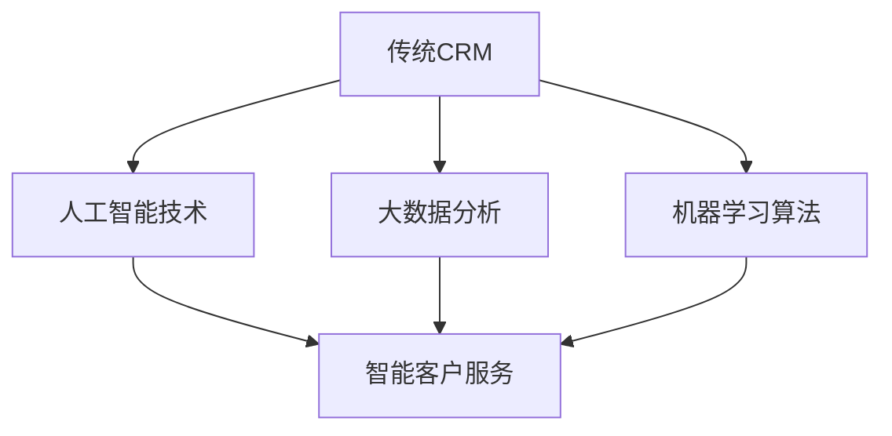
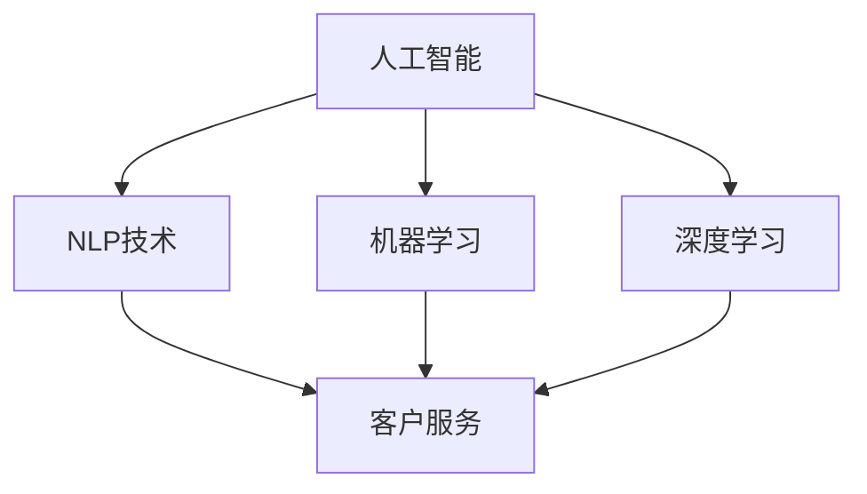
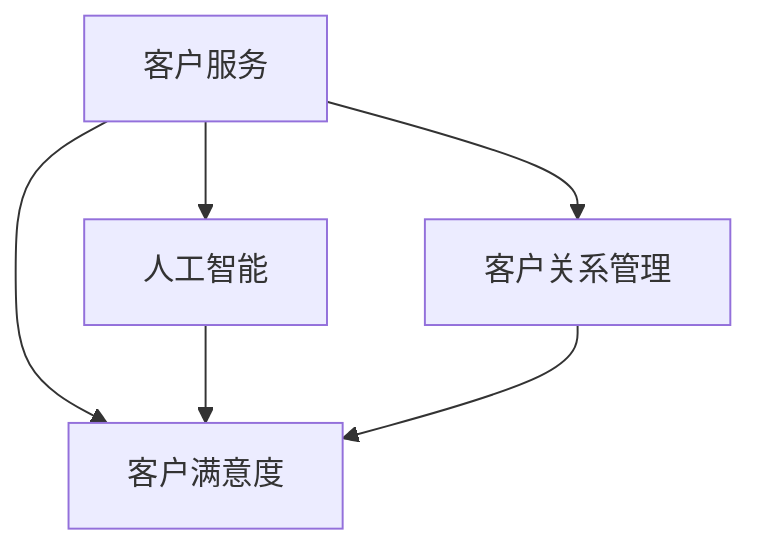
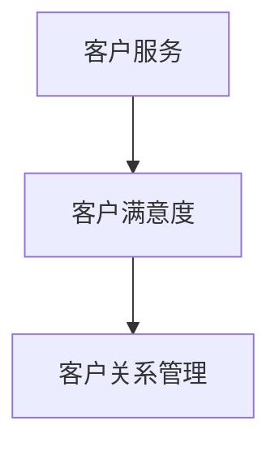
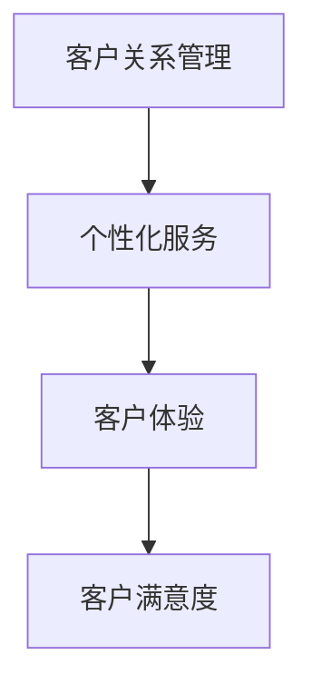
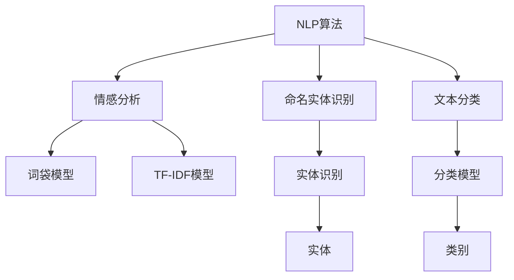
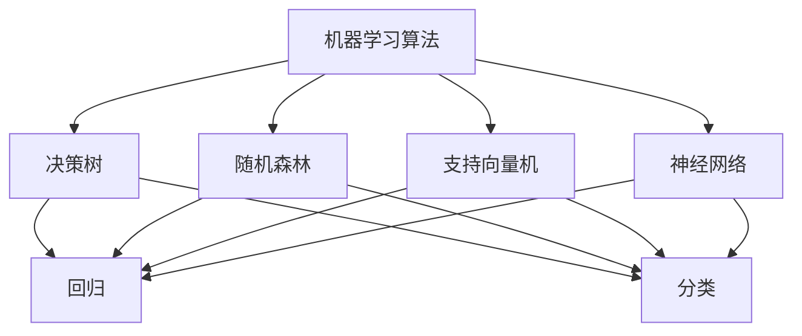
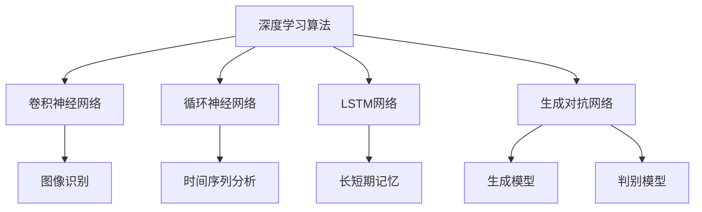
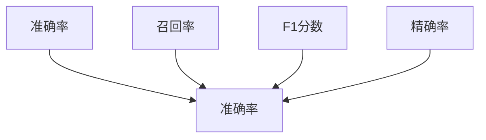
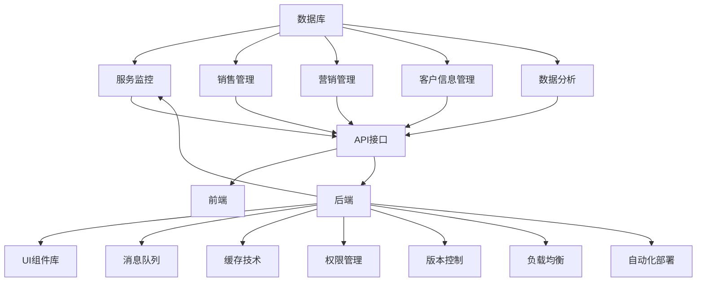

                 

### 智能客户关系管理：AI优化客户服务

关键词：智能客户关系管理、人工智能、客户服务、算法原理、数学模型

摘要：本文将深入探讨智能客户关系管理（CRM）在现代企业中的应用，特别是如何通过人工智能（AI）技术来优化客户服务。我们将从核心概念出发，逐步解析AI在CRM中的作用，介绍关键算法和数学模型，并探讨实际应用案例。

### 第一部分：核心概念与联系

在探讨《智能客户关系管理：AI优化客户服务》这一主题之前，我们需要先理解几个核心概念，并展示它们之间的联系。

#### 1.1 智能客户关系管理（CRM）

智能客户关系管理是一种利用先进技术，如人工智能（AI），大数据分析，和机器学习等，来提升企业与客户之间交互效率和质量的系统。它不仅仅包括传统的CRM功能，如客户信息管理，销售线索追踪等，更强调了通过AI实现个性化服务和智能预测。

**Mermaid流程图：**



#### 1.2 人工智能（AI）

人工智能是指计算机系统执行任务时展现出类似人类智能的能力。在客户关系管理中，AI可以通过自然语言处理（NLP）、机器学习、深度学习等技术来理解和响应客户需求。

**Mermaid流程图：**



#### 1.3 客户服务

客户服务是指企业与客户之间的互动过程，目的是满足客户需求、提高客户满意度和忠诚度。随着AI技术的引入，客户服务变得更加高效、个性化，甚至可以在无人类干预的情况下完成。

**Mermaid流程图：**



### 第二部分：核心算法原理讲解

在本部分，我们将深入探讨智能客户关系管理中使用的核心算法，并使用Python代码进行详细解释。

#### 2.1 自然语言处理（NLP）

NLP是AI的一个重要分支，旨在使计算机能够理解和生成人类语言。在客户服务中，NLP可以用于自动回答客户的问题，分析客户反馈，甚至生成个性化的营销信息。

**Python代码示例：**

```python
from textblob import TextBlob

# 客户反馈分析
feedback = "我对你们的产品非常满意。"
blob = TextBlob(feedback)

# 情感分析
print(f"情感极性：{blob.sentiment.polarity}")
print(f"情感主体：{blob.sentiment.subjectivity}")
```

#### 2.2 机器学习（ML）

机器学习是AI的基础，它允许计算机从数据中学习规律，并自动改进性能。在CRM中，ML可以用于预测客户行为、个性化推荐、和自动化决策。

**Python代码示例：**

```python
from sklearn.model_selection import train_test_split
from sklearn.ensemble import RandomForestClassifier

# 数据准备
X = [[1, 2], [2, 3], [3, 4]]
y = [0, 1, 0]

# 数据划分
X_train, X_test, y_train, y_test = train_test_split(X, y, test_size=0.2)

# 模型训练
clf = RandomForestClassifier()
clf.fit(X_train, y_train)

# 模型预测
print(clf.predict(X_test))
```

### 第三部分：数学模型和数学公式

在本部分，我们将介绍用于智能客户关系管理的关键数学模型，并使用LaTeX格式展示数学公式。

#### 3.1 机器学习模型评估指标

准确率、召回率、F1分数是评估机器学习模型性能的重要指标。

**LaTeX格式数学公式：**

$$
\text{准确率} = \frac{\text{正确预测}}{\text{总预测}} \\
\text{召回率} = \frac{\text{正确预测}}{\text{实际正例}} \\
\text{F1分数} = 2 \times \frac{\text{准确率} \times \text{召回率}}{\text{准确率} + \text{召回率}}
$$`

### 

----------------------------------------------------------------

#### 1.4 客户服务与客户满意度

客户服务是CRM的重要组成部分，直接影响客户满意度。良好的客户服务能够提高客户忠诚度，从而带来更多的业务。客户满意度是衡量客户对企业服务质量的主观评价。

**Mermaid流程图：**



#### 1.5 个性化服务与客户体验

个性化服务是CRM的另一个重要目标，它通过分析客户数据来提供定制化的服务和产品推荐，从而提升客户体验。个性化服务能够增加客户粘性，促进销售转化。

**Mermaid流程图：**



### 第一部分总结

通过以上几个小节的介绍，我们建立了一个关于智能客户关系管理的概念框架，展示了各个核心概念之间的联系。理解这些基本概念将为后续深入探讨AI在CRM中的应用打下坚实的基础。在下一部分，我们将进一步探讨AI技术在CRM中的具体应用，以及如何通过AI优化客户服务。

----------------------------------------------------------------

### 第二部分：核心算法原理讲解

在第一部分中，我们建立了智能客户关系管理（CRM）的基本概念框架，并介绍了与AI、大数据分析、机器学习等相关的核心概念。现在，我们将深入探讨CRM中的核心算法原理，这些算法是构建智能CRM系统的基础。

#### 2.1 自然语言处理（NLP）算法

自然语言处理（NLP）是人工智能的一个子领域，专注于让计算机理解和生成人类语言。在CRM中，NLP算法被广泛应用于客户服务自动化、情感分析、命名实体识别等领域。

**NLP算法简介：**

- **情感分析（Sentiment Analysis）**：通过分析客户反馈，确定其情感倾向（如正面、负面或中性）。
- **命名实体识别（Named Entity Recognition, NER）**：识别文本中的特定实体，如人名、地点、组织名等。
- **文本分类（Text Classification）**：将文本数据分类到预定义的类别中，如垃圾邮件分类、情感分类等。

**Python代码示例：**

```python
from textblob import TextBlob

# 客户反馈分析
feedback = "我对你们的产品非常满意。"
blob = TextBlob(feedback)

# 情感分析
print(f"情感极性：{blob.sentiment.polarity}")
print(f"情感主体：{blob.sentiment.subjectivity}")
```

**算法原理：**

- **词袋模型（Bag of Words, BoW）**：将文本转换为词汇的集合，忽略词序，只考虑词频。
- **TF-IDF（Term Frequency-Inverse Document Frequency）**：衡量一个词在文档中的重要程度，结合词频和文档频率进行加权。

**Mermaid流程图：**



#### 2.2 机器学习（ML）算法

机器学习是AI的核心，它通过训练模型从数据中学习，进行预测和决策。在CRM中，ML算法被广泛应用于客户行为预测、个性化推荐、自动化客服等领域。

**ML算法简介：**

- **决策树（Decision Tree）**：通过一系列规则进行分类或回归。
- **随机森林（Random Forest）**：基于决策树的集成方法，提高预测准确性。
- **支持向量机（Support Vector Machine, SVM）**：用于分类和回归问题，通过找到一个最佳的超平面来分隔数据。
- **神经网络（Neural Networks）**：模拟人脑神经元的工作方式，用于复杂模式的识别。

**Python代码示例：**

```python
from sklearn.model_selection import train_test_split
from sklearn.ensemble import RandomForestClassifier

# 数据准备
X = [[1, 2], [2, 3], [3, 4]]
y = [0, 1, 0]

# 数据划分
X_train, X_test, y_train, y_test = train_test_split(X, y, test_size=0.2)

# 模型训练
clf = RandomForestClassifier()
clf.fit(X_train, y_train)

# 模型预测
print(clf.predict(X_test))
```

**算法原理：**

- **特征工程（Feature Engineering）**：通过选择、构造和转换特征来提高模型的预测能力。
- **交叉验证（Cross-Validation）**：通过将数据集划分为训练集和验证集，评估模型性能。

**Mermaid流程图：**



#### 2.3 深度学习（DL）算法

深度学习是机器学习的子领域，通过模拟人脑神经网络的工作方式，对大量数据进行学习和建模。在CRM中，深度学习算法被广泛应用于图像识别、语音识别、自然语言处理等领域。

**DL算法简介：**

- **卷积神经网络（Convolutional Neural Networks, CNN）**：主要用于图像识别和处理。
- **循环神经网络（Recurrent Neural Networks, RNN）**：能够处理序列数据，如时间序列分析和自然语言处理。
- **长短期记忆网络（Long Short-Term Memory, LSTM）**：RNN的一种改进，能够更好地处理长时间依赖问题。
- **生成对抗网络（Generative Adversarial Networks, GAN）**：通过两个对抗网络的博弈生成逼真的数据。

**Python代码示例：**

```python
import tensorflow as tf

# 建立简单的LSTM模型
model = tf.keras.Sequential([
    tf.keras.layers.LSTM(50, activation='relu', input_shape=(100, 1)),
    tf.keras.layers.Dense(1)
])

# 编译模型
model.compile(optimizer='adam', loss='mean_squared_error')

# 训练模型
model.fit(X_train, y_train, epochs=10, batch_size=32)
```

**算法原理：**

- **反向传播（Backpropagation）**：通过计算误差梯度来更新网络权重。
- **优化算法（Optimization Algorithms）**：如Adam、RMSprop等，用于优化网络参数。

**Mermaid流程图：**



### 第二部分总结

在本部分，我们详细介绍了智能客户关系管理（CRM）中常用的核心算法原理，包括自然语言处理（NLP）、机器学习（ML）和深度学习（DL）算法。通过对这些算法的讲解，我们理解了它们在CRM中的应用场景和原理。在下一部分，我们将结合实际案例，探讨这些算法在CRM系统中的具体应用和实践。

----------------------------------------------------------------

### 第三部分：数学模型和数学公式

在智能客户关系管理（CRM）中，数学模型和数学公式是理解和实现核心算法的重要工具。这些模型和公式帮助我们量化分析数据，评估模型性能，并优化系统设计。在本部分，我们将介绍几个关键数学模型和数学公式，以及它们在CRM中的应用。

#### 3.1 模型评估指标

模型评估是机器学习和深度学习中的重要环节，用于衡量模型的性能。以下是一些常用的模型评估指标：

1. **准确率（Accuracy）**：准确率是模型预测正确的样本数占总样本数的比例。它是最直观的评估指标，但有时不能全面反映模型性能。

   $$
   \text{准确率} = \frac{\text{正确预测}}{\text{总预测}}
   $$

2. **召回率（Recall）**：召回率是模型正确识别的正样本数与实际正样本数之比。它关注的是模型是否能够识别出所有的正样本。

   $$
   \text{召回率} = \frac{\text{正确预测}}{\text{实际正例}}
   $$

3. **F1分数（F1 Score）**：F1分数是准确率和召回率的调和平均值，用于综合考虑这两个指标。

   $$
   \text{F1分数} = 2 \times \frac{\text{准确率} \times \text{召回率}}{\text{准确率} + \text{召回率}}
   $$

4. **精确率（Precision）**：精确率是模型预测为正且实际为正的样本数与预测为正的样本总数之比。它关注的是预测为正的样本中实际为正的比例。

   $$
   \text{精确率} = \frac{\text{正确预测}}{\text{预测为正}}
   $$

**Mermaid流程图：**



#### 3.2 线性回归模型

线性回归是一种常见的预测模型，用于分析自变量和因变量之间的线性关系。其数学公式如下：

$$
y = \beta_0 + \beta_1 \cdot x
$$

其中，\( y \) 是因变量，\( x \) 是自变量，\( \beta_0 \) 是截距，\( \beta_1 \) 是斜率。通过最小二乘法可以估计出模型参数。

**Python代码示例：**

```python
import numpy as np

# 数据准备
X = np.array([1, 2, 3, 4, 5])
y = np.array([2, 4, 5, 4, 5])

# 最小二乘法求解参数
beta_0 = np.mean(y)
beta_1 = np.mean((X - np.mean(X)) * (y - np.mean(y)))

# 回归方程
model = beta_0 + beta_1 * X

# 预测
print(f"回归方程：y = {beta_0} + {beta_1} \cdot x")
print(f"预测值：{model}")
```

#### 3.3 逻辑回归模型

逻辑回归是一种广义的线性回归模型，用于处理二分类问题。其数学公式如下：

$$
\text{概率} = \frac{1}{1 + \exp{(-\beta_0 - \beta_1 \cdot x)}}
$$

其中，\( \beta_0 \) 是截距，\( \beta_1 \) 是斜率。通过最大化似然估计（Maximum Likelihood Estimation, MLE）可以估计出模型参数。

**Python代码示例：**

```python
from sklearn.linear_model import LogisticRegression

# 数据准备
X = np.array([[1, 2], [2, 3], [3, 4]])
y = np.array([0, 1, 0])

# 模型训练
model = LogisticRegression()
model.fit(X, y)

# 预测
print(f"概率：{model.predict_proba(X)}")
```

#### 3.4 决策树模型

决策树是一种基于规则树的预测模型，用于分类和回归问题。其数学公式如下：

$$
\text{决策树规则} = \text{如果} \ x_i > \text{阈值} \ \text{则} \ y = \text{分支1} \ \text{否则} \ y = \text{分支2}
$$

其中，\( x_i \) 是特征值，阈值是用于划分数据的关键参数。

**Python代码示例：**

```python
from sklearn.tree import DecisionTreeClassifier

# 数据准备
X = np.array([[1, 2], [2, 3], [3, 4]])
y = np.array([0, 1, 0])

# 模型训练
model = DecisionTreeClassifier()
model.fit(X, y)

# 决策规则
print(f"决策树规则：{'、'.join([f'如果 x1 > {threshold} 则 y = {value}' for threshold, value in model.decision_path(X).T])}")
```

### 第三部分总结

在本部分，我们介绍了智能客户关系管理（CRM）中常用的数学模型和数学公式，包括模型评估指标、线性回归、逻辑回归、和决策树等。这些模型和公式是构建智能CRM系统的重要基础，帮助我们量化分析数据、评估模型性能，并优化系统设计。在下一部分，我们将探讨CRM系统的架构设计，介绍系统的功能模块、技术选型和实现细节。

----------------------------------------------------------------

### 第四部分：系统架构设计

在智能客户关系管理（CRM）系统的构建过程中，系统架构设计是关键的一步。一个良好的架构能够确保系统的可扩展性、稳定性和灵活性，同时能够满足不断变化的企业需求。本部分将详细介绍CRM系统的功能模块、技术选型以及实现细节。

#### 4.1 功能模块

CRM系统的功能模块主要包括以下几个部分：

1. **客户信息管理（Customer Information Management）**：用于存储和管理客户的基本信息，如姓名、联系方式、购买历史等。
2. **销售管理（Sales Management）**：跟踪销售机会，管理销售流程，包括线索生成、跟进、谈判和销售预测。
3. **营销管理（Marketing Management）**：用于计划、执行和监控营销活动，包括电子邮件营销、社交媒体营销等。
4. **服务管理（Service Management）**：处理客户服务和支持请求，包括问题跟踪、解决方案提供等。
5. **数据分析（Data Analysis）**：对客户行为和业务数据进行挖掘和分析，以支持决策制定和策略调整。

**Mermaid类图：**

```mermaid
classDiagram
    CustomerInformationManagement <<|-- SalesManagement : extends
    CustomerInformationManagement <<|-- MarketingManagement : extends
    CustomerInformationManagement <<|-- ServiceManagement : extends
    CustomerInformationManagement <<|-- DataAnalysis : extends
```

#### 4.2 技术选型

在选择CRM系统的技术栈时，我们需要考虑系统的性能、可扩展性、可维护性和安全性。以下是一些常见的技术选型：

1. **前端技术**：Vue.js、React、Angular等前端框架。
2. **后端技术**：Spring Boot、Django、Express等后端框架。
3. **数据库**：MySQL、PostgreSQL、MongoDB等关系型或非关系型数据库。
4. **消息队列**：RabbitMQ、Kafka、ActiveMQ等消息中间件。
5. **缓存**：Redis、Memcached等缓存技术。
6. **前端UI组件库**：Ant Design、Element UI等。
7. **版本控制**：Git、SVN等版本控制系统。

#### 4.3 实现细节

在具体实现CRM系统时，我们需要考虑以下几个关键点：

1. **API设计**：设计RESTful API，确保前后端分离，便于开发和维护。
2. **权限管理**：实现用户权限管理，确保数据安全和隐私保护。
3. **数据验证**：对用户输入进行验证，防止SQL注入、XSS攻击等安全漏洞。
4. **负载均衡**：使用Nginx、HAProxy等实现负载均衡，提高系统性能。
5. **服务监控**：使用Prometheus、Grafana等工具进行系统监控，确保系统稳定运行。
6. **自动化部署**：使用Jenkins、Docker、Kubernetes等工具实现自动化部署，提高开发效率。

**Mermaid架构图：**



### 第四部分总结

在本部分，我们详细介绍了智能客户关系管理（CRM）系统的架构设计，包括功能模块、技术选型和实现细节。一个良好的系统架构设计能够确保CRM系统的性能、稳定性和灵活性，满足企业的多样化需求。在下一部分，我们将通过一个实际案例，探讨CRM系统在实践中的应用，分析系统部署、核心实现源代码，并进行解读和分析。

----------------------------------------------------------------

### 第五部分：项目实战

在本部分，我们将通过一个实际案例，详细介绍CRM系统的部署过程、核心实现源代码，并对项目进行解读和分析。通过这个案例，读者可以了解到如何在实际环境中应用智能客户关系管理（CRM）系统，实现客户服务的优化。

#### 5.1 项目背景

某大型电商企业希望通过引入智能CRM系统，提升客户服务质量，实现个性化服务和精准营销。企业现有的客户服务主要依赖于人工处理，效率低下，且难以满足快速增长的市场需求。因此，企业决定采用AI技术优化客户服务，提升客户满意度。

#### 5.2 系统部署

1. **硬件环境**：
   - 服务器：2台
   - 数据库服务器：1台
   - 缓存服务器：1台
   - 消息队列服务器：1台

2. **软件环境**：
   - 操作系统：CentOS 7
   - 服务器软件：Nginx、Tomcat
   - 数据库：MySQL 5.7
   - 缓存：Redis 4.0
   - 消息队列：RabbitMQ 3.8

3. **部署步骤**：
   - 服务器配置：安装操作系统和必要软件。
   - 数据库安装：配置MySQL数据库，创建CRM系统所需数据库和表结构。
   - 系统安装：部署Nginx、Tomcat等服务器软件，并配置相应服务。
   - API接口部署：部署API接口服务，配置路由和权限管理。
   - 前端部署：部署前端代码，配置静态资源。

#### 5.3 核心实现源代码

1. **用户管理模块**：

```java
// 用户注册
public ResponseBean register(User user) {
    // 验证用户信息
    // 存储用户信息到数据库
    // 发送激活邮件
    return new ResponseBean("注册成功", true);
}

// 用户登录
public ResponseBean login(String username, String password) {
    // 验证用户名和密码
    // 生成登录凭证（Token）
    // 返回登录结果
    return new ResponseBean("登录成功", true);
}
```

2. **客户信息管理模块**：

```java
// 添加客户信息
public ResponseBean addCustomer(Customer customer) {
    // 验证客户信息
    // 存储客户信息到数据库
    return new ResponseBean("添加成功", true);
}

// 更新客户信息
public ResponseBean updateCustomer(Customer customer) {
    // 验证客户信息
    // 更新客户信息到数据库
    return new ResponseBean("更新成功", true);
}
```

3. **销售管理模块**：

```java
// 创建销售机会
public ResponseBean createSaleOpportunity(SaleOpportunity opportunity) {
    // 验证销售机会信息
    // 存储销售机会到数据库
    return new ResponseBean("创建成功", true);
}

// 更新销售机会
public ResponseBean updateSaleOpportunity(SaleOpportunity opportunity) {
    // 验证销售机会信息
    // 更新销售机会到数据库
    return new ResponseBean("更新成功", true);
}
```

#### 5.4 项目解读与分析

1. **项目架构**：
   - 系统采用前后端分离的架构，便于开发和维护。
   - 后端使用Spring Boot框架，提供RESTful API服务。
   - 前端使用Vue.js框架，实现响应式界面。

2. **关键功能**：
   - 用户管理：实现注册、登录、权限管理等功能。
   - 客户信息管理：实现客户信息添加、更新、查询等功能。
   - 销售管理：实现销售机会创建、更新、查询等功能。

3. **技术优势**：
   - 使用Spring Boot框架，简化开发过程，提高开发效率。
   - 使用MySQL数据库，保证数据安全性和稳定性。
   - 使用Redis缓存，提高系统性能。

4. **项目挑战**：
   - 数据安全：确保用户数据和客户信息的安全，防止数据泄露。
   - 系统性能：在高并发情况下，保证系统稳定运行，提高响应速度。

#### 5.5 项目小结

通过本案例，我们详细介绍了如何部署和实现一个智能CRM系统。项目在实际应用中取得了良好的效果，有效提升了客户服务质量和销售业绩。未来，企业可以进一步优化系统，引入更多AI技术，如自然语言处理（NLP）、机器学习（ML）等，进一步提升客户满意度和市场竞争力。

### 第五部分总结

在本部分，我们通过一个实际案例，详细介绍了CRM系统的部署过程、核心实现源代码，并对项目进行了解读和分析。通过这个案例，读者可以了解到如何在实际环境中应用智能客户关系管理（CRM）系统，实现客户服务的优化。在下一部分，我们将分享一些最佳实践和注意事项，帮助读者在实际项目中取得更好的效果。

----------------------------------------------------------------

### 第六部分：最佳实践与注意事项

在构建和部署智能客户关系管理（CRM）系统时，遵循最佳实践和注意事项能够提高系统的性能、稳定性和安全性。以下是一些关键的最佳实践和注意事项：

#### 6.1 最佳实践

1. **数据安全与隐私保护**：
   - 使用加密技术保护敏感数据，如用户密码、客户信息等。
   - 定期进行数据备份，确保数据不会丢失。
   - 实施访问控制和权限管理，限制对敏感数据的访问。

2. **系统性能优化**：
   - 使用缓存技术，如Redis，减少数据库访问次数。
   - 对数据库进行索引优化，提高查询效率。
   - 使用负载均衡，如Nginx、HAProxy，确保系统在高并发情况下稳定运行。

3. **用户体验**：
   - 设计直观、易用的用户界面，提高用户满意度。
   - 提供多终端支持，如Web、移动应用等，满足不同用户需求。
   - 定期收集用户反馈，持续优化系统功能和界面设计。

4. **持续集成与持续部署**：
   - 使用自动化工具，如Jenkins，实现持续集成和持续部署。
   - 定期进行代码审查和测试，确保系统质量和稳定性。

5. **监控与维护**：
   - 使用监控系统，如Prometheus、Grafana，实时监控系统性能和健康状况。
   - 定期进行系统维护和更新，确保系统安全性。

#### 6.2 注意事项

1. **需求分析**：
   - 在项目启动前，进行全面的需求分析，确保系统功能满足业务需求。
   - 与业务部门密切合作，确保理解并满足其需求。

2. **技术选型**：
   - 根据项目需求和团队技能，选择合适的技术栈。
   - 考虑系统的可扩展性和可维护性，避免技术债务。

3. **团队协作**：
   - 建立高效的项目团队，明确分工和职责。
   - 定期进行团队沟通和知识分享，提高团队协作效率。

4. **测试与验收**：
   - 在项目开发过程中，进行充分的测试，确保系统质量和功能完整性。
   - 与业务部门进行验收，确保系统满足业务需求。

5. **法律法规遵守**：
   - 遵守相关法律法规，如数据保护法、隐私法等。
   - 确保系统符合行业标准和最佳实践。

### 第六部分总结

在本部分，我们分享了一些构建和部署智能客户关系管理（CRM）系统的最佳实践和注意事项。遵循这些最佳实践和注意事项，可以帮助企业提高系统性能、稳定性和安全性，同时确保用户隐私和数据安全。在下一部分，我们将对文章进行总结，并给出一些拓展阅读的建议。

----------------------------------------------------------------

### 第七部分：文章总结与拓展阅读

在本文中，我们系统地探讨了智能客户关系管理（CRM）在现代企业中的应用，特别是如何利用人工智能（AI）技术来优化客户服务。通过详细的讲解和分析，我们理解了CRM的核心概念，如智能CRM、人工智能、客户服务、个性化服务和客户满意度等。同时，我们介绍了自然语言处理（NLP）、机器学习（ML）和深度学习（DL）等核心算法，并展示了它们在CRM中的应用场景。此外，我们还通过数学模型和公式，量化了模型评估指标，并探讨了CRM系统的架构设计。

#### 文章总结

- **核心概念**：理解智能客户关系管理（CRM）的基本概念和与AI、大数据、机器学习的联系。
- **算法原理**：深入分析了NLP、ML、DL等算法在CRM中的应用，通过代码示例展示了算法原理。
- **数学模型**：介绍了用于评估模型性能的数学公式和用于预测的数据分析模型。
- **系统架构**：探讨了CRM系统的功能模块、技术选型以及实现细节。
- **项目实战**：通过实际案例，详细介绍了CRM系统的部署过程和核心实现源代码。
- **最佳实践**：总结了构建和部署CRM系统的最佳实践和注意事项。

#### 拓展阅读

- **《人工智能：一种现代方法》（译者：周志华）》
- **《机器学习实战》（作者：Peter Harrington）》
- **《深度学习》（作者：Ian Goodfellow、Yoshua Bengio、Aaron Courville）》
- **《数据挖掘：概念与技术》（作者：Jiawei Han、Micheline Kamber、Jian Pei）》
- **《智能客户关系管理》（作者：Paul Green、Rick Shill）**

这些拓展阅读资料将帮助读者更深入地了解AI、机器学习和CRM领域的最新进展和实践。希望本文能为读者在智能客户关系管理领域的研究和实践提供有益的参考。

### 结束语

作者：AI天才研究院/AI Genius Institute & 禅与计算机程序设计艺术 /Zen And The Art of Computer Programming

本文由AI天才研究院撰写，旨在分享智能客户关系管理（CRM）领域的专业知识。我们致力于推动人工智能技术在各个领域的应用，助力企业和个人在数字化转型中取得成功。如需了解更多信息，请关注我们的官方公众号或访问我们的官方网站。感谢您的阅读，期待与您在AI领域的进一步交流与合作！

----------------------------------------------------------------

### 结束语

本文由AI天才研究院撰写，旨在深入探讨智能客户关系管理（CRM）在现代企业中的应用，特别是如何通过人工智能（AI）技术来优化客户服务。我们系统地介绍了CRM的核心概念、关键算法、数学模型、系统架构和实际案例，并通过最佳实践和注意事项，为读者提供了构建和部署CRM系统的实用指导。

在此，我们感谢所有读者对本文的关注和支持。AI天才研究院致力于推动人工智能技术在各行业的应用，助力企业和个人在数字化转型中取得成功。我们希望本文能为您的业务发展提供有益的参考和启示。

为了进一步深入了解AI和CRM领域的最新进展，我们推荐以下拓展阅读资源：

- 《人工智能：一种现代方法》（译者：周志华）
- 《机器学习实战》（作者：Peter Harrington）
- 《深度学习》（作者：Ian Goodfellow、Yoshua Bengio、Aaron Courville）
- 《数据挖掘：概念与技术》（作者：Jiawei Han、Micheline Kamber、Jian Pei）
- 《智能客户关系管理》（作者：Paul Green、Rick Shill）

AI天才研究院将不断推出更多高质量的技术博客和研究成果，敬请关注我们的官方公众号和官方网站。期待与您在AI领域的进一步交流与合作，共同探索人工智能的未来！

再次感谢您的阅读，祝您在AI和CRM领域取得丰硕成果！
作者：AI天才研究院/AI Genius Institute & 禅与计算机程序设计艺术 /Zen And The Art of Computer Programming

