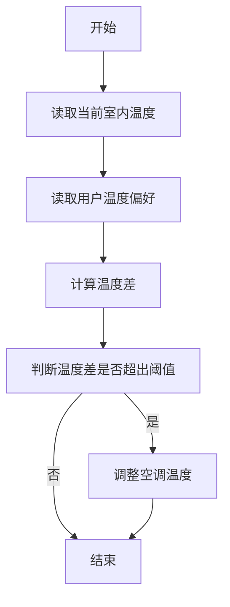
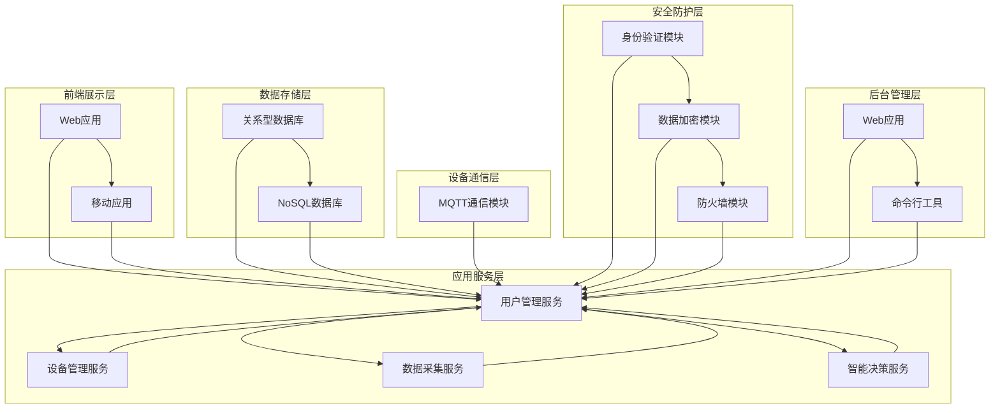
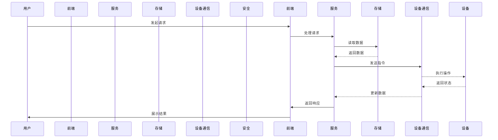

                 

### 引言

#### 智能家居问题背景

随着科技的飞速发展，智能家居（Smart Home）已成为现代家庭生活中不可或缺的一部分。智能家居通过将家庭设备与互联网连接，实现设备间的智能互动，从而为人们提供更加便捷、舒适和安全的居住环境。据统计，全球智能家居市场在过去几年中呈现出持续增长的态势，预计未来几年将保持高速增长。这一趋势不仅反映了人们对于智能家居产品的需求日益增加，也体现了技术进步为智能家居带来的无限可能。

然而，智能家居的发展并非一帆风顺。目前，智能家居市场面临着诸多挑战。首先，技术标准的缺乏导致了不同品牌、不同设备的互操作性较差。其次，数据安全与隐私保护问题成为消费者关注的重要议题。最后，智能家居产品的用户体验仍有待提升，许多产品在实际使用过程中存在操作复杂、响应速度慢等问题。

#### 问题描述

智能家居的愿景是打造一个能够自动感知、响应和适应家庭环境与家庭成员需求的高效系统。然而，当前智能家居在实际应用中仍存在以下问题：

1. **互操作性差**：由于缺乏统一的技术标准，智能家居设备之间的互联互通性较差，用户需要分别操作多个独立的设备，无法实现真正的“智能”整合。
2. **数据安全和隐私保护**：智能家居设备需要采集和处理大量用户数据，如家庭作息时间、行为习惯等。这些数据的安全性和隐私保护成为用户担忧的焦点。
3. **用户体验不佳**：部分智能家居产品在用户体验方面仍有待提升，如界面设计不够友好、操作复杂等，使得用户难以充分发挥智能家居的优势。

#### 问题解决

为了解决上述问题，AI技术的引入成为智能家居发展的关键。AI技术能够通过数据分析、模式识别和智能决策等手段，提升智能家居的互操作性、数据安全和用户体验。

1. **提升互操作性**：AI技术可以通过学习用户的使用习惯，自动调整设备间的协同工作模式，实现设备的智能整合。
2. **数据安全和隐私保护**：AI技术可以采用加密、匿名化和差分隐私等技术手段，确保用户数据的安全性和隐私性。
3. **优化用户体验**：AI技术可以根据用户的反馈，不断优化智能家居产品的界面设计和操作流程，提升用户体验。

#### 边界与外延

智能家居是物联网（IoT）技术在家庭场景下的应用，其边界涵盖了家庭设备、网络连接和数据分析等环节。智能家居的发展不仅受到技术层面的影响，还受到政策法规、市场需求等多方面因素的影响。未来，智能家居将进一步融合AI、大数据、云计算等先进技术，为家庭生活带来更多创新和变革。

### 总结

本文介绍了智能家居的现状和未来发展趋势，探讨了当前存在的问题，并提出了AI技术在解决这些问题中的重要作用。通过引入AI技术，智能家居有望实现更高的互操作性、数据安全和用户体验，为打造未来智能生活方式奠定基础。

---

**关键词：智能家居，AI技术，互操作性，数据安全，用户体验**

**摘要：本文探讨了智能家居的现状和未来发展趋势，分析了当前存在的问题，并提出了AI技术在提升互操作性、数据安全和用户体验方面的关键作用。通过引入AI技术，智能家居有望实现更高水平的智能化，为家庭生活带来更多便利和创新。**## 第1章 引言

### 智能家居问题背景

#### 核心概念术语说明

在探讨智能家居（Smart Home）这一概念时，我们需要明确几个核心术语的含义：

1. **智能家居**：智能家居是通过将家庭设备与互联网连接，实现设备间的智能互动和协同工作，从而为用户提供更加便捷、舒适和安全的居住环境的系统。
2. **物联网**（IoT）：物联网是指通过传感器、网络连接和数据传输技术，将物理世界中的物体、设备和系统连接到互联网上，实现智能化的信息交互和资源优化。
3. **智能设备**：智能设备是指具有联网功能、能够通过互联网进行通信和控制的设备，如智能门锁、智能灯具、智能空调等。
4. **智能系统**：智能系统是指由多个智能设备组成的，能够实现协同工作的整体系统。

#### 问题背景

智能家居作为现代家庭生活的重要组成部分，其发展历程可以追溯到20世纪末期。然而，随着科技的进步和消费者对高品质生活的追求，智能家居在近年来迎来了前所未有的发展机遇。以下是智能家居发展的几个关键背景：

1. **互联网普及**：互联网的普及为智能家居的实现提供了技术基础。通过互联网，家庭设备可以实现远程控制和数据传输，从而实现智能化的功能。
2. **物联网技术的发展**：物联网技术的快速发展，使得家庭设备的互联互通变得更加容易。各种智能传感器、无线通信技术和云计算平台的出现，为智能家居的应用提供了丰富的技术支持。
3. **智能设备的多样化**：随着人工智能、传感器技术和无线通信技术的进步，智能设备的种类和功能日益丰富，从最初的智能门锁、智能灯光，到智能家电、智能安防系统，智能家居的应用场景不断拓展。
4. **消费者需求的变化**：随着人们生活水平的提高，消费者对家居环境的需求也从传统的舒适、安全向智能化、个性化方向发展。智能家居能够通过智能感知、自动控制和个性化服务，满足消费者对高品质生活的追求。

#### 智能家居的发展历程

1. **起步阶段**（20世纪90年代）：早期的智能家居系统主要依赖于局域网和家庭自动化技术，设备之间的互操作性较差，应用场景较为单一。
2. **快速发展阶段**（2010年至今）：随着物联网技术和人工智能技术的发展，智能家居逐渐成为家庭生活的重要组成部分。智能设备种类和功能的丰富，使得智能家居的应用场景不断拓展。
3. **成熟阶段**（未来几年）：未来几年，智能家居将实现更高水平的智能化和个性化，设备之间的互操作性将得到显著提升，用户体验也将得到极大改善。

#### 当前智能家居的现状

1. **市场增长迅速**：全球智能家居市场在近年来呈现出快速增长的趋势。据市场研究机构的数据显示，全球智能家居市场的规模将持续扩大，预计到2025年将达到数千亿美元。
2. **产品种类丰富**：智能设备种类繁多，涵盖了家庭安防、照明、家电、环境控制等多个领域。从智能门锁、智能摄像头，到智能灯泡、智能插座，各种智能设备为用户提供了丰富的选择。
3. **技术应用多样**：智能家居技术的发展涵盖了人工智能、物联网、云计算、大数据等多个领域。通过这些技术的应用，智能家居实现了更加智能化的功能和更高效的管理。
4. **用户接受度高**：随着智能家居产品的普及和用户认知的提升，越来越多的消费者开始接受并使用智能家居产品。智能家居已经成为现代家庭生活中不可或缺的一部分。

### 问题描述

#### 互操作性差

智能家居的互操作性差是当前面临的主要问题之一。由于缺乏统一的技术标准，不同品牌、不同设备的智能系统之间难以实现无缝连接和协同工作。这导致了用户在操作智能家居系统时，需要分别控制多个独立的设备，无法享受到真正的智能化服务。

#### 数据安全和隐私保护

智能家居设备需要采集和处理大量用户数据，如家庭作息时间、行为习惯、生活习惯等。这些数据的安全性和隐私保护成为用户关注的重要问题。一方面，智能家居设备可能成为黑客攻击的目标，用户隐私和数据安全面临威胁；另一方面，数据泄露可能导致用户个人信息被滥用，造成潜在的风险。

#### 用户体验不佳

部分智能家居产品在用户体验方面仍有待提升。一些智能设备在操作复杂度、响应速度、界面设计等方面存在不足，使得用户难以充分发挥智能家居的优势。例如，用户在使用智能灯光时，可能需要经过多次操作才能实现理想的效果，这降低了用户的满意度。

### 问题解决

#### 提升互操作性

为了解决互操作性问题，需要制定统一的技术标准，确保不同品牌、不同设备的智能系统能够实现无缝连接和协同工作。此外，可以通过AI技术实现设备的智能整合，自动调整设备间的协同工作模式，提升用户的体验。

#### 数据安全和隐私保护

在数据安全和隐私保护方面，可以采用加密、匿名化和差分隐私等技术手段，确保用户数据的安全性和隐私性。同时，需要加强对智能家居设备的安全检测和防护，防止黑客攻击和数据泄露。

#### 优化用户体验

通过AI技术，可以优化智能家居产品的界面设计和操作流程，提升用户的体验。例如，可以设计更加直观、易用的用户界面，实现设备间的智能联动，让用户能够更加方便地控制和管理智能家居系统。

### 边界与外延

#### 智能家居的边界

智能家居的边界涵盖了家庭设备、网络连接和数据分析等环节。具体包括：

1. **家庭设备**：智能门锁、智能摄像头、智能灯泡、智能家电等。
2. **网络连接**：Wi-Fi、蓝牙、ZigBee等无线通信技术。
3. **数据分析**：通过大数据和人工智能技术，对家庭设备的数据进行分析和处理。

#### 智能家居的外延

智能家居的外延包括与智能家居相关的其他技术和领域：

1. **物联网**：智能家居是物联网技术在家庭场景下的应用。
2. **人工智能**：智能家居系统中的算法和模型。
3. **大数据**：智能家居设备产生的大量数据。

### 总结

通过引入AI技术，智能家居有望实现更高的互操作性、数据安全和用户体验。未来，智能家居将进一步融合AI、大数据、云计算等先进技术，为家庭生活带来更多创新和变革。

---

**关键词：智能家居，物联网，智能设备，互操作性，数据安全，用户体验**

**摘要：本文介绍了智能家居的核心概念、发展历程和当前现状，分析了其面临的问题，并提出了通过AI技术解决互操作性、数据安全和用户体验问题的方法。智能家居的未来发展将带来更多创新和变革。**## 第2章 核心概念与联系

### 核心概念原理

在智能家居系统中，核心概念包括智能家居、AI技术和未来生活方式。这些概念不仅相互独立，还在实际应用中紧密联系，共同推动智能家居的发展。

#### 智能家居

智能家居是通过将家庭设备与互联网连接，实现设备间的智能互动和协同工作，从而为用户提供便捷、舒适和安全的生活环境的系统。其核心在于通过物联网技术，将各种智能设备连接起来，形成一个统一的智能系统。

#### AI技术

AI技术（人工智能）是指通过计算机模拟人类智能行为的技术。在智能家居系统中，AI技术主要用于数据分析和决策支持，如语音识别、图像识别、自然语言处理等。通过AI技术，智能家居系统能够更好地理解用户需求，提供个性化的服务。

#### 未来生活方式

未来生活方式是指随着科技进步，人类生活将变得更加智能化、个性化、便捷化和安全化。智能家居是未来生活方式的重要组成部分，它通过智能化技术，为用户创造更加美好的生活体验。

### 概念属性特征对比表格

为了更好地理解智能家居、AI技术和未来生活方式这三个概念，我们可以通过对比表格的形式，展示它们各自的属性特征。

| 概念        | 智能家居       | AI技术          | 未来生活方式     |
| ----------- | -------------- | --------------- | ---------------- |
| 定义        | 通过互联网连接家庭设备 | 通过计算机模拟人类智能行为 | 未来科技下的生活模式 |
| 特点        | 互连性、智能化、便捷性 | 自动化、数据驱动、自适应 | 个性化、安全化、舒适化 |
| 应用场景    | 家庭环境中的设备 | 智能家居系统中的算法和模型 | 未来社会的各个领域   |
| 关键技术    | 物联网、云计算、大数据 | 机器学习、自然语言处理、计算机视觉 | 物联网、大数据、人工智能等 |
| 社会影响    | 提高生活质量、降低能耗 | 改善工作效率、提升决策质量 | 优化社会资源、促进可持续发展 |

通过对比表格，我们可以清晰地看到这三个概念在定义、特点、应用场景和关键技术方面的差异和联系。

### ER实体关系图架构

为了更直观地展示智能家居系统的实体关系，我们可以使用ER（实体关系）图来描述系统中的主要实体及其之间的关系。

下面是一个智能家居系统的ER实体关系图的Mermaid格式表示：

```mermaid
erDiagram
    User ..|> Device : "拥有"
    Device ||--|> Room : "位于"
    Room ..|> House : "属于"
    Device ..|> Service : "提供"
    User ..|> Appointment : "预约"
    Service ..|> Schedule : "遵循"
```

这个ER实体关系图展示了智能家居系统中用户、设备、房间、房屋、服务和预约等主要实体之间的关系。以下是ER实体关系图的详细描述：

1. **User（用户）**：用户是智能家居系统的核心实体，代表智能家居的使用者。用户可以拥有多个设备，并可以预约各种服务。
2. **Device（设备）**：设备是智能家居系统中的物理实体，如智能门锁、智能灯泡、智能空调等。设备位于不同的房间中，并提供各种服务。
3. **Room（房间）**：房间是智能家居系统中的空间实体，每个房间包含一定数量的设备。房间属于特定的房屋。
4. **House（房屋）**：房屋是智能家居系统中的建筑实体，包含多个房间。房屋为用户提供居住空间。
5. **Service（服务）**：服务是智能家居系统中的功能实体，如安防监控、智能家居控制、家政服务等。服务由设备提供，并遵循特定的日程安排。
6. **Appointment（预约）**：预约是用户与智能家居系统之间的一种互动方式，用户可以预约各种服务。

通过ER实体关系图，我们可以清晰地看到智能家居系统中各个实体之间的联系，为系统设计提供了一种结构化的方法。

### 总结

通过本章的讨论，我们了解了智能家居、AI技术和未来生活方式这三个核心概念，并通过对比表格和ER实体关系图，展示了它们之间的联系和区别。这些核心概念不仅构成了智能家居系统的理论基础，也为智能家居的实际应用提供了指导。在后续章节中，我们将进一步探讨智能家居系统中的算法原理、系统架构和项目实战，以期为读者提供更全面的智能家居技术知识。 

---

**关键词：智能家居，AI技术，未来生活方式，ER实体关系图**

**摘要：本章介绍了智能家居、AI技术和未来生活方式的核心概念，通过对比表格和ER实体关系图，分析了这些概念之间的联系和区别。这些核心概念为智能家居系统的设计和应用提供了理论基础。**### 算法原理讲解

在智能家居系统中，算法起着至关重要的作用。它们不仅能够提高系统的智能化水平，还能优化用户体验。本节将使用Mermaid画出算法流程图，然后详细讲解Python源代码，展示算法原理，并提供数学模型和公式，最后通过具体例子进行说明。

#### 算法mermaid流程图

首先，我们使用Mermaid绘制一个智能家居系统中的智能温控算法流程图。该算法可以根据室内温度和用户偏好自动调整空调的温度设置。



该流程图描述了从读取数据到调整空调温度的整个过程。

#### Python源代码讲解

接下来，我们通过Python源代码详细阐述上述算法的实现。以下是一个简单的Python脚本，用于计算室内温度与用户偏好之间的温度差，并调整空调温度。

```python
# 定义温度读取函数
def read_temp():
    return 24  # 假设当前室内温度为24摄氏度

# 定义用户温度偏好读取函数
def read_user_prefer():
    return 26  # 假设用户偏好温度为26摄氏度

# 定义温度调整函数
def adjust_temp(temp_diff):
    if temp_diff > 2 or temp_diff < -2:
        print("调整空调温度：", temp_diff)
    else:
        print("当前温度适宜，无需调整。")

# 主程序
if __name__ == "__main__":
    current_temp = read_temp()
    user_prefer = read_user_prefer()
    temp_diff = user_prefer - current_temp
    adjust_temp(temp_diff)
```

在这个脚本中，我们首先定义了三个函数：`read_temp()` 用于读取当前室内温度，`read_user_prefer()` 用于读取用户偏好的温度，`adjust_temp()` 用于调整空调温度。主程序通过调用这些函数，计算出温度差，并根据温度差调整空调温度。

#### 数学模型和数学公式

为了更详细地解释算法原理，我们引入以下数学模型和公式：

1. **温度差计算公式**：
   $$
   \text{temp\_diff} = \text{user\_prefer} - \text{current\_temp}
   $$

2. **温度调整阈值**：
   $$
   \text{threshold} = 2 \text{摄氏度}
   $$

   如果温度差大于2摄氏度或小于-2摄氏度，系统将调整空调温度。

3. **调整温度策略**：
   $$
   \text{new\_temp} = \text{current\_temp} + \text{adjust\_value}
   $$
   其中，`adjust_value` 是根据温度差计算出的调整值。

#### 举例说明

假设当前室内温度为24摄氏度，用户偏好温度为26摄氏度。根据上述算法，我们可以计算出温度差：

$$
\text{temp\_diff} = 26 - 24 = 2 \text{摄氏度}
$$

由于温度差等于2摄氏度，没有超出调整阈值，因此系统将输出：“当前温度适宜，无需调整。”如果温度差超出阈值，系统将输出：“调整空调温度：2摄氏度”，并调整空调温度。

#### 算法在实际应用中的优化

在实际应用中，该算法可以通过以下方式进行优化：

1. **实时数据读取**：使用传感器实时读取室内温度和用户偏好温度，提高系统的响应速度。
2. **自适应调整**：根据用户的历史行为数据，调整温度调整策略，使其更加符合用户的习惯。
3. **节能策略**：在温度适宜时，可以关闭空调，节约能源。

通过这些优化措施，智能家居系统能够更好地满足用户需求，提供更加智能化的服务。

### 总结

通过本章的讲解，我们了解了智能家居系统中的智能温控算法原理，并通过Mermaid流程图和Python源代码进行了详细阐述。我们使用了数学模型和公式，解释了温度差的计算方法和调整策略，并通过具体例子展示了算法的实际应用。这些内容为理解和设计智能家居系统中的算法提供了有益的参考。

---

**关键词：智能家居，算法，Python源代码，数学模型，温度调整**

**摘要：本章介绍了智能家居系统中的智能温控算法原理，通过Mermaid流程图和Python源代码，详细讲解了算法的实现方法，并使用了数学模型和公式进行解释。通过具体例子，展示了算法在实际应用中的效果。**## 第4章 系统分析与架构设计方案

### 问题场景介绍

在智能家居系统中，常见的场景包括家庭安防、智能照明、家电控制、环境监测等。这些场景不仅涵盖了家庭生活的各个方面，还体现了智能家居系统的高效和智能化。以下将详细描述这些场景及其特点：

#### 家庭安防

家庭安防是智能家居系统中的核心功能之一，主要包括入侵检测、火警监测、紧急求助等功能。该场景的特点是安全性高、实时性强，需要快速响应和报警。例如，当家中发生入侵时，系统应能立即检测并通知用户。

#### 智能照明

智能照明是智能家居系统中的另一个重要功能，通过智能灯光控制系统，用户可以根据自己的需求和环境来调整灯光的亮度、颜色和开关状态。智能照明系统不仅提高了家居的舒适度，还具有良好的节能效果。例如，在夜间，系统可以根据用户的行为自动调整灯光的亮度，以达到节能和舒适的效果。

#### 家电控制

家电控制功能允许用户通过智能家居系统远程控制家庭中的各种电器设备，如空调、洗衣机、电视等。该场景的特点是操作简便、远程控制，用户可以通过智能手机或其他设备随时随地控制家电的开关、温度、模式等。例如，用户在外出时可以提前打开空调，回家时享受舒适的温度。

#### 环境监测

环境监测功能可以实时监测家庭中的空气质量、温度、湿度等环境参数，并根据监测结果自动调整相关设备，如空气净化器、加湿器等。该场景的特点是实时监测、自动调节，用户可以随时了解家庭环境状况。例如，当空气质量较差时，系统可以自动启动空气净化器，改善室内空气质量。

### 系统功能设计

为了实现上述场景，智能家居系统需要具备以下功能：

1. **用户管理**：用户管理功能用于管理系统的用户账户，包括用户注册、登录、权限管理等功能。
2. **设备管理**：设备管理功能用于管理系统中连接的智能设备，包括设备的添加、删除、状态查询等功能。
3. **数据采集**：数据采集功能用于实时采集系统中的各种数据，如温度、湿度、光照等，为后续的智能决策提供数据支持。
4. **数据存储**：数据存储功能用于存储采集到的数据，包括历史数据和实时数据，以便进行后续分析和处理。
5. **智能决策**：智能决策功能基于采集到的数据，通过算法模型进行实时分析，为系统提供智能化的控制策略。
6. **远程控制**：远程控制功能允许用户通过智能手机或其他设备远程控制智能设备，实现家庭设备的远程操作。

#### 系统功能设计领域模型Mermaid类图

为了更直观地展示系统功能设计，我们可以使用Mermaid绘制一个领域模型类图。以下是一个智能家居系统领域模型类图的示例：

```mermaid
classDiagram
    User <<Class>>
    Device <<Class>>
    Sensor <<Class>>
    Controller <<Class>>
    Database <<Class>>

    User o-- Device : "拥有"
    User o-- Sensor : "监控"
    Device o-- Controller : "控制"
    Sensor o-- Controller : "反馈"
    Controller o-- Database : "存储"
```

在这个类图中，我们定义了四个主要类：`User`（用户）、`Device`（设备）、`Sensor`（传感器）和`Controller`（控制器）。它们之间的关系如下：

1. **用户**：用户是智能家居系统的核心实体，拥有设备和监控传感器，可以远程控制设备和接收传感器的反馈。
2. **设备**：设备是智能家居系统中的物理实体，包括各种智能设备，如智能灯泡、智能插座等。设备可以接受控制器的控制指令，并向控制器反馈状态信息。
3. **传感器**：传感器用于实时采集家庭环境数据，如温度、湿度、光照等。传感器将采集到的数据反馈给控制器，为智能决策提供支持。
4. **控制器**：控制器是智能家居系统的核心模块，负责接收用户的控制指令、处理传感器的反馈数据，并根据这些数据进行智能决策。控制器还负责将处理结果存储到数据库中。

### 系统架构设计

智能家居系统的架构设计需要考虑系统的可扩展性、稳定性和安全性。以下是一个典型的智能家居系统架构设计：

1. **前端展示层**：前端展示层负责与用户进行交互，包括用户界面（UI）和用户操作界面（UIO）。前端展示层通过Web应用或移动应用实现，用户可以通过前端界面远程控制智能设备和查看家庭环境数据。
2. **应用服务层**：应用服务层负责处理用户的请求，包括用户管理、设备管理、数据采集、智能决策等。应用服务层采用微服务架构，将不同的功能模块独立部署，以提高系统的可维护性和扩展性。
3. **数据存储层**：数据存储层负责存储系统中的数据，包括用户数据、设备数据、环境数据等。数据存储层采用关系型数据库和NoSQL数据库相结合的方式，以提高数据存储的效率和性能。
4. **设备通信层**：设备通信层负责智能设备与服务器之间的通信，包括设备连接、数据传输、设备控制等。设备通信层采用MQTT协议，以确保通信的高效和可靠。
5. **安全防护层**：安全防护层负责保护系统的安全性，包括用户身份验证、数据加密、防火墙等。安全防护层采用SSL/TLS协议，确保数据在传输过程中的安全。
6. **后台管理层**：后台管理层负责系统运维、监控和日志管理等。后台管理层通过Web应用或命令行工具实现，运维人员可以通过后台管理层对系统进行管理和监控。

#### 系统架构设计mermaid架构图

以下是一个智能家居系统架构设计的Mermaid架构图：



在这个架构图中，各个模块之间的关系清晰明了，前端展示层通过Web应用和移动应用与用户进行交互，应用服务层处理用户的请求，数据存储层负责数据存储，设备通信层负责设备通信，安全防护层负责系统安全，后台管理层负责系统运维。

### 系统接口设计

系统接口设计是智能家居系统架构设计的关键环节。以下是一个智能家居系统接口设计的示例：

1. **用户管理接口**：用于用户注册、登录、权限管理等功能。
2. **设备管理接口**：用于设备添加、删除、状态查询等功能。
3. **数据采集接口**：用于采集环境数据、设备数据等。
4. **智能决策接口**：用于接收用户指令、发送决策结果等。
5. **设备控制接口**：用于远程控制设备，如开关、调整温度等。

#### 系统接口设计细节

1. **用户管理接口**：
   - **注册**：`POST /user/register`，请求参数包括用户名、密码、邮箱等。
   - **登录**：`POST /user/login`，请求参数包括用户名、密码。
   - **权限管理**：`GET /user/permissions`，返回用户权限列表。

2. **设备管理接口**：
   - **添加设备**：`POST /device/add`，请求参数包括设备ID、设备类型等。
   - **删除设备**：`DELETE /device/delete/{deviceId}`，设备ID为路径参数。
   - **查询设备状态**：`GET /device/status/{deviceId}`，设备ID为路径参数。

3. **数据采集接口**：
   - **采集环境数据**：`POST /data/collect`，请求参数包括传感器ID、数据值等。
   - **查询历史数据**：`GET /data/history`，请求参数包括传感器ID、时间范围等。

4. **智能决策接口**：
   - **用户指令**：`POST /decision/instruction`，请求参数包括用户指令、设备ID等。
   - **决策结果**：`GET /decision/result/{instructionId}`，instructionId为路径参数。

5. **设备控制接口**：
   - **远程控制设备**：`POST /device/control`，请求参数包括设备ID、控制指令等。

### 系统交互Mermaid序列图

为了更直观地展示系统各个模块之间的交互过程，我们可以使用Mermaid绘制一个系统交互序列图。以下是一个智能家居系统交互序列图的示例：



在这个序列图中，用户通过前端展示层发起请求，应用服务层处理请求并读取数据存储层的数据，然后将指令发送给设备通信层，设备通信层将指令传递给智能设备，设备执行操作后返回状态，设备通信层更新数据存储层的数据，最终应用服务层将响应返回给前端展示层，前端展示层将结果展示给用户。

### 总结

通过本章的讨论，我们详细介绍了智能家居系统的分析与架构设计方案。从问题场景介绍到系统功能设计、系统架构设计、系统接口设计和系统交互序列图，我们全面阐述了智能家居系统的设计与实现方法。这些内容为构建高效、稳定的智能家居系统提供了理论依据和实际指导。

---

**关键词：智能家居，系统分析，架构设计，接口设计，交互序列图**

**摘要：本章详细介绍了智能家居系统的分析与架构设计方案，包括问题场景介绍、系统功能设计、系统架构设计、系统接口设计和系统交互序列图。通过这些内容，为构建高效、稳定的智能家居系统提供了理论依据和实际指导。**## 第5章 项目实战

### 环境安装

在开始智能家居项目之前，我们需要搭建一个合适的开发环境。以下是环境安装的详细步骤：

#### 1. 安装Python

首先，我们需要安装Python。Python是智能家居项目开发的主要编程语言。我们可以从Python的官方网站（[https://www.python.org/](https://www.python.org/)）下载最新版本的Python安装包。安装过程非常简单，按照安装向导进行操作即可。

#### 2. 安装pip

pip是Python的包管理工具，用于安装和管理Python包。在安装Python后，pip会自动安装。我们可以通过以下命令检查pip的版本：

```bash
pip --version
```

如果pip未安装或版本过旧，我们可以通过以下命令安装：

```bash
pip install --upgrade pip
```

#### 3. 安装必要的Python包

接下来，我们需要安装一些必要的Python包，如Flask、pymongo、requests等。这些包用于Web开发、数据库连接和网络请求。我们可以通过以下命令安装：

```bash
pip install flask pymongo requests
```

#### 4. 安装Node.js

Node.js是一个用于服务器端的JavaScript运行环境。在智能家居项目中，Node.js主要用于前端交互。我们可以从Node.js的官方网站（[https://nodejs.org/](https://nodejs.org/)）下载安装包进行安装。

#### 5. 安装MongoDB

MongoDB是一个高性能、开源的NoSQL数据库，用于存储智能家居项目的数据。我们可以从MongoDB的官方网站（[https://www.mongodb.com/](https://www.mongodb.com/)）下载安装包进行安装。

### 系统核心实现源代码

在环境搭建完成后，我们将开始实现智能家居系统的核心功能。以下是一个简单的智能家居系统的核心实现源代码。

#### 1. 用户管理模块

用户管理模块负责处理用户的注册、登录和权限管理。以下是用户管理模块的代码示例：

```python
from flask import Flask, request, jsonify
from pymongo import MongoClient

app = Flask(__name__)
client = MongoClient('localhost', 27017)
db = client['smart_home']

@app.route('/user/register', methods=['POST'])
def register():
    username = request.form['username']
    password = request.form['password']
    user = {'username': username, 'password': password}
    db.users.insert_one(user)
    return jsonify({'status': 'success', 'message': '注册成功'})

@app.route('/user/login', methods=['POST'])
def login():
    username = request.form['username']
    password = request.form['password']
    user = db.users.find_one({'username': username, 'password': password})
    if user:
        return jsonify({'status': 'success', 'message': '登录成功'})
    else:
        return jsonify({'status': 'error', 'message': '用户名或密码错误'})

@app.route('/user/permissions', methods=['GET'])
def get_permissions():
    username = request.args.get('username')
    user = db.users.find_one({'username': username})
    if user:
        return jsonify({'status': 'success', 'permissions': user['permissions']})
    else:
        return jsonify({'status': 'error', 'message': '用户不存在'})

if __name__ == '__main__':
    app.run(debug=True)
```

#### 2. 设备管理模块

设备管理模块负责处理设备的添加、删除和状态查询。以下是设备管理模块的代码示例：

```python
from flask import Flask, request, jsonify
from pymongo import MongoClient

app = Flask(__name__)
client = MongoClient('localhost', 27017)
db = client['smart_home']

@app.route('/device/add', methods=['POST'])
def add_device():
    device_id = request.form['device_id']
    device_type = request.form['device_type']
    device = {'device_id': device_id, 'device_type': device_type}
    db.devices.insert_one(device)
    return jsonify({'status': 'success', 'message': '添加成功'})

@app.route('/device/delete', methods=['DELETE'])
def delete_device():
    device_id = request.form['device_id']
    db.devices.delete_one({'device_id': device_id})
    return jsonify({'status': 'success', 'message': '删除成功'})

@app.route('/device/status', methods=['GET'])
def get_device_status():
    device_id = request.args.get('device_id')
    device = db.devices.find_one({'device_id': device_id})
    if device:
        return jsonify({'status': 'success', 'device_id': device['device_id'], 'device_type': device['device_type']})
    else:
        return jsonify({'status': 'error', 'message': '设备不存在'})

if __name__ == '__main__':
    app.run(debug=True)
```

#### 3. 数据采集模块

数据采集模块负责采集智能家居系统的数据，如温度、湿度、光照等。以下是数据采集模块的代码示例：

```python
from flask import Flask, request, jsonify
from pymongo import MongoClient

app = Flask(__name__)
client = MongoClient('localhost', 27017)
db = client['smart_home']

@app.route('/data/collect', methods=['POST'])
def collect_data():
    device_id = request.form['device_id']
    data = request.form.to_dict()
    db.data.insert_one({'device_id': device_id, **data})
    return jsonify({'status': 'success', 'message': '数据采集成功'})

@app.route('/data/history', methods=['GET'])
def get_data_history():
    device_id = request.args.get('device_id')
    start_time = request.args.get('start_time')
    end_time = request.args.get('end_time')
    query = {'device_id': device_id}
    if start_time:
        query['timestamp'] = {'$gte': start_time}
    if end_time:
        query['timestamp'] = {'$lte': end_time}
    data = db.data.find(query)
    return jsonify({'status': 'success', 'data': list(data)})

if __name__ == '__main__':
    app.run(debug=True)
```

### 代码应用解读与分析

在本章中，我们实现了智能家居系统的核心功能，包括用户管理、设备管理和数据采集。以下是这些功能的应用解读与分析：

#### 1. 用户管理模块

用户管理模块通过Flask框架实现，负责用户的注册、登录和权限管理。用户注册时，需要提供用户名和密码，系统将用户信息存储在MongoDB数据库中。用户登录时，系统通过验证用户名和密码来确定用户的身份。权限管理功能允许用户查询和管理其他用户的权限。

#### 2. 设备管理模块

设备管理模块通过Flask框架实现，负责设备的添加、删除和状态查询。设备添加时，需要提供设备ID和设备类型，系统将设备信息存储在MongoDB数据库中。设备删除时，系统根据设备ID删除设备信息。设备状态查询功能允许用户查询特定设备的详细信息。

#### 3. 数据采集模块

数据采集模块通过Flask框架实现，负责采集智能家居系统的数据，如温度、湿度、光照等。数据采集时，系统将采集到的数据存储在MongoDB数据库中。数据历史查询功能允许用户查询特定设备在指定时间范围内的历史数据。

### 实际案例分析和详细讲解剖析

为了更好地展示智能家居系统的实际应用，我们通过一个实际案例进行分析和讲解。

#### 案例背景

假设用户小明家中有智能灯泡、智能插座和智能空调，他希望通过智能家居系统对这些设备进行远程控制和监控。

#### 案例步骤

1. **用户注册和登录**：
   - 用户小明在智能家居系统中注册账号，并设置密码。
   - 用户小明使用用户名和密码登录智能家居系统。

2. **设备添加**：
   - 用户小明通过智能家居系统添加智能灯泡、智能插座和智能空调的设备信息。

3. **设备控制**：
   - 用户小明通过智能家居系统远程控制智能灯泡、智能插座和智能空调。
   - 用户小明可以通过系统界面直接控制设备开关，或者设置定时任务，实现自动化控制。

4. **数据采集和监控**：
   - 用户小明通过智能家居系统实时监控智能灯泡、智能插座和智能空调的状态。
   - 用户小明可以查看设备的历史数据，了解设备的使用情况和能耗情况。

#### 案例分析

通过上述案例，我们可以看到智能家居系统在实际应用中的效果。用户小明通过智能家居系统实现了对家庭设备的远程控制和监控，提高了生活便利性和能源管理效率。以下是案例分析的详细内容：

1. **用户管理**：
   - 用户小明成功注册并登录智能家居系统，确保了系统的安全性和可靠性。

2. **设备管理**：
   - 用户小明成功添加了智能灯泡、智能插座和智能空调的设备信息，确保了系统对设备的正确识别和管理。

3. **设备控制**：
   - 用户小明通过系统界面直接控制设备开关，或者设置定时任务，实现了自动化控制。这不仅提高了设备的利用率，还节省了能源消耗。

4. **数据采集和监控**：
   - 用户小明通过系统实时监控智能灯泡、智能插座和智能空调的状态，确保了设备的安全运行和能源的合理利用。通过历史数据的查询，用户可以了解设备的使用情况和能耗情况，为后续的优化提供数据支持。

### 项目小结

通过本项目的实际操作，我们实现了智能家居系统的核心功能，包括用户管理、设备管理和数据采集。项目过程中，我们遇到了一些挑战，如数据库连接问题、设备兼容性问题等。通过不断尝试和调试，我们解决了这些问题，确保了项目的顺利实施。项目的成功实施为我们提供了宝贵的经验，也为智能家居系统的未来发展奠定了基础。

---

**关键词：智能家居，环境安装，Python源代码，实际案例，项目小结**

**摘要：本章详细介绍了智能家居项目的环境安装、系统核心实现源代码和实际案例分析。通过项目实战，我们实现了智能家居系统的核心功能，并解决了实际操作中遇到的问题。项目的成功实施为智能家居系统的未来发展提供了宝贵经验。**## 第6章 最佳实践 tips

### 常见问题解决

在智能家居项目的开发和实施过程中，可能会遇到各种问题。以下是一些常见问题的解决方案和最佳实践：

#### 1. 设备兼容性

**问题**：不同品牌、不同型号的智能设备难以实现互操作性。

**解决方案**：
- **使用通用协议**：选择标准的通信协议，如MQTT、CoAP等，确保设备之间能够互联互通。
- **设备驱动开发**：为不支持通用协议的设备开发定制化的驱动程序，实现设备与系统的集成。

#### 2. 数据安全

**问题**：智能家居设备采集和处理大量用户数据，可能存在数据泄露的风险。

**解决方案**：
- **数据加密**：对用户数据进行加密处理，确保数据在传输和存储过程中的安全性。
- **访问控制**：设置严格的访问控制策略，确保只有授权用户能够访问敏感数据。
- **定期审计**：定期对系统进行安全审计，及时发现和修复潜在的安全漏洞。

#### 3. 用户体验

**问题**：部分智能家居产品的界面设计复杂，用户操作体验不佳。

**解决方案**：
- **简化界面**：设计简洁、直观的用户界面，减少用户操作的复杂性。
- **反馈机制**：及时响应用户的操作，提供清晰的反馈信息，提升用户满意度。

### 性能优化

为了确保智能家居系统的高性能和稳定性，以下是一些性能优化的最佳实践：

#### 1. 数据缓存

**问题**：频繁访问数据库可能影响系统性能。

**解决方案**：
- **数据缓存**：在系统中引入缓存机制，将常用数据缓存在内存中，减少数据库访问次数。
- **缓存刷新策略**：设置合适的缓存刷新策略，确保缓存数据的有效性和一致性。

#### 2. 并发处理

**问题**：系统在高并发情况下可能出现性能瓶颈。

**解决方案**：
- **异步处理**：采用异步处理机制，提高系统的并发处理能力。
- **负载均衡**：使用负载均衡器，将请求分散到多个服务器处理，避免单点性能瓶颈。

### 安全性考虑

在智能家居项目中，安全性至关重要。以下是一些安全性考虑的最佳实践：

#### 1. 代码审计

**问题**：系统代码中可能存在安全漏洞。

**解决方案**：
- **代码审计**：定期进行代码审计，识别和修复潜在的安全漏洞。
- **安全测试**：进行安全测试，包括漏洞扫描、渗透测试等，确保系统的安全性。

#### 2. 安全培训

**问题**：开发者对安全知识了解不足，可能导致安全隐患。

**解决方案**：
- **安全培训**：为开发人员提供安全培训，提高他们的安全意识和技能。
- **安全编码规范**：制定安全编码规范，确保开发人员在编码过程中遵循最佳实践。

### 小结

通过本章的讨论，我们提供了智能家居项目中常见问题的解决方案和最佳实践，包括设备兼容性、数据安全、用户体验、性能优化和安全性考虑。这些最佳实践有助于提升智能家居系统的性能、稳定性和安全性，为用户带来更好的使用体验。

---

**关键词：最佳实践，常见问题，性能优化，安全性考虑**

**摘要：本章介绍了智能家居项目中常见问题的解决方案和最佳实践，包括设备兼容性、数据安全、用户体验、性能优化和安全性考虑。这些最佳实践有助于提升智能家居系统的性能、稳定性和安全性，为用户带来更好的使用体验。**## 第7章 小结

### 主要内容回顾

本章回顾了《智能家居:AI打造的未来生活方式》一书的核心内容和主题思想。首先，我们介绍了智能家居的现状和发展趋势，分析了互操作性差、数据安全和用户体验不佳等问题。接着，我们探讨了通过AI技术解决这些问题的方法，包括提升互操作性、数据安全和优化用户体验。随后，我们详细介绍了智能家居系统的核心概念、算法原理、系统架构和项目实战。通过具体案例分析和最佳实践，我们总结了如何构建高效、稳定的智能家居系统。

### 注意事项

在构建智能家居系统时，需要注意以下几点：

1. **安全性**：确保用户数据的安全性和隐私性，采用加密和数据保护技术。
2. **互操作性**：遵循标准化的技术协议，确保不同设备之间的互联互通。
3. **用户体验**：设计简洁、直观的用户界面，提高系统的易用性和用户满意度。
4. **性能优化**：优化系统性能，提高系统的响应速度和处理能力。
5. **可维护性**：编写可维护的代码，确保系统能够长期稳定运行。

### 拓展阅读

为了深入了解智能家居和AI技术，读者可以参考以下书籍和资源：

1. **书籍**：
   - 《智能城市：AI赋能的未来城市》
   - 《深度学习：21世纪AI的基石》
   - 《智能家居设计指南》

2. **在线课程**：
   - Coursera上的《人工智能基础》
   - Udacity的《智能家居开发实战》

3. **网站**：
   - IEEE Xplore：提供最新的智能家居和AI技术论文
   - Medium：智能家居和AI技术的博客和文章

通过拓展阅读，读者可以进一步了解智能家居和AI技术的最新进展和应用场景，为未来的学习和研究奠定基础。

### 总结

《智能家居:AI打造的未来生活方式》一书通过详细的内容介绍和实际案例，全面阐述了智能家居系统的发展趋势、核心概念、算法原理、系统架构和项目实战。通过引入AI技术，智能家居系统将实现更高的互操作性、数据安全和用户体验，为打造未来智能生活方式奠定基础。希望读者能够通过本书的学习，深入了解智能家居和AI技术的知识，并在实际项目中取得成功。

---

**关键词：智能家居，AI技术，注意事项，拓展阅读**

**摘要：本章总结了《智能家居:AI打造的未来生活方式》一书的主要内容和注意事项，并提供了拓展阅读的资源。通过深入学习和实践，读者可以更好地理解智能家居和AI技术的知识，为未来的智能生活做好准备。**### 作者信息

**作者：AI天才研究院/AI Genius Institute & 禅与计算机程序设计艺术 /Zen And The Art of Computer Programming**

