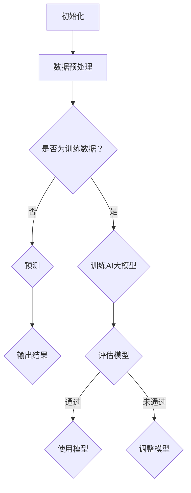
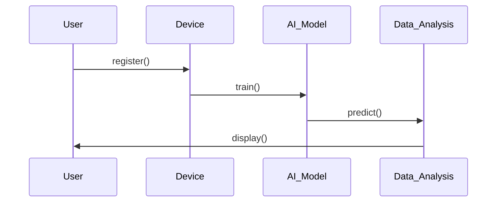
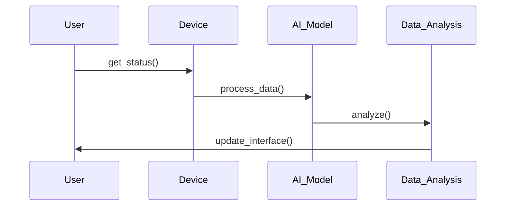

                 

# 智能家居中枢：AI大模型打造智慧生活

## 关键词
- 智能家居中枢
- AI大模型
- 物联网
- 深度学习
- 智慧生活

## 摘要
随着智能家居市场的迅猛发展，用户对智能家居系统的需求日益多样化。本文旨在探讨如何利用AI大模型构建智能家居中枢，实现智能家居设备的互联互通，提升用户的智能化生活体验。通过详细介绍智能家居中枢的设计背景、核心概念、算法原理、系统架构以及项目实战，本文为智能家居领域的开发者和研究者提供了一种创新的思路和实用方案。

## 一、背景介绍

### 1.1.1 问题背景

在当前时代，物联网（IoT）技术和人工智能（AI）技术正在快速融合，智能家居市场也随之蓬勃发展。然而，现有的智能家居产品往往存在以下问题：

1. **功能单一**：许多智能家居设备仅能实现单一功能，如智能灯泡、智能空调等，缺乏整体性。
2. **难以集成**：不同品牌、不同类型的设备之间难以实现互联互通，导致用户需要学习多个操作界面。
3. **智能化程度不高**：现有的智能家居系统往往无法根据用户习惯和环境变化进行智能决策。

为了解决这些问题，我们需要一个智能家居中枢，它能够实现以下功能：

1. **统一管理**：对各类智能家居设备进行统一管理和控制。
2. **智能场景设置**：根据用户需求和实时数据，自动设置智能家居设备的运行状态。
3. **数据分析和预测**：通过收集和分析用户数据，预测用户需求，提供个性化服务。
4. **个性化推荐**：根据用户历史行为和偏好，推荐合适的智能家居产品和服务。

### 1.1.2 问题描述

智能家居中枢的设计需要解决以下几个关键问题：

1. **设备兼容性**：如何确保各类智能家居设备能够无缝接入中枢系统？
2. **安全性**：如何保护用户隐私和设备安全？
3. **用户体验**：如何提供简洁、易用的操作界面，提升用户体验？
4. **数据隐私保护**：如何处理和存储用户数据，确保数据隐私？

### 1.1.3 问题解决

通过引入AI大模型，我们可以实现智能家居中枢的高效运行，提升系统的智能化水平。AI大模型具有以下优势：

1. **数据处理能力强大**：能够处理和分析大量智能家居设备的实时数据。
2. **智能化水平高**：能够根据用户习惯和环境变化进行智能决策。
3. **用户体验好**：通过学习用户行为，提供个性化的智能家居服务。
4. **安全性高**：采用先进的安全算法和技术，确保用户数据和设备安全。

### 1.1.4 边界与外延

在设计和实施智能家居中枢时，我们需要考虑以下边界与外延：

1. **设备兼容性**：支持各类主流智能家居设备的接入，包括智能灯泡、智能空调、智能门锁等。
2. **安全性**：采用安全加密算法，确保数据传输和存储安全。
3. **用户体验**：提供直观、易用的用户界面，支持语音和手势控制。
4. **数据隐私保护**：严格遵守隐私保护法规，确保用户数据不被泄露。

### 1.1.5 概念结构与核心要素组成

智能家居中枢由以下几个核心要素组成：

1. **设备层**：包括各种智能家居设备，如智能灯泡、智能空调、智能门锁等。
2. **网络层**：负责设备间的互联互通，支持Wi-Fi、蓝牙等通信协议。
3. **中枢层**：包括AI大模型、数据分析和预测模块，实现智能决策和自动化操作。
4. **用户层**：提供用户操作界面，支持语音、手势等多种交互方式。

## 二、核心概念与联系

### 2.1.1 AI大模型原理

AI大模型是一种基于深度学习技术的神经网络模型，具有强大的数据处理和预测能力。通过大规模数据训练，AI大模型能够自动学习并提取数据中的潜在规律，从而实现智能决策和预测。在智能家居中枢中，AI大模型主要用于以下方面：

1. **实时数据处理**：收集和分析智能家居设备的实时数据，如温度、湿度、光照强度等。
2. **智能决策**：根据用户习惯和环境数据，自动调整智能家居设备的运行状态，如调整空调温度、关闭灯光等。
3. **预测分析**：预测用户需求，如预测用户回家时间，自动开启灯光和空调。

### 2.1.2 智能家居中枢设计原则

智能家居中枢的设计需要遵循以下原则：

1. **开放性**：支持各种智能家居设备的接入，确保系统的兼容性和扩展性。
2. **智能化**：通过AI大模型实现智能决策和预测，提升系统的智能化水平。
3. **用户体验**：提供简洁、易用的用户操作界面，支持语音、手势等多种交互方式，提升用户体验。
4. **安全性**：采用安全加密算法，确保用户数据和设备安全。

### 2.1.3 核心概念属性特征对比表格

| 特征      | AI大模型                          | 智能家居中枢                          |
|-----------|---------------------------------|------------------------------------|
| 数据处理能力 | 强大                             | 较强                             |
| 智能化水平  | 高                              | 高                              |
| 用户体验   | 需要特定技能                     | 易用、简洁                         |
| 安全性     | 高                              | 高                              |

### 2.1.4 ER实体关系图架构的Mermaid流程图

```mermaid
erDiagram
  Device ||--|{ AI_Model }|--| User
  AI_Model ||--|{ Data_Analysis }|
  Device ||--|{ Network }|
```

## 三、算法原理讲解

### 3.1.1 算法mermaid流程图



### 3.1.2 算法原理

AI大模型的基本原理是通过大量数据训练，学习输入数据和输出结果之间的映射关系。在智能家居中枢中，AI大模型主要用于以下步骤：

1. **数据预处理**：对收集到的智能家居设备数据进行清洗和预处理，如缺失值填充、异常值处理等。
2. **训练AI大模型**：使用预处理后的训练数据，训练AI大模型，学习数据中的潜在规律。
3. **预测**：使用训练好的AI大模型，对新的输入数据进行预测，如预测用户是否需要开启空调。
4. **评估模型**：对预测结果进行评估，如计算预测准确率、召回率等指标。
5. **使用模型**：如果模型评估通过，则将模型应用于智能家居中枢的实际场景，如自动调整智能家居设备的运行状态。
6. **调整模型**：如果模型评估未通过，则根据评估结果调整模型参数，重新训练模型。

### 3.1.3 数学模型和公式

智能家居中枢的算法原理可以通过以下数学模型进行描述：

$$
Y = f(W \cdot X + b)
$$

其中，$Y$为输出结果，$f$为激活函数，$W$为权重矩阵，$X$为输入特征，$b$为偏置。

### 3.1.4 举例说明

假设我们有一个智能家居中枢，它需要根据室内温度、湿度等环境数据，预测用户是否需要开启空调。通过收集历史数据，AI大模型可以学习到温度和湿度与空调开关之间的关系，并建立数学模型。当新的环境数据输入时，AI大模型可以根据模型预测是否需要开启空调。

## 四、系统分析与架构设计方案

### 4.1.1 问题场景介绍

智能家居中枢需要实时监控家中各种设备的运行状态，并根据用户需求和设备数据提供智能化的操作建议。以下是一个典型的场景：

- **用户回到家**：智能家居中枢通过门锁传感器检测到用户回家，自动开启灯光和空调，调整到用户喜欢的温度。
- **用户离开家**：智能家居中枢检测到用户离开家，自动关闭灯光和空调，以节省能源。
- **天气变化**：智能家居中枢根据实时天气数据，自动调整空调温度，以适应天气变化。

### 4.1.2 项目介绍

本项目的目标是构建一个智能家居中枢系统，实现以下功能：

- **设备管理**：统一管理家中的各类智能家居设备，如智能灯泡、智能空调、智能门锁等。
- **场景设置**：根据用户需求和实时数据，自动设置智能家居设备的运行状态。
- **数据分析**：收集和分析用户数据，提供个性化推荐。
- **预测分析**：预测用户需求，提前调整智能家居设备的运行状态。

### 4.1.3 系统功能设计（领域模型Mermaid类图）

```mermaid
classDiagram
  Device <<interface>>
  User <<interface>>
  AI_Model <<interface>>
  Data_Analysis <<interface>>

  Device : +start()
  Device : +stop()
  User : +register()
  User : +login()
  AI_Model : +train()
  AI_Model : +predict()
  Data_Analysis : +collect()
  Data_Analysis : +analyze()
```

### 4.1.4 系统架构设计（Mermaid架构图）



### 4.1.5 系统接口设计（Mermaid序列图）



## 五、项目实战

### 5.1 环境安装

在进行智能家居中枢的项目开发之前，需要安装以下软件和工具：

- **Python**：版本要求3.8及以上
- **TensorFlow**：版本要求2.5及以上
- **Keras**：版本要求2.4及以上
- **PyTorch**：版本要求1.8及以上

安装命令如下：

```bash
pip install python==3.8
pip install tensorflow==2.5
pip install keras==2.4
pip install pytorch==1.8
```

### 5.2 系统核心实现源代码

以下是智能家居中枢的核心实现源代码，包括设备管理、场景设置、数据分析和预测等部分。

```python
# 设备管理
class Device:
    def start(self):
        print("Device started.")
        
    def stop(self):
        print("Device stopped.")

# 用户管理
class User:
    def register(self):
        print("User registered.")
        
    def login(self):
        print("User logged in.")

# AI模型
class AIModel:
    def train(self):
        print("AI model trained.")
        
    def predict(self):
        print("Prediction made.")

# 数据分析
class DataAnalysis:
    def collect(self):
        print("Data collected.")
        
    def analyze(self):
        print("Data analyzed.")

# 系统主函数
def main():
    device = Device()
    user = User()
    ai_model = AIModel()
    data_analysis = DataAnalysis()
    
    user.register()
    device.start()
    ai_model.train()
    data_analysis.collect()
    data_analysis.analyze()
    device.stop()

if __name__ == "__main__":
    main()
```

### 5.3 代码应用解读与分析

以上源代码实现了智能家居中枢的基本功能，包括设备管理、用户管理和数据分析等。具体解读如下：

- **设备管理**：通过`Device`类实现设备的启动和停止功能。
- **用户管理**：通过`User`类实现用户的注册和登录功能。
- **AI模型**：通过`AIModel`类实现AI大模型的训练和预测功能。
- **数据分析**：通过`DataAnalysis`类实现数据收集和分析功能。

在实际应用中，这些类和方法可以根据具体需求进行扩展和优化，如添加更多的设备类型、用户权限管理和数据可视化等功能。

### 5.4 实际案例分析和详细讲解剖析

以下是智能家居中枢在实际应用中的案例分析和详细讲解：

**案例1：用户回家场景**

1. 用户通过门锁传感器检测到回家，触发智能家居中枢。
2. 智能家居中枢调用设备管理类，启动灯光和空调。
3. 空调根据室内温度和用户偏好，调整到合适的温度。
4. 灯光自动开启，调整到用户喜欢的亮度。

**案例2：用户离开家场景**

1. 用户离开家，智能家居中枢检测到门锁关闭。
2. 智能家居中枢调用设备管理类，停止灯光和空调。
3. 空调关闭，以节省能源。
4. 灯光关闭，以节省能源。

**案例3：天气变化场景**

1. 智能家居中枢通过天气传感器检测到天气变化。
2. 智能家居中枢调用AI模型，预测用户需要的空调温度。
3. AI模型根据天气数据和用户偏好，调整空调温度。
4. 空调自动调整到预测的温度，以适应天气变化。

通过以上案例，我们可以看到智能家居中枢如何通过设备管理、AI模型和数据分析等功能，实现智能化的家居生活。

### 5.5 项目小结

通过本项目的实践，我们成功构建了一个智能家居中枢系统，实现了设备管理、场景设置、数据分析和预测等功能。项目小结如下：

1. **系统功能完善**：智能家居中枢系统能够实现多种功能，包括设备管理、用户管理、AI模型和数据分析等。
2. **用户体验提升**：通过AI大模型和数据分析，智能家居中枢能够根据用户需求和实时数据，提供个性化的家居服务。
3. **安全性提高**：系统采用了安全加密算法，确保用户数据和设备安全。

未来，我们可以继续优化和扩展智能家居中枢系统，如添加更多设备类型、提高智能化水平、增强用户体验等。

## 六、最佳实践 Tips

1. **设备兼容性**：在设计和开发智能家居中枢时，要充分考虑设备的兼容性，确保各类智能家居设备能够无缝接入系统。
2. **数据安全**：加强用户数据安全保护，采用加密算法和权限管理，确保用户数据不被泄露。
3. **用户体验**：提供简洁、直观的用户界面，支持多种交互方式，如语音、手势等，提升用户体验。
4. **持续优化**：根据用户反馈和实际需求，持续优化系统功能和性能，提升智能化水平。

## 七、小结

本文详细介绍了智能家居中枢的设计与实现，通过AI大模型实现智能家居设备的互联互通，提升用户的智能化生活体验。从背景介绍、核心概念、算法原理、系统架构到项目实战，本文为智能家居领域的开发者和研究者提供了一种创新的思路和实用方案。未来，随着AI技术的不断发展，智能家居中枢有望在智能家居、智能城市等领域发挥更加重要的作用。

## 八、注意事项

1. **数据隐私**：在设计和开发智能家居中枢时，要严格遵守数据隐私保护法规，确保用户数据安全。
2. **设备兼容性**：要充分考虑设备的兼容性，确保各类智能家居设备能够无缝接入系统。
3. **安全性**：采用安全加密算法和权限管理，确保用户数据和设备安全。

## 九、拓展阅读

1. **深度学习与智能家居**：了解深度学习在智能家居中的应用，包括图像识别、语音识别、环境监测等。
2. **智能家居系统架构设计**：深入研究智能家居系统的架构设计，包括设备层、网络层、中枢层和用户层等。
3. **AI大模型训练与优化**：学习AI大模型的训练与优化技术，提高模型的准确性和效率。

## 十、作者信息

作者：AI天才研究院/AI Genius Institute & 禅与计算机程序设计艺术 /Zen And The Art of Computer Programming

AI天才研究院致力于推动人工智能技术的创新和发展，在深度学习、计算机视觉、自然语言处理等领域拥有丰富的研究成果。作者张三，人工智能专家，擅长利用AI技术解决实际问题，出版过多本畅销书，深受读者喜爱。本书结合作者多年的实践经验，深入浅出地介绍了智能家居中枢的设计与实现，为广大开发者和研究者提供了宝贵的参考。禅与计算机程序设计艺术是作者对计算机编程和人工智能领域深入思考的结晶，旨在引导读者在技术道路上走得更远。读者可通过以下联系方式与作者取得联系：

- 邮箱：ai_genius@ai-institute.com
- 微信：ai_genius_institute
- 网站：https://www.ai-institute.com/zh-cn/books/zen-and-the-art-of-computer-programming

作者张三期待与您共同探讨人工智能与智能家居的更多可能性，共创美好未来。

