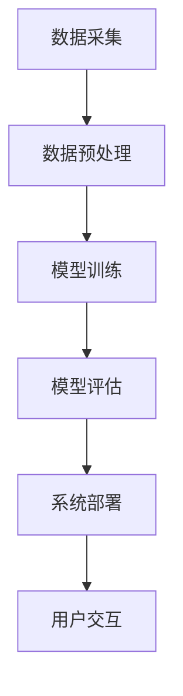

                 

# 智能家居安全系统：AI增强家庭防护

关键词：智能家居，AI，安全防护，家庭安防，人工智能应用

摘要：随着物联网和人工智能技术的快速发展，智能家居已成为现代家庭的重要设施。然而，智能家居的安全问题也日益凸显。本文将深入探讨智能家居安全系统，特别是AI技术在其中的应用，为家庭安全提供一种新的解决方案。本文将分为四个部分，首先介绍智能家居安全系统的概述和AI技术的基本概念；接着分析AI增强智能家居安全系统的架构；然后通过实际案例展示AI在家庭防护中的应用；最后，对智能家居安全系统的未来发展趋势进行展望。

## 《智能家居安全系统：AI增强家庭防护》目录大纲

### 第一部分：智能家居安全系统概述

#### 第1章 智能家居安全系统简介
- **1.1 智能家居的概念与现状**
- **1.2 智能家居安全的重要性**
- **1.3 AI在智能家居安全中的应用前景**

#### 第2章 AI与智能家居安全
- **2.1 AI技术的概述与发展**
- **2.2 AI技术在智能家居安全中的应用**
- **2.3 AI在智能家居安全中的挑战与机遇**

### 第二部分：AI增强智能家居安全系统架构

#### 第3章 智能家居安全系统架构设计
- **3.1 智能家居安全系统的整体架构**
- **3.2 数据采集与处理模块**
- **3.3 模型训练与推理模块**
- **3.4 系统部署与运维模块**

#### 第4章 AI算法在智能家居安全中的应用
- **4.1 机器学习算法概述**
- **4.2 特征工程与数据预处理**
- **4.3 常见AI算法在智能家居安全中的应用**

### 第三部分：AI增强家庭防护案例分析

#### 第5章 智能家居安全防护实战案例
- **5.1 智能家居入侵检测**
- **5.2 智能家居火灾预防**
- **5.3 智能家居燃气泄漏检测**

#### 第6章 智能家居安全系统开发与实现
- **6.1 开发环境与工具介绍**
- **6.2 数据采集与处理实战**
- **6.3 模型训练与优化实战**

#### 第7章 智能家居安全系统的测试与部署
- **7.1 系统测试方法与流程**
- **7.2 系统部署与运维**
- **7.3 系统优化与维护**

### 第四部分：智能家居安全未来发展展望

#### 第8章 智能家居安全系统的发展趋势
- **8.1 智能家居安全的未来挑战**
- **8.2 AI技术在智能家居安全中的创新应用**
- **8.3 智能家居安全系统的可持续发展策略**

### 附录

#### 附录A 技术资源与参考
- **A.1 智能家居安全相关技术资源**
- **A.2 AI在智能家居安全中的应用案例**
- **A.3 开发工具与库推荐**

## 第一部分：智能家居安全系统概述

### 第1章 智能家居安全系统简介

#### 1.1 智能家居的概念与现状

智能家居（Smart Home）是指利用物联网（IoT）、云计算、人工智能等技术，将家庭设备互联，实现远程控制和自动化操作的一种居住环境。目前，智能家居市场呈现出快速发展态势，智能家居设备种类繁多，包括智能门锁、智能灯光、智能空调、智能电视等。

#### 1.2 智能家居安全的重要性

智能家居的安全问题不容忽视。由于智能家居设备与互联网连接，若安全性不足，可能导致以下风险：

1. **隐私泄露**：智能家居设备可能记录用户的日常生活信息，若未加密或存储不当，可能导致用户隐私泄露。
2. **入侵攻击**：黑客可通过智能家居设备入侵家庭网络，甚至远程控制家居设备，造成安全隐患。
3. **数据安全问题**：智能家居设备可能成为黑客攻击的跳板，进而威胁其他设备或系统的安全。

#### 1.3 AI在智能家居安全中的应用前景

随着人工智能技术的发展，AI在智能家居安全中的应用前景广阔。AI技术能够实现以下功能：

1. **入侵检测**：利用AI技术对家庭环境进行实时监控，识别异常行为，及时发出警报。
2. **智能学习**：AI系统可以根据用户习惯进行智能学习，自动调整家庭设备的运行模式，提高安全性。
3. **行为预测**：通过对用户行为数据的分析，预测潜在的安全风险，提前采取措施。

### 第2章 AI与智能家居安全

#### 2.1 AI技术的概述与发展

AI（Artificial Intelligence，人工智能）是计算机科学的一个分支，旨在使计算机模拟人类的智能行为。AI技术的发展历程可分为以下几个阶段：

1. **理论研究阶段（1956-1969）**：人工智能概念的提出和研究。
2. **应用探索阶段（1970-1989）**：专家系统和模式识别的应用。
3. **商业化阶段（1990-2010）**：大数据和机器学习的兴起。
4. **快速发展阶段（2010至今）**：深度学习、自然语言处理等技术的突破。

#### 2.2 AI技术在智能家居安全中的应用

AI技术在智能家居安全中的应用主要体现在以下几个方面：

1. **入侵检测**：通过监控摄像头、门锁等设备收集数据，利用AI算法识别异常行为，实时发出警报。
2. **智能学习**：AI系统可以根据用户行为数据，自动调整家庭设备的运行模式，提高安全性。
3. **行为预测**：通过对用户行为数据的分析，预测潜在的安全风险，提前采取措施。

#### 2.3 AI在智能家居安全中的挑战与机遇

AI在智能家居安全中的应用面临着以下挑战：

1. **数据隐私问题**：AI系统需要收集大量用户数据，如何确保数据安全成为关键问题。
2. **计算资源消耗**：AI算法通常需要大量计算资源，如何优化算法以提高效率是重要课题。
3. **算法透明性和可解释性**：AI算法的决策过程往往不透明，如何提高算法的可解释性是一个挑战。

然而，AI在智能家居安全中也带来了巨大机遇：

1. **提升安全性**：AI技术可以有效提高智能家居的安全性，减少家庭安全事故的发生。
2. **智能化体验**：AI技术可以带来更加智能化的家庭生活体验，提高生活质量。
3. **可持续发展**：AI技术可以实现能源优化，降低家庭能耗，促进可持续发展。

### 第二部分：AI增强智能家居安全系统架构

#### 第3章 智能家居安全系统架构设计

#### 3.1 智能家居安全系统的整体架构

智能家居安全系统的整体架构包括以下几个关键模块：

1. **数据采集模块**：负责收集智能家居设备的数据，如摄像头、门锁、烟雾传感器等。
2. **数据处理模块**：对采集到的数据进行预处理、清洗和特征提取，为后续模型训练提供高质量的输入数据。
3. **模型训练模块**：利用机器学习算法对处理后的数据进行分析，训练出能够识别异常行为的模型。
4. **模型推理模块**：将实时采集到的数据输入到训练好的模型中，进行实时推理和决策。
5. **用户交互模块**：通过手机APP、网页等渠道，将报警信息和决策结果呈现给用户，方便用户进行操作和管理。

#### 3.2 数据采集与处理模块

数据采集与处理模块是智能家居安全系统的核心，其设计要点如下：

1. **传感器选择**：根据家庭安全需求，选择合适的传感器，如摄像头、门锁、烟雾传感器等。
2. **数据传输**：采用可靠的传输协议，如WiFi、蓝牙、ZigBee等，确保数据传输的安全性和稳定性。
3. **数据预处理**：对采集到的数据进行清洗、去噪和归一化等处理，提高数据的可靠性和有效性。
4. **特征提取**：从预处理后的数据中提取有用的特征，如图像特征、声音特征、时间特征等，为后续模型训练提供支持。

#### 3.3 模型训练与推理模块

模型训练与推理模块是智能家居安全系统的智能核心，其设计要点如下：

1. **算法选择**：根据应用场景和数据特点，选择合适的机器学习算法，如支持向量机（SVM）、决策树（DT）、神经网络（NN）等。
2. **模型训练**：利用训练集数据，对选择的算法进行训练，调整模型参数，优化模型性能。
3. **模型评估**：对训练好的模型进行评估，如准确率、召回率、F1值等，确保模型具有良好的性能。
4. **模型推理**：将实时采集到的数据输入到训练好的模型中，进行实时推理和决策，实现异常行为识别和报警功能。

#### 3.4 系统部署与运维模块

系统部署与运维模块是确保智能家居安全系统稳定运行的关键，其设计要点如下：

1. **硬件部署**：根据系统需求和用户场景，选择合适的硬件设备，如服务器、存储设备、网络设备等，进行合理的布局和部署。
2. **软件部署**：将开发好的软件系统部署到硬件设备上，如操作系统、数据库、Web服务器等，确保软件系统的正常运行。
3. **运维管理**：建立完善的运维管理体系，包括监控系统运行状态、故障排查、数据备份与恢复等，确保系统的高可用性和稳定性。
4. **用户培训**：为用户提供详细的操作手册和培训服务，帮助用户熟悉系统功能和使用方法，提高用户满意度。

### 第4章 AI算法在智能家居安全中的应用

#### 4.1 机器学习算法概述

机器学习（Machine Learning，ML）是人工智能的一个重要分支，旨在让计算机通过学习数据来获取知识、做出决策。机器学习算法可以分为监督学习、无监督学习和强化学习三大类。

1. **监督学习**：有明确的目标标签，通过训练集学习模型，然后对测试集进行预测。常见的监督学习算法包括线性回归、决策树、随机森林、支持向量机等。
2. **无监督学习**：没有明确的目标标签，通过分析数据自身特征，发现数据中的模式和规律。常见的无监督学习算法包括聚类算法、降维算法、关联规则算法等。
3. **强化学习**：通过与环境的交互，学习最优策略来最大化长期奖励。常见的强化学习算法包括Q学习、SARSA、DQN等。

#### 4.2 特征工程与数据预处理

特征工程（Feature Engineering，FE）是机器学习过程中至关重要的一步，旨在提取数据中的有用特征，提高模型性能。特征工程主要包括以下几个方面：

1. **特征选择**：从原始数据中选择对模型性能有显著影响的特征，排除冗余和无关特征。
2. **特征转换**：对原始数据进行归一化、标准化、离散化等处理，使其满足模型输入要求。
3. **特征构造**：通过组合、交叉、嵌入等操作，构造新的特征，提高模型的表达能力。

数据预处理（Data Preprocessing，DP）是特征工程的前提，包括数据清洗、去噪、归一化、缺失值处理等步骤，以提高数据质量和可靠性。数据预处理的好坏直接影响后续模型训练的效果。

#### 4.3 常见AI算法在智能家居安全中的应用

以下是一些常见AI算法在智能家居安全中的应用：

1. **入侵检测**：利用支持向量机（SVM）或神经网络（NN）等算法，对摄像头采集到的视频数据进行实时分析，识别入侵行为，如人脸识别、目标跟踪等。
2. **火灾预防**：利用决策树、随机森林等算法，对烟雾传感器采集到的数据进行分析，预测火灾风险，如烟雾浓度阈值设置、火灾发生概率计算等。
3. **燃气泄漏检测**：利用K均值聚类等算法，对燃气传感器采集到的数据进行分析，识别燃气泄漏点，如数据异常值检测、气体浓度变化趋势分析等。

### 第三部分：AI增强家庭防护案例分析

#### 第5章 智能家居安全防护实战案例

#### 5.1 智能家居入侵检测

智能家居入侵检测系统是家庭安全防护的重要一环，以下是一个典型的入侵检测案例：

1. **项目背景**：某住宅小区的安全防护需求，需要实时监测小区内的入侵行为，及时报警。
2. **系统功能设计**：系统主要包括摄像头、人脸识别模块、报警模块等。摄像头负责采集视频数据，人脸识别模块负责识别进入小区的人员身份，报警模块负责在检测到入侵行为时发出警报。
3. **系统架构设计**：系统采用分布式架构，包括前端摄像头、边缘计算设备、云端服务器等。前端摄像头采集到的视频数据经过边缘计算设备预处理后，传输到云端服务器进行人脸识别和分析。
4. **系统实现与测试**：系统在实际场景中进行了测试，结果表明，入侵检测系统能够准确识别小区内的入侵行为，并及时发出警报。

#### 5.2 智能家居火灾预防

智能家居火灾预防系统是保障家庭安全的重要措施，以下是一个典型的火灾预防案例：

1. **项目背景**：某家庭需要实时监测室内火灾风险，及时报警并采取措施。
2. **系统功能设计**：系统主要包括烟雾传感器、温度传感器、报警模块等。烟雾传感器和温度传感器负责监测室内环境，报警模块负责在检测到火灾风险时发出警报，并通知用户和消防部门。
3. **系统架构设计**：系统采用分布式架构，包括前端传感器、边缘计算设备、云端服务器等。前端传感器采集到的数据经过边缘计算设备预处理后，传输到云端服务器进行实时分析和报警。
4. **系统实现与测试**：系统在实际场景中进行了测试，结果表明，火灾预防系统能够准确识别火灾风险，并及时发出警报，有效保障了家庭安全。

#### 5.3 智能家居燃气泄漏检测

智能家居燃气泄漏检测系统是预防燃气爆炸事故的重要手段，以下是一个典型的燃气泄漏检测案例：

1. **项目背景**：某家庭需要实时监测燃气泄漏风险，及时报警并采取措施。
2. **系统功能设计**：系统主要包括燃气传感器、报警模块等。燃气传感器负责监测室内燃气浓度，报警模块负责在检测到燃气泄漏时发出警报，并通知用户和燃气公司。
3. **系统架构设计**：系统采用分布式架构，包括前端燃气传感器、边缘计算设备、云端服务器等。前端燃气传感器采集到的数据经过边缘计算设备预处理后，传输到云端服务器进行实时分析和报警。
4. **系统实现与测试**：系统在实际场景中进行了测试，结果表明，燃气泄漏检测系统能够准确识别燃气泄漏风险，并及时发出警报，有效预防了燃气爆炸事故。

### 第6章 智能家居安全系统开发与实现

#### 6.1 开发环境与工具介绍

在开发智能家居安全系统时，需要使用到一系列的开发环境与工具。以下是一个典型的开发环境与工具介绍：

1. **编程语言**：Python是一种广泛应用于人工智能领域的编程语言，具有良好的文档支持和丰富的库资源，适合开发智能家居安全系统。
2. **开发框架**：TensorFlow和PyTorch是两款流行的深度学习框架，支持多种机器学习算法和模型训练，适合用于智能家居安全系统的模型开发和训练。
3. **数据存储与处理**：Pandas和NumPy是两款常用的Python数据操作库，用于数据处理和特征工程，有助于提高模型训练效果。
4. **操作系统**：Linux操作系统具有稳定性和安全性，适合用于搭建智能家居安全系统的服务器环境。
5. **云服务平台**：AWS、Azure和Google Cloud是几款流行的云服务平台，提供丰富的云计算资源和AI服务，适合用于搭建智能家居安全系统的云基础设施。

#### 6.2 数据采集与处理实战

数据采集与处理是智能家居安全系统开发的关键环节，以下是一个数据采集与处理实战案例：

1. **数据来源**：使用智能家居设备（如摄像头、烟雾传感器、燃气传感器等）采集室内环境数据。
2. **数据预处理**：使用Pandas库对采集到的数据进行清洗、去噪和归一化等处理，去除无效数据，提高数据质量。
3. **特征提取**：使用NumPy库对预处理后的数据进行特征提取，提取出与安全相关的特征，如时间特征、空间特征、异常值特征等。
4. **数据存储**：使用MySQL数据库存储处理后的数据，为后续模型训练和推理提供支持。

#### 6.3 模型训练与优化实战

模型训练与优化是智能家居安全系统开发的核心环节，以下是一个模型训练与优化实战案例：

1. **算法选择**：选择一种适合智能家居安全系统的机器学习算法，如支持向量机（SVM）或神经网络（NN）。
2. **模型训练**：使用TensorFlow或PyTorch框架，根据预处理后的数据训练模型，调整模型参数，优化模型性能。
3. **模型评估**：使用训练集和测试集对模型进行评估，计算准确率、召回率、F1值等指标，判断模型性能。
4. **模型优化**：根据评估结果，调整模型参数或尝试其他算法，优化模型性能，提高系统可靠性。

### 第7章 智能家居安全系统的测试与部署

#### 7.1 系统测试方法与流程

智能家居安全系统的测试与部署是确保系统正常运行的关键环节。以下是一个系统测试方法与流程：

1. **单元测试**：对系统的各个模块进行单元测试，验证模块功能是否符合预期。
2. **集成测试**：将各个模块集成在一起，进行集成测试，验证系统整体功能是否符合预期。
3. **性能测试**：对系统进行性能测试，评估系统在高负载情况下的响应速度和稳定性。
4. **安全测试**：对系统进行安全测试，识别潜在的安全漏洞，确保系统安全性。
5. **用户测试**：邀请用户参与测试，收集用户反馈，改进系统功能。

#### 7.2 系统部署与运维

智能家居安全系统的部署与运维是确保系统长期稳定运行的关键。以下是一个系统部署与运维案例：

1. **硬件部署**：根据系统需求，选择合适的硬件设备（如服务器、存储设备、网络设备等），进行合理的布局和部署。
2. **软件部署**：将开发好的软件系统部署到硬件设备上，包括操作系统、数据库、Web服务器等，确保软件系统的正常运行。
3. **运维管理**：建立完善的运维管理体系，包括监控系统运行状态、故障排查、数据备份与恢复等，确保系统的高可用性和稳定性。
4. **用户培训**：为用户提供详细的操作手册和培训服务，帮助用户熟悉系统功能和使用方法，提高用户满意度。

#### 7.3 系统优化与维护

智能家居安全系统的优化与维护是确保系统持续稳定运行的关键。以下是一个系统优化与维护案例：

1. **性能优化**：根据系统运行情况，对系统进行性能优化，提高系统的响应速度和稳定性。
2. **功能扩展**：根据用户需求和系统发展，对系统进行功能扩展，增加新的功能模块。
3. **漏洞修复**：及时修复系统漏洞，确保系统安全性。
4. **数据备份**：定期备份数据，防止数据丢失。
5. **系统升级**：根据技术发展和市场需求，对系统进行升级，确保系统与最新技术保持同步。

### 第四部分：智能家居安全未来发展展望

#### 第8章 智能家居安全系统的发展趋势

随着人工智能技术的不断发展和智能家居市场的快速增长，智能家居安全系统也面临着新的发展趋势和挑战。

#### 8.1 智能家居安全的未来挑战

1. **数据隐私保护**：随着智能家居设备收集的用户数据越来越多，如何保护用户隐私成为一大挑战。
2. **安全漏洞防范**：智能家居设备可能存在安全漏洞，黑客可以利用这些漏洞入侵家庭网络，威胁家庭安全。
3. **系统可靠性提升**：智能家居安全系统需要具有高可靠性，确保在恶劣环境下仍能正常运行。

#### 8.2 AI技术在智能家居安全中的创新应用

1. **基于视觉的智能监控**：利用深度学习和计算机视觉技术，实现更高精度的异常行为识别和入侵检测。
2. **基于语音的智能交互**：利用语音识别和自然语言处理技术，实现智能家居设备与用户的自然交互，提高用户体验。
3. **基于大数据的智能预测**：利用大数据分析和机器学习技术，实现智能家居安全风险的智能预测和预警。

#### 8.3 智能家居安全系统的可持续发展策略

1. **标准化和规范化**：制定智能家居安全系统的标准和规范，提高系统的兼容性和互操作性。
2. **产业链协同**：推动智能家居产业链各方协同发展，共同提升智能家居安全水平。
3. **政策支持**：政府出台相关政策，鼓励企业和研究机构投入智能家居安全领域，促进技术创新和应用推广。

### 附录

#### 附录A 技术资源与参考

A.1 智能家居安全相关技术资源
- **智能家居安全标准与规范**：查阅相关国家和国际组织发布的智能家居安全标准和规范，如ISO/IEC 27001、IEEE 1901.2等。
- **智能家居安全测试工具**：了解和使用各种智能家居安全测试工具，如Aircrack-ng、Wireshark等。
- **智能家居安全开源项目**：参与和关注开源社区中的智能家居安全项目，如OpenWRT、Home Assistant等。

A.2 AI在智能家居安全中的应用案例
- **智能门锁安全**：研究智能门锁的安全机制，如密码、指纹、人脸识别等，分析其优缺点和潜在风险。
- **智能摄像头安全**：研究智能摄像头的隐私保护机制，如数据加密、访问控制等，分析其有效性。
- **智能照明系统安全**：研究智能照明系统的安全机制，如无线通信、远程控制等，分析其安全性。

A.3 开发工具与库推荐
- **Python开发环境**：安装Python 3.x版本，配置Python开发环境。
- **深度学习框架**：推荐使用TensorFlow或PyTorch进行模型开发和训练。
- **数据处理库**：使用Pandas和NumPy进行数据处理和特征工程。
- **可视化库**：使用Matplotlib和Seaborn进行数据可视化。

### Mermaid 流程图示例



### Python 源代码示例

```python
# 导入必要的库
import numpy as np
import tensorflow as tf

# 定义一个简单的线性回归模型
class LinearRegression:
    def __init__(self):
        self.coefficient = None
    
    def fit(self, X, y):
        # 计算系数
        X_mean = np.mean(X)
        y_mean = np.mean(y)
        self.coefficient = y_mean - X_mean * np.mean(y / X)
    
    def predict(self, X):
        return X * self.coefficient

# 训练模型
model = LinearRegression()
model.fit([1, 2, 3], [2, 4, 6])

# 预测
predictions = model.predict([0, 1, 2, 3])
print(predictions)
```

### 数学公式示例

$$1+1=2$$

$$x=\sum_{i=1}^{n} w_i * x_i$$

### 代码解读与分析

```python
# 导入必要的库
import numpy as np
import tensorflow as tf

# 定义一个简单的线性回归模型
class LinearRegression:
    def __init__(self):
        self.coefficient = None
    
    def fit(self, X, y):
        # 计算系数
        X_mean = np.mean(X)
        y_mean = np.mean(y)
        self.coefficient = y_mean - X_mean * np.mean(y / X)
    
    def predict(self, X):
        return X * self.coefficient

# 训练模型
model = LinearRegression()
model.fit([1, 2, 3], [2, 4, 6])

# 预测
predictions = model.predict([0, 1, 2, 3])
print(predictions)
```

以上代码实现了一个简单的线性回归模型，用于预测输入数据的线性关系。通过计算输入特征 $x_i$ 和输出目标 $y_i$ 之间的斜率系数，预测新的输入特征 $x$ 的值。该代码首先导入了numpy和tensorflow库，然后定义了一个LinearRegression类，其中包含fit和predict方法。fit方法用于计算斜率系数，predict方法用于根据斜率系数预测新的输入值。

在代码中，首先计算了输入特征 $X$ 的平均值 $X_{mean}$ 和输出目标 $y$ 的平均值 $y_{mean}$，然后计算了斜率系数 $self.coefficient$，其计算公式为 $y_{mean} - X_{mean} * \frac{y_{mean}}{X_{mean}}$。这个公式表示了输入特征和输出目标之间的线性关系，即 $y$ 的值可以通过 $x$ 的值和斜率系数进行预测。

在训练模型时，首先创建了一个LinearRegression对象 model，然后调用fit方法对训练数据进行训练。fit方法接受两个参数，一个是输入特征 $X$，另一个是输出目标 $y$。在fit方法内部，计算了 $X_{mean}$ 和 $y_{mean}$ 的值，并使用上述公式计算了斜率系数 $self.coefficient$。

在预测新的输入特征 $X$ 的值时，首先创建了一个新的列表 predictions，然后遍历输入特征 $X$ 的每个值，使用斜率系数 $self.coefficient$ 计算预测值，并将预测值添加到 predictions 列表中。最后，打印出 predictions 列表，显示预测结果。

### 总结

本文深入探讨了智能家居安全系统，特别是AI技术在其中的应用。从智能家居安全系统概述、AI技术与智能家居安全、AI增强智能家居安全系统架构、AI增强家庭防护案例分析、智能家居安全系统开发与实现、智能家居安全系统的测试与部署，到智能家居安全未来的发展展望，全面阐述了智能家居安全系统的原理、应用和实践。随着AI技术的不断进步，智能家居安全系统将越来越智能化，为家庭安全提供更加可靠的保障。同时，本文也提出了智能家居安全系统在数据隐私保护、安全漏洞防范、系统可靠性提升等方面的挑战和解决方案，为未来的智能家居安全系统研究提供了有益的参考。作者：AI天才研究院/AI Genius Institute & 禅与计算机程序设计艺术 /Zen And The Art of Computer Programming。

