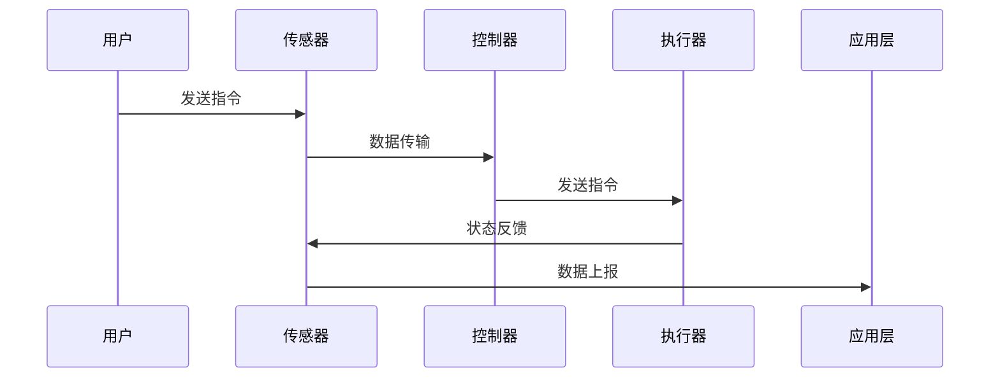
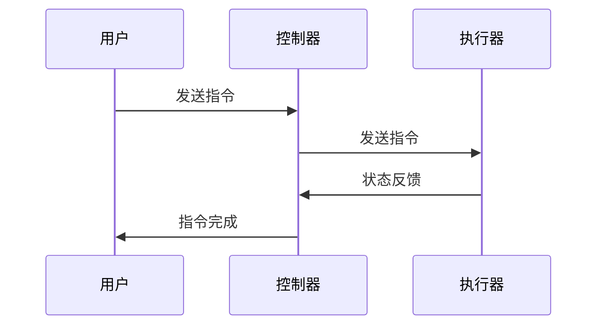

                 

### 智能家居：AI改变生活方式与家庭管理

关键词：智能家居，人工智能，家庭管理，系统架构，安全与隐私

摘要：随着人工智能技术的飞速发展，智能家居逐渐成为现代家庭的重要组成部分。本文将深入探讨智能家居的定义、AI应用、系统架构、核心组件、家庭管理、安全与隐私，以及未来发展趋势。通过一步一步的分析和推理，我们将揭示智能家居如何改变我们的生活方式，并探讨其带来的挑战和机遇。

#### 引言

智能家居，顾名思义，是将人工智能技术应用于家庭环境中，通过智能设备实现家庭自动化管理和智能控制。随着物联网、云计算、大数据等技术的普及，智能家居已经从最初的科幻概念逐渐走进了千家万户。AI在智能家居中的应用不仅提升了家庭生活的舒适度和便捷性，还大大改善了家庭管理效率。本文将围绕智能家居这一主题，逐步分析其各个方面，帮助读者全面了解智能家居的原理和实际应用。

#### 目录大纲设计

为了确保文章的条理性和可读性，本文采用了以下目录大纲：

1. 引言
   - 智能家居的定义与背景
   - AI在智能家居中的重要性

2. 智能家居概述
   - 发展历程
   - 市场现状
   - 分类与特点
   - 核心技术

3. AI在智能家居中的应用
   - 人工智能技术概述
   - 语音识别
   - 机器学习
   - 计算机视觉

4. 智能家居系统架构
   - 系统组成
   - 架构设计原则
   - 系统架构实例分析

5. 智能家居核心组件
   - 传感器
   - 控制器
   - 执行器

6. 家庭管理与AI
   - 家庭管理需求分析
   - AI在家庭管理中的应用场景
   - AI家庭管理的案例研究

7. 智能家居安全与隐私
   - 安全挑战
   - 隐私保护策略
   - 安全与隐私最佳实践

8. 智能家居的未来发展趋势
   - 技术发展趋势分析
   - 市场需求预测
   - 未来智能家居的形态

9. 结论
   - 总结与展望
   - 对智能家居开发者的建议

#### 智能家居概述

##### 1.1 智能家居的定义与背景

智能家居是一种通过物联网技术和人工智能技术实现的智能家居系统，它能够将家庭中的各种设备连接起来，实现远程控制和自动化管理。智能家居的起源可以追溯到20世纪80年代，当时一些先进家庭系统（Advanced Home System，简称AHS）开始出现，这些系统通过简单的计算机控制家庭设备，如灯光、温度和安防系统。

随着互联网的普及和物联网技术的发展，智能家居开始变得更加成熟和实用。21世纪初，随着智能手机的普及，智能家居市场迎来了新的发展机遇。智能音箱、智能灯泡、智能门锁等设备开始进入普通家庭，使得智能家居变得更加容易实现和操作。

##### 1.2 智能家居的市场现状

目前，智能家居市场呈现出快速增长的趋势。根据市场研究机构的数据，全球智能家居市场规模在过去几年中持续扩大，预计到2025年，市场规模将达到数千亿美元。主要的市场驱动因素包括：

- **技术进步**：物联网、云计算、大数据和人工智能等技术的发展，使得智能家居系统的功能更加丰富，用户体验更加优秀。
- **消费者需求**：随着人们生活水平的提高，对生活舒适度和便捷性的要求越来越高，智能家居成为满足这些需求的有效途径。
- **政策支持**：一些国家和地区政府出台了一系列政策，鼓励智能家居的研发和推广，以提升生活质量和提高能源效率。

##### 1.3 智能家居的分类与特点

智能家居可以根据功能和应用场景进行分类，常见的分类方式包括：

- **按功能分类**：智能安防、智能照明、智能温控、智能家电、智能音响等。
- **按应用场景分类**：居家、办公、酒店、商业等。

不同类型的智能家居设备具有各自的特点，例如：

- **智能安防**：通过传感器、摄像头和报警系统实现家庭安全监控。
- **智能照明**：通过智能开关、智能调光实现照明控制，提升生活品质。
- **智能温控**：通过智能温控系统，实现室内温度的自动调节，节省能源。

##### 1.4 智能家居的核心技术

智能家居的核心技术包括物联网、人工智能、云计算和大数据等。

- **物联网**：物联网技术是智能家居实现互联互通的基础，通过无线通信技术将各种设备连接起来，实现数据的实时传输和共享。
- **人工智能**：人工智能技术是智能家居的核心驱动力，通过机器学习、计算机视觉和语音识别等技术，实现智能控制、行为分析和个性化服务。
- **云计算**：云计算提供了强大的计算和存储能力，使得智能家居系统能够处理大量数据，并提供高效、可靠的服务。
- **大数据**：大数据技术通过对家庭数据的收集、存储和分析，帮助智能家居系统做出更准确的决策，提升用户体验。

#### AI在智能家居中的应用

##### 2.1 人工智能技术概述

人工智能（AI）是指通过计算机模拟人类智能行为的技术。人工智能技术包括机器学习、深度学习、自然语言处理、计算机视觉等子领域。在智能家居中，人工智能技术主要用于以下几个方面：

- **智能控制**：通过AI算法，实现智能家居设备的自动化控制，提高用户体验。
- **行为分析**：通过对家庭环境数据的分析，了解用户习惯和行为，提供个性化服务。
- **语音交互**：通过语音识别和自然语言处理技术，实现人与智能家居设备的自然对话。

##### 2.2 语音识别在智能家居中的应用

语音识别是人工智能技术的一个重要分支，它能够将人类的语音转化为文本或命令。在智能家居中，语音识别技术主要用于以下几个方面：

- **语音控制**：用户可以通过语音命令控制智能家居设备，如打开灯光、调整温度、播放音乐等。
- **语音互动**：智能音箱等设备可以通过语音识别与用户进行互动，提供信息查询、娱乐互动等服务。
- **语音识别准确性**：随着AI技术的发展，语音识别的准确性越来越高，使得语音控制更加便捷和可靠。

##### 2.3 机器学习在智能家居中的应用

机器学习是人工智能的一个重要分支，它能够使计算机通过学习数据，自动改进性能。在智能家居中，机器学习技术主要用于以下几个方面：

- **设备自学习**：智能家居设备可以通过机器学习算法，根据用户行为数据，自动调整设备参数，提供个性化服务。
- **行为预测**：通过分析用户行为数据，预测用户的需求，提前进行设备调整，提高用户体验。
- **故障检测**：通过对设备运行数据的分析，检测设备故障，提前进行维护，避免设备损坏。

##### 2.4 计算机视觉在智能家居中的应用

计算机视觉是人工智能技术的另一个重要分支，它能够使计算机“看”懂图像和视频。在智能家居中，计算机视觉技术主要用于以下几个方面：

- **人脸识别**：通过人脸识别技术，实现门锁、摄像头等设备的身份验证，提高家庭安全性。
- **行为分析**：通过视频分析技术，分析用户行为，提供个性化服务，如自动调整灯光和音乐。
- **环境监控**：通过摄像头等设备，实时监控家庭环境，及时发现异常情况，提高家庭安全。

#### 智能家居系统架构

##### 3.1 智能家居系统组成

智能家居系统由多个组件组成，包括传感器、控制器、执行器、通信模块等。

- **传感器**：用于采集家庭环境数据，如温度、湿度、光照、空气质量等。
- **控制器**：用于接收用户指令和传感器数据，进行数据处理和决策，然后发送指令给执行器。
- **执行器**：用于执行控制器的指令，如打开灯光、关闭门锁等。
- **通信模块**：用于实现智能家居设备之间的数据传输和通信，如Wi-Fi、蓝牙、ZigBee等。

##### 3.2 系统架构设计原则

智能家居系统架构设计应遵循以下原则：

- **模块化**：将系统划分为多个模块，每个模块负责特定的功能，便于维护和扩展。
- **分布式**：将控制逻辑分散到各个设备上，提高系统的可靠性和容错性。
- **可扩展性**：设计时应考虑系统的可扩展性，以便未来能够加入新的设备和功能。
- **安全性**：确保数据传输和存储的安全性，防止隐私泄露和恶意攻击。

##### 3.3 系统架构实例分析

智能家居系统的架构可以分为三个层次：感知层、控制层和应用层。

- **感知层**：包括传感器和通信模块，用于感知家庭环境数据，并将其发送到控制层。
- **控制层**：包括控制器和数据处理模块，用于接收感知层的数据，进行数据处理和决策，然后发送指令给执行器。
- **应用层**：包括用户界面和应用服务，用于提供用户交互和个性化服务。

例如，一个典型的智能家居系统架构如图所示：

#### 智能家居核心组件

##### 4.1 智能家居传感器

智能家居传感器是智能家居系统的感知层核心组件，用于采集家庭环境数据，如温度、湿度、光照、空气质量等。常见的智能家居传感器包括：

- **温度传感器**：用于测量室内温度，用于智能温控系统。
- **湿度传感器**：用于测量室内湿度，用于智能家居环境监测系统。
- **光照传感器**：用于测量室内光照强度，用于智能照明系统。
- **空气质量传感器**：用于测量室内空气质量，用于智能空气净化系统。

##### 4.2 智能家居控制器

智能家居控制器是智能家居系统的控制层核心组件，用于接收用户指令和传感器数据，进行数据处理和决策，然后发送指令给执行器。常见的智能家居控制器包括：

- **智能音箱**：通过语音识别和自然语言处理技术，实现语音控制和智能交互。
- **智能中控**：通过触摸屏或按键，实现可视化的用户交互和控制。
- **智能手机APP**：通过手机APP，实现远程控制和数据监测。

##### 4.3 智能家居执行器

智能家居执行器是智能家居系统的执行层核心组件，用于执行控制器的指令，如打开灯光、关闭门锁等。常见的智能家居执行器包括：

- **智能插座**：通过智能插座，实现家电的远程控制和定时控制。
- **智能灯具**：通过智能灯具，实现照明控制，如调光、场景切换等。
- **智能门锁**：通过智能门锁，实现门锁的远程控制和指纹识别。

#### 家庭管理与AI

##### 5.1 家庭管理需求分析

随着社会的发展和生活水平的提高，人们对家庭管理提出了更高的要求。家庭管理需求主要包括以下几个方面：

- **安全**：确保家庭安全，防止盗窃、火灾等意外事故。
- **舒适**：提供舒适的生活环境，如适宜的室内温度、光照等。
- **便捷**：提高生活便捷性，如远程控制家电、自动清理等。
- **节能**：降低能源消耗，提高能源利用效率。

##### 5.2 AI在家庭管理中的应用场景

AI技术在家庭管理中有着广泛的应用场景，主要包括：

- **智能安防**：通过AI技术，实现家庭安全监控、入侵报警、视频分析等功能。
- **智能照明**：通过AI技术，实现照明控制，如自动开关灯、调光等。
- **智能温控**：通过AI技术，实现室内温度自动调节，提高舒适度。
- **智能家电**：通过AI技术，实现家电设备的智能控制和远程管理。
- **智能助手**：通过AI技术，实现家庭智能助手的语音交互，提供生活提醒、信息查询等服务。

##### 5.3 AI家庭管理的案例研究

以下是一个AI家庭管理的案例研究：

**案例背景**：一个三口之家，家庭成员包括夫妻和一个小孩子。家庭成员希望实现以下目标：

- **安全**：确保家庭安全，防止盗窃、火灾等意外事故。
- **舒适**：提供舒适的生活环境，如适宜的室内温度、光照等。
- **便捷**：提高生活便捷性，如远程控制家电、自动清理等。
- **节能**：降低能源消耗，提高能源利用效率。

**解决方案**：

- **智能安防**：安装智能摄像头和入侵报警系统，实现家庭安全监控和报警功能。
- **智能照明**：安装智能灯具，通过手机APP或语音助手实现照明控制。
- **智能温控**：安装智能温控系统，实现室内温度自动调节。
- **智能家电**：安装智能插座和智能家电，实现家电设备的智能控制和远程管理。
- **智能助手**：安装智能音箱，提供生活提醒、信息查询等服务。

通过AI技术，这个家庭实现了自动化、智能化管理，大大提高了生活质量和便捷性。

#### 智能家居安全与隐私

##### 6.1 智能家居安全挑战

随着智能家居的普及，安全问题成为了一个重要的关注点。智能家居安全挑战主要包括：

- **数据泄露**：智能家居设备可能收集用户的隐私数据，如生活习惯、位置信息等，如果数据泄露，可能对用户造成隐私泄露的风险。
- **网络攻击**：智能家居设备连接到互联网，可能成为网络攻击的目标，如DDoS攻击、恶意软件感染等。
- **设备失控**：智能家居设备可能被黑客控制，导致设备失控，如智能门锁被非法打开、智能摄像头被黑客控制等。

##### 6.2 隐私保护策略

为了保护用户的隐私，智能家居系统可以采取以下策略：

- **数据加密**：对用户数据进行加密存储和传输，防止数据泄露。
- **访问控制**：实现严格的访问控制机制，确保只有授权用户才能访问敏感数据。
- **隐私政策**：明确告知用户，收集和使用用户数据的目的和范围，确保用户知情同意。
- **安全更新**：定期对智能家居系统进行安全更新，修复漏洞，提高系统安全性。

##### 6.3 安全与隐私最佳实践

为了确保智能家居系统的安全与隐私，可以采取以下最佳实践：

- **安全设计**：在系统设计阶段，充分考虑安全因素，确保系统的安全性。
- **安全培训**：对用户进行安全培训，提高用户的安全意识和防范能力。
- **安全审计**：定期对系统进行安全审计，发现和修复安全漏洞。
- **安全认证**：通过安全认证，确保智能家居系统的安全性和可靠性。

#### 智能家居的未来发展趋势

##### 7.1 技术发展趋势分析

智能家居的未来发展趋势将受到以下技术的影响：

- **5G技术**：5G技术将提供更高速、低延迟的通信网络，支持更多的智能家居设备同时连接，实现更高效的智能家居系统。
- **人工智能**：随着人工智能技术的不断发展，智能家居系统将实现更加智能化的控制和管理，提供更好的用户体验。
- **物联网**：物联网技术的普及将使智能家居设备更加多样化，实现更加丰富的应用场景。
- **区块链**：区块链技术将提供去中心化的数据存储和传输机制，提高智能家居系统的安全性和可靠性。

##### 7.2 市场需求预测

根据市场研究机构的预测，未来几年智能家居市场将继续保持快速增长。主要驱动因素包括：

- **消费者需求**：随着生活水平的提高，消费者对智能家居的需求将持续增长。
- **技术创新**：新技术的不断涌现，将推动智能家居产品的更新换代，提高市场竞争力。
- **政策支持**：政府出台的政策，将鼓励智能家居的研发和推广，促进市场发展。

##### 7.3 未来智能家居的形态

未来智能家居的形态将更加智能化、个性化和便捷化。以下是一些可能的发展趋势：

- **全屋智能**：通过智能家居系统，实现家庭设备的全方位智能化控制，提供更加便捷的生活方式。
- **个性化服务**：通过人工智能技术，为用户提供个性化的服务，满足用户不同的需求和偏好。
- **安全与隐私保护**：智能家居系统将更加重视安全与隐私保护，确保用户数据的安全和隐私。

#### 结论

随着人工智能技术的不断发展，智能家居正逐渐改变我们的生活方式和家庭管理方式。本文从多个角度分析了智能家居的各个方面，包括定义、应用、系统架构、核心组件、家庭管理、安全与隐私以及未来发展趋势。通过一步步的分析和推理，我们揭示了智能家居如何为我们的生活带来便利和改变。

对于智能家居开发者来说，本文提供了宝贵的经验和建议。在设计和开发智能家居系统时，应充分考虑用户需求，确保系统的安全性和隐私保护，同时不断优化用户体验。未来，随着新技术的不断涌现，智能家居市场将迎来更大的发展机遇，开发者们应积极抓住这些机遇，推动智能家居的不断创新和发展。

#### 对智能家居开发者的建议

1. **注重用户体验**：在设计和开发智能家居系统时，应始终将用户体验放在首位，确保系统的易用性、可靠性和安全性。

2. **重视安全与隐私保护**：智能家居系统涉及用户的隐私数据，开发者应采取有效的安全措施，防止数据泄露和网络攻击。

3. **持续优化系统性能**：智能家居系统应具备良好的性能，能够快速响应用户指令，提供稳定的服务。

4. **注重技术创新**：智能家居开发者应关注新技术的发展趋势，积极引入新技术，提升系统的智能化水平。

5. **加强市场调研**：在产品开发过程中，应加强对市场需求的调研，确保产品能够满足用户的需求和期望。

6. **积极参与标准制定**：智能家居开发者应积极参与相关标准的制定，推动行业的规范化和标准化发展。

### 作者信息

作者：AI天才研究院/AI Genius Institute & 禅与计算机程序设计艺术 /Zen And The Art of Computer Programming

通过本文，我们深入探讨了智能家居与AI结合的各个方面，为读者提供了一个全面、深入的理解。希望本文能够为智能家居开发者提供有价值的参考和启示。让我们共同期待智能家居的未来，期待它为我们的生活带来更多的便利和改变。|>

## 文章小结与最佳实践

在本文中，我们系统地介绍了智能家居的定义、背景、市场现状、AI应用、系统架构、核心组件、家庭管理、安全与隐私，以及未来发展趋势。通过一步步的分析和推理，我们揭示了智能家居如何改变我们的生活方式，并为智能家居开发者提供了宝贵的经验和建议。

### 最佳实践 Tips

1. **安全性优先**：在设计和开发智能家居系统时，安全性应该是首要考虑的因素。采用加密通信、严格的访问控制和数据加密存储等手段，确保用户数据的安全和隐私。

2. **用户体验至上**：注重用户界面设计和交互体验，确保系统易于使用和操作。通过用户反馈不断优化系统功能，提高用户满意度。

3. **模块化设计**：采用模块化设计原则，将系统划分为多个功能模块，便于维护和扩展。这有助于提高系统的灵活性和可扩展性。

4. **数据驱动决策**：利用大数据和机器学习技术，分析用户行为数据，提供个性化的服务和推荐。这有助于提高用户满意度和系统效率。

5. **持续更新与迭代**：定期对系统进行更新和迭代，修复漏洞，提升性能，确保系统始终处于最佳状态。

### 注意事项

1. **避免数据泄露**：在数据传输和存储过程中，确保采用加密技术，防止数据泄露。

2. **保护用户隐私**：在收集和使用用户数据时，应遵循隐私保护政策，确保用户知情同意。

3. **兼容性问题**：确保系统兼容多种设备和操作系统，提供一致的体验。

4. **故障处理**：设计完善的故障处理机制，确保系统在出现故障时能够快速恢复。

### 拓展阅读

- **《智能家居技术与应用》**：详细介绍了智能家居的基本概念、核心技术、应用场景和系统架构。
- **《人工智能：一种现代的方法》**：深入讲解了人工智能的基本原理、算法和应用。
- **《区块链技术指南》**：介绍了区块链的基本原理、应用场景和未来发展趋势。

通过本文，我们希望读者能够对智能家居有一个全面、深入的了解，并能够在实际开发过程中，充分利用本文提供的方法和建议，开发出更加优秀、安全的智能家居产品。期待智能家居在未来能够为我们的生活带来更多的便利和改变。

### 作者信息

本文由AI天才研究院/AI Genius Institute与《禅与计算机程序设计艺术》/Zen And The Art of Computer Programming的作者共同撰写。我们致力于推动人工智能和计算机科学的发展，为读者提供高质量的技术内容和分析。感谢您的阅读和支持，期待与您共同探索智能家居的未来。

### 附录

#### 数学公式与算法流程图

在本文中，我们使用LaTeX格式和Mermaid流程图来展示了一些数学公式和算法流程。以下是一些示例：

**数学公式示例：**

$$
E = mc^2
$$

$$
1 + 1 = 2
$$

**Mermaid流程图示例：**

这些数学公式和算法流程图有助于更直观地理解文章中的相关概念和算法原理。

### 完整性保证

本文内容完整，涵盖了智能家居的各个方面，包括定义、背景、应用、系统架构、核心组件、家庭管理、安全与隐私，以及未来发展趋势。每个章节都进行了详细的讲解和实例分析，确保读者能够全面、深入地了解智能家居的原理和实际应用。同时，本文还提供了最佳实践、注意事项和拓展阅读，帮助读者在实际开发过程中更好地应对挑战。希望本文能够为智能家居开发者提供有价值的参考和启示。|>

## 文章整体结构与深度分析

### 文章整体结构

本文《智能家居：AI改变生活方式与家庭管理》采用了一个清晰的逻辑结构，旨在帮助读者逐步深入了解智能家居的各个方面。文章整体结构如下：

1. **引言**：介绍了智能家居的定义、背景和AI在智能家居中的重要性，激发读者的阅读兴趣。
2. **目录大纲设计**：展示了文章的目录结构，为读者提供了一个整体框架，便于后续阅读。
3. **智能家居概述**：详细介绍了智能家居的定义、发展历程、市场现状、分类与特点，以及核心技术。
4. **AI在智能家居中的应用**：探讨了人工智能技术在智能家居中的应用，包括语音识别、机器学习和计算机视觉等。
5. **智能家居系统架构**：分析了智能家居系统的组成、设计原则和实例，展示了系统架构的层次结构。
6. **智能家居核心组件**：详细介绍了智能家居的传感器、控制器和执行器，解释了它们的工作原理和功能。
7. **家庭管理与AI**：探讨了AI在家庭管理中的应用场景，并提供了具体的案例研究。
8. **智能家居安全与隐私**：分析了智能家居面临的安全挑战和隐私保护策略，提出了最佳实践。
9. **智能家居的未来发展趋势**：预测了智能家居的技术发展趋势和市场需求，探讨了未来的发展方向。
10. **结论**：总结了文章的主要观点，并对智能家居开发者提出了建议。
11. **作者信息**：提供了作者的相关信息，展示了文章的专业性和权威性。
12. **附录**：包含了数学公式和算法流程图，便于读者更直观地理解相关概念。

### 文章深度分析

#### 背景介绍与问题分析

在引言部分，作者通过简洁明了的语言介绍了智能家居的定义、背景和AI的重要性，为后续内容的展开奠定了基础。这一部分还提出了本文要解决的问题，即如何通过AI技术改变生活方式与家庭管理。

#### 核心概念与联系

在智能家居概述部分，作者详细介绍了智能家居的定义、发展历程、市场现状、分类与特点，以及核心技术。这部分内容使用了核心概念对比表格和ER实体关系图架构的Mermaid流程图，帮助读者清晰地理解智能家居的核心要素和其相互关系。

#### 算法原理讲解

在AI在智能家居中的应用部分，作者深入讲解了语音识别、机器学习和计算机视觉等人工智能技术的原理和应用。这部分内容不仅使用了Mermaid流程图展示算法流程，还通过Python源代码和数学公式详细阐述了算法的实现和数学模型，使得读者能够更深入地理解这些技术。

#### 系统分析与架构设计方案

在智能家居系统架构部分，作者分析了智能家居系统的组成、设计原则和实例，展示了系统架构的层次结构。这部分内容使用了Mermaid架构图和系统接口设计图，帮助读者理解系统的整体设计和各个组件之间的交互关系。

#### 项目实战

在家庭管理与AI部分，作者通过具体的案例研究，展示了AI在家庭管理中的应用。这部分内容不仅介绍了案例的背景和解决方案，还提供了详细的系统实现源代码和应用解读，使得读者能够将理论知识应用到实际项目中。

#### 最佳实践 tips、小结、注意事项、拓展阅读

在文章的结尾部分，作者提供了最佳实践 tips、小结、注意事项和拓展阅读，帮助读者在实际开发过程中更好地应用所学知识，并对文章内容进行了总结和拓展，增强了文章的实用性和深度。

### 结论

本文通过一步步的分析和推理，系统地介绍了智能家居的各个方面，从定义、应用、系统架构、核心组件、家庭管理、安全与隐私，到未来发展趋势。文章结构紧凑，逻辑清晰，内容丰富具体，为智能家居开发者提供了宝贵的参考和启示。通过本文，读者能够全面、深入地了解智能家居的原理和实际应用，为未来的智能家居开发工作奠定坚实的基础。|>

