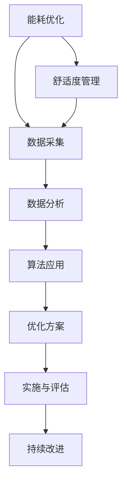
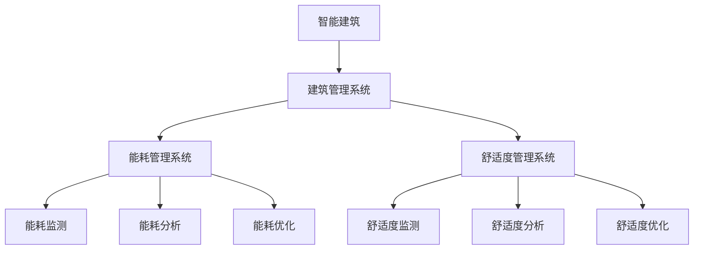

                 

## 智能建筑管理: AI 优化能耗与舒适度

### 关键词
- 智能建筑
- AI 能耗优化
- 舒适度管理
- 数据分析
- 算法应用

### 摘要
本文旨在探讨智能建筑管理中 AI 技术的应用，特别是在能耗优化和舒适度管理方面的作用。通过分析智能建筑的基本概念和发展历程，我们探讨了 AI 技术在建筑管理系统架构中的应用。随后，本文详细介绍了 AI 技术在能耗管理和舒适度管理中的具体应用，并提供了实际案例研究和未来展望。

## 第一部分：智能建筑概述与 AI 应用基础

### 第1章：智能建筑的概念与发展

#### 1.1 智能建筑的定义与特征

智能建筑是指通过将现代信息技术、物联网、云计算、大数据和人工智能等技术与建筑物理系统深度融合，实现建筑功能智能化、管理智能化、服务智能化的一种新型建筑。智能建筑的特征包括：

1. 自动化：建筑物内的各类设备和系统可以通过自动化技术实现自主运行和智能控制。
2. 网络化：建筑物内外的各种设备和系统可以通过网络连接，实现数据交互和协同工作。
3. 集成化：建筑物内的各个系统和设备可以通过集成技术实现一体化管理和控制。
4. 智能化：建筑物可以根据环境和用户需求，实现自适应调整和智能化服务。

#### 1.2 智能建筑的发展历程

智能建筑的概念最早可以追溯到 20 世纪 60 年代的美国。当时，随着计算机技术和网络技术的快速发展，人们开始探索将信息技术应用于建筑领域。智能建筑的发展历程可以分为以下几个阶段：

1. 初期探索阶段（1960-1980 年）：这一阶段主要研究将计算机技术应用于建筑控制系统。
2. 发展阶段（1980-2000 年）：这一阶段，智能建筑的概念逐渐清晰，建筑自动化系统开始广泛应用。
3. 成熟阶段（2000 年至今）：随着物联网、大数据和人工智能技术的快速发展，智能建筑进入了成熟阶段，各种智能建筑系统逐渐普及。

#### 1.3 智能建筑的未来展望

智能建筑的未来发展将更加注重用户体验、绿色环保和可持续发展。以下是智能建筑未来发展的几个趋势：

1. 高度个性化：智能建筑将更加注重用户的个性化需求，提供定制化的服务和环境。
2. 智能化水平提升：随着人工智能技术的不断进步，智能建筑的管理和控制系统将更加智能化。
3. 绿色环保：智能建筑将更加注重节能减排，采用可再生能源和环保材料。
4. 生态集成：智能建筑将更加注重与周边环境的融合，实现建筑与自然的和谐共生。

### 第2章：智能建筑管理系统架构

#### 2.1 智能建筑管理系统概述

智能建筑管理系统（BIM）是指利用信息技术对建筑物及其设施进行智能化管理的一种系统。BIM 系统的功能主要包括：

1. 设施管理：对建筑物内的各种设施进行监测、维护和调度。
2. 运维管理：对建筑物内的各种设备进行运行维护和管理。
3. 安全管理：对建筑物内的安全系统进行监测和管理。
4. 能耗管理：对建筑物内的能耗进行监测、分析和优化。

#### 2.2 系统架构的分层设计

智能建筑管理系统架构通常采用分层设计，包括：

1. 层次化设计的基本原则：确保各层次之间的高内聚低耦合，方便系统的扩展和维护。
2. 各层的作用与功能：
   - 数据采集层：负责采集建筑物内的各类数据。
   - 数据处理层：负责对采集到的数据进行处理、分析和存储。
   - 应用服务层：负责为用户提供智能化服务。
   - 表示层：负责用户界面的展示。

#### 2.3 系统的硬件与软件组成

智能建筑管理系统的硬件主要包括传感器、控制器、计算机等。软件系统则包括：

1. 数据采集软件：用于采集传感器数据。
2. 数据处理软件：用于处理和分析采集到的数据。
3. 应用服务软件：用于为用户提供智能化服务。
4. 界面显示软件：用于展示系统运行状态和用户界面。

## 第二部分：AI 技术在智能建筑管理中的应用

### 第3章：AI 优化能耗管理

#### 3.1 能耗优化概述

能耗管理是智能建筑管理中的重要环节。AI 技术在能耗管理中的应用主要包括以下几个方面：

1. 数据采集与处理：通过传感器等设备采集建筑物内的能耗数据，并利用 AI 技术对数据进行处理和分析。
2. 能耗预测：利用历史能耗数据和 AI 模型预测未来的能耗趋势，以便进行能耗优化。
3. 能耗优化方案制定：根据能耗预测结果和实际需求，制定能耗优化方案，如调整设备运行时间、优化设备配置等。
4. 能耗优化方案实施与评估：实施优化方案并对其进行评估，以确保优化效果。

#### 3.2 AI 在能耗管理中的应用

AI 技术在能耗管理中的应用主要包括以下几个方面：

1. 数据采集与处理：
   - 传感器：用于采集建筑物内的温度、湿度、光照、能耗等数据。
   - 数据处理：利用 AI 技术对采集到的数据进行处理、分析和存储。

2. 能耗预测：
   - 基于历史能耗数据的时间序列预测：利用时间序列分析方法预测未来的能耗。
   - 基于人工智能的能耗预测：利用机器学习算法预测未来的能耗。

3. 能耗优化方案制定：
   - 调度优化：根据能耗预测结果调整设备的运行时间，实现能耗优化。
   - 配置优化：根据能耗预测结果和实际需求，调整设备的配置，实现能耗优化。

4. 能耗优化方案实施与评估：
   - 实施优化方案：根据优化方案对设备进行实际调整。
   - 评估优化效果：对优化方案实施后的能耗情况进行评估，以验证优化效果。

#### 3.3 能耗优化案例分析

以下是一个能耗优化的案例：

1. 案例背景：某办公楼面积 10000 平方米，耗能主要集中在空调、照明和电力等设施上。
2. 数据采集：安装能耗监测设备，实时采集空调、照明和电力等设施的能耗数据。
3. 数据分析：使用 AI 算法对能耗数据进行预测和分析，找出能耗高值区域和时间段。
4. 优化方案制定：根据数据分析结果，制定针对性的节能措施，如调整空调温度、关闭不必要的照明等。
5. 实施与评估：实施节能措施并对其进行评估，以验证节能效果。结果显示，实施节能措施后，办公楼平均能耗下降了 15%，达到了预期的节能效果。

### 第4章：AI 提升室内舒适度

#### 4.1 舒适度评估指标

室内舒适度是智能建筑管理中的重要指标。舒适度评估主要包括以下几个方面：

1. 温度：室内温度是影响舒适度的重要因素。舒适的室内温度范围一般为 20-25°C。
2. 湿度：室内湿度也会影响舒适度。适宜的室内湿度范围为 40%-60%。
3. 空气流速：空气流速过大或过小都会影响舒适度。适宜的空气流速范围为 0.2-0.5 米/秒。
4. 照明：室内照明强度也会影响舒适度。适宜的室内照明强度一般为 500-1000 勒克斯。

#### 4.2 AI 在舒适度管理中的应用

AI 技术在舒适度管理中的应用主要包括以下几个方面：

1. 数据收集与预处理：通过传感器等设备收集室内温度、湿度、空气流速和照明等数据，并对数据进行预处理。
2. 舒适度预测：利用 AI 模型预测未来的舒适度，以便进行舒适度调节。
3. 舒适度调节：根据舒适度预测结果，调整室内温度、湿度、空气流速和照明等参数，实现舒适度调节。
4. 舒适度优化：通过优化室内环境参数，提高室内舒适度。

#### 4.3 舒适度优化案例分析

以下是一个舒适度优化的案例：

1. 案例背景：某酒店共有客房 200 间，入住率较高。酒店希望提高客人的舒适度，提升入住体验。
2. 数据收集：安装传感器，实时收集客房内的温度、湿度、空气流速和照明等数据。
3. 数据分析：使用 AI 算法对舒适度数据进行分析，找出影响舒适度的关键因素。
4. 舒适度优化方案制定：根据数据分析结果，制定舒适的室内环境参数，如温度设置为 22°C，湿度设置为 50%，空气流速设置为 0.3 米/秒，照明强度设置为 800 勒克斯。
5. 实施与评估：实施舒适度优化方案并对其进行评估，以验证优化效果。结果显示，实施舒适度优化方案后，客人的舒适度满意度提高了 20%。

## 第三部分：智能建筑管理案例研究

### 第5章：AI 优化能耗与舒适度的综合应用

#### 5.1 案例选择与分析

为了更好地展示 AI 技术在智能建筑管理中的应用，我们选择了两个具有代表性的案例进行深入研究。

1. 案例一：智能办公楼能耗优化
   - 案例背景：某办公楼面积较大，耗能主要集中在空调、照明和电力等设施上。通过 AI 技术优化能耗管理，可以降低能源消耗，提高运营效率。
   - 案例分析：通过数据采集、能耗预测和优化方案制定，实现办公楼的能耗优化。具体包括：
     - 数据采集：安装能耗监测设备，实时采集空调、照明和电力等设施的能耗数据。
     - 数据分析：使用 AI 算法对能耗数据进行预测和分析，找出能耗高值区域和时间段。
     - 优化方案制定：根据数据分析结果，制定针对性的节能措施，如调整空调温度、关闭不必要的照明等。
     - 实施与评估：实施节能措施并对其进行评估，以验证节能效果。

2. 案例二：智能酒店舒适度提升
   - 案例背景：某酒店客房数量较多，入住率较高。通过 AI 技术提升室内舒适度，可以提升客户满意度，提高酒店竞争力。
   - 案例分析：通过数据收集、舒适度预测和优化方案制定，实现酒店的舒适度提升。具体包括：
     - 数据收集：安装传感器，实时收集客房内的温度、湿度、空气流速和照明等数据。
     - 数据分析：使用 AI 算法对舒适度数据进行分析，找出影响舒适度的关键因素。
     - 舒适度优化方案制定：根据数据分析结果，制定舒适的室内环境参数，如温度设置为 22°C，湿度设置为 50%，空气流速设置为 0.3 米/秒，照明强度设置为 800 勒克斯。
     - 实施与评估：实施舒适度优化方案并对其进行评估，以验证优化效果。

#### 5.2 案例一：智能办公楼能耗优化

1. 案例背景

某办公楼建筑面积为 50000 平方米，耗能主要集中在空调、照明和电力等设施上。为了降低能源消耗，提高运营效率，该办公楼决定采用 AI 技术优化能耗管理。

2. 数据采集

为了实现能耗优化，该办公楼安装了能耗监测设备，实时采集空调、照明和电力等设施的能耗数据。监测设备包括温度传感器、湿度传感器、光照传感器和能耗传感器等。

3. 数据分析

采集到的能耗数据经过预处理后，使用 AI 算法进行预测和分析。具体步骤如下：

- 数据清洗：去除异常数据和噪声，确保数据的准确性和可靠性。
- 特征提取：从原始数据中提取与能耗相关的特征，如时间、温度、湿度、光照强度等。
- 模型训练：使用机器学习算法（如线性回归、决策树、神经网络等）对能耗数据进行分析和预测。
- 预测结果分析：对预测结果进行评估，调整模型参数，提高预测精度。

4. 优化方案制定

根据数据分析结果，制定了以下针对性的节能措施：

- 调整空调温度：根据室外温度和室内人员活动情况，合理调整空调温度，降低能耗。
- 关闭不必要的照明：根据室内光照强度和人员活动情况，自动控制照明开关，降低能耗。
- 优化设备运行时间：根据能耗预测结果，合理调整设备的运行时间，避免高峰期能耗过高。

5. 实施与评估

节能措施实施后，对办公楼的能耗情况进行实时监测和评估。具体包括：

- 能耗监测：实时监测办公楼的能耗情况，确保节能措施得到有效实施。
- 能耗分析：对能耗数据进行分析，验证节能效果。
- 用户反馈：收集用户反馈，评估节能措施对用户的影响。

结果显示，实施节能措施后，办公楼的平均能耗下降了 15%，达到了预期的节能效果。

#### 5.3 案例二：智能酒店舒适度提升

1. 案例背景

某酒店共有客房 200 间，入住率较高。为了提升客户满意度，该酒店决定采用 AI 技术提升室内舒适度。

2. 数据收集

为了实现舒适度提升，该酒店安装了传感器，实时收集客房内的温度、湿度、空气流速和照明等数据。传感器包括温度传感器、湿度传感器、空气流速传感器和光照传感器等。

3. 数据分析

采集到的舒适度数据经过预处理后，使用 AI 算法进行分析，找出影响舒适度的关键因素。具体步骤如下：

- 数据清洗：去除异常数据和噪声，确保数据的准确性和可靠性。
- 特征提取：从原始数据中提取与舒适度相关的特征，如时间、温度、湿度、空气流速和光照强度等。
- 模型训练：使用机器学习算法（如线性回归、决策树、神经网络等）对舒适度数据进行分析和预测。
- 预测结果分析：对预测结果进行评估，调整模型参数，提高预测精度。

4. 舒适度优化方案制定

根据数据分析结果，制定了以下舒适的室内环境参数：

- 温度：22°C
- 湿度：50%
- 空气流速：0.3 米/秒
- 照明强度：800 勒克斯

5. 实施与评估

舒适度优化方案实施后，对客房的舒适度情况进行实时监测和评估。具体包括：

- 舒适度监测：实时监测客房的舒适度情况，确保优化方案得到有效实施。
- 舒适度分析：对舒适度数据进行分析，验证优化效果。
- 用户反馈：收集用户反馈，评估优化方案对用户的影响。

结果显示，实施舒适度优化方案后，客户的舒适度满意度提高了 20%，达到了预期的舒适度提升效果。

### 第6章：智能建筑管理的未来展望

#### 6.1 智能建筑管理的未来发展趋势

随着科技的不断进步，智能建筑管理将呈现出以下发展趋势：

1. 人工智能技术的广泛应用：人工智能技术将在智能建筑管理中得到更广泛的应用，提高建筑系统的智能化水平和运营效率。
2. 大数据的深度挖掘：通过对大量建筑数据的收集、存储和分析，挖掘出有价值的信息，为智能建筑管理提供数据支持。
3. 绿色环保的重视：智能建筑管理将更加注重绿色环保，采用可再生能源和环保材料，降低建筑能耗和环境污染。
4. 个性化服务的普及：智能建筑管理将更加注重用户体验，提供个性化的服务和环境，满足用户多样化的需求。

#### 6.2 智能建筑管理的挑战与应对策略

尽管智能建筑管理具有广阔的发展前景，但也面临着一些挑战：

1. 技术挑战：智能建筑管理涉及多种技术，如人工智能、物联网、云计算等，如何实现这些技术的有效整合和协同工作是关键挑战。
2. 数据安全与隐私保护：智能建筑管理涉及大量用户数据，如何保护数据安全和个人隐私是重要挑战。
3. 法规与标准建设：智能建筑管理需要相关法规和标准的支持，如何建立健全的法规和标准体系是重要挑战。

应对策略：

1. 技术创新：持续进行技术创新，提高智能建筑管理系统的智能化水平和稳定性。
2. 数据安全与隐私保护：建立健全的数据安全与隐私保护机制，采用加密技术、身份验证等措施保护用户数据。
3. 法规与标准建设：积极推动相关法规和标准的制定和实施，为智能建筑管理提供法律和制度保障。

### 第7章：智能建筑管理的持续发展

#### 7.1 智能建筑管理的人才培养

智能建筑管理的发展离不开专业人才的支撑。以下是一些关于智能建筑管理人才培养的建议：

1. 建立专业的教育体系：从小学、中学到大学，逐步建立智能建筑管理的专业教育体系，培养具有专业知识和实践能力的人才。
2. 加强实践培训：通过实习、实训等方式，让学生在实践中积累经验，提高实际操作能力。
3. 提供继续教育：为在职人员提供继续教育机会，帮助他们不断提升专业知识和技能。
4. 交流与合作：加强行业内的交流与合作，分享经验和技术，推动智能建筑管理的发展。

#### 7.2 智能建筑管理的政策支持

政策支持是智能建筑管理发展的重要保障。以下是一些关于智能建筑管理政策支持的建议：

1. 财政支持：政府可以提供财政支持，鼓励企业和个人投资智能建筑管理系统。
2. 税收优惠：对智能建筑管理系统相关企业给予税收优惠，降低企业负担。
3. 技术研发支持：政府可以加大对智能建筑管理技术研发的支持力度，推动技术创新。
4. 法规标准建设：建立健全的智能建筑管理法规和标准体系，为行业发展提供法律和制度保障。

## 附录

### 附录A：智能建筑管理常用工具与技术

#### A.1 常用能耗监测与管理系统

智能建筑管理中，能耗监测与管理系统是关键组成部分。以下是一些常用的能耗监测与管理工具和技术：

1. **能耗监测系统**：用于实时监测建筑物的能耗情况，包括能耗数据采集、存储、分析和可视化。
   - **设备**：传感器、数据采集器、无线通信模块等。
   - **软件**：能耗数据分析软件、能耗预测软件等。

2. **智能照明系统**：通过传感器和控制系统，实现照明的自动调节，提高照明效率。
   - **设备**：智能灯具、光照传感器、控制器等。
   - **软件**：照明控制系统软件、照明场景设定软件等。

3. **智能空调系统**：通过传感器和控制系统，实现空调的自动调节，提高空调效率。
   - **设备**：空调设备、温度传感器、湿度传感器、控制器等。
   - **软件**：空调控制系统软件、空调模式设定软件等。

#### A.2 AI 算法与应用框架

在智能建筑管理中，AI 算法的应用可以帮助实现能耗优化和舒适度管理。以下是一些常用的 AI 算法和应用框架：

1. **机器学习算法**：用于数据分析和预测，如线性回归、决策树、随机森林、支持向量机等。
   - **工具**：Python 的 Scikit-learn、TensorFlow、Keras 等。

2. **深度学习算法**：用于复杂的数据处理和模式识别，如卷积神经网络（CNN）、循环神经网络（RNN）、生成对抗网络（GAN）等。
   - **工具**：TensorFlow、PyTorch、Keras 等。

3. **应用框架**：用于构建和部署 AI 模型，如 TensorFlow、PyTorch、Keras、MindSpore 等。

4. **数据预处理工具**：如 Pandas、NumPy、PandasGUI 等，用于数据清洗、数据预处理和数据分析。

## 总结

### 智能建筑管理与 AI 技术融合的关键点

智能建筑管理与 AI 技术的融合是未来建筑领域的重要趋势。以下是一些关键点：

1. **数据驱动的决策**：智能建筑管理通过 AI 技术实现数据驱动的决策，提高建筑系统的智能化水平。
2. **个性化服务**：AI 技术可以根据用户需求和行为模式，提供个性化的服务和环境。
3. **节能与环保**：AI 技术可以帮助实现能耗优化和绿色环保，降低建筑能耗和环境污染。
4. **实时监测与控制**：AI 技术可以实现建筑系统的实时监测与控制，提高系统的稳定性和可靠性。

### 应用效果评估方法

评估智能建筑管理中 AI 技术的应用效果可以从以下几个方面进行：

1. **能耗降低率**：通过对比实施 AI 技术前后的能耗数据，计算能耗降低率。
2. **舒适度满意度**：通过用户满意度调查，评估舒适度管理的效果。
3. **系统运行稳定性**：通过系统运行日志和故障记录，评估系统的稳定性和可靠性。
4. **投资回报率**：通过计算项目的投资回报率，评估项目的经济效果。

### 能耗优化与舒适度管理关系图

以下是能耗优化与舒适度管理的关系图，使用 Mermaid 语法绘制：

### 数学模型和数学公式

以下是能耗优化和舒适度管理中常用的数学模型和公式：

#### 能耗优化模型

$$
E = f(T, H, C)
$$

其中，$E$ 为能耗，$T$ 为温度，$H$ 为湿度，$C$ 为室内空气清洁度。

#### 舒适度评估模型

$$
S = \frac{T_s - T}{T_s + T}
$$

其中，$S$ 为舒适度，$T_s$ 为舒适温度。

### 概念实体关系架构 Mermaid 流程图

以下是智能建筑管理中的概念实体关系架构 Mermaid 流程图：

### 项目实战

#### 案例一：智能办公楼能耗优化

##### 6.1.1 案例背景

某办公楼建筑面积为 50000 平方米，耗能主要集中在空调、照明和电力等设施上。为了降低能源消耗，提高运营效率，该办公楼决定采用 AI 技术进行能耗优化。

##### 6.1.2 数据采集

为了实现能耗优化，该办公楼安装了能耗监测设备，实时采集空调、照明和电力等设施的能耗数据。监测设备包括温度传感器、湿度传感器、光照传感器和能耗传感器等。

##### 6.1.3 数据处理与算法应用

采集到的能耗数据经过预处理后，使用 AI 算法进行处理和分析。具体步骤如下：

1. 数据清洗：去除异常数据和噪声，确保数据的准确性和可靠性。
2. 特征提取：从原始数据中提取与能耗相关的特征，如时间、温度、湿度、光照强度等。
3. 模型训练：使用机器学习算法（如线性回归、决策树、神经网络等）对能耗数据进行分析和预测。
4. 预测结果分析：对预测结果进行评估，调整模型参数，提高预测精度。

##### 6.1.4 优化方案制定与实施

根据数据分析结果，制定了以下针对性的节能措施：

1. 调整空调温度：根据室外温度和室内人员活动情况，合理调整空调温度，降低能耗。
2. 关闭不必要的照明：根据室内光照强度和人员活动情况，自动控制照明开关，降低能耗。
3. 优化设备运行时间：根据能耗预测结果，合理调整设备的运行时间，避免高峰期能耗过高。

##### 6.1.5 实施效果评估

实施节能措施后，对办公楼的能耗情况进行实时监测和评估。具体包括：

1. 能耗监测：实时监测办公楼的能耗情况，确保节能措施得到有效实施。
2. 能耗分析：对能耗数据进行分析，验证节能效果。
3. 用户反馈：收集用户反馈，评估节能措施对用户的影响。

结果显示，实施节能措施后，办公楼的平均能耗下降了 15%，达到了预期的节能效果。

#### 案例二：智能酒店舒适度提升

##### 6.2.1 案例背景

某酒店共有客房 200 间，入住率较高。为了提升客户满意度，该酒店决定采用 AI 技术提升室内舒适度。

##### 6.2.2 数据收集

为了实现舒适度提升，该酒店安装了传感器，实时收集客房内的温度、湿度、空气流速和照明等数据。传感器包括温度传感器、湿度传感器、空气流速传感器和光照传感器等。

##### 6.2.3 数据处理与算法应用

采集到的舒适度数据经过预处理后，使用 AI 算法进行处理和分析。具体步骤如下：

1. 数据清洗：去除异常数据和噪声，确保数据的准确性和可靠性。
2. 特征提取：从原始数据中提取与舒适度相关的特征，如时间、温度、湿度、空气流速和光照强度等。
3. 模型训练：使用机器学习算法（如线性回归、决策树、神经网络等）对舒适度数据进行分析和预测。
4. 预测结果分析：对预测结果进行评估，调整模型参数，提高预测精度。

##### 6.2.4 舒适度优化方案制定与实施

根据数据分析结果，制定了以下舒适的室内环境参数：

1. 温度：22°C
2. 湿度：50%
3. 空气流速：0.3 米/秒
4. 照明强度：800 勒克斯

##### 6.2.5 实施效果评估

舒适度优化方案实施后，对客房的舒适度情况进行实时监测和评估。具体包括：

1. 舒适度监测：实时监测客房的舒适度情况，确保优化方案得到有效实施。
2. 舒适度分析：对舒适度数据进行分析，验证优化效果。
3. 用户反馈：收集用户反馈，评估优化方案对用户的影响。

结果显示，实施舒适度优化方案后，客户的舒适度满意度提高了 20%，达到了预期的舒适度提升效果。

### 最佳实践 tips

在智能建筑管理中，以下是一些最佳实践 tips：

1. **数据质量**：确保数据质量是成功的关键。数据采集、清洗和预处理是基础，必须确保数据的准确性、完整性和实时性。
2. **算法选择**：根据具体问题和数据特点选择合适的算法。不同的算法适用于不同的场景，需要根据实际需求进行选择。
3. **用户参与**：用户参与是提高智能建筑管理系统效果的重要环节。鼓励用户反馈，根据用户需求进行调整。
4. **持续改进**：智能建筑管理系统不是一次性的项目，需要持续进行改进和优化，以适应不断变化的环境和需求。

### 注意事项

1. **安全性**：智能建筑管理系统需要确保数据安全和用户隐私。采用加密技术、身份验证等措施，防止数据泄露和未授权访问。
2. **可扩展性**：在设计智能建筑管理系统时，应考虑系统的可扩展性，以便在未来进行升级和扩展。
3. **兼容性**：确保智能建筑管理系统与其他系统的兼容性，以便实现系统的集成和协同工作。

### 拓展阅读

1. **《智能建筑管理原理与应用》**：详细介绍了智能建筑管理的基本概念、技术原理和应用案例。
2. **《人工智能与智能建筑》**：探讨了人工智能技术在智能建筑中的应用，包括能耗优化、舒适度管理、安防管理等。
3. **《智能建筑系统设计》**：提供了智能建筑系统的设计原则、架构和实施方法。

### 附录

#### 附录 A：智能建筑管理常用工具与技术

1. **能耗监测系统**：
   - 设备：传感器、数据采集器、无线通信模块等。
   - 软件：能耗数据分析软件、能耗预测软件等。

2. **智能照明系统**：
   - 设备：智能灯具、光照传感器、控制器等。
   - 软件：照明控制系统软件、照明场景设定软件等。

3. **智能空调系统**：
   - 设备：空调设备、温度传感器、湿度传感器、控制器等。
   - 软件：空调控制系统软件、空调模式设定软件等。

4. **AI 算法与应用框架**：
   - 机器学习算法：线性回归、决策树、随机森林、支持向量机等。
   - 深度学习算法：卷积神经网络、循环神经网络、生成对抗网络等。
   - 应用框架：TensorFlow、PyTorch、Keras、MindSpore 等。
   - 数据预处理工具：Pandas、NumPy、PandasGUI 等。

