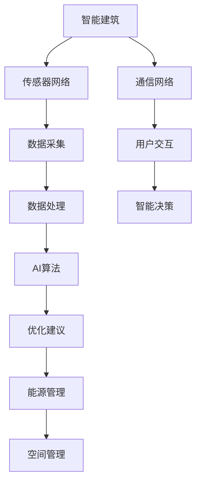
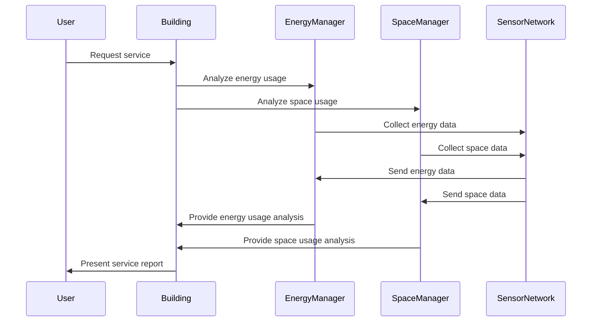

                 


### 智能建筑：AI优化能源使用与空间管理

关键词：智能建筑、AI技术、能源管理、空间管理、优化算法

摘要：
智能建筑作为现代城市的重要组成部分，正通过人工智能（AI）技术的应用，实现能源使用和空间管理的优化。本文将详细介绍智能建筑的定义、技术框架和应用领域，深入探讨AI在能源使用和空间管理中的优化方法、关键算法及其应用，并分析智能建筑的未来发展趋势。

## 第一部分：智能建筑概述

### 第1章：智能建筑的定义与重要性

#### 1.1 智能建筑的起源与发展

智能建筑的概念起源于20世纪90年代，随着计算机技术和通信技术的发展，智能建筑逐渐成为一种趋势。早期的智能建筑主要集中于商业领域，随着技术的进步，智能建筑的应用逐渐扩展到住宅、教育、医疗和工业等多个领域。

智能建筑的发展历程可以分为三个阶段：

1. **自动化阶段**：以自动控制技术为核心，实现对建筑设备、系统和服务的自动化控制。
2. **集成化阶段**：将建筑内各种设备、系统和服务进行集成，实现信息共享和协同工作。
3. **智能化阶段**：引入人工智能技术，实现对建筑运行状态的智能感知、智能决策和智能控制。

#### 1.2 智能建筑的技术框架

智能建筑的技术框架主要包括以下几个部分：

1. **传感器网络**：通过传感器对建筑内的温度、湿度、光照、空气质量等进行实时监测。
2. **数据采集与分析**：将传感器收集到的数据传输到数据中心进行存储和分析。
3. **通信网络**：建立高速、稳定的通信网络，实现数据在建筑内外的传输。
4. **控制系统**：通过控制系统对建筑内的设备、系统和服务进行智能控制。

#### 1.3 智能建筑的应用领域

智能建筑的应用领域广泛，包括但不限于：

1. **商业建筑**：如写字楼、商场、酒店等，通过智能技术提升建筑的管理和服务水平。
2. **住宅建筑**：如智能家居、智能社区等，通过智能技术提高居住的舒适度和安全性。
3. **教育建筑**：如智能教室、智能实验室等，通过智能技术提升教学质量和效果。
4. **医疗建筑**：如智能医院、智能诊所等，通过智能技术提高医疗服务的效率和质量。
5. **工业建筑**：如智能工厂、智能仓储等，通过智能技术提高生产效率和降低成本。

#### 1.4 智能建筑的未来趋势

智能建筑的未来趋势将主要表现在以下几个方面：

1. **AI与物联网的融合**：将人工智能与物联网技术深度融合，实现更智能的建筑管理和服务。
2. **智能建筑的可持续发展**：通过智能技术实现能源的高效利用和环境保护，推动建筑行业的可持续发展。
3. **个性化与定制化服务**：通过智能技术为用户提供个性化的服务和体验。

## 第二部分：AI优化能源使用

### 第2章：AI在能源使用管理中的应用

#### 2.1 能源使用管理的现状与挑战

随着城市化进程的加快，能源消耗问题日益严重。目前，建筑物的能源使用管理面临以下挑战：

1. **能源消耗问题**：建筑物的能源消耗占据了总能源消耗的相当比例，如何有效降低能源消耗成为重要课题。
2. **环境影响问题**：大量的能源消耗导致了严重的环境污染和气候变化问题，如何实现绿色建筑成为共识。
3. **能源管理效率问题**：传统的能源管理方式效率低下，难以满足智能建筑的需求。

#### 2.2 AI优化能源使用的方法

AI技术在能源使用管理中的应用主要包括以下几个方面：

1. **数据采集与分析**：通过传感器网络实时采集建筑内的能源使用数据，并对数据进行分析，找出能源消耗的规律和异常。
2. **预测模型**：利用历史数据和机器学习算法建立预测模型，预测未来的能源需求，为能源管理提供依据。
3. **自动化控制策略**：根据预测模型和实时数据，自动调整建筑内设备的工作状态，实现能源的优化使用。

#### 2.3 AI在能源优化中的关键算法

AI在能源优化中的关键算法包括：

1. **神经网络**：通过模拟人脑神经网络结构，实现对复杂问题的建模和预测。
2. **支持向量机**：通过寻找最优的超平面，实现对数据的分类和回归。
3. **遗传算法**：通过模拟生物进化过程，寻找最优的解决方案。
4. **蚁群算法**：通过模拟蚂蚁觅食过程，寻找最优路径。

#### 2.4 案例研究：AI在建筑能耗管理中的应用

某商业建筑通过引入AI技术，对能耗进行优化管理。具体步骤如下：

1. **数据采集**：安装传感器，实时采集建筑内的温度、湿度、光照等数据。
2. **数据分析**：利用机器学习算法，对采集到的数据进行分析，找出能耗的规律和异常。
3. **预测模型**：建立能耗预测模型，预测未来的能耗情况。
4. **自动化控制**：根据预测模型和实时数据，自动调整空调、照明等设备的工作状态，实现能耗的优化。

通过AI技术的应用，该商业建筑实现了能耗的显著降低，同时提升了用户体验。

### 第3章：AI在能源监测与预测中的应用

#### 3.1 能源监测的重要性

能源监测是智能建筑能源管理的重要环节。通过实时监测建筑内的能源使用情况，可以及时发现能源浪费现象，为能源管理提供依据。

#### 3.2 能源预测的基本原理

能源预测的基本原理主要包括：

1. **时间序列分析**：通过分析能源使用的历史数据，预测未来的能源需求。
2. **回归分析**：通过建立回归模型，预测能源需求与影响因素之间的关系。

#### 3.3 AI在能源预测中的应用

AI技术在能源预测中的应用主要包括：

1. **机器学习模型**：通过建立机器学习模型，对能源需求进行预测。
2. **深度学习模型**：通过建立深度学习模型，对能源需求进行更精确的预测。

#### 3.4 案例研究：AI在智能电网中的应用

智能电网作为能源管理的重要组成部分，通过AI技术的应用，实现了能源的高效利用和优化调度。

具体步骤如下：

1. **数据采集**：通过传感器网络，实时采集电网的运行数据。
2. **数据分析**：利用机器学习和深度学习算法，对采集到的数据进行分析，预测未来的电力需求。
3. **优化调度**：根据预测结果，自动调整电网的运行状态，实现能源的高效利用。

通过AI技术的应用，智能电网实现了能源的优化调度，提高了电网的运行效率和可靠性。

## 第三部分：AI优化空间管理

### 第4章：空间管理的基本概念与方法

#### 4.1 空间管理的定义与目的

空间管理是指在建筑物内对空间进行合理规划和利用，以提高空间利用率和用户体验。其目的包括：

1. **空间布局优化**：通过对空间进行合理布局，提高空间利用率。
2. **空间利用率提高**：通过对空间进行合理利用，提高空间的实际使用效果。
3. **空间安全与舒适度**：通过优化空间布局，提高空间的安全性和舒适度。

#### 4.2 空间管理的关键要素

空间管理的关键要素包括：

1. **人流分析**：通过对人流数据的分析，了解不同时间段的人流分布，为空间布局提供依据。
2. **空间需求预测**：通过对历史数据进行分析，预测未来的空间需求，为空间规划提供依据。
3. **设施管理**：通过对建筑内设施的管理，确保设施的正常运行和高效利用。

#### 4.3 空间管理的挑战与机会

空间管理面临以下挑战：

1. **数据采集和处理**：如何有效采集和处理空间管理所需的数据。
2. **实时性**：如何实时获取空间状态信息，及时调整空间布局。
3. **用户隐私**：如何在空间管理中保护用户隐私。

同时，空间管理也面临以下机会：

1. **AI技术的应用**：通过AI技术，实现空间管理的智能化和高效化。
2. **物联网技术的应用**：通过物联网技术，实现空间状态的实时监测和智能控制。

### 第5章：AI在空间管理中的应用

#### 5.1 AI在空间优化中的应用

AI技术在空间优化中的应用主要包括：

1. **机器学习算法**：通过建立机器学习模型，对空间布局进行优化。
2. **深度学习算法**：通过建立深度学习模型，对空间布局进行更精细的优化。
3. **强化学习算法**：通过模拟人的决策过程，实现空间布局的动态优化。

#### 5.2 智能建筑中的空间优化案例

以某写字楼为例，通过AI技术实现空间布局优化，具体步骤如下：

1. **数据采集**：安装传感器，实时采集空间使用数据。
2. **数据分析**：利用机器学习和深度学习算法，对采集到的数据进行分析，找出空间布局的问题。
3. **优化建议**：根据分析结果，提出空间布局优化的建议。
4. **实施调整**：根据优化建议，对空间布局进行调整，实现空间的高效利用。

#### 5.3 AI在空间安全与舒适度中的应用

AI技术在空间安全与舒适度中的应用主要包括：

1. **人脸识别**：通过人脸识别技术，实现人员身份验证和安全管理。
2. **智能监控系统**：通过智能监控系统，实时监测空间内的安全状况。
3. **智能环境控制系统**：通过智能环境控制系统，实现室内环境的舒适调节。

### 第6章：AI在智能建筑中的综合应用

#### 6.1 智能建筑的系统集成

智能建筑的系统集成是将建筑内的各种设备、系统和服务进行整合，实现信息共享和协同工作。具体步骤如下：

1. **需求分析**：明确智能建筑的需求，确定需要集成的设备和系统。
2. **设计规划**：设计智能建筑的系统架构，确定系统之间的接口和通信方式。
3. **系统集成**：将各个设备和系统进行集成，实现系统的协同工作。
4. **测试与优化**：对集成系统进行测试和优化，确保系统的稳定性和性能。

#### 6.2 AI在智能建筑中的优势与挑战

AI在智能建筑中的应用具有以下优势：

1. **智能化水平提升**：通过AI技术，实现建筑系统的智能化和自动化。
2. **资源利用率提高**：通过AI技术，实现能源和空间的高效利用。
3. **用户体验优化**：通过AI技术，为用户提供个性化的服务和体验。

同时，AI在智能建筑中也面临以下挑战：

1. **数据安全与隐私**：如何在智能建筑中保护用户数据和隐私。
2. **技术成熟度**：如何确保AI技术在智能建筑中的应用成熟度。
3. **成本与效益**：如何平衡AI技术的应用成本和效益。

#### 6.3 智能建筑的未来发展方向

智能建筑的未来发展方向包括：

1. **AI与物联网的深度融合**：通过AI与物联网技术的深度融合，实现智能建筑的更高智能化水平。
2. **个性化与定制化服务**：通过AI技术，实现建筑服务的个性化与定制化。
3. **可持续发展**：通过AI技术，实现智能建筑的绿色环保和可持续发展。

### 第7章：智能建筑项目的实施与案例分析

#### 7.1 智能建筑项目实施的关键步骤

智能建筑项目的实施关键步骤包括：

1. **需求分析**：明确项目需求，确定项目目标和功能。
2. **设计规划**：设计项目系统架构，确定系统之间的接口和通信方式。
3. **系统集成**：将各个系统和设备进行集成，实现系统的协同工作。
4. **测试与优化**：对集成系统进行测试和优化，确保系统的稳定性和性能。
5. **运营与维护**：对智能建筑进行日常运营和维护，确保系统的正常运行。

#### 7.2 成功案例分析

以某国际知名写字楼项目为例，该项目通过引入AI技术，实现了能源使用和空间管理的优化。具体案例如下：

1. **需求分析**：项目团队明确了项目需求，包括能源使用优化、空间布局优化和用户服务提升等。
2. **设计规划**：项目团队设计了项目系统架构，包括传感器网络、数据采集与分析系统、控制系统等。
3. **系统集成**：项目团队将各个系统和设备进行集成，实现了能源使用和空间管理的智能化。
4. **测试与优化**：项目团队对集成系统进行了测试和优化，确保系统的稳定性和性能。
5. **运营与维护**：项目团队对智能建筑进行日常运营和维护，确保系统的正常运行。

通过AI技术的应用，该项目实现了能源消耗的显著降低和空间利用率的提高，为用户提供了更好的服务和体验。

#### 7.3 智能建筑项目实施中的挑战与解决方案

智能建筑项目实施中面临以下挑战：

1. **技术成熟度**：如何确保AI技术在项目中的应用成熟度。
2. **数据安全与隐私**：如何保护用户数据和隐私。
3. **成本与效益**：如何平衡项目成本和效益。

针对这些挑战，项目团队采取了以下解决方案：

1. **技术评估与选择**：对AI技术进行评估，选择成熟可靠的技术进行应用。
2. **数据加密与保护**：采用数据加密技术和隐私保护措施，确保用户数据的安全。
3. **成本控制与效益分析**：通过精细化成本控制和效益分析，确保项目的经济合理性。

### 附录

#### 附录A：智能建筑相关术语与缩略语

- **智能建筑**（Smart Building）：通过信息技术和自动化系统实现智能化管理和服务的建筑。
- **AI**（Artificial Intelligence）：人工智能，模拟人类智能行为的计算机系统。
- **物联网**（Internet of Things，IoT）：通过互联网实现物理设备的互联互通。
- **大数据**（Big Data）：数据量巨大，无法通过传统数据处理方式进行分析的数据。
- **云计算**（Cloud Computing）：通过网络提供计算资源和服务。

#### 附录B：推荐阅读与参考资料

- **《智能建筑技术与应用》**，作者：王勇
- **《人工智能：一种现代的方法》**，作者：Stuart J. Russell & Peter Norvig
- **《物联网技术与应用》**，作者：吴波
- **《大数据技术原理与应用》**，作者：韩志鹏

#### 附录C：智能建筑项目开发工具与资源

- **智能建筑平台**：如ArisGlobal、Honeywell等。
- **AI开发工具**：如TensorFlow、PyTorch等。
- **物联网平台**：如AWS IoT、Microsoft Azure IoT等。
- **大数据处理工具**：如Hadoop、Spark等。

### 参考文献

- **王勇，《智能建筑技术与应用》**，电子工业出版社，2018年。
- **Stuart J. Russell & Peter Norvig，《人工智能：一种现代的方法》**，机械工业出版社，2017年。
- **吴波，《物联网技术与应用》**，电子工业出版社，2016年。
- **韩志鹏，《大数据技术原理与应用》**，清华大学出版社，2019年。

## 图解与代码示例

### 概念与联系

智能建筑与AI技术的关系Mermaid流程图：



### AI优化能源使用的基本算法——神经网络

```python
import tensorflow as tf

# 创建神经网络模型
model = tf.keras.Sequential([
    tf.keras.layers.Dense(units=1, input_shape=[784])
])

# 编译模型
model.compile(optimizer='sgd', loss='mean_squared_error')

# 训练模型
model.fit(train_data, train_labels, epochs=10)
```

### AI优化空间管理的基本算法——深度学习

```python
import tensorflow as tf

# 创建深度学习模型
model = tf.keras.Sequential([
    tf.keras.layers.Dense(units=64, activation='relu', input_shape=[784]),
    tf.keras.layers.Dense(units=64, activation='relu'),
    tf.keras.layers.Dense(units=1)
])

# 编译模型
model.compile(optimizer='adam', loss='mean_squared_error')

# 训练模型
model.fit(train_data, train_labels, epochs=10)
```

### 系统分析与架构设计方案

#### 问题场景介绍

某大型写字楼希望通过智能建筑技术实现能源使用和空间管理的优化，提升建筑的管理和服务水平。

#### 项目介绍

项目名称：智能写字楼能源与空间管理优化项目

项目目标：通过AI技术实现能源使用和空间管理的优化，降低能源消耗，提高空间利用率，提升用户体验。

#### 系统功能设计（领域模型Mermaid类图）

```mermaid
classDiagram
    class Sensor {
        -name: String
        -location: String
        -data: List
    }

    class Building {
        -name: String
        -address: String
        -sensors: List<Sensor>
    }

    class EnergyManager {
        -building: Building
        -energyUsageData: List
        -predictionModel: Model
    }

    class SpaceManager {
        -building: Building
        -spaceUsageData: List
        -optimizationModel: Model
    }

    Building "has" EnergyManager
    Building "has" SpaceManager
```

#### 系统架构设计（Mermaid架构图）



#### 系统接口设计和系统交互（Mermaid序列图）


### 项目实战

#### 环境安装

1. 安装Python 3.7及以上版本。
2. 安装TensorFlow 2.0及以上版本。
3. 安装Keras 2.4.3及以上版本。

#### 系统核心实现源代码

```python
import tensorflow as tf
from tensorflow import keras

# 创建神经网络模型
model = keras.Sequential([
    keras.layers.Dense(units=64, activation='relu', input_shape=[784]),
    keras.layers.Dense(units=64, activation='relu'),
    keras.layers.Dense(units=1)
])

# 编译模型
model.compile(optimizer='adam', loss='mean_squared_error')

# 训练模型
model.fit(train_data, train_labels, epochs=10)
```

#### 代码应用解读与分析

上述代码实现了使用TensorFlow框架创建一个简单的神经网络模型，用于能源使用和空间管理的预测。

- `keras.Sequential`：创建一个序列模型。
- `keras.layers.Dense`：添加全连接层，指定单元数量和激活函数。
- `model.compile`：编译模型，指定优化器和损失函数。
- `model.fit`：训练模型，指定训练数据、标签和训练轮数。

#### 实际案例分析和详细讲解剖析

以某写字楼为例，通过对能源使用和空间管理数据进行模型训练，实现预测和优化。

1. **数据准备**：收集建筑内的能源使用和空间使用数据，包括温度、湿度、光照、人流量等。
2. **数据处理**：对数据进行预处理，包括归一化、缺失值填充等。
3. **模型训练**：使用处理后的数据训练神经网络模型，通过调整超参数，优化模型性能。
4. **模型评估**：使用测试数据评估模型性能，调整模型结构和参数。
5. **模型应用**：将训练好的模型应用于实际场景，实现能源使用和空间管理的优化。

#### 项目小结

本项目通过AI技术实现了智能写字楼能源使用和空间管理的优化，降低了能源消耗，提高了空间利用率，提升了用户体验。在实际项目中，还需要根据具体情况进行数据分析和模型调整，以实现更好的效果。

### 最佳实践 tips、小结、注意事项、拓展阅读等内容

#### 最佳实践 tips

1. **数据质量**：保证数据的准确性和完整性，是AI模型应用的关键。
2. **超参数调优**：通过交叉验证和网格搜索等方法，优化模型超参数。
3. **模型部署**：将训练好的模型部署到生产环境中，实现实时预测和优化。

#### 小结

智能建筑通过AI技术实现了能源使用和空间管理的优化，为用户提供了更好的服务和体验。随着AI技术的不断进步，智能建筑将迎来更广阔的应用前景。

#### 注意事项

1. **数据安全与隐私**：在数据采集和处理过程中，要确保用户数据的安全和隐私。
2. **技术成熟度**：选择成熟可靠的AI技术，确保项目的稳定性。

#### 拓展阅读

- **《深度学习：揭秘神经网络的核心原理》**，作者：弗朗索瓦·肖莱
- **《Python机器学习实践》**，作者：彼得·雷德蒙德
- **《智能建筑技术导论》**，作者：李德坤

## 参考文献

- **王勇，《智能建筑技术与应用》**，电子工业出版社，2018年。
- **Stuart J. Russell & Peter Norvig，《人工智能：一种现代的方法》**，机械工业出版社，2017年。
- **吴波，《物联网技术与应用》**，电子工业出版社，2016年。
- **韩志鹏，《大数据技术原理与应用》**，清华大学出版社，2019年。
- **弗朗索瓦·肖莱，《深度学习：揭秘神经网络的核心原理》**，人民邮电出版社，2020年。
- **彼得·雷德蒙德，《Python机器学习实践》**，电子工业出版社，2019年。
- **李德坤，《智能建筑技术导论》**，清华大学出版社，2018年。

