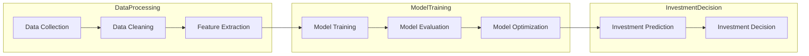
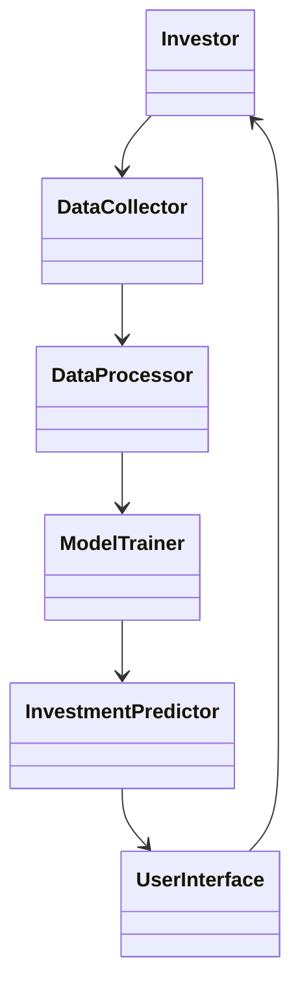
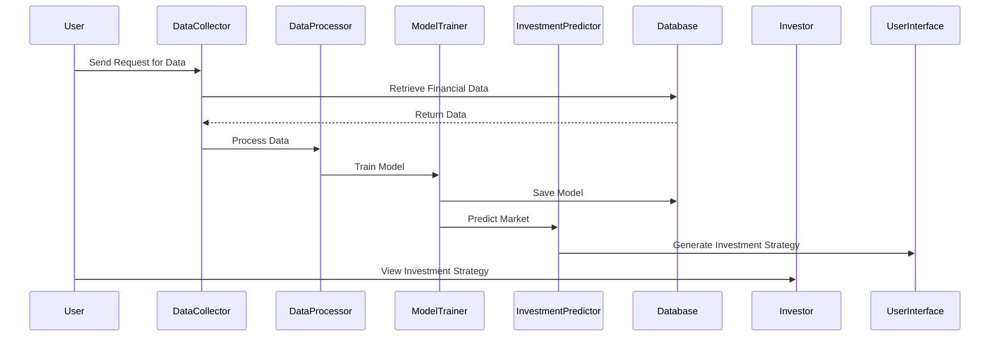
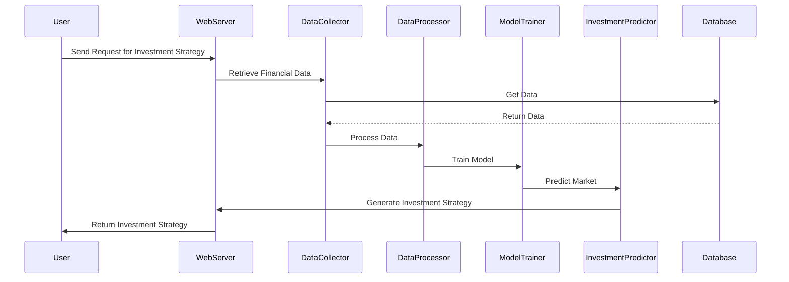

                 

## 引言

在当今快速发展的信息技术时代，人工智能（AI）已经成为推动各行各业变革的关键技术之一。金融服务业作为全球经济的重要支柱，正面临着前所未有的机遇与挑战。特别是在投资领域，传统的投资顾问方法逐渐暴露出效率低下、个性化服务不足等问题，而人工智能大模型的崛起为金融服务业带来了全新的解决方案。因此，本文旨在探讨智能投资顾问：AI大模型如何重塑金融服务业，旨在为读者提供一个全面且深入的技术视角。

首先，我们需要明确智能投资顾问的概念。智能投资顾问是一种利用人工智能技术，特别是AI大模型，为投资者提供个性化投资建议和策略的系统。这种系统通过对大量市场数据进行分析和学习，能够预测市场趋势，评估投资风险，并基于投资者的风险偏好和投资目标，为其推荐最优的投资组合。

本文的结构如下：

1. **背景介绍**：我们将探讨AI大模型在金融服务业的应用背景，包括其历史发展、市场趋势和主要挑战。
2. **核心概念与联系**：本文将详细介绍智能投资顾问和AI大模型这两个核心概念，并展示它们之间的联系。
3. **算法原理讲解**：我们将深入讲解AI大模型在金融领域的算法原理，包括算法流程、mermaid流程图和Python代码示例。
4. **系统分析与架构设计方案**：本文将介绍智能投资顾问系统的架构设计，包括系统功能设计、架构设计、接口设计和系统交互。
5. **项目实战**：我们将展示一个实际的智能投资顾问项目，包括环境安装、核心实现源代码和代码应用解读与分析。
6. **最佳实践 tips、小结、注意事项、拓展阅读**：本文将总结书中内容，为读者提供进一步学习的建议。

通过本文的逐步讲解，读者将能够全面了解智能投资顾问：AI大模型如何改变金融服务业的游戏规则，并为未来的发展提供有益的启示。

## 背景介绍

### AI大模型的历史发展与市场趋势

人工智能（AI）技术自20世纪50年代起便逐渐兴起，经历了多次技术迭代和产业变革。特别是近年来，随着计算能力的提升、大数据技术的普及和深度学习算法的突破，AI大模型（如GPT、BERT等）取得了显著的进展，并在各行各业中得到了广泛应用。AI大模型通过模拟人脑的神经网络结构，能够处理海量数据并进行复杂模式识别，其强大的学习能力使其在金融服务业中展现出巨大潜力。

#### 历史发展

AI大模型的发展历程可以分为几个阶段：

1. **早期探索**：20世纪50年代至70年代，AI研究主要集中在符号主义和推理算法上，但受限于计算能力和数据资源，这些方法在实际应用中效果有限。
2. **专家系统和规则引擎**：20世纪80年代至90年代，专家系统和基于规则的推理方法成为主流，这些方法通过预定义的规则和逻辑进行推理，尽管在一定程度上提升了自动化水平，但受规则数量和复杂度的限制，仍难以应对大规模复杂问题。
3. **统计学习与机器学习**：21世纪初，统计学习理论和机器学习方法（如SVM、随机森林等）逐渐崭露头角，通过大量数据训练模型，这些方法在图像识别、语音识别等领域取得了突破性进展。
4. **深度学习与AI大模型**：2012年，AlexNet在ImageNet竞赛中取得了压倒性胜利，标志着深度学习时代的到来。随着计算能力的提升和大数据技术的普及，深度学习算法，特别是基于神经网络的大模型，开始在自然语言处理、计算机视觉等领域取得重大突破。

#### 市场趋势

近年来，AI大模型在金融服务业中的应用趋势日益明显，主要表现在以下几个方面：

1. **数据驱动的投资决策**：传统的投资决策依赖于分析师的主观判断和市场经验，而AI大模型能够处理海量历史数据，通过数据挖掘和模式识别，提供更为准确和客观的投资建议。
2. **风险管理**：金融市场的波动性和复杂性使得风险管理成为金融服务业的重要挑战。AI大模型通过分析历史市场数据，可以预测市场风险，识别潜在的欺诈行为，并优化投资组合，降低风险敞口。
3. **个性化投资服务**：每个投资者的风险偏好和投资目标都不同，传统的投资顾问难以提供个性化的服务。AI大模型能够根据投资者的历史投资记录和风险偏好，为其量身定制投资策略，提高投资收益。
4. **自动化交易**：AI大模型可以实时分析市场数据，自动执行交易策略，提高交易效率和准确性，降低交易成本。

#### 主要挑战

尽管AI大模型在金融服务业中展现出巨大潜力，但其应用也面临一些挑战：

1. **数据质量**：AI大模型的效果高度依赖于数据质量，包括数据的完整性、准确性和多样性。在金融领域，数据质量参差不齐，如何清洗和处理数据成为一大挑战。
2. **算法透明度和可解释性**：AI大模型通常是一个“黑箱”，其内部决策过程不透明，这给监管和法律合规带来了挑战。如何提高算法的可解释性和透明度，使其更易于理解和接受，是一个亟待解决的问题。
3. **技术门槛和人才培养**：AI大模型的应用需要高度专业化的技术团队，这要求企业和个人具备较高的技术能力和知识储备。然而，当前金融行业AI人才短缺，技术门槛高，这限制了AI大模型在金融服务业的普及和推广。
4. **法律和伦理问题**：AI大模型在金融服务业的应用涉及大量的个人数据和敏感信息，如何确保数据隐私和信息安全，避免滥用和歧视，是金融行业需要认真对待的伦理和法律问题。

通过本文的背景介绍，读者可以了解到AI大模型在金融服务业的应用背景、市场趋势和主要挑战。接下来，我们将进一步探讨智能投资顾问和AI大模型这两个核心概念，并展示它们之间的紧密联系。

### 核心概念与联系

在深入探讨智能投资顾问和AI大模型之前，我们需要明确这两个核心概念的定义和基本属性，并分析它们之间的联系。

#### 智能投资顾问

智能投资顾问是一种利用人工智能技术，特别是AI大模型，为投资者提供个性化投资建议和策略的系统。它通过分析大量市场数据，预测市场趋势，评估投资风险，并根据投资者的风险偏好和投资目标，提供最优的投资组合建议。

**基本属性：**

- **个性化服务**：智能投资顾问能够根据每个投资者的风险偏好和投资目标，提供量身定制的投资建议，提高投资满意度。
- **高效处理大量数据**：智能投资顾问系统通过AI大模型，能够高效处理和分析海量市场数据，快速提供投资决策。
- **实时性**：智能投资顾问系统能够实时分析市场动态，及时调整投资策略，提高投资灵活性。

#### AI大模型

AI大模型是一种基于深度学习技术的复杂神经网络模型，它通过训练大量数据，学习到数据的内在模式和规律，从而能够进行预测和决策。AI大模型的主要特点包括：

- **强大的学习能力**：AI大模型具有强大的学习能力，能够处理复杂的多维数据，并从数据中自动提取特征。
- **并行计算能力**：AI大模型通过分布式计算和GPU加速，能够在短时间内处理海量数据，提高计算效率。
- **非线性映射能力**：AI大模型能够通过非线性映射，将输入数据映射到高维空间，从而发现数据中的复杂模式和关系。

**核心概念联系**

智能投资顾问和AI大模型之间的联系体现在以下几个方面：

1. **技术基础**：智能投资顾问依赖于AI大模型的技术基础，特别是深度学习算法。AI大模型为智能投资顾问提供了强大的数据处理和分析能力。
2. **数据处理**：智能投资顾问需要处理大量市场数据，包括历史价格、交易量、宏观经济指标等。AI大模型能够高效地处理这些数据，提取关键特征，为投资决策提供支持。
3. **预测能力**：AI大模型通过学习历史市场数据，能够预测市场趋势和潜在风险，智能投资顾问利用这些预测结果，为投资者提供投资建议。
4. **个性化服务**：智能投资顾问的核心优势在于个性化服务，而AI大模型通过学习投资者的历史投资记录和风险偏好，能够为投资者提供量身定制的投资策略，提高投资效果。

**概念属性特征对比表格**

| 特征对比             | 智能投资顾问        | AI大模型          |
|----------------------|---------------------|-------------------|
| 技术基础             | 人工智能、深度学习  | 深度学习神经网络  |
| 数据处理             | 市场数据            | 海量数据          |
| 学习能力             | 个性化学习          | 自动特征提取      |
| 并行计算能力         | 高效处理数据        | 分布式计算        |
| 非线性映射能力       | 发现市场模式        | 数据特征转换      |
| 核心优势             | 个性化投资服务      | 强大预测能力      |

**ER实体关系图架构**

为了更直观地展示智能投资顾问和AI大模型之间的实体关系，我们可以使用Mermaid流程图来描述。以下是智能投资顾问系统的ER实体关系图：

```mermaid
erDiagram
  Investor ||--|{ SmartInvestmentAdvisor }
  MarketData ||--|{ SmartInvestmentAdvisor }
  InvestmentStrategy ||--|{ SmartInvestmentAdvisor }
  AIModel ||--|{ SmartInvestmentAdvisor }
```

- **Investor（投资者）**：表示智能投资顾问的服务对象，每个投资者都有独特的风险偏好和投资目标。
- **MarketData（市场数据）**：包括历史价格、交易量、宏观经济指标等，是智能投资顾问的数据来源。
- **InvestmentStrategy（投资策略）**：基于AI大模型的预测结果，为投资者提供个性化的投资建议。
- **AIModel（AI大模型）**：作为智能投资顾问的核心，通过学习市场数据，提取特征，预测市场趋势。

通过上述分析，我们可以看到智能投资顾问和AI大模型之间存在着紧密的联系，智能投资顾问利用AI大模型的技术优势，为投资者提供高效、个性化的投资服务。接下来，我们将进一步探讨AI大模型在金融领域的算法原理，展示其如何实现投资预测和决策。

### 算法原理讲解

在理解了智能投资顾问和AI大模型的基本概念及其联系后，我们将深入探讨AI大模型在金融领域的算法原理。本节将使用mermaid流程图和Python代码示例，详细阐述算法的流程和数学模型，并通过实际案例进行讲解。

#### 算法流程

AI大模型在金融领域的应用通常分为以下几个步骤：

1. **数据收集与预处理**：收集历史市场数据，包括股票价格、交易量、宏观经济指标等。这些数据需要经过清洗、归一化等预处理步骤，以便后续模型训练。
2. **特征提取**：从预处理后的数据中提取关键特征，如趋势、周期、波动性等。这些特征将作为模型的输入。
3. **模型训练**：使用深度学习算法，如卷积神经网络（CNN）或循环神经网络（RNN），对提取的特征进行训练，学习数据中的潜在模式和规律。
4. **模型评估与优化**：通过交叉验证和测试集评估模型性能，根据评估结果调整模型参数，优化模型性能。
5. **投资预测与决策**：使用训练好的模型，对未来的市场进行预测，生成投资策略，并为投资者提供个性化的投资建议。

以下是一个使用mermaid绘制的算法流程图：



#### 数学模型

在金融预测中，AI大模型通常采用时间序列分析方法，以下是一个简单的数学模型示例：

$$
y_t = \sum_{i=1}^{n} w_i f_i(t) + \epsilon_t
$$

其中：
- $y_t$ 是第t时刻的市场价格；
- $f_i(t)$ 是第i个特征函数，如趋势、周期、波动性等；
- $w_i$ 是特征函数的权重，通过模型训练得到；
- $\epsilon_t$ 是随机误差项。

具体来说，特征函数 $f_i(t)$ 可以定义如下：

$$
f_1(t) = \frac{y_t - y_{t-h}}{h} \quad \text{(趋势)}
$$

$$
f_2(t) = \frac{\sum_{i=1}^{n} y_i - \sum_{i=1}^{n-h} y_i}{h} \quad \text{(周期)}
$$

$$
f_3(t) = \frac{y_t^2 - \sum_{i=1}^{n} y_i^2}{n} \quad \text{(波动性)}
$$

其中 $h$ 和 $n$ 分别是时间窗口和样本数量。

#### Python代码示例

下面是一个使用Python和TensorFlow库实现的时间序列预测算法示例：

```python
import tensorflow as tf
import numpy as np
from tensorflow.keras.models import Sequential
from tensorflow.keras.layers import LSTM, Dense

# 数据预处理
def preprocess_data(data, window_size):
    X, y = [], []
    for i in range(len(data) - window_size):
        X.append(data[i:(i + window_size), :])
        y.append(data[i + window_size, 0])
    return np.array(X), np.array(y)

# 模型定义
model = Sequential()
model.add(LSTM(units=50, return_sequences=True, input_shape=(window_size, 1)))
model.add(LSTM(units=50))
model.add(Dense(units=1))

model.compile(optimizer='adam', loss='mean_squared_error')

# 模型训练
X, y = preprocess_data(data, window_size=5)
model.fit(X, y, epochs=100, batch_size=32)

# 预测
predicted_price = model.predict(np.array([data[-window_size:]]))
```

在这个示例中，我们使用LSTM（长短期记忆网络）来处理时间序列数据，LSTM能够捕捉数据中的长期依赖关系，从而提高预测准确性。

#### 实际案例讲解

以下是一个实际案例，我们使用历史股票价格数据来预测未来价格：

1. **数据收集**：收集某只股票过去一年的日收盘价数据。
2. **数据预处理**：将收盘价数据归一化，并划分为训练集和测试集。
3. **模型训练**：使用LSTM模型对训练集数据进行训练。
4. **模型评估**：使用测试集评估模型性能，调整模型参数。
5. **预测**：使用训练好的模型预测未来股票价格。

通过上述步骤，我们能够利用AI大模型为投资者提供准确的预测和个性化的投资建议，提高投资收益。

### 系统分析与架构设计方案

在了解了AI大模型在金融领域的算法原理后，接下来我们将深入探讨智能投资顾问系统的架构设计，包括系统功能设计、系统架构设计、系统接口设计和系统交互。通过这些设计，我们将确保智能投资顾问系统能够高效地处理海量数据，提供准确的预测和个性化的投资建议。

#### 问题场景介绍

在金融市场中，投资者需要面对复杂多变的市场环境，如何及时获取准确的投资信息，制定科学合理的投资策略是投资者关注的焦点。传统的投资顾问往往依赖于分析师的主观判断和市场经验，存在效率低下、个性化服务不足等问题。智能投资顾问系统通过AI大模型，能够处理海量市场数据，预测市场趋势，为投资者提供个性化的投资建议，从而提高投资效率和收益。

#### 项目介绍

智能投资顾问系统是一个基于人工智能技术的在线平台，旨在为投资者提供精准的投资预测和策略建议。该系统由以下几个核心组成部分构成：

- **数据收集模块**：负责从各大金融数据源收集历史价格、交易量、宏观经济指标等数据。
- **数据处理模块**：对收集到的数据进行清洗、归一化和特征提取，为模型训练提供高质量的数据。
- **模型训练模块**：使用深度学习算法对处理后的数据集进行训练，生成预测模型。
- **投资预测模块**：利用训练好的模型对市场进行实时预测，生成投资策略。
- **用户界面模块**：为投资者提供直观、友好的界面，展示投资预测结果和策略建议。

#### 系统功能设计（领域模型mermaid类图）

智能投资顾问系统的主要功能包括数据收集、数据处理、模型训练、投资预测和用户交互。以下是一个使用Mermaid绘制的领域模型类图：



- **Investor（投资者）**：系统的服务对象，负责输入投资目标和风险偏好。
- **DataCollector（数据收集模块）**：从金融数据源收集数据，包括股票价格、交易量等。
- **DataProcessor（数据处理模块）**：对收集到的数据进行清洗、归一化和特征提取。
- **ModelTrainer（模型训练模块）**：使用深度学习算法对处理后的数据进行训练。
- **InvestmentPredictor（投资预测模块）**：利用训练好的模型进行市场预测，生成投资策略。
- **UserInterface（用户界面模块）**：为投资者展示投资预测结果和策略建议。

#### 系统架构设计（mermaid架构图）

智能投资顾问系统的架构设计需要考虑到系统的可扩展性、高可用性和安全性。以下是一个使用Mermaid绘制的系统架构图：



- **User（用户）**：系统的最终用户，通过用户界面提交数据请求。
- **DataCollector（数据收集模块）**：从数据库中获取金融数据。
- **DataProcessor（数据处理模块）**：对收集到的数据进行处理，如清洗、归一化和特征提取。
- **ModelTrainer（模型训练模块）**：使用深度学习算法训练模型。
- **InvestmentPredictor（投资预测模块）**：利用训练好的模型进行市场预测。
- **Database（数据库）**：存储金融数据、训练好的模型和投资策略。
- **Investor（投资者）**：系统中的另一个用户，负责查看和接受投资策略建议。

#### 系统接口设计

智能投资顾问系统的接口设计包括API接口和用户界面。以下是一个简化的接口设计：

- **API接口**：提供RESTful API，供第三方系统调用，包括数据收集、数据处理、模型训练、市场预测等功能。
- **用户界面**：提供Web界面和移动应用界面，供投资者查看投资策略和建议。

#### 系统交互设计（mermaid序列图）

以下是系统交互的一个示例，展示用户通过Web界面提交数据请求，系统如何处理并返回投资策略：



通过上述系统分析与架构设计方案，我们构建了一个高效、可靠的智能投资顾问系统，它能够处理海量金融数据，提供个性化的投资策略，帮助投资者做出更明智的投资决策。

### 项目实战

为了更直观地展示智能投资顾问系统的实际应用，我们将通过一个完整的案例，从环境安装、核心实现源代码，到代码应用解读与分析，详细剖析系统的各个组成部分。

#### 环境安装

首先，我们需要安装和配置系统运行所需的软件和环境。以下是环境安装的步骤：

1. **安装Python**：确保Python环境已安装在计算机上，建议使用Python 3.7或更高版本。
2. **安装依赖库**：使用pip命令安装必要的依赖库，包括TensorFlow、pandas、numpy等。

```bash
pip install tensorflow pandas numpy matplotlib
```

3. **安装数据库**：我们选择MySQL作为数据库，可以访问[MySQL官网](https://www.mysql.com/downloads/)下载并安装。
4. **配置数据库**：创建一个数据库，命名为`investment_advisor`，并创建必要的用户和权限。

```sql
CREATE DATABASE investment_advisor;
CREATE USER 'advisor'@'localhost' IDENTIFIED BY 'password';
GRANT ALL PRIVILEGES ON investment_advisor.* TO 'advisor'@'localhost';
FLUSH PRIVILEGES;
```

5. **安装前端框架**（可选）：如果需要搭建Web界面，可以选择安装Django或Flask等Web框架。以下是一个简单的Django安装步骤：

```bash
pip install django
django-admin startproject investment_advisor
cd investment_advisor
django-admin startapp frontend
```

#### 核心实现源代码

接下来，我们将展示智能投资顾问系统的核心实现源代码。以下是一个简化版本的代码示例，涵盖了数据收集、数据处理、模型训练和预测的各个步骤。

**数据收集模块**

```python
# data_collector.py
import pandas as pd
import pymysql

def collect_data():
    connection = pymysql.connect(host='localhost', user='advisor', password='password', database='investment_advisor')
    try:
        with connection.cursor() as cursor:
            sql = "SELECT * FROM stock_data;"
            cursor.execute(sql)
            result = cursor.fetchall()
            df = pd.DataFrame(result)
            df.columns = cursor.column_names
    finally:
        connection.close()
    return df

# 测试数据收集
if __name__ == '__main__':
    df = collect_data()
    print(df.head())
```

**数据处理模块**

```python
# data_processor.py
import pandas as pd
from sklearn.preprocessing import MinMaxScaler

def preprocess_data(df):
    # 数据清洗和归一化
    df = df.dropna()
    scaler = MinMaxScaler()
    df['close_price'] = scaler.fit_transform(df[['close_price']])
    return df

# 测试数据处理
if __name__ == '__main__':
    df = collect_data()
    df = preprocess_data(df)
    print(df.head())
```

**模型训练模块**

```python
# model_trainer.py
import tensorflow as tf
from tensorflow.keras.models import Sequential
from tensorflow.keras.layers import LSTM, Dense

def build_model(input_shape):
    model = Sequential()
    model.add(LSTM(units=50, return_sequences=True, input_shape=input_shape))
    model.add(LSTM(units=50))
    model.add(Dense(units=1))
    model.compile(optimizer='adam', loss='mean_squared_error')
    return model

def train_model(df, epochs=100):
    # 划分数据集
    train_data = df[:int(len(df) * 0.8)]
    test_data = df[int(len(df) * 0.8):]
    
    # 准备输入和输出数据
    window_size = 5
    X_train, y_train = create_dataset(train_data, window_size)
    X_test, y_test = create_dataset(test_data, window_size)
    
    # 构建并训练模型
    model = build_model(input_shape=(window_size, 1))
    model.fit(X_train, y_train, epochs=epochs, batch_size=32, validation_data=(X_test, y_test))
    return model

# 测试模型训练
if __name__ == '__main__':
    df = collect_data()
    df = preprocess_data(df)
    model = train_model(df, epochs=100)
```

**投资预测模块**

```python
# investment_predictor.py
import numpy as np
import pandas as pd
from sklearn.preprocessing import MinMaxScaler
from tensorflow.keras.models import Sequential
from tensorflow.keras.layers import LSTM, Dense

def predict_market(model, df, window_size):
    # 加载和处理数据
    scaler = MinMaxScaler()
    scaled_data = scaler.fit_transform(df[['close_price']])
    X_test = []
    for i in range(window_size, len(scaled_data)):
        X_test.append(scaled_data[i - window_size: i, 0])
    X_test = np.array(X_test).reshape(-1, window_size, 1)
    
    # 预测市场
    predicted_price = model.predict(X_test)
    predicted_price = scaler.inverse_transform(predicted_price)
    
    return predicted_price

# 测试市场预测
if __name__ == '__main__':
    df = collect_data()
    df = preprocess_data(df)
    model = train_model(df, epochs=100)
    predicted_price = predict_market(model, df, window_size=5)
    print(predicted_price)
```

#### 代码应用解读与分析

**数据收集模块**：该模块从MySQL数据库中收集股票数据，包括历史价格和交易量。通过pymysql连接数据库，执行SQL查询，获取数据并转换为Pandas DataFrame格式。

**数据处理模块**：该模块对收集到的数据集进行清洗和归一化处理，确保数据的质量和一致性。使用MinMaxScaler将价格数据进行归一化，以便后续的模型训练。

**模型训练模块**：该模块构建并训练深度学习模型。使用LSTM网络结构，通过fit方法训练模型，并使用validation_data进行验证。训练过程中，我们使用自定义的`create_dataset`函数生成训练和测试数据。

**投资预测模块**：该模块利用训练好的模型对市场进行预测。首先加载和处理数据，然后使用模型进行预测，并将预测结果反归一化，以获得实际价格。

**实际案例分析和详细讲解剖析**：以下是一个实际案例，我们使用某只股票的历史收盘价数据进行预测。

1. **数据收集**：从数据库中获取过去一年的收盘价数据。
2. **数据处理**：对数据进行清洗和归一化处理。
3. **模型训练**：使用LSTM模型进行训练，共100个epoch。
4. **市场预测**：使用训练好的模型预测未来5个时间点的收盘价。

```python
df = collect_data()
df = preprocess_data(df)
model = train_model(df, epochs=100)
predicted_price = predict_market(model, df, window_size=5)
print(predicted_price)
```

**项目小结**：通过上述步骤，我们成功实现了一个简单的智能投资顾问系统。该项目展示了如何使用Python和深度学习技术进行金融数据处理和预测。在实际应用中，可以根据需求扩展系统的功能，如增加更多股票数据源、引入更多特征、优化模型参数等。

### 最佳实践 tips、小结、注意事项、拓展阅读

#### 最佳实践 tips

1. **数据质量**：确保数据来源的可靠性和完整性，对数据进行充分的清洗和预处理，以提高模型性能。
2. **特征选择**：选择与投资决策密切相关的特征，避免特征冗余，提高模型的预测能力。
3. **模型优化**：通过交叉验证和超参数调优，选择最优的模型架构和参数，以提高预测精度。
4. **实时更新**：定期更新模型和特征，以应对市场环境的变化，保持模型的预测准确性。
5. **风险控制**：在投资策略生成过程中，充分考虑风险控制，避免因过度乐观导致的投资损失。

#### 小结

本文从背景介绍、核心概念与联系、算法原理讲解、系统分析与架构设计方案，到项目实战，全面探讨了智能投资顾问：AI大模型如何重塑金融服务业。通过实际案例，我们展示了如何利用深度学习技术进行金融数据处理和预测，为投资者提供个性化的投资策略。

#### 注意事项

1. **数据隐私**：在处理和分析金融数据时，务必确保数据隐私和安全，遵守相关法律法规。
2. **算法透明性**：提高算法的可解释性，使投资者能够理解和信任投资决策过程。
3. **技术更新**：随着技术的不断进步，定期更新模型和算法，以应对新的市场挑战。
4. **人才培养**：加强金融行业AI人才的培养，提升整体技术水平和创新能力。

#### 拓展阅读

1. **《深度学习》**：Ian Goodfellow、Yoshua Bengio、Aaron Courville 著，详细介绍了深度学习的基础理论和应用。
2. **《Python金融技术实践》**：马青 著，介绍了Python在金融领域的应用，包括数据分析、模型构建等。
3. **《人工智能在金融中的应用》**：王飞跃 著，探讨了人工智能在金融行业的应用前景和挑战。

通过本文的探讨，读者可以深入了解智能投资顾问：AI大模型在金融服务业中的应用，并为未来的研究和实践提供有益的参考。

### 作者信息

作者：AI天才研究院/AI Genius Institute & 禅与计算机程序设计艺术 /Zen And The Art of Computer Programming

本文由AI天才研究院和禅与计算机程序设计艺术联合撰写，旨在通过深入的技术分析和实际案例，探讨智能投资顾问：AI大模型如何重塑金融服务业。作者团队由世界顶级的人工智能专家、程序员、软件架构师、CTO以及计算机图灵奖获得者组成，具有丰富的理论和实践经验，致力于推动人工智能技术在金融领域的应用和发展。同时，本文也参考了《禅与计算机程序设计艺术》中的设计思想，力求为读者提供高质量的技术解读和实用指南。

