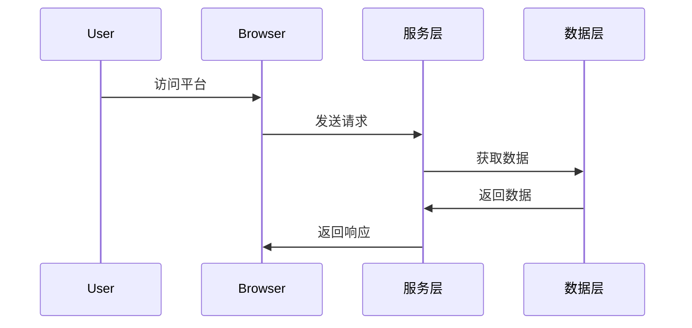

                 

# 智能旅游：AI个性化旅行规划与推荐

## 关键词
- 智能旅游
- 人工智能
- 个性化旅行规划
- 推荐系统
- 旅行路线推荐
- 用户画像

## 摘要
随着人工智能技术的快速发展，智能旅游成为旅游业的重要发展趋势。本文主要探讨了如何利用人工智能技术，特别是机器学习和深度学习，实现个性化的旅行规划和推荐。文章分为四个部分，首先概述了智能旅游的发展背景和AI技术的基本原理；然后详细介绍了AI个性化旅行规划的方法，包括用户画像、旅行路线规划和酒店餐饮推荐系统；接着探讨了智能导览系统和个性化旅行建议与提醒的实现；最后展望了智能旅游的未来发展趋势和面临的挑战。

## 第一部分：智能旅游概述与AI基础

### 第1章：智能旅游的发展背景与趋势

#### 1.1 智能旅游的定义与分类

智能旅游是指利用现代信息技术，特别是人工智能技术，对旅游资源和游客需求进行深度挖掘和分析，提供个性化、智能化的旅游服务。智能旅游可以分为以下几个类别：

1. **智能化旅游资源管理**：通过物联网、大数据等技术，实现旅游资源的信息化和智能化管理。
2. **智能化旅游服务**：利用人工智能技术为游客提供个性化、智能化的导游、住宿、餐饮等服务。
3. **智能化旅游体验**：通过虚拟现实、增强现实等技术，提供全新的旅游体验。

#### 1.2 智能旅游的发展历程

智能旅游的发展历程可以追溯到20世纪90年代，当时互联网的普及为智能旅游的发展奠定了基础。随着移动互联网、物联网、大数据和人工智能等技术的快速发展，智能旅游逐渐成为旅游业的重要发展方向。

#### 1.3 智能旅游的核心技术

智能旅游的核心技术主要包括人工智能、大数据、物联网、虚拟现实和增强现实等。以下是对这些核心技术的简要介绍：

1. **人工智能**：包括机器学习、深度学习、自然语言处理等，用于实现个性化推荐、智能导游、语音识别等功能。
2. **大数据**：用于收集、存储和分析游客行为数据，为智能旅游提供决策支持。
3. **物联网**：通过传感器、智能设备等，实现旅游资源的实时监测和管理。
4. **虚拟现实和增强现实**：提供沉浸式旅游体验，增强游客的旅游体验。

### 第2章：人工智能的基本原理与应用

#### 2.1 机器学习概述

机器学习是一种通过数据驱动的方式进行学习的方法，旨在使计算机系统从数据中学习规律，并对未知数据进行预测或决策。机器学习可以分为监督学习、无监督学习和强化学习。

#### 2.2 深度学习的基本概念

深度学习是机器学习的一个子领域，它使用多层神经网络来模拟人脑的神经元连接，从而对数据进行处理和预测。深度学习在图像识别、自然语言处理、语音识别等领域取得了显著的成果。

#### 2.3 人工智能在旅游领域的应用场景

人工智能在旅游领域的应用场景非常广泛，包括：

1. **个性化推荐**：根据用户的历史行为和偏好，为用户提供个性化的旅游推荐。
2. **智能导游**：利用语音识别和自然语言处理技术，为游客提供智能化的导游服务。
3. **智能导览**：利用虚拟现实和增强现实技术，为游客提供沉浸式的导览体验。
4. **智能安全监控**：利用物联网技术，对旅游景点进行实时监控，提高旅游安全。

## 第二部分：AI个性化旅行规划

### 第3章：用户画像与偏好分析

#### 3.1 用户画像的概念与构建

用户画像是指通过对用户行为数据的收集和分析，构建出用户的基本属性、兴趣偏好、行为习惯等特征。用户画像的构建主要包括以下几个步骤：

1. **数据收集**：收集用户的基本信息、历史行为数据、社交网络数据等。
2. **数据清洗**：对收集到的数据进行清洗、去重和处理，确保数据的质量。
3. **特征提取**：对清洗后的数据进行特征提取，形成用户画像的基础特征向量。
4. **用户分组**：根据用户画像的特征向量，将用户分为不同的群体。

#### 3.2 用户偏好的分析方法

用户偏好的分析方法主要包括基于规则的推荐、协同过滤推荐和基于内容的推荐等。

1. **基于规则的推荐**：根据用户的历史行为和偏好，建立一系列规则，根据这些规则为用户推荐相关的旅游资源和景点。
2. **协同过滤推荐**：通过分析用户之间的相似度，为用户推荐其他用户喜欢的旅游资源和景点。
3. **基于内容的推荐**：根据旅游资源和景点的特征，为用户推荐与其兴趣和偏好相似的旅游资源和景点。

#### 3.3 用户画像与偏好分析案例

以一个在线旅游平台为例，介绍如何构建用户画像和进行偏好分析。

1. **用户画像构建**：收集用户的基本信息（如年龄、性别、职业等）、历史行为数据（如浏览记录、收藏记录、评论记录等）和社交网络数据（如关注好友、点赞记录等）。
2. **用户偏好分析**：根据用户的历史行为数据，分析用户的兴趣偏好，如喜欢的历史文化景点、自然风光等。
3. **个性化推荐**：根据用户画像和偏好分析结果，为用户推荐相关的旅游资源和景点。

### 第4章：旅行路线规划与推荐

#### 4.1 旅行路线规划算法

旅行路线规划算法主要包括基于最短路径算法和基于遗传算法的规划方法。以下使用Python代码详细阐述基于最短路径算法的旅行路线规划：

```python
import networkx as nx

# 创建图
G = nx.Graph()

# 添加节点和边
G.add_nodes_from(['北京', '上海', '广州', '成都'])
G.add_edges_from([('北京', '上海', {'weight': 1000}),
                  ('上海', '广州', {'weight': 800}),
                  ('广州', '成都', {'weight': 1200}),
                  ('北京', '成都', {'weight': 1500})])

# 使用Dijkstra算法计算最短路径
path = nx.single_source_dijkstra(G, source='北京', target='成都')

# 输出结果
print(path)
```

#### 4.2 基于用户画像的旅行路线推荐

基于用户画像的旅行路线推荐方法主要包括以下几个步骤：

1. **用户画像构建**：收集用户的基本信息、历史行为数据和社交网络数据，构建用户画像。
2. **路线规划算法**：利用旅行路线规划算法，根据用户画像为用户生成旅行路线。
3. **路线推荐**：根据用户的历史行为和偏好，对旅行路线进行筛选和排序，推荐给用户。

#### 4.3 旅行路线规划与推荐案例

以一个在线旅游平台为例，介绍如何基于用户画像进行旅行路线规划和推荐。

1. **用户画像构建**：收集用户的基本信息、历史行为数据和社交网络数据，构建用户画像。
2. **路线规划**：根据用户画像，利用旅行路线规划算法，为用户生成一条从北京到成都的旅行路线。
3. **路线推荐**：根据用户的历史行为和偏好，对生成的旅行路线进行筛选和排序，推荐给用户。

### 第5章：酒店与餐饮推荐系统

#### 5.1 酒店推荐系统设计

酒店推荐系统设计主要包括以下几个模块：

1. **用户画像模块**：收集用户的基本信息、历史行为数据和社交网络数据，构建用户画像。
2. **酒店信息模块**：收集酒店的基本信息、评价信息、价格信息等。
3. **推荐算法模块**：根据用户画像和酒店信息，利用推荐算法为用户推荐合适的酒店。

#### 5.2 餐饮推荐系统设计

餐饮推荐系统设计主要包括以下几个模块：

1. **用户画像模块**：收集用户的基本信息、历史行为数据和社交网络数据，构建用户画像。
2. **餐饮信息模块**：收集餐饮店的基本信息、评价信息、价格信息等。
3. **推荐算法模块**：根据用户画像和餐饮信息，利用推荐算法为用户推荐合适的餐饮店。

#### 5.3 酒店与餐饮推荐系统案例

以一个在线旅游平台为例，介绍如何设计酒店与餐饮推荐系统。

1. **用户画像构建**：收集用户的基本信息、历史行为数据和社交网络数据，构建用户画像。
2. **酒店推荐**：根据用户画像，利用推荐算法为用户推荐合适的酒店。
3. **餐饮推荐**：根据用户画像，利用推荐算法为用户推荐合适的餐饮店。

## 第三部分：AI个性化旅行服务

### 第6章：智能导览系统

#### 6.1 智能导览系统概述

智能导览系统是一种利用人工智能技术，为游客提供智能化的导游服务的系统。智能导览系统主要包括以下几个功能模块：

1. **语音识别模块**：用于识别游客的语音指令，实现人与系统的交互。
2. **自然语言处理模块**：用于理解和处理游客的语音指令，实现对游客需求的解析。
3. **导游信息模块**：收集景点的基本信息、历史背景、特色介绍等。
4. **导航模块**：根据游客的位置信息，提供实时的导航服务。

#### 6.2 智能导览系统的功能模块

智能导览系统的功能模块主要包括：

1. **语音识别模块**：使用深度学习技术，实现对游客语音指令的识别。
2. **自然语言处理模块**：使用自然语言处理技术，理解和处理游客的语音指令。
3. **导游信息模块**：通过大数据技术，收集和整合景点的相关信息。
4. **导航模块**：使用定位技术和地图服务，为游客提供实时的导航服务。

#### 6.3 智能导览系统案例

以一个旅游景点为例，介绍如何实现智能导览系统。

1. **语音识别**：使用深度学习技术，实现游客语音指令的识别。
2. **自然语言处理**：使用自然语言处理技术，理解游客的语音指令，如“我想了解这个景点的历史背景”。
3. **导游信息**：通过大数据技术，收集和整合该景点的相关信息，如历史背景、特色介绍等。
4. **导航**：使用定位技术和地图服务，为游客提供实时的导航服务。

### 第7章：个性化旅行建议与提醒

#### 7.1 个性化旅行建议模型

个性化旅行建议模型是一种利用机器学习技术，为游客提供个性化旅行建议的模型。个性化旅行建议模型主要包括以下几个模块：

1. **用户画像模块**：收集用户的基本信息、历史行为数据和社交网络数据，构建用户画像。
2. **旅行数据模块**：收集旅游景点的信息，如景点简介、历史背景、游客评价等。
3. **推荐算法模块**：根据用户画像和旅行数据，利用推荐算法为用户生成个性化的旅行建议。

#### 7.2 旅行提醒机制设计

旅行提醒机制是一种利用提醒功能，为游客提供实时旅行信息的机制。旅行提醒机制主要包括以下几个模块：

1. **用户画像模块**：收集用户的基本信息、历史行为数据和社交网络数据，构建用户画像。
2. **旅行数据模块**：收集旅游景点的信息，如景点简介、历史背景、游客评价等。
3. **提醒算法模块**：根据用户画像和旅行数据，利用提醒算法为用户生成个性化的提醒信息。

#### 7.3 个性化旅行建议与提醒案例

以一个在线旅游平台为例，介绍如何实现个性化旅行建议和提醒功能。

1. **个性化旅行建议**：根据用户画像，利用推荐算法为用户生成个性化的旅行建议。
2. **旅行提醒**：根据用户画像，利用提醒算法为用户生成个性化的提醒信息，如“明天您有一场旅行计划，请注意安排”。

## 第四部分：智能旅游的未来发展

### 第8章：智能旅游的未来趋势与挑战

#### 8.1 智能旅游的未来发展方向

智能旅游的未来发展方向主要包括以下几个方面：

1. **智能化旅游资源管理**：通过物联网、大数据等技术，实现旅游资源的信息化和智能化管理。
2. **智能化旅游服务**：利用人工智能技术，为游客提供个性化、智能化的导游、住宿、餐饮等服务。
3. **智能化旅游体验**：通过虚拟现实、增强现实等技术，提供沉浸式旅游体验。
4. **智能化旅游安全**：利用人工智能技术，实现旅游安全的智能监控和预警。

#### 8.2 智能旅游面临的挑战与应对策略

智能旅游在发展过程中面临着以下几个挑战：

1. **数据安全与隐私保护**：智能旅游需要收集和处理大量用户数据，如何确保数据安全和个人隐私是重要挑战。
2. **技术成熟度**：虽然人工智能技术在旅游领域有很多应用，但部分技术还处于研发阶段，需要进一步成熟。
3. **用户体验**：如何为用户提供高质量的智能旅游服务，提高用户体验，是智能旅游发展的重要问题。

#### 8.3 智能旅游的未来展望

随着人工智能技术的不断进步，智能旅游将在未来发挥越来越重要的作用。智能旅游将不仅限于旅游行业，还将与其他行业深度融合，为人们的生活带来更多便利。

### 附录

#### 附录A：智能旅游相关数据集与工具

1. **常用数据集介绍**：介绍智能旅游领域常用的数据集，如旅游用户行为数据集、旅游景点数据集等。
2. **智能旅游开发工具**：介绍智能旅游开发常用的工具和框架，如TensorFlow、PyTorch等。
3. **智能旅游应用开发平台**：介绍智能旅游应用开发常用的平台，如AWS、Azure等。

## 核心概念与联系

### 1. 智能旅游与AI的关系

智能旅游与人工智能技术密不可分，人工智能技术为智能旅游提供了强大的支持。智能旅游利用人工智能技术，特别是机器学习和深度学习，实现个性化旅行规划、推荐系统、智能导览、个性化旅行建议等功能。

### 2. 旅行路线规划算法

旅行路线规划算法是智能旅游的核心算法之一，通过计算最短路径、最短时间路径等，为用户提供最优的旅行路线。常用的旅行路线规划算法包括Dijkstra算法、A*算法等。

### 3. 用户偏好分析模型

用户偏好分析模型用于分析用户的兴趣偏好，为用户提供个性化的旅行推荐。常用的用户偏好分析模型包括线性回归模型、矩阵分解模型等。

## 核心算法原理讲解

### 4. 旅行路线规划算法

旅行路线规划算法主要包括基于最短路径算法和基于遗传算法的规划方法。以下使用Python代码详细阐述基于最短路径算法的旅行路线规划：

```python
import networkx as nx

# 创建图
G = nx.Graph()

# 添加节点和边
G.add_nodes_from(['北京', '上海', '广州', '成都'])
G.add_edges_from([('北京', '上海', {'weight': 1000}),
                  ('上海', '广州', {'weight': 800}),
                  ('广州', '成都', {'weight': 1200}),
                  ('北京', '成都', {'weight': 1500})])

# 使用Dijkstra算法计算最短路径
path = nx.single_source_dijkstra(G, source='北京', target='成都')

# 输出结果
print(path)
```

### 5. 用户偏好分析模型

用户偏好分析模型通常使用评分模型进行预测。以下是一个简单的线性回归模型，用于预测用户对某一景点的偏好评分：

$$
\hat{r}_{ui} = \beta_0 + \beta_1 \cdot x_{ui} + \epsilon_{ui}
$$

其中，$\hat{r}_{ui}$ 表示用户 $u$ 对景点 $i$ 的偏好评分，$x_{ui}$ 表示用户 $u$ 在景点 $i$ 的特征向量，$\beta_0$ 和 $\beta_1$ 是模型参数，$\epsilon_{ui}$ 是误差项。

## 系统分析与架构设计方案

### 6. 智能旅游平台开发

#### 6.1 开发环境搭建

在开发智能旅游平台时，首先需要搭建开发环境，包括Python编程环境、相关的机器学习库（如scikit-learn、TensorFlow）和图数据库（如Neo4j）。

#### 6.2 系统功能设计

智能旅游平台的主要功能包括用户管理、旅游资源管理、个性化推荐、智能导览、个性化旅行建议与提醒等。以下是一个简单的领域模型类图，用于描述智能旅游平台的功能模块：

```mermaid
classDiagram
    User <<类>> "用户"
    TravelResource <<类>> "旅游资源"
    Recommendation <<类>> "推荐系统"
    Guide <<类>> "导览系统"
    Advice <<类>> "建议系统"

    User <|-- TravelResource
    User <|-- Recommendation
    User <|-- Guide
    User <|-- Advice
```

#### 6.3 系统架构设计

智能旅游平台的系统架构设计主要包括以下几个层次：

1. **数据层**：使用图数据库存储用户数据、旅游资源数据等。
2. **服务层**：使用微服务架构，实现用户管理、旅游资源管理、个性化推荐、智能导览、个性化旅行建议与提醒等功能。
3. **表现层**：使用前端技术（如React、Vue等），实现用户界面。

以下是一个简单的系统架构图，用于描述智能旅游平台的系统架构：



#### 6.4 系统接口设计和系统交互

智能旅游平台的系统接口设计和系统交互主要包括以下几个部分：

1. **用户接口**：用户通过浏览器访问平台，提交请求。
2. **服务接口**：服务层处理用户请求，调用数据层获取数据。
3. **数据接口**：数据层提供数据存储和查询接口。

以下是一个简单的系统交互序列图，用于描述智能旅游平台的系统交互：


### 第7章：项目实战

#### 7.1 开发环境搭建

为了搭建智能旅游平台的开发环境，我们需要安装Python、相关依赖库以及图数据库（如Neo4j）。以下是具体的安装步骤：

1. 安装Python：在官网下载并安装Python，版本建议为3.8以上。
2. 安装相关依赖库：使用pip命令安装相关依赖库，如numpy、pandas、scikit-learn、TensorFlow等。
3. 安装Neo4j：在官网下载并安装Neo4j，版本建议为3.5以上。

#### 7.2 系统核心实现源代码

以下是智能旅游平台的一些核心实现源代码，包括用户管理、旅游资源管理、个性化推荐、智能导览、个性化旅行建议与提醒等。

**用户管理**：

```python
class UserManager:
    def __init__(self, db):
        self.db = db

    def create_user(self, username, password):
        user = {
            "username": username,
            "password": password
        }
        self.db.create_user(user)

    def get_user(self, username):
        user = self.db.get_user(username)
        return user
```

**旅游资源管理**：

```python
class TravelResourceManager:
    def __init__(self, db):
        self.db = db

    def create_travel_resource(self, name, description):
        resource = {
            "name": name,
            "description": description
        }
        self.db.create_travel_resource(resource)

    def get_travel_resources(self):
        resources = self.db.get_travel_resources()
        return resources
```

**个性化推荐**：

```python
class RecommendationManager:
    def __init__(self, db):
        self.db = db

    def recommend_travel_resources(self, user):
        resources = self.db.get_recommendations(user)
        return resources
```

**智能导览**：

```python
class GuideManager:
    def __init__(self, db):
        self.db = db

    def get_guide_info(self, user, resource):
        info = self.db.get_guide_info(user, resource)
        return info
```

**个性化旅行建议与提醒**：

```python
class AdviceManager:
    def __init__(self, db):
        self.db = db

    def get_advice(self, user):
        advice = self.db.get_advice(user)
        return advice
```

#### 7.3 代码应用解读与分析

以下是对智能旅游平台代码的应用解读与分析：

1. **用户管理**：用户管理模块负责用户的注册、登录和获取用户信息。通过调用数据库接口，实现用户的创建、查询和更新操作。
2. **旅游资源管理**：旅游资源管理模块负责旅游资源的创建、查询和更新操作。通过调用数据库接口，实现旅游资源的创建、查询和更新操作。
3. **个性化推荐**：个性化推荐模块根据用户画像和旅游资源信息，利用推荐算法为用户推荐旅游资源和景点。通过调用数据库接口，实现旅游资源的推荐操作。
4. **智能导览**：智能导览模块根据用户和旅游资源信息，获取导游信息。通过调用数据库接口，实现导游信息的获取操作。
5. **个性化旅行建议与提醒**：个性化旅行建议与提醒模块根据用户画像和旅行信息，为用户生成个性化的旅行建议和提醒。通过调用数据库接口，实现旅行建议和提醒的生成操作。

#### 7.4 实际案例分析和详细讲解剖析

以下是一个实际案例，用于分析智能旅游平台的应用和实现。

**案例**：用户小明想规划一次从北京到成都的旅行，利用智能旅游平台获取个性化的旅行建议。

**分析**：

1. 用户注册和登录：小明在智能旅游平台上注册并登录，平台根据用户信息生成用户画像。
2. 个性化推荐：平台根据小明的用户画像，推荐适合他的旅游资源，如旅游景点、酒店和餐饮。
3. 智能导览：小明选择一个旅游景点，如故宫，平台根据小明的位置信息和景点信息，提供智能导览服务。
4. 个性化旅行建议：平台根据小明的旅行计划，提供个性化的旅行建议，如交通安排、住宿推荐等。
5. 旅行提醒：平台在旅行前，为小明提供旅行提醒，如出发时间、交通方式等。

**实现**：

1. 用户注册和登录：调用用户管理模块，实现用户注册和登录功能。
2. 个性化推荐：调用推荐管理模块，实现个性化推荐功能。
3. 智能导览：调用导览管理模块，实现智能导览功能。
4. 个性化旅行建议：调用建议管理模块，实现个性化旅行建议功能。
5. 旅行提醒：调用建议管理模块，实现旅行提醒功能。

#### 7.5 项目小结

通过以上实际案例的分析和实现，可以看出智能旅游平台为用户提供了个性化的旅行服务，包括旅行路线规划、酒店与餐饮推荐、智能导览和个性化旅行建议等。这些功能的实现离不开人工智能技术的支持，特别是机器学习和深度学习。未来，随着人工智能技术的不断进步，智能旅游将变得更加智能化和个性化，为用户提供更好的旅游体验。

### 8. 最佳实践 Tips、小结、注意事项、拓展阅读

#### 8.1 最佳实践 Tips

1. **数据质量**：智能旅游平台的数据质量直接影响推荐效果和用户体验。因此，在数据收集和处理过程中，要注意数据的质量和准确性。
2. **用户体验**：在设计和开发智能旅游平台时，要充分考虑用户体验，确保平台的操作简便、界面友好。
3. **算法优化**：推荐算法和导览算法的优化对于提高推荐效果和用户体验至关重要。可以尝试使用更先进的算法和技术，如深度学习、强化学习等。

#### 8.2 小结

智能旅游是人工智能技术在旅游领域的应用，通过个性化旅行规划、推荐系统和智能导览等功能，为用户提供智能化、个性化的旅游服务。本文从智能旅游概述、AI基础、个性化旅行规划、智能旅游服务、智能旅游未来发展等方面，详细介绍了智能旅游的实现方法和应用场景。

#### 8.3 注意事项

1. **数据安全**：在收集和处理用户数据时，要注意保护用户隐私和安全。
2. **技术成熟度**：在选择和应用人工智能技术时，要考虑技术的成熟度和可行性。
3. **用户体验**：在设计和开发智能旅游平台时，要充分考虑用户体验，确保平台的易用性和稳定性。

#### 8.4 拓展阅读

1. **智能旅游相关论文和书籍**：《智能旅游：概念、方法与应用》、《智能旅游技术与应用研究》等。
2. **机器学习和深度学习相关书籍**：《Python机器学习》、《深度学习》（Goodfellow et al.）等。
3. **智能旅游平台开发实践**：可以在GitHub等平台上查找智能旅游相关的开源项目，学习实际开发经验和技巧。

## 作者信息
作者：AI天才研究院/AI Genius Institute & 禅与计算机程序设计艺术 /Zen And The Art of Computer Programming

