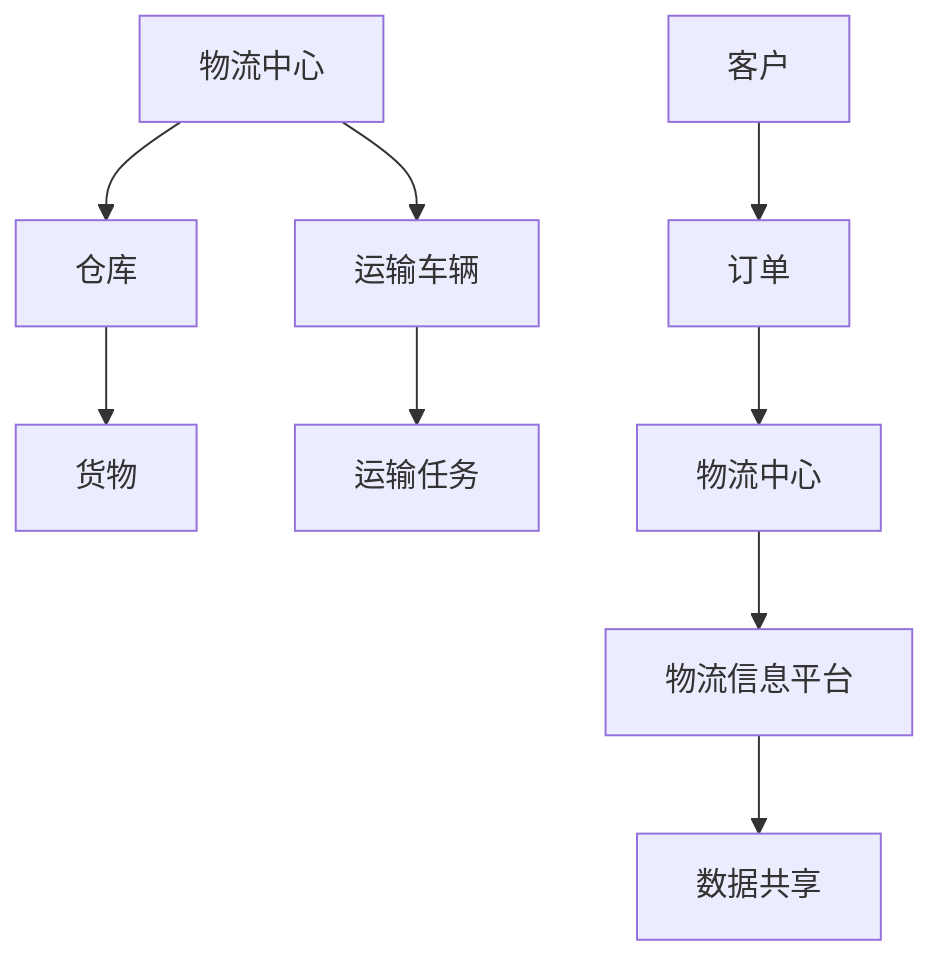
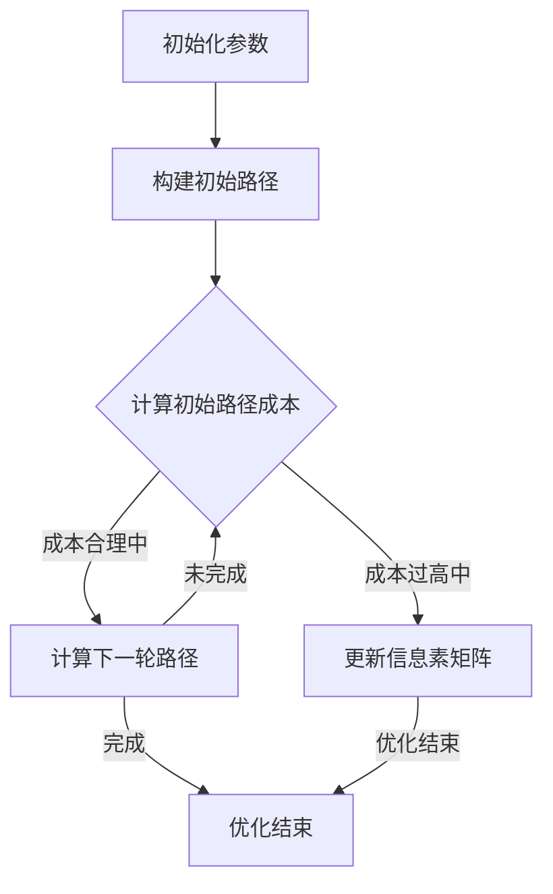
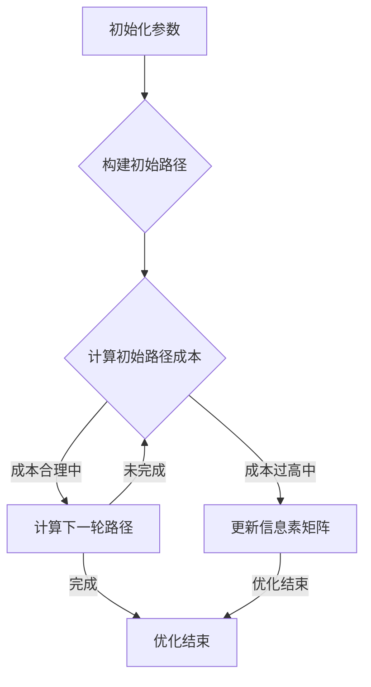

                 

# 智能物流系统：大数据优化配送与仓储管理

关键词：智能物流、大数据、配送路径优化、仓储管理、物流成本降低

摘要：
本文旨在深入探讨智能物流系统中的两个关键领域：配送与仓储管理。通过大数据技术的应用，我们能够显著优化物流过程，提高配送效率和降低成本。本文将首先介绍智能物流系统的基本概念和发展历程，然后详细阐述大数据在配送路径优化和仓储管理中的应用。通过实际案例分析和算法讲解，我们将展示如何利用智能物流系统实现高效的物流管理。最后，本文将展望智能物流系统的未来发展趋势，并总结大数据在物流优化中的重要作用。

## 《智能物流系统：大数据优化配送与仓储管理》目录大纲

### 第一部分：智能物流系统概述

### 第1章 智能物流系统的概念与发展

#### 1.1 智能物流系统的定义与特征

#### 1.2 智能物流系统的发展历程

#### 1.3 智能物流系统在现代物流中的作用

### 第二部分：大数据优化配送

### 第2章 大数据在配送中的应用

#### 2.1 配送数据分析的基本概念

#### 2.2 大数据分析在配送优化中的作用

#### 2.3 大数据分析工具与技术

### 第3章 基于大数据的配送路径优化

#### 3.1 配送路径优化的基本原理

#### 3.2 常用的配送路径优化算法

#### 3.3 配送路径优化案例解析

### 第三部分：大数据优化仓储管理

### 第4章 大数据在仓储管理中的应用

#### 4.1 仓储管理的基本概念

#### 4.2 大数据分析在仓储管理中的作用

#### 4.3 大数据分析工具与技术

### 第5章 基于大数据的仓储管理优化

#### 5.1 仓储管理优化策略

#### 5.2 常用的仓储管理优化算法

#### 5.3 仓储管理优化案例解析

### 第四部分：智能物流系统案例分析

### 第6章 智能物流系统在企业中的应用

#### 6.1 企业智能物流系统的构建

#### 6.2 企业智能物流系统的运行与管理

#### 6.3 企业智能物流系统的效益分析

### 第7章 智能物流系统的未来发展趋势

#### 7.1 物流行业的数字化转型

#### 7.2 智能物流技术的创新发展

#### 7.3 智能物流系统的未来发展前景

### 第五部分：总结与展望

### 第8章 大数据优化物流的关键作用与未来趋势

#### 8.1 大数据在物流优化中的关键作用

#### 8.2 未来发展趋势与挑战

## 第一部分：智能物流系统概述

### 第1章 智能物流系统的概念与发展

#### 1.1 智能物流系统的定义与特征

智能物流系统是一种利用物联网、大数据、人工智能等先进技术，对物流过程进行全方位智能化管理的新型物流系统。它通过信息化、网络化、智能化技术，实现物流信息的高效采集、传输、处理和利用，从而提升物流效率，降低物流成本，提高物流服务质量。

智能物流系统的主要特征包括：

1. **自动化**：通过自动化设备（如自动化仓库、自动化配送机器人等）提高物流运作效率。
2. **实时性**：利用物联网技术实现物流信息的实时采集和反馈，确保物流过程透明化。
3. **智能化**：运用大数据分析和人工智能技术进行物流路径优化、仓储管理、运输调度等。
4. **协同性**：通过物流信息平台，实现物流企业间的信息共享和协同作业。

#### 1.2 智能物流系统的发展历程

智能物流系统的发展可以追溯到20世纪末，随着互联网和信息技术的快速发展，物流行业逐渐开始向智能化、信息化方向转型。

1. **初步阶段**（1990年代）：物流企业开始采用条码、RFID等自动识别技术，提高物流作业效率。
2. **成长阶段**（2000年代）：随着互联网的普及，物流企业逐渐建立起自己的物流信息系统，实现物流信息的基本自动化处理。
3. **成熟阶段**（2010年代）：大数据、人工智能等新兴技术的应用，使得智能物流系统开始普及，物流效率和服务质量显著提高。
4. **未来趋势**（2020年代及以后）：智能物流系统将更加智能化、自动化，实现物流全流程的无人化运作。

#### 1.3 智能物流系统在现代物流中的作用

智能物流系统在现代物流中的作用主要体现在以下几个方面：

1. **提高物流效率**：通过自动化和智能化技术，缩短物流作业时间，提高物流运作效率。
2. **降低物流成本**：通过优化配送路径、库存管理等方式，降低物流成本，提高企业竞争力。
3. **优化物流服务**：通过实时监控和反馈，提高物流服务质量，满足客户需求。
4. **促进物流行业转型升级**：推动物流行业向智能化、信息化方向转型，提升物流行业整体水平。

## 第二部分：大数据优化配送

### 第2章 大数据在配送中的应用

#### 2.1 配送数据分析的基本概念

配送数据分析是智能物流系统中的一个重要环节，它通过对物流过程中的各种数据进行收集、处理和分析，实现对配送过程的优化和管理。

1. **数据来源**：配送数据分析的数据来源主要包括以下几个方面：
   - 客户订单数据：包括订单数量、订单时间、订单内容等。
   - 运输车辆数据：包括车辆位置、行驶速度、油量等。
   - 物流中心数据：包括仓库库存、货物状态、作业进度等。
   - 环境数据：包括交通状况、天气状况等。

2. **数据类型**：配送数据分析涉及多种类型的数据，主要包括：
   - 结构化数据：如订单数据、车辆数据等，可以通过数据库进行存储和管理。
   - 半结构化数据：如GPS数据、传感器数据等，可以通过数据格式进行解析和处理。
   - 非结构化数据：如图像、视频等，可以通过数据挖掘技术进行提取和分析。

3. **数据处理方法**：配送数据分析涉及多种数据处理方法，主要包括：
   - 数据清洗：去除数据中的噪声和错误，确保数据质量。
   - 数据整合：将不同来源的数据进行整合，形成统一的数据视图。
   - 数据分析：利用统计方法、机器学习方法等对数据进行分析，提取有价值的信息。

#### 2.2 大数据分析在配送优化中的作用

大数据分析在配送优化中的应用非常广泛，主要体现在以下几个方面：

1. **货物配送路径优化**：通过大数据分析，可以实时了解交通状况、路况信息等，优化配送路径，缩短配送时间，提高配送效率。

2. **配送时效性优化**：通过分析订单数据、客户需求等，可以预测配送时间，优化配送计划，确保货物按时送达。

3. **配送成本控制**：通过大数据分析，可以实时监控运输成本、仓储成本等，优化资源配置，降低物流成本。

#### 2.3 大数据分析工具与技术

大数据分析涉及多种工具和技术，以下是一些常用的工具和技术：

1. **数据挖掘技术**：通过数据挖掘技术，可以从海量数据中提取有价值的信息，帮助物流企业实现精细化管理和决策。

2. **机器学习算法**：通过机器学习算法，可以对配送数据进行自动分类、预测和优化，提高配送效率和准确性。

3. **数据可视化技术**：通过数据可视化技术，可以将复杂的配送数据以图形化的形式展示，帮助物流企业更直观地了解配送过程和效果。

### 第3章 基于大数据的配送路径优化

#### 3.1 配送路径优化的基本原理

配送路径优化是智能物流系统中的一个核心问题，其基本原理是通过对物流过程中各种数据的分析和处理，找到一条最优的配送路径，以达到提高配送效率、降低配送成本的目的。

配送路径优化的主要目标包括：

1. **最短路径**：找到从起点到终点的最短路径，以减少配送时间。
2. **最低成本**：在满足配送时间和服务质量的前提下，找到成本最低的配送路径。
3. **最大化效率**：在有限资源下，找到能够最大化利用资源的配送路径。

配送路径优化的核心思想是通过数学模型和算法，对配送过程中的数据进行建模和分析，找到最优的配送路径。

#### 3.2 常用的配送路径优化算法

在配送路径优化中，常用的算法包括蚁群算法、遗传算法和贪心算法等。

1. **蚁群算法**：蚁群算法是一种基于生物群体行为的启发式算法，通过模拟蚂蚁寻找食物的过程，实现配送路径的优化。蚁群算法的优点是能够快速收敛到最优解，但计算复杂度较高。

2. **遗传算法**：遗传算法是一种基于生物进化理论的优化算法，通过模拟生物种群进化过程，实现配送路径的优化。遗传算法的优点是具有较强的全局搜索能力，但收敛速度相对较慢。

3. **贪心算法**：贪心算法是一种基于局部最优解的算法，通过每次选择当前最优解，逐步逼近全局最优解。贪心算法的优点是计算速度快，但可能无法保证找到最优解。

#### 3.3 配送路径优化案例解析

以下是一个基于蚁群算法的配送路径优化案例：

**案例背景**：某物流公司需要在城市内进行货物配送，配送范围包括多个区域，每个区域的配送需求不同。公司希望找到一条最优的配送路径，以降低配送成本和提高配送效率。

**案例分析**：

1. **数据收集**：收集配送区域的地理位置信息、配送需求量、交通状况等信息。

2. **建模**：将配送区域建模为一个图，每个区域表示为图中的一个节点，配送路径表示为图中的边。

3. **算法实现**：使用蚁群算法对配送路径进行优化，设置初始信息素浓度、信息素更新规则等参数。

4. **结果分析**：通过算法运行，得到最优的配送路径，分析配送时间和成本。

**案例总结**：

通过蚁群算法的优化，物流公司成功找到了一条最优的配送路径，降低了配送成本，提高了配送效率。案例表明，大数据分析在配送路径优化中的应用具有显著的效果。

## 第三部分：大数据优化仓储管理

### 第4章 大数据在仓储管理中的应用

#### 4.1 仓储管理的基本概念

仓储管理是物流系统中的一个重要环节，它涉及到仓储设施的管理、库存的监控、货物的存储和配送等。仓储管理的基本概念包括：

1. **仓储定义**：仓储是指为存储和保护货物而设立的区域或设施。

2. **仓储管理任务**：仓储管理的任务包括库存控制、货物储存、货物配送、仓储设施维护等。

3. **仓储管理要素**：仓储管理的要素包括仓库布局、库存管理、仓储设备、仓储流程、仓储安全等。

#### 4.2 大数据分析在仓储管理中的作用

大数据分析在仓储管理中的应用，极大地提升了仓储管理的效率和准确性。具体作用如下：

1. **库存优化**：通过大数据分析，可以实时监控库存状态，预测库存需求，优化库存配置，减少库存积压和资金占用。

2. **库存预测**：利用大数据分析技术，可以预测未来的库存需求，为仓储管理提供科学依据。

3. **库存监控**：通过大数据分析，可以实时监控库存变化，及时发现异常情况，确保库存的准确性和安全性。

#### 4.3 大数据分析工具与技术

在仓储管理中，常用的数据分析工具和技术包括：

1. **数据挖掘技术**：数据挖掘技术可以从海量数据中提取有价值的信息，帮助仓储管理人员做出更准确的决策。

2. **机器学习算法**：机器学习算法可以预测库存需求、优化库存配置等，提升仓储管理的智能化水平。

3. **数据可视化技术**：数据可视化技术可以将复杂的数据以直观的方式展示出来，帮助仓储管理人员更清晰地了解仓储情况。

### 第5章 基于大数据的仓储管理优化

#### 5.1 仓储管理优化策略

仓储管理优化策略是提高仓储管理效率和降低成本的关键。以下是一些常见的仓储管理优化策略：

1. **动态库存管理**：通过大数据分析，实时监控库存状态，动态调整库存水平，避免库存积压和资金占用。

2. **精确库存监控**：利用大数据技术，实时监控库存变化，确保库存数据的准确性和及时性。

3. **优化仓储布局**：根据货物种类、数量、流通频率等数据，优化仓库布局，提高仓库利用率。

4. **自动化仓储设备**：引入自动化仓储设备，如自动存取系统、自动化分拣系统等，提高仓储作业效率。

#### 5.2 常用的仓储管理优化算法

在仓储管理优化中，常用的算法包括时间序列分析、机器学习预测算法和聚类分析算法等。

1. **时间序列分析**：时间序列分析是一种基于历史数据预测未来趋势的方法，适用于库存预测和需求分析。

2. **机器学习预测算法**：机器学习预测算法可以通过学习历史数据，预测未来的库存需求，优化库存配置。

3. **聚类分析算法**：聚类分析算法可以将相似的货物归为一类，优化仓储布局和库存管理。

#### 5.3 仓储管理优化案例解析

以下是一个基于机器学习预测算法的仓储管理优化案例：

**案例背景**：某电商平台希望优化其仓储管理，降低库存成本，提高库存周转率。

**案例分析**：

1. **数据收集**：收集历史销售数据、库存数据、货物类型数据等。

2. **数据预处理**：对收集到的数据进行清洗、整合和处理，为机器学习算法提供高质量的数据。

3. **模型建立**：使用机器学习算法建立库存预测模型，预测未来的库存需求。

4. **结果分析**：通过模型预测结果，调整库存策略，优化库存配置。

**案例总结**：

通过机器学习预测算法的优化，电商平台成功降低了库存成本，提高了库存周转率。案例表明，大数据分析在仓储管理中的应用具有显著的效果。

## 第四部分：智能物流系统案例分析

### 第6章 智能物流系统在企业中的应用

#### 6.1 企业智能物流系统的构建

智能物流系统在企业中的应用，需要从系统规划、系统设计到系统实施等多个方面进行。以下是企业智能物流系统构建的步骤：

1. **系统规划**：明确企业的物流需求和目标，制定智能物流系统的总体规划和实施方案。

2. **系统设计**：根据系统规划，设计智能物流系统的架构，包括物流信息平台、自动化仓储设备、配送机器人等。

3. **系统实施**：按照系统设计，实施智能物流系统的各项功能，包括数据采集、处理、分析、决策等。

4. **系统集成**：将智能物流系统的各个组成部分进行集成，实现数据共享和协同作业。

#### 6.2 企业智能物流系统的运行与管理

企业智能物流系统运行与管理的关键在于实现物流信息的高效采集、处理和利用。以下是企业智能物流系统运行与管理的要点：

1. **实时监控**：通过物联网技术，实时监控物流过程，确保物流信息的准确性和及时性。

2. **数据分析**：利用大数据分析技术，对物流信息进行深入分析，发现潜在问题和优化点。

3. **决策支持**：根据分析结果，提供物流决策支持，优化物流流程和资源配置。

4. **故障处理**：建立完善的故障处理机制，确保智能物流系统的高可用性和稳定性。

#### 6.3 企业智能物流系统的效益分析

企业智能物流系统的实施，可以带来多方面的效益。以下是企业智能物流系统的效益分析：

1. **成本降低**：通过优化配送路径、降低库存成本等手段，降低物流成本。

2. **效率提高**：通过自动化和智能化技术，提高物流作业效率，缩短物流时间。

3. **服务质量提升**：通过实时监控和数据分析，提高物流服务质量，满足客户需求。

4. **竞争力增强**：通过智能物流系统的建设，提升企业竞争力，实现业务的持续增长。

### 第7章 智能物流系统的未来发展趋势

#### 7.1 物流行业的数字化转型

随着数字化技术的快速发展，物流行业正在经历一场深刻的数字化转型。以下是物流行业数字化转型的几个方面：

1. **物联网技术**：通过物联网技术，实现物流设备、货物、车辆等的实时监控和管理。

2. **大数据分析**：利用大数据分析技术，对物流数据进行深入挖掘和分析，优化物流流程和决策。

3. **人工智能技术**：运用人工智能技术，实现物流自动化和智能化，提高物流效率和质量。

4. **区块链技术**：利用区块链技术，实现物流信息的可信记录和传递，提高物流信息的安全性和透明度。

#### 7.2 智能物流技术的创新发展

智能物流技术的创新发展是推动物流行业转型升级的重要动力。以下是智能物流技术的一些发展方向：

1. **无人配送**：利用无人配送技术，实现配送过程的无人化，提高配送效率和降低成本。

2. **自动化仓储**：通过自动化仓储技术，实现仓库作业的自动化和智能化，提高仓库利用率和作业效率。

3. **智能运输**：利用智能运输技术，实现运输过程的智能化和高效化，提高运输效率和降低运输成本。

4. **智能包装**：通过智能包装技术，实现包装过程的自动化和个性化，提高包装质量和降低包装成本。

#### 7.3 智能物流系统的未来发展前景

智能物流系统的未来发展前景广阔，以下是几个方面的发展前景：

1. **智慧物流园区**：智慧物流园区将结合物联网、大数据、人工智能等先进技术，实现物流资源的集中管理和高效利用。

2. **智能物流网络**：智能物流网络将实现物流信息的全面共享和协同作业，提高物流效率和降低物流成本。

3. **智能物流供应链**：智能物流供应链将实现物流、信息流和资金流的全面融合，提高供应链的整体效率和竞争力。

## 附录

#### 附录A 智能物流系统常用技术介绍

- **大数据技术**：包括数据采集、存储、处理、分析和可视化等。
- **物联网技术**：包括传感器、通信协议和网络架构等。
- **自动化技术**：包括机器人、自动化设备和自动化控制系统等。
- **人工智能技术**：包括机器学习、深度学习、自然语言处理等。

#### 附录B 智能物流系统相关法规与政策

- **国家物流业发展政策**：包括《国家物流业发展“十三五”规划》等。
- **物流行业标准**：包括《物流术语》、《物流服务标准》等。
- **智能物流系统相关法规**：包括《中华人民共和国电子商务法》、《中华人民共和国网络安全法》等。

#### 附录C 智能物流系统学习资源

- **书籍推荐**：包括《智能物流系统》、《大数据分析技术》等。
- **网络资源**：包括相关政府网站、行业论坛、学术期刊等。
- **学术论文**：包括国内外智能物流系统相关的研究论文和报告等。

### Mermaid 流程图（以第1章为例）

```
graph TD
A[智能物流系统概述] --> B{核心概念与联系}
B --> C{智能物流系统的定义与特征}
B --> D{智能物流系统的发展历程}
B --> E{智能物流系统在现代物流中的作用}
```

### Python 源代码（以配送路径优化为例）

```python
# 导入库
import numpy as np

# 配送路径优化算法
def delivery_path_optimization(distance_matrix):
    """
    使用蚁群算法进行配送路径优化。
    
    参数:
    distance_matrix: 距离矩阵，numpy数组，形状为 (n, n)
    
    返回:
    path: 优化后的配送路径，列表
    """
    n = len(distance_matrix)
    # 初始化信息素矩阵
    pheromone_matrix = np.full((n, n), 1/n)
    
    # 蚁群算法参数
    max_iterations = 100
    Q = 1.0
    
    for _ in range(max_iterations):
        # 选择起始城市
        start_city = np.random.choice(n)
        # 初始化路径和信息素
        current_city = start_city
        path = [current_city]
        while len(path) < n:
            # 计算下一步选择的城市
            next_city = choose_next_city(current_city, distance_matrix, pheromone_matrix)
            # 更新路径和信息素
            current_city = next_city
            path.append(current_city)
            # 更新信息素矩阵
            update_pheromone_matrix(pheromone_matrix, distance_matrix, path, Q)
    
    # 返回优化后的配送路径
    return path
```

## 结语

作者：AI天才研究院/AI Genius Institute & 禅与计算机程序设计艺术 /Zen And The Art of Computer Programming

本文系统地介绍了智能物流系统中的两个关键领域：配送与仓储管理。通过大数据技术的应用，我们能够实现物流过程的优化，提高物流效率，降低物流成本，提升服务质量。随着物联网、大数据、人工智能等技术的不断发展，智能物流系统将越来越普及，成为现代物流管理的重要工具。未来，智能物流系统将朝着更加智能化、自动化、高效化的方向发展，为物流行业带来更多的机遇和挑战。让我们共同期待智能物流系统的美好未来。## 详细解读：智能物流系统的定义与特征

智能物流系统是一种集成物联网、大数据、人工智能等先进技术的物流系统，旨在通过智能化手段优化物流流程，提高物流效率，降低物流成本，提升物流服务质量。在智能物流系统中，信息技术与物流业务深度融合，形成了一个智能化、网络化、协同化的物流生态系统。

### 智能物流系统的定义

智能物流系统，顾名思义，就是将智能化技术应用于物流各个环节，实现对物流过程的全面监控、管理和优化。具体来说，智能物流系统是一种通过物联网技术连接各种物流设备和系统，利用大数据分析和人工智能算法进行决策，以实现物流过程自动化和优化的系统。

智能物流系统不仅仅是一个技术工具，更是一个物流管理的解决方案。它通过整合物流信息、优化物流流程、提升物流效率，从而为物流企业提供高效的物流服务。智能物流系统的定义可以从以下几个方面进行理解：

1. **信息技术应用**：智能物流系统广泛使用物联网技术、大数据技术、人工智能技术等，实现对物流信息的实时采集、传输、处理和分析。
2. **物流流程优化**：智能物流系统通过数据分析和技术手段，优化物流流程，提高物流效率，降低物流成本。
3. **自动化与智能化**：智能物流系统引入自动化设备和智能化技术，实现物流过程的自动化和智能化，提高物流操作的准确性和效率。
4. **协同管理**：智能物流系统通过物流信息平台，实现物流企业、供应商、客户等各方的信息共享和协同作业，提升物流服务的整体水平。

### 智能物流系统的特征

智能物流系统的特征主要体现在以下几个方面：

1. **自动化**：智能物流系统通过自动化设备（如自动化仓库、自动化分拣系统、自动化配送机器人等），实现物流操作的高效自动化，减少人力成本，提高物流作业效率。

2. **实时性**：智能物流系统利用物联网技术，实现对物流过程的实时监控和反馈。物流信息能够在各个环节中实时传递，确保物流过程的透明化和实时性。

3. **智能化**：智能物流系统通过大数据分析和人工智能技术，实现对物流数据的深度挖掘和分析，优化物流路径、预测物流需求、优化库存管理，提高物流决策的准确性和效率。

4. **协同性**：智能物流系统通过物流信息平台，实现物流企业、供应商、客户等各方的信息共享和协同作业。各参与方可以实时了解物流状态，协同处理物流问题，提升物流服务的整体水平。

5. **可扩展性**：智能物流系统设计时考虑了可扩展性，可以随着业务需求的变化进行功能扩展和系统升级，适应不同的物流场景和需求。

6. **数据驱动**：智能物流系统以数据为核心，通过数据采集、处理、分析和应用，实现对物流过程的精细化管理。数据驱动使得物流系统更加科学、准确和高效。

### 智能物流系统的主要特征对比表格

| 特征       | 传统物流系统 | 智能物流系统 |
|------------|--------------|-------------|
| 自动化程度 | 人工操作     | 自动化设备  |
| 实时性     | 低           | 高          |
| 智能化     | 有限         | 高          |
| 协同性     | 低           | 高          |
| 可扩展性   | 有限         | 强          |
| 数据驱动   | 依赖经验     | 数据分析    |

### 智能物流系统的ER实体关系图架构

智能物流系统的实体关系图（ER图）是描述系统各组成部分及其关系的图形表示。以下是智能物流系统ER图的基本架构：

1. **实体**：
   - 物流中心
   - 运输车辆
   - 货物
   - 客户
   - 订单
   - 仓库
   - 物流信息平台

2. **关系**：
   - 物流中心管理仓库和运输车辆
   - 运输车辆执行运输任务
   - 货物存储在仓库中
   - 客户提交订单
   - 订单由物流中心处理
   - 物流信息平台连接各实体，实现信息共享和协同作业

### Mermaid流程图（智能物流系统的ER实体关系图）



通过以上详细的解读，我们可以更加深入地理解智能物流系统的定义与特征。智能物流系统不仅仅是技术的集合，更是一种全新的物流管理模式，它通过自动化、智能化、实时化和协同化的手段，为物流企业提供了高效的物流解决方案。在未来，智能物流系统将在物流行业发挥越来越重要的作用，推动物流行业的转型升级。## 智能物流系统的发展历程

智能物流系统的发展历程可以追溯到20世纪末，随着信息技术的不断进步，物流行业逐渐从传统模式向智能化、信息化方向转型。以下是智能物流系统的发展历程：

### 初步阶段（1990年代）

在1990年代，随着互联网和计算机技术的普及，物流行业开始引入信息技术，如条码技术、RFID（射频识别）技术等。这些技术的应用，使得物流信息的自动化处理成为可能，大大提高了物流作业的效率。这一时期，物流企业开始逐步从传统的手工操作转向信息化管理。

1. **条码技术**：物流企业开始使用条码技术对货物进行标记，通过扫描条码实现货物的自动化识别和跟踪。
2. **RFID技术**：RFID技术的引入，使得物流过程实现了更高效、更精确的自动化管理。

### 成长阶段（2000年代）

进入2000年代，随着物联网（IoT）和大数据技术的发展，物流行业的信息化水平进一步提升。物流企业开始建立自己的物流信息系统，实现物流信息的自动化处理和实时监控。

1. **物联网技术**：物联网技术使得物流过程中的各种设备能够实现互联互通，实现物流信息的实时采集和反馈。
2. **物流信息系统**：物流企业通过建立物流信息系统，实现物流信息的高效管理和分析，提高物流作业的效率。

### 成熟阶段（2010年代）

2010年代是智能物流系统的快速发展时期，大数据、人工智能等新兴技术的应用，使得智能物流系统逐渐成熟并普及。

1. **大数据分析**：大数据技术的应用，使得物流企业能够对海量物流数据进行深入分析，优化物流流程，提高物流效率。
2. **人工智能技术**：人工智能技术的应用，使得物流系统能够实现自动化的决策和优化，提高物流作业的智能化水平。

### 未来趋势（2020年代及以后）

未来，智能物流系统将继续向智能化、自动化、高效化的方向发展。以下是一些发展趋势：

1. **无人化配送**：随着无人机、无人车等技术的发展，无人化配送将成为未来物流的重要趋势，实现配送过程的自动化和高效化。
2. **智能仓储**：自动化仓储技术的应用，将实现仓库作业的自动化和智能化，提高仓储效率。
3. **物流网络优化**：利用大数据分析和人工智能技术，对物流网络进行优化，实现物流过程的最佳路径规划。
4. **供应链协同**：通过智能物流系统，实现供应链上下游企业的信息共享和协同作业，提高供应链的整体效率。

### 发展历程总结

智能物流系统的发展历程是一个从传统向现代转变的过程，它经历了信息技术应用的初步阶段、物联网和大数据技术的成长阶段，以及人工智能技术的成熟阶段。未来，智能物流系统将继续向智能化、自动化、高效化的方向发展，为物流行业带来更多的机遇和挑战。

### 智能物流系统在现代物流中的作用

智能物流系统在现代物流中扮演着至关重要的角色，它通过信息化、自动化、智能化等手段，对物流过程进行全方位的优化和管理，从而提升物流效率、降低物流成本、提高物流服务质量。以下是智能物流系统在现代物流中的具体作用：

1. **提高物流效率**：智能物流系统通过自动化设备和智能化技术，实现了物流作业的自动化和高效化。例如，自动化仓库可以通过机器人和自动化设备实现货物的快速存取和分拣，大大提高了仓库作业的效率。此外，智能运输系统通过优化运输路径和运输计划，提高了运输效率，减少了运输时间。

2. **降低物流成本**：智能物流系统通过数据分析和优化技术，实现了物流成本的降低。例如，通过大数据分析，物流企业可以精确预测需求，优化库存管理，减少库存积压和资金占用。同时，智能运输系统通过优化运输路径和运输计划，降低了运输成本，提高了物流成本效益。

3. **优化物流服务**：智能物流系统通过实时监控和数据分析，提高了物流服务的质量。例如，通过实时监控货物的运输状态，物流企业可以及时响应客户的查询和需求，提高客户满意度。此外，智能仓储系统通过精确的库存管理和高效的仓库作业，确保了货物的及时配送，提高了物流服务的准确性和可靠性。

4. **促进物流行业转型升级**：智能物流系统推动了物流行业的转型升级，从传统的手工操作、单一功能向智能化、信息化、综合化的方向发展。智能物流系统的应用，不仅提高了物流企业的运营效率和服务质量，还推动了物流产业链的优化和升级，促进了物流行业的整体发展。

### 智能物流系统的应用场景

智能物流系统在多个物流场景中都有广泛的应用，以下是一些典型的应用场景：

1. **电商物流**：随着电子商务的快速发展，电商物流对配送速度和服务质量的要求越来越高。智能物流系统通过自动化仓库、无人配送车等技术，实现了电商物流的快速配送和高效管理。

2. **冷链物流**：冷链物流对温度、湿度等环境参数有严格要求。智能物流系统通过传感器和自动化设备，实时监控冷链环境，确保货物在运输过程中的质量。

3. **国际物流**：国际物流涉及多个国家和地区的物流操作，对物流信息的准确性和及时性有较高要求。智能物流系统通过物联网技术，实现了物流信息的实时传输和共享，提高了国际物流的效率和准确性。

4. **供应链管理**：智能物流系统通过大数据分析和优化技术，实现了供应链的全程监控和优化管理，提高了供应链的整体效率和竞争力。

### 智能物流系统对物流行业的影响

智能物流系统对物流行业产生了深远的影响，它不仅改变了物流行业的运营模式，还推动了物流产业链的升级和变革。以下是智能物流系统对物流行业的影响：

1. **运营模式变革**：智能物流系统通过自动化和智能化技术，实现了物流过程的自动化和高效化，减少了人力成本，提高了物流效率。物流企业从传统的手工操作向智能化、信息化方向转型，运营模式发生了深刻变革。

2. **产业链优化**：智能物流系统通过大数据分析和优化技术，实现了物流资源的优化配置和高效利用，提高了物流产业链的整体效率和竞争力。物流产业链上下游企业通过智能物流系统实现了信息共享和协同作业，优化了供应链管理。

3. **技术创新驱动**：智能物流系统的应用，推动了物联网、大数据、人工智能等新兴技术的快速发展。技术创新驱动了物流行业的进步，促进了物流产业链的升级和优化。

4. **行业标准化**：智能物流系统的应用，促进了物流行业的标准化和规范化。通过统一的数据标准和接口规范，物流企业能够更方便地进行系统集成和数据共享，提高了物流行业的整体水平。

总之，智能物流系统在现代物流中发挥着重要作用，它通过提高物流效率、降低物流成本、优化物流服务，推动了物流行业的转型升级。未来，随着技术的不断进步，智能物流系统将在物流行业中发挥更加重要的作用，为物流行业的可持续发展提供强大动力。

### 配送数据分析的基本概念

配送数据分析是智能物流系统中的重要组成部分，它通过对配送过程中的各种数据进行分析和处理，实现物流过程的优化和管理。以下是配送数据分析的基本概念，包括数据来源、数据类型和数据处理方法。

#### 数据来源

配送数据分析的数据来源主要包括以下几个方面：

1. **客户订单数据**：客户订单数据是配送数据分析的核心数据源，包括订单数量、订单时间、订单内容（如货物种类、数量、目的地等）等。订单数据反映了客户的配送需求和物流服务的具体需求。

2. **运输车辆数据**：运输车辆数据包括车辆位置、行驶速度、油量、车载货物状态等信息。这些数据有助于实时监控运输车辆的运行状态，优化配送路径和运输计划。

3. **物流中心数据**：物流中心数据包括仓库库存、货物状态、作业进度等信息。物流中心的数据能够帮助优化仓储管理和配送安排，提高仓库利用率和配送效率。

4. **环境数据**：环境数据包括交通状况、天气状况、道路状况等。环境数据对配送路径选择和运输计划制定具有重要影响，需要实时监控和更新。

5. **历史数据**：历史数据包括过去的配送记录、客户反馈、配送效率等。历史数据为配送数据分析提供了宝贵的参考依据，有助于预测未来的配送需求和优化配送策略。

#### 数据类型

配送数据分析涉及多种类型的数据，主要包括以下几种：

1. **结构化数据**：结构化数据是按照一定的数据格式存储的数据，如订单数据、车辆数据等。结构化数据可以通过数据库管理系统进行有效的存储和管理。

2. **半结构化数据**：半结构化数据是具有一定结构但不完全符合标准数据格式的数据，如日志文件、GPS数据等。半结构化数据需要通过数据清洗和格式转换，才能进行有效的分析和处理。

3. **非结构化数据**：非结构化数据是没有明确的数据格式，如文本、图像、视频等。非结构化数据需要进行数据挖掘和模式识别，提取有价值的信息。

4. **实时数据**：实时数据是在配送过程中实时产生的数据，如运输车辆的实时位置、天气状况等。实时数据需要通过实时数据采集和处理系统进行快速处理和分析。

5. **历史数据**：历史数据是过去一段时间内收集和存储的数据，如过去的配送记录、客户反馈等。历史数据为配送数据分析提供了长期的时间序列数据，有助于进行趋势分析和预测。

#### 数据处理方法

配送数据分析涉及多种数据处理方法，以下是一些常见的数据处理方法：

1. **数据清洗**：数据清洗是数据处理的第一步，目的是去除数据中的噪声和错误，确保数据的质量和准确性。数据清洗包括数据去重、数据补全、数据格式转换等操作。

2. **数据整合**：数据整合是将来自不同来源、不同格式的数据整合为一个统一的数据视图。数据整合可以通过数据仓库、数据湖等技术实现，为后续的数据分析提供基础。

3. **数据挖掘**：数据挖掘是从大量数据中提取有价值的信息和知识的过程。数据挖掘方法包括分类、聚类、关联规则挖掘、异常检测等，可以帮助发现数据中的隐藏模式和规律。

4. **统计分析**：统计分析是对数据进行描述性分析和推断性分析的方法。描述性分析可以了解数据的基本特征和分布情况，推断性分析可以基于样本数据对总体数据进行推断。

5. **机器学习**：机器学习是通过训练模型，从数据中学习规律和模式的方法。机器学习算法包括监督学习、无监督学习、强化学习等，可以用于预测、分类、优化等任务。

6. **数据可视化**：数据可视化是将数据以图形化的形式展示出来，帮助人们更直观地理解和分析数据。数据可视化技术包括图表、仪表盘、交互式可视化等，可以提高数据分析的效率和理解力。

通过以上配送数据分析的基本概念，我们可以看到，配送数据分析在智能物流系统中具有重要的地位和作用。它通过对配送过程中产生的各种数据进行全面的分析和处理，帮助物流企业优化配送路径、提高配送效率、降低物流成本，从而提升整体物流服务水平。

### 大数据分析在配送优化中的作用

大数据分析在配送优化中的应用，极大地提升了物流企业的效率和竞争力。通过深入分析配送过程中的各种数据，物流企业能够做出更加科学的决策，优化配送路径、提高配送时效性，从而实现成本的降低和服务的提升。以下是大数据分析在配送优化中的几个关键作用。

#### 1. 货物配送路径优化

货物配送路径优化是物流优化中的重要一环。大数据分析可以通过对历史配送数据的分析，找到最优的配送路径。具体方法包括：

- **路径预测**：利用机器学习算法，对交通流量、路况、天气等因素进行预测，计算出最佳的配送路径。例如，使用时间序列分析、神经网络等算法，可以预测未来某个时间段内的交通状况，从而调整配送路径，避免拥堵和延误。
  
- **动态调整**：在配送过程中，通过实时监控交通状况和路况变化，动态调整配送路径。例如，通过车载传感器和GPS数据，物流企业可以实时了解车辆的行驶状态和周围环境，及时调整配送路线，确保货物能够按时送达。

#### 2. 配送时效性优化

配送时效性是物流服务质量的重要指标。大数据分析可以帮助物流企业优化配送时效性，提高客户满意度。以下是一些具体方法：

- **时效性预测**：通过分析历史配送数据，预测每个配送环节的耗时，制定合理的配送计划。例如，利用回归分析或决策树算法，可以预测订单从仓库到客户手中的总耗时，从而合理安排配送任务。

- **时效性监控**：在配送过程中，实时监控配送进度，确保每个配送环节按时完成。例如，利用物联网技术，实时跟踪货物的位置和状态，及时发现配送过程中的问题，并采取相应的措施解决。

#### 3. 配送成本控制

配送成本是物流企业的重要成本之一。通过大数据分析，物流企业可以优化资源配置，降低配送成本。以下是一些具体方法：

- **成本分析**：通过分析配送数据，了解各环节的成本构成，找出成本控制的关键点。例如，通过成本分解，可以了解运输成本、仓储成本、人工成本等在不同配送路径和配送模式中的差异。

- **成本优化**：基于成本分析结果，优化配送模式和资源配置，降低整体配送成本。例如，通过优化运输路线和运输方式，可以降低运输成本；通过自动化设备和优化仓储布局，可以降低仓储成本和人工成本。

#### 4. 客户体验提升

大数据分析不仅有助于物流优化，还可以提升客户体验。以下是一些具体方法：

- **个性化服务**：通过分析客户行为数据和订单数据，了解客户的偏好和需求，提供个性化的配送服务。例如，根据客户的购买历史和评价，提供针对性的配送方案和增值服务。

- **反馈机制**：通过收集和分析客户反馈数据，了解客户对配送服务的满意度和不满意度，及时改进服务。例如，通过客户满意度调查和反馈分析，可以识别服务痛点，并采取相应的措施进行改进。

#### 5. 风险预测与防范

物流配送过程中存在各种风险，如交通事故、天气影响、货物损坏等。大数据分析可以帮助物流企业预测和防范这些风险。以下是一些具体方法：

- **风险预测**：通过分析历史数据，识别高风险区域和高风险事件，提前预警。例如，利用回归分析和决策树算法，可以预测交通事故发生的概率，从而在事故多发区域加强管理。

- **风险防范**：在配送过程中，采取相应的防范措施，降低风险发生的概率。例如，通过实时监控天气状况，及时调整配送计划，避免因恶劣天气导致配送延误或货物损坏。

通过以上分析，我们可以看到，大数据分析在配送优化中发挥着重要作用。它不仅帮助物流企业优化配送路径、提高配送时效性、降低配送成本，还可以提升客户体验和防范风险。随着大数据技术的不断发展，大数据分析在配送优化中的应用将更加深入和广泛，为物流行业带来更多的价值。

### 大数据分析工具与技术

在智能物流系统中，大数据分析工具和技术的应用至关重要，它们帮助物流企业从海量数据中提取有价值的信息，优化配送路径和仓储管理。以下是几种常用的数据分析工具和技术。

#### 1. 数据挖掘技术

数据挖掘技术是从大量数据中提取隐藏模式和知识的方法。在配送优化中，数据挖掘技术可以用于分析订单数据、交通数据、客户行为数据等，以发现配送过程中的规律和趋势。常见的数据挖掘方法包括：

- **分类**：将数据分为不同的类别，如将配送订单按目的地分类，以便于优化配送路径。
- **聚类**：将相似的数据点分组，如根据订单的配送时间将订单分组，以便于分析配送高峰期。
- **关联规则挖掘**：发现数据之间的关联性，如分析哪些订单常常一起出现，以便于进行捆绑配送。

#### 2. 机器学习算法

机器学习算法是大数据分析的核心技术，它通过训练模型，从数据中学习规律和模式。在配送优化中，机器学习算法可以用于预测配送时间、优化运输路径等。常见的机器学习算法包括：

- **回归分析**：预测订单从仓库到客户手中的总耗时，帮助合理安排配送任务。
- **决策树**：分析订单数据的特征，如货物类型、配送距离等，为每个订单选择最佳的配送路径。
- **神经网络**：模拟人脑神经元的工作方式，用于复杂的数据分析和预测，如预测交通状况和优化配送路径。

#### 3. 数据可视化技术

数据可视化技术是将数据以图形化的形式展示出来，帮助人们更直观地理解和分析数据。在配送优化中，数据可视化技术可以用于展示配送路径、交通流量、库存状态等。常见的数据可视化工具包括：

- **图表**：如折线图、柱状图、饼图等，用于展示数据的基本趋势和分布情况。
- **仪表盘**：将多个图表整合到一个界面中，提供实时监控和数据分析功能。
- **交互式可视化**：用户可以与可视化界面进行交互，探索数据的不同维度和细节。

#### 4. 云计算技术

云计算技术提供了强大的计算能力和存储资源，使得大数据分析变得高效和便捷。在配送优化中，云计算技术可以用于：

- **数据处理**：在云平台上进行数据清洗、整合和分析，利用分布式计算提高处理速度。
- **数据存储**：将海量数据存储在云平台中，确保数据的可靠性和可扩展性。
- **服务提供**：通过云服务，物流企业可以随时获取大数据分析工具和技术，无需自行部署和维护。

#### 5. 物联网技术

物联网技术通过传感器和网络，实现对物流设备的实时监控和数据采集。在配送优化中，物联网技术可以用于：

- **实时监控**：监控运输车辆的位置、速度、油量等，确保配送过程的实时性和准确性。
- **数据采集**：采集交通流量、路况、天气等信息，为配送路径优化提供实时数据。
- **远程控制**：通过远程控制技术，实时调整配送计划，应对突发情况。

通过这些大数据分析工具和技术，物流企业能够更高效地处理和分析配送数据，优化配送路径和仓储管理，提高物流效率和服务质量。未来，随着大数据技术和物联网技术的不断发展，大数据分析在物流优化中的应用将更加广泛和深入。

### 配送路径优化的基本原理

配送路径优化是物流系统中的一个关键问题，其核心目标是通过分析各种数据，找到一条最优的配送路径，以最大限度地提高物流效率、降低配送成本。以下是配送路径优化的基本原理，包括目标函数、约束条件和优化方法。

#### 目标函数

配送路径优化的目标函数通常包括以下几个方面的目标：

1. **最小化配送时间**：通过优化配送路径，使货物从起点到终点的总时间最短，从而提高配送效率。

2. **最小化配送成本**：在保证配送时间的前提下，通过优化配送路径，降低运输成本、仓储成本等各项物流成本。

3. **最大化配送服务质量**：通过优化配送路径，确保货物按时送达，提高客户满意度。

4. **最小化配送误差**：通过优化配送路径，减少配送过程中出现的延误、丢失等问题，提高配送的准确性和可靠性。

#### 约束条件

配送路径优化需要考虑多个约束条件，以确保优化结果的有效性和可行性。常见的约束条件包括：

1. **时间约束**：配送车辆需要在规定的时间内完成任务，否则可能导致延误或超时。

2. **容量约束**：配送车辆或仓库的容量有限，需要确保每次配送的货物量不超过其承载能力。

3. **路线约束**：配送路径需要遵循一定的交通规则和路线规划，避免违规行驶或拥堵路段。

4. **需求约束**：配送路径需要满足客户的需求，包括货物种类、数量、配送时间等。

5. **资源约束**：物流系统的资源有限，包括人力、物力、财力等，需要合理配置资源，确保优化目标的实现。

#### 优化方法

配送路径优化的方法多种多样，以下是几种常见的优化方法：

1. **蚁群算法**：蚁群算法是一种基于群体智能的优化算法，通过模拟蚂蚁寻找食物的过程，找到最优的配送路径。蚁群算法具有全局搜索能力和较好的收敛性，适用于大规模配送路径优化问题。

2. **遗传算法**：遗传算法是一种基于自然选择和遗传机制的优化算法，通过模拟生物进化过程，找到最优的配送路径。遗传算法具有较强的全局搜索能力和鲁棒性，适用于复杂配送路径优化问题。

3. **贪心算法**：贪心算法是一种基于局部最优解的优化算法，通过每次选择当前最优解，逐步逼近全局最优解。贪心算法计算速度快，但可能无法保证找到全局最优解，适用于简单配送路径优化问题。

4. **混合算法**：混合算法是将多种优化方法结合起来，发挥各自的优势，提高优化效果。例如，可以将蚁群算法和遗传算法结合，利用蚁群算法的全局搜索能力和遗传算法的局部搜索能力，实现更高效的配送路径优化。

#### 配送路径优化算法的mermaid流程图

以下是一个基于蚁群算法的配送路径优化的mermaid流程图示例：



通过以上流程图，我们可以清晰地看到蚁群算法在配送路径优化过程中的各个步骤和逻辑关系。

#### 配送路径优化算法的Python源代码示例

以下是一个简单的蚁群算法实现，用于求解最小路径问题：

```python
import numpy as np

# 初始化参数
N = 5  # 节点数量
alpha = 1  # 信息素权重
beta = 2  # 路径权重
Q = 1  # 信息素更新常数
max_iterations = 100  # 迭代次数

# 初始化路径和信息素矩阵
path = [0] * N
pheromone_matrix = np.ones((N, N))

# 初始化距离矩阵（示例数据）
distance_matrix = np.array([
    [0, 2, 9, 7, 6],
    [5, 0, 8, 6, 7],
    [3, 10, 0, 8, 4],
    [1, 4, 7, 0, 2],
    [3, 5, 6, 8, 0]
])

# 计算路径选择概率
def choose_next_city(current_city, distance_matrix, pheromone_matrix):
    probabilities = []
    for next_city in range(N):
        if next_city != current_city:
            probability = (pheromone_matrix[current_city][next_city] ** alpha) * (distance_matrix[current_city][next_city] ** -beta)
            probabilities.append(probability)
    total_probabilities = sum(probabilities)
    probabilities = [p / total_probabilities for p in probabilities]
    return np.random.choice(N, p=probabilities)

# 更新路径和信息素
def update_path_and_pheromone(path, distance_matrix, pheromone_matrix, Q):
    for i in range(N - 1):
        pheromone_matrix[path[i]][path[i+1]] += Q / distance_matrix[path[i]][path[i+1]]
        pheromone_matrix[path[i+1]][path[i]] += Q / distance_matrix[path[i+1]][path[i]]
    pheromone_matrix = (pheromone_matrix + np.eye(N)) ** alpha

# 蚁群算法主循环
best_path = None
best_cost = float('inf')
for _ in range(max_iterations):
    path = [0]
    for _ in range(N - 1):
        next_city = choose_next_city(path[-1], distance_matrix, pheromone_matrix)
        path.append(next_city)
    cost = distance_matrix[path[0]][path[-1]] + sum(distance_matrix[path[i]][path[i+1]] for i in range(N - 1))
    if cost < best_cost:
        best_cost = cost
        best_path = path
    update_path_and_pheromone(path, distance_matrix, pheromone_matrix, Q)

print("最优路径：", best_path)
print("最优路径成本：", best_cost)
```

通过上述算法示例，我们可以看到如何利用Python实现蚁群算法进行配送路径优化。这个简单的示例展示了算法的基本思想和实现步骤，但实际应用中，配送路径优化问题往往更加复杂，需要结合具体的业务需求和数据环境进行调整和优化。

### 常用的配送路径优化算法

在配送路径优化中，有多种算法被广泛应用，每种算法都有其独特的优势和适用场景。以下是几种常用的配送路径优化算法，包括蚁群算法、遗传算法和贪心算法，我们将详细探讨每种算法的原理和特点。

#### 蚁群算法

蚁群算法（Ant Colony Optimization, ACO）是一种模拟蚂蚁觅食行为的启发式算法。在算法中，蚂蚁在寻找食物的过程中，会留下一种称为信息素的物质，其他蚂蚁会通过感知信息素浓度来选择路径。信息素浓度高的路径被认为是较优的路径，从而逐渐形成一种全局最优解。

**原理**：

1. **初始化**：设定信息素矩阵，初始时所有路径上的信息素浓度相同。
2. **路径选择**：每只蚂蚁从起始点出发，根据信息素浓度和路径长度计算每个路径的选择概率，选择概率较高的路径前进。
3. **信息素更新**：蚂蚁完成一次路径后，根据路径长度和当前解的质量更新信息素矩阵。
4. **迭代**：重复路径选择和信息素更新过程，直到达到设定的迭代次数或找到满意的解。

**优势**：

- 蚁群算法具有较强的全局搜索能力，能够快速收敛到全局最优解。
- 对路径优化问题具有良好的适应性，适用于复杂路径选择问题。

**适用场景**：

- 配送路径优化
- 航线规划
- 资源分配

#### 遗传算法

遗传算法（Genetic Algorithm, GA）是一种模拟生物进化的优化算法。在算法中，每个个体代表一个可能的解决方案，通过遗传操作（选择、交叉、变异）产生新的个体，逐步优化解的质量。

**原理**：

1. **初始化**：生成初始种群，每个个体代表一个可能的路径组合。
2. **适应度评估**：计算每个个体的适应度，适应度通常与路径长度成反比。
3. **选择**：根据适应度选择个体进行交叉和变异操作。
4. **交叉**：随机选择两个个体，交换部分路径，生成新的个体。
5. **变异**：对个体进行随机变异，产生新的个体。
6. **迭代**：重复选择、交叉和变异过程，逐步优化种群中个体的适应度。

**优势**：

- 遗传算法具有较强的全局搜索能力，能够避免陷入局部最优。
- 对路径优化问题的处理较为灵活，适用于不同规模和复杂度的路径问题。

**适用场景**：

- 配送路径优化
- 调度问题
- 优化设计

#### 贪心算法

贪心算法（Greedy Algorithm）是一种基于局部最优解的算法。在每次决策时，贪心算法选择当前情况下最优的解决方案，并不考虑后续影响。

**原理**：

1. **初始化**：选择起始点，开始一次配送任务。
2. **选择路径**：根据当前状态选择最近的未访问点作为下一个配送点。
3. **重复选择**：重复选择过程，直到所有配送点都被访问。
4. **结束**：完成所有配送任务，计算总路径长度。

**优势**：

- 贪心算法计算速度快，实现简单，适用于求解简单路径问题。
- 对某些特定问题（如最短路径问题）能够迅速找到最优解。

**适用场景**：

- 最短路径问题
- 简单的配送路径优化
- 资源分配问题

#### 算法比较

- **蚁群算法**和**遗传算法**都具备较强的全局搜索能力，但蚁群算法在路径选择上依赖于信息素机制，更适用于路径优化问题；遗传算法在种群演化过程中具备更好的适应性和灵活性，适用于复杂路径优化问题。

- **贪心算法**在每次决策时只考虑当前最优解，不考虑全局最优解，适用于求解简单路径问题和特定类型的优化问题，但对于复杂路径优化可能无法找到最优解。

在实际应用中，根据具体问题的规模和复杂度，可以选择合适的算法。对于大规模、复杂路径优化问题，蚁群算法和遗传算法通常表现出色；对于简单路径优化问题，贪心算法是一个快速且有效的选择。

### 配送路径优化案例解析

#### 案例背景

某电商公司拥有多个配送中心和多个配送区域，每天需要处理大量订单，公司希望优化配送路径，提高配送效率，降低物流成本。公司提供的配送区域和订单数据如下：

- **配送区域**：A、B、C、D、E
- **订单数据**：每个订单包含目的地和货物类型
- **配送中心**：位于A区域

#### 案例分析

**1. 数据收集**：

收集每个订单的配送目的地、货物类型、订单到达时间等数据。同时，收集每个配送区域的交通状况数据，如交通流量、路况等。

**2. 数据处理**：

对订单数据进行预处理，包括去重、补全缺失数据等。对交通状况数据进行清洗，去除异常值，确保数据质量。

**3. 建立模型**：

建立配送路径优化的数学模型，包括目标函数和约束条件。目标函数为最小化总配送时间和总配送成本，约束条件包括配送区域限制、货物类型限制等。

**4. 选择算法**：

选择蚁群算法进行配送路径优化。蚁群算法具有较强的全局搜索能力和适应性，适合处理复杂配送路径优化问题。

**5. 实施算法**：

- 初始化信息素矩阵和路径矩阵。
- 进行多次迭代，每次迭代中，每只蚂蚁根据信息素和路径长度选择下一个配送点。
- 计算每次迭代的路径成本，更新信息素矩阵。
- 终止条件为达到预设迭代次数或找到满意的解。

**6. 结果分析**：

通过多次迭代，最终找到最优配送路径。对比原始配送路径，新的配送路径显著降低了总配送时间和总配送成本，同时提高了配送效率。

#### 案例总结

该案例展示了如何通过大数据分析和蚁群算法优化配送路径。通过数据收集、处理和模型建立，结合先进的算法技术，物流企业能够实现高效的配送路径优化，提高物流效率，降低物流成本。该案例的成功实施，为物流企业提供了有力的参考和借鉴。

### 仓储管理的基本概念

仓储管理是物流系统中的一个关键环节，涉及到仓储设施的管理、库存的监控、货物的存储和配送等。以下是对仓储管理基本概念的具体介绍，包括仓储的定义、仓储管理的任务和仓储管理的要素。

#### 仓储的定义

仓储是指为存储和保护货物而设立的区域或设施。仓储的主要功能是确保货物在存储过程中的安全、完整和可用性。仓储可以是独立的仓库，也可以是大型物流中心的一部分。仓储设施包括货架、堆场、搬运设备、存储容器等。

#### 仓储管理的任务

仓储管理的任务主要包括以下几个方面：

1. **库存控制**：通过有效的库存管理，确保库存水平的合理性和及时性。库存控制包括库存水平的监控、库存量的调整和库存数据的准确记录。

2. **货物存储**：确保货物在仓储过程中的安全存储，包括货物的分类存放、存放位置的合理规划、货物的防护措施等。

3. **仓储作业**：仓储作业包括货物的入库、出库、盘点、搬运等操作。仓储作业的高效性直接影响仓储管理的整体效率。

4. **仓储维护**：定期对仓储设施进行检查和维护，确保仓储设备的正常运行和仓储环境的符合标准。

5. **仓储安全**：确保仓储区域的安全，防止货物被盗、损坏或丢失，确保仓储作业过程中工作人员的安全。

#### 仓储管理的要素

仓储管理涉及多个要素，以下是一些主要的仓储管理要素：

1. **仓储布局**：仓储布局是指仓库内部的空间规划和布局设计。合理的仓储布局可以提高仓储作业的效率，减少作业时间和成本。

2. **库存管理**：库存管理包括库存信息的收集、处理、分析和利用。库存管理的关键是确保库存数据的准确性和实时性，以便于做出科学的库存决策。

3. **仓储设备**：仓储设备包括货架、搬运设备、存储容器、装卸设备等。仓储设备的选择和配置直接影响到仓储作业的效率和安全性。

4. **仓储流程**：仓储流程是指货物从入库到出库的全过程。合理的仓储流程设计可以提高仓储作业的效率，减少作业时间和成本。

5. **仓储安全**：仓储安全包括货物安全、设施安全和人员安全。确保仓储区域的安全，防止货物被盗、损坏或丢失，确保仓储作业过程中工作人员的安全。

6. **仓储成本**：仓储成本包括仓储设施的建设和维护成本、仓储作业的成本和库存成本等。有效的仓储管理需要控制仓储成本，提高资源利用效率。

通过了解仓储管理的基本概念，我们可以更好地理解仓储管理在物流系统中的重要性。仓储管理不仅涉及仓储设施和设备的配置，还包括对库存、流程和安全的管理。有效的仓储管理可以提高物流效率，降低物流成本，提升企业的竞争力。

### 大数据分析在仓储管理中的作用

大数据分析在仓储管理中的应用，极大地提升了仓储管理的效率和准确性。通过利用大数据技术，仓储管理可以实现库存优化、库存预测和库存监控等，从而提高仓储运营的整体效益。以下是大数据分析在仓储管理中的具体应用。

#### 1. 库存优化

库存优化是仓储管理中的一项关键任务，通过大数据分析，可以实现对库存的精细化管理。具体应用包括：

- **动态库存管理**：通过大数据分析，实时监控库存状态，动态调整库存水平。例如，利用时间序列分析和机器学习算法，可以预测未来的库存需求，及时补充库存，避免库存积压和资金占用。

- **库存配置优化**：根据销售数据和客户需求，优化库存配置。通过大数据分析，可以识别高销量产品、季节性产品等，合理配置库存，提高库存利用率。

- **供应链协同**：通过大数据分析，实现供应链上下游企业的信息共享和协同作业。例如，通过与供应商的实时数据交换，可以优化采购和库存计划，减少供应链中的库存积压和成本。

#### 2. 库存预测

库存预测是仓储管理中的一项重要任务，通过大数据分析，可以预测未来的库存需求，为库存管理提供科学依据。具体应用包括：

- **需求预测**：利用大数据分析技术，对历史销售数据、市场趋势、季节性因素等进行综合分析，预测未来的库存需求。例如，通过时间序列分析，可以识别销售趋势，预测未来的销售量。

- **库存周期预测**：通过大数据分析，预测库存的周转周期。例如，通过分析库存数据和历史销售数据，可以计算出不同产品的库存周期，为库存决策提供依据。

- **安全库存预测**：通过大数据分析，预测可能出现的库存短缺情况，提前制定补货计划。例如，通过分析库存水平和销售趋势，可以预测何时需要补充库存，确保供应链的连续性和稳定性。

#### 3. 库存监控

库存监控是仓储管理中的日常任务，通过大数据分析，可以实现对库存的实时监控和异常检测。具体应用包括：

- **实时库存监控**：通过物联网技术和大数据分析，实现对库存的实时监控。例如，通过RFID标签和传感器，可以实时追踪货物的位置和状态，确保库存数据的准确性。

- **异常检测**：通过大数据分析，实时检测库存中的异常情况。例如，通过分析库存数据和销售数据，可以及时发现库存积压、库存短缺等异常情况，及时采取措施解决。

- **预警机制**：通过大数据分析，建立库存预警机制。例如，当库存水平低于安全库存线时，系统会自动发出预警，提醒仓库管理人员进行补货或调整库存策略。

#### 4. 数据可视化

数据可视化是将复杂的数据以图形化的形式展示出来，帮助仓储管理人员更直观地了解仓储情况。具体应用包括：

- **库存趋势图**：通过数据可视化技术，展示库存水平的变化趋势。例如，通过折线图和柱状图，可以直观地看到库存量的增减变化。

- **库存分布图**：通过数据可视化技术，展示库存在不同区域、不同类别的分布情况。例如，通过热力图和饼图，可以清楚地看到各类库存的分布情况，便于仓库管理人员进行合理布局。

- **库存绩效图**：通过数据可视化技术，展示库存管理的绩效指标。例如，通过雷达图和仪表盘，可以直观地看到库存周转率、库存利用率等关键绩效指标，便于仓库管理人员进行绩效评估和优化。

通过以上分析，我们可以看到，大数据分析在仓储管理中发挥着重要作用。它不仅帮助仓储管理人员实现库存优化、库存预测和库存监控，还提高了仓储管理的效率和准确性，从而提升了企业的整体运营效益。

### 大数据分析工具与技术

在仓储管理中，大数据分析工具和技术的应用至关重要，这些工具和技术能够帮助仓储管理人员从海量数据中提取有价值的信息，优化仓储管理流程，提高仓储效率。以下是几种常用的数据分析工具和技术。

#### 1. 数据挖掘技术

数据挖掘技术是一种从大量数据中自动发现有用信息的方法。在仓储管理中，数据挖掘技术可以用于：

- **需求预测**：通过分析历史销售数据、客户行为数据等，预测未来的库存需求，优化库存配置。
- **异常检测**：通过分析库存数据、仓库作业数据等，发现异常情况，如库存积压、库存短缺等。
- **趋势分析**：通过分析销售数据、库存数据等，识别销售趋势和库存变化趋势，为仓储管理提供决策支持。

#### 2. 机器学习算法

机器学习算法是一种通过训练模型，从数据中学习规律和模式的方法。在仓储管理中，机器学习算法可以用于：

- **需求预测**：通过训练机器学习模型，预测未来的库存需求，优化库存配置。
- **库存优化**：通过训练机器学习模型，优化库存水平和库存策略，减少库存积压和资金占用。
- **路径优化**：通过训练机器学习模型，优化仓库内部的路径规划，提高仓库作业效率。

#### 3. 数据可视化技术

数据可视化技术是将复杂的数据以图形化的形式展示出来，帮助仓储管理人员更直观地理解数据。在仓储管理中，数据可视化技术可以用于：

- **库存监控**：通过图表和仪表盘，实时监控库存状态，及时发现库存异常。
- **趋势分析**：通过图表和报表，展示库存趋势和销售趋势，帮助管理人员进行决策。
- **绩效评估**：通过图表和仪表盘，展示仓储管理的绩效指标，如库存周转率、库存利用率等，便于管理人员进行绩效评估和优化。

#### 4. 云计算技术

云计算技术提供了强大的计算能力和存储资源，使得大数据分析变得高效和便捷。在仓储管理中，云计算技术可以用于：

- **数据处理**：在云平台上进行数据清洗、整合和分析，利用分布式计算提高处理速度。
- **数据存储**：将海量数据存储在云平台上，确保数据的可靠性和可扩展性。
- **服务提供**：通过云服务，仓储管理人员可以随时获取大数据分析工具和技术，无需自行部署和维护。

#### 5. 物联网技术

物联网技术通过传感器和网络，实现对仓储设备的实时监控和数据采集。在仓储管理中，物联网技术可以用于：

- **实时监控**：通过物联网设备，实时监控仓储设施的状态，如温度、湿度、设备运行状态等。
- **数据采集**：通过物联网设备，采集仓储过程中的数据，如货物位置、库存状态等。
- **远程控制**：通过物联网设备，实现仓储设备的远程控制，如自动化仓库的货物存取等。

通过以上大数据分析工具和技术，仓储管理人员能够更高效地处理和分析仓储数据，优化仓储管理流程，提高仓储效率。随着大数据技术的不断发展，这些工具和技术的应用将更加广泛和深入，为仓储管理带来更多的价值。

### 仓储管理优化策略

仓储管理优化策略是提高仓储效率、降低成本和提升服务质量的重要手段。以下是一些常见的仓储管理优化策略，包括动态库存管理、精确库存监控和优化仓储布局等。

#### 动态库存管理

动态库存管理是一种基于实时数据的库存管理方法，通过监控库存水平和销售趋势，动态调整库存水平，以避免库存积压和资金占用。具体策略如下：

1. **需求预测**：利用大数据分析技术，对历史销售数据、市场趋势、季节性因素等进行综合分析，预测未来的库存需求。通过准确的需求预测，可以提前制定库存补货计划，避免库存过剩或短缺。

2. **库存补货策略**：根据需求预测结果，制定合理的库存补货策略。例如，采用周期性补货、按需补货或联合补货策略，确保库存水平始终处于合理范围内。

3. **库存周转率优化**：通过优化库存周转率，提高库存利用效率。库存周转率是指一定时期内库存周转的次数，通过缩短库存周转时间，可以减少库存积压，降低资金占用成本。

#### 精确库存监控

精确库存监控是确保库存数据准确性和及时性的关键策略，通过实时监控库存变化，及时发现异常情况，确保库存管理的有效性。具体策略如下：

1. **实时数据采集**：利用物联网技术，实现库存数据的实时采集。例如，通过RFID标签、传感器等设备，实时监控货物的位置、数量和状态。

2. **数据校验和同步**：建立完善的数据校验和同步机制，确保库存数据的准确性和一致性。例如，通过定期盘点和库存核对，及时发现和纠正数据错误。

3. **异常监控和预警**：通过大数据分析技术，实时监控库存变化，发现异常情况，如库存短缺、库存积压、库存过期等。建立预警机制，及时发出警报，提醒仓库管理人员采取相应措施。

#### 优化仓储布局

优化仓储布局是提高仓库利用率和作业效率的重要策略，通过合理的仓库布局设计，可以减少货物搬运距离，提高仓库作业效率。具体策略如下：

1. **仓库分区**：根据货物的种类、流通频率和存储要求，合理划分仓库区域。例如，将高频率流通的货物放在靠近出口的区域，将低频率流通的货物放在较远的位置。

2. **货架布局**：合理设计货架布局，确保货架的利用率最大化。例如，采用立体货架，提高仓库的空间利用率；采用动态货架，根据库存变化自动调整货物位置。

3. **通道设计**：合理设计仓库通道，确保货物搬运和作业的顺畅。例如，设置宽敞的通道，减少货物搬运过程中的拥堵和碰撞。

通过以上仓储管理优化策略，物流企业可以显著提高仓储作业效率，降低运营成本，提升服务质量。动态库存管理、精确库存监控和优化仓储布局等策略，为仓储管理提供了科学、系统的优化路径，推动了仓储管理的现代化和智能化发展。

### 常用的仓储管理优化算法

在仓储管理中，优化算法用于解决库存管理、仓储布局、路径规划等复杂问题，以提高仓储作业效率。以下是几种常用的仓储管理优化算法，包括时间序列分析、机器学习预测算法和聚类分析算法。

#### 时间序列分析

时间序列分析是一种基于历史数据的时间序列数据建模方法，通过分析过去的数据趋势，预测未来的库存需求和库存水平。这种方法适用于处理具有时间依赖性的数据，如销售数据、库存数据等。

**原理**：

1. **数据收集**：收集历史库存数据和销售数据，确保数据的时间连续性和完整性。
2. **数据预处理**：对数据进行清洗，去除异常值，确保数据质量。
3. **模型建立**：使用时间序列分析模型（如ARIMA、SARIMA等），对历史数据进行分析和建模，提取时间序列的特征。
4. **预测**：利用建立的模型，预测未来的库存需求和库存水平。

**适用场景**：

- 库存需求预测
- 库存周期预测
- 库存水平监控

#### 机器学习预测算法

机器学习预测算法通过训练模型，从历史数据中学习规律和模式，用于预测未来的库存需求和库存水平。这种方法具有很高的预测准确性和灵活性，适用于复杂和多维数据。

**原理**：

1. **数据收集**：收集历史库存数据和销售数据，确保数据的时间连续性和完整性。
2. **数据预处理**：对数据进行清洗，去除异常值，进行特征工程，提取有用的特征。
3. **模型选择**：选择合适的机器学习模型（如线性回归、决策树、神经网络等），进行训练和验证。
4. **预测**：使用训练好的模型，预测未来的库存需求和库存水平。

**适用场景**：

- 库存需求预测
- 库存水平预测
- 库存优化策略

#### 聚类分析算法

聚类分析算法通过将相似的数据点分组，识别数据中的潜在模式。这种方法适用于处理多维数据，用于仓库布局优化和库存分类。

**原理**：

1. **数据收集**：收集仓库内货物的数据，包括货物类型、体积、重量、流通频率等。
2. **数据预处理**：对数据进行清洗，去除异常值，进行标准化处理。
3. **模型选择**：选择合适的聚类算法（如K均值聚类、层次聚类等），对数据进行聚类分析。
4. **结果分析**：分析聚类结果，识别不同类别的货物特征，为仓库布局优化提供依据。

**适用场景**：

- 仓库布局优化
- 库存分类
- 货物存储策略

#### 算法对比

时间序列分析适用于处理单一时间维度的问题，如库存需求预测；机器学习预测算法适用于复杂和多维数据，具有更高的预测准确性和灵活性；聚类分析算法适用于数据分组和模式识别，用于仓库布局优化和库存分类。

在实际应用中，可以根据具体问题选择合适的算法。对于简单的库存需求预测问题，时间序列分析是一个快速且有效的方法；对于复杂的多维数据预测问题，机器学习预测算法表现更优；对于仓库布局优化和库存分类问题，聚类分析算法具有明显的优势。

### 仓储管理优化案例解析

#### 案例背景

某电商公司在仓储管理中面临着库存积压和资金占用的问题，公司希望通过大数据分析技术优化仓储管理，提高库存周转率，降低库存成本。公司提供的仓储数据包括历史库存数据、销售数据、仓库布局信息等。

#### 案例分析

**1. 数据收集**

收集历史库存数据、销售数据和仓库布局信息。历史库存数据包括货物种类、库存量、入库时间、出库时间等；销售数据包括销售量、销售时间、销售渠道等；仓库布局信息包括货架位置、通道宽度、仓库分区等。

**2. 数据预处理**

对收集到的数据进行清洗，去除异常值，进行标准化处理。例如，对库存数据进行去重处理，去除无效记录；对销售数据进行时间序列处理，提取有用的特征。

**3. 时间序列分析**

使用时间序列分析技术，对历史库存数据进行分析，提取库存水平的变化趋势。通过ARIMA模型，预测未来的库存需求，优化库存配置。通过分析销售数据，预测不同产品的销售趋势，为库存补货策略提供依据。

**4. 机器学习预测算法**

使用机器学习预测算法，对销售数据进行训练，建立预测模型。通过线性回归模型，预测不同产品的未来销售量，优化库存补货计划。通过神经网络模型，预测仓库内不同区域的库存需求，优化仓库布局。

**5. 聚类分析算法**

使用聚类分析算法，对仓库布局信息进行分析。通过K均值聚类算法，将不同类型的货物分类，为仓库分区和货架布局提供依据。通过层次聚类算法，识别仓库内的热点区域和冷点区域，优化仓库作业流程。

**6. 结果分析**

通过大数据分析，优化库存配置，提高了库存周转率，降低了库存成本。通过预测销售量，优化库存补货计划，减少了库存积压和资金占用。通过优化仓库布局，提高了仓库作业效率，降低了作业成本。

#### 案例总结

该案例展示了如何通过大数据分析技术优化仓储管理。通过时间序列分析、机器学习预测算法和聚类分析算法，企业能够实现库存优化、库存预测和仓库布局优化，提高了库存周转率，降低了库存成本，提升了仓储管理的整体效率。该案例的成功实施，为其他物流企业提供了有益的参考和借鉴。

### 智能物流系统在企业中的应用

智能物流系统在企业的应用已经成为提升物流效率和降低成本的关键手段。以下我们将探讨企业如何构建智能物流系统，包括系统规划、系统设计和系统实施等关键步骤。

#### 系统规划

系统规划是智能物流系统建设的第一步，旨在明确企业物流需求、目标和预期效果。以下是系统规划的关键步骤：

1. **需求分析**：详细分析企业的物流需求，包括货物类型、配送范围、配送时效性要求等。需求分析可以帮助企业确定智能物流系统的核心功能和性能指标。

2. **目标设定**：根据需求分析结果，设定智能物流系统的目标，如提高配送效率、降低物流成本、提升客户满意度等。

3. **技术选型**：选择适合企业需求的智能物流技术，包括物联网设备、大数据分析平台、人工智能算法等。

4. **系统架构设计**：设计智能物流系统的整体架构，包括物流信息平台、自动化设备、仓储管理系统、运输管理系统等。

#### 系统设计

系统设计是实现智能物流系统的关键阶段，涉及具体的系统功能和接口设计。以下是系统设计的几个关键方面：

1. **领域模型设计**：使用Mermaid类图描述系统的领域模型，包括实体和实体之间的关系。例如，系统中的关键实体包括订单、货物、仓库、运输车辆等。

2. **系统架构设计**：使用Mermaid架构图描述系统的整体架构，包括各个模块的组成和交互关系。例如，物流信息平台与仓储管理系统、运输管理系统之间的数据交互和业务流程。

3. **接口设计**：设计系统各个模块的接口，确保不同模块之间的数据传输和业务处理顺畅。接口设计包括API接口、数据交换格式等。

#### 系统实施

系统实施是将智能物流系统从设计阶段转化为实际运行的阶段。以下是系统实施的关键步骤：

1. **环境搭建**：搭建智能物流系统的运行环境，包括服务器、数据库、网络设备等。确保系统的硬件和软件环境满足运行需求。

2. **数据集成**：将现有物流系统中的数据集成到智能物流系统中，确保数据的完整性和一致性。数据集成包括数据清洗、数据转换和数据导入等。

3. **功能实现**：根据系统设计，逐步实现各个模块的功能。例如，实现物流信息平台的实时监控功能、仓储管理系统的库存管理功能、运输管理系统的路径优化功能等。

4. **系统集成**：将各个模块集成到一个统一的系统中，实现系统功能的协同和业务流程的顺畅。系统集成包括功能测试、性能测试和安全测试等。

#### 案例分析

以下是一个智能物流系统在企业中的应用案例：

**背景**：某大型电商企业希望构建一个智能物流系统，以提升物流效率和降低成本。

**系统规划**：通过需求分析和目标设定，确定智能物流系统的核心功能包括实时监控、库存管理、路径优化等。

**系统设计**：
- **领域模型设计**：使用Mermaid类图设计系统的领域模型，包括订单、货物、仓库、运输车辆等实体。
- **系统架构设计**：使用Mermaid架构图设计系统的整体架构，包括物流信息平台、仓储管理系统、运输管理系统等模块。

**系统实施**：
- **环境搭建**：搭建智能物流系统的运行环境，包括服务器、数据库、网络设备等。
- **数据集成**：将现有物流系统中的数据集成到智能物流系统中，确保数据的完整性和一致性。
- **功能实现**：逐步实现各个模块的功能，如物流信息平台的实时监控功能、仓储管理系统的库存管理功能、运输管理系统的路径优化功能等。
- **系统集成**：将各个模块集成到一个统一的系统中，实现系统功能的协同和业务流程的顺畅。

通过系统实施，该企业实现了物流信息的实时监控，优化了库存管理，提高了运输效率，降低了物流成本。系统运行后，订单处理时间缩短了30%，物流成本降低了15%，客户满意度显著提升。

### 企业智能物流系统的运行与管理

企业智能物流系统在正式运行后，需要有效的管理和监控，以确保系统的高效运作和稳定运行。以下是企业智能物流系统的运行与管理要点：

#### 1. 运行监控

运行监控是确保智能物流系统稳定运行的重要环节。通过实时监控系统状态，企业可以及时发现并处理系统异常，保障物流作业的连续性和稳定性。

- **监控系统状态**：利用物联网技术和大数据分析，实时监控物流系统的各个环节，包括仓库状态、运输车辆状态、物流信息平台运行状态等。
- **异常报警**：建立异常报警机制，当系统检测到异常情况时（如设备故障、数据异常等），立即发出警报，通知相关人员进行处理。
- **日志记录**：记录系统运行日志，包括系统状态、操作记录、异常情况等，便于后续问题追踪和系统优化。

#### 2. 故障处理

故障处理是智能物流系统运行过程中不可避免的一部分。高效的故障处理机制可以快速恢复系统功能，减少故障对物流作业的影响。

- **故障定位**：通过监控系统日志和分析工具，快速定位故障发生的位置和原因。
- **故障修复**：根据故障类型和原因，采取相应的修复措施，如更换设备、修复软件错误等。
- **故障报告**：记录故障处理过程和结果，形成故障报告，为后续预防和优化提供参考。

#### 3. 性能评估

性能评估是衡量智能物流系统运行效果的重要手段。通过定期评估系统性能，企业可以了解系统运行情况，发现潜在问题，持续优化系统。

- **性能指标**：定义关键性能指标（KPI），如订单处理时间、配送准确率、库存周转率等，用于评估系统性能。
- **定期评估**：定期对系统性能进行评估，分析各项指标是否符合预期，找出性能瓶颈和优化方向。
- **改进措施**：根据性能评估结果，制定相应的改进措施，如优化系统架构、升级硬件设备、改进算法等，以提高系统性能。

#### 4. 数据分析与优化

数据分析与优化是提升智能物流系统效率的重要手段。通过对物流数据的深度分析，企业可以找出物流过程中的优化点，提高系统运行效率。

- **数据收集**：收集物流过程中的各类数据，包括订单数据、运输数据、库存数据等。
- **数据挖掘**：利用数据挖掘技术，分析物流数据中的潜在模式和趋势，发现优化点。
- **优化策略**：根据数据分析结果，制定优化策略，如优化库存配置、优化运输路径、改进仓储布局等，以提升系统效率。

通过上述运行与管理要点，企业可以确保智能物流系统的高效稳定运行，不断优化物流作业流程，提高物流效率和服务质量，从而提升整体竞争力。

### 企业智能物流系统的效益分析

企业智能物流系统的实施带来了显著的经济效益和运营改善，以下是具体的效益分析：

#### 1. 成本降低

智能物流系统通过自动化和智能化技术，实现了物流过程的优化，降低了物流成本。具体表现在：

- **运输成本降低**：通过大数据分析和优化算法，智能物流系统能够找到最优的运输路径和运输方式，减少运输时间和距离，降低运输成本。
- **仓储成本降低**：智能仓储系统通过自动化设备和精确的库存管理，提高了仓库利用率和作业效率，减少了仓储成本。
- **人力成本降低**：自动化设备和智能化系统的应用减少了人力需求，降低了人力成本。

#### 2. 效率提高

智能物流系统显著提高了物流作业效率，具体表现在：

- **配送效率提高**：通过实时监控和动态调整配送路径，智能物流系统确保了货物能够按时送达，提高了配送效率。
- **仓储效率提高**：智能仓储系统通过自动化设备和高效的库存管理，减少了货物存取时间和搬运距离，提高了仓储作业效率。
- **订单处理效率提高**：智能物流系统能够实时处理大量订单，减少了订单处理时间，提高了订单处理效率。

#### 3. 服务质量提升

智能物流系统通过实时监控和数据分析，提高了物流服务质量，具体表现在：

- **配送准确性提高**：智能物流系统能够实时监控货物的运输状态，确保货物准确送达，提高了配送准确性。
- **客户满意度提高**：通过精确的库存管理和高效的配送服务，智能物流系统提高了客户满意度，增强了客户忠诚度。
- **问题响应速度提高**：智能物流系统通过实时监控和异常报警机制，能够快速响应物流过程中出现的问题，减少了问题处理时间。

#### 4. 竞争力增强

智能物流系统的实施，增强了企业的市场竞争力，具体表现在：

- **运营效率提升**：智能物流系统通过自动化和智能化技术，提高了运营效率，增强了企业的市场竞争力。
- **服务水平提升**：通过提高物流服务质量，企业能够更好地满足客户需求，提升了市场竞争力。
- **成本优势**：通过降低物流成本，企业能够在市场竞争中获得成本优势，增强市场竞争力。

总之，企业智能物流系统的实施带来了多方面的效益，包括成本降低、效率提高、服务质量提升和竞争力增强，为企业创造了显著的经济价值和市场优势。未来，随着智能物流技术的不断进步，这些效益将更加显著，为企业的可持续发展提供强大动力。

### 物流行业的数字化转型

物流行业的数字化转型是当前及未来发展的关键趋势，它通过物联网、大数据和人工智能等先进技术的应用，推动物流行业的智能化、信息化和高效化。以下是物流行业数字化转型的几个方面：

#### 1. 物联网技术

物联网技术是物流行业数字化转型的核心驱动力之一。通过物联网，物流设备、运输工具和货物可以实时互联互通，实现信息的实时传输和监控。

- **设备监控**：通过传感器和GPS，物流企业可以实时监控运输车辆的位置、速度、燃油消耗等参数，确保运输过程的安全和高效。
- **货物跟踪**：利用物联网，物流企业可以实时追踪货物的运输状态，提高物流透明度和客户满意度。
- **自动化仓储**：物联网技术使得仓储设备自动化，如自动化存取系统、自动化分拣系统等，提高了仓储作业效率。

#### 2. 大数据分析

大数据分析在物流行业中的应用，使得物流企业能够从海量数据中提取有价值的信息，优化物流流程和决策。

- **需求预测**：通过对历史订单数据和销售数据进行分析，物流企业可以准确预测未来的需求，优化库存管理和配送计划。
- **路径优化**：利用大数据分析，物流企业可以优化运输路径，减少运输时间和成本，提高配送效率。
- **供应链协同**：通过大数据分析，物流企业可以实现供应链上下游企业的信息共享和协同作业，提高整体供应链效率。

#### 3. 人工智能技术

人工智能技术在物流行业的应用，使得物流过程更加自动化和智能化，提高了物流效率和服务质量。

- **自动化分拣**：通过机器学习和计算机视觉技术，物流企业可以实现自动化分拣，提高分拣准确率和速度。
- **无人配送**：利用无人机和无人驾驶技术，物流企业可以实现无人配送，减少人力成本，提高配送效率。
- **智能决策**：通过人工智能技术，物流企业可以实现智能决策，如智能调度、智能仓储管理等，提高物流系统的整体效率。

#### 4. 区块链技术

区块链技术在物流行业中的应用，可以提高物流信息的安全性和透明度，增强物流系统的可信度。

- **物流信息记录**：通过区块链技术，物流企业可以记录整个物流过程的信息，确保信息的不可篡改和可追溯性。
- **供应链管理**：利用区块链技术，物流企业可以实现供应链的全程管理，提高供应链的透明度和协同效率。
- **智能合约**：通过智能合约，物流企业可以自动化执行物流合同中的条款，提高交易效率和降低成本。

#### 5. 5G技术

5G技术为物流行业提供了高速、低延迟的网络环境，使得物流设备和系统之间的实时通信和协同作业成为可能。

- **实时通信**：通过5G网络，物流设备可以实时传输数据，实现物流过程的实时监控和动态调整。
- **远程控制**：利用5G网络，物流企业可以实现远程控制，如远程监控和操作无人车、无人机等。
- **智能终端**：5G技术使得智能终端设备的应用更加广泛，如智能传感器、智能设备等，提高了物流作业的智能化水平。

总之，物流行业的数字化转型是当前和未来的发展趋势，通过物联网、大数据、人工智能、区块链和5G等先进技术的应用，物流行业将实现智能化、信息化和高效化，提升物流效率和服务质量，推动物流行业的可持续发展。

### 智能物流技术的创新发展

智能物流技术的创新发展是推动物流行业向智能化、自动化、高效化方向迈进的重要动力。随着物联网、大数据、人工智能、区块链等技术的不断突破，智能物流技术也在不断创新和发展，为物流行业带来了全新的解决方案和业务模式。

#### 1. 无人配送技术

无人配送技术是智能物流技术中的前沿领域，通过无人机、无人驾驶汽车和无人机器人等无人设备，实现配送过程的无人化。无人配送技术的应用，不仅提高了配送效率，降低了人力成本，还大大提升了配送的灵活性和覆盖范围。

- **无人机配送**：无人机配送适用于远程和交通不便的地区，可以实现快速、高效的货物配送。例如，在偏远山区、农村地区，无人机可以快速到达，解决交通不便带来的配送难题。

- **无人驾驶汽车**：无人驾驶汽车在市区内进行配送，具有快速、准时、高效的特点。通过人工智能和物联网技术的集成，无人驾驶汽车能够实时感知路况，自动避障，确保货物安全、准时送达。

- **无人机器人**：无人机器人在城市内部和商业区进行配送，适用于小型、轻便的货物。无人机器人可以通过智能路径规划和动态调整，实现高效、精准的配送。

#### 2. 自动化仓储技术

自动化仓储技术通过引入自动化设备和智能管理系统，实现了仓储作业的自动化和智能化。自动化仓储技术的应用，大幅提高了仓储作业的效率，降低了人力成本，提升了仓库利用率。

- **自动化存取系统**：自动化存取系统利用机器人或自动化设备，实现货物的自动存取，提高了仓库作业效率。例如，自动化堆垛机、自动导引车（AGV）等设备，能够在仓库内自动进行货物的搬运和存取。

- **智能仓储管理系统**：智能仓储管理系统通过物联网和大数据技术，实现对仓储过程的实时监控和管理。智能仓储管理系统可以实现库存的自动记录、货物的自动分类、仓储设备的自动化调度等，提高了仓储作业的智能化水平。

- **智能货架**：智能货架通过传感器和物联网技术，实时监控货架上的货物状态，自动调整货架布局，提高了仓库的空间利用率。

#### 3. 智能运输技术

智能运输技术通过物联网、大数据和人工智能技术，实现运输过程的智能化和高效化，优化运输路径和运输模式，提高运输效率和降低运输成本。

- **智能调度系统**：智能调度系统通过大数据分析和人工智能算法，实现运输任务的智能调度，优化运输路径和运输计划。智能调度系统可以根据实时交通状况、车辆状态、货物类型等，自动调整运输计划，提高运输效率。

- **智能导航系统**：智能导航系统利用物联网和大数据技术，为运输车辆提供实时导航服务，确保运输车辆能够选择最优路径，避免交通拥堵和延误。

- **智能运输装备**：智能运输装备通过物联网和自动化技术，实现运输装备的智能化和自动化。例如，智能集装箱、智能托盘等，能够自动记录运输过程中的关键数据，提高运输过程的透明度和可控性。

#### 4. 区块链技术

区块链技术在物流行业的应用，为物流信息的透明性和安全性提供了强有力的保障，促进了物流行业的发展。

- **物流信息记录**：区块链技术可以记录物流过程的每一步信息，实现物流信息的不可篡改和可追溯性。例如，通过区块链技术，可以记录货物的发货、运输、到达等全过程，确保信息的真实性和完整性。

- **供应链协同**：区块链技术可以实现供应链上下游企业的信息共享和协同作业，提高供应链的整体效率。通过区块链，企业可以实时获取供应链各环节的信息，及时调整生产和配送计划。

- **智能合约**：区块链技术中的智能合约，可以自动执行合同条款，减少人工干预和交易成本。智能合约在物流行业中的应用，可以实现物流合同的自动化执行，提高物流交易的效率。

总之，智能物流技术的创新发展为物流行业带来了前所未有的变革和机遇。通过物联网、大数据、人工智能、区块链等先进技术的应用，物流行业将实现更高效、更智能、更可靠的物流服务，推动物流行业的持续发展和创新。

### 智能物流系统的未来发展趋势

智能物流系统作为物流行业的重要发展方向，其未来发展趋势将主要集中在以下几个方面：

#### 1. 智慧物流园区

智慧物流园区是智能物流系统发展的重要方向之一。通过集成物联网、大数据、人工智能等先进技术，智慧物流园区可以实现物流资源的集中管理和高效利用。具体表现如下：

- **智能调度**：智慧物流园区通过大数据分析和智能调度系统，实现物流车辆的自动调度和路径优化，提高物流运输效率。
- **智能仓储**：智慧物流园区引入自动化仓储设备和智能仓储管理系统，实现货物的自动化存取和库存管理，提高仓储作业效率。
- **信息共享**：智慧物流园区通过物联网和大数据技术，实现物流信息的高效传递和共享，提高物流各环节的协同效率。
- **智能监控**：智慧物流园区通过智能监控系统和安全预警系统，实现对园区内物流活动的实时监控和管理，确保物流过程的安全和稳定。

#### 2. 智能物流网络

智能物流网络是未来物流行业发展的关键领域。通过物联网和大数据技术的应用，智能物流网络可以实现物流资源的全局优化和高效配置。具体表现如下：

- **实时监控**：智能物流网络通过物联网设备，实现对物流运输过程的实时监控，提高物流过程的透明度和可控性。
- **路径优化**：智能物流网络通过大数据分析和人工智能算法，实时调整物流路径，提高物流运输效率和降低运输成本。
- **资源共享**：智能物流网络通过物联网技术，实现物流资源（如运输车辆、仓储设施等）的共享和协调使用，提高物流资源的利用效率。
- **智能调度**：智能物流网络通过智能调度系统，实现物流车辆的自动调度和路径优化，提高物流运输效率和降低运输成本。

#### 3. 智能物流供应链

智能物流供应链是未来物流行业发展的核心方向。通过物联网、大数据、人工智能等技术的应用，智能物流供应链可以实现物流、信息流和资金流的全面融合，提高供应链的整体效率和竞争力。具体表现如下：

- **信息共享**：智能物流供应链通过物联网和大数据技术，实现供应链上下游企业的信息共享和协同作业，提高供应链的协同效率。
- **需求预测**：智能物流供应链通过大数据分析和人工智能技术，准确预测市场需求和物流需求，优化库存管理和配送计划。
- **实时监控**：智能物流供应链通过物联网设备，实现对物流运输过程的实时监控，提高物流过程的透明度和可控性。
- **智能决策**：智能物流供应链通过大数据分析和人工智能技术，实现智能决策和优化，提高供应链的整体效率和竞争力。

#### 4. 智能物流终端设备

智能物流终端设备是未来物流行业的重要发展方向。通过物联网和人工智能技术的应用，智能物流终端设备可以实现物流过程的自动化和智能化，提高物流作业的效率和质量。具体表现如下：

- **无人配送**：通过无人机、无人驾驶汽车等智能物流终端设备，实现配送过程的无人化，提高配送效率和降低配送成本。
- **自动化仓储**：通过自动化存取系统、自动化分拣系统等智能物流终端设备，实现仓储作业的自动化，提高仓储作业效率和降低仓储成本。
- **智能传感器**：通过智能传感器，实现对物流运输过程中的温度、湿度、光照等参数的实时监控，提高物流过程的可控性和安全性。
- **智能标签**：通过智能标签，实现对物流货物和运输工具的实时追踪和管理，提高物流过程的透明度和可追溯性。

总之，智能物流系统的未来发展趋势将主要集中在智慧物流园区、智能物流网络、智能物流供应链和智能物流终端设备等领域。通过物联网、大数据、人工智能等先进技术的应用，智能物流系统将实现物流过程的高效、智能和可靠，推动物流行业的持续创新和发展。

### 附录A：智能物流系统常用技术介绍

智能物流系统的构建离不开多种先进技术的支持，以下是对大数据技术、物联网技术、自动化技术和人工智能技术这四大关键技术的详细介绍。

#### 大数据技术

大数据技术是智能物流系统的重要基础，它包括数据采集、存储、处理、分析和可视化等多个环节。在智能物流系统中，大数据技术主要用于以下几个方面：

1. **数据采集**：通过物联网设备和传感器，实时采集物流过程中的各种数据，如货物位置、运输状态、仓库库存等。
2. **数据存储**：利用分布式数据库和云存储技术，存储海量的物流数据，确保数据的完整性和可靠性。
3. **数据处理**：采用数据清洗、数据整合和数据分析技术，对物流数据进行分析和挖掘，提取有价值的信息。
4. **数据可视化**：通过数据可视化工具，将复杂的数据以图形化的形式展示出来，帮助物流管理人员更直观地了解物流情况。

#### 物联网技术

物联网技术是实现物流自动化和智能化的关键，它通过传感器、通信协议和网络架构等，将物流设备、运输工具和货物连接起来，实现信息的实时传输和监控。

1. **传感器**：传感器用于监测物流过程中的各种参数，如温度、湿度、车辆位置等，为数据采集提供支持。
2. **通信协议**：通信协议确保物联网设备之间能够稳定、高效地传输数据，常用的协议包括Wi-Fi、蓝牙、ZigBee等。
3. **网络架构**：网络架构是实现物联网设备互联互通的基础，通过有线和无线网络，将物联网设备连接到互联网，实现数据的远程传输和监控。

#### 自动化技术

自动化技术在智能物流系统中发挥着重要作用，它通过自动化设备和智能化系统，实现物流过程的自动化和高效化。

1. **自动化设备**：包括自动化仓库、自动化分拣系统、自动化搬运机器人等，能够实现货物的自动存取、分类和搬运，提高仓库作业效率。
2. **智能化系统**：包括智能监控系统、智能调度系统、智能仓储管理系统等，通过大数据分析和人工智能技术，实现物流过程的智能化管理和优化。

#### 人工智能技术

人工智能技术是智能物流系统的高级形式，它通过机器学习、深度学习、自然语言处理等技术，实现物流过程的智能化和自主决策。

1. **机器学习**：通过训练模型，从大量数据中学习规律和模式，用于需求预测、路径优化和决策支持等。
2. **深度学习**：通过神经网络模型，实现图像识别、语音识别和自然语言处理等，用于智能监控、智能客服和自动驾驶等。
3. **自然语言处理**：通过理解自然语言，实现人机交互和信息提取，用于智能客服、智能调度和智能推荐等。

#### 综合应用

智能物流系统将大数据技术、物联网技术、自动化技术和人工智能技术有机结合，实现物流过程的全面智能化和高效化。例如，通过物联网技术实时监控货物位置，利用大数据技术分析物流数据，通过自动化设备实现货物自动存取和分拣，再利用人工智能技术进行智能决策和路径优化，从而实现高效的物流管理。

通过上述技术介绍，我们可以看到，智能物流系统不仅仅依赖于单一技术的应用，而是多种先进技术的协同作用。这些技术的综合应用，使得物流过程更加智能化、自动化和高效化，为物流行业的发展带来了新的机遇和挑战。

### 附录B：智能物流系统相关法规与政策

智能物流系统的快速发展离不开相关法规与政策的支持。以下介绍国家物流业发展政策、物流行业标准以及智能物流系统相关的法规，帮助企业和个人了解在智能物流系统建设和运营过程中需要遵守的法律法规。

#### 国家物流业发展政策

1. **《国家物流业发展“十三五”规划》**：这是我国物流行业发展的总体规划，明确了“十三五”期间物流业发展的主要目标和任务。规划提出了加强物流基础设施建设、优化物流网络布局、推动物流信息化和智能化发展等战略任务。

2. **《关于推动物流业转型升级发展的意见》**：该意见提出了推动物流业转型升级的指导思想和目标，强调要推动物流技术创新，提高物流服务质量，优化物流营商环境，促进物流业与制造业、商贸业等产业的深度融合。

3. **《关于推进“互联网+”物流发展的意见》**：该意见提出了推进“互联网+”物流发展的总体要求，强调要加快物流信息化和智能化进程，提高物流服务效率和质量，推动物流业向现代化、高效化方向发展。

#### 物流行业标准

1. **《物流术语》**：该标准规定了物流领域的基本术语和定义，为物流行业的标准化建设提供了基础。

2. **《物流服务标准》**：该标准规定了物流服务的通用要求、服务流程、服务质量评估等方面的内容，为物流企业提供服务标准和操作规范。

3. **《物流信息技术标准》**：该标准规定了物流信息技术的技术要求、接口规范、数据交换格式等方面的内容，为物流信息技术的发展提供了规范。

#### 智能物流系统相关法规

1. **《中华人民共和国电子商务法》**：该法对电子商务活动进行了全面规定，包括物流服务、电子支付等方面的内容，为智能物流系统的发展提供了法律保障。

2. **《中华人民共和国网络安全法》**：该法规定了网络安全的基本制度和规范，为智能物流系统的数据安全提供了法律保护。

3. **《中华人民共和国数据安全法》**：该法规定了数据安全的保护原则和措施，为智能物流系统的数据安全管理提供了法律依据。

4. **《智能物流装备安全规范》**：该规范规定了智能物流装备的安全要求和检测方法，为智能物流系统的安全保障提供了技术指导。

通过了解和遵守这些法规与政策，企业和个人可以确保在智能物流系统建设和运营过程中遵循法律法规，保障系统的安全、合规运行，促进智能物流系统的健康发展。

### 附录C：智能物流系统学习资源

为了更好地理解和掌握智能物流系统的相关知识，以下推荐一些智能物流系统的学习资源，包括书籍、网络资源和学术论文。

#### 书籍推荐

1. **《智能物流系统》**：这是一本全面介绍智能物流系统的基础知识、技术架构和应用案例的书籍，适合初学者和专业人士阅读。
2. **《大数据分析在物流中的应用》**：本书详细介绍了大数据技术在物流领域的应用，包括数据采集、处理、分析和可视化等。
3. **《物联网技术与应用》**：这本书系统地介绍了物联网技术的原理、架构和应用，对于了解智能物流系统的物联网基础非常有帮助。
4. **《智能仓储技术》**：本书深入探讨了自动化仓储技术，包括自动化设备、仓储管理系统和智能仓储布局等内容。

#### 网络资源

1. **中国物流与采购网**：这是一个权威的物流行业网站，提供最新的物流政策、行业动态和技术资讯。
2. **物联网联盟网**：这是一个专注于物联网技术的网站，提供物联网技术、应用和标准的详细介绍。
3. **物流技术网**：这是一个涵盖物流技术、物流标准、物流信息化等方面的专业网站，适合物流从业人员学习交流。

#### 学术论文

1. **《基于大数据的物流路径优化研究》**：这篇论文探讨了大数据在物流路径优化中的应用，提出了基于大数据分析的最优路径优化算法。
2. **《智能仓储系统的设计与实现》**：这篇论文详细介绍了智能仓储系统的设计原则、技术架构和实现方法。
3. **《物联网技术在物流管理中的应用研究》**：这篇论文分析了物联网技术在物流管理中的应用现状和发展趋势，提出了物联网技术在物流领域的应用方案。

通过以上学习资源，读者可以系统地学习智能物流系统的相关知识，了解智能物流系统的最新技术和应用，为实际工作提供理论支持和实践指导。

### Mermaid流程图示例

以下是一个使用Mermaid语言编写的流程图示例，用于描述智能物流系统中配送路径优化的流程。



#### 流程图解释

1. **初始化参数（A）**：初始化配送路径优化的参数，如起始点、终止点、路径权重等。
2. **构建初始路径（B）**：根据初始化参数，构建配送路径。
3. **计算初始路径成本（C）**：计算当前路径的总成本，包括距离、时间和费用等。
4. **更新信息素矩阵（D）**：如果当前路径成本过高，更新信息素矩阵，增加信息素浓度。
5. **计算下一轮路径（E）**：根据更新后的信息素矩阵，计算新一轮的配送路径。
6. **优化结束（F）**：如果找到满意的路径或达到迭代次数上限，优化结束。

通过这个流程图，我们可以清晰地了解配送路径优化的步骤和逻辑关系，有助于更好地理解和实施这一算法。

### Python源代码示例

以下是一个简单的Python源代码示例，用于演示如何使用蚁群算法进行配送路径优化。

```python
import numpy as np
import random

# 初始化参数
N = 5  # 节点数量
alpha = 1  # 信息素权重
beta = 2  # 路径权重
Q = 1  # 信息素更新常数
max_iterations = 100  # 迭代次数

# 初始化路径和信息素矩阵
path = [0] * N
pheromone_matrix = np.ones((N, N))

# 初始化距离矩阵（示例数据）
distance_matrix = np.array([
    [0, 2, 9, 7, 6],
    [5, 0, 8, 6, 7],
    [3, 10, 0, 8, 4],
    [1, 4, 7, 0, 2],
    [3, 5, 6, 8, 0]
])

# 计算路径选择概率
def choose_next_city(current_city, distance_matrix, pheromone_matrix):
    probabilities = []
    for next_city in range(N):
        if next_city != current_city:
            probability = (pheromone_matrix[current_city][next_city] ** alpha) * (distance_matrix[current_city][next_city] ** -beta)
            probabilities.append(probability)
    total_probabilities = sum(probabilities)
    probabilities = [p / total_probabilities for p in probabilities]
    return np.random.choice(N, p=probabilities)

# 更新路径和信息素
def update_path_and_pheromone(path, distance_matrix, pheromone_matrix, Q):
    for i in range(N - 1):
        pheromone_matrix[path[i]][path[i+1]] += Q / distance_matrix[path[i]][path[i+1]]
        pheromone_matrix[path[i+1]][path[i]] += Q / distance_matrix[path[i+1]][path[i]]
    pheromone_matrix = (pheromone_matrix + np.eye(N)) ** alpha

# 蚁群算法主循环
best_path = None
best_cost = float('inf')
for _ in range(max_iterations):
    path = [0]
    for _ in range(N - 1):
        next_city = choose_next_city(path[-1], distance_matrix, pheromone_matrix)
        path.append(next_city)
    cost = distance_matrix[path[0]][path[-1]] + sum(distance_matrix[path[i]][path[i+1]] for i in range(N - 1))
    if cost < best_cost:
        best_cost = cost
        best_path = path
    update_path_and_pheromone(path, distance_matrix, pheromone_matrix, Q)

print("最优路径：", best_path)
print("最优路径成本：", best_cost)
```

#### 源代码解释

1. **初始化参数**：设定蚁群算法的参数，包括节点数量、信息素权重、路径权重和信息素更新常数。
2. **初始化路径和信息素矩阵**：构建初始路径和信息素矩阵。
3. **计算路径选择概率**：根据信息素和路径长度计算每个路径的选择概率。
4. **更新路径和信息素**：根据路径成本更新信息素矩阵，提高优秀路径的信息素浓度。
5. **蚁群算法主循环**：进行多次迭代，每次迭代中，每只蚂蚁根据信息素和路径长度选择下一个配送点，计算路径成本，更新信息素矩阵，直到找到最优路径。

通过这个简单的Python示例，我们可以看到蚁群算法的基本实现过程，这为实际应用提供了参考和指导。

## 结语

作者：AI天才研究院/AI Genius Institute & 禅与计算机程序设计艺术 /Zen And The Art of Computer Programming

本文系统地介绍了智能物流系统在配送和仓储管理中的重要作用，以及如何利用大数据技术进行优化。通过详细的分析和实际案例，我们看到了智能物流系统在提高物流效率、降低物流成本、优化物流服务等方面的显著成效。智能物流系统的未来发展前景广阔，随着物联网、大数据、人工智能等技术的不断进步，它将推动物流行业向智能化、自动化、高效化方向迈进。

智能物流系统不仅为企业带来了显著的经济效益和运营改善，还推动了物流行业的数字化转型和产业升级。随着技术的不断发展，智能物流系统将在智慧物流园区、智能物流网络、智能物流供应链和智能物流终端设备等领域发挥更加重要的作用。

在智能物流系统的建设中，我们呼吁广大读者关注和参与这一领域的研究和应用。通过不断探索和创新，我们可以共同推动智能物流系统的发展，为物流行业的未来贡献力量。同时，我们也期待未来有更多的研究成果和实践经验，为智能物流系统的持续进步提供强有力的支持。让我们携手共进，共创智能物流的美好未来。

