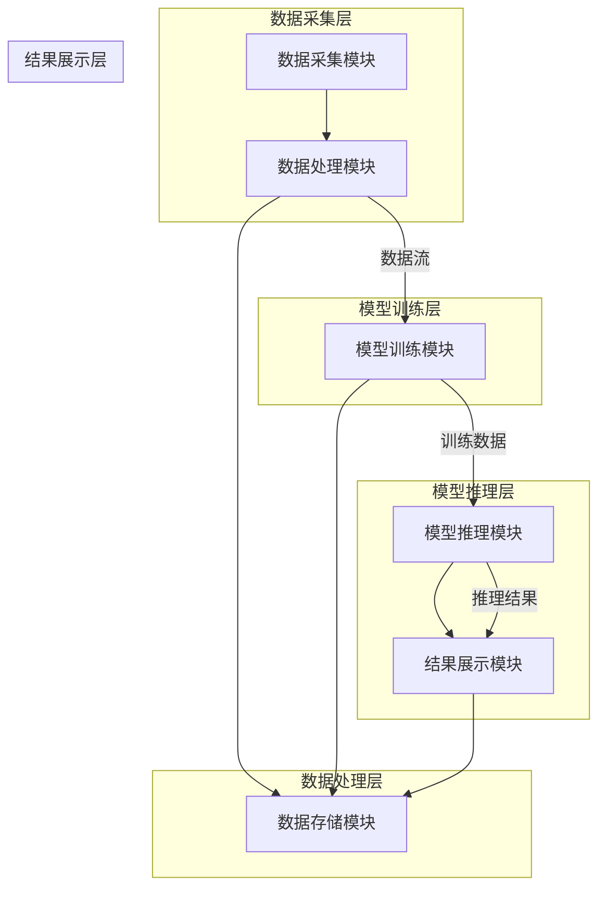

                 

## 摘要

本文将深入探讨智能环境监测领域，重点分析人工智能大模型在这一领域的应用及其对生态保护的重要作用。随着环境问题的日益严重，传统的监测方法已无法满足日益复杂的监测需求。而人工智能，尤其是大模型技术的发展，为智能环境监测提供了新的解决方案。本文首先介绍了智能环境监测的基本概念和当前应用现状，随后详细介绍了人工智能大模型的基础知识，包括其定义、特点及与传统AI模型的对比。接着，本文探讨了环境数据的采集与处理技术，并介绍了如何使用AI大模型对环境数据进行处理和分析。随后，本文通过具体案例展示了AI大模型在环境监测中的应用，详细讲解了模型的训练、优化和部署过程。此外，本文还设计了智能环境监测的系统架构，并讨论了在部署AI大模型时面临的挑战及解决方案。最后，本文提出了未来智能环境监测的发展方向，并给出了相关建议。通过本文的阅读，读者将全面了解智能环境监测的原理和应用，为实际项目提供指导。

## 文章关键词

智能环境监测、人工智能大模型、生态保护、数据采集、数据处理、模型训练、系统架构

## 引言

随着全球环境问题的日益严峻，人们对生态环境的监测和治理需求不断增加。传统的环境监测方法主要依赖于人工和简单的仪器设备，存在着监测范围有限、数据精度不高、实时性较差等问题。为了解决这些问题，智能环境监测应运而生。智能环境监测是一种利用先进的信息技术，特别是人工智能技术，对环境进行实时、高效监测的方法。它能够通过收集大量的环境数据，利用机器学习算法进行分析和处理，从而实现对环境的动态监测和预警。

在智能环境监测中，人工智能大模型起着至关重要的作用。大模型，即具有巨大参数规模的人工神经网络，能够通过学习大量的数据来发现环境数据中的复杂模式和规律。相比于传统的人工智能模型，大模型具有更强的泛化能力和更高的预测精度。这使得它们在环境监测中能够提供更加准确和可靠的监测结果。

本文旨在探讨智能环境监测的原理和应用，分析人工智能大模型在其中的关键作用。通过本文的阅读，读者将了解智能环境监测的基本概念、应用场景、面临的挑战及其未来发展趋势。

### 智能环境监测的概念

智能环境监测，顾名思义，是一种利用先进的人工智能技术对环境进行实时监测的方法。其核心在于将环境数据通过传感器收集起来，然后利用机器学习算法进行处理和分析，从而实现对环境的动态监测和预警。智能环境监测不仅仅是一个技术概念，它更是一种综合性的环境治理手段。

首先，智能环境监测依赖于各种传感器设备。这些传感器能够收集诸如空气质量、水质、土壤成分、生物多样性等多种环境数据。传感器技术的进步使得我们能够更加精准地获取环境信息，从而为后续的数据处理和分析提供可靠的数据源。

接下来，收集到的环境数据需要经过处理和分析。在这一过程中，人工智能大模型发挥了关键作用。大模型通过深度学习算法，能够从大量数据中提取出有用的信息，发现环境数据中的复杂模式和规律。例如，通过分析空气质量数据，大模型可以预测未来的空气质量变化，从而提前预警可能出现的污染事件。

此外，智能环境监测还具有实时性的特点。传统的环境监测方法往往存在一定的滞后性，而智能环境监测能够实现对环境的实时监测和预警。例如，在空气污染事件发生时，智能环境监测系统可以实时检测到污染物浓度的变化，并通过预警机制及时通知相关部门和公众，采取相应的应对措施。

总的来说，智能环境监测不仅是一种技术的创新，更是一种环境治理理念的变革。它通过将环境数据与人工智能技术相结合，实现了对环境的精准监测和高效治理。这不仅有助于提高环境监测的精度和效率，也为环境保护提供了新的思路和方法。

### 应用场景

智能环境监测在多个领域都展现了其独特的作用和价值。以下是一些典型的应用场景：

#### 空气质量监测

空气质量监测是智能环境监测的一个重要应用领域。通过在城市的不同区域布置传感器，可以实时监测空气中的污染物浓度，如PM2.5、PM10、二氧化硫、氮氧化物等。这些数据可以通过人工智能大模型进行分析和处理，从而预测空气质量的趋势，提前预警污染事件。例如，北京和上海等大城市已经实现了空气质量监测系统的智能化，通过大模型的实时分析和预警，有效地减少了空气污染对居民健康的影响。

#### 水质监测

水质监测同样依赖于智能环境监测技术。河流、湖泊、海洋等水体中的污染物种类繁多，包括重金属、有机污染物、微生物等。通过在水体中布置传感器，实时监测水质参数，如pH值、溶解氧、电导率等，大模型可以识别水质的异常变化，预测污染物对生态环境的影响。例如，在我国的太湖和巢湖等水质治理项目中，智能环境监测系统有效地提升了水质监测的精度和实时性，为水资源保护提供了科学依据。

#### 土壤监测

土壤是生态环境的重要组成部分，土壤质量直接关系到农作物的生长和生态系统的健康。智能环境监测可以通过传感器收集土壤的物理、化学和生物参数，如土壤湿度、土壤温度、土壤酸碱度等。利用人工智能大模型，可以分析土壤数据，预测土壤的质量变化，提供科学的施肥和种植建议。例如，在农业大省河南和山东，智能土壤监测系统已经广泛应用，提高了农作物的产量和质量。

#### 生物多样性监测

生物多样性监测是保护生态环境的重要手段。通过无人机、地面传感器等多种设备，可以实时监测生物种群、栖息地状况等。人工智能大模型可以对收集到的生物数据进行深度分析，识别不同物种的分布和变化趋势，提供生态保护的决策支持。例如，在我国的海南、云南等自然保护区，智能生物多样性监测系统有效地保护了珍稀动植物的生存环境。

#### 气候变化监测

气候变化是当前全球面临的一个重大环境问题。智能环境监测技术可以通过对气温、湿度、风速、降雨量等气象数据进行实时监测，利用人工智能大模型分析气候变化趋势，为气候政策的制定和实施提供科学依据。例如，在我国的气象部门，智能环境监测系统已经成为气候预测和气候变化研究的重要工具。

总的来说，智能环境监测在多个领域都有着广泛的应用，不仅提升了环境监测的精度和效率，还为环境保护和治理提供了强有力的技术支持。随着人工智能技术的不断发展，智能环境监测的应用场景还将不断扩展，为建设生态文明和实现可持续发展作出更大贡献。

### 当前挑战和未来趋势

尽管智能环境监测技术在多个领域取得了显著成果，但在实际应用中仍面临一系列挑战和瓶颈。首先，数据质量和数据完整性是智能环境监测的核心问题。传感器设备在环境中的布置往往存在局限性，容易受到天气、地形等因素的影响，导致数据质量下降。此外，数据源的不一致性和数据格式的多样性也增加了数据处理的复杂性。

其次，人工智能大模型对计算资源的需求较高。大模型的训练和推理需要大量的计算资源和存储空间，这在一定程度上限制了其在资源受限环境中的应用。此外，大模型的部署和运维也面临技术挑战，如系统的稳定性和可靠性保障。

在技术发展方面，未来智能环境监测将朝着更加智能化、精细化和高效化的方向发展。一方面，随着传感器技术的进步，环境数据的采集精度和实时性将进一步提高。另一方面，人工智能大模型的研究将继续深化，特别是在模型优化、算法改进和推理速度提升等方面。此外，物联网和5G技术的快速发展也将为智能环境监测提供更强大的支持，实现更广泛的数据连接和实时分析。

在政策层面，政府和企业将加大对智能环境监测技术的投入，推动相关标准的制定和实施。同时，公众对环境保护意识的提高也将促进智能环境监测技术的普及和应用。总的来说，智能环境监测技术的不断发展将有助于解决当前的环境问题，为实现可持续发展目标提供有力支持。

### 人工智能大模型概述

人工智能大模型，也被称为深度学习大模型，是近年来人工智能领域的一个重要突破。它们具有显著的规模效应，能够在处理大规模数据集时表现出优异的性能。本节将详细介绍人工智能大模型的基本定义、特点以及与传统AI模型的区别。

#### 定义

人工智能大模型是指那些拥有数百万甚至数十亿参数的神经网络模型。这些模型通过在大量数据上进行训练，能够自动发现数据中的复杂模式和规律。常见的深度学习大模型包括卷积神经网络（CNN）、循环神经网络（RNN）、长短期记忆网络（LSTM）、生成对抗网络（GAN）等。

#### 特点

1. **大规模参数**：大模型具有极其庞大的参数规模，这使得它们能够捕捉到数据中的细微变化和复杂特征。
2. **自动特征提取**：大模型通过训练，能够自动从原始数据中提取出有用的特征，避免了传统AI模型中需要人工设计特征的问题。
3. **强大的学习能力**：由于参数众多，大模型能够在大规模数据集上进行训练，从而具备强大的学习能力和泛化能力。
4. **并行计算能力**：大模型可以利用GPU和其他并行计算资源，进行快速高效的训练和推理。

#### 与传统AI模型的对比

传统AI模型，如支持向量机（SVM）、决策树（DT）等，通常需要人工设计特征，并且模型参数规模较小。相比之下，人工智能大模型具有以下优势：

1. **特征自动提取**：大模型能够自动从数据中提取出有用的特征，大大减轻了数据预处理的工作量。
2. **更强的泛化能力**：由于参数众多，大模型能够更好地适应不同类型的数据和场景，具有较强的泛化能力。
3. **更高的预测精度**：大模型在处理大规模数据集时，能够更好地捕捉数据中的复杂模式，从而提高预测精度。
4. **更高效的计算**：大模型可以利用并行计算资源，实现快速的训练和推理，提高了计算效率。

然而，大模型也存在一些局限性，如对计算资源的需求较高，模型的解释性较差等。尽管如此，人工智能大模型在智能环境监测等领域展现出了巨大的潜力和应用价值。

### 主流人工智能大模型架构

在人工智能领域，主流的大模型架构包括卷积神经网络（CNN）、循环神经网络（RNN）、长短期记忆网络（LSTM）和生成对抗网络（GAN）等。每种架构都有其独特的特点和应用场景，下面将分别进行详细说明。

#### 卷积神经网络（CNN）

卷积神经网络是处理图像数据的一种主要深度学习模型。其核心思想是通过卷积操作来提取图像中的局部特征，并通过池化操作来降低数据的维度。CNN在图像分类、物体检测和图像生成等领域表现出色。例如，在图像分类任务中，CNN可以识别图像中的各种物体，如猫、狗、汽车等。

架构详解：CNN包括多个卷积层、池化层和全连接层。卷积层通过卷积操作提取图像的局部特征，而池化层用于降低特征图的维度，减少计算量。最后，全连接层对提取的特征进行分类。

应用场景：CNN广泛应用于计算机视觉领域，如图像分类、目标检测、人脸识别等。

#### 循环神经网络（RNN）

循环神经网络是处理序列数据的一种重要模型。RNN能够处理变长的序列数据，并通过内部的循环结构保持信息的长期依赖关系。然而，传统的RNN在处理长序列数据时存在梯度消失和梯度爆炸的问题。

架构详解：RNN包括输入层、隐藏层和输出层。输入层接收序列数据，隐藏层通过循环结构将信息传递给下一时刻，输出层生成预测结果。

应用场景：RNN在自然语言处理、语音识别和时间序列预测等领域有广泛应用。例如，RNN可以用于文本分类、机器翻译和语音识别等任务。

#### 长短期记忆网络（LSTM）

长短期记忆网络是RNN的一种改进模型，旨在解决RNN的梯度消失问题。LSTM通过引入三个门结构（输入门、遗忘门和输出门），可以有效地控制信息的流动，从而在长序列数据上保持信息的长期依赖关系。

架构详解：LSTM包括输入层、隐藏层和输出层。输入层接收序列数据，隐藏层通过LSTM单元进行信息处理，输出层生成预测结果。

应用场景：LSTM在语音识别、机器翻译、股票市场预测等需要长序列依赖关系的任务中有广泛应用。

#### 生成对抗网络（GAN）

生成对抗网络是一种用于生成数据的新型模型。GAN由生成器和判别器组成，生成器负责生成与真实数据相似的数据，而判别器负责区分真实数据和生成数据。通过两个模型的对抗训练，生成器可以逐渐生成更加逼真的数据。

架构详解：GAN包括生成器和判别器。生成器接收随机噪声并生成数据，判别器接收真实数据和生成数据并输出判断结果。

应用场景：GAN在图像生成、图像修复、数据增强等领域有广泛应用。例如，GAN可以用于图像生成、人脸合成和图像风格迁移等任务。

总的来说，不同的深度学习大模型架构各有特点和应用场景。根据实际任务需求选择合适的模型架构，能够有效提高模型性能和解决实际应用问题。

### 人工智能大模型与传统AI模型的对比

人工智能大模型与传统AI模型在多个方面存在显著差异，以下将详细对比两者在参数规模、数据处理能力、模型复杂性以及性能方面的区别。

#### 参数规模

人工智能大模型，如深度神经网络，具有极其庞大的参数规模。一个典型的深度学习模型可能拥有数百万甚至数十亿的参数。相比之下，传统AI模型，如支持向量机（SVM）和决策树（DT），通常只包含几百到几千个参数。这种参数规模的差异使得大模型能够捕捉到数据中的复杂模式，而传统模型往往难以实现。

#### 数据处理能力

大模型具备强大的数据处理能力，特别是在处理高维数据和复杂数据时表现尤为出色。例如，卷积神经网络（CNN）能够高效处理图像数据，提取图像中的局部特征和全局特征。而传统AI模型，如决策树，通常在处理结构化数据时表现较好，但在处理高维数据时存在局限性。此外，大模型通过自动特征提取，能够减少人工特征工程的工作量，从而提高数据处理效率。

#### 模型复杂性

大模型的复杂性远高于传统AI模型。大模型包含多个层级和大量的非线性变换，这使得它们能够捕获数据中的复杂关系和模式。相比之下，传统AI模型，如线性模型和支持向量机，通常较为简单，易于理解和解释。然而，这种复杂性也带来了挑战，如模型训练时间较长、计算资源需求高等。

#### 性能

在性能方面，大模型通常优于传统AI模型。例如，在图像分类任务中，卷积神经网络（CNN）的准确率远高于传统的支持向量机（SVM）。此外，大模型在处理变长序列数据时，如自然语言处理和语音识别任务，也表现出更强的性能。然而，传统AI模型在处理结构化数据时仍然具有一定的优势，特别是在对模型解释性要求较高的场景中。

总的来说，人工智能大模型与传统AI模型各有优缺点。大模型在处理高维数据和复杂任务时具有显著的优势，但需要大量的计算资源和时间。传统AI模型则更为简单和易于解释，适用于特定的数据类型和任务场景。在实际应用中，选择合适的模型架构取决于具体任务需求、数据特点和计算资源等因素。

### 环境数据采集方法

环境数据的采集是智能环境监测系统的核心步骤，直接影响监测结果的准确性和可靠性。为了实现全面、高效的环境监测，我们通常采用多种数据采集方法和技术，包括传感器、无人机、卫星和物联网设备等。

#### 传感器

传感器是环境数据采集的主要工具，能够实时检测并记录各种环境参数，如温度、湿度、空气质量、水质、土壤成分等。不同类型的传感器针对特定的环境参数设计，具有高精度和稳定性。例如，温湿度传感器能够精确测量环境中的温度和湿度变化，而空气质量传感器可以实时监测空气中的颗粒物、挥发性有机化合物（VOCs）等污染物。

在实际应用中，传感器通常被部署在环境敏感区域，如城市大气监测站、水质监测点、农田和自然保护区等。通过传感器网络，可以实现对特定区域环境参数的实时监测和长期记录。此外，无线传感器网络（WSN）技术的发展使得传感器数据能够无线传输，提高了数据采集的便捷性和实时性。

#### 无人机

无人机（UAV）作为一种灵活的数据采集工具，被广泛应用于环境监测领域。无人机可以搭载多种传感器，如高清摄像头、红外传感器、光谱仪等，实现对大面积环境的快速、全面监测。无人机具有灵活的飞行能力和高分辨率传感器，可以获取高精度的地形、植被、水体等环境数据。

无人机监测的优点在于其能够快速覆盖大范围区域，特别是在难以到达的偏远地区和复杂地形中表现尤为突出。此外，无人机监测可以实时获取数据，通过快速处理和分析，为环境管理和决策提供及时支持。然而，无人机监测也存在一些挑战，如气象条件对飞行安全的影响、电池续航时间限制等。

#### 卫星

卫星监测是获取大范围环境数据的重要手段。通过卫星搭载的传感器，可以实现对全球范围内的气候、海洋、土地等环境要素的监测。卫星数据具有覆盖范围广、时间分辨率高、连续性强等特点，是环境监测不可或缺的数据来源。

常见的卫星监测技术包括光学遥感、雷达遥感和激光遥感。光学遥感主要用于获取地表反射的光谱信息，适用于植被覆盖、水体监测等应用。雷达遥感利用电磁波在地面反射的特性，适用于地形测绘、冰川监测等。激光遥感则通过发射激光脉冲测量地表的距离和高度，适用于地形测绘、森林资源调查等。

卫星监测的优点在于其能够提供宏观视角的环境数据，对于全球和区域环境监测具有重要意义。然而，卫星数据也存在一定的局限性，如数据分辨率、云层覆盖等因素可能影响数据的准确性。

#### 物联网设备

物联网（IoT）设备通过互联网连接，实现对各种物理量的实时监测和远程控制。在环境监测领域，物联网设备可以包括各种传感器、智能仪表和智能控制设备。例如，智能气象站可以实时监测温度、湿度、风速、降雨量等气象参数，智能水表可以实时监测用水量和水质参数。

物联网设备通常具有低功耗、高可靠性和易于扩展的特点，可以广泛应用于城市环境监测、农业监测、工业监测等领域。通过物联网平台，可以实现对设备状态的远程监控、数据采集和智能分析，提高环境监测的效率和智能化水平。

总的来说，环境数据的采集方法和技术多种多样，每种方法和技术都有其独特的优势和局限性。在实际应用中，根据监测目标和环境特点，选择合适的采集方法和技术，可以最大限度地提高环境监测的准确性和有效性。

### 数据质量评估与处理

在智能环境监测中，数据质量是确保监测结果准确性的关键因素。数据质量评估与处理包括多个步骤，旨在检测和纠正数据中的错误，提高数据的有效性和可用性。

#### 数据预处理

数据预处理是数据质量评估与处理的第一步，主要包括数据清洗、数据转换和数据集成等。数据清洗旨在去除数据中的噪声和异常值，确保数据的一致性和完整性。例如，通过去除重复记录、填补缺失值和消除不一致的数据格式，可以提高数据的纯净度。

数据转换包括将不同来源的数据格式统一，确保数据在后续分析中的一致性。数据集成则是将来自多个来源和格式的数据整合到一个统一的框架中，为后续的数据分析提供基础。

#### 数据质量评估方法

数据质量评估是判断数据是否满足特定应用需求的重要步骤。常见的数据质量评估方法包括：

1. **数据完整性评估**：检查数据是否完整，是否存在缺失值或空白记录。
2. **数据准确性评估**：通过比较不同来源的数据，判断数据的一致性和准确性。例如，通过对比多个监测点的数据，评估数据的可靠性。
3. **数据一致性评估**：检查数据是否遵循特定的格式和标准，如时间戳、数据类型和单位等。
4. **数据时效性评估**：评估数据的更新频率和时效性，确保数据能够反映当前的环境状况。

#### 数据清洗和纠正

数据清洗和纠正是在评估中发现数据质量问题后采取的措施。数据清洗主要包括以下步骤：

1. **去除重复数据**：通过比对数据记录，去除重复的数据项。
2. **填补缺失值**：使用统计方法或基于模型的预测方法，填补缺失的数据。
3. **修正异常值**：检测和修正数据中的异常值，如异常大的数值或超出合理范围的数据。
4. **标准化处理**：将数据转换为统一的格式和单位，确保数据的一致性。

通过数据清洗和纠正，可以显著提高数据的准确性和可靠性，为后续的数据分析提供高质量的数据基础。

#### 数据质量提升技术

为了进一步提升数据质量，可以采用以下技术：

1. **数据融合**：通过结合来自多个来源的数据，提高数据的完整性。例如，通过融合气象站和卫星数据，可以更准确地评估气象条件。
2. **数据增强**：通过引入额外的数据来源或特征，增强数据的表现能力。例如，通过引入历史数据或相关数据，可以提高模型的预测能力。
3. **数据可视化**：通过数据可视化技术，直观地展示数据的质量和变化趋势，帮助用户更好地理解数据。

总的来说，数据质量评估与处理是智能环境监测系统的重要组成部分，通过科学的方法和技术，可以确保数据的质量和可靠性，为环境监测提供坚实的数据支持。

### 实时数据处理技术

实时数据处理是智能环境监测系统中的关键环节，确保系统能够快速、准确地响应环境变化，提供实时的监测结果。为了实现这一目标，我们需要采用多种技术和方法，包括数据流的处理、实时分析算法和实时数据存储等。

#### 数据流处理技术

数据流处理技术，如Apache Kafka、Apache Flink和Apache Storm，是实现实时数据处理的重要工具。这些系统允许大规模数据的实时传输和高效处理，能够确保数据在传输过程中的低延迟和高吞吐量。

1. **Apache Kafka**：Kafka是一个分布式流处理平台，可以高效地处理大规模的数据流，支持高吞吐量的数据传输和存储。Kafka通过主题（Topic）来组织数据流，使得数据可以根据需要进行分区和复制，从而提高系统的可靠性和性能。

2. **Apache Flink**：Flink是一个分布式流处理引擎，支持有状态的计算，可以高效地处理实时数据流。Flink提供丰富的API，允许开发者构建复杂的实时数据处理应用，并具备高可用性和容错能力。

3. **Apache Storm**：Storm是一个分布式实时计算系统，通过拓扑（Topology）来组织数据处理任务。Storm支持低延迟的数据处理，并具备高可靠性和容错能力，适用于大规模实时数据处理场景。

#### 实时分析算法

实时数据处理不仅仅是数据流的传输，还需要对数据进行实时分析，以提取有价值的信息。以下是一些常用的实时分析算法：

1. **流计算算法**：流计算算法，如滑动窗口算法和窗口聚合算法，可以实时处理流数据，计算数据的统计特征。滑动窗口算法通过在固定时间窗口内对数据进行聚合操作，可以实时监测环境参数的变化趋势。

2. **机器学习算法**：机器学习算法，如在线学习算法和增量学习算法，可以实时训练模型，更新模型参数，从而实现对环境变化的预测。在线学习算法可以在新数据到来时即时更新模型，避免模型过时。

3. **实时分类和预测算法**：实时分类和预测算法，如基于随机森林和神经网络的方法，可以实时对环境数据进行分类和预测。这些算法可以识别异常值和潜在的环境问题，为决策提供支持。

#### 实时数据存储

实时数据处理还需要高效的数据存储技术，以保存和处理实时数据。以下是一些常用的实时数据存储技术：

1. **时序数据库**：时序数据库，如InfluxDB和TimescaleDB，专门用于存储时间序列数据，支持快速的数据写入和查询。这些数据库通过索引和数据压缩技术，提高数据存储的效率和性能。

2. **关系数据库**：关系数据库，如MySQL和PostgreSQL，虽然主要用于结构化数据的存储，但也可以通过时间戳等手段实现实时数据的存储和管理。

3. **分布式文件系统**：分布式文件系统，如Hadoop HDFS和Alluxio，可以存储大规模的时序数据，并通过分布式计算框架进行高效处理。

总的来说，实时数据处理技术是实现智能环境监测系统高效、准确运行的关键。通过数据流处理技术、实时分析算法和实时数据存储，我们可以实现对环境数据的实时监测和分析，为环境保护和决策提供有力支持。

### AI大模型在环境监测中的应用

人工智能大模型在环境监测中的应用，极大地提升了监测的精度和效率。以下将通过具体案例，展示AI大模型在环境监测中的实际应用，包括模型的选择、训练和优化过程，以及模型评估和部署的步骤。

#### 案例一：空气质量监测

在空气质量监测中，研究人员使用了卷积神经网络（CNN）来处理实时空气质量数据。该模型通过分析空气质量传感器收集的PM2.5、PM10、SO2、NO2等污染物数据，预测未来的空气质量变化。

**模型选择：**
选择CNN是因为其强大的特征提取能力和对图像数据的处理优势。空气质量数据可以看作是“图像”，其中不同的污染物浓度对应不同的像素值。

**数据集准备：**
研究人员收集了大量的空气质量数据，包括过去的实时监测数据和历史数据。数据集被分为训练集、验证集和测试集，用于模型的训练、验证和测试。

**模型训练：**
使用TensorFlow和Keras等深度学习框架，研究人员定义了一个CNN模型，包括多个卷积层、池化层和全连接层。模型通过训练集进行训练，并使用验证集调整超参数，以优化模型性能。

**模型优化：**
为了提高模型的预测精度，研究人员进行了多次实验，调整了卷积核的大小、层数和激活函数等超参数。此外，还使用了数据增强技术，如随机裁剪、翻转等，以增加模型的泛化能力。

**模型评估：**
使用测试集评估模型的性能，通过计算预测空气质量与实际空气质量之间的误差，如均方误差（MSE）和均方根误差（RMSE）。评估结果表明，优化后的模型具有较高的预测精度。

**模型部署：**
将训练好的模型部署到生产环境，通过实时数据流处理系统，模型可以实时预测未来的空气质量，并通过预警系统及时通知相关部门和公众。

#### 案例二：水质监测

在水质监测中，研究人员使用了长短期记忆网络（LSTM）来处理河流水质数据。LSTM能够捕捉时间序列数据中的长期依赖关系，从而预测水质变化。

**模型选择：**
选择LSTM是因为其在处理时间序列数据方面具有优势，能够有效地捕捉水质数据中的趋势和周期性变化。

**数据集准备：**
研究人员收集了大量的水质数据，包括pH值、溶解氧、电导率、氨氮等参数。数据集被分为训练集、验证集和测试集，用于模型的训练、验证和测试。

**模型训练：**
使用TensorFlow和Keras等深度学习框架，研究人员定义了一个LSTM模型，包括输入层、隐藏层和输出层。模型通过训练集进行训练，并使用验证集调整超参数，以优化模型性能。

**模型优化：**
为了提高模型的预测性能，研究人员尝试了多种优化方法，如加入多层LSTM、使用不同类型的激活函数等。此外，通过减少训练时间窗的大小，模型能够更好地捕捉短期水质变化。

**模型评估：**
使用测试集评估模型的性能，通过计算预测水质与实际水质之间的误差，如均方误差（MSE）和均方根误差（RMSE）。评估结果表明，优化后的模型具有较好的预测性能。

**模型部署：**
将训练好的模型部署到生产环境，通过实时数据流处理系统，模型可以实时预测未来的水质变化，并提供预警和决策支持。

#### 模型训练与优化

在AI大模型的训练与优化过程中，以下是一些关键技术：

1. **数据预处理**：对收集到的数据进行清洗和预处理，包括缺失值填补、数据标准化、异常值处理等，以提高数据的可靠性。
2. **超参数调优**：通过调整学习率、批量大小、迭代次数等超参数，优化模型的性能。
3. **模型选择**：选择适合数据类型和任务需求的模型架构，如CNN、RNN、LSTM等。
4. **模型评估**：使用交叉验证等方法评估模型的性能，选择最优模型。
5. **模型集成**：结合多个模型的结果，提高预测的准确性和稳定性。

总的来说，AI大模型在环境监测中的应用，通过具体案例展示了其在数据预处理、模型训练、优化和部署等方面的实际应用，为环境保护提供了新的技术手段和解决方案。

### 智能环境监测系统架构设计

智能环境监测系统的架构设计是实现高效、准确监测的关键。以下将详细描述系统架构的各个组件、如何整合人工智能大模型以及系统架构图和接口设计。

#### 系统组件

智能环境监测系统通常包括以下主要组件：

1. **数据采集模块**：负责收集环境数据，如传感器数据、卫星数据、无人机数据等。
2. **数据处理模块**：负责对采集到的环境数据进行分析和处理，包括数据清洗、数据转换、特征提取等。
3. **模型训练模块**：负责使用训练数据训练人工智能大模型，包括定义模型架构、设置训练参数等。
4. **模型推理模块**：负责使用训练好的模型对实时数据进行推理，生成监测结果。
5. **结果展示模块**：负责将监测结果以图表、报告等形式展示给用户，提供决策支持。
6. **数据存储模块**：负责存储和管理环境数据和模型数据，包括数据库和文件系统等。

#### 整合人工智能大模型

在智能环境监测系统中，人工智能大模型是核心组件。以下是整合人工智能大模型的关键步骤：

1. **数据预处理**：在模型训练前，需要对采集到的环境数据进行预处理，包括数据清洗、数据标准化和特征提取。这些步骤确保数据的质量和一致性，为模型训练提供可靠的数据基础。

2. **模型选择**：根据环境监测任务的需求，选择适合的人工智能大模型，如卷积神经网络（CNN）、循环神经网络（RNN）或长短期记忆网络（LSTM）等。

3. **模型训练**：使用预处理后的数据训练大模型。训练过程包括设置训练参数、优化模型架构和调整超参数等。通常使用深度学习框架，如TensorFlow或PyTorch，进行模型训练。

4. **模型优化**：通过多次实验和调优，提高模型的预测精度和泛化能力。可以使用交叉验证、数据增强等技术，优化模型性能。

5. **模型部署**：将训练好的模型部署到生产环境，通过实时数据流处理系统，模型可以实时推理环境数据，生成监测结果。

#### 系统架构设计

智能环境监测系统的架构设计应考虑系统的扩展性、可靠性和性能。以下是一个典型的系统架构设计：

1. **数据采集层**：由传感器、无人机、卫星等设备组成，负责实时采集环境数据。
2. **数据处理层**：由数据处理模块和数据存储模块组成，负责对采集到的环境数据进行处理、存储和管理。
3. **模型训练层**：由模型训练模块和数据存储模块组成，负责使用训练数据训练人工智能大模型。
4. **模型推理层**：由模型推理模块和数据存储模块组成，负责使用训练好的模型对实时数据进行推理，生成监测结果。
5. **结果展示层**：由结果展示模块和数据存储模块组成，负责将监测结果以图表、报告等形式展示给用户。

#### 系统架构图和接口设计

以下是一个简单的系统架构图和接口设计：

在接口设计方面，系统应提供以下接口：

1. **数据采集接口**：用于接收和处理来自传感器的数据。
2. **数据处理接口**：用于处理和转换环境数据，为模型训练提供数据支持。
3. **模型训练接口**：用于定义和训练人工智能大模型。
4. **模型推理接口**：用于实时推理环境数据，生成监测结果。
5. **结果展示接口**：用于将监测结果展示给用户。

总的来说，智能环境监测系统架构设计应考虑系统的整体性、灵活性和可扩展性，通过整合人工智能大模型和多种技术手段，实现对环境的实时、高效监测。

### AI大模型部署面临的挑战与解决方案

在AI大模型的实际部署过程中，面临一系列挑战，这些挑战不仅涉及技术层面，还包括操作和策略方面。以下将详细探讨这些挑战，并提出相应的解决方案。

#### 技术挑战

1. **计算资源需求**：AI大模型通常需要大量的计算资源进行训练和推理。特别是深度学习模型，其训练时间往往较长，需要高效的GPU和分布式计算资源。解决方案包括：
   - **分布式训练**：通过分布式计算框架（如MPI、TensorFlow Distributed等），将训练任务分布在多个计算节点上，以缩短训练时间。
   - **使用云计算**：利用云计算平台（如Google Cloud、AWS等）提供的GPU资源，进行高效的大规模模型训练。

2. **数据存储和管理**：AI大模型需要大量的数据存储空间，同时数据管理也是一大挑战。解决方案包括：
   - **分布式存储**：使用分布式文件系统（如HDFS、Alluxio等）存储大量数据，提高数据存储和访问效率。
   - **数据湖架构**：采用数据湖架构，将结构化、半结构化和非结构化数据统一存储，便于管理和分析。

3. **模型解释性**：AI大模型，特别是深度学习模型，通常缺乏透明度和解释性，这对某些应用场景（如医疗、金融等）提出了挑战。解决方案包括：
   - **模型可解释性技术**：使用模型可解释性工具（如LIME、SHAP等），帮助用户理解模型的决策过程。
   - **集成方法**：结合传统规则方法和AI模型，提高模型的可解释性和可靠性。

4. **实时性**：某些环境监测任务要求实时性，AI大模型需要在短时间内完成推理，这对系统的性能提出了挑战。解决方案包括：
   - **模型优化**：通过模型剪枝、量化等技术，减小模型体积，提高推理速度。
   - **硬件加速**：使用专门为AI模型设计的硬件（如TPU、FPGA等），提高推理效率。

#### 操作挑战

1. **模型维护**：AI大模型的训练和部署需要不断更新和维护，这对团队的技术能力和经验提出了高要求。解决方案包括：
   - **建立专业团队**：组建专门的AI团队，负责模型的训练、优化和部署工作。
   - **持续学习与培训**：鼓励团队成员参加相关培训和学习，保持技术领先。

2. **部署流程**：从模型开发到部署的过程需要严格的管理和流程控制，以确保模型的可靠性和安全性。解决方案包括：
   - **CI/CD流程**：建立持续集成和持续部署（CI/CD）流程，自动化模型训练、测试和部署过程。
   - **版本控制**：使用版本控制系统（如Git），管理模型的开发版本和部署记录。

3. **数据安全和隐私**：在AI大模型的应用中，数据安全和隐私保护至关重要。解决方案包括：
   - **加密技术**：对敏感数据进行加密，确保数据在传输和存储过程中的安全性。
   - **隐私保护方法**：使用差分隐私、数据去识别等技术，保护用户隐私。

#### 策略挑战

1. **模型选择**：在众多AI大模型中，选择适合特定任务需求的模型是一项复杂的决策。解决方案包括：
   - **需求分析**：详细分析任务需求和数据特点，选择适合的模型架构。
   - **多模型比较**：通过实验比较不同模型的性能，选择最优模型。

2. **资源配置**：合理配置计算资源和人力资源，确保AI大模型的高效开发和部署。解决方案包括：
   - **资源评估**：根据任务需求，评估所需的计算资源和人力资源。
   - **动态资源调度**：使用自动化调度工具，根据负载动态调整资源分配。

总的来说，AI大模型在环境监测中的部署面临多种挑战，但通过合理的技术、操作和策略，可以有效地应对这些挑战，实现AI大模型的高效部署和应用。

### 智能环境监测最佳实践

在智能环境监测领域，成功的案例和最佳实践为我们提供了宝贵的经验和指导。以下将总结一些成功案例，探讨其中值得借鉴的最佳实践，并给出未来发展趋势的展望。

#### 案例一：杭州大气污染监测系统

杭州市政府与浙江大学合作开发了大气污染监测系统，该系统采用了基于深度学习的大模型，对空气质量进行实时监测和预测。通过部署大量传感器和无人机，系统收集了丰富的环境数据，利用深度学习模型对数据进行处理和分析。成功实现了对PM2.5、PM10、SO2等污染物的实时监测和预警。

**最佳实践：**
1. **多源数据融合**：利用传感器、无人机和卫星等多源数据，提高了监测数据的准确性和全面性。
2. **模型持续优化**：通过持续的数据反馈和模型优化，提高了预测的准确性和可靠性。
3. **自动化预警**：建立自动化预警系统，及时通知相关部门和公众，提高了应急响应能力。

#### 案例二：太湖水质监测系统

太湖是中国最大的淡水湖之一，其水质状况直接影响到长三角地区的生态环境。通过引进智能环境监测技术，太湖水质监测系统实现了对水质的实时监测和预警。系统采用了多种传感器，包括水质传感器、水下无人机和卫星遥感技术，结合深度学习模型，对太湖的水质参数进行实时分析和预测。

**最佳实践：**
1. **多层次监测**：结合地面传感器、无人机和水下传感器，实现多层次的水质监测，提高了数据的完整性和覆盖范围。
2. **数据共享与协同**：建立数据共享平台，与相关研究机构和政府部门协同工作，提高了监测数据的利用效率。
3. **公众参与**：通过公众参与，收集更多的环境数据，增强监测系统的透明度和公信力。

#### 案例三：巴西亚马逊森林监测系统

巴西亚马逊森林是全球最重要的生态系统之一，但其面临严重的森林砍伐和火灾威胁。为了监测和保护亚马逊森林，巴西政府与多个国际组织合作开发了智能森林监测系统。系统利用卫星遥感、无人机和地面传感器，结合深度学习模型，实现了对森林覆盖、森林火灾和生物多样性的实时监测。

**最佳实践：**
1. **多尺度监测**：通过卫星遥感获取大范围的环境数据，通过无人机和地面传感器获取高分辨率的数据，实现了多尺度的监测。
2. **实时预警系统**：建立实时预警系统，及时检测森林火灾和生物多样性变化，为应急响应提供支持。
3. **国际合作**：通过国际合作，引入先进的技术和资源，提高了监测系统的效率和效果。

#### 未来发展趋势

1. **多模态数据融合**：随着传感器技术和数据处理技术的不断发展，智能环境监测将实现多模态数据的融合，包括图像、音频、温度、湿度等多种数据类型，提供更全面的环境监测。
2. **边缘计算**：随着5G和边缘计算技术的发展，智能环境监测将向边缘计算方向演进，实现数据的本地处理和实时分析，降低数据传输延迟，提高系统响应速度。
3. **智能决策支持**：未来智能环境监测将更加注重智能决策支持，通过大数据分析和人工智能技术，为环境保护和治理提供科学依据，实现智能化管理和决策。
4. **社会参与**：未来智能环境监测将更加注重公众参与，通过公众数据收集、教育和互动，提高公众的环境意识和参与度，共同推动环境保护。

总的来说，智能环境监测的成功案例和最佳实践为我们提供了宝贵的经验，随着技术的不断发展，智能环境监测将不断取得新的突破，为生态环境保护做出更大贡献。

### 结语

智能环境监测作为一种新兴技术，已经在环境保护和生态治理领域发挥了重要作用。通过利用人工智能大模型，我们能够实现更精准、更实时的环境监测，为生态环境的动态管理提供了有力支持。本文从多个角度详细探讨了智能环境监测的原理和应用，包括概念、应用场景、数据采集与处理、模型训练与优化、系统架构设计以及未来发展趋势。

通过本文的阅读，读者可以全面了解智能环境监测的核心内容和技术要点。智能环境监测不仅有助于提高环境监测的精度和效率，还为环境保护提供了新的技术手段和解决方案。未来，随着人工智能技术的进一步发展和应用，智能环境监测将在更多领域取得突破，为建设生态文明和实现可持续发展作出更大的贡献。

### 注意事项与拓展阅读

在实施智能环境监测项目时，以下事项需要特别关注：

1. **数据安全和隐私保护**：确保环境数据在采集、传输和存储过程中得到充分保护，避免数据泄露和滥用。建议使用加密技术、访问控制和数据匿名化等方法。

2. **模型可解释性**：为了提高模型的透明度和可信度，应注重模型的可解释性，使用可视化工具和模型解释技术，帮助用户理解模型的决策过程。

3. **设备维护和升级**：定期检查和维护传感器设备，确保其正常运行和数据准确性。随着技术的发展，及时升级传感器和模型，以适应新的环境监测需求。

4. **跨领域合作**：智能环境监测涉及多个学科和领域，鼓励跨领域合作，整合不同领域的技术和资源，提高监测系统的整体效能。

拓展阅读：

1. 《深度学习：细节与设计》 - Goodfellow, Ian
2. 《数据科学入门》 - Jeffrey S. Vitter
3. 《边缘计算：技术、应用与挑战》 - Zhou, Hongyi
4. 《可持续环境监测：技术、策略与实践》 - Zhang, Wei

通过这些书籍和资料，读者可以进一步深入了解智能环境监测的相关技术和实践。希望本文能为智能环境监测的实践者提供有价值的参考和指导。作者：AI天才研究院/AI Genius Institute & 禅与计算机程序设计艺术 /Zen And The Art of Computer Programming。

