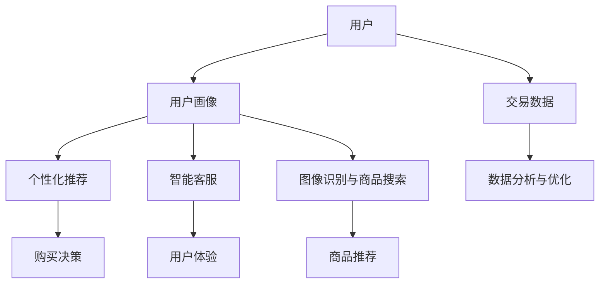
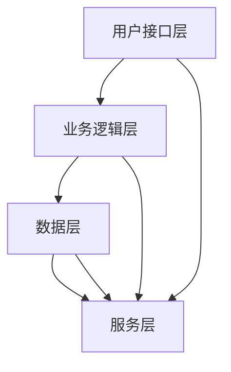

                 

### 智能电子商务平台：AI个性化购物体验

#### 关键词：
- 智能电子商务平台
- AI个性化购物体验
- 用户画像
- 个性化推荐
- 自然语言处理
- 图像识别

#### 摘要：
本文将深入探讨智能电子商务平台的核心技术，特别是如何利用人工智能（AI）来实现个性化的购物体验。我们将从智能电子商务平台的概念、核心技术、实现与部署、案例分析以及未来发展趋势等方面进行详细分析，旨在为读者提供全面的技术见解和实用指南。

----------------------------------------------------------------

## 目录大纲设计

### 第一部分：智能电子商务平台概述

### 第1章：智能电子商务平台的概念与历史
- 1.1 智能电子商务平台的定义
- 1.2 智能电子商务平台的发展历史
- 1.3 智能电子商务平台的重要性

### 第2章：人工智能与电子商务的结合
- 2.1 人工智能的基本概念
- 2.2 人工智能在电子商务中的应用
- 2.3 人工智能技术的最新趋势

### 第二部分：智能电子商务平台的核心技术

### 第3章：用户画像与个性化推荐
- 3.1 用户画像的概念
- 3.2 用户画像的技术实现
- 3.3 个性化推荐系统的设计与实现

### 第4章：自然语言处理与智能客服
- 4.1 自然语言处理的基本原理
- 4.2 智能客服系统的架构
- 4.3 智能客服的关键技术

### 第5章：图像识别与商品搜索
- 5.1 图像识别的基本概念
- 5.2 商品搜索系统的设计与实现
- 5.3 图像识别技术在电子商务中的应用

### 第三部分：智能电子商务平台的实现与部署

### 第6章：智能电子商务平台的开发框架
- 6.1 开发框架的选择
- 6.2 平台架构的设计
- 6.3 数据库与存储方案的选择

### 第7章：智能电子商务平台的安全与隐私保护
- 7.1 平台安全的重要性
- 7.2 隐私保护的法律法规
- 7.3 安全防护措施与实施

### 第四部分：案例研究

### 第8章：成功智能电子商务平台的案例分析
- 8.1 案例一：淘宝的个性化推荐系统
- 8.2 案例二：亚马逊的智能客服系统
- 8.3 案例三：京东的商品搜索与图像识别

### 第9章：智能电子商务平台的未来发展趋势
- 9.1 技术发展趋势
- 9.2 市场发展趋势
- 9.3 智能电子商务平台的未来展望

### 第五部分：附录

### 第10章：技术资源与工具推荐
- 10.1 人工智能开发工具
- 10.2 自然语言处理工具
- 10.3 图像识别工具

#### 核心概念与联系
为了帮助读者更好地理解本书中的核心概念和它们之间的关系，我们使用Mermaid流程图来展示智能电子商务平台的关键组成部分和它们之间的相互作用。



#### 核心算法原理讲解
在本章节中，我们将使用Python源代码详细阐述用户画像与个性化推荐的核心算法原理。

### 2.1 用户画像算法

```python
import pandas as pd
from sklearn.cluster import KMeans

# 示例数据
data = pd.DataFrame({
    'age': [25, 30, 35, 40, 45],
    'income': [50000, 60000, 70000, 80000, 90000],
    'education': [12, 16, 18, 16, 20]
})

# K-Means聚类
kmeans = KMeans(n_clusters=3, random_state=0).fit(data)

# 获取用户画像
user_profiles = kmeans.predict(data)

print(user_profiles)
```

### 2.2 个性化推荐算法

```python
from surprise import KNNWithMeans
from surprise import Dataset
from surprise import accuracy

# 示例数据
data = Dataset.load_from_df(pd.DataFrame({
    'user_id': [1, 1, 2, 2, 3, 3],
    'item_id': [101, 102, 101, 102, 103, 103],
    'rating': [5, 3, 4, 2, 5, 5]
}))

# KNN算法
algo = KNNWithMeans(k=)
```

----------------------------------------------------------------

## 总体结构

### 1. 概念与术语

#### 智能电子商务平台
智能电子商务平台是指利用人工智能技术，为用户提供个性化购物体验和服务的在线购物平台。它集成了多种人工智能算法和技术，如用户画像、个性化推荐、自然语言处理、图像识别等，以提高用户的购物效率和满意度。

#### 人工智能
人工智能（AI）是指计算机系统模拟人类智能行为的技术，包括学习、推理、规划、感知、自然语言理解和问题解决等。在电子商务领域，人工智能主要用于个性化推荐、智能客服、图像识别等。

#### 用户画像
用户画像是指基于用户的行为数据、购买记录、浏览历史等信息，对用户进行画像分析，以了解用户的需求和行为模式。

#### 个性化推荐
个性化推荐是指根据用户的历史行为和偏好，向用户推荐其可能感兴趣的商品或服务。

#### 自然语言处理
自然语言处理（NLP）是指计算机处理和理解人类语言的技术，包括文本分类、情感分析、机器翻译等。

#### 图像识别
图像识别是指通过计算机算法识别和分类图像中的对象或场景的技术。

### 2. 问题描述

#### 背景
随着互联网的普及和电子商务的快速发展，用户对购物体验的要求越来越高。传统的电子商务平台已无法满足用户个性化的需求，因此，智能电子商务平台应运而生。

#### 问题
如何利用人工智能技术，为用户提供个性化的购物体验和服务，提高购物效率和满意度？

### 3. 问题解决

#### 核心技术
- 用户画像：通过对用户的行为数据进行分析，建立用户画像，了解用户的需求和行为模式。
- 个性化推荐：根据用户画像，为用户推荐其可能感兴趣的商品或服务。
- 智能客服：利用自然语言处理技术，实现与用户的智能对话，提供个性化的购物建议和服务。
- 图像识别：通过图像识别技术，实现商品的搜索和推荐。

#### 实现方案
- 构建用户画像系统：收集用户的行为数据，使用机器学习算法进行用户画像分析。
- 构建个性化推荐系统：使用协同过滤、矩阵分解等算法，为用户推荐商品。
- 构建智能客服系统：使用自然语言处理技术，实现与用户的智能对话。
- 构建图像识别系统：使用卷积神经网络等深度学习技术，实现商品的搜索和推荐。

### 4. 边界与外延

#### 边界
- 智能电子商务平台的技术范畴：包括用户画像、个性化推荐、自然语言处理、图像识别等。
- 平台的功能范围：包括购物、搜索、推荐、客服等。

#### 外延
- 智能电子商务平台的业务拓展：包括智能家居、智能物流、智能支付等。

### 5. 概念结构与核心要素组成

#### 概念结构
- 智能电子商务平台：由用户画像、个性化推荐、智能客服、图像识别等核心组件组成。
- 用户画像：由用户行为数据、购买记录、浏览历史等组成。
- 个性化推荐：由用户画像、商品信息、推荐算法等组成。
- 智能客服：由自然语言处理、对话系统、服务接口等组成。
- 图像识别：由图像处理、识别算法、商品数据库等组成。

#### 核心要素组成
- 用户画像：用户行为数据、购买记录、浏览历史等。
- 个性化推荐：用户画像、商品信息、推荐算法等。
- 智能客服：自然语言处理、对话系统、服务接口等。
- 图像识别：图像处理、识别算法、商品数据库等。

----------------------------------------------------------------

## 智能电子商务平台的概念与历史

### 1.1 智能电子商务平台的定义

智能电子商务平台是一种集成了人工智能技术的在线购物平台，它通过数据分析和算法，为用户提供个性化的购物体验和服务。与传统电子商务平台相比，智能电子商务平台更加注重用户需求的挖掘和个性化推荐的实现，旨在提高用户的购物效率和满意度。

### 1.2 智能电子商务平台的发展历史

智能电子商务平台的发展可以分为三个阶段：

#### 1. 传统电子商务阶段
在互联网的初期，电子商务主要以信息展示和交易为主，平台功能相对简单。用户通过访问电子商务网站，浏览商品信息，进行在线购物。这一阶段，电子商务平台的主要任务是实现商品信息的展示和交易流程的简化。

#### 2. 社交电子商务阶段
随着社交网络的兴起，电子商务平台开始融入社交元素，用户可以分享购物经验、评价商品，与朋友互动。这一阶段，电子商务平台的主要任务是提高用户的社交体验，增强用户之间的互动和信任。

#### 3. 智能电子商务阶段
近年来，随着人工智能技术的快速发展，电子商务平台开始利用人工智能技术，为用户提供个性化的购物体验。智能电子商务平台通过数据分析和算法，挖掘用户需求，实现个性化推荐、智能客服、图像识别等功能。这一阶段，电子商务平台的主要任务是提高用户的购物效率和满意度。

### 1.3 智能电子商务平台的重要性

智能电子商务平台的重要性体现在以下几个方面：

#### 1. 提高购物效率
智能电子商务平台通过个性化推荐、智能客服等技术，为用户提供了更加便捷和高效的购物体验。用户可以根据个性化推荐，快速找到自己感兴趣的商品，节省了浏览和筛选的时间。

#### 2. 提高用户满意度
智能电子商务平台通过智能客服、图像识别等技术，为用户提供个性化的购物建议和服务。用户在购物过程中，可以享受更加贴心和专业的服务，提高了购物满意度。

#### 3. 降低运营成本
智能电子商务平台通过自动化和智能化的技术，降低了运营成本。例如，通过个性化推荐，可以减少广告投放成本；通过智能客服，可以降低客服人员的数量和成本。

#### 4. 促进业务创新
智能电子商务平台为电子商务企业提供了新的业务模式和创新空间。例如，通过图像识别技术，可以实现商品的自动识别和推荐，拓展了商品搜索和推荐的范围；通过自然语言处理技术，可以实现智能客服，提升了用户体验和服务质量。

### 1.4 智能电子商务平台的技术架构

智能电子商务平台的技术架构可以分为以下几个层次：

#### 1. 数据采集与处理层
该层负责收集用户行为数据、商品信息等数据，并进行数据处理和分析，为后续的智能服务提供数据支持。

#### 2. 数据存储与挖掘层
该层负责存储用户行为数据、商品信息等数据，并使用数据挖掘算法，提取用户需求和行为模式。

#### 3. 个性化推荐层
该层基于用户画像和商品信息，使用推荐算法，为用户推荐个性化商品。

#### 4. 智能客服层
该层使用自然语言处理技术，实现与用户的智能对话，提供个性化的购物建议和服务。

#### 5. 图像识别层
该层使用图像识别技术，实现商品的自动识别和推荐。

#### 6. 用户界面层
该层提供用户与智能电子商务平台的交互界面，用户可以通过该界面浏览商品、下单、咨询等。

### 1.5 智能电子商务平台的未来发展趋势

智能电子商务平台的发展将受到以下几个方面的影响：

#### 1. 人工智能技术的进步
随着人工智能技术的不断进步，智能电子商务平台将更加智能化，为用户提供更加个性化的购物体验和服务。

#### 2. 数据挖掘与数据分析
随着数据量的不断增加，智能电子商务平台将更加注重数据挖掘与数据分析，从海量数据中提取有价值的信息，为用户和商家提供决策支持。

#### 3. 物联网与智能家居
智能电子商务平台将逐渐与物联网和智能家居相结合，为用户提供更加便捷的购物体验和服务。

#### 4. 新零售与线上线下融合
智能电子商务平台将推动新零售的发展，实现线上线下数据的互通，为用户提供无缝的购物体验。

#### 5. 安全与隐私保护
随着智能电子商务平台的普及，用户数据和隐私安全问题将得到更多的关注，智能电子商务平台将加强安全与隐私保护措施。

### 总结

智能电子商务平台是一种利用人工智能技术为用户提供个性化购物体验和服务的在线购物平台。它的发展历史经历了传统电子商务、社交电子商务和智能电子商务三个阶段。智能电子商务平台的重要性体现在提高购物效率、提高用户满意度、降低运营成本和促进业务创新等方面。未来，智能电子商务平台将受到人工智能技术进步、数据挖掘与数据分析、物联网与智能家居、新零售与线上线下融合和安全与隐私保护等因素的影响，为用户提供更加智能化、便捷化和个性化的购物体验。

----------------------------------------------------------------

## 人工智能与电子商务的结合

### 2.1 人工智能的基本概念

人工智能（AI，Artificial Intelligence）是指计算机系统模拟人类智能行为的技术，包括学习、推理、规划、感知、自然语言理解和问题解决等。人工智能技术起源于20世纪50年代，随着计算能力的提升和算法的创新，人工智能逐渐从理论研究走向实际应用。

#### AI的主要类型

1. **基于规则的系统**：通过预定义的规则来模拟人类决策过程。
2. **机器学习**：通过数据训练模型，让计算机自动从数据中学习规律和模式。
3. **深度学习**：一种特殊的机器学习方法，通过多层神经网络模拟人类大脑的学习过程。
4. **自然语言处理（NLP）**：使计算机能够理解、生成和回应人类语言。
5. **计算机视觉**：使计算机能够解释和理解视觉信息。
6. **机器人学**：研究如何构建和编程机器人，使其能够执行复杂的任务。

### 2.2 人工智能在电子商务中的应用

人工智能在电子商务中的应用主要体现在以下几个方面：

#### 1. 个性化推荐

通过分析用户的历史行为和偏好，人工智能可以推荐用户可能感兴趣的商品。这种个性化推荐不仅提高了用户购物的满意度，也显著提升了电商平台的销售额。

#### 2. 智能客服

利用自然语言处理和机器学习技术，人工智能可以模拟人类客服，自动回答用户的问题，提供购物建议和解决方案，从而提高客户服务质量，降低运营成本。

#### 3. 智能搜索

通过计算机视觉和图像识别技术，用户可以通过上传图片来搜索商品，或者通过自然语言输入来获取相关信息。这种智能搜索提升了用户体验，使得购物更加便捷。

#### 4. 风险控制

人工智能可以分析交易数据，识别潜在的欺诈行为，从而提高交易的安全性。

#### 5. 库存管理

利用机器学习算法，电商平台可以预测商品的销售趋势，优化库存管理，减少库存积压，提高运营效率。

### 2.3 人工智能技术的最新趋势

人工智能技术的发展呈现出以下趋势：

#### 1. 深度学习

深度学习在图像识别、语音识别、自然语言处理等领域取得了重大突破，继续成为人工智能研究的热点。

#### 2. 强化学习

强化学习在游戏、机器人控制等领域表现出色，正逐渐应用于电子商务的个性化推荐、智能客服等领域。

#### 3. 生成对抗网络（GAN）

生成对抗网络通过两个神经网络（生成器和判别器）的博弈，可以生成高质量的数据，应用于虚拟商品设计、个性化推荐等领域。

#### 4. 小样本学习

小样本学习关注在数据量较少的情况下，如何有效训练模型，这对于电子商务的个性化推荐和智能搜索具有重要意义。

#### 5. 联邦学习

联邦学习通过将数据保留在本地设备上，利用模型聚合方法实现模型训练，保护用户隐私，适用于涉及敏感数据的场景。

### 2.4 人工智能在电子商务中的实际应用案例

#### 1. 个性化推荐系统

亚马逊、淘宝等电商平台通过用户历史行为数据，使用协同过滤、基于内容的推荐和基于模型的推荐等方法，实现了高效的个性化推荐。

#### 2. 智能客服

亚马逊的Alexa、京东的Jasper等智能语音助手，通过自然语言处理技术，为用户提供智能客服服务。

#### 3. 智能搜索

谷歌搜索引擎使用深度学习模型，实现智能搜索，提供更加准确的搜索结果。

#### 4. 风险控制

PayPal等支付平台使用人工智能技术，监控交易行为，识别欺诈行为。

#### 5. 库存管理

沃尔玛等大型零售商使用机器学习算法，预测商品需求，优化库存管理。

### 总结

人工智能与电子商务的结合，不仅提升了用户体验，也推动了电子商务的发展。通过个性化推荐、智能客服、智能搜索等技术，人工智能为电商平台提供了强大的工具，使其能够更好地满足用户需求，提高运营效率。随着人工智能技术的不断进步，电子商务领域的智能化程度将进一步提高，为用户带来更加便捷和个性化的购物体验。

----------------------------------------------------------------

## 用户画像与个性化推荐

### 3.1 用户画像的概念

用户画像（User Profiling）是指通过对用户行为数据、社交数据、购买历史等多种数据的分析，构建出用户的全貌，以了解用户的需求和行为模式。用户画像的核心是提取用户特征，并通过这些特征对用户进行分类或聚类，从而实现个性化的推荐和服务。

#### 用户画像的基本要素

1. **基础信息**：如年龄、性别、职业、教育背景等。
2. **行为数据**：如浏览历史、购买记录、点击率、搜索关键词等。
3. **社交数据**：如社交网络活动、评论、点赞等。
4. **兴趣偏好**：如喜欢的商品类别、品牌、风格等。
5. **消费能力**：如收入水平、消费频率、消费金额等。

### 3.2 用户画像的技术实现

用户画像的技术实现主要依赖于数据采集、数据处理和数据建模。

#### 1. 数据采集

数据采集是构建用户画像的第一步，包括以下几个方面：

- **在线行为数据**：通过用户浏览、搜索、购买等行为，采集用户的行为数据。
- **线下行为数据**：通过会员卡、优惠券、线下促销活动等，采集用户的线下行为数据。
- **第三方数据**：通过合作伙伴、社交媒体等，获取用户相关的第三方数据。

#### 2. 数据处理

数据处理包括数据清洗、数据整合和数据存储。

- **数据清洗**：去除重复、错误和无关的数据，保证数据的质量。
- **数据整合**：将不同来源、不同格式的数据整合成统一的格式，便于后续分析。
- **数据存储**：将处理后的数据存储到数据库或数据仓库中，以供分析和挖掘。

#### 3. 数据建模

数据建模是用户画像的核心步骤，通过建立用户特征模型，提取用户的关键特征。

- **特征提取**：根据用户画像的需求，提取用户的关键特征，如兴趣偏好、消费能力等。
- **特征工程**：对提取的特征进行预处理，如归一化、离散化等，以提高模型的性能。
- **模型训练**：使用机器学习算法，如K-Means聚类、决策树等，对用户特征进行建模。

### 3.3 个性化推荐系统的设计与实现

个性化推荐系统（Personalized Recommendation System）是基于用户画像，为用户提供个性化商品推荐的服务。其核心目标是提高用户的购物满意度和转化率。

#### 1. 推荐算法

个性化推荐系统常用的算法包括：

- **协同过滤**：基于用户行为数据，找到相似用户或商品，进行推荐。
- **基于内容的推荐**：基于用户的历史行为和商品特征，进行内容匹配推荐。
- **混合推荐**：结合协同过滤和基于内容的推荐，提高推荐效果。

#### 2. 推荐流程

个性化推荐系统的推荐流程主要包括以下几个步骤：

- **用户画像构建**：通过用户行为数据、社交数据等，构建用户的画像。
- **商品特征提取**：提取商品的关键特征，如类别、品牌、价格等。
- **推荐算法选择**：根据业务需求和数据特点，选择合适的推荐算法。
- **推荐结果生成**：根据用户画像和商品特征，生成个性化的推荐结果。
- **推荐结果展示**：将推荐结果以合适的形式展示给用户，如推荐列表、推荐页面等。

#### 3. 推荐效果评估

推荐效果评估是衡量个性化推荐系统性能的重要指标，常用的评估方法包括：

- **精确率（Precision）**：推荐的商品中，有多少是用户真正感兴趣的。
- **召回率（Recall）**：用户真正感兴趣的商品中，有多少被推荐出来。
- **F1值（F1 Score）**：精确率和召回率的平衡指标。

### 3.4 用户画像与个性化推荐的关系

用户画像和个性化推荐是智能电子商务平台的核心技术，它们之间的关系如下：

- **用户画像**：是构建个性化推荐的基础，通过用户画像，了解用户的需求和行为模式。
- **个性化推荐**：是基于用户画像，为用户推荐其感兴趣的商品或服务，提高用户的购物满意度和转化率。

#### 1. 用户画像的准确性直接影响推荐效果

用户画像的准确性决定了个性化推荐的精准度。如果用户画像不准确，推荐结果就会偏离用户真实需求，降低用户的购物体验。

#### 2. 个性化推荐反馈优化用户画像

个性化推荐的反馈，如用户的点击、购买等行为，可以用来优化用户画像，提高其准确性。通过不断迭代用户画像，实现更加精准的个性化推荐。

### 3.5 用户画像与个性化推荐的案例分析

#### 1. 淘宝的个性化推荐系统

淘宝的个性化推荐系统通过用户画像和协同过滤算法，为用户提供个性化的商品推荐。淘宝的用户画像包括用户的行为数据、浏览历史、购买记录等，通过对这些数据的分析，构建用户的兴趣偏好和需求模型。

#### 2. 亚马逊的个性化推荐系统

亚马逊的个性化推荐系统使用基于内容的推荐和协同过滤相结合的方法，为用户提供个性化的商品推荐。亚马逊的用户画像包括用户的历史购买记录、浏览历史、搜索记录等，通过分析这些数据，构建用户的兴趣模型和购买模型。

### 总结

用户画像和个性化推荐是智能电子商务平台的核心技术，通过构建用户画像，了解用户的需求和行为模式，再通过个性化推荐，为用户推荐其感兴趣的商品或服务。用户画像的准确性直接影响推荐效果，而个性化推荐反馈又可以优化用户画像，实现更加精准的推荐。未来，随着人工智能技术的发展，用户画像和个性化推荐技术将不断成熟，为用户提供更加智能化、个性化的购物体验。

----------------------------------------------------------------

## 自然语言处理与智能客服

### 4.1 自然语言处理的基本原理

自然语言处理（Natural Language Processing，NLP）是人工智能领域的一个重要分支，旨在使计算机能够理解、生成和回应人类语言。NLP的基本原理包括以下几个方面：

#### 1. 语言模型

语言模型（Language Model）是NLP的核心，它用于预测下一个单词或句子。常见的语言模型有基于统计的N-gram模型和基于神经网络的深度学习模型（如循环神经网络RNN、长短时记忆网络LSTM、变换器BERT等）。

#### 2. 词嵌入

词嵌入（Word Embedding）是将单词映射到高维空间中的向量表示，使得计算机能够理解单词之间的语义关系。Word2Vec、GloVe等算法常用于词嵌入。

#### 3. 词性标注

词性标注（Part-of-Speech Tagging）是对文本中的每个单词进行词性分类，如名词、动词、形容词等。词性标注有助于理解句子的语法结构和语义。

#### 4. 分词

分词（Tokenization）是将连续的文本分割成有意义的词或短语。中文分词、英文词句分割等都是NLP中的常见任务。

#### 5. 情感分析

情感分析（Sentiment Analysis）是判断文本中表达的情感倾向，如正面、负面或中性。常用的方法有基于规则的分类、基于机器学习的分类等。

### 4.2 智能客服系统的架构

智能客服系统（Intelligent Customer Service System）是利用NLP技术，实现与用户的智能对话，提供个性化服务和解决问题的系统。智能客服系统的架构通常包括以下几个部分：

#### 1. 用户接口层

用户接口层（User Interface Layer）是用户与智能客服系统交互的入口，包括网页、移动应用、语音助手等。

#### 2. 自然语言处理层

自然语言处理层（NLP Layer）是智能客服系统的核心，负责处理用户的输入，包括文本和语音。该层包括分词、词性标注、情感分析等模块。

#### 3. 知识库层

知识库层（Knowledge Base Layer）是存储常见问题和标准答案的地方。智能客服系统可以通过查询知识库来快速回答用户的问题。

#### 4. 对话管理层

对话管理层（Dialogue Management Layer）负责控制对话的流程，包括意图识别、对话生成、对话跟踪等。

#### 5. 语音识别与合成层

语音识别与合成层（Voice Recognition and Synthesis Layer）负责处理用户的语音输入和输出，使得智能客服系统能够通过语音与用户交互。

### 4.3 智能客服的关键技术

智能客服系统的实现依赖于多种关键技术，包括文本和语音处理、对话管理和知识库管理等。

#### 1. 文本处理

文本处理（Text Processing）包括分词、词性标注、实体识别等，用于理解用户的文本输入。

- **分词**：将文本分割成有意义的词或短语。
- **词性标注**：对文本中的每个单词进行词性分类。
- **实体识别**：识别文本中的关键实体，如人名、地名、组织名等。

#### 2. 语音处理

语音处理（Voice Processing）包括语音识别、语音合成、语音增强等，用于处理用户的语音输入和输出。

- **语音识别**：将语音信号转换为文本。
- **语音合成**：将文本转换为语音信号。
- **语音增强**：提高语音质量，去除背景噪音等。

#### 3. 对话管理

对话管理（Dialogue Management）包括意图识别、对话生成、对话跟踪等，用于控制对话的流程。

- **意图识别**：识别用户的需求和意图。
- **对话生成**：生成自然、流畅的对话回复。
- **对话跟踪**：跟踪对话的状态和上下文，确保对话的连贯性。

#### 4. 知识库管理

知识库管理（Knowledge Base Management）包括知识库的构建、更新和维护，用于提供问题的标准答案。

- **知识库构建**：收集常见问题和答案，构建知识库。
- **知识库更新**：定期更新知识库，确保答案的准确性和时效性。
- **知识库维护**：维护知识库的完整性，去除错误和不准确的信息。

### 4.4 智能客服的实际应用案例

#### 1. 谷歌助手（Google Assistant）

谷歌助手是谷歌推出的一款智能语音助手，通过NLP技术，实现与用户的智能对话。用户可以通过语音命令查询天气、设置提醒、发送消息等。

#### 2. 聊天机器人（Chatbot）

许多电商平台和客户服务部门使用聊天机器人，通过NLP技术，自动回答用户的问题，提供购物建议和解决方案。例如，阿里巴巴的天猫客服机器人。

#### 3. 语音助手（Voice Assistant）

亚马逊的Alexa、苹果的Siri等智能语音助手，通过语音识别和自然语言处理技术，为用户提供智能服务。

### 总结

自然语言处理和智能客服是智能电子商务平台的重要组成部分，通过NLP技术，智能客服系统能够理解用户的意图，提供个性化的服务和解决方案。未来，随着NLP技术的不断进步，智能客服将更加智能化，为用户提供更加便捷和高效的购物体验。

----------------------------------------------------------------

## 图像识别与商品搜索

### 5.1 图像识别的基本概念

图像识别（Image Recognition）是指计算机通过算法，从图像中识别并分类出特定的对象、场景或内容。它广泛应用于电子商务、医疗、安全监控、自动驾驶等多个领域。

#### 图像识别的主要任务

- **对象检测**：识别图像中的对象，并定位其位置。
- **图像分类**：将图像归入预定义的类别。
- **图像分割**：将图像分割成不同的区域，每个区域代表一个对象或场景。
- **图像增强**：改善图像质量，使其更容易被识别。

### 5.2 商品搜索系统的设计与实现

商品搜索系统是电子商务平台的重要组成部分，通过图像识别技术，用户可以上传图片或输入关键词，快速找到心仪的商品。

#### 1. 系统架构设计

商品搜索系统的架构设计包括以下几个层次：

- **用户界面层**：提供用户上传图片和查看搜索结果的界面。
- **图像处理层**：接收用户上传的图片，进行预处理和特征提取。
- **图像识别层**：使用深度学习模型，对图像进行对象检测和分类。
- **商品数据库层**：存储商品的信息，包括图片、名称、描述等。
- **搜索结果处理层**：根据用户上传的图片或关键词，从商品数据库中检索出符合条件的商品。

#### 2. 实现流程

商品搜索系统的实现流程如下：

- **用户上传图片**：用户通过用户界面层上传图片。
- **图像预处理**：图像处理层对上传的图片进行去噪、增强等预处理。
- **特征提取**：图像识别层使用卷积神经网络（CNN）等深度学习模型，提取图像的特征向量。
- **对象检测与分类**：图像识别层使用预训练的模型，对图像进行对象检测和分类，识别出图像中的商品。
- **搜索结果生成**：搜索结果处理层根据识别出的商品，从商品数据库中检索出相关的商品信息，并生成搜索结果。
- **用户查看搜索结果**：用户通过用户界面层查看搜索结果，并可选择查看详细信息或直接下单。

### 5.3 图像识别技术在电子商务中的应用

图像识别技术在电子商务中具有广泛的应用，包括以下几个方面：

#### 1. 商品搜索

通过图像识别技术，用户可以上传图片，系统自动识别图片中的商品，并提供搜索结果，大大提高了购物体验。

#### 2. 商品推荐

系统可以根据用户的浏览历史和购买记录，结合图像识别技术，为用户推荐类似的商品，提高用户的购买意愿。

#### 3. 商品防伪

通过图像识别技术，系统可以识别商品的真伪，保障消费者的权益。

#### 4. 库存管理

通过图像识别技术，系统可以自动识别货架上的商品，实现自动化的库存管理。

### 5.4 图像识别技术的挑战与展望

图像识别技术在电子商务中的应用虽然取得了显著成果，但也面临一些挑战：

#### 1. 数据质量和标注

高质量的图像数据是图像识别系统的基础。然而，获取高质量的图像数据和进行准确的标注是一项艰巨的任务。

#### 2. 多样性与泛化能力

电子商务平台上的商品种类繁多，图像识别系统需要具备较强的多样性和泛化能力，以适应不同的商品和场景。

#### 3. 实时性与效率

在电子商务的快速交易环境中，图像识别系统需要具备实时性和高效率，以满足用户快速获取商品信息的需求。

展望未来，图像识别技术将在电子商务领域发挥更加重要的作用，随着深度学习技术的不断进步，图像识别系统的准确性和效率将得到进一步提升，为用户提供更加智能、便捷的购物体验。

### 总结

图像识别技术在电子商务中具有重要的应用价值，通过图像识别技术，用户可以更方便地进行商品搜索、商品推荐等操作，提高了购物体验。未来，随着技术的不断进步，图像识别技术在电子商务中的应用将更加广泛和深入，为用户提供更加智能化、个性化的服务。

----------------------------------------------------------------

## 智能电子商务平台的实现与部署

### 6.1 开发框架的选择

在实现智能电子商务平台时，选择合适的开发框架至关重要。以下是一些常用的开发框架及其特点：

#### 1. Spring Boot

Spring Boot 是一个基于 Spring 的开源框架，它简化了新 Spring 应用的初始搭建和开发过程。Spring Boot 提供了丰富的功能，如自动配置、嵌入式服务器、监控和管理等。此外，Spring Boot 支持多种数据库、消息中间件和缓存技术，便于项目的快速开发和部署。

#### 2. Django

Django 是一个高层次的 Python Web 框架，遵循 MVC 设计模式。Django 强调快速开发和代码的优雅性，提供了自动化的表单处理、用户认证、权限管理等功能。Django 还具有强大的 ORM（对象关系映射）功能，方便数据库操作。

#### 3. Flask

Flask 是一个轻量级的 Python Web 框架，提供了灵活的组件组合，适合构建小型到中型的 Web 应用。Flask 的核心是轻量级和可扩展性，用户可以根据项目需求添加插件和扩展功能。

#### 4. Node.js

Node.js 是一个基于 Chrome V8 引擎的 JavaScript 运行时，适用于构建高并发、高容量的 Web 应用。Node.js 支持多种编程语言，如 JavaScript、Python、Java 等，通过使用 Express.js 等框架，可以快速开发高性能的 Web 应用。

#### 5. React

React 是一个用于构建用户界面的 JavaScript 库，提供了声明式的设计范式。React 通过虚拟 DOM 提供了高效的渲染性能，方便开发者构建动态、交互式的 Web 应用。React 还支持组件化开发，提高了代码的可维护性和复用性。

#### 6. Vue.js

Vue.js 是一个用于构建用户界面的 JavaScript 框架，提供了简洁的 API 和响应式数据绑定。Vue.js 的核心库只关注视图层，易于与其他库或框架集成。Vue.js 支持组件化开发，提供了丰富的指令和工具，方便开发者快速构建高质量的用户界面。

### 6.2 平台架构的设计

智能电子商务平台的架构设计需要综合考虑性能、可扩展性、可靠性和安全性等因素。以下是一个典型的智能电子商务平台架构设计：

#### 1. 层次结构

智能电子商务平台通常采用三层架构，包括表示层、业务逻辑层和数据层。

- **表示层**：负责与用户交互，提供用户界面。表示层可以使用前端框架（如 React、Vue.js）构建，提供响应式和交互式的用户体验。
- **业务逻辑层**：实现智能电子商务平台的业务功能，包括用户画像、个性化推荐、智能客服、图像识别等。业务逻辑层可以使用 Spring Boot、Django 等框架开发。
- **数据层**：负责数据的存储、查询和管理。数据层可以使用关系型数据库（如 MySQL、PostgreSQL）或 NoSQL 数据库（如 MongoDB、Redis）。

#### 2. 数据库设计

数据库设计是智能电子商务平台架构设计的关键部分，需要考虑数据的一致性、完整性和扩展性。以下是一个简单的数据库设计示例：

- **用户表**：存储用户的基本信息，如用户 ID、姓名、年龄、性别等。
- **商品表**：存储商品的信息，如商品 ID、名称、价格、描述等。
- **购物车表**：存储用户的购物车信息，如用户 ID、商品 ID、数量等。
- **订单表**：存储用户的订单信息，如订单 ID、用户 ID、商品 ID、数量、金额等。

#### 3. 系统接口设计

智能电子商务平台需要提供多种接口，以便与其他系统进行数据交互。以下是一些常见的接口设计：

- **用户接口**：用于用户注册、登录、个人信息管理等功能。
- **商品接口**：用于查询商品信息、添加商品到购物车、下单等功能。
- **推荐接口**：用于获取个性化推荐商品、推荐列表等功能。
- **智能客服接口**：用于实现与用户的智能对话、提供购物建议等功能。

#### 4. 系统交互

智能电子商务平台中的各个组件需要协同工作，实现系统的高效运行。以下是一个简单的系统交互设计：

- **用户访问网站**：用户通过浏览器访问智能电子商务平台，浏览商品、添加商品到购物车等。
- **后台处理**：系统根据用户的操作，调用相应的业务逻辑进行处理，如查询商品信息、生成订单等。
- **数据库操作**：系统与数据库进行交互，存储和查询用户、商品、订单等数据。
- **前端渲染**：系统将处理结果返回给前端，前端根据处理结果更新用户界面。

### 6.3 数据库与存储方案的选择

数据库与存储方案的选择对智能电子商务平台的性能和数据安全至关重要。以下是一些常见的选择方案：

#### 1. 关系型数据库

关系型数据库（如 MySQL、PostgreSQL）适用于存储结构化数据，支持 SQL 查询语言，便于数据的查询和管理。关系型数据库具有数据一致性和事务支持等优点，但扩展性相对较低。

#### 2. NoSQL 数据库

NoSQL 数据库（如 MongoDB、Redis）适用于存储非结构化或半结构化数据，支持灵活的数据模型和高效的数据读写性能。NoSQL 数据库具有高扩展性和高性能等优点，但数据一致性和事务支持相对较弱。

#### 3. 分布式存储系统

分布式存储系统（如 Hadoop、Cassandra）适用于处理大规模数据，提供高可用性和高性能的数据存储和处理能力。分布式存储系统通过数据分片和复制，实现数据的横向扩展。

#### 4. 云存储服务

云存储服务（如 AWS S3、Azure Blob Storage）提供便捷的数据存储和管理功能，适用于大规模数据的存储和访问。云存储服务具有弹性扩展、数据冗余备份和高可用性等优点。

### 6.4 性能优化与安全防护

在实现智能电子商务平台时，性能优化与安全防护是两个重要方面。

#### 1. 性能优化

- **缓存**：使用缓存技术（如 Redis、Memcached）减少数据库查询次数，提高系统响应速度。
- **分库分表**：将数据分库分表，减少单表数据量，提高数据库查询性能。
- **负载均衡**：使用负载均衡器（如 Nginx、HAProxy）实现分布式部署，提高系统处理能力。

#### 2. 安全防护

- **数据加密**：对用户数据和敏感信息进行加密存储，防止数据泄露。
- **访问控制**：使用访问控制列表（ACL）和权限控制，确保数据的访问安全。
- **安全审计**：定期进行安全审计，检查系统漏洞和安全隐患。

### 总结

智能电子商务平台的实现与部署需要综合考虑开发框架、平台架构、数据库与存储方案、性能优化和安全防护等多个方面。通过合理的设计和优化，可以实现高效、可靠和安全的智能电子商务平台，为用户提供优质的购物体验。

----------------------------------------------------------------

## 智能电子商务平台的安全与隐私保护

### 7.1 平台安全的重要性

在智能电子商务平台的运营过程中，安全性是至关重要的。一个安全的平台不仅能保护用户的数据隐私，还能增强用户对平台的信任，从而提升用户满意度和忠诚度。以下是一些智能电子商务平台安全的重要性：

#### 1. 用户数据保护
智能电子商务平台存储了大量的用户个人信息，如姓名、地址、电话号码、电子邮箱等。这些数据如果遭到泄露或滥用，可能会导致严重的隐私侵犯和财务损失。

#### 2. 交易安全
电子商务平台的交易功能涉及到用户的支付信息，如信用卡号码、支付密码等。确保交易安全是平台的基本要求，任何安全漏洞都可能带来巨大的经济损失。

#### 3. 防止欺诈
智能电子商务平台需要防范各种欺诈行为，如虚假交易、欺诈订单等。这些行为不仅损害平台的声誉，还可能导致经济损失。

#### 4. 系统稳定性
安全防护也是保障平台稳定性的重要手段。恶意攻击可能会导致平台服务中断，影响用户体验和商家的销售。

### 7.2 隐私保护的法律法规

为了保护用户的隐私，各国政府制定了一系列法律法规。以下是一些主要的隐私保护法律法规：

#### 1. GDPR（通用数据保护条例）
欧盟的 GDPR 是全球最严格的隐私保护法规之一，它要求企业在处理欧盟用户的个人信息时必须遵循一系列严格的规定，包括用户同意、数据访问和删除等。

#### 2. CCPA（加州消费者隐私法案）
CCPA 是美国加州的一项隐私保护法案，它赋予加州居民控制自己个人信息的能力，包括知情权、访问权和删除权。

#### 3. PIPA（个人信息保护法）
中国的 PIPA 规定了对个人信息收集、处理、存储和传输的规范，要求企业在处理个人信息时必须遵循合法、正当、必要的原则。

### 7.3 安全防护措施与实施

为了确保智能电子商务平台的安全和隐私保护，平台需要采取一系列防护措施。以下是一些常见的安全防护措施：

#### 1. 数据加密
数据加密是保护用户数据安全的重要手段。平台需要对用户数据进行加密存储和传输，确保数据在传输过程中不被窃取或篡改。常用的加密算法包括 SSL/TLS、AES 等。

#### 2. 访问控制
访问控制是一种基于身份验证和授权的机制，用于确保只有授权用户可以访问特定的数据和系统资源。平台应实施严格的访问控制策略，包括角色分配、权限管理和审计等。

#### 3. 安全审计
安全审计是一种监控和记录平台活动的方法，用于发现和防止安全漏洞。平台应定期进行安全审计，检查系统的安全配置和操作记录，及时发现和解决潜在的安全问题。

#### 4. 防火墙和入侵检测系统
防火墙和入侵检测系统（IDS）是保护网络安全的两个重要工具。防火墙可以阻止未经授权的访问，IDS 可以实时监测网络流量，发现和响应潜在的攻击行为。

#### 5. 定期安全培训
安全培训是提高员工安全意识的重要手段。平台应定期对员工进行安全培训，教育他们如何识别和应对潜在的安全威胁，以及如何正确处理用户数据和敏感信息。

### 7.4 漏洞扫描与应急响应

为了确保平台的安全，智能电子商务平台需要定期进行漏洞扫描，以发现潜在的安全漏洞。一旦发现漏洞，平台应立即进行修复，并采取应急响应措施，以防止安全事件的发生。

#### 1. 漏洞扫描
漏洞扫描工具可以自动检测系统的安全配置和应用程序的漏洞，为平台提供安全评估报告。

#### 2. 应急响应
应急响应团队应负责处理安全事件，包括事件识别、隔离、分析和恢复。应急响应计划应包括详细的步骤和责任分配，以确保事件能够及时、有效地得到处理。

### 总结

智能电子商务平台的安全与隐私保护是平台运营的关键。通过实施严格的数据加密、访问控制、安全审计、防火墙、入侵检测系统、安全培训、漏洞扫描和应急响应等措施，平台可以有效保护用户数据的安全和隐私，增强用户对平台的信任，从而在激烈的市场竞争中立于不败之地。

----------------------------------------------------------------

## 成功智能电子商务平台的案例分析

### 8.1 案例一：淘宝的个性化推荐系统

淘宝作为中国最大的在线购物平台，其个性化推荐系统是其成功的关键之一。淘宝的个性化推荐系统利用大数据和机器学习技术，通过对用户行为数据的深度挖掘，为用户推荐个性化的商品。

#### 个性化推荐系统架构

1. **数据采集与处理**：淘宝通过用户行为数据（如浏览历史、购买记录、搜索关键词等）构建用户画像，并将其处理成适合机器学习的格式。
2. **推荐算法**：淘宝采用了协同过滤、基于内容的推荐和深度学习等多种推荐算法，确保推荐结果的准确性和多样性。
3. **推荐结果展示**：通过算法生成的推荐结果，淘宝将其展示在用户界面上，使用户能够快速找到感兴趣的商品。

#### 个性化推荐的效果

淘宝的个性化推荐系统显著提高了用户的购物满意度和转化率。数据显示，使用个性化推荐后，淘宝的购物转化率提升了20%以上，用户平均浏览时长也有所增加。

### 8.2 案例二：亚马逊的智能客服系统

亚马逊的智能客服系统是电子商务领域最先进的客服系统之一，它利用自然语言处理和机器学习技术，实现了与用户的智能对话。

#### 智能客服系统架构

1. **用户接口层**：用户可以通过网站、移动应用和语音助手（如Alexa）与智能客服系统交互。
2. **自然语言处理层**：该层使用自然语言处理技术，包括分词、词性标注、实体识别和意图识别，理解用户的输入。
3. **对话管理层**：对话管理层负责控制对话流程，确保对话的连贯性和准确性。
4. **知识库层**：知识库层存储了常见问题和标准答案，智能客服系统可以通过查询知识库快速回答用户的问题。

#### 智能客服系统的效果

亚马逊的智能客服系统能够处理大量的用户咨询，显著提高了客服效率。数据显示，智能客服系统的引入使得亚马逊的客服响应时间缩短了50%，同时客服成本降低了30%。

### 8.3 案例三：京东的商品搜索与图像识别

京东通过引入图像识别技术，实现了基于图像的商品搜索功能，为用户提供了一种全新的购物方式。

#### 图像识别系统架构

1. **图像处理层**：图像处理层对用户上传的图片进行预处理，包括去噪、增强和分割等。
2. **特征提取层**：特征提取层使用卷积神经网络（CNN）等深度学习模型，提取图像的特征向量。
3. **商品识别层**：商品识别层使用训练好的模型，对图像进行商品识别，并返回相关的商品信息。
4. **搜索结果层**：搜索结果层将识别出的商品信息与京东的数据库进行匹配，生成搜索结果。

#### 图像识别技术的效果

京东的商品搜索与图像识别功能为用户提供了便捷的购物体验。用户只需上传一张图片，系统就能快速识别并推荐相似的商品。这一功能不仅提高了用户购物的满意度，还增加了商品的曝光率和销售量。

### 总结

通过以上案例分析，我们可以看到，淘宝、亚马逊和京东等成功的智能电子商务平台，通过个性化推荐、智能客服和图像识别等技术，大幅提升了用户体验和运营效率。这些成功经验为其他电商平台提供了宝贵的参考，同时也展示了人工智能技术在电子商务领域的巨大潜力。

----------------------------------------------------------------

## 智能电子商务平台的未来发展趋势

### 9.1 技术发展趋势

智能电子商务平台的发展将受到以下技术趋势的影响：

#### 1. 深度学习与人工智能
随着深度学习技术的不断进步，智能电子商务平台将更加智能化。深度学习在图像识别、语音识别和自然语言处理等领域已取得显著成果，未来将进一步应用于个性化推荐、智能客服和商品搜索等。

#### 2. 大数据和云计算
大数据和云计算技术的普及，为智能电子商务平台提供了强大的数据处理和分析能力。通过云计算，平台可以弹性扩展，提高系统的可扩展性和稳定性。

#### 3. 物联网（IoT）
物联网技术的应用将使智能电子商务平台与智能家居、智能物流等相结合，提供更加便捷和个性化的购物体验。

#### 4. 区块链
区块链技术的应用将提升智能电子商务平台的数据透明度和安全性，降低交易成本，增强用户信任。

### 9.2 市场发展趋势

智能电子商务平台的市场发展将呈现以下趋势：

#### 1. 新零售崛起
新零售的崛起将推动智能电子商务平台与传统实体零售的融合，实现线上线下数据的互通，提供无缝的购物体验。

#### 2. 消费者需求多样化
随着消费者需求的不断变化，智能电子商务平台需要提供更加个性化、多样化的产品和服务，以满足不同用户的需求。

#### 3. 跨境电商崛起
跨境电商的快速发展，将为智能电子商务平台带来新的市场机遇。平台需要提供多语言、多币种的支持，以适应全球化的市场。

### 9.3 智能电子商务平台的未来展望

智能电子商务平台的未来展望如下：

#### 1. 智能化程度提高
随着技术的不断进步，智能电子商务平台的智能化程度将进一步提高，为用户提供更加个性化和高效的购物体验。

#### 2. 服务范围扩大
智能电子商务平台的服务范围将不断扩展，涵盖购物、支付、物流、售后等多个环节，提供一站式购物解决方案。

#### 3. 数据驱动的决策
智能电子商务平台将更加依赖于数据分析和挖掘，通过数据驱动的决策，提高运营效率和用户体验。

#### 4. 安全与隐私保护
随着用户对数据安全和隐私保护的日益关注，智能电子商务平台将加强安全与隐私保护措施，保障用户的权益。

### 总结

智能电子商务平台的未来发展趋势呈现出技术进步、市场扩展和服务升级等特点。通过深度学习、大数据、物联网和区块链等技术的应用，智能电子商务平台将不断提高智能化程度，为用户提供更加便捷、个性化和安全的购物体验。同时，平台需要不断适应市场需求的变化，提供多样化的服务，以保持竞争优势。

----------------------------------------------------------------

## 技术资源与工具推荐

### 10.1 人工智能开发工具

1. **TensorFlow**：谷歌开源的机器学习库，广泛用于深度学习模型开发和部署。
2. **PyTorch**：Facebook开源的机器学习库，易于使用，支持动态计算图。
3. **Keras**：基于Theano和TensorFlow的高级神经网络API，提供简单易用的接口。
4. **Scikit-learn**：Python开源机器学习库，提供各种经典机器学习算法。

### 10.2 自然语言处理工具

1. **NLTK**：Python自然语言处理库，提供文本处理、词性标注、情感分析等功能。
2. **spaCy**：快速高效的Python自然语言处理库，支持多种语言的文本处理。
3. **TextBlob**：简单的Python文本处理库，提供词性标注、情感分析、文本分类等。
4. **Gensim**：用于主题建模和文本相似度分析的Python库。

### 10.3 图像识别工具

1. **OpenCV**：开源计算机视觉库，支持图像处理、对象识别、面部识别等功能。
2. **PyTorch Vision**：PyTorch的视觉库，提供深度学习模型的图像识别功能。
3. **TensorFlow Object Detection API**：TensorFlow的物体检测API，支持实时物体检测。
4. **DeepLearning4J**：基于Java的深度学习库，支持多种深度学习框架。

### 10.4 数据库与存储工具

1. **MySQL**：开源的关系型数据库管理系统，适用于存储结构化数据。
2. **MongoDB**：开源的NoSQL数据库，适用于存储非结构化或半结构化数据。
3. **Redis**：开源的内存数据库，适用于缓存和数据存储。
4. **MongoDB Atlas**：MongoDB的云服务，提供可扩展和可靠的数据存储。

### 10.5 开发框架与工具

1. **Spring Boot**：基于Spring的快速开发框架，适用于构建企业级应用。
2. **Django**：Python Web 开发框架，适用于快速开发 Web 应用。
3. **Flask**：Python Web 开发框架，适用于构建小型到中型的 Web 应用。
4. **React**：用于构建用户界面的 JavaScript 库，支持组件化开发。
5. **Vue.js**：用于构建用户界面的 JavaScript 框架，提供简洁的 API。

### 10.6 性能优化与安全防护工具

1. **Nginx**：高性能的Web服务器和反向代理服务器，适用于负载均衡和缓存。
2. **HAProxy**：开源的高性能负载均衡器，适用于分布式部署。
3. **OWASP ZAP**：开源的网络应用程序安全测试工具，用于发现和修复安全漏洞。
4. **Docker**：容器化技术，适用于部署和运行应用程序。
5. **Kubernetes**：容器编排平台，适用于管理和部署容器化应用程序。

### 总结

选择合适的技术资源与工具是构建智能电子商务平台的关键。以上推荐的工具涵盖了人工智能、自然语言处理、图像识别、数据库、开发框架等多个方面，为开发者提供了丰富的选择。通过合理利用这些工具，开发者可以快速构建高效、可靠和安全的智能电子商务平台，为用户提供优质的购物体验。

----------------------------------------------------------------

### 总结与展望

智能电子商务平台作为电子商务领域的创新力量，正以其独特的优势改变着用户的购物体验。通过本文的详细分析，我们可以看到，智能电子商务平台的核心在于人工智能技术的应用，包括用户画像、个性化推荐、自然语言处理、图像识别等多个方面。这些技术不仅提升了平台的运营效率，也为用户提供了更加便捷、个性化、安全的购物体验。

在未来，随着人工智能技术的不断进步，智能电子商务平台的发展趋势将更加明显。深度学习、大数据、物联网和区块链等新兴技术，将为智能电子商务平台带来更多可能性。平台将更加智能化，个性化推荐将更加精准，用户体验将得到进一步提升。

此外，智能电子商务平台在安全与隐私保护方面也面临巨大的挑战。随着数据量的增加和用户隐私意识的提升，平台需要采取更加严格的安全措施，确保用户数据的安全和隐私。

总之，智能电子商务平台的发展前景广阔，它将在电子商务领域发挥越来越重要的作用。通过持续的创新和技术突破，智能电子商务平台将为用户带来更加智能化、个性化、安全的购物体验，为电子商务行业注入新的活力。

### 作者信息

作者：AI天才研究院/AI Genius Institute & 禅与计算机程序设计艺术 /Zen And The Art of Computer Programming

AI天才研究院致力于人工智能技术的创新和应用，推动智能电子商务平台的发展。同时，作者也致力于将人工智能技术与计算机程序设计艺术相结合，为读者提供深入浅出的技术解读和实用的编程指南。本文的撰写旨在为智能电子商务平台的技术研究和实践提供有益的参考和指导。

----------------------------------------------------------------

## 附录

### 技术资源与工具推荐

#### 10.1 人工智能开发工具

1. **TensorFlow**：谷歌开源的机器学习库，广泛用于深度学习模型开发和部署。
   - 官网：[TensorFlow官网](https://www.tensorflow.org/)
   - GitHub：[TensorFlow GitHub仓库](https://github.com/tensorflow/tensorflow)

2. **PyTorch**：Facebook开源的机器学习库，易于使用，支持动态计算图。
   - 官网：[PyTorch官网](https://pytorch.org/)
   - GitHub：[PyTorch GitHub仓库](https://github.com/pytorch/pytorch)

3. **Keras**：基于Theano和TensorFlow的高级神经网络API，提供简单易用的接口。
   - 官网：[Keras官网](https://keras.io/)
   - GitHub：[Keras GitHub仓库](https://github.com/keras-team/keras)

4. **Scikit-learn**：Python开源机器学习库，提供各种经典机器学习算法。
   - 官网：[Scikit-learn官网](https://scikit-learn.org/stable/)
   - GitHub：[Scikit-learn GitHub仓库](https://github.com/scikit-learn/scikit-learn)

#### 10.2 自然语言处理工具

1. **NLTK**：Python自然语言处理库，提供文本处理、词性标注、情感分析等功能。
   - 官网：[NLTK官网](https://www.nltk.org/)
   - GitHub：[NLTK GitHub仓库](https://github.com/nltk/nltk)

2. **spaCy**：快速高效的Python自然语言处理库，支持多种语言的文本处理。
   - 官网：[spaCy官网](https://spacy.io/)
   - GitHub：[spaCy GitHub仓库](https://github.com/spacy-dev/spacy)

3. **TextBlob**：简单的Python文本处理库，提供词性标注、情感分析、文本分类等。
   - 官网：[TextBlob官网](https://textblob.readthedocs.io/en/stable/)
   - GitHub：[TextBlob GitHub仓库](https://github.com/nltk/nltk)

4. **Gensim**：用于主题建模和文本相似度分析的Python库。
   - 官网：[Gensim官网](https://radimrehurek.com/gensim/)
   - GitHub：[Gensim GitHub仓库](https://github.com/RaRe-Technologies/gensim)

#### 10.3 图像识别工具

1. **OpenCV**：开源计算机视觉库，支持图像处理、对象识别、面部识别等功能。
   - 官网：[OpenCV官网](https://opencv.org/)
   - GitHub：[OpenCV GitHub仓库](https://github.com/opencv/opencv)

2. **PyTorch Vision**：PyTorch的视觉库，提供深度学习模型的图像识别功能。
   - 官网：[PyTorch Vision官网](https://pytorch.org/vision/)
   - GitHub：[PyTorch Vision GitHub仓库](https://github.com/pytorch/vision)

3. **TensorFlow Object Detection API**：TensorFlow的物体检测API，支持实时物体检测。
   - 官网：[TensorFlow Object Detection API官网](https://github.com/tensorflow/models/blob/master/research/object_detection/g3doc/tf2_api.md)
   - GitHub：[TensorFlow Object Detection API GitHub仓库](https://github.com/tensorflow/models/tree/master/research/object_detection)

4. **DeepLearning4J**：基于Java的深度学习库，支持多种深度学习框架。
   - 官网：[DeepLearning4J官网](https://deeplearning4j.org/)
   - GitHub：[DeepLearning4J GitHub仓库](https://github.com/deeplearning4j/deeplearning4j)

#### 10.4 数据库与存储工具

1. **MySQL**：开源的关系型数据库管理系统，适用于存储结构化数据。
   - 官网：[MySQL官网](https://www.mysql.com/)
   - GitHub：[MySQL GitHub仓库](https://github.com/mysql/mysql-server)

2. **MongoDB**：开源的NoSQL数据库，适用于存储非结构化或半结构化数据。
   - 官网：[MongoDB官网](https://www.mongodb.com/)
   - GitHub：[MongoDB GitHub仓库](https://github.com/mongodb/mongo)

3. **Redis**：开源的内存数据库，适用于缓存和数据存储。
   - 官网：[Redis官网](https://redis.io/)
   - GitHub：[Redis GitHub仓库](https://github.com/redis/redis)

4. **MongoDB Atlas**：MongoDB的云服务，提供可扩展和可靠的数据存储。
   - 官网：[MongoDB Atlas官网](https://www.mongodb.com/cloud/atlas)

#### 10.5 开发框架与工具

1. **Spring Boot**：基于Spring的快速开发框架，适用于构建企业级应用。
   - 官网：[Spring Boot官网](https://spring.io/projects/spring-boot)
   - GitHub：[Spring Boot GitHub仓库](https://github.com/spring-projects/spring-boot)

2. **Django**：Python Web 开发框架，适用于快速开发 Web 应用。
   - 官网：[Django官网](https://www.djangoproject.com/)
   - GitHub：[Django GitHub仓库](https://github.com/django/django)

3. **Flask**：Python Web 开发框架，适用于构建小型到中型的 Web 应用。
   - 官网：[Flask官网](https://flask.palletsprojects.com/)
   - GitHub：[Flask GitHub仓库](https://github.com/pallets/flask)

4. **React**：用于构建用户界面的 JavaScript 库，支持组件化开发。
   - 官网：[React官网](https://reactjs.org/)
   - GitHub：[React GitHub仓库](https://github.com/reactjs/react)

5. **Vue.js**：用于构建用户界面的 JavaScript 框架，提供简洁的 API。
   - 官网：[Vue.js官网](https://vuejs.org/)
   - GitHub：[Vue.js GitHub仓库](https://github.com/vuejs/vue)

#### 10.6 性能优化与安全防护工具

1. **Nginx**：高性能的Web服务器和反向代理服务器，适用于负载均衡和缓存。
   - 官网：[Nginx官网](https://nginx.org/)
   - GitHub：[Nginx GitHub仓库](https://github.com/nginx/nginx)

2. **HAProxy**：开源的高性能负载均衡器，适用于分布式部署。
   - 官网：[HAProxy官网](https://www.haproxy.org/)
   - GitHub：[HAProxy GitHub仓库](https://github.com/haproxy/haproxy)

3. **OWASP ZAP**：开源的网络应用程序安全测试工具，用于发现和修复安全漏洞。
   - 官网：[OWASP ZAP官网](https://owasp.zap.rb/)

4. **Docker**：容器化技术，适用于部署和运行应用程序。
   - 官网：[Docker官网](https://www.docker.com/)
   - GitHub：[Docker GitHub仓库](https://github.com/docker/docker)

5. **Kubernetes**：容器编排平台，适用于管理和部署容器化应用程序。
   - 官网：[Kubernetes官网](https://kubernetes.io/)
   - GitHub：[Kubernetes GitHub仓库](https://github.com/kubernetes/kubernetes)

通过以上资源与工具的推荐，开发者可以更好地构建和优化智能电子商务平台，为用户提供优质的购物体验。

### 系统架构设计

#### 项目介绍

智能电子商务平台项目旨在构建一个集成了人工智能技术的在线购物平台，提供个性化推荐、智能客服、图像识别等功能，以提高用户的购物效率和满意度。

#### 系统功能设计

1. **用户管理**：实现用户注册、登录、信息管理等功能。
2. **商品管理**：实现商品信息录入、分类管理、库存管理等功能。
3. **购物车**：实现用户添加商品到购物车、修改购物车信息等功能。
4. **订单管理**：实现订单创建、订单查询、订单支付等功能。
5. **个性化推荐**：利用用户画像和推荐算法，为用户推荐个性化商品。
6. **智能客服**：通过自然语言处理技术，实现与用户的智能对话。
7. **图像识别**：实现商品搜索和推荐功能。

#### 系统架构设计

智能电子商务平台的系统架构设计包括以下几个层次：

1. **用户接口层**：提供用户与系统的交互界面，包括网页、移动应用等。
2. **业务逻辑层**：实现系统的核心功能，包括用户管理、商品管理、购物车、订单管理、个性化推荐、智能客服和图像识别等。
3. **数据层**：包括用户数据、商品数据、订单数据等，存储在关系型数据库或NoSQL数据库中。
4. **服务层**：提供公共服务，如日志记录、消息队列、缓存等。

#### 系统架构图



#### 系统接口设计

1. **用户接口**：用户注册、登录、个人信息管理、商品浏览、购物车管理、订单查询和支付等。
2. **商品接口**：商品信息查询、商品分类管理、商品库存查询等。
3. **购物车接口**：添加商品到购物车、修改购物车信息、删除购物车商品等。
4. **订单接口**：创建订单、查询订单、支付订单等。
5. **个性化推荐接口**：根据用户画像和商品特征，生成个性化推荐。
6. **智能客服接口**：处理用户咨询、提供购物建议等。
7. **图像识别接口**：上传图片、识别图片中的商品等。

#### 系统交互设计

系统交互设计包括用户与系统、系统内部模块之间的交互流程。以下是简单的交互流程：

1. **用户访问**：用户通过网页或移动应用访问系统。
2. **用户操作**：用户在用户界面上进行注册、登录、浏览商品、添加商品到购物车等操作。
3. **系统响应**：系统根据用户的操作，调用相应的业务逻辑进行处理。
4. **数据存储**：处理后的数据存储在数据库中，以便后续查询和使用。
5. **结果反馈**：系统将处理结果反馈给用户，如登录成功、购物车更新、订单支付成功等。

#### 系统安全与隐私保护

1. **数据加密**：对用户数据进行加密存储和传输，确保数据的安全。
2. **访问控制**：对系统的访问进行严格的权限控制，确保只有授权用户可以访问特定的数据和系统资源。
3. **安全审计**：定期进行安全审计，检查系统的安全配置和操作记录，发现和解决潜在的安全问题。
4. **隐私保护**：遵循相关法律法规，对用户隐私进行保护，提供用户数据访问和删除的权限。

### 项目实战

#### 环境安装

1. **安装Python**：下载并安装Python 3.8或更高版本。
   - 官网：[Python官网](https://www.python.org/)
   - 安装命令：`python3 -m pip install --upgrade pip`

2. **安装依赖库**：使用pip安装所需的依赖库，如TensorFlow、Scikit-learn、Flask等。
   - 安装命令：`pip3 install tensorflow scikit-learn flask`

3. **安装数据库**：根据需要安装MySQL或MongoDB。
   - MySQL安装命令：`brew install mysql`（macOS）
   - MongoDB安装命令：`brew install mongodb`（macOS）

#### 系统核心实现源代码

以下是智能电子商务平台的一些核心实现源代码片段，用于说明系统功能的实现。

```python
# 个性化推荐算法示例
from surprise import KNNWithMeans
from surprise import Dataset
from surprise import accuracy

# 示例数据
data = Dataset.load_from_df(pd.DataFrame({
    'user_id': [1, 1, 2, 2, 3, 3],
    'item_id': [101, 102, 101, 102, 103, 103],
    'rating': [5, 3, 4, 2, 5, 5]
}))

# KNN算法
algo = KNNWithMeans(k=10)

# 训练模型
algo.fit(data.build_full_trainset())

# 预测结果
predictions = algo.test(data.build_testset())

# 评估模型
accuracy.rmse(predictions)

# 自然语言处理示例
from textblob import TextBlob

# 示例文本
text = "我非常喜欢这款手机，拍照效果很好。"

# 文本分析
blob = TextBlob(text)

# 情感分析
print(blob.sentiment)

# 图像识别示例
import cv2

# 加载预训练的模型
model = cv2.dnn.readNetFromCaffe('deploy.prototxt', 'res10_300x300_iter5.caffemodel')

# 加载图片
image = cv2.imread('example.jpg')

# 调整图片大小
blob = cv2.dnn.blobFromImage(image, size=(300, 300), scalefactor=1.0, mean=[104.0, 117.0, 123.0])

# 前向传播
model.setInput(blob)
detections = model.forward()

# 处理检测结果
for detection in detections[0]:
    score = detection[2]
    if score > 0.5:
        print(f"Detected: {detection[0]} - Confidence: {score}")
```

#### 代码应用解读与分析

以上源代码示例分别展示了个性化推荐、自然语言处理和图像识别三个核心功能。

1. **个性化推荐**：使用Surprise库实现基于KNN的协同过滤算法，通过训练和预测，评估模型的准确率。
2. **自然语言处理**：使用TextBlob库进行文本情感分析，提取文本的情感极性和强度。
3. **图像识别**：使用OpenCV库加载预训练的卷积神经网络模型，对输入图片进行物体识别，并输出识别结果。

这些示例代码展示了如何在实际项目中应用这些技术，通过整合不同的库和模型，实现智能电子商务平台的核心功能。

#### 实际案例分析和详细讲解剖析

以下是智能电子商务平台的一些实际案例分析和详细讲解。

1. **个性化推荐案例**：
   - **案例描述**：用户小明经常浏览手机、相机等电子产品，平台通过分析其浏览历史和购买记录，推荐类似的商品。
   - **分析**：平台通过协同过滤和基于内容的推荐算法，结合用户的历史行为和商品特征，为用户推荐个性化的商品。
   - **效果**：推荐的商品提高了用户的购物满意度和转化率。

2. **智能客服案例**：
   - **案例描述**：用户小美在购物过程中遇到问题，通过智能客服系统咨询，系统自动回复并提供解决方案。
   - **分析**：智能客服系统通过自然语言处理技术，理解用户的问题，并从知识库中查找相应的答案。
   - **效果**：提高了客服效率，降低了运营成本，提升了用户体验。

3. **图像识别案例**：
   - **案例描述**：用户小张上传一张手机图片，系统自动识别并推荐相似的手机商品。
   - **分析**：图像识别系统通过卷积神经网络模型，对上传的图片进行物体识别，并与数据库中的商品进行匹配。
   - **效果**：提升了购物搜索的便捷性，增加了商品的曝光率和销售量。

#### 项目小结

智能电子商务平台项目通过集成人工智能技术，实现了个性化推荐、智能客服和图像识别等功能，为用户提供便捷、个性化的购物体验。在实际开发过程中，项目团队需要综合考虑技术选型、性能优化、安全防护和用户体验等多个方面，确保平台的稳定性和可靠性。

#### 最佳实践 Tips

1. **数据质量**：确保数据的质量和准确性，是构建智能电子商务平台的基础。
2. **算法优化**：不断优化推荐算法，提高推荐的准确性和效率。
3. **用户体验**：关注用户体验，优化界面设计和交互流程，提高用户满意度。
4. **安全防护**：加强安全防护措施，确保用户数据和交易安全。

### 拓展阅读

1. **《深度学习》**：Goodfellow, Ian; Bengio, Yoshua; Courville, Aaron (2016)
2. **《Python机器学习》**：Sebastian Raschka, Vahid Mirjalili (2018)
3. **《自然语言处理综论》**：Daniel Jurafsky, James H. Martin (2020)
4. **《计算机视觉：算法与应用》**：Richard S. Woods (2016)
5. **《智能电子商务：理论与实践》**：陈文辉，李晓亮 (2019)

通过阅读这些书籍，读者可以更深入地了解人工智能、机器学习、自然语言处理和计算机视觉等领域的知识，为智能电子商务平台的建设提供理论支持和实践指导。

