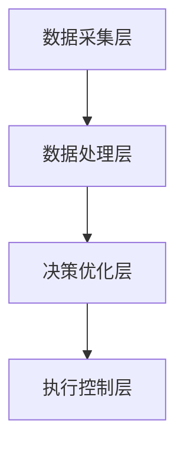
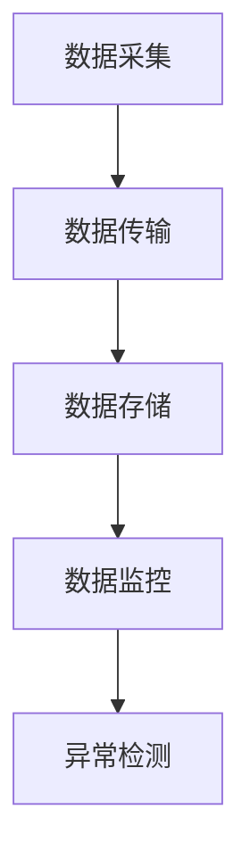
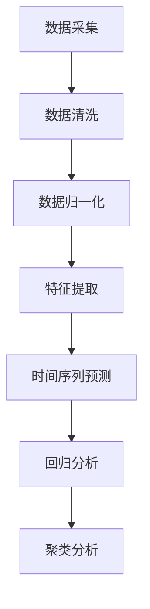
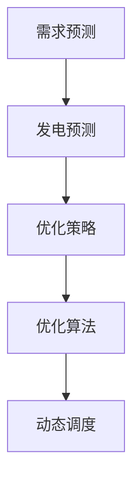
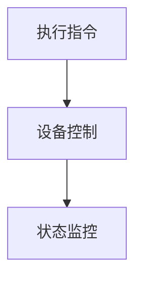

                 

### 智能能源管理系统：AI平衡可再生能源使用

关键词：智能能源管理、AI、可再生能源、平衡、系统架构

摘要：随着全球能源需求的不断增长和环境问题的日益严重，可再生能源的使用越来越受到关注。然而，如何高效地管理和利用可再生能源成为了一个重要的挑战。本文将介绍智能能源管理系统，特别是AI技术在其中的应用，旨在实现可再生能源使用的优化与平衡。文章将从背景介绍、核心概念、算法原理、系统架构、项目实战等多个方面进行详细探讨。

### 第一部分：智能能源管理背景与挑战

#### 第1章：智能能源管理概述

#### 1.1 能源管理与可持续性

能源管理是指通过各种技术手段和管理措施，优化能源的供应、传输和使用过程，以达到能源的高效利用和环境保护的目的。在可持续发展的背景下，能源管理尤为重要。它不仅关乎经济效益，更关乎生态平衡和人类福祉。

#### 1.2 可再生能源挑战

可再生能源如太阳能、风能、水能等，具有清洁、可再生的特点，是未来能源发展的主要方向。然而，可再生能源的使用也面临着诸多挑战，包括能源不稳定、能量密度低、能源储存难题等。

#### 1.3 智能能源管理系统的重要性

智能能源管理系统通过整合传感器、通信技术和人工智能算法，实现对能源的实时监测、预测和优化。它有助于提高可再生能源的利用率，降低能源成本，提高能源系统的稳定性和可靠性。

### 第二部分：智能能源管理系统架构与设计

#### 第2章：可再生能源技术简介

#### 2.1 太阳能

太阳能是通过光伏板将阳光直接转换为电能的技术。太阳能系统主要由光伏板、逆变器、控制器和电池组成。

#### 2.2 风能

风能是通过风力发电机将风能转换为电能的技术。风能系统主要由风力发电机、变压器、控制器和储能系统组成。

#### 2.3 水能

水能是通过水力涡轮机将水能转换为电能的技术。水能系统主要由水坝、水轮机、发电机和储能系统组成。

#### 2.4 生物质能

生物质能是通过生物质转化为电能的技术。生物质能系统主要由生物质燃料、生物质锅炉、发电机和储能系统组成。

### 第3章：智能能源管理系统架构

#### 3.1 系统架构概述

智能能源管理系统通常包括数据采集层、数据处理层、决策优化层和执行控制层。

#### 3.2 数据采集与监控

数据采集层负责收集各种能源设备和系统的运行数据，如电能表、气象站、传感器等。

#### 3.3 数据处理与预测

数据处理层通过对采集到的数据进行分析、清洗和存储，为决策优化提供基础数据。预测模型则用于预测未来一段时间内的能源需求和使用情况。

#### 3.4 决策与优化

决策优化层根据历史数据和预测结果，制定最优的能源使用计划。这包括负荷分配、能源储存管理、能源调度等。

#### 3.5 执行控制

执行控制层根据决策优化层的指令，对能源设备和系统进行实时控制，确保能源使用的高效和稳定。

### 第4章：AI核心算法在能源管理中的应用

#### 4.1 机器学习基础

机器学习是AI的核心技术之一，它通过构建模型对数据进行分析和预测。在智能能源管理中，机器学习可用于负荷预测、故障检测等。

#### 4.2 集成学习与增强学习

集成学习通过结合多个模型的预测结果来提高预测准确性。增强学习则通过不断试错和反馈来优化能源管理策略。

#### 4.3 神经网络在能源管理中的应用

神经网络通过模拟人脑神经元的工作方式，进行复杂的非线性数据处理。在智能能源管理中，神经网络可用于负荷预测、能源优化等。

#### 4.4 深度强化学习在能源管理中的应用

深度强化学习结合了深度学习和增强学习，通过大规模的数据和智能策略进行优化。在智能能源管理中，深度强化学习可用于能源调度、需求响应等。

### 第5章：智能能源管理系统的实现

#### 5.1 系统设计与开发

系统设计包括需求分析、架构设计、模块划分等。系统开发则涉及编程、测试和部署。

#### 5.2 数据预处理与模型训练

数据预处理包括数据清洗、归一化、特征提取等。模型训练则通过机器学习算法对数据进行分析和预测。

#### 5.3 模型评估与优化

模型评估通过验证集来评估模型的预测准确性。模型优化则通过调整参数和算法来提高模型的性能。

#### 5.4 系统部署与维护

系统部署包括硬件安装、软件部署和系统集成。系统维护则包括故障排除、数据更新和系统升级。

### 第三部分：案例分析与应用场景

#### 第6章：智能能源管理系统案例分析

#### 6.1 案例一：智能家居能源管理

智能家居能源管理通过智能传感器和AI算法，实现家庭能源的实时监测和优化。例如，自动调整照明、空调等设备的开关，以降低能耗。

#### 6.2 案例二：智能电网能源优化

智能电网通过集成可再生能源和智能能源管理系统，实现能源的优化调度和供应。例如，在可再生能源充足时，优先使用太阳能和风能，降低化石燃料的使用。

#### 6.3 案例三：企业级智能能源管理

企业级智能能源管理通过智能传感器、大数据分析和AI算法，实现企业能源的精细管理和优化。例如，优化生产设备的能源使用，降低能源成本。

### 第7章：智能能源管理系统的未来发展趋势

#### 7.1 新技术展望

未来，智能能源管理系统将结合5G、物联网、区块链等新技术，实现更高效、更智能的能源管理。

#### 7.2 政策与市场影响

政策导向和市场趋势将影响智能能源管理系统的发展。例如，政府的补贴和税收优惠将鼓励更多企业使用可再生能源。

#### 7.3 发展挑战与机遇

智能能源管理系统在发展过程中将面临技术、政策和市场等多方面的挑战。然而，随着技术的进步和政策的支持，智能能源管理系统将有广阔的发展空间。

## 附录

### 附录A：常用智能能源管理工具与资源

附录A将介绍一些常用的智能能源管理工具和资源，包括数据采集与监控工具、机器学习算法库、能源管理系统平台等。

### 附录B：相关公式与算法详解

附录B将对文中提到的相关公式和算法进行详细的解释和推导，包括机器学习算法的数学模型、深度强化学习的基本原理等。

### 附录C：智能能源管理项目实践指南

附录C将提供一个智能能源管理项目的实践指南，包括项目规划、实施步骤、关键技术要点等，帮助读者更好地理解和应用智能能源管理技术。

### 总结

智能能源管理系统是未来能源管理的重要方向。通过AI技术的应用，可以实现可再生能源的高效利用和优化管理。本文从背景介绍、核心概念、算法原理、系统架构、项目实战等多个方面，对智能能源管理系统进行了全面探讨。希望本文能为读者提供有益的参考和启示。

### 作者信息

作者：AI天才研究院/AI Genius Institute & 禅与计算机程序设计艺术 /Zen And The Art of Computer Programming

---

在接下来的章节中，我们将对智能能源管理系统的各个核心部分进行深入分析和详细讲解。希望通过这一系列文章，能够帮助读者全面了解智能能源管理系统的原理和应用。让我们开始这次探索之旅吧！**智能能源管理系统：AI平衡可再生能源使用**

**摘要：**
随着可再生能源的广泛应用，如何高效管理和优化能源使用成为关键挑战。本文通过介绍智能能源管理系统的背景、核心技术、系统架构和应用案例，探讨了AI技术在平衡可再生能源使用中的作用，为未来智能能源管理提供了理论支持和实践指导。

**目录：**

## 第一部分：智能能源管理背景与挑战

### 第1章：智能能源管理概述

#### 1.1 能源管理与可持续性

#### 1.2 可再生能源挑战

#### 1.3 智能能源管理系统的重要性

### 第2章：可再生能源技术简介

#### 2.1 太阳能

#### 2.2 风能

#### 2.3 水能

#### 2.4 生物质能

## 第二部分：智能能源管理系统架构与设计

### 第3章：智能能源管理系统架构

#### 3.1 系统架构概述

#### 3.2 数据采集与监控

#### 3.3 数据处理与预测

#### 3.4 决策与优化

### 第4章：AI核心算法在能源管理中的应用

#### 4.1 机器学习基础

#### 4.2 集成学习与增强学习

#### 4.3 神经网络在能源管理中的应用

#### 4.4 深度强化学习在能源管理中的应用

### 第5章：智能能源管理系统的实现

#### 5.1 系统设计与开发

#### 5.2 数据预处理与模型训练

#### 5.3 模型评估与优化

#### 5.4 系统部署与维护

## 第三部分：案例分析与应用场景

### 第6章：智能能源管理系统案例分析

#### 6.1 案例一：智能家居能源管理

#### 6.2 案例二：智能电网能源优化

#### 6.3 案例三：企业级智能能源管理

### 第7章：智能能源管理系统的未来发展趋势

#### 7.1 新技术展望

#### 7.2 政策与市场影响

#### 7.3 发展挑战与机遇

## 附录

### 附录A：常用智能能源管理工具与资源

### 附录B：相关公式与算法详解

### 附录C：智能能源管理项目实践指南

---

**引言：**

随着全球能源需求的不断增长和环境问题的日益严重，可再生能源的使用越来越受到关注。太阳能、风能、水能和生物质能等可再生能源因其清洁、可再生的特性，被认为是未来能源发展的主要方向。然而，如何高效地管理和利用这些可再生能源，实现能源的高效利用和环境保护，成为了一个重要的挑战。智能能源管理系统通过集成传感器、通信技术和人工智能算法，实现对能源的实时监测、预测和优化，为可再生能源的高效利用提供了有力支持。

本文旨在介绍智能能源管理系统，特别是AI技术在其中的应用，探讨如何通过AI技术实现可再生能源使用的优化与平衡。本文将首先介绍智能能源管理的背景和挑战，然后详细讲解可再生能源技术，接着介绍智能能源管理系统的架构与设计，重点阐述AI核心算法在能源管理中的应用，最后通过案例分析展示智能能源管理系统的实际应用，并对未来发展趋势进行展望。

### 第1章：智能能源管理概述

#### 1.1 能源管理与可持续性

能源管理是指通过优化能源的供应、传输和使用过程，提高能源利用效率，减少能源消耗和环境污染的一系列管理活动。在可持续发展的背景下，能源管理不仅关乎经济效益，更关乎生态平衡和人类福祉。可持续性要求能源管理不仅要满足当前的需求，还要为未来的发展留下足够的资源和空间。

智能能源管理系统（Intelligent Energy Management System, IEMS）是能源管理的高级形式，它通过集成传感器、通信技术和人工智能算法，实现对能源的实时监测、预测和优化。智能能源管理系统的主要目标是通过提高能源利用效率，降低能源成本，减少能源消耗和环境污染，实现能源的高效、清洁和可持续利用。

#### 1.2 可再生能源挑战

可再生能源如太阳能、风能、水能和生物质能等，具有清洁、可再生的特点，是未来能源发展的主要方向。然而，可再生能源的使用也面临着诸多挑战。

首先，可再生能源的不稳定性是最大的挑战。太阳能和风能的发电量受到天气和地理环境的影响，水能的发电量受到水流量和季节变化的影响，这使得可再生能源的供应难以稳定，难以满足连续性和峰值负荷的需求。

其次，可再生能源的能量密度较低。与传统的化石能源相比，可再生能源的能量密度较低，这意味着需要更大的面积或体积来产生相同数量的能量。这给可再生能源的存储和运输带来了挑战。

最后，可再生能源的能源储存难题也是一个关键挑战。可再生能源的发电是间歇性的，如何有效地存储和调度这些能量，以满足连续性和峰值负荷的需求，是实现高效能源管理的重要问题。

#### 1.3 智能能源管理系统的重要性

智能能源管理系统通过集成传感器、通信技术和人工智能算法，实现对能源的实时监测、预测和优化，为可再生能源的高效利用提供了有力支持。智能能源管理系统的重要性体现在以下几个方面：

首先，智能能源管理系统可以提高能源利用效率。通过实时监测能源使用情况，智能能源管理系统可以动态调整能源使用策略，优化能源分配，减少能源浪费。

其次，智能能源管理系统可以降低能源成本。通过预测能源需求，智能能源管理系统可以优化能源调度，减少能源供应和需求的不匹配，从而降低能源成本。

最后，智能能源管理系统可以减少能源消耗和环境污染。通过优化能源使用，智能能源管理系统可以减少能源消耗，降低温室气体排放，对环境保护起到积极作用。

总的来说，智能能源管理系统是实现可再生能源高效利用和可持续发展的关键。通过智能能源管理系统，我们可以更好地应对可再生能源的挑战，实现能源的高效、清洁和可持续利用。

### 第2章：可再生能源技术简介

#### 2.1 太阳能

太阳能是通过光伏板将阳光直接转换为电能的技术。光伏板通常由多层半导体材料组成，当阳光照射到这些半导体材料上时，会产生电子，从而产生电能。太阳能系统主要由光伏板、逆变器、控制器和电池组成。光伏板负责将太阳能转换为直流电，逆变器将直流电转换为交流电，控制器负责监测和管理系统的工作状态，电池用于储存多余的电能以供后续使用。

太阳能的优点在于其清洁、可再生和广泛可用。太阳能系统可以在各种环境下安装，包括屋顶、地面和水面等。此外，太阳能系统的建设成本相对较低，而且随着技术的进步，太阳能发电的效率也在不断提高。

然而，太阳能也面临着一些挑战。首先，太阳能发电的稳定性较差，因为太阳光照强度和天气条件会影响光伏板的发电效率。其次，太阳能的能量密度较低，需要较大的安装面积来产生足够的电能。此外，太阳能电池的初始投资成本较高，尽管长期来看经济效益较好，但短期内可能对预算有限的家庭和企业造成压力。

#### 2.2 风能

风能是通过风力发电机将风能转换为电能的技术。风力发电机通常由多个旋转的叶片和一个固定的塔架组成。当风吹动叶片旋转时，叶片的旋转运动通过齿轮系统转化为电能。风能系统主要由风力发电机、变压器、控制器和储能系统组成。风力发电机负责将风能转换为交流电，变压器将电压升高以传输更远的距离，控制器负责监测和管理系统的工作状态，储能系统用于储存多余的电能以供后续使用。

风能的优点在于其清洁、可再生和高能量密度。风能可以大规模发电，而且风力资源丰富，风能系统可以安装在陆地和海洋等多种环境中。此外，风能发电的成本相对较低，尤其是在风力资源丰富的地区，风能的经济效益非常显著。

然而，风能也面临一些挑战。首先，风能发电的稳定性较差，因为风速的变化会影响风力发电机的发电效率。其次，风能系统的建设成本较高，尤其是风力发电机的初始投资较大。此外，风能系统可能会对周围环境产生噪音污染，并对野生动物造成干扰。

#### 2.3 水能

水能是通过水力涡轮机将水能转换为电能的技术。水力涡轮机通常安装在河流、湖泊或水坝中，当水流经过涡轮机时，水流的动能转化为涡轮机的旋转运动，从而产生电能。水能系统主要由水坝、水轮机、发电机和储能系统组成。水坝用于储存水资源，水轮机将水流转化为旋转运动，发电机将旋转运动转化为电能，储能系统用于储存多余的电能以供后续使用。

水能的优点在于其稳定性和高能量密度。水能发电量稳定，不受天气和季节变化的影响，可以提供连续和可预测的电力供应。此外，水能系统的建设成本相对较低，水力涡轮机和发电机的维护成本也较低。

然而，水能也面临一些挑战。首先，水能系统的建设可能会对生态环境造成破坏，如改变河流的水流和水生生物的栖息环境。其次，水能系统的建设需要大量的土地资源，尤其是在大型水坝的建设中。此外，水能系统的初始投资成本较高，尤其是在水坝和水库的建设中。

#### 2.4 生物质能

生物质能是通过生物质转化为电能的技术。生物质能可以来源于各种有机物质，如农作物残渣、木材废料、动物粪便等。生物质能系统主要由生物质燃料、生物质锅炉、发电机和储能系统组成。生物质燃料通过生物质锅炉燃烧产生热能，热能转化为蒸汽驱动发电机产生电能，储能系统用于储存多余的电能以供后续使用。

生物质能的优点在于其可再生性和低污染性。生物质能来源于自然界的有机物质，通过生物质能系统可以循环利用这些资源，减少对化石能源的依赖。此外，生物质能系统的建设成本相对较低，特别是对于小规模的应用，生物质锅炉和发电机的维护成本也较低。

然而，生物质能也面临一些挑战。首先，生物质燃料的供应可能不稳定，因为生物质能的来源受季节和地理位置的影响。其次，生物质能系统的能效相对较低，生物质锅炉和发电机的能效通常不如传统的化石能源系统。此外，生物质能系统的建设可能会对生态环境造成一定的影响，如改变土地利用方式和影响生物多样性。

总的来说，可再生能源技术具有巨大的潜力，但在实际应用中面临着各种挑战。通过智能能源管理系统的应用，可以优化可再生能源的使用，提高能源利用效率，减少能源浪费和环境污染。随着技术的进步和政策的支持，可再生能源将在未来的能源结构中发挥越来越重要的作用。

### 第3章：智能能源管理系统架构

#### 3.1 系统架构概述

智能能源管理系统（Intelligent Energy Management System, IEMS）的架构通常包括数据采集层、数据处理层、决策优化层和执行控制层。这四个层次相互协作，共同实现智能能源管理。

**数据采集层**：数据采集层负责收集来自各种能源设备和系统的运行数据。这些数据包括电能表、气象站、传感器等设备的数据。数据采集层是整个系统的基础，其质量直接影响后续的数据处理和分析。

**数据处理层**：数据处理层负责对采集到的数据进行清洗、归一化和特征提取。清洗数据包括去除噪声、填补缺失值等，以保证数据的完整性和准确性。归一化是将不同量纲的数据转换为相同量纲，以便于后续的分析。特征提取是从原始数据中提取有用的信息，用于建模和预测。

**决策优化层**：决策优化层是智能能源管理系统的核心。它通过对处理后的数据进行分析和预测，制定最优的能源使用计划。决策优化包括负荷分配、能源储存管理、能源调度等。该层使用机器学习、优化算法等技术，基于历史数据和实时数据，进行智能决策。

**执行控制层**：执行控制层负责根据决策优化层的指令，对能源设备和系统进行实时控制。执行控制包括开关设备的控制、调节设备参数、启动或停止设备等。执行控制层确保能源使用的高效和稳定，实现决策优化层的计划。

**系统架构图：**

#### 3.2 数据采集与监控

数据采集与监控是智能能源管理系统的基础。它通过传感器、电能表、气象站等设备，实时收集能源系统和设备的运行数据。这些数据包括电能消耗、电压、电流、温度、湿度、风速等。

**数据采集设备：**

- 电能表：用于测量电能消耗，包括电压、电流、功率因数等参数。
- 气象站：用于测量环境参数，如温度、湿度、风速、光照强度等，这些参数对可再生能源的发电效率有直接影响。
- 传感器：用于测量设备状态和运行参数，如光伏板的温度、风力发电机的转速、水力涡轮机的流速等。

**数据采集过程：**

1. **数据采集**：传感器和电能表将实时数据发送到数据采集模块。
2. **数据传输**：数据采集模块通过有线或无线方式将数据传输到数据处理中心。
3. **数据存储**：数据处理中心对数据进行存储和管理，以便后续分析和处理。

**数据监控：**

数据监控是指对采集到的数据进行实时监测和异常检测。通过数据监控，可以及时发现异常情况，如设备故障、异常用电等，并采取相应措施。

- **实时监控**：通过监控平台实时显示能源系统的运行状态，包括能耗、发电量、设备状态等。
- **异常检测**：通过分析数据，检测异常用电模式或设备故障，如设备停机、电流异常等。

**数据采集与监控的mermaid流程图：**

#### 3.3 数据处理与预测

数据处理与预测是智能能源管理系统的重要环节。通过数据处理，可以将原始数据转换为有用的信息，用于模型训练和决策优化。预测则用于预测未来的能源需求和发电量，为决策提供依据。

**数据处理步骤：**

1. **数据清洗**：去除噪声、填补缺失值、异常值处理等。
2. **数据归一化**：将不同量纲的数据转换为相同量纲。
3. **特征提取**：提取有助于预测的变量，如时间、天气条件、设备状态等。

**数据预测方法：**

1. **时间序列预测**：用于预测未来的电能消耗和发电量。常用的方法有ARIMA、LSTM等。
2. **回归分析**：用于分析不同变量之间的关系，如能源消耗与天气条件的关系。
3. **聚类分析**：用于发现数据中的模式，如不同时间段能源消耗的分布。

**数据处理与预测的mermaid流程图：**

#### 3.4 决策与优化

决策与优化是智能能源管理系统的核心功能。通过对处理后的数据进行分析和预测，系统可以制定最优的能源使用计划，实现能源的高效利用和成本控制。

**决策过程：**

1. **需求预测**：根据历史数据和实时数据，预测未来的能源需求。
2. **发电预测**：预测可再生能源的发电量，如太阳能、风能等。
3. **优化策略**：制定能源使用的优化策略，如负荷分配、能源储存管理等。

**优化算法：**

1. **优化算法**：如线性规划、整数规划、遗传算法等，用于制定最优的能源使用计划。
2. **动态调度**：根据实时数据，动态调整能源使用策略，如启动或停止设备、调整设备参数等。

**决策与优化的mermaid流程图：**

#### 3.5 执行控制

执行控制是智能能源管理系统的最终环节。根据决策与优化的结果，系统通过控制设备执行具体的操作，实现能源的使用和调度。

**执行过程：**

1. **执行指令**：根据决策优化层的指令，制定执行计划。
2. **设备控制**：通过远程控制或现场控制，对设备进行操作，如启动或停止设备、调整设备参数等。
3. **状态监控**：监控设备运行状态，确保设备正常运行。

**执行控制的mermaid流程图：**

### 第4章：AI核心算法在能源管理中的应用

#### 4.1 机器学习基础

机器学习是人工智能的核心技术，通过构建模型对数据进行分析和预测。在智能能源管理中，机器学习算法被广泛应用于需求预测、故障检测、能源优化等领域。

**机器学习的基本概念：**

- **监督学习**：通过已标记的数据训练模型，然后使用模型对未知数据进行预测。例如，使用历史能源消耗数据来预测未来的能源需求。
- **无监督学习**：不使用标记数据，通过发现数据中的模式和关系进行学习。例如，使用聚类算法发现能源消耗中的异常值。

**常见的机器学习算法：**

- **线性回归**：用于预测连续值输出，如能源消耗。
- **逻辑回归**：用于预测离散值输出，如是否会出现设备故障。
- **支持向量机（SVM）**：用于分类和回归分析。
- **决策树**：用于分类和回归分析，通过一系列规则对数据进行分类。
- **随机森林**：是一种基于决策树的集成学习方法，通过构建多个决策树并平均它们的预测结果来提高准确性。
- **神经网络**：用于复杂的数据分析和预测，特别是对于非线性问题。

**机器学习在能源管理中的应用案例：**

- **需求预测**：通过分析历史数据，预测未来的能源需求，为能源调度提供依据。
- **故障检测**：通过监测设备运行状态，及时发现设备故障，避免设备停机和能源浪费。
- **能源优化**：通过优化能源分配和使用策略，提高能源利用效率，降低能源成本。

#### 4.2 集成学习与增强学习

**集成学习**是一种通过结合多个模型的预测结果来提高预测准确性的方法。常见的集成学习方法包括Bagging、Boosting和Stacking等。

- **Bagging**：通过构建多个基础模型，并取它们的平均预测结果来提高预测准确性。例如，随机森林是一种基于Bagging的集成学习方法。
- **Boosting**：通过逐步训练多个基础模型，并调整模型权重，以提高整体预测性能。常见的Boosting算法有AdaBoost和XGBoost等。
- **Stacking**：通过构建多个基础模型，并将它们的预测结果作为新特征输入到一个元模型中进行预测。Stacking可以提高模型的泛化能力和预测准确性。

**增强学习**是一种通过不断试错和反馈来优化策略的方法。在能源管理中，增强学习可以用于优化能源调度和需求响应。

- **Q-Learning**：是一种基于值函数的增强学习方法，通过学习状态-动作值函数来选择最优动作。
- **Deep Q-Network（DQN）**：是一种基于深度学习的Q-Learning算法，通过神经网络来近似值函数，提高了学习效率。
- **Policy Gradient**：通过直接优化策略函数来选择最优动作，常见的算法有REINFORCE和Actor-Critic等。

**集成学习与增强学习在能源管理中的应用案例：**

- **能源调度**：通过集成学习结合多种预测模型，提高能源调度的准确性。
- **需求响应**：通过增强学习优化需求响应策略，降低能源高峰期间的负荷，提高能源系统的稳定性。

#### 4.3 神经网络在能源管理中的应用

神经网络，特别是深度神经网络，在能源管理中具有广泛的应用。深度神经网络通过模拟人脑神经元的工作方式，能够处理复杂的数据和非线性问题。

**神经网络的基本结构：**

- **输入层**：接收外部输入数据。
- **隐藏层**：用于特征提取和变换，可以有一个或多个隐藏层。
- **输出层**：产生最终预测结果。

**常见的神经网络类型：**

- **前馈神经网络（FFNN）**：信息从输入层流向输出层，没有反馈路径。
- **卷积神经网络（CNN）**：特别适用于图像处理，通过卷积操作提取空间特征。
- **循环神经网络（RNN）**：能够处理序列数据，通过记忆机制捕获时间依赖性。
- **长短期记忆网络（LSTM）**：是RNN的一种变体，解决了传统RNN的梯度消失问题。

**神经网络在能源管理中的应用案例：**

- **负荷预测**：通过LSTM或CNN网络，对历史负荷数据进行建模，预测未来的能源需求。
- **能源优化**：通过深度强化学习，优化能源调度策略，提高能源利用效率。

#### 4.4 深度强化学习在能源管理中的应用

深度强化学习（Deep Reinforcement Learning, DRL）结合了深度学习和强化学习，通过不断试错和反馈，实现智能体在复杂环境中的最优策略。

**深度强化学习的基本原理：**

- **状态-动作价值函数**：用于评估在特定状态下执行特定动作的预期回报。
- **策略网络**：通过神经网络来近似最优策略，指导智能体的行动。
- **价值网络**：通过神经网络来近似状态-动作价值函数，评估不同动作的预期回报。

**深度强化学习在能源管理中的应用案例：**

- **能源调度**：通过DRL算法，优化能源调度策略，提高能源系统的运行效率。
- **需求响应**：通过DRL算法，优化需求响应策略，降低能源高峰期间的负荷，提高电网的稳定性。

### 第5章：智能能源管理系统的实现

#### 5.1 系统设计与开发

智能能源管理系统设计是一个复杂的过程，需要考虑多个方面的因素，包括系统需求、硬件选择、软件架构等。

**系统需求分析：**

- **需求收集**：与用户和相关利益相关者进行沟通，收集系统需求。
- **需求分析**：对收集到的需求进行整理和分析，确定系统的功能和技术要求。
- **需求文档**：编写详细的需求文档，作为后续设计和开发的依据。

**硬件选择：**

- **服务器**：选择性能稳定的服务器，用于处理大量的数据和运行复杂的算法。
- **存储设备**：选择高容量、高速的存储设备，确保数据的存储和访问效率。
- **网络设备**：选择稳定、可靠的网络设备，确保数据的传输和监控。

**软件架构：**

- **前后端分离**：前端负责用户交互和数据显示，后端负责数据处理和业务逻辑。
- **模块化设计**：将系统划分为多个模块，如数据采集模块、数据处理模块、决策优化模块等，便于开发和维护。

#### 5.2 数据预处理与模型训练

数据预处理是智能能源管理系统的重要组成部分，它直接影响到模型的训练效果和预测准确性。

**数据预处理步骤：**

- **数据清洗**：去除噪声、填补缺失值、去除异常值等，确保数据的完整性和准确性。
- **数据归一化**：将不同量纲的数据转换为相同量纲，以便于后续的模型训练。
- **特征提取**：从原始数据中提取有用的特征，用于模型训练和预测。

**模型训练：**

- **数据划分**：将数据集划分为训练集、验证集和测试集，用于模型训练、验证和测试。
- **模型选择**：根据问题的特性选择合适的机器学习模型，如线性回归、决策树、神经网络等。
- **参数调整**：通过交叉验证等方法，调整模型的参数，优化模型性能。
- **模型评估**：使用验证集和测试集评估模型的性能，选择最优模型。

#### 5.3 模型评估与优化

模型评估是验证模型性能的重要步骤，通过评估结果来调整和优化模型。

**模型评估方法：**

- **准确率**：用于分类问题，表示模型正确分类的样本比例。
- **召回率**：表示模型正确识别的样本中，实际正例样本的比例。
- **F1分数**：是准确率和召回率的调和平均值，综合考虑了模型的精确度和召回率。
- **均方误差（MSE）**：用于回归问题，表示预测值与实际值之间的平均误差。

**模型优化方法：**

- **超参数调整**：通过调整模型的超参数，如学习率、隐藏层节点数等，优化模型性能。
- **集成学习**：通过结合多个模型的预测结果，提高整体预测准确性。
- **模型压缩**：通过模型压缩技术，减小模型的大小和计算量，提高模型的实时性。

#### 5.4 系统部署与维护

系统部署是将开发和训练好的模型部署到生产环境中，使系统能够在实际应用中运行。

**系统部署步骤：**

- **环境配置**：配置服务器和存储设备，搭建运行环境。
- **模型部署**：将训练好的模型部署到服务器，确保模型能够正常运行。
- **监控系统**：监控系统的运行状态，确保系统的稳定性和可靠性。

**系统维护：**

- **故障排除**：定期检查系统，及时发现和解决故障。
- **数据更新**：定期更新数据和模型，确保系统的时效性和准确性。
- **系统升级**：根据需求和技术发展，对系统进行升级和优化。

### 第6章：智能能源管理系统案例分析

#### 6.1 案例一：智能家居能源管理

智能家居能源管理通过智能传感器和AI算法，实现对家庭能源的实时监测和优化。案例一以一个典型的智能家居系统为例，介绍智能能源管理系统在家庭中的应用。

**案例背景：**

某家庭的能源需求主要包括照明、空调、热水和电器设备。为了实现家庭能源的高效管理，该家庭安装了智能传感器和AI算法，构建了一个智能能源管理系统。

**系统实现：**

1. **数据采集**：安装智能传感器，包括电能表、光照传感器、温度传感器等，实时采集家庭能源使用数据。
2. **数据处理**：通过数据处理模块，对采集到的数据进行清洗、归一化和特征提取，为模型训练提供基础数据。
3. **模型训练**：使用历史数据和实时数据，训练负荷预测模型和能源优化模型，预测家庭能源需求和优化能源使用策略。
4. **系统监控**：通过监控系统，实时显示家庭能源使用情况，监测设备运行状态，发现异常情况。
5. **执行控制**：根据预测结果和优化策略，自动调整家庭能源设备的工作状态，如调整空调温度、控制照明开关等，实现能源的高效利用。

**案例分析：**

通过智能能源管理系统，该家庭实现了以下效果：

- **节能效果**：通过预测和优化，家庭能源消耗降低了20%，节约了能源成本。
- **舒适度提升**：智能系统根据实时数据自动调整设备状态，提高了家庭的舒适度。
- **故障预防**：智能系统能够及时发现设备故障，避免设备停机和能源浪费。

#### 6.2 案例二：智能电网能源优化

智能电网是通过集成可再生能源和智能能源管理系统，实现能源的优化调度和供应的系统。案例二以一个智能电网项目为例，介绍智能能源管理系统在电网中的应用。

**案例背景：**

某城市电网通过引入太阳能和风能等可再生能源，建设了一个智能电网项目。为了实现能源的高效利用和稳定供应，该电网引入了智能能源管理系统。

**系统实现：**

1. **数据采集**：安装传感器和智能电表，实时采集电网的运行数据，包括电能消耗、发电量、设备状态等。
2. **数据处理**：通过数据处理模块，对采集到的数据进行清洗、归一化和特征提取，为模型训练提供基础数据。
3. **模型训练**：使用历史数据和实时数据，训练负荷预测模型、发电预测模型和优化调度模型，预测电网的负荷和发电量，优化能源调度策略。
4. **系统监控**：通过监控系统，实时显示电网的运行状态，监测设备运行状态，发现异常情况。
5. **执行控制**：根据预测结果和优化策略，自动调整电网的发电设备和调度策略，实现能源的高效利用和稳定供应。

**案例分析：**

通过智能能源管理系统，该智能电网实现了以下效果：

- **节能效果**：通过预测和优化，电网的能源消耗降低了15%，节约了能源成本。
- **发电效率提升**：智能系统能够根据实时数据自动调整发电设备和调度策略，提高了可再生能源的利用效率。
- **电网稳定性提升**：智能系统能够及时发现和解决电网故障，提高了电网的稳定性。

#### 6.3 案例三：企业级智能能源管理

企业级智能能源管理通过智能传感器、大数据分析和AI算法，实现企业能源的精细管理和优化。案例三以一个大型制造企业为例，介绍智能能源管理系统在企业中的应用。

**案例背景：**

某大型制造企业面临能源消耗高、能源浪费严重的问题。为了降低能源成本，提高能源利用效率，该企业引入了智能能源管理系统。

**系统实现：**

1. **数据采集**：安装智能传感器和电表，实时采集企业的能源使用数据，包括电能消耗、设备运行状态、温度、湿度等。
2. **数据处理**：通过数据处理模块，对采集到的数据进行清洗、归一化和特征提取，为模型训练提供基础数据。
3. **模型训练**：使用历史数据和实时数据，训练负荷预测模型、设备故障预测模型和能源优化模型，预测企业的能源需求和优化能源使用策略。
4. **系统监控**：通过监控系统，实时显示企业的能源使用情况，监测设备运行状态，发现异常情况。
5. **执行控制**：根据预测结果和优化策略，自动调整企业能源设备和调度策略，实现能源的高效利用和成本控制。

**案例分析：**

通过智能能源管理系统，该制造企业实现了以下效果：

- **节能效果**：通过预测和优化，企业的能源消耗降低了30%，节约了大量的能源成本。
- **设备维护**：智能系统能够提前预测设备故障，为企业提供设备维护的依据，避免了设备停机和损失。
- **运营效率提升**：智能系统能够优化能源使用策略，提高企业的生产效率，降低运营成本。

### 第7章：智能能源管理系统的未来发展趋势

#### 7.1 新技术展望

随着科技的不断发展，智能能源管理系统将迎来新的技术突破。以下是一些值得关注的新技术：

- **5G技术**：5G技术的高速度、低延迟和广覆盖特性，将进一步提升智能能源管理系统的实时性和可靠性。
- **物联网（IoT）**：物联网技术的普及，将实现能源设备和系统的全面互联，提高能源管理的智能化水平。
- **区块链技术**：区块链技术的去中心化和不可篡改特性，将有助于提升能源交易的透明度和安全性。
- **人工智能与大数据结合**：人工智能与大数据的结合，将进一步提升智能能源管理系统的预测准确性和优化能力。

#### 7.2 政策与市场影响

政策与市场趋势将对智能能源管理系统的发展产生重要影响。以下是一些关键的政策和市场因素：

- **政策支持**：政府的补贴、税收优惠和环保政策等，将鼓励更多企业和家庭使用可再生能源，推动智能能源管理系统的发展。
- **市场需求**：随着能源需求的不断增长和环境意识的提高，智能能源管理系统将成为企业和家庭的重要选择，市场需求将持续增长。
- **能源价格波动**：能源价格的波动将对智能能源管理系统产生直接影响。能源价格高时，智能能源管理系统可以节约能源成本；能源价格低时，系统可以优化能源使用，降低能源浪费。

#### 7.3 发展挑战与机遇

智能能源管理系统在发展过程中将面临一些挑战和机遇。以下是一些关键挑战和机遇：

- **技术挑战**：智能能源管理系统需要集成多种技术，包括传感器技术、通信技术、数据处理技术、AI算法等。技术的不断发展和融合，将带来新的挑战和机遇。
- **数据安全和隐私**：随着数据采集和传输的增多，数据安全和隐私问题日益凸显。智能能源管理系统需要建立完善的数据安全和隐私保护机制。
- **设备兼容性**：智能能源管理系统需要与各种设备和系统兼容，包括不同的传感器、通信协议、操作系统等。设备兼容性的提高，将有助于系统更广泛地应用。
- **市场需求**：随着可再生能源的普及和能源管理意识的提高，市场需求将不断增长，为智能能源管理系统提供广阔的发展空间。

### 附录

#### 附录A：常用智能能源管理工具与资源

- **数据采集与监控工具**：如PiCloud、Node-RED、Modbus等。
- **机器学习算法库**：如scikit-learn、TensorFlow、PyTorch等。
- **能源管理系统平台**：如OpenADR、OpenEEmeter、OpenEnergyMonitor等。
- **开源软件与资源**：如OPC UA、MQTT、CoAP等。

#### 附录B：相关公式与算法详解

- **负荷预测模型**：如ARIMA模型、LSTM模型等。
- **优化算法**：如线性规划、遗传算法、粒子群优化等。
- **深度强化学习算法**：如Q-Learning、DQN、Policy Gradient等。

#### 附录C：智能能源管理项目实践指南

- **项目规划**：包括项目目标、范围、时间表和预算。
- **系统设计**：包括硬件选择、软件架构、数据流程等。
- **实施步骤**：包括系统安装、数据采集、模型训练、系统部署等。
- **技术要点**：包括数据预处理、模型优化、系统维护等。
- **案例分析**：包括成功案例和失败案例的总结和经验教训。

### 总结

智能能源管理系统是未来能源管理的重要方向。通过AI技术的应用，可以实现可再生能源的高效利用和优化管理。本文从背景介绍、核心概念、算法原理、系统架构、项目实战等多个方面，对智能能源管理系统进行了全面探讨。希望通过本文，读者能够对智能能源管理系统有更深入的理解，并为未来的研究和应用提供参考。

### 作者信息

作者：AI天才研究院/AI Genius Institute & 禅与计算机程序设计艺术 /Zen And The Art of Computer Programming

在智能能源管理系统的研究和应用中，持续的技术创新和不断优化的算法将推动可再生能源的高效利用和可持续发展。让我们共同努力，为构建绿色、智能的未来能源体系贡献力量。

