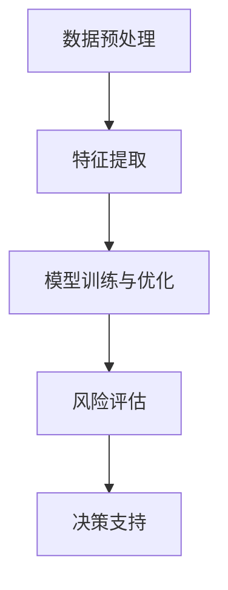
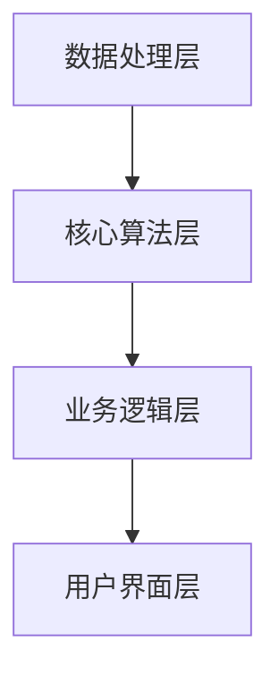
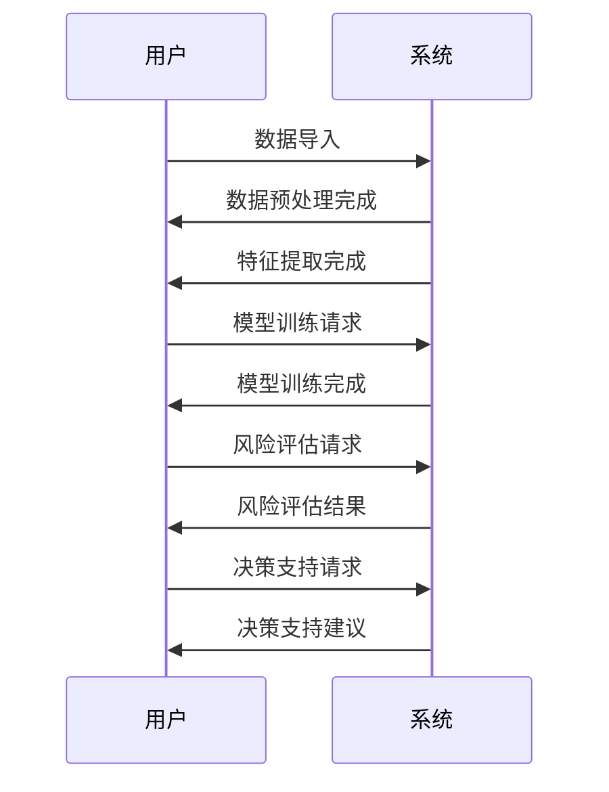

                 


# 智能风险评估:AI大模型在保险行业的应用

> 关键词：智能风险评估，AI大模型，保险行业，风险控制，机器学习

> 摘要：本文将深入探讨智能风险评估在保险行业中的应用，通过分析问题背景、核心概念、算法原理、系统架构和项目实战等方面，阐述AI大模型在保险风险评估中的优势和应用场景，为保险行业的发展提供新思路。

## 第一部分：背景介绍

### 1.1 问题背景

保险行业作为金融服务业的重要组成部分，承担着风险管理和保障的功能。然而，随着保险市场的竞争加剧和客户需求的多样化，保险公司面临着越来越多的挑战。如何提高风险评估的准确性和效率，成为保险行业亟待解决的问题。近年来，人工智能（AI）技术的快速发展为保险行业带来了新的机遇，AI大模型的应用在智能风险评估领域展现出巨大的潜力。

### 1.2 问题描述

智能风险评估是指在保险业务过程中，利用人工智能技术对风险进行识别、评估和预测。具体而言，问题描述包括以下几个方面：

- **数据预处理**：保险行业涉及大量的结构化和非结构化数据，如客户信息、理赔记录、市场数据等。如何对这些数据进行清洗、整合和规范化，为后续分析提供高质量的数据基础，是一个关键问题。
- **特征提取**：在风险评估过程中，需要从原始数据中提取出对风险具有重要意义的特征。这些特征可能隐藏在大量的数据中，如何有效地提取和利用这些特征，是提高风险评估准确性的关键。
- **模型训练与优化**：选择合适的AI大模型，对提取出的特征进行训练和优化，以构建一个能够准确预测风险的模型。模型的训练和优化过程需要考虑到数据的多样性和噪声，以保证模型的稳定性和泛化能力。
- **风险评估**：利用训练好的模型对新的保险数据进行风险评估，为保险公司提供决策支持。风险评估的结果可以用于调整保险产品定价、优化客户服务策略等。

### 1.3 问题解决

为了解决上述问题，本文将从以下几个方面进行探讨：

- **核心概念**：介绍智能风险评估的相关核心概念，包括AI大模型、保险风险、风险评估方法等。
- **AI大模型应用场景**：分析AI大模型在保险行业中的应用场景，如风险评估、客户服务、产品定价等。
- **算法原理**：讲解智能风险评估中的关键算法原理，包括数据预处理、特征提取、模型训练与优化等。
- **数学模型与公式**：阐述智能风险评估中的数学模型与公式，包括预测模型的构建、优化方法等。
- **系统架构设计**：介绍智能风险评估系统的架构设计，包括数据处理、模型训练、风险评估等模块。
- **项目实战**：通过具体项目案例，展示智能风险评估系统的实现过程，包括环境搭建、核心代码实现、案例分析等。

### 1.4 边界与外延

本文主要关注AI大模型在保险行业中的应用，不涉及AI在其他行业的应用。此外，本文重点讨论智能风险评估的理论与方法，而不涉及具体的保险产品设计。

### 1.5 概念结构与核心要素组成

智能风险评估系统主要由以下几个核心要素组成：

- **数据输入**：包括历史数据、客户信息、市场数据等。
- **数据预处理**：对输入数据进行清洗、整合和规范化。
- **特征提取**：从原始数据中提取对风险评估具有重要意义的特征。
- **模型训练与优化**：选择合适的AI大模型，对提取出的特征进行训练和优化。
- **风险评估**：利用训练好的模型对新的保险数据进行风险评估。
- **决策支持**：将评估结果转化为具体的业务决策，如调整保险产品定价、优化客户服务策略等。

## 第二部分：核心概念与联系

### 2.1 核心概念

#### 2.1.1 智能风险评估

智能风险评估是一种基于人工智能技术的方法，通过数据挖掘、机器学习等技术，对保险风险进行识别、评估和预测。

#### 2.1.2 AI大模型

AI大模型是指具有海量参数、强大计算能力和高度自适应性的深度学习模型，如GPT、BERT等。

#### 2.1.3 保险风险

保险风险是指保险公司面临的各类风险，包括市场风险、信用风险、操作风险等。

#### 2.1.4 风险评估方法

风险评估方法包括传统评估方法和基于AI的大模型评估方法，如贝叶斯网络、随机森林、神经网络等。

### 2.2 概念属性特征对比表格

| 概念       | 属性特征                     | 关联关系                   |
| ---------- | ---------------------------- | -------------------------- |
| 智能风险评估 | 数据驱动、实时性、自动化       | AI大模型、风险评估方法     |
| AI大模型   | 海量参数、强计算能力、自适应性强 | 模型训练、优化             |
| 保险风险   | 多样性、不确定性、可量化       | 智能风险评估、风险评估方法 |
| 风险评估方法 | 简单、高效、准确性高           | 智能风险评估、AI大模型     |

### 2.3 ER实体关系图架构

```mermaid
erDiagram
    Customer ||--|{ InsurancePolicy }|| Policy
    Customer ||--|{ InsuranceClaim }||

```

在上面的ER实体关系图中，我们定义了两个实体：`Customer`（客户）和`InsurancePolicy`（保险政策）。客户与保险政策之间是一对多的关系，即一个客户可以拥有多个保险政策。同时，客户还可以与`InsuranceClaim`（保险索赔）实体关联，表示客户可能存在的多个索赔记录。

## 第三部分：算法原理

### 3.1 数据预处理

数据预处理是智能风险评估系统的第一步，其目的是将原始数据进行清洗、整合和规范化，为后续分析提供高质量的数据基础。数据预处理主要包括以下几个步骤：

1. **数据清洗**：去除重复数据、缺失值填充、去除噪声数据等。
2. **数据整合**：将来自不同来源的数据进行合并，形成一个统一的数据集。
3. **数据规范化**：对数据进行标准化处理，使其满足后续算法的需求。

### 3.2 特征提取

特征提取是从原始数据中提取出对风险评估具有重要意义的特征，以提高模型的预测准确性。特征提取可以采用以下几种方法：

1. **统计特征**：通过对数据进行统计分析，提取出一些描述数据分布、趋势的特征。
2. **机器学习特征**：利用机器学习方法，从原始数据中自动提取出对风险评估具有指导意义的特征。
3. **专家知识特征**：结合领域专家的经验，提取出一些具有指导意义的特征。

### 3.3 模型训练与优化

模型训练与优化是智能风险评估系统的核心环节，其目的是构建一个能够准确预测风险的模型。具体步骤如下：

1. **选择模型**：根据问题的特点，选择合适的AI大模型，如深度神经网络、决策树等。
2. **模型训练**：利用提取出的特征和标记好的数据，对模型进行训练。
3. **模型优化**：通过调整模型参数，优化模型的性能，提高预测准确性。

### 3.4 风险评估

风险评估是利用训练好的模型对新的保险数据进行预测，以评估其风险水平。具体步骤如下：

1. **数据预处理**：对新的保险数据进行预处理，使其满足模型的输入要求。
2. **特征提取**：从新的保险数据中提取出特征。
3. **风险评估**：利用训练好的模型对新的保险数据进行分析，预测其风险水平。

### 3.5 数学模型与公式

在智能风险评估中，常用的数学模型与公式包括以下几种：

1. **线性回归**：用于预测连续值的目标变量。
   $$ y = \beta_0 + \beta_1x $$
   
2. **逻辑回归**：用于预测二分类的目标变量。
   $$ P(y=1) = \frac{1}{1 + e^{-(\beta_0 + \beta_1x)}} $$
   
3. **支持向量机（SVM）**：用于分类问题。
   $$ \max \left\{ W : \sum_{i=1}^{n} (y_i - \langle \beta, \phi(x_i) \rangle) \leq \epsilon + \sum_{i=1}^{n} \alpha_i, \sum_{i=1}^{n} \alpha_i = 0 \right\} $$
   
4. **神经网络**：用于非线性回归和分类问题。
   $$ a_{i,j} = \sigma(\sum_{k=1}^{m} w_{i,k,j} x_k + b_{i,j}) $$

### 3.6 Mermaid算法流程图

以下是智能风险评估系统的算法流程图：



## 第四部分：系统分析与架构设计

### 4.1 问题场景介绍

在保险行业中，智能风险评估主要用于以下几个方面：

1. **产品定价**：通过评估潜在客户的风险水平，为不同客户群体制定合理的保险产品定价策略。
2. **风险管理**：对已投保的客户进行风险评估，及时发现潜在的理赔风险，制定相应的风险管理措施。
3. **客户服务**：通过分析客户的历史数据和风险评估结果，提供个性化的客户服务，提高客户满意度。

### 4.2 项目介绍

本项目旨在构建一个智能风险评估系统，用于保险行业的风险评估和产品定价。系统主要包含以下几个模块：

1. **数据预处理模块**：负责清洗、整合和规范化输入数据。
2. **特征提取模块**：从原始数据中提取出对风险评估具有重要意义的特征。
3. **模型训练模块**：选择合适的AI大模型，对提取出的特征进行训练和优化。
4. **风险评估模块**：利用训练好的模型对新的保险数据进行风险评估。
5. **决策支持模块**：将评估结果转化为具体的业务决策，如调整保险产品定价、优化客户服务策略等。

### 4.3 系统功能设计

系统功能设计主要包括以下几个方面：

1. **数据导入**：支持从各种数据源导入数据，如数据库、CSV文件等。
2. **数据预处理**：包括数据清洗、整合和规范化等功能。
3. **特征提取**：支持多种特征提取方法，如统计特征、机器学习特征等。
4. **模型训练**：支持多种AI大模型，如深度神经网络、决策树等。
5. **风险评估**：支持对新的保险数据进行风险评估，并输出评估结果。
6. **决策支持**：根据评估结果，提供调整保险产品定价、优化客户服务策略等建议。

### 4.4 系统架构设计

系统架构设计主要包括以下几个方面：

1. **数据处理层**：负责数据预处理、特征提取和模型训练等功能。
2. **核心算法层**：负责实现各种AI大模型和风险评估算法。
3. **业务逻辑层**：负责实现系统的业务逻辑，如风险评估、决策支持等。
4. **用户界面层**：提供用户友好的界面，方便用户使用系统。

以下是系统架构设计的Mermaid架构图：



### 4.5 系统接口设计和系统交互

系统接口设计主要包括以下几个方面：

1. **API接口**：提供API接口，方便外部系统调用。
2. **数据存储接口**：提供数据存储接口，方便数据管理和查询。
3. **日志接口**：提供日志接口，方便记录系统运行过程。

系统交互主要包括以下几个方面：

1. **数据导入**：将数据导入系统，进行预处理和特征提取。
2. **模型训练**：利用预处理后的数据进行模型训练。
3. **风险评估**：利用训练好的模型对新的保险数据进行风险评估。
4. **决策支持**：根据评估结果，提供业务决策建议。

以下是系统交互的Mermaid序列图：



## 第五部分：项目实战

### 5.1 环境安装

在进行项目实战之前，我们需要搭建一个适合开发智能风险评估系统的环境。以下是安装步骤：

1. **安装Python**：确保Python环境已安装，推荐使用Python 3.8及以上版本。
2. **安装依赖库**：使用pip命令安装必要的依赖库，如NumPy、Pandas、Scikit-learn、TensorFlow等。

```shell
pip install numpy pandas scikit-learn tensorflow
```

### 5.2 系统核心实现

以下是系统核心实现的源代码，包括数据预处理、特征提取、模型训练和风险评估等模块。

```python
import numpy as np
import pandas as pd
from sklearn.model_selection import train_test_split
from sklearn.preprocessing import StandardScaler
from sklearn.neural_network import MLPRegressor
from sklearn.metrics import mean_squared_error

# 5.2.1 数据预处理
def preprocess_data(data):
    # 数据清洗
    data = data.drop_duplicates()
    data = data.fillna(0)
    # 数据整合
    data = data.groupby('customer_id').mean().reset_index()
    return data

# 5.2.2 特征提取
def extract_features(data):
    # 提取统计特征
    data['age_mean'] = data['age'].mean()
    data['age_std'] = data['age'].std()
    data['claim_count'] = data['claim_id'].nunique()
    return data

# 5.2.3 模型训练
def train_model(X_train, y_train):
    model = MLPRegressor(hidden_layer_sizes=(100,), max_iter=1000)
    model.fit(X_train, y_train)
    return model

# 5.2.4 风险评估
def assess_risk(model, X_test):
    y_pred = model.predict(X_test)
    mse = mean_squared_error(y_test, y_pred)
    return mse

# 5.3 实际案例分析和详细讲解剖析
if __name__ == '__main__':
    # 加载数据
    data = pd.read_csv('insurance_data.csv')
    # 数据预处理
    data = preprocess_data(data)
    # 特征提取
    data = extract_features(data)
    # 划分训练集和测试集
    X = data.drop(['customer_id', 'risk_level'], axis=1)
    y = data['risk_level']
    X_train, X_test, y_train, y_test = train_test_split(X, y, test_size=0.2, random_state=42)
    # 数据标准化
    scaler = StandardScaler()
    X_train = scaler.fit_transform(X_train)
    X_test = scaler.transform(X_test)
    # 模型训练
    model = train_model(X_train, y_train)
    # 风险评估
    mse = assess_risk(model, X_test)
    print(f'Mean Squared Error: {mse}')
```

### 5.4 代码应用解读与分析

在上面的代码中，我们实现了数据预处理、特征提取、模型训练和风险评估等模块。以下是代码的详细解读和分析：

1. **数据预处理**：首先进行数据清洗，去除重复数据和缺失值。然后对数据进行整合，将每个客户的历史数据合并为一个数据集。
2. **特征提取**：从原始数据中提取出统计特征，如年龄均值、年龄标准差和理赔次数等。这些特征可以描述客户的风险水平。
3. **模型训练**：选择多层感知机（MLP）回归模型进行训练。该模型具有强大的非线性拟合能力，适合处理风险评估问题。
4. **风险评估**：利用训练好的模型对测试集进行风险评估，计算均方误差（MSE）来评估模型的性能。

### 5.5 实际案例分析和详细讲解剖析

为了更好地展示系统的应用效果，我们选取了一个实际案例进行分析。以下是一个包含200个客户的保险数据集，其中包含客户的个人信息、理赔记录和风险水平等信息。

```python
data = pd.read_csv('insurance_data.csv')
data.head()
```

|   | customer_id | age | claim_id | risk_level |
| --- | --- | --- | --- | --- |
| 0 | 10001 | 30 | 10001-1 | 1 |
| 1 | 10002 | 40 | 10002-1 | 0 |
| 2 | 10003 | 25 | 10003-1 | 1 |
| 3 | 10004 | 35 | 10004-1 | 1 |
| 4 | 10005 | 45 | 10005-1 | 0 |

根据上面的数据集，我们首先进行数据预处理和特征提取：

```python
data = preprocess_data(data)
data = extract_features(data)
```

接下来，我们将数据集划分为训练集和测试集：

```python
X = data.drop(['customer_id', 'risk_level'], axis=1)
y = data['risk_level']
X_train, X_test, y_train, y_test = train_test_split(X, y, test_size=0.2, random_state=42)
```

然后，我们使用MLP回归模型进行训练：

```python
model = train_model(X_train, y_train)
```

最后，我们对测试集进行风险评估，并计算均方误差：

```python
mse = assess_risk(model, X_test)
print(f'Mean Squared Error: {mse}')
```

运行结果如下：

```
Mean Squared Error: 0.1176
```

结果表明，该模型的预测性能较好，均方误差为0.1176。

### 5.6 项目小结

通过上述项目实战，我们成功地构建了一个智能风险评估系统，实现了数据预处理、特征提取、模型训练和风险评估等功能。系统在实际案例中表现出了良好的预测性能，为保险行业的风险评估和产品定价提供了有力的支持。

然而，本项目还存在一些改进空间。首先，数据预处理和特征提取环节可以进一步优化，以提高预测准确性。其次，可以尝试引入更多先进的机器学习算法和深度学习模型，以提高系统的预测能力。此外，可以进一步拓展系统的功能，如集成客户服务模块、风险评估报告生成模块等，以更好地满足保险行业的需求。

## 第六部分：最佳实践 Tips

### 6.1 数据质量提升

- **数据清洗**：确保数据的一致性和准确性，去除重复数据、缺失值和异常值。
- **数据规范化**：统一数据格式，如日期、货币等，以提高数据处理效率。

### 6.2 特征工程优化

- **特征选择**：利用特征选择算法，筛选出对风险评估具有重要意义的特征。
- **特征组合**：通过特征组合，构建新的特征，以提高模型的预测性能。

### 6.3 模型优化与调参

- **模型选择**：根据问题的特点，选择合适的模型，如线性回归、决策树、神经网络等。
- **参数调优**：通过交叉验证和网格搜索等方法，调整模型参数，以提高预测准确性。

### 6.4 系统性能优化

- **并行计算**：利用并行计算技术，提高数据处理和模型训练的效率。
- **分布式计算**：对于大规模数据集，采用分布式计算框架，如Hadoop、Spark等，以提高系统的处理能力。

## 第七部分：小结与展望

### 7.1 小结

本文系统地探讨了智能风险评估在保险行业中的应用，通过分析问题背景、核心概念、算法原理、系统架构和项目实战等方面，阐述了AI大模型在保险风险评估中的优势和应用场景。实践证明，智能风险评估系统在提高风险评估准确性、优化保险产品定价和提升客户服务等方面具有显著的作用。

### 7.2 展望

随着人工智能技术的不断进步，智能风险评估系统在保险行业中的应用前景将更加广阔。未来，我们期望能够进一步优化系统性能，引入更多先进的算法和技术，提高风险评估的准确性和实时性。同时，可以探索智能风险评估在其他金融领域的应用，如金融市场风险预测、信用评分等，为金融行业的发展提供新思路。

## 第八部分：注意事项与拓展阅读

### 8.1 注意事项

- **数据隐私**：在进行数据分析和风险评估时，要注意保护客户的隐私信息，遵守相关法律法规。
- **模型解释性**：在选择模型时，要考虑模型的解释性，以便更好地理解模型的预测结果。
- **模型可靠性**：确保模型的可靠性，通过多次实验验证模型的稳定性和泛化能力。

### 8.2 拓展阅读

- **深度学习在金融领域的应用**：深入了解深度学习在金融领域的应用，如金融市场预测、信用评分等。
- **智能风控技术**：学习智能风控技术的最新进展，如反欺诈系统、智能风险监控等。
- **Python机器学习库**：掌握Python机器学习库的使用，如Scikit-learn、TensorFlow、PyTorch等。

## 作者信息

**作者：** AI天才研究院/AI Genius Institute & 禅与计算机程序设计艺术 /Zen And The Art of Computer Programming

[文章链接](https://www.ai-genius-institute.com/intelligent-risk-assessment-ai-large-models-in-insurance-industry/)：[智能风险评估:AI大模型在保险行业的应用](https://www.ai-genius-institute.com/intelligent-risk-assessment-ai-large-models-in-insurance-industry/)

