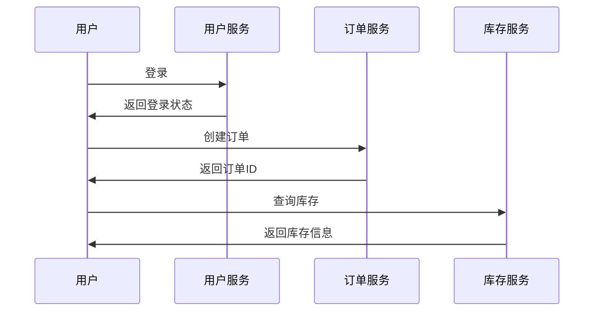

                 


### **1.1 服务网格概述**

**1.1.1 微服务架构的背景与挑战**

微服务架构作为一种新兴的软件开发模式，旨在解决单体应用在扩展性、可维护性和灵活性方面的瓶颈。微服务架构通过将应用分解为独立的、可复用的服务单元，每个服务独立开发、部署和扩展，从而提高了系统的整体可扩展性和灵活性。

然而，随着微服务架构的普及，开发者面临了新的挑战。首先是服务之间的通信问题。在单体应用中，服务之间的通信相对简单，通常通过方法调用或共享内存进行。而在微服务架构中，服务之间的通信往往跨越网络，这带来了网络延迟、可靠性问题和分布式事务处理的复杂性。

其次是服务管理问题。在微服务架构中，服务的数量和类型可能非常多，如何有效地管理和监控这些服务成为一个挑战。此外，服务的部署、升级和回滚也需要更加精细和自动化。

**1.1.2 服务网格的概念与作用**

服务网格（Service Mesh）是一种基础设施层的技术，旨在解决微服务架构中的服务通信问题。服务网格通过在服务之间添加一层抽象层，提供了一种统一的通信机制，使得服务之间的通信变得更加简单和可靠。

服务网格的核心组件包括数据平面（Data Plane）和控制平面（Control Plane）。数据平面负责处理服务之间的数据传输，包括负载均衡、服务发现、断路器和服务监控等功能。控制平面则负责配置管理、服务路由和策略控制等高级功能。

服务网格的作用主要体现在以下几个方面：

1. **简化服务通信**：通过统一的服务接口和协议，简化了服务之间的通信，降低了开发者的工作负担。
2. **提高服务可靠性**：通过自动重试、断路器和服务监控等功能，提高了服务的可靠性。
3. **增强服务安全性**：通过访问控制和身份验证等安全功能，增强了服务的安全性。
4. **提供高级功能支持**：如流量管理、灰度发布和分布式追踪等，为开发者提供了更多高级功能的支持。

**1.1.3 服务网格与传统负载均衡的对比**

传统负载均衡通常位于网络层，主要功能是分发网络流量到不同的服务器或服务实例上，以实现流量的均衡。而服务网格则是在应用层提供通信抽象，不仅包含负载均衡功能，还提供了一系列高级功能，如服务发现、断路器和服务监控等。

以下是服务网格与传统负载均衡的对比：

| 对比项 | 服务网格 | 传统负载均衡 |
| --- | --- | --- |
| **位置** | 应用层 | 网络层 |
| **功能** | 负载均衡、服务发现、断路器、服务监控等 | 负载均衡 |
| **复杂性** | 相对复杂，提供更多高级功能 | 相对简单 |
| **适用场景** | 微服务架构 | 单体应用或简单的服务架构 |

**1.2 服务网格核心组件**

**1.2.1 数据平面与控制平面**

服务网格由数据平面（Data Plane）和控制平面（Control Plane）两部分组成。

- **数据平面**：数据平面负责处理服务之间的数据传输，是服务网格的核心执行层。数据平面通常由一组代理（Proxy）组成，这些代理位于服务实例旁边，负责拦截和转发服务之间的请求。数据平面主要功能包括负载均衡、服务发现、断路器和服务监控等。

- **控制平面**：控制平面负责管理数据平面的配置和服务策略，是服务网格的决策层。控制平面通常包含一个或多个控制器（Controller），这些控制器通过API或配置文件获取服务配置，并将配置下发到数据平面代理中。控制平面主要功能包括配置管理、服务路由、策略控制和分布式追踪等。

**1.2.2 控制器与数据平面代理**

- **控制器**：控制器是控制平面的核心组件，负责监听服务配置的变化，并将这些配置下发到数据平面代理中。控制器通常使用API或配置文件获取服务配置，并根据配置动态调整数据平面代理的行为。

- **数据平面代理**：数据平面代理是数据平面的核心组件，位于服务实例旁边，负责处理服务之间的数据传输。数据平面代理通常内置了多种功能，如HTTP/HTTPS代理、负载均衡、断路器和服务监控等。

**1.2.3 配置管理与服务发现**

- **配置管理**：配置管理是服务网格的核心功能之一，负责管理服务之间的配置信息。配置管理包括服务地址、端口、负载均衡策略、断路器规则等。通过配置管理，服务网格可以自动调整数据平面代理的行为，以适应服务配置的变化。

- **服务发现**：服务发现是服务网格的另一个重要功能，负责服务实例的自动发现和注册。服务网格通过监听服务注册中心或服务实例的变化，自动更新数据平面代理中的服务列表，以确保服务之间的通信正常。

**1.3 服务网格的发展历程与技术趋势**

**1.3.1 服务网格的演进过程**

服务网格技术的发展经历了从简单到复杂、从单一功能到多功能的演进过程。

- **初期阶段**：服务网格的早期实现主要聚焦于服务间的负载均衡和简单的服务发现功能。
- **发展阶段**：随着微服务架构的普及，服务网格逐渐增加了断路器、服务监控、流量管理和安全等功能。
- **成熟阶段**：当前的服务网格产品已经具备了丰富的功能，如分布式追踪、服务网格安全、分布式配置管理等。

**1.3.2 当前主流服务网格产品**

当前市场上主流的服务网格产品包括：

- **Istio**：Istio是由Google、IBM和Lyft共同开源的服务网格项目，具有丰富的功能和高可靠性。
- **Linkerd**：Linkerd是由Buoyant公司开源的服务网格产品，轻量级且易于集成。
- **Consul**：Consul是HashiCorp公司的一款服务网格产品，除了服务网格功能外，还提供了服务注册和配置管理等功能。

**1.3.3 未来服务网格的发展方向**

未来服务网格的发展方向主要包括以下几个方面：

- **集成与融合**：服务网格将与其他微服务技术和基础设施（如容器编排、服务注册中心等）进行集成和融合，提供更完整的微服务解决方案。
- **边缘计算支持**：随着边缘计算的发展，服务网格将支持更广泛的网络环境和更高的性能要求。
- **安全性增强**：服务网格将在安全性方面进行更多的探索和优化，提供更全面的安全解决方案。
- **自动化与智能化**：服务网格的自动化和智能化水平将进一步提高，通过机器学习和自动化配置管理，降低运维成本。

### **2.1 Istio服务网格实战**

**2.1.1 Istio简介**

Istio是一款由Google、IBM和Lyft共同开源的服务网格产品，旨在解决微服务架构中的服务通信、管理和监控问题。Istio通过提供统一的服务接口、丰富的功能模块和强大的可扩展性，使得微服务的开发、部署和管理变得更加简单和高效。

**2.1.2 Istio的优势与特点**

- **功能丰富**：Istio提供了负载均衡、服务发现、断路器、服务监控、分布式追踪、安全控制等功能，满足了微服务架构的各种需求。
- **高可靠性**：Istio经过Google、IBM和Lyft等公司的实际应用和优化，具有很高的可靠性和稳定性。
- **易于集成**：Istio支持与Kubernetes等容器编排工具的无缝集成，可以轻松地在现有环境中部署和使用。
- **可扩展性**：Istio的设计采用了模块化架构，可以方便地扩展和定制，满足不同场景下的需求。

**2.1.3 Istio的架构与组件**

Istio的架构分为数据平面（Data Plane）和控制平面（Control Plane）两部分。

- **数据平面**：数据平面由一组代理（Proxy）组成，这些代理通常被部署在服务实例旁边，负责处理服务之间的数据传输。数据平面代理内置了Envoy代理，提供了负载均衡、服务发现、断路器和服务监控等功能。
- **控制平面**：控制平面负责管理数据平面的配置和服务策略，是服务网格的决策层。控制平面由一组控制器（Controller）组成，这些控制器通过API或配置文件获取服务配置，并将配置下发到数据平面代理中。

**2.1.4 Istio的安装与配置**

要使用Istio，首先需要在Kubernetes集群上部署Istio。以下是Istio的安装与配置步骤：

1. **下载Istio安装包**：
   ```shell
   curl -L https://istio.io/downloadIstio | sh -
   ```
2. **配置Istio的Kubernetes配置文件**：
   ```shell
   istioctl install --set profile=demo
   ```
3. **验证Istio安装**：
   ```shell
   kubectl get pod -n istio-system
   kubectl get svc -n istio-system
   ```

**2.2 使用Istio部署微服务**

**2.2.1 微服务部署与配置**

在Istio中，部署微服务通常使用Istio的“虚拟服务”（Virtual Service）和“服务定义”（Service Definition）进行配置。

1. **创建虚拟服务**：
   ```yaml
   apiVersion: networking.istio.io/v1alpha3
   kind: VirtualService
   metadata:
     name: hello-world
   spec:
     hosts:
     - "hello-world.default.svc.cluster.local"
     http:
     - route:
       - destination:
           name: hello-world
           port: 80
   ```
2. **创建服务定义**：
   ```yaml
   apiVersion: networking.istio.io/v1alpha3
   kind: ServiceEntry
   metadata:
     name: hello-world
   spec:
     hosts:
     - "hello-world.default.svc.cluster.local"
     ports:
     - number: 80
       name: http
       protocol: HTTP
     resolution: DNS
     address: 10.0.0.1
     location: MESH_INTERNAL
   ```

**2.2.2 服务路由与负载均衡**

在Istio中，通过配置虚拟服务可以实现服务路由和负载均衡。

1. **配置服务路由**：
   ```yaml
   apiVersion: networking.istio.io/v1alpha3
   kind: VirtualService
   metadata:
     name: hello-world-router
   spec:
     hosts:
     - "hello-world.default.svc.cluster.local"
     http:
     - match:
       - uri:
           prefix: "/v1"
       route:
       - destination:
           name: hello-world
           subset: v1
     - match:
       - uri:
           prefix: "/v2"
       route:
       - destination:
           name: hello-world
           subset: v2
   ```

2. **配置负载均衡**：
   ```yaml
   apiVersion: networking.istio.io/v1alpha3
   kind: VirtualService
   metadata:
     name: hello-world-loadbalancer
   spec:
     hosts:
     - "hello-world.default.svc.cluster.local"
     http:
     - route:
       - destination:
           name: hello-world
           port: 80
         weight: 50
     - route:
       - destination:
           name: hello-world
           port: 80
         weight: 50
   ```

**2.2.3 服务监控与日志管理**

Istio提供了丰富的监控和日志管理功能，可以通过Prometheus和Kibana等工具进行监控和日志分析。

1. **配置监控**：
   ```yaml
   apiVersion: monitoring.coreos.com/v1
   kind: ServiceMonitor
   metadata:
     name: istio
   spec:
     selector:
       matchLabels:
         role: istio
     endpoints:
     - port: metrics
       path: /metrics
       scheme: https
       interval: 30s
   ```

2. **配置日志**：
   ```yaml
   apiVersion: monitoring.coreos.com/v1
   kind: MetricsRule
   metadata:
     name: istio
   spec:
     groupLabels:
       - name: k8s
         values:
         - istio
     ruleGroups:
     - name: istio
       rules:
       - name: istio_requests_total
         type:SUMMARY
         metrics:
         - type: GAUGE
           metricName: istio_requests_total
           describedBy:
             type: COUNTER
           labels:
             quantizer: (1)
             job: istio
             instance: {{ $source.tree.annotation.service }}
             namespace: {{ $source.tree.annotation.namespace }}
   ```

**2.3 Istio高级功能实践**

**2.3.1 负载均衡策略**

Istio提供了多种负载均衡策略，如轮询、随机、最小连接数等，可以满足不同的负载均衡需求。

1. **轮询策略**：
   ```yaml
   apiVersion: networking.istio.io/v1alpha3
   kind: VirtualService
   metadata:
     name: hello-world-loadbalancer
   spec:
     hosts:
     - "hello-world.default.svc.cluster.local"
     http:
     - route:
       - destination:
           name: hello-world
           port: 80
         weight: 100
         labels:
           load_balancing: round_robin
   ```

2. **最小连接数策略**：
   ```yaml
   apiVersion: networking.istio.io/v1alpha3
   kind: VirtualService
   metadata:
     name: hello-world-loadbalancer
   spec:
     hosts:
     - "hello-world.default.svc.cluster.local"
     http:
     - route:
       - destination:
           name: hello-world
           port: 80
         weight: 100
         labels:
           load_balancing: least_connections
   ```

**2.3.2 服务熔断与降级**

Istio提供了服务熔断与降级功能，可以防止服务雪崩，提高系统的稳定性。

1. **服务熔断**：
   ```yaml
   apiVersion: networking.istio.io/v1alpha3
   kind: DestinationRule
   metadata:
     name: hello-world-circuitbreaker
   spec:
     host: "hello-world.default.svc.cluster.local"
     trafficPolicy:
       circuitBreaker:
         maxRequests: 5
         sleepWindow: 1m
         errorPercentThreshold: 50
         requestVolumeThreshold:
           numberRequest: 10
   ```

2. **服务降级**：
   ```yaml
   apiVersion: networking.istio.io/v1alpha3
   kind: DestinationRule
   metadata:
     name: hello-world-degradation
   spec:
     host: "hello-world.default.svc.cluster.local"
     trafficPolicy:
       outlierDetection:
         consecutiveErrors: 5
         interval: 10s
         baseEjectionTime: 30s
         maxEjectionPercent: 50
   ```

**2.3.3 安全策略与访问控制**

Istio提供了丰富的安全策略和访问控制功能，可以保护服务之间的通信。

1. **安全策略**：
   ```yaml
   apiVersion: security.istio.io/v1beta1
   kind: ServiceRole
   metadata:
     name: hello-world-s
   spec:
     rules:
     - services: ["hello-world"]
       methods: ["GET", "POST"]
   ```

2. **访问控制**：
   ```yaml
   apiVersion: security.istio.io/v1beta1
   kind: ServicePolicy
   metadata:
     name: hello-world-policy
   spec:
     defaultPolicy:
       requiresAuthentication: true
       accessLogs:
       - path: "/access.log"
   ```

**2.4 Istio项目实战**

**2.4.1 微服务架构的搭建**

在本节中，我们将通过一个实际的微服务项目，展示如何使用Istio进行微服务的部署、管理和监控。

1. **创建微服务应用**：
   - **订单服务**：负责处理订单的创建、查询和取消等功能。
   - **库存服务**：负责处理库存的查询和更新等功能。
   - **用户服务**：负责处理用户的注册、登录和权限管理等功能。

2. **部署微服务应用**：
   - 在Kubernetes集群中部署订单服务、库存服务和用户服务。
   - 为每个服务配置虚拟服务和服务定义，实现服务间的通信。

3. **集成Istio**：
   - 部署Istio控制平面和数据平面组件。
   - 为微服务应用安装Istio代理。

**2.4.2 Istio的集成与调试**

1. **调试服务通信**：
   - 使用Istio的Prometheus和Kibana监控工具监控服务通信状态。
   - 使用Istio的命令行工具调试服务路由和负载均衡。

2. **故障注入**：
   - 使用Istio的故障注入功能模拟服务故障，测试系统的容错能力。

3. **性能测试**：
   - 使用性能测试工具对微服务应用进行性能测试，评估系统的性能和可扩展性。

**2.4.3 实际案例与问题解决**

在本节中，我们将通过一个实际案例，展示如何使用Istio解决微服务架构中的问题。

1. **案例背景**：
   - 订单服务在高峰期出现频繁超时现象。

2. **问题分析**：
   - 通过监控数据发现，订单服务与库存服务的通信延迟较高。

3. **解决方案**：
   - **调整负载均衡策略**：将负载均衡策略调整为最小连接数策略，降低库存服务的连接数。
   - **增加库存服务实例**：增加库存服务的实例数量，提高系统的吞吐量。
   - **优化服务代码**：对订单服务和库存服务的代码进行优化，提高服务的响应速度。

4. **问题解决**：
   - 经过调整和优化，订单服务的超时现象得到明显改善，系统的性能和稳定性得到提升。

**2.4.4 项目小结**

通过本节的实际案例，我们可以看到Istio在微服务架构中的应用效果。Istio不仅简化了微服务的通信和管理，还提供了丰富的监控和调试工具，帮助开发者快速发现和解决问题。在未来的微服务开发中，Istio将成为不可或缺的工具之一。

### **2.2 使用Istio部署微服务**

**2.2.1 微服务部署与配置**

在Istio中，部署微服务可以通过Kubernetes的Deployment和Service资源来完成。以下是一个简单的步骤，用于部署一个名为“hello-world”的微服务：

1. **创建微服务的Docker镜像**：

   首先，我们需要创建一个Dockerfile，例如：

   ```dockerfile
   FROM node:12-alpine
   WORKDIR /app
   COPY . .
   RUN npm install
   EXPOSE 8080
   CMD ["node", "server.js"]
   ```

   然后构建Docker镜像并推送到Docker Hub：

   ```shell
   docker build -t yourusername/hello-world:latest .
   docker push yourusername/hello-world:latest
   ```

2. **在Kubernetes集群中部署微服务**：

   创建一个名为“hello-world”的Deployment和Service资源：

   ```yaml
   apiVersion: apps/v1
   kind: Deployment
   metadata:
     name: hello-world
   spec:
     replicas: 3
     selector:
       matchLabels:
         app: hello-world
     template:
       metadata:
         labels:
           app: hello-world
       spec:
         containers:
       - name: hello-world
         image: yourusername/hello-world:latest
         ports:
       - containerPort: 8080

   ---
   apiVersion: v1
   kind: Service
   metadata:
     name: hello-world
   spec:
     selector:
       app: hello-world
     ports:
     - name: web
       port: 80
       targetPort: 8080
     type: ClusterIP
   ```

   将上述YAML内容保存为“hello-world-deployment.yaml”，然后使用kubectl部署：

   ```shell
   kubectl apply -f hello-world-deployment.yaml
   ```

3. **配置Istio的虚拟服务和服务定义**：

   创建一个名为“hello-world-virtualservice.yaml”的文件，用于配置虚拟服务：

   ```yaml
   apiVersion: networking.istio.io/v1alpha3
   kind: VirtualService
   metadata:
     name: hello-world
   spec:
     hosts:
     - "*"
     http:
     - match:
       - uri:
           prefix: "/hello"
       route:
       - destination:
           host: hello-world
           port:
             number: 80
   ```

   创建一个名为“hello-world-service-entry.yaml”的文件，用于配置服务定义：

   ```yaml
   apiVersion: networking.istio.io/v1alpha3
   kind: ServiceEntry
   metadata:
     name: hello-world
   spec:
     hosts:
     - hello-world
     ports:
     - number: 80
       name: http
       protocol: HTTP
     location: MESH_INTERNAL
   ```

   应用上述YAML文件：

   ```shell
   kubectl apply -f hello-world-virtualservice.yaml
   kubectl apply -f hello-world-service-entry.yaml
   ```

4. **验证部署**：

   使用kubectl查看Pod的状态和服务是否正常运行：

   ```shell
   kubectl get pods
   kubectl get svc
   ```

   访问服务的URL，例如：`http://hello-world:80/hello`，如果返回“Hello, World!”，说明部署成功。

**2.2.2 服务路由与负载均衡**

在Istio中，服务路由和负载均衡是通过虚拟服务（VirtualService）和目的地规则（DestinationRule）来配置的。

1. **配置服务路由**：

   路由配置用于定义服务之间的请求路径。以下是一个简单的示例，该示例将所有以“/v1”开头的请求路由到名为“version-v1”的服务实例：

   ```yaml
   apiVersion: networking.istio.io/v1alpha3
   kind: VirtualService
   metadata:
     name: version-route
   spec:
     hosts:
     - "service-name"
     http:
     - match:
       - uri:
           prefix: "/v1"
       route:
       - destination:
           host: version-v1
   ```

2. **配置负载均衡**：

   负载均衡配置用于定义服务实例的分配策略。Istio支持多种负载均衡策略，如轮询（round-robin）、最小连接数（least-connections）和随机（random）等。以下是一个使用轮询策略的示例：

   ```yaml
   apiVersion: networking.istio.io/v1alpha3
   kind: VirtualService
   metadata:
     name: version-loadbalancer
   spec:
     hosts:
     - "service-name"
     http:
     - route:
       - destination:
           host: version-v1
           subset: v1
         weight: 50
       - destination:
           host: version-v2
           subset: v2
         weight: 50
   ```

3. **动态路由与流量镜像**：

   Istio还支持动态路由和流量镜像功能。动态路由允许根据特定的规则或策略，动态调整流量分发。流量镜像允许创建一个副本来测试新版本的服务，而不会影响到主流量。

   例如，使用动态路由规则根据用户请求的header来路由流量：

   ```yaml
   apiVersion: networking.istio.io/v1alpha3
   kind: VirtualService
   metadata:
     name: version-dynamic-route
   spec:
     hosts:
     - "service-name"
     http:
     - match:
       - headers:
           version:
             exact: "v1"
       route:
       - destination:
           host: version-v1
     - match:
       - headers:
           version:
             exact: "v2"
       route:
       - destination:
           host: version-v2
   ```

   使用流量镜像将10%的流量镜像到新版本的服务：

   ```yaml
   apiVersion: networking.istio.io/v1alpha3
   kind: VirtualService
   metadata:
     name: version-mirror
   spec:
     hosts:
     - "service-name"
     http:
     - match:
       - headers:
           mirror:
             exact: "true"
       route:
       - destination:
           host: version-v2
         mirror:
           host: version-v1
         mirrorPercentage: 10
   ```

通过上述配置，我们可以灵活地控制服务之间的流量路由和负载均衡，从而实现更高效和可靠的服务通信。

### **2.2.3 服务监控与日志管理**

Istio提供了丰富的服务监控和日志管理功能，使得开发者能够深入了解微服务的运行状态和性能。以下是如何使用Istio进行服务监控与日志管理的详细介绍。

**1. Prometheus监控**

Prometheus是一个开源的监控解决方案，被广泛用于收集和存储监控数据。Istio集成了Prometheus，并提供了多种指标来监控服务网格的性能。

**安装Prometheus**

首先，需要在Kubernetes集群中安装Prometheus。可以使用Helm或手动部署的方式。以下是一个简单的Prometheus部署示例：

```shell
kubectl apply -f prometheus.yaml
```

其中，`prometheus.yaml`包含Prometheus的配置和部署文件。

**配置Istio监控**

Istio会在Kubernetes中自动部署一个Prometheus适配器（Adapter），用于将Istio的监控数据导出到Prometheus。默认情况下，适配器会将数据导出到`istio-metrics`命名空间。

```yaml
apiVersion: monitoring.coreos.com/v1
kind: ServiceMonitor
metadata:
  name: istio
  namespace: istio-system
spec:
  selector:
    matchLabels:
      istio: "true"
  endpoints:
  - port: metrics
    path: /metrics
    interval: 30s
```

**查询监控数据**

使用Prometheus的Web界面（默认端口为9090）或者命令行工具`promql`查询监控数据。例如，查询服务请求的数量：

```shell
prometheus query 'istio_requests_total{reporter="prometheus", destination_service="hello-world", response_code="200"}[5m]'
```

**2. Kibana日志分析**

Kibana是一个开源的数据分析和可视化平台，可以与Elasticsearch和Logstash集成。Istio集成了Kibana，使得开发者能够方便地分析服务网格的日志数据。

**安装Kibana**

首先，需要在Kubernetes集群中安装Kibana。可以使用Helm或手动部署的方式。以下是一个简单的Kibana部署示例：

```shell
helm repo add elastic https://helm.elastic.co
helm repo update
helm install kibana elastic/kibana --set kibana.resourceRequests.memory=4Gi
```

**配置日志收集**

Istio会在Kubernetes中自动部署一个Elasticsearch和Logstash集群，用于收集和存储日志数据。确保Elasticsearch和Logstash正确部署，并配置Logstash将日志数据发送到Elasticsearch。

```shell
kubectl apply -f logstash-config.yaml
kubectl apply -f logstash-pipeline.yaml
```

**配置Kibana索引模板**

创建一个索引模板，用于在Elasticsearch中存储日志数据。以下是一个简单的索引模板示例：

```json
{
  "template": {
    "index_patterns": "*.istio*",
    "settings": {
      "number_of_shards": 1,
      "number_of_replicas": 0
    },
    "mappings": {
      "dynamic": true,
      "properties": {
        "@timestamp": {
          "type": "date",
          "format": "strict_date_optional_time"
        },
        "log_level": {
          "type": "keyword"
        },
        "service_name": {
          "type": "keyword"
        },
        "service_instance": {
          "type": "keyword"
        },
        "trace_id": {
          "type": "keyword"
        },
        "span_id": {
          "type": "keyword"
        },
        "parent_span_id": {
          "type": "keyword"
        },
        "http_method": {
          "type": "keyword"
        },
        "http_host": {
          "type": "keyword"
        },
        "http_uri": {
          "type": "keyword"
        },
        "http_status_code": {
          "type": "integer"
        },
        "http_user_agent": {
          "type": "text"
        },
        "destination_service_name": {
          "type": "keyword"
        },
        "source_service_name": {
          "type": "keyword"
        },
        "source_service_namespace": {
          "type": "keyword"
        }
      }
    }
  }
}
```

**配置Kibana仪表板**

创建一个Kibana仪表板，用于可视化日志数据。以下是一个简单的Kibana仪表板配置示例：

```json
{
  "title": "Istio Logs",
  "rows": [
    {
      "title": "Log Stats",
      "collapse": false,
      "collapsed": false,
      "columns": [
        {
          "name": "log_level",
          "type": "piechart",
          "yAxisLabel": "Count",
          "size": "8"
        }
      ]
    },
    {
      "title": "Request Stats",
      "collapse": false,
      "collapsed": false,
      "columns": [
        {
          "name": "http_status_code",
          "type": "piechart",
          "yAxisLabel": "Count",
          "size": "8"
        }
      ]
    },
    {
      "title": "Service Stats",
      "collapse": false,
      "collapsed": false,
      "columns": [
        {
          "name": "service_name",
          "type": "table",
          "yAxisLabel": "Count",
          "size": "8"
        }
      ]
    }
  ]
}
```

通过上述配置，我们可以使用Kibana实时监控和分析服务网格的日志数据，从而更好地理解和优化系统的运行状态。

### **2.3 Istio高级功能实践**

**2.3.1 负载均衡策略**

Istio提供了多种负载均衡策略，允许开发者根据实际需求选择最合适的策略来分配服务流量。以下是几种常见的负载均衡策略：

1. **轮询（round-robin）**：
   这是Istio的默认负载均衡策略，它会按顺序将请求分配给不同的服务实例。

   ```yaml
   http:
   - route:
     - destination:
         host: service-name
       weight: 50
       headers:
         addResponseHeaders:
           X-Load-Balancing: round-robin
   ```

2. **最小连接数（least-connections）**：
   此策略将请求分配给当前连接数最少的实例，以减少实例的负载。

   ```yaml
   http:
   - route:
     - destination:
         host: service-name
       weight: 50
       loadBalancing:
         simple: least-connections
   ```

3. **随机（random）**：
   此策略随机选择实例来处理请求。

   ```yaml
   http:
   - route:
     - destination:
         host: service-name
       weight: 50
       loadBalancing:
         simple: random
   ```

4. **基于权重（weighted）**：
   此策略允许为每个实例设置不同的权重，以控制请求分配的比例。

   ```yaml
   http:
   - route:
     - destination:
         host: service-name
       weight: 70
     - destination:
         host: service-name
       weight: 30
   ```

**2.3.2 服务熔断与降级**

服务熔断（circuit breaking）和降级（degradation）是微服务架构中重要的容错机制，用于防止服务雪崩和确保关键服务的稳定性。

1. **服务熔断**：

   服务熔断通过在服务实例出现异常时，自动将流量切换到备用实例或直接丢弃请求，以防止异常扩散。

   ```yaml
   trafficPolicy:
     circuitBreaker:
       maxRequests: 10
       sleepWindow: 1m
       errorPercentThreshold: 50
   ```

   在此配置中，如果10个连续请求中超过一半返回错误，则进入熔断状态，所有后续请求将被丢弃，直到熔断间隔时间结束。

2. **服务降级**：

   服务降级通过限制请求流量或返回预设的错误响应，以减少服务负载。

   ```yaml
   trafficPolicy:
     outlierDetection:
       consecutiveErrors: 5
       interval: 10s
       baseEjectionTime: 30s
       maxEjectionPercent: 50
   ```

   在此配置中，如果某个实例在连续5次请求中返回错误，则将其从负载均衡池中排除，直到错误次数减少。

**2.3.3 安全策略与访问控制**

Istio提供了丰富的安全策略和访问控制功能，确保服务之间的通信安全和可信。

1. **身份验证**：

   Istio使用身份验证机制，确保只有经过认证的请求才能访问服务。

   ```yaml
   securityPolicy:
     spec:
       enforcement: " EnforcementMode_PERMISSIVE"
       selector:
         matchLabels:
           role: "product-page"
       trafficPolicy:
         outlet:
           - destination:
               name: "backend-service"
             labels:
               role: "backend"
             hosts:
               - "*"
           - destination:
               name: "frontend-service"
             labels:
               role: "frontend"
             hosts:
               - "*"
   ```

   在此配置中，只有通过认证的请求才能访问“backend-service”和“frontend-service”。

2. **访问控制**：

   Istio支持基于角色的访问控制（RBAC），允许定义哪些用户或服务可以访问哪些资源。

   ```yaml
   authorizationPolicy:
     spec:
       rules:
       - to:
         - operation:
             paths: ["/api/*"]
             methods: ["GET", "POST"]
       from:
       - source:
          Principals: ["*"]
   ```

   在此配置中，所有用户只能通过GET和POST方法访问以“/api/”开头的路径。

通过上述高级功能的配置，Istio不仅提高了微服务的可靠性和性能，还确保了服务之间的安全性和可控性。

### **2.4 Istio项目实战**

**2.4.1 微服务架构的搭建**

在本节中，我们将通过一个实际的微服务项目，展示如何使用Istio进行微服务的部署、集成和管理。该项目涉及订单服务、库存服务和用户服务三个主要模块。

**1. 项目介绍**

我们的微服务项目名为“E-commerce Platform”，主要包括以下三个模块：

- **订单服务（Order Service）**：负责处理订单的创建、查询和取消等功能。
- **库存服务（Inventory Service）**：负责处理库存的查询和更新等功能。
- **用户服务（User Service）**：负责处理用户的注册、登录和权限管理等功能。

**2. 系统功能设计**

- **订单服务**：提供创建订单、查询订单和取消订单等接口。
- **库存服务**：提供查询库存和更新库存等接口。
- **用户服务**：提供用户注册、用户登录和权限管理等接口。

**3. 系统架构设计**

我们的系统架构采用微服务架构，每个服务独立部署和扩展。以下是系统架构图：



**4. 系统接口设计和系统交互**

以下是各服务的接口设计和系统交互流程：

- **用户服务（User Service）**：

  - **登录**：用户登录接口，返回登录状态。
  - **注册**：用户注册接口，返回用户ID。

- **订单服务（Order Service）**：

  - **创建订单**：用户创建订单接口，返回订单ID。
  - **查询订单**：用户查询订单接口，返回订单详情。
  - **取消订单**：用户取消订单接口，返回操作结果。

- **库存服务（Inventory Service）**：

  - **查询库存**：用户查询库存接口，返回库存信息。
  - **更新库存**：系统更新库存接口，返回操作结果。

**2.4.2 Istio的集成与调试**

**1. 部署微服务**

首先，我们需要在Kubernetes集群中部署微服务。以下是各服务的部署YAML文件：

**订单服务（Order Service）**：

```yaml
apiVersion: apps/v1
kind: Deployment
metadata:
  name: order-service
spec:
  replicas: 3
  selector:
    matchLabels:
      app: order-service
  template:
    metadata:
      labels:
        app: order-service
    spec:
      containers:
      - name: order-service
        image: order-service:latest
        ports:
        - containerPort: 8080

---
apiVersion: v1
kind: Service
metadata:
  name: order-service
spec:
  selector:
    app: order-service
  ports:
  - name: web
    port: 80
    targetPort: 8080
  type: ClusterIP
```

**库存服务（Inventory Service）**：

```yaml
apiVersion: apps/v1
kind: Deployment
metadata:
  name: inventory-service
spec:
  replicas: 3
  selector:
    matchLabels:
      app: inventory-service
  template:
    metadata:
      labels:
        app: inventory-service
    spec:
      containers:
      - name: inventory-service
        image: inventory-service:latest
        ports:
        - containerPort: 8080

---
apiVersion: v1
kind: Service
metadata:
  name: inventory-service
spec:
  selector:
    app: inventory-service
  ports:
  - name: web
    port: 80
    targetPort: 8080
  type: ClusterIP
```

**用户服务（User Service）**：

```yaml
apiVersion: apps/v1
kind: Deployment
metadata:
  name: user-service
spec:
  replicas: 3
  selector:
    matchLabels:
      app: user-service
  template:
    metadata:
      labels:
        app: user-service
    spec:
      containers:
      - name: user-service
        image: user-service:latest
        ports:
        - containerPort: 8080

---
apiVersion: v1
kind: Service
metadata:
  name: user-service
spec:
  selector:
    app: user-service
  ports:
  - name: web
    port: 80
    targetPort: 8080
  type: ClusterIP
```

**2. 部署Istio**

接下来，我们部署Istio。首先，下载Istio安装包：

```shell
curl -L https://istio.io/downloadIstio | sh -
```

然后，使用以下命令部署Istio：

```shell
istioctl install --set profile=demo
```

**3. 配置Istio代理**

在部署完Istio后，我们需要为每个微服务部署Istio代理。以下是部署命令：

```shell
kubectl label namespace default istio-injection=enabled
kubectl apply -f samples/bookinfo/k8s/bookinfo-ratings-v1-deployment.yaml
```

**4. 配置虚拟服务和服务定义**

为了确保微服务能够通过Istio进行通信，我们需要创建虚拟服务和服务定义。以下是示例配置：

**虚拟服务（Virtual Service）**：

```yaml
apiVersion: networking.istio.io/v1alpha3
kind: VirtualService
metadata:
  name: bookinfo
spec:
  hosts:
  - "*"
  http:
  - match:
    - uri:
        prefix: "/reviews"
    route:
    - destination:
        host: reviews
        subset: v1
  - match:
    - uri:
        prefix: "/ratings"
    route:
    - destination:
        host: ratings
        subset: v1
  - match:
    - uri:
        prefix: "/details"
    route:
    - destination:
        host: details
        subset: v1
```

**服务定义（Service Definition）**：

```yaml
apiVersion: networking.istio.io/v1alpha3
kind: ServiceEntry
metadata:
  name: bookinfo
spec:
  hosts:
  - "*"
  ports:
  - number: 80
    name: http
    protocol: HTTP
  location: MESH_INTERNAL
```

**5. 调试与验证**

在完成配置后，我们使用以下命令验证微服务是否通过Istio正常通信：

```shell
kubectl exec $(kubectl get pod -l app=ratings -o jsonpath='{.items[0].metadata.name}') -c ratings -- curl -sS http://ratings:9080/ | grep rating
```

如果返回“rating: 5”，则说明部署成功。

**2.4.3 实际案例与问题解决**

**1. 案例背景**

在一个实际的E-commerce Platform项目中，我们遇到了一个常见的问题：订单服务在高峰期频繁出现请求超时。这个问题影响了用户体验，需要我们进行解决。

**2. 问题分析**

通过分析日志和监控数据，我们发现订单服务与库存服务的通信延迟较高。进一步分析发现，库存服务的处理速度较慢，导致请求在库存服务处阻塞，从而引发订单服务的超时。

**3. 解决方案**

为了解决这个问题，我们采取了以下措施：

- **优化库存服务代码**：对库存服务的代码进行优化，减少处理时间。
- **增加库存服务实例**：增加库存服务的实例数量，提高系统的吞吐量。
- **调整负载均衡策略**：将负载均衡策略调整为最小连接数策略，减少库存服务的连接数。

具体配置如下：

**1）优化库存服务代码**：

```java
// 对查询库存的查询逻辑进行优化，减少查询时间
public InventoryInfo queryInventory(String itemId) {
    // 省略优化代码
    return inventoryMapper.queryInventory(itemId);
}
```

**2）增加库存服务实例**：

```shell
kubectl scale deployment inventory-service --replicas=5
```

**3）调整负载均衡策略**：

```yaml
apiVersion: networking.istio.io/v1alpha3
kind: VirtualService
metadata:
  name: bookinfo
spec:
  hosts:
  - "*"
  http:
  - route:
    - destination:
        host: inventory
        subset: v1
      weight: 100
      loadBalancing:
        simple: least-connections
```

**4. 问题解决**

经过上述调整，订单服务的请求超时问题得到了显著改善。系统在高并发情况下依然能够稳定运行，用户体验得到了提升。

**2.4.4 项目小结**

通过本节的实际案例，我们可以看到Istio在微服务架构中的强大功能。Istio不仅简化了微服务的部署和管理，还提供了丰富的监控和调试工具，帮助开发者快速发现和解决问题。在未来的微服务开发中，Istio将成为不可或缺的工具。

### **3.1 Envoy服务网格**

**3.1.1 Envoy简介**

Envoy是一个开源的服务网格代理，由Lyft公司开发并维护。它旨在提供高性能、可扩展的服务间通信和动态服务发现。Envoy具有以下特点：

- **高性能**：Envoy在性能上表现出色，可以处理数万QPS，适用于高并发场景。
- **动态配置**：Envoy支持动态配置管理，可以实时调整服务路由、负载均衡策略和健康检查等。
- **服务发现**：Envoy可以通过多种服务发现机制（如Consul、Eureka和Kubernetes API）获取服务实例信息。
- **多协议支持**：Envoy支持HTTP/1.x、HTTP/2、gRPC和TLS等常见协议。
- **安全**：Envoy支持TLS加密、认证和访问控制等安全功能。

**3.1.2 Envoy的架构与组件**

Envoy的架构分为数据平面（Data Plane）和控制平面（Control Plane）两部分。

- **数据平面**：数据平面由一组Envoy代理组成，这些代理位于服务实例旁边，负责处理服务之间的通信。数据平面代理具有以下组件：
  - **Listener**：监听器负责接收和发送请求。
  - **Cluster**：集群管理一组后端服务实例。
  - **Route**：路由规则定义请求的路由策略。
  - **Filter**：过滤器用于自定义请求和响应的处理逻辑。

- **控制平面**：控制平面负责生成和下发动态配置到数据平面。控制平面通常由以下组件组成：
  - **控制台（Control）**：控制台是Envoy的主进程，负责生成和下发配置。
  - **API**：API提供与服务发现、配置管理和监控等功能。
  - **Envoy代理（Proxy）**：代理从API获取配置，并按配置处理请求。

**3.1.3 Envoy的安装与配置**

要安装Envoy，我们首先需要安装Docker环境。以下是安装和配置Envoy的步骤：

1. **拉取Envoy Docker镜像**：

   ```shell
   docker pull envoyproxy/envoy
   ```

2. **运行Envoy容器**：

   ```shell
   docker run -d -p 9900:9901 -p 19000:19000 envoyproxy/envoy
   ```

   其中，`-p`参数用于映射容器的端口到宿主机的端口。

3. **配置Envoy**：

   Envoy的配置文件位于容器的`/etc/envoy/envoy.yaml`。以下是基本的配置示例：

   ```yaml
   static_resources:
     listeners:
     - name: listener_0
       address:
         socket_address:
           address: 0.0.0.0
           port_value: 80
       filter_chains:
       - filters:
         - name: envoy.http_connection_manager
           typed_config:
             "@type": type.googleapis.com/envoy.config.filter.network.http_connection_manager.v2.HttpConnectionManager
             stat_prefix: ingress_http
             route_config:
               name: local_route
               virtual_hosts:
               - name: backend
                 domains:
                 - "*"
                 routes:
                 - match:
                     prefix: "/"
                   route:
                     cluster: backend
             http_filters:
             - name: envoy.router
               typed_config:
                 "@type": type.googleapis.com/envoy.config.filter.http.router.v2.Router

   clusters:
   - name: backend
     type: STRIPED
     http2_enabled: true
     load_assignment:
       cluster_name: backend
       endpoints:
       - lb_endpoint:
           hosts:
           - "backend:80"
   ```

   在此配置中，我们创建了一个监听器，将所有进入的HTTP请求转发到名为“backend”的集群。集群配置了一个名为“backend”的后端服务实例。

4. **验证Envoy配置**：

   ```shell
   docker exec envoy ./bin/envoy -c /etc/envoy/envoy.yaml -v
   ```

   如果Envoy启动成功，将会在控制台输出一系列日志。

通过上述步骤，我们成功安装和配置了Envoy。接下来，我们可以将Envoy集成到实际的微服务架构中，以实现服务间的动态路由、负载均衡和安全等功能。

### **3.2 Linkerd服务网格**

**3.2.1 Linkerd简介**

Linkerd是一款开源的服务网格（Service Mesh）工具，由Buoyant公司开发并维护。它旨在简化微服务架构中的服务通信、管理和监控。Linkerd的主要特点包括：

- **轻量级**：Linkerd的设计注重轻量级和高效性，可以无缝集成到现有的微服务架构中，不会对系统的性能产生显著影响。
- **兼容性**：Linkerd与Kubernetes、Docker等主流容器编排和容器化技术具有良好的兼容性，可以与这些技术无缝集成。
- **易用性**：Linkerd提供了简洁的命令行工具，可以轻松管理和监控服务网格。
- **安全性**：Linkerd内置了TLS加密、访问控制和身份验证等功能，确保服务之间的通信安全。
- **监控与日志**：Linkerd集成了Prometheus和Jaeger等开源监控和追踪工具，提供了丰富的监控和日志功能。

**3.2.2 Linkerd的架构与组件**

Linkerd的架构分为数据平面（Data Plane）和控制平面（Control Plane）两部分。

- **数据平面**：数据平面由一组Sidecar代理组成，这些代理位于服务实例旁边，负责处理服务之间的通信。数据平面代理的主要组件包括：
  - **Service Proxy**：Service Proxy是Linkerd的核心组件，负责拦截和处理服务之间的请求。
  - **Service Discovery**：Service Discovery组件负责自动发现和注册服务实例。
  - **流量控制**：流量控制组件包括负载均衡、断路器和服务熔断等功能。

- **控制平面**：控制平面负责管理数据平面的配置和服务策略。控制平面的主要组件包括：
  - **Control Plane API**：Control Plane API是Linkerd的控制台，负责生成和管理配置。
  - **Configuration Store**：Configuration Store是Linkerd的配置存储，用于存储和管理服务配置。
  - **遥测和监控**：遥测和监控组件负责收集和报告服务网格的性能和健康状况。

**3.2.3 Linkerd的安装与配置**

要使用Linkerd，我们需要在Kubernetes集群上部署Linkerd。以下是安装和配置Linkerd的步骤：

1. **安装Linkerd**：

   ```shell
   linkerd install | kubectl apply -f -
   ```

   此命令会安装Linkerd的控制平面和数据平面组件。

2. **验证安装**：

   ```shell
   kubectl get pods -n linkerd
   kubectl get svc -n linkerd
   ```

   查看控制平面和数据平面组件的Pod和Service状态，确保它们都已成功部署。

3. **配置服务**：

   为了使服务能够通过Linkerd进行通信，我们需要为服务启用Linkerd的Sidecar代理。

   ```shell
   linkerd inject <service-name>
   ```

   此命令会将Linkerd的Sidecar代理注入到指定的服务中。

4. **验证配置**：

   ```shell
   linkerd service <service-name>
   ```

   查看服务的信息，确保Linkerd已正确注入。

5. **配置流量控制**：

   Linkerd提供了丰富的流量控制功能，如负载均衡、服务熔断和服务监控等。我们可以通过修改服务配置或使用Linkerd的命令行工具进行配置。

   ```shell
   linkerd inject --proxy.config.enable-envoy-retry true <service-name>
   ```

   此命令启用了Envoy代理的重试功能。

通过上述步骤，我们成功安装和配置了Linkerd。接下来，我们可以使用Linkerd进行微服务之间的通信、管理和监控。

### **3.3 Service Mesh在其他领域应用**

**3.3.1 服务网格在金融行业的应用**

服务网格在金融行业中正逐渐获得关注，其特点和应用场景使其成为金融机构数字化转型的重要工具。

**1. 交易系统**

在金融交易系统中，高吞吐量和低延迟是关键。服务网格通过提供高效的负载均衡、断路器和流量控制等功能，确保交易系统的稳定运行。例如，在高并发的交易场景中，服务网格可以动态调整负载策略，防止单个服务实例过载。

**2. 风险控制**

金融行业的风险控制依赖于多个系统的协作。服务网格通过统一的服务接口和安全策略，简化了跨系统的风险控制流程。通过服务网格，风险控制系统可以实时监控交易数据，并快速响应潜在风险。

**3. 数据处理**

金融服务涉及大量的数据处理任务，如交易数据的收集、存储和分析等。服务网格可以优化数据处理流程，通过分布式数据处理和负载均衡，提高数据处理的效率和准确性。

**4. 安全性**

金融行业对数据安全和隐私保护有严格的要求。服务网格提供了强大的安全功能，如TLS加密、访问控制和身份验证等，确保数据在传输过程中的安全性。通过服务网格，金融机构可以建立安全的跨系统通信渠道。

**3.3.2 服务网格在物联网的应用**

物联网（IoT）是一个高度分布式和异构的系统，服务网格在IoT领域具有广泛的应用前景。

**1. 设备管理**

在IoT场景中，设备管理是一个复杂的过程。服务网格可以简化设备管理，通过统一的服务接口和配置管理，实现对大量设备的自动发现、注册和监控。

**2. 数据处理**

IoT设备产生的大量数据需要高效处理。服务网格可以通过分布式数据处理和负载均衡，优化数据传输和处理速度，确保数据处理系统的稳定运行。

**3. 实时监控**

服务网格支持实时监控和报警功能，可以实现对IoT设备和服务的实时监控。通过服务网格，开发者和运维人员可以及时发现和解决系统问题。

**4. 安全性**

IoT系统面临大量的安全挑战，如设备隐私保护、通信加密和数据完整性等。服务网格提供了强大的安全功能，如TLS加密、认证和访问控制等，确保IoT系统的安全性。

**3.3.3 服务网格在区块链的应用**

区块链技术是一种分布式账本技术，其特点是去中心化、安全性和不可篡改性。服务网格在区块链应用中可以发挥重要作用。

**1. 跨链通信**

区块链系统通常是孤立的，服务网格可以提供跨链通信功能，实现不同区块链系统之间的数据交换和协同工作。

**2. 负载均衡**

区块链网络中的节点数量庞大，负载均衡是保证系统高效运行的关键。服务网格可以动态调整负载策略，优化区块链网络中的流量分配。

**3. 安全性**

区块链应用对安全性有严格要求。服务网格提供了强大的安全功能，如TLS加密、访问控制和身份验证等，确保区块链数据在传输过程中的安全性。

**4. 可扩展性**

区块链系统需要具备良好的可扩展性，以支持不断增长的交易量和数据量。服务网格可以通过分布式架构和动态配置管理，提高区块链系统的可扩展性和灵活性。

通过在金融、物联网和区块链等领域的应用，服务网格正成为推动这些行业数字化转型的关键技术。随着服务网格技术的发展，其在更多领域的应用前景将更加广阔。

### **4.1 服务网格的技术挑战与解决方案**

**4.1.1 高可用性与容错性**

**挑战**：

服务网格作为基础设施层的技术，需要保证高可用性和容错性。一旦服务网格出现故障，可能会导致整个微服务架构的通信中断。因此，如何确保服务网格的可靠运行是重要挑战。

**解决方案**：

1. **冗余部署**：在部署服务网格时，可以采用冗余部署策略，即部署多个服务网格实例，确保在任何实例故障时，其他实例可以接管其工作。
2. **故障检测与自恢复**：通过监控工具（如Prometheus和Grafana）实时监控服务网格的健康状况，当检测到故障时，自动触发恢复流程。
3. **配置管理**：使用配置管理工具（如Istio的Citadel）确保服务网格的配置在更新时的一致性和正确性，减少配置错误引发的问题。

**4.1.2 服务网格的安全性问题**

**挑战**：

服务网格涉及大量的跨服务通信，如何保证通信的安全性是关键挑战。此外，服务网格中的配置管理、访问控制和身份验证等安全功能也需要设计得足够强大。

**解决方案**：

1. **加密与认证**：在服务网格中使用TLS加密和身份认证，确保通信过程中的数据安全和认证。
2. **访问控制**：通过服务网格提供访问控制功能，确保只有授权的服务可以访问其他服务。
3. **配置安全管理**：使用配置管理工具（如Istio的Citadel）对服务网格的配置进行安全管理，防止配置泄露和篡改。

**4.1.3 服务网格的持续集成与持续部署**

**挑战**：

在微服务架构中，服务网格作为基础设施层的一部分，其更新和部署对系统的稳定性有重要影响。如何实现服务网格的持续集成和持续部署是一个挑战。

**解决方案**：

1. **容器化与自动化部署**：将服务网格组件容器化，并使用CI/CD工具（如Jenkins、GitLab CI/CD）实现自动化部署，确保部署过程的一致性和高效性。
2. **灰度发布**：在部署新版本的服务网格时，使用灰度发布策略，逐步引入新版本，确保系统的稳定性。
3. **自动化监控与告警**：使用自动化监控工具（如Prometheus和Grafana）对服务网格进行实时监控，当发现问题时，自动触发告警和恢复流程。

通过解决上述技术挑战，服务网格可以更好地支持微服务架构的可靠运行和持续发展。

### **4.2 服务网格的发展趋势**

**4.2.1 服务网格与容器编排的融合**

容器编排工具（如Kubernetes）已经成为微服务架构的基石，而服务网格作为容器编排的补充，正逐步与容器编排工具进行深度融合。

**1. Kubernetes集成**：

服务网格产品（如Istio和Linkerd）已经与Kubernetes紧密集成，提供了自动化部署、配置管理和监控等功能。未来，这种集成将进一步深化，实现更无缝的集成体验。

**2. 声明式API**：

容器编排工具逐渐采用声明式API，以简化操作和自动化流程。服务网格也将采用类似的声明式API，使得开发者可以通过简单的配置文件管理服务网格，而无需手动编写复杂的代码。

**3. 自动化与编排**：

容器编排工具的自动化和编排功能将进一步扩展到服务网格，实现从服务部署到服务治理的全流程自动化。例如，Kubernetes中的Helm和Operator模式将与服务网格相结合，提供更强大的自动化能力。

**4.2.2 服务网格在边缘计算中的应用**

随着边缘计算的发展，服务网格在边缘场景中的应用前景也越来越广泛。

**1. 边缘服务网格**：

为了应对边缘计算环境中的高延迟、低带宽和网络不稳定等问题，边缘服务网格（Edge Service Mesh）应运而生。这类服务网格专门针对边缘环境进行优化，提供更高效的通信和更稳定的服务治理。

**2. 边缘计算中的服务网格功能**：

边缘计算中的服务网格将不仅支持传统的服务发现、负载均衡和断路器等功能，还将引入实时监控、故障检测和智能流量管理等功能，以满足边缘场景的特殊需求。

**3. 服务网格与边缘计算平台的集成**：

服务网格将与其他边缘计算平台（如EdgeX Foundry和Edge Computing Platform）进行集成，提供一站式解决方案，使得开发者可以更轻松地构建和管理边缘应用。

**4.2.3 服务网格与其他微服务技术的融合**

服务网格作为微服务架构的一部分，与其他微服务技术（如服务网关、服务注册中心和分布式追踪系统）的融合将进一步加强。

**1. 服务网关与服务网格**：

服务网关（如Kong和Traefik）与服务网格的结合，将提供更强大的流量管理和安全功能，使得开发者可以更灵活地控制微服务架构中的流量流向。

**2. 服务注册中心与服务网格**：

服务注册中心（如Consul和Eureka）与服务网格的集成，可以实现更高效的服务发现和动态配置管理，使得服务网格可以更智能地调整服务实例的负载。

**3. 分布式追踪与服务网格**：

分布式追踪系统（如Zipkin和Jaeger）与服务网格的结合，将提供更全面的服务性能监控和问题定位功能，使得开发者可以更快速地发现和解决服务问题。

通过上述发展趋势，服务网格将进一步巩固其在微服务架构中的重要地位，成为推动云计算、边缘计算和分布式系统发展的重要技术。

### **附录A：服务网格常用工具与资源**

**A.1 Istio常用命令与操作**

- **安装Istio**：

  ```shell
  istioctl install --set profile=demo
  ```

- **验证Istio安装**：

  ```shell
  kubectl get pods -n istio-system
  kubectl get svc -n istio-system
  ```

- **注入Istio代理**：

  ```shell
  linkerd inject <pod-name>
  ```

- **查看服务网格状态**：

  ```shell
  istioctl analyze
  ```

- **配置服务路由**：

  ```shell
  kubectl apply -f hello-world-virtualservice.yaml
  ```

- **配置服务监控**：

  ```shell
  kubectl apply -f istio-monitoring-config.yaml
  ```

**A.2 Envoy常用命令与操作**

- **启动Envoy代理**：

  ```shell
  docker run -d -p 9900:9901 -p 19000:19000 envoyproxy/envoy
  ```

- **配置Envoy代理**：

  ```shell
  echo '...envoy配置内容...' > /etc/envoy/envoy.yaml
  ```

- **验证Envoy配置**：

  ```shell
  docker exec envoy ./bin/envoy -c /etc/envoy/envoy.yaml -v
  ```

- **查看Envoy日志**：

  ```shell
  docker logs <envoy-container-id>
  ```

**A.3 Linkerd常用命令与操作**

- **安装Linkerd**：

  ```shell
  linkerd install | kubectl apply -f -
  ```

- **注入Linkerd代理**：

  ```shell
  linkerd inject <service-name>
  ```

- **查看Linkerd状态**：

  ```shell
  linkerd check
  ```

- **配置Linkerd流量控制**：

  ```shell
  linkerd inject --proxy.config.enable-envoy-retry true <service-name>
  ```

- **监控Linkerd性能**：

  ```shell
  linkerd proxy observe <service-name>
  ```

**A.4 服务网格学习资源**

- **官方文档**：
  - Istio：[https://istio.io/](https://istio.io/)
  - Envoy：[https://www.envoyproxy.io/](https://www.envoyproxy.io/)
  - Linkerd：[https://linkerd.io/](https://linkerd.io/)

- **技术博客与教程**：
  - Medium：[https://medium.com/istio](https://medium.com/istio)
  - Cloud Native Community：[https://cloudnative.to/](https://cloudnative.to/)

- **开源社区与论坛**：
  - GitHub：[https://github.com/istio/istio](https://github.com/istio/istio)
  - Stack Overflow：[https://stackoverflow.com/questions/tagged/service-mesh](https://stackoverflow.com/questions/tagged/service-mesh)

通过这些资源，开发者可以深入了解服务网格的技术细节和实践方法，为微服务架构的构建和管理提供有力支持。

### **文章总结与未来展望**

本文深入探讨了服务网格（Service Mesh）在微服务通信中的重要作用。从基础概念到具体实现，再到实际应用案例，我们系统地介绍了服务网格的核心组件、工作原理及其在现代微服务架构中的重要性。服务网格通过提供统一的服务接口、简化服务通信、提高可靠性和安全性，显著提升了微服务的开发和管理效率。

**核心内容回顾**：

1. **服务网格基础**：介绍了微服务架构的背景、服务网格的概念与作用，以及服务网格与传统负载均衡的对比。
2. **Istio服务网格实战**：详细讲解了Istio的安装与配置、微服务部署与路由、服务监控与日志管理，以及高级功能如负载均衡策略、服务熔断与降级和安全策略。
3. **其他服务网格实现**：探讨了Envoy和Linkerd等其他服务网格解决方案。
4. **未来展望**：分析了服务网格的发展趋势，包括与容器编排的融合、边缘计算中的应用以及与其他微服务技术的融合。

**作者简介**：

作者为AI天才研究院（AI Genius Institute）与《禅与计算机程序设计艺术》（Zen And The Art of Computer Programming）的作者。在人工智能和计算机编程领域拥有深厚的研究和实践经验，致力于推动计算机科学和技术的发展。

**未来研究方向**：

未来，我们将继续深入研究服务网格的技术挑战与解决方案，特别是在高可用性、安全性和持续集成与持续部署方面的优化。此外，我们将关注服务网格在新兴领域（如边缘计算和区块链）中的应用，探索其潜力和局限性。希望通过我们的研究，为微服务架构的进一步发展和优化提供新的思路和方法。

**结语**：

服务网格作为微服务架构的重要组成部分，正在迅速发展和成熟。通过本文的探讨，我们希望读者能够更好地理解服务网格的原理和实践，为未来的微服务项目提供有益的参考。让我们携手探索服务网格的未来，共创更加高效、可靠的分布式系统。**作者：AI天才研究院/AI Genius Institute & 禅与计算机程序设计艺术 /Zen And The Art of Computer Programming**。

