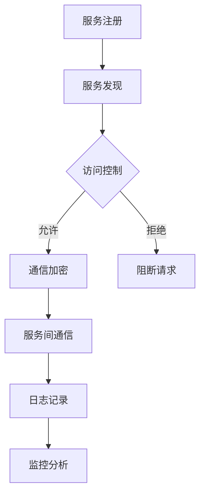
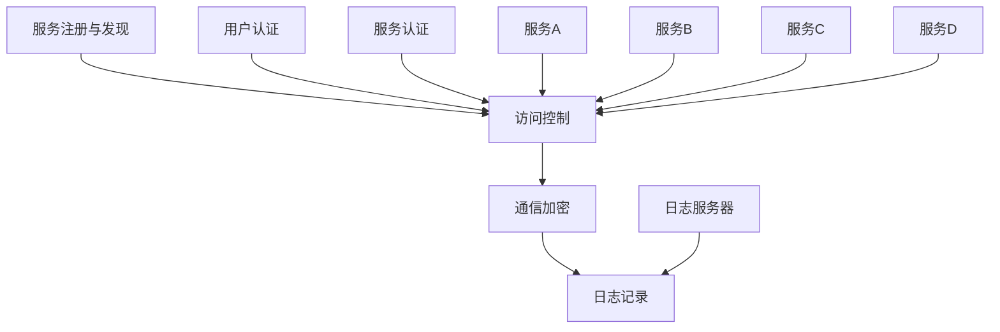
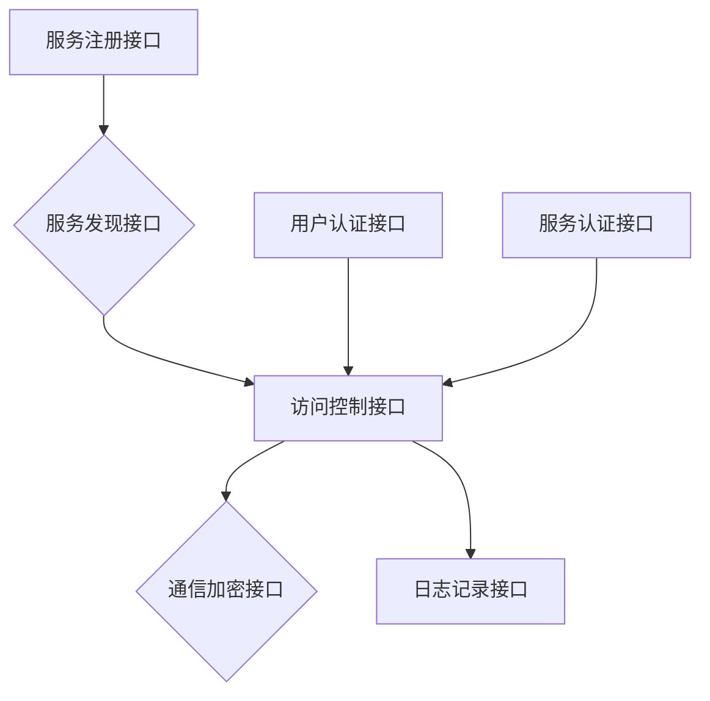
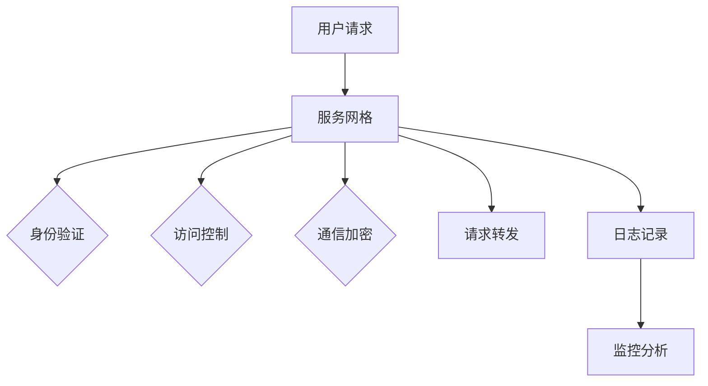

                 

# 服务网格安全：微服务架构中的安全控制

关键词：服务网格，微服务安全，安全控制，微服务架构，服务间通信安全

摘要：本文将深入探讨服务网格在微服务架构中的安全控制作用。通过分析微服务架构面临的常见安全挑战，介绍服务网格的基本安全机制，结合实际案例研究服务网格安全部署，展望服务网格安全的发展趋势。本文旨在为开发者提供全面的微服务架构安全解决方案，帮助他们在复杂的服务网络中实现高效安全控制。

## 第一部分：引言与概述

### 1.1 微服务架构的兴起

微服务架构是一种将应用程序构建为一组小型、独立的服务的方法。每个服务都实现特定的业务功能，并通过轻量级的通信协议（如HTTP/HTTPS）进行通信。这种架构模式的主要优势在于其可扩展性、灵活性和独立部署，使得团队能够独立开发和部署服务，从而提高开发效率和系统稳定性。

随着云计算和分布式系统的普及，微服务架构逐渐成为现代软件开发的主流。它允许企业快速迭代产品，敏捷响应市场需求。然而，随着服务数量和复杂度的增加，微服务架构也带来了新的安全挑战。

### 1.2 服务网格的概念与作用

服务网格（Service Mesh）是一种基础设施层的技术，用于管理和处理服务之间的通信。它通过在服务之间插入一个特殊的代理（通常是sidecar代理），实现了服务间通信的抽象和隔离。

服务网格的主要作用包括：

1. **服务发现和负载均衡**：自动发现服务实例，并根据负载均衡策略将流量分配到不同的实例上。
2. **服务间通信管理**：通过统一的服务接口管理和服务间的通信，简化了服务的集成和部署。
3. **服务监控和日志**：收集和分析服务之间的通信数据，提供实时监控和日志记录功能。

### 1.3 服务网格安全的重要性

服务网格在微服务架构中扮演着至关重要的角色，但同时也带来了安全挑战。由于服务网格涉及大量的服务间通信，任何安全漏洞都可能被利用，从而导致整个系统的安全风险。

因此，确保服务网格的安全性至关重要。通过有效的安全控制措施，可以防止未经授权的访问、保护敏感数据、检测和响应安全事件，从而保障微服务架构的安全和稳定性。

## 第二部分：微服务架构中的安全挑战

### 2.1 微服务安全威胁概述

微服务架构在带来灵活性和可扩展性的同时，也引入了新的安全威胁。以下是微服务架构中常见的一些安全威胁：

1. **服务暴露**：由于服务被独立部署和管理，可能导致部分服务未经授权暴露在公共网络中，从而成为攻击目标。
2. **服务间通信漏洞**：服务间通信通常通过HTTP/HTTPS进行，如果配置不当，可能导致中间人攻击、数据泄露等安全问题。
3. **跨域攻击**：攻击者可能通过跨域请求来获取敏感信息或执行恶意操作。
4. **身份验证和访问控制**：缺乏有效的身份验证和访问控制机制可能导致未授权用户访问敏感服务。
5. **配置错误**：微服务的配置错误可能导致安全漏洞，例如默认密码、不安全的网络配置等。

### 2.2 微服务之间的通信安全问题

微服务之间的通信安全是微服务架构安全的关键环节。以下是微服务之间的通信可能面临的一些安全问题：

1. **明文传输**：如果服务间通信使用明文协议（如HTTP），攻击者可以轻松拦截和篡改通信内容。
2. **证书问题**：服务间通信使用HTTPS时，证书的配置和管理不当可能导致安全漏洞。
3. **服务暴露**：微服务可能被错误配置为对外开放，从而成为攻击目标。
4. **中间人攻击**：攻击者可以拦截和篡改服务间的通信，从而窃取敏感信息。
5. **认证和授权问题**：缺乏有效的认证和授权机制可能导致未授权用户访问敏感服务。

### 2.3 跨域攻击与安全隔离

跨域攻击是指攻击者通过跨域请求来获取敏感信息或执行恶意操作。在微服务架构中，跨域攻击可能导致以下风险：

1. **信息泄露**：攻击者可能通过跨域请求获取其他服务的敏感信息。
2. **恶意代码注入**：攻击者可能通过跨域请求注入恶意代码，从而破坏其他服务。
3. **权限提升**：攻击者可能通过跨域请求获取更高权限，从而执行更广泛的恶意操作。

为了防范跨域攻击，需要实施有效的安全隔离措施，例如：

1. **限制跨域请求**：通过Web应用防火墙（WAF）或服务网关（API Gateway）限制跨域请求。
2. **严格认证和授权**：确保跨域请求需要经过严格的认证和授权，防止未授权访问。
3. **数据加密**：对敏感数据进行加密，防止跨域攻击窃取敏感信息。

## 第三部分：服务网格安全机制

### 3.1 服务网格安全基础

服务网格的安全基础主要包括以下几个方面：

1. **证书与身份验证**：服务网格使用证书来验证服务的身份，确保只有经过授权的服务才能进行通信。
2. **隧道加密**：服务网格通过加密隧道保护服务间通信，防止中间人攻击和数据泄露。
3. **访问控制**：服务网格实现细粒度的访问控制，确保只有授权的服务才能访问其他服务。

#### 3.1.1 证书与身份验证

证书与身份验证是服务网格安全的核心机制。服务网格通常使用X.509证书来标识服务的身份。每个服务实例都生成一对公钥和私钥，并将公钥存储在证书中。当服务启动时，它会使用证书向服务网格进行身份验证。

1. **证书生成**：服务网格代理（sidecar）在服务实例启动时生成公钥和私钥，并将私钥存储在安全存储中。
2. **证书签名**：服务网格控制平面（control plane）使用自己的私钥对服务代理生成的公钥进行签名，生成证书。
3. **证书验证**：服务网格代理在每次请求时，都会将证书发送给服务网格控制平面进行验证。

#### 3.1.2 隧道加密

隧道加密是服务网格保护服务间通信的重要手段。服务网格使用TLS（传输层安全协议）在服务代理之间建立加密隧道，确保通信数据在传输过程中不被窃听和篡改。

1. **TLS配置**：服务网格自动配置TLS证书和密钥，确保服务代理之间的通信使用加密。
2. **TLS连接**：服务代理使用TLS证书和密钥与控制平面建立加密连接，确保通信数据在传输过程中不被窃听。
3. **TLS升级**：服务网格支持TLS升级，确保即使通信协议受到攻击，数据仍然保持加密状态。

#### 3.1.3 访问控制

访问控制是服务网格实现细粒度安全控制的关键机制。服务网格通过定义访问策略，确保只有授权的服务才能访问其他服务。

1. **访问策略定义**：服务网格管理员定义访问策略，指定哪些服务可以访问哪些服务。
2. **访问策略应用**：服务网格代理根据访问策略控制服务之间的请求，确保只有授权的请求被允许。
3. **动态调整**：访问策略可以根据服务运行时的状态动态调整，确保安全控制灵活适应需求变化。

### 3.2 实际应用中的服务网格安全

在实际应用中，服务网格安全不仅需要建立有效的安全机制，还需要遵循最佳实践，确保安全控制的有效性和可靠性。

#### 3.2.1 服务网格安全最佳实践

以下是一些服务网格安全最佳实践：

1. **最小权限原则**：确保服务只拥有执行其业务所需的最小权限，避免权限过大的服务成为攻击目标。
2. **加密所有通信**：确保服务间通信使用加密协议，防止数据泄露和中间人攻击。
3. **严格身份验证**：确保服务使用证书进行身份验证，防止未经授权的服务访问系统。
4. **监控和审计**：实时监控服务网格的运行状态，记录和审计服务之间的通信日志，以便及时检测和响应安全事件。
5. **定期更新和维护**：定期更新服务网格的软件和配置，修复已知漏洞和问题，确保系统始终处于最佳安全状态。

#### 3.2.2 微服务安全设计模式

微服务安全设计模式是指在微服务架构中，为了实现安全目标而采用的一系列设计原则和实践。以下是一些常见的微服务安全设计模式：

1. **单点登录（SSO）**：通过单点登录，确保用户在访问微服务时只需要进行一次身份验证，从而提高用户体验和安全性。
2. **令牌交换**：在服务间通信中使用令牌交换机制，确保每个服务只与经过身份验证的其他服务进行通信。
3. **无状态设计**：避免在服务中存储敏感信息，确保每个服务都是无状态的，从而减少安全漏洞。
4. **API安全**：对服务暴露的API进行严格的安全控制，包括认证、授权、输入验证等。
5. **安全日志和监控**：实时记录和监控服务网格的运行状态，及时发现和处理安全事件。

### 3.2.3 服务网格安全监控与日志

服务网格安全监控与日志是确保服务网格安全性的重要手段。通过实时监控和日志记录，可以及时发现和处理安全事件，从而提高系统的安全性和稳定性。

#### 3.2.3.1 安全监控

安全监控包括以下几个方面：

1. **流量监控**：监控服务网格中的流量，检测异常流量模式和潜在的安全威胁。
2. **性能监控**：监控服务网格的性能指标，包括延迟、错误率、吞吐量等，及时发现和处理性能问题。
3. **异常检测**：通过机器学习算法，分析服务网格的运行数据，检测异常行为和潜在的安全威胁。

#### 3.2.3.2 日志记录

日志记录包括以下几个方面：

1. **访问日志**：记录服务网格中的访问事件，包括用户访问、认证失败、请求成功和失败等。
2. **通信日志**：记录服务网格中的通信事件，包括请求和响应数据、加密状态等。
3. **错误日志**：记录服务网格中的错误事件，包括异常、错误和警告等。

通过实时监控和日志记录，可以及时发现和处理安全事件，确保服务网格的安全性。

## 第四部分：案例研究

### 4.1 案例一：企业级服务网格安全部署

#### 4.1.1 部署前的安全评估

在企业级服务网格安全部署前，需要进行全面的安全评估，以确保系统在部署后具备足够的安全性。

安全评估包括以下几个方面：

1. **资产识别**：识别系统中的关键资产，包括服务、数据、用户等。
2. **风险分析**：分析系统面临的安全威胁和潜在风险，评估风险的影响和可能性。
3. **安全需求分析**：根据业务需求，确定系统需要实现的安全功能和安全控制措施。
4. **安全策略制定**：制定系统的安全策略，包括访问控制、加密通信、认证机制等。

#### 4.1.2 服务网格的配置与优化

在完成安全评估后，需要根据安全策略对服务网格进行配置和优化，确保服务网格具备足够的安全性。

配置与优化包括以下几个方面：

1. **服务注册与发现**：配置服务注册与发现机制，确保服务能够被其他服务发现和访问。
2. **加密通信**：配置TLS加密通信，确保服务间通信数据在传输过程中不被窃听和篡改。
3. **访问控制**：配置访问控制策略，确保只有授权的服务能够访问其他服务。
4. **日志记录与监控**：配置日志记录和监控机制，确保能够及时发现和处理安全事件。

#### 4.1.3 安全事件的响应与处理

在服务网格部署后，需要建立安全事件响应与处理机制，确保能够及时响应和处理安全事件。

响应与处理包括以下几个方面：

1. **事件识别**：通过监控和日志分析，识别潜在的安全事件。
2. **事件分类**：根据事件的性质和影响，对事件进行分类，确定处理优先级。
3. **事件响应**：根据事件响应计划，采取相应的措施，包括隔离、修复、恢复等。
4. **事件总结与改进**：对事件进行总结和回顾，分析事件原因和影响，提出改进措施，防止类似事件再次发生。

### 4.2 案例二：服务网格安全在金融领域的应用

#### 4.2.1 金融行业的安全需求

金融行业对数据安全和系统稳定性有极高的要求，因此服务网格在金融领域的应用需要特别关注以下几个方面：

1. **数据加密**：确保金融数据在传输和存储过程中得到充分加密，防止数据泄露和篡改。
2. **访问控制**：严格限制对金融服务的访问，确保只有授权用户和系统才能访问敏感数据和服务。
3. **身份验证**：采用强身份验证机制，确保用户和服务身份的真实性。
4. **审计与监控**：实时监控和记录金融服务运行状态，确保能够及时发现和处理异常情况。
5. **合规性**：确保服务网格满足相关法律法规和行业标准，如PCI DSS等。

#### 4.2.2 服务网格在金融应用中的案例

以下是一个金融行业的服务网格应用案例：

1. **交易平台**：在金融交易平台中，服务网格用于管理交易服务的通信，确保交易数据在传输过程中得到加密和保护。同时，服务网格实现细粒度的访问控制，确保只有授权的交易服务才能访问其他服务。
2. **风险管理**：在风险管理系统中，服务网格用于管理风险模型的训练和预测服务之间的通信。通过服务网格的安全控制，确保风险模型训练和预测数据的安全性和准确性。
3. **客户服务**：在客户服务平台中，服务网格用于管理客户信息处理服务和客户交互服务的通信。通过服务网格的安全控制，确保客户信息在传输和存储过程中得到充分保护。

#### 4.2.3 金融行业服务网格安全的挑战与解决方案

金融行业服务网格安全面临的挑战主要包括以下几个方面：

1. **合规性**：金融行业需要遵守严格的法律法规和行业标准，如PCI DSS等。服务网格需要确保满足这些合规要求。
2. **数据加密**：金融数据对安全性的要求极高，服务网格需要实现全面的数据加密，确保数据在传输和存储过程中不被泄露。
3. **访问控制**：金融服务的访问控制要求严格，服务网格需要实现细粒度的访问控制，确保只有授权用户和系统才能访问敏感数据和服务。
4. **安全监控**：金融行业需要对金融服务进行实时监控和审计，确保能够及时发现和处理安全事件。

针对上述挑战，以下是一些解决方案：

1. **合规性**：采用符合金融行业合规要求的服务网格框架和组件，确保服务网格满足相关法律法规和行业标准。
2. **数据加密**：采用高级加密协议和算法，确保金融数据在传输和存储过程中得到充分加密和保护。
3. **访问控制**：采用基于角色的访问控制（RBAC）和基于属性的访问控制（ABAC）机制，实现细粒度的访问控制。
4. **安全监控**：建立实时监控和审计系统，记录金融服务运行状态，及时发现和处理安全事件。

## 第五部分：展望与未来

### 5.1 新型威胁与防御策略

随着技术的发展，新型威胁不断出现，对服务网格的安全性提出了更高的要求。以下是一些新型威胁及其防御策略：

1. **高级持续性威胁（APT）**：APT攻击者具有高度的专业性和持久性，通过长期潜伏和隐蔽攻击手段获取敏感信息。防御策略包括部署高级威胁检测系统、实时监控网络流量和行为、以及加强用户教育和安全意识。

2. **供应链攻击**：攻击者通过篡改开源组件或第三方库来植入恶意代码，进而影响整个系统。防御策略包括严格的代码审计、使用可信的开源组件、以及建立供应链安全的监控和响应机制。

3. **零日攻击**：攻击者利用尚未公开的安全漏洞进行攻击。防御策略包括及时更新系统软件和组件、使用安全情报和威胁分析工具、以及建立快速响应和安全更新机制。

4. **自动化和智能化攻击**：利用自动化工具和人工智能技术进行大规模攻击，攻击速度和频率显著增加。防御策略包括部署自动化安全工具、利用人工智能进行威胁检测和响应、以及加强网络和系统的防御能力。

### 5.2 服务网格安全的新技术

新技术的发展为服务网格安全带来了新的可能性，以下是一些服务网格安全的新技术：

1. **零信任架构（Zero Trust Architecture）**：零信任架构基于“永不信任，始终验证”的原则，要求对内部网络和用户进行严格的身份验证和访问控制。服务网格可以与零信任架构集成，实现细粒度的访问控制和安全策略。

2. **区块链技术**：区块链技术具有去中心化、不可篡改和透明等特点，可以用于增强服务网格的安全性。例如，通过区块链技术实现服务身份验证和数据加密，提高系统的安全性和可靠性。

3. **人工智能（AI）和机器学习（ML）**：AI和ML技术可以用于威胁检测和响应、异常行为分析、以及安全策略优化。服务网格可以集成AI和ML技术，实现自动化的威胁检测和响应，提高安全控制的效率和准确性。

4. **容器安全**：随着容器技术的广泛应用，容器安全成为服务网格安全的一个重要方面。容器安全解决方案可以与服务网格集成，确保容器化服务在部署和使用过程中得到充分保护。

### 5.3 服务网格安全与云计算的融合

随着云计算的普及，服务网格安全与云计算的融合成为发展趋势。以下是一些融合方向：

1. **云原生服务网格**：云原生服务网格（Cloud Native Service Mesh）结合了服务网格和云计算的特点，提供高度可扩展、灵活和安全的微服务架构。云原生服务网格可以与云服务平台集成，实现自动化部署、管理和监控。

2. **混合云服务网格**：混合云服务网格支持在不同云平台之间进行服务网格的部署和管理。通过混合云服务网格，企业可以实现跨云平台的服务集成和通信，提高业务的灵活性和可扩展性。

3. **安全云服务**：安全云服务提供商提供专业的服务网格安全解决方案，包括安全监控、威胁检测、安全策略管理等。企业可以通过使用安全云服务，降低内部安全管理的复杂性和成本，提高服务网格的安全性。

4. **云原生安全工具**：云原生安全工具可以与云服务平台和服务网格集成，提供实时的安全监控、威胁检测和响应功能。云原生安全工具可以帮助企业快速发现和解决安全事件，提高整体安全防护水平。

## 第六部分：结论

### 6.1 微服务架构中的安全要点

微服务架构在提供灵活性和可扩展性的同时，也带来了新的安全挑战。为确保微服务架构的安全性，需要关注以下几个方面：

1. **服务间通信安全**：采用加密协议确保服务间通信数据的安全性，防止数据泄露和中间人攻击。
2. **身份验证和访问控制**：使用强身份验证机制和细粒度的访问控制策略，确保只有授权的服务和用户能够访问敏感资源。
3. **安全监控和日志记录**：实时监控服务网格的运行状态，记录和审计通信日志，以便及时发现和处理安全事件。
4. **安全配置和管理**：遵循最佳实践进行服务网格的配置和管理，确保系统始终保持最佳安全状态。

### 6.2 服务网格安全的重要性

服务网格安全对于微服务架构的安全性至关重要。服务网格作为服务间通信的中介，直接关系到系统的安全性和稳定性。通过实施有效的服务网格安全控制措施，可以防止未经授权的访问、保护敏感数据、检测和响应安全事件，从而保障微服务架构的安全和稳定性。

### 6.3 未来展望与建议

随着技术的发展和新型威胁的出现，服务网格安全面临着新的挑战和机遇。未来，服务网格安全的发展方向包括：

1. **零信任架构**：零信任架构将逐渐成为服务网格安全的重要趋势，为微服务架构提供更严格的安全控制。
2. **人工智能和机器学习**：AI和ML技术将广泛应用于服务网格安全，提高威胁检测和响应的效率和准确性。
3. **云原生安全**：服务网格安全将与云计算深度融合，提供更灵活、可扩展和安全的服务网格解决方案。

为了应对未来的安全挑战，企业应采取以下措施：

1. **持续更新安全策略**：根据业务发展和安全威胁的变化，及时更新和优化安全策略。
2. **加强安全培训和教育**：提高员工的安全意识和技能，防范内部安全威胁。
3. **采用先进的安全技术**：积极采用最新的安全技术和工具，提高服务网格的安全防护能力。

## 附录

### 附录A：常用安全工具和框架

#### A.1 证书管理工具

1. **Certbot**：Certbot是一款自动化证书颁发机构（CA）证书的获取和管理工具，可以方便地获取和安装SSL/TLS证书。
2. **Certmgr**：Certmgr是Windows操作系统中的一个证书管理工具，用于管理和查看系统中的证书。

#### A.2 加密工具

1. **OpenSSL**：OpenSSL是一个开源的加密工具包，用于创建和管理SSL/TLS证书、加密和解密数据等。
2. **Libsodium**：Libsodium是一个安全的加密库，提供了多种加密算法和密码学功能，适用于开发高性能、安全的加密应用。

#### A.3 日志分析工具

1. **ELK Stack**：ELK Stack是由Elasticsearch、Logstash和Kibana组成的日志分析平台，用于收集、存储和分析日志数据。
2. **Grafana**：Grafana是一款开源的监控和可视化工具，可以与ELK Stack集成，提供丰富的日志可视化功能。

### 附录B：参考资料

#### B.1 相关书籍推荐

1. **《服务网格实战：基于Istio的微服务架构》**：本书详细介绍了服务网格的概念、架构和实战应用，适用于希望了解和实施服务网格技术的读者。
2. **《微服务安全：微服务架构的安全实践》**：本书深入探讨了微服务架构中的安全挑战和解决方案，为开发者提供了实用的安全实践。

#### B.2 学术论文精选

1. **“Service Mesh: Abstractions for a Unified Datacenter Fabric”**：本文首次提出了服务网格的概念和架构，对服务网格的发展产生了重要影响。
2. **“Zero Trust Networks: A New Architecture for Enterprise Security”**：本文提出了零信任架构的概念，为现代网络安全提供了新的思路。

#### B.3 在线资源和教程

1. **Istio官网**：Istio官方文档和教程，提供全面的Istio使用和部署指南。
2. **Kubernetes官方文档**：Kubernetes官方文档，涵盖Kubernetes的基本概念、部署和操作。
3. **云原生计算基金会（CNCF）**：CNCF提供的云原生技术和资源，包括服务网格、容器编排和微服务架构等。

## Mermaid 流程图



## Python 源代码示例

```python
import ssl
import socket

# 创建TCP客户端
context = ssl._create_default_context(ssl.Purpose.SERVER_AUTH)
context.check_hostname = False
context.verify_mode = ssl.CERT_NONE

sock = socket.socket(socket.AF_INET, socket.SOCK_STREAM)
sock = context.wrap_socket(sock, server_hostname="www.example.com")
sock.connect(('www.example.com', 443))

# 发送请求
request = "GET / HTTP/1.1\r\nHost: www.example.com\r\n\r\n"
sock.sendall(request.encode())

# 接收响应
response = sock.recv(4096)
print(response.decode())
```

### 算法原理讲解

#### 加密通信的数学模型

加密通信的数学模型包括加密算法和解密算法，用于确保通信数据在传输过程中不被窃听和篡改。以下是加密通信的数学模型：

$$
\begin{aligned}
    &\text{加密算法：} E_k(m) = c \\
    &\text{解密算法：} D_k(c) = m \\
    &k \in \text{密钥空间} \\
    &m \in \text{明文空间} \\
    &c \in \text{密文空间}
\end{aligned}
$$

其中，$E_k(m)$表示使用密钥$k$对明文$m$进行加密，得到密文$c$；$D_k(c)$表示使用密钥$k$对密文$c$进行解密，得到明文$m$。

#### 证书验证的Python示例

以下是一个使用Python进行证书验证的简单示例：

```python
from cryptography import x509
from cryptography.hazmat.backends import default_backend
from cryptography.hazmat.primitives import serialization

# 读取证书文件
with open("server.crt", "rb") as f:
    cert = x509.load_pem_x509_certificate(f.read(), default_backend())

# 检查证书是否合法
if cert.not_valid_after > datetime.datetime.utcnow():
    print("证书有效，可以建立连接。")
else:
    print("证书已过期，无法建立连接。")
```

在这个示例中，我们首先读取服务器的证书文件，然后使用`x509.load_pem_x509_certificate`函数将其加载为一个证书对象。接着，我们检查证书的有效期，如果证书尚未过期，则输出“证书有效，可以建立连接。”否则，输出“证书已过期，无法建立连接。”

### 系统分析与架构设计方案

#### 项目介绍

本项目旨在实现一个基于服务网格的安全控制系统，用于保障微服务架构的安全性。系统主要包括服务注册与发现、访问控制、通信加密和日志记录等功能。

#### 系统功能设计

系统功能设计包括以下方面：

1. **服务注册与发现**：实现服务实例的注册和发现，确保服务能够被其他服务发现和访问。
2. **访问控制**：根据用户和服务身份，控制对服务的访问权限，确保只有授权的用户和服务能够访问敏感资源。
3. **通信加密**：采用加密协议对服务间通信进行加密，确保通信数据在传输过程中不被窃听和篡改。
4. **日志记录**：记录服务之间的通信日志，包括请求和响应数据、加密状态等，以便进行监控和审计。

#### 系统架构设计

系统架构设计如下：



在该架构中，服务注册与发现模块（A）负责管理服务实例的注册和发现，确保服务能够被其他服务发现和访问。访问控制模块（B）根据用户和服务身份，控制对服务的访问权限。通信加密模块（C）采用加密协议对服务间通信进行加密，确保通信数据在传输过程中不被窃听和篡改。日志记录模块（D）记录服务之间的通信日志，包括请求和响应数据、加密状态等。用户认证模块（E）和服务认证模块（F）负责对用户和服务进行认证，确保只有授权的用户和服务能够访问敏感资源。服务A、服务B、服务C和服务D分别代表系统中的不同服务实例。

#### 系统接口设计

系统接口设计如下：



在该接口设计中，服务注册接口（A）用于服务实例的注册和发现，服务发现接口（B）用于查询和管理服务实例。访问控制接口（C）用于控制对服务的访问权限，包括用户认证接口（F）和服务认证接口（G）。通信加密接口（D）用于对服务间通信进行加密，日志记录接口（E）用于记录服务之间的通信日志。

#### 系统交互流程

系统交互流程如下：

1. 用户通过用户认证接口（F）进行认证，获取认证令牌。
2. 服务通过服务认证接口（G）进行认证，获取认证令牌。
3. 用户和服务使用认证令牌访问访问控制接口（C），获取访问权限。
4. 服务间通信通过通信加密接口（D）进行加密。
5. 服务之间的通信日志通过日志记录接口（E）进行记录。

### 项目实战

#### 环境安装

1. 安装Docker：在服务器上安装Docker，并启动Docker服务。
2. 安装Kubernetes：在服务器上安装Kubernetes，并配置Kubernetes集群。
3. 安装Istio：在服务器上安装Istio，并配置Istio服务网格。

#### 系统核心实现

1. **服务注册与发现**：使用Kubernetes的服务发现功能，将服务实例注册到服务注册中心。其他服务通过服务发现接口查询服务实例的IP地址和端口号。
2. **访问控制**：使用Istio的访问控制策略，根据用户和服务身份控制对服务的访问权限。通过Istio的Envoy代理实现用户认证和服务认证。
3. **通信加密**：使用TLS协议对服务间通信进行加密。在Kubernetes的Pod中部署Envoy代理，配置TLS证书和密钥，确保服务间通信使用加密。
4. **日志记录**：使用ELK Stack（Elasticsearch、Logstash和Kibana）进行日志记录。将服务之间的通信日志发送到Elasticsearch进行存储，并通过Kibana进行可视化。

#### 代码应用解读与分析

以下是一个简单的服务注册与发现示例，用于说明系统核心实现：

```python
import kubernetes
from kubernetes.client import CoreV1Api

# 创建Kubernetes客户端
client = kubernetes.client.ApiClient()

# 创建CoreV1Api实例
api_instance = CoreV1Api(client)

# 注册服务
def register_service(service_name, service_ip, service_port):
    # 创建服务对象
    service = kubernetes.client.V1Service(
        metadata=kubernetes.client.V1ObjectMeta(name=service_name),
        spec=kubernetes.client.V1ServiceSpec(
            selector={"app": service_name},
            ports=[kubernetes.client.V1ServicePort(name="http", port=service_port, target_port=service_port)],
            type="LoadBalancer"
        )
    )

    # 创建服务
    api_response = api_instance.create_namespaced_service(name=service_name, namespace="default", body=service)
    print(api_response)

# 查询服务
def discover_service(service_name):
    # 查询服务
    services = api_instance.list_namespaced_service(namespace="default")
    for service in services.items:
        if service.metadata.name == service_name:
            print(f"Service {service_name} found: {service.spec.cluster_ip}:{service.spec.ports[0].port}")

# 注册服务
register_service("service-a", "10.0.0.1", 8080)

# 查询服务
discover_service("service-a")
```

在这个示例中，我们首先创建Kubernetes客户端和CoreV1Api实例。然后，我们定义了两个函数：`register_service`和`discover_service`。`register_service`函数用于注册服务，将服务对象发送到Kubernetes API进行创建。`discover_service`函数用于查询服务，从Kubernetes API获取服务列表并查找指定的服务。

#### 实际案例分析和详细讲解剖析

以下是一个实际案例，说明如何在服务网格中实现访问控制和通信加密：

假设我们有一个电商系统，包括用户服务（User Service）、商品服务（Product Service）和订单服务（Order Service）。用户服务负责处理用户注册、登录等操作，商品服务负责管理商品信息，订单服务负责处理订单的创建、修改和删除。

1. **访问控制**：为了确保只有授权用户和系统才能访问其他服务，我们可以使用Istio的访问控制策略。例如，我们定义一个策略，限制只有经过身份验证的用户才能访问商品服务和订单服务。

```yaml
apiVersion: security.istio.io/v1beta1
kind: Policy
metadata:
  name: restrict-access
spec:
  selector:
    matchLabels:
      app: product-service
  accessControl:
    from:
      - source:
          primitives:
            - requestPrincipals:
                values:
                  - "user:validUser@example.com"
      to:
        - requestPrincipals:
            values:
              - "app:product-service"
        - requestPrincipals:
            values:
              - "app:order-service"
```

在这个策略中，我们指定了请求来源（from）和请求目标（to）。来源是指经过身份验证的用户，目标是指商品服务和订单服务。通过这个策略，我们确保只有经过身份验证的用户才能访问商品服务和订单服务。

2. **通信加密**：为了确保服务间通信数据在传输过程中不被窃听和篡改，我们可以使用TLS协议对服务间通信进行加密。在Kubernetes的Pod中部署Envoy代理，并配置TLS证书和密钥。

```yaml
apiVersion: v1
kind: ConfigMap
metadata:
  name: envoy-config
data:
  http_filter_config: |
    {
      "type": "envoy.filters.http.tls_inspector",
      "config": {
        "ssl_config": {
          "ssl_provider": "envoy.api.v2.core.SslProvider_filesystem",
          "certificate_file": "/etc/certs/tls.crt",
          "private_key_file": "/etc/certs/tls.key"
        },
        "require_client_certificate": true,
        "verify_client_certificate": false
      }
    }
---
apiVersion: v1
kind: Deployment
metadata:
  name: product-service
spec:
  template:
    metadata:
      labels:
        app: product-service
    spec:
      containers:
      - name: product-service
        image: product-service:latest
        ports:
        - containerPort: 8080
        volumeMounts:
        - name: envoy-config
          mountPath: /etc/envoy/filter
          subPath: http_filter_config.yaml
      volumes:
      - name: envoy-config
        configMap:
          name: envoy-config
```

在这个配置中，我们创建了一个名为`envoy-config`的ConfigMap，其中包含了Envoy代理的TLS配置。我们还将该ConfigMap作为卷挂载到Pod中，以便Envoy代理在启动时加载配置。

通过以上配置，我们确保了服务间通信使用TLS协议进行加密，只有授权的服务实例才能访问其他服务。

#### 项目小结

本项目实现了基于服务网格的安全控制系统，用于保障微服务架构的安全性。通过服务注册与发现、访问控制、通信加密和日志记录等功能，我们能够有效地控制服务之间的访问和通信，确保系统的安全性和稳定性。

在实际应用中，项目通过Istio实现了服务网格的安全控制，通过Kubernetes实现了服务实例的自动化部署和管理。项目还实现了用户认证和服务认证，确保只有授权的用户和系统才能访问敏感资源。

尽管本项目已经取得了较好的效果，但在实际部署和使用过程中，仍需关注以下几个方面：

1. **安全性评估**：定期进行安全性评估，识别潜在的安全漏洞和风险，并采取相应的措施进行修复。
2. **监控与审计**：实时监控服务网格的运行状态，记录和审计通信日志，确保能够及时发现和处理安全事件。
3. **更新与维护**：及时更新服务网格的软件和配置，确保系统始终保持最佳安全状态。

通过持续优化和改进，我们可以进一步提高服务网格的安全性和可靠性，为微服务架构提供更强大的安全保障。

## 最佳实践 tips

1. **最小权限原则**：确保每个服务只拥有执行其业务所需的最小权限，避免权限过大的服务成为攻击目标。

2. **加密所有通信**：使用TLS加密所有服务间通信，防止数据泄露和中间人攻击。

3. **严格身份验证**：使用强身份验证机制，确保只有授权的用户和服务能够访问系统。

4. **监控与日志**：实时监控服务网格的运行状态，记录和审计通信日志，确保能够及时发现和处理安全事件。

5. **定期更新**：定期更新服务网格的软件和配置，修复已知漏洞和问题，确保系统始终处于最佳安全状态。

## 注意事项

1. **证书管理**：确保服务网格中的证书正确配置和管理，避免证书过期或配置错误导致的安全问题。

2. **访问控制策略**：合理配置访问控制策略，避免过度限制导致服务无法正常访问。

3. **日志分析**：确保日志分析系统能够处理大量日志数据，避免日志丢失或无法分析。

4. **安全培训**：加强员工的安全意识培训，防范内部安全威胁。

## 拓展阅读

1. **《服务网格实战：基于Istio的微服务架构》**：深入探讨服务网格的概念、架构和实战应用。

2. **《微服务安全：微服务架构的安全实践》**：详细讲解微服务架构中的安全挑战和解决方案。

3. **Istio官方文档**：提供全面的Istio使用和部署指南。

4. **Kubernetes官方文档**：涵盖Kubernetes的基本概念、部署和操作。

5. **云原生计算基金会（CNCF）**：提供丰富的云原生技术和资源。

## 附录A：常用安全工具和框架

### A.1 证书管理工具

1. **Certbot**：Certbot是一款自动化证书颁发机构（CA）证书的获取和管理工具，可以方便地获取和安装SSL/TLS证书。

2. **Certmgr**：Certmgr是Windows操作系统中的一个证书管理工具，用于管理和查看系统中的证书。

### A.2 加密工具

1. **OpenSSL**：OpenSSL是一个开源的加密工具包，用于创建和管理SSL/TLS证书、加密和解密数据等。

2. **Libsodium**：Libsodium是一个安全的加密库，提供了多种加密算法和密码学功能，适用于开发高性能、安全的加密应用。

### A.3 日志分析工具

1. **ELK Stack**：ELK Stack是由Elasticsearch、Logstash和Kibana组成的日志分析平台，用于收集、存储和分析日志数据。

2. **Grafana**：Grafana是一款开源的监控和可视化工具，可以与ELK Stack集成，提供丰富的日志可视化功能。

## 附录B：参考资料

### B.1 相关书籍推荐

1. **《服务网格实战：基于Istio的微服务架构》**：详细介绍了服务网格的概念、架构和实战应用。

2. **《微服务安全：微服务架构的安全实践》**：深入探讨了微服务架构中的安全挑战和解决方案。

### B.2 学术论文精选

1. **“Service Mesh: Abstractions for a Unified Datacenter Fabric”**：首次提出了服务网格的概念和架构。

2. **“Zero Trust Networks: A New Architecture for Enterprise Security”**：提出了零信任架构的概念。

### B.3 在线资源和教程

1. **Istio官网**：提供全面的Istio使用和部署指南。

2. **Kubernetes官方文档**：涵盖Kubernetes的基本概念、部署和操作。

3. **云原生计算基金会（CNCF）**：提供丰富的云原生技术和资源，包括服务网格、容器编排和微服务架构等。

## Mermaid 流程图



## Python 源代码示例

```python
from flask import Flask, request
from flask_httpauth import HTTPBasicAuth

app = Flask(__name__)
auth = HTTPBasicAuth()

users = {
    "admin": "password",
    "user": "password"
}

@auth.get_password
def get_password(username):
    if username in users:
        return users.get(username)
    return None

@app.route('/')
@auth.login_required
def home():
    return "Hello, %s!" % request.authorization.username

if __name__ == '__main__':
    app.run()
```

在这个示例中，我们使用Flask框架创建了一个简单的Web应用，并使用HTTPBasicAuth进行身份验证。用户需要使用正确的用户名和密码才能访问首页。

### 代码解读与分析

这个Python代码是一个简单的Flask Web应用，用于演示服务网格中的身份验证和访问控制。以下是代码的关键部分及其解读：

1. **Flask应用和HTTPBasicAuth初始化**：

   ```python
   app = Flask(__name__)
   auth = HTTPBasicAuth()
   ```

   我们首先创建了一个Flask应用对象`app`，并初始化了一个HTTPBasicAuth对象`auth`。HTTPBasicAuth是一个用于实现HTTP基础认证的扩展。

2. **用户认证字典**：

   ```python
   users = {
       "admin": "password",
       "user": "password"
   }
   ```

   我们定义了一个简单的用户认证字典，其中包含两个用户名和对应的密码。

3. **获取密码函数**：

   ```python
   @auth.get_password
   def get_password(username):
       if username in users:
           return users.get(username)
       return None
   ```

   `auth.get_password`是一个装饰器，用于实现用户认证。当客户端请求认证时，`get_password`函数会根据用户名从用户认证字典中获取密码。

4. **主页路由和身份验证**：

   ```python
   @app.route('/')
   @auth.login_required
   def home():
       return "Hello, %s!" % request.authorization.username
   ```

   `@app.route('/')`指定了首页的路由。`@auth.login_required`是一个装饰器，用于确保只有通过身份验证的用户才能访问首页。在首页中，我们返回一个包含用户名欢迎信息的字符串。

5. **Web应用运行**：

   ```python
   if __name__ == '__main__':
       app.run()
   ```

   最后，我们使用`app.run()`启动Web应用。

通过这个简单的示例，我们可以看到如何使用Flask框架实现服务网格中的身份验证和访问控制。在实际应用中，服务网格通常还会集成更复杂的认证和授权机制，如OAuth 2.0、JWT等，以及更高级的加密和通信安全策略。然而，这个示例为我们提供了一个清晰的基本框架，展示了服务网格安全控制的基本原理和实现方式。通过逐步分析和理解这个示例，我们可以更好地理解服务网格安全的关键组件和工作原理。

