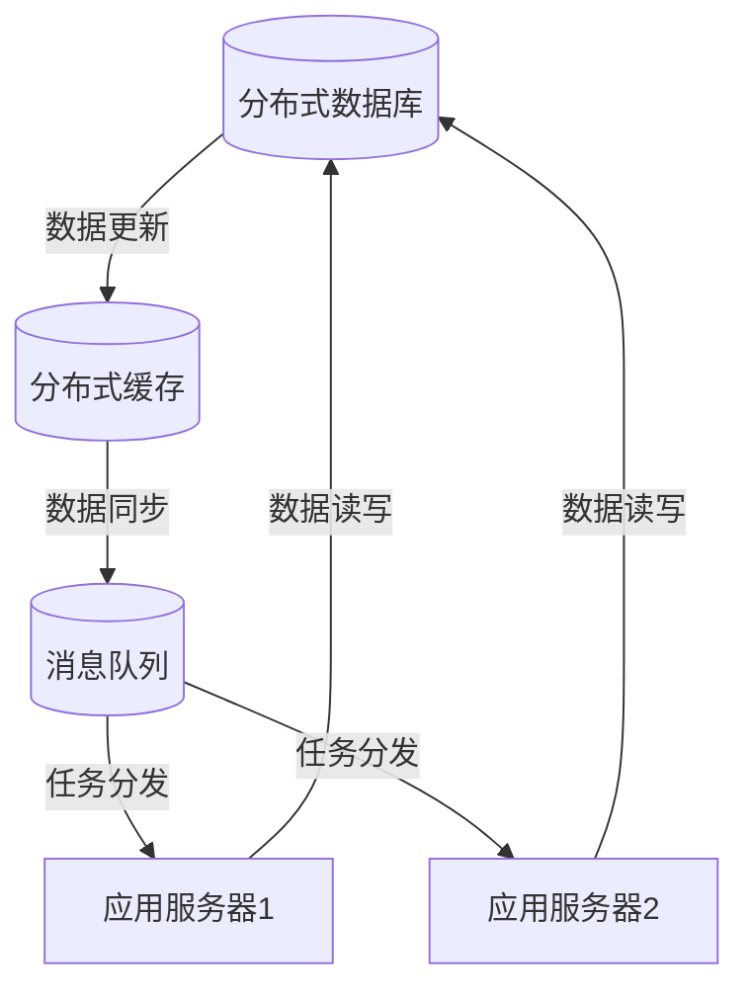

                 

### 第1章: 本质是异构系统的数据一致性问题概述

> 关键词：异构系统、数据一致性、同步机制、分布式架构、分布式缓存

> 摘要：本文深入探讨了异构系统的数据一致性问题，详细分析了其背景、重要性、核心概念、问题类型以及解决策略。通过理论与实践相结合，本文为分布式系统设计与维护提供了有价值的指导。

## 1.1 问题背景

### 1.1.1 异构系统概述

**定义**：异构系统（Heterogeneous System）是指由不同类型、不同架构或不同技术的组件组成的系统。这些组件可能在硬件、软件、数据格式、通信协议等方面存在差异。

**特点**：异构系统具有以下特点：
- **多样性**：系统组件的多样性使得系统的可扩展性和灵活性更高。
- **复杂性**：系统组件间的差异增加了系统设计的复杂性。
- **互操作性**：需要处理不同组件间的互操作性，以保证系统整体的协同工作。

### 1.1.2 数据一致性问题的重要性

**定义**：数据一致性（Data Consistency）指的是系统中不同组件之间的数据状态保持一致。在分布式系统中，数据一致性问题尤为重要，因为分布式系统的各个节点可能位于不同的地理位置，网络环境可能存在延迟或故障。

**影响**：数据不一致可能带来以下影响：
- **系统错误**：数据不一致可能导致系统行为异常，甚至崩溃。
- **数据丢失**：在数据同步过程中，数据不一致可能导致部分数据丢失。
- **业务中断**：业务依赖于准确和一致的数据，数据不一致可能导致业务中断或损失。

### 1.1.3 本质理解

**原因**：异构系统中的数据一致性问题主要源于以下几个方面：
- **组件间的通信**：不同组件间的通信协议和数据格式可能不一致，导致数据传输过程中的误解和冲突。
- **同步和数据格式转换**：同步机制和数据格式转换过程中可能引入延迟、错误或丢失。

**解决策略**：解决数据一致性问题通常需要以下几个策略：
- **设计有效的数据同步机制**：确保数据在不同节点间的实时同步。
- **采用一致性协议**：如CAP定理、BASE理论等，以平衡一致性、可用性和分区容错性。
- **利用分布式缓存和消息队列**：提高数据访问的实时性和系统的容错性。

## 1.2 核心概念与联系

### 1.2.1 数据一致性的核心概念

**强一致性**（Strong Consistency）：强一致性要求所有节点对数据的读取和写入操作都能获得最新的数据状态。在强一致性模型下，任何对数据的修改都会立即对所有节点可见。

**最终一致性**（ eventual consistency）：最终一致性是指在一段时间后，所有节点的数据状态会趋向一致，但不保证实时性。最终一致性模型允许一定的延迟，以换取更高的可用性和分区容错性。

### 1.2.2 数据一致性的属性特征对比

#### 表格

| 属性特征       | 强一致性                  | 最终一致性                |
|----------------|-------------------------|-------------------------|
| 数据访问延迟    | 低                       | 高                       |
| 实时性        | 高                       | 低                       |
| 容错性        | 较低                     | 较高                     |

### 1.2.3 ER实体关系图架构

**Mermaid 图**

```mermaid
erDiagram
  NodeA ||--o{ NodeB } NodeC : {数据一致性保障组件}
  NodeB ||--o{ NodeD } NodeE : {数据同步机制}
  NodeC ||--o{ NodeF } NodeG : {数据格式转换组件}
```

**说明**：ER图中的NodeA、NodeB、NodeC、NodeD、NodeE、NodeF和NodeG分别表示不同的系统组件，它们通过数据同步机制和数据格式转换组件实现数据一致性的保障。

## 1.3 数据一致性问题的主要类型

### 1.3.1 同步冲突

**定义**：同步冲突（Synchronization Conflict）是指在分布式系统中，不同节点同时对同一数据进行修改时产生的问题。同步冲突可能导致数据不一致或数据丢失。

**解决方法**：
- **版本控制**：通过为数据添加版本号，确保每个修改操作都能基于最新的数据版本。
- **锁机制**：使用锁来控制对数据的访问，防止多个节点同时修改同一数据。

### 1.3.2 数据延迟

**定义**：数据延迟（Data Latency）是由于网络延迟等原因，导致数据更新在不同节点间存在时间差。数据延迟可能导致数据不一致或数据丢失。

**解决方法**：
- **消息队列**：使用消息队列来异步处理数据更新，减少网络延迟的影响。
- **缓存机制**：在本地缓存最新数据，提高数据访问速度，减少数据延迟。

### 1.3.3 数据不一致

**定义**：数据不一致（Data Inconsistency）是指系统中不同组件之间的数据状态不一致。数据不一致可能由同步冲突或数据延迟引起。

**解决方法**：
- **一致性协议**：使用一致性协议来确保数据在不同节点间的状态一致。
- **数据同步机制**：设计有效的数据同步机制，确保数据在不同节点间的实时同步。

## 1.4 数据一致性问题的影响与解决策略

### 1.4.1 数据一致性问题的影响

**系统稳定性**：数据不一致可能导致系统崩溃或异常。

**业务连续性**：数据不一致可能导致业务中断或损失。

### 1.4.2 解决策略

**设计有效的数据同步机制**：确保数据在不同节点间的实时同步。

**采用一致性协议**：如CAP定理、BASE理论等，以平衡一致性、可用性和分区容错性。

**利用分布式缓存和消息队列**：提高数据访问的实时性和系统的容错性。

## 1.5 本章小结

本章主要介绍了异构系统的数据一致性问题，包括问题背景、核心概念与联系、问题类型以及解决策略。理解这些问题和策略对于设计和维护大规模分布式系统至关重要。

----------------------------------------------------------------

## 第2章: 异构系统的数据一致性原理

### 2.1 数据同步机制原理

#### 2.1.1 数据同步机制概述

**定义**：数据同步机制（Data Synchronization Mechanism）是指在分布式系统中，不同节点之间如何保持数据一致性的一组策略和算法。数据同步机制是解决数据一致性问题的基础。

**重要性**：数据同步机制在分布式系统中至关重要，它确保了系统中各个节点间的数据状态一致，从而避免了数据不一致带来的问题。

#### 2.1.2 同步机制分类

**基于时间戳的同步**：通过时间戳来确保数据的新旧关系，解决数据冲突。

**基于版本号的同步**：通过版本号来追踪数据变更，解决数据冲突。

**基于日志的同步**：通过日志记录数据变更，实现数据同步。

**基于事件驱动的同步**：通过事件触发数据同步。

#### 2.1.3 同步机制的工作原理

**数据同步流程**：
1. **数据变更捕获**：系统捕获数据变更事件，并生成变更日志。
2. **数据传输**：将变更日志传输到目标节点。
3. **数据应用**：目标节点根据变更日志应用数据变更。
4. **数据验证**：验证数据变更是否成功，并确保数据状态一致。

#### 2.1.4 同步机制的优缺点分析

**优点**：
- **提高数据一致性**：通过同步机制，可以确保系统中各个节点的数据状态一致。
- **降低数据丢失风险**：同步机制可以减少由于网络故障等原因导致的数据丢失。
- **提高系统可用性**：同步机制可以在保证数据一致性的同时，提高系统的可用性和容错性。

**缺点**：
- **增加系统复杂度**：同步机制增加了系统的复杂性，需要额外的资源和管理。
- **引入延迟**：同步机制可能导致数据更新的延迟，降低系统的实时性。

### 2.2 数据一致性协议原理

#### 2.2.1 数据一致性协议概述

**定义**：数据一致性协议（Data Consistency Protocol）是一组规则和算法，用于在分布式系统中确保数据的一致性。数据一致性协议可以分为强一致性协议和最终一致性协议。

**分类**：
- **强一致性协议**：如Paxos算法、Raft算法等。
- **最终一致性协议**：如Gossip协议、Vector Clocks等。

#### 2.2.2 数据一致性协议的工作原理

**强一致性协议**：
- **工作原理**：强一致性协议确保所有节点对数据的读取和写入操作都能获得最新的数据状态。
- **优缺点**：强一致性协议可以保证数据的强一致性，但可能引入较大的延迟和资源消耗。

**最终一致性协议**：
- **工作原理**：最终一致性协议允许系统在一段时间后，所有节点的数据状态会趋向一致，但不保证实时性。
- **优缺点**：最终一致性协议可以提高系统的可用性和分区容错性，但可能存在数据不一致的情况。

#### 2.2.3 数据一致性协议的优缺点分析

**优点**：
- **提高数据一致性**：数据一致性协议可以确保系统中各个节点的数据状态一致。
- **降低数据丢失风险**：数据一致性协议可以减少由于网络故障等原因导致的数据丢失。

**缺点**：
- **引入延迟**：数据一致性协议可能导致数据更新的延迟，降低系统的实时性。
- **资源消耗**：强一致性协议可能需要更多的资源来维护数据一致性。

### 2.3 数据格式转换原理

#### 2.3.1 数据格式转换概述

**定义**：数据格式转换（Data Format Conversion）是指将一种数据格式转换为另一种数据格式的过程。在异构系统中，不同组件可能使用不同的数据格式，因此需要数据格式转换来确保数据在不同组件间的传输和处理。

**分类**：
- **文本格式转换**：如JSON、XML等。
- **二进制格式转换**：如Protocol Buffers、Avro等。

#### 2.3.2 数据格式转换的工作原理

**数据格式转换流程**：
1. **数据读取**：读取原始数据。
2. **数据解析**：解析原始数据格式，提取数据信息。
3. **数据转换**：将原始数据转换为目标数据格式。
4. **数据写入**：将转换后的数据写入目标组件。

#### 2.3.3 数据格式转换的优缺点分析

**优点**：
- **提高互操作性**：数据格式转换可以确保不同组件间能够相互理解和处理数据。
- **提高数据可维护性**：使用标准化的数据格式可以提高数据的一致性和可维护性。

**缺点**：
- **增加系统复杂度**：数据格式转换增加了系统的复杂性，需要额外的资源和管理。
- **引入延迟**：数据格式转换可能导致数据处理的延迟，降低系统的性能。

## 2.4 本章小结

本章介绍了异构系统的数据一致性原理，包括数据同步机制、数据一致性协议和数据格式转换原理。理解这些原理对于设计和维护异构系统中的数据一致性具有重要意义。

----------------------------------------------------------------

## 第3章：异构系统的数据一致性问题分析与案例

### 3.1 同步冲突案例分析

**案例背景**：在一个分布式订单处理系统中，订单数据存储在多个数据库节点上。由于多个订单处理节点可能同时对订单数据执行修改操作，导致同步冲突。

**问题表现**：当一个订单处理节点更新订单数据时，另一个订单处理节点可能在同一时间也在更新相同的数据，导致数据不一致。

**解决方法**：
1. **版本控制**：为订单数据添加版本号，每次修改时递增版本号。在更新数据前，检查当前版本号是否为最新版本，如果是，则执行更新操作。
2. **锁机制**：使用分布式锁来控制对订单数据的访问，确保同一时间只有一个节点能修改订单数据。

### 3.2 数据延迟案例分析

**案例背景**：在一个分布式库存管理系统中，库存数据存储在多个节点上。由于网络延迟，导致库存数据的更新在不同节点之间存在延迟。

**问题表现**：当一个库存节点更新库存数据时，另一个库存节点可能在同一时间也在更新相同的数据，但由于网络延迟，导致更新数据未能及时同步。

**解决方法**：
1. **消息队列**：使用消息队列将库存数据的更新操作异步处理，减少网络延迟的影响。
2. **缓存机制**：在本地缓存最新库存数据，提高数据访问速度，减少数据延迟。

### 3.3 数据不一致案例分析

**案例背景**：在一个分布式金融交易系统中，交易数据存储在多个节点上。由于同步机制和数据格式转换的问题，导致交易数据在不同节点之间存在不一致。

**问题表现**：当一个交易节点处理交易数据时，另一个交易节点可能在同一时间也在处理相同的数据，但由于同步机制和数据格式转换的问题，导致数据状态不一致。

**解决方法**：
1. **一致性协议**：采用Paxos算法或Raft算法等一致性协议，确保交易数据在不同节点间的状态一致。
2. **数据同步机制**：设计有效的数据同步机制，确保交易数据在不同节点间的实时同步。
3. **数据格式转换**：优化数据格式转换过程，确保数据在不同组件间的传输和处理过程中保持一致性。

### 3.4 异构系统中的数据一致性问题综合分析

**综合分析**：在异构系统中，数据一致性问题主要源于同步冲突、数据延迟和数据不一致。针对这些问题，可以采取以下综合解决策略：
1. **设计有效的数据同步机制**：确保数据在不同节点间的实时同步，降低同步冲突和数据延迟的风险。
2. **采用一致性协议**：如Paxos算法、Raft算法等，确保系统中各个节点的数据状态一致。
3. **优化数据格式转换**：确保数据在不同组件间的传输和处理过程中保持一致性。
4. **利用分布式缓存和消息队列**：提高数据访问的实时性和系统的容错性。

### 3.5 本章小结

本章通过具体案例分析，深入分析了异构系统中的数据一致性问题。理解这些问题和解决策略，有助于设计和维护大规模分布式系统中的数据一致性。

----------------------------------------------------------------

## 第4章：数据一致性问题解决策略

### 4.1 CAP定理

**概念**：CAP定理（Consistency, Availability, Partition Tolerance）是分布式系统设计中的一个基本定理，它指出在分布式系统中，一致性（Consistency）、可用性（Availability）和分区容错性（Partition Tolerance）这三个特性中，只能同时保证两个。

**定理**：
- 在网络分区（Partition）发生时，系统必须选择在一致性和可用性之间做出权衡。

**选择**：
- **强一致性（Consistency）**：系统保证所有节点在所有时间对数据的读取都能看到最新的数据状态。
- **可用性（Availability）**：系统保证即使部分节点不可用，系统仍然能够响应请求。

**案例分析**：
- **分布式数据库**：通常选择强一致性，以保证数据的准确性。
- **电商系统**：在部分节点不可用时，可能选择可用性，以保证系统的可用性。

### 4.2 BASE理论

**概念**：BASE理论（Basic Availability, Soft State, Eventually Consistency）是对CAP定理的补充，它提出了一种在分布式系统中追求最终一致性（Eventually Consistency）的方法。

**原理**：
- **基本可用性**：系统保证基本的服务可用性，即使在不可用的情况下也能响应请求。
- **软状态**：系统允许数据处于不确定的状态，直到最终一致性达成。
- **最终一致性**：系统最终会达到一致性，但不保证实时性。

**案例分析**：
- **社交网络**：用户状态更新可能需要延迟，但系统整体仍保持可用性。
- **邮件服务**：邮件的送达可能延迟，但系统确保邮件最终会被正确投递。

### 4.3 分布式缓存策略

**概念**：分布式缓存（Distributed Cache）是在分布式系统中使用的一种缓存策略，用于提高数据访问速度和系统性能。

**原理**：
- **数据分区**：将数据分散存储在多个缓存节点上，提高数据的访问速度。
- **缓存同步**：通过一致性协议或缓存同步机制，确保缓存数据与后端存储保持一致。

**技术**：
- **Redis Cluster**：支持数据分区和缓存同步的分布式缓存系统。
- **Memcached**：简单的分布式缓存系统，通常与后端存储系统（如数据库）结合使用。

**案例分析**：
- **电商系统**：使用分布式缓存来缓存商品信息，提高商品检索速度。
- **社交媒体**：使用分布式缓存来缓存用户信息，提高用户数据访问速度。

### 4.4 消息队列策略

**概念**：消息队列（Message Queue）是在分布式系统中用于异步处理数据和任务的一种通信机制。

**原理**：
- **异步处理**：通过消息队列将任务分发给不同的处理节点，实现任务的异步处理。
- **分布式协调**：消息队列可以保证任务的顺序执行，同时提高系统的容错性。

**技术**：
- **Kafka**：高吞吐量的分布式消息队列系统，适用于大规模数据处理场景。
- **RabbitMQ**：功能丰富的分布式消息队列系统，支持多种消息传递协议。

**案例分析**：
- **金融交易系统**：使用消息队列处理交易消息，确保交易数据的顺序执行和一致性。
- **物流系统**：使用消息队列处理物流信息，提高系统的可靠性和容错性。

### 4.5 分布式锁机制

**概念**：分布式锁（Distributed Lock）是在分布式系统中用于控制对共享资源的访问的一种锁机制。

**原理**：
- **锁管理**：分布式锁管理器负责管理锁的分配和释放。
- **锁冲突**：当多个节点同时请求同一锁资源时，分布式锁机制通过锁的竞争机制确保资源的正确访问。

**技术**：
- **ZooKeeper**：支持分布式锁和锁监听机制，适用于大规模分布式系统。
- **Redis**：通过SETNX命令实现分布式锁功能。

**案例分析**：
- **分布式缓存系统**：使用分布式锁确保缓存数据的更新操作不会发生冲突。
- **分布式数据库**：使用分布式锁确保数据的一致性和安全性。

### 4.6 本章小结

本章介绍了数据一致性问题解决策略，包括CAP定理、BASE理论、分布式缓存策略、消息队列策略和分布式锁机制。理解这些策略对于设计和维护大规模分布式系统中的数据一致性至关重要。

----------------------------------------------------------------

## 第5章：实际应用与最佳实践

### 5.1 系统架构设计与实施

#### 5.1.1 系统架构设计

**系统架构设计**：为了解决异构系统中的数据一致性问题，可以采用以下架构设计：
- **分布式数据库**：使用分布式数据库技术，如Apache Cassandra、MongoDB等，确保数据的高可用性和分区容错性。
- **分布式缓存**：使用分布式缓存系统，如Redis、Memcached等，提高数据的访问速度和系统的性能。
- **消息队列**：使用消息队列系统，如Kafka、RabbitMQ等，实现异步任务处理和数据同步。

**架构图**：以下是一个简化的分布式系统架构图，展示了分布式数据库、分布式缓存和消息队列的集成。



#### 5.1.2 系统实施

**数据同步机制**：
- **基于时间戳的数据同步**：在数据更新时，为每条数据添加时间戳，确保数据的新旧关系。在数据同步过程中，根据时间戳判断数据是否需要更新。
- **基于消息队列的数据同步**：使用消息队列来异步处理数据同步任务，确保数据更新的实时性和系统的可靠性。

**一致性协议**：
- **Paxos算法**：用于分布式数据库的一致性保障，确保系统在多个节点间达成一致。
- **Raft算法**：与Paxos算法类似，但简化了算法的实现，适用于大规模分布式系统。

### 5.2 实际应用案例

#### 5.2.1 分布式电商系统

**案例背景**：一个大型电商系统需要处理海量的订单、库存和用户数据，并确保数据的实时性和一致性。

**解决方案**：
- **分布式数据库**：使用分布式数据库技术，如Apache Cassandra，确保数据的高可用性和分区容错性。
- **分布式缓存**：使用Redis进行缓存，提高系统的性能和数据访问速度。
- **消息队列**：使用Kafka进行异步任务处理和数据同步，确保订单和库存数据的实时更新。

**实施效果**：
- **高可用性**：系统具有高可用性，即使部分节点故障，系统仍能正常运行。
- **高性能**：分布式缓存和消息队列提高了系统的性能和数据访问速度。
- **数据一致性**：通过一致性协议和同步机制，确保系统中的订单、库存和用户数据的一致性。

#### 5.2.2 分布式金融交易系统

**案例背景**：一个分布式金融交易系统需要处理大量的交易数据，并确保交易数据的一致性和安全性。

**解决方案**：
- **分布式数据库**：使用分布式数据库技术，如MongoDB，确保交易数据的高可用性和分区容错性。
- **分布式缓存**：使用Redis进行缓存，提高交易数据的访问速度和系统的性能。
- **分布式锁机制**：使用ZooKeeper进行分布式锁管理，确保交易操作的一致性和安全性。

**实施效果**：
- **数据一致性**：通过分布式数据库和一致性协议，确保交易数据的一致性。
- **安全性**：分布式锁机制确保了交易操作的安全性，防止数据冲突和操作错误。
- **高吞吐量**：分布式缓存和消息队列提高了系统的吞吐量和性能。

### 5.3 最佳实践

**最佳实践**：
1. **选择合适的数据一致性模型**：根据业务需求，选择合适的强一致性或最终一致性模型。
2. **优化数据同步机制**：设计高效的数据同步机制，减少同步延迟和数据冲突。
3. **充分利用缓存和消息队列**：缓存和消息队列可以提高系统的性能和数据一致性。
4. **定期监控和调优**：定期监控系统性能和数据一致性，及时进行调优和优化。

### 5.4 本章小结

本章通过实际应用案例和最佳实践，详细介绍了异构系统数据一致性的实现方法和效果。理解这些实际应用和最佳实践，有助于设计和优化大规模分布式系统中的数据一致性。

----------------------------------------------------------------

## 第6章：未来趋势与研究方向

### 6.1 数据一致性技术的进步

**分布式数据库**：随着分布式数据库技术的不断发展，如Cassandra、MongoDB等，将提供更高效、更可靠的数据一致性和分区容错性。

**区块链技术**：区块链技术可能成为解决分布式数据一致性问题的新途径，通过去中心化和加密算法确保数据的安全性和一致性。

### 6.2 自动化与智能化的数据一致性管理

**自动化同步**：自动化工具和智能算法将进一步提高数据同步的效率和准确性，减少人为错误。

**智能数据格式转换**：利用机器学习和人工智能技术，实现智能化的数据格式转换，提高数据处理的效率和一致性。

### 6.3 跨领域的数据一致性研究

**云计算与边缘计算**：结合云计算和边缘计算，研究如何在分布式异构环境中实现高效的数据一致性和管理。

**物联网（IoT）**：物联网设备间的数据一致性管理和同步，是未来研究的重点领域，特别是在大规模物联网应用中。

### 6.4 本章小结

未来，数据一致性技术将朝着更高效、更智能、更跨领域的发展方向前进。深入研究和应用这些新技术，将有助于解决大规模分布式系统中的数据一致性问题，推动技术的进步和业务的发展。

----------------------------------------------------------------

## 总结

本文详细探讨了异构系统的数据一致性问题，从背景、核心概念、问题类型、解决策略到实际应用和未来趋势进行了全面分析。数据一致性是分布式系统设计的关键，它直接影响到系统的稳定性、性能和用户体验。理解并掌握数据一致性的原理和实现策略，对于开发高效、可靠的分布式系统至关重要。

### 注意事项

- **选择合适的一致性模型**：根据业务需求，选择强一致性或最终一致性模型，确保系统的性能和稳定性。
- **优化同步机制**：设计高效的数据同步机制，减少同步延迟和数据冲突，提高系统的性能。
- **利用缓存和消息队列**：充分利用缓存和消息队列，提高数据访问速度和系统的容错性。

### 拓展阅读

- **《分布式系统原理与范型》**：深入理解分布式系统的基本原理和设计范式。
- **《区块链技术指南》**：了解区块链技术在数据一致性和安全性方面的应用。
- **《大规模分布式数据库系统》**：研究分布式数据库技术的最新进展和最佳实践。

作者：AI天才研究院/AI Genius Institute & 禅与计算机程序设计艺术 /Zen And The Art of Computer Programming

