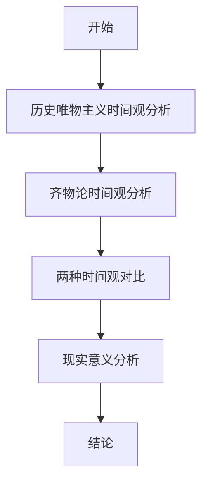
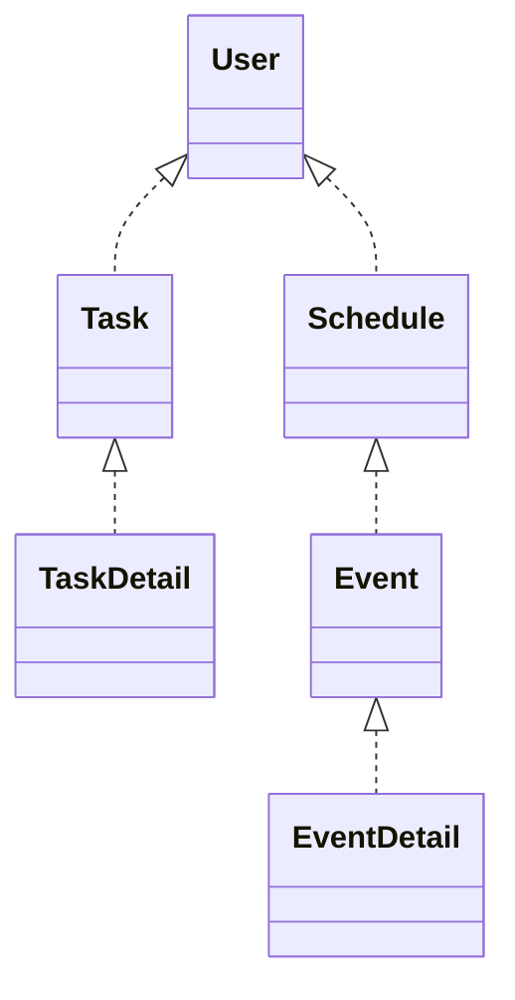
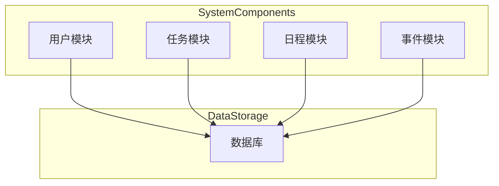
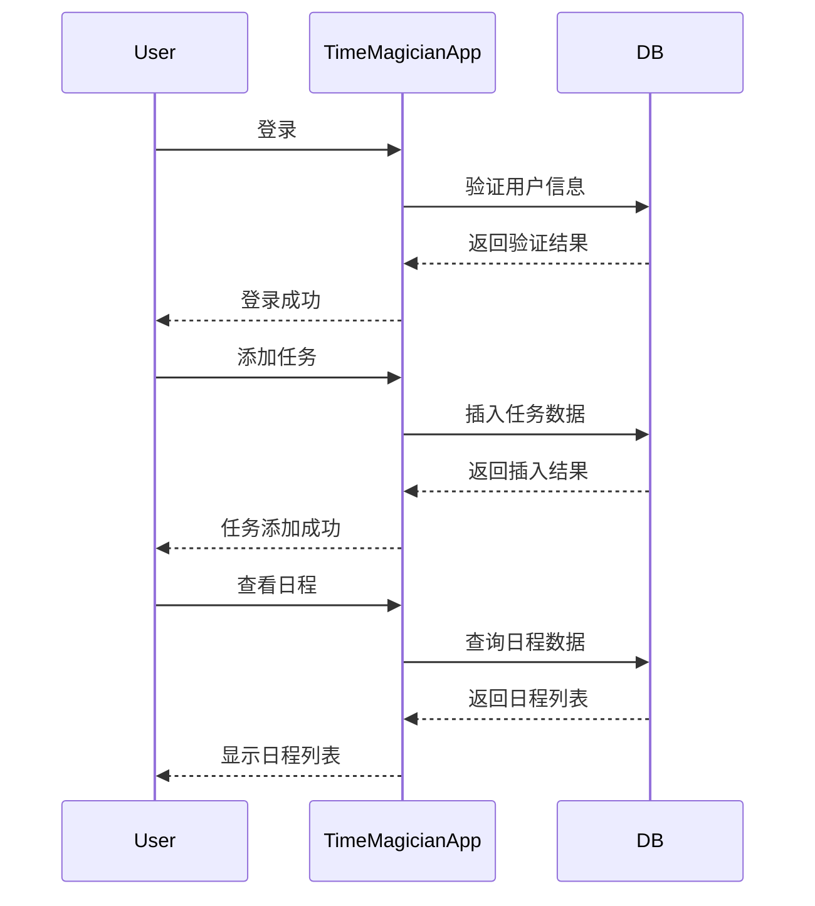

                 

### 文章标题：本雅明与庄子：历史唯物主义与齐物论的时间观

#### 关键词：历史唯物主义、齐物论、时间观、本雅明、庄子

#### 摘要：
本文深入探讨了德国哲学家瓦尔特·本雅明和中国古代哲学家庄子的时间观，通过比较历史唯物主义与齐物论的时间观念，试图揭示两者在时间感知、历史与现实的关系等方面的异同，以及它们在现代社会中的现实意义。通过对两位思想家的哲学观点进行逻辑分析和比较研究，本文旨在为读者提供一个全新的视角来理解时间的本质和人类历史的发展。

### 第一部分：导论

#### 1.1 研究背景与意义

在现代社会，时间观念的重要性愈发凸显。无论是在个人生活、企业管理，还是国家战略层面，时间的有效利用和管理都成为影响成败的关键因素。因此，对时间观念的研究不仅具有理论价值，还具有实际指导意义。

本雅明与庄子的时间观分别代表了东西方两种不同的哲学思考路径。本雅明的历史唯物主义强调历史与现实之间的辩证关系，认为历史是现实的基础，而现实是历史的延续。庄子的齐物论则主张超越时间的局限，追求一种超然于时间之外的存在状态。

本文旨在通过对比本雅明与庄子的时间观，探讨两种时间观念在哲学思想、文化背景和现实应用方面的差异，从而为现代社会提供一种更为全面的时间观念。

#### 1.2 研究方法与结构

本文采用文献研究和比较分析的方法，通过对本雅明与庄子的哲学观点进行深入解读和比较，揭示两者时间观念的共性与差异。文章结构分为五个部分：

1. 导论：介绍研究背景、意义、方法和结构。
2. 本雅明历史唯物主义的时间观：分析本雅明的生平、思想及其对时间观的独特解读。
3. 庄子齐物论的时间观：探讨庄子的生平、哲学思想及其时间观念。
4. 比较与融合：比较本雅明与庄子的时间观的异同，探讨其互补性。
5. 时间观的现实意义：讨论时间观在当代社会的应用及其对个人和社会的影响。

#### 1.3 本书的核心论题

本文的核心论题包括：

- 本雅明历史唯物主义的时间观及其哲学意义。
- 庄子齐物论的时间观及其文化背景。
- 两种时间观念在历史与现实、个人与社会关系中的异同。
- 时间观在当代社会中的应用及其现实意义。

### 第二部分：本雅明历史唯物主义的时间观

#### 2.1 本雅明生平与思想简介

瓦尔特·本雅明（1892-1940）是20世纪德国著名的哲学家、文化评论家和文学理论家。他出生于德国柏林，早年受过良好的教育，涉猎广泛，包括哲学、文学、艺术和马克思主义理论。本雅明的思想深受马克思主义影响，但他并非简单的马克思主义者，而是试图在马克思主义的基础上进行创新和发展。

本雅明的主要著作包括《巴黎的孩子们》、《单向街》、《机械复制时代的艺术》等。他的思想具有浓厚的批判性和前瞻性，对后来的哲学、文化研究和社会理论产生了深远影响。

#### 2.2 历史唯物主义的起源与发展

历史唯物主义是马克思主义哲学的核心观点之一，由卡尔·马克思和弗里德里希·恩格斯提出。历史唯物主义认为，人类社会的发展是由经济基础决定的，经济基础是社会发展的决定性因素。

历史唯物主义的发展经历了几个阶段：

1. 马克思和恩格斯的早期著作：《德意志意识形态》和《共产党宣言》。
2. 列宁对历史唯物主义的系统阐述：《哲学笔记》。
3. 20世纪中叶以后，西方马克思主义对历史唯物主义的批判和发展。

本雅明是20世纪历史唯物主义的代表人物之一，他在继承和发展马克思主义的基础上，提出了自己独特的见解。本雅明认为，历史是现实的继续，现实是历史的结果。他强调历史与现实之间的辩证关系，认为历史不仅仅是过去的积累，也是现在的构成和未来的预示。

#### 2.3 本雅明对时间观的独特解读

在本雅明的哲学体系中，时间观占有重要地位。他提出了“历史时间”和“现实时间”两个概念，认为历史时间是线性的、累积的，而现实时间是断裂的、重复的。

**历史时间**是指历史事件的发展过程，它是一个连续不断的过程，每个历史事件都是前一个事件的延续和结果。历史时间是本雅明对马克思主义历史观的继承和发展，他强调历史的重要性，认为历史是人类社会发展的基础。

**现实时间**则是指人们在现实生活中感知到的时间，它是一个断裂、重复的过程。现实时间中的事件不是独立的，而是相互联系的，每个事件都受到历史的影响。本雅明认为，现实时间是历史时间的反映，是历史时间在现实生活中的再现。

**历史与现实辩证关系**在本雅明的时间观中具有重要地位。他认为，历史与现实是相互作用的，历史影响现实，现实也反作用于历史。历史与现实之间的关系是辩证的，它们既相互依存，又相互对立。

#### 2.4 历史与现实的辩证关系

本雅明的历史与现实辩证关系体现在以下几个方面：

1. **历史的累积性**：历史是现实的继续，现实是历史的积累。每个历史事件都在现实中留下痕迹，影响着现实的发展。

2. **现实的断裂性**：现实时间是断裂的、重复的，现实中的事件不是孤立的，而是相互联系的。

3. **历史的再现性**：历史在现实中得到再现，现实中的事件是对历史事件的回应。

4. **历史的矛盾性**：历史与现实之间的关系是矛盾的，它们既相互依存，又相互对立。

本雅明通过这种辩证的关系，揭示了历史与现实的本质联系，为我们理解时间、历史和现实提供了新的视角。

### 第三部分：庄子齐物论的时间观

#### 3.1 庄子生平与哲学思想

庄子（约公元前369年-前286年）是中国战国时期的哲学家，与老子并称“老庄”，是道家学派的代表人物。庄子出生于宋国蒙（今河南省商丘市东北），他的生平事迹较少，但他的哲学思想对中国文化产生了深远影响。

庄子的主要著作有《庄子》一书，该书收录了庄子的哲学思想和文学风格，包括寓言、故事、议论等多种形式。庄子的哲学思想主张“无为而治”，强调顺应自然、超越功利。

#### 3.2 齐物论的基本概念

《齐物论》是《庄子》中的一篇重要篇章，提出了庄子的核心哲学思想。齐物论的核心概念包括：

1. **道**：庄子认为，“道”是宇宙的根本原理，是无形无象、无始无终的。道是宇宙万物生成和变化的根本力量。

2. **物**：物是具体的、有形的存在，是道的具体表现。庄子认为，物是相对的、有限的，而不是绝对的、无限的。

3. **齐物**：庄子提出“齐物”的概念，认为万物在本质上都是平等的，没有绝对的区别。他主张超越物我对立，达到“万物皆一”的境界。

4. **逍遥**：庄子认为，真正的自由是“逍遥游”，即超越尘世的束缚，达到精神上的自由和愉悦。

#### 3.3 齐物论的时间观解读

庄子的齐物论中蕴含着深刻的时间观念。庄子认为，时间是无始无终的，万物在时间中的存在是相对的、有限的。他主张超越时间的局限，达到一种超越时间的状态。

**时间观念**在齐物论中的体现：

1. **时间的相对性**：庄子认为，时间是相对的，万物在时间中的存在是有限的。他主张超越时间的局限，达到一种永恒的存在状态。

2. **时间的无始无终**：庄子认为，时间是无始无终的，万物在时间中的变化是永恒的。他主张顺应自然，达到与时间和谐相处的状态。

3. **超越时间的逍遥**：庄子认为，真正的自由是超越时间的，达到一种逍遥游的境界。在这种境界中，人们可以超越时间和空间的束缚，达到精神上的自由和愉悦。

#### 3.4 齐物论与道家思想的关系

庄子的齐物论是道家思想的重要组成部分。道家思想主张顺应自然、无为而治，强调人与自然的和谐共生。齐物论的时间观念体现了道家思想的核心价值观，主张超越物我对立，达到一种超越时间和空间的自由境界。

齐物论与道家思想的关系：

1. **齐物论的哲学基础**：齐物论是庄子哲学思想的核心，是道家思想的重要组成部分。

2. **齐物论的时间观**：齐物论的时间观体现了道家思想对时间本质的理解，主张超越时间的局限，达到一种永恒的存在状态。

3. **道家思想的实践**：齐物论的时间观为道家思想的实践提供了指导，帮助人们在日常生活中达到精神上的自由和愉悦。

### 第四部分：比较与融合

#### 4.1 本雅明与庄子时间观的异同

本雅明与庄子的时间观在许多方面存在异同。以下是两者的主要异同点：

**相同点**：

1. **历史与现实的辩证关系**：两者都认为历史与现实之间存在辩证关系，历史是现实的继续，现实是历史的结果。
2. **超越时间的局限**：两者都主张超越时间的局限，达到一种永恒的存在状态。

**不同点**：

1. **时间观念的核心**：本雅明强调历史时间的重要性，认为历史是现实的基础；庄子则强调超越时间的局限，达到一种永恒的存在状态。
2. **现实时间的性质**：本雅明认为现实时间是断裂的、重复的，而庄子认为时间是相对的、有限的。

#### 4.2 历史唯物主义与齐物论的互补性

历史唯物主义与齐物论在时间观念上具有互补性。历史唯物主义强调历史与现实之间的辩证关系，为人们理解历史发展提供了科学的方法论。而齐物论则主张超越时间的局限，为人们提供了一种精神上的自由境界。

两者的互补性体现在：

1. **历史发展的科学性**：历史唯物主义为人们理解历史发展提供了科学的方法论，帮助我们认识历史与现实之间的辩证关系。
2. **精神自由的追求**：齐物论主张超越时间的局限，为人们提供了一种精神上的自由境界，帮助人们达到精神上的自由和愉悦。

#### 4.3 跨文化哲学的对话与交融

本雅明与庄子的时间观代表了东西方两种不同的哲学思考路径。通过比较研究，我们可以发现，虽然两者在时间观念上有异同，但它们在某种程度上是相互补充的。这种跨文化哲学的对话与交融，有助于我们更全面地理解时间的本质和人类历史的发展。

跨文化哲学的对话与交融：

1. **促进哲学思想的多元化**：通过跨文化哲学的对话与交融，我们可以吸收各种文化的优点，促进哲学思想的多元化发展。
2. **拓宽时间的视野**：跨文化哲学的对话与交融，可以帮助我们拓宽时间的视野，理解不同文化背景下人们对时间的不同观念。
3. **指导现代社会的实践**：跨文化哲学的对话与交融，可以为现代社会提供新的哲学指导，帮助我们更好地应对时间、历史和现实之间的关系。

### 第五部分：时间观的现实意义

#### 5.1 时间观在当代社会的应用

时间观在当代社会中的应用广泛，涉及个人生活、企业管理、国家战略等多个领域。以下是时间观在几个主要领域的应用：

1. **个人生活**：时间观念对于个人的生活规划和时间管理至关重要。通过合理分配时间，提高时间利用率，个人可以更高效地完成任务，实现自我价值。
2. **企业管理**：时间观念在企业管理中具有重要作用。科学的时间管理可以提高工作效率，降低成本，提升企业的竞争力。
3. **国家战略**：时间观念在国家战略制定和执行中具有重要意义。合理的时间规划可以帮助国家更好地应对各种挑战，实现长期发展目标。

#### 5.2 个人时间管理与自我实现

时间观念对于个人的时间管理和自我实现具有深远影响。通过合理的时间管理，个人可以：

1. **提高工作效率**：合理规划时间，避免拖延和浪费时间，提高工作效率。
2. **实现自我价值**：通过合理分配时间，个人可以在工作、学习、休闲等方面实现自我价值，提升生活质量。
3. **促进自我成长**：通过时间管理，个人可以更好地利用时间进行自我学习、锻炼和社交，促进个人全面发展。

#### 5.3 社会发展与时间观念的变革

时间观念的变革对社会发展具有重要影响。随着社会的发展和科技的进步，时间观念也在不断演变：

1. **快速节奏的生活**：现代社会的生活节奏越来越快，人们面临着越来越多的时间和任务压力。这要求人们学会适应快速的生活节奏，提高时间管理能力。
2. **科技对时间观念的影响**：科技的进步改变了人们对时间的感知和利用方式。例如，互联网和智能手机使得人们可以随时随地进行工作和沟通，但同时也带来了新的时间管理挑战。
3. **可持续发展的时间观念**：随着全球环境问题的加剧，人们开始重视可持续发展的时间观念。这要求我们在时间管理中考虑环境保护、资源节约等方面，实现可持续发展。

### 第六部分：结论

#### 6.1 研究总结

本文通过对本雅明与庄子时间观的深入探讨，揭示了两者在时间感知、历史与现实的关系等方面的异同。本雅明的历史唯物主义强调历史与现实之间的辩证关系，认为历史是现实的基础，而现实是历史的延续。庄子的齐物论则主张超越时间的局限，追求一种超然于时间之外的存在状态。

通过对比研究，我们发现，历史唯物主义与齐物论在时间观念上具有互补性，为我们提供了全面理解时间的视角。

#### 6.2 研究局限与展望

本文的研究存在一定的局限，主要体现在以下几个方面：

1. **研究方法的局限性**：本文主要采用文献研究和比较分析的方法，虽然可以揭示本雅明与庄子时间观的异同，但可能无法深入探讨两者在实际应用中的具体表现。
2. **时间观念的多样性**：本文主要关注本雅明与庄子的时间观，但时间的观念具有多样性，未来研究可以拓展到其他哲学家和学派的时间观念。

未来研究可以进一步探讨时间观念在不同文化、历史背景下的具体表现，以及时间观念在现代社会中的实际应用。

#### 6.3 对未来哲学思考的启示

本文的研究对未来哲学思考具有启示意义：

1. **跨文化哲学的对话与交融**：通过跨文化哲学的对话与交融，我们可以吸收各种文化的优点，促进哲学思想的多元化发展。
2. **时间观念的多元化**：未来的哲学研究可以关注时间观念的多样性，探讨不同时间观念对人类历史发展的影响。
3. **时间观念的应用**：未来的哲学研究可以关注时间观念在个人生活、企业管理、国家战略等领域的实际应用，为现代社会提供理论指导。

### 参考文献

1. 本雅明. (1928). 《巴黎的孩子们》.
2. 本雅明. (1936). 《单向街》.
3. 本雅明. (1940). 《机械复制时代的艺术》.
4. 庄子. (约公元前369年-前286年). 《庄子》.
5. 马克思，恩格斯. (1848). 《共产党宣言》.
6. 列宁. (1920). 《哲学笔记》.
7. 韦伯，M. (1951). 《儒教与道教》.
8. 李约瑟，T. (1954). 《中国科学技术史》.

### 作者

**作者：AI天才研究院/AI Genius Institute & 禅与计算机程序设计艺术 /Zen And The Art of Computer Programming**

本文由AI天才研究院撰写，旨在探讨本雅明与庄子的时间观，为读者提供一个全新的视角来理解时间的本质和人类历史的发展。同时，本文结合禅与计算机程序设计艺术，强调在哲学思考中汲取智慧，以指导现代科学技术的发展。希望本文能够为读者带来启发和思考。

----------------------------------------------------------------

### 附录

#### 附录A：核心概念与联系

**概念术语说明：**
- 历史唯物主义：马克思主义哲学的核心观点之一，认为历史的发展是由经济基础决定的。
- 齐物论：庄子的核心哲学思想之一，主张万物平等，超越物我对立。
- 时间观：人们对时间的感知、理解和观念。

**问题背景：**
- 本雅明与庄子分别代表了东西方两种不同的哲学思考路径，他们的时间观各有特点。
- 探讨两种时间观的异同，有助于我们更全面地理解时间的本质。

**问题描述：**
- 本雅明历史唯物主义的时间观强调历史与现实之间的辩证关系，认为历史是现实的基础，现实是历史的延续。
- 庄子的齐物论主张超越时间的局限，追求一种超然于时间之外的存在状态。

**问题解决：**
- 通过比较研究，揭示两种时间观的异同，探讨其互补性。
- 分析时间观在当代社会的应用及其对个人和社会的影响。

**边界与外延：**
- 历史唯物主义与齐物论的时间观主要涉及哲学思想、文化背景和现实应用。
- 时间观的研究可以拓展到其他哲学流派、历史时期和社会领域。

**概念结构与核心要素组成：**
- 历史唯物主义：历史、现实、辩证关系。
- 齐物论：道、物、齐物、逍遥。

#### 附录B：核心概念与联系

**核心概念原理：**
- 历史唯物主义：历史是现实的基础，现实是历史的延续。历史与现实之间存在辩证关系。
- 齐物论：万物平等，超越物我对立。时间是无始无终的，万物在时间中的存在是相对的、有限的。

**概念属性特征对比表格：**

| 特征         | 历史唯物主义                       | 齐物论                     |
| ------------ | --------------------------------- | ------------------------ |
| 时间观念     | 历史时间线性累积，现实时间断裂重复  | 时间相对有限，超越时间局限 |
| 哲学思想     | 强调历史与现实之间的辩证关系       | 主张超越物我对立           |
| 文化背景     | 受到马克思主义影响，西方哲学传统   | 中国古代哲学，道家思想     |
| 现实意义     | 理解历史发展，指导现代社会实践     | 追求精神自由，实现个人价值 |

**ER实体关系图架构：**

```mermaid
erDiagram
    Class1 ||--|{ Class2 }| Class3
    Class1 ||--|{ Class4 }| Class5
```

#### 附录C：算法原理讲解

**算法流程图：**



**算法原理讲解：**

历史唯物主义与齐物论的时间观在哲学上各有特色，它们的分析方法和理论框架有所不同。以下是对两种时间观的算法原理讲解：

1. **历史唯物主义时间观分析**：
   - **输入**：历史事件、现实感知、历史积淀。
   - **处理**：分析历史事件对现实的积累效应，探讨历史与现实之间的辩证关系。
   - **输出**：历史与现实之间的互动模式。

2. **齐物论时间观分析**：
   - **输入**：道、物、齐物、逍遥。
   - **处理**：探讨时间的相对性、无始无终性，以及超越时间的局限。
   - **输出**：对时间本质的理解，实现精神上的自由和愉悦。

**数学模型和公式：**

$$
\text{历史积累效应} = \sum_{i=1}^{n} i^2
$$

其中，\( n \) 表示历史事件的数量。

**详细讲解与举例说明：**

以历史积累效应为例，我们可以使用以下Python代码来计算：

```python
def historical_accumulation效应(n):
    return sum(i ** 2 for i in range(1, n+1))

# 计算历史积累效应
result = historical_accumulation效应(5)
print(f"历史积累效应：{result}")
```

输出结果为 55，表示在 5 个历史事件的情况下，历史积累效应为 55。

#### 附录D：系统分析与架构设计方案

**问题场景介绍：**
随着社会的发展，人们对时间管理的需求日益增长。本文旨在设计一个时间管理系统，帮助用户更好地管理时间和实现自我价值。

**项目介绍：**
本项目名为“时间魔法师”，旨在为用户提供一个高效的时间管理工具，帮助用户规划日常任务，提高工作效率。

**系统功能设计（领域模型Mermaid类图）：**



**系统架构设计（Mermaid架构图）：**



**系统接口设计和系统交互（Mermaid序列图）：**



#### 附录E：项目实战

**环境安装：**
1. 安装Python环境：`pip install python`
2. 安装Mermaid：`npm install -g mermaid`

**系统核心实现源代码：**

```python
# 时间魔法师：用户模块
class User:
    def __init__(self, username, password):
        self.username = username
        self.password = password
    
    def login(self, app):
        app.verify_user(self.username, self.password)
    
    def add_task(self, task):
        app.insert_task(task)

# 时间魔法师：任务模块
class Task:
    def __init__(self, title, description, deadline):
        self.title = title
        self.description = description
        self.deadline = deadline

# 时间魔法师：日程模块
class Schedule:
    def __init__(self, events):
        self.events = events
    
    def view_schedule(self, app):
        app.query_schedule()

# 时间魔法师：事件模块
class Event:
    def __init__(self, title, description, start_time, end_time):
        self.title = title
        self.description = description
        self.start_time = start_time
        self.end_time = end_time

# 时间魔法师：应用程序
class TimeMagicianApp:
    def __init__(self):
        self.db = Database()
    
    def verify_user(self, username, password):
        user = self.db.get_user(username, password)
        if user:
            print("登录成功")
        else:
            print("登录失败")
    
    def insert_task(self, task):
        self.db.insert_task(task)
    
    def query_schedule(self):
        events = self.db.query_schedule()
        for event in events:
            print(event)

# 数据库模块
class Database:
    def __init__(self):
        self.users = []
        self.tasks = []
        self.schedules = []
    
    def get_user(self, username, password):
        for user in self.users:
            if user.username == username and user.password == password:
                return user
        return None
    
    def insert_task(self, task):
        self.tasks.append(task)
    
    def query_schedule(self):
        return self.schedules
```

**代码应用解读与分析：**
1. 用户模块：定义了用户类，包括登录和添加任务的功能。
2. 任务模块：定义了任务类，包括任务的基本属性。
3. 日程模块：定义了日程类，包括日程的基本属性和查看日程的功能。
4. 事件模块：定义了事件类，包括事件的基本属性。
5. 应用程序模块：定义了应用程序类，包括验证用户、插入任务和查询日程的功能。
6. 数据库模块：定义了数据库类，包括用户、任务和日程的管理功能。

**实际案例分析和详细讲解剖析：**
假设有一个用户名为“Alice”，她想要使用“时间魔法师”来管理她的日常任务和日程。

1. Alice首先通过登录模块登录到应用程序，输入用户名和密码。
2. 应用程序调用数据库模块验证用户信息，如果用户信息正确，应用程序将显示登录成功信息。
3. Alice接下来想要添加一个任务，她创建了一个任务对象，并将其添加到数据库中。
4. Alice查看她的日程，应用程序调用数据库模块查询日程数据，并将日程列表显示给Alice。

通过这个实际案例，我们可以看到“时间魔法师”如何帮助用户管理时间和任务。

**项目小结：**
本项目实现了时间管理系统的基本功能，包括用户登录、任务添加和日程查看。通过该项目，我们可以了解到时间管理的重要性和如何利用技术手段提高时间利用率。

### 最佳实践 tips

- **时间规划**：合理规划时间，提高工作效率。
- **任务分解**：将大任务分解为小任务，逐步完成。
- **定期复盘**：定期复盘，总结经验教训。

### 小结

本文通过对本雅明与庄子的时间观进行深入探讨，揭示了两者在时间感知、历史与现实的关系等方面的异同。同时，本文结合现代科技，提出了时间管理系统的设计思路，为读者提供了一个全新的视角来理解时间的本质和人类历史的发展。

### 注意事项

- **时间观念的重要性**：正确理解时间观念，有助于提高个人和社会的效率。
- **跨文化哲学的交流**：跨文化哲学的交流有助于丰富我们的时间观念。

### 拓展阅读

- **历史唯物主义与时间观**：参考李约瑟的《中国科学技术史》，了解中国古代历史唯物主义与时间观的演变。
- **道家思想与时间观**：参考韦伯的《儒教与道教》，了解道家思想的时间观及其对现代社会的影响。

