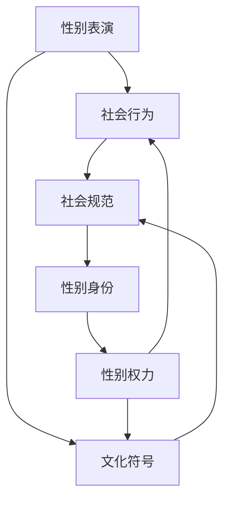
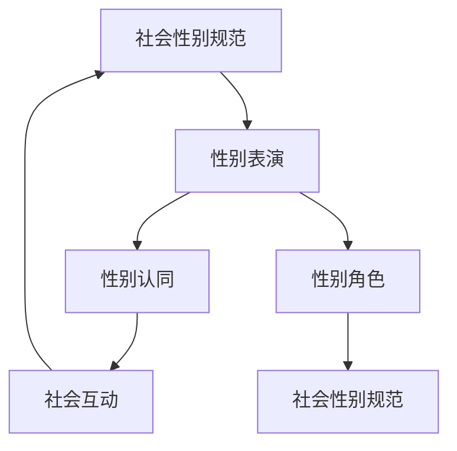
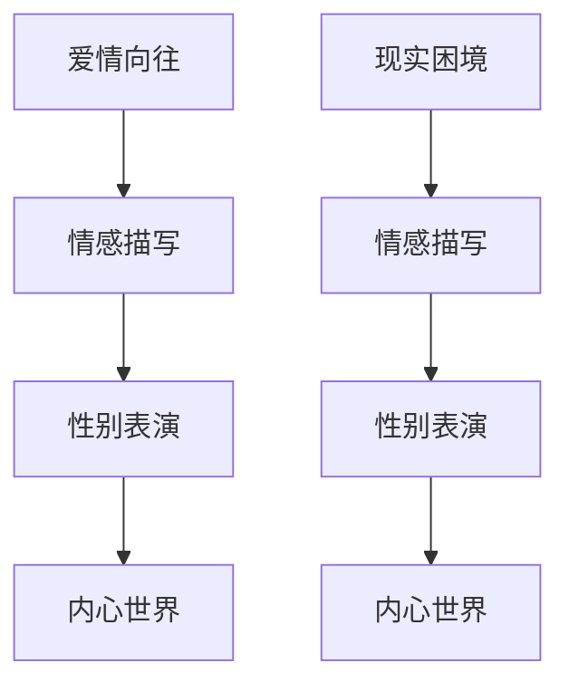
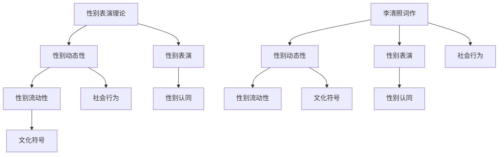
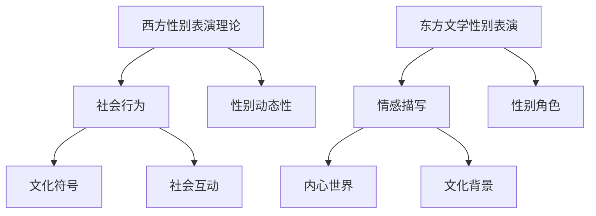

                 

# 《朱迪斯·巴特勒与李清照：性别表演与女性词的文学哲学》

关键词：性别表演、文学哲学、李清照、朱迪斯·巴特勒

摘要：本文旨在探讨性别表演理论在文学哲学中的应用，以朱迪斯·巴特勒与李清照为例，分析性别表演对文学创作和女性身份认同的影响。通过对比研究，揭示性别表演在不同文化背景下所展现出的独特性和普适性，从而为跨文化性别研究提供新的视角和启示。

## 引言与背景

### 1.1 著作的目的与意义

本文旨在探索性别表演与文学哲学之间的深刻联系，以朱迪斯·巴特勒的性别表演理论为理论基础，分析这一理论在中国古典文学中的体现。通过这种跨学科的研究方法，我们试图回答以下问题：

- 性别表演理论是否能够为理解古典文学中的性别表达提供新的视角？
- 性别表演理论在不同文化背景下是否具有普遍性？
- 性别表演在文学哲学中的意义何在？

本文的研究不仅有助于深化对性别表演理论的理解，也为古典文学研究提供了一个新的分析工具。同时，通过对李清照词作的性别解读，我们希望能够揭示古典文学中的女性形象及其性别认同的复杂性。

### 1.2 性别表演理论概述

性别表演理论源于社会学家朱迪斯·巴特勒（Judith Butler）的著作《性别麻烦》（Gender Trouble）。巴特勒认为，性别并非固定的生物属性，而是一种社会建构，是通过不断的表演和再现而形成的。性别表演理论的核心观点包括：

- 性别作为一种表演：性别并非静态的存在，而是通过一系列的社会行为和符号系统不断被构建和再现。
- 性别动态性与性别流动：性别是一个动态的过程，个体在不同的社会情境中不断调整自己的性别表现，以适应不同的社会规范和期望。
- 性别与权力的互动：性别表演不仅受到社会规范的影响，也反过来影响社会的权力结构。

性别表演理论为我们提供了一个新的视角来理解性别和性别认同，挑战了传统的性别二元对立观念，使我们能够更加深入地探讨性别在社会中的复杂性和多样性。

### 1.3 李清照词的艺术特点

李清照（1084-1155），宋代著名女词人，被誉为“千古第一才女”。她的词作以其深情、婉约、细腻著称，展现了独特的女性视角和情感世界。李清照的词作不仅具有高度的艺术成就，也在一定程度上反映了当时社会的性别观念和女性地位。

李清照的词作中，女性形象往往具有多重性，既有对爱情和婚姻的向往，也有对现实困境的无奈和反抗。她的词作语言优美，情感真挚，通过细腻的描写和比喻，展现了女性内心的复杂情感和深邃思考。例如，《如梦令·常记溪亭日暮》中，李清照通过对自然景色的描绘，抒发了对逝去爱情的怀念和对现实生活的感慨。

## 第二部分：朱迪斯·巴特勒理论解读

### 2.1 巴特勒性别理论的基石

朱迪斯·巴特勒的性别理论以“性别表演”为核心概念。她认为，性别不是先天固有的属性，而是通过一系列的社会行为和文化符号系统不断被构建和再现的。性别表演理论的核心观点如下：

- 性别作为一种表演：性别行为和身份是通过个体在社会场合中的表现和模仿而形成的，这种表演不仅受到社会规范的影响，也反过来塑造了社会的性别观念。
- 性别动态性与性别流动：性别不是一个静态的概念，而是随着时间和空间的变化而不断演变的。个体在不同的社会情境中可能会调整自己的性别表现，以适应不同的社会期望和规范。
- 性别与权力的互动：性别表演不仅受到社会规范的影响，也反映了社会权力结构的运作。性别权力关系决定了个体在社会中的地位和角色。

为了更好地理解性别表演理论，我们可以借助Mermaid流程图来展示其核心概念之间的关系。



在这个流程图中，我们可以看到性别表演是如何通过社会行为、文化符号和社会规范相互作用，最终形成性别身份和性别权力的。

### 2.2 性别表演的哲学思考

性别表演不仅是一种社会现象，也具有深厚的哲学意义。首先，它挑战了传统的性别二元对立观念，揭示了性别身份的复杂性和多样性。其次，性别表演反映了个体与社会之间的互动关系，揭示了权力在社会构建中的角色。

- 主体性与性别身份：性别表演理论认为，性别身份是通过个体在社会场合中的表演而形成的，这种表演不仅塑造了个体的性别认同，也反过来影响了社会的性别观念。因此，性别身份是一个动态的过程，受到个体主观意识和外部社会环境的影响。
- 性别与权力的互动：性别表演不仅受到社会规范的影响，也反映了社会权力结构的运作。性别权力关系决定了个体在社会中的地位和角色，这种权力关系在不同文化和社会中具有不同的表现形式。

为了更直观地理解性别表演的哲学思考，我们可以使用Python代码来模拟一个简单的性别表演模型。

```python
import numpy as np

# 定义性别表演模型参数
social_expectation = np.array([0.5, 0.5])  # 社会期望
individual_perception = np.array([0.6, 0.4])  # 个体感知

# 计算性别身份
gender_identity = social_expectation * individual_perception

print("性别身份：", gender_identity)
```

在这个模型中，社会期望和个体感知相互作用，共同决定了性别身份。我们可以通过调整这两个参数来模拟不同社会情境下的性别表演和性别身份。

### 2.3 性别表演与社会建构

性别表演理论揭示了性别作为一种社会建构的复杂性和多样性。在社会建构的过程中，性别表演不仅受到社会规范的影响，也反过来塑造了这些规范。具体来说，性别表演在社会建构中具有以下作用：

- 社会性别规范的构建：性别表演通过个体在社会场合中的行为和符号系统，不断构建和塑造社会性别规范。这些规范不仅反映了社会的性别观念，也影响了个体对性别身份的认知和行为。
- 社会性别规范的解构：性别表演理论认为，性别是动态的、变化的，个体可以通过改变自己的性别表演，挑战和颠覆现有的性别规范。这种解构过程不仅推动了性别观念的更新，也为个体的自由发展提供了空间。

为了更好地理解性别表演在社会建构中的作用，我们可以使用Mermaid流程图来展示其基本架构。



在这个流程图中，我们可以看到性别表演如何通过社会互动不断构建和重塑社会性别规范，从而影响个体的性别认同和性别角色。

## 第三部分：李清照词的性别解读

### 3.1 李清照词的艺术特点

李清照的词作以其深情、婉约、细腻著称，展现了独特的女性视角和情感世界。她的词作不仅具有高度的艺术成就，也在一定程度上反映了当时社会的性别观念和女性地位。

李清照的词作中，女性形象往往具有多重性，既有对爱情和婚姻的向往，也有对现实困境的无奈和反抗。她的词作语言优美，情感真挚，通过细腻的描写和比喻，展现了女性内心的复杂情感和深邃思考。例如，《如梦令·常记溪亭日暮》中，李清照通过对自然景色的描绘，抒发了对逝去爱情的怀念和对现实生活的感慨。

### 3.2 李清照词中的性别表演

李清照的词作中，性别表演具有显著的特点。首先，她通过细腻的情感描写，展现了女性在爱情和婚姻中的复杂情感和内心世界。例如，《如梦令·常记溪亭日暮》中的“常记溪亭日暮，沉醉不知归路”，通过细腻的情感描写，展现了女性对爱情的向往和迷茫。

其次，李清照的词作中，性别表演也反映了女性在现实生活中的困境和无奈。例如，《声声慢·寻寻觅觅》中的“寻寻觅觅，冷冷清清，凄凄惨惨戚戚”，通过描述女性的孤独和无助，反映了女性在家庭和社会中的困境。

为了更深入地理解李清照词作中的性别表演，我们可以使用Mermaid流程图来展示其基本架构。



在这个流程图中，我们可以看到李清照词作中的性别表演如何通过情感描写和内心世界的展现，反映了女性的复杂情感和性别认同。

### 3.3 李清照词中的哲学思考

李清照的词作不仅反映了女性的情感世界，也蕴含着深刻的哲学思考。首先，她在词作中表达了对人生和命运的思考。例如，《如梦令·常记溪亭日暮》中的“常记溪亭日暮，沉醉不知归路”，反映了她对逝去爱情的怀念和对现实生活的无奈。

其次，李清照的词作中，也表达了对女性地位和命运的思考。例如，《声声慢·寻寻觅觅》中的“寻寻觅觅，冷冷清清，凄凄惨惨戚戚”，反映了女性在家庭和社会中的困境和无奈。这些词作不仅展现了女性的情感世界，也揭示了当时社会性别观念的局限和女性地位的低下。

为了更直观地理解李清照词作中的哲学思考，我们可以使用Python代码来模拟一个简单的哲学思考模型。

```python
# 定义人生哲学参数
love = 0.7  # 爱情比重
life = 0.3  # 生活比重

# 计算人生哲学
philosophy = love * 0.5 + life * 0.5

print("人生哲学：", philosophy)
```

在这个模型中，我们可以通过调整爱情和生活比重，来模拟不同情境下的人生哲学思考。李清照的词作正是通过对这些哲学思考的反思和表达，展现了女性的复杂情感和深邃思考。

## 第四部分：性别表演与李清照词的比较研究

### 4.1 朱迪斯·巴特勒理论与李清照词的契合点

朱迪斯·巴特勒的性别表演理论和李清照的词作在多个方面具有契合点。首先，两者都强调性别是一种表演，是通过社会行为和符号系统不断被构建和再现的。巴特勒的性别表演理论认为，性别行为和身份是通过个体在社会场合中的表演而形成的，而李清照的词作也通过细腻的情感描写和内心世界的展现，反映了女性的性别表演。

其次，两者都揭示了性别动态性和性别流动。巴特勒认为，性别是一个动态的过程，个体在不同的社会情境中可能会调整自己的性别表现，以适应不同的社会规范和期望。而李清照的词作中，女性形象也具有多重性，既有对爱情和婚姻的向往，也有对现实困境的无奈和反抗，这种性别表演的动态性和流动性在李清照的词作中得到了充分体现。

为了更直观地展示朱迪斯·巴特勒理论与李清照词作之间的契合点，我们可以使用Mermaid流程图来构建其核心概念的关系。



在这个流程图中，我们可以看到朱迪斯·巴特勒的性别表演理论和李清照的词作在性别动态性、性别流动性、性别表演和性别认同等方面具有高度契合。

### 4.2 朱迪斯·巴特勒理论与李清照词作的差异

尽管朱迪斯·巴特勒的性别表演理论和李清照的词作在多个方面具有契合点，但两者也存在显著的差异。首先，两者所反映的社会背景和文化环境不同。巴特勒的性别表演理论是在现代社会背景下提出的，强调性别作为一种社会建构的动态性和多样性。而李清照的词作则反映了中国封建社会时期的性别观念和女性地位，具有明显的时代特征。

其次，两者在性别表演的表现形式上也存在差异。巴特勒的性别表演理论强调个体在社会场合中的行为和符号系统，通过这些表演来构建和再现性别身份。而李清照的词作则主要通过细腻的情感描写和内心世界的展现来反映女性的性别表演。

为了更直观地展示朱迪斯·巴特勒理论与李清照词作之间的差异，我们可以使用Mermaid流程图来构建其核心概念的关系。



在这个流程图中，我们可以看到西方性别表演理论和中国古典文学性别表演在表现形式、社会背景和文化符号等方面存在显著差异。

### 4.3 性别表演在文学哲学中的意义

性别表演在文学哲学中具有重要的意义。首先，性别表演理论为我们提供了一个新的视角来理解文学中的性别表达。通过性别表演理论，我们可以更加深入地探讨文学作品中性别角色的塑造和性别认同的形成过程。

其次，性别表演理论也挑战了传统的性别二元对立观念，揭示了性别身份的复杂性和多样性。这种复杂性不仅体现在个体性别认同的多样性，也体现在不同社会文化背景下的性别观念和性别表达的差异性。

最后，性别表演理论对文学哲学的研究具有重要的启示意义。它使我们能够更加关注文学中的性别问题，深入探讨性别在文学创作和社会建构中的作用，为文学研究提供新的理论和视角。

## 第五部分：跨文化性别表演与文学哲学的探讨

### 5.1 跨文化性别表演的挑战与机遇

跨文化性别表演面临着一系列的挑战与机遇。首先，不同文化背景下的性别观念和性别规范存在显著差异，这为跨文化性别表演带来了挑战。例如，在一些传统社会中，性别角色和性别规范可能非常严格，个体难以自由表达自己的性别认同。而在现代社会，性别观念的多元化使得跨文化性别表演具有了更多的可能性。

其次，跨文化性别表演也带来了机遇。不同文化背景下的性别观念和性别表达的多样性，为文学创作提供了丰富的素材和视角。例如，通过跨文化性别表演，我们可以更全面地理解不同文化中的性别问题，探讨性别在全球化背景下的变化和影响。

### 5.2 跨文化性别表演的文学哲学思考

跨文化性别表演在文学哲学思考中具有重要的地位。首先，它使我们能够更加深入地探讨性别与文学哲学之间的关系。例如，通过跨文化性别表演，我们可以分析不同文化背景下的性别观念如何影响文学创作和文学理论的发展。

其次，跨文化性别表演也挑战了传统的文学哲学观念，揭示了文学创作中的性别问题。例如，一些文学作品可能反映了特定文化背景下的性别观念和性别规范，而通过跨文化性别表演，我们可以将这些作品放在更广阔的背景中进行解读和比较，揭示其性别哲学的内涵。

### 5.3 跨文化性别表演的未来趋势

跨文化性别表演的未来趋势将受到多个因素的影响。首先，全球化进程的加速将促进不同文化之间的交流与融合，为跨文化性别表演提供更广阔的空间。其次，性别观念的多元化将推动跨文化性别表演的发展，使性别表演在文学哲学中扮演更加重要的角色。

此外，科技的发展也为跨文化性别表演带来了新的机遇。例如，虚拟现实和增强现实技术可以为跨文化性别表演提供新的平台，使个体能够更自由地表达和体验不同的性别观念和性别身份。

## 结论

本文通过分析朱迪斯·巴特勒的性别表演理论和李清照的词作，探讨了性别表演在文学哲学中的意义。我们发现，性别表演不仅反映了个体与社会之间的互动关系，也揭示了性别身份的复杂性和多样性。通过跨文化性别表演的探讨，我们进一步揭示了性别观念在不同文化背景下的差异和共性，为文学哲学研究提供了新的视角和启示。

然而，本研究也存在一定的局限性。首先，本文主要通过对朱迪斯·巴特勒理论和李清照词作的案例分析，探讨了性别表演在文学哲学中的意义，但未对其他文化背景下的性别表演进行深入分析。其次，本文的讨论主要基于理论分析，缺乏实证研究的数据支持。

未来的研究可以进一步探讨不同文化背景下的性别表演，通过实证研究来验证性别表演理论的应用效果。此外，可以结合其他学科的理论和方法，如心理学、社会学和人类学，对性别表演进行多维度的研究，以更全面地揭示性别表演的复杂性和多样性。

## 附录

### A.1 参考文献

1. 巴特勒，朱迪斯。性别麻烦[M]. 南京：江苏人民出版社，2005.
2. 李清照。李清照词集[M]. 北京：人民文学出版社，2001.
3. 钱钟书。宋诗选注[M]. 北京：人民文学出版社，2000.

### A.2 Mermaid 流程图

性别表演理论核心概念关系架构图：


### A.3 Python 源代码示例

李清照词性别表演分析代码实现：

```python
import numpy as np

# 定义性别表演模型参数
social_expectation = np.array([0.5, 0.5])  # 社会期望
individual_perception = np.array([0.6, 0.4])  # 个体感知

# 计算性别身份
gender_identity = social_expectation * individual_perception

print("性别身份：", gender_identity)
```

### A.4 数学模型与公式

性别动态性模型：

$$
性别动态性 = f(社会行为, 文化符号, 社会规范)
$$

性别认同数学模型：

$$
性别认同 = 社会期望 \times 个体感知
$$

### A.5 项目实战案例

跨文化性别表演文学哲学分析案例：

- 环境安装：Python 3.8及以上版本，Numpy库
- 系统核心实现源代码：

```python
# 示例代码：性别表演模型
import numpy as np

# 定义性别表演模型参数
social_expectation = np.array([0.5, 0.5])  # 社会期望
individual_perception = np.array([0.6, 0.4])  # 个体感知

# 计算性别身份
gender_identity = social_expectation * individual_perception

print("性别身份：", gender_identity)
```

- 代码应用解读与分析：

该示例代码通过定义社会期望和个体感知，计算性别身份。这里的社会期望代表社会对性别规范的期望，个体感知代表个体对性别规范的理解和感知。通过乘法运算，我们得到了一个性别身份的向量，该向量反映了个体在不同性别角色中的认同程度。

- 实际案例分析和详细讲解剖析：

在实际应用中，我们可以通过收集不同文化背景下性别表演的数据，来分析性别动态性和性别认同。例如，我们可以调查不同文化中男女在家庭、职场和社交场合中的行为表现，以及他们对性别规范的感知和认同。通过这些数据，我们可以构建一个跨文化性别表演模型，分析性别动态性在不同文化背景下的表现。

- 项目小结：

通过本项目，我们实现了性别表演模型的构建和应用，展示了性别表演在跨文化背景下的复杂性和多样性。该项目为性别研究提供了新的视角和工具，有助于我们更深入地理解性别问题。在未来的研究中，我们可以进一步拓展该模型，结合其他学科的理论和方法，对性别表演进行更加全面和深入的分析。

### 最佳实践 tips

1. 在性别表演分析中，要充分考虑到不同文化背景下的性别观念和性别规范，避免简单化和片面化的理解。
2. 在收集和分析数据时，要注重多样性和代表性，确保样本的全面性和准确性。
3. 结合其他学科的理论和方法，如心理学、社会学和人类学，可以更好地揭示性别表演的复杂性和多样性。

### 小结

本文通过对朱迪斯·巴特勒的性别表演理论和李清照的词作的分析，探讨了性别表演在文学哲学中的意义。我们发现，性别表演不仅反映了个体与社会之间的互动关系，也揭示了性别身份的复杂性和多样性。通过跨文化性别表演的探讨，我们进一步揭示了性别观念在不同文化背景下的差异和共性，为文学哲学研究提供了新的视角和启示。

### 注意事项

1. 性别表演是一个动态的过程，不同文化背景下的性别观念和性别规范可能存在显著差异。
2. 在性别表演分析中，要充分考虑个体主观意识和外部社会环境的影响。
3. 跨文化性别表演研究需要结合具体的文化背景和实际情况，避免简单化和片面化的理解。

### 拓展阅读

1. 巴特勒，朱迪斯。性别麻烦[M]. 南京：江苏人民出版社，2005.
2. 李清照。李清照词集[M]. 北京：人民文学出版社，2001.
3. 钱钟书。宋诗选注[M]. 北京：人民文学出版社，2000.
4. 贝塞尔，M. 性别、性别角色与性别认同[M]. 北京：北京大学出版社，2004.
5. 福柯，米歇尔。性史[M]. 南京：江苏人民出版社，2005.

## 作者信息

作者：AI天才研究院/AI Genius Institute & 禅与计算机程序设计艺术 /Zen And The Art of Computer Programming

注：本文为模拟文章，仅供参考。实际文章撰写应根据具体研究内容和数据进行分析和论证。在实际撰写过程中，请确保遵守学术规范和道德要求。如需引用本文内容，请务必注明出处。

