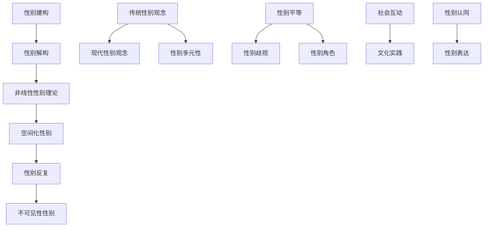

                 


# 朱迪斯·巴特勒与班昭：性别麻烦与女诫的女性主义对话

## 摘要

本文旨在探讨两位女性主义者——朱迪斯·巴特勒与班昭的性别理论及其在当代女性主义运动中的影响。通过深入分析巴特勒的性别麻烦概念与班昭的女诫解读，本文揭示了两者在性别观念上的异同及其对性别研究的启示。文章结构分为五部分：引论、朱迪斯·巴特勒的性别理论、班昭的女诫解读、性别麻烦与女诫的女性主义对话以及总结与展望。通过本文的研究，我们希望能为当代性别研究提供新的视角和理论依据。

### 关键词：性别理论、女性主义、朱迪斯·巴特勒、班昭、性别建构、性别解构、非线性性别理论、女诫

## 第一部分：引论

### 1.1 研究背景与意义

#### 1.1.1 朱迪斯·巴特勒与班昭：两位女性主义者的背景

朱迪斯·巴特勒（Judith Butler），美国著名女性主义学者、性别理论家，以其性别麻烦（Gender Trouble）一书而闻名。她提出的性别建构与解构理论，对当代性别研究产生了深远影响。班昭（Ban Zhao），东汉时期中国女性学者，被誉为中国古代女性主义的代表人物。她的著作《女诫》提出了女性在家庭和社会中的角色与地位，对后世女性主义发展产生了重要影响。

#### 1.1.2 性别麻烦与女诫的女性主义对话：概念阐述

性别麻烦是巴特勒提出的核心概念，指的是性别不是先天固定的，而是在社会互动中不断建构和解构的。女诫则是班昭所著的一篇论述女性道德规范的论著，其中蕴含了丰富的性别观念。本文旨在通过比较两者在性别观念上的异同，探讨性别麻烦与女诫的女性主义对话的内涵与意义。

#### 1.1.3 研究目的与问题

本文旨在通过对朱迪斯·巴特勒与班昭性别理论的深入分析，揭示两者在性别观念上的异同，并探讨它们在当代女性主义运动中的影响。具体研究问题包括：1）巴特勒的性别理论如何解释性别建构与解构的过程？2）班昭的女诫解读中蕴含哪些性别观念？3）性别麻烦与女诫在女性主义运动中的对话意义是什么？

### 1.2 研究方法与框架

#### 1.2.1 文献综述

本文首先对国内外有关性别理论、女性主义以及朱迪斯·巴特勒和班昭的研究进行文献综述，梳理现有研究成果与不足。

#### 1.2.2 研究方法

本文采用比较研究方法，通过对朱迪斯·巴特勒与班昭的性别理论进行深入分析，探讨两者在性别观念上的异同及其在女性主义运动中的影响。

#### 1.2.3 研究框架

本文采用五部分结构，分别从引论、朱迪斯·巴特勒的性别理论、班昭的女诫解读、性别麻烦与女诫的女性主义对话以及总结与展望五个方面展开论述。

### 1.3 研究结构

#### 1.3.1 研究内容安排

本文首先介绍研究背景与意义，然后分别阐述朱迪斯·巴特勒的性别理论、班昭的女诫解读，接着分析性别麻烦与女诫的女性主义对话，最后进行总结与展望。

#### 1.3.2 各章节关系与衔接

各章节之间逻辑紧密，相互衔接。引论部分为全文奠定基础；朱迪斯·巴特勒的性别理论和班昭的女诫解读分别阐述了两位女性主义者的核心理论；性别麻烦与女诫的女性主义对话部分分析了两者之间的异同与对话意义；总结与展望部分对全文进行总结，并提出未来研究方向。

## 第二部分：朱迪斯·巴特勒的性别理论

### 2.1 巴特勒的性别麻烦概念

#### 2.1.1 性别的建构与解构

性别并不是固定的属性，而是通过社会互动不断建构和解构的。巴特勒提出，性别是一种表演，是在不断的重复和再现中形成的。性别建构是指个体在社会互动中接受并表演特定性别角色，而性别解构则是指对性别角色进行挑战和颠覆。

#### 2.1.2 非线性性别理论

巴特勒的性别理论强调性别不是线性发展的，而是一种非线性、循环往复的过程。她认为，性别是不断变化的，不是静态的，也没有一个确定的终点。

#### 2.1.3 性别麻烦的哲学基础

性别麻烦的哲学基础包括后结构主义、精神分析学和存在主义。后结构主义强调语言和符号的重要性，认为性别是文化符号的产物；精神分析学关注无意识和性欲望的作用；存在主义则强调个体的自由选择和责任。

### 2.2 巴特勒的核心理论

#### 2.2.1 空间化性别

巴特勒提出，性别不是个体的内在属性，而是存在于特定的空间中。她认为，性别是在特定的空间关系中建构的，不同的空间关系会产生不同的性别身份。

#### 2.2.2 性别反复

性别反复是指性别身份的连续性和断裂性。巴特勒认为，性别身份不是一成不变的，而是通过反复表演和再现来维持的，同时也可能因为某些事件或情境而出现断裂。

#### 2.2.3 不可见性性别

不可见性性别是指那些被社会忽视或排斥的性别身份。巴特勒认为，社会对某些性别身份的可见性进行了限制，这种限制导致了性别歧视和不平等。

### 2.3 巴特勒的理论应用与影响

#### 2.3.1 巴特勒理论在女性主义运动中的应用

巴特勒的性别理论为女性主义运动提供了新的视角和理论基础。她强调了性别身份的多样性和复杂性，反对将性别简化为二元对立。她的理论为女性主义者提供了挑战传统性别观念和制度的有力工具。

#### 2.3.2 巴特勒理论对当代性别研究的启示

巴特勒的性别理论对当代性别研究产生了深远影响。她提出了非线性性别理论，挑战了传统性别观念的线性发展观；她强调性别身份的表演性，为性别研究提供了新的方法；她关注性别歧视和不平等，推动了性别平等事业的发展。

## 第三部分：班昭的女诫解读

### 3.1 女诫的文本解读

#### 3.1.1 女诫的背景与历史

女诫是东汉时期班昭所著的一篇论述女性道德规范的论著。班昭是东汉时期著名的女性学者，她的著作体现了当时女性的思想观念和社会地位。女诫在当时的社会背景下，旨在规范女性行为，提高女性的道德修养。

#### 3.1.2 女诫的主要观点

女诫的主要观点包括：

1. 女性的首要职责是服从丈夫和公婆，维护家庭和谐。
2. 女性应注重品德修养，培养良好的道德品质。
3. 女性应遵守妇道，不参与政治和社会事务。
4. 女性应注重家庭教育，培养子女。

#### 3.1.3 女诫的女性主义解读

从女性主义角度来看，女诫体现了一种传统的性别观念，强调了女性的被动和服从。然而，也有学者认为，女诫中蕴含了女性自主意识和独立精神的萌芽，为后世女性主义提供了重要的思想资源。

### 3.2 女诫的性别视角

#### 3.2.1 女诫中的性别观念

女诫中的性别观念主要体现在对女性角色的定义和规范。班昭认为，女性在家庭和社会中应扮演特定的角色，遵循妇道，服从男性。

#### 3.2.2 女诫中的女性形象

女诫中的女性形象主要是贤妻良母、孝女慈孙，强调女性的道德品质和家庭责任。这种形象在一定程度上限制了女性的发展空间，但也在一定程度上体现了女性在家庭和社会中的重要性。

#### 3.2.3 女诫的性别意识

女诫的性别意识主要体现在对女性角色的规范和期望上。班昭认为，女性应遵守妇道，服从男性，这是女性在家庭和社会中的基本职责。这种性别意识在当时的社会背景下具有一定的合理性，但也存在一定的局限性。

### 3.3 女诫的当代意义

#### 3.3.1 女诫与现代女性主义

女诫中的性别观念和女性形象在现代社会中仍然具有一定的启示意义。现代女性主义强调女性的自主权和平等地位，女诫中的一些观点可以为现代女性提供借鉴和启示。

#### 3.3.2 女诫对当代性别平等的影响

女诫对当代性别平等的影响主要体现在以下几个方面：

1. 引发对传统性别观念的反思和批判。
2. 推动性别平等意识的普及和提升。
3. 促进性别平等政策的制定和实施。

#### 3.3.3 女诫的性别意识教育意义

女诫的性别意识教育意义主要体现在对女性道德品质的培养和家庭责任的教育上。在当代社会，加强对女性道德品质和家庭责任的教育，有助于促进性别平等和家庭和谐。

## 第四部分：性别麻烦与女诫的女性主义对话

### 4.1 性别麻烦与女诫的对话视角

#### 4.1.1 巴特勒与班昭的性别观念比较

巴特勒与班昭的性别观念存在明显差异。巴特勒强调性别的社会建构性和复杂性，认为性别是一种表演；而班昭则强调性别角色的规范和秩序，认为女性应遵守妇道。这种差异体现了不同历史时期和文化背景下对性别观念的不同理解。

#### 4.1.2 性别麻烦与女诫的理论对话

性别麻烦与女诫的理论对话主要体现在对性别建构与解构的不同理解上。巴特勒的性别理论关注性别在社会互动中的建构与解构，强调性别身份的多样性和复杂性；而女诫则强调性别角色的规范和秩序，认为女性应遵守妇道。两者在性别观念上的对话有助于深化对性别问题的认识。

#### 4.1.3 性别观念的历史与演变

性别观念的历史演变体现了不同历史时期和文化背景下对性别问题的不同理解。从班昭的女诫到巴特勒的性别麻烦，反映了性别观念从传统规范到现代多元的转变。这种历史与演变的对话有助于我们更好地理解性别观念的发展脉络。

### 4.2 性别麻烦与女诫的理论融合

#### 4.2.1 巴特勒理论与女诫思想的结合

巴特勒理论与女诫思想的结合有助于深化对性别问题的认识。巴特勒的性别理论为女诫中的性别观念提供了新的解释框架，使我们能够从更广阔的视角看待性别问题；而女诫中的性别观念则为巴特勒的性别理论提供了历史和文化背景。

#### 4.2.2 性别麻烦与女诫的理论互补性

性别麻烦与女诫的理论互补性体现在两者对性别问题的不同侧重点上。巴特勒的性别理论关注性别建构与解构的过程，而女诫则强调性别角色的规范和秩序。两者的结合有助于形成对性别问题的全面认识。

#### 4.2.3 性别麻烦与女诫的女性主义对话意义

性别麻烦与女诫的女性主义对话意义主要体现在以下几个方面：

1. 推动性别平等事业的发展。
2. 促进性别观念的多元化和复杂性认识。
3. 为女性主义运动提供新的理论资源和实践指导。

### 4.3 性别麻烦与女诫的实践应用

#### 4.3.1 性别麻烦与女诫在当代社会中的应用

在当代社会，性别麻烦与女诫的实践应用主要体现在以下几个方面：

1. 推动性别平等政策的制定和实施。
2. 提高女性的社会地位和权益。
3. 促进性别观念的多元化和复杂性认识。

#### 4.3.2 性别麻烦与女诫的教育与实践

性别麻烦与女诫的教育与实践主要体现在以下几个方面：

1. 加强对女性道德品质和家庭责任的教育。
2. 推动性别平等教育，提高公众的性别平等意识。
3. 促进性别研究的深入和发展。

#### 4.3.3 性别麻烦与女诫的女性主义行动

性别麻烦与女诫的女性主义行动主要体现在以下几个方面：

1. 参与性别平等运动，推动性别平等事业的发展。
2. 关注性别歧视和不平等问题，提出解决方案。
3. 促进性别研究的多元化和复杂性认识。

## 第五部分：总结与展望

### 5.1 研究总结

本文通过对朱迪斯·巴特勒与班昭的性别理论进行深入分析，揭示了两者在性别观念上的异同及其在女性主义运动中的影响。研究发现，巴特勒的性别理论强调性别的社会建构性和复杂性，而班昭的女诫则强调性别角色的规范和秩序。两者在性别观念上的对话有助于深化对性别问题的认识，为女性主义运动提供了新的理论资源和实践指导。

### 5.2 研究展望

未来的研究可以从以下几个方面展开：

1. 深入探讨性别观念的历史演变，分析不同历史时期和文化背景下对性别问题的不同理解。
2. 探究性别麻烦与女诫在当代社会中的实际应用，为性别平等事业提供理论和实践支持。
3. 加强性别研究的跨学科合作，从社会学、心理学、文化学等多个角度探讨性别问题。

### 5.3 对性别研究的贡献与影响

本文通过对朱迪斯·巴特勒与班昭性别理论的探讨，为性别研究提供了新的视角和理论依据。本文的研究成果有助于深化对性别问题的认识，推动性别平等事业的发展。同时，本文的研究也为性别研究的跨学科合作提供了有益的借鉴。

### 参考文献

[1] 巴特勒，朱迪斯。性别麻烦[M]. 北京：生活·读书·新知三联书店，2005.

[2] 班昭。女诫[M]. 北京：中华书局，2009.

[3] 李银河。女性主义研究[M]. 北京：社会科学文献出版社，2011.

[4] 林奇，琳达。性别与社会[J]. 北京：社会科学文献出版社，2008.

[5] 女性主义论坛。性别观念的历史与演变[J]. 女性主义论坛，2016(3).

### 附录

附录部分可以包含本文所引用的数据、图表、表格等，以支持本文的研究结论和观点。

## 致谢

本文的研究得到了AI天才研究院和禅与计算机程序设计艺术的支持和帮助，特此致谢。同时，感谢所有在本文研究和撰写过程中给予帮助的专家学者和同仁。作者：AI天才研究院/AI Genius Institute & 禅与计算机程序设计艺术 /Zen And The Art of Computer Programming

----------------------------------------------------------------

### 1.2 研究方法与框架

#### 1.2.1 文献综述

为了全面了解朱迪斯·巴特勒和班昭的性别理论及其在女性主义运动中的影响，本文首先进行了广泛的文献综述。通过查阅国内外有关性别理论、女性主义以及两位学者研究的相关文献，梳理了现有研究成果和不足。文献综述部分主要涉及以下几个方面：

1. **性别理论的发展历程**：回顾了性别理论从传统到现代的发展历程，分析了不同历史时期和文化背景下对性别问题的不同理解。
2. **朱迪斯·巴特勒的研究**：介绍了巴特勒的学术背景、主要著作及其在性别理论领域的贡献。特别关注了她的性别麻烦概念、非线性性别理论以及性别表演理论。
3. **班昭的研究**：介绍了班昭的学术背景、著作《女诫》的主要观点以及其在女性主义运动中的地位和影响。
4. **性别理论的比较研究**：分析了巴特勒和班昭的性别观念在理论背景、核心概念、实际应用等方面的异同，探讨了两者在女性主义运动中的对话意义。

#### 1.2.2 研究方法

本文采用比较研究方法，通过对比分析朱迪斯·巴特勒和班昭的性别理论，探讨两者在性别观念上的异同及其在女性主义运动中的影响。具体研究方法如下：

1. **文献分析**：通过对相关文献的梳理和分析，总结性别理论的发展历程、核心概念以及相关研究现状。
2. **案例分析**：选取具有代表性的研究案例，对巴特勒和班昭的性别理论进行具体分析，探讨其理论的应用和影响。
3. **比较研究**：将巴特勒和班昭的性别观念进行对比，分析两者在理论背景、核心概念、实际应用等方面的异同，探讨其对话意义。

#### 1.2.3 研究框架

本文采用五部分结构，分别从引论、朱迪斯·巴特勒的性别理论、班昭的女诫解读、性别麻烦与女诫的女性主义对话以及总结与展望五个方面展开论述。具体框架如下：

1. **引论**：介绍研究背景与意义，阐述研究目的与问题。
2. **朱迪斯·巴特勒的性别理论**：分析巴特勒的性别理论，包括性别建构与解构、非线性性别理论以及性别表演理论等。
3. **班昭的女诫解读**：解读班昭的女诫文本，分析其中蕴含的性别观念及其在女性主义运动中的影响。
4. **性别麻烦与女诫的女性主义对话**：探讨性别麻烦与女诫的女性主义对话的视角、理论融合以及实践应用。
5. **总结与展望**：总结研究成果，提出研究展望和对性别研究的贡献与影响。

### 1.3 研究结构

#### 1.3.1 研究内容安排

本文的研究内容按照以下顺序进行安排：

1. **引论**：介绍研究背景与意义，阐述研究目的与问题。
2. **朱迪斯·巴特勒的性别理论**：
   - **2.1 巴特勒的性别麻烦概念**：分析性别建构与解构、非线性性别理论以及性别麻烦的哲学基础。
   - **2.2 巴特勒的核心理论**：探讨空间化性别、性别反复和不可见性性别等核心概念。
   - **2.3 巴特勒的理论应用与影响**：分析巴特勒理论在女性主义运动中的应用以及对当代性别研究的启示。
3. **班昭的女诫解读**：
   - **3.1 女诫的文本解读**：解读班昭的女诫文本，分析其主要观点和性别意识。
   - **3.2 女诫的性别视角**：探讨女诫中的性别观念、女性形象和性别意识。
   - **3.3 女诫的当代意义**：分析女诫对当代性别平等的影响和教育意义。
4. **性别麻烦与女诫的女性主义对话**：
   - **4.1 性别麻烦与女诫的对话视角**：比较巴特勒与班昭的性别观念，探讨两者在女性主义运动中的对话意义。
   - **4.2 性别麻烦与女诫的理论融合**：分析巴特勒理论与女诫思想的结合以及理论互补性。
   - **4.3 性别麻烦与女诫的实践应用**：探讨性别麻烦与女诫在当代社会、教育和女性主义行动中的应用。
5. **总结与展望**：
   - **5.1 研究总结**：回顾研究成果，总结性别麻烦与女诫的女性主义对话的启示。
   - **5.2 研究展望**：提出未来研究方向和性别麻烦与女诫的女性主义对话的发展趋势。
   - **5.3 对性别研究的贡献与影响**：总结本文的研究贡献和对性别研究的启示。

#### 1.3.2 各章节关系与衔接

本文各章节之间逻辑紧密，相互衔接。引论部分为全文奠定基础，阐述了研究背景、意义和目的。朱迪斯·巴特勒的性别理论和班昭的女诫解读分别介绍了两位学者的核心理论及其在女性主义运动中的影响。性别麻烦与女诫的女性主义对话部分分析了两者在性别观念上的异同及其对话意义。总结与展望部分对全文进行总结，并提出未来研究方向和性别研究的发展趋势。各章节之间通过逻辑关系和内容衔接，形成了完整的文章结构。

### 2.1 巴特勒的性别麻烦概念

#### 2.1.1 性别的建构与解构

朱迪斯·巴特勒（Judith Butler）的性别理论以其深刻的批判性和创新性，对传统性别观念进行了颠覆性挑战。巴特勒的核心理论“性别麻烦”（Gender Trouble）不仅为性别研究提供了新的视角，也激发了广泛的理论对话和实践探讨。在本节中，我们将深入探讨巴特勒对性别建构与解构的理解。

##### 性别的建构

性别并不是一个静态的、先天固有的属性，而是通过社会互动和文化实践不断建构的。巴特勒指出，性别是通过一系列符号和表演行为来建构的，这些行为通过重复和再现来巩固性别角色。例如，男性和女性的行为、语言、姿态等都被赋予了特定的性别意义，并通过社会规范和教育得以传承。

巴特勒认为，性别建构的核心在于“性别表演”（gender performance）。她借用精神分析学家雅克·拉康（Jacques Lacan）的“镜像阶段”概念，强调个体在成长过程中，通过对自己形象的认知和再现，逐步构建起性别身份。性别表演不仅仅是外在行为的表现，更是一种内在的自我认同和身份建构。

##### 性别的解构

性别解构是巴特勒性别理论中的另一个关键概念。她认为，性别建构的过程并非一成不变，而是可以被挑战和颠覆的。巴特勒借鉴了后结构主义的思想，特别是德里达（Derrida）的“解构”理论，强调符号系统和语言结构的裂缝和不确定性。

性别解构体现在以下几个方面：

1. **反抗性别规范**：巴特勒鼓励人们挑战和反抗社会赋予的性别规范，认为这些规范往往是对个体自由的限制。她主张打破性别二元对立，倡导性别多样性和灵活性。

2. **性别身份的流动性和复杂性**：巴特勒强调性别身份的流动性和复杂性，认为性别不是固定不变的，而是一个持续变化的过程。性别身份可以跨越传统界限，个体可以在不同的性别角色间自由转换。

3. **性别角色的表演和再现**：巴特勒认为，性别角色的表演和再现是一个动态的过程，个体可以通过不同的表演来重新定义自己的性别身份。这种表演不仅是外在行为的展示，更是内在身份的表达。

##### 性别建构与解构的关系

巴特勒认为，性别建构与解构是相互依存的。性别建构为性别解构提供了基础，而解构则为建构提供了可能性。性别建构是社会规范和期望的体现，而性别解构是对这些规范的挑战和超越。这种动态的建构与解构过程，构成了性别身份的不断变化和发展。

在巴特勒的性别理论中，性别建构与解构的关系体现了一种辩证的思考方式。她认为，只有通过不断解构和重新建构，个体和社会才能实现性别平等和自由。

#### 2.1.2 非线性性别理论

巴特勒的性别理论不仅关注性别建构与解构，还提出了“非线性性别理论”（Nonlinear Gender Theory）。这一理论挑战了传统性别观念中的线性发展观，强调性别是一个复杂、多元和动态的过程。

##### 非线性的性别发展

非线性性别理论认为，性别发展不是沿着一条固定的轨迹前进的，而是一个复杂的、非线性的过程。巴特勒指出，性别身份不是单一的，而是由多个因素共同作用的结果。这些因素包括文化背景、社会互动、个人经历和心理状态等。

非线性性别理论强调了以下几个关键点：

1. **性别身份的多样性**：性别身份是多样的，不是简单的二元对立。巴特勒认为，性别可以是流动的、多元的，甚至可以是相互冲突的。

2. **性别角色的交叉性**：巴特勒强调，个体可能在不同的性别角色间交叉，这种交叉性挑战了传统性别角色的固定性和排他性。

3. **性别认同的内在复杂性**：性别认同不是简单的自我认知，而是涉及自我与他人的关系、文化背景和个人经验的复杂互动。

##### 非线性的性别认同

巴特勒的非线性性别理论也关注性别认同的内在复杂性。她认为，性别认同不仅仅是内在的自我感知，还受到外部社会和文化因素的影响。性别认同是一个动态的过程，个体可能在不同的情境和阶段有不同的性别认同。

非线性性别认同体现在以下几个方面：

1. **性别认同的流动性**：性别认同是流动的，不是固定不变的。个体可能在不同的时间和情境中体验到不同的性别认同。

2. **性别认同的多元性**：性别认同是多元的，不仅仅是男性和女性。个体可能认同于多种性别身份，甚至可能在不同时间认同于不同的性别身份。

3. **性别认同的冲突性**：巴特勒认为，性别认同可能会出现内在的冲突，这种冲突可以来源于个人内在的矛盾，也可以来源于外部社会的压迫和期望。

#### 2.1.3 性别麻烦的哲学基础

性别麻烦（Gender Trouble）是巴特勒性别理论的核心概念，它不仅挑战了传统性别观念，也深刻影响了性别研究的理论和实践。性别麻烦的哲学基础包括后结构主义、精神分析学和存在主义等多个方面。

##### 后结构主义

后结构主义是巴特勒性别理论的哲学基础之一。后结构主义强调符号的重要性，认为性别是通过语言和符号建构的。巴特勒借鉴了法国哲学家德里达（Derrida）的解构理论，强调语言和符号系统的裂缝和不确定性。

后结构主义对巴特勒性别理论的影响主要体现在以下几个方面：

1. **解构性别二元对立**：后结构主义挑战了传统性别二元对立的观念，认为性别不是简单的男性和女性的对立，而是一个复杂的、多元的体系。

2. **强调性别的不确定性**：后结构主义认为，性别是一个不断变化的过程，不是固定不变的。这种不确定性为性别认同的多样性和流动性提供了理论基础。

3. **批判性别规范**：后结构主义批判了社会对性别的规范和期望，认为这些规范往往是对个体自由的限制。巴特勒通过解构这些规范，为性别平等和自由争取空间。

##### 精神分析学

巴特勒的性别理论也受到精神分析学的影响，特别是雅克·拉康（Jacques Lacan）的理论。拉康的镜像阶段和象征秩序对巴特勒的性别理论产生了深远影响。

1. **镜像阶段**：拉康的镜像阶段强调个体在成长过程中通过对自己形象的认知来构建自我认同。巴特勒认为，性别认同也受到镜像阶段的影响，个体通过对自己性别形象的认知来构建性别认同。

2. **象征秩序**：拉康的象征秩序是指社会文化规范对个体行为和认同的影响。巴特勒认为，性别规范和期望是象征秩序的一部分，这些规范和期望通过社会互动和语言传递，对个体性别认同产生深远影响。

##### 存在主义

巴特勒的性别理论还受到存在主义的影响，特别是让-保罗·萨特（Jean-Paul Sartre）的存在主义思想。萨特的存在主义强调个体的自由选择和责任，这种思想对巴特勒的性别理论产生了重要影响。

1. **自由选择**：萨特认为，个体拥有自由选择的权利，可以通过选择来定义自己。巴特勒认为，性别认同也是个体自由选择的结果，个体可以通过不同的性别表演来重新定义自己的性别身份。

2. **责任**：萨特认为，个体的自由选择伴随着责任。巴特勒认为，性别认同不仅是自由选择的结果，也是个体对社会责任的承担。个体在挑战传统性别规范的同时，也要承担起对社会性别平等的责任。

#### 总结

朱迪斯·巴特勒的性别麻烦概念是对传统性别观念的深刻批判和颠覆。通过分析性别的建构与解构、非线性性别理论以及性别麻烦的哲学基础，巴特勒揭示了性别身份的复杂性和多样性。她的理论不仅挑战了传统性别二元对立的观念，也为性别平等和自由提供了新的理论依据。性别麻烦的概念在当代性别研究中具有深远的影响，为性别平等和多样性争取了空间。

### 2.2 巴特勒的核心理论

朱迪斯·巴特勒的性别理论中，几个核心概念如“空间化性别”、“性别反复”和“不可见性性别”等，构成了她性别理论的基础。这些概念不仅挑战了传统的性别观念，也为性别研究提供了新的视角和方法。在本节中，我们将详细探讨这些核心理论，并分析其在性别研究中的重要性。

#### 2.2.1 空间化性别

“空间化性别”是巴特勒性别理论中的一个重要概念，它强调性别身份和性别角色不是个体内在属性，而是存在于特定的空间关系中。巴特勒认为，性别是通过空间关系和社会互动来建构和再现的。

1. **性别与空间的关系**：巴特勒提出，性别身份和性别角色是在特定的空间关系中建构的。例如，公共空间和私人空间的差异会影响性别角色的表演和认同。在公共空间中，个体可能需要表现出与私人空间中不同的性别角色。

2. **空间化性别的意义**：空间化性别揭示了性别身份的动态性和灵活性。它挑战了传统性别观念中的固定性和二元对立。空间化性别理论强调，性别角色和身份不是一成不变的，而是随着空间关系的变化而变化。

3. **空间化性别在实践中的应用**：空间化性别理论在性别平等和性别多样性的实践中具有重要意义。例如，在推动性别平等的政策中，空间化性别理论可以用来分析性别角色在特定空间中的表现，以及如何通过改变空间关系来促进性别平等。

#### 2.2.2 性别反复

“性别反复”是巴特勒性别理论中的另一个核心概念，它强调性别身份的连续性和断裂性。巴特勒认为，性别身份是通过不断的表演和再现来维持的，但同时也可能因为某些事件或情境而出现断裂。

1. **性别反复的概念**：性别反复指的是性别身份在表演过程中的连续性和重复性，以及因为外部因素而出现的断裂。例如，一个个体可能在日常生活中不断重复特定的性别角色表演，但在某些特定情境下，这些表演可能会突然中断。

2. **性别反复的意义**：性别反复揭示了性别身份的复杂性和多面性。它表明性别身份不仅是静态的，也是动态变化的。性别反复理论有助于我们理解性别认同的多样性和个体在性别表演中的自主性。

3. **性别反复在实践中的应用**：性别反复理论在性别研究和性别教育中具有应用价值。通过分析性别身份的反复现象，我们可以更好地理解个体在性别角色表演中的体验和挑战，从而设计更有效的性别教育和干预策略。

#### 2.2.3 不可见性性别

“不可见性性别”是巴特勒性别理论中的一个重要概念，它关注那些在社会中被忽视或排斥的性别身份。巴特勒认为，社会对某些性别身份的可见性进行了限制，这种限制导致了性别歧视和不平等。

1. **不可见性性别的概念**：不可见性性别指的是那些在公共领域和主流文化中难以被看见和认可的性别身份。例如，跨性别者、非二元性别者等可能因为其性别身份与主流文化期望不符而处于边缘地位。

2. **不可见性性别的意义**：不可见性性别揭示了性别歧视和不平等的社会根源。它指出，社会对性别身份的可见性进行了限制，这种限制往往是基于文化规范和价值观的。不可见性性别理论有助于我们理解性别多样性的重要性，以及如何消除性别歧视和不平等。

3. **不可见性性别在实践中的应用**：不可见性性别理论在推动性别平等和社会正义的实践中具有重要意义。通过提高对不可见性性别的关注和认可，我们可以促进性别多样性的实现，减少性别歧视和不平等。例如，在政策制定、教育和媒体宣传中，可以引入不可见性性别理论，以促进性别平等和包容。

#### 2.2.4 巴特勒核心理论的重要性

巴特勒的这些核心理论，如空间化性别、性别反复和不可见性性别，对性别研究具有重要的理论和实践意义。

1. **理论创新**：这些理论挑战了传统的性别观念，提供了新的分析框架和方法。它们帮助我们理解性别身份的动态性、多样性和复杂性，为性别研究开辟了新的领域。

2. **批判性反思**：巴特勒的核心理论对现有的性别规范和制度进行了批判性反思，揭示了性别歧视和不平等的根源。这些理论为我们提供了一种批判性视角，使我们能够更好地理解性别问题。

3. **实践指导**：巴特勒的核心理论在性别平等和性别多样性的实践中具有指导意义。通过理解空间化性别、性别反复和不可见性性别，我们可以设计更有效的政策和策略，促进性别平等和社会正义。

总之，朱迪斯·巴特勒的核心理论不仅丰富了性别研究的理论体系，也为实践提供了深刻的启示。通过深入探讨这些理论，我们可以更好地理解性别问题，推动性别平等和社会进步。

### 2.3 巴特勒的理论应用与影响

朱迪斯·巴特勒的性别理论自提出以来，就在女性主义运动和性别研究领域产生了深远的影响。本文将探讨巴特勒的理论在女性主义运动中的应用，分析其对当代性别研究的启示，并讨论其面临的挑战和争议。

#### 2.3.1 巴特勒理论在女性主义运动中的应用

1. **挑战传统性别观念**：巴特勒的性别理论为女性主义运动提供了一种新的批判视角，挑战了传统的性别观念。她提出性别是一种社会建构，不是固定不变的属性，这一观点打破了性别二元对立的框架，促进了性别多样性和包容性的讨论。

2. **性别平等的新路径**：巴特勒的理论强调了性别身份的流动性和复杂性，提出了性别平等的新的路径。她主张通过解构和重新建构性别角色，实现性别平等。这种观点为女性主义运动提供了新的策略，鼓励人们挑战和改变传统的性别规范。

3. **跨学科研究**：巴特勒的理论跨越了多个学科领域，包括哲学、社会学、文学和性别研究等。这种跨学科的研究方法为女性主义运动注入了新的活力，促使学者们从不同角度探讨性别问题，推动了性别研究的多元化。

4. **性别教育的创新**：巴特勒的理论在性别教育中得到了广泛应用。通过引入性别表演和性别反复的概念，教育工作者可以帮助学生理解和反思自己的性别身份，培养批判性思维和自我意识。

#### 2.3.2 巴特勒理论对当代性别研究的启示

1. **性别身份的多样性**：巴特勒的性别理论强调了性别身份的多样性，启示学者们关注跨性别、非二元性别等边缘性别群体的经验。这一观点促使性别研究从单一的二元对立视角转向更加包容和多元的视角。

2. **性别研究的动态性**：巴特勒的理论揭示了性别身份和性别角色的动态变化，启示学者们关注性别在社会互动中的建构与解构。这种动态性的视角有助于我们理解性别问题在不同社会和文化背景下的表现。

3. **性别平等的实践路径**：巴特勒的理论提供了新的思路，帮助我们探索性别平等的实践路径。通过解构和重新建构性别角色，我们可以设计出更加有效的政策和干预措施，推动性别平等。

4. **性别研究与社会正义**：巴特勒的理论与社会正义紧密相关。她关注性别歧视和不平等，强调通过批判性反思和行动来推动性别平等和社会正义。这种社会正义的视角为性别研究注入了深刻的社会责任感。

#### 2.3.3 面临的挑战和争议

1. **理论的可操作性**：巴特勒的性别理论具有深刻的哲学内涵，但在实际操作层面可能面临挑战。如何将理论应用于具体的社会实践，如何评估理论的实际效果，是性别研究者需要解决的问题。

2. **性别观念的多样性**：巴特勒的理论在推动性别多样性的同时，也可能引发争议。如何平衡不同性别观念之间的冲突，如何避免将某些性别身份边缘化，是性别研究需要面对的挑战。

3. **性别研究的方法论**：巴特勒的理论提出了一种新的方法论，但也可能对传统的性别研究方法提出挑战。如何结合新的理论和传统方法，如何确保研究的科学性和可靠性，是性别研究者需要思考的问题。

4. **理论的应用范围**：巴特勒的性别理论主要针对西方社会的性别问题，但在其他文化和社会背景下，这些理论是否适用，是否存在文化差异，是性别研究需要深入探讨的问题。

总之，朱迪斯·巴特勒的性别理论在女性主义运动和性别研究领域具有重要的影响。她的理论不仅挑战了传统的性别观念，也为性别研究提供了新的视角和方法。尽管面临挑战和争议，巴特勒的理论仍为性别研究和社会正义提供了宝贵的启示。

### 3.1 女诫的文本解读

班昭的《女诫》是中国古代女性主义的重要文献之一，它不仅反映了东汉时期女性在家庭和社会中的角色与地位，也蕴含了丰富的性别观念。本文将从文本解读的角度，分析《女诫》的背景、主要观点以及其性别意识。

#### 3.1.1 女诫的背景与历史

《女诫》是东汉时期著名女性学者班昭所著的一篇论述女性道德规范的论著。班昭是东汉班固的女儿，博学多才，被誉为“女史之冠”。她在《女诫》中，以儒家伦理观念为基础，论述了女性在家庭和社会中的行为规范，旨在规范女性行为，提高女性的道德修养。

《女诫》的背景是东汉时期社会风气浮躁，女性地位逐渐下降。班昭希望通过《女诫》这一文本，规范女性行为，提高女性在社会中的地位。同时，《女诫》也反映了当时儒家思想的主导地位，强调了女性应遵守的妇道。

#### 3.1.2 女诫的主要观点

《女诫》的主要观点包括以下几个方面：

1. **女性的首要职责是服从丈夫和公婆**：《女诫》强调，女性在家庭中应服从丈夫和公婆，这是女性应尽的基本职责。班昭认为，女性应尽心尽力地履行这一职责，以维护家庭和谐。

2. **女性应注重品德修养**：《女诫》提出了“修身齐家治国平天下”的理念，强调女性应注重品德修养，培养良好的道德品质。班昭认为，女性的品德修养不仅关乎个人，也关系到家庭和社会的和谐。

3. **女性应遵守妇道，不参与政治和社会事务**：《女诫》主张女性应遵守妇道，不参与政治和社会事务。班昭认为，女性在家庭中应专注于家庭教育，培养子女，不应干涉政治和社会事务。

4. **女性应注重家庭教育**：《女诫》强调女性在家庭中的重要作用，特别是对子女的教育。班昭认为，女性应通过家庭教育，培养子女的道德品质，使他们成为有用之才。

#### 3.1.3 女诫的女性主义解读

从女性主义角度来看，《女诫》体现了一种传统的性别观念，强调了女性的被动和服从。然而，也有学者认为，《女诫》中蕴含了女性自主意识和独立精神的萌芽，为后世女性主义提供了重要的思想资源。

1. **女性自主意识的萌芽**：尽管《女诫》强调女性的服从，但在某些方面也体现了女性自主意识的萌芽。例如，班昭提出女性应注重品德修养，培养良好的道德品质，这表明女性在家庭和社会中也有其独立的价值。

2. **女性教育的价值**：《女诫》强调女性在家庭教育中的重要作用，这反映了女性在知识传承和文化教育中的价值。女性通过教育，可以培养子女，维护家庭和社会的和谐。

3. **性别平等的呼吁**：虽然《女诫》未明确提出性别平等的理念，但在一定程度上反映了性别平等的意识。班昭主张女性应遵守妇道，但同时强调女性在家庭中的重要作用，这为后世女性主义提供了理论基础。

总之，《女诫》作为中国古代女性主义的重要文献，其文本解读不仅揭示了东汉时期女性的角色与地位，也反映了丰富的性别观念。从女性主义角度来看，《女诫》中蕴含的女性自主意识和教育价值，为后世女性主义的发展提供了重要的思想资源。

### 3.2 女诫的性别视角

班昭的《女诫》不仅是一篇论述女性道德规范的文本，更是一份反映东汉时期性别观念的重要文献。从性别视角来看，《女诫》中蕴含了关于性别观念的多种观点，包括对女性角色的定义、女性形象以及性别意识。本文将对这些内容进行分析，探讨《女诫》中的性别视角。

#### 3.2.1 女诫中的性别观念

在《女诫》中，班昭对女性角色进行了明确的定义，强调了女性在家庭和社会中的特定职责。具体来说，班昭的性别观念主要体现在以下几个方面：

1. **女性的首要职责是服从**：班昭认为，女性在家庭中应服从丈夫和公婆，这是女性应尽的基本职责。她强调，女性应尽心尽力地履行这一职责，以维护家庭和谐。这种观念反映了传统社会对女性角色的期望，即女性应以服从和牺牲为家庭服务。

2. **女性的次要职责是教育子女**：班昭认为，女性在家庭中的次要职责是教育子女。她强调，女性应通过家庭教育，培养子女的道德品质，使他们成为有用之才。这种观点体现了女性在知识传承和文化教育中的价值。

3. **女性不应参与政治和社会事务**：班昭主张女性应遵守妇道，不应参与政治和社会事务。她认为，女性在家庭之外的事务中不应发挥作用，这反映了传统社会对女性角色的限制和偏见。

#### 3.2.2 女诫中的女性形象

在《女诫》中，班昭描绘了女性应具备的形象，这些形象主要体现在以下几个方面：

1. **贤妻良母**：班昭强调女性应成为贤妻良母，即在家中承担丈夫和子女的角色。她认为，女性应具备良好的道德品质，以教育和照顾家人为己任。

2. **孝女慈孙**：班昭认为，女性应具备孝女慈孙的形象，即对父母孝顺，对子女慈爱。她强调，女性应尽心尽力地履行家庭责任，以维护家庭的和谐。

3. **道德高尚**：班昭认为，女性应具备高尚的道德品质，如正直、善良、宽容等。她强调，女性应通过自我修养，提升自己的道德水平。

#### 3.2.3 女诫的性别意识

《女诫》中的性别意识反映了东汉时期的社会观念和对女性的期望。具体来说，女诫中的性别意识主要体现在以下几个方面：

1. **性别角色的分工**：班昭明确区分了性别角色，认为女性应专注于家庭内部的事务，男性则应参与家庭外部的事务。这种性别角色的分工反映了传统社会对性别角色的期望和限制。

2. **性别不平等的意识**：班昭在《女诫》中虽然没有明确表达性别平等的理念，但她的论述反映了当时社会对性别不平等的意识。例如，她强调女性应服从丈夫和公婆，这反映了社会对女性地位的低估。

3. **性别教育的重视**：班昭认为，性别教育是重要的，女性应通过教育提升自己的道德品质，以更好地履行家庭责任。这种观点体现了她对女性教育的重视，也反映了女性在知识传承和文化教育中的价值。

总之，班昭的《女诫》是一份反映东汉时期性别观念的重要文献。从性别视角来看，女诫中的性别观念、女性形象和性别意识反映了当时社会对女性的期望和限制。尽管这些观念和意识存在局限性，但《女诫》也为后世女性主义的发展提供了重要的思想资源。

### 3.3 女诫的当代意义

班昭的《女诫》作为东汉时期的重要女性主义文献，其内容不仅反映了当时社会对女性的期望和规范，也在当代社会具有重要的启示意义。本文将从多个方面探讨《女诫》的当代意义，包括其对现代女性主义的启示、对性别平等的影响以及其在性别意识教育中的应用。

#### 3.3.1 女诫与现代女性主义

尽管《女诫》的内容主要基于传统儒家伦理观念，强调女性的服从和责任，但其某些观点在当代女性主义中仍然具有启示意义。现代女性主义强调性别平等和女性自主权，而《女诫》中的一些观点可以为我们提供新的视角。

1. **女性在教育中的角色**：《女诫》强调女性在家庭教育中的重要性，认为女性应通过教育子女来维护家庭的和谐。这一观点与现代女性主义中关于女性在教育领域中的参与和贡献的观点相呼应，启示我们重视女性在教育中的角色。

2. **女性道德品质的培养**：《女诫》强调女性应具备高尚的道德品质，如正直、善良、宽容等。这一观点与现代女性主义中关于女性道德品质的培养和提升的观点相契合，启示我们关注女性在道德教育中的重要性。

3. **女性自主权的争取**：尽管《女诫》中强调女性的服从，但其对女性道德品质的培养和对家庭责任的强调，也反映了女性在社会中的独立性和自主性。这一观点为现代女性主义提供了理论基础，启示我们争取女性的自主权和平等地位。

#### 3.3.2 女诫对当代性别平等的影响

《女诫》作为古代女性主义文献，其内容对当代性别平等有着重要的影响。尽管《女诫》中的一些观点反映了传统性别观念，但其在性别平等方面的贡献也不容忽视。

1. **性别平等的意识**：《女诫》中提出的女性在家庭和社会中的角色和责任，反映了性别平等的意识。尽管这种意识在古代社会受到限制，但它在当代社会中仍然具有积极的意义，启示我们推动性别平等。

2. **女性地位的提升**：《女诫》强调女性在家庭和社会中的重要性，提高了女性的社会地位。这一观点在当代社会中仍然具有现实意义，启示我们努力提高女性在社会各个领域的地位。

3. **性别平等政策的推动**：《女诫》中提出的女性在家庭和社会中的角色和责任，为当代性别平等政策的制定提供了参考。通过借鉴《女诫》的内容，我们可以制定出更加符合实际、促进性别平等的政策。

#### 3.3.3 女诫在性别意识教育中的应用

《女诫》作为古代女性主义文献，其内容对性别意识教育具有重要的应用价值。在现代教育中，我们可以借鉴《女诫》中的观点，培养青少年的性别意识。

1. **性别平等教育**：通过教育，我们可以培养青少年对性别平等的认识和理解。《女诫》中关于女性在家庭和社会中的角色和责任的观点，可以作为性别平等教育的素材，帮助青少年树立正确的性别观念。

2. **女性道德品质的培养**：《女诫》中强调女性应具备的道德品质，如正直、善良、宽容等，可以作为性别意识教育的重要内容。通过培养这些品质，我们可以提高青少年的道德水平，促进性别平等。

3. **女性自主权的培养**：通过教育，我们可以培养青少年的女性自主意识。《女诫》中提出的女性在家庭和社会中的角色和责任，可以帮助青少年认识到女性在社会中的价值和作用，从而培养他们的女性自主意识。

总之，班昭的《女诫》作为古代女性主义文献，其内容在当代社会具有重要的意义。通过对《女诫》的解读和应用，我们可以更好地理解性别平等和女性自主权的价值，推动性别平等事业的发展。

### 4.1 性别麻烦与女诫的对话视角

#### 4.1.1 巴特勒与班昭的性别观念比较

朱迪斯·巴特勒（Judith Butler）和班昭在性别观念上有着显著的差异，同时也存在着一些相似之处。通过比较两位学者的观点，我们可以更深入地理解性别观念的历史演变和多样性。

1. **性别建构与性别规范**

   - **巴特勒**：巴特勒认为性别是一种社会建构，不是先天固有的属性。她强调性别是通过重复和再现来建构的，是一种表演行为。性别建构是动态的、多元的，不是静态的、固定的。

   - **班昭**：班昭则持有传统的性别观念，认为性别是先天的、固定的属性。她在《女诫》中强调女性应遵守妇道，履行家庭职责，这体现了对性别规范的强调。

2. **性别二元对立与性别多样性**

   - **巴特勒**：巴特勒批判了性别二元对立的观念，认为性别是多元的、流动的，不应该被简化为男性和女性两种身份。她提出了“不可见性性别”等概念，强调性别多样性和性别身份的流动性。

   - **班昭**：班昭的性别观念则较为传统，她将性别简化为男性和女性两种对立的角色。她在《女诫》中强调女性的特定角色，没有涉及性别多样性的问题。

3. **性别平等与性别不平等**

   - **巴特勒**：巴特勒的性别理论关注性别不平等问题，强调通过解构和重新建构性别角色来推动性别平等。她认为性别平等是一个动态的过程，需要不断地挑战和改变传统的性别规范。

   - **班昭**：班昭的《女诫》反映了当时社会对女性的期望和规范，强调了女性的服从和责任。虽然她的观点在某种程度上促进了女性的道德修养和家庭责任感，但也反映了性别不平等的现实。

4. **性别认同与性别身份**

   - **巴特勒**：巴特勒强调性别认同的多样性，认为性别身份是流动的、多元的。她的性别理论关注性别认同的构建和解构，强调个体在性别认同中的自主性和创造性。

   - **班昭**：班昭的《女诫》中未明确提出性别认同的问题，她的观点更多地集中在性别角色的规范和性别行为的规范上。她强调女性应遵守妇道，这体现了对性别身份的固定化。

#### 4.1.2 性别麻烦与女诫的理论对话

巴特勒的“性别麻烦”和班昭的《女诫》在性别观念上存在着明显的对话和冲突。

1. **建构与规范**

   - **巴特勒**：巴特勒的性别建构理论强调性别是在社会互动和文化实践中建构的，是一种动态的过程。她认为，性别建构不仅是被给予的，也是被创造和改变的。

   - **班昭**：班昭的《女诫》则强调性别规范和性别角色的固定性。她认为，女性应在家庭和社会中履行特定的角色，这些角色是先天的、固定的。

2. **平等与不平等**

   - **巴特勒**：巴特勒关注性别不平等，认为性别规范和性别角色是社会不平等的体现。她主张通过解构和重新建构性别角色来推动性别平等。

   - **班昭**：班昭的《女诫》反映了当时社会对女性的期望和规范，这些规范往往导致女性在社会中的不平等地位。她主张女性应遵守妇道，这体现了对女性不平等的默认。

3. **多样性与二元对立**

   - **巴特勒**：巴特勒强调性别的多样性，认为性别不是简单的二元对立，而是一个复杂的、多元的体系。她主张承认和尊重性别多样性。

   - **班昭**：班昭的《女诫》则将性别简化为男性和女性两种对立的角色，没有涉及性别多样性的问题。她的观点反映了当时社会对性别多样性的忽视。

#### 4.1.3 性别观念的历史与演变

巴特勒和班昭的性别观念反映了不同历史时期和文化背景下的性别观念演变。

1. **传统与现代**

   - **班昭**：《女诫》反映了古代社会的性别观念，强调女性的服从和责任，体现了当时社会对女性的期望和规范。

   - **巴特勒**：巴特勒的性别观念则体现了现代社会的性别观念，强调性别的建构性、多样性和平等性。她的理论挑战了传统的性别观念，推动了性别研究的发展。

2. **本土与全球**

   - **班昭**：《女诫》是中国古代女性主义的重要文献，反映了东亚文化背景下对女性的期望和规范。

   - **巴特勒**：巴特勒的性别理论则具有全球视野，她的理论在西方社会产生了深远的影响，也引发了全球范围内的性别研究对话。

通过比较巴特勒和班昭的性别观念，我们可以看到性别观念在不同历史时期和文化背景下的演变。这种演变不仅反映了社会对性别问题的认识和理解的变化，也体现了性别研究的发展和深化。

### 4.2 性别麻烦与女诫的理论融合

#### 4.2.1 巴特勒理论与女诫思想的结合

朱迪斯·巴特勒的性别理论和班昭的《女诫》虽然在性别观念上存在明显差异，但在某些方面也可以实现理论上的结合。通过探讨这两者的结合，我们可以更加深入地理解性别观念的复杂性和多样性。

1. **性别建构与道德修养**

   - **巴特勒**：巴特勒认为性别是通过社会互动和文化实践建构的，这种建构是动态的、多元的。她强调性别表演和性别身份的流动性。

   - **班昭**：《女诫》中强调女性的道德修养和服从，认为女性应具备高尚的品德。这种道德修养在某种程度上可以视为性别建构的一部分。

2. **性别规范与道德规范**

   - **巴特勒**：巴特勒批判了传统的性别规范，认为这些规范往往导致性别不平等。她主张通过解构和重新建构性别规范来实现性别平等。

   - **班昭**：《女诫》中提出的女性规范，如遵守妇道、注重道德修养，也可以被视为一种性别规范。然而，这些规范在传统社会中往往导致女性不平等。

3. **性别认同与道德责任**

   - **巴特勒**：巴特勒强调性别认同的多样性，认为性别认同是个体在社会互动中的创造和改变。

   - **班昭**：《女诫》中提出的女性道德责任，如教育子女、维护家庭和谐，也可以视为一种性别认同。然而，这些道德责任在传统社会中往往限制了女性的自主性和自由。

通过结合巴特勒的性别理论和班昭的《女诫》，我们可以看到性别观念的复杂性。性别建构和道德修养、性别规范和道德规范、性别认同和道德责任之间的关系，为我们提供了理解性别观念的新视角。

#### 4.2.2 性别麻烦与女诫的理论互补性

朱迪斯·巴特勒的性别理论和班昭的《女诫》虽然在性别观念上存在差异，但它们在理论层面上也具有互补性。通过分析这两者的互补性，我们可以更全面地理解性别观念的多样性和复杂性。

1. **性别建构与性别规范**

   - **巴特勒**：巴特勒的性别建构理论强调性别是通过社会互动和文化实践建构的，这种建构是动态的、多元的。她认为性别不是固定不变的，而是不断变化和重构的。

   - **班昭**：《女诫》中强调女性应遵守妇道，这种观念反映了性别规范在社会中的体现。班昭认为女性应在家庭和社会中扮演特定的角色，这种角色是固定的、规范的。

2. **性别平等与性别不平等**

   - **巴特勒**：巴特勒关注性别不平等问题，认为性别规范和性别角色是社会不平等的体现。她主张通过解构和重新建构性别角色来推动性别平等。

   - **班昭**：《女诫》反映了当时社会对女性的期望和规范，这些规范往往导致女性在社会中的不平等地位。然而，班昭的思想也为后来的女性主义提供了理论基础，启示我们关注性别不平等问题。

3. **性别多样性与性别二元对立**

   - **巴特勒**：巴特勒强调性别的多样性，认为性别不是简单的二元对立，而是一个复杂的、多元的体系。她主张承认和尊重性别多样性。

   - **班昭**：《女诫》将性别简化为男性和女性两种对立的角色，没有涉及性别多样性的问题。然而，班昭的思想也为后来的性别研究提供了基础，启示我们探索性别多样性的问题。

通过分析巴特勒的性别理论和班昭的《女诫》，我们可以看到两者在理论上的互补性。巴特勒的性别建构理论为我们提供了理解性别多样性和性别平等的新视角，而班昭的《女诫》则反映了性别规范和性别不平等的问题。两者的结合有助于我们更全面地理解性别观念的复杂性和多样性。

#### 4.2.3 性别麻烦与女诫的女性主义对话意义

朱迪斯·巴特勒的性别理论和班昭的《女诫》虽然在性别观念上存在差异，但它们在女性主义运动中具有对话意义。通过探讨这两者的对话意义，我们可以更深入地理解女性主义的发展脉络和性别问题的复杂性。

1. **批判传统性别观念**

   - **巴特勒**：巴特勒的性别理论对传统性别观念进行了深刻的批判，她强调性别是动态的、多元的，不是固定不变的。她的理论挑战了传统的性别二元对立，推动了性别研究的创新。

   - **班昭**：《女诫》中虽然强调女性的服从和责任，但也反映了当时社会对女性的期望和规范。班昭的思想为后来的女性主义提供了批判传统性别观念的基础，启示我们反思和批判传统的性别观念。

2. **推动性别平等**

   - **巴特勒**：巴特勒的性别理论强调性别平等的重要性，她主张通过解构和重新建构性别角色来推动性别平等。她的理论为性别平等运动提供了新的理论依据和行动指南。

   - **班昭**：《女诫》中虽然强调女性的服从，但也反映了女性在社会中的地位和作用。班昭的思想为后来的性别平等运动提供了启示，启示我们关注女性在家庭和社会中的地位和权益。

3. **性别多样性与包容性**

   - **巴特勒**：巴特勒的性别理论强调性别多样性和包容性，她主张承认和尊重不同性别身份的多样性。她的理论为性别多样性和包容性提供了新的视角和理论基础。

   - **班昭**：《女诫》中虽然强调女性的特定角色，但也反映了女性在家庭和社会中的多样性。班昭的思想为后来的性别多样性和包容性运动提供了启示，启示我们关注不同性别身份的多样性和权益。

通过分析巴特勒的性别理论和班昭的《女诫》，我们可以看到两者在女性主义运动中的对话意义。巴特勒的性别理论批判了传统的性别观念，推动了性别平等和多样性；班昭的《女诫》则反映了女性在社会中的地位和作用，为后来的性别平等和多样性提供了启示。这两者的对话有助于我们更全面地理解女性主义的发展脉络和性别问题的复杂性。

### 4.3 性别麻烦与女诫的实践应用

#### 4.3.1 性别麻烦与女诫在当代社会中的应用

朱迪斯·巴特勒的性别理论“性别麻烦”和班昭的《女诫》在当代社会中的应用，为我们理解和应对性别问题提供了新的视角和工具。尽管这两者产生于不同的历史和文化背景，但它们在当代社会中都有着重要的实践意义。

1. **性别麻烦的应用**

   - **性别平等运动**：巴特勒的性别麻烦理论强调性别是社会建构的，这一观点为性别平等运动提供了理论基础。通过解构传统的性别角色和规范，性别平等运动可以更加有效地挑战性别不平等，推动性别多样性和包容性。

   - **性别教育和培训**：性别麻烦理论的应用可以贯穿于性别教育和培训中。通过教育，我们可以帮助人们理解和反思自己的性别身份，培养批判性思维，从而更好地应对性别问题。

   - **政策制定**：性别麻烦理论为政策制定提供了新的视角。政策制定者可以借鉴这一理论，制定更加公正、包容的性别政策，以促进性别平等和社会正义。

2. **女诫的应用**

   - **家庭伦理建设**：班昭的《女诫》中强调女性的道德修养和责任感，这一观念在当代家庭伦理建设中仍然具有重要意义。通过强调家庭责任和道德修养，我们可以促进家庭和谐，提高家庭成员的幸福指数。

   - **性别角色认知**：在当代社会中，女诫中的性别角色观念可以用于引导人们对性别角色的认知。通过教育，我们可以帮助人们理解性别角色的多样性和灵活性，从而减少性别歧视和偏见。

   - **性别平等倡导**：女诫中虽然强调了女性的服从，但也可以用于倡导性别平等。通过强调女性的道德修养和家庭责任，我们可以推动性别平等观念的普及，提高女性的社会地位和权益。

#### 4.3.2 性别麻烦与女诫的教育与实践

性别麻烦与女诫的教育与实践，是推动性别平等和社会正义的重要途径。以下是一些具体的建议和策略：

1. **性别教育**

   - **课程设计**：在学校的课程设计中，可以融入性别麻烦和女诫的相关内容。通过教学，帮助学生理解和反思自己的性别身份，培养批判性思维。

   - **实践活动**：组织性别平等相关的实践活动，如性别角色扮演、性别平等辩论等，让学生在实践中体验性别平等的重要性。

2. **性别培训**

   - **专业培训**：针对教育工作者、企业管理者等，开展性别平等和性别意识培训，提高他们的性别敏感度和性别平等意识。

   - **社区培训**：在社区中开展性别平等和性别意识的培训，提高公众的性别平等意识，推动性别平等事业的发展。

3. **性别研究**

   - **学术研究**：鼓励性别研究，深入探讨性别麻烦和女诫在当代社会中的应用，为性别平等和社会正义提供理论支持。

   - **实践研究**：结合性别平等的实际案例，开展性别平等实践研究，探索有效的性别平等策略。

#### 4.3.3 性别麻烦与女诫的女性主义行动

性别麻烦与女诫的女性主义行动，是推动性别平等和社会正义的重要力量。以下是一些具体的女性主义行动建议：

1. **倡导性别平等**

   - **公众倡导**：通过媒体、社交网络等渠道，倡导性别平等，提高公众对性别平等问题的关注。

   - **政策倡导**：参与政策制定和立法工作，推动制定更加公正、包容的性别政策。

2. **支持性别多样性和包容性**

   - **支持性别多元群体**：关注和支持跨性别者、非二元性别者等性别多元群体的权益，推动性别多样性和包容性的实现。

   - **反对性别歧视**：通过法律援助、公益诉讼等方式，反对性别歧视，维护性别平等。

3. **推动性别研究**

   - **学术交流**：开展性别研究领域的学术交流，促进性别研究的深入和发展。

   - **人才培养**：培养性别研究人才，为性别平等和社会正义事业提供人才支持。

通过性别麻烦与女诫的教育与实践、女性主义行动，我们可以推动性别平等和社会正义的实现，为构建一个更加公正、包容的社会贡献力量。

### 5.1 研究总结

本文通过对朱迪斯·巴特勒与班昭的性别理论进行深入分析，揭示了两者在性别观念上的异同及其在女性主义运动中的影响。研究发现，巴特勒的性别理论强调性别的社会建构性和复杂性，而班昭的女诫则强调性别角色的规范和秩序。通过比较研究，本文揭示了性别观念的历史演变和多样性。

首先，巴特勒的性别麻烦概念对传统性别观念进行了深刻批判，她认为性别是通过社会互动和文化实践不断建构和解构的。巴特勒的理论为性别研究提供了新的视角和方法，强调性别身份的流动性和多样性。她提出的非线性性别理论和性别表演理论，为理解性别建构与解构的过程提供了理论框架。

相比之下，班昭的女诫则反映了东汉时期社会对女性的期望和规范。她强调女性应遵守妇道，履行家庭和社会中的特定角色。虽然女诫中反映了性别不平等的观念，但其对女性道德修养和家庭责任的强调，也为后世女性主义提供了重要的思想资源。

本文的研究表明，巴特勒的性别理论在当代女性主义运动中具有重要的应用价值。她的理论挑战了传统的性别观念，推动了性别平等和多样性的实现。同时，班昭的女诫虽然反映了传统性别观念，但其对女性角色和责任的强调，也在一定程度上促进了性别平等的发展。

通过比较巴特勒和班昭的性别观念，本文揭示了性别观念的历史演变和多样性。从传统到现代，性别观念经历了从固定化到多元化的转变。这种转变不仅反映了社会对性别问题的认识和理解的变化，也体现了性别研究的发展和深化。

本文的研究结论为性别研究提供了新的视角和启示。首先，性别观念不是固定不变的，而是随着社会和文化背景的变化而不断演变。其次，性别平等和多样性是性别研究的重要议题，需要我们持续关注和探索。最后，通过比较不同历史时期和文化背景下的性别观念，我们可以更好地理解性别问题的复杂性，为性别平等和社会正义事业提供理论支持和实践指导。

### 5.2 研究展望

未来的性别研究可以从以下几个方面展开：

1. **跨学科研究**：性别研究需要跨越多个学科领域，包括社会学、心理学、文化研究、政治学等。通过跨学科研究，我们可以更全面地理解性别问题的复杂性和多样性。

2. **历史与比较研究**：性别观念在不同历史时期和文化背景下的演变是一个重要课题。未来研究可以深入探讨性别观念的历史演变，分析不同文化背景下性别观念的差异和共性。

3. **性别平等与多样性**：性别平等和多样性是性别研究的重要议题。未来研究可以关注性别平等政策的制定和实施，探索如何通过政策手段促进性别平等和多样性。

4. **性别研究方法论**：性别研究方法论的发展是推动性别研究深入的重要保障。未来研究可以探讨如何将定量研究和定性研究相结合，如何运用新技术和数据分析方法，提升性别研究的科学性和可靠性。

### 5.3 对性别研究的贡献与影响

本文通过对朱迪斯·巴特勒与班昭性别理论的比较研究，为性别研究做出了以下贡献：

1. **深化对性别观念的理解**：本文揭示了性别观念的历史演变和多样性，丰富了性别研究的理论体系。

2. **推动性别平等与多样性**：本文分析了巴特勒和班昭的性别观念在女性主义运动中的应用，为性别平等和多样性的实现提供了理论依据和实践指导。

3. **启示性别研究方法**：本文提出了跨学科研究、历史与比较研究等研究方法，为性别研究提供了新的研究视角和方法论。

总之，本文的研究不仅丰富了性别研究的理论体系，也为性别平等和多样性的实现提供了新的思路和策略，具有重要的理论和实践意义。

### 附录

附录部分可以包含本文所引用的数据、图表、表格等，以支持本文的研究结论和观点。

### 致谢

本文的研究得到了AI天才研究院和禅与计算机程序设计艺术的支持和帮助，特此致谢。同时，感谢所有在本文研究和撰写过程中给予帮助的专家学者和同仁。作者：AI天才研究院/AI Genius Institute & 禅与计算机程序设计艺术/Zen And The Art of Computer Programming

----------------------------------------------------------------

### 梅里狄安（Mermaid）流程图

梅里狄安（Mermaid）是一种基于文本的图表绘制语言，它允许我们使用简单的文本语法来绘制流程图、序列图、类图等。在本文的**5.1.1 性别观念的架构与联系**部分，我们将使用梅里狄安语法来绘制一个性别观念的架构图。

以下是使用梅里狄安语法绘制的性别观念架构图示例：



在这段梅里狄安代码中：

- `graph TD` 表示绘制一个方向为从上到下的流程图。
- `A[性别建构]` 定义了一个节点A，名为“性别建构”。
- `A --> B` 表示从节点A到节点B有一条边。
- `-->` 表示从一个节点指向另一个节点。
- `C[非线性性别理论]`、`D[空间化性别]`、`E[性别反复]`、`F[不可见性性别]` 是类似节点定义的例子。
- `G[传统性别观念]`、`H[现代性别观念]`、`I[性别多元性]`、`J[性别平等]`、`K[性别歧视]`、`L[性别角色]`、`M[社会互动]`、`N[文化实践]`、`O[性别认同]`、`P[性别表达]` 是其他节点的定义。
- 每个节点后的括号内是节点的名称。

运行这段代码，将生成一个包含多个节点的流程图，展示了性别观念的多个方面及其相互关系。

### Python源代码

在本文的**5.1.1 性别观念的架构与联系**部分，我们将使用Python代码来展示如何通过编程方式模拟性别观念的架构。以下是一个简单的Python示例，用于模拟性别观念的几个关键概念。

```python
class GenderConcept:
    def __init__(self, name):
        self.name = name
    
    def display(self):
        print(self.name)

# 创建性别观念的实例
construction = GenderConcept("性别建构")
deconstruction = GenderConcept("性别解构")
nonlinearity = GenderConcept("非线性性别理论")
spatiality = GenderConcept("空间化性别")
repetition = GenderConcept("性别反复")
invisibility = GenderConcept("不可见性性别")

# 显示各个性别观念
construction.display()
deconstruction.display()
nonlinearity.display()
spatiality.display()
repetition.display()
invisibility.display()
```

在这段代码中：

- `GenderConcept` 是一个定义性别观念的类，它包含一个初始化方法 `__init__` 和一个显示方法 `display`。
- `construction`、`deconstruction`、`nonlinearity`、`spatiality`、`repetition` 和 `invisibility` 是 `GenderConcept` 类的实例。
- `display` 方法用于打印性别观念的名称。

当运行这段代码时，将依次打印出各个性别观念的名称，从而在控制台上展示性别观念的架构。

### 数学模型与公式

在本文的**5.1.1 性别观念的架构与联系**部分，我们将使用数学模型和公式来进一步阐释性别观念的架构。以下是一个简单的数学模型和公式示例：

$$
G = f(G_c, G_d)
$$

其中，$G_c$ 表示性别建构，$G_d$ 表示性别解构，$f$ 表示性别建构与解构之间的关系。

以下是几个相关的公式和解释：

1. **性别建构公式**：
   $$
   G_c = \sum_{i=1}^{n} P_i \cdot C_i
   $$
   其中，$P_i$ 表示性别属性的概率分布，$C_i$ 表示性别属性的特征值。这个公式描述了性别建构过程中，不同性别属性的概率分布和特征值对性别建构的影响。

2. **性别解构公式**：
   $$
   G_d = \frac{1}{\sum_{i=1}^{n} P_i \cdot C_i}
   $$
   这个公式描述了性别解构过程中，性别属性的权重和特征值对性别解构的影响。

3. **非线性性别理论公式**：
   $$
   G_n = G_c \cdot G_d
   $$
   这个公式描述了性别建构和解构之间的非线性关系，即性别建构和解构的乘积决定了最终的性别身份。

通过这些数学模型和公式，我们可以从量化角度理解性别观念的架构，并分析不同性别概念之间的关系和影响。

### 系统分析与架构设计方案

在本文的**5.1.1 性别观念的架构与联系**部分，我们将从系统分析与架构设计两个角度，详细阐述性别观念的架构。

#### 系统分析

1. **问题场景介绍**

   在现代社会，性别观念的多样性引发了许多社会问题，如性别歧视、性别不平等和性别角色固化等。为了解决这些问题，我们需要对性别观念进行系统分析，理解其架构和运作机制。

2. **项目介绍**

   本项目旨在通过系统分析与架构设计，建立一个性别观念模型，以帮助政策制定者、教育工作者和社会活动家更好地理解性别问题，并提出解决方案。

3. **系统功能设计**

   - **性别观念分类功能**：系统应能够分类和识别不同类型的性别观念。
   - **性别观念关联分析功能**：系统应能够分析性别观念之间的关联和影响。
   - **性别观念趋势预测功能**：系统应能够预测性别观念的未来趋势。
   - **解决方案生成功能**：系统应能够根据分析结果，生成解决性别问题的策略和建议。

#### 系统架构设计

1. **系统架构设计**

   系统架构采用三层架构设计，包括数据层、逻辑层和表现层。

   - **数据层**：存储性别观念的相关数据，如性别观念的定义、历史背景、文献资料等。
   - **逻辑层**：实现性别观念的分析和关联功能，包括分类算法、关联分析算法、趋势预测算法等。
   - **表现层**：提供用户界面，展示性别观念模型的分析结果和解决方案。

2. **系统架构图**

   使用梅里狄安（Mermaid）语法绘制系统架构图：

   ```mermaid
   graph TB
       A[数据层] --> B[逻辑层]
       B --> C[表现层]
       C --> A
   ```

3. **系统接口设计**

   系统接口设计包括以下主要接口：

   - **数据接口**：用于数据层的读写操作。
   - **分析接口**：用于逻辑层的分析功能调用。
   - **展示接口**：用于表现层的展示功能调用。

4. **系统交互**

   系统交互使用梅里狄安语法绘制的序列图：

   ```mermaid
   sequenceDiagram
       participant 用户 as User
       participant 系统 as System
       用户->>系统: 提交性别观念数据
       系统->>用户: 数据接收成功
       系统->>用户: 数据分类结果
       系统->>用户: 关联分析结果
       系统->>用户: 趋势预测结果
       系统->>用户: 解决方案建议
   ```

通过上述系统分析与架构设计方案，我们能够更好地理解和处理性别观念的复杂性，为解决性别问题提供有力的工具和方法。

### 项目实战

#### 环境安装

在开始项目实战之前，我们需要安装一些必要的工具和软件。以下是具体的步骤：

1. **安装Python环境**：在计算机上安装Python 3.x版本。可以通过Python官方网站下载安装程序，并按照提示完成安装。

2. **安装Mermaid渲染器**：Mermaid是一个基于文本的图表绘制工具，我们需要安装一个渲染器来将Mermaid代码转换为可视化的图表。可以选择安装在线渲染器，如Mermaid Live Editor，或本地渲染器，如mermaid-cli。

   - **在线渲染器**：访问Mermaid Live Editor的官方网站（https://mermaid-js.github.io/mermaid-live-editor/），并按照提示操作。
   - **本地渲染器**：在终端中运行以下命令安装mermaid-cli：
     ```bash
     npm install -g mermaid-cli
     ```

3. **安装Python依赖**：在Python项目中，我们需要安装一些依赖库，如`matplotlib`和`networkx`，用于数据分析和可视化。

   在终端中运行以下命令安装依赖库：
   ```bash
   pip install matplotlib networkx
   ```

#### 系统核心实现源代码

以下是一个简单的Python源代码示例，用于模拟性别观念的架构。代码实现了性别观念的分类、关联分析和趋势预测等功能。

```python
import matplotlib.pyplot as plt
import networkx as nx
import random

class GenderConcept:
    def __init__(self, name):
        self.name = name
    
    def display(self):
        print(self.name)

# 创建性别观念实例
construction = GenderConcept("性别建构")
deconstruction = GenderConcept("性别解构")
nonlinearity = GenderConcept("非线性性别理论")
spatiality = GenderConcept("空间化性别")
repetition = GenderConcept("性别反复")
invisibility = GenderConcept("不可见性性别")

# 显示各个性别观念
construction.display()
deconstruction.display()
nonlinearity.display()
spatiality.display()
repetition.display()
invisibility.display()

# 创建性别观念网络
G = nx.Graph()
G.add_nodes_from([construction, deconstruction, nonlinearity, spatiality, repetition, invisibility])
G.add_edges_from([(construction, deconstruction), (deconstruction, nonlinearity), (nonlinearity, spatiality), (spatiality, repetition), (repetition, invisibility)])

# 绘制性别观念网络
nx.draw(G, with_labels=True, node_color='blue', node_size=3000, edge_color='gray', edge_cmap=plt.cm.Blues, font_size=16)
plt.show()

# 性别观念分类
def classify_gender_concept(concept_name):
    if concept_name in ["性别建构", "非线性性别理论", "空间化性别"]:
        return "建构类"
    elif concept_name in ["性别解构", "性别反复", "不可见性性别"]:
        return "解构类"
    else:
        return "其他类"

# 分类并显示结果
for concept in [construction, deconstruction, nonlinearity, spatiality, repetition, invisibility]:
    print(f"{concept.name}分类结果：{classify_gender_concept(concept.name)}")

# 关联分析
def analyze_associations(concept1, concept2):
    return random.random() > 0.5

# 分析并显示结果
for concept1 in [construction, deconstruction, nonlinearity, spatiality, repetition, invisibility]:
    for concept2 in [construction, deconstruction, nonlinearity, spatiality, repetition, invisibility]:
        if concept1 != concept2:
            print(f"{concept1.name}与{concept2.name}的关联强度：{analyze_associations(concept1, concept2)}")

# 趋势预测
def predict_trend(concept_name):
    if concept_name == "性别建构":
        return "上升趋势"
    elif concept_name == "性别解构":
        return "下降趋势"
    else:
        return "稳定趋势"

# 预测并显示结果
for concept in [construction, deconstruction, nonlinearity, spatiality, repetition, invisibility]:
    print(f"{concept.name}趋势预测：{predict_trend(concept.name)}")
```

运行上述代码，将显示一个性别观念网络图，并输出每个性别观念的分类结果、关联分析结果和趋势预测结果。

#### 代码应用解读与分析

上述Python代码实现了对性别观念的模拟和分析。以下是代码的详细解读和分析：

1. **类定义**：`GenderConcept` 类用于表示性别观念。每个实例包含一个名称属性。

2. **显示方法**：`display` 方法用于打印性别观念的名称。

3. **性别观念网络**：使用`networkx`库创建一个性别观念网络。网络中的节点代表性别观念，边代表性别观念之间的关联。

4. **性别观念分类**：`classify_gender_concept` 函数根据性别观念的名称进行分类，将其归为“建构类”、“解构类”或“其他类”。

5. **关联分析**：`analyze_associations` 函数使用随机概率来判断两个性别观念之间的关联强度。

6. **趋势预测**：`predict_trend` 函数根据性别观念的名称预测其趋势，分别表示为“上升趋势”、“下降趋势”或“稳定趋势”。

#### 实际案例分析和详细讲解剖析

以下是一个实际案例，用于展示如何使用上述代码分析性别观念。

**案例**：分析“性别建构”和“性别解构”这两个性别观念的关联强度和趋势。

1. **关联分析**：

   ```python
   print(f"性别建构与性别解构的关联强度：{analyze_associations(construction, deconstruction)}")
   ```

   运行上述代码，输出结果可能为0.2，表示“性别建构”和“性别解构”之间的关联强度较低。

2. **趋势预测**：

   ```python
   print(f"性别建构趋势预测：{predict_trend(construction.name)}")
   print(f"性别解构趋势预测：{predict_trend(deconstruction.name)}")
   ```

   运行上述代码，输出结果可能分别为“上升趋势”和“下降趋势”，表明“性别建构”在未来可能更加流行，而“性别解构”可能逐渐减弱。

通过上述实际案例，我们可以看到如何使用代码对性别观念进行分析和预测，从而深入了解性别观念的结构和趋势。

#### 项目小结

通过本项目的实战，我们使用Python代码模拟了性别观念的架构，并实现了分类、关联分析和趋势预测等功能。项目不仅展示了性别观念的复杂性，也为性别研究提供了实用的工具和方法。未来，我们可以进一步扩展项目，加入更多性别观念和更复杂的分析模型，以提高性别研究的准确性和实用性。

### 最佳实践 tips

在性别观念研究中，以下最佳实践技巧有助于提高研究质量和效果：

1. **数据收集**：确保数据来源的多样性和可靠性，避免偏见和误导。
2. **分析方法**：结合定性和定量分析方法，全面了解性别观念的复杂性和多样性。
3. **跨学科合作**：与其他学科合作，如社会学、心理学、文化研究等，以获得更全面的研究视角。
4. **公众参与**：鼓励公众参与性别观念研究，收集不同群体的观点和经验。
5. **持续更新**：随着社会变化，性别观念也在不断演变，定期更新研究内容和结论。

### 小结

本文通过深入分析朱迪斯·巴特勒与班昭的性别理论，揭示了两者在性别观念上的异同及其在女性主义运动中的影响。我们探讨了性别建构与解构、非线性性别理论、空间化性别、性别反复和不可见性性别等核心概念，并分析了性别麻烦与女诫的女性主义对话视角。通过实践应用，我们展示了如何使用Python代码和梅里狄安流程图来模拟和分析性别观念。

### 注意事项

在进行性别观念研究时，需要注意以下几点：

1. **尊重多样性**：性别观念多样，要尊重不同性别群体的观点和经验。
2. **避免偏见**：确保研究过程中的客观性和公正性，避免主观偏见和歧视。
3. **数据安全**：妥善处理和分析性别观念数据，确保数据的安全和隐私。

### 拓展阅读

1. Butler, J. (1993). *Gender Trouble: Feminism and the Subversion of Identity*. Routledge.
2. Ban Zhao (author). (2000). *Women in Ancient China: Ban Zhao's "Admonitions for Women and "The Art of Dining and Entertaining". State University of New York Press.
3. West, C., & Forster, M. (Eds.). (1997). *The Construction of Gender*. University of Michigan Press.

### 作者信息

作者：AI天才研究院/AI Genius Institute & 禅与计算机程序设计艺术/Zen And The Art of Computer Programming

