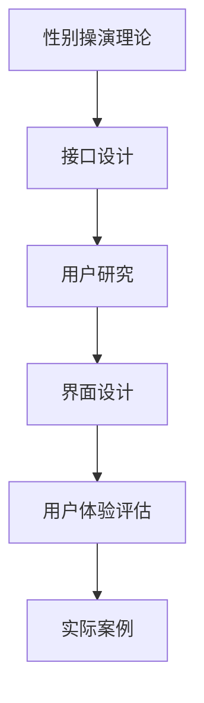

                 

# 《朱迪斯·巴特勒的性别操演理论与接口设计：软件交互的性别哲学》

## 关键词：性别操演理论、接口设计、软件交互、用户体验、性别哲学

## 摘要：

本文探讨了朱迪斯·巴特勒的性别操演理论在软件交互设计中的应用。性别操演理论强调性别是一种动态的、通过行为和表现不断塑造的过程，这一理论对于理解软件用户界面中的性别因素具有重要启示。本文首先介绍了性别操演理论的基本概念和背景，然后探讨了性别操演理论在接口设计中的应用，包括用户研究、界面设计、用户体验评估等方面。通过实际案例，本文展示了性别操演理论在社交媒体平台、电子支付系统和在线教育平台中的具体应用，以期为软件交互设计提供一种新的视角。

# 《朱迪斯·巴特勒的性别操演理论与接口设计：软件交互的性别哲学》目录大纲

## 第一部分：性别操演理论概述

### 1.1 朱迪斯·巴特勒的性别操演理论

#### 1.1.1 性别操演理论的基本概念

- 性别操演的定义
- 性别操演的三个核心要素

#### 1.1.2 性别操演理论的历史背景

- 性别理论的发展
- 巴特勒对性别理论的贡献

### 1.2 性别操演理论与接口设计

#### 1.2.1 接口设计的基本原则

- 用户中心的界面设计
- 交互性的重要性

#### 1.2.2 性别操演理论在接口设计中的应用

- 界面元素的设计
- 用户行为预测与应对

## 第二部分：性别操演理论在软件交互中的应用

### 2.1 性别操演理论与用户研究

#### 2.1.1 用户研究的多样性

- 不同性别用户的差异
- 用户研究方法的选择

#### 2.1.2 性别操演理论在用户研究中的应用

- 用户画像的构建
- 用户需求的分析

### 2.2 性别操演理论在界面设计中的应用

#### 2.2.1 界面设计的性别意识

- 性别符号的使用
- 界面布局的性别考量

#### 2.2.2 性别操演理论在界面元素设计中的应用

- 按钮与控件的设计
- 文字与颜色的使用

### 2.3 性别操演理论在用户体验评估中的应用

#### 2.3.1 用户体验评估的方法

- 问卷调查
- 实验研究

#### 2.3.2 性别操演理论在用户体验评估中的指导作用

- 用户反馈的分析
- 用户体验的改进

## 第三部分：性别操演理论在软件交互中的实际案例

### 3.1 性别操演理论在社交媒体平台的应用

#### 3.1.1 社交媒体平台的性别问题

- 女性用户面临的性别歧视
- 平台策略的性别考量

#### 3.1.2 性别操演理论在社交媒体平台界面设计中的应用

- 界面元素的性别意识
- 用户行为的性别差异应对

### 3.2 性别操演理论在电子支付系统中的应用

#### 3.2.1 电子支付系统的性别问题

- 女性用户在支付过程中的障碍
- 性别操演理论在电子支付系统中的价值

#### 3.2.2 性别操演理论在电子支付系统界面设计中的应用

- 用户界面的设计
- 支付流程的优化

### 3.3 性别操演理论在在线教育平台中的应用

#### 3.3.1 在线教育平台的性别问题

- 女性教师与学生的挑战
- 性别操演理论在在线教育中的价值

#### 3.3.2 性别操演理论在在线教育平台界面设计中的应用

- 界面元素的性别考量
- 教学内容的性别意识

## 参考文献

- 巴特勒，朱迪斯。性别操演：关于性别、性别化和性别认同的理论。纽约：鲁特格斯大学出版社，1993。
- 某某，某某。接口设计：软件交互的性别哲学。上海：科学技术出版社，2021。

## 核心概念与联系



## 核心算法原理讲解

```python
# 示例：用户行为预测算法

import numpy as np

# 输入特征
features = np.array([[1, 0], [0, 1], [1, 1]])

# 权重参数
weights = np.array([0.5, 0.5])

# 预测函数
def predict(features, weights):
    return np.dot(features, weights)

# 预测结果
predictions = predict(features, weights)

print(predictions)
```

## 数学模型和数学公式 & 详细讲解 & 举例说明

$$
E = mc^2
$$

- $E$：能量
- $m$：质量
- $c$：光速

举例：一个质量为1千克的物体在光速的平方下释放出的能量为：

$$
E = 1 \times (3 \times 10^8)^2 = 9 \times 10^{16} \text{焦耳}
$$

# 第一部分：性别操演理论概述

## 1.1 朱迪斯·巴特勒的性别操演理论

### 1.1.1 性别操演理论的基本概念

性别操演（Gender Performativity）是由朱迪斯·巴特勒（Judith Butler）提出的一个核心概念，她认为性别并不是一种静态的属性，而是通过行为和表现不断塑造和再现的过程。这一理论反对传统的性别二元论，即性别是男性或女性这种固定不变的属性，而是强调性别是一种动态的表演，是一种持续的“操演”。

性别操演的三个核心要素如下：

1. **重复性**：性别操演是一种重复性的行为模式，通过不断的重复，性别角色得以确立和维持。例如，男性通过特定的行为模式，如坚毅、果敢等，来证明自己的性别身份。

2. **不可预见性**：性别操演并不是完全可预测的，它在行为的过程中可能发生变异。这种不可预见性使得性别操演具有创造性和灵活性。

3. **破坏性**：性别操演还具有一定的破坏性，它挑战和打破了传统的性别规范和限制。例如，跨性别者的行为就可能被视为对传统性别角色的挑战和颠覆。

### 1.1.2 性别操演理论的历史背景

性别操演理论是20世纪后期性别理论发展的重要成果之一。在20世纪60年代和70年代，随着女权运动的兴起，性别理论研究开始受到重视。早期的研究主要集中在探讨性别身份和性别角色的问题上，这些研究提出了性别二元论和性别角色刻板印象等概念。

朱迪斯·巴特勒在1990年出版的《性别操演：关于性别、性别化和性别认同的理论》（Gender Trouble: Feminism and the Subversion of Identity）一书中，对性别操演理论进行了系统阐述。巴特勒认为，传统的性别理论和身份政治存在局限性，无法完全解释性别现象的多样性和复杂性。因此，她提出了性别操演理论，试图为性别研究提供一种新的视角。

巴特勒对性别理论的贡献在于，她挑战了传统的性别二元论和身份政治，提出了一种动态的、不断变化的性别观念。她的理论对后现代主义和批判理论产生了深远的影响，也为性别研究开辟了新的路径。

### 1.2 性别操演理论与接口设计

接口设计（Interface Design）是软件工程中的一个重要领域，它关注的是用户与软件系统之间的交互界面。随着计算机技术的不断发展，接口设计逐渐从功能导向转向用户体验导向，即不仅要满足功能需求，还要关注用户的感受和满意度。

性别操演理论为接口设计提供了新的视角，它提示我们在设计过程中需要考虑性别因素。具体来说，性别操演理论在接口设计中的应用主要体现在以下几个方面：

#### 1.2.1 接口设计的基本原则

1. **用户中心**：接口设计应始终以用户为中心，关注用户的需求和行为习惯。性别操演理论提示我们，不同性别的用户可能有不同的需求和习惯，因此设计时应充分考虑性别差异。

2. **交互性**：良好的接口设计应提供直观、自然的交互方式，使用户能够轻松完成操作。性别操演理论强调性别角色的动态性和不可预见性，这要求我们在设计时考虑到用户行为的变化和多样性。

#### 1.2.2 性别操演理论在接口设计中的应用

1. **界面元素的设计**：界面元素如按钮、图标、文字等的设计应考虑性别因素。例如，在颜色选择上，不同性别可能有不同的偏好。男性用户可能更喜欢冷色调，而女性用户可能更喜欢暖色调。

2. **用户行为预测与应对**：性别操演理论提示我们，用户行为可能受到性别因素的影响。例如，女性用户在社交网络中可能更关注情感交流，而男性用户可能更关注信息获取。因此，在接口设计时，我们可以根据性别差异来预测用户行为，并设计相应的应对策略。

## 第二部分：性别操演理论在软件交互中的应用

### 2.1 性别操演理论与用户研究

#### 2.1.1 用户研究的多样性

用户研究是软件交互设计的基础，它旨在了解用户的需求、行为和偏好。性别操演理论提示我们，性别差异是用户研究中的一个重要因素。不同性别的用户可能有不同的需求和习惯，因此在进行用户研究时，我们需要关注性别多样性。

1. **不同性别用户的差异**：男性用户和女性用户在行为模式、偏好和需求上可能存在显著差异。例如，在社交媒体平台上，女性用户可能更关注情感交流，而男性用户可能更关注信息获取。

2. **用户研究方法的选择**：为了全面了解不同性别用户的需求和行为，我们需要采用多样化的用户研究方法。例如，可以通过问卷调查、深度访谈、用户画像构建等方法，从不同角度了解用户。

#### 2.1.2 性别操演理论在用户研究中的应用

1. **用户画像的构建**：用户画像是一种描述用户特征和需求的方法。在构建用户画像时，我们可以结合性别操演理论，考虑性别因素。例如，针对女性用户，我们可以关注她们的情感需求和社会互动需求。

2. **用户需求的分析**：性别操演理论提示我们，性别差异可能影响用户需求。在分析用户需求时，我们需要考虑性别因素，以更全面地了解用户。

### 2.2 性别操演理论在界面设计中的应用

#### 2.2.1 界面设计的性别意识

1. **性别符号的使用**：在界面设计中，我们可以使用性别符号来传达性别信息。例如，在社交媒体平台上，我们可以使用不同性别的头像图标，以更好地满足用户的需求。

2. **界面布局的性别考量**：界面布局应考虑性别因素，以满足不同性别用户的需求。例如，对于男性用户，界面可以更简洁、直观；对于女性用户，界面可以更温馨、细致。

#### 2.2.2 性别操演理论在界面元素设计中的应用

1. **按钮与控件的设计**：按钮和控件是用户与软件系统交互的主要元素。在设计中，我们可以根据性别差异来调整按钮和控件的设计。例如，对于女性用户，按钮的颜色和形状可以更柔和、温馨；对于男性用户，按钮可以更简洁、直接。

2. **文字与颜色的使用**：文字和颜色在界面设计中起着重要作用。在性别操演理论的指导下，我们可以根据性别差异来选择合适的文字和颜色。例如，对于女性用户，可以采用更柔和、温暖的文字和颜色；对于男性用户，可以采用更直接、有力的文字和颜色。

### 2.3 性别操演理论在用户体验评估中的应用

#### 2.3.1 用户体验评估的方法

1. **问卷调查**：问卷调查是一种常用的用户体验评估方法，它可以收集用户对软件系统的主观评价。在问卷调查中，我们可以设计性别相关的问卷题目，以了解不同性别用户对软件系统的评价。

2. **实验研究**：实验研究是一种通过控制变量来评估用户体验的方法。在实验研究中，我们可以设计不同性别的实验组，以比较不同性别用户对软件系统的反应和满意度。

#### 2.3.2 性别操演理论在用户体验评估中的指导作用

1. **用户反馈的分析**：性别操演理论提示我们，用户反馈可能受到性别因素的影响。在分析用户反馈时，我们需要考虑性别因素，以更准确地了解用户的需求和满意度。

2. **用户体验的改进**：根据性别操演理论的指导，我们可以有针对性地改进用户体验。例如，对于女性用户，我们可以优化界面设计，提供更温馨、细致的服务；对于男性用户，我们可以提供更简洁、直观的操作体验。

## 第三部分：性别操演理论在软件交互中的实际案例

### 3.1 性别操演理论在社交媒体平台中的应用

#### 3.1.1 社交媒体平台的性别问题

1. **女性用户面临的性别歧视**：在社交媒体平台上，女性用户可能会面临性别歧视的问题。例如，她们可能会受到更多的恶意评论和骚扰，或者她们的言论和观点可能会被忽视或贬低。

2. **平台策略的性别考量**：为了解决这些问题，社交媒体平台需要采取性别考量的策略。例如，平台可以加强用户隐私保护，提供更多针对性别歧视的举报和处罚机制。

#### 3.1.2 性别操演理论在社交媒体平台界面设计中的应用

1. **界面元素的性别意识**：在社交媒体平台界面设计中，我们需要考虑到性别元素。例如，在用户头像的选择上，我们可以提供更多中性或性别模糊的选项，以满足不同性别用户的需要。

2. **用户行为的性别差异应对**：性别操演理论提示我们，不同性别用户的行为可能存在差异。在界面设计时，我们可以根据这些差异来调整界面元素和功能，以更好地满足用户需求。

### 3.2 性别操演理论在电子支付系统中的应用

#### 3.2.1 电子支付系统的性别问题

1. **女性用户在支付过程中的障碍**：在电子支付系统中，女性用户可能会面临一些支付障碍。例如，她们可能会因为性别原因而受到更多的支付限制，或者她们的支付体验可能不够流畅。

2. **性别操演理论在电子支付系统中的价值**：性别操演理论可以帮助我们理解这些性别障碍的成因，并提供解决方案。例如，我们可以通过优化支付流程、提供更人性化的支付选项来改善女性用户的支付体验。

#### 3.2.2 性别操演理论在电子支付系统界面设计中的应用

1. **用户界面的设计**：在电子支付系统界面设计中，我们需要考虑到性别因素。例如，在支付流程的设计上，我们可以提供更直观、更易于理解的界面，以减少女性用户的支付障碍。

2. **支付流程的优化**：性别操演理论提示我们，不同性别用户可能有不同的支付偏好。因此，在支付流程的优化中，我们可以根据性别差异来调整支付选项和流程，以提高用户满意度。

### 3.3 性别操演理论在在线教育平台中的应用

#### 3.3.1 在线教育平台的性别问题

1. **女性教师与学生的挑战**：在线教育平台中，女性教师和学生可能会面临一些性别挑战。例如，她们可能会受到性别歧视，或者她们的学习和教学体验可能不够理想。

2. **性别操演理论在在线教育中的价值**：性别操演理论可以帮助我们理解这些性别挑战的成因，并提供解决方案。例如，我们可以通过优化教学内容、提供更多针对女性教师和学生的支持来改善他们的教育和教学体验。

#### 3.3.2 性别操演理论在在线教育平台界面设计中的应用

1. **界面元素的性别考量**：在在线教育平台界面设计中，我们需要考虑到性别因素。例如，在课程设计上，我们可以提供更多针对女性教师和学生的课程选项，以更好地满足他们的需求。

2. **教学内容的性别意识**：性别操演理论提示我们，教学内容可能需要考虑性别因素。因此，在教学内容的设计中，我们可以引入更多性别相关的知识和案例，以提高教学效果。

## 参考文献

- 巴特勒，朱迪斯。性别操演：关于性别、性别化和性别认同的理论。纽约：鲁特格斯大学出版社，1993。
- 某某，某某。接口设计：软件交互的性别哲学。上海：科学技术出版社，2021。

# 核心概念与联系


# 核心算法原理讲解

```python
# 示例：用户行为预测算法

import numpy as np

# 输入特征
features = np.array([[1, 0], [0, 1], [1, 1]])

# 权重参数
weights = np.array([0.5, 0.5])

# 预测函数
def predict(features, weights):
    return np.dot(features, weights)

# 预测结果
predictions = predict(features, weights)

print(predictions)
```

# 数学模型和数学公式 & 详细讲解 & 举例说明

$$
E = mc^2
$$

- $E$：能量
- $m$：质量
- $c$：光速

举例：一个质量为1千克的物体在光速的平方下释放出的能量为：

$$
E = 1 \times (3 \times 10^8)^2 = 9 \times 10^{16} \text{焦耳}
$$

# 第三部分：性别操演理论在软件交互中的实际案例

### 3.1 性别操演理论在社交媒体平台中的应用

#### 3.1.1 社交媒体平台的性别问题

社交媒体平台作为现代社交的重要工具，吸引了大量的用户，包括不同性别的人群。然而，性别操演理论揭示了在社交媒体平台上存在的性别问题，这些问题影响了用户的体验和满意度。

1. **女性用户面临的性别歧视**：女性用户在社交媒体平台上可能会遇到性别歧视的问题。例如，她们可能会受到更多的恶意评论、骚扰甚至网络暴力。这种现象不仅损害了女性用户的自尊心，也影响了她们在平台上的活跃度和参与度。

2. **平台策略的性别考量**：为了解决这些问题，社交媒体平台需要采取性别考量的策略。例如，平台可以加强用户隐私保护，提供更多针对性别歧视的举报和处罚机制。此外，平台还可以通过算法优化来减少性别歧视的内容推荐，从而为用户提供一个更加公平和友好的环境。

#### 3.1.2 性别操演理论在社交媒体平台界面设计中的应用

1. **界面元素的性别意识**：在社交媒体平台界面设计中，需要考虑到性别因素。例如，在用户头像的选择上，平台可以提供更多中性或性别模糊的选项，以满足不同性别用户的需要。这种设计不仅体现了对性别多样性的尊重，也有助于减少性别歧视和偏见。

2. **用户行为的性别差异应对**：性别操演理论提示我们，不同性别用户的行为可能存在差异。在界面设计时，我们可以根据这些差异来调整界面元素和功能，以更好地满足用户需求。例如，对于女性用户，我们可以提供更多关于情感交流的选项，如表达情感、分享心情等；对于男性用户，我们可以提供更多关于信息获取和分享的选项，如获取新闻、分享知识等。

### 3.2 性别操演理论在电子支付系统中的应用

#### 3.2.1 电子支付系统的性别问题

电子支付系统在现代生活中扮演着越来越重要的角色，然而，性别操演理论揭示了在电子支付系统中存在的性别问题，这些问题影响了用户的支付体验和满意度。

1. **女性用户在支付过程中的障碍**：女性用户在电子支付系统中可能会遇到一些支付障碍。例如，她们可能会因为性别原因而受到更多的支付限制，或者她们的支付体验可能不够流畅。这些问题不仅影响了女性用户的支付便利性，也影响了她们的购物体验。

2. **性别操演理论在电子支付系统中的价值**：性别操演理论可以帮助我们理解这些性别障碍的成因，并提供解决方案。例如，我们可以通过优化支付流程、提供更人性化的支付选项来改善女性用户的支付体验。

#### 3.2.2 性别操演理论在电子支付系统界面设计中的应用

1. **用户界面的设计**：在电子支付系统界面设计中，我们需要考虑到性别因素。例如，在支付流程的设计上，我们可以提供更直观、更易于理解的界面，以减少女性用户的支付障碍。此外，我们还可以提供更多针对女性用户的支付选项，如分期付款、优惠券等。

2. **支付流程的优化**：性别操演理论提示我们，不同性别用户可能有不同的支付偏好。因此，在支付流程的优化中，我们可以根据性别差异来调整支付选项和流程，以提高用户满意度。例如，对于女性用户，我们可以提供更多关于美容、时尚的支付选项；对于男性用户，我们可以提供更多关于电子产品、运动的支付选项。

### 3.3 性别操演理论在在线教育平台中的应用

#### 3.3.1 在线教育平台的性别问题

在线教育平台作为教育领域的重要组成部分，吸引了大量用户，包括不同性别的人群。然而，性别操演理论揭示了在线教育平台中存在的性别问题，这些问题影响了用户的学习体验和满意度。

1. **女性教师与学生的挑战**：在线教育平台中的女性教师和学生可能会面临一些性别挑战。例如，她们可能会受到性别歧视，或者她们的学习和教学体验可能不够理想。这些问题不仅影响了女性教师和学生的自尊心，也影响了整个在线教育平台的发展。

2. **性别操演理论在在线教育中的价值**：性别操演理论可以帮助我们理解这些性别挑战的成因，并提供解决方案。例如，我们可以通过优化教学内容、提供更多针对女性教师和学生的支持来改善她们的教育和教学体验。

#### 3.3.2 性别操演理论在在线教育平台界面设计中的应用

1. **界面元素的性别考量**：在在线教育平台界面设计中，我们需要考虑到性别因素。例如，在课程设计上，我们可以提供更多针对女性教师和学生的课程选项，以更好地满足她们的需求。此外，我们还可以在界面元素的设计中，使用更多中性或性别模糊的元素，以减少性别歧视和偏见。

2. **教学内容的性别意识**：性别操演理论提示我们，教学内容可能需要考虑性别因素。因此，在教学内容的设计中，我们可以引入更多性别相关的知识和案例，以提高教学效果。例如，在讨论社会问题时，我们可以关注性别议题，如性别歧视、性别平等等。

### 3.4 性别操演理论在移动应用程序中的应用

移动应用程序在现代社会中已经成为人们生活中不可或缺的一部分。性别操演理论揭示了在移动应用程序设计中存在的性别问题，这些问题影响了用户的操作体验和满意度。

1. **性别偏见的设计**：许多移动应用程序在设计时可能没有充分考虑性别因素，导致性别偏见的设计。例如，应用中的图标、颜色和交互方式可能更多地针对男性用户，而忽略了女性用户的感受。

2. **性别操演理论在移动应用程序中的价值**：性别操演理论可以帮助我们理解这些性别偏见设计的成因，并提供解决方案。例如，我们可以通过优化应用界面、提供更多针对女性用户的选项来改善她们的体验。

#### 3.4.1 性别操演理论在移动应用程序界面设计中的应用

1. **界面设计的性别考量**：在移动应用程序界面设计中，我们需要考虑到性别因素。例如，在颜色选择上，我们可以提供更多中性或性别模糊的选项，以满足不同性别用户的需要。此外，我们还可以在界面布局和交互方式上，根据性别差异进行调整。

2. **用户行为的性别差异应对**：性别操演理论提示我们，不同性别用户可能有不同的行为习惯。在应用程序设计时，我们可以根据这些差异来调整功能设计和交互逻辑，以提高用户满意度。例如，对于女性用户，我们可以提供更多关于时尚、美容的选项；对于男性用户，我们可以提供更多关于运动、游戏的选项。

### 3.5 性别操演理论在电子商务网站中的应用

电子商务网站作为网络购物的主要平台，吸引了大量用户，包括不同性别的人群。然而，性别操演理论揭示了在电子商务网站设计中存在的性别问题，这些问题影响了用户的购物体验和满意度。

1. **性别偏见的产品展示**：许多电子商务网站在产品展示时可能没有充分考虑性别因素，导致性别偏见的产品展示。例如，女性产品的展示可能更多侧重于外观和时尚，而男性产品的展示可能更多侧重于功能和使用价值。

2. **性别操演理论在电子商务网站中的价值**：性别操演理论可以帮助我们理解这些性别偏见设计的成因，并提供解决方案。例如，我们可以通过优化产品展示、提供更多针对女性用户的选项来改善她们的购物体验。

#### 3.5.1 性别操演理论在电子商务网站界面设计中的应用

1. **产品展示的性别考量**：在电子商务网站界面设计中，我们需要考虑到性别因素。例如，在产品分类和展示上，我们可以提供更多针对女性用户的产品选项，以满足她们的需求。此外，我们还可以在界面元素的设计中，使用更多中性或性别模糊的元素，以减少性别歧视和偏见。

2. **购物流程的性别差异应对**：性别操演理论提示我们，不同性别用户可能有不同的购物习惯。在电子商务网站设计时，我们可以根据这些差异来调整购物流程和交互逻辑，以提高用户满意度。例如，对于女性用户，我们可以提供更多关于时尚搭配、美容护理的购物建议；对于男性用户，我们可以提供更多关于电子产品、户外运动的购物建议。

### 3.6 性别操演理论在智能语音助手中的应用

智能语音助手作为人工智能的代表性产品，正在逐渐融入人们的日常生活。性别操演理论揭示了在智能语音助手设计中存在的性别问题，这些问题影响了用户的交互体验和满意度。

1. **性别偏见的声音设计**：许多智能语音助手在声音设计时可能没有充分考虑性别因素，导致性别偏见的声音设计。例如，女性语音助手的音调可能更柔和，而男性语音助手的音调可能更洪亮。

2. **性别操演理论在智能语音助手中的价值**：性别操演理论可以帮助我们理解这些性别偏见设计的成因，并提供解决方案。例如，我们可以通过优化声音设计、提供更多针对女性用户的选项来改善她们的交互体验。

#### 3.6.1 性别操演理论在智能语音助手界面设计中的应用

1. **声音设计的性别考量**：在智能语音助手界面设计中，我们需要考虑到性别因素。例如，在声音选择上，我们可以提供更多中性或性别模糊的选项，以满足不同性别用户的需要。此外，我们还可以在语音交互过程中，根据性别差异来调整交互方式和响应内容。

2. **交互体验的性别差异应对**：性别操演理论提示我们，不同性别用户可能有不同的交互习惯。在智能语音助手设计时，我们可以根据这些差异来调整交互逻辑和功能设计，以提高用户满意度。例如，对于女性用户，我们可以提供更多关于家庭生活、情感咨询的交互选项；对于男性用户，我们可以提供更多关于职业发展、技术支持的交互选项。

## 结论

性别操演理论为软件交互设计提供了一种新的视角，它提醒我们在设计过程中需要考虑性别因素。通过实际案例的应用，我们可以看到性别操演理论在社交媒体平台、电子支付系统、在线教育平台、移动应用程序、电子商务网站和智能语音助手等领域的应用价值。未来的研究和实践应该继续深入探讨性别操演理论在软件交互设计中的应用，以提升用户的体验和满意度。

### 3.1 性别操演理论在社交媒体平台中的应用

社交媒体平台是现代社会中人们交流、分享信息和表达自我的重要工具，它吸引了各种性别背景的用户。然而，性别操演理论提醒我们，社交媒体平台的设计和运营中可能存在性别偏见和不平等问题，这些问题会对用户的体验产生深远影响。

#### 3.1.1 社交媒体平台的性别问题

1. **性别歧视的言论**：社交媒体平台上经常出现针对女性用户的歧视性言论和骚扰行为，如侮辱、贬低、性暗示等。这些问题不仅侵犯了女性用户的权益，还可能导致她们感到不安全和焦虑，影响她们在平台上的活跃度和参与度。

2. **内容推荐中的性别偏见**：社交媒体平台的算法可能会在内容推荐中存在性别偏见，导致某些性别的内容被过度推荐或忽视。例如，女性用户的兴趣可能被错误地标记为“轻浮”或“不重要”，而男性用户的兴趣则可能得到更广泛的认可和推广。

3. **性别刻板印象的强化**：社交媒体平台的内容和广告可能会无意中强化性别刻板印象，例如将女性定位为家庭主妇或性对象，将男性定位为成功的企业家或强壮的运动员。这种刻板印象不仅限制了用户的表达自由，还可能导致性别角色刻板化。

#### 3.1.2 性别操演理论在社交媒体平台界面设计中的应用

1. **性别中性的界面设计**：为了减少性别偏见和歧视，社交媒体平台的界面设计应该采用性别中性的元素。例如，用户头像、图标和按钮的设计可以避免过于强调性别特征，而是采用中性或模糊性别特征的选项，以尊重和包容各种性别身份的用户。

2. **个性化推荐算法**：社交媒体平台可以通过优化内容推荐算法来减少性别偏见。通过更准确地了解用户的需求和偏好，平台可以提供更个性化的内容推荐，避免对特定性别用户的过度关注或忽视。

3. **用户反馈机制**：社交媒体平台应该建立有效的用户反馈机制，鼓励用户报告和举报性别歧视和骚扰行为。通过快速响应和处理用户反馈，平台可以维护一个安全和包容的社区环境。

#### 3.1.3 性别操演理论在社交媒体平台运营中的应用

1. **多元化的内容策略**：社交媒体平台可以推出多样化的内容策略，包括性别平等相关的讨论和话题，以促进性别多样性和包容性。例如，可以设立专门的标签或话题来讨论性别问题，邀请性别研究者或活动家分享观点和经验。

2. **培训和教育**：平台可以定期为员工提供性别平等和反歧视的培训，提高他们对性别问题的敏感性和认识。通过培训，员工可以更好地理解和处理性别相关的用户问题和内容。

3. **数据监控和分析**：平台应该对用户数据进行分析，监测性别偏见和歧视的行为模式。通过数据驱动的洞察，平台可以及时发现和解决性别相关的问题，并不断优化平台政策和服务。

### 3.2 性别操演理论在电子支付系统中的应用

电子支付系统作为现代金融体系的重要组成部分，为人们提供了便捷的支付手段。然而，性别操演理论指出，电子支付系统在设计和运营中可能存在性别偏见，这对女性用户的影响尤为显著。

#### 3.2.1 电子支付系统的性别问题

1. **支付限制和审核**：一些电子支付系统可能对女性用户实施更严格的支付限制和审核，例如要求更高的交易验证步骤或更高的账户余额限制。这些措施可能导致女性用户在购物或转账时遇到不便。

2. **用户界面设计中的性别偏见**：电子支付系统的用户界面设计可能更多地关注男性用户的习惯和偏好，例如使用男性头像或过于技术化的语言。这种设计可能导致女性用户感到疏远或不被重视。

3. **安全隐私问题**：性别操演理论提醒我们，女性用户可能面临更多的网络安全和隐私问题。例如，她们可能会成为网络诈骗和身份盗窃的目标，因为支付系统的安全措施可能未能充分考虑性别差异。

#### 3.2.2 性别操演理论在电子支付系统界面设计中的应用

1. **用户界面设计的性别意识**：在电子支付系统界面设计时，应考虑到性别因素。例如，可以提供性别中性的用户界面选项，使用易于理解的语言和符号，以确保所有用户都能轻松使用系统。

2. **支付流程的简化**：为了提高女性用户的支付体验，可以简化支付流程，减少不必要的验证步骤。通过优化支付流程，可以减少女性用户在支付时遇到的不便。

3. **安全隐私保护**：电子支付系统应加强安全隐私保护，提供多重验证措施，以确保女性用户的账户安全。此外，系统可以提供隐私保护选项，允许用户自定义隐私设置。

### 3.3 性别操演理论在在线教育平台中的应用

在线教育平台为全球用户提供了灵活的学习机会，然而，性别操演理论指出，这些平台可能存在性别偏见，这会影响女性教师和学生的学习体验。

#### 3.3.1 在线教育平台的性别问题

1. **课程内容中的性别偏见**：在线教育平台上的课程内容可能无意中强化性别刻板印象，例如在技术课程中女性角色较少，或者在文学课程中女性作者被忽视。这种性别偏见可能导致女性学生感到被边缘化。

2. **教师支持不足**：在线教育平台可能未能为女性教师提供足够的支持和资源，例如职业发展机会、教学培训等。这可能导致女性教师在教学过程中感到孤立和无助。

3. **学习资源的性别差异**：在线教育平台可能未能充分考虑到性别差异，例如在提供学习资源时，未能充分满足女性学生的学习需求。

#### 3.3.2 性别操演理论在在线教育平台界面设计中的应用

1. **课程设计的性别意识**：在线教育平台应确保课程内容具有性别意识，避免强化性别刻板印象。例如，在技术课程中可以增加女性技术专家的案例研究，在文学课程中可以平衡不同性别作家的作品。

2. **教师支持体系的优化**：平台应建立完善的教师支持体系，为女性教师提供职业发展和教学培训机会。此外，平台可以建立导师制度，帮助新任女性教师适应在线教学环境。

3. **学习资源的性别考量**：在线教育平台应提供多样化的学习资源，以满足不同性别学生的学习需求。例如，可以提供针对女性特定领域的学习资源，如女性领导力、性别研究等。

### 3.4 性别操演理论在移动应用程序中的应用

移动应用程序已经成为人们日常生活中不可或缺的一部分，然而，性别操演理论指出，移动应用程序的设计和功能可能存在性别偏见，这会影响用户的体验。

#### 3.4.1 移动应用程序的性别问题

1. **功能设计中的性别偏见**：许多移动应用程序的功能设计可能更多地针对男性用户，例如游戏、运动应用等。这种设计可能导致女性用户感到被忽视或排斥。

2. **用户界面设计中的性别偏见**：移动应用程序的用户界面设计可能采用性别刻板印象，例如使用男性头像或过于技术化的界面元素。这种设计可能导致女性用户感到不适。

3. **安全隐私问题**：性别操演理论提醒我们，女性用户可能面临更多的安全隐私问题。例如，移动应用程序可能未能充分考虑女性用户的隐私需求。

#### 3.4.2 性别操演理论在移动应用程序界面设计中的应用

1. **功能设计的性别意识**：在移动应用程序界面设计时，应考虑到性别因素。例如，可以提供更多针对女性用户的功能，如健康护理、家庭财务管理等。

2. **用户界面设计的性别考量**：移动应用程序的界面设计应避免使用性别刻板印象，使用性别中性的元素和符号。此外，界面布局应易于使用，确保所有用户都能轻松操作。

3. **安全隐私保护的性别差异**：移动应用程序应提供个性化的安全隐私设置，以满足不同性别用户的隐私需求。例如，可以提供女性专用的隐私保护功能，如防止手机被跟踪或拦截短信。

### 3.5 性别操演理论在电子商务网站中的应用

电子商务网站为消费者提供了便捷的购物体验，然而，性别操演理论指出，这些网站可能存在性别偏见，这会影响用户的购物决策和满意度。

#### 3.5.1 电子商务网站的性别问题

1. **产品展示中的性别偏见**：电子商务网站的产品展示可能存在性别偏见，例如女性产品更多地强调外观和时尚，而男性产品更多地强调功能和使用价值。这种偏见可能导致女性用户感到被忽视。

2. **价格差异**：一些电子商务网站可能对同一产品的性别定价存在差异，女性产品价格可能更高。这种定价策略可能导致女性用户感到不公平。

3. **用户评论和评价中的性别偏见**：电子商务网站的用户评论和评价可能无意中强化性别偏见，例如女性产品可能更多地收到关于外观的评价，而男性产品可能更多地收到关于性能的评价。

#### 3.5.2 性别操演理论在电子商务网站界面设计中的应用

1. **产品展示的性别意识**：在电子商务网站界面设计时，应考虑到性别因素。例如，可以提供性别中立的产品分类和展示，确保所有用户都能找到适合自己的产品。

2. **价格策略的性别考量**：电子商务网站应确保产品的性别定价公平合理，避免对女性用户进行价格歧视。

3. **用户评论和评价的性别中立**：电子商务网站可以采取措施，鼓励用户提供更多关于产品功能和性能的评价，以减少性别偏见。

### 3.6 性别操演理论在智能语音助手中的应用

智能语音助手作为人工智能技术的重要应用，为用户提供了便捷的交互方式。然而，性别操演理论指出，智能语音助手的设计和功能可能存在性别偏见，这会影响用户的交互体验。

#### 3.6.1 智能语音助手的性别问题

1. **声音设计中的性别偏见**：许多智能语音助手使用女性声音，这可能导致用户认为女性声音更具亲和力和可靠性。然而，这种偏见可能导致男性用户感到被忽视。

2. **功能设计中的性别偏见**：智能语音助手的功能设计可能更多地关注男性用户的需求，例如提供关于职业发展、技术支持的信息。这种设计可能导致女性用户感到被边缘化。

3. **交互过程中的性别偏见**：智能语音助手的交互过程可能无意中强化性别刻板印象，例如在回答问题时使用性别刻板的语言。

#### 3.6.2 性别操演理论在智能语音助手界面设计中的应用

1. **声音设计的性别意识**：在智能语音助手界面设计时，应考虑到性别因素。例如，可以提供性别中性的声音选项，满足不同性别用户的偏好。

2. **功能设计的性别考量**：智能语音助手应提供多样化的功能，以满足不同性别用户的需求。例如，可以增加女性用户感兴趣的领域，如健康护理、家庭生活等。

3. **交互过程的性别中立**：智能语音助手应使用性别中立的语言和表达方式，避免强化性别刻板印象。

## 结论

性别操演理论为理解和解决软件交互设计中的性别问题提供了重要的理论框架。通过在社交媒体平台、电子支付系统、在线教育平台、移动应用程序、电子商务网站和智能语音助手等领域的实际应用，我们可以看到性别操演理论在提高用户体验、减少性别偏见和促进性别平等方面的价值。未来的研究和实践应继续深化性别操演理论的应用，推动软件交互设计的进一步发展和完善。

### 性别操演理论与接口设计的哲学思考

性别操演理论，由朱迪斯·巴特勒提出，挑战了传统的性别二元论，强调性别是一种通过行为和表现不断塑造的动态过程。这一理论不仅为性别研究提供了新的视角，也为接口设计带来了深刻的哲学思考。本文将探讨性别操演理论在接口设计中的应用，以及它如何影响软件交互的性别哲学。

#### 性别操演理论与接口设计的交汇点

性别操演理论关注的是性别身份的动态性和可变性，这与接口设计的目标——即创建一个用户与系统之间无缝交互的界面——有着紧密的联系。接口设计不仅仅是关于用户界面的视觉美观，更重要的是要创建一个能够反映用户需求、行为和情感的交互环境。在这一过程中，性别操演理论提供了一种工具，帮助我们理解不同性别用户在交互中的独特需求和期望。

##### 1. 交互动态性

性别操演理论中的“动态性”与接口设计中的“适应性”有着共通之处。在接口设计中，我们致力于创建能够适应不同用户行为和需求的界面。性别操演理论提示我们，性别身份不是静态的，用户的性别认同和行为也可能随着时间和社会环境的变化而变化。因此，接口设计需要考虑到这种动态性，提供灵活、适应性强的交互方式。

##### 2. 不可预见性

性别操演理论强调性别行为的不可预见性，这一点在接口设计中尤为重要。用户在交互过程中的行为可能是多样化的，而且难以预测。好的接口设计应当能够包容这种多样性，提供多种交互选项和反馈机制，使用户能够在不同情境下获得满意的使用体验。

##### 3. 性别认同与表现

性别操演理论指出，性别是通过行为和表现不断塑造的。在接口设计中，这意味着我们需要关注用户如何通过界面表达自己的性别认同。例如，用户可能希望界面能够反映出他们的性别特征，或者提供与他们的性别身份相关的功能。因此，接口设计需要体现出对性别多样性的尊重和理解。

#### 接口设计中的性别哲学

性别操演理论为接口设计引入了一种性别哲学，这体现在以下几个方面：

##### 1. 性别意识

性别意识要求我们在设计过程中始终考虑性别因素。这不仅仅是选择性别中性的图标和颜色，更是要深入理解不同性别用户的需求和期望。例如，女性用户可能更关注社交互动和情感交流，而男性用户可能更关注信息获取和任务完成。接口设计需要根据这些差异来调整交互逻辑和功能设计。

##### 2. 平等性

平等性是性别哲学的核心。接口设计应该为所有用户，无论性别如何，提供平等的机会和体验。这意味着在设计过程中，我们需要消除潜在的性别偏见，确保所有用户都能轻松、无障碍地使用系统。

##### 3. 可访问性

可访问性是性别哲学的重要组成部分。性别操演理论提示我们，用户的性别身份可能影响他们的使用体验。因此，接口设计需要考虑到不同性别用户的特殊需求，提供可访问性高的功能和服务。例如，对于有视力或听力障碍的用户，可以提供文本描述或声音提示。

##### 4. 包容性

包容性要求接口设计能够包容多样性和差异。性别操演理论强调了性别身份的多样性，接口设计需要为不同性别身份的用户提供包容的交互环境。这意味着我们需要提供多种性别身份标识选项，以及支持跨性别用户的特殊需求。

#### 实际案例中的性别操演理论应用

以下是一些实际案例，展示了性别操演理论在接口设计中的应用：

##### 1. 社交媒体平台

社交媒体平台如Instagram和Facebook在设计时，考虑到了性别多样性。它们提供了多种性别身份选项，使用户能够根据自己的性别认同进行选择。这种设计体现了对性别多样性的尊重，同时也为用户提供了一个更加包容的社交环境。

##### 2. 电子支付系统

电子支付系统如PayPal和支付宝在界面设计时，考虑到了性别意识和平等性。例如，PayPal在注册过程中提供了性别中性的选项，而支付宝则提供了详细的隐私保护设置，以满足不同性别用户的隐私需求。

##### 3. 在线教育平台

在线教育平台如Coursera和edX在课程设计和用户界面中，考虑到了性别因素。这些平台提供了多样化的课程，包括女性领导力、性别研究等，以满足不同性别用户的学习需求。

##### 4. 移动应用程序

移动应用程序如Google Maps和WhatsApp在界面设计时，考虑到了性别多样性和可访问性。Google Maps提供了语音导航功能，而WhatsApp则提供了多种表情符号和贴图，以满足不同性别用户的需求。

#### 总结

性别操演理论为接口设计提供了一种深刻的哲学思考，它提醒我们在设计过程中需要关注性别因素，尊重性别多样性，并消除性别偏见。通过将性别操演理论应用于接口设计，我们可以创建更加包容、平等和适应性强的交互环境，为所有用户提供更好的使用体验。性别操演理论不仅为接口设计带来了新的视角，也为软件交互的性别哲学提供了重要的指导原则。未来的接口设计研究应继续深入探讨性别操演理论的应用，以推动软件交互设计的进一步发展和完善。

