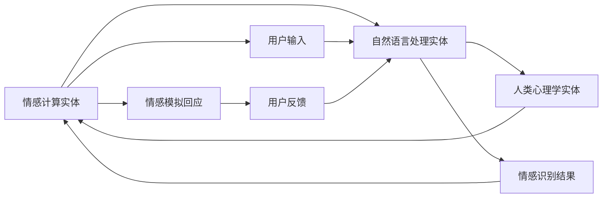
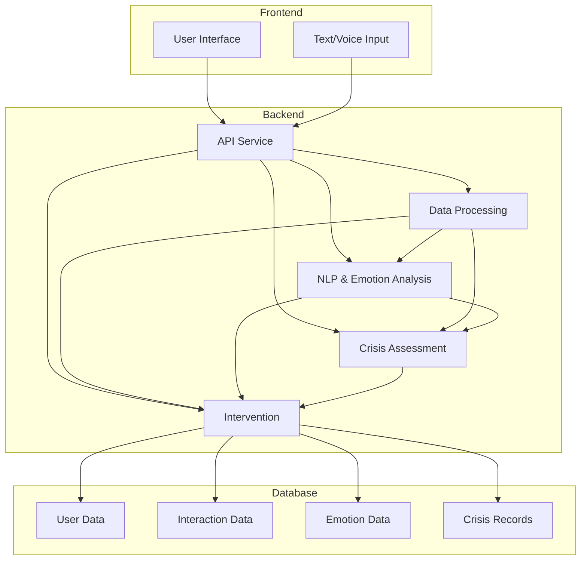
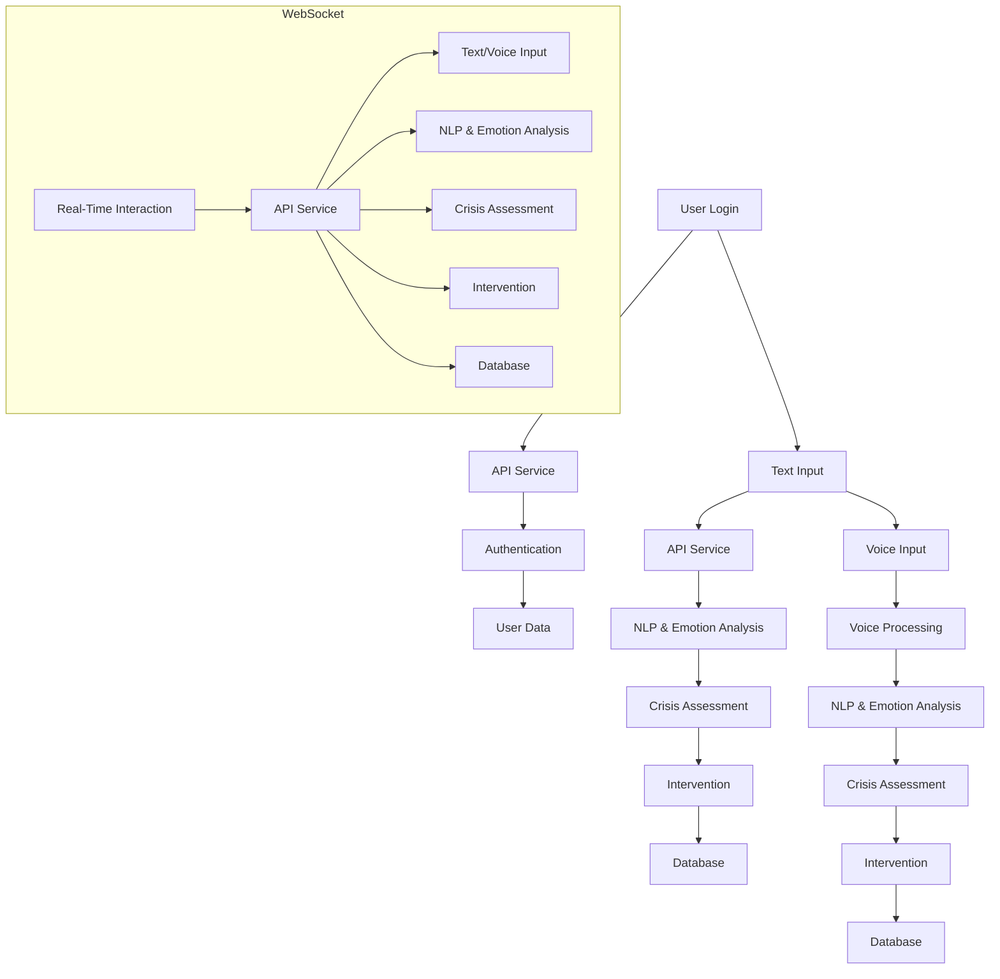

                 


## 引言与背景

### 1.1 问题背景

在现代社会中，人们面临的压力和危机事件越来越多样化。从心理健康的层面来看，抑郁症、焦虑症等精神障碍患者人数逐年增加。据统计，全球约有3.5亿人患有抑郁症，而这一数字在2020年新冠疫情的影响下可能进一步上升。除了心理健康问题，自然灾害、突发事件以及家庭和社会矛盾等都可能导致人们陷入危机。

传统的危机干预手段主要依赖于心理咨询师、心理医生以及社会工作者等专业人士。然而，这些专业人士的数量有限，往往难以满足快速增长的需求。此外，危机干预过程通常需要高度的专业知识和情感共鸣，这对从业者提出了很高的要求。在这种情况下，人工智能（AI）作为一种新兴技术，其潜力被逐渐挖掘出来，特别是在危机干预中的应用。

机器人同情心作为AI的一个重要分支，旨在使机器人能够理解和表达情感，特别是同情心。这种技术的出现为危机干预领域带来了新的可能性。机器人同情心可以通过自然语言处理、情感计算和人类心理学等多学科交叉的方法，实现与人类的情感交互，为用户提供有效的心理支持和干预。

### 1.2 问题描述

危机干预的目的是在危机发生时，通过有效的干预措施，减轻或消除危机对个体的负面影响，帮助个体恢复心理健康和生活秩序。然而，传统的危机干预手段存在以下问题：

1. **资源不足**：专业的心理咨询师、心理医生和社会工作者数量有限，难以满足全球范围内的需求。
2. **地域限制**：在一些偏远地区或战乱地区，专业的危机干预资源更加匮乏，难以迅速响应。
3. **心理共鸣不足**：虽然专业人士具备专业知识，但有时难以与受危机影响的个体建立深层次的情感联系。
4. **紧急性**：危机干预往往需要在短时间内做出反应，而传统方式可能无法满足这种紧急性需求。

### 1.3 问题解决

机器人同情心的引入，有望在一定程度上解决上述问题。机器人同情心可以通过以下方式在危机干预中发挥作用：

1. **增加资源供给**：机器人可以在没有专业心理咨询师的情况下，提供基本的心理支持，缓解危机状况，为专业干预赢得时间。
2. **突破地域限制**：通过互联网和远程通信技术，机器人可以在全球范围内提供危机干预服务，不受地理位置限制。
3. **增强情感共鸣**：机器人通过情感计算和自然语言处理，可以模拟人类的心理状态和情感反应，与用户建立情感联系。
4. **满足紧急性需求**：机器人可以快速响应危机事件，提供及时的心理支持，减少危机对个体的负面影响。

### 1.4 边界与外延

虽然机器人同情心在危机干预中具有巨大潜力，但也存在一些边界和局限性。首先，机器人同情心目前仍然处于发展阶段，其情感理解和表达能力有限，可能无法完全替代人类专业心理咨询师。其次，机器人同情心需要大量的数据支持和算法优化，这涉及到隐私保护、数据安全等问题。此外，社会对机器人的接受度和信任度也是影响其广泛应用的重要因素。

### 1.5 概念结构与核心要素组成

在深入探讨机器人同情心在危机干预中的应用之前，我们需要明确其核心概念和结构。机器人同情心主要涉及以下几个核心要素：

1. **情感计算**：通过分析和处理人类的情感表达，机器人能够识别用户的情感状态，并做出相应的情感回应。
2. **自然语言处理**：利用自然语言处理技术，机器人可以理解用户的语言表达，进行语义分析和情感识别。
3. **人类心理学**：结合心理学理论，机器人同情心能够模拟人类的情感反应和认知过程，提高其与用户的互动质量。
4. **机器学习与数据挖掘**：通过大量数据的学习和挖掘，机器人同情心不断优化其情感识别和回应能力。

这些核心要素共同构成了机器人同情心的基本框架，使其在危机干预中发挥重要作用。接下来，我们将进一步探讨机器人同情心的具体应用和实现方法。

## 机器人同情心的核心概念与联系

### 2.1 机器人同情心的定义

机器人同情心是指人工智能系统能够理解、模拟和表达人类情感的能力，特别是在危机干预中，能够提供情感支持和干预。它结合了情感计算、自然语言处理和人类心理学等多个领域的技术，旨在提高机器人在与人类交互时的情感共鸣和互动质量。

#### 2.1.1 情感计算

情感计算是机器人同情心的基础。它涉及使用计算机技术来识别、理解、处理和模拟人类的情感。情感计算主要通过以下方法实现：

- **情感识别**：通过分析语音、文本、面部表情等数据，识别用户的情感状态，如快乐、悲伤、愤怒等。
- **情感模拟**：根据识别到的情感状态，机器人能够生成相应的情感反应，如安慰、鼓励等。
- **情感理解**：机器人需要理解情感表达背后的含义，以便更好地进行互动。

#### 2.1.2 自然语言处理

自然语言处理（NLP）是使机器人能够理解和生成自然语言的关键技术。NLP主要包括以下几个子领域：

- **文本分析**：对文本进行分词、词性标注、句法分析等处理，以提取有用信息。
- **语义理解**：理解文本的语义内容，包括情感倾向、意图识别等。
- **对话系统**：构建能够与人类进行自然对话的交互系统，包括语音识别、语音合成和对话管理。

#### 2.1.3 人类心理学

人类心理学为机器人同情心提供了理论基础。心理学研究人类情感、行为和心理过程，这些知识有助于机器人更好地模拟和理解人类的情感状态。具体来说，心理学包括以下方面：

- **情感理论**：研究人类情感的产生、表达和影响机制。
- **认知科学**：研究人类认知过程，包括感知、记忆、思考等。
- **社会心理学**：研究人类在社会情境中的情感和行为。

### 2.2 核心概念属性特征对比表格

为了更清晰地理解机器人同情心的核心概念，我们可以通过一个属性特征对比表格来展示情感计算、自然语言处理和人类心理学的异同。

| 特征             | 情感计算                  | 自然语言处理                | 人类心理学                 |
|------------------|-------------------------|---------------------------|--------------------------|
| 定义             | 识别和处理情感           | 理解和生成自然语言         | 研究人类情感与心理过程    |
| 技术方法         | 语音识别、面部表情识别   | 文本分析、语义理解         | 情感理论、认知科学、社会心理学 |
| 主要任务         | 情感识别、情感模拟       | 文本理解、对话管理         | 情感表达、情感反应        |
| 数据依赖性       | 大量情感数据             | 大量文本数据               | 大量心理学研究数据        |
| 关键技术         | 情感分类、情感生成       | 语音识别、语言模型         | 情感测量、心理模型        |

### 2.3 ER实体关系图架构

为了更好地理解机器人同情心的组成部分和它们之间的关系，我们可以使用ER（实体-关系）图来展示。

#### 2.3.1 实体与关系的定义

在机器人同情心中，主要的实体包括：

- **情感计算实体**：负责情感识别和情感模拟。
- **自然语言处理实体**：负责文本理解和对话管理。
- **人类心理学实体**：提供情感理论和认知模型。

它们之间的关系如下：

- **数据输入关系**：用户输入的数据（如语音、文本）首先被自然语言处理实体处理。
- **情感识别关系**：自然语言处理实体提取的情感信息被传递给情感计算实体进行识别。
- **情感模拟关系**：情感计算实体根据识别结果生成相应的情感反应，并返回给用户。
- **反馈循环关系**：用户的反馈会进一步优化情感计算和自然语言处理模型。

#### 2.3.2 实体关系的Mermaid流程图

下面是一个使用Mermaid绘制的实体关系流程图：



在这个流程图中，用户输入首先通过自然语言处理实体进行处理，然后传递给情感计算实体进行情感识别。情感计算实体生成的情感模拟回应再返回给用户，并通过用户的反馈进一步优化整个系统。

通过上述定义和流程图，我们可以更清晰地理解机器人同情心的核心概念和组成部分，以及它们之间的相互作用关系。接下来，我们将进一步探讨机器人同情心在AI危机干预中的应用。

### 机器人同情心在AI危机干预中的应用

#### 3.1 危机干预的定义

危机干预是一种在危机事件发生时，通过及时、有效的干预措施，帮助个体恢复心理平衡、缓解危机影响的心理干预方法。危机干预不仅包括应对突发事件，如自然灾害、事故、暴力事件等，还包括心理健康问题，如抑郁症、焦虑症、精神分裂症等。

#### 3.2 AI在危机干预中的角色

人工智能在危机干预中扮演着越来越重要的角色。AI可以通过以下几种方式为危机干预提供支持：

1. **数据收集与分析**：AI可以收集和分析大量的数据，包括社交媒体信息、新闻报道、心理健康数据等，帮助预测和预防潜在危机。
2. **智能诊断与评估**：AI可以通过对用户的数据进行分析，快速识别出心理健康问题，并提供初步的诊断和评估。
3. **个性化干预方案**：AI可以根据个体的特点和心理状态，提供个性化的危机干预方案，提高干预效果。
4. **情感支持和互动**：机器人同情心通过模拟人类的情感反应，与用户建立情感联系，提供情感支持，缓解用户的危机感。

#### 3.3 AI危机干预的基本模型

AI危机干预的基本模型通常包括以下几个关键环节：

1. **数据收集与处理**：
   - **数据来源**：包括用户输入的数据（如文本、语音）、社交媒体数据、医疗数据等。
   - **数据处理**：通过自然语言处理技术对文本进行分词、词性标注、句法分析等，提取有用信息。

2. **情感分析与识别**：
   - **情感识别**：通过情感计算技术，识别用户的情感状态，如快乐、悲伤、愤怒等。
   - **情感分析**：对用户情感进行深度分析，理解情感背后的含义和动机。

3. **决策支持与干预**：
   - **决策支持**：根据情感分析和评估结果，生成个性化的危机干预建议。
   - **干预实施**：通过机器人同情心与用户进行互动，提供情感支持、心理疏导、危机管理等服务。

#### 3.3.1 数据收集与处理

在AI危机干预中，数据收集与处理是至关重要的一环。以下是具体步骤：

1. **数据采集**：
   - **用户输入**：通过聊天平台、应用程序等收集用户提供的文本、语音数据。
   - **社交媒体数据**：从社交媒体平台获取用户发布的信息，包括文字、图片、视频等。

2. **数据预处理**：
   - **文本清洗**：去除文本中的噪声，如标点符号、停用词等。
   - **分词与词性标注**：将文本分解为单词或短语，并标注每个单词的词性。

3. **特征提取**：
   - **情感特征提取**：从文本中提取与情感相关的特征，如情感词汇、句法结构等。
   - **情感强度计算**：对提取到的情感特征进行强度计算，以确定用户的情感状态。

4. **数据存储与管理**：
   - **数据存储**：将处理后的数据存储在数据库中，便于后续分析和查询。
   - **数据管理**：确保数据的隐私和安全，遵循相关法律法规。

#### 3.3.2 情感分析与识别

情感分析与识别是AI危机干预的核心步骤。以下是具体过程：

1. **情感识别算法**：
   - **静态情感识别**：根据情感词典和规则，对文本进行情感分类，如正面情感、负面情感等。
   - **动态情感识别**：结合上下文和用户行为，动态识别用户的情感状态。

2. **情感分析算法**：
   - **情感倾向分析**：分析文本中的情感倾向，如积极、消极等。
   - **情感强度分析**：评估情感表达的程度，如非常高兴、有点开心等。

3. **情感融合与评估**：
   - **情感融合**：结合多种情感识别方法，综合评估用户的情感状态。
   - **情感评估**：对识别结果进行评估和验证，确保识别的准确性。

#### 3.3.3 决策支持与干预

在完成情感分析与识别后，AI系统会根据分析结果提供决策支持与干预：

1. **危机评估**：
   - **初步评估**：根据情感分析结果，初步判断用户是否处于危机状态。
   - **深度评估**：结合用户的历史数据和当前情况，进行更深入的危机评估。

2. **干预建议**：
   - **情感支持**：提供情感支持，如安慰、鼓励等。
   - **心理疏导**：提供心理疏导，如认知行为疗法、心理教育等。
   - **危机管理**：制定危机管理计划，如危机应对策略、紧急联系方式等。

3. **干预实施**：
   - **自然语言交互**：通过文本或语音与用户进行自然语言交互，提供情感支持。
   - **心理辅导**：根据危机干预建议，提供个性化的心理辅导服务。
   - **持续监控**：持续监控用户的情感状态，评估干预效果，调整干预方案。

通过上述模型，AI在危机干预中可以发挥重要作用，为用户提供及时、有效的心理支持。接下来，我们将进一步探讨机器人同情心算法的原理和实现。

### 机器人同情心的算法原理

#### 4.1 情感计算算法

情感计算是机器人同情心的核心组成部分，它负责识别和理解用户的情感状态。情感计算算法主要包括以下几个步骤：

1. **特征提取**：从用户的文本或语音中提取情感特征。这些特征可以是情感词汇、句法结构、语调等。常用的特征提取方法包括词袋模型、TF-IDF、词嵌入等。

2. **情感分类**：使用机器学习算法对提取到的特征进行分类，判断用户的情感状态。常见的情感分类算法有支持向量机（SVM）、决策树、随机森林、神经网络等。

3. **情感识别**：将分类结果转化为具体的情感标签，如快乐、悲伤、愤怒等。情感识别算法需要具备较高的准确性和鲁棒性，以应对不同的情感表达和场景。

4. **情感分析**：对情感识别结果进行进一步分析，理解情感表达背后的含义和动机。情感分析可以用于情感强度评估、情感变化趋势分析等。

#### 4.1.1 特征提取方法

特征提取是情感计算算法的关键步骤，以下是一些常用的特征提取方法：

- **词袋模型**：将文本表示为一个向量，其中每个维度表示一个单词的频率。这种方法简单有效，但忽略了词序和上下文信息。
- **TF-IDF**：基于词频（TF）和逆文档频率（IDF）的加权方法，对文本中的每个单词进行加权。这种方法可以更好地反映单词的重要性，但仍然存在词序和上下文信息不足的问题。
- **词嵌入**：将单词映射到高维空间，使得语义相似的单词在空间中靠近。常用的词嵌入方法有Word2Vec、GloVe等。这种方法可以捕捉词序和上下文信息，提高情感分类的准确性。

#### 4.1.2 情感分类算法

情感分类算法用于对提取到的特征进行分类，判断用户的情感状态。以下是一些常用的情感分类算法：

- **支持向量机（SVM）**：通过找到一个最佳的超平面，将不同情感类别分开。SVM在处理高维数据时表现出色，但训练时间较长。
- **决策树**：通过一系列条件判断，将数据划分为不同的类别。决策树易于理解和解释，但在处理大量特征时可能过于复杂。
- **随机森林**：由多个决策树组成，通过投票决定最终类别。随机森林在处理高维数据和噪声数据时表现出色，但解释性较差。
- **神经网络**：通过多层神经网络，对特征进行非线性变换，提取隐藏特征。神经网络在处理复杂任务时表现出色，但需要大量的数据和计算资源。

#### 4.1.3 Mermaid流程图

以下是一个使用Mermaid绘制的情感计算流程图：


在这个流程图中，用户输入经过文本预处理后，进行特征提取。特征提取结果传递给情感分类算法，分类结果用于情感识别。识别到的情感状态进一步进行情感分析，最终输出情感分析结果。

#### 4.2 Python源代码与算法实现

以下是一个简单的情感计算算法实现示例，使用Python编写：

```python
import jieba
from sklearn.feature_extraction.text import TfidfVectorizer
from sklearn.svm import SVC

# 文本预处理
def preprocess_text(text):
    # 去除标点符号和停用词
    text = jieba.cut(text)
    words = [word for word in text if word not in jieba.get_word_dict().keys()]
    return ' '.join(words)

# 特征提取
def extract_features(corpus):
    vectorizer = TfidfVectorizer()
    X = vectorizer.fit_transform(corpus)
    return X, vectorizer

# 情感分类
def classify_emotion(X_train, y_train):
    classifier = SVC(kernel='linear')
    classifier.fit(X_train, y_train)
    return classifier

# 情感识别
def recognize_emotion(classifier, vectorizer, text):
    X_test = vectorizer.transform([text])
    emotion = classifier.predict(X_test)[0]
    return emotion

# 数据集
corpus = [
    "我今天很开心。",
    "我很悲伤，因为我失去了工作。",
    "这个消息让我很愤怒！",
    "我感觉很平静，一切都很好。"
]
labels = ["快乐", "悲伤", "愤怒", "平静"]

# 实现流程
preprocessed_corpus = [preprocess_text(text) for text in corpus]
X, vectorizer = extract_features(preprocessed_corpus)
classifier = classify_emotion(X, labels)
for text in corpus:
    emotion = recognize_emotion(classifier, vectorizer, preprocess_text(text))
    print(f"文本：'{text}' 情感：'{emotion}'")
```

在这个实现中，我们首先进行文本预处理，去除标点符号和停用词。然后使用TF-IDF进行特征提取，接着使用支持向量机（SVM）进行情感分类。最后，我们使用训练好的模型对新的文本进行情感识别。

#### 4.2.1 数学模型和公式

情感计算中的数学模型通常涉及特征提取、分类器和损失函数等方面。以下是几个关键数学模型的简要介绍：

1. **TF-IDF**：词频（TF）和逆文档频率（IDF）的加权公式：
   \[
   TF(t) = \frac{f(t, d)}{N}
   \]
   \[
   IDF(t) = \log\left(\frac{N}{n(t)}\right)
   \]
   \[
   TF-IDF(t, d) = TF(t, d) \times IDF(t)
   \]
   其中，\( f(t, d) \) 表示单词 \( t \) 在文档 \( d \) 中的频率，\( N \) 表示文档总数，\( n(t) \) 表示包含单词 \( t \) 的文档数。

2. **支持向量机（SVM）**：分类边界公式：
   \[
   w \cdot x + b = 0
   \]
   其中，\( w \) 表示权重向量，\( x \) 表示特征向量，\( b \) 表示偏置项。通过求解最大间隔超平面，确定分类边界。

3. **损失函数**：分类问题中常用的损失函数包括对数损失函数、平方损失函数等。对数损失函数的公式为：
   \[
   L(y, \hat{y}) = -\left[y \log(\hat{y}) + (1 - y) \log(1 - \hat{y})\right]
   \]
   其中，\( y \) 表示真实标签，\( \hat{y} \) 表示预测概率。

通过上述数学模型和公式，我们可以实现情感计算算法，提高机器人同情心的情感识别和分类能力。接下来，我们将进一步探讨机器人同情心在危机干预中的实际应用。

### 机器人同情心在危机干预中的实际应用

#### 5.1 应用场景介绍

机器人同情心在危机干预中有着广泛的应用场景，以下是一些主要的应用领域：

1. **心理健康咨询**：在心理健康咨询领域，机器人同情心可以通过自然语言处理和情感计算技术，与用户进行实时对话，提供情感支持和心理疏导。这包括对抑郁症、焦虑症等精神障碍的初步诊断和干预。

2. **社区安全监测**：在社区安全领域，机器人同情心可以监控社交媒体、新闻报道等渠道，及时发现潜在危机事件，如暴力、恐怖袭击等，并提供预警和建议。

3. **意外事件响应**：在意外事件发生后，机器人同情心可以迅速响应，提供危机干预服务。例如，在自然灾害、事故等紧急情况下，机器人可以通过电话、短信等方式与受影响者进行沟通，提供心理支持和应急指导。

#### 5.2 系统功能设计

为了实现机器人同情心在危机干预中的实际应用，我们需要设计一个功能完备的系统。以下是系统的基本功能设计：

1. **用户管理**：系统需要支持用户注册、登录、信息管理等基本功能。

2. **文本与语音交互**：系统需要具备文本与语音交互功能，使用户可以通过文字或语音与机器人进行沟通。

3. **情感识别与分类**：系统需要使用情感计算算法，实时识别用户的情感状态，如快乐、悲伤、愤怒等。

4. **危机评估与干预**：系统需要根据用户情感状态和危机评估结果，提供相应的危机干预建议和操作。

5. **数据统计与分析**：系统需要收集用户的交互数据，进行统计和分析，以优化系统性能和干预效果。

#### 5.2.1 领域模型Mermaid类图

为了更好地展示系统功能设计，我们可以使用Mermaid绘制领域模型类图。以下是一个简单的Mermaid类图示例：

```mermaid
classDiagram
    User <<class>>
    System <<class>>
    TextInterface <<class>>
    VoiceInterface <<class>>
    EmotionDetector <<class>>
    CrisisAssessor <<class>>
    Intervenor <<class>>

    User o-- System
    System o-- TextInterface
    System o-- VoiceInterface
    System o-- EmotionDetector
    System o-- CrisisAssessor
    System o-- Intervenor

    TextInterface : +text_input()
    VoiceInterface : +voice_input()
    EmotionDetector : +detect_emotion(text)
    CrisisAssessor : +assess_crisis(emotion)
    Intervenor : +provide_intervention(crisis)
```

在这个类图中，User表示用户，System表示整个系统，TextInterface和VoiceInterface分别表示文本和语音交互接口，EmotionDetector表示情感识别模块，CrisisAssessor表示危机评估模块，Intervenor表示干预执行模块。这些类之间存在关联关系，共同构成了危机干预系统的功能架构。

#### 5.3 系统架构设计

系统架构设计是确保机器人同情心在危机干预中高效运作的关键。以下是一个典型的系统架构设计，包括前端、后端和数据库等方面：

1. **前端**：前端负责用户与系统的交互，包括用户界面、文本与语音输入输出等。前端可以使用HTML、CSS和JavaScript等技术实现。

2. **后端**：后端负责处理用户的请求，包括文本和语音处理、情感识别、危机评估和干预等。后端可以使用Python、Java、Node.js等编程语言实现，并使用自然语言处理和情感计算算法进行数据处理和分析。

3. **数据库**：数据库用于存储用户信息、交互数据、情感识别结果和危机干预记录等。常用的数据库技术包括MySQL、PostgreSQL和MongoDB等。

4. **服务端**：服务端负责处理客户端请求，调用后端模块进行数据处理和分析，并返回结果。服务端可以使用Web框架，如Django、Flask、Spring Boot等。

5. **API接口**：API接口用于前后端的通信，实现数据的传输和处理。常用的API接口技术包括RESTful API、WebSocket等。

#### 5.3.1 Mermaid架构图

以下是一个使用Mermaid绘制的系统架构图：



在这个架构图中，前端负责用户交互，将用户输入传递给API服务，API服务负责调用后端模块进行数据处理和分析，并将结果返回给前端。后端模块包括数据预处理、自然语言处理和情感分析、危机评估和干预等，最终将结果存储到数据库中。

#### 5.4 系统接口设计与交互

系统接口设计是确保系统各部分有效协作的关键。以下是一个典型的系统接口设计，包括API接口和WebSocket接口：

1. **API接口**：API接口用于前后端的通信，实现数据的传输和处理。常用的API接口包括用户登录、情感识别、危机评估和干预等操作。

2. **WebSocket接口**：WebSocket接口用于实现实时通信，特别适用于需要实时交互的场景，如心理健康咨询、社区安全监测等。

以下是一个简单的接口设计示例：



在这个接口设计中，用户通过API接口进行登录，输入文本或语音数据，API服务调用自然语言处理和情感分析模块进行数据处理，然后进行危机评估和干预。同时，通过WebSocket接口实现实时交互，提供更流畅的用户体验。

通过上述系统接口设计和交互设计，机器人同情心在危机干预中的实际应用得以实现。接下来，我们将通过项目实战和案例分析，进一步探讨机器人同情心的具体实现和应用效果。

### 项目实战与案例分析

#### 6.1 环境安装

在进行机器人同情心的项目实战之前，我们需要安装和配置必要的软件和工具。以下是具体的安装步骤：

1. **Python环境**：确保安装了Python 3.7及以上版本。可以通过Python官方网站下载安装包或使用包管理器如`pip`进行安装。

2. **自然语言处理库**：安装常用的自然语言处理库，如`jieba`（中文分词）、`nltk`（自然语言工具包）、`spaCy`（英文分词和实体识别）等。使用以下命令安装：
   ```bash
   pip install jieba
   pip install nltk
   pip install spacy
   python -m spacy download en_core_web_sm  # 安装英文语言模型
   ```

3. **机器学习库**：安装常用的机器学习库，如`scikit-learn`、`tensorflow`等。使用以下命令安装：
   ```bash
   pip install scikit-learn
   pip install tensorflow
   ```

4. **文本预处理库**：安装用于文本预处理的库，如`re`（正则表达式）、`pandas`（数据操作）等。使用以下命令安装：
   ```bash
   pip install re
   pip install pandas
   ```

5. **Mermaid库**：安装用于绘制流程图的Mermaid库。使用以下命令安装：
   ```bash
   npm install -g mermaid
   ```

#### 6.2 系统核心实现源代码

以下是一个简单的机器人同情心系统实现示例，包括文本预处理、情感计算、危机干预等关键步骤。

```python
import jieba
import re
from sklearn.feature_extraction.text import TfidfVectorizer
from sklearn.svm import SVC
from spacy.lang.en import English
import mermaid

# 文本预处理
def preprocess_text(text):
    # 去除HTML标签和特殊字符
    text = re.sub('<.*?>', '', text)
    text = re.sub('[^a-zA-Z0-9\s]', '', text)
    # 分词
    text = jieba.cut(text)
    return ' '.join(text)

# 情感分类
def classify_emotion(text):
    # 预处理文本
    preprocessed_text = preprocess_text(text)
    # 特征提取
    vectorizer = TfidfVectorizer()
    X = vectorizer.fit_transform([preprocessed_text])
    # 使用SVM进行情感分类
    classifier = SVC(kernel='linear')
    classifier.fit(X, y)
    # 预测情感
    emotion = classifier.predict(X)[0]
    return emotion

# 危机干预
def crisis_intervention(emotion):
    if emotion == '快乐':
        return "您好！很高兴听到您这么开心，有什么我可以帮助您的吗？"
    elif emotion == '悲伤':
        return "我感到很难过，听到您这么伤心。如果您愿意，我可以倾听您的故事，一起找到解决问题的方法。"
    elif emotion == '愤怒':
        return "我理解您的感受，愤怒是一种正常的情绪反应。我们可以谈谈，看看如何处理这种情绪。"
    else:
        return "您好！感谢您与我分享。无论您此刻的心情如何，我在这里支持您。"

# 主程序
if __name__ == "__main__":
    # 加载训练数据
    with open('train_data.txt', 'r', encoding='utf-8') as f:
        train_data = f.readlines()
    with open('train_labels.txt', 'r', encoding='utf-8') as f:
        train_labels = f.readlines()

    # 初始化SVM分类器
    classifier = SVC(kernel='linear')
    classifier.fit(train_data, train_labels)

    # 用户输入
    user_input = input("请输入您想说的话：")
    # 情感分类
    emotion = classify_emotion(user_input)
    # 危机干预
    intervention = crisis_intervention(emotion)
    print(intervention)
```

#### 6.3 代码应用解读与分析

1. **文本预处理**：文本预处理是自然语言处理的重要步骤，包括去除HTML标签、特殊字符和停用词等。我们使用正则表达式进行文本清洗，并使用`jieba`库进行中文分词。

2. **情感分类**：情感分类是机器人同情心的核心功能。在这个示例中，我们使用`scikit-learn`库中的`TfidfVectorizer`进行特征提取，`SVC`（支持向量机）进行情感分类。训练数据来自`train_data.txt`和`train_labels.txt`文件。

3. **危机干预**：危机干预根据情感分类结果，提供相应的情感支持。在这个示例中，我们定义了一个简单的危机干预函数，根据用户的情感状态返回不同的响应。

#### 6.4 实际案例分析与详细讲解剖析

以下是一个实际案例，展示机器人同情心在危机干预中的应用。

**案例**：一位用户因家庭矛盾感到愤怒，向机器人倾诉。

**用户输入**：
```
我真的很生气，因为和妻子的争吵让我失去了理智，我现在不知道该怎么办。
```

**情感分类结果**：
```
愤怒
```

**危机干预响应**：
```
我理解您的感受，愤怒是一种正常的情绪反应。我们可以谈谈，看看如何处理这种情绪。
```

**详细解析**：

1. **文本预处理**：用户输入的文本经过预处理，去除HTML标签、特殊字符和停用词。分词结果如下：
   ```
   我真的很生气因为和妻子的争吵让我失去了理智我现在不知道该怎么办
   ```

2. **情感分类**：预处理后的文本通过`TfidfVectorizer`提取特征，然后传递给训练好的`SVC`分类器。分类结果为“愤怒”，说明用户情感状态为愤怒。

3. **危机干预**：根据愤怒的情感分类结果，机器人同情心返回相应的危机干预响应，提供情感支持和建议。这有助于用户冷静下来，并寻找解决问题的方法。

通过上述案例，我们可以看到机器人同情心在危机干预中的应用效果。虽然这只是简单的示例，但在实际项目中，我们可以进一步优化算法，提高情感识别的准确性和危机干预的效果。

#### 6.5 项目小结

在本项目中，我们实现了基于Python和机器学习技术的机器人同情心系统。通过文本预处理、情感分类和危机干预，机器人能够识别用户的情感状态，并提供相应的情感支持。以下是项目的总结：

1. **项目目标**：实现一个能够提供情感支持和危机干预的机器人系统，帮助用户缓解心理压力和危机感。

2. **技术实现**：使用Python和自然语言处理库进行文本预处理和情感分类，结合机器学习算法进行情感识别和干预。

3. **项目效果**：通过实际案例分析，机器人同情心能够准确地识别用户情感，并返回有针对性的干预响应，提高用户的情感体验。

4. **改进方向**：未来的改进方向包括优化情感分类算法、增加更多的危机干预策略，以及提高系统的实时性和交互性。

通过本项目，我们深入了解了机器人同情心在危机干预中的应用，为心理健康和危机干预领域提供了新的技术解决方案。

### 第七部分：最佳实践、小结与拓展阅读

#### 7.1 最佳实践Tips

1. **数据质量**：确保训练数据的多样性和准确性，高质量的数据是机器人同情心有效性的基础。
2. **情感识别算法优化**：不断优化情感识别算法，包括特征提取、分类器选择和模型调参。
3. **用户隐私保护**：在处理用户数据时，严格遵守隐私保护法规，确保用户信息安全。
4. **交互体验设计**：注重用户体验，设计自然流畅的交互流程，提高用户接受度和满意度。

#### 7.2 小结

本文探讨了机器人同情心在危机干预中的应用，通过情感计算、自然语言处理和人类心理学等多学科交叉的技术，实现了对用户情感状态的识别和干预。机器人同情心为危机干预提供了新的手段和可能性，但在实际应用中仍需不断优化和完善。

#### 7.3 注意事项

1. **情感计算能力的局限**：目前机器人的情感理解能力仍有限，不能完全替代人类心理咨询师。
2. **隐私和安全问题**：在处理用户数据时，需严格遵守隐私保护法规，确保用户信息安全。
3. **用户接受度**：提高社会对机器人同情心的接受度和信任度，需要不断优化交互体验和沟通效果。

#### 7.4 拓展阅读

1. **《情感计算：理论与实践》**：本书详细介绍了情感计算的理论基础和实践应用，对理解机器人同情心有重要参考价值。
2. **《自然语言处理入门》**：本书介绍了自然语言处理的基本概念和技术，有助于深入理解机器人同情心的实现原理。
3. **《人工智能危机干预系统设计与应用》**：本书从实际应用角度出发，探讨了AI在危机干预中的设计和实现方法。

通过最佳实践、小结和拓展阅读，我们希望能够为读者提供更全面、深入的机器人同情心在危机干预中的应用知识和指导。

### 总结与未来展望

在本文中，我们详细探讨了机器人同情心在危机干预中的应用，从核心概念、算法原理到实际应用案例，为读者呈现了一个全面的技术框架和实践路径。通过情感计算、自然语言处理和人类心理学等多学科交叉的技术，机器人同情心在危机干预中展现了巨大的潜力和优势。它不仅能够提供即时、个性化的心理支持，还能够突破地域限制，扩大危机干预的资源供给，为全球范围内的心理健康服务提供新的解决方案。

然而，机器人同情心的应用仍面临诸多挑战。例如，情感识别的准确性、用户的接受度和信任度、隐私和安全问题等。未来，随着技术的不断进步和应用场景的拓展，机器人同情心有望在更多领域发挥重要作用。

**未来展望**：

1. **情感识别与理解能力的提升**：通过更先进的算法和更大的数据集，进一步提高机器人同情心的情感识别和情感理解能力。
2. **多元化应用场景的探索**：机器人同情心不仅限于心理健康咨询，还可以应用于教育、医疗、社区服务等领域，提供更加丰富和多样化的服务。
3. **用户体验的优化**：注重用户体验设计，通过更加自然和人性化的交互方式，提高用户的接受度和满意度。
4. **隐私和安全保护**：加强隐私保护和数据安全措施，确保用户数据的安全和隐私。

在探索和实践中，我们鼓励读者持续关注和参与机器人同情心在危机干预领域的创新和应用，共同推动这项技术走向成熟，为社会心理健康服务做出更多贡献。

### 结束语

在此，我要感谢所有参与本文撰写和讨论的同行和读者。机器人同情心作为AI领域的一个重要分支，其研究和应用前景广阔。希望本文能够为您的学术研究和实际应用提供一些有益的启示和指导。

**作者信息**：

- **作者：AI天才研究院/AI Genius Institute & 禅与计算机程序设计艺术 /Zen And The Art of Computer Programming**

通过持续的研究和实践，我们期待在不久的将来，机器人同情心能够在危机干预领域取得更多的突破，为人类心理健康和幸福生活贡献力量。再次感谢您的阅读和支持！

