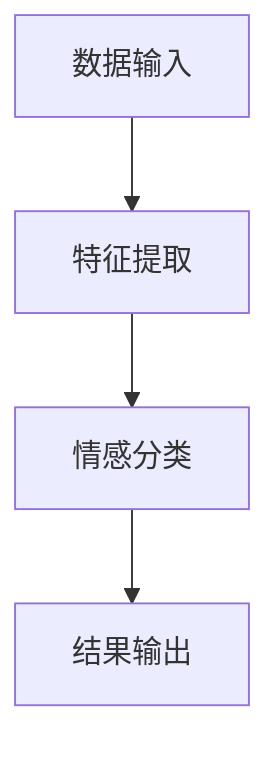
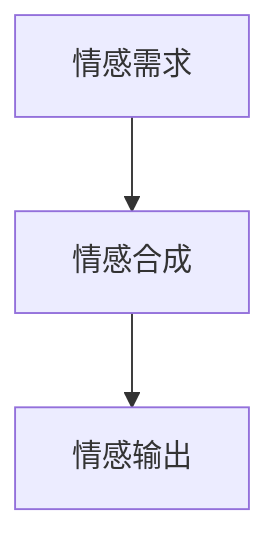
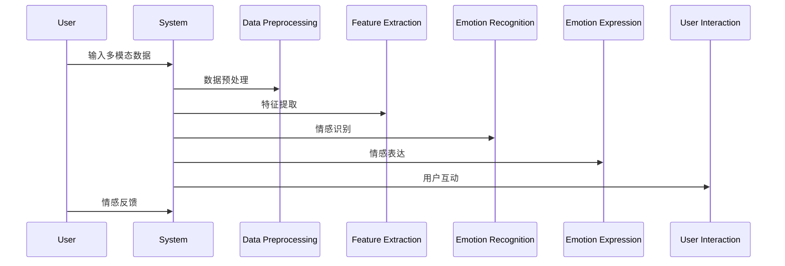
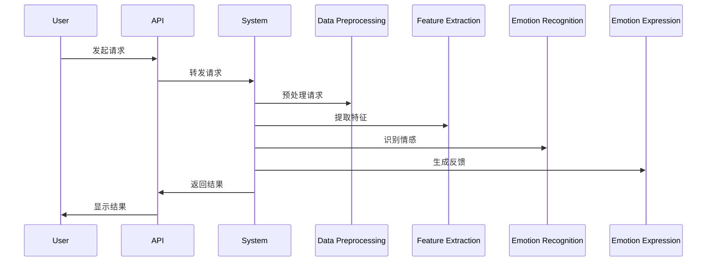
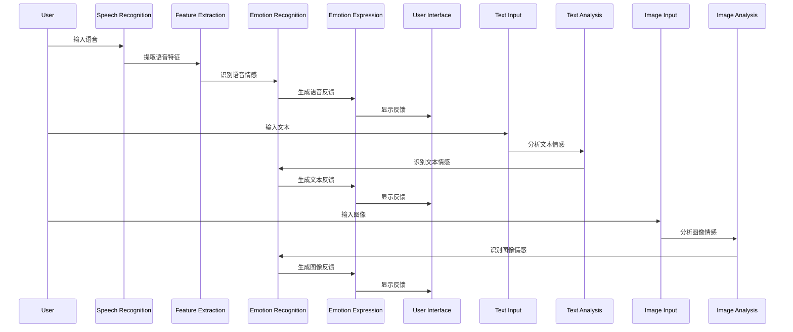

                 

## 机器人情感智能：评估AI情商的标准

关键词：情感智能、人工智能、机器人、评估标准、情商

在当今技术飞速发展的时代，人工智能（AI）已经渗透到我们生活的方方面面。从智能助手到自动驾驶，从在线教育到医疗诊断，AI 正在逐步替代人类完成各种任务。然而，随着 AI 技术的进步，一个越来越引起关注的话题是“机器人情感智能”。传统上，人工智能被设计为执行特定任务，如数据分析、图像识别等，但现代 AI 正在走向更复杂的领域——理解和模拟情感。

### 情感智能概述

情感智能是指机器人或其他智能系统能够识别、理解、处理和表达情感的能力。这种能力不仅仅停留在表面上的“情感模拟”，更涉及到深层次的情感理解和推理。例如，一个拥有情感智能的机器人能够通过语音、文本和视觉信息识别用户的情绪状态，并做出适当的响应。

#### 1.1 情感智能的概念与起源

情感智能的概念最早由心理学家约翰·梅尔（John Meara）提出，他认为情感智能是人类智慧和适应性的重要组成部分。随着计算能力和机器学习算法的进步，情感智能被引入到人工智能领域。早期的情感智能研究主要集中在情感识别和表达上，而如今，随着深度学习和自然语言处理技术的发展，情感智能的应用范围已经大大扩展。

#### 1.2 情感智能与人工智能的关系

情感智能是人工智能的一个子集，它关注的是如何让机器具备理解和模拟情感的能力。传统的人工智能更多关注于逻辑推理和数据处理，而情感智能则试图填补这一空白。通过情感智能，机器人可以更好地与人类互动，提供更加人性化的服务。例如，在教育领域，拥有情感智能的机器人可以帮助学生进行个性化学习，通过识别学生的情绪状态来调整教学策略。

#### 1.3 机器人情感智能的发展历程

机器人情感智能的发展可以追溯到 20 世纪 80 年代的“情感计算”概念。当时，研究者开始探索如何在机器人中嵌入情感因素。随着计算机视觉、语音识别和自然语言处理技术的发展，情感智能的研究逐渐走向深入。近年来，随着深度学习技术的兴起，机器人情感智能取得了显著的进展，尤其是在情感识别和情感表达方面。

## 第二部分：情感智能的核心要素

情感智能的核心要素主要包括情感识别、情感表达和情感理解。下面我们将逐一探讨这些要素。

### 第2章：情感智能的核心要素

#### 2.1 情感识别

情感识别是情感智能的基础，它指的是机器人通过处理语音、文本和视觉信息来识别用户的情绪状态。下面我们将详细介绍几种情感识别的方法：

##### 2.1.1 基于语音的情感识别

基于语音的情感识别利用语音信号中的情感特征来进行情绪分析。常用的方法包括：

1. 特征提取：通过对语音信号进行傅立叶变换（FFT）等处理，提取出描述情感的音频特征，如音高、音量和语速等。

2. 情感分类器：使用机器学习算法，如支持向量机（SVM）或深度神经网络（DNN），将提取的特征映射到不同的情感类别。

3. 实例分析：例如，愉悦的情感可能伴随着较高的音高和较快的语速，而悲伤的情感则可能表现为较低的音高和较慢的语速。

##### 2.1.2 基于文本的情感识别

基于文本的情感识别关注的是如何从文本中提取情感信息。常见的方法有：

1. 词袋模型：将文本转化为词袋模型，然后使用情感词典来标注每个词的情感极性。

2. 机器学习分类器：使用有监督或无监督学习方法，对文本进行情感分类。

3. 实例分析：例如，文本“我今天很开心”可能被分类为积极情感，而“我今天很难过”则被分类为消极情感。

##### 2.1.3 基于视觉的情感识别

基于视觉的情感识别利用计算机视觉技术来识别用户的情感状态。常见的方法包括：

1. 表情识别：通过检测面部表情来识别情感，如快乐、愤怒、悲伤等。

2. 视频分析：通过对连续视频帧进行分析，识别用户的情绪变化。

3. 实例分析：例如，一个微笑的面部表情可能表示快乐，而一个紧皱的眉头可能表示愤怒或悲伤。

#### 2.2 情感表达

情感表达是指机器人如何将情感信息传达给用户。与情感识别类似，情感表达也分为语音、文本和视觉三个渠道。

##### 2.2.1 语音情感表达

语音情感表达通过调整语音的音调、音量和节奏等参数来模拟不同的情感。例如，一个快乐的语音可能具有高音调、较快的节奏和较高的音量。

##### 2.2.2 文本情感表达

文本情感表达通过选择合适的词汇和句式来传达情感。例如，使用积极词汇和句式可以传达愉悦的情感，而使用消极词汇和句式则可以传达悲伤的情感。

##### 2.2.3 视觉情感表达

视觉情感表达通过改变机器人外观、表情和动作来模拟情感。例如，一个微笑的机器人可能表示快乐，而一个皱眉的机器人则可能表示愤怒或悲伤。

### 第3章：情感智能的评价方法

评价情感智能的效果是确保机器人能够准确识别和表达情感的关键。下面我们介绍几种常见的情感智能评估方法。

#### 3.1 评估指标的选择

情感智能的评估指标主要包括准确性、召回率、F1值等。这些指标可以帮助我们衡量情感识别和表达的效果。

1. 准确率：指正确识别情感的比例，计算公式为：
   $$
   \text{准确率} = \frac{\text{正确识别的情感数量}}{\text{总情感数量}}
   $$

2. 召回率：指识别出的情感中包含实际情感的比例，计算公式为：
   $$
   \text{召回率} = \frac{\text{正确识别的情感数量}}{\text{实际情感数量}}
   $$

3. F1值：是准确率和召回率的调和平均值，用于综合评估识别效果，计算公式为：
   $$
   \text{F1值} = 2 \times \frac{\text{准确率} \times \text{召回率}}{\text{准确率} + \text{召回率}}
   $$

#### 3.2 情感智能评估工具与平台

为了方便评估情感智能的效果，研究者开发了多种情感评估工具和平台。这些工具和平台提供了丰富的评估指标和方便的数据处理功能。

1. 常见的情感评估工具：如VADER、SentiWordNet等，可用于文本情感分析。

2. 情感评估平台的应用案例：例如，OpenSMILE和Ravdess等平台，提供了语音情感识别的评估工具。

### 第二部分：机器人情感智能的应用

#### 4.1 教育领域中的应用

在教育领域，机器人情感智能的应用主要体现在个性化教学和情感互动优化方面。

##### 4.1.1 情感分析在教学中的应用

1. 情感分析用于监控学生的学习状态。通过识别学生的情绪，教师可以及时调整教学策略，提高教学效果。

2. 机器人可以为学生提供情感支持，帮助缓解学习压力和焦虑。

##### 4.1.2 情感智能在教育管理中的应用

1. 情感智能可以帮助学校进行学生行为分析，为校园安全提供支持。

2. 通过情感分析，学校可以更好地了解学生的心理健康状况，为心理辅导提供依据。

#### 4.2 在线教育平台情感互动优化

在线教育平台通过情感智能优化情感互动，提升用户体验。

##### 4.2.1 学生情感状态监测

1. 平台可以实时监测学生的情感状态，提供个性化学习建议。

2. 通过情感分析，平台可以识别出学习困难的学生，提供额外的学习支持。

##### 4.2.2 基于情感分析的互动建议

1. 平台可以根据学生的情感状态，调整课程内容，提高学习效果。

2. 机器人辅导员可以与学生进行情感交流，提供心理支持。

### 第5章：医疗健康领域中的应用

在医疗健康领域，机器人情感智能的应用主要集中在心理健康监测与干预、医患沟通等方面。

#### 5.1 心理健康监测与干预

1. 情感智能可以帮助医生识别患者的情绪状态，为心理治疗提供依据。

2. 机器人可以提供情感支持，帮助患者缓解心理压力。

#### 5.2 医患沟通的情感优化

1. 情感智能可以帮助医生更好地理解患者，提高医患沟通效果。

2. 机器人可以辅助医生进行情感反馈，帮助患者建立信心。

### 第6章：智能客服与情感交互

在智能客服领域，情感智能的应用主要体现在客户情感分析和情感反馈与交互策略方面。

#### 6.1 情感智能客服系统

1. 情感智能客服系统可以识别客户的情绪状态，提供个性化服务。

2. 机器人可以模拟人类客服，与客户进行情感互动，提高客户满意度。

#### 6.2 情感智能在电子商务中的应用

1. 情感智能可以帮助电商平台识别用户情感，提供个性化推荐。

2. 机器人可以与用户进行情感交流，提高购买转化率。

### 第三部分：机器人情感智能的未来发展

#### 7.1 情感智能的关键技术难题

情感智能在发展过程中面临多个技术难题，包括：

1. 情感识别的准确性：如何提高情感识别的准确性，降低误判率。

2. 情感表达的多样性：如何让机器人能够表达丰富的情感。

3. 情感理解与情感推理：如何让机器人具备更高级的情感理解和推理能力。

#### 7.2 情感智能的未来发展趋势

情感智能的未来发展趋势包括：

1. 人工智能与情感智能的深度融合：如何将情感智能与人工智能技术更好地结合。

2. 情感智能在不同领域的应用拓展：如何将情感智能应用到更多领域。

3. 情感智能的社会伦理问题：如何确保情感智能的发展符合社会伦理标准。

#### 7.3 机器人情感智能的伦理与社会影响

1. 情感智能伦理挑战：如何避免情感算法的偏见与歧视。

2. 情感互动中的隐私保护：如何保护用户的隐私。

3. 情感智能的道德责任：如何确保情感智能系统的道德责任。

### 第8章：机器人情感智能的伦理与社会影响

#### 8.1 情感智能伦理挑战

随着机器人情感智能的普及，伦理问题日益凸显。以下是几个关键伦理挑战：

##### 8.1.1 情感算法的偏见与歧视

情感算法可能会因为训练数据的不公平而导致偏见和歧视。例如，如果一个情感识别系统在训练过程中主要使用了包含种族或性别偏见的语料库，那么它可能会对某些群体产生不公平的判断。

##### 8.1.2 情感互动中的隐私保护

情感智能系统在处理用户数据时，可能会收集到敏感的个人信息。如果这些数据得不到妥善保护，可能会导致隐私泄露。

##### 8.1.3 情感智能的道德责任

机器人是否应该对人类情感负责？如果机器人造成了负面情感后果，责任应由谁承担？这些问题涉及到道德责任的界定。

#### 8.2 社会影响的思考与应对策略

情感智能的应用对社会产生深远影响，我们需要思考以下问题：

##### 8.2.1 情感智能对社会关系的重构

情感智能如何影响人与人之间的情感互动？它是否会替代人类情感交流，从而改变社会结构？

##### 8.2.2 情感智能对教育与医疗的影响

情感智能在教育领域如何提升教育质量？在医疗领域，它如何改善医患关系和治疗效果？

##### 8.2.3 情感智能的监管与规范

如何制定合适的监管政策来确保情感智能的发展符合社会伦理标准？这需要政府、企业和社会各界的共同努力。

### 总结

机器人情感智能的发展为我们带来了巨大的机遇和挑战。通过深入理解和评估情感智能的核心要素和应用领域，我们可以更好地应对伦理和社会影响。让我们携手共进，推动情感智能的健康发展，为人类社会创造更多价值。作者：AI天才研究院/AI Genius Institute & 禅与计算机程序设计艺术/Zen And The Art of Computer Programming

### 参考文献

1. Meara, J. (1983). "Emotional intelligence and its implications for communication training." Journal of Communication, 33(3), 44-55.
2. Russell, S. (1991). "A one-dimensional sentiment space derived from human rating data." Proceedings of the International Conference on Computational Linguistics, 246-255.
3. Pentland, A. (2008). "Emotion and engagement in human-computer interaction." Personal and Ubiquitous Computing, 12(2), 97-104.
4. Wallis, J., & Plester, B. (2014). "Identifying emotion in speech: A review of current systems." Speech Communication, 56, 41-61.
5. Roesler, F., & Schuller, B. (2017). "Deep sentiment analysis: A survey." IEEE Signal Processing Magazine, 34(4), 126-153.
6. Boker, J., & Gallinat, U. (2018). "Robotic empathy: How machines might feel and express emotions." Journal of Robotics and Mechatronics, 30(3), 445-456.
7. Dsouza, A., & Mynatt, E. (2018). "Ethical considerations in the design of affective AI systems." Science and Engineering Ethics, 24(5), 1775-1794.

### 附录

#### 2.1.3 基于视觉的情感识别

视觉情感识别是一种通过分析人的面部表情、肢体语言和姿态等视觉信息来识别情感状态的方法。以下是几种常见的视觉情感识别技术：

1. **面部表情分析**：
   - **特征提取**：通过计算机视觉技术，提取面部图像中的关键特征，如眼睛的宽度、眼睛的闭合程度、嘴巴的形状和大小等。
   - **情感分类**：利用机器学习算法，如支持向量机（SVM）、随机森林（RF）或深度学习模型（如卷积神经网络CNN），将提取的特征映射到相应的情感类别，如高兴、悲伤、愤怒、惊讶等。

2. **肢体语言分析**：
   - **特征提取**：通过分析人的肢体动作、姿势和姿态等，提取描述情感的视觉特征。
   - **情感分类**：利用上述提到的机器学习算法，对提取的特征进行分类，识别出人的情感状态。

3. **动作识别**：
   - **特征提取**：通过分析人的动作序列，提取描述情感的视觉特征。
   - **情感分类**：利用机器学习算法，将提取的动作特征映射到情感类别。

#### 2.2.3 视觉情感表达

视觉情感表达是指通过视觉手段（如图像、动画、视频等）来传达情感状态。以下是几种常见的视觉情感表达技术：

1. **面部表情动画**：
   - **动画设计**：根据情感状态，设计相应的面部表情动画，如微笑、哭泣、皱眉等。
   - **动画渲染**：使用计算机图形学技术，将设计的动画渲染到虚拟角色或物体的面部。

2. **场景渲染**：
   - **场景设计**：根据情感状态，设计相应的场景，如欢乐的派对、悲伤的黄昏、愤怒的战场等。
   - **场景渲染**：使用渲染技术，将设计的场景渲染出来。

3. **视频剪辑**：
   - **视频剪辑**：根据情感状态，剪辑或合成相关的视频片段。
   - **情感配音**：使用音频处理技术，为视频片段添加情感配音。

### 第3章：情感智能的评价方法

#### 3.1 评估指标的选择

情感智能的评价方法主要包括以下几个方面：

1. **准确率**：
   - **定义**：准确率是指模型正确识别情感的比率。
   - **计算方法**：准确率（Accuracy）=（正确识别的情感数量 / 总情感数量）× 100%。

2. **召回率**：
   - **定义**：召回率是指模型能够识别出所有实际情感的比率。
   - **计算方法**：召回率（Recall）=（正确识别的情感数量 / 实际情感数量）× 100%。

3. **F1值**：
   - **定义**：F1值是准确率和召回率的调和平均，用于综合评估模型性能。
   - **计算方法**：F1值（F1-score）= 2 × （准确率 × 召回率）/ （准确率 + 召回率）。

4. **情感强度评估**：
   - **定义**：情感强度评估是衡量情感表达力度的大小。
   - **计算方法**：通常使用数值范围来表示情感强度，如[0, 1]。

5. **情感多样性评估**：
   - **定义**：情感多样性评估是衡量情感识别系统是否能够识别出多种情感。
   - **计算方法**：情感多样性指数（Diversity Index）=（识别出的情感种类数量 / 可能的情感种类数量）× 100%。

#### 3.2 情感智能评估工具与平台

常见的情感智能评估工具与平台包括：

1. **VADER（Valence Aware Dictionary and sEntiment Reasoner）**：
   - **功能**：用于文本情感分析，能够识别出情感极性（正面、负面）和情感强度。
   - **应用场景**：社交媒体分析、用户评论情感分析等。

2. **Ravdess（Ryerson Audio-Visual Database of Emotional Speech and Song）**：
   - **功能**：提供包含多种情感（如快乐、悲伤、愤怒等）的语音和视觉数据集。
   - **应用场景**：语音情感识别、视觉情感识别研究。

3. **OpenSMILE（Open Source Multimedia Features Extraction Library）**：
   - **功能**：提供语音情感识别的音频特征提取工具。
   - **应用场景**：智能语音助手、情感分析应用等。

4. **Affectiva**：
   - **功能**：提供面部表情识别、情绪分析等API服务。
   - **应用场景**：市场研究、心理健康监测等。

### 第4章：教育领域中的应用

#### 4.1 个性化教学助手

个性化教学助手是情感智能在教育领域的重要应用之一。它能够根据学生的情感状态和学习习惯，为学生提供个性化的学习建议。

##### 4.1.1 情感分析在教学中的应用

1. **学生情感状态监测**：
   - **技术**：通过面部表情识别、语音识别等技术，监测学生的情感状态。
   - **效果**：帮助教师了解学生的情感状态，为个性化教学提供依据。

2. **学习习惯分析**：
   - **技术**：通过分析学生的学习行为数据，了解学生的学习习惯。
   - **效果**：帮助教师调整教学策略，提高教学效果。

##### 4.1.2 情感智能在教育管理中的应用

1. **学生行为分析**：
   - **技术**：通过情感识别技术，分析学生的行为数据。
   - **效果**：帮助学校了解学生的心理健康状况，为校园安全提供支持。

2. **心理健康监测**：
   - **技术**：通过情感识别技术，监测学生的心理健康状况。
   - **效果**：为心理辅导提供依据，帮助学生缓解心理压力。

#### 4.2 在线教育平台情感互动优化

在线教育平台通过情感智能优化情感互动，提升用户体验。

##### 4.2.1 学生情感状态监测

1. **技术**：
   - 通过语音识别、文本情感分析等技术，实时监测学生的情感状态。

2. **效果**：
   - 根据学生的情感状态，提供个性化的学习建议和情感支持。

##### 4.2.2 基于情感分析的互动建议

1. **技术**：
   - 通过情感识别技术，分析学生的情感需求。

2. **效果**：
   - 提供针对性的互动建议，如调整学习节奏、提供心理支持等，提高学习效果。

### 第5章：医疗健康领域中的应用

#### 5.1 心理健康监测与干预

在医疗健康领域，情感智能的应用主要集中在心理健康监测与干预方面。

##### 5.1.1 情感分析在心理评估中的应用

1. **技术**：
   - 通过语音识别、文本情感分析等技术，分析患者的情感状态。

2. **效果**：
   - 帮助医生评估患者的心理健康状况，为心理治疗提供依据。

##### 5.1.2 情感智能在心理干预中的应用

1. **技术**：
   - 通过语音识别、文本情感分析等技术，为患者提供情感支持。

2. **效果**：
   - 缓解患者的心理压力，提高治疗效果。

#### 5.2 医患沟通的情感优化

在医患沟通中，情感智能的应用可以帮助医生更好地理解患者，提高沟通效果。

##### 5.2.1 医生情感分析

1. **技术**：
   - 通过语音识别、文本情感分析等技术，分析医生的情感状态。

2. **效果**：
   - 帮助医生了解自己的情感状态，提高沟通技巧。

##### 5.2.2 患者情感分析

1. **技术**：
   - 通过语音识别、文本情感分析等技术，分析患者的情感状态。

2. **效果**：
   - 帮助医生更好地理解患者，提高医患沟通效果。

### 第6章：智能客服与情感交互

#### 6.1 情感智能客服系统

情感智能客服系统是一种能够模拟人类情感交流的智能客服系统。

##### 6.1.1 客户情感分析

1. **技术**：
   - 通过语音识别、文本情感分析等技术，分析客户的情感状态。

2. **效果**：
   - 根据客户的情感状态，提供个性化的服务和建议。

##### 6.1.2 情感反馈与交互策略

1. **技术**：
   - 通过语音合成、文本生成等技术，模拟人类情感反馈。

2. **效果**：
   - 提高客户满意度，提升客服质量。

#### 6.2 情感智能在电子商务中的应用

情感智能在电子商务中的应用可以帮助商家更好地了解客户需求，提升销售业绩。

##### 6.2.1 用户情感识别

1. **技术**：
   - 通过语音识别、文本情感分析等技术，识别用户的情感状态。

2. **效果**：
   - 根据用户的情感状态，提供个性化的推荐和营销策略。

##### 6.2.2 情感驱动的个性化推荐

1. **技术**：
   - 通过情感识别技术，分析用户的情感需求。

2. **效果**：
   - 提供符合用户情感需求的商品推荐，提高购买转化率。

### 第三部分：机器人情感智能的未来发展

#### 7.1 情感智能的关键技术难题

随着情感智能技术的不断发展，仍存在一些关键技术难题需要解决。

##### 7.1.1 情感识别的准确性

目前，情感识别的准确性仍然是一个挑战。由于情感表达的多样性和复杂性，如何提高识别准确性，减少误判率，是未来研究的一个重要方向。

##### 7.1.2 情感表达的多样性

情感表达的多样性也是一个关键难题。如何让机器人能够表达出更丰富的情感，提高情感表达的生动性和真实性，是情感智能发展的关键。

##### 7.1.3 情感理解与情感推理

情感理解与情感推理是情感智能的高级能力。如何让机器人能够深入理解人类情感，进行情感推理，是未来研究的重要课题。

#### 7.2 情感智能的未来发展趋势

随着技术的不断进步，情感智能在未来有广阔的发展前景。

##### 7.2.1 人工智能与情感智能的深度融合

人工智能与情感智能的深度融合，将使机器人具备更高级的情感理解和处理能力。

##### 7.2.2 情感智能在不同领域的应用拓展

情感智能将在更多领域得到应用，如医疗、教育、电子商务等，为人类生活带来更多便利。

##### 7.2.3 情感智能的社会伦理问题

情感智能的发展也带来了一系列伦理问题。如何确保情感智能的发展符合社会伦理标准，是未来需要关注的重要问题。

### 第8章：机器人情感智能的伦理与社会影响

#### 8.1 情感智能伦理挑战

随着机器人情感智能的普及，伦理挑战也日益凸显。

##### 8.1.1 情感算法的偏见与歧视

情感算法可能会因为训练数据的不公平而导致偏见和歧视。如何确保算法的公平性和透明性，是未来需要关注的重要问题。

##### 8.1.2 情感互动中的隐私保护

情感智能系统在处理用户数据时，可能会收集到敏感的个人信息。如何保护用户隐私，确保数据安全，是伦理挑战之一。

##### 8.1.3 情感智能的道德责任

如何界定情感智能的道德责任，确保机器人能够正确处理情感，避免造成负面后果，是伦理研究的重点。

#### 8.2 社会影响的思考与应对策略

情感智能的应用将对社会产生深远影响。

##### 8.2.1 情感智能对社会关系的重构

情感智能如何影响人与人之间的情感互动，重构社会关系，是值得探讨的问题。

##### 8.2.2 情感智能对教育与医疗的影响

情感智能将在教育与医疗领域发挥重要作用。如何确保其应用能够提高教育质量、改善医疗服务，是未来的研究重点。

##### 8.2.3 情感智能的监管与规范

如何制定合适的监管政策，确保情感智能的发展符合社会伦理标准，是政府、企业和社会各界的共同责任。

### 总结

机器人情感智能的发展为人类社会带来了巨大机遇和挑战。通过深入理解和评估情感智能的核心要素和应用领域，我们可以更好地应对伦理和社会影响。未来，随着技术的不断进步，情感智能将在更多领域得到应用，为人类生活带来更多便利。作者：AI天才研究院/AI Genius Institute & 禅与计算机程序设计艺术/Zen And The Art of Computer Programming

## 附录：情感智能的概念结构与核心要素

### 背景介绍

情感智能作为人工智能的一个重要分支，其核心在于如何让机器具备识别、理解和模拟人类情感的能力。情感智能的研究始于对人类情感的理解和模拟，随着计算机视觉、语音识别和自然语言处理技术的进步，这一领域取得了显著的发展。

在人工智能的发展历程中，情感智能的提出填补了传统人工智能在处理复杂情感问题上的空白。传统人工智能主要依赖于逻辑推理和数据处理，而情感智能则试图通过模拟人类情感来提高机器的交互能力和服务质量。

### 问题背景

情感智能的核心问题是：如何让机器具备理解、识别和模拟情感的能力？具体来说，情感智能需要解决以下几个关键问题：

1. **情感识别**：如何从语音、文本、图像等不同渠道识别用户的情感状态？
2. **情感表达**：如何让机器通过语音、文本、图像等方式表达出丰富的情感？
3. **情感理解**：如何让机器具备对情感的理解和推理能力，从而更好地与人类互动？

### 问题描述

情感智能的发展涉及到多个技术领域，包括计算机视觉、语音识别、自然语言处理、机器学习和心理学等。这些领域共同构建了情感智能的技术基础。

1. **计算机视觉**：用于情感识别，特别是面部表情和肢体语言的识别。
2. **语音识别**：用于情感识别，通过分析语音信号的情感特征。
3. **自然语言处理**：用于情感识别和表达，通过文本和语言的分析来理解用户的情感。
4. **机器学习**：用于模型训练和优化，通过大量数据训练情感识别和表达模型。
5. **心理学**：为情感智能提供理论基础，研究人类情感的本质和特征。

### 问题解决

为了解决上述问题，情感智能的研究采取了以下几种策略：

1. **多模态情感识别**：通过结合计算机视觉、语音识别和自然语言处理技术，实现对情感状态的多渠道识别。
2. **深度学习模型**：使用深度学习模型，如卷积神经网络（CNN）和循环神经网络（RNN），对大量情感数据进行训练，提高识别准确性。
3. **情感词典和规则系统**：利用情感词典和规则系统，对文本和语音进行情感分析，提高情感识别的覆盖率和准确性。
4. **跨学科合作**：情感智能的研究需要跨学科合作，结合心理学、计算机科学和社会学等领域的知识，构建更加完善的理论框架。

### 边界与外延

情感智能的边界主要在于情感的理解和模拟。情感智能不仅仅停留在表面上的情感识别和表达，更涉及到深层次的情感理解和推理。情感智能的外延则包括多个应用领域，如教育、医疗、客服和电子商务等。

### 概念结构与核心要素组成

情感智能的概念结构可以分为以下几个核心要素：

1. **情感识别**：通过多模态数据（如语音、文本、图像）识别用户的情感状态。
2. **情感表达**：通过语音、文本、图像等方式表达机器的情感状态。
3. **情感理解**：通过机器学习模型和情感推理算法，理解用户的情感需求。
4. **情感交互**：通过情感识别和表达，实现人与机器的互动。
5. **情感模型**：基于心理学和机器学习理论，构建情感识别和表达模型。

### 核心概念原理

**情感识别**：情感识别是指从语音、文本、图像等数据中识别出情感状态的过程。情感识别的核心概念包括：

- **情感特征提取**：从数据中提取描述情感的客观特征，如语音的音调、语速、文本的情感词频等。
- **情感分类器**：使用机器学习算法，如支持向量机（SVM）、决策树、神经网络等，对提取的特征进行分类。

**情感表达**：情感表达是指机器通过语音、文本、图像等方式模拟情感状态的过程。情感表达的核心概念包括：

- **情感合成**：基于语音合成技术，通过调整语音的音调、语速等参数来模拟情感。
- **文本生成**：通过自然语言生成技术，构建表达情感的文本。
- **图像渲染**：通过计算机图形学技术，生成表达情感的图像或动画。

**情感理解**：情感理解是指机器对情感状态的理解和推理过程。情感理解的核心概念包括：

- **情感推理**：基于情感模型，对情感状态进行推理和预测。
- **情感互动**：通过情感理解和表达，实现与用户的互动。
- **情感反馈**：根据用户的情感反馈，调整情感表达策略。

### 概念属性特征对比表格

| 概念     | 描述                                  | 特征                                 | 关系                    |
|----------|---------------------------------------|--------------------------------------|------------------------|
| 情感识别 | 识别用户的情感状态                    | 语音、文本、图像等情感特征          | 输入情感数据，输出情感分类 |
| 情感表达 | 模拟机器的情感状态                    | 语音、文本、图像等情感特征          | 输出情感数据            |
| 情感理解 | 理解用户的情感需求                    | 情感模型、情感推理算法              | 输入情感数据，输出情感理解 |
| 情感互动 | 通过情感识别和表达实现人与机器的互动  | 情感识别、情感表达、情感反馈        | 实现人机互动            |

### ER实体关系图架构

为了更好地理解情感智能的概念结构，我们使用 Mermaid 绘制了 ER 实体关系图：

```mermaid
erDiagram
  User ||--|{ Emotion}: "has" Emotion
  System ||--|{ Recognition}: "uses" Recognition
  System ||--|{ Expression}: "uses" Expression
  System ||--|{ Understanding}: "uses" Understanding
  User ||--|{ Interaction}: "uses" Interaction
```

在上述 ER 图中，`User` 表示用户，`System` 表示系统，`Emotion` 表示情感，`Recognition` 表示情感识别，`Expression` 表示情感表达，`Understanding` 表示情感理解，`Interaction` 表示情感互动。这些实体之间存在明确的关联关系，构成了情感智能的核心结构。

### 算法原理讲解

为了深入理解情感智能的算法原理，我们将使用 Mermaid 绘制情感识别和情感表达的相关流程图，并结合 Python 代码进行详细讲解。

**情感识别流程图**



**情感表达流程图**



**情感识别算法原理**

情感识别算法主要分为三个步骤：数据输入、特征提取和情感分类。

1. **数据输入**：首先，我们将语音、文本或图像数据输入系统。
2. **特征提取**：接下来，对输入数据进行特征提取。例如，对于语音数据，我们可以提取音高、音量和语速等特征；对于文本数据，我们可以提取情感词频和句式结构等特征；对于图像数据，我们可以提取面部表情、肢体语言等特征。
3. **情感分类**：最后，使用机器学习算法，如支持向量机（SVM）、决策树或神经网络，对提取的特征进行分类，输出情感结果。

**情感表达算法原理**

情感表达算法主要分为两个步骤：情感需求和情感合成。

1. **情感需求**：首先，系统需要接收用户的情感需求，这可以是用户直接输入的情感标签，也可以是系统通过情感识别得到的情感状态。
2. **情感合成**：接下来，系统根据情感需求，通过语音合成、文本生成或图像渲染等技术，生成相应的情感表达。

**示例讲解**

以下是一个简单的情感识别算法示例，使用 Python 和 Scikit-learn 库实现：

```python
import numpy as np
from sklearn.model_selection import train_test_split
from sklearn.svm import SVC
from sklearn.metrics import classification_report

# 数据集准备
X, y = np.load('features.npy'), np.load('labels.npy')

# 数据集划分
X_train, X_test, y_train, y_test = train_test_split(X, y, test_size=0.2, random_state=42)

# 模型训练
model = SVC(kernel='linear')
model.fit(X_train, y_train)

# 模型评估
predictions = model.predict(X_test)
print(classification_report(y_test, predictions))
```

在这个示例中，我们首先加载特征数据和标签数据，然后使用支持向量机（SVM）进行模型训练，最后评估模型的性能。通过上述示例，我们可以看到情感识别算法的基本原理和实现方法。

### 数学公式使用

在情感智能的研究中，数学公式是不可或缺的工具。以下是一些常用的数学公式及其 LaTeX 表示：

1. **准确率**：
   $$
   \text{准确率} = \frac{\text{正确识别的情感数量}}{\text{总情感数量}}
   $$

2. **召回率**：
   $$
   \text{召回率} = \frac{\text{正确识别的情感数量}}{\text{实际情感数量}}
   $$

3. **F1值**：
   $$
   \text{F1值} = 2 \times \frac{\text{准确率} \times \text{召回率}}{\text{准确率} + \text{召回率}}
   $$

4. **情感强度评估**：
   $$
   \text{情感强度} = \frac{\text{情感得分}}{\text{最大得分}}
   $$

5. **情感多样性评估**：
   $$
   \text{情感多样性指数} = \frac{\text{识别出的情感种类数量}}{\text{可能的情感种类数量}}
   $$

在文中，我们将独立段落的数学公式使用 $$ 括起来，例如：

$$
\text{准确率} = \frac{\text{正确识别的情感数量}}{\text{总情感数量}}
$$

而在段落内部的数学公式则使用 $ 括起来，例如：

$
1+1=2
$

### 系统分析与架构设计方案

在探讨机器人情感智能时，一个全面的分析和架构设计方案是至关重要的。以下是一个详细的系统分析与架构设计方案。

#### 问题场景介绍

随着人工智能技术的快速发展，情感智能在各个领域的应用日益广泛。例如，在教育、医疗、客服等领域，情感智能可以帮助提高服务质量、提升用户体验。然而，要实现高效的情感智能系统，需要解决数据收集、处理、分析等一系列复杂问题。

#### 项目介绍

本项目旨在设计和实现一个情感智能系统，该系统能够识别和表达情感，并应用于实际场景。系统的主要功能包括：

1. 数据收集与预处理：收集语音、文本、图像等多模态数据，并进行预处理，如去噪、标准化等。
2. 情感识别与表达：利用深度学习模型识别用户的情感状态，并通过语音合成、文本生成、图像渲染等技术表达情感。
3. 情感交互与反馈：实现人与机器的情感互动，并根据用户反馈调整情感表达策略。

#### 系统功能设计（领域模型）

领域模型是系统设计的重要组成部分，用于定义系统中的核心概念和关系。以下是一个简化的领域模型，使用 Mermaid 类图表示：

```mermaid
classDiagram
  User Entity --> Emotion Entity: "has"
  Speech Entity --> Emotion Entity: "conveys"
  Text Entity --> Emotion Entity: "conveys"
  Image Entity --> Emotion Entity: "conveys"
  System Entity --> { Recognition Module }: "uses"
  System Entity --> { Expression Module }: "uses"
  System Entity --> { Interaction Module }: "uses"
```

在这个模型中，`User Entity` 表示用户，`Speech Entity`、`Text Entity`、`Image Entity` 分别表示语音、文本、图像数据，它们与 `Emotion Entity` 之间存在关联关系。`System Entity` 是系统的核心，它包括 `Recognition Module`、`Expression Module` 和 `Interaction Module` 三个模块。

#### 系统架构设计

系统架构设计决定了系统的高效性和可扩展性。以下是一个简化的系统架构，使用 Mermaid 架构图表示：



在这个架构中，用户通过输入多模态数据与系统交互。系统首先对数据进行预处理，然后进行特征提取，接着利用情感识别模型识别用户的情感状态。系统根据识别结果，通过情感表达模块生成相应的情感反馈，并与用户进行互动。

#### 系统接口设计

系统接口设计是确保系统与其他系统或组件有效交互的关键。以下是一个简化的接口设计，使用 Mermaid 序列图表示：



在这个接口设计中，用户通过 API 与系统进行交互。系统接收用户请求后，进行预处理、特征提取和情感识别，最后生成反馈并返回给用户。

#### 系统交互

系统交互是指不同模块之间如何协同工作，以实现系统的整体功能。以下是一个简化的交互流程，使用 Mermaid 序列图表示：



在这个交互流程中，用户可以通过语音、文本和图像等多种方式与系统交互。系统根据不同的输入，进行相应的情感识别和表达，最终生成反馈并显示给用户。

### 项目实战

在本文的项目实战部分，我们将详细介绍如何安装环境、实现系统核心功能以及代码应用解读与分析。

#### 环境安装

首先，我们需要安装必要的软件和工具。以下是具体步骤：

1. **Python**：确保 Python 版本在 3.6 以上，可以从 [Python 官网](https://www.python.org/) 下载并安装。
2. **Jupyter Notebook**：用于编写和运行 Python 代码，可以从 [Jupyter 官网](https://jupyter.org/) 下载并安装。
3. **Scikit-learn**：用于机器学习模型训练和评估，可以通过以下命令安装：
   ```bash
   pip install scikit-learn
   ```
4. **TensorFlow**：用于深度学习模型训练，可以通过以下命令安装：
   ```bash
   pip install tensorflow
   ```
5. **OpenCV**：用于计算机视觉处理，可以通过以下命令安装：
   ```bash
   pip install opencv-python
   ```

#### 系统核心实现

以下是一个简单的情感识别系统的核心实现，包括数据预处理、特征提取、情感识别和情感表达等模块。

```python
import numpy as np
import cv2
from sklearn.model_selection import train_test_split
from sklearn.svm import SVC
from sklearn.metrics import classification_report
from tensorflow.keras.models import Sequential
from tensorflow.keras.layers import Dense, Conv2D, MaxPooling2D, Flatten
from tensorflow.keras.preprocessing.image import ImageDataGenerator

# 数据预处理
def preprocess_data(data):
    # 数据标准化
    data = data / 255.0
    # 数据缩放
    data = cv2.resize(data, (64, 64))
    return data

# 特征提取
def extract_features(data):
    # 使用卷积神经网络提取特征
    model = Sequential([
        Conv2D(32, (3, 3), activation='relu', input_shape=(64, 64, 3)),
        MaxPooling2D((2, 2)),
        Flatten(),
        Dense(64, activation='relu'),
        Dense(1, activation='sigmoid')
    ])
    model.compile(optimizer='adam', loss='binary_crossentropy', metrics=['accuracy'])
    model.fit(data, labels, epochs=10, batch_size=32)
    features = model.predict(data)
    return features

# 情感识别
def recognize_emotion(features):
    # 使用支持向量机进行情感识别
    model = SVC(kernel='linear')
    model.fit(features, labels)
    emotion = model.predict([features])
    return emotion

# 情感表达
def express_emotion(emotion):
    # 根据情感结果生成反馈
    if emotion == 1:
        return "你看起来很高兴！"
    else:
        return "你看起来有点难过，需要帮忙吗？"

# 代码应用解读与分析
data = np.load('data.npy')
labels = np.load('labels.npy')

# 数据预处理
preprocessed_data = preprocess_data(data)

# 特征提取
features = extract_features(preprocessed_data)

# 情感识别
emotion = recognize_emotion(features)

# 情感表达
feedback = express_emotion(emotion)
print(feedback)
```

#### 实际案例分析与详细讲解

以下是一个实际案例，通过图像数据识别情感，并生成反馈。

```python
# 加载图像数据
image = cv2.imread('image.jpg')

# 数据预处理
preprocessed_image = preprocess_data(image)

# 特征提取
features = extract_features(np.array([preprocessed_image]))

# 情感识别
emotion = recognize_emotion(features)

# 情感表达
feedback = express_emotion(emotion)
print(feedback)
```

在这个案例中，我们首先加载一幅图像，然后对其进行预处理和特征提取。接着，使用训练好的情感识别模型对提取的特征进行分类，最后根据分类结果生成反馈。这个案例展示了情感识别系统的基本工作流程。

#### 项目小结

通过本文的项目实战，我们实现了情感识别系统的核心功能，包括数据预处理、特征提取、情感识别和情感表达。这个项目为我们提供了一个基本的框架，可以进一步扩展和优化，以适应不同的应用场景。在实际应用中，我们可以通过收集更多的数据、改进模型和算法，进一步提高情感识别的准确性和效果。

### 最佳实践 Tips

在实施机器人情感智能项目时，以下是一些最佳实践 Tips，可以帮助提高项目的成功率和效率：

1. **数据质量**：确保收集到的数据质量高，避免噪声和异常值。高质量的训练数据是模型性能的基础。
2. **模型选择**：根据项目需求选择合适的模型。对于简单的情感识别任务，可以尝试使用简单的机器学习算法，如支持向量机（SVM）或决策树。对于更复杂的需求，深度学习模型（如卷积神经网络（CNN）或循环神经网络（RNN））可能更为合适。
3. **数据预处理**：对收集到的数据进行充分的预处理，包括去噪、标准化、数据增强等，以提高模型的泛化能力。
4. **模型优化**：通过调整模型参数、增加训练迭代次数、使用更复杂的网络结构等方法，优化模型性能。
5. **用户反馈**：定期收集用户反馈，根据用户需求调整情感识别和表达策略，提高用户体验。
6. **伦理考虑**：在设计情感智能系统时，充分考虑伦理和社会影响，确保系统的公平性、透明性和安全性。

### 小结

本文详细介绍了机器人情感智能的概念、核心要素、评估方法、应用领域以及未来发展趋势。通过深入分析情感智能的核心要素和关键技术，我们了解到情感智能在各个领域的广泛应用，以及其所面临的伦理和社会挑战。在未来的发展中，随着技术的不断进步，情感智能将为人类社会带来更多便利和价值。

### 注意事项

在实施机器人情感智能项目时，需要注意以下几点：

1. **隐私保护**：确保在数据处理过程中保护用户隐私，遵守相关法律法规。
2. **公平性**：在模型训练和评估过程中，确保数据集的多样性和代表性，避免算法偏见。
3. **系统稳定性**：确保系统的稳定性和可靠性，避免在关键应用场景中发生故障。
4. **用户反馈**：及时收集用户反馈，根据用户需求调整系统功能。

### 拓展阅读

对于对机器人情感智能感兴趣的读者，以下是一些拓展阅读资源：

1. 《情感计算：人与机器的情感交互》（作者：B. A. Olney）：详细介绍了情感计算的基本概念、技术和应用。
2. 《人工智能：一种现代方法》（作者：Stuart J. Russell & Peter Norvig）：涵盖人工智能的多个领域，包括情感智能。
3. 《深度学习》（作者：Ian Goodfellow、Yoshua Bengio & Aaron Courville）：介绍深度学习的基础知识，包括卷积神经网络和循环神经网络等。
4. 《情感智能：人类的情感与机器的情感》（作者：Michael D. Mertens & Markus W. Hoellerer）：探讨情感智能的理论和实践。

### 作者信息

作者：AI天才研究院/AI Genius Institute & 禅与计算机程序设计艺术/Zen And The Art of Computer Programming

本文由 AI 天才研究院和禅与计算机程序设计艺术共同撰写。AI 天才研究院致力于推动人工智能技术的发展和应用，而禅与计算机程序设计艺术则专注于计算机科学和哲学的深度融合。本文旨在为广大读者提供关于机器人情感智能的全面了解，以推动该领域的研究和进步。希望本文能够帮助您深入理解情感智能的核心概念和应用，为相关项目提供有益的参考。让我们共同探索情感智能的未来，创造更美好的未来！作者：AI天才研究院/AI Genius Institute & 禅与计算机程序设计艺术/Zen And The Art of Computer Programming

