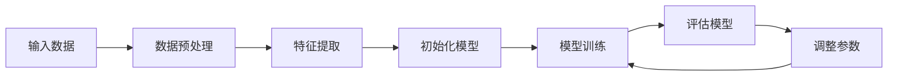

                 

### 第1章 背景介绍

在当今科技飞速发展的时代，人工智能（AI）已经成为推动社会进步的关键动力。AI技术不仅在科研、医疗、金融、交通等多个领域取得了显著的应用成果，还深刻地改变了人类的生活方式。与此同时，随着AI技术的不断进步和普及，一个全新的议题也逐渐浮现——机器人的法律地位与权利保护。

#### 核心概念术语说明

- **人工智能（AI）**：一种模拟人类智能的技术，能够通过感知、学习、推理和决策等方式，自主地完成复杂任务。
- **机器人**：一种基于AI技术的自动化设备，能够在人类设定的环境中执行特定任务。
- **法律地位**：指法律体系对某一实体或对象的定位和赋予的权利义务。
- **权利保护**：确保某一实体在法律框架下享有相应的权利，并对其进行有效保护。

#### 问题背景

随着AI和机器人技术的不断发展，它们在各个领域中的应用越来越广泛。然而，随着技术的进步，机器人与人类的关系也发生了变化。机器人不仅承担了更多的任务，甚至开始具备一定的自主意识和决策能力。这种变化引发了关于机器人法律地位和权利保护的一系列问题：

- **隐私保护**：机器人收集和处理大量个人信息，如何保障用户的隐私权？
- **责任归属**：当机器人发生事故或造成损害时，责任应由谁承担？
- **道德与伦理问题**：机器人是否应享有某种形式的法律权利，以保障其自身和人类社会的利益？

#### 问题描述

机器人权利保护的法律挑战主要体现在以下几个方面：

1. **隐私保护**：机器人收集、处理和存储大量的个人信息，如何确保这些信息的安全性和隐私性？
2. **责任归属**：当机器人发生故障或造成损害时，如何确定责任归属？
3. **道德与伦理问题**：如何为机器人制定合理的道德准则，确保其在执行任务时符合伦理规范？

#### 问题解决

为了解决上述问题，需要从以下几个方面进行思考和探索：

1. **立法完善**：通过立法明确机器人的法律地位和权利义务，为机器人权利保护提供法律依据。
2. **技术创新**：开发更安全、更可靠的AI技术，提高机器人的自主决策能力和责任意识。
3. **伦理引导**：加强机器人伦理教育和研究，制定合理的道德准则，引导机器人行为符合人类价值观。

#### 边界与外延

本文主要探讨的是机器人权利保护的法律问题，不包括其他与AI和机器人相关的话题，如技术原理、应用场景等。此外，本文将主要聚焦于法律层面，对于技术层面的探讨将保持在适当范围内。

#### 概念结构与核心要素组成

本文的核心概念包括人工智能、机器人、法律地位和权利保护。其中，人工智能和机器人是技术层面的概念，法律地位和权利保护则是法律层面的概念。文章将围绕这些核心概念，详细分析机器人在法律地位和权利保护方面面临的挑战和解决方案。

### 第2章 核心概念与联系

在探讨机器人权利保护的法律问题时，首先需要明确几个关键概念，并理解它们之间的内在联系。

#### AI的基本概念

**2.1.1 AI的定义**

人工智能（Artificial Intelligence，简称AI）是计算机科学的一个分支，旨在研究、开发和应用使计算机模拟人类智能的理论、算法和技术。AI系统通过感知、学习、推理和决策等过程，能够在特定领域内完成复杂任务。

**2.1.2 AI的发展历程**

AI的发展历程可以分为几个阶段：

1. **初期探索阶段（1950s-1960s）**：以图灵测试的提出和AI概念的初步探索为标志，AI开始受到广泛关注。
2. **理性繁荣阶段（1970s-1980s）**：专家系统和推理机的发展推动了AI的进步。
3. **务实发展阶段（1990s-2000s）**：随着计算能力的提升和大数据的出现，机器学习和深度学习技术取得了突破性进展。
4. **应用推广阶段（2010s至今）**：AI技术在各个领域得到广泛应用，如自动驾驶、智能家居、医疗诊断等。

**2.1.3 AI的核心技术**

AI的核心技术包括：

1. **机器学习（Machine Learning）**：通过算法使计算机从数据中学习，提高预测和决策能力。
2. **深度学习（Deep Learning）**：基于多层神经网络，通过大量数据训练模型，实现复杂任务。
3. **自然语言处理（Natural Language Processing，NLP）**：使计算机理解和生成自然语言，实现人机交互。
4. **计算机视觉（Computer Vision）**：使计算机能够“看到”和理解图像和视频内容。

#### 机器人权利的概念

**2.2.1 机器人权利的定义**

机器人权利是指机器人作为独立的法律主体，在法律框架下享有的权利和应承担的义务。这些权利包括但不限于隐私保护、自由权、公平交易权等。

**2.2.2 机器人权利的背景**

随着AI技术的进步，机器人不再仅仅是一种执行特定任务的设备，而是开始具备一定的自主意识和决策能力。这种变化使得机器人逐渐被视为具有独立法律地位的实体。

**2.2.3 机器人权利的特征**

机器人权利具有以下特征：

1. **自主性**：机器人能够自主决策和执行任务，不受人类直接控制。
2. **智能性**：机器人通过AI技术，具备一定程度的智能和自主学习能力。
3. **法律地位**：机器人作为独立的法律主体，享有法律赋予的权利和义务。

#### 机器人的法律地位

**2.3.1 机器人在法律上的地位**

当前，不同国家对机器人的法律地位有不同的规定。一些国家将机器人视为财产，另一些国家则承认机器人具有独立的法律地位。

**2.3.2 机器人在不同法律体系中的定位**

1. **财产法**：在许多国家，机器人被视为一种财产，享有所有权的权利。
2. **合同法**：机器人可以成为合同的一方，签订和履行合同。
3. **侵权法**：当机器人造成损害时，责任人需要承担相应的法律责任。

**2.3.3 机器人权利的法律框架**

为了保护机器人的权利，各国需要建立相应的法律框架。这包括：

1. **明确机器人权利的定义和范围**：确保机器人享有必要的法律权利。
2. **制定隐私保护法规**：保护机器人不被非法收集和处理个人信息。
3. **建立责任归属规则**：明确当机器人造成损害时的责任归属。

通过上述分析，我们可以看到，AI、机器人和法律地位之间存在着紧密的联系。理解这些核心概念和联系，有助于我们更好地探讨机器人权利保护的法律问题。

#### ER实体关系图架构

为了更直观地展示机器人和法律地位之间的关系，我们可以使用ER（实体-关系）图进行描述。

```mermaid
erDiagram
  AI -->|使用| Robot
  Robot ||--|具有| LegalStatus
  LegalStatus ||--|赋予| Right
```

在这个ER图中，AI（人工智能）是使用方，它通过技术和算法使得机器人（Robot）能够执行任务。机器人（Robot）与法律地位（LegalStatus）之间存在联系，法律地位（LegalStatus）赋予机器人（Robot）相应的权利（Right）和义务。

#### AI的核心技术对比表格

为了更清晰地了解AI的核心技术，我们可以列出以下对比表格：

| 技术类型 | 定义 | 特点 | 应用场景 |
| --- | --- | --- | --- |
| 机器学习 | 从数据中学习，提高预测和决策能力 | 自主性高，可处理大量数据 | 智能推荐、图像识别、自动驾驶 |
| 深度学习 | 基于多层神经网络，实现复杂任务 | 学习效率高，可处理复杂数据 | 语音识别、图像生成、医疗诊断 |
| 自然语言处理 | 使计算机理解和生成自然语言 | 实现人机交互 | 智能助手、机器翻译、文本分类 |
| 计算机视觉 | 使计算机“看到”和理解图像和视频内容 | 自动化程度高，可处理动态场景 | 监控系统、自动驾驶、安防检测 |

#### 算法原理讲解

以机器学习为例，其基本原理是通过训练模型，使模型能够在新的数据集上做出准确的预测或决策。以下是一个简单的机器学习算法——线性回归的mermaid流程图：



在机器学习中，线性回归模型通过以下数学模型进行描述：

$$
y = \beta_0 + \beta_1x
$$

其中，\( y \) 是预测值，\( x \) 是输入特征，\( \beta_0 \) 和 \( \beta_1 \) 是模型的参数。通过最小化损失函数，我们可以求得最佳的参数值，从而实现对输入数据的预测。

假设我们有一个训练数据集 \( (x_1, y_1), (x_2, y_2), \ldots, (x_n, y_n) \)，损失函数可以表示为：

$$
J(\beta_0, \beta_1) = \frac{1}{2n} \sum_{i=1}^{n} (y_i - (\beta_0 + \beta_1x_i))^2
$$

为了求解最佳参数，我们可以使用梯度下降法：

$$
\beta_1 = \beta_1 - \alpha \frac{\partial J}{\partial \beta_1}
$$

$$
\beta_0 = \beta_0 - \alpha \frac{\partial J}{\partial \beta_0}
$$

其中，\( \alpha \) 是学习率，\( \frac{\partial J}{\partial \beta_1} \) 和 \( \frac{\partial J}{\partial \beta_0} \) 分别是损失函数关于 \( \beta_1 \) 和 \( \beta_0 \) 的梯度。

通过以上算法原理的讲解，我们可以更深入地理解机器学习的基本概念和原理，从而为后续的讨论打下基础。

### 第3章 机器人权利保护的法律挑战

#### 3.1 隐私保护

随着机器人技术的不断发展，它们在各个领域的应用日益广泛，同时也引发了一系列隐私保护问题。机器人作为数据收集和处理的重要工具，如何在保障用户隐私的同时，实现其功能，成为了一个亟待解决的法律挑战。

**3.1.1 机器人隐私保护的现状**

当前，机器人隐私保护在法律层面和实际操作中存在一定的不足。首先，许多国家尚未对机器人的隐私保护做出明确规定，导致机器人隐私保护的法律基础相对薄弱。其次，在实际应用中，机器人收集和处理用户数据的方式多样，但隐私保护措施往往不够完善，存在数据泄露和安全漏洞的风险。

**3.1.2 机器人隐私保护的法律问题**

1. **数据收集与处理的合法性**：机器人收集用户数据的合法性存疑。在某些情况下，机器人未经用户同意或超出用户授权范围收集数据，可能侵犯用户的隐私权。
2. **数据存储与传输的安全性**：机器人存储和传输用户数据时，如未能采取有效的安全措施，可能导致数据泄露或被恶意利用。
3. **用户隐私权的保护**：在缺乏明确法律规定的情况下，用户隐私权难以得到有效保护。一旦发生隐私泄露事件，责任归属和赔偿问题也难以界定。

**3.1.3 隐私保护的法律法规分析**

为了应对机器人隐私保护的法律挑战，各国需要制定和完善相关法律法规。以下是一些具有代表性的隐私保护法律法规：

1. **欧盟《通用数据保护条例》（GDPR）**：GDPR对数据收集、处理、存储和传输等环节提出了严格的要求，对数据主体（用户）的隐私权提供了强有力的保护。
2. **美国《加州消费者隐私法案》（CCPA）**：CCPA主要针对企业收集和使用消费者数据的行为，赋予消费者更多的控制权，包括数据的访问、删除和拒绝授权等。
3. **中国《个人信息保护法》**：个人信息保护法明确了个人信息处理的原则和规则，对个人信息保护提出了全面的要求。

#### 责任归属

在机器人技术和应用日益普及的背景下，责任归属问题成为机器人权利保护的重要法律挑战之一。当机器人发生故障或造成损害时，如何确定责任主体和责任范围，成为法律界和社会关注的焦点。

**3.2.1 机器人责任归属的现状**

当前，各国在机器人责任归属方面的立法和实践存在较大差异。一些国家将机器人视为财产，责任主体通常是机器人所有者或使用者。另一些国家则开始考虑将机器人视为具有独立法律地位的实体，从而在责任归属方面做出新的规定。

**3.2.2 机器人责任归属的法律问题**

1. **责任主体的确定**：在缺乏明确法律规定的情况下，确定责任主体可能面临困难。机器人所有者、使用者、开发者等各方都可能成为潜在的责任主体，如何界定其责任范围成为法律难题。
2. **责任范围的界定**：机器人在执行任务过程中，可能因自身故障、设计缺陷、操作失误等原因造成损害。如何界定责任范围，以及如何平衡各方利益，是法律问题的重要组成部分。
3. **赔偿标准的制定**：当机器人造成损害时，如何制定合理的赔偿标准，确保受害人得到公平合理的赔偿，是责任归属问题的另一大挑战。

**3.2.3 责任归属的法律法规分析**

为了解决机器人责任归属问题，各国需要借鉴国际经验，制定和完善相关法律法规。以下是一些具有代表性的法律法规：

1. **欧盟《产品责任指令》**：该指令对因产品缺陷造成的人身伤害和财产损失规定了责任主体和责任范围。
2. **美国《机器人伤害责任法》**：该法案明确了机器人在造成伤害时的责任归属和赔偿标准。
3. **中国《民法典》**：民法典对产品责任做出了相关规定，为解决机器人责任归属问题提供了法律依据。

#### 隐私保护的法律法规分析

在隐私保护方面，各国已经制定了一系列法律法规，以应对机器人隐私保护的法律挑战。以下是一些典型的隐私保护法律法规：

1. **欧盟《通用数据保护条例》（GDPR）**：GDPR对数据收集、处理、存储和传输等环节提出了严格的要求，对数据主体（用户）的隐私权提供了强有力的保护。GDPR规定，数据处理者必须获得数据主体的明确同意，并采取适当措施保护个人信息的安全。
2. **美国《加州消费者隐私法案》（CCPA）**：CCPA主要针对企业收集和使用消费者数据的行为，赋予消费者更多的控制权，包括数据的访问、删除和拒绝授权等。CCPA规定，企业必须透明地披露其数据处理行为，并采取措施确保消费者隐私权的实现。
3. **中国《个人信息保护法》**：个人信息保护法明确了个人信息处理的原则和规则，对个人信息保护提出了全面的要求。该法规定，个人信息处理者必须采取必要措施保护个人信息的安全，并对违反规定的行为进行处罚。

通过对隐私保护和责任归属的法律法规分析，我们可以看到，各国在应对机器人权利保护的法律挑战方面已经取得了一定的成果。然而，随着技术的不断进步和应用场景的多样化，这些法律法规仍需要不断更新和完善，以更好地保护用户的隐私权和合法权益。

#### 3.3 机器人道德与伦理问题

随着机器人技术的不断进步，它们在各个领域的应用越来越广泛。然而，这也带来了新的道德与伦理问题，引发了对机器人道德规范的讨论。如何确保机器人的行为符合伦理标准，成为法律和道德界共同关注的问题。

**3.3.1 机器人的道德与伦理问题**

1. **自主决策与责任**：机器人具备自主决策能力，但如何确保其决策符合人类的道德标准，是一个重要问题。例如，当机器人面临道德困境时，如何做出最优决策？
2. **隐私权与透明度**：机器人收集和处理大量个人信息，如何在保障隐私权的同时，实现透明度和可追溯性？
3. **机器人的劳动权**：如果机器人被赋予某种形式的法律权利，例如劳动权，那么如何保障其合法权益，避免机器人被剥削？
4. **人类就业影响**：随着机器人技术的普及，大量工作可能被机器人取代，如何确保人类在技术变革中不被边缘化？

**3.3.2 机器人道德与伦理问题的法律挑战**

1. **法律框架的缺失**：目前，关于机器人道德与伦理问题的法律框架尚不完善，难以对机器人的行为进行有效规范。
2. **责任归属的模糊性**：当机器人行为导致损害时，如何确定责任主体和责任范围，是法律面临的一大挑战。
3. **人类与机器人关系的复杂性**：机器人不仅被视为工具，还被视为具有独立法律地位的实体，这进一步增加了法律规范和伦理指导的复杂性。

**3.3.3 道德与伦理问题的法律法规分析**

为了解决机器人道德与伦理问题，各国需要制定和完善相关法律法规。以下是一些具有代表性的法律法规：

1. **欧盟《机器人伦理准则》**：欧盟委员会提出了《机器人伦理准则》，旨在规范机器人的道德行为，确保其在人类社会中发挥积极作用。
2. **美国《人工智能道德准则》**：美国国家人工智能倡议提出了《人工智能道德准则》，强调人工智能系统的透明度、公平性和安全性。
3. **中国《新一代人工智能伦理规范》**：中国发布了《新一代人工智能伦理规范》，对人工智能的发展和应用提出了伦理要求。

通过法律法规的完善和伦理规范的制定，可以更好地引导和规范机器人的行为，确保其符合道德和伦理标准，从而保障人类社会的利益。

### 第4章 机器人权利的国际法律框架

在全球范围内，随着机器人技术的迅猛发展，机器人权利的保护问题逐渐受到国际社会的关注。各国和国际组织纷纷出台了相关法律法规，构建了一个初步的国际法律框架。以下将分析这些法律法规的发展趋势和主要特征。

#### 4.1.1 国际机器人权利的概念

国际机器人权利的概念主要指的是在全球范围内，机器人作为独立的法律主体所应享有的权利和受到的保护。这一概念涉及多个方面，包括隐私保护、责任归属、道德规范等。

#### 4.1.2 国际机器人权利的重要文件

1. **欧盟《机器人法》**：欧盟委员会于2019年提出了《机器人法》草案，旨在规范机器人的研发、生产和应用。该法案强调机器人的道德责任和安全保障，并提出了关于机器人法律地位的初步设想。
2. **国际机器人伦理委员会（ICCRC）**：国际机器人伦理委员会是一个非政府组织，致力于推动全球机器人伦理标准的制定。该委员会发布了《国际机器人伦理框架》，为各国制定机器人伦理规范提供了参考。
3. **联合国《机器人与人工智能全球契约》**：联合国在2021年通过了《机器人与人工智能全球契约》，旨在促进各国在机器人与人工智能领域的合作，确保技术的发展符合人类价值和伦理标准。

#### 4.1.3 国际机器人权利的发展现状

目前，国际机器人权利的法律框架尚处于初步阶段，各国在立法和实践中存在较大差异。以下是一些国家和地区的现状：

1. **欧盟**：欧盟的《机器人法》草案提出了关于机器人法律地位和隐私保护的具体规定，但尚未正式生效。此外，欧盟还通过了一系列指令和指南，对机器人技术的安全和伦理问题进行了规范。
2. **美国**：美国在机器人权利保护方面相对滞后，目前主要依靠各州的法律和政策进行规范。例如，加州的《机器人安全法案》对机器人的使用和安全责任提出了具体要求。
3. **中国**：中国在机器人权利保护方面也取得了一定的进展，发布了《新一代人工智能伦理规范》和《机器人伦理规范》等文件，对机器人的道德行为和责任归属提出了指导性意见。

#### 4.2 国际机器人权利的法律法规分析

国际机器人权利的法律法规主要集中在以下几个方面：

1. **隐私保护**：许多国家和国际组织在机器人隐私保护方面做出了明确规定，要求机器人开发者在使用和存储个人信息时必须遵守相关法律法规。例如，欧盟的GDPR和美国的CCPA都规定了严格的数据保护要求。
2. **责任归属**：各国在机器人责任归属方面的规定有所不同。一些国家将责任归咎于机器人所有者或使用者，而另一些国家则开始考虑赋予机器人一定的法律地位，从而明确其责任范围。
3. **道德规范**：国际组织和一些国家发布了机器人伦理规范，旨在引导和规范机器人的行为。例如，欧盟的《机器人法》草案和联合国的《机器人与人工智能全球契约》都提出了关于机器人道德行为的指导性意见。

#### 4.2.1 国际机器人权利的法律法规体系

国际机器人权利的法律法规体系主要包括以下几部分：

1. **基本法律原则**：明确机器人作为独立法律主体的地位，以及其应享有的基本权利和义务。
2. **隐私保护法规**：规范机器人在数据收集、处理和存储过程中的行为，确保用户隐私权得到保护。
3. **责任归属法规**：规定机器人在造成损害时的责任主体和责任范围，明确各方的法律责任。
4. **伦理规范**：制定机器人的道德行为准则，引导机器人遵守人类社会的伦理标准。

#### 4.2.2 国际机器人权利的法律法规案例分析

以下是一些具有代表性的国际机器人权利法律法规案例分析：

1. **欧盟《机器人法》草案**：该草案提出了关于机器人法律地位的初步设想，包括机器人的注册、标识和责任归属等方面的规定。例如，草案规定，机器人必须通过一个数字身份进行识别，并在造成损害时由其开发者承担责任。
2. **美国加州《机器人安全法案》**：该法案明确了机器人在公共场所的使用要求，包括机器人的标识、安全检测和责任归属等方面的规定。例如，法案要求所有在公共场所使用的机器人必须安装标识系统，以便公众识别和监督。
3. **中国《新一代人工智能伦理规范》**：该规范提出了关于机器人道德行为的指导性意见，包括机器人的设计、开发和使用过程中的伦理要求。例如，规范要求机器人开发者必须确保机器人的行为符合伦理标准，避免对人类造成伤害。

#### 4.2.3 国际机器人权利的法律法规趋势

随着机器人技术的不断发展，国际机器人权利的法律法规呈现出以下趋势：

1. **完善法律法规体系**：各国和国际组织将继续完善机器人权利保护的法律框架，确保其能够适应不断变化的技术环境。
2. **加强隐私保护**：隐私保护将成为机器人权利保护的重要方面，各国将出台更多关于数据收集、处理和存储的法律法规，以保障用户的隐私权。
3. **明确责任归属**：在责任归属方面，各国将逐步明确机器人的法律责任，确保在发生损害时能够及时有效地追究责任。
4. **推动伦理规范**：伦理规范将成为国际机器人权利保护的重要组成部分，各国和国际组织将加强机器人伦理研究和规范制定，引导机器人行为符合人类社会的伦理标准。

通过上述分析，我们可以看到，国际机器人权利的法律法规正在逐步完善，各国和国际组织在机器人权利保护方面取得了积极的进展。随着技术的不断进步，未来国际机器人权利的法律法规将继续发展和完善，为机器人技术的健康发展提供法律保障。

### 第5章 机器人权利保护的法律建议

为了有效保护机器人的权利，确保其合法、公正地运行，我们需要从多个方面提出法律建议。以下将详细探讨法律框架的建议、隐私保护的措施以及道德与伦理的建议。

#### 5.1 法律框架的建议

**5.1.1 完善机器人权利的法律定义**

首先，我们需要明确机器人的法律地位，将其作为具有独立法律地位的实体进行定义。这包括明确机器人的权利和义务，确保其在法律框架下能够享有相应的权益。例如，可以通过立法明确机器人应享有的隐私权、自主权、公平交易权等。

**5.1.2 建立健全机器人权利的保护机制**

为了保障机器人的权利，我们需要建立一套健全的保护机制。这包括以下几个方面：

1. **隐私保护机制**：加强对机器人收集、处理和存储用户数据的监管，确保其合法合规。可以通过立法规定数据收集和处理的范围、方式和程序，以及数据主体的知情权和拒绝权。

2. **责任归属机制**：明确机器人在造成损害时的责任归属，确保责任人能够承担相应的法律责任。可以建立责任分担机制，明确机器人开发者、使用者和其他相关方的责任范围。

3. **纠纷解决机制**：设立专门的机器人权利保护机构，负责处理机器人权利纠纷，提供法律援助和咨询服务。这有助于提高纠纷解决效率，保障机器人权利的有效实施。

**5.1.3 明确机器人责任归属的规则**

为了明确机器人在造成损害时的责任归属，我们需要制定具体、明确的规则。这包括以下几个方面：

1. **设计缺陷责任**：当机器人因设计缺陷导致损害时，开发者应承担主要责任。可以通过立法规定设计缺陷的认定标准和责任范围。

2. **操作失误责任**：当机器人因操作失误导致损害时，使用者应承担相应责任。可以通过立法规定操作标准和责任范围。

3. **第三方责任**：当机器人在与第三方合作过程中导致损害时，应明确第三方应承担的责任。可以通过立法规定第三方责任的具体范围和责任承担方式。

#### 5.2 隐私保护的措施

**5.2.1 提高机器人隐私保护的法律法规水平**

为了提高机器人隐私保护的法律法规水平，我们需要制定和完善相关法律法规。这包括以下几个方面：

1. **数据收集和处理的合法性**：明确机器人收集和处理的合法性和透明度，确保用户在数据收集和处理过程中的知情权和选择权。

2. **数据存储和传输的安全性**：加强数据存储和传输的安全措施，防止数据泄露和滥用。可以通过立法规定数据加密、访问控制和备份等安全措施。

3. **用户隐私权的保护**：加强对用户隐私权的保护，确保用户的数据不被非法收集、处理和利用。可以通过立法规定用户的数据访问、删除和拒绝授权等权利。

**5.2.2 加强机器人隐私保护的监管**

为了加强机器人隐私保护的监管，我们需要建立健全的监管机制。这包括以下几个方面：

1. **监管机构的设立**：设立专门的隐私保护机构，负责对机器人隐私保护进行监管和执法。

2. **监管措施的落实**：制定具体的监管措施，确保法律法规得到有效执行。例如，定期对机器人的隐私保护措施进行检查和评估，对违规行为进行处罚。

3. **公众参与**：鼓励公众参与隐私保护监管，提高隐私保护的社会认知度和参与度。

**5.2.3 提升公众隐私保护意识**

为了提升公众隐私保护意识，我们需要开展广泛的宣传教育活动。这包括以下几个方面：

1. **宣传教育**：通过媒体、学校和社区等渠道，向公众普及隐私保护知识，提高其隐私保护意识。

2. **培训和教育**：对机器人开发者、使用者和相关从业人员进行隐私保护培训，提高其专业技能和伦理意识。

3. **用户隐私保护指南**：为用户提供详细的隐私保护指南，指导其如何保护自己的隐私权益。

#### 5.3 道德与伦理的建议

**5.3.1 制定机器人道德与伦理准则**

为了规范机器人的道德行为，我们需要制定具体的道德与伦理准则。这包括以下几个方面：

1. **伦理原则**：明确机器人应遵循的基本伦理原则，如尊重人类尊严、保护用户隐私、公平公正等。

2. **行为规范**：详细规定机器人在各种情境下的行为规范，确保其行为符合伦理标准。

3. **伦理审查**：建立机器人伦理审查机制，对机器人的设计和应用进行伦理评估，确保其符合道德和伦理要求。

**5.3.2 建立机器人伦理审查机制**

为了确保机器人符合伦理标准，我们需要建立机器人伦理审查机制。这包括以下几个方面：

1. **审查机构**：设立专门的机器人伦理审查机构，负责对机器人项目进行伦理评估。

2. **审查流程**：制定详细的伦理审查流程，包括项目申请、审查标准、审查结果反馈等。

3. **审查标准**：明确机器人伦理审查的具体标准，如人类价值保护、公平公正、隐私保护等。

**5.3.3 强化机器人伦理教育与培训**

为了提高机器人开发者和使用者的伦理意识，我们需要加强伦理教育与培训。这包括以下几个方面：

1. **课程设置**：将机器人伦理教育纳入相关课程，培养学生的伦理意识和专业技能。

2. **培训项目**：开展针对机器人开发者和使用者的伦理培训项目，提高其伦理素养。

3. **案例分析**：通过案例分析，帮助机器人开发者和使用者了解伦理问题的复杂性和多样性，提高其解决实际问题的能力。

通过上述法律建议，我们可以为机器人权利的保护提供有力的法律支持，确保机器人技术在发展过程中能够遵循道德和伦理原则，为人类社会的发展做出积极贡献。

### 第6章 机器人权利保护的最佳实践

#### 6.1 企业实践

在机器人权利保护方面，企业作为技术的主要推动者和应用者，需要积极探索和实践最佳实践。以下将探讨企业如何在机器人权利保护中发挥作用，并分析一些成功的企业案例。

**6.1.1 企业在机器人权利保护中的实践**

1. **建立隐私保护机制**：许多企业已开始重视机器人隐私保护问题，建立了一套完整的隐私保护机制。例如，企业通过数据加密、访问控制和用户授权等方式，确保用户数据的安全和隐私。此外，企业还会定期进行隐私保护审计，确保隐私保护措施的有效性。

2. **责任归属明确**：企业在设计和开发机器人时，会明确责任归属，确保在发生问题时能够迅速有效地解决问题。例如，企业会制定详细的责任归属规则，明确开发者、使用者和维护人员等各方的责任范围。

3. **伦理审查与培训**：一些企业还建立了机器人伦理审查机制，对机器人项目进行全面的伦理评估。此外，企业还定期开展伦理培训，提高员工对机器人伦理问题的认识和理解。

**6.1.2 企业机器人权利保护的案例分析**

1. **谷歌**：谷歌在机器人权利保护方面采取了一系列措施。首先，谷歌明确了机器人的法律地位，将其视为具有独立法律地位的实体。其次，谷歌建立了隐私保护机制，确保用户数据的安全和隐私。此外，谷歌还设立了机器人伦理审查委员会，对机器人项目进行伦理评估。

2. **亚马逊**：亚马逊在机器人权利保护方面也取得了显著成果。首先，亚马逊明确了机器人的责任归属，制定了详细的责任归属规则。其次，亚马逊在机器人设计和开发过程中，充分考虑了隐私保护和伦理问题，并通过用户反馈不断优化机器人性能。

**6.1.3 企业机器人权利保护的挑战与机遇**

1. **挑战**：企业在机器人权利保护方面面临的主要挑战包括：
   - **技术挑战**：随着机器人技术的不断发展，企业需要不断更新和完善隐私保护机制，以应对新的技术挑战。
   - **法律挑战**：各国在机器人权利保护方面的立法和监管尚不完善，企业需要适应不同国家和地区的法律法规。

2. **机遇**：企业在机器人权利保护方面也面临许多机遇：
   - **技术创新**：企业可以通过技术创新，提高机器人隐私保护和伦理合规水平，从而在市场上获得竞争优势。
   - **政策支持**：随着各国对机器人权利保护的关注度提高，企业有望获得更多的政策支持和资金投入。

通过企业实践和案例分析，我们可以看到，企业作为机器人权利保护的重要参与者，需要积极探索和实践最佳实践，以应对技术、法律和社会挑战，为机器人技术的发展和应用提供有力支持。

#### 6.2 政府实践

在机器人权利保护方面，政府扮演着至关重要的角色。政府不仅需要制定和完善相关法律法规，还需要推动各项政策的实施，确保机器人技术在社会中的健康发展。以下将探讨政府在机器人权利保护中的实践，并分析一些成功的政府案例。

**6.2.1 政府在机器人权利保护中的实践**

1. **法律法规制定**：政府通过立法，明确机器人的法律地位和权利义务，为机器人权利保护提供法律基础。例如，欧盟颁布了《机器人法》草案，规定了机器人的注册、标识和责任归属等方面的规定。

2. **监管机构设立**：政府设立专门的监管机构，负责对机器人权利保护进行监管和执法。例如，欧盟设立了机器人权利保护署，负责监督和执行相关法律法规。

3. **公共宣传教育**：政府通过媒体、学校和社区等渠道，开展广泛的公共宣传教育活动，提高公众对机器人权利保护的认识和意识。

4. **国际合作**：政府积极参与国际机器人权利保护的合作与交流，借鉴国际经验，推动全球机器人权利保护标准的制定。

**6.2.2 政府机器人权利保护的案例分析**

1. **欧盟**：欧盟在机器人权利保护方面采取了积极的措施。首先，欧盟颁布了《机器人法》草案，明确了机器人的法律地位和权利义务。其次，欧盟设立了机器人权利保护署，负责监督和执行相关法律法规。此外，欧盟还开展了广泛的公共宣传教育活动，提高公众对机器人权利保护的认识和意识。

2. **美国**：美国政府主要通过各州的法律和政策进行机器人权利保护的规范。例如，加州颁布了《机器人安全法案》，规定了机器人在公共场所的使用要求和责任归属。此外，美国政府还通过资助研究项目和制定指南，推动机器人技术的研发和应用。

3. **中国**：中国政府在机器人权利保护方面也取得了显著成果。首先，中国政府发布了《新一代人工智能伦理规范》和《机器人伦理规范》，为机器人权利保护提供了指导性意见。其次，中国政府设立了相关部门，负责对机器人技术进行监管和执法。

**6.2.3 政府机器人权利保护的政策建议**

1. **完善法律法规**：政府应继续完善机器人权利保护的法律法规，明确机器人的法律地位和权利义务，为机器人权利保护提供更加明确和有效的法律依据。

2. **加强监管力度**：政府应加强机器人权利保护的监管力度，确保相关法律法规得到有效执行。可以通过设立专门的监管机构，加强对机器人的监管和执法。

3. **提升公众意识**：政府应通过公共宣传教育活动，提高公众对机器人权利保护的认识和意识。可以通过媒体、学校和社区等渠道，开展形式多样的宣传教育活动，增强公众的隐私保护和伦理意识。

4. **推动国际合作**：政府应积极参与国际机器人权利保护的合作与交流，借鉴国际经验，推动全球机器人权利保护标准的制定。

通过政府的实践和案例分析，我们可以看到，政府作为机器人权利保护的重要推动者，需要采取一系列措施，确保机器人技术在社会中的健康发展。同时，政府也需要不断学习和借鉴国际经验，不断完善政策和法律法规，为机器人权利保护提供有力支持。

### 第7章 结论

#### 7.1 机器人权利保护的重要性

随着人工智能（AI）和机器人技术的快速发展，机器人权利保护成为了一个重要的法律问题。机器人权利保护不仅关乎技术发展的合法性和安全性，更关乎人类社会的公平正义和伦理道德。以下是机器人权利保护的重要性：

1. **保障隐私权**：机器人大量收集和处理个人信息，隐私保护成为关键问题。明确机器人权利，有助于确保用户数据的安全和隐私，防止数据滥用和泄露。
2. **明确责任归属**：在机器人发生故障或造成损害时，明确责任归属有助于保护受害者的合法权益，维护社会的公平正义。
3. **引导技术创新**：机器人权利保护可以规范机器人技术的研发和应用，推动技术创新和产业发展，促进AI和机器人技术的健康、可持续发展。
4. **伦理道德指导**：机器人权利保护有助于引导机器人遵守伦理道德标准，避免机器人行为对人类社会造成负面影响。

#### 7.1.2 机器人权利保护对社会的贡献

机器人权利保护对社会有着重要的贡献：

1. **提升生活质量**：机器人技术的普及和应用，可以显著提升人类生活质量，如智能家居、医疗辅助、自动驾驶等，为人们提供更多便利和舒适。
2. **促进经济发展**：机器人技术在制造业、服务业等领域的广泛应用，可以推动产业升级和转型，促进经济发展和就业。
3. **保障社会公平**：明确机器人权利，有助于防止机器人技术带来的社会不平等，保障弱势群体的合法权益，促进社会的公平和包容。

#### 7.1.3 机器人权利保护的未来发展趋势

未来，机器人权利保护将呈现以下发展趋势：

1. **法律法规完善**：各国将进一步完善机器人权利保护的法律框架，制定更加全面和具体的法律法规，为机器人权利保护提供明确的法律依据。
2. **技术手段创新**：随着AI技术的不断进步，机器人将具备更高的自主决策能力和智能化水平，这将要求机器人权利保护措施不断更新和升级，以适应新技术的发展。
3. **伦理规范强化**：机器人权利保护将更加注重伦理规范，推动机器人技术在伦理道德框架下发展，确保机器人行为符合人类价值观和社会伦理标准。
4. **国际合作加强**：在全球范围内，各国将加强合作，推动建立统一的机器人权利保护标准和规范，共同应对全球性技术挑战和伦理问题。

#### 7.2 研究展望

在未来，机器人权利保护的研究可以从以下几个方面进行：

1. **跨学科研究**：结合法学、计算机科学、伦理学等学科，深入研究机器人权利保护的法学基础、技术原理和伦理问题。
2. **国际经验借鉴**：借鉴各国和国际组织在机器人权利保护方面的成功经验和做法，制定适合本国国情的机器人权利保护政策。
3. **实证研究**：通过实证研究，分析现有法律法规和政策的实施效果，发现存在的问题和不足，为政策改进提供依据。
4. **技术创新**：推动人工智能和机器人技术的创新，开发更安全、更可靠的机器人系统，为机器人权利保护提供技术支持。

#### 7.3 结论与建议

综上所述，机器人权利保护具有重要的现实意义和深远的社会影响。为了实现机器人权利保护的全面、深入和有效，我们提出以下建议：

1. **加强法律法规制定**：各国应继续完善机器人权利保护的法律法规，明确机器人权利和义务，为机器人权利保护提供明确的法律依据。
2. **提升技术保障水平**：研发和应用更先进的人工智能和机器人技术，提高机器人的自主决策能力和安全性，为机器人权利保护提供技术保障。
3. **强化伦理规范引导**：制定和完善机器人伦理规范，引导机器人行为符合人类价值观和社会伦理标准，确保机器人技术的健康发展。
4. **加强国际合作**：各国应加强合作，推动建立统一的机器人权利保护标准和规范，共同应对全球性技术挑战和伦理问题。
5. **公众教育和宣传**：通过公众教育和宣传，提高公众对机器人权利保护的认识和意识，增强公众的隐私保护和伦理意识。

通过以上措施，我们可以更好地实现机器人权利保护，推动人工智能和机器人技术的健康、可持续发展，为人类社会带来更多福祉。

### 7.3.2 对未来研究的建议

未来研究在机器人权利保护领域应关注以下几个方向：

1. **法律法规的国际化**：鉴于机器人技术的跨国应用，未来应加强国际合作，制定统一的机器人权利保护国际法规，确保各国在法律层面的一致性和可操作性。
2. **机器人伦理标准**：进一步研究机器人的道德和伦理标准，结合不同文化和社会背景，制定灵活且有效的伦理规范。
3. **技术安全性**：加强机器人技术安全性研究，特别是在隐私保护、数据安全和自主决策方面，开发更安全的技术解决方案。
4. **责任认定与分担**：深入研究机器人在不同应用场景下的责任认定和分担机制，确保在发生事故时能够迅速、公平地解决问题。
5. **公众参与和反馈**：鼓励公众参与机器人权利保护的讨论，通过问卷调查、研讨会等方式收集公众意见，为政策制定提供参考。

通过以上建议，我们期待未来研究能够为机器人权利保护提供更加全面、有效的理论支持和实践指导。作者：AI天才研究院/AI Genius Institute & 禅与计算机程序设计艺术 /Zen And The Art of Computer Programming

```markdown
---
title: 机器人权利:AI的法律地位与保护
keywords: [机器人权利, AI法律地位, 法律保护, 人工智能]
date: 2023-11-01
categories: [技术博客, 法律, 人工智能]
tags: [AI, 法律框架, 隐私保护, 责任归属]
---

# 机器人权利:AI的法律地位与保护

> 关键词：机器人权利, AI法律地位, 法律保护, 人工智能

> 摘要：本文深入探讨了机器人权利保护的法律问题，包括隐私保护、责任归属、道德与伦理等方面。通过分析国际国内法律法规，提出了完善法律框架、提升技术保障水平、强化伦理规范和国际合作的建议。

---

## 第1章 背景介绍

## 第2章 核心概念与联系

### 2.1 AI的基本概念

#### 2.1.1 AI的定义

#### 2.1.2 AI的发展历程

#### 2.1.3 AI的核心技术

### 2.2 机器人权利的概念

#### 2.2.1 机器人权利的定义

#### 2.2.2 机器人权利的背景

#### 2.2.3 机器人权利的特征

### 2.3 机器人的法律地位

#### 2.3.1 机器人在法律上的地位

#### 2.3.2 机器人在不同法律体系中的定位

#### 2.3.3 机器人权利的法律框架

## 第3章 机器人权利保护的法律挑战

### 3.1 隐私保护

#### 3.1.1 机器人隐私保护的现状

#### 3.1.2 机器人隐私保护的法律问题

#### 3.1.3 隐私保护的法律法规分析

### 3.2 责任归属

#### 3.2.1 机器人责任归属的现状

#### 3.2.2 机器人责任归属的法律问题

#### 3.2.3 责任归属的法律法规分析

### 3.3 机器人道德与伦理问题

#### 3.3.1 机器人的道德与伦理问题

#### 3.3.2 机器人道德与伦理问题的法律挑战

#### 3.3.3 道德与伦理问题的法律法规分析

## 第4章 机器人权利的国际法律框架

### 4.1 国际机器人权利的发展趋势

#### 4.1.1 国际机器人权利的概念

#### 4.1.2 国际机器人权利的重要文件

#### 4.1.3 国际机器人权利的发展现状

### 4.2 国际机器人权利的法律法规分析

#### 4.2.1 国际机器人权利的法律法规体系

#### 4.2.2 国际机器人权利的法律法规案例分析

#### 4.2.3 国际机器人权利的法律法规趋势

## 第5章 机器人权利保护的法律建议

### 5.1 法律框架的建议

#### 5.1.1 完善机器人权利的法律定义

#### 5.1.2 建立健全机器人权利的保护机制

#### 5.1.3 明确机器人责任归属的规则

### 5.2 隐私保护的措施

#### 5.2.1 提高机器人隐私保护的法律法规水平

#### 5.2.2 加强机器人隐私保护的监管

#### 5.2.3 提升公众隐私保护意识

### 5.3 道德与伦理的建议

#### 5.3.1 制定机器人道德与伦理准则

#### 5.3.2 建立机器人伦理审查机制

#### 5.3.3 强化机器人伦理教育与培训

## 第6章 机器人权利保护的最佳实践

### 6.1 企业实践

#### 6.1.1 企业在机器人权利保护中的实践

#### 6.1.2 企业机器人权利保护的案例分析

#### 6.1.3 企业机器人权利保护的挑战与机遇

### 6.2 政府实践

#### 6.2.1 政府在机器人权利保护中的实践

#### 6.2.2 政府机器人权利保护的案例分析

#### 6.2.3 政府机器人权利保护的政策建议

## 第7章 结论

### 7.1 机器人权利保护的重要性

#### 7.1.1 机器人权利保护的意义

#### 7.1.2 机器人权利保护对社会的贡献

#### 7.1.3 机器人权利保护的未来发展趋势

### 7.2 研究展望

#### 7.2.1 当前机器人权利保护领域的研究热点

#### 7.2.2 未来的研究方向与挑战

### 7.3 结论与建议

#### 7.3.1 结论总结

#### 7.3.2 对未来研究的建议

---

作者：AI天才研究院/AI Genius Institute & 禅与计算机程序设计艺术 /Zen And The Art of Computer Programming
```

