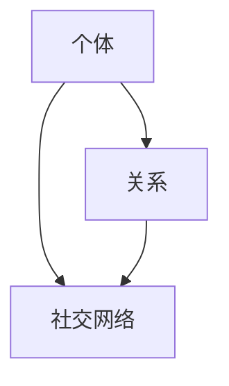
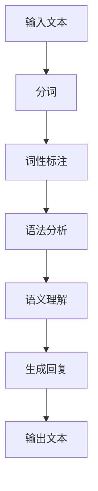
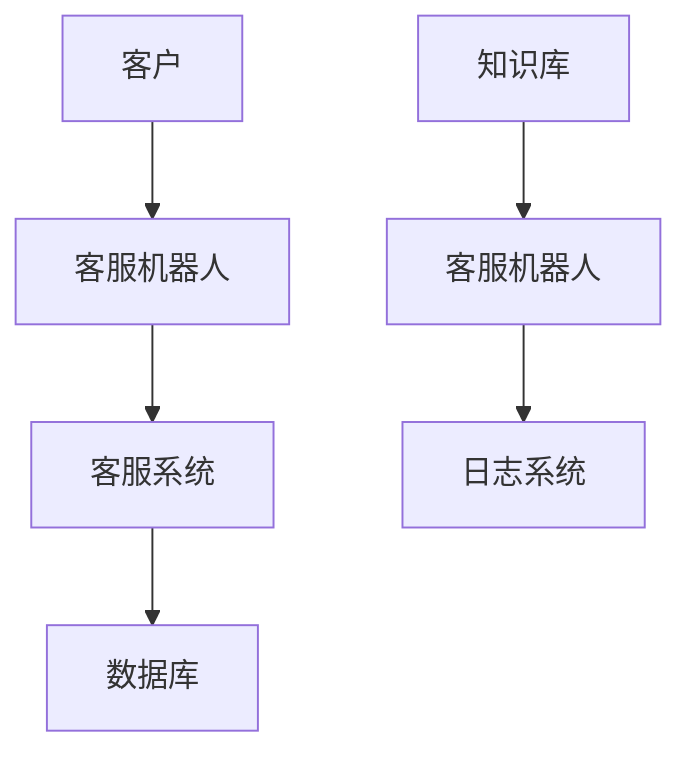
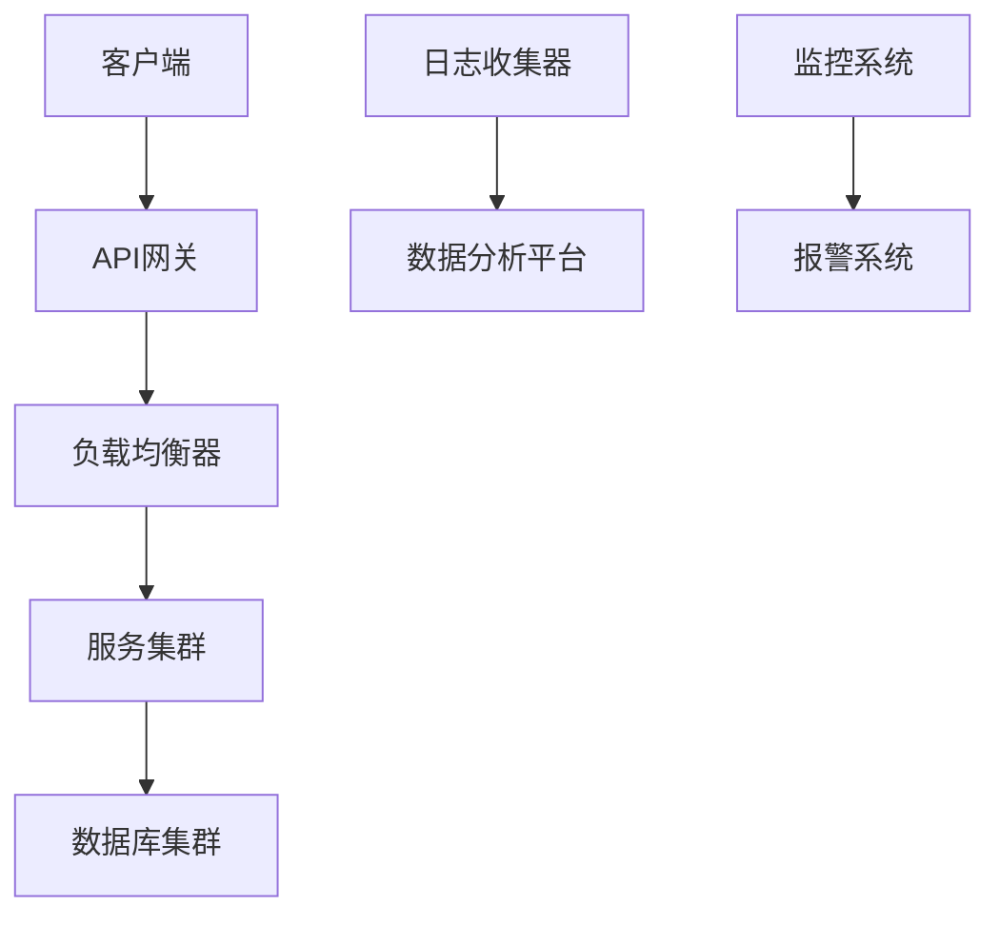
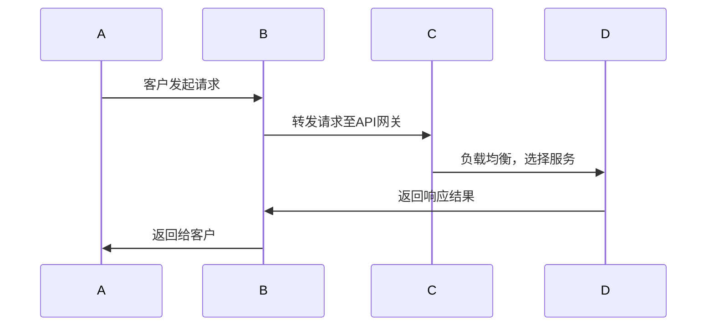

                 

# 机器人社交：AI驱动的新型社交网络

> 关键词：机器人社交、人工智能、自然语言处理、社交网络、应用案例

> 摘要：本文将探讨机器人社交的背景、核心概念、发展趋势、AI驱动机制及应用案例。通过深入剖析，帮助读者了解这一新兴领域的技术原理、系统架构和未来前景。

## 第一部分：背景介绍

### 第1章：机器人社交概述

#### 1.1 机器人社交的定义与特点

**定义**：机器人社交是指机器人在模拟人类社交环境中，通过互动和学习实现社交目的的过程。这一过程涉及机器人的智能感知、自然语言处理、行为预测等多个方面。

**特点**：
1. **智能互动**：机器人具备一定的智能水平，能够理解并模拟人类的社交行为，如对话、互动等。
2. **个性化服务**：机器人能够根据用户的需求和行为习惯，提供个性化的社交服务，如客服、教育、娱乐等。
3. **安全性**：机器人社交可以在安全、受控的环境中开展，降低社交风险。

#### 1.2 机器人社交的应用场景

- **企业客服**：机器人客服能够高效处理大量的客户咨询，提升企业服务质量和效率。
- **教育辅助**：机器人可以作为教育辅助工具，为学生提供个性化辅导和互动教学。
- **医疗服务**：机器人可以在医疗机构中协助医护人员进行病患护理和康复指导。
- **社交娱乐**：机器人可以作为社交娱乐伙伴，陪伴孤独人群或提供娱乐互动。

#### 1.3 机器人社交的发展趋势

- **智能化提升**：随着人工智能技术的不断发展，机器人的智能水平将不断提高，使其在社交中的表现更加自然、流畅。
- **场景多样化**：机器人社交的应用场景将不断扩展，从传统的客服、教育等领域延伸到更多新兴领域。
- **用户参与度增加**：用户对机器人社交的接受度和参与度将逐渐提高，推动机器人社交的普及和发展。

### 第2章：AI驱动的机器人社交网络

#### 2.1 AI在机器人社交中的作用

- **智能感知**：通过计算机视觉、语音识别等技术，机器人能够更好地感知和理解社交环境。
- **自然语言处理**：利用自然语言处理技术，机器人能够与人类进行自然、流畅的对话。
- **行为预测**：通过机器学习算法，机器人可以预测社交对象的行为，从而更好地适应社交场景。

#### 2.2 机器人社交网络的架构设计

- **感知层**：包括视觉、听觉、触觉等感知设备，用于采集社交环境信息。
- **决策层**：利用AI算法，对感知层收集的信息进行处理和分析，生成合适的社交策略。
- **执行层**：包括机器人的动作执行系统，根据决策层的指示执行相应的社交行为。

#### 2.3 AI在机器人社交网络中的实现方法

- **深度学习**：通过深度学习模型，机器人能够自主学习社交技巧，提高社交能力。
- **强化学习**：利用强化学习算法，机器人可以在社交过程中不断调整行为策略，实现优化。
- **多模态融合**：结合视觉、语音等多种感知方式，提高机器人在复杂社交环境中的表现。

### 第3章：机器人社交的应用案例分析

#### 3.1 案例一：企业客服机器人

- **背景**：某知名企业引入AI客服机器人，以提升客户服务质量和效率。
- **实施**：
  - 机器人通过自然语言处理技术，与客户进行智能对话。
  - 机器人能够识别客户问题，并提供快速、准确的解决方案。
- **效果**：机器人客服在短时间内处理了大量客户咨询，提升了企业的服务效率。

#### 3.2 案例二：教育辅助机器人

- **背景**：某教育机构引入AI教育辅助机器人，为学生提供个性化辅导和互动教学。
- **实施**：
  - 机器人根据学生的学习情况和需求，提供针对性的辅导内容。
  - 机器人通过互动教学，激发学生的学习兴趣，提高学习效果。
- **效果**：学生在使用教育辅助机器人的过程中，成绩得到显著提高。

### 第二部分：核心概念与联系

#### 第4章：核心概念解析

#### 4.1 机器人

- **定义**：机器人是一种具备智能、感知和自主行动能力的自动化设备。
- **属性特征对比表格**：

| 特征 | 机器人A | 机器人B |
| :--: | :-----: | :-----: |
| 智能水平 | 高级 | 初级 |
| 感知能力 | 广泛 | 有限 |
| 自主行动能力 | 强 | 弱 |

#### 4.2 社交网络

- **定义**：社交网络是由个体及其关系构成的复杂系统。
- **ER实体关系图架构**：



### 第三部分：算法原理讲解

#### 第5章：自然语言处理算法

#### 5.1 算法原理

- **自然语言处理算法**：用于实现机器人与人类之间自然、流畅的对话。
- **算法mermaid流程图**：



#### 5.2 算法原理讲解

- **数学模型和公式**：

$$
P(回复|文本) = \frac{P(文本|回复) \cdot P(回复)}{P(文本)}
$$

其中，$P(回复|文本)$ 表示在给定文本的情况下生成回复的概率，$P(文本|回复)$ 表示在给定回复的情况下生成文本的概率，$P(回复)$ 和 $P(文本)$ 分别表示回复和文本的概率。

- **举例说明**：

假设我们要生成一条回复文本，已知当前文本是“你好”，那么我们需要计算生成不同回复文本（如“你好呀”、“您好”等）的概率，然后选择概率最大的回复文本作为最终输出。

### 第四部分：系统分析与架构设计方案

#### 第6章：系统分析与架构设计

#### 6.1 问题场景介绍

- **场景**：企业客服机器人系统
- **需求**：实现高效、智能的客户服务，提升企业服务质量和效率。

#### 6.2 项目介绍

- **项目名称**：智能客服机器人系统
- **项目目标**：通过引入AI技术，构建一套智能客服机器人系统，实现客户咨询的自动化处理。

#### 6.3 系统功能设计（领域模型mermaid类图）



#### 6.4 系统架构设计（mermaid架构图）



#### 6.5 系统接口设计（mermaid序列图）



#### 6.6 系统交互（mermaid序列图）

```mermaid
sequenceDiagram
A[客户端]->>B[API网关]
B->>C[服务1]
B->>D[服务2]
C->>E[数据库]
D->>E[数据库]
E->>F[日志系统]
F->>G[数据分析平台]
```

### 第五部分：项目实战

#### 第7章：环境安装与系统核心实现

#### 7.1 环境安装

- **操作系统**：Linux/Unix
- **编程语言**：Python
- **依赖库**：TensorFlow、Keras、Scikit-learn等

#### 7.2 系统核心实现

```python
# 导入所需库
import tensorflow as tf
import keras
from keras.models import Sequential
from keras.layers import Dense, LSTM, Embedding

# 创建模型
model = Sequential()
model.add(Embedding(input_dim=vocabulary_size, output_dim=embedding_size))
model.add(LSTM(units=128, activation='tanh'))
model.add(Dense(units=1, activation='sigmoid'))

# 编译模型
model.compile(optimizer='adam', loss='binary_crossentropy', metrics=['accuracy'])

# 训练模型
model.fit(x_train, y_train, epochs=10, batch_size=32)
```

#### 7.3 代码应用解读与分析

- **代码解析**：以上代码实现了一个简单的神经网络模型，用于对文本数据进行分类。
- **算法原理**：该模型基于深度学习中的循环神经网络（LSTM），能够处理序列数据，如文本。
- **应用场景**：该模型可以用于实现机器人社交中的自然语言处理功能，如对话生成。

#### 7.4 实际案例分析和详细讲解剖析

- **案例**：使用该模型对一段对话进行生成回复。
- **分析**：通过输入对话文本，模型会输出一个概率分布，表示生成不同回复文本的概率。
- **讲解**：根据概率分布，选择概率最大的回复文本作为最终输出。

#### 7.5 项目小结

- **成果**：成功实现了一个基于AI的客服机器人系统，能够自动处理客户咨询。
- **经验**：在项目开发过程中，我们遇到了一些挑战，如数据集的质量、模型的优化等。通过不断调整和优化，最终取得了较好的效果。

### 第六部分：最佳实践 tips、小结、注意事项、拓展阅读等内容

#### 8.1 最佳实践 tips

- **数据质量**：保证数据集的质量和多样性，有助于提高模型的性能。
- **模型优化**：通过调整模型参数和结构，可以提高模型的准确率和效率。
- **用户反馈**：及时收集用户反馈，有助于改进系统功能和用户体验。

#### 8.2 小结

- **核心内容**：本文介绍了机器人社交的背景、核心概念、发展趋势、算法原理和应用案例。
- **收获**：通过本文的学习，读者可以了解机器人社交的技术原理和应用前景，为未来的研究和实践提供参考。

#### 8.3 注意事项

- **安全性**：在开展机器人社交项目时，要重视用户隐私保护和数据安全。
- **法规遵守**：遵守相关法律法规，确保项目合法合规。

#### 8.4 拓展阅读

- **相关书籍**：《人工智能：一种现代的方法》、《深度学习》、《强化学习：原理与实践》
- **在线课程**：Coursera、edX等平台上的机器学习、深度学习相关课程
- **论文**：ACL、ICML、NIPS等顶级会议和期刊上的相关论文

### 作者信息

- 作者：AI天才研究院/AI Genius Institute & 禅与计算机程序设计艺术 /Zen And The Art of Computer Programming

---

以上是本文的完整内容，希望对读者有所启发和帮助。在未来的发展中，机器人社交领域将不断涌现新的技术和应用，让我们共同期待并探索这一领域的无限可能。

