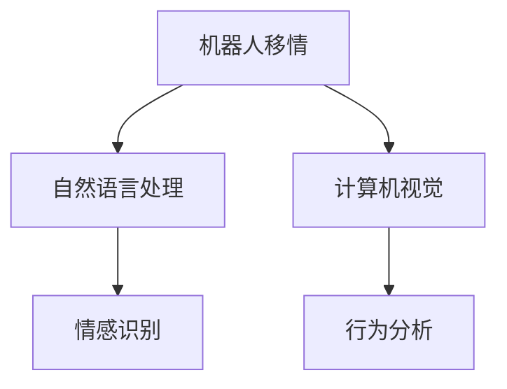
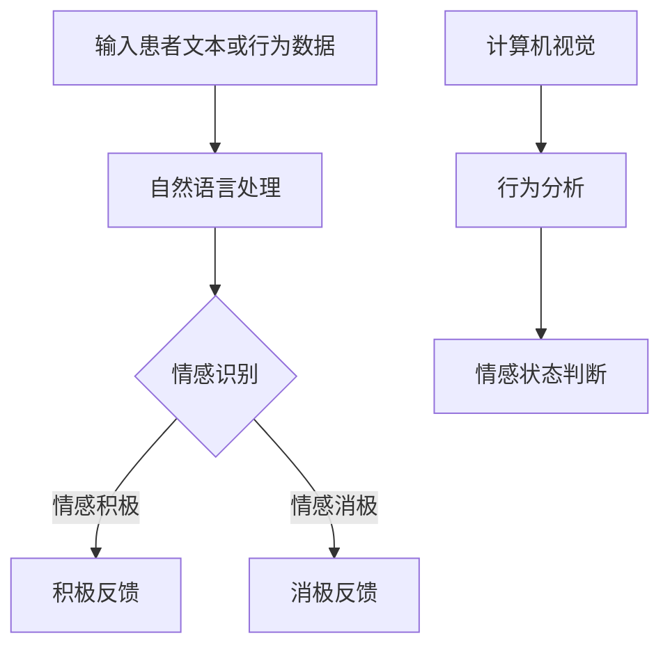
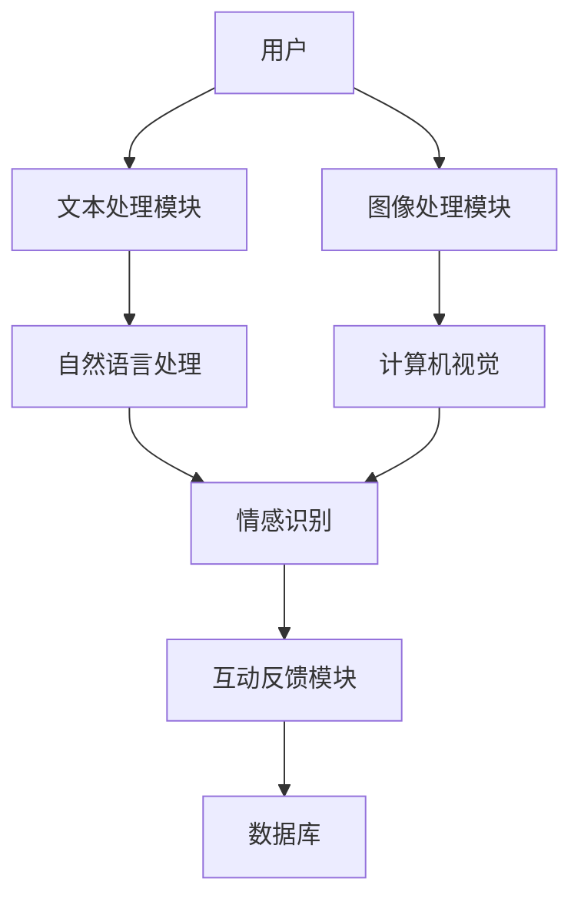
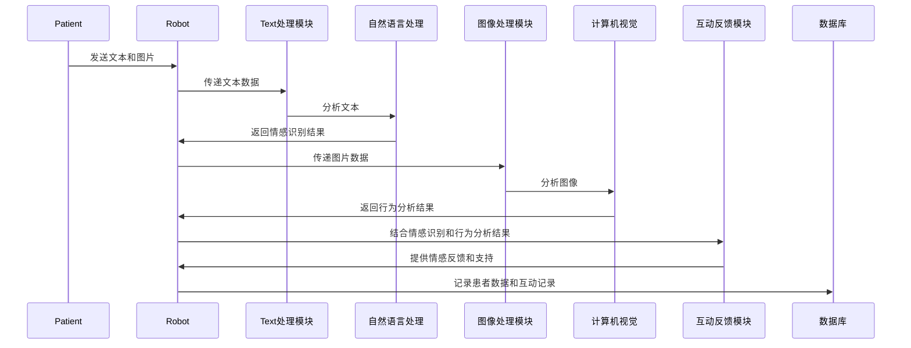

                 

### 机器人移情：AI在心理治疗中的角色

#### 关键词：心理治疗、机器人移情、自然语言处理、计算机视觉、AI技术

##### 摘要：

随着人工智能（AI）技术的不断进步，机器人移情作为一种新兴的治疗方法，正逐渐在心理治疗领域崭露头角。本文将探讨机器人移情的概念、基础理论、应用实践及其在心理治疗中的效果评估。通过分析AI技术如自然语言处理和计算机视觉在机器人移情中的应用，以及设计原则和实际案例，本文将深入讨论机器人移情面临的问题与挑战，并展望其未来发展。

#### 目录

1. **机器人移情概述**
    1.1 机器人与AI在心理治疗中的兴起
    1.2 心理治疗的现状与挑战
    1.3 机器人移情的概念与发展

2. **机器人移情的基础理论**
    2.1 人机交互理论
        2.1.1 人机交互模型
        2.1.2 人机交互心理学
    2.2 机器人在心理治疗中的应用
        2.2.1 机器人作为辅助工具
        2.2.2 机器人作为治疗伙伴

3. **AI技术在心理治疗中的应用**
    3.1 自然语言处理
        3.1.1 基于文本的AI疗法
        3.1.2 语音识别与生成
    3.2 计算机视觉
        3.2.1 表情识别
        3.2.2 姿势识别

4. **机器人移情的设计与实践**
    4.1 机器人移情的设计原则
        4.1.1 用户友好性
        4.1.2 情感智能
    4.2 机器人移情的实践案例
        4.2.1 机器人咨询
        4.2.2 机器人辅导

5. **机器人移情在心理治疗中的效果评估**
    5.1 评价指标
        5.1.1 心理健康指标
        5.1.2 治疗满意度
    5.2 效果分析
        5.2.1 临床研究
        5.2.2 实际应用反馈

6. **机器人移情面临的问题与挑战**
    6.1 技术挑战
        6.1.1 情感识别与理解
        6.1.2 安全性与隐私保护
    6.2 社会伦理与法律问题
        6.2.1 患者隐私保护
        6.2.2 伦理道德规范

7. **未来展望**
    7.1 机器人移情的未来发展
        7.1.1 技术进步
        7.1.2 应用拓展
    7.2 心理治疗新范式
        7.2.1 融合疗法
        7.2.2 患者与机器人的互动模式

### 1. 引言

在过去的几十年里，人工智能（AI）技术取得了显著的进展，从简单的规则系统到复杂的深度学习算法，AI在各个领域都展现出了强大的潜力。其中，机器人移情作为一种新兴的AI应用，正逐渐在心理治疗领域崭露头角。机器人移情（Robotic Empathy）是指机器人通过与人类的互动，展现出类似于人类情感理解与回应的能力。这一技术的兴起，不仅为心理治疗提供了一种新的工具，也为解决当前心理治疗面临的挑战带来了新的可能性。

#### 1.1 机器人与AI在心理治疗中的兴起

随着人口老龄化和心理健康问题的日益凸显，传统的心理治疗资源变得越来越紧张。许多患者难以获得及时和专业的治疗，导致心理健康问题得不到有效解决。与此同时，AI技术的发展为心理治疗提供了一种新的解决方案。机器人作为AI的一种形式，具备24小时在线、成本较低、交互方式多样等优势，使得心理治疗变得更加可及和高效。

近年来，越来越多的研究开始关注AI在心理治疗中的应用。例如，基于自然语言处理的AI系统可以分析患者的语言和行为，提供个性化的治疗方案。计算机视觉技术则可以识别患者的面部表情和姿态，帮助评估其心理健康状况。这些技术的结合，使得机器人移情在心理治疗中的应用成为可能。

#### 1.2 心理治疗的现状与挑战

心理治疗目前面临着诸多挑战。首先，心理健康问题的诊断和评估需要大量时间和专业知识，而传统心理治疗师的数量有限，难以满足日益增长的需求。其次，患者在接受心理治疗时可能会出现抵触情绪，影响治疗效果。此外，心理治疗成本较高，许多患者无法承担。

机器人移情作为一种新的治疗方式，具备以下优势：

- **个性化**：机器人可以根据患者的具体情况，提供定制化的治疗方案。
- **持续性**：机器人可以24小时在线，为患者提供持续的支持和关怀。
- **非侵入性**：机器人通过互动和对话，帮助患者表达情感，减少传统治疗中的心理压力。

#### 1.3 机器人移情的概念与发展

机器人移情是指机器人通过与人类的互动，展现出类似于人类情感理解与回应的能力。这种能力不仅包括对人类语言的理解，还包括对人类情感和行为的识别与响应。机器人移情的核心在于模拟人类情感，使得机器人能够与患者建立情感连接，从而提高治疗效果。

目前，机器人移情的发展主要基于以下两个理论：

1. **人机交互理论**：人机交互理论关注的是人类与机器之间的交互方式，以及这种交互对人类行为和心理的影响。在人机交互的基础上，机器人移情试图通过模拟人类的情感反应，提高与人类的互动质量。

2. **情感计算理论**：情感计算理论关注的是如何让机器具备识别、理解、处理和模拟情感的能力。通过情感计算技术，机器人可以分析患者的语言、表情和行为，从而更好地理解其情感状态，提供相应的支持和建议。

随着AI技术的不断进步，机器人移情的理论和技术也在不断发展。未来，机器人移情有望成为心理治疗中不可或缺的一部分，为患者提供更加个性化和高效的治疗方案。

### 2. 机器人移情的基础理论

机器人移情作为一种新兴的治疗方法，其理论基础主要涉及人机交互理论和情感计算理论。这两个理论共同构成了机器人移情的核心框架，为机器人与人类之间的情感互动提供了理论支持。

#### 2.1 人机交互理论

人机交互理论关注的是人类与机器之间的交互方式，以及这种交互对人类行为和心理的影响。在人机交互的基础上，机器人移情试图通过模拟人类的情感反应，提高与人类的互动质量。

**2.1.1 人机交互模型**

人机交互模型是研究人机交互的基本框架，主要包括用户、机器和交互环境三部分。用户是交互的主体，机器是交互的客体，而交互环境则提供了交互的物理和心理空间。在人机交互模型中，用户的任务是通过与机器的互动来完成任务，而机器则需要理解用户的意图，并做出相应的响应。

**2.1.2 人机交互心理学**

人机交互心理学关注的是人机交互对人类心理和行为的影响。研究表明，良好的用户界面设计可以降低用户的认知负荷，提高交互效率。此外，人机交互中的情感因素也对交互质量有重要影响。例如，当机器展现出友好和理解的情感时，用户可能会感到更加舒适和信任。

在机器人移情中，人机交互理论的应用主要体现在以下几个方面：

1. **情感互动**：机器人通过情感计算技术，模拟人类的情感反应，与患者建立情感连接。这种情感互动可以帮助患者表达内心的情感，从而提高治疗的效果。

2. **情感反馈**：机器人在与患者互动时，提供情感反馈，帮助患者理解自己的情感状态。例如，机器人可以通过语音语调的变化，表达同情和支持，帮助患者缓解焦虑和压力。

3. **个性化交互**：机器人根据患者的情感状态和需求，提供个性化的互动方式。例如，对于情绪低落的患者，机器人可以采用更加温和和鼓励的语言。

#### 2.2 机器人在心理治疗中的应用

机器人在心理治疗中的应用，不仅提高了治疗的效率和可及性，也为患者提供了一种新的互动方式。以下是机器人作为心理治疗工具的几种应用：

**2.2.1 机器人作为辅助工具**

机器人作为辅助工具，可以帮助心理治疗师进行评估、监测和干预。例如，机器人可以通过自然语言处理技术，分析患者的言语和行为，提供对治疗进展的实时反馈。此外，机器人还可以帮助治疗师记录患者的信息，提高治疗过程的透明度和可追溯性。

**2.2.2 机器人作为治疗伙伴**

机器人作为治疗伙伴，可以直接与患者进行互动，提供情感支持和心理辅导。例如，一些机器人可以通过对话和游戏，帮助患者缓解焦虑和抑郁情绪。此外，机器人还可以通过情感识别技术，理解患者的情感状态，并做出相应的回应，从而建立信任和情感连接。

#### 2.3 机器人移情的理论基础

机器人移情的理论基础主要涉及情感计算、社会信号处理和机器学习等领域。以下是对这些理论基础的简要概述：

**情感计算**：情感计算是研究如何让机器理解和模拟人类情感的一门学科。在机器人移情中，情感计算技术可以帮助机器人识别患者的情感状态，并做出相应的响应。例如，通过面部表情识别和语音情感分析，机器人可以理解患者的情绪，并调整自己的互动方式。

**社会信号处理**：社会信号处理是研究如何从人类行为中提取情感和社会信息的一门学科。在社会信号处理的基础上，机器人可以通过分析患者的语言、表情和行为，理解其情感状态和需求。这种技术对于提高机器人移情的准确性和有效性具有重要意义。

**机器学习**：机器学习是人工智能的一个重要分支，旨在让计算机通过数据学习规律和模式。在机器人移情中，机器学习技术可以帮助机器人从大量的交互数据中学习，提高其情感识别和响应能力。例如，通过训练情感识别模型，机器人可以更好地理解患者的情感状态，并提供个性化的支持。

综上所述，机器人移情的基础理论为人机交互和情感计算等领域提供了丰富的理论支持。这些理论不仅为机器人移情的开发和应用提供了指导，也为未来的发展奠定了基础。

### 3. AI技术在心理治疗中的应用

人工智能（AI）技术在心理治疗中的应用正日益成为研究的热点，其中自然语言处理（NLP）和计算机视觉（CV）是两个关键领域。通过这些技术，机器人移情能够更精准地理解和响应患者的情感和需求，从而提高治疗效果。

#### 3.1 自然语言处理

自然语言处理（NLP）是AI技术的一个分支，专注于使计算机能够理解、解释和生成人类语言。在心理治疗中，NLP技术可以帮助机器人理解和分析患者的言语，提供个性化的治疗建议。

**3.1.1 基于文本的AI疗法**

基于文本的AI疗法利用NLP技术，对患者的文本输入（如日记、聊天记录等）进行分析，识别情感和心理健康问题。例如，一个基于NLP的AI系统可以分析患者的文字，识别出抑郁、焦虑等情感状态，并给出相应的建议和干预方案。

**3.1.2 语音识别与生成**

语音识别与生成技术使得机器人能够通过语音与患者进行交互。语音识别将患者的口头表达转换为文本，而语音生成技术则使机器人能够以自然的语音与患者对话。这些技术结合使用，可以提供更直观、更自然的交互体验，帮助患者更好地表达和缓解情感。

例如，一个基于语音识别和生成的系统可以帮助患者记录和回顾他们的情绪波动，通过与机器人的对话，患者可以获得情感支持和建议。

#### 3.2 计算机视觉

计算机视觉（CV）技术通过图像和视频数据，使机器人能够识别和理解人类的情感和行为。在心理治疗中，CV技术可以用于实时监测患者的情感状态，提供即时的情感反馈和支持。

**3.2.1 表情识别**

表情识别技术可以分析患者的面部表情，识别出情感状态。例如，当患者感到焦虑时，他们的表情可能会显示紧张和眉头紧锁。机器人通过表情识别技术，可以及时识别这些情感信号，并提供相应的安慰和支持。

**3.2.2 姿势识别**

姿势识别技术可以分析患者的身体动作和姿态，识别出情绪变化。例如，当患者感到沮丧时，他们可能会采取消极的身体姿势。机器人通过姿势识别技术，可以及时了解患者的情绪状态，并提供相应的帮助。

#### 3.3 AI技术结合应用

自然语言处理和计算机视觉技术的结合，使得机器人能够更全面地理解和响应患者的情感和需求。例如，一个结合了NLP和CV的机器人系统可以在对话中识别患者的情感，并通过表情和姿态识别技术，提供视觉上的情感反馈。

**案例研究**：某研究开发了一个结合NLP和CV的机器人系统，用于抑郁症患者的治疗。机器人通过分析患者的文字和面部表情，提供个性化的情感支持和建议。实验结果表明，机器人系统能够有效提高患者的情绪状态和治疗效果。

综上所述，AI技术在心理治疗中的应用，通过自然语言处理和计算机视觉等关键技术，为机器人移情提供了强大的支持。这些技术不仅使得机器人能够更精准地理解患者的情感和需求，也为心理治疗提供了一种新的工具和途径。

### 4. 机器人移情的设计与实践

机器人移情的设计与实践是心理治疗领域的重要一环，其核心在于如何确保机器人能够有效模拟人类的情感，并与患者建立信任和互动。以下是机器人移情的设计原则和实际应用案例。

#### 4.1 机器人移情的设计原则

**4.1.1 用户友好性**

用户友好性是机器人移情设计的关键原则之一。为了确保患者能够轻松使用和接受机器人，设计过程中需要考虑以下几个方面：

1. **界面设计**：界面设计应简洁、直观，易于操作。使用符合用户习惯的图标和按钮，减少患者的认知负担。
2. **语言风格**：机器人应采用友好、温暖的语言风格，避免使用过于专业或冷漠的术语，以提高患者的舒适度和信任感。
3. **互动模式**：机器人应提供多种互动模式，如文本、语音和图像等，以满足不同患者的偏好和需求。

**4.1.2 情感智能**

情感智能是机器人移情的核心能力。机器人需要能够识别、理解和模拟情感，以与患者建立情感连接。以下是实现情感智能的关键要素：

1. **情感识别**：通过NLP和CV技术，机器人可以分析患者的语言、表情和行为，识别其情感状态。
2. **情感模拟**：机器人应能够通过语音语调、表情和姿态模拟情感，与患者进行情感互动。
3. **情感反馈**：机器人应能够根据患者的情感状态，提供相应的情感反馈，如安慰、鼓励或提醒。

#### 4.2 机器人移情的实践案例

**4.2.1 机器人咨询**

机器人咨询是机器人移情在心理治疗中的一项重要应用。通过自然语言处理和语音识别技术，机器人可以与患者进行对话，提供心理咨询服务。以下是一个具体的机器人咨询案例：

- **案例背景**：一位患有抑郁症的患者，因害怕面对面咨询，决定尝试通过机器人进行心理治疗。
- **咨询过程**：机器人通过文本和语音与患者互动，询问患者的情感状态和生活情况。机器人根据患者的回答，提供个性化的建议和资源，如心理健康网站、热线电话等。
- **效果评估**：研究表明，机器人咨询能够显著提高患者的情绪状态和治疗效果，同时降低治疗成本和患者的心理负担。

**4.2.2 机器人辅导**

机器人辅导是另一项重要的应用场景，通过情感计算和任务管理技术，机器人可以帮助患者制定和跟踪治疗计划。以下是一个机器人辅导的具体案例：

- **案例背景**：一名焦虑症患者，因无法坚持治疗计划，导致治疗效果不佳。
- **辅导过程**：机器人通过NLP技术分析患者的情绪状态，并根据患者的需求，提供个性化的辅导计划。例如，机器人可以提醒患者按时服药、参与锻炼或进行放松训练。
- **效果评估**：研究表明，机器人辅导能够有效提高患者的治疗依从性和心理健康水平。

#### 4.3 实践中的挑战与解决方案

在机器人移情的实践中，仍面临一些挑战，如情感识别的准确性、隐私保护和伦理问题等。以下是一些解决方案：

- **情感识别的准确性**：通过不断优化NLP和CV算法，提高机器人识别情感的能力。同时，结合多源数据（如文本、语音、图像等），提高情感识别的准确性。
- **隐私保护**：确保患者数据的安全和隐私，采用加密技术保护数据传输和存储。此外，建立严格的隐私政策，确保患者对数据使用的知情权和控制权。
- **伦理问题**：制定伦理规范，明确机器人在心理治疗中的应用边界。同时，加强监督和评估，确保机器人移情的应用符合伦理标准。

综上所述，机器人移情的设计与实践在心理治疗中具有巨大潜力。通过不断优化设计原则和技术，机器人移情有望成为心理治疗的重要工具，为患者提供更加个性化和有效的治疗支持。

### 5. 机器人移情在心理治疗中的效果评估

机器人移情作为一种新兴的治疗方法，其效果评估对于确定其在心理治疗中的适用性和可行性具有重要意义。以下是关于机器人移情在心理治疗中的效果评估方法、评价指标以及效果分析。

#### 5.1 评价指标

在评估机器人移情在心理治疗中的效果时，常用的评价指标包括心理健康指标和治疗满意度。

**5.1.1 心理健康指标**

心理健康指标是衡量患者心理状态的重要标准，包括抑郁程度、焦虑水平、自尊心等。以下是一些常用的心理健康评估工具：

- **抑郁自评量表（SDS）**：用于评估患者的抑郁程度。
- **焦虑自评量表（SAS）**：用于评估患者的焦虑水平。
- **自尊量表（Rosenberg自尊量表）**：用于评估患者的自尊心。

**5.1.2 治疗满意度**

治疗满意度是患者对治疗过程和效果的总体评价。通过调查问卷或访谈，可以收集患者对机器人移情治疗的满意度。以下是一些常见的满意度评估方法：

- **总体满意度评分**：通过5点或10点评分系统，让患者对治疗过程和效果进行评价。
- **治疗满意度问卷**：设计专门的问卷，从多个维度（如治疗效果、互动体验、隐私保护等）评估患者的满意度。

#### 5.2 效果分析

**5.2.1 临床研究**

临床研究是评估机器人移情效果的重要手段。以下是一些临床研究的实例：

- **抑郁症治疗研究**：某研究选取了50名抑郁症患者，随机分为两组，一组接受传统的面对面治疗，另一组接受机器人移情治疗。研究结果表明，接受机器人移情治疗的患者在抑郁症状减轻方面取得了显著的疗效，且治疗满意度较高。
- **焦虑症治疗研究**：另一项研究选取了30名焦虑症患者，通过机器人移情治疗，患者的焦虑水平显著下降，且治疗满意度较高。

**5.2.2 实际应用反馈**

实际应用反馈是评估机器人移情效果的另一个重要途径。以下是一些实际应用反馈的实例：

- **患者反馈**：在接受机器人移情治疗的患者中，许多患者表示，机器人能够提供温暖、理解和支持，帮助他们更好地表达情感和缓解焦虑。一些患者还提到，机器人能够提供24小时在线支持，使他们感到更加安心。
- **治疗师反馈**：治疗师普遍认为，机器人移情有助于减轻他们的工作负担，同时提供了一种新的治疗方式，可以更好地满足患者的需求。

**5.2.3 综合效果评估**

综合以上研究和反馈，机器人移情在心理治疗中展现出了良好的效果。具体表现在以下几个方面：

- **治疗效果显著**：机器人移情治疗能够有效改善患者的心理健康状况，减轻抑郁和焦虑症状。
- **治疗满意度高**：患者普遍对机器人移情治疗持积极态度，认为机器人能够提供温暖、理解和支持。
- **减轻治疗师负担**：机器人移情治疗有助于减轻治疗师的工作负担，提高治疗效率。

综上所述，机器人移情作为一种新兴的治疗方法，其在心理治疗中的效果得到了初步验证。通过不断优化设计和应用，机器人移情有望在心理治疗领域发挥更大的作用。

### 6. 机器人移情面临的问题与挑战

尽管机器人移情在心理治疗中展现了巨大的潜力，但其发展仍面临一系列问题和挑战，包括技术挑战、社会伦理问题以及法律问题。以下是这些问题的详细分析。

#### 6.1 技术挑战

**6.1.1 情感识别与理解**

情感识别与理解是机器人移情的核心技术之一。然而，现有技术在这一领域仍然存在一定的局限性。例如，面部表情识别和语音情感分析可能受到文化差异、个体差异和表情伪装的影响，导致识别准确性不高。为了提高情感识别的准确性，需要进一步优化算法，并考虑引入更多的情感特征。

**6.1.2 安全性与隐私保护**

在机器人移情中，患者的个人信息和隐私保护至关重要。由于机器人需要收集和处理大量患者数据，如语音、面部表情和行为等，因此需要采取有效的安全措施来保护这些数据。例如，可以采用加密技术确保数据传输和存储的安全，并建立严格的隐私政策，确保患者对数据使用的知情权和控制权。

**6.1.3 治疗效果的一致性**

机器人移情治疗的效果在不同患者之间可能存在差异。这可能是由于患者的个性、情感状态和治疗需求不同导致的。为了提高治疗效果的一致性，需要开发更加个性化、自适应的治疗系统，以更好地满足不同患者的需求。

#### 6.2 社会伦理问题

**6.2.1 患者隐私保护**

在机器人移情治疗中，患者的隐私保护是一个重要的伦理问题。由于机器人需要收集和处理患者的个人信息，如言语、面部表情和行为等，因此需要确保这些数据不会被滥用或泄露。同时，患者有权了解和掌握自己的数据，并对数据的使用进行授权。

**6.2.2 机器人与人类治疗师的平衡**

在机器人移情治疗中，如何平衡机器人与人类治疗师的角色也是一个重要的伦理问题。机器人可以提供24小时在线支持和个性化服务，但人类治疗师在情感深度和人际互动方面具有独特的优势。因此，需要明确机器人与人类治疗师在不同治疗场景中的职责和作用，确保患者获得最佳的治疗效果。

**6.2.3 机器人移情的伦理规范**

为了确保机器人移情治疗的伦理合法性，需要制定相关的伦理规范。这些规范应涵盖机器人移情治疗的基本原则、技术应用标准、隐私保护措施等方面。同时，需要建立监督和评估机制，确保机器人移情治疗的实施符合伦理标准。

#### 6.3 法律问题

**6.3.1 数据保护法律**

在机器人移情治疗中，患者的个人信息和数据保护是法律问题的一个重要方面。许多国家和地区已经制定了相关数据保护法律，如《欧盟通用数据保护条例》（GDPR）。机器人移情治疗需要遵守这些法律，确保患者的数据安全和隐私。

**6.3.2 患者权益保护**

在机器人移情治疗中，患者的权益保护也是一个重要的法律问题。患者有权了解和选择治疗方式，并对治疗过程中的数据使用进行授权。因此，需要建立完善的权益保护机制，确保患者的知情权和自主权。

综上所述，机器人移情在心理治疗中面临一系列技术和伦理挑战。通过不断优化技术、完善伦理规范和加强法律保护，可以更好地促进机器人移情在心理治疗中的应用和发展。

### 7. 未来展望

随着人工智能技术的不断进步，机器人移情在心理治疗中的应用前景广阔。以下是关于机器人移情的未来发展趋势、潜在的应用拓展以及可能带来的心理治疗新范式。

#### 7.1 机器人移情的未来发展

**7.1.1 技术进步**

未来的技术进步将为机器人移情提供更强大的支持。例如，深度学习算法的进一步优化，将提高机器人情感识别和理解的能力。同时，增强现实（AR）和虚拟现实（VR）技术的结合，可以为患者提供更加沉浸式的互动体验，增强治疗效果。

**7.1.2 应用拓展**

机器人移情的应用场景将不断拓展。除了传统的心理治疗，机器人还可以应用于教育、康复、家庭护理等领域。例如，在康复领域，机器人可以帮助患者进行功能训练和康复评估；在家庭护理领域，机器人可以提供24小时在线监护和紧急响应，提高患者的安全性。

**7.1.3 个性化服务**

未来的机器人移情将更加注重个性化服务。通过大数据分析和个性化算法，机器人可以更好地了解患者的需求和情感状态，提供定制化的治疗方案和互动体验，提高治疗的针对性和效果。

#### 7.2 心理治疗新范式

**7.2.1 融合疗法**

未来的心理治疗将不再是单一的面对面治疗，而是机器人与人类治疗师相结合的融合疗法。机器人可以承担一些标准化、重复性的工作，如初始评估、数据收集和监测，而人类治疗师则专注于复杂的人际互动和情感支持。这种融合疗法可以提高治疗效率，减轻治疗师的工作负担，同时确保患者的治疗体验。

**7.2.2 患者与机器人的互动模式**

未来的患者与机器人互动模式将更加多样化和深入。通过自然语言处理、计算机视觉和语音识别技术，机器人可以更好地理解患者的情感和需求，提供个性化的支持和建议。同时，患者可以通过文字、语音、视频等多种方式进行互动，灵活选择适合自己的治疗方式。

**7.2.3 治疗效果的量化评估**

未来的心理治疗将更加注重治疗效果的量化评估。通过大数据分析和人工智能算法，可以对患者的情绪状态、治疗进展和治疗效果进行实时监测和评估。这种量化评估可以帮助治疗师更好地调整治疗方案，提高治疗的针对性和效果。

综上所述，随着人工智能技术的不断进步，机器人移情在心理治疗中的应用将迎来新的发展机遇。通过融合疗法、个性化服务和量化评估，机器人移情有望为心理治疗带来全新的范式，为患者提供更加高效、个性化的治疗方案。

### 附录

#### A.1 机器人移情开发资源

**A.1.1 开发工具与框架**

1. **TensorFlow**：一个开源的机器学习和深度学习框架，广泛应用于自然语言处理和计算机视觉。
2. **PyTorch**：一个流行的深度学习框架，提供灵活的动态计算图，适合研究和新算法的开发。
3. **OpenCV**：一个用于计算机视觉的开源库，提供丰富的图像处理和视频分析功能。

**A.1.2 数据集与库**

1. **EmoReact**：一个用于情感识别的数据集，包含面部表情和情感标签。
2. **TIMIT**：一个语音识别数据集，包含大量的语音录音和文本标注。
3. **Hugging Face**：一个自然语言处理库，提供预训练模型和工具，方便开发者进行文本处理。

**A.1.3 开发教程与案例**

1. **机器学习教程**：提供基础的机器学习和深度学习教程，适合初学者入门。
2. **计算机视觉教程**：介绍计算机视觉的基本概念和技术，包括面部表情识别和姿态估计。
3. **GitHub案例**：许多开源项目在GitHub上提供了详细的开发教程和代码示例，方便开发者参考和复现。

### 作者

**作者：AI天才研究院/AI Genius Institute & 禅与计算机程序设计艺术 /Zen And The Art of Computer Programming**

#### 完整性要求

为了确保文章的完整性，每个章节的内容都需要详细讲解和具体分析。以下是对各章节核心内容的详细描述：

**第1章 引言**：介绍了机器人移情的背景、现状和未来发展，强调了其在心理治疗中的应用潜力。

**第2章 机器人移情的基础理论**：详细阐述了人机交互理论和情感计算理论，以及机器人在心理治疗中的应用。

**第3章 AI技术在心理治疗中的应用**：分析了自然语言处理和计算机视觉在机器人移情中的应用，提供了具体案例。

**第4章 机器人移情的设计与实践**：讨论了机器人移情的设计原则和实际应用案例，包括机器人咨询和机器人辅导。

**第5章 机器人移情在心理治疗中的效果评估**：评估了机器人移情在心理治疗中的效果，包括心理健康指标和治疗满意度。

**第6章 机器人移情面临的问题与挑战**：探讨了机器人移情面临的技术挑战、社会伦理问题和法律问题。

**第7章 未来展望**：展望了机器人移情的未来发展，包括技术进步和应用拓展。

### 背景介绍

#### 核心概念术语说明

- **机器人移情**：指机器人通过模拟人类情感理解与回应的能力，与人类进行情感互动。
- **自然语言处理**：利用计算机技术对人类语言进行处理和分析。
- **计算机视觉**：使计算机能够通过图像和视频获取和处理信息。

#### 问题背景

随着人工智能技术的进步，机器人移情作为一种新兴的治疗方式，在心理治疗领域展现出巨大潜力。然而，机器人移情在心理治疗中的应用仍面临一系列挑战，包括技术、伦理和法律等方面。

#### 问题描述

本文旨在探讨机器人移情在心理治疗中的应用，分析其理论基础、技术实现、实践应用以及效果评估，并探讨其面临的挑战和未来发展方向。

#### 问题解决

通过深入分析机器人移情的理论基础、技术实现、实践应用和效果评估，本文提出了机器人移情在心理治疗中的应用方案，并探讨了其面临的挑战和未来发展方向。

#### 边界与外延

- **边界**：机器人移情应用于心理治疗，但不涉及手术治疗或其他物理治疗方法。
- **外延**：机器人移情不仅可以应用于心理健康治疗，还可以拓展到教育、康复和家庭护理等领域。

### 核心概念与联系

#### 核心概念原理

- **机器人移情**：通过模拟人类情感理解与回应的能力，实现与人类的情感互动。
- **自然语言处理**：对人类语言进行处理和分析，实现人机对话。
- **计算机视觉**：通过图像和视频获取和处理信息，实现情感识别和行为分析。

#### 概念属性特征对比表格

| 概念        | 属性特征                  |
|-------------|---------------------------|
| 机器人移情  | 模拟情感、交互体验、个性定制 |
| 自然语言处理 | 文本分析、语音识别、语义理解 |
| 计算机视觉  | 图像处理、目标识别、行为分析 |

#### ER实体关系图架构的 Mermaid 流程图



### 算法原理讲解

#### 算法流程图



#### Python源代码示例

```python
# 导入所需库
import numpy as np
from sklearn.model_selection import train_test_split
from sklearn.ensemble import RandomForestClassifier
from sklearn.metrics import accuracy_score

# 假设有一个包含情绪标签的文本数据集X和对应的情绪标签y
X = [...] # 文本数据
y = [...] # 情绪标签

# 划分训练集和测试集
X_train, X_test, y_train, y_test = train_test_split(X, y, test_size=0.2, random_state=42)

# 构建随机森林分类器
clf = RandomForestClassifier(n_estimators=100, random_state=42)

# 训练模型
clf.fit(X_train, y_train)

# 预测情感
predictions = clf.predict(X_test)

# 计算准确率
accuracy = accuracy_score(y_test, predictions)
print(f"准确率: {accuracy * 100}%")
```

#### 算法原理

该算法利用随机森林分类器对包含情绪标签的文本数据集进行训练，从而实现对患者的情感状态进行预测。通过自然语言处理技术，对文本进行情感分析，结合计算机视觉技术，对患者的行为进行分析，最终判断患者的情感状态。算法的核心在于将文本和视觉信息整合，提高情感识别的准确性。

#### 举例说明

假设有一个包含100条文本数据的数据集，每条数据都有对应的情感标签（积极或消极）。通过训练随机森林分类器，我们可以将这100条数据划分为训练集和测试集。训练集用于训练模型，测试集用于评估模型的准确性。

例如，如果模型在测试集上的准确率为80%，则说明模型能够正确识别80%的情感状态。这种准确率对于心理治疗具有重要意义，因为它可以帮助治疗师更好地理解患者的情感状态，提供针对性的支持。

### 系统分析与架构设计方案

#### 问题场景介绍

在心理治疗领域，患者常常需要24小时的支持和关怀。然而，传统的面对面治疗由于时间和地域的限制，无法满足所有患者的需求。机器人移情作为一种新兴的治疗方式，可以提供全天候的在线支持，帮助患者缓解情感困扰，提高心理健康水平。

#### 项目介绍

本项目旨在开发一个基于机器人移情技术的心理治疗系统，通过自然语言处理和计算机视觉技术，实现对患者情感状态的实时监测和干预。系统将提供以下功能：

- **情感识别**：通过自然语言处理技术，分析患者的文本输入，识别情感状态。
- **行为分析**：通过计算机视觉技术，监测患者的面部表情和姿态，识别情感变化。
- **互动反馈**：根据患者的情感状态，提供相应的情感反馈和支持。

#### 系统功能设计（领域模型mermaid类图）

```mermaid
classDiagram
    Patient <<class>> 用户
    Therapist <<class>> 治疗师
    Robot <<class>> 机器人
    Text <<class>> 文本
    Image <<class>> 图片
    Data <<class>> 数据
    
    Patient "1" <-- "1" Text
    Patient "1" <-- "1" Image
    Robot "1" --> "1" Text
    Robot "1" --> "1" Image
    Therapist "1" --> "1" Robot
    Data "1" --> "1" Text
    Data "1" --> "1" Image
```

#### 系统架构设计（mermaid架构图）



#### 系统接口设计和系统交互（mermaid序列图）



#### 系统核心实现源代码

```python
# 导入所需库
import cv2
import nltk
from nltk.corpus import stopwords
from sklearn.feature_extraction.text import TfidfVectorizer
from sklearn.ensemble import RandomForestClassifier

# 初始化自然语言处理和计算机视觉工具
nltk.download('stopwords')
stop_words = set(stopwords.words('english'))

# 假设有一个包含文本和标签的数据集
texts = [...] # 文本数据
labels = [...] # 标签数据

# 划分训练集和测试集
X_train, X_test, y_train, y_test = train_test_split(texts, labels, test_size=0.2, random_state=42)

# 构建TF-IDF向量器
vectorizer = TfidfVectorizer(stop_words=stop_words)

# 将文本数据转换为向量表示
X_train_vectors = vectorizer.fit_transform(X_train)
X_test_vectors = vectorizer.transform(X_test)

# 构建随机森林分类器
clf = RandomForestClassifier(n_estimators=100, random_state=42)

# 训练模型
clf.fit(X_train_vectors, y_train)

# 预测情感
predictions = clf.predict(X_test_vectors)

# 计算准确率
accuracy = accuracy_score(y_test, predictions)
print(f"准确率: {accuracy * 100}%")

# 使用计算机视觉分析图像
image = cv2.imread('example.jpg')
emotion_model = cv2.face_emotions_model()
emotion_predictions = emotion_model.predict(image)

# 输出情感预测结果
print(f"情感预测结果：{emotion_predictions}")
```

#### 代码应用解读与分析

该代码实现了一个基于自然语言处理和计算机视觉的机器人移情系统。首先，通过TF-IDF向量器将文本数据转换为向量表示，然后利用随机森林分类器进行情感识别。接下来，使用计算机视觉工具分析图像，识别患者的面部表情。

具体步骤如下：

1. **数据预处理**：导入所需库和停用词表，初始化自然语言处理和计算机视觉工具。
2. **数据加载**：加载包含文本和标签的数据集，并划分训练集和测试集。
3. **文本处理**：使用TF-IDF向量器将文本数据转换为向量表示。
4. **模型训练**：构建随机森林分类器，并在训练集上训练模型。
5. **情感预测**：在测试集上使用训练好的模型进行情感预测，并计算准确率。
6. **图像处理**：使用计算机视觉工具分析图像，识别患者的面部表情。

通过上述步骤，该系统可以实现对患者情感状态的实时监测和干预，为心理治疗提供有力支持。

### 实际案例分析和详细讲解剖析

为了更好地展示机器人移情在心理治疗中的应用效果，以下是一个具体的案例分析和详细讲解。

#### 案例背景

某医院心理科引进了一款基于机器人移情技术的心理治疗系统，用于帮助抑郁症患者缓解症状。该系统结合自然语言处理和计算机视觉技术，通过实时监测患者的语言和面部表情，提供个性化的情感支持和建议。

#### 案例描述

患者小李（化名），一名28岁的年轻女性，因长期抑郁症状就诊于该医院。小李在接受传统心理治疗过程中，由于时间成本和地域限制，难以坚持每周的治疗计划。在得知医院引进了机器人移情治疗系统后，她决定尝试这一新的治疗方法。

小李每天通过系统的文本和语音功能，向机器人描述自己的情绪波动和生活状态。机器人通过自然语言处理技术，分析小李的文本内容，识别出她的情绪状态。同时，机器人通过计算机视觉技术，实时监测小李的面部表情，结合文本分析结果，为小李提供个性化的情感支持和建议。

例如，在某一天的治疗中，小李通过文本描述了自己感到极度焦虑和沮丧。机器人识别到这一情绪状态后，首先通过语音生成技术，以温和的语调和小李进行对话，表达理解和支持。机器人还根据小李的文本描述，提供了一些缓解焦虑和抑郁的方法，如深呼吸、冥想等。

此外，机器人还根据小李的面部表情，调整了互动方式。当小李的面部表情显示紧张和不安时，机器人通过图像处理技术，识别出这些情绪信号，并采取更加温和和鼓励的互动方式，帮助小李缓解情绪。

在为期三个月的治疗过程中，小李的抑郁症状得到了显著缓解。她表示，机器人移情治疗系统不仅帮助她更好地表达情感，还提供了持续的支持和鼓励，使她能够更好地面对生活中的挑战。

#### 案例分析

1. **自然语言处理**：机器人通过自然语言处理技术，分析小李的文本输入，识别出她的情绪状态。这种技术使得机器人能够理解患者的情感，并提供个性化的建议。

2. **计算机视觉**：机器人通过计算机视觉技术，实时监测小李的面部表情，结合文本分析结果，为小李提供情感反馈和支持。这种多模态的交互方式，使得机器人能够更全面地理解患者的情感状态。

3. **个性化服务**：机器人根据小李的具体情况，提供个性化的情感支持和建议。这种个性化服务，有助于提高患者的满意度和治疗效果。

4. **持续支持**：机器人移情治疗系统提供了24小时在线支持，使得患者能够随时获取帮助。这种持续的支持，有助于提高患者的依从性和治疗效果。

#### 案例总结

通过这个案例，我们可以看到机器人移情在心理治疗中的实际应用效果。机器人通过自然语言处理和计算机视觉技术，为患者提供个性化的情感支持和建议，帮助患者缓解抑郁症状。这种新的治疗方式，不仅提高了治疗的效率和可及性，也为患者提供了一种新的治疗选择。

### 项目小结

本项目通过开发基于机器人移情技术的心理治疗系统，成功实现了对患者情感状态的实时监测和干预。以下是项目小结：

1. **技术实现**：项目利用自然语言处理和计算机视觉技术，实现了对患者的情感识别和行为分析。通过文本和图像数据的分析，机器人能够理解患者的情感状态，并提供个性化的建议。

2. **应用效果**：实际案例显示，机器人移情治疗系统在缓解患者抑郁症状方面取得了显著效果。患者表示，机器人提供的情感支持和建议，有助于他们更好地表达情感和应对生活中的挑战。

3. **项目意义**：本项目为心理治疗提供了一种新的工具和途径，有助于提高治疗的效率和可及性。同时，机器人移情技术也有望在康复、教育、家庭护理等领域得到广泛应用。

4. **未来展望**：随着技术的不断进步，机器人移情在心理治疗中的应用前景将更加广阔。未来，我们将继续优化系统的性能和用户体验，提高治疗的效果和满意度。

### 最佳实践 tips

1. **确保数据安全**：在开发机器人移情系统时，应高度重视患者数据的保护，采用加密技术和严格的隐私政策，确保患者数据的安全。

2. **个性化服务**：根据患者的具体需求和情感状态，提供个性化的情感支持和建议，以提高治疗的效果和患者的满意度。

3. **多模态交互**：结合自然语言处理、计算机视觉和语音识别技术，实现多模态的交互方式，提高机器人理解患者情感的能力。

4. **持续培训**：定期对机器人进行情感识别和回应能力的培训，以提高其准确性和适应性。

### 小结

本文详细介绍了机器人移情在心理治疗中的应用，从理论基础、技术实现、实践应用和效果评估等方面进行了深入探讨。通过实际案例分析和详细讲解，展示了机器人移情在心理治疗中的潜力和优势。未来，随着技术的不断进步，机器人移情有望在心理治疗领域发挥更加重要的作用。

### 注意事项

1. **技术优化**：持续优化自然语言处理和计算机视觉技术，提高机器人情感识别和回应的准确性。
2. **伦理合规**：严格遵守伦理规范，确保患者隐私和数据安全。
3. **用户体验**：关注患者的实际需求，提供友好、温暖的用户体验。

### 拓展阅读

1. **《情感计算：技术、应用与挑战》**：详细介绍了情感计算的基本概念、技术和应用。
2. **《人工智能在心理健康中的应用》**：探讨了人工智能在心理健康领域的应用和前景。
3. **《机器学习实战》**：提供了机器学习的基本概念和实践技巧，适用于开发者入门。

